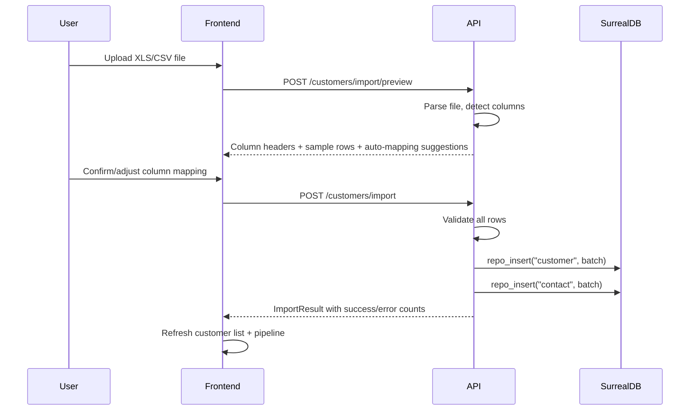

# CRM Schema Extension — Comprehensive Design Document

> **Version:** 1.0-DRAFT  
> **Date:** 2026-05-25  
> **Author:** Primary Designer  
> **Status:** Awaiting Review

---

## Table of Contents

1. [Executive Summary](#1-executive-summary)
2. [Current State Analysis](#2-current-state-analysis)
3. [Extended Customer Schema](#3-extended-customer-schema)
4. [Contact Entity Design](#4-contact-entity-design)
5. [New Kanban Stages for Import Workflow](#5-new-kanban-stages-for-import-workflow)
6. [Bulk Import API Design](#6-bulk-import-api-design)
7. [Export API Design](#7-export-api-design)
8. [Frontend Component Plan](#8-frontend-component-plan)
9. [Migration Strategy](#9-migration-strategy)
10. [Risks & Mitigations](#10-risks--mitigations)
11. [Decision Log](#11-decision-log)

---

## 1. Executive Summary

This document extends Notebook Tetrel's basic `customer` table (8 fields, SCHEMALESS) into a real CRM system capable of:

- **Managing 100s of customers** with full address, classification, sales, and engagement fields
- **First-class Contact entities** with cross-customer search, deduplication, and activity tracking
- **Bulk importing 140+ contacts** from XLS/CSV with validation and column mapping
- **Two new Kanban stages** (`bulk_import`, `data_enrichment`) for imported record triage
- **Data table components** with sorting, filtering, pagination, and bulk actions
- **Full import/export workflows** for interoperability with external systems

### Key Constraints

| Constraint | Impact |
|---|---|
| Customer table is `SCHEMALESS` (migration 15) | New fields are additive — existing records remain valid |
| Stage is a free string (not enum) | New stages work immediately, no schema change needed |
| `repo_insert(table, data_list)` already exists | Bulk import backend is partially ready |
| Pipeline automation uses string equality | Must add `bulk_import`/`data_enrichment` to `STAGE_COMPLIANCE` |
| `STAGE_COMPLIANCE` is missing `technical_discovery` | Existing bug to fix simultaneously |
| `Notebook.customer_id` is a plain string FK | No SurrealDB record link — must handle ID format carefully |

---

## 2. Current State Analysis

### 2.1 Customer Table — What Exists Today

```
DEFINE TABLE IF NOT EXISTS customer SCHEMALESS;  -- migration 15
```

The Customer has **no domain model class** (no `ObjectModel` subclass). The API router (`api/routers/customers.py`) uses raw `repo_create`, `repo_update`, `repo_query`, and `repo_delete` calls against dicts. Pydantic models `CustomerCreate`, `CustomerUpdate`, and `CustomerResponse` in `api/models.py` define the API contract but not the DB schema.

**Current fields:** `name`, `website`, `description`, `industry`, `primary_sector`, `sectors`, `assigned_frameworks`, `contacts`

### 2.2 Notebook (Deal) — Pipeline Stage System

```python
# api/routers/notebooks.py, line 261-263
if stage_changed and new_stage:
    from open_notebook.domain.pipeline_worker import run_pipeline_automation
    background_tasks.add_task(run_pipeline_automation, notebook.id, new_stage)
```

The pipeline worker fires `run_pipeline_automation(notebook_id, stage)` on every stage change. It fetches all `PipelineRule` records, filters where `rule.stage == stage and rule.is_active`, then executes crawl/search actions. This is pure string matching — any new stage value "just works" as long as there are matching rules (or no rules, in which case it's a no-op).

### 2.3 STAGE_COMPLIANCE Bug

```python
# api/routers/customers.py, line 22-27
STAGE_COMPLIANCE = {
    "lead": 15.0,
    "research": 45.0,
    # MISSING: "technical_discovery": 60.0  ← BUG
    "proposal": 75.0,
    "won": 100.0
}
```

`technical_discovery` notebooks currently score `0.0` in compliance progress calculations. This should be fixed as part of this work.

---

## 3. Extended Customer Schema

### 3.1 New Field Inventory

All new fields are **optional** (`Option<T>` / nullable) so existing records remain valid in the SCHEMALESS table. Fields are grouped by category.

#### Address Fields

| Field | Type | Default | Description |
|---|---|---|---|
| `street_address` | `option<string>` | `""` | Street address line 1 |
| `street_address_2` | `option<string>` | `""` | Suite, unit, floor |
| `city` | `option<string>` | `""` | City |
| `state` | `option<string>` | `""` | State/province (2-letter code for US) |
| `postal_code` | `option<string>` | `""` | ZIP/postal code |
| `country` | `option<string>` | `"US"` | ISO 3166-1 alpha-2 country code |

#### Communication Fields

| Field | Type | Default | Description |
|---|---|---|---|
| `phone` | `option<string>` | `""` | Main phone number |
| `phone_alt` | `option<string>` | `""` | Alternative phone |
| `fax` | `option<string>` | `""` | Fax number |
| `email` | `option<string>` | `""` | General company email |

#### Sales / Ownership Fields

| Field | Type | Default | Description |
|---|---|---|---|
| `salesperson` | `option<string>` | `""` | Assigned sales rep name |
| `lead_source` | `option<string>` | `""` | How lead was acquired (referral, conference, cold, import, etc.) |
| `annual_revenue` | `option<float>` | `null` | Annual revenue in USD |
| `employee_count` | `option<int>` | `null` | Number of employees |

#### Classification Fields

| Field | Type | Default | Description |
|---|---|---|---|
| `customer_type` | `option<string>` | `"prospect"` | One of: `prospect`, `client`, `partner`, `vendor` |
| `tier` | `option<string>` | `"smb"` | One of: `enterprise`, `mid_market`, `smb` |
| `status` | `option<string>` | `"active"` | One of: `active`, `inactive`, `churned` |

#### Engagement Fields

| Field | Type | Default | Description |
|---|---|---|---|
| `last_contact_date` | `option<datetime>` | `null` | Last interaction timestamp |
| `next_followup` | `option<datetime>` | `null` | Scheduled next action |
| `engagement_score` | `option<int>` | `0` | Computed 0-100 engagement score |

#### Social / Web Fields

| Field | Type | Default | Description |
|---|---|---|---|
| `linkedin_url` | `option<string>` | `""` | Company LinkedIn page |
| `twitter_url` | `option<string>` | `""` | Company X/Twitter handle or URL |
| `facebook_url` | `option<string>` | `""` | Company Facebook page |

#### Metadata Fields

| Field | Type | Default | Description |
|---|---|---|---|
| `tags` | `option<array<string>>` | `[]` | Freeform tags/labels for filtering |
| `internal_notes` | `option<string>` | `""` | Private notes (not customer-facing) |
| `import_batch_id` | `option<string>` | `null` | Links customer to a specific import job |
| `import_source` | `option<string>` | `null` | Source file name if imported |

### 3.2 Updated Pydantic Models

```python
# api/models.py — CustomerCreate additions

class CustomerCreate(BaseModel):
    # === Existing fields (unchanged) ===
    name: str = Field(..., description="Name of the customer company")
    website: Optional[str] = Field("", description="Website URL")
    description: Optional[str] = Field("", description="Description")
    industry: Optional[str] = Field("", description="Industry sector")
    primary_sector: Optional[str] = Field("", description="Primary CISA sector")
    sectors: Optional[List[str]] = Field(default_factory=list)
    assigned_frameworks: Optional[List[str]] = Field(default_factory=list)
    contacts: Optional[List[Dict[str, str]]] = Field(default_factory=list)
    
    # === NEW: Address ===
    street_address: Optional[str] = Field("", description="Street address")
    street_address_2: Optional[str] = Field("", description="Suite/unit")
    city: Optional[str] = Field("", description="City")
    state: Optional[str] = Field("", description="State/province")
    postal_code: Optional[str] = Field("", description="ZIP/postal code")
    country: Optional[str] = Field("US", description="ISO country code")
    
    # === NEW: Communication ===
    phone: Optional[str] = Field("", description="Main phone")
    phone_alt: Optional[str] = Field("", description="Alt phone")
    fax: Optional[str] = Field("", description="Fax number")
    email: Optional[str] = Field("", description="Company email")
    
    # === NEW: Sales ===
    salesperson: Optional[str] = Field("", description="Sales rep")
    lead_source: Optional[str] = Field("", description="Lead source")
    annual_revenue: Optional[float] = Field(None, description="Annual revenue USD")
    employee_count: Optional[int] = Field(None, description="Employee count")
    
    # === NEW: Classification ===
    customer_type: Optional[str] = Field("prospect")
    tier: Optional[str] = Field("smb")
    status: Optional[str] = Field("active")
    
    # === NEW: Engagement ===
    last_contact_date: Optional[str] = Field(None, description="ISO datetime")
    next_followup: Optional[str] = Field(None, description="ISO datetime")
    engagement_score: Optional[int] = Field(0)
    
    # === NEW: Social ===
    linkedin_url: Optional[str] = Field("")
    twitter_url: Optional[str] = Field("")
    facebook_url: Optional[str] = Field("")
    
    # === NEW: Metadata ===
    tags: Optional[List[str]] = Field(default_factory=list)
    internal_notes: Optional[str] = Field("")
    import_batch_id: Optional[str] = Field(None)
    import_source: Optional[str] = Field(None)
```

### 3.3 Why Not Create a Customer Domain Model?

The Customer table is SCHEMALESS with no `ObjectModel` subclass today. The API uses raw repo calls. We have two choices:

1. **Keep raw repo calls** (lower risk, consistent with current pattern)
2. **Create `Customer(ObjectModel)`** (better long-term, enables `save()`/`get()`/`get_all()`)

**Recommendation:** Create a `Customer(ObjectModel)` domain class. This enables:
- Type safety on the domain layer
- Reuse of `ObjectModel.save()`, `get()`, `get_all()`
- Future methods like `customer.get_contacts()`, `customer.get_notebooks()`
- Consistent with every other entity (Notebook, Source, Note, etc.)

See **Decision D1** in the Decision Log.

---

## 4. Contact Entity Design

### 4.1 The Problem

Contacts are currently nested JSON arrays inside both `customer.contacts` and `notebook.contacts`:

```json
[
  {"name": "John Doe", "title": "CTO", "email": "john@example.com"},
  {"name": "Jane Smith", "role": "CISO", "email": "jane@example.com"}
]
```

Problems with this approach:
1. **No cross-customer search** — can't find "all CTOs across all customers"
2. **No deduplication** — same person at two companies is two separate dicts
3. **No activity tracking** — no way to track interaction history per contact
4. **Inconsistent schema** — `title` vs `role` naming varies
5. **Scale concerns** — 500 customers × 5-10 contacts = 5000 nested dicts to scan

### 4.2 Recommended Design: First-Class `contact` Table

Create a new `contact` table as a first-class SurrealDB entity.

#### Contact Schema

| Field | Type | Required | Description |
|---|---|---|---|
| `id` | `record<contact>` | auto | SurrealDB record ID |
| `first_name` | `string` | ✅ | First name |
| `last_name` | `string` | ✅ | Last name |
| `email` | `option<string>` | ❌ | Email address |
| `phone` | `option<string>` | ❌ | Direct phone |
| `mobile` | `option<string>` | ❌ | Mobile phone |
| `title` | `option<string>` | ❌ | Job title (normalized from `title`/`role`) |
| `department` | `option<string>` | ❌ | Department (Engineering, Security, etc.) |
| `seniority` | `option<string>` | ❌ | C-level, VP, Director, Manager, Individual |
| `linkedin_url` | `option<string>` | ❌ | Personal LinkedIn |
| `customer_id` | `option<string>` | ❌ | FK to customer (primary association) |
| `status` | `option<string>` | ❌ | active, inactive, bounced |
| `tags` | `option<array<string>>` | ❌ | Freeform tags |
| `notes` | `option<string>` | ❌ | Private notes about this contact |
| `last_contacted` | `option<datetime>` | ❌ | Last interaction |
| `source` | `option<string>` | ❌ | How acquired (import, manual, scraped) |
| `import_batch_id` | `option<string>` | ❌ | Ties to import job |
| `created` | `datetime` | auto | Created timestamp |
| `updated` | `datetime` | auto | Updated timestamp |

#### Contact Domain Model

```python
# open_notebook/domain/contact.py
from typing import ClassVar, List, Optional
from open_notebook.domain.base import ObjectModel

class Contact(ObjectModel):
    table_name: ClassVar[str] = "contact"
    first_name: str
    last_name: str
    email: Optional[str] = ""
    phone: Optional[str] = ""
    mobile: Optional[str] = ""
    title: Optional[str] = ""
    department: Optional[str] = ""
    seniority: Optional[str] = ""
    linkedin_url: Optional[str] = ""
    customer_id: Optional[str] = None
    status: Optional[str] = "active"
    tags: Optional[List[str]] = []
    notes: Optional[str] = ""
    last_contacted: Optional[str] = None
    source: Optional[str] = "manual"
    import_batch_id: Optional[str] = None

    @property
    def full_name(self) -> str:
        return f"{self.first_name} {self.last_name}".strip()
```

#### Relationship to Customer

We use `customer_id` as a simple string FK (consistent with how `notebook.customer_id` works). This avoids the complexity of SurrealDB record links while maintaining queryability:

```sql
-- Get all contacts for a customer
SELECT * FROM contact WHERE customer_id = $customer_id ORDER BY last_name ASC;

-- Search contacts across ALL customers
SELECT * FROM contact WHERE email CONTAINS $search OR first_name CONTAINS $search;

-- Find duplicate emails
SELECT email, count() AS cnt FROM contact GROUP BY email HAVING cnt > 1;
```

### 4.3 Migration Path for Existing Nested Contacts

Existing `customer.contacts` arrays will be preserved (not deleted) during migration. A one-time migration script will:

1. Read each customer's `contacts` array
2. Parse each contact dict, splitting `name` → `first_name` + `last_name`
3. Normalize `title` / `role` → `title`
4. Create `contact` records with `customer_id` set
5. Existing `contacts` arrays remain as a backup field

The `customer.contacts` field will be deprecated but not removed (SCHEMALESS means it costs nothing).

### 4.4 Notebook Contact References

`notebook.contacts` and `notebook.suggested_contacts` will continue to store inline dicts for now. When a Notebook is associated with a Customer, the UI will show the Customer's first-class contacts. The inline `suggested_contacts` (AI-discovered) can be "promoted" to first-class contacts via a UI action.

See **Decision D2** in the Decision Log.

---

## 5. New Kanban Stages for Import Workflow

### 5.1 Stage Design

Two new stages are prepended to the pipeline, before `lead`:

| Stage ID | Display Label | Color | Position | Description |
|---|---|---|---|---|
| `bulk_import` | Bulk Import | `slate-500` | 0 (leftmost) | Raw imported records, needs triage |
| `data_enrichment` | Data Enrichment | `orange-500` | 1 | Being validated/enriched |
| `lead` | Leads Prospecting | `amber-500` | 2 | (existing) |
| `research` | Client Research | `cyan-500` | 3 | (existing) |
| `technical_discovery` | Technical Discovery | `blue-500` | 4 | (existing) |
| `proposal` | Proposal Drafts | `violet-500` | 5 | (existing) |
| `won` | Contract Won | `emerald-500` | 6 | (existing) |

### 5.2 Pipeline Automation for New Stages

The new stages integrate with the existing `run_pipeline_automation` system:

**`bulk_import` stage:**
- No automatic pipeline rules by default
- Serves as a "parking lot" for imported records
- User manually reviews and promotes to `data_enrichment` or `lead`

**`data_enrichment` stage:**
- Default pipeline rule: `action_type=crawl` using `prospect_website` (if set)
- Default pipeline rule: `action_type=search` for company intelligence
- This automatically researches newly promoted records

### 5.3 STAGE_COMPLIANCE Update

```python
STAGE_COMPLIANCE = {
    "bulk_import": 0.0,           # NEW
    "data_enrichment": 5.0,       # NEW
    "lead": 15.0,
    "research": 45.0,
    "technical_discovery": 60.0,  # BUG FIX — was missing
    "proposal": 75.0,
    "won": 100.0
}
```

### 5.4 Frontend Kanban Changes

The KanbanBoard component needs the following changes:

1. Add `bulk_import` and `data_enrichment` to the `columns` array
2. Add to `boardData` state initialization
3. Add to `categorized` and `rollback` objects in `useEffect`
4. Add to `columnTotals` initialization
5. Update grid layout: `lg:grid-cols-4` → `lg:grid-cols-5` (with horizontal scroll for 7 columns) or use a scrollable container

**Layout strategy:** With 7 columns, a fixed grid won't fit. Use a horizontal scroll container:

```tsx
<div className="flex gap-4 overflow-x-auto items-start h-[calc(100vh-270px)] min-w-max pb-4">
  {columns.map((col) => (
    <div key={col.id} className="w-[280px] shrink-0 flex flex-col ...">
```

### 5.5 Visual Differentiation

Import stages are visually distinct from active sales stages:

- `bulk_import` uses a dashed border and muted background
- `data_enrichment` uses an orange indicator
- A subtle separator line between `data_enrichment` and `lead` columns
- Import stage cards show an "imported" badge with source file info

See **Decision D3** in the Decision Log.

---

## 6. Bulk Import API Design

### 6.1 Import Flow Overview



### 6.2 API Endpoints

#### `POST /customers/import/preview`

Parses the uploaded file and returns column detection + auto-mapping suggestions.

**Request:** `multipart/form-data`
```
file: <binary XLS/CSV>
```

**Response:**
```json
{
  "file_name": "acme_contacts.xlsx",
  "total_rows": 142,
  "columns": ["Company Name", "Contact Name", "Email", "Phone", "City", "State"],
  "sample_rows": [
    ["Acme Corp", "John Doe", "john@acme.com", "555-0100", "Austin", "TX"],
    ["Beta Inc", "Jane Smith", "jane@beta.io", "555-0200", "Denver", "CO"]
  ],
  "suggested_mapping": {
    "Company Name": "name",
    "Contact Name": "contact_name",
    "Email": "email",
    "Phone": "phone",
    "City": "city",
    "State": "state"
  },
  "available_customer_fields": [
    "name", "website", "description", "industry", "phone", "email",
    "street_address", "city", "state", "postal_code", "country",
    "salesperson", "lead_source", "customer_type", "tier", "tags"
  ],
  "available_contact_fields": [
    "first_name", "last_name", "contact_name", "email", "phone",
    "mobile", "title", "department", "seniority", "linkedin_url"
  ]
}
```

**Auto-mapping strategy:** Fuzzy match column headers against known field names:
- `"Company"`, `"Company Name"`, `"Organization"` → `name`
- `"Email"`, `"E-mail"`, `"Email Address"` → `email`
- `"Phone"`, `"Phone Number"`, `"Tel"` → `phone`
- `"State"`, `"Province"`, `"Region"` → `state`
- `"Contact"`, `"Contact Name"`, `"Full Name"` → `contact_name`

#### `POST /customers/import`

Executes the import with validated column mapping.

**Request:**
```json
{
  "file_name": "acme_contacts.xlsx",
  "column_mapping": {
    "Company Name": "name",
    "Contact Name": "contact_name",
    "Email": "contact_email",
    "Phone": "phone",
    "City": "city",
    "State": "state"
  },
  "options": {
    "create_notebooks": true,
    "notebook_stage": "bulk_import",
    "default_customer_type": "prospect",
    "default_tier": "smb",
    "default_lead_source": "csv_import",
    "duplicate_strategy": "skip",
    "tags": ["imported-2026-05-25"]
  }
}
```

**Duplicate strategy options:**
- `skip` — skip rows where a customer with the same `name` already exists
- `update` — merge new fields into existing customer record
- `create` — always create new records (may create duplicates)

**Response:**
```json
{
  "batch_id": "import_2026_05_25_abc123",
  "total_rows": 142,
  "customers_created": 98,
  "customers_updated": 12,
  "customers_skipped": 5,
  "contacts_created": 142,
  "notebooks_created": 98,
  "errors": [
    {
      "row": 27,
      "field": "name",
      "error": "Name is required but was empty",
      "data": {"Email": "unknown@example.com", "Phone": "555-0300"}
    }
  ],
  "warnings": [
    {
      "row": 45,
      "field": "email",
      "warning": "Duplicate email detected: john@acme.com",
      "data": {"Company Name": "Acme Corp", "Contact Name": "John Doe"}
    }
  ]
}
```

### 6.3 Backend Implementation

#### File Parsing

```python
# api/routers/import_export.py

import csv
import io
from typing import List, Dict
from openpyxl import load_workbook  # For .xlsx

async def parse_upload(file: UploadFile) -> Tuple[List[str], List[List[str]]]:
    """Parse CSV or XLSX into headers + rows."""
    content = await file.read()
    
    if file.filename.endswith(('.xlsx', '.xls')):
        wb = load_workbook(io.BytesIO(content), read_only=True)
        ws = wb.active
        rows = list(ws.iter_rows(values_only=True))
        headers = [str(h or "").strip() for h in rows[0]]
        data_rows = [[str(cell or "").strip() for cell in row] for row in rows[1:]]
    else:
        # CSV
        text = content.decode('utf-8-sig')  # Handle BOM
        reader = csv.reader(io.StringIO(text))
        rows = list(reader)
        headers = [h.strip() for h in rows[0]]
        data_rows = [[cell.strip() for cell in row] for row in rows[1:]]
    
    return headers, data_rows
```

#### Bulk Insert Using Existing Infrastructure

```python
# Uses existing repo_insert for batch operations

async def execute_import(rows: List[Dict], mapping: Dict, options: Dict):
    batch_id = f"import_{datetime.now().strftime('%Y%m%d_%H%M%S')}_{uuid4().hex[:6]}"
    
    customer_batch = []
    contact_batch = []
    notebook_batch = []
    errors = []
    
    for i, row in enumerate(rows):
        try:
            customer_data = map_row_to_customer(row, mapping, options, batch_id)
            if not customer_data.get("name"):
                errors.append({"row": i+2, "field": "name", "error": "Name required"})
                continue
            
            # Duplicate detection
            if options.get("duplicate_strategy") == "skip":
                existing = await repo_query(
                    "SELECT id FROM customer WHERE name = $name LIMIT 1",
                    {"name": customer_data["name"]}
                )
                if existing:
                    continue
            
            customer_batch.append(customer_data)
            
            # Extract contact if mapping includes contact fields
            contact_data = map_row_to_contact(row, mapping, batch_id)
            if contact_data:
                contact_batch.append(contact_data)
                
        except Exception as e:
            errors.append({"row": i+2, "error": str(e)})
    
    # Batch insert using existing repo_insert
    created_customers = await repo_insert("customer", customer_batch)
    
    # Link contacts to their customers
    for contact, customer in zip(contact_batch, created_customers):
        contact["customer_id"] = str(customer["id"])
    created_contacts = await repo_insert("contact", contact_batch)
    
    # Optionally create notebooks for each customer
    if options.get("create_notebooks"):
        for customer in created_customers:
            notebook_batch.append({
                "name": f"Deal: {customer['name']}",
                "description": f"Auto-created from import batch {batch_id}",
                "stage": options.get("notebook_stage", "bulk_import"),
                "client_name": customer["name"],
                "customer_id": str(customer["id"]),
                "prospect_website": customer.get("website", ""),
                "estimated_value": 0.0,
            })
        await repo_insert("notebook", notebook_batch)
    
    return ImportResult(...)
```

### 6.4 Dependencies Required

```toml
# pyproject.toml additions
openpyxl = ">=3.1"     # XLSX reading/writing
```

No additional frontend deps are needed yet — the file upload uses native `<input type="file">` and `FormData`. XLS parsing happens server-side only.

See **Decision D4** in the Decision Log.

---

## 7. Export API Design

### 7.1 Endpoints

#### `GET /customers/export?format=csv`

**Query Parameters:**
- `format`: `csv` or `xlsx` (default: `csv`)
- `filters`: Optional JSON string for filtering (e.g., `{"status":"active","tier":"enterprise"}`)
- `include_contacts`: `true` to embed contacts as additional columns

**Response:** Binary file download with `Content-Disposition: attachment; filename="customers_export_2026-05-25.csv"`

#### `GET /contacts/export?format=csv`

Same pattern for contact-only exports.

### 7.2 Export Format

**CSV columns (Customer):**
```
Name,Website,Industry,Phone,Email,Street Address,City,State,Postal Code,Country,
Salesperson,Lead Source,Customer Type,Tier,Status,Annual Revenue,Employee Count,
LinkedIn URL,Tags,Created,Updated
```

**CSV columns (Contacts):**
```
First Name,Last Name,Email,Phone,Mobile,Title,Department,Seniority,
Company Name,LinkedIn URL,Status,Tags,Created,Updated
```

---

## 8. Frontend Component Plan

### 8.1 Component Hierarchy

```
frontend/src/
├── components/
│   ├── data-table/                    # NEW — Reusable data table
│   │   ├── DataTable.tsx              # Core table with sorting/filtering/pagination
│   │   ├── DataTableToolbar.tsx       # Search, filter dropdowns, bulk actions
│   │   ├── DataTablePagination.tsx    # Page nav, page size selector
│   │   ├── DataTableColumnHeader.tsx  # Sortable column header
│   │   └── DataTableRowActions.tsx    # Per-row action menu
│   │
│   ├── import/                        # NEW — Import wizard
│   │   ├── ImportWizard.tsx           # Multi-step wizard container
│   │   ├── UploadStep.tsx             # File drag-drop upload
│   │   ├── MappingStep.tsx            # Column mapping UI
│   │   ├── PreviewStep.tsx            # Preview import results
│   │   ├── ImportProgress.tsx         # Progress bar during import
│   │   └── ImportResults.tsx          # Success/error summary
│   │
│   ├── customers/                     # ENHANCED — Customer management
│   │   ├── CustomerForm.tsx           # Create/edit form with all new fields
│   │   ├── CustomerCard.tsx           # Summary card for lists
│   │   └── ContactsPanel.tsx          # Contact list within customer detail
│   │
│   └── contacts/                      # NEW — Contact management
│       ├── ContactForm.tsx            # Create/edit contact
│       ├── ContactCard.tsx            # Contact summary card
│       └── ContactSearchDialog.tsx    # Global contact search
│
├── lib/
│   ├── api/
│   │   ├── customers.ts              # ENHANCED — add import/export endpoints
│   │   └── contacts.ts               # NEW — CRUD for contacts
│   │
│   ├── hooks/
│   │   ├── use-customers.ts           # NEW — TanStack Query hooks for customers
│   │   ├── use-contacts.ts            # NEW — TanStack Query hooks for contacts
│   │   └── use-import.ts              # NEW — Import wizard state management
│   │
│   └── types/
│       ├── customer.ts                # NEW — Shared customer types
│       └── contact.ts                 # NEW — Shared contact types
│
└── app/(dashboard)/
    ├── customers/
    │   ├── page.tsx                    # REWRITE — DataTable with filters/sort/bulk
    │   └── [id]/
    │       └── page.tsx               # ENHANCE — Add new field sections
    └── contacts/
        └── page.tsx                   # NEW — Global contact directory
```

### 8.2 DataTable Component (Priority: High)

The DataTable is the highest-impact reusable component. Use `@tanstack/react-table` (not yet installed — needs `npm install`).

**Features:**
- Server-side sorting and filtering (passed as query params)
- Client-side pagination (all data loaded, paginated locally)
- Column visibility toggles
- Multi-row selection with checkboxes
- Bulk action toolbar (delete, change status, add tag, export selected)
- Sticky header with scrollable body
- Responsive: table on desktop, card list on mobile

**Key implementation pattern:**

```tsx
// Simplified DataTable usage in customers/page.tsx
<DataTable
  data={customers}
  columns={customerColumns}
  filterableColumns={[
    { id: "status", title: "Status", options: ["active", "inactive", "churned"] },
    { id: "tier", title: "Tier", options: ["enterprise", "mid_market", "smb"] },
    { id: "customer_type", title: "Type", options: ["prospect", "client", "partner"] },
    { id: "industry", title: "Industry" },
  ]}
  searchableColumns={[
    { id: "name", title: "Company" },
    { id: "email", title: "Email" },
  ]}
  bulkActions={[
    { label: "Delete", action: handleBulkDelete, variant: "destructive" },
    { label: "Change Status", action: handleBulkStatusChange },
    { label: "Export Selected", action: handleExportSelected },
  ]}
/>
```

### 8.3 Import Wizard Component

4-step wizard using shadcn/ui `Dialog` + custom step navigation:

**Step 1: Upload**
- Drag-and-drop zone (`react-dropzone` — needs install)
- Accepts `.csv`, `.xlsx`, `.xls`
- File size limit: 10MB
- Shows file info after upload

**Step 2: Column Mapping**
- Two-column layout: source columns (left) → target fields (right)
- Auto-suggests mappings based on header names
- Dropdown selectors for each column
- "Skip this column" option
- Preview of first 3 rows next to each mapping

**Step 3: Options**
- Create notebooks checkbox
- Default stage selector
- Duplicate strategy radio (skip/update/create)
- Default tags input
- Default customer type / tier dropdowns

**Step 4: Preview & Execute**
- Summary: "X customers will be created, Y contacts extracted"
- Validation warnings shown
- "Start Import" button
- Progress bar during execution
- Final results with error download

### 8.4 Customer Detail Page Enhancements

The `[id]/page.tsx` customer detail page gets organized into tabbed sections:

```
┌─ Overview ─────── Contacts ─────── Deals ─────── Activity ─────── Settings ──┐
│                                                                                │
│  [Overview Tab]                                                                │
│  ┌─ Company Info ──────┐  ┌─ Address ──────────────┐                           │
│  │ Name: Acme Corp     │  │ 123 Main St, Suite 400 │                           │
│  │ Website: acme.com   │  │ Austin, TX 78701       │                           │
│  │ Industry: Energy    │  │ United States          │                           │
│  │ Phone: 555-0100     │  │                        │                           │
│  └─────────────────────┘  └────────────────────────┘                           │
│  ┌─ Classification ───┐  ┌─ Sales ────────────────┐                           │
│  │ Type: Client        │  │ Salesperson: J. Smith  │                           │
│  │ Tier: Enterprise    │  │ Lead Source: Referral  │                           │
│  │ Status: Active      │  │ Revenue: $50M          │                           │
│  └─────────────────────┘  │ Employees: 500         │                           │
│                            └────────────────────────┘                           │
│                                                                                │
│  [Contacts Tab]                                                                │
│  DataTable of contacts for this customer                                       │
│  + Add Contact button                                                          │
│                                                                                │
│  [Deals Tab]                                                                   │
│  List of Notebooks linked via customer_id                                      │
│                                                                                │
└────────────────────────────────────────────────────────────────────────────────┘
```

### 8.5 New Dependencies Required

```json
// package.json additions
{
  "@tanstack/react-table": "^8.x",
  "react-dropzone": "^14.x"
}
```

Note: `papaparse` is NOT needed — CSV parsing is done server-side in Python. `xlsx` npm package is NOT needed — XLSX parsing is done server-side with `openpyxl`.

---

## 9. Migration Strategy

### 9.1 SurrealDB Migration (Migration 18)

```sql
-- Migration 18: CRM Schema Extension — Contact table and customer field indexes

-- ================================================================
-- 1. Contact table (SCHEMAFULL for data integrity)
-- ================================================================
DEFINE TABLE IF NOT EXISTS contact SCHEMAFULL;

DEFINE FIELD IF NOT EXISTS first_name ON TABLE contact TYPE string;
DEFINE FIELD IF NOT EXISTS last_name ON TABLE contact TYPE string;
DEFINE FIELD IF NOT EXISTS email ON TABLE contact TYPE option<string>;
DEFINE FIELD IF NOT EXISTS phone ON TABLE contact TYPE option<string>;
DEFINE FIELD IF NOT EXISTS mobile ON TABLE contact TYPE option<string>;
DEFINE FIELD IF NOT EXISTS title ON TABLE contact TYPE option<string>;
DEFINE FIELD IF NOT EXISTS department ON TABLE contact TYPE option<string>;
DEFINE FIELD IF NOT EXISTS seniority ON TABLE contact TYPE option<string>;
DEFINE FIELD IF NOT EXISTS linkedin_url ON TABLE contact TYPE option<string>;
DEFINE FIELD IF NOT EXISTS customer_id ON TABLE contact TYPE option<string>;
DEFINE FIELD IF NOT EXISTS status ON TABLE contact TYPE option<string> DEFAULT 'active';
DEFINE FIELD IF NOT EXISTS tags ON TABLE contact TYPE option<array<string>>;
DEFINE FIELD IF NOT EXISTS notes ON TABLE contact TYPE option<string>;
DEFINE FIELD IF NOT EXISTS last_contacted ON TABLE contact TYPE option<datetime>;
DEFINE FIELD IF NOT EXISTS source ON TABLE contact TYPE option<string> DEFAULT 'manual';
DEFINE FIELD IF NOT EXISTS import_batch_id ON TABLE contact TYPE option<string>;
DEFINE FIELD IF NOT EXISTS created ON TABLE contact TYPE option<datetime> DEFAULT time::now();
DEFINE FIELD IF NOT EXISTS updated ON TABLE contact TYPE option<datetime> DEFAULT time::now();

-- Contact indexes
DEFINE INDEX IF NOT EXISTS idx_contact_customer ON TABLE contact FIELDS customer_id;
DEFINE INDEX IF NOT EXISTS idx_contact_email ON TABLE contact FIELDS email;
DEFINE INDEX IF NOT EXISTS idx_contact_name ON TABLE contact FIELDS last_name, first_name;
DEFINE INDEX IF NOT EXISTS idx_contact_batch ON TABLE contact FIELDS import_batch_id;

-- ================================================================
-- 2. Customer table indexes (table stays SCHEMALESS)
-- ================================================================
-- Customer table stays SCHEMALESS — new fields are just written
-- We add indexes for the most-queried fields
DEFINE INDEX IF NOT EXISTS idx_customer_name ON TABLE customer FIELDS name;
DEFINE INDEX IF NOT EXISTS idx_customer_status ON TABLE customer FIELDS status;
DEFINE INDEX IF NOT EXISTS idx_customer_type ON TABLE customer FIELDS customer_type;
DEFINE INDEX IF NOT EXISTS idx_customer_tier ON TABLE customer FIELDS tier;
DEFINE INDEX IF NOT EXISTS idx_customer_salesperson ON TABLE customer FIELDS salesperson;
DEFINE INDEX IF NOT EXISTS idx_customer_batch ON TABLE customer FIELDS import_batch_id;
```

### 9.2 Down Migration (18_down.surrealql)

```sql
-- Rollback migration 18
REMOVE TABLE IF EXISTS contact;

REMOVE INDEX IF EXISTS idx_customer_name ON TABLE customer;
REMOVE INDEX IF EXISTS idx_customer_status ON TABLE customer;
REMOVE INDEX IF EXISTS idx_customer_type ON TABLE customer;
REMOVE INDEX IF EXISTS idx_customer_tier ON TABLE customer;
REMOVE INDEX IF EXISTS idx_customer_salesperson ON TABLE customer;
REMOVE INDEX IF EXISTS idx_customer_batch ON TABLE customer;
```

### 9.3 Existing Data Compatibility

Because the `customer` table is SCHEMALESS:
- **No breaking changes** — existing records don't need updating
- **New fields are additive** — `customer_type`, `status`, etc. will be `null` for old records
- **API response handling** — use `.get(field, default)` pattern already in place in `customers.py`
- **Frontend guards** — use `customer.phone || ""` pattern for all new fields

### 9.4 One-Time Contact Migration Script

Run after migration 18 to extract existing nested contacts:

```python
# scripts/migrate_contacts.py
async def migrate_nested_contacts():
    """Extract customer.contacts arrays into first-class contact records."""
    customers = await repo_query("SELECT id, name, contacts FROM customer WHERE contacts != NONE;")
    
    contact_batch = []
    for cust in customers:
        for c in (cust.get("contacts") or []):
            name_parts = (c.get("name") or "").split(" ", 1)
            contact_batch.append({
                "first_name": name_parts[0] if name_parts else "",
                "last_name": name_parts[1] if len(name_parts) > 1 else "",
                "email": c.get("email", ""),
                "title": c.get("title") or c.get("role", ""),
                "customer_id": str(cust["id"]),
                "source": "migration",
                "status": "active",
            })
    
    if contact_batch:
        await repo_insert("contact", contact_batch, ignore_duplicates=True)
        logger.info(f"Migrated {len(contact_batch)} contacts from {len(customers)} customers")
```

### 9.5 STAGE_COMPLIANCE Fix

Applied in `api/routers/customers.py`:

```python
STAGE_COMPLIANCE = {
    "bulk_import": 0.0,
    "data_enrichment": 5.0,
    "lead": 15.0,
    "research": 45.0,
    "technical_discovery": 60.0,  # BUG FIX
    "proposal": 75.0,
    "won": 100.0
}
```

---

## 10. Risks & Mitigations

| Risk | Severity | Mitigation |
|---|---|---|
| Large imports (1000+ rows) timeout on HTTP | High | Batch in chunks of 100; consider async import with job tracking |
| SCHEMALESS customer table allows invalid data | Medium | Pydantic validation at API layer; add field validators |
| Duplicate customers from imports | Medium | Pre-import dedup check by `name`; fuzzy matching as future enhancement |
| Nested contacts still referenced in pipeline worker | Medium | Pipeline worker's `suggested_contacts` stays inline; first-class contacts are separate |
| Frontend bundle size increase from @tanstack/react-table | Low | Tree-shakeable; adds ~20KB gzipped |
| 7 Kanban columns on small screens | Medium | Horizontal scroll container with snap-to-column behavior |

---

## 11. Decision Log

### D1 — Customer Domain Model

| | |
|---|---|
| **Decision** | Create `Customer(ObjectModel)` domain class |
| **Alternatives** | (A) Keep raw repo calls as-is; (B) Create domain class |
| **Chosen** | **(B) Create domain class** |
| **Rationale** | Every other entity (Notebook, Source, Note, ChatSession, PipelineRule, SourceInsight, Credential) uses `ObjectModel`. Customer is the only entity that bypasses the domain layer and uses raw repo calls from the API router. This is inconsistent and limits future extensibility (can't add methods like `customer.get_contacts()`, `customer.get_notebooks()`). The SCHEMALESS table is compatible with `ObjectModel` — the `save()` method uses `model_dump()` which will include all new fields. |
| **Risk** | Low. `ObjectModel` is well-tested with 7+ subclasses. |
| **Status** | PROPOSED |

### D2 — Contact Storage Architecture

| | |
|---|---|
| **Decision** | First-class `contact` table (SCHEMAFULL) |
| **Alternatives** | (A) Keep nested arrays in customer; (B) First-class table with string FK; (C) First-class table with SurrealDB record links |
| **Chosen** | **(B) First-class table with string FK** |
| **Rationale** | (A) doesn't support cross-customer search, deduplication, or activity tracking — which are all explicit requirements. (C) would be cleaner in SurrealDB but inconsistent with how `notebook.customer_id` works (it's a plain string, not a record link). Using string FKs keeps the pattern consistent and avoids a refactor of the existing customer-notebook linkage. The `contact` table is SCHEMAFULL because contacts are structured data with required fields (`first_name`, `last_name`), unlike the SCHEMALESS customer table which needs flexibility for varied import data. |
| **Risk** | Medium. No referential integrity enforcement — orphaned contacts possible if customer deleted without cleanup. Mitigation: add cleanup logic to `delete_customer` endpoint. |
| **Status** | PROPOSED |

### D3 — New Kanban Stages Placement

| | |
|---|---|
| **Decision** | Prepend `bulk_import` and `data_enrichment` before `lead` |
| **Alternatives** | (A) Prepend before lead; (B) Append after won; (C) Separate "Import Pipeline" view; (D) Single `import` stage |
| **Chosen** | **(A) Prepend before lead** |
| **Rationale** | Import → Enrich → Lead is the natural funnel direction. Appending after `won` breaks the left-to-right progression metaphor. A separate view (C) would fragment the user's workflow — they'd need to switch between two views to promote records. A single `import` stage (D) doesn't provide enough workflow granularity for the review → enrich → qualify flow that 140+ imported records need. |
| **Risk** | Medium. 7 columns may feel crowded. Mitigation: horizontal scroll container with column widths of 280px, visual separator between import and sales stages. |
| **Status** | PROPOSED |

### D4 — File Parsing Location

| | |
|---|---|
| **Decision** | Server-side parsing (Python `openpyxl` + `csv`) |
| **Alternatives** | (A) Client-side parsing with `papaparse`/`xlsx.js`; (B) Server-side parsing |
| **Chosen** | **(B) Server-side parsing** |
| **Rationale** | (A) would require sending parsed data as JSON (larger payload, browser memory for big files), and the XLSX parsing libraries in JS are large (~500KB). Server-side parsing with `openpyxl` is mature, handles encoding edge cases (BOM, Excel date formats, merged cells), and keeps the browser bundle lean. The preview endpoint returns only headers + 5 sample rows, so the frontend stays lightweight. |
| **Risk** | Low. `openpyxl` is a well-maintained library. Only adds one Python dependency. |
| **Status** | PROPOSED |

### D5 — Duplicate Detection Strategy

| | |
|---|---|
| **Decision** | Name-based exact match with user-selected strategy (skip/update/create) |
| **Alternatives** | (A) No dedup; (B) Exact name match; (C) Fuzzy name + domain match; (D) Email-based dedup |
| **Chosen** | **(B) Exact name match with user control** |
| **Rationale** | (A) is unacceptable for 140+ imports — guaranteed duplicates. (C) is ideal but complex (Levenshtein distance, domain extraction) and can be added as a v2 enhancement. (D) doesn't work because company-level records may not have an email field. Exact name match with skip/update/create gives the user control and is simple to implement. The UI shows warnings for detected duplicates before import. |
| **Risk** | Low. False negatives possible (typos, abbreviations). Mitigation: pre-import preview shows potential matches. |
| **Status** | PROPOSED |

### D6 — Customer Table Schema Strategy

| | |
|---|---|
| **Decision** | Keep customer table SCHEMALESS; make contact table SCHEMAFULL |
| **Alternatives** | (A) Both SCHEMALESS; (B) Both SCHEMAFULL; (C) Customer SCHEMALESS, Contact SCHEMAFULL |
| **Chosen** | **(C) Mixed approach** |
| **Rationale** | Customer stays SCHEMALESS because: (1) 28+ fields would be a massive DEFINE FIELD migration, (2) imports may include unexpected columns we want to preserve, (3) existing records have no schema to break. Contact is SCHEMAFULL because: (1) it's a new table with a clean start, (2) contacts have clear required fields (name), (3) type enforcement prevents bad data from imports. This mixed approach is already the pattern in the codebase — `notebook` is effectively SCHEMALESS while `scheduled_search` (migration 17) is SCHEMAFULL. |
| **Risk** | Low. Consistent with existing codebase patterns. |
| **Status** | PROPOSED |

### D7 — Frontend Table Library

| | |
|---|---|
| **Decision** | Use `@tanstack/react-table` for the DataTable component |
| **Alternatives** | (A) Hand-roll HTML tables (current approach); (B) `@tanstack/react-table`; (C) AG Grid; (D) Material UI DataGrid |
| **Chosen** | **(B) @tanstack/react-table** |
| **Rationale** | (A) is how all tables are currently built and it doesn't scale — no sorting, filtering, pagination, or selection built in. The codebase already uses `@tanstack/react-query` so the TanStack ecosystem is familiar. (C) AG Grid is overkill (200KB+, enterprise licensing). (D) Material UI would conflict with the existing shadcn/ui design system. `@tanstack/react-table` is headless (no UI opinions), ~15KB, and works perfectly with shadcn/ui styling. |
| **Risk** | Low. Well-documented, widely adopted library. |
| **Status** | PROPOSED |

### D8 — Notebook Creation on Import

| | |
|---|---|
| **Decision** | Optionally create one Notebook per imported Customer (default: on) |
| **Alternatives** | (A) Never auto-create notebooks; (B) Always create; (C) User choice per import |
| **Chosen** | **(C) User choice** with default `true` |
| **Rationale** | Notebooks are "deals" in this system. Some imports are for CRM enrichment (customer data only), while others represent new prospects that need pipeline tracking. Making it a checkbox in the import wizard gives the user control. Default is `true` because the primary use case is importing prospects to work through the pipeline. Auto-created notebooks use `bulk_import` stage so they don't clutter the active sales pipeline. |
| **Risk** | Low. User has explicit control. |
| **Status** | PROPOSED |

---

## Appendix A: Complete Field Count Summary

| Entity | Current Fields | New Fields | Total |
|---|---|---|---|
| Customer | 8 | 22 | 30 |
| Contact | 0 (new table) | 17 | 17 |
| Notebook | 10 | 0 | 10 |

## Appendix B: Implementation Priority Order

| Priority | Component | Effort | Dependency |
|---|---|---|---|
| P0 | Migration 18 (contact table + indexes) | 1 day | None |
| P0 | STAGE_COMPLIANCE bug fix | 15 min | None |
| P1 | Customer domain model + extended Pydantic models | 1 day | None |
| P1 | Contact domain model + CRUD API router | 1 day | Migration 18 |
| P1 | Contact migration script | 0.5 day | Migration 18 |
| P2 | Frontend shared types (customer.ts, contact.ts) | 0.5 day | None |
| P2 | TanStack Query hooks (use-customers, use-contacts) | 1 day | Types |
| P2 | DataTable component | 2 days | @tanstack/react-table |
| P2 | Kanban stage expansion (frontend + backend) | 1 day | None |
| P3 | Import preview endpoint | 1 day | openpyxl |
| P3 | Import execute endpoint | 1.5 days | Preview endpoint |
| P3 | Import wizard frontend | 2 days | Import API |
| P3 | Export endpoints | 0.5 day | None |
| P4 | Customer detail page redesign | 2 days | DataTable, hooks |
| P4 | Global contact directory page | 1 day | DataTable, hooks |
| P4 | Bulk actions toolbar | 1 day | DataTable |

**Estimated total:** ~16 developer-days
