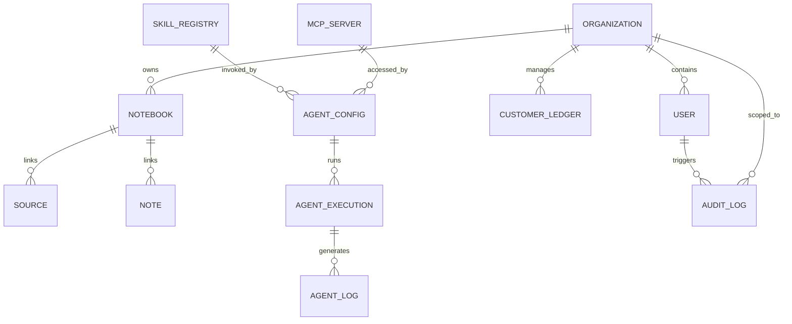

# Technical Specifications & Database Schemas — Tetrel Notebook

> **Version:** 1.0  
> **Last Updated:** 2026-06-02  
> **Status:** Pending Review  
> **Target Database:** SurrealDB v2  
> **Purpose:** Detailed schemas, relationships, and technical specifications for the upcoming foundational layers (Agent Framework, Skills/MCP Registry, Customer Organizations). Fully prepared for execution.

---

## 1. Database Schema Specification (SurrealDB v2)

SurrealDB is utilized as a multi-model database supporting Relational/Graph models, Document schemas, Full-text indexing, and Vector search natively.



### 1.1 Tenant & Organization Isolation Schema (D9)

To ensure customer data privacy and secure sandboxing, all primary business assets (Notebooks, Sources, Notes, Ledgers, Portfolios) must link back to an `organization`.

#### Table: `organization`
```surrealql
-- Definition of organization table
DEFINE TABLE organization SCHEMALESS;

DEFINE FIELD name ON TABLE organization TYPE string;
DEFINE FIELD type ON TABLE organization TYPE string ASSERT $value INSIDE ['admin', 'customer'];
DEFINE FIELD created ON TABLE organization TYPE datetime DEFAULT time::now();
DEFINE FIELD updated ON TABLE organization TYPE datetime DEFAULT time::now() VALUE time::now();
DEFINE FIELD status ON TABLE organization TYPE string DEFAULT 'active' ASSERT $value INSIDE ['active', 'suspended', 'inactive'];

-- Constraints
DEFINE INDEX org_name ON TABLE organization COLUMNS name UNIQUE;
```

#### Table: `user` (Extension of existing User table)
```surrealql
DEFINE TABLE user SCHEMALESS;

DEFINE FIELD email ON TABLE user TYPE string;
DEFINE FIELD password_hash ON TABLE user TYPE string;
DEFINE FIELD first_name ON TABLE user TYPE string;
DEFINE FIELD last_name ON TABLE user TYPE string;
DEFINE FIELD role ON TABLE user TYPE string ASSERT $value INSIDE ['super_admin', 'org_admin', 'editor', 'viewer'];
DEFINE FIELD organization ON TABLE user TYPE record<organization>;
DEFINE FIELD created ON TABLE user TYPE datetime DEFAULT time::now();
DEFINE FIELD updated ON TABLE user TYPE datetime DEFAULT time::now() VALUE time::now();

DEFINE INDEX user_email ON TABLE user COLUMNS email UNIQUE;
```

#### Table: `file_audit_log` (D3, D9)
```surrealql
DEFINE TABLE file_audit_log SCHEMALESS;

DEFINE FIELD user ON TABLE file_audit_log TYPE record<user>;
DEFINE FIELD organization ON TABLE file_audit_log TYPE record<organization>;
DEFINE FIELD action ON TABLE file_audit_log TYPE string ASSERT $value INSIDE ['upload', 'download', 'delete', 'read', 'modify'];
DEFINE FIELD target_type ON TABLE file_audit_log TYPE string ASSERT $value INSIDE ['source', 'note', 'report', 'sow'];
DEFINE FIELD target_id ON TABLE file_audit_log TYPE string;
DEFINE FIELD file_path ON TABLE file_audit_log TYPE string;
DEFINE FIELD ip_address ON TABLE file_audit_log TYPE string;
DEFINE FIELD user_agent ON TABLE file_audit_log TYPE string;
DEFINE FIELD timestamp ON TABLE file_audit_log TYPE datetime DEFAULT time::now();
```

---

### 1.2 Autonomous Agent Framework Schema (D5)

This schema models autonomous, multi-step agent workflows. Agents have configurable schedules (cron/one-shot), prompt steps, and specific model bindings.

#### Table: `agent_config`
```surrealql
DEFINE TABLE agent_config SCHEMALESS;

DEFINE FIELD name ON TABLE agent_config TYPE string;
DEFINE FIELD description ON TABLE agent_config TYPE string;
DEFINE FIELD organization ON TABLE agent_config TYPE record<organization>;
DEFINE FIELD status ON TABLE agent_config TYPE string DEFAULT 'inactive' ASSERT $value INSIDE ['active', 'inactive', 'paused'];

-- Scheduling & Trigger
DEFINE FIELD trigger_type ON TABLE agent_config TYPE string ASSERT $value INSIDE ['cron', 'manual', 'event'];
DEFINE FIELD cron_expression ON TABLE agent_config TYPE option<string>;
DEFINE FIELD event_identifier ON TABLE agent_config TYPE option<string>; -- e.g., 'source.created'

-- Workflow Steps
DEFINE FIELD steps ON TABLE agent_config TYPE array;
DEFINE FIELD steps.*.step_number ON TABLE agent_config TYPE int;
DEFINE FIELD steps.*.name ON TABLE agent_config TYPE string;
DEFINE FIELD steps.*.prompt ON TABLE agent_config TYPE string;
DEFINE FIELD steps.*.provider ON TABLE agent_config TYPE string; -- e.g., 'openrouter', 'ollama'
DEFINE FIELD steps.*.model ON TABLE agent_config TYPE string; -- e.g., 'anthropic/claude-3-sonnet'
DEFINE FIELD steps.*.skills ON TABLE agent_config TYPE array; -- e.g., ['linkedin-automation', 'gmail-automation']
DEFINE FIELD steps.*.temperature ON TABLE agent_config TYPE float DEFAULT 0.2;

DEFINE FIELD created_by ON TABLE agent_config TYPE record<user>;
DEFINE FIELD created ON TABLE agent_config TYPE datetime DEFAULT time::now();
DEFINE FIELD updated ON TABLE agent_config TYPE datetime DEFAULT time::now() VALUE time::now();

DEFINE INDEX agent_org_name ON TABLE agent_config COLUMNS organization, name UNIQUE;
```

#### Table: `agent_execution` (Observability Engine)
```surrealql
DEFINE TABLE agent_execution SCHEMALESS;

DEFINE FIELD agent ON TABLE agent_execution TYPE record<agent_config>;
DEFINE FIELD trigger ON TABLE agent_execution TYPE string ASSERT $value INSIDE ['cron', 'manual', 'event'];
DEFINE FIELD status ON TABLE agent_execution TYPE string DEFAULT 'pending' ASSERT $value INSIDE ['pending', 'running', 'completed', 'failed', 'paused'];
DEFINE FIELD started_at ON TABLE agent_execution TYPE datetime DEFAULT time::now();
DEFINE FIELD completed_at ON TABLE agent_execution TYPE option<datetime>;
DEFINE FIELD duration_ms ON TABLE agent_execution TYPE option<int>;
DEFINE FIELD cost_estimate ON TABLE agent_execution TYPE float DEFAULT 0.0;
DEFINE FIELD error_message ON TABLE agent_execution TYPE option<string>;

-- Input/Output Contexts
DEFINE FIELD input_payload ON TABLE agent_execution TYPE option<object>;
DEFINE FIELD output_payload ON TABLE agent_execution TYPE option<object>;
```

#### Table: `agent_log` (Step-by-step Execution Logs)
```surrealql
DEFINE TABLE agent_log SCHEMALESS;

DEFINE FIELD execution ON TABLE agent_log TYPE record<agent_execution>;
DEFINE FIELD step_number ON TABLE agent_log TYPE int;
DEFINE FIELD step_name ON TABLE agent_log TYPE string;
DEFINE FIELD type ON TABLE agent_log TYPE string ASSERT $value INSIDE ['info', 'warning', 'error', 'prompt_input', 'model_output', 'skill_call', 'skill_response'];
DEFINE FIELD message ON TABLE agent_log TYPE string;
DEFINE FIELD payload ON TABLE agent_log TYPE option<object>; -- Stores raw JSON inputs/outputs of skills
DEFINE FIELD timestamp ON TABLE agent_log TYPE datetime DEFAULT time::now();
```

---

### 1.3 Skills & MCP Registry Schema (D1, D2, D3)

Enables administrative mapping, validation, toggling, and configuration parameters of installed skills and MCP servers.

#### Table: `skill_registry`
```surrealql
DEFINE TABLE skill_registry SCHEMALESS;

DEFINE FIELD name ON TABLE skill_registry TYPE string; -- e.g., 'linkedin-automation'
DEFINE FIELD description ON TABLE skill_registry TYPE string;
DEFINE FIELD category ON TABLE skill_registry TYPE string;
DEFINE FIELD path ON TABLE skill_registry TYPE string;
DEFINE FIELD enabled ON TABLE skill_registry TYPE bool DEFAULT true;

-- Configuration Schema
DEFINE FIELD config_schema ON TABLE skill_registry TYPE object; -- JSON Schema of configurable parameters
DEFINE FIELD config_values ON TABLE skill_registry TYPE object DEFAULT {};   -- Stored encrypted config variables

DEFINE FIELD last_executed ON TABLE skill_registry TYPE option<datetime>;
DEFINE FIELD success_count ON TABLE skill_registry TYPE int DEFAULT 0;
DEFINE FIELD failure_count ON TABLE skill_registry TYPE int DEFAULT 0;

DEFINE INDEX skill_name ON TABLE skill_registry COLUMNS name UNIQUE;
```

#### Table: `mcp_server`
```surrealql
DEFINE TABLE mcp_server SCHEMALESS;

DEFINE FIELD name ON TABLE mcp_server TYPE string; -- e.g., 'chrome-devtools'
DEFINE FIELD type ON TABLE mcp_server TYPE string ASSERT $value INSIDE ['sse', 'stdio'];
DEFINE FIELD endpoint ON TABLE mcp_server TYPE string; -- URL or shell command path
DEFINE FIELD env_variables ON TABLE mcp_server TYPE object DEFAULT {}; -- Stored env vars (API keys)
DEFINE FIELD status ON TABLE mcp_server TYPE string DEFAULT 'disconnected' ASSERT $value INSIDE ['connected', 'disconnected', 'error'];
DEFINE FIELD error_message ON TABLE mcp_server TYPE option<string>;
DEFINE FIELD tools ON TABLE mcp_server TYPE array; -- Array of exposed tools with descriptions
DEFINE FIELD last_pulse ON TABLE mcp_server TYPE datetime DEFAULT time::now();

DEFINE INDEX mcp_name ON TABLE mcp_server COLUMNS name UNIQUE;
```

---

## 2. i18n Auditing & String Structure (D7)

To enforce Dutch as a native language rather than an afterthought, all translation structures utilize a strict key-matching validation suite. 

### Enforced Key Alignment Matrix

Any UI element added to the platform must align with the exact key structure inside `/frontend/src/lib/locales/en-US/index.ts`. Below is the required map for the new Compliance and Agent views:

```typescript
// Proposed updates to local translation packages
export const enUS = {
  // Existing common keys...
  compliance: {
    title: "CSET Compliance Hub",
    subtitle: "Verify, evaluate, and track critical cybersecurity standards.",
    allSectors: "All Sectors",
    searchPlaceholder: "Search CSET standard libraries...",
    activeStandards: "Active Standards",
    matrixTitle: "Framework Comparison Matrix",
    matrixDesc: "Cross-examine overlapping requirements between major compliance frameworks.",
    questions: "Questions",
    levels: "Levels",
    more: "more",
    noFrameworks: "No frameworks found matching criteria.",
    sectorLabel: "Sector",
    questionsCount: "{count} Questions",
    levelsLabel: "Levels: {levels}",
    wizard: {
      started: "Evaluation Started",
      complete: "Evaluation Complete",
      rationales: "Rationales",
      na: "N/A",
      yes: "Yes",
      no: "No",
      alt: "Alternative",
      enterRationale: "Enter implementation rationale...",
      complianceScore: "Compliance Score",
      answered: "Answered",
      remaining: "Remaining",
      saveReport: "Generate SOW & Report",
    }
  },
  agents: {
    registry: "Agent Registry",
    createAgent: "Create Autonomous Agent",
    noAgents: "No autonomous agents configured yet.",
    activeSchedules: "Active Schedules",
    triggers: {
      cron: "Recurring (Cron)",
      manual: "Manual Trigger Only",
      event: "Event Driven",
    },
    status: {
      active: "Active",
      inactive: "Inactive",
      paused: "Paused",
    },
    table: {
      name: "Agent Name",
      trigger: "Trigger",
      lastRun: "Last Run",
      successRate: "Success Rate",
      actions: "Actions",
    },
    form: {
      nameLabel: "Agent Name *",
      descLabel: "Description",
      triggerSelect: "Select Trigger Type",
      cronPlaceholder: "e.g., */15 * * * * for every 15 minutes",
      addStep: "Add Prompt Step",
      stepName: "Step Name",
      stepPrompt: "Prompt Instructions (Markdown allowed)",
      skillsSelect: "Skills & MCP Tools Required",
      modelSelect: "LLM Model Selection",
      providerSelect: "Provider Selection",
    },
    logs: {
      title: "Execution Observatory",
      executionId: "Execution ID",
      duration: "Duration",
      cost: "Est. Cost",
      started: "Started",
      stepsCompleted: "Steps Completed",
      stepLogHeader: "Step {number}: {name}",
      rawPayload: "Raw Step Payload",
    }
  }
}
```

The matching `/frontend/src/lib/locales/nl-NL/index.ts` must maintain a 1:1 identical key mapping to prevent React key rendering runtime panics.

---

## 3. Directory & File Isolation Layout (D9)

To support secure customer isolations and multi-tenant file handling, directories inside the container environment are explicitly structured:

```
/data/
├── system_configs/            # Global API configurations (encrypted DB backup keys)
└── organizations/
    ├── org_admin/             # Global administrator directory
    │   ├── system_styleguides/# Stored brand books, publication templates
    │   └── research_pipeline/ # General market research outputs (vectorized)
    ├── org_customer_a/        # Scoped Customer A directory
    │   ├── uploads/           # Raw PDF, DOCX, media files (auto-deleted if config true)
    │   ├── ingested/          # Permanent docling markdown versions
    │   ├── quizzes/           # Stored compliance quiz scorecards (JSON)
    │   ├── SOWs/              # Generated reports & statement of works
    │   └── audit_trail/       # Encrypted, localized append-only log file
    └── org_customer_b/        # Scoped Customer B directory (strictly air-gapped)
        └── ...
```

A strict Node.js/Python boundary layer maps container storage directory permissions to the active user's `organization` record, preventing path-traversal attacks.
