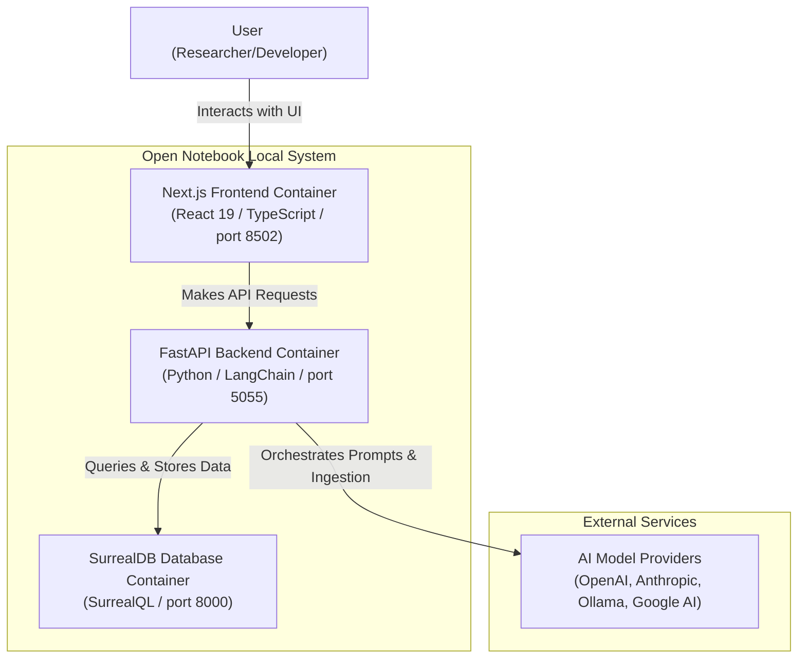

# Architecture Documentation

This document describes the high-level architecture of the local open-notebook development workspace using the C4 Model.

## System Context Diagram

The following diagram illustrates how the components of the open-notebook ecosystem interact with the user and external AI providers.

### Component Details

1. **Next.js Frontend**: Responsive, highly interactive web application utilizing Zustand for state management and Tailwind CSS / Shadcn/ui for unified styling. Handles user uploads (PDFs, Audio, Videos), notebook administration, and chat interfaces.
2. **FastAPI Backend**: Asynchronous microservice executing python-based extraction pipelines, vector ingestion, full-text search indexing, and conversation state management.
3. **SurrealDB Database**: Relational and document-store database managing user profiles, notebooks, uploaded source text blocks, source metadata, and conversation histories.
4. **AI Providers**: Endpoint integration via LangChain for executing context-aware generations (summaries, context chats, audio synthesis, podcast generation).
