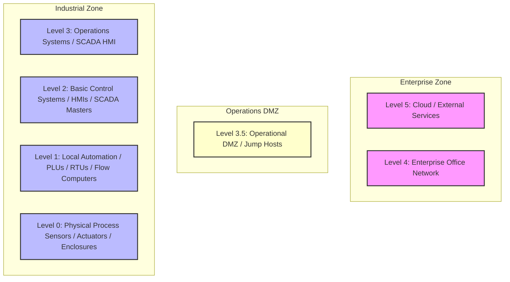

# 📘 Compliance Record of Note: ACSC Essential Eight
## Australian Cyber Security Centre Mitigation Strategies

---

## 📋 Framework Overview
* **Framework ID**: `ACSC_ESSENTIAL_8`
* **Category**: `General IT/OT`
* **Industry Sector (Primary)**: `Cross-Sector`
* **Mapped CISA Critical Sectors**: `Information Technology`, `Government Facilities`, `Defense Industrial Base`
* **Control Scope**: Contains 80 high-fidelity operational technology (OT) and information technology (IT) compliance checks.

> [!NOTE]
> This document serves as the official **Record of Note** and artifact for the ACSC Essential Eight framework. All control questions, standard codes, and Purdue Model mappings are compiled directly from CSET definitions.

### Description
Prioritized mitigation strategies focused on preventing intrusions, limiting host impacts, and recovering data.

---

## 📐 Purdue Model Mapping

Control levels are logically aligned with the Purdue Enterprise Reference Architecture (PERA) to isolate process control boundaries from enterprise systems:

---

## 🛡️ Control Matrix

| Standard Code | Question Text | Category | Purdue Level | Guidance / Description |
| :--- | :--- | :--- | :---: | :--- |
| **ACSC-ACSC-E8-1.1** | Is application control enforced on all workstations to restrict execution of unapproved files? | Application Control | 3 | Validate AppLocker or equivalent GPO settings, review software installation approval logs, and verify that operators cannot execute unsigned scripts.  SOP: 1. Deploy endpoint protection agents configured with real-time process monitoring to block unsigned scripts and execution threats. 2. Enforce automatic session logout GPOs terminating interactive operator connections after a defined period of inactivity. 3. Configure system event log forwarding to stream all reboots, login attempts, and administrative modifications to a centralized syslog receiver.  VERIFICATION CRITERIA: Inspect the application control configurations, check the verified logs, review the system settings, and check the following: General OT/IT security evidence must include: change management tracking tickets, Active Directory Group Policy Objects (GPOs), system log archives, and Nozomi/Dragos anomaly monitoring configuration files.  OT/IT CONVERGENCE RISK: General IT-OT convergence increases the threat landscape by bridging air-gapped industrial facilities with internet-facing corporate systems. Failing to enforce strict regulatory controls risks introducing severe operational vulnerabilities. |
| **ACSC-ACSC-E8-1.2** | Are application control rules and execution whitelists reviewed and updated annually? | Application Control | 4 | Audit rule sets, verify that temporary exceptions are removed, and review developer code-signature validation lists.  SOP: 1. Enforce strict role-based access controls (RBAC) separating administrative tasks from standard operator routines. 2. Route all incoming remote connections through isolated administrative Jump Hosts with visual session logging active. 3. Conduct quarterly access audits to identify and completely disable dormant or inactive accounts.  VERIFICATION CRITERIA: Inspect the application control configurations, check the verified logs, review the system settings, and check the following: General OT/IT security evidence must include: change management tracking tickets, Active Directory Group Policy Objects (GPOs), system log archives, and Nozomi/Dragos anomaly monitoring configuration files.  OT/IT CONVERGENCE RISK: General IT-OT convergence increases the threat landscape by bridging air-gapped industrial facilities with internet-facing corporate systems. Failing to enforce strict regulatory controls risks introducing severe operational vulnerabilities. |
| **ACSC-ACSC-E8-2.1** | Are critical application security patches applied within 48 hours of release? | Patch Applications | 3 | Audit patch levels, review automated update logs, and check dynamic testing tools checking system configurations.  SOP: 1. Deploy endpoint protection agents configured with real-time process monitoring to block unsigned scripts and execution threats. 2. Enforce automatic session logout GPOs terminating interactive operator connections after a defined period of inactivity. 3. Configure system event log forwarding to stream all reboots, login attempts, and administrative modifications to a centralized syslog receiver.  VERIFICATION CRITERIA: Inspect the patch applications configurations, check the verified logs, review the system settings, and check the following: General OT/IT security evidence must include: change management tracking tickets, Active Directory Group Policy Objects (GPOs), system log archives, and Nozomi/Dragos anomaly monitoring configuration files.  OT/IT CONVERGENCE RISK: General IT-OT convergence increases the threat landscape by bridging air-gapped industrial facilities with internet-facing corporate systems. Failing to enforce strict regulatory controls risks introducing severe operational vulnerabilities. |
| **ACSC-ACSC-E8-2.2** | Are security vulnerability patches applied to server operating systems within 48 hours? | Patch Applications | 3 | Verify OS patch lists, check automated update schedules on all production servers, and review update success logs.  SOP: 1. Deploy endpoint protection agents configured with real-time process monitoring to block unsigned scripts and execution threats. 2. Enforce automatic session logout GPOs terminating interactive operator connections after a defined period of inactivity. 3. Configure system event log forwarding to stream all reboots, login attempts, and administrative modifications to a centralized syslog receiver.  VERIFICATION CRITERIA: Inspect the patch applications configurations, check the verified logs, review the system settings, and check the following: General OT/IT security evidence must include: change management tracking tickets, Active Directory Group Policy Objects (GPOs), system log archives, and Nozomi/Dragos anomaly monitoring configuration files.  OT/IT CONVERGENCE RISK: General IT-OT convergence increases the threat landscape by bridging air-gapped industrial facilities with internet-facing corporate systems. Failing to enforce strict regulatory controls risks introducing severe operational vulnerabilities. |
| **ACSC-ACSC-E8-3.1** | Are Microsoft Office macro settings configured to block macros from the Internet? | Configure MS Office Macro Settings | 3 | Verify AD macro configuration rules, block clear-text macros, and ensure only signed macros run.  SOP: 1. Deploy endpoint protection agents configured with real-time process monitoring to block unsigned scripts and execution threats. 2. Enforce automatic session logout GPOs terminating interactive operator connections after a defined period of inactivity. 3. Configure system event log forwarding to stream all reboots, login attempts, and administrative modifications to a centralized syslog receiver.  VERIFICATION CRITERIA: Inspect the configure ms office macro settings configurations, check the verified logs, review the system settings, and check the following: General OT/IT security evidence must include: change management tracking tickets, Active Directory Group Policy Objects (GPOs), system log archives, and Nozomi/Dragos anomaly monitoring configuration files.  OT/IT CONVERGENCE RISK: General IT-OT convergence increases the threat landscape by bridging air-gapped industrial facilities with internet-facing corporate systems. Failing to enforce strict regulatory controls risks introducing severe operational vulnerabilities. |
| **ACSC-ACSC-E8-3.2** | Are Microsoft Office macros restricted to executing only from trusted publishers and locations? | Configure MS Office Macro Settings | 3 | Inspect trusted location GPOs, check digital signature validation keys, and review macro audit logs.  SOP: 1. Deploy endpoint protection agents configured with real-time process monitoring to block unsigned scripts and execution threats. 2. Enforce automatic session logout GPOs terminating interactive operator connections after a defined period of inactivity. 3. Configure system event log forwarding to stream all reboots, login attempts, and administrative modifications to a centralized syslog receiver.  VERIFICATION CRITERIA: Inspect the configure ms office macro settings configurations, check the verified logs, review the system settings, and check the following: General OT/IT security evidence must include: change management tracking tickets, Active Directory Group Policy Objects (GPOs), system log archives, and Nozomi/Dragos anomaly monitoring configuration files.  OT/IT CONVERGENCE RISK: General IT-OT convergence increases the threat landscape by bridging air-gapped industrial facilities with internet-facing corporate systems. Failing to enforce strict regulatory controls risks introducing severe operational vulnerabilities. |
| **ACSC-ACSC-E8-4.1** | Are web browsers configured to block Flash, Java, and unapproved extensions? | User Application Hardening | 3 | Inspect browser GPO policies, verify that unused web plugins are disabled, and check extension whitelists.  SOP: 1. Deploy endpoint protection agents configured with real-time process monitoring to block unsigned scripts and execution threats. 2. Enforce automatic session logout GPOs terminating interactive operator connections after a defined period of inactivity. 3. Configure system event log forwarding to stream all reboots, login attempts, and administrative modifications to a centralized syslog receiver.  VERIFICATION CRITERIA: Inspect the user application hardening configurations, check the verified logs, review the system settings, and check the following: General OT/IT security evidence must include: change management tracking tickets, Active Directory Group Policy Objects (GPOs), system log archives, and Nozomi/Dragos anomaly monitoring configuration files.  OT/IT CONVERGENCE RISK: Using unhardened or unpatched field controllers opens critical hardware interfaces to remote execution exploits. Attackers can leverage known vulnerabilities to flash unauthorized firmware or change safety threshold parameters on active PLCs. |
| **ACSC-ACSC-E8-4.2** | Are web browsers configured to block advertising networks and dynamic tracking content? | User Application Hardening | 3 | Verify local ad-blocking software status, inspect browser extension GPOs, and review DNS blacklists.  SOP: 1. Deploy endpoint protection agents configured with real-time process monitoring to block unsigned scripts and execution threats. 2. Enforce automatic session logout GPOs terminating interactive operator connections after a defined period of inactivity. 3. Configure system event log forwarding to stream all reboots, login attempts, and administrative modifications to a centralized syslog receiver.  VERIFICATION CRITERIA: Inspect the user application hardening configurations, check the verified logs, review the system settings, and check the following: General OT/IT security evidence must include: change management tracking tickets, Active Directory Group Policy Objects (GPOs), system log archives, and Nozomi/Dragos anomaly monitoring configuration files.  OT/IT CONVERGENCE RISK: Using unhardened or unpatched field controllers opens critical hardware interfaces to remote execution exploits. Attackers can leverage known vulnerabilities to flash unauthorized firmware or change safety threshold parameters on active PLCs. |
| **ACSC-ACSC-E8-5.1** | Are administrative privileges restricted to only those users who require them for their role? | Restrict Administrative Privileges | 4 | Review administrator lists, check role boundaries, and audit administrative event logging streams.  SOP: 1. Enforce strict role-based access controls (RBAC) separating administrative tasks from standard operator routines. 2. Route all incoming remote connections through isolated administrative Jump Hosts with visual session logging active. 3. Conduct quarterly access audits to identify and completely disable dormant or inactive accounts.  VERIFICATION CRITERIA: Inspect the restrict administrative privileges configurations, check the verified logs, review the system settings, and check the following: General OT/IT security evidence must include: change management tracking tickets, Active Directory Group Policy Objects (GPOs), system log archives, and Nozomi/Dragos anomaly monitoring configuration files.  OT/IT CONVERGENCE RISK: General IT-OT convergence increases the threat landscape by bridging air-gapped industrial facilities with internet-facing corporate systems. Failing to enforce strict regulatory controls risks introducing severe operational vulnerabilities. |
| **ACSC-ACSC-E8-5.2** | Are administrator credentials changed regularly and dormant administrative accounts disabled? | Restrict Administrative Privileges | 4 | Verify GPO password guidelines, check active directory profiles, and audit administrator activity logs.  SOP: 1. Enforce strict role-based access controls (RBAC) separating administrative tasks from standard operator routines. 2. Route all incoming remote connections through isolated administrative Jump Hosts with visual session logging active. 3. Conduct quarterly access audits to identify and completely disable dormant or inactive accounts.  VERIFICATION CRITERIA: Inspect the restrict administrative privileges configurations, check the verified logs, review the system settings, and check the following: General OT/IT security evidence must include: change management tracking tickets, Active Directory Group Policy Objects (GPOs), system log archives, and Nozomi/Dragos anomaly monitoring configuration files.  OT/IT CONVERGENCE RISK: General IT-OT convergence increases the threat landscape by bridging air-gapped industrial facilities with internet-facing corporate systems. Failing to enforce strict regulatory controls risks introducing severe operational vulnerabilities. |
| **ACSC-ACSC-E8-6.1** | Are operating system patches validated and applied to workstations within 48 hours? | Patch Operating Systems | 3 | Audit workstation OS patch status, check automated patch deployment logs, and verify client success reports.  SOP: 1. Deploy endpoint protection agents configured with real-time process monitoring to block unsigned scripts and execution threats. 2. Enforce automatic session logout GPOs terminating interactive operator connections after a defined period of inactivity. 3. Configure system event log forwarding to stream all reboots, login attempts, and administrative modifications to a centralized syslog receiver.  VERIFICATION CRITERIA: Inspect the patch operating systems configurations, check the verified logs, review the system settings, and check the following: General OT/IT security evidence must include: change management tracking tickets, Active Directory Group Policy Objects (GPOs), system log archives, and Nozomi/Dragos anomaly monitoring configuration files.  OT/IT CONVERGENCE RISK: General IT-OT convergence increases the threat landscape by bridging air-gapped industrial facilities with internet-facing corporate systems. Failing to enforce strict regulatory controls risks introducing severe operational vulnerabilities. |
| **ACSC-ACSC-E8-6.2** | Are server operating system security updates verified and applied within 48 hours? | Patch Operating Systems | 3 | Review server patch reports, check testing pipeline schedules, and verify that critical servers are updated immediately.  SOP: 1. Deploy endpoint protection agents configured with real-time process monitoring to block unsigned scripts and execution threats. 2. Enforce automatic session logout GPOs terminating interactive operator connections after a defined period of inactivity. 3. Configure system event log forwarding to stream all reboots, login attempts, and administrative modifications to a centralized syslog receiver.  VERIFICATION CRITERIA: Inspect the patch operating systems configurations, check the verified logs, review the system settings, and check the following: General OT/IT security evidence must include: change management tracking tickets, Active Directory Group Policy Objects (GPOs), system log archives, and Nozomi/Dragos anomaly monitoring configuration files.  OT/IT CONVERGENCE RISK: General IT-OT convergence increases the threat landscape by bridging air-gapped industrial facilities with internet-facing corporate systems. Failing to enforce strict regulatory controls risks introducing severe operational vulnerabilities. |
| **ACSC-ACSC-E8-7.1** | Is multi-factor authentication enforced for remote access and administrative access (utilizing secure Jump Hosts, MFA validation nodes, active directory GPOs, and hardware tokens)? | Multi-Factor Authentication | 4 | Verify FIDO2 hardware token enforcement, check Jump Host configurations, and audit VPN session profiles.  SOP: 1. Enforce strict role-based access controls (RBAC) separating administrative tasks from standard operator routines. 2. Route all incoming remote connections through isolated administrative Jump Hosts with visual session logging active. 3. Conduct quarterly access audits to identify and completely disable dormant or inactive accounts.  VERIFICATION CRITERIA: Inspect the multi-factor authentication configurations, check the verified logs, review the system settings, and check the following: General OT/IT security evidence must include: change management tracking tickets, Active Directory Group Policy Objects (GPOs), system log archives, and Nozomi/Dragos anomaly monitoring configuration files.  OT/IT CONVERGENCE RISK: Unauthenticated or unmonitored IT-OT bridge endpoints can expose critical ACSC ESSENTIAL 8 systems to lateral network pivoting. An administrative compromise in the enterprise domain (such as phishing or AD account compromise) can lead directly to unauthorized SCADA control commands. |
| **ACSC-ACSC-E8-7.2** | Is multi-factor authentication enforced for all cloud services, SaaS platforms, and enterprise email (utilizing secure Jump Hosts, MFA validation nodes, active directory GPOs, and hardware tokens)? | Multi-Factor Authentication | 4 | Inspect identity provider (IdP) integration settings, check MFA exemption logs, and verify token configurations.  SOP: 1. Enforce strict role-based access controls (RBAC) separating administrative tasks from standard operator routines. 2. Route all incoming remote connections through isolated administrative Jump Hosts with visual session logging active. 3. Conduct quarterly access audits to identify and completely disable dormant or inactive accounts.  VERIFICATION CRITERIA: Inspect the multi-factor authentication configurations, check the verified logs, review the system settings, and check the following: General OT/IT security evidence must include: change management tracking tickets, Active Directory Group Policy Objects (GPOs), system log archives, and Nozomi/Dragos anomaly monitoring configuration files.  OT/IT CONVERGENCE RISK: Unauthenticated or unmonitored IT-OT bridge endpoints can expose critical ACSC ESSENTIAL 8 systems to lateral network pivoting. An administrative compromise in the enterprise domain (such as phishing or AD account compromise) can lead directly to unauthorized SCADA control commands. |
| **ACSC-ACSC-E8-8.1** | Are daily backups of critical data, applications, and configurations secured and tested? | Regular Backups | 3 | Review backup logs, verify secure isolated offsite replica storage, and check annual backup restoration test reports.  SOP: 1. Deploy endpoint protection agents configured with real-time process monitoring to block unsigned scripts and execution threats. 2. Enforce automatic session logout GPOs terminating interactive operator connections after a defined period of inactivity. 3. Configure system event log forwarding to stream all reboots, login attempts, and administrative modifications to a centralized syslog receiver.  VERIFICATION CRITERIA: Inspect the regular backups configurations, check the verified logs, review the system settings, and check the following: General OT/IT security evidence must include: change management tracking tickets, Active Directory Group Policy Objects (GPOs), system log archives, and Nozomi/Dragos anomaly monitoring configuration files.  OT/IT CONVERGENCE RISK: Failing to maintain isolated, offline backups during convergence events risks catastrophic downtime during ransomware outbreaks. If backups reside on the shared enterprise domain, the same malware that encrypts SCADA HMIs will wipe the recovery configurations. |
| **ACSC-ACSC-E8-8.2** | Are daily backups encrypted at rest and stored in isolated write-once secure cabinets? | Regular Backups | 3 | Verify backup encryption keys, check replica storage access logs, and review physical locked cabinet audits.  SOP: 1. Deploy endpoint protection agents configured with real-time process monitoring to block unsigned scripts and execution threats. 2. Enforce automatic session logout GPOs terminating interactive operator connections after a defined period of inactivity. 3. Configure system event log forwarding to stream all reboots, login attempts, and administrative modifications to a centralized syslog receiver.  VERIFICATION CRITERIA: Inspect the regular backups configurations, check the verified logs, review the system settings, and check the following: General OT/IT security evidence must include: change management tracking tickets, Active Directory Group Policy Objects (GPOs), system log archives, and Nozomi/Dragos anomaly monitoring configuration files.  OT/IT CONVERGENCE RISK: Failing to maintain isolated, offline backups during convergence events risks catastrophic downtime during ransomware outbreaks. If backups reside on the shared enterprise domain, the same malware that encrypts SCADA HMIs will wipe the recovery configurations. |
| **ACSC-C-17** | Are unique user credentials and multi-factor authentication (MFA) enforced for all operational and administrative interfaces (utilizing secure Jump Hosts, MFA validation nodes, active directory GPOs, and hardware tokens)? | Access Control & Identity | 4 | Verify compliance against ACSC ESSENTIAL 8 requirements for control ACSC-C-17.  SOP: 1. Enforce strict role-based access controls (RBAC) separating administrative tasks from standard operator routines. 2. Route all incoming remote connections through isolated administrative Jump Hosts with visual session logging active. 3. Conduct quarterly access audits to identify and completely disable dormant or inactive accounts.  VERIFICATION CRITERIA: Inspect the access control & identity configurations, check the verified logs, review the system settings, and check the following: Evaluation evidence must include: Active Directory group policies, Jump Server log databases, MFA configuration logs, and administrative access audit certificates.  OT/IT CONVERGENCE RISK: Unauthenticated or unmonitored IT-OT bridge endpoints can expose critical networks to lateral pivoting. An administrative compromise in the enterprise domain (such as phishing or AD account compromise) can lead directly to unauthorized SCADA control commands. |
| **ACSC-C-18** | Are electronic security perimeters and operational DMZs implemented to logically segment industrial networks (enforced by Cisco Industrial Ethernet switches, network zoning firewalls, and isolated Purdue model level boundaries)? | Boundary Protection & Network Segmentation | 3 | Verify compliance against ACSC ESSENTIAL 8 requirements for control ACSC-C-18.  SOP: 1. Deploy an Operational DMZ to segment Level 3 and Level 4 network communications. 2. Route all boundary traffic through stateful firewalls with dynamic threat prevention active. 3. Disable all unused physical ports and implement unidirectional data diodes for safety loops.  VERIFICATION CRITERIA: Inspect the boundary protection & network segmentation configurations, check the verified logs, review the system settings, and check the following: Evaluation evidence must include: Zone and Conduit design architecture diagram, Security Level Target (SL-T) vs Security Level Achieved (SL-A) matrix, and network firewall configuration files.  OT/IT CONVERGENCE RISK: Inadequate network segmentation allows IT-OT convergence traffic to flow unmediated across enclaves. A malware infection on the corporate LAN (like ransomware) can propagate directly to critical process control loops, halting operations. |
| **ACSC-C-19** | Are default passwords disabled and unused software services deactivated on all host endpoints (covering Siemens S7-1500 PLCs, Allen-Bradley ControlLogix, SEL RTUs, and digital relay modules)? | Host Hardening - Device Integrity | 2 | Verify compliance against ACSC ESSENTIAL 8 requirements for control ACSC-C-19.  SOP: 1. Disable all unnecessary local services (e.g. FTP, raw Telnet, HTTP) in host operating system settings. 2. Configure host configuration locks and disable local diagnostic ports to block unauthorized adjustments. 3. Enforce application whitelisting and configuration baselines on all engineering terminals.  VERIFICATION CRITERIA: Inspect the host hardening - device integrity configurations, check the verified logs, review the system settings, and check the following: Evaluation evidence must include: host hardening checklists, disabled service audit logs, application whitelisting policies, and local host configuration files.  OT/IT CONVERGENCE RISK: Using unhardened or unpatched field controllers opens critical hardware interfaces to remote execution exploits. Attackers can leverage known vulnerabilities to flash unauthorized firmware or change safety threshold parameters on active PLCs. |
| **ACSC-C-20** | Are system event logs synchronized via secure NTP and stored continuously on write-once media (aligned with incident response playbooks, offsite backups, and isolated write-once media)? | Audit Trails & Security Logging | 3 | Verify compliance against ACSC ESSENTIAL 8 requirements for control ACSC-C-20.  SOP: 1. Configure centralized syslog forwarding to stream all reboots, login attempts, and administrative modifications. 2. Synchronize all system logs using secure NTP servers with verified time offsets. 3. Restrict log access to authorized audit roles and configure log alerts for high-priority security events.  VERIFICATION CRITERIA: Inspect the audit trails & security logging configurations, check the verified logs, review the system settings, and check the following: Evaluation evidence must include: NTP synchronization logs, centralized syslog receiver configurations, write-once media validation tests, and log audit registers.  OT/IT CONVERGENCE RISK: Failing to maintain comprehensive, synchronized event logs during a convergence breach blinds security teams to the attacker's footprint. Without centralized logs, forensic tracking of unauthorized PLC firmware changes or database adjustments is impossible. |
| **ACSC-C-21** | Are physical access controls and locking covers implemented around critical equipment cabinets (covering Siemens S7-1500 PLCs, Allen-Bradley ControlLogix, SEL RTUs, and digital relay modules)? | Physical Protection & Enclosures | 1 | Verify compliance against ACSC ESSENTIAL 8 requirements for control ACSC-C-21.  SOP: 1. Establish physical locking covers and secure enclosures around critical field device interfaces. 2. Deploy electronic badge access and security cameras to monitor all entry boundaries. 3. Maintain visitor logs and enforce mandatory escorts for all unauthorized personnel.  VERIFICATION CRITERIA: Inspect the physical protection & enclosures configurations, check the verified logs, review the system settings, and check the following: Evaluation evidence must include: physical security plan, electronic badge entry history log, security camera archive, visitor registry, and enclosure inspection logs.  OT/IT CONVERGENCE RISK: Unrestricted physical access to hardware enclaves bypasses all logical firewall policies. An attacker with physical cabinet access can connect a malicious device directly to the backplane, flashing compromised logic onto operating controllers. |
| **ACSC-C-22** | Are offline, tested backups of device logic and HMI applications maintained regularly (aligned with incident response playbooks, offsite backups, and isolated write-once media)? | Disaster Recovery & Backup Continuity | 3 | Verify compliance against ACSC ESSENTIAL 8 requirements for control ACSC-C-22.  SOP: 1. Run weekly backups of all running PLC configurations and logic programs. 2. Store backup images in secure offsite fireproof enclosures or write-once media. 3. Conduct annual backup restoration simulation tests to verify recovery time objectives.  VERIFICATION CRITERIA: Inspect the disaster recovery & backup continuity configurations, check the verified logs, review the system settings, and check the following: disaster recovery plan, backup log verification sheets, offsite media transit registry, and annual restoration simulation test reports.  OT/IT CONVERGENCE RISK: Failing to maintain isolated, offline backups during convergence events risks catastrophic downtime during ransomware outbreaks. If backups reside on the shared enterprise domain, the same malware that encrypts SCADA HMIs will wipe the recovery configurations. |
| **ACSC-C-23** | Are telemetry lines and industrial communication links encrypted utilizing secure protocols (utilizing VPN tunnels, encrypted Modbus/DNP3 secure protocols, and HSM keys)? | Data Integrity & Telemetry | 2 | Verify compliance against ACSC ESSENTIAL 8 requirements for control ACSC-C-23.  SOP: 1. Implement VPN tunnels or hardware encryption modules for all wide-area telemetry links. 2. Transition raw serial or unencrypted communications to secure protocols like Secure DNP3 or OPC UA. 3. Restrict logical access to communications adapters and configure cryptographic key rotation.  VERIFICATION CRITERIA: Inspect the data integrity & telemetry configurations, check the verified logs, review the system settings, and check the following: communications link encryption audit report, VPN router configurations, Secure DNP3/OPC UA log traces, and cryptographic key management records.  OT/IT CONVERGENCE RISK: Traversing industrial telemetry in cleartext across converged networks invites eavesdropping and packet injection. Malicious actors can execute Man-in-the-Middle (MitM) attacks, spoofing HMI screens while sending dangerous control commands. |
| **ACSC-C-24** | Are third-party vendor integrations and hardware components audited for cyber risks (aligned with incident response playbooks, offsite backups, and isolated write-once media)? | Supply Chain Risk Management | 3 | Verify compliance against ACSC ESSENTIAL 8 requirements for control ACSC-C-24.  SOP: 1. Include explicit cybersecurity requirements in all third-party vendor contracts. 2. Audit vendor remote support channels and deactivate them immediately after use. 3. Perform logical integrity checks on all newly arrived hardware and software components before installation.  VERIFICATION CRITERIA: Inspect the supply chain risk management configurations, check the verified logs, review the system settings, and check the following: vendor contract agreements, SBOM lists, remote access permission logs, and incoming hardware security audit reports.  OT/IT CONVERGENCE RISK: Failing to govern third-party integration access introduces silent vulnerabilities. A compromise at a vendor's remote workstation can bypass operational perimeters, injecting malicious firmware or settings directly into the production loops. |
| **ACSC-C-25** | Are unique user credentials and multi-factor authentication (MFA) enforced for all operational and administrative interfaces (utilizing secure Jump Hosts, MFA validation nodes, active directory GPOs, and hardware tokens)? | Access Control & Identity | 4 | Verify compliance against ACSC ESSENTIAL 8 requirements for control ACSC-C-25.  SOP: 1. Enforce strict role-based access controls (RBAC) separating administrative tasks from standard operator routines. 2. Route all incoming remote connections through isolated administrative Jump Hosts with visual session logging active. 3. Conduct quarterly access audits to identify and completely disable dormant or inactive accounts.  VERIFICATION CRITERIA: Inspect the access control & identity configurations, check the verified logs, review the system settings, and check the following: Evaluation evidence must include: Active Directory group policies, Jump Server log databases, MFA configuration logs, and administrative access audit certificates.  OT/IT CONVERGENCE RISK: Unauthenticated or unmonitored IT-OT bridge endpoints can expose critical networks to lateral pivoting. An administrative compromise in the enterprise domain (such as phishing or AD account compromise) can lead directly to unauthorized SCADA control commands. |
| **ACSC-C-26** | Are electronic security perimeters and operational DMZs implemented to logically segment industrial networks (enforced by Cisco Industrial Ethernet switches, network zoning firewalls, and isolated Purdue model level boundaries)? | Boundary Protection & Network Segmentation | 3 | Verify compliance against ACSC ESSENTIAL 8 requirements for control ACSC-C-26.  SOP: 1. Deploy an Operational DMZ to segment Level 3 and Level 4 network communications. 2. Route all boundary traffic through stateful firewalls with dynamic threat prevention active. 3. Disable all unused physical ports and implement unidirectional data diodes for safety loops.  VERIFICATION CRITERIA: Inspect the boundary protection & network segmentation configurations, check the verified logs, review the system settings, and check the following: Evaluation evidence must include: Zone and Conduit design architecture diagram, Security Level Target (SL-T) vs Security Level Achieved (SL-A) matrix, and network firewall configuration files.  OT/IT CONVERGENCE RISK: Inadequate network segmentation allows IT-OT convergence traffic to flow unmediated across enclaves. A malware infection on the corporate LAN (like ransomware) can propagate directly to critical process control loops, halting operations. |
| **ACSC-C-27** | Are default passwords disabled and unused software services deactivated on all host endpoints (covering Siemens S7-1500 PLCs, Allen-Bradley ControlLogix, SEL RTUs, and digital relay modules)? | Host Hardening - Device Integrity | 2 | Verify compliance against ACSC ESSENTIAL 8 requirements for control ACSC-C-27.  SOP: 1. Disable all unnecessary local services (e.g. FTP, raw Telnet, HTTP) in host operating system settings. 2. Configure host configuration locks and disable local diagnostic ports to block unauthorized adjustments. 3. Enforce application whitelisting and configuration baselines on all engineering terminals.  VERIFICATION CRITERIA: Inspect the host hardening - device integrity configurations, check the verified logs, review the system settings, and check the following: Evaluation evidence must include: host hardening checklists, disabled service audit logs, application whitelisting policies, and local host configuration files.  OT/IT CONVERGENCE RISK: Using unhardened or unpatched field controllers opens critical hardware interfaces to remote execution exploits. Attackers can leverage known vulnerabilities to flash unauthorized firmware or change safety threshold parameters on active PLCs. |
| **ACSC-C-28** | Are system event logs synchronized via secure NTP and stored continuously on write-once media (aligned with incident response playbooks, offsite backups, and isolated write-once media)? | Audit Trails & Security Logging | 3 | Verify compliance against ACSC ESSENTIAL 8 requirements for control ACSC-C-28.  SOP: 1. Configure centralized syslog forwarding to stream all reboots, login attempts, and administrative modifications. 2. Synchronize all system logs using secure NTP servers with verified time offsets. 3. Restrict log access to authorized audit roles and configure log alerts for high-priority security events.  VERIFICATION CRITERIA: Inspect the audit trails & security logging configurations, check the verified logs, review the system settings, and check the following: Evaluation evidence must include: NTP synchronization logs, centralized syslog receiver configurations, write-once media validation tests, and log audit registers.  OT/IT CONVERGENCE RISK: Failing to maintain comprehensive, synchronized event logs during a convergence breach blinds security teams to the attacker's footprint. Without centralized logs, forensic tracking of unauthorized PLC firmware changes or database adjustments is impossible. |
| **ACSC-C-29** | Are physical access controls and locking covers implemented around critical equipment cabinets (covering Siemens S7-1500 PLCs, Allen-Bradley ControlLogix, SEL RTUs, and digital relay modules)? | Physical Protection & Enclosures | 1 | Verify compliance against ACSC ESSENTIAL 8 requirements for control ACSC-C-29.  SOP: 1. Establish physical locking covers and secure enclosures around critical field device interfaces. 2. Deploy electronic badge access and security cameras to monitor all entry boundaries. 3. Maintain visitor logs and enforce mandatory escorts for all unauthorized personnel.  VERIFICATION CRITERIA: Inspect the physical protection & enclosures configurations, check the verified logs, review the system settings, and check the following: Evaluation evidence must include: physical security plan, electronic badge entry history log, security camera archive, visitor registry, and enclosure inspection logs.  OT/IT CONVERGENCE RISK: Unrestricted physical access to hardware enclaves bypasses all logical firewall policies. An attacker with physical cabinet access can connect a malicious device directly to the backplane, flashing compromised logic onto operating controllers. |
| **ACSC-C-30** | Are offline, tested backups of device logic and HMI applications maintained regularly (aligned with incident response playbooks, offsite backups, and isolated write-once media)? | Disaster Recovery & Backup Continuity | 3 | Verify compliance against ACSC ESSENTIAL 8 requirements for control ACSC-C-30.  SOP: 1. Run weekly backups of all running PLC configurations and logic programs. 2. Store backup images in secure offsite fireproof enclosures or write-once media. 3. Conduct annual backup restoration simulation tests to verify recovery time objectives.  VERIFICATION CRITERIA: Inspect the disaster recovery & backup continuity configurations, check the verified logs, review the system settings, and check the following: disaster recovery plan, backup log verification sheets, offsite media transit registry, and annual restoration simulation test reports.  OT/IT CONVERGENCE RISK: Failing to maintain isolated, offline backups during convergence events risks catastrophic downtime during ransomware outbreaks. If backups reside on the shared enterprise domain, the same malware that encrypts SCADA HMIs will wipe the recovery configurations. |
| **ACSC-C-31** | Are telemetry lines and industrial communication links encrypted utilizing secure protocols (utilizing VPN tunnels, encrypted Modbus/DNP3 secure protocols, and HSM keys)? | Data Integrity & Telemetry | 2 | Verify compliance against ACSC ESSENTIAL 8 requirements for control ACSC-C-31.  SOP: 1. Implement VPN tunnels or hardware encryption modules for all wide-area telemetry links. 2. Transition raw serial or unencrypted communications to secure protocols like Secure DNP3 or OPC UA. 3. Restrict logical access to communications adapters and configure cryptographic key rotation.  VERIFICATION CRITERIA: Inspect the data integrity & telemetry configurations, check the verified logs, review the system settings, and check the following: communications link encryption audit report, VPN router configurations, Secure DNP3/OPC UA log traces, and cryptographic key management records.  OT/IT CONVERGENCE RISK: Traversing industrial telemetry in cleartext across converged networks invites eavesdropping and packet injection. Malicious actors can execute Man-in-the-Middle (MitM) attacks, spoofing HMI screens while sending dangerous control commands. |
| **ACSC-C-32** | Are third-party vendor integrations and hardware components audited for cyber risks (aligned with incident response playbooks, offsite backups, and isolated write-once media)? | Supply Chain Risk Management | 3 | Verify compliance against ACSC ESSENTIAL 8 requirements for control ACSC-C-32.  SOP: 1. Include explicit cybersecurity requirements in all third-party vendor contracts. 2. Audit vendor remote support channels and deactivate them immediately after use. 3. Perform logical integrity checks on all newly arrived hardware and software components before installation.  VERIFICATION CRITERIA: Inspect the supply chain risk management configurations, check the verified logs, review the system settings, and check the following: vendor contract agreements, SBOM lists, remote access permission logs, and incoming hardware security audit reports.  OT/IT CONVERGENCE RISK: Failing to govern third-party integration access introduces silent vulnerabilities. A compromise at a vendor's remote workstation can bypass operational perimeters, injecting malicious firmware or settings directly into the production loops. |
| **ACSC-C-33** | Are unique user credentials and multi-factor authentication (MFA) enforced for all operational and administrative interfaces (utilizing secure Jump Hosts, MFA validation nodes, active directory GPOs, and hardware tokens)? | Access Control & Identity | 4 | Verify compliance against ACSC ESSENTIAL 8 requirements for control ACSC-C-33.  SOP: 1. Enforce strict role-based access controls (RBAC) separating administrative tasks from standard operator routines. 2. Route all incoming remote connections through isolated administrative Jump Hosts with visual session logging active. 3. Conduct quarterly access audits to identify and completely disable dormant or inactive accounts.  VERIFICATION CRITERIA: Inspect the access control & identity configurations, check the verified logs, review the system settings, and check the following: Evaluation evidence must include: Active Directory group policies, Jump Server log databases, MFA configuration logs, and administrative access audit certificates.  OT/IT CONVERGENCE RISK: Unauthenticated or unmonitored IT-OT bridge endpoints can expose critical networks to lateral pivoting. An administrative compromise in the enterprise domain (such as phishing or AD account compromise) can lead directly to unauthorized SCADA control commands. |
| **ACSC-C-34** | Are electronic security perimeters and operational DMZs implemented to logically segment industrial networks (enforced by Cisco Industrial Ethernet switches, network zoning firewalls, and isolated Purdue model level boundaries)? | Boundary Protection & Network Segmentation | 3 | Verify compliance against ACSC ESSENTIAL 8 requirements for control ACSC-C-34.  SOP: 1. Deploy an Operational DMZ to segment Level 3 and Level 4 network communications. 2. Route all boundary traffic through stateful firewalls with dynamic threat prevention active. 3. Disable all unused physical ports and implement unidirectional data diodes for safety loops.  VERIFICATION CRITERIA: Inspect the boundary protection & network segmentation configurations, check the verified logs, review the system settings, and check the following: Evaluation evidence must include: Zone and Conduit design architecture diagram, Security Level Target (SL-T) vs Security Level Achieved (SL-A) matrix, and network firewall configuration files.  OT/IT CONVERGENCE RISK: Inadequate network segmentation allows IT-OT convergence traffic to flow unmediated across enclaves. A malware infection on the corporate LAN (like ransomware) can propagate directly to critical process control loops, halting operations. |
| **ACSC-C-35** | Are default passwords disabled and unused software services deactivated on all host endpoints (covering Siemens S7-1500 PLCs, Allen-Bradley ControlLogix, SEL RTUs, and digital relay modules)? | Host Hardening - Device Integrity | 2 | Verify compliance against ACSC ESSENTIAL 8 requirements for control ACSC-C-35.  SOP: 1. Disable all unnecessary local services (e.g. FTP, raw Telnet, HTTP) in host operating system settings. 2. Configure host configuration locks and disable local diagnostic ports to block unauthorized adjustments. 3. Enforce application whitelisting and configuration baselines on all engineering terminals.  VERIFICATION CRITERIA: Inspect the host hardening - device integrity configurations, check the verified logs, review the system settings, and check the following: Evaluation evidence must include: host hardening checklists, disabled service audit logs, application whitelisting policies, and local host configuration files.  OT/IT CONVERGENCE RISK: Using unhardened or unpatched field controllers opens critical hardware interfaces to remote execution exploits. Attackers can leverage known vulnerabilities to flash unauthorized firmware or change safety threshold parameters on active PLCs. |
| **ACSC-C-36** | Are system event logs synchronized via secure NTP and stored continuously on write-once media (aligned with incident response playbooks, offsite backups, and isolated write-once media)? | Audit Trails & Security Logging | 3 | Verify compliance against ACSC ESSENTIAL 8 requirements for control ACSC-C-36.  SOP: 1. Configure centralized syslog forwarding to stream all reboots, login attempts, and administrative modifications. 2. Synchronize all system logs using secure NTP servers with verified time offsets. 3. Restrict log access to authorized audit roles and configure log alerts for high-priority security events.  VERIFICATION CRITERIA: Inspect the audit trails & security logging configurations, check the verified logs, review the system settings, and check the following: Evaluation evidence must include: NTP synchronization logs, centralized syslog receiver configurations, write-once media validation tests, and log audit registers.  OT/IT CONVERGENCE RISK: Failing to maintain comprehensive, synchronized event logs during a convergence breach blinds security teams to the attacker's footprint. Without centralized logs, forensic tracking of unauthorized PLC firmware changes or database adjustments is impossible. |
| **ACSC-C-37** | Are physical access controls and locking covers implemented around critical equipment cabinets (covering Siemens S7-1500 PLCs, Allen-Bradley ControlLogix, SEL RTUs, and digital relay modules)? | Physical Protection & Enclosures | 1 | Verify compliance against ACSC ESSENTIAL 8 requirements for control ACSC-C-37.  SOP: 1. Establish physical locking covers and secure enclosures around critical field device interfaces. 2. Deploy electronic badge access and security cameras to monitor all entry boundaries. 3. Maintain visitor logs and enforce mandatory escorts for all unauthorized personnel.  VERIFICATION CRITERIA: Inspect the physical protection & enclosures configurations, check the verified logs, review the system settings, and check the following: Evaluation evidence must include: physical security plan, electronic badge entry history log, security camera archive, visitor registry, and enclosure inspection logs.  OT/IT CONVERGENCE RISK: Unrestricted physical access to hardware enclaves bypasses all logical firewall policies. An attacker with physical cabinet access can connect a malicious device directly to the backplane, flashing compromised logic onto operating controllers. |
| **ACSC-C-38** | Are offline, tested backups of device logic and HMI applications maintained regularly (aligned with incident response playbooks, offsite backups, and isolated write-once media)? | Disaster Recovery & Backup Continuity | 3 | Verify compliance against ACSC ESSENTIAL 8 requirements for control ACSC-C-38.  SOP: 1. Run weekly backups of all running PLC configurations and logic programs. 2. Store backup images in secure offsite fireproof enclosures or write-once media. 3. Conduct annual backup restoration simulation tests to verify recovery time objectives.  VERIFICATION CRITERIA: Inspect the disaster recovery & backup continuity configurations, check the verified logs, review the system settings, and check the following: disaster recovery plan, backup log verification sheets, offsite media transit registry, and annual restoration simulation test reports.  OT/IT CONVERGENCE RISK: Failing to maintain isolated, offline backups during convergence events risks catastrophic downtime during ransomware outbreaks. If backups reside on the shared enterprise domain, the same malware that encrypts SCADA HMIs will wipe the recovery configurations. |
| **ACSC-C-39** | Are telemetry lines and industrial communication links encrypted utilizing secure protocols (utilizing VPN tunnels, encrypted Modbus/DNP3 secure protocols, and HSM keys)? | Data Integrity & Telemetry | 2 | Verify compliance against ACSC ESSENTIAL 8 requirements for control ACSC-C-39.  SOP: 1. Implement VPN tunnels or hardware encryption modules for all wide-area telemetry links. 2. Transition raw serial or unencrypted communications to secure protocols like Secure DNP3 or OPC UA. 3. Restrict logical access to communications adapters and configure cryptographic key rotation.  VERIFICATION CRITERIA: Inspect the data integrity & telemetry configurations, check the verified logs, review the system settings, and check the following: communications link encryption audit report, VPN router configurations, Secure DNP3/OPC UA log traces, and cryptographic key management records.  OT/IT CONVERGENCE RISK: Traversing industrial telemetry in cleartext across converged networks invites eavesdropping and packet injection. Malicious actors can execute Man-in-the-Middle (MitM) attacks, spoofing HMI screens while sending dangerous control commands. |
| **ACSC-C-40** | Are third-party vendor integrations and hardware components audited for cyber risks (aligned with incident response playbooks, offsite backups, and isolated write-once media)? | Supply Chain Risk Management | 3 | Verify compliance against ACSC ESSENTIAL 8 requirements for control ACSC-C-40.  SOP: 1. Include explicit cybersecurity requirements in all third-party vendor contracts. 2. Audit vendor remote support channels and deactivate them immediately after use. 3. Perform logical integrity checks on all newly arrived hardware and software components before installation.  VERIFICATION CRITERIA: Inspect the supply chain risk management configurations, check the verified logs, review the system settings, and check the following: vendor contract agreements, SBOM lists, remote access permission logs, and incoming hardware security audit reports.  OT/IT CONVERGENCE RISK: Failing to govern third-party integration access introduces silent vulnerabilities. A compromise at a vendor's remote workstation can bypass operational perimeters, injecting malicious firmware or settings directly into the production loops. |
| **ACSC-C-41** | Are unique user credentials and multi-factor authentication (MFA) enforced for all operational and administrative interfaces (utilizing secure Jump Hosts, MFA validation nodes, active directory GPOs, and hardware tokens)? | Access Control & Identity | 4 | Verify compliance against ACSC ESSENTIAL 8 requirements for control ACSC-C-41.  SOP: 1. Enforce strict role-based access controls (RBAC) separating administrative tasks from standard operator routines. 2. Route all incoming remote connections through isolated administrative Jump Hosts with visual session logging active. 3. Conduct quarterly access audits to identify and completely disable dormant or inactive accounts.  VERIFICATION CRITERIA: Inspect the access control & identity configurations, check the verified logs, review the system settings, and check the following: Evaluation evidence must include: Active Directory group policies, Jump Server log databases, MFA configuration logs, and administrative access audit certificates.  OT/IT CONVERGENCE RISK: Unauthenticated or unmonitored IT-OT bridge endpoints can expose critical networks to lateral pivoting. An administrative compromise in the enterprise domain (such as phishing or AD account compromise) can lead directly to unauthorized SCADA control commands. |
| **ACSC-C-42** | Are electronic security perimeters and operational DMZs implemented to logically segment industrial networks (enforced by Cisco Industrial Ethernet switches, network zoning firewalls, and isolated Purdue model level boundaries)? | Boundary Protection & Network Segmentation | 3 | Verify compliance against ACSC ESSENTIAL 8 requirements for control ACSC-C-42.  SOP: 1. Deploy an Operational DMZ to segment Level 3 and Level 4 network communications. 2. Route all boundary traffic through stateful firewalls with dynamic threat prevention active. 3. Disable all unused physical ports and implement unidirectional data diodes for safety loops.  VERIFICATION CRITERIA: Inspect the boundary protection & network segmentation configurations, check the verified logs, review the system settings, and check the following: Evaluation evidence must include: Zone and Conduit design architecture diagram, Security Level Target (SL-T) vs Security Level Achieved (SL-A) matrix, and network firewall configuration files.  OT/IT CONVERGENCE RISK: Inadequate network segmentation allows IT-OT convergence traffic to flow unmediated across enclaves. A malware infection on the corporate LAN (like ransomware) can propagate directly to critical process control loops, halting operations. |
| **ACSC-C-43** | Are default passwords disabled and unused software services deactivated on all host endpoints (covering Siemens S7-1500 PLCs, Allen-Bradley ControlLogix, SEL RTUs, and digital relay modules)? | Host Hardening - Device Integrity | 2 | Verify compliance against ACSC ESSENTIAL 8 requirements for control ACSC-C-43.  SOP: 1. Disable all unnecessary local services (e.g. FTP, raw Telnet, HTTP) in host operating system settings. 2. Configure host configuration locks and disable local diagnostic ports to block unauthorized adjustments. 3. Enforce application whitelisting and configuration baselines on all engineering terminals.  VERIFICATION CRITERIA: Inspect the host hardening - device integrity configurations, check the verified logs, review the system settings, and check the following: Evaluation evidence must include: host hardening checklists, disabled service audit logs, application whitelisting policies, and local host configuration files.  OT/IT CONVERGENCE RISK: Using unhardened or unpatched field controllers opens critical hardware interfaces to remote execution exploits. Attackers can leverage known vulnerabilities to flash unauthorized firmware or change safety threshold parameters on active PLCs. |
| **ACSC-C-44** | Are system event logs synchronized via secure NTP and stored continuously on write-once media (aligned with incident response playbooks, offsite backups, and isolated write-once media)? | Audit Trails & Security Logging | 3 | Verify compliance against ACSC ESSENTIAL 8 requirements for control ACSC-C-44.  SOP: 1. Configure centralized syslog forwarding to stream all reboots, login attempts, and administrative modifications. 2. Synchronize all system logs using secure NTP servers with verified time offsets. 3. Restrict log access to authorized audit roles and configure log alerts for high-priority security events.  VERIFICATION CRITERIA: Inspect the audit trails & security logging configurations, check the verified logs, review the system settings, and check the following: Evaluation evidence must include: NTP synchronization logs, centralized syslog receiver configurations, write-once media validation tests, and log audit registers.  OT/IT CONVERGENCE RISK: Failing to maintain comprehensive, synchronized event logs during a convergence breach blinds security teams to the attacker's footprint. Without centralized logs, forensic tracking of unauthorized PLC firmware changes or database adjustments is impossible. |
| **ACSC-C-45** | Are physical access controls and locking covers implemented around critical equipment cabinets (covering Siemens S7-1500 PLCs, Allen-Bradley ControlLogix, SEL RTUs, and digital relay modules)? | Physical Protection & Enclosures | 1 | Verify compliance against ACSC ESSENTIAL 8 requirements for control ACSC-C-45.  SOP: 1. Establish physical locking covers and secure enclosures around critical field device interfaces. 2. Deploy electronic badge access and security cameras to monitor all entry boundaries. 3. Maintain visitor logs and enforce mandatory escorts for all unauthorized personnel.  VERIFICATION CRITERIA: Inspect the physical protection & enclosures configurations, check the verified logs, review the system settings, and check the following: Evaluation evidence must include: physical security plan, electronic badge entry history log, security camera archive, visitor registry, and enclosure inspection logs.  OT/IT CONVERGENCE RISK: Unrestricted physical access to hardware enclaves bypasses all logical firewall policies. An attacker with physical cabinet access can connect a malicious device directly to the backplane, flashing compromised logic onto operating controllers. |
| **ACSC-C-46** | Are offline, tested backups of device logic and HMI applications maintained regularly (aligned with incident response playbooks, offsite backups, and isolated write-once media)? | Disaster Recovery & Backup Continuity | 3 | Verify compliance against ACSC ESSENTIAL 8 requirements for control ACSC-C-46.  SOP: 1. Run weekly backups of all running PLC configurations and logic programs. 2. Store backup images in secure offsite fireproof enclosures or write-once media. 3. Conduct annual backup restoration simulation tests to verify recovery time objectives.  VERIFICATION CRITERIA: Inspect the disaster recovery & backup continuity configurations, check the verified logs, review the system settings, and check the following: disaster recovery plan, backup log verification sheets, offsite media transit registry, and annual restoration simulation test reports.  OT/IT CONVERGENCE RISK: Failing to maintain isolated, offline backups during convergence events risks catastrophic downtime during ransomware outbreaks. If backups reside on the shared enterprise domain, the same malware that encrypts SCADA HMIs will wipe the recovery configurations. |
| **ACSC-C-47** | Are telemetry lines and industrial communication links encrypted utilizing secure protocols (utilizing VPN tunnels, encrypted Modbus/DNP3 secure protocols, and HSM keys)? | Data Integrity & Telemetry | 2 | Verify compliance against ACSC ESSENTIAL 8 requirements for control ACSC-C-47.  SOP: 1. Implement VPN tunnels or hardware encryption modules for all wide-area telemetry links. 2. Transition raw serial or unencrypted communications to secure protocols like Secure DNP3 or OPC UA. 3. Restrict logical access to communications adapters and configure cryptographic key rotation.  VERIFICATION CRITERIA: Inspect the data integrity & telemetry configurations, check the verified logs, review the system settings, and check the following: communications link encryption audit report, VPN router configurations, Secure DNP3/OPC UA log traces, and cryptographic key management records.  OT/IT CONVERGENCE RISK: Traversing industrial telemetry in cleartext across converged networks invites eavesdropping and packet injection. Malicious actors can execute Man-in-the-Middle (MitM) attacks, spoofing HMI screens while sending dangerous control commands. |
| **ACSC-C-48** | Are third-party vendor integrations and hardware components audited for cyber risks (aligned with incident response playbooks, offsite backups, and isolated write-once media)? | Supply Chain Risk Management | 3 | Verify compliance against ACSC ESSENTIAL 8 requirements for control ACSC-C-48.  SOP: 1. Include explicit cybersecurity requirements in all third-party vendor contracts. 2. Audit vendor remote support channels and deactivate them immediately after use. 3. Perform logical integrity checks on all newly arrived hardware and software components before installation.  VERIFICATION CRITERIA: Inspect the supply chain risk management configurations, check the verified logs, review the system settings, and check the following: vendor contract agreements, SBOM lists, remote access permission logs, and incoming hardware security audit reports.  OT/IT CONVERGENCE RISK: Failing to govern third-party integration access introduces silent vulnerabilities. A compromise at a vendor's remote workstation can bypass operational perimeters, injecting malicious firmware or settings directly into the production loops. |
| **ACSC-C-49** | Are unique user credentials and multi-factor authentication (MFA) enforced for all operational and administrative interfaces (utilizing secure Jump Hosts, MFA validation nodes, active directory GPOs, and hardware tokens)? | Access Control & Identity | 4 | Verify compliance against ACSC ESSENTIAL 8 requirements for control ACSC-C-49.  SOP: 1. Enforce strict role-based access controls (RBAC) separating administrative tasks from standard operator routines. 2. Route all incoming remote connections through isolated administrative Jump Hosts with visual session logging active. 3. Conduct quarterly access audits to identify and completely disable dormant or inactive accounts.  VERIFICATION CRITERIA: Inspect the access control & identity configurations, check the verified logs, review the system settings, and check the following: Evaluation evidence must include: Active Directory group policies, Jump Server log databases, MFA configuration logs, and administrative access audit certificates.  OT/IT CONVERGENCE RISK: Unauthenticated or unmonitored IT-OT bridge endpoints can expose critical networks to lateral pivoting. An administrative compromise in the enterprise domain (such as phishing or AD account compromise) can lead directly to unauthorized SCADA control commands. |
| **ACSC-C-50** | Are electronic security perimeters and operational DMZs implemented to logically segment industrial networks (enforced by Cisco Industrial Ethernet switches, network zoning firewalls, and isolated Purdue model level boundaries)? | Boundary Protection & Network Segmentation | 3 | Verify compliance against ACSC ESSENTIAL 8 requirements for control ACSC-C-50.  SOP: 1. Deploy an Operational DMZ to segment Level 3 and Level 4 network communications. 2. Route all boundary traffic through stateful firewalls with dynamic threat prevention active. 3. Disable all unused physical ports and implement unidirectional data diodes for safety loops.  VERIFICATION CRITERIA: Inspect the boundary protection & network segmentation configurations, check the verified logs, review the system settings, and check the following: Evaluation evidence must include: Zone and Conduit design architecture diagram, Security Level Target (SL-T) vs Security Level Achieved (SL-A) matrix, and network firewall configuration files.  OT/IT CONVERGENCE RISK: Inadequate network segmentation allows IT-OT convergence traffic to flow unmediated across enclaves. A malware infection on the corporate LAN (like ransomware) can propagate directly to critical process control loops, halting operations. |
| **ACSC-C-51** | Are default passwords disabled and unused software services deactivated on all host endpoints (covering Siemens S7-1500 PLCs, Allen-Bradley ControlLogix, SEL RTUs, and digital relay modules)? | Host Hardening - Device Integrity | 2 | Verify compliance against ACSC ESSENTIAL 8 requirements for control ACSC-C-51.  SOP: 1. Disable all unnecessary local services (e.g. FTP, raw Telnet, HTTP) in host operating system settings. 2. Configure host configuration locks and disable local diagnostic ports to block unauthorized adjustments. 3. Enforce application whitelisting and configuration baselines on all engineering terminals.  VERIFICATION CRITERIA: Inspect the host hardening - device integrity configurations, check the verified logs, review the system settings, and check the following: Evaluation evidence must include: host hardening checklists, disabled service audit logs, application whitelisting policies, and local host configuration files.  OT/IT CONVERGENCE RISK: Using unhardened or unpatched field controllers opens critical hardware interfaces to remote execution exploits. Attackers can leverage known vulnerabilities to flash unauthorized firmware or change safety threshold parameters on active PLCs. |
| **ACSC-C-52** | Are system event logs synchronized via secure NTP and stored continuously on write-once media (aligned with incident response playbooks, offsite backups, and isolated write-once media)? | Audit Trails & Security Logging | 3 | Verify compliance against ACSC ESSENTIAL 8 requirements for control ACSC-C-52.  SOP: 1. Configure centralized syslog forwarding to stream all reboots, login attempts, and administrative modifications. 2. Synchronize all system logs using secure NTP servers with verified time offsets. 3. Restrict log access to authorized audit roles and configure log alerts for high-priority security events.  VERIFICATION CRITERIA: Inspect the audit trails & security logging configurations, check the verified logs, review the system settings, and check the following: Evaluation evidence must include: NTP synchronization logs, centralized syslog receiver configurations, write-once media validation tests, and log audit registers.  OT/IT CONVERGENCE RISK: Failing to maintain comprehensive, synchronized event logs during a convergence breach blinds security teams to the attacker's footprint. Without centralized logs, forensic tracking of unauthorized PLC firmware changes or database adjustments is impossible. |
| **ACSC-C-53** | Are physical access controls and locking covers implemented around critical equipment cabinets (covering Siemens S7-1500 PLCs, Allen-Bradley ControlLogix, SEL RTUs, and digital relay modules)? | Physical Protection & Enclosures | 1 | Verify compliance against ACSC ESSENTIAL 8 requirements for control ACSC-C-53.  SOP: 1. Establish physical locking covers and secure enclosures around critical field device interfaces. 2. Deploy electronic badge access and security cameras to monitor all entry boundaries. 3. Maintain visitor logs and enforce mandatory escorts for all unauthorized personnel.  VERIFICATION CRITERIA: Inspect the physical protection & enclosures configurations, check the verified logs, review the system settings, and check the following: Evaluation evidence must include: physical security plan, electronic badge entry history log, security camera archive, visitor registry, and enclosure inspection logs.  OT/IT CONVERGENCE RISK: Unrestricted physical access to hardware enclaves bypasses all logical firewall policies. An attacker with physical cabinet access can connect a malicious device directly to the backplane, flashing compromised logic onto operating controllers. |
| **ACSC-C-54** | Are offline, tested backups of device logic and HMI applications maintained regularly (aligned with incident response playbooks, offsite backups, and isolated write-once media)? | Disaster Recovery & Backup Continuity | 3 | Verify compliance against ACSC ESSENTIAL 8 requirements for control ACSC-C-54.  SOP: 1. Run weekly backups of all running PLC configurations and logic programs. 2. Store backup images in secure offsite fireproof enclosures or write-once media. 3. Conduct annual backup restoration simulation tests to verify recovery time objectives.  VERIFICATION CRITERIA: Inspect the disaster recovery & backup continuity configurations, check the verified logs, review the system settings, and check the following: disaster recovery plan, backup log verification sheets, offsite media transit registry, and annual restoration simulation test reports.  OT/IT CONVERGENCE RISK: Failing to maintain isolated, offline backups during convergence events risks catastrophic downtime during ransomware outbreaks. If backups reside on the shared enterprise domain, the same malware that encrypts SCADA HMIs will wipe the recovery configurations. |
| **ACSC-C-55** | Are telemetry lines and industrial communication links encrypted utilizing secure protocols (utilizing VPN tunnels, encrypted Modbus/DNP3 secure protocols, and HSM keys)? | Data Integrity & Telemetry | 2 | Verify compliance against ACSC ESSENTIAL 8 requirements for control ACSC-C-55.  SOP: 1. Implement VPN tunnels or hardware encryption modules for all wide-area telemetry links. 2. Transition raw serial or unencrypted communications to secure protocols like Secure DNP3 or OPC UA. 3. Restrict logical access to communications adapters and configure cryptographic key rotation.  VERIFICATION CRITERIA: Inspect the data integrity & telemetry configurations, check the verified logs, review the system settings, and check the following: communications link encryption audit report, VPN router configurations, Secure DNP3/OPC UA log traces, and cryptographic key management records.  OT/IT CONVERGENCE RISK: Traversing industrial telemetry in cleartext across converged networks invites eavesdropping and packet injection. Malicious actors can execute Man-in-the-Middle (MitM) attacks, spoofing HMI screens while sending dangerous control commands. |
| **ACSC-C-56** | Are third-party vendor integrations and hardware components audited for cyber risks (aligned with incident response playbooks, offsite backups, and isolated write-once media)? | Supply Chain Risk Management | 3 | Verify compliance against ACSC ESSENTIAL 8 requirements for control ACSC-C-56.  SOP: 1. Include explicit cybersecurity requirements in all third-party vendor contracts. 2. Audit vendor remote support channels and deactivate them immediately after use. 3. Perform logical integrity checks on all newly arrived hardware and software components before installation.  VERIFICATION CRITERIA: Inspect the supply chain risk management configurations, check the verified logs, review the system settings, and check the following: vendor contract agreements, SBOM lists, remote access permission logs, and incoming hardware security audit reports.  OT/IT CONVERGENCE RISK: Failing to govern third-party integration access introduces silent vulnerabilities. A compromise at a vendor's remote workstation can bypass operational perimeters, injecting malicious firmware or settings directly into the production loops. |
| **ACSC-C-57** | Are unique user credentials and multi-factor authentication (MFA) enforced for all operational and administrative interfaces (utilizing secure Jump Hosts, MFA validation nodes, active directory GPOs, and hardware tokens)? | Access Control & Identity | 4 | Verify compliance against ACSC ESSENTIAL 8 requirements for control ACSC-C-57.  SOP: 1. Enforce strict role-based access controls (RBAC) separating administrative tasks from standard operator routines. 2. Route all incoming remote connections through isolated administrative Jump Hosts with visual session logging active. 3. Conduct quarterly access audits to identify and completely disable dormant or inactive accounts.  VERIFICATION CRITERIA: Inspect the access control & identity configurations, check the verified logs, review the system settings, and check the following: Evaluation evidence must include: Active Directory group policies, Jump Server log databases, MFA configuration logs, and administrative access audit certificates.  OT/IT CONVERGENCE RISK: Unauthenticated or unmonitored IT-OT bridge endpoints can expose critical networks to lateral pivoting. An administrative compromise in the enterprise domain (such as phishing or AD account compromise) can lead directly to unauthorized SCADA control commands. |
| **ACSC-C-58** | Are electronic security perimeters and operational DMZs implemented to logically segment industrial networks (enforced by Cisco Industrial Ethernet switches, network zoning firewalls, and isolated Purdue model level boundaries)? | Boundary Protection & Network Segmentation | 3 | Verify compliance against ACSC ESSENTIAL 8 requirements for control ACSC-C-58.  SOP: 1. Deploy an Operational DMZ to segment Level 3 and Level 4 network communications. 2. Route all boundary traffic through stateful firewalls with dynamic threat prevention active. 3. Disable all unused physical ports and implement unidirectional data diodes for safety loops.  VERIFICATION CRITERIA: Inspect the boundary protection & network segmentation configurations, check the verified logs, review the system settings, and check the following: Evaluation evidence must include: Zone and Conduit design architecture diagram, Security Level Target (SL-T) vs Security Level Achieved (SL-A) matrix, and network firewall configuration files.  OT/IT CONVERGENCE RISK: Inadequate network segmentation allows IT-OT convergence traffic to flow unmediated across enclaves. A malware infection on the corporate LAN (like ransomware) can propagate directly to critical process control loops, halting operations. |
| **ACSC-C-59** | Are default passwords disabled and unused software services deactivated on all host endpoints (covering Siemens S7-1500 PLCs, Allen-Bradley ControlLogix, SEL RTUs, and digital relay modules)? | Host Hardening - Device Integrity | 2 | Verify compliance against ACSC ESSENTIAL 8 requirements for control ACSC-C-59.  SOP: 1. Disable all unnecessary local services (e.g. FTP, raw Telnet, HTTP) in host operating system settings. 2. Configure host configuration locks and disable local diagnostic ports to block unauthorized adjustments. 3. Enforce application whitelisting and configuration baselines on all engineering terminals.  VERIFICATION CRITERIA: Inspect the host hardening - device integrity configurations, check the verified logs, review the system settings, and check the following: Evaluation evidence must include: host hardening checklists, disabled service audit logs, application whitelisting policies, and local host configuration files.  OT/IT CONVERGENCE RISK: Using unhardened or unpatched field controllers opens critical hardware interfaces to remote execution exploits. Attackers can leverage known vulnerabilities to flash unauthorized firmware or change safety threshold parameters on active PLCs. |
| **ACSC-C-60** | Are system event logs synchronized via secure NTP and stored continuously on write-once media (aligned with incident response playbooks, offsite backups, and isolated write-once media)? | Audit Trails & Security Logging | 3 | Verify compliance against ACSC ESSENTIAL 8 requirements for control ACSC-C-60.  SOP: 1. Configure centralized syslog forwarding to stream all reboots, login attempts, and administrative modifications. 2. Synchronize all system logs using secure NTP servers with verified time offsets. 3. Restrict log access to authorized audit roles and configure log alerts for high-priority security events.  VERIFICATION CRITERIA: Inspect the audit trails & security logging configurations, check the verified logs, review the system settings, and check the following: Evaluation evidence must include: NTP synchronization logs, centralized syslog receiver configurations, write-once media validation tests, and log audit registers.  OT/IT CONVERGENCE RISK: Failing to maintain comprehensive, synchronized event logs during a convergence breach blinds security teams to the attacker's footprint. Without centralized logs, forensic tracking of unauthorized PLC firmware changes or database adjustments is impossible. |
| **ACSC-C-61** | Are physical access controls and locking covers implemented around critical equipment cabinets (covering Siemens S7-1500 PLCs, Allen-Bradley ControlLogix, SEL RTUs, and digital relay modules)? | Physical Protection & Enclosures | 1 | Verify compliance against ACSC ESSENTIAL 8 requirements for control ACSC-C-61.  SOP: 1. Establish physical locking covers and secure enclosures around critical field device interfaces. 2. Deploy electronic badge access and security cameras to monitor all entry boundaries. 3. Maintain visitor logs and enforce mandatory escorts for all unauthorized personnel.  VERIFICATION CRITERIA: Inspect the physical protection & enclosures configurations, check the verified logs, review the system settings, and check the following: Evaluation evidence must include: physical security plan, electronic badge entry history log, security camera archive, visitor registry, and enclosure inspection logs.  OT/IT CONVERGENCE RISK: Unrestricted physical access to hardware enclaves bypasses all logical firewall policies. An attacker with physical cabinet access can connect a malicious device directly to the backplane, flashing compromised logic onto operating controllers. |
| **ACSC-C-62** | Are offline, tested backups of device logic and HMI applications maintained regularly (aligned with incident response playbooks, offsite backups, and isolated write-once media)? | Disaster Recovery & Backup Continuity | 3 | Verify compliance against ACSC ESSENTIAL 8 requirements for control ACSC-C-62.  SOP: 1. Run weekly backups of all running PLC configurations and logic programs. 2. Store backup images in secure offsite fireproof enclosures or write-once media. 3. Conduct annual backup restoration simulation tests to verify recovery time objectives.  VERIFICATION CRITERIA: Inspect the disaster recovery & backup continuity configurations, check the verified logs, review the system settings, and check the following: disaster recovery plan, backup log verification sheets, offsite media transit registry, and annual restoration simulation test reports.  OT/IT CONVERGENCE RISK: Failing to maintain isolated, offline backups during convergence events risks catastrophic downtime during ransomware outbreaks. If backups reside on the shared enterprise domain, the same malware that encrypts SCADA HMIs will wipe the recovery configurations. |
| **ACSC-C-63** | Are telemetry lines and industrial communication links encrypted utilizing secure protocols (utilizing VPN tunnels, encrypted Modbus/DNP3 secure protocols, and HSM keys)? | Data Integrity & Telemetry | 2 | Verify compliance against ACSC ESSENTIAL 8 requirements for control ACSC-C-63.  SOP: 1. Implement VPN tunnels or hardware encryption modules for all wide-area telemetry links. 2. Transition raw serial or unencrypted communications to secure protocols like Secure DNP3 or OPC UA. 3. Restrict logical access to communications adapters and configure cryptographic key rotation.  VERIFICATION CRITERIA: Inspect the data integrity & telemetry configurations, check the verified logs, review the system settings, and check the following: communications link encryption audit report, VPN router configurations, Secure DNP3/OPC UA log traces, and cryptographic key management records.  OT/IT CONVERGENCE RISK: Traversing industrial telemetry in cleartext across converged networks invites eavesdropping and packet injection. Malicious actors can execute Man-in-the-Middle (MitM) attacks, spoofing HMI screens while sending dangerous control commands. |
| **ACSC-C-64** | Are third-party vendor integrations and hardware components audited for cyber risks (aligned with incident response playbooks, offsite backups, and isolated write-once media)? | Supply Chain Risk Management | 3 | Verify compliance against ACSC ESSENTIAL 8 requirements for control ACSC-C-64.  SOP: 1. Include explicit cybersecurity requirements in all third-party vendor contracts. 2. Audit vendor remote support channels and deactivate them immediately after use. 3. Perform logical integrity checks on all newly arrived hardware and software components before installation.  VERIFICATION CRITERIA: Inspect the supply chain risk management configurations, check the verified logs, review the system settings, and check the following: vendor contract agreements, SBOM lists, remote access permission logs, and incoming hardware security audit reports.  OT/IT CONVERGENCE RISK: Failing to govern third-party integration access introduces silent vulnerabilities. A compromise at a vendor's remote workstation can bypass operational perimeters, injecting malicious firmware or settings directly into the production loops. |
| **ACSC-C-65** | Are unique user credentials and multi-factor authentication (MFA) enforced for all operational and administrative interfaces (utilizing secure Jump Hosts, MFA validation nodes, active directory GPOs, and hardware tokens)? | Access Control & Identity | 4 | Verify compliance against ACSC ESSENTIAL 8 requirements for control ACSC-C-65.  SOP: 1. Enforce strict role-based access controls (RBAC) separating administrative tasks from standard operator routines. 2. Route all incoming remote connections through isolated administrative Jump Hosts with visual session logging active. 3. Conduct quarterly access audits to identify and completely disable dormant or inactive accounts.  VERIFICATION CRITERIA: Inspect the access control & identity configurations, check the verified logs, review the system settings, and check the following: Evaluation evidence must include: Active Directory group policies, Jump Server log databases, MFA configuration logs, and administrative access audit certificates.  OT/IT CONVERGENCE RISK: Unauthenticated or unmonitored IT-OT bridge endpoints can expose critical networks to lateral pivoting. An administrative compromise in the enterprise domain (such as phishing or AD account compromise) can lead directly to unauthorized SCADA control commands. |
| **ACSC-C-66** | Are electronic security perimeters and operational DMZs implemented to logically segment industrial networks (enforced by Cisco Industrial Ethernet switches, network zoning firewalls, and isolated Purdue model level boundaries)? | Boundary Protection & Network Segmentation | 3 | Verify compliance against ACSC ESSENTIAL 8 requirements for control ACSC-C-66.  SOP: 1. Deploy an Operational DMZ to segment Level 3 and Level 4 network communications. 2. Route all boundary traffic through stateful firewalls with dynamic threat prevention active. 3. Disable all unused physical ports and implement unidirectional data diodes for safety loops.  VERIFICATION CRITERIA: Inspect the boundary protection & network segmentation configurations, check the verified logs, review the system settings, and check the following: Evaluation evidence must include: Zone and Conduit design architecture diagram, Security Level Target (SL-T) vs Security Level Achieved (SL-A) matrix, and network firewall configuration files.  OT/IT CONVERGENCE RISK: Inadequate network segmentation allows IT-OT convergence traffic to flow unmediated across enclaves. A malware infection on the corporate LAN (like ransomware) can propagate directly to critical process control loops, halting operations. |
| **ACSC-C-67** | Are default passwords disabled and unused software services deactivated on all host endpoints (covering Siemens S7-1500 PLCs, Allen-Bradley ControlLogix, SEL RTUs, and digital relay modules)? | Host Hardening - Device Integrity | 2 | Verify compliance against ACSC ESSENTIAL 8 requirements for control ACSC-C-67.  SOP: 1. Disable all unnecessary local services (e.g. FTP, raw Telnet, HTTP) in host operating system settings. 2. Configure host configuration locks and disable local diagnostic ports to block unauthorized adjustments. 3. Enforce application whitelisting and configuration baselines on all engineering terminals.  VERIFICATION CRITERIA: Inspect the host hardening - device integrity configurations, check the verified logs, review the system settings, and check the following: Evaluation evidence must include: host hardening checklists, disabled service audit logs, application whitelisting policies, and local host configuration files.  OT/IT CONVERGENCE RISK: Using unhardened or unpatched field controllers opens critical hardware interfaces to remote execution exploits. Attackers can leverage known vulnerabilities to flash unauthorized firmware or change safety threshold parameters on active PLCs. |
| **ACSC-C-68** | Are system event logs synchronized via secure NTP and stored continuously on write-once media (aligned with incident response playbooks, offsite backups, and isolated write-once media)? | Audit Trails & Security Logging | 3 | Verify compliance against ACSC ESSENTIAL 8 requirements for control ACSC-C-68.  SOP: 1. Configure centralized syslog forwarding to stream all reboots, login attempts, and administrative modifications. 2. Synchronize all system logs using secure NTP servers with verified time offsets. 3. Restrict log access to authorized audit roles and configure log alerts for high-priority security events.  VERIFICATION CRITERIA: Inspect the audit trails & security logging configurations, check the verified logs, review the system settings, and check the following: Evaluation evidence must include: NTP synchronization logs, centralized syslog receiver configurations, write-once media validation tests, and log audit registers.  OT/IT CONVERGENCE RISK: Failing to maintain comprehensive, synchronized event logs during a convergence breach blinds security teams to the attacker's footprint. Without centralized logs, forensic tracking of unauthorized PLC firmware changes or database adjustments is impossible. |
| **ACSC-C-69** | Are physical access controls and locking covers implemented around critical equipment cabinets (covering Siemens S7-1500 PLCs, Allen-Bradley ControlLogix, SEL RTUs, and digital relay modules)? | Physical Protection & Enclosures | 1 | Verify compliance against ACSC ESSENTIAL 8 requirements for control ACSC-C-69.  SOP: 1. Establish physical locking covers and secure enclosures around critical field device interfaces. 2. Deploy electronic badge access and security cameras to monitor all entry boundaries. 3. Maintain visitor logs and enforce mandatory escorts for all unauthorized personnel.  VERIFICATION CRITERIA: Inspect the physical protection & enclosures configurations, check the verified logs, review the system settings, and check the following: Evaluation evidence must include: physical security plan, electronic badge entry history log, security camera archive, visitor registry, and enclosure inspection logs.  OT/IT CONVERGENCE RISK: Unrestricted physical access to hardware enclaves bypasses all logical firewall policies. An attacker with physical cabinet access can connect a malicious device directly to the backplane, flashing compromised logic onto operating controllers. |
| **ACSC-C-70** | Are offline, tested backups of device logic and HMI applications maintained regularly (aligned with incident response playbooks, offsite backups, and isolated write-once media)? | Disaster Recovery & Backup Continuity | 3 | Verify compliance against ACSC ESSENTIAL 8 requirements for control ACSC-C-70.  SOP: 1. Run weekly backups of all running PLC configurations and logic programs. 2. Store backup images in secure offsite fireproof enclosures or write-once media. 3. Conduct annual backup restoration simulation tests to verify recovery time objectives.  VERIFICATION CRITERIA: Inspect the disaster recovery & backup continuity configurations, check the verified logs, review the system settings, and check the following: disaster recovery plan, backup log verification sheets, offsite media transit registry, and annual restoration simulation test reports.  OT/IT CONVERGENCE RISK: Failing to maintain isolated, offline backups during convergence events risks catastrophic downtime during ransomware outbreaks. If backups reside on the shared enterprise domain, the same malware that encrypts SCADA HMIs will wipe the recovery configurations. |
| **ACSC-C-71** | Are telemetry lines and industrial communication links encrypted utilizing secure protocols (utilizing VPN tunnels, encrypted Modbus/DNP3 secure protocols, and HSM keys)? | Data Integrity & Telemetry | 2 | Verify compliance against ACSC ESSENTIAL 8 requirements for control ACSC-C-71.  SOP: 1. Implement VPN tunnels or hardware encryption modules for all wide-area telemetry links. 2. Transition raw serial or unencrypted communications to secure protocols like Secure DNP3 or OPC UA. 3. Restrict logical access to communications adapters and configure cryptographic key rotation.  VERIFICATION CRITERIA: Inspect the data integrity & telemetry configurations, check the verified logs, review the system settings, and check the following: communications link encryption audit report, VPN router configurations, Secure DNP3/OPC UA log traces, and cryptographic key management records.  OT/IT CONVERGENCE RISK: Traversing industrial telemetry in cleartext across converged networks invites eavesdropping and packet injection. Malicious actors can execute Man-in-the-Middle (MitM) attacks, spoofing HMI screens while sending dangerous control commands. |
| **ACSC-C-72** | Are third-party vendor integrations and hardware components audited for cyber risks (aligned with incident response playbooks, offsite backups, and isolated write-once media)? | Supply Chain Risk Management | 3 | Verify compliance against ACSC ESSENTIAL 8 requirements for control ACSC-C-72.  SOP: 1. Include explicit cybersecurity requirements in all third-party vendor contracts. 2. Audit vendor remote support channels and deactivate them immediately after use. 3. Perform logical integrity checks on all newly arrived hardware and software components before installation.  VERIFICATION CRITERIA: Inspect the supply chain risk management configurations, check the verified logs, review the system settings, and check the following: vendor contract agreements, SBOM lists, remote access permission logs, and incoming hardware security audit reports.  OT/IT CONVERGENCE RISK: Failing to govern third-party integration access introduces silent vulnerabilities. A compromise at a vendor's remote workstation can bypass operational perimeters, injecting malicious firmware or settings directly into the production loops. |
| **ACSC-C-73** | Are unique user credentials and multi-factor authentication (MFA) enforced for all operational and administrative interfaces (utilizing secure Jump Hosts, MFA validation nodes, active directory GPOs, and hardware tokens)? | Access Control & Identity | 4 | Verify compliance against ACSC ESSENTIAL 8 requirements for control ACSC-C-73.  SOP: 1. Enforce strict role-based access controls (RBAC) separating administrative tasks from standard operator routines. 2. Route all incoming remote connections through isolated administrative Jump Hosts with visual session logging active. 3. Conduct quarterly access audits to identify and completely disable dormant or inactive accounts.  VERIFICATION CRITERIA: Inspect the access control & identity configurations, check the verified logs, review the system settings, and check the following: Evaluation evidence must include: Active Directory group policies, Jump Server log databases, MFA configuration logs, and administrative access audit certificates.  OT/IT CONVERGENCE RISK: Unauthenticated or unmonitored IT-OT bridge endpoints can expose critical networks to lateral pivoting. An administrative compromise in the enterprise domain (such as phishing or AD account compromise) can lead directly to unauthorized SCADA control commands. |
| **ACSC-C-74** | Are electronic security perimeters and operational DMZs implemented to logically segment industrial networks (enforced by Cisco Industrial Ethernet switches, network zoning firewalls, and isolated Purdue model level boundaries)? | Boundary Protection & Network Segmentation | 3 | Verify compliance against ACSC ESSENTIAL 8 requirements for control ACSC-C-74.  SOP: 1. Deploy an Operational DMZ to segment Level 3 and Level 4 network communications. 2. Route all boundary traffic through stateful firewalls with dynamic threat prevention active. 3. Disable all unused physical ports and implement unidirectional data diodes for safety loops.  VERIFICATION CRITERIA: Inspect the boundary protection & network segmentation configurations, check the verified logs, review the system settings, and check the following: Evaluation evidence must include: Zone and Conduit design architecture diagram, Security Level Target (SL-T) vs Security Level Achieved (SL-A) matrix, and network firewall configuration files.  OT/IT CONVERGENCE RISK: Inadequate network segmentation allows IT-OT convergence traffic to flow unmediated across enclaves. A malware infection on the corporate LAN (like ransomware) can propagate directly to critical process control loops, halting operations. |
| **ACSC-C-75** | Are default passwords disabled and unused software services deactivated on all host endpoints (covering Siemens S7-1500 PLCs, Allen-Bradley ControlLogix, SEL RTUs, and digital relay modules)? | Host Hardening - Device Integrity | 2 | Verify compliance against ACSC ESSENTIAL 8 requirements for control ACSC-C-75.  SOP: 1. Disable all unnecessary local services (e.g. FTP, raw Telnet, HTTP) in host operating system settings. 2. Configure host configuration locks and disable local diagnostic ports to block unauthorized adjustments. 3. Enforce application whitelisting and configuration baselines on all engineering terminals.  VERIFICATION CRITERIA: Inspect the host hardening - device integrity configurations, check the verified logs, review the system settings, and check the following: Evaluation evidence must include: host hardening checklists, disabled service audit logs, application whitelisting policies, and local host configuration files.  OT/IT CONVERGENCE RISK: Using unhardened or unpatched field controllers opens critical hardware interfaces to remote execution exploits. Attackers can leverage known vulnerabilities to flash unauthorized firmware or change safety threshold parameters on active PLCs. |
| **ACSC-C-76** | Are system event logs synchronized via secure NTP and stored continuously on write-once media (aligned with incident response playbooks, offsite backups, and isolated write-once media)? | Audit Trails & Security Logging | 3 | Verify compliance against ACSC ESSENTIAL 8 requirements for control ACSC-C-76.  SOP: 1. Configure centralized syslog forwarding to stream all reboots, login attempts, and administrative modifications. 2. Synchronize all system logs using secure NTP servers with verified time offsets. 3. Restrict log access to authorized audit roles and configure log alerts for high-priority security events.  VERIFICATION CRITERIA: Inspect the audit trails & security logging configurations, check the verified logs, review the system settings, and check the following: Evaluation evidence must include: NTP synchronization logs, centralized syslog receiver configurations, write-once media validation tests, and log audit registers.  OT/IT CONVERGENCE RISK: Failing to maintain comprehensive, synchronized event logs during a convergence breach blinds security teams to the attacker's footprint. Without centralized logs, forensic tracking of unauthorized PLC firmware changes or database adjustments is impossible. |
| **ACSC-C-77** | Are physical access controls and locking covers implemented around critical equipment cabinets (covering Siemens S7-1500 PLCs, Allen-Bradley ControlLogix, SEL RTUs, and digital relay modules)? | Physical Protection & Enclosures | 1 | Verify compliance against ACSC ESSENTIAL 8 requirements for control ACSC-C-77.  SOP: 1. Establish physical locking covers and secure enclosures around critical field device interfaces. 2. Deploy electronic badge access and security cameras to monitor all entry boundaries. 3. Maintain visitor logs and enforce mandatory escorts for all unauthorized personnel.  VERIFICATION CRITERIA: Inspect the physical protection & enclosures configurations, check the verified logs, review the system settings, and check the following: Evaluation evidence must include: physical security plan, electronic badge entry history log, security camera archive, visitor registry, and enclosure inspection logs.  OT/IT CONVERGENCE RISK: Unrestricted physical access to hardware enclaves bypasses all logical firewall policies. An attacker with physical cabinet access can connect a malicious device directly to the backplane, flashing compromised logic onto operating controllers. |
| **ACSC-C-78** | Are offline, tested backups of device logic and HMI applications maintained regularly (aligned with incident response playbooks, offsite backups, and isolated write-once media)? | Disaster Recovery & Backup Continuity | 3 | Verify compliance against ACSC ESSENTIAL 8 requirements for control ACSC-C-78.  SOP: 1. Run weekly backups of all running PLC configurations and logic programs. 2. Store backup images in secure offsite fireproof enclosures or write-once media. 3. Conduct annual backup restoration simulation tests to verify recovery time objectives.  VERIFICATION CRITERIA: Inspect the disaster recovery & backup continuity configurations, check the verified logs, review the system settings, and check the following: disaster recovery plan, backup log verification sheets, offsite media transit registry, and annual restoration simulation test reports.  OT/IT CONVERGENCE RISK: Failing to maintain isolated, offline backups during convergence events risks catastrophic downtime during ransomware outbreaks. If backups reside on the shared enterprise domain, the same malware that encrypts SCADA HMIs will wipe the recovery configurations. |
| **ACSC-C-79** | Are telemetry lines and industrial communication links encrypted utilizing secure protocols (utilizing VPN tunnels, encrypted Modbus/DNP3 secure protocols, and HSM keys)? | Data Integrity & Telemetry | 2 | Verify compliance against ACSC ESSENTIAL 8 requirements for control ACSC-C-79.  SOP: 1. Implement VPN tunnels or hardware encryption modules for all wide-area telemetry links. 2. Transition raw serial or unencrypted communications to secure protocols like Secure DNP3 or OPC UA. 3. Restrict logical access to communications adapters and configure cryptographic key rotation.  VERIFICATION CRITERIA: Inspect the data integrity & telemetry configurations, check the verified logs, review the system settings, and check the following: communications link encryption audit report, VPN router configurations, Secure DNP3/OPC UA log traces, and cryptographic key management records.  OT/IT CONVERGENCE RISK: Traversing industrial telemetry in cleartext across converged networks invites eavesdropping and packet injection. Malicious actors can execute Man-in-the-Middle (MitM) attacks, spoofing HMI screens while sending dangerous control commands. |
| **ACSC-C-80** | Are third-party vendor integrations and hardware components audited for cyber risks (aligned with incident response playbooks, offsite backups, and isolated write-once media)? | Supply Chain Risk Management | 3 | Verify compliance against ACSC ESSENTIAL 8 requirements for control ACSC-C-80.  SOP: 1. Include explicit cybersecurity requirements in all third-party vendor contracts. 2. Audit vendor remote support channels and deactivate them immediately after use. 3. Perform logical integrity checks on all newly arrived hardware and software components before installation.  VERIFICATION CRITERIA: Inspect the supply chain risk management configurations, check the verified logs, review the system settings, and check the following: vendor contract agreements, SBOM lists, remote access permission logs, and incoming hardware security audit reports.  OT/IT CONVERGENCE RISK: Failing to govern third-party integration access introduces silent vulnerabilities. A compromise at a vendor's remote workstation can bypass operational perimeters, injecting malicious firmware or settings directly into the production loops. |

---

## 🛠️ Verification & Implementation Guidelines

To implement the **ACSC Essential Eight** controls successfully inside your OT environment:

1. **Logical Separation**: Isolate all Level 1 and 2 process loops (PLCs/RTUs) from business segments using strict Level 3.5 DMZ routing tables.
2. **Access Control**: Ensure that all administrative commands to control loops require multi-factor authentication (MFA) via Jump Hosts.
3. **Continuous Auditing**: Collect and route event logs continuously to a write-once secure syslog receiver with synchronized NTP timestamps.
4. **Logic Backups**: Back up all running PLC configurations and logic programs weekly, storing them in fireproof cabinets or secure offsite enclaves.

> [!IMPORTANT]
> Any modifications to logic settings or firmware on Level 1-2 devices must undergo rigorous sandbox testing and double-signature verification before deployment.
