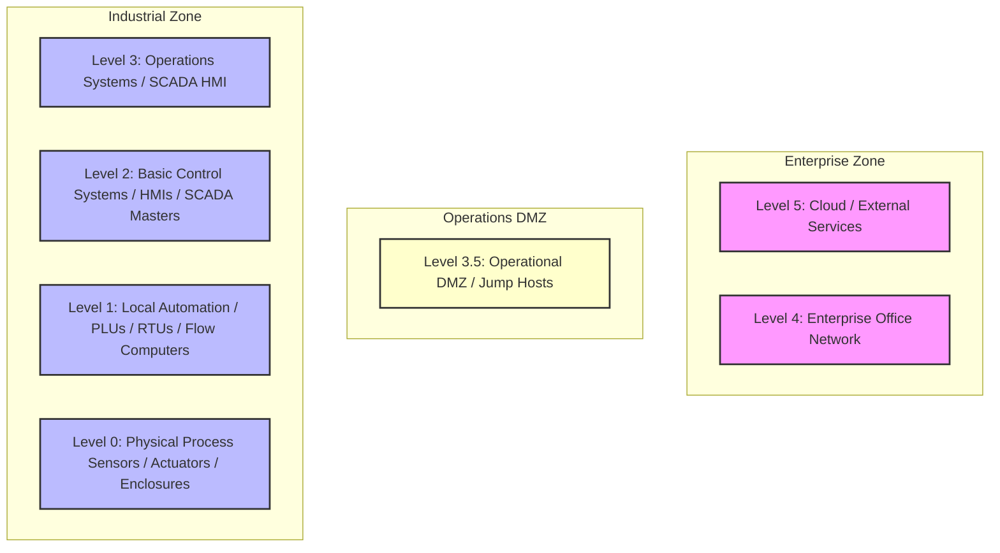

# 📘 Compliance Record of Note: BSI IT-Grundschutz
## German IT Baseline Protection Methodology

---

## 📋 Framework Overview
* **Framework ID**: `BSI_IT_GRUNDSCHUTZ`
* **Category**: `General IT/OT`
* **Industry Sector (Primary)**: `Cross-Sector`
* **Mapped CISA Critical Sectors**: `Information Technology`, `Commercial Facilities`, `Government Facilities`
* **Control Scope**: Contains 104 high-fidelity operational technology (OT) and information technology (IT) compliance checks.

> [!NOTE]
> This document serves as the official **Record of Note** and artifact for the BSI IT-Grundschutz framework. All control questions, standard codes, and Purdue Model mappings are compiled directly from CSET definitions.

### Description
German BSI framework mapping detailed, structural security controls protecting enterprise networks.

---

## 📐 Purdue Model Mapping

Control levels are logically aligned with the Purdue Enterprise Reference Architecture (PERA) to isolate process control boundaries from enterprise systems:

---

## 🛡️ Control Matrix

| Standard Code | Question Text | Category | Purdue Level | Guidance / Description |
| :--- | :--- | :--- | :---: | :--- |
| **BSI-BSI-1.1** | Are information security policies defined, approved by management, and reviewed annually? | Grundschutz Organizational Controls | 4 | Verify documented policies, executive approval signatures, and evidence of annual review cycles.  SOP: 1. Enforce strict role-based access controls (RBAC) separating administrative tasks from standard operator routines. 2. Route all incoming remote connections through isolated administrative Jump Hosts with visual session logging active. 3. Conduct quarterly access audits to identify and completely disable dormant or inactive accounts.  VERIFICATION CRITERIA: Inspect the grundschutz organizational controls configurations, check the verified logs, review the system settings, and check the following: General OT/IT security evidence must include: change management tracking tickets, Active Directory Group Policy Objects (GPOs), system log archives, and Nozomi/Dragos anomaly monitoring configuration files.  OT/IT CONVERGENCE RISK: General IT-OT convergence increases the threat landscape by bridging air-gapped industrial facilities with internet-facing corporate systems. Failing to enforce strict regulatory controls risks introducing severe operational vulnerabilities. |
| **BSI-BSI-1.2** | Are rules to control physical and logical access to information established and enforced? | Grundschutz Organizational Controls | 3 | Audit access control lists, active directory group policies, and user privilege provisioning logs.  SOP: 1. Deploy endpoint protection agents configured with real-time process monitoring to block unsigned scripts and execution threats. 2. Enforce automatic session logout GPOs terminating interactive operator connections after a defined period of inactivity. 3. Configure system event log forwarding to stream all reboots, login attempts, and administrative modifications to a centralized syslog receiver.  VERIFICATION CRITERIA: Inspect the grundschutz organizational controls configurations, check the verified logs, review the system settings, and check the following: General OT/IT security evidence must include: change management tracking tickets, Active Directory Group Policy Objects (GPOs), system log archives, and Nozomi/Dragos anomaly monitoring configuration files.  OT/IT CONVERGENCE RISK: General IT-OT convergence increases the threat landscape by bridging air-gapped industrial facilities with internet-facing corporate systems. Failing to enforce strict regulatory controls risks introducing severe operational vulnerabilities. |
| **BSI-BSI-2.1** | Is ICT readiness planned, implemented, maintained, and tested based on business continuity objectives? | Grundschutz Technical Hardening | 3 | Verify business continuity plans, test logs, backup server readiness, and failover automation parameters.  SOP: 1. Deploy endpoint protection agents configured with real-time process monitoring to block unsigned scripts and execution threats. 2. Enforce automatic session logout GPOs terminating interactive operator connections after a defined period of inactivity. 3. Configure system event log forwarding to stream all reboots, login attempts, and administrative modifications to a centralized syslog receiver.  VERIFICATION CRITERIA: Inspect the grundschutz technical hardening configurations, check the verified logs, review the system settings, and check the following: General OT/IT security evidence must include: change management tracking tickets, Active Directory Group Policy Objects (GPOs), system log archives, and Nozomi/Dragos anomaly monitoring configuration files.  OT/IT CONVERGENCE RISK: Using unhardened or unpatched field controllers opens critical hardware interfaces to remote execution exploits. Attackers can leverage known vulnerabilities to flash unauthorized firmware or change safety threshold parameters on active PLCs. |
| **BSI-BSI-2.2** | Are networks and network devices secured, managed, and controlled? | Grundschutz Technical Hardening | 3 | Audit switch and router configuration files, verify VLAN segregation, and inspect boundary firewall rule settings.  SOP: 1. Deploy endpoint protection agents configured with real-time process monitoring to block unsigned scripts and execution threats. 2. Enforce automatic session logout GPOs terminating interactive operator connections after a defined period of inactivity. 3. Configure system event log forwarding to stream all reboots, login attempts, and administrative modifications to a centralized syslog receiver.  VERIFICATION CRITERIA: Inspect the grundschutz technical hardening configurations, check the verified logs, review the system settings, and check the following: General OT/IT security evidence must include: change management tracking tickets, Active Directory Group Policy Objects (GPOs), system log archives, and Nozomi/Dragos anomaly monitoring configuration files.  OT/IT CONVERGENCE RISK: Using unhardened or unpatched field controllers opens critical hardware interfaces to remote execution exploits. Attackers can leverage known vulnerabilities to flash unauthorized firmware or change safety threshold parameters on active PLCs. |
| **BSI-BSI-3.1** | Are background verification checks on all candidates for employment carried out? | Grundschutz People Controls | 4 | Review HR background check logs, vetting criteria, and local screening requirements for key roles.  SOP: 1. Enforce strict role-based access controls (RBAC) separating administrative tasks from standard operator routines. 2. Route all incoming remote connections through isolated administrative Jump Hosts with visual session logging active. 3. Conduct quarterly access audits to identify and completely disable dormant or inactive accounts.  VERIFICATION CRITERIA: Inspect the grundschutz people controls configurations, check the verified logs, review the system settings, and check the following: General OT/IT security evidence must include: change management tracking tickets, Active Directory Group Policy Objects (GPOs), system log archives, and Nozomi/Dragos anomaly monitoring configuration files.  OT/IT CONVERGENCE RISK: General IT-OT convergence increases the threat landscape by bridging air-gapped industrial facilities with internet-facing corporate systems. Failing to enforce strict regulatory controls risks introducing severe operational vulnerabilities. |
| **BSI-BSI-3.2** | Are confidentiality or non-disclosure agreements reflecting organization requirements signed by all personnel? | Grundschutz People Controls | 4 | Check HR files for signed NDAs, contract clauses, and annual renewal compliance logs.  SOP: 1. Enforce strict role-based access controls (RBAC) separating administrative tasks from standard operator routines. 2. Route all incoming remote connections through isolated administrative Jump Hosts with visual session logging active. 3. Conduct quarterly access audits to identify and completely disable dormant or inactive accounts.  VERIFICATION CRITERIA: Inspect the grundschutz people controls configurations, check the verified logs, review the system settings, and check the following: General OT/IT security evidence must include: change management tracking tickets, Active Directory Group Policy Objects (GPOs), system log archives, and Nozomi/Dragos anomaly monitoring configuration files.  OT/IT CONVERGENCE RISK: General IT-OT convergence increases the threat landscape by bridging air-gapped industrial facilities with internet-facing corporate systems. Failing to enforce strict regulatory controls risks introducing severe operational vulnerabilities. |
| **BSI-BSI-4.1** | Are security perimeters defined and used to protect areas containing sensitive information? | Grundschutz Physical Controls | 1 | Verify physical boundary walls, locked door keycards, and perimeter security fencing at data centers and operations enclaves.  SOP: 1. Establish physical locking covers and secure enclosures around critical field device interfaces. 2. Configure hardware configuration locks and disable local diagnostic ports (USB, RS-232) to block local unauthorized adjustments. 3. Validate that device configuration changes require double-signature supervisor tokens before logical modifications are written to memory.  VERIFICATION CRITERIA: Inspect the grundschutz physical controls configurations, check the verified logs, review the system settings, and check the following: General OT/IT security evidence must include: change management tracking tickets, Active Directory Group Policy Objects (GPOs), system log archives, and Nozomi/Dragos anomaly monitoring configuration files.  OT/IT CONVERGENCE RISK: General IT-OT convergence increases the threat landscape by bridging air-gapped industrial facilities with internet-facing corporate systems. Failing to enforce strict regulatory controls risks introducing severe operational vulnerabilities. |
| **BSI-BSI-4.2** | Are secure areas protected by appropriate entry controls and visitor logs? | Grundschutz Physical Controls | 1 | Inspect visitor logbooks, biometric entry badges, and CCTV monitoring feeds at critical operations doors.  SOP: 1. Establish physical locking covers and secure enclosures around critical field device interfaces. 2. Configure hardware configuration locks and disable local diagnostic ports (USB, RS-232) to block local unauthorized adjustments. 3. Validate that device configuration changes require double-signature supervisor tokens before logical modifications are written to memory.  VERIFICATION CRITERIA: Inspect the grundschutz physical controls configurations, check the verified logs, review the system settings, and check the following: General OT/IT security evidence must include: change management tracking tickets, Active Directory Group Policy Objects (GPOs), system log archives, and Nozomi/Dragos anomaly monitoring configuration files.  OT/IT CONVERGENCE RISK: General IT-OT convergence increases the threat landscape by bridging air-gapped industrial facilities with internet-facing corporate systems. Failing to enforce strict regulatory controls risks introducing severe operational vulnerabilities. |
| **BSI-BSI-5.1** | Are user endpoint devices managed, hardened, and secured against malware (covering Siemens S7-1500 PLCs, Allen-Bradley ControlLogix, SEL RTUs, and digital relay modules)? | Grundschutz Device Safety | 3 | Validate antivirus status, active firewall configs, and automated patch management on all operator laptops.  SOP: 1. Deploy endpoint protection agents configured with real-time process monitoring to block unsigned scripts and execution threats. 2. Enforce automatic session logout GPOs terminating interactive operator connections after a defined period of inactivity. 3. Configure system event log forwarding to stream all reboots, login attempts, and administrative modifications to a centralized syslog receiver.  VERIFICATION CRITERIA: Inspect the grundschutz device safety configurations, check the verified logs, review the system settings, and check the following: General OT/IT security evidence must include: change management tracking tickets, Active Directory Group Policy Objects (GPOs), system log archives, and Nozomi/Dragos anomaly monitoring configuration files.  OT/IT CONVERGENCE RISK: Using unhardened or unpatched field controllers opens critical hardware interfaces to remote execution exploits. Attackers can leverage known vulnerabilities to flash unauthorized firmware or change safety threshold parameters on active PLCs. |
| **BSI-BSI-5.2** | Are data leakage prevention measures applied to systems storing sensitive data (covering Siemens S7-1500 PLCs, Allen-Bradley ControlLogix, SEL RTUs, and digital relay modules)? | Grundschutz Device Safety | 3 | Verify DLP software policies, inspect outbound network filtering rules, and check data transfer block logs.  SOP: 1. Deploy endpoint protection agents configured with real-time process monitoring to block unsigned scripts and execution threats. 2. Enforce automatic session logout GPOs terminating interactive operator connections after a defined period of inactivity. 3. Configure system event log forwarding to stream all reboots, login attempts, and administrative modifications to a centralized syslog receiver.  VERIFICATION CRITERIA: Inspect the grundschutz device safety configurations, check the verified logs, review the system settings, and check the following: General OT/IT security evidence must include: change management tracking tickets, Active Directory Group Policy Objects (GPOs), system log archives, and Nozomi/Dragos anomaly monitoring configuration files.  OT/IT CONVERGENCE RISK: Using unhardened or unpatched field controllers opens critical hardware interfaces to remote execution exploits. Attackers can leverage known vulnerabilities to flash unauthorized firmware or change safety threshold parameters on active PLCs. |
| **BSI-C-11** | Are unique user credentials and multi-factor authentication (MFA) enforced for all operational and administrative interfaces (utilizing secure Jump Hosts, MFA validation nodes, active directory GPOs, and hardware tokens)? | Access Control & Identity | 4 | Verify compliance against BSI IT GRUNDSCHUTZ requirements for control BSI-C-11.  SOP: 1. Enforce strict role-based access controls (RBAC) separating administrative tasks from standard operator routines. 2. Route all incoming remote connections through isolated administrative Jump Hosts with visual session logging active. 3. Conduct quarterly access audits to identify and completely disable dormant or inactive accounts.  VERIFICATION CRITERIA: Inspect the access control & identity configurations, check the verified logs, review the system settings, and check the following: Evaluation evidence must include: Active Directory group policies, Jump Server log databases, MFA configuration logs, and administrative access audit certificates.  OT/IT CONVERGENCE RISK: Unauthenticated or unmonitored IT-OT bridge endpoints can expose critical networks to lateral pivoting. An administrative compromise in the enterprise domain (such as phishing or AD account compromise) can lead directly to unauthorized SCADA control commands. |
| **BSI-C-12** | Are electronic security perimeters and operational DMZs implemented to logically segment industrial networks (enforced by Cisco Industrial Ethernet switches, network zoning firewalls, and isolated Purdue model level boundaries)? | Boundary Protection & Network Segmentation | 3 | Verify compliance against BSI IT GRUNDSCHUTZ requirements for control BSI-C-12.  SOP: 1. Deploy an Operational DMZ to segment Level 3 and Level 4 network communications. 2. Route all boundary traffic through stateful firewalls with dynamic threat prevention active. 3. Disable all unused physical ports and implement unidirectional data diodes for safety loops.  VERIFICATION CRITERIA: Inspect the boundary protection & network segmentation configurations, check the verified logs, review the system settings, and check the following: Evaluation evidence must include: Zone and Conduit design architecture diagram, Security Level Target (SL-T) vs Security Level Achieved (SL-A) matrix, and network firewall configuration files.  OT/IT CONVERGENCE RISK: Inadequate network segmentation allows IT-OT convergence traffic to flow unmediated across enclaves. A malware infection on the corporate LAN (like ransomware) can propagate directly to critical process control loops, halting operations. |
| **BSI-C-13** | Are default passwords disabled and unused software services deactivated on all host endpoints (covering Siemens S7-1500 PLCs, Allen-Bradley ControlLogix, SEL RTUs, and digital relay modules)? | Host Hardening - Device Integrity | 2 | Verify compliance against BSI IT GRUNDSCHUTZ requirements for control BSI-C-13.  SOP: 1. Disable all unnecessary local services (e.g. FTP, raw Telnet, HTTP) in host operating system settings. 2. Configure host configuration locks and disable local diagnostic ports to block unauthorized adjustments. 3. Enforce application whitelisting and configuration baselines on all engineering terminals.  VERIFICATION CRITERIA: Inspect the host hardening - device integrity configurations, check the verified logs, review the system settings, and check the following: Evaluation evidence must include: host hardening checklists, disabled service audit logs, application whitelisting policies, and local host configuration files.  OT/IT CONVERGENCE RISK: Using unhardened or unpatched field controllers opens critical hardware interfaces to remote execution exploits. Attackers can leverage known vulnerabilities to flash unauthorized firmware or change safety threshold parameters on active PLCs. |
| **BSI-C-14** | Are system event logs synchronized via secure NTP and stored continuously on write-once media (aligned with incident response playbooks, offsite backups, and isolated write-once media)? | Audit Trails & Security Logging | 3 | Verify compliance against BSI IT GRUNDSCHUTZ requirements for control BSI-C-14.  SOP: 1. Configure centralized syslog forwarding to stream all reboots, login attempts, and administrative modifications. 2. Synchronize all system logs using secure NTP servers with verified time offsets. 3. Restrict log access to authorized audit roles and configure log alerts for high-priority security events.  VERIFICATION CRITERIA: Inspect the audit trails & security logging configurations, check the verified logs, review the system settings, and check the following: Evaluation evidence must include: NTP synchronization logs, centralized syslog receiver configurations, write-once media validation tests, and log audit registers.  OT/IT CONVERGENCE RISK: Failing to maintain comprehensive, synchronized event logs during a convergence breach blinds security teams to the attacker's footprint. Without centralized logs, forensic tracking of unauthorized PLC firmware changes or database adjustments is impossible. |
| **BSI-C-15** | Are physical access controls and locking covers implemented around critical equipment cabinets (covering Siemens S7-1500 PLCs, Allen-Bradley ControlLogix, SEL RTUs, and digital relay modules)? | Physical Protection & Enclosures | 1 | Verify compliance against BSI IT GRUNDSCHUTZ requirements for control BSI-C-15.  SOP: 1. Establish physical locking covers and secure enclosures around critical field device interfaces. 2. Deploy electronic badge access and security cameras to monitor all entry boundaries. 3. Maintain visitor logs and enforce mandatory escorts for all unauthorized personnel.  VERIFICATION CRITERIA: Inspect the physical protection & enclosures configurations, check the verified logs, review the system settings, and check the following: Evaluation evidence must include: physical security plan, electronic badge entry history log, security camera archive, visitor registry, and enclosure inspection logs.  OT/IT CONVERGENCE RISK: Unrestricted physical access to hardware enclaves bypasses all logical firewall policies. An attacker with physical cabinet access can connect a malicious device directly to the backplane, flashing compromised logic onto operating controllers. |
| **BSI-C-16** | Are offline, tested backups of device logic and HMI applications maintained regularly (aligned with incident response playbooks, offsite backups, and isolated write-once media)? | Disaster Recovery & Backup Continuity | 3 | Verify compliance against BSI IT GRUNDSCHUTZ requirements for control BSI-C-16.  SOP: 1. Run weekly backups of all running PLC configurations and logic programs. 2. Store backup images in secure offsite fireproof enclosures or write-once media. 3. Conduct annual backup restoration simulation tests to verify recovery time objectives.  VERIFICATION CRITERIA: Inspect the disaster recovery & backup continuity configurations, check the verified logs, review the system settings, and check the following: disaster recovery plan, backup log verification sheets, offsite media transit registry, and annual restoration simulation test reports.  OT/IT CONVERGENCE RISK: Failing to maintain isolated, offline backups during convergence events risks catastrophic downtime during ransomware outbreaks. If backups reside on the shared enterprise domain, the same malware that encrypts SCADA HMIs will wipe the recovery configurations. |
| **BSI-C-17** | Are telemetry lines and industrial communication links encrypted utilizing secure protocols (utilizing VPN tunnels, encrypted Modbus/DNP3 secure protocols, and HSM keys)? | Data Integrity & Telemetry | 2 | Verify compliance against BSI IT GRUNDSCHUTZ requirements for control BSI-C-17.  SOP: 1. Implement VPN tunnels or hardware encryption modules for all wide-area telemetry links. 2. Transition raw serial or unencrypted communications to secure protocols like Secure DNP3 or OPC UA. 3. Restrict logical access to communications adapters and configure cryptographic key rotation.  VERIFICATION CRITERIA: Inspect the data integrity & telemetry configurations, check the verified logs, review the system settings, and check the following: communications link encryption audit report, VPN router configurations, Secure DNP3/OPC UA log traces, and cryptographic key management records.  OT/IT CONVERGENCE RISK: Traversing industrial telemetry in cleartext across converged networks invites eavesdropping and packet injection. Malicious actors can execute Man-in-the-Middle (MitM) attacks, spoofing HMI screens while sending dangerous control commands. |
| **BSI-C-18** | Are third-party vendor integrations and hardware components audited for cyber risks (aligned with incident response playbooks, offsite backups, and isolated write-once media)? | Supply Chain Risk Management | 3 | Verify compliance against BSI IT GRUNDSCHUTZ requirements for control BSI-C-18.  SOP: 1. Include explicit cybersecurity requirements in all third-party vendor contracts. 2. Audit vendor remote support channels and deactivate them immediately after use. 3. Perform logical integrity checks on all newly arrived hardware and software components before installation.  VERIFICATION CRITERIA: Inspect the supply chain risk management configurations, check the verified logs, review the system settings, and check the following: vendor contract agreements, SBOM lists, remote access permission logs, and incoming hardware security audit reports.  OT/IT CONVERGENCE RISK: Failing to govern third-party integration access introduces silent vulnerabilities. A compromise at a vendor's remote workstation can bypass operational perimeters, injecting malicious firmware or settings directly into the production loops. |
| **BSI-C-19** | Are unique user credentials and multi-factor authentication (MFA) enforced for all operational and administrative interfaces (utilizing secure Jump Hosts, MFA validation nodes, active directory GPOs, and hardware tokens)? | Access Control & Identity | 4 | Verify compliance against BSI IT GRUNDSCHUTZ requirements for control BSI-C-19.  SOP: 1. Enforce strict role-based access controls (RBAC) separating administrative tasks from standard operator routines. 2. Route all incoming remote connections through isolated administrative Jump Hosts with visual session logging active. 3. Conduct quarterly access audits to identify and completely disable dormant or inactive accounts.  VERIFICATION CRITERIA: Inspect the access control & identity configurations, check the verified logs, review the system settings, and check the following: Evaluation evidence must include: Active Directory group policies, Jump Server log databases, MFA configuration logs, and administrative access audit certificates.  OT/IT CONVERGENCE RISK: Unauthenticated or unmonitored IT-OT bridge endpoints can expose critical networks to lateral pivoting. An administrative compromise in the enterprise domain (such as phishing or AD account compromise) can lead directly to unauthorized SCADA control commands. |
| **BSI-C-20** | Are electronic security perimeters and operational DMZs implemented to logically segment industrial networks (enforced by Cisco Industrial Ethernet switches, network zoning firewalls, and isolated Purdue model level boundaries)? | Boundary Protection & Network Segmentation | 3 | Verify compliance against BSI IT GRUNDSCHUTZ requirements for control BSI-C-20.  SOP: 1. Deploy an Operational DMZ to segment Level 3 and Level 4 network communications. 2. Route all boundary traffic through stateful firewalls with dynamic threat prevention active. 3. Disable all unused physical ports and implement unidirectional data diodes for safety loops.  VERIFICATION CRITERIA: Inspect the boundary protection & network segmentation configurations, check the verified logs, review the system settings, and check the following: Evaluation evidence must include: Zone and Conduit design architecture diagram, Security Level Target (SL-T) vs Security Level Achieved (SL-A) matrix, and network firewall configuration files.  OT/IT CONVERGENCE RISK: Inadequate network segmentation allows IT-OT convergence traffic to flow unmediated across enclaves. A malware infection on the corporate LAN (like ransomware) can propagate directly to critical process control loops, halting operations. |
| **BSI-C-21** | Are default passwords disabled and unused software services deactivated on all host endpoints (covering Siemens S7-1500 PLCs, Allen-Bradley ControlLogix, SEL RTUs, and digital relay modules)? | Host Hardening - Device Integrity | 2 | Verify compliance against BSI IT GRUNDSCHUTZ requirements for control BSI-C-21.  SOP: 1. Disable all unnecessary local services (e.g. FTP, raw Telnet, HTTP) in host operating system settings. 2. Configure host configuration locks and disable local diagnostic ports to block unauthorized adjustments. 3. Enforce application whitelisting and configuration baselines on all engineering terminals.  VERIFICATION CRITERIA: Inspect the host hardening - device integrity configurations, check the verified logs, review the system settings, and check the following: Evaluation evidence must include: host hardening checklists, disabled service audit logs, application whitelisting policies, and local host configuration files.  OT/IT CONVERGENCE RISK: Using unhardened or unpatched field controllers opens critical hardware interfaces to remote execution exploits. Attackers can leverage known vulnerabilities to flash unauthorized firmware or change safety threshold parameters on active PLCs. |
| **BSI-C-22** | Are system event logs synchronized via secure NTP and stored continuously on write-once media (aligned with incident response playbooks, offsite backups, and isolated write-once media)? | Audit Trails & Security Logging | 3 | Verify compliance against BSI IT GRUNDSCHUTZ requirements for control BSI-C-22.  SOP: 1. Configure centralized syslog forwarding to stream all reboots, login attempts, and administrative modifications. 2. Synchronize all system logs using secure NTP servers with verified time offsets. 3. Restrict log access to authorized audit roles and configure log alerts for high-priority security events.  VERIFICATION CRITERIA: Inspect the audit trails & security logging configurations, check the verified logs, review the system settings, and check the following: Evaluation evidence must include: NTP synchronization logs, centralized syslog receiver configurations, write-once media validation tests, and log audit registers.  OT/IT CONVERGENCE RISK: Failing to maintain comprehensive, synchronized event logs during a convergence breach blinds security teams to the attacker's footprint. Without centralized logs, forensic tracking of unauthorized PLC firmware changes or database adjustments is impossible. |
| **BSI-C-23** | Are physical access controls and locking covers implemented around critical equipment cabinets (covering Siemens S7-1500 PLCs, Allen-Bradley ControlLogix, SEL RTUs, and digital relay modules)? | Physical Protection & Enclosures | 1 | Verify compliance against BSI IT GRUNDSCHUTZ requirements for control BSI-C-23.  SOP: 1. Establish physical locking covers and secure enclosures around critical field device interfaces. 2. Deploy electronic badge access and security cameras to monitor all entry boundaries. 3. Maintain visitor logs and enforce mandatory escorts for all unauthorized personnel.  VERIFICATION CRITERIA: Inspect the physical protection & enclosures configurations, check the verified logs, review the system settings, and check the following: Evaluation evidence must include: physical security plan, electronic badge entry history log, security camera archive, visitor registry, and enclosure inspection logs.  OT/IT CONVERGENCE RISK: Unrestricted physical access to hardware enclaves bypasses all logical firewall policies. An attacker with physical cabinet access can connect a malicious device directly to the backplane, flashing compromised logic onto operating controllers. |
| **BSI-C-24** | Are offline, tested backups of device logic and HMI applications maintained regularly (aligned with incident response playbooks, offsite backups, and isolated write-once media)? | Disaster Recovery & Backup Continuity | 3 | Verify compliance against BSI IT GRUNDSCHUTZ requirements for control BSI-C-24.  SOP: 1. Run weekly backups of all running PLC configurations and logic programs. 2. Store backup images in secure offsite fireproof enclosures or write-once media. 3. Conduct annual backup restoration simulation tests to verify recovery time objectives.  VERIFICATION CRITERIA: Inspect the disaster recovery & backup continuity configurations, check the verified logs, review the system settings, and check the following: disaster recovery plan, backup log verification sheets, offsite media transit registry, and annual restoration simulation test reports.  OT/IT CONVERGENCE RISK: Failing to maintain isolated, offline backups during convergence events risks catastrophic downtime during ransomware outbreaks. If backups reside on the shared enterprise domain, the same malware that encrypts SCADA HMIs will wipe the recovery configurations. |
| **BSI-C-25** | Are telemetry lines and industrial communication links encrypted utilizing secure protocols (utilizing VPN tunnels, encrypted Modbus/DNP3 secure protocols, and HSM keys)? | Data Integrity & Telemetry | 2 | Verify compliance against BSI IT GRUNDSCHUTZ requirements for control BSI-C-25.  SOP: 1. Implement VPN tunnels or hardware encryption modules for all wide-area telemetry links. 2. Transition raw serial or unencrypted communications to secure protocols like Secure DNP3 or OPC UA. 3. Restrict logical access to communications adapters and configure cryptographic key rotation.  VERIFICATION CRITERIA: Inspect the data integrity & telemetry configurations, check the verified logs, review the system settings, and check the following: communications link encryption audit report, VPN router configurations, Secure DNP3/OPC UA log traces, and cryptographic key management records.  OT/IT CONVERGENCE RISK: Traversing industrial telemetry in cleartext across converged networks invites eavesdropping and packet injection. Malicious actors can execute Man-in-the-Middle (MitM) attacks, spoofing HMI screens while sending dangerous control commands. |
| **BSI-C-26** | Are third-party vendor integrations and hardware components audited for cyber risks (aligned with incident response playbooks, offsite backups, and isolated write-once media)? | Supply Chain Risk Management | 3 | Verify compliance against BSI IT GRUNDSCHUTZ requirements for control BSI-C-26.  SOP: 1. Include explicit cybersecurity requirements in all third-party vendor contracts. 2. Audit vendor remote support channels and deactivate them immediately after use. 3. Perform logical integrity checks on all newly arrived hardware and software components before installation.  VERIFICATION CRITERIA: Inspect the supply chain risk management configurations, check the verified logs, review the system settings, and check the following: vendor contract agreements, SBOM lists, remote access permission logs, and incoming hardware security audit reports.  OT/IT CONVERGENCE RISK: Failing to govern third-party integration access introduces silent vulnerabilities. A compromise at a vendor's remote workstation can bypass operational perimeters, injecting malicious firmware or settings directly into the production loops. |
| **BSI-C-27** | Are unique user credentials and multi-factor authentication (MFA) enforced for all operational and administrative interfaces (utilizing secure Jump Hosts, MFA validation nodes, active directory GPOs, and hardware tokens)? | Access Control & Identity | 4 | Verify compliance against BSI IT GRUNDSCHUTZ requirements for control BSI-C-27.  SOP: 1. Enforce strict role-based access controls (RBAC) separating administrative tasks from standard operator routines. 2. Route all incoming remote connections through isolated administrative Jump Hosts with visual session logging active. 3. Conduct quarterly access audits to identify and completely disable dormant or inactive accounts.  VERIFICATION CRITERIA: Inspect the access control & identity configurations, check the verified logs, review the system settings, and check the following: Evaluation evidence must include: Active Directory group policies, Jump Server log databases, MFA configuration logs, and administrative access audit certificates.  OT/IT CONVERGENCE RISK: Unauthenticated or unmonitored IT-OT bridge endpoints can expose critical networks to lateral pivoting. An administrative compromise in the enterprise domain (such as phishing or AD account compromise) can lead directly to unauthorized SCADA control commands. |
| **BSI-C-28** | Are electronic security perimeters and operational DMZs implemented to logically segment industrial networks (enforced by Cisco Industrial Ethernet switches, network zoning firewalls, and isolated Purdue model level boundaries)? | Boundary Protection & Network Segmentation | 3 | Verify compliance against BSI IT GRUNDSCHUTZ requirements for control BSI-C-28.  SOP: 1. Deploy an Operational DMZ to segment Level 3 and Level 4 network communications. 2. Route all boundary traffic through stateful firewalls with dynamic threat prevention active. 3. Disable all unused physical ports and implement unidirectional data diodes for safety loops.  VERIFICATION CRITERIA: Inspect the boundary protection & network segmentation configurations, check the verified logs, review the system settings, and check the following: Evaluation evidence must include: Zone and Conduit design architecture diagram, Security Level Target (SL-T) vs Security Level Achieved (SL-A) matrix, and network firewall configuration files.  OT/IT CONVERGENCE RISK: Inadequate network segmentation allows IT-OT convergence traffic to flow unmediated across enclaves. A malware infection on the corporate LAN (like ransomware) can propagate directly to critical process control loops, halting operations. |
| **BSI-C-29** | Are default passwords disabled and unused software services deactivated on all host endpoints (covering Siemens S7-1500 PLCs, Allen-Bradley ControlLogix, SEL RTUs, and digital relay modules)? | Host Hardening - Device Integrity | 2 | Verify compliance against BSI IT GRUNDSCHUTZ requirements for control BSI-C-29.  SOP: 1. Disable all unnecessary local services (e.g. FTP, raw Telnet, HTTP) in host operating system settings. 2. Configure host configuration locks and disable local diagnostic ports to block unauthorized adjustments. 3. Enforce application whitelisting and configuration baselines on all engineering terminals.  VERIFICATION CRITERIA: Inspect the host hardening - device integrity configurations, check the verified logs, review the system settings, and check the following: Evaluation evidence must include: host hardening checklists, disabled service audit logs, application whitelisting policies, and local host configuration files.  OT/IT CONVERGENCE RISK: Using unhardened or unpatched field controllers opens critical hardware interfaces to remote execution exploits. Attackers can leverage known vulnerabilities to flash unauthorized firmware or change safety threshold parameters on active PLCs. |
| **BSI-C-30** | Are system event logs synchronized via secure NTP and stored continuously on write-once media (aligned with incident response playbooks, offsite backups, and isolated write-once media)? | Audit Trails & Security Logging | 3 | Verify compliance against BSI IT GRUNDSCHUTZ requirements for control BSI-C-30.  SOP: 1. Configure centralized syslog forwarding to stream all reboots, login attempts, and administrative modifications. 2. Synchronize all system logs using secure NTP servers with verified time offsets. 3. Restrict log access to authorized audit roles and configure log alerts for high-priority security events.  VERIFICATION CRITERIA: Inspect the audit trails & security logging configurations, check the verified logs, review the system settings, and check the following: Evaluation evidence must include: NTP synchronization logs, centralized syslog receiver configurations, write-once media validation tests, and log audit registers.  OT/IT CONVERGENCE RISK: Failing to maintain comprehensive, synchronized event logs during a convergence breach blinds security teams to the attacker's footprint. Without centralized logs, forensic tracking of unauthorized PLC firmware changes or database adjustments is impossible. |
| **BSI-C-31** | Are physical access controls and locking covers implemented around critical equipment cabinets (covering Siemens S7-1500 PLCs, Allen-Bradley ControlLogix, SEL RTUs, and digital relay modules)? | Physical Protection & Enclosures | 1 | Verify compliance against BSI IT GRUNDSCHUTZ requirements for control BSI-C-31.  SOP: 1. Establish physical locking covers and secure enclosures around critical field device interfaces. 2. Deploy electronic badge access and security cameras to monitor all entry boundaries. 3. Maintain visitor logs and enforce mandatory escorts for all unauthorized personnel.  VERIFICATION CRITERIA: Inspect the physical protection & enclosures configurations, check the verified logs, review the system settings, and check the following: Evaluation evidence must include: physical security plan, electronic badge entry history log, security camera archive, visitor registry, and enclosure inspection logs.  OT/IT CONVERGENCE RISK: Unrestricted physical access to hardware enclaves bypasses all logical firewall policies. An attacker with physical cabinet access can connect a malicious device directly to the backplane, flashing compromised logic onto operating controllers. |
| **BSI-C-32** | Are offline, tested backups of device logic and HMI applications maintained regularly (aligned with incident response playbooks, offsite backups, and isolated write-once media)? | Disaster Recovery & Backup Continuity | 3 | Verify compliance against BSI IT GRUNDSCHUTZ requirements for control BSI-C-32.  SOP: 1. Run weekly backups of all running PLC configurations and logic programs. 2. Store backup images in secure offsite fireproof enclosures or write-once media. 3. Conduct annual backup restoration simulation tests to verify recovery time objectives.  VERIFICATION CRITERIA: Inspect the disaster recovery & backup continuity configurations, check the verified logs, review the system settings, and check the following: disaster recovery plan, backup log verification sheets, offsite media transit registry, and annual restoration simulation test reports.  OT/IT CONVERGENCE RISK: Failing to maintain isolated, offline backups during convergence events risks catastrophic downtime during ransomware outbreaks. If backups reside on the shared enterprise domain, the same malware that encrypts SCADA HMIs will wipe the recovery configurations. |
| **BSI-C-33** | Are telemetry lines and industrial communication links encrypted utilizing secure protocols (utilizing VPN tunnels, encrypted Modbus/DNP3 secure protocols, and HSM keys)? | Data Integrity & Telemetry | 2 | Verify compliance against BSI IT GRUNDSCHUTZ requirements for control BSI-C-33.  SOP: 1. Implement VPN tunnels or hardware encryption modules for all wide-area telemetry links. 2. Transition raw serial or unencrypted communications to secure protocols like Secure DNP3 or OPC UA. 3. Restrict logical access to communications adapters and configure cryptographic key rotation.  VERIFICATION CRITERIA: Inspect the data integrity & telemetry configurations, check the verified logs, review the system settings, and check the following: communications link encryption audit report, VPN router configurations, Secure DNP3/OPC UA log traces, and cryptographic key management records.  OT/IT CONVERGENCE RISK: Traversing industrial telemetry in cleartext across converged networks invites eavesdropping and packet injection. Malicious actors can execute Man-in-the-Middle (MitM) attacks, spoofing HMI screens while sending dangerous control commands. |
| **BSI-C-34** | Are third-party vendor integrations and hardware components audited for cyber risks (aligned with incident response playbooks, offsite backups, and isolated write-once media)? | Supply Chain Risk Management | 3 | Verify compliance against BSI IT GRUNDSCHUTZ requirements for control BSI-C-34.  SOP: 1. Include explicit cybersecurity requirements in all third-party vendor contracts. 2. Audit vendor remote support channels and deactivate them immediately after use. 3. Perform logical integrity checks on all newly arrived hardware and software components before installation.  VERIFICATION CRITERIA: Inspect the supply chain risk management configurations, check the verified logs, review the system settings, and check the following: vendor contract agreements, SBOM lists, remote access permission logs, and incoming hardware security audit reports.  OT/IT CONVERGENCE RISK: Failing to govern third-party integration access introduces silent vulnerabilities. A compromise at a vendor's remote workstation can bypass operational perimeters, injecting malicious firmware or settings directly into the production loops. |
| **BSI-C-35** | Are unique user credentials and multi-factor authentication (MFA) enforced for all operational and administrative interfaces (utilizing secure Jump Hosts, MFA validation nodes, active directory GPOs, and hardware tokens)? | Access Control & Identity | 4 | Verify compliance against BSI IT GRUNDSCHUTZ requirements for control BSI-C-35.  SOP: 1. Enforce strict role-based access controls (RBAC) separating administrative tasks from standard operator routines. 2. Route all incoming remote connections through isolated administrative Jump Hosts with visual session logging active. 3. Conduct quarterly access audits to identify and completely disable dormant or inactive accounts.  VERIFICATION CRITERIA: Inspect the access control & identity configurations, check the verified logs, review the system settings, and check the following: Evaluation evidence must include: Active Directory group policies, Jump Server log databases, MFA configuration logs, and administrative access audit certificates.  OT/IT CONVERGENCE RISK: Unauthenticated or unmonitored IT-OT bridge endpoints can expose critical networks to lateral pivoting. An administrative compromise in the enterprise domain (such as phishing or AD account compromise) can lead directly to unauthorized SCADA control commands. |
| **BSI-C-36** | Are electronic security perimeters and operational DMZs implemented to logically segment industrial networks (enforced by Cisco Industrial Ethernet switches, network zoning firewalls, and isolated Purdue model level boundaries)? | Boundary Protection & Network Segmentation | 3 | Verify compliance against BSI IT GRUNDSCHUTZ requirements for control BSI-C-36.  SOP: 1. Deploy an Operational DMZ to segment Level 3 and Level 4 network communications. 2. Route all boundary traffic through stateful firewalls with dynamic threat prevention active. 3. Disable all unused physical ports and implement unidirectional data diodes for safety loops.  VERIFICATION CRITERIA: Inspect the boundary protection & network segmentation configurations, check the verified logs, review the system settings, and check the following: Evaluation evidence must include: Zone and Conduit design architecture diagram, Security Level Target (SL-T) vs Security Level Achieved (SL-A) matrix, and network firewall configuration files.  OT/IT CONVERGENCE RISK: Inadequate network segmentation allows IT-OT convergence traffic to flow unmediated across enclaves. A malware infection on the corporate LAN (like ransomware) can propagate directly to critical process control loops, halting operations. |
| **BSI-C-37** | Are default passwords disabled and unused software services deactivated on all host endpoints (covering Siemens S7-1500 PLCs, Allen-Bradley ControlLogix, SEL RTUs, and digital relay modules)? | Host Hardening - Device Integrity | 2 | Verify compliance against BSI IT GRUNDSCHUTZ requirements for control BSI-C-37.  SOP: 1. Disable all unnecessary local services (e.g. FTP, raw Telnet, HTTP) in host operating system settings. 2. Configure host configuration locks and disable local diagnostic ports to block unauthorized adjustments. 3. Enforce application whitelisting and configuration baselines on all engineering terminals.  VERIFICATION CRITERIA: Inspect the host hardening - device integrity configurations, check the verified logs, review the system settings, and check the following: Evaluation evidence must include: host hardening checklists, disabled service audit logs, application whitelisting policies, and local host configuration files.  OT/IT CONVERGENCE RISK: Using unhardened or unpatched field controllers opens critical hardware interfaces to remote execution exploits. Attackers can leverage known vulnerabilities to flash unauthorized firmware or change safety threshold parameters on active PLCs. |
| **BSI-C-38** | Are system event logs synchronized via secure NTP and stored continuously on write-once media (aligned with incident response playbooks, offsite backups, and isolated write-once media)? | Audit Trails & Security Logging | 3 | Verify compliance against BSI IT GRUNDSCHUTZ requirements for control BSI-C-38.  SOP: 1. Configure centralized syslog forwarding to stream all reboots, login attempts, and administrative modifications. 2. Synchronize all system logs using secure NTP servers with verified time offsets. 3. Restrict log access to authorized audit roles and configure log alerts for high-priority security events.  VERIFICATION CRITERIA: Inspect the audit trails & security logging configurations, check the verified logs, review the system settings, and check the following: Evaluation evidence must include: NTP synchronization logs, centralized syslog receiver configurations, write-once media validation tests, and log audit registers.  OT/IT CONVERGENCE RISK: Failing to maintain comprehensive, synchronized event logs during a convergence breach blinds security teams to the attacker's footprint. Without centralized logs, forensic tracking of unauthorized PLC firmware changes or database adjustments is impossible. |
| **BSI-C-39** | Are physical access controls and locking covers implemented around critical equipment cabinets (covering Siemens S7-1500 PLCs, Allen-Bradley ControlLogix, SEL RTUs, and digital relay modules)? | Physical Protection & Enclosures | 1 | Verify compliance against BSI IT GRUNDSCHUTZ requirements for control BSI-C-39.  SOP: 1. Establish physical locking covers and secure enclosures around critical field device interfaces. 2. Deploy electronic badge access and security cameras to monitor all entry boundaries. 3. Maintain visitor logs and enforce mandatory escorts for all unauthorized personnel.  VERIFICATION CRITERIA: Inspect the physical protection & enclosures configurations, check the verified logs, review the system settings, and check the following: Evaluation evidence must include: physical security plan, electronic badge entry history log, security camera archive, visitor registry, and enclosure inspection logs.  OT/IT CONVERGENCE RISK: Unrestricted physical access to hardware enclaves bypasses all logical firewall policies. An attacker with physical cabinet access can connect a malicious device directly to the backplane, flashing compromised logic onto operating controllers. |
| **BSI-C-40** | Are offline, tested backups of device logic and HMI applications maintained regularly (aligned with incident response playbooks, offsite backups, and isolated write-once media)? | Disaster Recovery & Backup Continuity | 3 | Verify compliance against BSI IT GRUNDSCHUTZ requirements for control BSI-C-40.  SOP: 1. Run weekly backups of all running PLC configurations and logic programs. 2. Store backup images in secure offsite fireproof enclosures or write-once media. 3. Conduct annual backup restoration simulation tests to verify recovery time objectives.  VERIFICATION CRITERIA: Inspect the disaster recovery & backup continuity configurations, check the verified logs, review the system settings, and check the following: disaster recovery plan, backup log verification sheets, offsite media transit registry, and annual restoration simulation test reports.  OT/IT CONVERGENCE RISK: Failing to maintain isolated, offline backups during convergence events risks catastrophic downtime during ransomware outbreaks. If backups reside on the shared enterprise domain, the same malware that encrypts SCADA HMIs will wipe the recovery configurations. |
| **BSI-C-41** | Are telemetry lines and industrial communication links encrypted utilizing secure protocols (utilizing VPN tunnels, encrypted Modbus/DNP3 secure protocols, and HSM keys)? | Data Integrity & Telemetry | 2 | Verify compliance against BSI IT GRUNDSCHUTZ requirements for control BSI-C-41.  SOP: 1. Implement VPN tunnels or hardware encryption modules for all wide-area telemetry links. 2. Transition raw serial or unencrypted communications to secure protocols like Secure DNP3 or OPC UA. 3. Restrict logical access to communications adapters and configure cryptographic key rotation.  VERIFICATION CRITERIA: Inspect the data integrity & telemetry configurations, check the verified logs, review the system settings, and check the following: communications link encryption audit report, VPN router configurations, Secure DNP3/OPC UA log traces, and cryptographic key management records.  OT/IT CONVERGENCE RISK: Traversing industrial telemetry in cleartext across converged networks invites eavesdropping and packet injection. Malicious actors can execute Man-in-the-Middle (MitM) attacks, spoofing HMI screens while sending dangerous control commands. |
| **BSI-C-42** | Are third-party vendor integrations and hardware components audited for cyber risks (aligned with incident response playbooks, offsite backups, and isolated write-once media)? | Supply Chain Risk Management | 3 | Verify compliance against BSI IT GRUNDSCHUTZ requirements for control BSI-C-42.  SOP: 1. Include explicit cybersecurity requirements in all third-party vendor contracts. 2. Audit vendor remote support channels and deactivate them immediately after use. 3. Perform logical integrity checks on all newly arrived hardware and software components before installation.  VERIFICATION CRITERIA: Inspect the supply chain risk management configurations, check the verified logs, review the system settings, and check the following: vendor contract agreements, SBOM lists, remote access permission logs, and incoming hardware security audit reports.  OT/IT CONVERGENCE RISK: Failing to govern third-party integration access introduces silent vulnerabilities. A compromise at a vendor's remote workstation can bypass operational perimeters, injecting malicious firmware or settings directly into the production loops. |
| **BSI-C-43** | Are unique user credentials and multi-factor authentication (MFA) enforced for all operational and administrative interfaces (utilizing secure Jump Hosts, MFA validation nodes, active directory GPOs, and hardware tokens)? | Access Control & Identity | 4 | Verify compliance against BSI IT GRUNDSCHUTZ requirements for control BSI-C-43.  SOP: 1. Enforce strict role-based access controls (RBAC) separating administrative tasks from standard operator routines. 2. Route all incoming remote connections through isolated administrative Jump Hosts with visual session logging active. 3. Conduct quarterly access audits to identify and completely disable dormant or inactive accounts.  VERIFICATION CRITERIA: Inspect the access control & identity configurations, check the verified logs, review the system settings, and check the following: Evaluation evidence must include: Active Directory group policies, Jump Server log databases, MFA configuration logs, and administrative access audit certificates.  OT/IT CONVERGENCE RISK: Unauthenticated or unmonitored IT-OT bridge endpoints can expose critical networks to lateral pivoting. An administrative compromise in the enterprise domain (such as phishing or AD account compromise) can lead directly to unauthorized SCADA control commands. |
| **BSI-C-44** | Are electronic security perimeters and operational DMZs implemented to logically segment industrial networks (enforced by Cisco Industrial Ethernet switches, network zoning firewalls, and isolated Purdue model level boundaries)? | Boundary Protection & Network Segmentation | 3 | Verify compliance against BSI IT GRUNDSCHUTZ requirements for control BSI-C-44.  SOP: 1. Deploy an Operational DMZ to segment Level 3 and Level 4 network communications. 2. Route all boundary traffic through stateful firewalls with dynamic threat prevention active. 3. Disable all unused physical ports and implement unidirectional data diodes for safety loops.  VERIFICATION CRITERIA: Inspect the boundary protection & network segmentation configurations, check the verified logs, review the system settings, and check the following: Evaluation evidence must include: Zone and Conduit design architecture diagram, Security Level Target (SL-T) vs Security Level Achieved (SL-A) matrix, and network firewall configuration files.  OT/IT CONVERGENCE RISK: Inadequate network segmentation allows IT-OT convergence traffic to flow unmediated across enclaves. A malware infection on the corporate LAN (like ransomware) can propagate directly to critical process control loops, halting operations. |
| **BSI-C-45** | Are default passwords disabled and unused software services deactivated on all host endpoints (covering Siemens S7-1500 PLCs, Allen-Bradley ControlLogix, SEL RTUs, and digital relay modules)? | Host Hardening - Device Integrity | 2 | Verify compliance against BSI IT GRUNDSCHUTZ requirements for control BSI-C-45.  SOP: 1. Disable all unnecessary local services (e.g. FTP, raw Telnet, HTTP) in host operating system settings. 2. Configure host configuration locks and disable local diagnostic ports to block unauthorized adjustments. 3. Enforce application whitelisting and configuration baselines on all engineering terminals.  VERIFICATION CRITERIA: Inspect the host hardening - device integrity configurations, check the verified logs, review the system settings, and check the following: Evaluation evidence must include: host hardening checklists, disabled service audit logs, application whitelisting policies, and local host configuration files.  OT/IT CONVERGENCE RISK: Using unhardened or unpatched field controllers opens critical hardware interfaces to remote execution exploits. Attackers can leverage known vulnerabilities to flash unauthorized firmware or change safety threshold parameters on active PLCs. |
| **BSI-C-46** | Are system event logs synchronized via secure NTP and stored continuously on write-once media (aligned with incident response playbooks, offsite backups, and isolated write-once media)? | Audit Trails & Security Logging | 3 | Verify compliance against BSI IT GRUNDSCHUTZ requirements for control BSI-C-46.  SOP: 1. Configure centralized syslog forwarding to stream all reboots, login attempts, and administrative modifications. 2. Synchronize all system logs using secure NTP servers with verified time offsets. 3. Restrict log access to authorized audit roles and configure log alerts for high-priority security events.  VERIFICATION CRITERIA: Inspect the audit trails & security logging configurations, check the verified logs, review the system settings, and check the following: Evaluation evidence must include: NTP synchronization logs, centralized syslog receiver configurations, write-once media validation tests, and log audit registers.  OT/IT CONVERGENCE RISK: Failing to maintain comprehensive, synchronized event logs during a convergence breach blinds security teams to the attacker's footprint. Without centralized logs, forensic tracking of unauthorized PLC firmware changes or database adjustments is impossible. |
| **BSI-C-47** | Are physical access controls and locking covers implemented around critical equipment cabinets (covering Siemens S7-1500 PLCs, Allen-Bradley ControlLogix, SEL RTUs, and digital relay modules)? | Physical Protection & Enclosures | 1 | Verify compliance against BSI IT GRUNDSCHUTZ requirements for control BSI-C-47.  SOP: 1. Establish physical locking covers and secure enclosures around critical field device interfaces. 2. Deploy electronic badge access and security cameras to monitor all entry boundaries. 3. Maintain visitor logs and enforce mandatory escorts for all unauthorized personnel.  VERIFICATION CRITERIA: Inspect the physical protection & enclosures configurations, check the verified logs, review the system settings, and check the following: Evaluation evidence must include: physical security plan, electronic badge entry history log, security camera archive, visitor registry, and enclosure inspection logs.  OT/IT CONVERGENCE RISK: Unrestricted physical access to hardware enclaves bypasses all logical firewall policies. An attacker with physical cabinet access can connect a malicious device directly to the backplane, flashing compromised logic onto operating controllers. |
| **BSI-C-48** | Are offline, tested backups of device logic and HMI applications maintained regularly (aligned with incident response playbooks, offsite backups, and isolated write-once media)? | Disaster Recovery & Backup Continuity | 3 | Verify compliance against BSI IT GRUNDSCHUTZ requirements for control BSI-C-48.  SOP: 1. Run weekly backups of all running PLC configurations and logic programs. 2. Store backup images in secure offsite fireproof enclosures or write-once media. 3. Conduct annual backup restoration simulation tests to verify recovery time objectives.  VERIFICATION CRITERIA: Inspect the disaster recovery & backup continuity configurations, check the verified logs, review the system settings, and check the following: disaster recovery plan, backup log verification sheets, offsite media transit registry, and annual restoration simulation test reports.  OT/IT CONVERGENCE RISK: Failing to maintain isolated, offline backups during convergence events risks catastrophic downtime during ransomware outbreaks. If backups reside on the shared enterprise domain, the same malware that encrypts SCADA HMIs will wipe the recovery configurations. |
| **BSI-C-49** | Are telemetry lines and industrial communication links encrypted utilizing secure protocols (utilizing VPN tunnels, encrypted Modbus/DNP3 secure protocols, and HSM keys)? | Data Integrity & Telemetry | 2 | Verify compliance against BSI IT GRUNDSCHUTZ requirements for control BSI-C-49.  SOP: 1. Implement VPN tunnels or hardware encryption modules for all wide-area telemetry links. 2. Transition raw serial or unencrypted communications to secure protocols like Secure DNP3 or OPC UA. 3. Restrict logical access to communications adapters and configure cryptographic key rotation.  VERIFICATION CRITERIA: Inspect the data integrity & telemetry configurations, check the verified logs, review the system settings, and check the following: communications link encryption audit report, VPN router configurations, Secure DNP3/OPC UA log traces, and cryptographic key management records.  OT/IT CONVERGENCE RISK: Traversing industrial telemetry in cleartext across converged networks invites eavesdropping and packet injection. Malicious actors can execute Man-in-the-Middle (MitM) attacks, spoofing HMI screens while sending dangerous control commands. |
| **BSI-C-50** | Are third-party vendor integrations and hardware components audited for cyber risks (aligned with incident response playbooks, offsite backups, and isolated write-once media)? | Supply Chain Risk Management | 3 | Verify compliance against BSI IT GRUNDSCHUTZ requirements for control BSI-C-50.  SOP: 1. Include explicit cybersecurity requirements in all third-party vendor contracts. 2. Audit vendor remote support channels and deactivate them immediately after use. 3. Perform logical integrity checks on all newly arrived hardware and software components before installation.  VERIFICATION CRITERIA: Inspect the supply chain risk management configurations, check the verified logs, review the system settings, and check the following: vendor contract agreements, SBOM lists, remote access permission logs, and incoming hardware security audit reports.  OT/IT CONVERGENCE RISK: Failing to govern third-party integration access introduces silent vulnerabilities. A compromise at a vendor's remote workstation can bypass operational perimeters, injecting malicious firmware or settings directly into the production loops. |
| **BSI-C-51** | Are unique user credentials and multi-factor authentication (MFA) enforced for all operational and administrative interfaces (utilizing secure Jump Hosts, MFA validation nodes, active directory GPOs, and hardware tokens)? | Access Control & Identity | 4 | Verify compliance against BSI IT GRUNDSCHUTZ requirements for control BSI-C-51.  SOP: 1. Enforce strict role-based access controls (RBAC) separating administrative tasks from standard operator routines. 2. Route all incoming remote connections through isolated administrative Jump Hosts with visual session logging active. 3. Conduct quarterly access audits to identify and completely disable dormant or inactive accounts.  VERIFICATION CRITERIA: Inspect the access control & identity configurations, check the verified logs, review the system settings, and check the following: Evaluation evidence must include: Active Directory group policies, Jump Server log databases, MFA configuration logs, and administrative access audit certificates.  OT/IT CONVERGENCE RISK: Unauthenticated or unmonitored IT-OT bridge endpoints can expose critical networks to lateral pivoting. An administrative compromise in the enterprise domain (such as phishing or AD account compromise) can lead directly to unauthorized SCADA control commands. |
| **BSI-C-52** | Are electronic security perimeters and operational DMZs implemented to logically segment industrial networks (enforced by Cisco Industrial Ethernet switches, network zoning firewalls, and isolated Purdue model level boundaries)? | Boundary Protection & Network Segmentation | 3 | Verify compliance against BSI IT GRUNDSCHUTZ requirements for control BSI-C-52.  SOP: 1. Deploy an Operational DMZ to segment Level 3 and Level 4 network communications. 2. Route all boundary traffic through stateful firewalls with dynamic threat prevention active. 3. Disable all unused physical ports and implement unidirectional data diodes for safety loops.  VERIFICATION CRITERIA: Inspect the boundary protection & network segmentation configurations, check the verified logs, review the system settings, and check the following: Evaluation evidence must include: Zone and Conduit design architecture diagram, Security Level Target (SL-T) vs Security Level Achieved (SL-A) matrix, and network firewall configuration files.  OT/IT CONVERGENCE RISK: Inadequate network segmentation allows IT-OT convergence traffic to flow unmediated across enclaves. A malware infection on the corporate LAN (like ransomware) can propagate directly to critical process control loops, halting operations. |
| **BSI-C-53** | Are default passwords disabled and unused software services deactivated on all host endpoints (covering Siemens S7-1500 PLCs, Allen-Bradley ControlLogix, SEL RTUs, and digital relay modules)? | Host Hardening - Device Integrity | 2 | Verify compliance against BSI IT GRUNDSCHUTZ requirements for control BSI-C-53.  SOP: 1. Disable all unnecessary local services (e.g. FTP, raw Telnet, HTTP) in host operating system settings. 2. Configure host configuration locks and disable local diagnostic ports to block unauthorized adjustments. 3. Enforce application whitelisting and configuration baselines on all engineering terminals.  VERIFICATION CRITERIA: Inspect the host hardening - device integrity configurations, check the verified logs, review the system settings, and check the following: Evaluation evidence must include: host hardening checklists, disabled service audit logs, application whitelisting policies, and local host configuration files.  OT/IT CONVERGENCE RISK: Using unhardened or unpatched field controllers opens critical hardware interfaces to remote execution exploits. Attackers can leverage known vulnerabilities to flash unauthorized firmware or change safety threshold parameters on active PLCs. |
| **BSI-C-54** | Are system event logs synchronized via secure NTP and stored continuously on write-once media (aligned with incident response playbooks, offsite backups, and isolated write-once media)? | Audit Trails & Security Logging | 3 | Verify compliance against BSI IT GRUNDSCHUTZ requirements for control BSI-C-54.  SOP: 1. Configure centralized syslog forwarding to stream all reboots, login attempts, and administrative modifications. 2. Synchronize all system logs using secure NTP servers with verified time offsets. 3. Restrict log access to authorized audit roles and configure log alerts for high-priority security events.  VERIFICATION CRITERIA: Inspect the audit trails & security logging configurations, check the verified logs, review the system settings, and check the following: Evaluation evidence must include: NTP synchronization logs, centralized syslog receiver configurations, write-once media validation tests, and log audit registers.  OT/IT CONVERGENCE RISK: Failing to maintain comprehensive, synchronized event logs during a convergence breach blinds security teams to the attacker's footprint. Without centralized logs, forensic tracking of unauthorized PLC firmware changes or database adjustments is impossible. |
| **BSI-C-55** | Are physical access controls and locking covers implemented around critical equipment cabinets (covering Siemens S7-1500 PLCs, Allen-Bradley ControlLogix, SEL RTUs, and digital relay modules)? | Physical Protection & Enclosures | 1 | Verify compliance against BSI IT GRUNDSCHUTZ requirements for control BSI-C-55.  SOP: 1. Establish physical locking covers and secure enclosures around critical field device interfaces. 2. Deploy electronic badge access and security cameras to monitor all entry boundaries. 3. Maintain visitor logs and enforce mandatory escorts for all unauthorized personnel.  VERIFICATION CRITERIA: Inspect the physical protection & enclosures configurations, check the verified logs, review the system settings, and check the following: Evaluation evidence must include: physical security plan, electronic badge entry history log, security camera archive, visitor registry, and enclosure inspection logs.  OT/IT CONVERGENCE RISK: Unrestricted physical access to hardware enclaves bypasses all logical firewall policies. An attacker with physical cabinet access can connect a malicious device directly to the backplane, flashing compromised logic onto operating controllers. |
| **BSI-C-56** | Are offline, tested backups of device logic and HMI applications maintained regularly (aligned with incident response playbooks, offsite backups, and isolated write-once media)? | Disaster Recovery & Backup Continuity | 3 | Verify compliance against BSI IT GRUNDSCHUTZ requirements for control BSI-C-56.  SOP: 1. Run weekly backups of all running PLC configurations and logic programs. 2. Store backup images in secure offsite fireproof enclosures or write-once media. 3. Conduct annual backup restoration simulation tests to verify recovery time objectives.  VERIFICATION CRITERIA: Inspect the disaster recovery & backup continuity configurations, check the verified logs, review the system settings, and check the following: disaster recovery plan, backup log verification sheets, offsite media transit registry, and annual restoration simulation test reports.  OT/IT CONVERGENCE RISK: Failing to maintain isolated, offline backups during convergence events risks catastrophic downtime during ransomware outbreaks. If backups reside on the shared enterprise domain, the same malware that encrypts SCADA HMIs will wipe the recovery configurations. |
| **BSI-C-57** | Are telemetry lines and industrial communication links encrypted utilizing secure protocols (utilizing VPN tunnels, encrypted Modbus/DNP3 secure protocols, and HSM keys)? | Data Integrity & Telemetry | 2 | Verify compliance against BSI IT GRUNDSCHUTZ requirements for control BSI-C-57.  SOP: 1. Implement VPN tunnels or hardware encryption modules for all wide-area telemetry links. 2. Transition raw serial or unencrypted communications to secure protocols like Secure DNP3 or OPC UA. 3. Restrict logical access to communications adapters and configure cryptographic key rotation.  VERIFICATION CRITERIA: Inspect the data integrity & telemetry configurations, check the verified logs, review the system settings, and check the following: communications link encryption audit report, VPN router configurations, Secure DNP3/OPC UA log traces, and cryptographic key management records.  OT/IT CONVERGENCE RISK: Traversing industrial telemetry in cleartext across converged networks invites eavesdropping and packet injection. Malicious actors can execute Man-in-the-Middle (MitM) attacks, spoofing HMI screens while sending dangerous control commands. |
| **BSI-C-58** | Are third-party vendor integrations and hardware components audited for cyber risks (aligned with incident response playbooks, offsite backups, and isolated write-once media)? | Supply Chain Risk Management | 3 | Verify compliance against BSI IT GRUNDSCHUTZ requirements for control BSI-C-58.  SOP: 1. Include explicit cybersecurity requirements in all third-party vendor contracts. 2. Audit vendor remote support channels and deactivate them immediately after use. 3. Perform logical integrity checks on all newly arrived hardware and software components before installation.  VERIFICATION CRITERIA: Inspect the supply chain risk management configurations, check the verified logs, review the system settings, and check the following: vendor contract agreements, SBOM lists, remote access permission logs, and incoming hardware security audit reports.  OT/IT CONVERGENCE RISK: Failing to govern third-party integration access introduces silent vulnerabilities. A compromise at a vendor's remote workstation can bypass operational perimeters, injecting malicious firmware or settings directly into the production loops. |
| **BSI-C-59** | Are unique user credentials and multi-factor authentication (MFA) enforced for all operational and administrative interfaces (utilizing secure Jump Hosts, MFA validation nodes, active directory GPOs, and hardware tokens)? | Access Control & Identity | 4 | Verify compliance against BSI IT GRUNDSCHUTZ requirements for control BSI-C-59.  SOP: 1. Enforce strict role-based access controls (RBAC) separating administrative tasks from standard operator routines. 2. Route all incoming remote connections through isolated administrative Jump Hosts with visual session logging active. 3. Conduct quarterly access audits to identify and completely disable dormant or inactive accounts.  VERIFICATION CRITERIA: Inspect the access control & identity configurations, check the verified logs, review the system settings, and check the following: Evaluation evidence must include: Active Directory group policies, Jump Server log databases, MFA configuration logs, and administrative access audit certificates.  OT/IT CONVERGENCE RISK: Unauthenticated or unmonitored IT-OT bridge endpoints can expose critical networks to lateral pivoting. An administrative compromise in the enterprise domain (such as phishing or AD account compromise) can lead directly to unauthorized SCADA control commands. |
| **BSI-C-60** | Are electronic security perimeters and operational DMZs implemented to logically segment industrial networks (enforced by Cisco Industrial Ethernet switches, network zoning firewalls, and isolated Purdue model level boundaries)? | Boundary Protection & Network Segmentation | 3 | Verify compliance against BSI IT GRUNDSCHUTZ requirements for control BSI-C-60.  SOP: 1. Deploy an Operational DMZ to segment Level 3 and Level 4 network communications. 2. Route all boundary traffic through stateful firewalls with dynamic threat prevention active. 3. Disable all unused physical ports and implement unidirectional data diodes for safety loops.  VERIFICATION CRITERIA: Inspect the boundary protection & network segmentation configurations, check the verified logs, review the system settings, and check the following: Evaluation evidence must include: Zone and Conduit design architecture diagram, Security Level Target (SL-T) vs Security Level Achieved (SL-A) matrix, and network firewall configuration files.  OT/IT CONVERGENCE RISK: Inadequate network segmentation allows IT-OT convergence traffic to flow unmediated across enclaves. A malware infection on the corporate LAN (like ransomware) can propagate directly to critical process control loops, halting operations. |
| **BSI-C-61** | Are default passwords disabled and unused software services deactivated on all host endpoints (covering Siemens S7-1500 PLCs, Allen-Bradley ControlLogix, SEL RTUs, and digital relay modules)? | Host Hardening - Device Integrity | 2 | Verify compliance against BSI IT GRUNDSCHUTZ requirements for control BSI-C-61.  SOP: 1. Disable all unnecessary local services (e.g. FTP, raw Telnet, HTTP) in host operating system settings. 2. Configure host configuration locks and disable local diagnostic ports to block unauthorized adjustments. 3. Enforce application whitelisting and configuration baselines on all engineering terminals.  VERIFICATION CRITERIA: Inspect the host hardening - device integrity configurations, check the verified logs, review the system settings, and check the following: Evaluation evidence must include: host hardening checklists, disabled service audit logs, application whitelisting policies, and local host configuration files.  OT/IT CONVERGENCE RISK: Using unhardened or unpatched field controllers opens critical hardware interfaces to remote execution exploits. Attackers can leverage known vulnerabilities to flash unauthorized firmware or change safety threshold parameters on active PLCs. |
| **BSI-C-62** | Are system event logs synchronized via secure NTP and stored continuously on write-once media (aligned with incident response playbooks, offsite backups, and isolated write-once media)? | Audit Trails & Security Logging | 3 | Verify compliance against BSI IT GRUNDSCHUTZ requirements for control BSI-C-62.  SOP: 1. Configure centralized syslog forwarding to stream all reboots, login attempts, and administrative modifications. 2. Synchronize all system logs using secure NTP servers with verified time offsets. 3. Restrict log access to authorized audit roles and configure log alerts for high-priority security events.  VERIFICATION CRITERIA: Inspect the audit trails & security logging configurations, check the verified logs, review the system settings, and check the following: Evaluation evidence must include: NTP synchronization logs, centralized syslog receiver configurations, write-once media validation tests, and log audit registers.  OT/IT CONVERGENCE RISK: Failing to maintain comprehensive, synchronized event logs during a convergence breach blinds security teams to the attacker's footprint. Without centralized logs, forensic tracking of unauthorized PLC firmware changes or database adjustments is impossible. |
| **BSI-C-63** | Are physical access controls and locking covers implemented around critical equipment cabinets (covering Siemens S7-1500 PLCs, Allen-Bradley ControlLogix, SEL RTUs, and digital relay modules)? | Physical Protection & Enclosures | 1 | Verify compliance against BSI IT GRUNDSCHUTZ requirements for control BSI-C-63.  SOP: 1. Establish physical locking covers and secure enclosures around critical field device interfaces. 2. Deploy electronic badge access and security cameras to monitor all entry boundaries. 3. Maintain visitor logs and enforce mandatory escorts for all unauthorized personnel.  VERIFICATION CRITERIA: Inspect the physical protection & enclosures configurations, check the verified logs, review the system settings, and check the following: Evaluation evidence must include: physical security plan, electronic badge entry history log, security camera archive, visitor registry, and enclosure inspection logs.  OT/IT CONVERGENCE RISK: Unrestricted physical access to hardware enclaves bypasses all logical firewall policies. An attacker with physical cabinet access can connect a malicious device directly to the backplane, flashing compromised logic onto operating controllers. |
| **BSI-C-64** | Are offline, tested backups of device logic and HMI applications maintained regularly (aligned with incident response playbooks, offsite backups, and isolated write-once media)? | Disaster Recovery & Backup Continuity | 3 | Verify compliance against BSI IT GRUNDSCHUTZ requirements for control BSI-C-64.  SOP: 1. Run weekly backups of all running PLC configurations and logic programs. 2. Store backup images in secure offsite fireproof enclosures or write-once media. 3. Conduct annual backup restoration simulation tests to verify recovery time objectives.  VERIFICATION CRITERIA: Inspect the disaster recovery & backup continuity configurations, check the verified logs, review the system settings, and check the following: disaster recovery plan, backup log verification sheets, offsite media transit registry, and annual restoration simulation test reports.  OT/IT CONVERGENCE RISK: Failing to maintain isolated, offline backups during convergence events risks catastrophic downtime during ransomware outbreaks. If backups reside on the shared enterprise domain, the same malware that encrypts SCADA HMIs will wipe the recovery configurations. |
| **BSI-C-65** | Are telemetry lines and industrial communication links encrypted utilizing secure protocols (utilizing VPN tunnels, encrypted Modbus/DNP3 secure protocols, and HSM keys)? | Data Integrity & Telemetry | 2 | Verify compliance against BSI IT GRUNDSCHUTZ requirements for control BSI-C-65.  SOP: 1. Implement VPN tunnels or hardware encryption modules for all wide-area telemetry links. 2. Transition raw serial or unencrypted communications to secure protocols like Secure DNP3 or OPC UA. 3. Restrict logical access to communications adapters and configure cryptographic key rotation.  VERIFICATION CRITERIA: Inspect the data integrity & telemetry configurations, check the verified logs, review the system settings, and check the following: communications link encryption audit report, VPN router configurations, Secure DNP3/OPC UA log traces, and cryptographic key management records.  OT/IT CONVERGENCE RISK: Traversing industrial telemetry in cleartext across converged networks invites eavesdropping and packet injection. Malicious actors can execute Man-in-the-Middle (MitM) attacks, spoofing HMI screens while sending dangerous control commands. |
| **BSI-C-66** | Are third-party vendor integrations and hardware components audited for cyber risks (aligned with incident response playbooks, offsite backups, and isolated write-once media)? | Supply Chain Risk Management | 3 | Verify compliance against BSI IT GRUNDSCHUTZ requirements for control BSI-C-66.  SOP: 1. Include explicit cybersecurity requirements in all third-party vendor contracts. 2. Audit vendor remote support channels and deactivate them immediately after use. 3. Perform logical integrity checks on all newly arrived hardware and software components before installation.  VERIFICATION CRITERIA: Inspect the supply chain risk management configurations, check the verified logs, review the system settings, and check the following: vendor contract agreements, SBOM lists, remote access permission logs, and incoming hardware security audit reports.  OT/IT CONVERGENCE RISK: Failing to govern third-party integration access introduces silent vulnerabilities. A compromise at a vendor's remote workstation can bypass operational perimeters, injecting malicious firmware or settings directly into the production loops. |
| **BSI-C-67** | Are unique user credentials and multi-factor authentication (MFA) enforced for all operational and administrative interfaces (utilizing secure Jump Hosts, MFA validation nodes, active directory GPOs, and hardware tokens)? | Access Control & Identity | 4 | Verify compliance against BSI IT GRUNDSCHUTZ requirements for control BSI-C-67.  SOP: 1. Enforce strict role-based access controls (RBAC) separating administrative tasks from standard operator routines. 2. Route all incoming remote connections through isolated administrative Jump Hosts with visual session logging active. 3. Conduct quarterly access audits to identify and completely disable dormant or inactive accounts.  VERIFICATION CRITERIA: Inspect the access control & identity configurations, check the verified logs, review the system settings, and check the following: Evaluation evidence must include: Active Directory group policies, Jump Server log databases, MFA configuration logs, and administrative access audit certificates.  OT/IT CONVERGENCE RISK: Unauthenticated or unmonitored IT-OT bridge endpoints can expose critical networks to lateral pivoting. An administrative compromise in the enterprise domain (such as phishing or AD account compromise) can lead directly to unauthorized SCADA control commands. |
| **BSI-C-68** | Are electronic security perimeters and operational DMZs implemented to logically segment industrial networks (enforced by Cisco Industrial Ethernet switches, network zoning firewalls, and isolated Purdue model level boundaries)? | Boundary Protection & Network Segmentation | 3 | Verify compliance against BSI IT GRUNDSCHUTZ requirements for control BSI-C-68.  SOP: 1. Deploy an Operational DMZ to segment Level 3 and Level 4 network communications. 2. Route all boundary traffic through stateful firewalls with dynamic threat prevention active. 3. Disable all unused physical ports and implement unidirectional data diodes for safety loops.  VERIFICATION CRITERIA: Inspect the boundary protection & network segmentation configurations, check the verified logs, review the system settings, and check the following: Evaluation evidence must include: Zone and Conduit design architecture diagram, Security Level Target (SL-T) vs Security Level Achieved (SL-A) matrix, and network firewall configuration files.  OT/IT CONVERGENCE RISK: Inadequate network segmentation allows IT-OT convergence traffic to flow unmediated across enclaves. A malware infection on the corporate LAN (like ransomware) can propagate directly to critical process control loops, halting operations. |
| **BSI-C-69** | Are default passwords disabled and unused software services deactivated on all host endpoints (covering Siemens S7-1500 PLCs, Allen-Bradley ControlLogix, SEL RTUs, and digital relay modules)? | Host Hardening - Device Integrity | 2 | Verify compliance against BSI IT GRUNDSCHUTZ requirements for control BSI-C-69.  SOP: 1. Disable all unnecessary local services (e.g. FTP, raw Telnet, HTTP) in host operating system settings. 2. Configure host configuration locks and disable local diagnostic ports to block unauthorized adjustments. 3. Enforce application whitelisting and configuration baselines on all engineering terminals.  VERIFICATION CRITERIA: Inspect the host hardening - device integrity configurations, check the verified logs, review the system settings, and check the following: Evaluation evidence must include: host hardening checklists, disabled service audit logs, application whitelisting policies, and local host configuration files.  OT/IT CONVERGENCE RISK: Using unhardened or unpatched field controllers opens critical hardware interfaces to remote execution exploits. Attackers can leverage known vulnerabilities to flash unauthorized firmware or change safety threshold parameters on active PLCs. |
| **BSI-C-70** | Are system event logs synchronized via secure NTP and stored continuously on write-once media (aligned with incident response playbooks, offsite backups, and isolated write-once media)? | Audit Trails & Security Logging | 3 | Verify compliance against BSI IT GRUNDSCHUTZ requirements for control BSI-C-70.  SOP: 1. Configure centralized syslog forwarding to stream all reboots, login attempts, and administrative modifications. 2. Synchronize all system logs using secure NTP servers with verified time offsets. 3. Restrict log access to authorized audit roles and configure log alerts for high-priority security events.  VERIFICATION CRITERIA: Inspect the audit trails & security logging configurations, check the verified logs, review the system settings, and check the following: Evaluation evidence must include: NTP synchronization logs, centralized syslog receiver configurations, write-once media validation tests, and log audit registers.  OT/IT CONVERGENCE RISK: Failing to maintain comprehensive, synchronized event logs during a convergence breach blinds security teams to the attacker's footprint. Without centralized logs, forensic tracking of unauthorized PLC firmware changes or database adjustments is impossible. |
| **BSI-C-71** | Are physical access controls and locking covers implemented around critical equipment cabinets (covering Siemens S7-1500 PLCs, Allen-Bradley ControlLogix, SEL RTUs, and digital relay modules)? | Physical Protection & Enclosures | 1 | Verify compliance against BSI IT GRUNDSCHUTZ requirements for control BSI-C-71.  SOP: 1. Establish physical locking covers and secure enclosures around critical field device interfaces. 2. Deploy electronic badge access and security cameras to monitor all entry boundaries. 3. Maintain visitor logs and enforce mandatory escorts for all unauthorized personnel.  VERIFICATION CRITERIA: Inspect the physical protection & enclosures configurations, check the verified logs, review the system settings, and check the following: Evaluation evidence must include: physical security plan, electronic badge entry history log, security camera archive, visitor registry, and enclosure inspection logs.  OT/IT CONVERGENCE RISK: Unrestricted physical access to hardware enclaves bypasses all logical firewall policies. An attacker with physical cabinet access can connect a malicious device directly to the backplane, flashing compromised logic onto operating controllers. |
| **BSI-C-72** | Are offline, tested backups of device logic and HMI applications maintained regularly (aligned with incident response playbooks, offsite backups, and isolated write-once media)? | Disaster Recovery & Backup Continuity | 3 | Verify compliance against BSI IT GRUNDSCHUTZ requirements for control BSI-C-72.  SOP: 1. Run weekly backups of all running PLC configurations and logic programs. 2. Store backup images in secure offsite fireproof enclosures or write-once media. 3. Conduct annual backup restoration simulation tests to verify recovery time objectives.  VERIFICATION CRITERIA: Inspect the disaster recovery & backup continuity configurations, check the verified logs, review the system settings, and check the following: disaster recovery plan, backup log verification sheets, offsite media transit registry, and annual restoration simulation test reports.  OT/IT CONVERGENCE RISK: Failing to maintain isolated, offline backups during convergence events risks catastrophic downtime during ransomware outbreaks. If backups reside on the shared enterprise domain, the same malware that encrypts SCADA HMIs will wipe the recovery configurations. |
| **BSI-C-73** | Are telemetry lines and industrial communication links encrypted utilizing secure protocols (utilizing VPN tunnels, encrypted Modbus/DNP3 secure protocols, and HSM keys)? | Data Integrity & Telemetry | 2 | Verify compliance against BSI IT GRUNDSCHUTZ requirements for control BSI-C-73.  SOP: 1. Implement VPN tunnels or hardware encryption modules for all wide-area telemetry links. 2. Transition raw serial or unencrypted communications to secure protocols like Secure DNP3 or OPC UA. 3. Restrict logical access to communications adapters and configure cryptographic key rotation.  VERIFICATION CRITERIA: Inspect the data integrity & telemetry configurations, check the verified logs, review the system settings, and check the following: communications link encryption audit report, VPN router configurations, Secure DNP3/OPC UA log traces, and cryptographic key management records.  OT/IT CONVERGENCE RISK: Traversing industrial telemetry in cleartext across converged networks invites eavesdropping and packet injection. Malicious actors can execute Man-in-the-Middle (MitM) attacks, spoofing HMI screens while sending dangerous control commands. |
| **BSI-C-74** | Are third-party vendor integrations and hardware components audited for cyber risks (aligned with incident response playbooks, offsite backups, and isolated write-once media)? | Supply Chain Risk Management | 3 | Verify compliance against BSI IT GRUNDSCHUTZ requirements for control BSI-C-74.  SOP: 1. Include explicit cybersecurity requirements in all third-party vendor contracts. 2. Audit vendor remote support channels and deactivate them immediately after use. 3. Perform logical integrity checks on all newly arrived hardware and software components before installation.  VERIFICATION CRITERIA: Inspect the supply chain risk management configurations, check the verified logs, review the system settings, and check the following: vendor contract agreements, SBOM lists, remote access permission logs, and incoming hardware security audit reports.  OT/IT CONVERGENCE RISK: Failing to govern third-party integration access introduces silent vulnerabilities. A compromise at a vendor's remote workstation can bypass operational perimeters, injecting malicious firmware or settings directly into the production loops. |
| **BSI-C-75** | Are unique user credentials and multi-factor authentication (MFA) enforced for all operational and administrative interfaces (utilizing secure Jump Hosts, MFA validation nodes, active directory GPOs, and hardware tokens)? | Access Control & Identity | 4 | Verify compliance against BSI IT GRUNDSCHUTZ requirements for control BSI-C-75.  SOP: 1. Enforce strict role-based access controls (RBAC) separating administrative tasks from standard operator routines. 2. Route all incoming remote connections through isolated administrative Jump Hosts with visual session logging active. 3. Conduct quarterly access audits to identify and completely disable dormant or inactive accounts.  VERIFICATION CRITERIA: Inspect the access control & identity configurations, check the verified logs, review the system settings, and check the following: Evaluation evidence must include: Active Directory group policies, Jump Server log databases, MFA configuration logs, and administrative access audit certificates.  OT/IT CONVERGENCE RISK: Unauthenticated or unmonitored IT-OT bridge endpoints can expose critical networks to lateral pivoting. An administrative compromise in the enterprise domain (such as phishing or AD account compromise) can lead directly to unauthorized SCADA control commands. |
| **BSI-C-76** | Are electronic security perimeters and operational DMZs implemented to logically segment industrial networks (enforced by Cisco Industrial Ethernet switches, network zoning firewalls, and isolated Purdue model level boundaries)? | Boundary Protection & Network Segmentation | 3 | Verify compliance against BSI IT GRUNDSCHUTZ requirements for control BSI-C-76.  SOP: 1. Deploy an Operational DMZ to segment Level 3 and Level 4 network communications. 2. Route all boundary traffic through stateful firewalls with dynamic threat prevention active. 3. Disable all unused physical ports and implement unidirectional data diodes for safety loops.  VERIFICATION CRITERIA: Inspect the boundary protection & network segmentation configurations, check the verified logs, review the system settings, and check the following: Evaluation evidence must include: Zone and Conduit design architecture diagram, Security Level Target (SL-T) vs Security Level Achieved (SL-A) matrix, and network firewall configuration files.  OT/IT CONVERGENCE RISK: Inadequate network segmentation allows IT-OT convergence traffic to flow unmediated across enclaves. A malware infection on the corporate LAN (like ransomware) can propagate directly to critical process control loops, halting operations. |
| **BSI-C-77** | Are default passwords disabled and unused software services deactivated on all host endpoints (covering Siemens S7-1500 PLCs, Allen-Bradley ControlLogix, SEL RTUs, and digital relay modules)? | Host Hardening - Device Integrity | 2 | Verify compliance against BSI IT GRUNDSCHUTZ requirements for control BSI-C-77.  SOP: 1. Disable all unnecessary local services (e.g. FTP, raw Telnet, HTTP) in host operating system settings. 2. Configure host configuration locks and disable local diagnostic ports to block unauthorized adjustments. 3. Enforce application whitelisting and configuration baselines on all engineering terminals.  VERIFICATION CRITERIA: Inspect the host hardening - device integrity configurations, check the verified logs, review the system settings, and check the following: Evaluation evidence must include: host hardening checklists, disabled service audit logs, application whitelisting policies, and local host configuration files.  OT/IT CONVERGENCE RISK: Using unhardened or unpatched field controllers opens critical hardware interfaces to remote execution exploits. Attackers can leverage known vulnerabilities to flash unauthorized firmware or change safety threshold parameters on active PLCs. |
| **BSI-C-78** | Are system event logs synchronized via secure NTP and stored continuously on write-once media (aligned with incident response playbooks, offsite backups, and isolated write-once media)? | Audit Trails & Security Logging | 3 | Verify compliance against BSI IT GRUNDSCHUTZ requirements for control BSI-C-78.  SOP: 1. Configure centralized syslog forwarding to stream all reboots, login attempts, and administrative modifications. 2. Synchronize all system logs using secure NTP servers with verified time offsets. 3. Restrict log access to authorized audit roles and configure log alerts for high-priority security events.  VERIFICATION CRITERIA: Inspect the audit trails & security logging configurations, check the verified logs, review the system settings, and check the following: Evaluation evidence must include: NTP synchronization logs, centralized syslog receiver configurations, write-once media validation tests, and log audit registers.  OT/IT CONVERGENCE RISK: Failing to maintain comprehensive, synchronized event logs during a convergence breach blinds security teams to the attacker's footprint. Without centralized logs, forensic tracking of unauthorized PLC firmware changes or database adjustments is impossible. |
| **BSI-C-79** | Are physical access controls and locking covers implemented around critical equipment cabinets (covering Siemens S7-1500 PLCs, Allen-Bradley ControlLogix, SEL RTUs, and digital relay modules)? | Physical Protection & Enclosures | 1 | Verify compliance against BSI IT GRUNDSCHUTZ requirements for control BSI-C-79.  SOP: 1. Establish physical locking covers and secure enclosures around critical field device interfaces. 2. Deploy electronic badge access and security cameras to monitor all entry boundaries. 3. Maintain visitor logs and enforce mandatory escorts for all unauthorized personnel.  VERIFICATION CRITERIA: Inspect the physical protection & enclosures configurations, check the verified logs, review the system settings, and check the following: Evaluation evidence must include: physical security plan, electronic badge entry history log, security camera archive, visitor registry, and enclosure inspection logs.  OT/IT CONVERGENCE RISK: Unrestricted physical access to hardware enclaves bypasses all logical firewall policies. An attacker with physical cabinet access can connect a malicious device directly to the backplane, flashing compromised logic onto operating controllers. |
| **BSI-C-80** | Are offline, tested backups of device logic and HMI applications maintained regularly (aligned with incident response playbooks, offsite backups, and isolated write-once media)? | Disaster Recovery & Backup Continuity | 3 | Verify compliance against BSI IT GRUNDSCHUTZ requirements for control BSI-C-80.  SOP: 1. Run weekly backups of all running PLC configurations and logic programs. 2. Store backup images in secure offsite fireproof enclosures or write-once media. 3. Conduct annual backup restoration simulation tests to verify recovery time objectives.  VERIFICATION CRITERIA: Inspect the disaster recovery & backup continuity configurations, check the verified logs, review the system settings, and check the following: disaster recovery plan, backup log verification sheets, offsite media transit registry, and annual restoration simulation test reports.  OT/IT CONVERGENCE RISK: Failing to maintain isolated, offline backups during convergence events risks catastrophic downtime during ransomware outbreaks. If backups reside on the shared enterprise domain, the same malware that encrypts SCADA HMIs will wipe the recovery configurations. |
| **BSI-C-81** | Are telemetry lines and industrial communication links encrypted utilizing secure protocols (utilizing VPN tunnels, encrypted Modbus/DNP3 secure protocols, and HSM keys)? | Data Integrity & Telemetry | 2 | Verify compliance against BSI IT GRUNDSCHUTZ requirements for control BSI-C-81.  SOP: 1. Implement VPN tunnels or hardware encryption modules for all wide-area telemetry links. 2. Transition raw serial or unencrypted communications to secure protocols like Secure DNP3 or OPC UA. 3. Restrict logical access to communications adapters and configure cryptographic key rotation.  VERIFICATION CRITERIA: Inspect the data integrity & telemetry configurations, check the verified logs, review the system settings, and check the following: communications link encryption audit report, VPN router configurations, Secure DNP3/OPC UA log traces, and cryptographic key management records.  OT/IT CONVERGENCE RISK: Traversing industrial telemetry in cleartext across converged networks invites eavesdropping and packet injection. Malicious actors can execute Man-in-the-Middle (MitM) attacks, spoofing HMI screens while sending dangerous control commands. |
| **BSI-C-82** | Are third-party vendor integrations and hardware components audited for cyber risks (aligned with incident response playbooks, offsite backups, and isolated write-once media)? | Supply Chain Risk Management | 3 | Verify compliance against BSI IT GRUNDSCHUTZ requirements for control BSI-C-82.  SOP: 1. Include explicit cybersecurity requirements in all third-party vendor contracts. 2. Audit vendor remote support channels and deactivate them immediately after use. 3. Perform logical integrity checks on all newly arrived hardware and software components before installation.  VERIFICATION CRITERIA: Inspect the supply chain risk management configurations, check the verified logs, review the system settings, and check the following: vendor contract agreements, SBOM lists, remote access permission logs, and incoming hardware security audit reports.  OT/IT CONVERGENCE RISK: Failing to govern third-party integration access introduces silent vulnerabilities. A compromise at a vendor's remote workstation can bypass operational perimeters, injecting malicious firmware or settings directly into the production loops. |
| **BSI-C-83** | Are unique user credentials and multi-factor authentication (MFA) enforced for all operational and administrative interfaces (utilizing secure Jump Hosts, MFA validation nodes, active directory GPOs, and hardware tokens)? | Access Control & Identity | 4 | Verify compliance against BSI IT GRUNDSCHUTZ requirements for control BSI-C-83.  SOP: 1. Enforce strict role-based access controls (RBAC) separating administrative tasks from standard operator routines. 2. Route all incoming remote connections through isolated administrative Jump Hosts with visual session logging active. 3. Conduct quarterly access audits to identify and completely disable dormant or inactive accounts.  VERIFICATION CRITERIA: Inspect the access control & identity configurations, check the verified logs, review the system settings, and check the following: Evaluation evidence must include: Active Directory group policies, Jump Server log databases, MFA configuration logs, and administrative access audit certificates.  OT/IT CONVERGENCE RISK: Unauthenticated or unmonitored IT-OT bridge endpoints can expose critical networks to lateral pivoting. An administrative compromise in the enterprise domain (such as phishing or AD account compromise) can lead directly to unauthorized SCADA control commands. |
| **BSI-C-84** | Are electronic security perimeters and operational DMZs implemented to logically segment industrial networks (enforced by Cisco Industrial Ethernet switches, network zoning firewalls, and isolated Purdue model level boundaries)? | Boundary Protection & Network Segmentation | 3 | Verify compliance against BSI IT GRUNDSCHUTZ requirements for control BSI-C-84.  SOP: 1. Deploy an Operational DMZ to segment Level 3 and Level 4 network communications. 2. Route all boundary traffic through stateful firewalls with dynamic threat prevention active. 3. Disable all unused physical ports and implement unidirectional data diodes for safety loops.  VERIFICATION CRITERIA: Inspect the boundary protection & network segmentation configurations, check the verified logs, review the system settings, and check the following: Evaluation evidence must include: Zone and Conduit design architecture diagram, Security Level Target (SL-T) vs Security Level Achieved (SL-A) matrix, and network firewall configuration files.  OT/IT CONVERGENCE RISK: Inadequate network segmentation allows IT-OT convergence traffic to flow unmediated across enclaves. A malware infection on the corporate LAN (like ransomware) can propagate directly to critical process control loops, halting operations. |
| **BSI-C-85** | Are default passwords disabled and unused software services deactivated on all host endpoints (covering Siemens S7-1500 PLCs, Allen-Bradley ControlLogix, SEL RTUs, and digital relay modules)? | Host Hardening - Device Integrity | 2 | Verify compliance against BSI IT GRUNDSCHUTZ requirements for control BSI-C-85.  SOP: 1. Disable all unnecessary local services (e.g. FTP, raw Telnet, HTTP) in host operating system settings. 2. Configure host configuration locks and disable local diagnostic ports to block unauthorized adjustments. 3. Enforce application whitelisting and configuration baselines on all engineering terminals.  VERIFICATION CRITERIA: Inspect the host hardening - device integrity configurations, check the verified logs, review the system settings, and check the following: Evaluation evidence must include: host hardening checklists, disabled service audit logs, application whitelisting policies, and local host configuration files.  OT/IT CONVERGENCE RISK: Using unhardened or unpatched field controllers opens critical hardware interfaces to remote execution exploits. Attackers can leverage known vulnerabilities to flash unauthorized firmware or change safety threshold parameters on active PLCs. |
| **BSI-C-86** | Are system event logs synchronized via secure NTP and stored continuously on write-once media (aligned with incident response playbooks, offsite backups, and isolated write-once media)? | Audit Trails & Security Logging | 3 | Verify compliance against BSI IT GRUNDSCHUTZ requirements for control BSI-C-86.  SOP: 1. Configure centralized syslog forwarding to stream all reboots, login attempts, and administrative modifications. 2. Synchronize all system logs using secure NTP servers with verified time offsets. 3. Restrict log access to authorized audit roles and configure log alerts for high-priority security events.  VERIFICATION CRITERIA: Inspect the audit trails & security logging configurations, check the verified logs, review the system settings, and check the following: Evaluation evidence must include: NTP synchronization logs, centralized syslog receiver configurations, write-once media validation tests, and log audit registers.  OT/IT CONVERGENCE RISK: Failing to maintain comprehensive, synchronized event logs during a convergence breach blinds security teams to the attacker's footprint. Without centralized logs, forensic tracking of unauthorized PLC firmware changes or database adjustments is impossible. |
| **BSI-C-87** | Are physical access controls and locking covers implemented around critical equipment cabinets (covering Siemens S7-1500 PLCs, Allen-Bradley ControlLogix, SEL RTUs, and digital relay modules)? | Physical Protection & Enclosures | 1 | Verify compliance against BSI IT GRUNDSCHUTZ requirements for control BSI-C-87.  SOP: 1. Establish physical locking covers and secure enclosures around critical field device interfaces. 2. Deploy electronic badge access and security cameras to monitor all entry boundaries. 3. Maintain visitor logs and enforce mandatory escorts for all unauthorized personnel.  VERIFICATION CRITERIA: Inspect the physical protection & enclosures configurations, check the verified logs, review the system settings, and check the following: Evaluation evidence must include: physical security plan, electronic badge entry history log, security camera archive, visitor registry, and enclosure inspection logs.  OT/IT CONVERGENCE RISK: Unrestricted physical access to hardware enclaves bypasses all logical firewall policies. An attacker with physical cabinet access can connect a malicious device directly to the backplane, flashing compromised logic onto operating controllers. |
| **BSI-C-88** | Are offline, tested backups of device logic and HMI applications maintained regularly (aligned with incident response playbooks, offsite backups, and isolated write-once media)? | Disaster Recovery & Backup Continuity | 3 | Verify compliance against BSI IT GRUNDSCHUTZ requirements for control BSI-C-88.  SOP: 1. Run weekly backups of all running PLC configurations and logic programs. 2. Store backup images in secure offsite fireproof enclosures or write-once media. 3. Conduct annual backup restoration simulation tests to verify recovery time objectives.  VERIFICATION CRITERIA: Inspect the disaster recovery & backup continuity configurations, check the verified logs, review the system settings, and check the following: disaster recovery plan, backup log verification sheets, offsite media transit registry, and annual restoration simulation test reports.  OT/IT CONVERGENCE RISK: Failing to maintain isolated, offline backups during convergence events risks catastrophic downtime during ransomware outbreaks. If backups reside on the shared enterprise domain, the same malware that encrypts SCADA HMIs will wipe the recovery configurations. |
| **BSI-C-89** | Are telemetry lines and industrial communication links encrypted utilizing secure protocols (utilizing VPN tunnels, encrypted Modbus/DNP3 secure protocols, and HSM keys)? | Data Integrity & Telemetry | 2 | Verify compliance against BSI IT GRUNDSCHUTZ requirements for control BSI-C-89.  SOP: 1. Implement VPN tunnels or hardware encryption modules for all wide-area telemetry links. 2. Transition raw serial or unencrypted communications to secure protocols like Secure DNP3 or OPC UA. 3. Restrict logical access to communications adapters and configure cryptographic key rotation.  VERIFICATION CRITERIA: Inspect the data integrity & telemetry configurations, check the verified logs, review the system settings, and check the following: communications link encryption audit report, VPN router configurations, Secure DNP3/OPC UA log traces, and cryptographic key management records.  OT/IT CONVERGENCE RISK: Traversing industrial telemetry in cleartext across converged networks invites eavesdropping and packet injection. Malicious actors can execute Man-in-the-Middle (MitM) attacks, spoofing HMI screens while sending dangerous control commands. |
| **BSI-C-90** | Are third-party vendor integrations and hardware components audited for cyber risks (aligned with incident response playbooks, offsite backups, and isolated write-once media)? | Supply Chain Risk Management | 3 | Verify compliance against BSI IT GRUNDSCHUTZ requirements for control BSI-C-90.  SOP: 1. Include explicit cybersecurity requirements in all third-party vendor contracts. 2. Audit vendor remote support channels and deactivate them immediately after use. 3. Perform logical integrity checks on all newly arrived hardware and software components before installation.  VERIFICATION CRITERIA: Inspect the supply chain risk management configurations, check the verified logs, review the system settings, and check the following: vendor contract agreements, SBOM lists, remote access permission logs, and incoming hardware security audit reports.  OT/IT CONVERGENCE RISK: Failing to govern third-party integration access introduces silent vulnerabilities. A compromise at a vendor's remote workstation can bypass operational perimeters, injecting malicious firmware or settings directly into the production loops. |
| **BSI-C-91** | Are unique user credentials and multi-factor authentication (MFA) enforced for all operational and administrative interfaces (utilizing secure Jump Hosts, MFA validation nodes, active directory GPOs, and hardware tokens)? | Access Control & Identity | 4 | Verify compliance against BSI IT GRUNDSCHUTZ requirements for control BSI-C-91.  SOP: 1. Enforce strict role-based access controls (RBAC) separating administrative tasks from standard operator routines. 2. Route all incoming remote connections through isolated administrative Jump Hosts with visual session logging active. 3. Conduct quarterly access audits to identify and completely disable dormant or inactive accounts.  VERIFICATION CRITERIA: Inspect the access control & identity configurations, check the verified logs, review the system settings, and check the following: Evaluation evidence must include: Active Directory group policies, Jump Server log databases, MFA configuration logs, and administrative access audit certificates.  OT/IT CONVERGENCE RISK: Unauthenticated or unmonitored IT-OT bridge endpoints can expose critical networks to lateral pivoting. An administrative compromise in the enterprise domain (such as phishing or AD account compromise) can lead directly to unauthorized SCADA control commands. |
| **BSI-C-92** | Are electronic security perimeters and operational DMZs implemented to logically segment industrial networks (enforced by Cisco Industrial Ethernet switches, network zoning firewalls, and isolated Purdue model level boundaries)? | Boundary Protection & Network Segmentation | 3 | Verify compliance against BSI IT GRUNDSCHUTZ requirements for control BSI-C-92.  SOP: 1. Deploy an Operational DMZ to segment Level 3 and Level 4 network communications. 2. Route all boundary traffic through stateful firewalls with dynamic threat prevention active. 3. Disable all unused physical ports and implement unidirectional data diodes for safety loops.  VERIFICATION CRITERIA: Inspect the boundary protection & network segmentation configurations, check the verified logs, review the system settings, and check the following: Evaluation evidence must include: Zone and Conduit design architecture diagram, Security Level Target (SL-T) vs Security Level Achieved (SL-A) matrix, and network firewall configuration files.  OT/IT CONVERGENCE RISK: Inadequate network segmentation allows IT-OT convergence traffic to flow unmediated across enclaves. A malware infection on the corporate LAN (like ransomware) can propagate directly to critical process control loops, halting operations. |
| **BSI-C-93** | Are default passwords disabled and unused software services deactivated on all host endpoints (covering Siemens S7-1500 PLCs, Allen-Bradley ControlLogix, SEL RTUs, and digital relay modules)? | Host Hardening - Device Integrity | 2 | Verify compliance against BSI IT GRUNDSCHUTZ requirements for control BSI-C-93.  SOP: 1. Disable all unnecessary local services (e.g. FTP, raw Telnet, HTTP) in host operating system settings. 2. Configure host configuration locks and disable local diagnostic ports to block unauthorized adjustments. 3. Enforce application whitelisting and configuration baselines on all engineering terminals.  VERIFICATION CRITERIA: Inspect the host hardening - device integrity configurations, check the verified logs, review the system settings, and check the following: Evaluation evidence must include: host hardening checklists, disabled service audit logs, application whitelisting policies, and local host configuration files.  OT/IT CONVERGENCE RISK: Using unhardened or unpatched field controllers opens critical hardware interfaces to remote execution exploits. Attackers can leverage known vulnerabilities to flash unauthorized firmware or change safety threshold parameters on active PLCs. |
| **BSI-C-94** | Are system event logs synchronized via secure NTP and stored continuously on write-once media (aligned with incident response playbooks, offsite backups, and isolated write-once media)? | Audit Trails & Security Logging | 3 | Verify compliance against BSI IT GRUNDSCHUTZ requirements for control BSI-C-94.  SOP: 1. Configure centralized syslog forwarding to stream all reboots, login attempts, and administrative modifications. 2. Synchronize all system logs using secure NTP servers with verified time offsets. 3. Restrict log access to authorized audit roles and configure log alerts for high-priority security events.  VERIFICATION CRITERIA: Inspect the audit trails & security logging configurations, check the verified logs, review the system settings, and check the following: Evaluation evidence must include: NTP synchronization logs, centralized syslog receiver configurations, write-once media validation tests, and log audit registers.  OT/IT CONVERGENCE RISK: Failing to maintain comprehensive, synchronized event logs during a convergence breach blinds security teams to the attacker's footprint. Without centralized logs, forensic tracking of unauthorized PLC firmware changes or database adjustments is impossible. |
| **BSI-C-95** | Are physical access controls and locking covers implemented around critical equipment cabinets (covering Siemens S7-1500 PLCs, Allen-Bradley ControlLogix, SEL RTUs, and digital relay modules)? | Physical Protection & Enclosures | 1 | Verify compliance against BSI IT GRUNDSCHUTZ requirements for control BSI-C-95.  SOP: 1. Establish physical locking covers and secure enclosures around critical field device interfaces. 2. Deploy electronic badge access and security cameras to monitor all entry boundaries. 3. Maintain visitor logs and enforce mandatory escorts for all unauthorized personnel.  VERIFICATION CRITERIA: Inspect the physical protection & enclosures configurations, check the verified logs, review the system settings, and check the following: Evaluation evidence must include: physical security plan, electronic badge entry history log, security camera archive, visitor registry, and enclosure inspection logs.  OT/IT CONVERGENCE RISK: Unrestricted physical access to hardware enclaves bypasses all logical firewall policies. An attacker with physical cabinet access can connect a malicious device directly to the backplane, flashing compromised logic onto operating controllers. |
| **BSI-C-96** | Are offline, tested backups of device logic and HMI applications maintained regularly (aligned with incident response playbooks, offsite backups, and isolated write-once media)? | Disaster Recovery & Backup Continuity | 3 | Verify compliance against BSI IT GRUNDSCHUTZ requirements for control BSI-C-96.  SOP: 1. Run weekly backups of all running PLC configurations and logic programs. 2. Store backup images in secure offsite fireproof enclosures or write-once media. 3. Conduct annual backup restoration simulation tests to verify recovery time objectives.  VERIFICATION CRITERIA: Inspect the disaster recovery & backup continuity configurations, check the verified logs, review the system settings, and check the following: disaster recovery plan, backup log verification sheets, offsite media transit registry, and annual restoration simulation test reports.  OT/IT CONVERGENCE RISK: Failing to maintain isolated, offline backups during convergence events risks catastrophic downtime during ransomware outbreaks. If backups reside on the shared enterprise domain, the same malware that encrypts SCADA HMIs will wipe the recovery configurations. |
| **BSI-C-97** | Are telemetry lines and industrial communication links encrypted utilizing secure protocols (utilizing VPN tunnels, encrypted Modbus/DNP3 secure protocols, and HSM keys)? | Data Integrity & Telemetry | 2 | Verify compliance against BSI IT GRUNDSCHUTZ requirements for control BSI-C-97.  SOP: 1. Implement VPN tunnels or hardware encryption modules for all wide-area telemetry links. 2. Transition raw serial or unencrypted communications to secure protocols like Secure DNP3 or OPC UA. 3. Restrict logical access to communications adapters and configure cryptographic key rotation.  VERIFICATION CRITERIA: Inspect the data integrity & telemetry configurations, check the verified logs, review the system settings, and check the following: communications link encryption audit report, VPN router configurations, Secure DNP3/OPC UA log traces, and cryptographic key management records.  OT/IT CONVERGENCE RISK: Traversing industrial telemetry in cleartext across converged networks invites eavesdropping and packet injection. Malicious actors can execute Man-in-the-Middle (MitM) attacks, spoofing HMI screens while sending dangerous control commands. |
| **BSI-C-98** | Are third-party vendor integrations and hardware components audited for cyber risks (aligned with incident response playbooks, offsite backups, and isolated write-once media)? | Supply Chain Risk Management | 3 | Verify compliance against BSI IT GRUNDSCHUTZ requirements for control BSI-C-98.  SOP: 1. Include explicit cybersecurity requirements in all third-party vendor contracts. 2. Audit vendor remote support channels and deactivate them immediately after use. 3. Perform logical integrity checks on all newly arrived hardware and software components before installation.  VERIFICATION CRITERIA: Inspect the supply chain risk management configurations, check the verified logs, review the system settings, and check the following: vendor contract agreements, SBOM lists, remote access permission logs, and incoming hardware security audit reports.  OT/IT CONVERGENCE RISK: Failing to govern third-party integration access introduces silent vulnerabilities. A compromise at a vendor's remote workstation can bypass operational perimeters, injecting malicious firmware or settings directly into the production loops. |
| **BSI-C-99** | Are unique user credentials and multi-factor authentication (MFA) enforced for all operational and administrative interfaces (utilizing secure Jump Hosts, MFA validation nodes, active directory GPOs, and hardware tokens)? | Access Control & Identity | 4 | Verify compliance against BSI IT GRUNDSCHUTZ requirements for control BSI-C-99.  SOP: 1. Enforce strict role-based access controls (RBAC) separating administrative tasks from standard operator routines. 2. Route all incoming remote connections through isolated administrative Jump Hosts with visual session logging active. 3. Conduct quarterly access audits to identify and completely disable dormant or inactive accounts.  VERIFICATION CRITERIA: Inspect the access control & identity configurations, check the verified logs, review the system settings, and check the following: Evaluation evidence must include: Active Directory group policies, Jump Server log databases, MFA configuration logs, and administrative access audit certificates.  OT/IT CONVERGENCE RISK: Unauthenticated or unmonitored IT-OT bridge endpoints can expose critical networks to lateral pivoting. An administrative compromise in the enterprise domain (such as phishing or AD account compromise) can lead directly to unauthorized SCADA control commands. |
| **BSI-C-100** | Are electronic security perimeters and operational DMZs implemented to logically segment industrial networks (enforced by Cisco Industrial Ethernet switches, network zoning firewalls, and isolated Purdue model level boundaries)? | Boundary Protection & Network Segmentation | 3 | Verify compliance against BSI IT GRUNDSCHUTZ requirements for control BSI-C-100.  SOP: 1. Deploy an Operational DMZ to segment Level 3 and Level 4 network communications. 2. Route all boundary traffic through stateful firewalls with dynamic threat prevention active. 3. Disable all unused physical ports and implement unidirectional data diodes for safety loops.  VERIFICATION CRITERIA: Inspect the boundary protection & network segmentation configurations, check the verified logs, review the system settings, and check the following: Evaluation evidence must include: Zone and Conduit design architecture diagram, Security Level Target (SL-T) vs Security Level Achieved (SL-A) matrix, and network firewall configuration files.  OT/IT CONVERGENCE RISK: Inadequate network segmentation allows IT-OT convergence traffic to flow unmediated across enclaves. A malware infection on the corporate LAN (like ransomware) can propagate directly to critical process control loops, halting operations. |
| **BSI-C-101** | Are default passwords disabled and unused software services deactivated on all host endpoints (covering Siemens S7-1500 PLCs, Allen-Bradley ControlLogix, SEL RTUs, and digital relay modules)? | Host Hardening - Device Integrity | 2 | Verify compliance against BSI IT GRUNDSCHUTZ requirements for control BSI-C-101.  SOP: 1. Disable all unnecessary local services (e.g. FTP, raw Telnet, HTTP) in host operating system settings. 2. Configure host configuration locks and disable local diagnostic ports to block unauthorized adjustments. 3. Enforce application whitelisting and configuration baselines on all engineering terminals.  VERIFICATION CRITERIA: Inspect the host hardening - device integrity configurations, check the verified logs, review the system settings, and check the following: Evaluation evidence must include: host hardening checklists, disabled service audit logs, application whitelisting policies, and local host configuration files.  OT/IT CONVERGENCE RISK: Using unhardened or unpatched field controllers opens critical hardware interfaces to remote execution exploits. Attackers can leverage known vulnerabilities to flash unauthorized firmware or change safety threshold parameters on active PLCs. |
| **BSI-C-102** | Are system event logs synchronized via secure NTP and stored continuously on write-once media (aligned with incident response playbooks, offsite backups, and isolated write-once media)? | Audit Trails & Security Logging | 3 | Verify compliance against BSI IT GRUNDSCHUTZ requirements for control BSI-C-102.  SOP: 1. Configure centralized syslog forwarding to stream all reboots, login attempts, and administrative modifications. 2. Synchronize all system logs using secure NTP servers with verified time offsets. 3. Restrict log access to authorized audit roles and configure log alerts for high-priority security events.  VERIFICATION CRITERIA: Inspect the audit trails & security logging configurations, check the verified logs, review the system settings, and check the following: Evaluation evidence must include: NTP synchronization logs, centralized syslog receiver configurations, write-once media validation tests, and log audit registers.  OT/IT CONVERGENCE RISK: Failing to maintain comprehensive, synchronized event logs during a convergence breach blinds security teams to the attacker's footprint. Without centralized logs, forensic tracking of unauthorized PLC firmware changes or database adjustments is impossible. |
| **BSI-C-103** | Are physical access controls and locking covers implemented around critical equipment cabinets (covering Siemens S7-1500 PLCs, Allen-Bradley ControlLogix, SEL RTUs, and digital relay modules)? | Physical Protection & Enclosures | 1 | Verify compliance against BSI IT GRUNDSCHUTZ requirements for control BSI-C-103.  SOP: 1. Establish physical locking covers and secure enclosures around critical field device interfaces. 2. Deploy electronic badge access and security cameras to monitor all entry boundaries. 3. Maintain visitor logs and enforce mandatory escorts for all unauthorized personnel.  VERIFICATION CRITERIA: Inspect the physical protection & enclosures configurations, check the verified logs, review the system settings, and check the following: Evaluation evidence must include: physical security plan, electronic badge entry history log, security camera archive, visitor registry, and enclosure inspection logs.  OT/IT CONVERGENCE RISK: Unrestricted physical access to hardware enclaves bypasses all logical firewall policies. An attacker with physical cabinet access can connect a malicious device directly to the backplane, flashing compromised logic onto operating controllers. |
| **BSI-C-104** | Are offline, tested backups of device logic and HMI applications maintained regularly (aligned with incident response playbooks, offsite backups, and isolated write-once media)? | Disaster Recovery & Backup Continuity | 3 | Verify compliance against BSI IT GRUNDSCHUTZ requirements for control BSI-C-104.  SOP: 1. Run weekly backups of all running PLC configurations and logic programs. 2. Store backup images in secure offsite fireproof enclosures or write-once media. 3. Conduct annual backup restoration simulation tests to verify recovery time objectives.  VERIFICATION CRITERIA: Inspect the disaster recovery & backup continuity configurations, check the verified logs, review the system settings, and check the following: disaster recovery plan, backup log verification sheets, offsite media transit registry, and annual restoration simulation test reports.  OT/IT CONVERGENCE RISK: Failing to maintain isolated, offline backups during convergence events risks catastrophic downtime during ransomware outbreaks. If backups reside on the shared enterprise domain, the same malware that encrypts SCADA HMIs will wipe the recovery configurations. |

---

## 🛠️ Verification & Implementation Guidelines

To implement the **BSI IT-Grundschutz** controls successfully inside your OT environment:

1. **Logical Separation**: Isolate all Level 1 and 2 process loops (PLCs/RTUs) from business segments using strict Level 3.5 DMZ routing tables.
2. **Access Control**: Ensure that all administrative commands to control loops require multi-factor authentication (MFA) via Jump Hosts.
3. **Continuous Auditing**: Collect and route event logs continuously to a write-once secure syslog receiver with synchronized NTP timestamps.
4. **Logic Backups**: Back up all running PLC configurations and logic programs weekly, storing them in fireproof cabinets or secure offsite enclaves.

> [!IMPORTANT]
> Any modifications to logic settings or firmware on Level 1-2 devices must undergo rigorous sandbox testing and double-signature verification before deployment.
