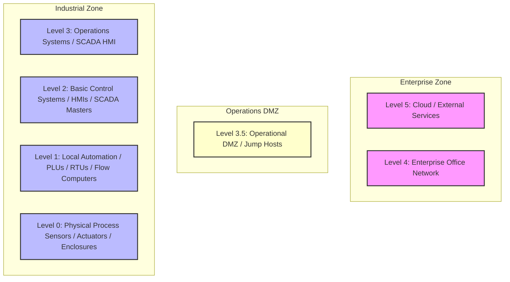

# 📘 Compliance Record of Note: CISA Cross-Sector CPGs
## CISA Cross-Sector Cyber Performance Goals v1.0.1

---

## 📋 Framework Overview
* **Framework ID**: `CISA_CPG`
* **Category**: `General IT/OT`
* **Industry Sector (Primary)**: `Cross-Sector`
* **Mapped CISA Critical Sectors**: `Information Technology`, `Energy`, `Water and Wastewater Systems`, `Healthcare and Public Health`, `Transportation Systems`, `Emergency Services`
* **Control Scope**: Contains 16 high-fidelity operational technology (OT) and information technology (IT) compliance checks.

> [!NOTE]
> This document serves as the official **Record of Note** and artifact for the CISA Cross-Sector CPGs framework. All control questions, standard codes, and Purdue Model mappings are compiled directly from CSET definitions.

### Description
Baseline goals derived from existing frameworks, prioritizing IT and OT actions to secure operations.

---

## 📐 Purdue Model Mapping

Control levels are logically aligned with the Purdue Enterprise Reference Architecture (PERA) to isolate process control boundaries from enterprise systems:

---

## 🛡️ Control Matrix

| Standard Code | Question Text | Category | Purdue Level | Guidance / Description |
| :--- | :--- | :--- | :---: | :--- |
| **CISA-1.D** |  | General | 3 | .  SOP: 1. Deploy endpoint protection agents configured with real-time process monitoring to block unsigned scripts and execution threats. 2. Enforce automatic session logout GPOs terminating interactive operator connections after a defined period of inactivity. 3. Configure system event log forwarding to stream all reboots, login attempts, and administrative modifications to a centralized syslog receiver.  VERIFICATION CRITERIA: Inspect the general configurations, check the verified logs, review the system settings, and check the following: General OT/IT security evidence must include: change management tracking tickets, Active Directory Group Policy Objects (GPOs), system log archives, and Nozomi/Dragos anomaly monitoring configuration files.  OT/IT CONVERGENCE RISK: General IT-OT convergence increases the threat landscape by bridging air-gapped industrial facilities with internet-facing corporate systems. Failing to enforce strict regulatory controls risks introducing severe operational vulnerabilities. |
| **CISA-2.C** |  | General | 3 | .  SOP: 1. Deploy endpoint protection agents configured with real-time process monitoring to block unsigned scripts and execution threats. 2. Enforce automatic session logout GPOs terminating interactive operator connections after a defined period of inactivity. 3. Configure system event log forwarding to stream all reboots, login attempts, and administrative modifications to a centralized syslog receiver.  VERIFICATION CRITERIA: Inspect the general configurations, check the verified logs, review the system settings, and check the following: General OT/IT security evidence must include: change management tracking tickets, Active Directory Group Policy Objects (GPOs), system log archives, and Nozomi/Dragos anomaly monitoring configuration files.  OT/IT CONVERGENCE RISK: General IT-OT convergence increases the threat landscape by bridging air-gapped industrial facilities with internet-facing corporate systems. Failing to enforce strict regulatory controls risks introducing severe operational vulnerabilities. |
| **CISA-2.E** |  | General | 3 | .  SOP: 1. Deploy endpoint protection agents configured with real-time process monitoring to block unsigned scripts and execution threats. 2. Enforce automatic session logout GPOs terminating interactive operator connections after a defined period of inactivity. 3. Configure system event log forwarding to stream all reboots, login attempts, and administrative modifications to a centralized syslog receiver.  VERIFICATION CRITERIA: Inspect the general configurations, check the verified logs, review the system settings, and check the following: General OT/IT security evidence must include: change management tracking tickets, Active Directory Group Policy Objects (GPOs), system log archives, and Nozomi/Dragos anomaly monitoring configuration files.  OT/IT CONVERGENCE RISK: General IT-OT convergence increases the threat landscape by bridging air-gapped industrial facilities with internet-facing corporate systems. Failing to enforce strict regulatory controls risks introducing severe operational vulnerabilities. |
| **CISA-3.C** |  | General | 3 | .  SOP: 1. Deploy endpoint protection agents configured with real-time process monitoring to block unsigned scripts and execution threats. 2. Enforce automatic session logout GPOs terminating interactive operator connections after a defined period of inactivity. 3. Configure system event log forwarding to stream all reboots, login attempts, and administrative modifications to a centralized syslog receiver.  VERIFICATION CRITERIA: Inspect the general configurations, check the verified logs, review the system settings, and check the following: General OT/IT security evidence must include: change management tracking tickets, Active Directory Group Policy Objects (GPOs), system log archives, and Nozomi/Dragos anomaly monitoring configuration files.  OT/IT CONVERGENCE RISK: General IT-OT convergence increases the threat landscape by bridging air-gapped industrial facilities with internet-facing corporate systems. Failing to enforce strict regulatory controls risks introducing severe operational vulnerabilities. |
| **CISA-3.D** |  | General | 3 | .  SOP: 1. Deploy endpoint protection agents configured with real-time process monitoring to block unsigned scripts and execution threats. 2. Enforce automatic session logout GPOs terminating interactive operator connections after a defined period of inactivity. 3. Configure system event log forwarding to stream all reboots, login attempts, and administrative modifications to a centralized syslog receiver.  VERIFICATION CRITERIA: Inspect the general configurations, check the verified logs, review the system settings, and check the following: General OT/IT security evidence must include: change management tracking tickets, Active Directory Group Policy Objects (GPOs), system log archives, and Nozomi/Dragos anomaly monitoring configuration files.  OT/IT CONVERGENCE RISK: General IT-OT convergence increases the threat landscape by bridging air-gapped industrial facilities with internet-facing corporate systems. Failing to enforce strict regulatory controls risks introducing severe operational vulnerabilities. |
| **CISA-3.E** |  | General | 3 | .  SOP: 1. Deploy endpoint protection agents configured with real-time process monitoring to block unsigned scripts and execution threats. 2. Enforce automatic session logout GPOs terminating interactive operator connections after a defined period of inactivity. 3. Configure system event log forwarding to stream all reboots, login attempts, and administrative modifications to a centralized syslog receiver.  VERIFICATION CRITERIA: Inspect the general configurations, check the verified logs, review the system settings, and check the following: General OT/IT security evidence must include: change management tracking tickets, Active Directory Group Policy Objects (GPOs), system log archives, and Nozomi/Dragos anomaly monitoring configuration files.  OT/IT CONVERGENCE RISK: General IT-OT convergence increases the threat landscape by bridging air-gapped industrial facilities with internet-facing corporate systems. Failing to enforce strict regulatory controls risks introducing severe operational vulnerabilities. |
| **CISA-3.G** |  | General | 3 | .  SOP: 1. Deploy endpoint protection agents configured with real-time process monitoring to block unsigned scripts and execution threats. 2. Enforce automatic session logout GPOs terminating interactive operator connections after a defined period of inactivity. 3. Configure system event log forwarding to stream all reboots, login attempts, and administrative modifications to a centralized syslog receiver.  VERIFICATION CRITERIA: Inspect the general configurations, check the verified logs, review the system settings, and check the following: General OT/IT security evidence must include: change management tracking tickets, Active Directory Group Policy Objects (GPOs), system log archives, and Nozomi/Dragos anomaly monitoring configuration files.  OT/IT CONVERGENCE RISK: General IT-OT convergence increases the threat landscape by bridging air-gapped industrial facilities with internet-facing corporate systems. Failing to enforce strict regulatory controls risks introducing severe operational vulnerabilities. |
| **CISA-3.H** |  | General | 3 | .  SOP: 1. Deploy endpoint protection agents configured with real-time process monitoring to block unsigned scripts and execution threats. 2. Enforce automatic session logout GPOs terminating interactive operator connections after a defined period of inactivity. 3. Configure system event log forwarding to stream all reboots, login attempts, and administrative modifications to a centralized syslog receiver.  VERIFICATION CRITERIA: Inspect the general configurations, check the verified logs, review the system settings, and check the following: General OT/IT security evidence must include: change management tracking tickets, Active Directory Group Policy Objects (GPOs), system log archives, and Nozomi/Dragos anomaly monitoring configuration files.  OT/IT CONVERGENCE RISK: General IT-OT convergence increases the threat landscape by bridging air-gapped industrial facilities with internet-facing corporate systems. Failing to enforce strict regulatory controls risks introducing severe operational vulnerabilities. |
| **CISA-3.I** |  | General | 3 | .  SOP: 1. Deploy endpoint protection agents configured with real-time process monitoring to block unsigned scripts and execution threats. 2. Enforce automatic session logout GPOs terminating interactive operator connections after a defined period of inactivity. 3. Configure system event log forwarding to stream all reboots, login attempts, and administrative modifications to a centralized syslog receiver.  VERIFICATION CRITERIA: Inspect the general configurations, check the verified logs, review the system settings, and check the following: General OT/IT security evidence must include: change management tracking tickets, Active Directory Group Policy Objects (GPOs), system log archives, and Nozomi/Dragos anomaly monitoring configuration files.  OT/IT CONVERGENCE RISK: General IT-OT convergence increases the threat landscape by bridging air-gapped industrial facilities with internet-facing corporate systems. Failing to enforce strict regulatory controls risks introducing severe operational vulnerabilities. |
| **CISA-3.J** |  | General | 3 | .  SOP: 1. Deploy endpoint protection agents configured with real-time process monitoring to block unsigned scripts and execution threats. 2. Enforce automatic session logout GPOs terminating interactive operator connections after a defined period of inactivity. 3. Configure system event log forwarding to stream all reboots, login attempts, and administrative modifications to a centralized syslog receiver.  VERIFICATION CRITERIA: Inspect the general configurations, check the verified logs, review the system settings, and check the following: General OT/IT security evidence must include: change management tracking tickets, Active Directory Group Policy Objects (GPOs), system log archives, and Nozomi/Dragos anomaly monitoring configuration files.  OT/IT CONVERGENCE RISK: General IT-OT convergence increases the threat landscape by bridging air-gapped industrial facilities with internet-facing corporate systems. Failing to enforce strict regulatory controls risks introducing severe operational vulnerabilities. |
| **CISA-3.M** |  | General | 3 | .  SOP: 1. Deploy endpoint protection agents configured with real-time process monitoring to block unsigned scripts and execution threats. 2. Enforce automatic session logout GPOs terminating interactive operator connections after a defined period of inactivity. 3. Configure system event log forwarding to stream all reboots, login attempts, and administrative modifications to a centralized syslog receiver.  VERIFICATION CRITERIA: Inspect the general configurations, check the verified logs, review the system settings, and check the following: General OT/IT security evidence must include: change management tracking tickets, Active Directory Group Policy Objects (GPOs), system log archives, and Nozomi/Dragos anomaly monitoring configuration files.  OT/IT CONVERGENCE RISK: General IT-OT convergence increases the threat landscape by bridging air-gapped industrial facilities with internet-facing corporate systems. Failing to enforce strict regulatory controls risks introducing severe operational vulnerabilities. |
| **CISA-3.Q** |  | General | 3 | .  SOP: 1. Deploy endpoint protection agents configured with real-time process monitoring to block unsigned scripts and execution threats. 2. Enforce automatic session logout GPOs terminating interactive operator connections after a defined period of inactivity. 3. Configure system event log forwarding to stream all reboots, login attempts, and administrative modifications to a centralized syslog receiver.  VERIFICATION CRITERIA: Inspect the general configurations, check the verified logs, review the system settings, and check the following: General OT/IT security evidence must include: change management tracking tickets, Active Directory Group Policy Objects (GPOs), system log archives, and Nozomi/Dragos anomaly monitoring configuration files.  OT/IT CONVERGENCE RISK: General IT-OT convergence increases the threat landscape by bridging air-gapped industrial facilities with internet-facing corporate systems. Failing to enforce strict regulatory controls risks introducing severe operational vulnerabilities. |
| **CISA-3.S** |  | General | 3 | .  SOP: 1. Deploy endpoint protection agents configured with real-time process monitoring to block unsigned scripts and execution threats. 2. Enforce automatic session logout GPOs terminating interactive operator connections after a defined period of inactivity. 3. Configure system event log forwarding to stream all reboots, login attempts, and administrative modifications to a centralized syslog receiver.  VERIFICATION CRITERIA: Inspect the general configurations, check the verified logs, review the system settings, and check the following: General OT/IT security evidence must include: change management tracking tickets, Active Directory Group Policy Objects (GPOs), system log archives, and Nozomi/Dragos anomaly monitoring configuration files.  OT/IT CONVERGENCE RISK: General IT-OT convergence increases the threat landscape by bridging air-gapped industrial facilities with internet-facing corporate systems. Failing to enforce strict regulatory controls risks introducing severe operational vulnerabilities. |
| **CISA-3.U** |  | General | 3 | .  SOP: 1. Deploy endpoint protection agents configured with real-time process monitoring to block unsigned scripts and execution threats. 2. Enforce automatic session logout GPOs terminating interactive operator connections after a defined period of inactivity. 3. Configure system event log forwarding to stream all reboots, login attempts, and administrative modifications to a centralized syslog receiver.  VERIFICATION CRITERIA: Inspect the general configurations, check the verified logs, review the system settings, and check the following: General OT/IT security evidence must include: change management tracking tickets, Active Directory Group Policy Objects (GPOs), system log archives, and Nozomi/Dragos anomaly monitoring configuration files.  OT/IT CONVERGENCE RISK: General IT-OT convergence increases the threat landscape by bridging air-gapped industrial facilities with internet-facing corporate systems. Failing to enforce strict regulatory controls risks introducing severe operational vulnerabilities. |
| **CISA-4.A** |  | General | 3 | .  SOP: 1. Deploy endpoint protection agents configured with real-time process monitoring to block unsigned scripts and execution threats. 2. Enforce automatic session logout GPOs terminating interactive operator connections after a defined period of inactivity. 3. Configure system event log forwarding to stream all reboots, login attempts, and administrative modifications to a centralized syslog receiver.  VERIFICATION CRITERIA: Inspect the general configurations, check the verified logs, review the system settings, and check the following: General OT/IT security evidence must include: change management tracking tickets, Active Directory Group Policy Objects (GPOs), system log archives, and Nozomi/Dragos anomaly monitoring configuration files.  OT/IT CONVERGENCE RISK: General IT-OT convergence increases the threat landscape by bridging air-gapped industrial facilities with internet-facing corporate systems. Failing to enforce strict regulatory controls risks introducing severe operational vulnerabilities. |
| **CISA-6.A** |  | General | 3 | .  SOP: 1. Deploy endpoint protection agents configured with real-time process monitoring to block unsigned scripts and execution threats. 2. Enforce automatic session logout GPOs terminating interactive operator connections after a defined period of inactivity. 3. Configure system event log forwarding to stream all reboots, login attempts, and administrative modifications to a centralized syslog receiver.  VERIFICATION CRITERIA: Inspect the general configurations, check the verified logs, review the system settings, and check the following: General OT/IT security evidence must include: change management tracking tickets, Active Directory Group Policy Objects (GPOs), system log archives, and Nozomi/Dragos anomaly monitoring configuration files.  OT/IT CONVERGENCE RISK: General IT-OT convergence increases the threat landscape by bridging air-gapped industrial facilities with internet-facing corporate systems. Failing to enforce strict regulatory controls risks introducing severe operational vulnerabilities. |

---

## 🛠️ Verification & Implementation Guidelines

To implement the **CISA Cross-Sector CPGs** controls successfully inside your OT environment:

1. **Logical Separation**: Isolate all Level 1 and 2 process loops (PLCs/RTUs) from business segments using strict Level 3.5 DMZ routing tables.
2. **Access Control**: Ensure that all administrative commands to control loops require multi-factor authentication (MFA) via Jump Hosts.
3. **Continuous Auditing**: Collect and route event logs continuously to a write-once secure syslog receiver with synchronized NTP timestamps.
4. **Logic Backups**: Back up all running PLC configurations and logic programs weekly, storing them in fireproof cabinets or secure offsite enclaves.

> [!IMPORTANT]
> Any modifications to logic settings or firmware on Level 1-2 devices must undergo rigorous sandbox testing and double-signature verification before deployment.
