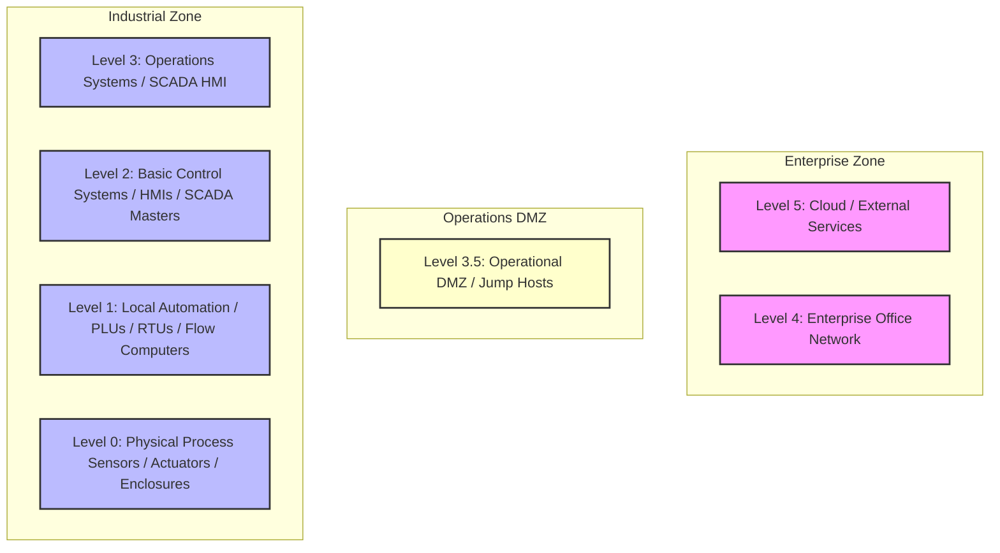

# 📘 Compliance Record of Note: CMMC 2.0 Level 1
## Cybersecurity Maturity Model Certification - Foundational

---

## 📋 Framework Overview
* **Framework ID**: `CMMC_L1`
* **Category**: `Defense & Aerospace`
* **Industry Sector (Primary)**: `Defense Industrial Base`
* **Mapped CISA Critical Sectors**: `Defense Industrial Base`, `Government Facilities`
* **Control Scope**: Contains 15 high-fidelity operational technology (OT) and information technology (IT) compliance checks.

> [!NOTE]
> This document serves as the official **Record of Note** and artifact for the CMMC 2.0 Level 1 framework. All control questions, standard codes, and Purdue Model mappings are compiled directly from CSET definitions.

### Description
Basic cyber hygiene requirements protecting federal contract information across 17 distinct controls.

---

## 📐 Purdue Model Mapping

Control levels are logically aligned with the Purdue Enterprise Reference Architecture (PERA) to isolate process control boundaries from enterprise systems:

---

## 🛡️ Control Matrix

| Standard Code | Question Text | Category | Purdue Level | Guidance / Description |
| :--- | :--- | :--- | :---: | :--- |
| **CMMC_L1-CMMC-AC.L1-3.1.1** | Are information system access rights limited to authorized users, processes, or devices (utilizing secure Jump Hosts, MFA validation nodes, active directory GPOs, and hardware tokens)? | Access Control | 3 | Review user access provisioning logs, check active directory profiles, and audit router access lists.  SOP: 1. Deploy endpoint protection agents configured with real-time process monitoring to block unsigned scripts and execution threats. 2. Enforce automatic session logout GPOs terminating interactive operator connections after a defined period of inactivity. 3. Configure system event log forwarding to stream all reboots, login attempts, and administrative modifications to a centralized syslog receiver. 4. Maintain alignment with NIST SP 800-171/172 assessment scoring rules for federal defense contracting.  VERIFICATION CRITERIA: Inspect the access control configurations, check the verified logs, review the system settings, and check the following: Assessment evidence must include: System Security Plan (SSP), Plan of Action and Milestones (POA&M), NIST SP 800-171/172 DoD Assessment Score register, and CMMC Certified Third-Party Assessment Organization (C3PAO) audit traces.  OT/IT CONVERGENCE RISK: Unauthenticated or unmonitored IT-OT bridge endpoints can expose critical CMMC L1 systems to lateral network pivoting. An administrative compromise in the enterprise domain (such as phishing or AD account compromise) can lead directly to unauthorized SCADA control commands. |
| **CMMC_L1-CMMC-AC.L1-3.1.2** | Are external logical connections authorized, documented, and monitored (utilizing secure Jump Hosts, MFA validation nodes, active directory GPOs, and hardware tokens)? | Access Control | 3 | Verify firewall rules separating internal zones, check VPN connection logs, and audit remote session gateways.  SOP: 1. Deploy endpoint protection agents configured with real-time process monitoring to block unsigned scripts and execution threats. 2. Enforce automatic session logout GPOs terminating interactive operator connections after a defined period of inactivity. 3. Configure system event log forwarding to stream all reboots, login attempts, and administrative modifications to a centralized syslog receiver. 4. Maintain alignment with NIST SP 800-171/172 assessment scoring rules for federal defense contracting.  VERIFICATION CRITERIA: Inspect the access control configurations, check the verified logs, review the system settings, and check the following: Assessment evidence must include: System Security Plan (SSP), Plan of Action and Milestones (POA&M), NIST SP 800-171/172 DoD Assessment Score register, and CMMC Certified Third-Party Assessment Organization (C3PAO) audit traces.  OT/IT CONVERGENCE RISK: Unauthenticated or unmonitored IT-OT bridge endpoints can expose critical CMMC L1 systems to lateral network pivoting. An administrative compromise in the enterprise domain (such as phishing or AD account compromise) can lead directly to unauthorized SCADA control commands. |
| **CMMC_L1-CMMC-AC.L1-3.1.20** | Are physical access bounds and operating environments locked and limited to authorized personnel (utilizing secure Jump Hosts, MFA validation nodes, active directory GPOs, and hardware tokens)? | Access Control | 1 | Inspect building access controls, verify key card readers are active, and check visitor registration desk sheets.  SOP: 1. Establish physical locking covers and secure enclosures around critical field device interfaces. 2. Configure hardware configuration locks and disable local diagnostic ports (USB, RS-232) to block local unauthorized adjustments. 3. Validate that device configuration changes require double-signature supervisor tokens before logical modifications are written to memory. 4. Maintain alignment with NIST SP 800-171/172 assessment scoring rules for federal defense contracting.  VERIFICATION CRITERIA: Inspect the access control configurations, check the verified logs, review the system settings, and check the following: Assessment evidence must include: System Security Plan (SSP), Plan of Action and Milestones (POA&M), NIST SP 800-171/172 DoD Assessment Score register, and CMMC Certified Third-Party Assessment Organization (C3PAO) audit traces.  OT/IT CONVERGENCE RISK: Unauthenticated or unmonitored IT-OT bridge endpoints can expose critical CMMC L1 systems to lateral network pivoting. An administrative compromise in the enterprise domain (such as phishing or AD account compromise) can lead directly to unauthorized SCADA control commands. |
| **CMMC_L1-CMMC-AC.L1-3.1.22** | Are physical entry locks and key access devices controlled and managed (utilizing secure Jump Hosts, MFA validation nodes, active directory GPOs, and hardware tokens)? | Access Control | 1 | Review master key inventory lists, audit badge-reader enrollment files, and verify cabinet physical security key boxes.  SOP: 1. Establish physical locking covers and secure enclosures around critical field device interfaces. 2. Configure hardware configuration locks and disable local diagnostic ports (USB, RS-232) to block local unauthorized adjustments. 3. Validate that device configuration changes require double-signature supervisor tokens before logical modifications are written to memory. 4. Maintain alignment with NIST SP 800-171/172 assessment scoring rules for federal defense contracting.  VERIFICATION CRITERIA: Inspect the access control configurations, check the verified logs, review the system settings, and check the following: Assessment evidence must include: System Security Plan (SSP), Plan of Action and Milestones (POA&M), NIST SP 800-171/172 DoD Assessment Score register, and CMMC Certified Third-Party Assessment Organization (C3PAO) audit traces.  OT/IT CONVERGENCE RISK: Unauthenticated or unmonitored IT-OT bridge endpoints can expose critical CMMC L1 systems to lateral network pivoting. An administrative compromise in the enterprise domain (such as phishing or AD account compromise) can lead directly to unauthorized SCADA control commands. |
| **CMMC_L1-CMMC-IA.L1-3.5.1** | Are all human users uniquely identified and authenticated before accessing the system (utilizing secure Jump Hosts, MFA validation nodes, active directory GPOs, and hardware tokens)? | Identification & Authentication | 3 | Ensure each employee has unique login credentials and default accounts are completely disabled.  SOP: 1. Deploy endpoint protection agents configured with real-time process monitoring to block unsigned scripts and execution threats. 2. Enforce automatic session logout GPOs terminating interactive operator connections after a defined period of inactivity. 3. Configure system event log forwarding to stream all reboots, login attempts, and administrative modifications to a centralized syslog receiver. 4. Maintain alignment with NIST SP 800-171/172 assessment scoring rules for federal defense contracting.  VERIFICATION CRITERIA: Inspect the identification & authentication configurations, check the verified logs, review the system settings, and check the following: Assessment evidence must include: System Security Plan (SSP), Plan of Action and Milestones (POA&M), NIST SP 800-171/172 DoD Assessment Score register, and CMMC Certified Third-Party Assessment Organization (C3PAO) audit traces.  OT/IT CONVERGENCE RISK: Unauthenticated or unmonitored IT-OT bridge endpoints can expose critical CMMC L1 systems to lateral network pivoting. An administrative compromise in the enterprise domain (such as phishing or AD account compromise) can lead directly to unauthorized SCADA control commands. |
| **CMMC_L1-CMMC-IA.L1-3.5.2** | Are password complexity standards and active lockouts enforced (utilizing secure Jump Hosts, MFA validation nodes, active directory GPOs, and hardware tokens)? | Identification & Authentication | 3 | Verify AD GPO password rules, check lockout thresholds, and audit password expiration parameters.  SOP: 1. Deploy endpoint protection agents configured with real-time process monitoring to block unsigned scripts and execution threats. 2. Enforce automatic session logout GPOs terminating interactive operator connections after a defined period of inactivity. 3. Configure system event log forwarding to stream all reboots, login attempts, and administrative modifications to a centralized syslog receiver. 4. Maintain alignment with NIST SP 800-171/172 assessment scoring rules for federal defense contracting.  VERIFICATION CRITERIA: Inspect the identification & authentication configurations, check the verified logs, review the system settings, and check the following: Assessment evidence must include: System Security Plan (SSP), Plan of Action and Milestones (POA&M), NIST SP 800-171/172 DoD Assessment Score register, and CMMC Certified Third-Party Assessment Organization (C3PAO) audit traces.  OT/IT CONVERGENCE RISK: Unauthenticated or unmonitored IT-OT bridge endpoints can expose critical CMMC L1 systems to lateral network pivoting. An administrative compromise in the enterprise domain (such as phishing or AD account compromise) can lead directly to unauthorized SCADA control commands. |
| **CMMC_L1-CMMC-IA.L1-3.5.3** | Are passwords stored and transmitted exclusively in encrypted format (utilizing secure Jump Hosts, MFA validation nodes, active directory GPOs, and hardware tokens)? | Identification & Authentication | 3 | Verify that AD enforces secure hashing (e.g. SHA-256 or bcrypt), and clear-text password transits are blocked.  SOP: 1. Deploy endpoint protection agents configured with real-time process monitoring to block unsigned scripts and execution threats. 2. Enforce automatic session logout GPOs terminating interactive operator connections after a defined period of inactivity. 3. Configure system event log forwarding to stream all reboots, login attempts, and administrative modifications to a centralized syslog receiver. 4. Maintain alignment with NIST SP 800-171/172 assessment scoring rules for federal defense contracting.  VERIFICATION CRITERIA: Inspect the identification & authentication configurations, check the verified logs, review the system settings, and check the following: Assessment evidence must include: System Security Plan (SSP), Plan of Action and Milestones (POA&M), NIST SP 800-171/172 DoD Assessment Score register, and CMMC Certified Third-Party Assessment Organization (C3PAO) audit traces.  OT/IT CONVERGENCE RISK: Unauthenticated or unmonitored IT-OT bridge endpoints can expose critical CMMC L1 systems to lateral network pivoting. An administrative compromise in the enterprise domain (such as phishing or AD account compromise) can lead directly to unauthorized SCADA control commands. |
| **CMMC_L1-CMMC-MP.L1-3.8.3** | Is media containing Controlled Unclassified Information sanitized prior to disposal? | Media Protection | 2 | Review media degaussing and destruction procedures, inspect disposal logs, and check third-party sanitation certificates.  SOP: 1. Establish physical locking covers and secure enclosures around critical field device interfaces. 2. Configure hardware configuration locks and disable local diagnostic ports (USB, RS-232) to block local unauthorized adjustments. 3. Validate that device configuration changes require double-signature supervisor tokens before logical modifications are written to memory. 4. Maintain alignment with NIST SP 800-171/172 assessment scoring rules for federal defense contracting.  VERIFICATION CRITERIA: Inspect the media protection configurations, check the verified logs, review the system settings, and check the following: Assessment evidence must include: System Security Plan (SSP), Plan of Action and Milestones (POA&M), NIST SP 800-171/172 DoD Assessment Score register, and CMMC Certified Third-Party Assessment Organization (C3PAO) audit traces.  OT/IT CONVERGENCE RISK: General IT-OT convergence increases the threat landscape by bridging air-gapped industrial facilities with internet-facing corporate systems. Failing to enforce strict regulatory controls risks introducing severe operational vulnerabilities. |
| **CMMC_L1-CMMC-PE.L1-3.10.1** | Are physical access perimeters and locked cabinets implemented at CUI sites? | Physical Protection | 1 | Inspect physical locks, check badge-reader entry logs, and verify that server racks are physically padlocked.  SOP: 1. Establish physical locking covers and secure enclosures around critical field device interfaces. 2. Configure hardware configuration locks and disable local diagnostic ports (USB, RS-232) to block local unauthorized adjustments. 3. Validate that device configuration changes require double-signature supervisor tokens before logical modifications are written to memory. 4. Maintain alignment with NIST SP 800-171/172 assessment scoring rules for federal defense contracting.  VERIFICATION CRITERIA: Inspect the physical protection configurations, check the verified logs, review the system settings, and check the following: Assessment evidence must include: System Security Plan (SSP), Plan of Action and Milestones (POA&M), NIST SP 800-171/172 DoD Assessment Score register, and CMMC Certified Third-Party Assessment Organization (C3PAO) audit traces.  OT/IT CONVERGENCE RISK: General IT-OT convergence increases the threat landscape by bridging air-gapped industrial facilities with internet-facing corporate systems. Failing to enforce strict regulatory controls risks introducing severe operational vulnerabilities. |
| **CMMC_L1-CMMC-PE.L1-3.10.2** | Are secondary support infrastructures (power, HVAC) physically secured and monitored? | Physical Protection | 1 | Verify physical gates, locked padlocks, and CCTV analytics protecting auxiliary generators and HVAC air intake vents.  SOP: 1. Establish physical locking covers and secure enclosures around critical field device interfaces. 2. Configure hardware configuration locks and disable local diagnostic ports (USB, RS-232) to block local unauthorized adjustments. 3. Validate that device configuration changes require double-signature supervisor tokens before logical modifications are written to memory. 4. Maintain alignment with NIST SP 800-171/172 assessment scoring rules for federal defense contracting.  VERIFICATION CRITERIA: Inspect the physical protection configurations, check the verified logs, review the system settings, and check the following: Assessment evidence must include: System Security Plan (SSP), Plan of Action and Milestones (POA&M), NIST SP 800-171/172 DoD Assessment Score register, and CMMC Certified Third-Party Assessment Organization (C3PAO) audit traces.  OT/IT CONVERGENCE RISK: General IT-OT convergence increases the threat landscape by bridging air-gapped industrial facilities with internet-facing corporate systems. Failing to enforce strict regulatory controls risks introducing severe operational vulnerabilities. |
| **CMMC-C-11** | Are unique user credentials and multi-factor authentication (MFA) enforced for all operational and administrative interfaces (utilizing secure Jump Hosts, MFA validation nodes, active directory GPOs, and hardware tokens)? | Access Control & Identity | 4 | Verify compliance against CMMC L1 requirements for control CMMC-C-11.  SOP: 1. Enforce strict role-based access controls (RBAC) separating administrative tasks from standard operator routines. 2. Route all incoming remote connections through isolated administrative Jump Hosts with visual session logging active. 3. Conduct quarterly access audits to identify and completely disable dormant or inactive accounts.  VERIFICATION CRITERIA: Inspect the access control & identity configurations, check the verified logs, review the system settings, and check the following: Evaluation evidence must include: Active Directory group policies, Jump Server log databases, MFA configuration logs, and administrative access audit certificates.  OT/IT CONVERGENCE RISK: Unauthenticated or unmonitored IT-OT bridge endpoints can expose critical networks to lateral pivoting. An administrative compromise in the enterprise domain (such as phishing or AD account compromise) can lead directly to unauthorized SCADA control commands. |
| **CMMC-C-12** | Are electronic security perimeters and operational DMZs implemented to logically segment industrial networks (enforced by Cisco Industrial Ethernet switches, network zoning firewalls, and isolated Purdue model level boundaries)? | Boundary Protection & Network Segmentation | 3 | Verify compliance against CMMC L1 requirements for control CMMC-C-12.  SOP: 1. Deploy an Operational DMZ to segment Level 3 and Level 4 network communications. 2. Route all boundary traffic through stateful firewalls with dynamic threat prevention active. 3. Disable all unused physical ports and implement unidirectional data diodes for safety loops.  VERIFICATION CRITERIA: Inspect the boundary protection & network segmentation configurations, check the verified logs, review the system settings, and check the following: Evaluation evidence must include: Zone and Conduit design architecture diagram, Security Level Target (SL-T) vs Security Level Achieved (SL-A) matrix, and network firewall configuration files.  OT/IT CONVERGENCE RISK: Inadequate network segmentation allows IT-OT convergence traffic to flow unmediated across enclaves. A malware infection on the corporate LAN (like ransomware) can propagate directly to critical process control loops, halting operations. |
| **CMMC-C-13** | Are default passwords disabled and unused software services deactivated on all host endpoints (covering Siemens S7-1500 PLCs, Allen-Bradley ControlLogix, SEL RTUs, and digital relay modules)? | Host Hardening - Device Integrity | 2 | Verify compliance against CMMC L1 requirements for control CMMC-C-13.  SOP: 1. Disable all unnecessary local services (e.g. FTP, raw Telnet, HTTP) in host operating system settings. 2. Configure host configuration locks and disable local diagnostic ports to block unauthorized adjustments. 3. Enforce application whitelisting and configuration baselines on all engineering terminals.  VERIFICATION CRITERIA: Inspect the host hardening - device integrity configurations, check the verified logs, review the system settings, and check the following: Evaluation evidence must include: host hardening checklists, disabled service audit logs, application whitelisting policies, and local host configuration files.  OT/IT CONVERGENCE RISK: Using unhardened or unpatched field controllers opens critical hardware interfaces to remote execution exploits. Attackers can leverage known vulnerabilities to flash unauthorized firmware or change safety threshold parameters on active PLCs. |
| **CMMC-C-14** | Are system event logs synchronized via secure NTP and stored continuously on write-once media (aligned with incident response playbooks, offsite backups, and isolated write-once media)? | Audit Trails & Security Logging | 3 | Verify compliance against CMMC L1 requirements for control CMMC-C-14.  SOP: 1. Configure centralized syslog forwarding to stream all reboots, login attempts, and administrative modifications. 2. Synchronize all system logs using secure NTP servers with verified time offsets. 3. Restrict log access to authorized audit roles and configure log alerts for high-priority security events.  VERIFICATION CRITERIA: Inspect the audit trails & security logging configurations, check the verified logs, review the system settings, and check the following: Evaluation evidence must include: NTP synchronization logs, centralized syslog receiver configurations, write-once media validation tests, and log audit registers.  OT/IT CONVERGENCE RISK: Failing to maintain comprehensive, synchronized event logs during a convergence breach blinds security teams to the attacker's footprint. Without centralized logs, forensic tracking of unauthorized PLC firmware changes or database adjustments is impossible. |
| **CMMC-C-15** | Are physical access controls and locking covers implemented around critical equipment cabinets (covering Siemens S7-1500 PLCs, Allen-Bradley ControlLogix, SEL RTUs, and digital relay modules)? | Physical Protection & Enclosures | 1 | Verify compliance against CMMC L1 requirements for control CMMC-C-15.  SOP: 1. Establish physical locking covers and secure enclosures around critical field device interfaces. 2. Deploy electronic badge access and security cameras to monitor all entry boundaries. 3. Maintain visitor logs and enforce mandatory escorts for all unauthorized personnel.  VERIFICATION CRITERIA: Inspect the physical protection & enclosures configurations, check the verified logs, review the system settings, and check the following: Evaluation evidence must include: physical security plan, electronic badge entry history log, security camera archive, visitor registry, and enclosure inspection logs.  OT/IT CONVERGENCE RISK: Unrestricted physical access to hardware enclaves bypasses all logical firewall policies. An attacker with physical cabinet access can connect a malicious device directly to the backplane, flashing compromised logic onto operating controllers. |

---

## 🛠️ Verification & Implementation Guidelines

To implement the **CMMC 2.0 Level 1** controls successfully inside your OT environment:

1. **Logical Separation**: Isolate all Level 1 and 2 process loops (PLCs/RTUs) from business segments using strict Level 3.5 DMZ routing tables.
2. **Access Control**: Ensure that all administrative commands to control loops require multi-factor authentication (MFA) via Jump Hosts.
3. **Continuous Auditing**: Collect and route event logs continuously to a write-once secure syslog receiver with synchronized NTP timestamps.
4. **Logic Backups**: Back up all running PLC configurations and logic programs weekly, storing them in fireproof cabinets or secure offsite enclaves.

> [!IMPORTANT]
> Any modifications to logic settings or firmware on Level 1-2 devices must undergo rigorous sandbox testing and double-signature verification before deployment.
