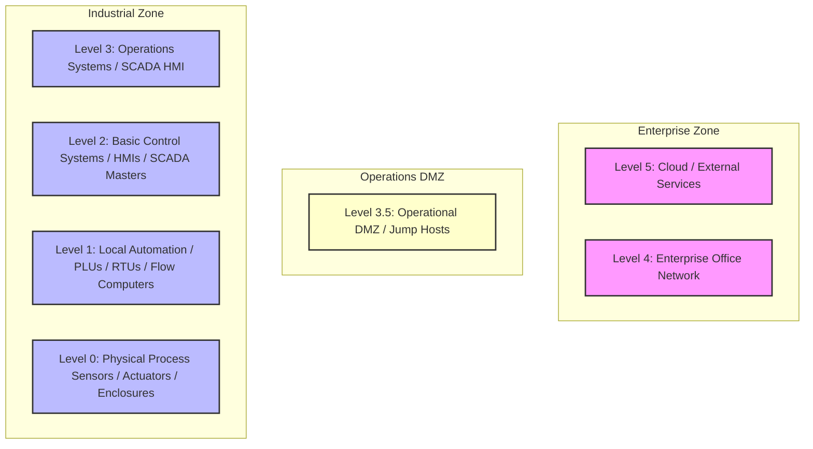

# 📘 Compliance Record of Note: CNSSI 1253
## Security Categorization for National Security Systems

---

## 📋 Framework Overview
* **Framework ID**: `CNSSI_1253`
* **Category**: `Defense & Aerospace`
* **Industry Sector (Primary)**: `Defense Industrial Base`
* **Mapped CISA Critical Sectors**: `Defense Industrial Base`, `Government Facilities`
* **Control Scope**: Contains 1007 high-fidelity operational technology (OT) and information technology (IT) compliance checks.

> [!NOTE]
> This document serves as the official **Record of Note** and artifact for the CNSSI 1253 framework. All control questions, standard codes, and Purdue Model mappings are compiled directly from CSET definitions.

### Description
Instructions on categorizing government national security databases and applying tailored overlays.

---

## 📐 Purdue Model Mapping

Control levels are logically aligned with the Purdue Enterprise Reference Architecture (PERA) to isolate process control boundaries from enterprise systems:

---

## 🛡️ Control Matrix

| Standard Code | Question Text | Category | Purdue Level | Guidance / Description |
| :--- | :--- | :--- | :---: | :--- |
| **CNSSI-CNSS-AC-1.1** | Are system access rights limited to authorized government national security users (utilizing secure Jump Hosts, MFA validation nodes, active directory GPOs, and hardware tokens)? | NSS Access Control | 4 | Review user access provisioning logs, check active directory profiles, and audit router access lists.  SOP: 1. Enforce strict role-based access controls (RBAC) separating administrative tasks from standard operator routines. 2. Route all incoming remote connections through isolated administrative Jump Hosts with visual session logging active. 3. Conduct quarterly access audits to identify and completely disable dormant or inactive accounts.  VERIFICATION CRITERIA: Inspect the nss access control configurations, check the verified logs, review the system settings, and check the following: General OT/IT security evidence must include: change management tracking tickets, Active Directory Group Policy Objects (GPOs), system log archives, and Nozomi/Dragos anomaly monitoring configuration files.  OT/IT CONVERGENCE RISK: Unauthenticated or unmonitored IT-OT bridge endpoints can expose critical CNSSI 1253 systems to lateral network pivoting. An administrative compromise in the enterprise domain (such as phishing or AD account compromise) can lead directly to unauthorized SCADA control commands. |
| **CNSSI-CNSS-AC-1.2** | Are external logical connections authorized, documented, and monitored (utilizing secure Jump Hosts, MFA validation nodes, active directory GPOs, and hardware tokens)? | NSS Access Control | 3 | Verify firewall rules separating internal zones, check VPN connection logs, and audit remote gateways.  SOP: 1. Deploy endpoint protection agents configured with real-time process monitoring to block unsigned scripts and execution threats. 2. Enforce automatic session logout GPOs terminating interactive operator connections after a defined period of inactivity. 3. Configure system event log forwarding to stream all reboots, login attempts, and administrative modifications to a centralized syslog receiver.  VERIFICATION CRITERIA: Inspect the nss access control configurations, check the verified logs, review the system settings, and check the following: General OT/IT security evidence must include: change management tracking tickets, Active Directory Group Policy Objects (GPOs), system log archives, and Nozomi/Dragos anomaly monitoring configuration files.  OT/IT CONVERGENCE RISK: Unauthenticated or unmonitored IT-OT bridge endpoints can expose critical CNSSI 1253 systems to lateral network pivoting. An administrative compromise in the enterprise domain (such as phishing or AD account compromise) can lead directly to unauthorized SCADA control commands. |
| **CNSSI-CNSS-IA-5.1** | Are all human users uniquely identified and authenticated before accessing government databases? | NSS Identity Verification | 3 | Ensure each employee has unique login credentials and default accounts are completely disabled.  SOP: 1. Deploy endpoint protection agents configured with real-time process monitoring to block unsigned scripts and execution threats. 2. Enforce automatic session logout GPOs terminating interactive operator connections after a defined period of inactivity. 3. Configure system event log forwarding to stream all reboots, login attempts, and administrative modifications to a centralized syslog receiver.  VERIFICATION CRITERIA: Inspect the nss identity verification configurations, check the verified logs, review the system settings, and check the following: General OT/IT security evidence must include: change management tracking tickets, Active Directory Group Policy Objects (GPOs), system log archives, and Nozomi/Dragos anomaly monitoring configuration files.  OT/IT CONVERGENCE RISK: General IT-OT convergence increases the threat landscape by bridging air-gapped industrial facilities with internet-facing corporate systems. Failing to enforce strict regulatory controls risks introducing severe operational vulnerabilities. |
| **CNSSI-CNSS-IA-5.2** | Are password complexity standards and active lockouts enforced? | NSS Identity Verification | 3 | Verify AD GPO password rules, check lockout thresholds, and audit password expiration parameters.  SOP: 1. Deploy endpoint protection agents configured with real-time process monitoring to block unsigned scripts and execution threats. 2. Enforce automatic session logout GPOs terminating interactive operator connections after a defined period of inactivity. 3. Configure system event log forwarding to stream all reboots, login attempts, and administrative modifications to a centralized syslog receiver.  VERIFICATION CRITERIA: Inspect the nss identity verification configurations, check the verified logs, review the system settings, and check the following: General OT/IT security evidence must include: change management tracking tickets, Active Directory Group Policy Objects (GPOs), system log archives, and Nozomi/Dragos anomaly monitoring configuration files.  OT/IT CONVERGENCE RISK: General IT-OT convergence increases the threat landscape by bridging air-gapped industrial facilities with internet-facing corporate systems. Failing to enforce strict regulatory controls risks introducing severe operational vulnerabilities. |
| **CNSSI-CNSS-MP-8.3** | Is media containing Controlled Unclassified Information sanitized prior to disposal? | NSS Media Protection | 2 | Review media degaussing and destruction procedures, inspect disposal logs, and check third-party sanitation certificates.  SOP: 1. Establish physical locking covers and secure enclosures around critical field device interfaces. 2. Configure hardware configuration locks and disable local diagnostic ports (USB, RS-232) to block local unauthorized adjustments. 3. Validate that device configuration changes require double-signature supervisor tokens before logical modifications are written to memory.  VERIFICATION CRITERIA: Inspect the nss media protection configurations, check the verified logs, review the system settings, and check the following: General OT/IT security evidence must include: change management tracking tickets, Active Directory Group Policy Objects (GPOs), system log archives, and Nozomi/Dragos anomaly monitoring configuration files.  OT/IT CONVERGENCE RISK: General IT-OT convergence increases the threat landscape by bridging air-gapped industrial facilities with internet-facing corporate systems. Failing to enforce strict regulatory controls risks introducing severe operational vulnerabilities. |
| **CNSSI-CNSS-PE-10.1** | Are physical access perimeters and locked cabinets implemented at CUI sites? | NSS Physical Protection | 1 | Inspect physical locks, check badge-reader entry logs, and verify that server racks are physically padlocked.  SOP: 1. Establish physical locking covers and secure enclosures around critical field device interfaces. 2. Configure hardware configuration locks and disable local diagnostic ports (USB, RS-232) to block local unauthorized adjustments. 3. Validate that device configuration changes require double-signature supervisor tokens before logical modifications are written to memory.  VERIFICATION CRITERIA: Inspect the nss physical protection configurations, check the verified logs, review the system settings, and check the following: General OT/IT security evidence must include: change management tracking tickets, Active Directory Group Policy Objects (GPOs), system log archives, and Nozomi/Dragos anomaly monitoring configuration files.  OT/IT CONVERGENCE RISK: General IT-OT convergence increases the threat landscape by bridging air-gapped industrial facilities with internet-facing corporate systems. Failing to enforce strict regulatory controls risks introducing severe operational vulnerabilities. |
| **CNSSI-CNSS-PE-10.2** | Are secondary support infrastructures (power, HVAC) physically secured and monitored? | NSS Physical Protection | 1 | Verify physical gates, locked padlocks, and CCTV analytics protecting auxiliary generators and HVAC air intake vents.  SOP: 1. Establish physical locking covers and secure enclosures around critical field device interfaces. 2. Configure hardware configuration locks and disable local diagnostic ports (USB, RS-232) to block local unauthorized adjustments. 3. Validate that device configuration changes require double-signature supervisor tokens before logical modifications are written to memory.  VERIFICATION CRITERIA: Inspect the nss physical protection configurations, check the verified logs, review the system settings, and check the following: General OT/IT security evidence must include: change management tracking tickets, Active Directory Group Policy Objects (GPOs), system log archives, and Nozomi/Dragos anomaly monitoring configuration files.  OT/IT CONVERGENCE RISK: General IT-OT convergence increases the threat landscape by bridging air-gapped industrial facilities with internet-facing corporate systems. Failing to enforce strict regulatory controls risks introducing severe operational vulnerabilities. |
| **CNSSI-CNSS-SC-13.1** | Are organizational communications monitored, controlled, and protected at boundary perimeters? | NSS Boundary Protection | 3 | Verify boundary firewalls, inspect intrusion detection logs, and check active network flow monitors.  SOP: 1. Deploy endpoint protection agents configured with real-time process monitoring to block unsigned scripts and execution threats. 2. Enforce automatic session logout GPOs terminating interactive operator connections after a defined period of inactivity. 3. Configure system event log forwarding to stream all reboots, login attempts, and administrative modifications to a centralized syslog receiver.  VERIFICATION CRITERIA: Inspect the nss boundary protection configurations, check the verified logs, review the system settings, and check the following: General OT/IT security evidence must include: change management tracking tickets, Active Directory Group Policy Objects (GPOs), system log archives, and Nozomi/Dragos anomaly monitoring configuration files.  OT/IT CONVERGENCE RISK: General IT-OT convergence increases the threat landscape by bridging air-gapped industrial facilities with internet-facing corporate systems. Failing to enforce strict regulatory controls risks introducing severe operational vulnerabilities. |
| **CNSSI-CNSS-SC-13.5** | Are publicly accessible system components segregated in dedicated subnetworks? | NSS Boundary Protection | 3 | Ensure DMZ isolation, verify router ACL configurations, and audit reverse-proxy configurations.  SOP: 1. Deploy endpoint protection agents configured with real-time process monitoring to block unsigned scripts and execution threats. 2. Enforce automatic session logout GPOs terminating interactive operator connections after a defined period of inactivity. 3. Configure system event log forwarding to stream all reboots, login attempts, and administrative modifications to a centralized syslog receiver.  VERIFICATION CRITERIA: Inspect the nss boundary protection configurations, check the verified logs, review the system settings, and check the following: General OT/IT security evidence must include: change management tracking tickets, Active Directory Group Policy Objects (GPOs), system log archives, and Nozomi/Dragos anomaly monitoring configuration files.  OT/IT CONVERGENCE RISK: General IT-OT convergence increases the threat landscape by bridging air-gapped industrial facilities with internet-facing corporate systems. Failing to enforce strict regulatory controls risks introducing severe operational vulnerabilities. |
| **CNSSI-CNSS-SI-14.1** | Are system software security flaws identified, reported, and corrected in a timely manner (covering Siemens S7-1500 PLCs, Allen-Bradley ControlLogix, SEL RTUs, and digital relay modules)? | NSS System Integrity | 3 | Verify patch schedules, review automated scanner outputs, and check vulnerability response trackers.  SOP: 1. Deploy endpoint protection agents configured with real-time process monitoring to block unsigned scripts and execution threats. 2. Enforce automatic session logout GPOs terminating interactive operator connections after a defined period of inactivity. 3. Configure system event log forwarding to stream all reboots, login attempts, and administrative modifications to a centralized syslog receiver.  VERIFICATION CRITERIA: Inspect the nss system integrity configurations, check the verified logs, review the system settings, and check the following: General OT/IT security evidence must include: change management tracking tickets, Active Directory Group Policy Objects (GPOs), system log archives, and Nozomi/Dragos anomaly monitoring configuration files.  OT/IT CONVERGENCE RISK: Using unhardened or unpatched field controllers opens critical hardware interfaces to remote execution exploits. Attackers can leverage known vulnerabilities to flash unauthorized firmware or change safety threshold parameters on active PLCs. |
| **CNSSI-C-11** | Are unique user credentials and multi-factor authentication (MFA) enforced for all operational and administrative interfaces (utilizing secure Jump Hosts, MFA validation nodes, active directory GPOs, and hardware tokens)? | Access Control & Identity | 4 | Verify compliance against CNSSI 1253 requirements for control CNSSI-C-11.  SOP: 1. Enforce strict role-based access controls (RBAC) separating administrative tasks from standard operator routines. 2. Route all incoming remote connections through isolated administrative Jump Hosts with visual session logging active. 3. Conduct quarterly access audits to identify and completely disable dormant or inactive accounts.  VERIFICATION CRITERIA: Inspect the access control & identity configurations, check the verified logs, review the system settings, and check the following: Evaluation evidence must include: Active Directory group policies, Jump Server log databases, MFA configuration logs, and administrative access audit certificates.  OT/IT CONVERGENCE RISK: Unauthenticated or unmonitored IT-OT bridge endpoints can expose critical networks to lateral pivoting. An administrative compromise in the enterprise domain (such as phishing or AD account compromise) can lead directly to unauthorized SCADA control commands. |
| **CNSSI-C-12** | Are electronic security perimeters and operational DMZs implemented to logically segment industrial networks (enforced by Cisco Industrial Ethernet switches, network zoning firewalls, and isolated Purdue model level boundaries)? | Boundary Protection & Network Segmentation | 3 | Verify compliance against CNSSI 1253 requirements for control CNSSI-C-12.  SOP: 1. Deploy an Operational DMZ to segment Level 3 and Level 4 network communications. 2. Route all boundary traffic through stateful firewalls with dynamic threat prevention active. 3. Disable all unused physical ports and implement unidirectional data diodes for safety loops.  VERIFICATION CRITERIA: Inspect the boundary protection & network segmentation configurations, check the verified logs, review the system settings, and check the following: Evaluation evidence must include: Zone and Conduit design architecture diagram, Security Level Target (SL-T) vs Security Level Achieved (SL-A) matrix, and network firewall configuration files.  OT/IT CONVERGENCE RISK: Inadequate network segmentation allows IT-OT convergence traffic to flow unmediated across enclaves. A malware infection on the corporate LAN (like ransomware) can propagate directly to critical process control loops, halting operations. |
| **CNSSI-C-13** | Are default passwords disabled and unused software services deactivated on all host endpoints (covering Siemens S7-1500 PLCs, Allen-Bradley ControlLogix, SEL RTUs, and digital relay modules)? | Host Hardening - Device Integrity | 2 | Verify compliance against CNSSI 1253 requirements for control CNSSI-C-13.  SOP: 1. Disable all unnecessary local services (e.g. FTP, raw Telnet, HTTP) in host operating system settings. 2. Configure host configuration locks and disable local diagnostic ports to block unauthorized adjustments. 3. Enforce application whitelisting and configuration baselines on all engineering terminals.  VERIFICATION CRITERIA: Inspect the host hardening - device integrity configurations, check the verified logs, review the system settings, and check the following: Evaluation evidence must include: host hardening checklists, disabled service audit logs, application whitelisting policies, and local host configuration files.  OT/IT CONVERGENCE RISK: Using unhardened or unpatched field controllers opens critical hardware interfaces to remote execution exploits. Attackers can leverage known vulnerabilities to flash unauthorized firmware or change safety threshold parameters on active PLCs. |
| **CNSSI-C-14** | Are system event logs synchronized via secure NTP and stored continuously on write-once media (aligned with incident response playbooks, offsite backups, and isolated write-once media)? | Audit Trails & Security Logging | 3 | Verify compliance against CNSSI 1253 requirements for control CNSSI-C-14.  SOP: 1. Configure centralized syslog forwarding to stream all reboots, login attempts, and administrative modifications. 2. Synchronize all system logs using secure NTP servers with verified time offsets. 3. Restrict log access to authorized audit roles and configure log alerts for high-priority security events.  VERIFICATION CRITERIA: Inspect the audit trails & security logging configurations, check the verified logs, review the system settings, and check the following: Evaluation evidence must include: NTP synchronization logs, centralized syslog receiver configurations, write-once media validation tests, and log audit registers.  OT/IT CONVERGENCE RISK: Failing to maintain comprehensive, synchronized event logs during a convergence breach blinds security teams to the attacker's footprint. Without centralized logs, forensic tracking of unauthorized PLC firmware changes or database adjustments is impossible. |
| **CNSSI-C-15** | Are physical access controls and locking covers implemented around critical equipment cabinets (covering Siemens S7-1500 PLCs, Allen-Bradley ControlLogix, SEL RTUs, and digital relay modules)? | Physical Protection & Enclosures | 1 | Verify compliance against CNSSI 1253 requirements for control CNSSI-C-15.  SOP: 1. Establish physical locking covers and secure enclosures around critical field device interfaces. 2. Deploy electronic badge access and security cameras to monitor all entry boundaries. 3. Maintain visitor logs and enforce mandatory escorts for all unauthorized personnel.  VERIFICATION CRITERIA: Inspect the physical protection & enclosures configurations, check the verified logs, review the system settings, and check the following: Evaluation evidence must include: physical security plan, electronic badge entry history log, security camera archive, visitor registry, and enclosure inspection logs.  OT/IT CONVERGENCE RISK: Unrestricted physical access to hardware enclaves bypasses all logical firewall policies. An attacker with physical cabinet access can connect a malicious device directly to the backplane, flashing compromised logic onto operating controllers. |
| **CNSSI-C-16** | Are offline, tested backups of device logic and HMI applications maintained regularly (aligned with incident response playbooks, offsite backups, and isolated write-once media)? | Disaster Recovery & Backup Continuity | 3 | Verify compliance against CNSSI 1253 requirements for control CNSSI-C-16.  SOP: 1. Run weekly backups of all running PLC configurations and logic programs. 2. Store backup images in secure offsite fireproof enclosures or write-once media. 3. Conduct annual backup restoration simulation tests to verify recovery time objectives.  VERIFICATION CRITERIA: Inspect the disaster recovery & backup continuity configurations, check the verified logs, review the system settings, and check the following: disaster recovery plan, backup log verification sheets, offsite media transit registry, and annual restoration simulation test reports.  OT/IT CONVERGENCE RISK: Failing to maintain isolated, offline backups during convergence events risks catastrophic downtime during ransomware outbreaks. If backups reside on the shared enterprise domain, the same malware that encrypts SCADA HMIs will wipe the recovery configurations. |
| **CNSSI-C-17** | Are telemetry lines and industrial communication links encrypted utilizing secure protocols (utilizing VPN tunnels, encrypted Modbus/DNP3 secure protocols, and HSM keys)? | Data Integrity & Telemetry | 2 | Verify compliance against CNSSI 1253 requirements for control CNSSI-C-17.  SOP: 1. Implement VPN tunnels or hardware encryption modules for all wide-area telemetry links. 2. Transition raw serial or unencrypted communications to secure protocols like Secure DNP3 or OPC UA. 3. Restrict logical access to communications adapters and configure cryptographic key rotation.  VERIFICATION CRITERIA: Inspect the data integrity & telemetry configurations, check the verified logs, review the system settings, and check the following: communications link encryption audit report, VPN router configurations, Secure DNP3/OPC UA log traces, and cryptographic key management records.  OT/IT CONVERGENCE RISK: Traversing industrial telemetry in cleartext across converged networks invites eavesdropping and packet injection. Malicious actors can execute Man-in-the-Middle (MitM) attacks, spoofing HMI screens while sending dangerous control commands. |
| **CNSSI-C-18** | Are third-party vendor integrations and hardware components audited for cyber risks (aligned with incident response playbooks, offsite backups, and isolated write-once media)? | Supply Chain Risk Management | 3 | Verify compliance against CNSSI 1253 requirements for control CNSSI-C-18.  SOP: 1. Include explicit cybersecurity requirements in all third-party vendor contracts. 2. Audit vendor remote support channels and deactivate them immediately after use. 3. Perform logical integrity checks on all newly arrived hardware and software components before installation.  VERIFICATION CRITERIA: Inspect the supply chain risk management configurations, check the verified logs, review the system settings, and check the following: vendor contract agreements, SBOM lists, remote access permission logs, and incoming hardware security audit reports.  OT/IT CONVERGENCE RISK: Failing to govern third-party integration access introduces silent vulnerabilities. A compromise at a vendor's remote workstation can bypass operational perimeters, injecting malicious firmware or settings directly into the production loops. |
| **CNSSI-C-19** | Are unique user credentials and multi-factor authentication (MFA) enforced for all operational and administrative interfaces (utilizing secure Jump Hosts, MFA validation nodes, active directory GPOs, and hardware tokens)? | Access Control & Identity | 4 | Verify compliance against CNSSI 1253 requirements for control CNSSI-C-19.  SOP: 1. Enforce strict role-based access controls (RBAC) separating administrative tasks from standard operator routines. 2. Route all incoming remote connections through isolated administrative Jump Hosts with visual session logging active. 3. Conduct quarterly access audits to identify and completely disable dormant or inactive accounts.  VERIFICATION CRITERIA: Inspect the access control & identity configurations, check the verified logs, review the system settings, and check the following: Evaluation evidence must include: Active Directory group policies, Jump Server log databases, MFA configuration logs, and administrative access audit certificates.  OT/IT CONVERGENCE RISK: Unauthenticated or unmonitored IT-OT bridge endpoints can expose critical networks to lateral pivoting. An administrative compromise in the enterprise domain (such as phishing or AD account compromise) can lead directly to unauthorized SCADA control commands. |
| **CNSSI-C-20** | Are electronic security perimeters and operational DMZs implemented to logically segment industrial networks (enforced by Cisco Industrial Ethernet switches, network zoning firewalls, and isolated Purdue model level boundaries)? | Boundary Protection & Network Segmentation | 3 | Verify compliance against CNSSI 1253 requirements for control CNSSI-C-20.  SOP: 1. Deploy an Operational DMZ to segment Level 3 and Level 4 network communications. 2. Route all boundary traffic through stateful firewalls with dynamic threat prevention active. 3. Disable all unused physical ports and implement unidirectional data diodes for safety loops.  VERIFICATION CRITERIA: Inspect the boundary protection & network segmentation configurations, check the verified logs, review the system settings, and check the following: Evaluation evidence must include: Zone and Conduit design architecture diagram, Security Level Target (SL-T) vs Security Level Achieved (SL-A) matrix, and network firewall configuration files.  OT/IT CONVERGENCE RISK: Inadequate network segmentation allows IT-OT convergence traffic to flow unmediated across enclaves. A malware infection on the corporate LAN (like ransomware) can propagate directly to critical process control loops, halting operations. |
| **CNSSI-C-21** | Are default passwords disabled and unused software services deactivated on all host endpoints (covering Siemens S7-1500 PLCs, Allen-Bradley ControlLogix, SEL RTUs, and digital relay modules)? | Host Hardening - Device Integrity | 2 | Verify compliance against CNSSI 1253 requirements for control CNSSI-C-21.  SOP: 1. Disable all unnecessary local services (e.g. FTP, raw Telnet, HTTP) in host operating system settings. 2. Configure host configuration locks and disable local diagnostic ports to block unauthorized adjustments. 3. Enforce application whitelisting and configuration baselines on all engineering terminals.  VERIFICATION CRITERIA: Inspect the host hardening - device integrity configurations, check the verified logs, review the system settings, and check the following: Evaluation evidence must include: host hardening checklists, disabled service audit logs, application whitelisting policies, and local host configuration files.  OT/IT CONVERGENCE RISK: Using unhardened or unpatched field controllers opens critical hardware interfaces to remote execution exploits. Attackers can leverage known vulnerabilities to flash unauthorized firmware or change safety threshold parameters on active PLCs. |
| **CNSSI-C-22** | Are system event logs synchronized via secure NTP and stored continuously on write-once media (aligned with incident response playbooks, offsite backups, and isolated write-once media)? | Audit Trails & Security Logging | 3 | Verify compliance against CNSSI 1253 requirements for control CNSSI-C-22.  SOP: 1. Configure centralized syslog forwarding to stream all reboots, login attempts, and administrative modifications. 2. Synchronize all system logs using secure NTP servers with verified time offsets. 3. Restrict log access to authorized audit roles and configure log alerts for high-priority security events.  VERIFICATION CRITERIA: Inspect the audit trails & security logging configurations, check the verified logs, review the system settings, and check the following: Evaluation evidence must include: NTP synchronization logs, centralized syslog receiver configurations, write-once media validation tests, and log audit registers.  OT/IT CONVERGENCE RISK: Failing to maintain comprehensive, synchronized event logs during a convergence breach blinds security teams to the attacker's footprint. Without centralized logs, forensic tracking of unauthorized PLC firmware changes or database adjustments is impossible. |
| **CNSSI-C-23** | Are physical access controls and locking covers implemented around critical equipment cabinets (covering Siemens S7-1500 PLCs, Allen-Bradley ControlLogix, SEL RTUs, and digital relay modules)? | Physical Protection & Enclosures | 1 | Verify compliance against CNSSI 1253 requirements for control CNSSI-C-23.  SOP: 1. Establish physical locking covers and secure enclosures around critical field device interfaces. 2. Deploy electronic badge access and security cameras to monitor all entry boundaries. 3. Maintain visitor logs and enforce mandatory escorts for all unauthorized personnel.  VERIFICATION CRITERIA: Inspect the physical protection & enclosures configurations, check the verified logs, review the system settings, and check the following: Evaluation evidence must include: physical security plan, electronic badge entry history log, security camera archive, visitor registry, and enclosure inspection logs.  OT/IT CONVERGENCE RISK: Unrestricted physical access to hardware enclaves bypasses all logical firewall policies. An attacker with physical cabinet access can connect a malicious device directly to the backplane, flashing compromised logic onto operating controllers. |
| **CNSSI-C-24** | Are offline, tested backups of device logic and HMI applications maintained regularly (aligned with incident response playbooks, offsite backups, and isolated write-once media)? | Disaster Recovery & Backup Continuity | 3 | Verify compliance against CNSSI 1253 requirements for control CNSSI-C-24.  SOP: 1. Run weekly backups of all running PLC configurations and logic programs. 2. Store backup images in secure offsite fireproof enclosures or write-once media. 3. Conduct annual backup restoration simulation tests to verify recovery time objectives.  VERIFICATION CRITERIA: Inspect the disaster recovery & backup continuity configurations, check the verified logs, review the system settings, and check the following: disaster recovery plan, backup log verification sheets, offsite media transit registry, and annual restoration simulation test reports.  OT/IT CONVERGENCE RISK: Failing to maintain isolated, offline backups during convergence events risks catastrophic downtime during ransomware outbreaks. If backups reside on the shared enterprise domain, the same malware that encrypts SCADA HMIs will wipe the recovery configurations. |
| **CNSSI-C-25** | Are telemetry lines and industrial communication links encrypted utilizing secure protocols (utilizing VPN tunnels, encrypted Modbus/DNP3 secure protocols, and HSM keys)? | Data Integrity & Telemetry | 2 | Verify compliance against CNSSI 1253 requirements for control CNSSI-C-25.  SOP: 1. Implement VPN tunnels or hardware encryption modules for all wide-area telemetry links. 2. Transition raw serial or unencrypted communications to secure protocols like Secure DNP3 or OPC UA. 3. Restrict logical access to communications adapters and configure cryptographic key rotation.  VERIFICATION CRITERIA: Inspect the data integrity & telemetry configurations, check the verified logs, review the system settings, and check the following: communications link encryption audit report, VPN router configurations, Secure DNP3/OPC UA log traces, and cryptographic key management records.  OT/IT CONVERGENCE RISK: Traversing industrial telemetry in cleartext across converged networks invites eavesdropping and packet injection. Malicious actors can execute Man-in-the-Middle (MitM) attacks, spoofing HMI screens while sending dangerous control commands. |
| **CNSSI-C-26** | Are third-party vendor integrations and hardware components audited for cyber risks (aligned with incident response playbooks, offsite backups, and isolated write-once media)? | Supply Chain Risk Management | 3 | Verify compliance against CNSSI 1253 requirements for control CNSSI-C-26.  SOP: 1. Include explicit cybersecurity requirements in all third-party vendor contracts. 2. Audit vendor remote support channels and deactivate them immediately after use. 3. Perform logical integrity checks on all newly arrived hardware and software components before installation.  VERIFICATION CRITERIA: Inspect the supply chain risk management configurations, check the verified logs, review the system settings, and check the following: vendor contract agreements, SBOM lists, remote access permission logs, and incoming hardware security audit reports.  OT/IT CONVERGENCE RISK: Failing to govern third-party integration access introduces silent vulnerabilities. A compromise at a vendor's remote workstation can bypass operational perimeters, injecting malicious firmware or settings directly into the production loops. |
| **CNSSI-C-27** | Are unique user credentials and multi-factor authentication (MFA) enforced for all operational and administrative interfaces (utilizing secure Jump Hosts, MFA validation nodes, active directory GPOs, and hardware tokens)? | Access Control & Identity | 4 | Verify compliance against CNSSI 1253 requirements for control CNSSI-C-27.  SOP: 1. Enforce strict role-based access controls (RBAC) separating administrative tasks from standard operator routines. 2. Route all incoming remote connections through isolated administrative Jump Hosts with visual session logging active. 3. Conduct quarterly access audits to identify and completely disable dormant or inactive accounts.  VERIFICATION CRITERIA: Inspect the access control & identity configurations, check the verified logs, review the system settings, and check the following: Evaluation evidence must include: Active Directory group policies, Jump Server log databases, MFA configuration logs, and administrative access audit certificates.  OT/IT CONVERGENCE RISK: Unauthenticated or unmonitored IT-OT bridge endpoints can expose critical networks to lateral pivoting. An administrative compromise in the enterprise domain (such as phishing or AD account compromise) can lead directly to unauthorized SCADA control commands. |
| **CNSSI-C-28** | Are electronic security perimeters and operational DMZs implemented to logically segment industrial networks (enforced by Cisco Industrial Ethernet switches, network zoning firewalls, and isolated Purdue model level boundaries)? | Boundary Protection & Network Segmentation | 3 | Verify compliance against CNSSI 1253 requirements for control CNSSI-C-28.  SOP: 1. Deploy an Operational DMZ to segment Level 3 and Level 4 network communications. 2. Route all boundary traffic through stateful firewalls with dynamic threat prevention active. 3. Disable all unused physical ports and implement unidirectional data diodes for safety loops.  VERIFICATION CRITERIA: Inspect the boundary protection & network segmentation configurations, check the verified logs, review the system settings, and check the following: Evaluation evidence must include: Zone and Conduit design architecture diagram, Security Level Target (SL-T) vs Security Level Achieved (SL-A) matrix, and network firewall configuration files.  OT/IT CONVERGENCE RISK: Inadequate network segmentation allows IT-OT convergence traffic to flow unmediated across enclaves. A malware infection on the corporate LAN (like ransomware) can propagate directly to critical process control loops, halting operations. |
| **CNSSI-C-29** | Are default passwords disabled and unused software services deactivated on all host endpoints (covering Siemens S7-1500 PLCs, Allen-Bradley ControlLogix, SEL RTUs, and digital relay modules)? | Host Hardening - Device Integrity | 2 | Verify compliance against CNSSI 1253 requirements for control CNSSI-C-29.  SOP: 1. Disable all unnecessary local services (e.g. FTP, raw Telnet, HTTP) in host operating system settings. 2. Configure host configuration locks and disable local diagnostic ports to block unauthorized adjustments. 3. Enforce application whitelisting and configuration baselines on all engineering terminals.  VERIFICATION CRITERIA: Inspect the host hardening - device integrity configurations, check the verified logs, review the system settings, and check the following: Evaluation evidence must include: host hardening checklists, disabled service audit logs, application whitelisting policies, and local host configuration files.  OT/IT CONVERGENCE RISK: Using unhardened or unpatched field controllers opens critical hardware interfaces to remote execution exploits. Attackers can leverage known vulnerabilities to flash unauthorized firmware or change safety threshold parameters on active PLCs. |
| **CNSSI-C-30** | Are system event logs synchronized via secure NTP and stored continuously on write-once media (aligned with incident response playbooks, offsite backups, and isolated write-once media)? | Audit Trails & Security Logging | 3 | Verify compliance against CNSSI 1253 requirements for control CNSSI-C-30.  SOP: 1. Configure centralized syslog forwarding to stream all reboots, login attempts, and administrative modifications. 2. Synchronize all system logs using secure NTP servers with verified time offsets. 3. Restrict log access to authorized audit roles and configure log alerts for high-priority security events.  VERIFICATION CRITERIA: Inspect the audit trails & security logging configurations, check the verified logs, review the system settings, and check the following: Evaluation evidence must include: NTP synchronization logs, centralized syslog receiver configurations, write-once media validation tests, and log audit registers.  OT/IT CONVERGENCE RISK: Failing to maintain comprehensive, synchronized event logs during a convergence breach blinds security teams to the attacker's footprint. Without centralized logs, forensic tracking of unauthorized PLC firmware changes or database adjustments is impossible. |
| **CNSSI-C-31** | Are physical access controls and locking covers implemented around critical equipment cabinets (covering Siemens S7-1500 PLCs, Allen-Bradley ControlLogix, SEL RTUs, and digital relay modules)? | Physical Protection & Enclosures | 1 | Verify compliance against CNSSI 1253 requirements for control CNSSI-C-31.  SOP: 1. Establish physical locking covers and secure enclosures around critical field device interfaces. 2. Deploy electronic badge access and security cameras to monitor all entry boundaries. 3. Maintain visitor logs and enforce mandatory escorts for all unauthorized personnel.  VERIFICATION CRITERIA: Inspect the physical protection & enclosures configurations, check the verified logs, review the system settings, and check the following: Evaluation evidence must include: physical security plan, electronic badge entry history log, security camera archive, visitor registry, and enclosure inspection logs.  OT/IT CONVERGENCE RISK: Unrestricted physical access to hardware enclaves bypasses all logical firewall policies. An attacker with physical cabinet access can connect a malicious device directly to the backplane, flashing compromised logic onto operating controllers. |
| **CNSSI-C-32** | Are offline, tested backups of device logic and HMI applications maintained regularly (aligned with incident response playbooks, offsite backups, and isolated write-once media)? | Disaster Recovery & Backup Continuity | 3 | Verify compliance against CNSSI 1253 requirements for control CNSSI-C-32.  SOP: 1. Run weekly backups of all running PLC configurations and logic programs. 2. Store backup images in secure offsite fireproof enclosures or write-once media. 3. Conduct annual backup restoration simulation tests to verify recovery time objectives.  VERIFICATION CRITERIA: Inspect the disaster recovery & backup continuity configurations, check the verified logs, review the system settings, and check the following: disaster recovery plan, backup log verification sheets, offsite media transit registry, and annual restoration simulation test reports.  OT/IT CONVERGENCE RISK: Failing to maintain isolated, offline backups during convergence events risks catastrophic downtime during ransomware outbreaks. If backups reside on the shared enterprise domain, the same malware that encrypts SCADA HMIs will wipe the recovery configurations. |
| **CNSSI-C-33** | Are telemetry lines and industrial communication links encrypted utilizing secure protocols (utilizing VPN tunnels, encrypted Modbus/DNP3 secure protocols, and HSM keys)? | Data Integrity & Telemetry | 2 | Verify compliance against CNSSI 1253 requirements for control CNSSI-C-33.  SOP: 1. Implement VPN tunnels or hardware encryption modules for all wide-area telemetry links. 2. Transition raw serial or unencrypted communications to secure protocols like Secure DNP3 or OPC UA. 3. Restrict logical access to communications adapters and configure cryptographic key rotation.  VERIFICATION CRITERIA: Inspect the data integrity & telemetry configurations, check the verified logs, review the system settings, and check the following: communications link encryption audit report, VPN router configurations, Secure DNP3/OPC UA log traces, and cryptographic key management records.  OT/IT CONVERGENCE RISK: Traversing industrial telemetry in cleartext across converged networks invites eavesdropping and packet injection. Malicious actors can execute Man-in-the-Middle (MitM) attacks, spoofing HMI screens while sending dangerous control commands. |
| **CNSSI-C-34** | Are third-party vendor integrations and hardware components audited for cyber risks (aligned with incident response playbooks, offsite backups, and isolated write-once media)? | Supply Chain Risk Management | 3 | Verify compliance against CNSSI 1253 requirements for control CNSSI-C-34.  SOP: 1. Include explicit cybersecurity requirements in all third-party vendor contracts. 2. Audit vendor remote support channels and deactivate them immediately after use. 3. Perform logical integrity checks on all newly arrived hardware and software components before installation.  VERIFICATION CRITERIA: Inspect the supply chain risk management configurations, check the verified logs, review the system settings, and check the following: vendor contract agreements, SBOM lists, remote access permission logs, and incoming hardware security audit reports.  OT/IT CONVERGENCE RISK: Failing to govern third-party integration access introduces silent vulnerabilities. A compromise at a vendor's remote workstation can bypass operational perimeters, injecting malicious firmware or settings directly into the production loops. |
| **CNSSI-C-35** | Are unique user credentials and multi-factor authentication (MFA) enforced for all operational and administrative interfaces (utilizing secure Jump Hosts, MFA validation nodes, active directory GPOs, and hardware tokens)? | Access Control & Identity | 4 | Verify compliance against CNSSI 1253 requirements for control CNSSI-C-35.  SOP: 1. Enforce strict role-based access controls (RBAC) separating administrative tasks from standard operator routines. 2. Route all incoming remote connections through isolated administrative Jump Hosts with visual session logging active. 3. Conduct quarterly access audits to identify and completely disable dormant or inactive accounts.  VERIFICATION CRITERIA: Inspect the access control & identity configurations, check the verified logs, review the system settings, and check the following: Evaluation evidence must include: Active Directory group policies, Jump Server log databases, MFA configuration logs, and administrative access audit certificates.  OT/IT CONVERGENCE RISK: Unauthenticated or unmonitored IT-OT bridge endpoints can expose critical networks to lateral pivoting. An administrative compromise in the enterprise domain (such as phishing or AD account compromise) can lead directly to unauthorized SCADA control commands. |
| **CNSSI-C-36** | Are electronic security perimeters and operational DMZs implemented to logically segment industrial networks (enforced by Cisco Industrial Ethernet switches, network zoning firewalls, and isolated Purdue model level boundaries)? | Boundary Protection & Network Segmentation | 3 | Verify compliance against CNSSI 1253 requirements for control CNSSI-C-36.  SOP: 1. Deploy an Operational DMZ to segment Level 3 and Level 4 network communications. 2. Route all boundary traffic through stateful firewalls with dynamic threat prevention active. 3. Disable all unused physical ports and implement unidirectional data diodes for safety loops.  VERIFICATION CRITERIA: Inspect the boundary protection & network segmentation configurations, check the verified logs, review the system settings, and check the following: Evaluation evidence must include: Zone and Conduit design architecture diagram, Security Level Target (SL-T) vs Security Level Achieved (SL-A) matrix, and network firewall configuration files.  OT/IT CONVERGENCE RISK: Inadequate network segmentation allows IT-OT convergence traffic to flow unmediated across enclaves. A malware infection on the corporate LAN (like ransomware) can propagate directly to critical process control loops, halting operations. |
| **CNSSI-C-37** | Are default passwords disabled and unused software services deactivated on all host endpoints (covering Siemens S7-1500 PLCs, Allen-Bradley ControlLogix, SEL RTUs, and digital relay modules)? | Host Hardening - Device Integrity | 2 | Verify compliance against CNSSI 1253 requirements for control CNSSI-C-37.  SOP: 1. Disable all unnecessary local services (e.g. FTP, raw Telnet, HTTP) in host operating system settings. 2. Configure host configuration locks and disable local diagnostic ports to block unauthorized adjustments. 3. Enforce application whitelisting and configuration baselines on all engineering terminals.  VERIFICATION CRITERIA: Inspect the host hardening - device integrity configurations, check the verified logs, review the system settings, and check the following: Evaluation evidence must include: host hardening checklists, disabled service audit logs, application whitelisting policies, and local host configuration files.  OT/IT CONVERGENCE RISK: Using unhardened or unpatched field controllers opens critical hardware interfaces to remote execution exploits. Attackers can leverage known vulnerabilities to flash unauthorized firmware or change safety threshold parameters on active PLCs. |
| **CNSSI-C-38** | Are system event logs synchronized via secure NTP and stored continuously on write-once media (aligned with incident response playbooks, offsite backups, and isolated write-once media)? | Audit Trails & Security Logging | 3 | Verify compliance against CNSSI 1253 requirements for control CNSSI-C-38.  SOP: 1. Configure centralized syslog forwarding to stream all reboots, login attempts, and administrative modifications. 2. Synchronize all system logs using secure NTP servers with verified time offsets. 3. Restrict log access to authorized audit roles and configure log alerts for high-priority security events.  VERIFICATION CRITERIA: Inspect the audit trails & security logging configurations, check the verified logs, review the system settings, and check the following: Evaluation evidence must include: NTP synchronization logs, centralized syslog receiver configurations, write-once media validation tests, and log audit registers.  OT/IT CONVERGENCE RISK: Failing to maintain comprehensive, synchronized event logs during a convergence breach blinds security teams to the attacker's footprint. Without centralized logs, forensic tracking of unauthorized PLC firmware changes or database adjustments is impossible. |
| **CNSSI-C-39** | Are physical access controls and locking covers implemented around critical equipment cabinets (covering Siemens S7-1500 PLCs, Allen-Bradley ControlLogix, SEL RTUs, and digital relay modules)? | Physical Protection & Enclosures | 1 | Verify compliance against CNSSI 1253 requirements for control CNSSI-C-39.  SOP: 1. Establish physical locking covers and secure enclosures around critical field device interfaces. 2. Deploy electronic badge access and security cameras to monitor all entry boundaries. 3. Maintain visitor logs and enforce mandatory escorts for all unauthorized personnel.  VERIFICATION CRITERIA: Inspect the physical protection & enclosures configurations, check the verified logs, review the system settings, and check the following: Evaluation evidence must include: physical security plan, electronic badge entry history log, security camera archive, visitor registry, and enclosure inspection logs.  OT/IT CONVERGENCE RISK: Unrestricted physical access to hardware enclaves bypasses all logical firewall policies. An attacker with physical cabinet access can connect a malicious device directly to the backplane, flashing compromised logic onto operating controllers. |
| **CNSSI-C-40** | Are offline, tested backups of device logic and HMI applications maintained regularly (aligned with incident response playbooks, offsite backups, and isolated write-once media)? | Disaster Recovery & Backup Continuity | 3 | Verify compliance against CNSSI 1253 requirements for control CNSSI-C-40.  SOP: 1. Run weekly backups of all running PLC configurations and logic programs. 2. Store backup images in secure offsite fireproof enclosures or write-once media. 3. Conduct annual backup restoration simulation tests to verify recovery time objectives.  VERIFICATION CRITERIA: Inspect the disaster recovery & backup continuity configurations, check the verified logs, review the system settings, and check the following: disaster recovery plan, backup log verification sheets, offsite media transit registry, and annual restoration simulation test reports.  OT/IT CONVERGENCE RISK: Failing to maintain isolated, offline backups during convergence events risks catastrophic downtime during ransomware outbreaks. If backups reside on the shared enterprise domain, the same malware that encrypts SCADA HMIs will wipe the recovery configurations. |
| **CNSSI-C-41** | Are telemetry lines and industrial communication links encrypted utilizing secure protocols (utilizing VPN tunnels, encrypted Modbus/DNP3 secure protocols, and HSM keys)? | Data Integrity & Telemetry | 2 | Verify compliance against CNSSI 1253 requirements for control CNSSI-C-41.  SOP: 1. Implement VPN tunnels or hardware encryption modules for all wide-area telemetry links. 2. Transition raw serial or unencrypted communications to secure protocols like Secure DNP3 or OPC UA. 3. Restrict logical access to communications adapters and configure cryptographic key rotation.  VERIFICATION CRITERIA: Inspect the data integrity & telemetry configurations, check the verified logs, review the system settings, and check the following: communications link encryption audit report, VPN router configurations, Secure DNP3/OPC UA log traces, and cryptographic key management records.  OT/IT CONVERGENCE RISK: Traversing industrial telemetry in cleartext across converged networks invites eavesdropping and packet injection. Malicious actors can execute Man-in-the-Middle (MitM) attacks, spoofing HMI screens while sending dangerous control commands. |
| **CNSSI-C-42** | Are third-party vendor integrations and hardware components audited for cyber risks (aligned with incident response playbooks, offsite backups, and isolated write-once media)? | Supply Chain Risk Management | 3 | Verify compliance against CNSSI 1253 requirements for control CNSSI-C-42.  SOP: 1. Include explicit cybersecurity requirements in all third-party vendor contracts. 2. Audit vendor remote support channels and deactivate them immediately after use. 3. Perform logical integrity checks on all newly arrived hardware and software components before installation.  VERIFICATION CRITERIA: Inspect the supply chain risk management configurations, check the verified logs, review the system settings, and check the following: vendor contract agreements, SBOM lists, remote access permission logs, and incoming hardware security audit reports.  OT/IT CONVERGENCE RISK: Failing to govern third-party integration access introduces silent vulnerabilities. A compromise at a vendor's remote workstation can bypass operational perimeters, injecting malicious firmware or settings directly into the production loops. |
| **CNSSI-C-43** | Are unique user credentials and multi-factor authentication (MFA) enforced for all operational and administrative interfaces (utilizing secure Jump Hosts, MFA validation nodes, active directory GPOs, and hardware tokens)? | Access Control & Identity | 4 | Verify compliance against CNSSI 1253 requirements for control CNSSI-C-43.  SOP: 1. Enforce strict role-based access controls (RBAC) separating administrative tasks from standard operator routines. 2. Route all incoming remote connections through isolated administrative Jump Hosts with visual session logging active. 3. Conduct quarterly access audits to identify and completely disable dormant or inactive accounts.  VERIFICATION CRITERIA: Inspect the access control & identity configurations, check the verified logs, review the system settings, and check the following: Evaluation evidence must include: Active Directory group policies, Jump Server log databases, MFA configuration logs, and administrative access audit certificates.  OT/IT CONVERGENCE RISK: Unauthenticated or unmonitored IT-OT bridge endpoints can expose critical networks to lateral pivoting. An administrative compromise in the enterprise domain (such as phishing or AD account compromise) can lead directly to unauthorized SCADA control commands. |
| **CNSSI-C-44** | Are electronic security perimeters and operational DMZs implemented to logically segment industrial networks (enforced by Cisco Industrial Ethernet switches, network zoning firewalls, and isolated Purdue model level boundaries)? | Boundary Protection & Network Segmentation | 3 | Verify compliance against CNSSI 1253 requirements for control CNSSI-C-44.  SOP: 1. Deploy an Operational DMZ to segment Level 3 and Level 4 network communications. 2. Route all boundary traffic through stateful firewalls with dynamic threat prevention active. 3. Disable all unused physical ports and implement unidirectional data diodes for safety loops.  VERIFICATION CRITERIA: Inspect the boundary protection & network segmentation configurations, check the verified logs, review the system settings, and check the following: Evaluation evidence must include: Zone and Conduit design architecture diagram, Security Level Target (SL-T) vs Security Level Achieved (SL-A) matrix, and network firewall configuration files.  OT/IT CONVERGENCE RISK: Inadequate network segmentation allows IT-OT convergence traffic to flow unmediated across enclaves. A malware infection on the corporate LAN (like ransomware) can propagate directly to critical process control loops, halting operations. |
| **CNSSI-C-45** | Are default passwords disabled and unused software services deactivated on all host endpoints (covering Siemens S7-1500 PLCs, Allen-Bradley ControlLogix, SEL RTUs, and digital relay modules)? | Host Hardening - Device Integrity | 2 | Verify compliance against CNSSI 1253 requirements for control CNSSI-C-45.  SOP: 1. Disable all unnecessary local services (e.g. FTP, raw Telnet, HTTP) in host operating system settings. 2. Configure host configuration locks and disable local diagnostic ports to block unauthorized adjustments. 3. Enforce application whitelisting and configuration baselines on all engineering terminals.  VERIFICATION CRITERIA: Inspect the host hardening - device integrity configurations, check the verified logs, review the system settings, and check the following: Evaluation evidence must include: host hardening checklists, disabled service audit logs, application whitelisting policies, and local host configuration files.  OT/IT CONVERGENCE RISK: Using unhardened or unpatched field controllers opens critical hardware interfaces to remote execution exploits. Attackers can leverage known vulnerabilities to flash unauthorized firmware or change safety threshold parameters on active PLCs. |
| **CNSSI-C-46** | Are system event logs synchronized via secure NTP and stored continuously on write-once media (aligned with incident response playbooks, offsite backups, and isolated write-once media)? | Audit Trails & Security Logging | 3 | Verify compliance against CNSSI 1253 requirements for control CNSSI-C-46.  SOP: 1. Configure centralized syslog forwarding to stream all reboots, login attempts, and administrative modifications. 2. Synchronize all system logs using secure NTP servers with verified time offsets. 3. Restrict log access to authorized audit roles and configure log alerts for high-priority security events.  VERIFICATION CRITERIA: Inspect the audit trails & security logging configurations, check the verified logs, review the system settings, and check the following: Evaluation evidence must include: NTP synchronization logs, centralized syslog receiver configurations, write-once media validation tests, and log audit registers.  OT/IT CONVERGENCE RISK: Failing to maintain comprehensive, synchronized event logs during a convergence breach blinds security teams to the attacker's footprint. Without centralized logs, forensic tracking of unauthorized PLC firmware changes or database adjustments is impossible. |
| **CNSSI-C-47** | Are physical access controls and locking covers implemented around critical equipment cabinets (covering Siemens S7-1500 PLCs, Allen-Bradley ControlLogix, SEL RTUs, and digital relay modules)? | Physical Protection & Enclosures | 1 | Verify compliance against CNSSI 1253 requirements for control CNSSI-C-47.  SOP: 1. Establish physical locking covers and secure enclosures around critical field device interfaces. 2. Deploy electronic badge access and security cameras to monitor all entry boundaries. 3. Maintain visitor logs and enforce mandatory escorts for all unauthorized personnel.  VERIFICATION CRITERIA: Inspect the physical protection & enclosures configurations, check the verified logs, review the system settings, and check the following: Evaluation evidence must include: physical security plan, electronic badge entry history log, security camera archive, visitor registry, and enclosure inspection logs.  OT/IT CONVERGENCE RISK: Unrestricted physical access to hardware enclaves bypasses all logical firewall policies. An attacker with physical cabinet access can connect a malicious device directly to the backplane, flashing compromised logic onto operating controllers. |
| **CNSSI-C-48** | Are offline, tested backups of device logic and HMI applications maintained regularly (aligned with incident response playbooks, offsite backups, and isolated write-once media)? | Disaster Recovery & Backup Continuity | 3 | Verify compliance against CNSSI 1253 requirements for control CNSSI-C-48.  SOP: 1. Run weekly backups of all running PLC configurations and logic programs. 2. Store backup images in secure offsite fireproof enclosures or write-once media. 3. Conduct annual backup restoration simulation tests to verify recovery time objectives.  VERIFICATION CRITERIA: Inspect the disaster recovery & backup continuity configurations, check the verified logs, review the system settings, and check the following: disaster recovery plan, backup log verification sheets, offsite media transit registry, and annual restoration simulation test reports.  OT/IT CONVERGENCE RISK: Failing to maintain isolated, offline backups during convergence events risks catastrophic downtime during ransomware outbreaks. If backups reside on the shared enterprise domain, the same malware that encrypts SCADA HMIs will wipe the recovery configurations. |
| **CNSSI-C-49** | Are telemetry lines and industrial communication links encrypted utilizing secure protocols (utilizing VPN tunnels, encrypted Modbus/DNP3 secure protocols, and HSM keys)? | Data Integrity & Telemetry | 2 | Verify compliance against CNSSI 1253 requirements for control CNSSI-C-49.  SOP: 1. Implement VPN tunnels or hardware encryption modules for all wide-area telemetry links. 2. Transition raw serial or unencrypted communications to secure protocols like Secure DNP3 or OPC UA. 3. Restrict logical access to communications adapters and configure cryptographic key rotation.  VERIFICATION CRITERIA: Inspect the data integrity & telemetry configurations, check the verified logs, review the system settings, and check the following: communications link encryption audit report, VPN router configurations, Secure DNP3/OPC UA log traces, and cryptographic key management records.  OT/IT CONVERGENCE RISK: Traversing industrial telemetry in cleartext across converged networks invites eavesdropping and packet injection. Malicious actors can execute Man-in-the-Middle (MitM) attacks, spoofing HMI screens while sending dangerous control commands. |
| **CNSSI-C-50** | Are third-party vendor integrations and hardware components audited for cyber risks (aligned with incident response playbooks, offsite backups, and isolated write-once media)? | Supply Chain Risk Management | 3 | Verify compliance against CNSSI 1253 requirements for control CNSSI-C-50.  SOP: 1. Include explicit cybersecurity requirements in all third-party vendor contracts. 2. Audit vendor remote support channels and deactivate them immediately after use. 3. Perform logical integrity checks on all newly arrived hardware and software components before installation.  VERIFICATION CRITERIA: Inspect the supply chain risk management configurations, check the verified logs, review the system settings, and check the following: vendor contract agreements, SBOM lists, remote access permission logs, and incoming hardware security audit reports.  OT/IT CONVERGENCE RISK: Failing to govern third-party integration access introduces silent vulnerabilities. A compromise at a vendor's remote workstation can bypass operational perimeters, injecting malicious firmware or settings directly into the production loops. |
| **CNSSI-C-51** | Are unique user credentials and multi-factor authentication (MFA) enforced for all operational and administrative interfaces (utilizing secure Jump Hosts, MFA validation nodes, active directory GPOs, and hardware tokens)? | Access Control & Identity | 4 | Verify compliance against CNSSI 1253 requirements for control CNSSI-C-51.  SOP: 1. Enforce strict role-based access controls (RBAC) separating administrative tasks from standard operator routines. 2. Route all incoming remote connections through isolated administrative Jump Hosts with visual session logging active. 3. Conduct quarterly access audits to identify and completely disable dormant or inactive accounts.  VERIFICATION CRITERIA: Inspect the access control & identity configurations, check the verified logs, review the system settings, and check the following: Evaluation evidence must include: Active Directory group policies, Jump Server log databases, MFA configuration logs, and administrative access audit certificates.  OT/IT CONVERGENCE RISK: Unauthenticated or unmonitored IT-OT bridge endpoints can expose critical networks to lateral pivoting. An administrative compromise in the enterprise domain (such as phishing or AD account compromise) can lead directly to unauthorized SCADA control commands. |
| **CNSSI-C-52** | Are electronic security perimeters and operational DMZs implemented to logically segment industrial networks (enforced by Cisco Industrial Ethernet switches, network zoning firewalls, and isolated Purdue model level boundaries)? | Boundary Protection & Network Segmentation | 3 | Verify compliance against CNSSI 1253 requirements for control CNSSI-C-52.  SOP: 1. Deploy an Operational DMZ to segment Level 3 and Level 4 network communications. 2. Route all boundary traffic through stateful firewalls with dynamic threat prevention active. 3. Disable all unused physical ports and implement unidirectional data diodes for safety loops.  VERIFICATION CRITERIA: Inspect the boundary protection & network segmentation configurations, check the verified logs, review the system settings, and check the following: Evaluation evidence must include: Zone and Conduit design architecture diagram, Security Level Target (SL-T) vs Security Level Achieved (SL-A) matrix, and network firewall configuration files.  OT/IT CONVERGENCE RISK: Inadequate network segmentation allows IT-OT convergence traffic to flow unmediated across enclaves. A malware infection on the corporate LAN (like ransomware) can propagate directly to critical process control loops, halting operations. |
| **CNSSI-C-53** | Are default passwords disabled and unused software services deactivated on all host endpoints (covering Siemens S7-1500 PLCs, Allen-Bradley ControlLogix, SEL RTUs, and digital relay modules)? | Host Hardening - Device Integrity | 2 | Verify compliance against CNSSI 1253 requirements for control CNSSI-C-53.  SOP: 1. Disable all unnecessary local services (e.g. FTP, raw Telnet, HTTP) in host operating system settings. 2. Configure host configuration locks and disable local diagnostic ports to block unauthorized adjustments. 3. Enforce application whitelisting and configuration baselines on all engineering terminals.  VERIFICATION CRITERIA: Inspect the host hardening - device integrity configurations, check the verified logs, review the system settings, and check the following: Evaluation evidence must include: host hardening checklists, disabled service audit logs, application whitelisting policies, and local host configuration files.  OT/IT CONVERGENCE RISK: Using unhardened or unpatched field controllers opens critical hardware interfaces to remote execution exploits. Attackers can leverage known vulnerabilities to flash unauthorized firmware or change safety threshold parameters on active PLCs. |
| **CNSSI-C-54** | Are system event logs synchronized via secure NTP and stored continuously on write-once media (aligned with incident response playbooks, offsite backups, and isolated write-once media)? | Audit Trails & Security Logging | 3 | Verify compliance against CNSSI 1253 requirements for control CNSSI-C-54.  SOP: 1. Configure centralized syslog forwarding to stream all reboots, login attempts, and administrative modifications. 2. Synchronize all system logs using secure NTP servers with verified time offsets. 3. Restrict log access to authorized audit roles and configure log alerts for high-priority security events.  VERIFICATION CRITERIA: Inspect the audit trails & security logging configurations, check the verified logs, review the system settings, and check the following: Evaluation evidence must include: NTP synchronization logs, centralized syslog receiver configurations, write-once media validation tests, and log audit registers.  OT/IT CONVERGENCE RISK: Failing to maintain comprehensive, synchronized event logs during a convergence breach blinds security teams to the attacker's footprint. Without centralized logs, forensic tracking of unauthorized PLC firmware changes or database adjustments is impossible. |
| **CNSSI-C-55** | Are physical access controls and locking covers implemented around critical equipment cabinets (covering Siemens S7-1500 PLCs, Allen-Bradley ControlLogix, SEL RTUs, and digital relay modules)? | Physical Protection & Enclosures | 1 | Verify compliance against CNSSI 1253 requirements for control CNSSI-C-55.  SOP: 1. Establish physical locking covers and secure enclosures around critical field device interfaces. 2. Deploy electronic badge access and security cameras to monitor all entry boundaries. 3. Maintain visitor logs and enforce mandatory escorts for all unauthorized personnel.  VERIFICATION CRITERIA: Inspect the physical protection & enclosures configurations, check the verified logs, review the system settings, and check the following: Evaluation evidence must include: physical security plan, electronic badge entry history log, security camera archive, visitor registry, and enclosure inspection logs.  OT/IT CONVERGENCE RISK: Unrestricted physical access to hardware enclaves bypasses all logical firewall policies. An attacker with physical cabinet access can connect a malicious device directly to the backplane, flashing compromised logic onto operating controllers. |
| **CNSSI-C-56** | Are offline, tested backups of device logic and HMI applications maintained regularly (aligned with incident response playbooks, offsite backups, and isolated write-once media)? | Disaster Recovery & Backup Continuity | 3 | Verify compliance against CNSSI 1253 requirements for control CNSSI-C-56.  SOP: 1. Run weekly backups of all running PLC configurations and logic programs. 2. Store backup images in secure offsite fireproof enclosures or write-once media. 3. Conduct annual backup restoration simulation tests to verify recovery time objectives.  VERIFICATION CRITERIA: Inspect the disaster recovery & backup continuity configurations, check the verified logs, review the system settings, and check the following: disaster recovery plan, backup log verification sheets, offsite media transit registry, and annual restoration simulation test reports.  OT/IT CONVERGENCE RISK: Failing to maintain isolated, offline backups during convergence events risks catastrophic downtime during ransomware outbreaks. If backups reside on the shared enterprise domain, the same malware that encrypts SCADA HMIs will wipe the recovery configurations. |
| **CNSSI-C-57** | Are telemetry lines and industrial communication links encrypted utilizing secure protocols (utilizing VPN tunnels, encrypted Modbus/DNP3 secure protocols, and HSM keys)? | Data Integrity & Telemetry | 2 | Verify compliance against CNSSI 1253 requirements for control CNSSI-C-57.  SOP: 1. Implement VPN tunnels or hardware encryption modules for all wide-area telemetry links. 2. Transition raw serial or unencrypted communications to secure protocols like Secure DNP3 or OPC UA. 3. Restrict logical access to communications adapters and configure cryptographic key rotation.  VERIFICATION CRITERIA: Inspect the data integrity & telemetry configurations, check the verified logs, review the system settings, and check the following: communications link encryption audit report, VPN router configurations, Secure DNP3/OPC UA log traces, and cryptographic key management records.  OT/IT CONVERGENCE RISK: Traversing industrial telemetry in cleartext across converged networks invites eavesdropping and packet injection. Malicious actors can execute Man-in-the-Middle (MitM) attacks, spoofing HMI screens while sending dangerous control commands. |
| **CNSSI-C-58** | Are third-party vendor integrations and hardware components audited for cyber risks (aligned with incident response playbooks, offsite backups, and isolated write-once media)? | Supply Chain Risk Management | 3 | Verify compliance against CNSSI 1253 requirements for control CNSSI-C-58.  SOP: 1. Include explicit cybersecurity requirements in all third-party vendor contracts. 2. Audit vendor remote support channels and deactivate them immediately after use. 3. Perform logical integrity checks on all newly arrived hardware and software components before installation.  VERIFICATION CRITERIA: Inspect the supply chain risk management configurations, check the verified logs, review the system settings, and check the following: vendor contract agreements, SBOM lists, remote access permission logs, and incoming hardware security audit reports.  OT/IT CONVERGENCE RISK: Failing to govern third-party integration access introduces silent vulnerabilities. A compromise at a vendor's remote workstation can bypass operational perimeters, injecting malicious firmware or settings directly into the production loops. |
| **CNSSI-C-59** | Are unique user credentials and multi-factor authentication (MFA) enforced for all operational and administrative interfaces (utilizing secure Jump Hosts, MFA validation nodes, active directory GPOs, and hardware tokens)? | Access Control & Identity | 4 | Verify compliance against CNSSI 1253 requirements for control CNSSI-C-59.  SOP: 1. Enforce strict role-based access controls (RBAC) separating administrative tasks from standard operator routines. 2. Route all incoming remote connections through isolated administrative Jump Hosts with visual session logging active. 3. Conduct quarterly access audits to identify and completely disable dormant or inactive accounts.  VERIFICATION CRITERIA: Inspect the access control & identity configurations, check the verified logs, review the system settings, and check the following: Evaluation evidence must include: Active Directory group policies, Jump Server log databases, MFA configuration logs, and administrative access audit certificates.  OT/IT CONVERGENCE RISK: Unauthenticated or unmonitored IT-OT bridge endpoints can expose critical networks to lateral pivoting. An administrative compromise in the enterprise domain (such as phishing or AD account compromise) can lead directly to unauthorized SCADA control commands. |
| **CNSSI-C-60** | Are electronic security perimeters and operational DMZs implemented to logically segment industrial networks (enforced by Cisco Industrial Ethernet switches, network zoning firewalls, and isolated Purdue model level boundaries)? | Boundary Protection & Network Segmentation | 3 | Verify compliance against CNSSI 1253 requirements for control CNSSI-C-60.  SOP: 1. Deploy an Operational DMZ to segment Level 3 and Level 4 network communications. 2. Route all boundary traffic through stateful firewalls with dynamic threat prevention active. 3. Disable all unused physical ports and implement unidirectional data diodes for safety loops.  VERIFICATION CRITERIA: Inspect the boundary protection & network segmentation configurations, check the verified logs, review the system settings, and check the following: Evaluation evidence must include: Zone and Conduit design architecture diagram, Security Level Target (SL-T) vs Security Level Achieved (SL-A) matrix, and network firewall configuration files.  OT/IT CONVERGENCE RISK: Inadequate network segmentation allows IT-OT convergence traffic to flow unmediated across enclaves. A malware infection on the corporate LAN (like ransomware) can propagate directly to critical process control loops, halting operations. |
| **CNSSI-C-61** | Are default passwords disabled and unused software services deactivated on all host endpoints (covering Siemens S7-1500 PLCs, Allen-Bradley ControlLogix, SEL RTUs, and digital relay modules)? | Host Hardening - Device Integrity | 2 | Verify compliance against CNSSI 1253 requirements for control CNSSI-C-61.  SOP: 1. Disable all unnecessary local services (e.g. FTP, raw Telnet, HTTP) in host operating system settings. 2. Configure host configuration locks and disable local diagnostic ports to block unauthorized adjustments. 3. Enforce application whitelisting and configuration baselines on all engineering terminals.  VERIFICATION CRITERIA: Inspect the host hardening - device integrity configurations, check the verified logs, review the system settings, and check the following: Evaluation evidence must include: host hardening checklists, disabled service audit logs, application whitelisting policies, and local host configuration files.  OT/IT CONVERGENCE RISK: Using unhardened or unpatched field controllers opens critical hardware interfaces to remote execution exploits. Attackers can leverage known vulnerabilities to flash unauthorized firmware or change safety threshold parameters on active PLCs. |
| **CNSSI-C-62** | Are system event logs synchronized via secure NTP and stored continuously on write-once media (aligned with incident response playbooks, offsite backups, and isolated write-once media)? | Audit Trails & Security Logging | 3 | Verify compliance against CNSSI 1253 requirements for control CNSSI-C-62.  SOP: 1. Configure centralized syslog forwarding to stream all reboots, login attempts, and administrative modifications. 2. Synchronize all system logs using secure NTP servers with verified time offsets. 3. Restrict log access to authorized audit roles and configure log alerts for high-priority security events.  VERIFICATION CRITERIA: Inspect the audit trails & security logging configurations, check the verified logs, review the system settings, and check the following: Evaluation evidence must include: NTP synchronization logs, centralized syslog receiver configurations, write-once media validation tests, and log audit registers.  OT/IT CONVERGENCE RISK: Failing to maintain comprehensive, synchronized event logs during a convergence breach blinds security teams to the attacker's footprint. Without centralized logs, forensic tracking of unauthorized PLC firmware changes or database adjustments is impossible. |
| **CNSSI-C-63** | Are physical access controls and locking covers implemented around critical equipment cabinets (covering Siemens S7-1500 PLCs, Allen-Bradley ControlLogix, SEL RTUs, and digital relay modules)? | Physical Protection & Enclosures | 1 | Verify compliance against CNSSI 1253 requirements for control CNSSI-C-63.  SOP: 1. Establish physical locking covers and secure enclosures around critical field device interfaces. 2. Deploy electronic badge access and security cameras to monitor all entry boundaries. 3. Maintain visitor logs and enforce mandatory escorts for all unauthorized personnel.  VERIFICATION CRITERIA: Inspect the physical protection & enclosures configurations, check the verified logs, review the system settings, and check the following: Evaluation evidence must include: physical security plan, electronic badge entry history log, security camera archive, visitor registry, and enclosure inspection logs.  OT/IT CONVERGENCE RISK: Unrestricted physical access to hardware enclaves bypasses all logical firewall policies. An attacker with physical cabinet access can connect a malicious device directly to the backplane, flashing compromised logic onto operating controllers. |
| **CNSSI-C-64** | Are offline, tested backups of device logic and HMI applications maintained regularly (aligned with incident response playbooks, offsite backups, and isolated write-once media)? | Disaster Recovery & Backup Continuity | 3 | Verify compliance against CNSSI 1253 requirements for control CNSSI-C-64.  SOP: 1. Run weekly backups of all running PLC configurations and logic programs. 2. Store backup images in secure offsite fireproof enclosures or write-once media. 3. Conduct annual backup restoration simulation tests to verify recovery time objectives.  VERIFICATION CRITERIA: Inspect the disaster recovery & backup continuity configurations, check the verified logs, review the system settings, and check the following: disaster recovery plan, backup log verification sheets, offsite media transit registry, and annual restoration simulation test reports.  OT/IT CONVERGENCE RISK: Failing to maintain isolated, offline backups during convergence events risks catastrophic downtime during ransomware outbreaks. If backups reside on the shared enterprise domain, the same malware that encrypts SCADA HMIs will wipe the recovery configurations. |
| **CNSSI-C-65** | Are telemetry lines and industrial communication links encrypted utilizing secure protocols (utilizing VPN tunnels, encrypted Modbus/DNP3 secure protocols, and HSM keys)? | Data Integrity & Telemetry | 2 | Verify compliance against CNSSI 1253 requirements for control CNSSI-C-65.  SOP: 1. Implement VPN tunnels or hardware encryption modules for all wide-area telemetry links. 2. Transition raw serial or unencrypted communications to secure protocols like Secure DNP3 or OPC UA. 3. Restrict logical access to communications adapters and configure cryptographic key rotation.  VERIFICATION CRITERIA: Inspect the data integrity & telemetry configurations, check the verified logs, review the system settings, and check the following: communications link encryption audit report, VPN router configurations, Secure DNP3/OPC UA log traces, and cryptographic key management records.  OT/IT CONVERGENCE RISK: Traversing industrial telemetry in cleartext across converged networks invites eavesdropping and packet injection. Malicious actors can execute Man-in-the-Middle (MitM) attacks, spoofing HMI screens while sending dangerous control commands. |
| **CNSSI-C-66** | Are third-party vendor integrations and hardware components audited for cyber risks (aligned with incident response playbooks, offsite backups, and isolated write-once media)? | Supply Chain Risk Management | 3 | Verify compliance against CNSSI 1253 requirements for control CNSSI-C-66.  SOP: 1. Include explicit cybersecurity requirements in all third-party vendor contracts. 2. Audit vendor remote support channels and deactivate them immediately after use. 3. Perform logical integrity checks on all newly arrived hardware and software components before installation.  VERIFICATION CRITERIA: Inspect the supply chain risk management configurations, check the verified logs, review the system settings, and check the following: vendor contract agreements, SBOM lists, remote access permission logs, and incoming hardware security audit reports.  OT/IT CONVERGENCE RISK: Failing to govern third-party integration access introduces silent vulnerabilities. A compromise at a vendor's remote workstation can bypass operational perimeters, injecting malicious firmware or settings directly into the production loops. |
| **CNSSI-C-67** | Are unique user credentials and multi-factor authentication (MFA) enforced for all operational and administrative interfaces (utilizing secure Jump Hosts, MFA validation nodes, active directory GPOs, and hardware tokens)? | Access Control & Identity | 4 | Verify compliance against CNSSI 1253 requirements for control CNSSI-C-67.  SOP: 1. Enforce strict role-based access controls (RBAC) separating administrative tasks from standard operator routines. 2. Route all incoming remote connections through isolated administrative Jump Hosts with visual session logging active. 3. Conduct quarterly access audits to identify and completely disable dormant or inactive accounts.  VERIFICATION CRITERIA: Inspect the access control & identity configurations, check the verified logs, review the system settings, and check the following: Evaluation evidence must include: Active Directory group policies, Jump Server log databases, MFA configuration logs, and administrative access audit certificates.  OT/IT CONVERGENCE RISK: Unauthenticated or unmonitored IT-OT bridge endpoints can expose critical networks to lateral pivoting. An administrative compromise in the enterprise domain (such as phishing or AD account compromise) can lead directly to unauthorized SCADA control commands. |
| **CNSSI-C-68** | Are electronic security perimeters and operational DMZs implemented to logically segment industrial networks (enforced by Cisco Industrial Ethernet switches, network zoning firewalls, and isolated Purdue model level boundaries)? | Boundary Protection & Network Segmentation | 3 | Verify compliance against CNSSI 1253 requirements for control CNSSI-C-68.  SOP: 1. Deploy an Operational DMZ to segment Level 3 and Level 4 network communications. 2. Route all boundary traffic through stateful firewalls with dynamic threat prevention active. 3. Disable all unused physical ports and implement unidirectional data diodes for safety loops.  VERIFICATION CRITERIA: Inspect the boundary protection & network segmentation configurations, check the verified logs, review the system settings, and check the following: Evaluation evidence must include: Zone and Conduit design architecture diagram, Security Level Target (SL-T) vs Security Level Achieved (SL-A) matrix, and network firewall configuration files.  OT/IT CONVERGENCE RISK: Inadequate network segmentation allows IT-OT convergence traffic to flow unmediated across enclaves. A malware infection on the corporate LAN (like ransomware) can propagate directly to critical process control loops, halting operations. |
| **CNSSI-C-69** | Are default passwords disabled and unused software services deactivated on all host endpoints (covering Siemens S7-1500 PLCs, Allen-Bradley ControlLogix, SEL RTUs, and digital relay modules)? | Host Hardening - Device Integrity | 2 | Verify compliance against CNSSI 1253 requirements for control CNSSI-C-69.  SOP: 1. Disable all unnecessary local services (e.g. FTP, raw Telnet, HTTP) in host operating system settings. 2. Configure host configuration locks and disable local diagnostic ports to block unauthorized adjustments. 3. Enforce application whitelisting and configuration baselines on all engineering terminals.  VERIFICATION CRITERIA: Inspect the host hardening - device integrity configurations, check the verified logs, review the system settings, and check the following: Evaluation evidence must include: host hardening checklists, disabled service audit logs, application whitelisting policies, and local host configuration files.  OT/IT CONVERGENCE RISK: Using unhardened or unpatched field controllers opens critical hardware interfaces to remote execution exploits. Attackers can leverage known vulnerabilities to flash unauthorized firmware or change safety threshold parameters on active PLCs. |
| **CNSSI-C-70** | Are system event logs synchronized via secure NTP and stored continuously on write-once media (aligned with incident response playbooks, offsite backups, and isolated write-once media)? | Audit Trails & Security Logging | 3 | Verify compliance against CNSSI 1253 requirements for control CNSSI-C-70.  SOP: 1. Configure centralized syslog forwarding to stream all reboots, login attempts, and administrative modifications. 2. Synchronize all system logs using secure NTP servers with verified time offsets. 3. Restrict log access to authorized audit roles and configure log alerts for high-priority security events.  VERIFICATION CRITERIA: Inspect the audit trails & security logging configurations, check the verified logs, review the system settings, and check the following: Evaluation evidence must include: NTP synchronization logs, centralized syslog receiver configurations, write-once media validation tests, and log audit registers.  OT/IT CONVERGENCE RISK: Failing to maintain comprehensive, synchronized event logs during a convergence breach blinds security teams to the attacker's footprint. Without centralized logs, forensic tracking of unauthorized PLC firmware changes or database adjustments is impossible. |
| **CNSSI-C-71** | Are physical access controls and locking covers implemented around critical equipment cabinets (covering Siemens S7-1500 PLCs, Allen-Bradley ControlLogix, SEL RTUs, and digital relay modules)? | Physical Protection & Enclosures | 1 | Verify compliance against CNSSI 1253 requirements for control CNSSI-C-71.  SOP: 1. Establish physical locking covers and secure enclosures around critical field device interfaces. 2. Deploy electronic badge access and security cameras to monitor all entry boundaries. 3. Maintain visitor logs and enforce mandatory escorts for all unauthorized personnel.  VERIFICATION CRITERIA: Inspect the physical protection & enclosures configurations, check the verified logs, review the system settings, and check the following: Evaluation evidence must include: physical security plan, electronic badge entry history log, security camera archive, visitor registry, and enclosure inspection logs.  OT/IT CONVERGENCE RISK: Unrestricted physical access to hardware enclaves bypasses all logical firewall policies. An attacker with physical cabinet access can connect a malicious device directly to the backplane, flashing compromised logic onto operating controllers. |
| **CNSSI-C-72** | Are offline, tested backups of device logic and HMI applications maintained regularly (aligned with incident response playbooks, offsite backups, and isolated write-once media)? | Disaster Recovery & Backup Continuity | 3 | Verify compliance against CNSSI 1253 requirements for control CNSSI-C-72.  SOP: 1. Run weekly backups of all running PLC configurations and logic programs. 2. Store backup images in secure offsite fireproof enclosures or write-once media. 3. Conduct annual backup restoration simulation tests to verify recovery time objectives.  VERIFICATION CRITERIA: Inspect the disaster recovery & backup continuity configurations, check the verified logs, review the system settings, and check the following: disaster recovery plan, backup log verification sheets, offsite media transit registry, and annual restoration simulation test reports.  OT/IT CONVERGENCE RISK: Failing to maintain isolated, offline backups during convergence events risks catastrophic downtime during ransomware outbreaks. If backups reside on the shared enterprise domain, the same malware that encrypts SCADA HMIs will wipe the recovery configurations. |
| **CNSSI-C-73** | Are telemetry lines and industrial communication links encrypted utilizing secure protocols (utilizing VPN tunnels, encrypted Modbus/DNP3 secure protocols, and HSM keys)? | Data Integrity & Telemetry | 2 | Verify compliance against CNSSI 1253 requirements for control CNSSI-C-73.  SOP: 1. Implement VPN tunnels or hardware encryption modules for all wide-area telemetry links. 2. Transition raw serial or unencrypted communications to secure protocols like Secure DNP3 or OPC UA. 3. Restrict logical access to communications adapters and configure cryptographic key rotation.  VERIFICATION CRITERIA: Inspect the data integrity & telemetry configurations, check the verified logs, review the system settings, and check the following: communications link encryption audit report, VPN router configurations, Secure DNP3/OPC UA log traces, and cryptographic key management records.  OT/IT CONVERGENCE RISK: Traversing industrial telemetry in cleartext across converged networks invites eavesdropping and packet injection. Malicious actors can execute Man-in-the-Middle (MitM) attacks, spoofing HMI screens while sending dangerous control commands. |
| **CNSSI-C-74** | Are third-party vendor integrations and hardware components audited for cyber risks (aligned with incident response playbooks, offsite backups, and isolated write-once media)? | Supply Chain Risk Management | 3 | Verify compliance against CNSSI 1253 requirements for control CNSSI-C-74.  SOP: 1. Include explicit cybersecurity requirements in all third-party vendor contracts. 2. Audit vendor remote support channels and deactivate them immediately after use. 3. Perform logical integrity checks on all newly arrived hardware and software components before installation.  VERIFICATION CRITERIA: Inspect the supply chain risk management configurations, check the verified logs, review the system settings, and check the following: vendor contract agreements, SBOM lists, remote access permission logs, and incoming hardware security audit reports.  OT/IT CONVERGENCE RISK: Failing to govern third-party integration access introduces silent vulnerabilities. A compromise at a vendor's remote workstation can bypass operational perimeters, injecting malicious firmware or settings directly into the production loops. |
| **CNSSI-C-75** | Are unique user credentials and multi-factor authentication (MFA) enforced for all operational and administrative interfaces (utilizing secure Jump Hosts, MFA validation nodes, active directory GPOs, and hardware tokens)? | Access Control & Identity | 4 | Verify compliance against CNSSI 1253 requirements for control CNSSI-C-75.  SOP: 1. Enforce strict role-based access controls (RBAC) separating administrative tasks from standard operator routines. 2. Route all incoming remote connections through isolated administrative Jump Hosts with visual session logging active. 3. Conduct quarterly access audits to identify and completely disable dormant or inactive accounts.  VERIFICATION CRITERIA: Inspect the access control & identity configurations, check the verified logs, review the system settings, and check the following: Evaluation evidence must include: Active Directory group policies, Jump Server log databases, MFA configuration logs, and administrative access audit certificates.  OT/IT CONVERGENCE RISK: Unauthenticated or unmonitored IT-OT bridge endpoints can expose critical networks to lateral pivoting. An administrative compromise in the enterprise domain (such as phishing or AD account compromise) can lead directly to unauthorized SCADA control commands. |
| **CNSSI-C-76** | Are electronic security perimeters and operational DMZs implemented to logically segment industrial networks (enforced by Cisco Industrial Ethernet switches, network zoning firewalls, and isolated Purdue model level boundaries)? | Boundary Protection & Network Segmentation | 3 | Verify compliance against CNSSI 1253 requirements for control CNSSI-C-76.  SOP: 1. Deploy an Operational DMZ to segment Level 3 and Level 4 network communications. 2. Route all boundary traffic through stateful firewalls with dynamic threat prevention active. 3. Disable all unused physical ports and implement unidirectional data diodes for safety loops.  VERIFICATION CRITERIA: Inspect the boundary protection & network segmentation configurations, check the verified logs, review the system settings, and check the following: Evaluation evidence must include: Zone and Conduit design architecture diagram, Security Level Target (SL-T) vs Security Level Achieved (SL-A) matrix, and network firewall configuration files.  OT/IT CONVERGENCE RISK: Inadequate network segmentation allows IT-OT convergence traffic to flow unmediated across enclaves. A malware infection on the corporate LAN (like ransomware) can propagate directly to critical process control loops, halting operations. |
| **CNSSI-C-77** | Are default passwords disabled and unused software services deactivated on all host endpoints (covering Siemens S7-1500 PLCs, Allen-Bradley ControlLogix, SEL RTUs, and digital relay modules)? | Host Hardening - Device Integrity | 2 | Verify compliance against CNSSI 1253 requirements for control CNSSI-C-77.  SOP: 1. Disable all unnecessary local services (e.g. FTP, raw Telnet, HTTP) in host operating system settings. 2. Configure host configuration locks and disable local diagnostic ports to block unauthorized adjustments. 3. Enforce application whitelisting and configuration baselines on all engineering terminals.  VERIFICATION CRITERIA: Inspect the host hardening - device integrity configurations, check the verified logs, review the system settings, and check the following: Evaluation evidence must include: host hardening checklists, disabled service audit logs, application whitelisting policies, and local host configuration files.  OT/IT CONVERGENCE RISK: Using unhardened or unpatched field controllers opens critical hardware interfaces to remote execution exploits. Attackers can leverage known vulnerabilities to flash unauthorized firmware or change safety threshold parameters on active PLCs. |
| **CNSSI-C-78** | Are system event logs synchronized via secure NTP and stored continuously on write-once media (aligned with incident response playbooks, offsite backups, and isolated write-once media)? | Audit Trails & Security Logging | 3 | Verify compliance against CNSSI 1253 requirements for control CNSSI-C-78.  SOP: 1. Configure centralized syslog forwarding to stream all reboots, login attempts, and administrative modifications. 2. Synchronize all system logs using secure NTP servers with verified time offsets. 3. Restrict log access to authorized audit roles and configure log alerts for high-priority security events.  VERIFICATION CRITERIA: Inspect the audit trails & security logging configurations, check the verified logs, review the system settings, and check the following: Evaluation evidence must include: NTP synchronization logs, centralized syslog receiver configurations, write-once media validation tests, and log audit registers.  OT/IT CONVERGENCE RISK: Failing to maintain comprehensive, synchronized event logs during a convergence breach blinds security teams to the attacker's footprint. Without centralized logs, forensic tracking of unauthorized PLC firmware changes or database adjustments is impossible. |
| **CNSSI-C-79** | Are physical access controls and locking covers implemented around critical equipment cabinets (covering Siemens S7-1500 PLCs, Allen-Bradley ControlLogix, SEL RTUs, and digital relay modules)? | Physical Protection & Enclosures | 1 | Verify compliance against CNSSI 1253 requirements for control CNSSI-C-79.  SOP: 1. Establish physical locking covers and secure enclosures around critical field device interfaces. 2. Deploy electronic badge access and security cameras to monitor all entry boundaries. 3. Maintain visitor logs and enforce mandatory escorts for all unauthorized personnel.  VERIFICATION CRITERIA: Inspect the physical protection & enclosures configurations, check the verified logs, review the system settings, and check the following: Evaluation evidence must include: physical security plan, electronic badge entry history log, security camera archive, visitor registry, and enclosure inspection logs.  OT/IT CONVERGENCE RISK: Unrestricted physical access to hardware enclaves bypasses all logical firewall policies. An attacker with physical cabinet access can connect a malicious device directly to the backplane, flashing compromised logic onto operating controllers. |
| **CNSSI-C-80** | Are offline, tested backups of device logic and HMI applications maintained regularly (aligned with incident response playbooks, offsite backups, and isolated write-once media)? | Disaster Recovery & Backup Continuity | 3 | Verify compliance against CNSSI 1253 requirements for control CNSSI-C-80.  SOP: 1. Run weekly backups of all running PLC configurations and logic programs. 2. Store backup images in secure offsite fireproof enclosures or write-once media. 3. Conduct annual backup restoration simulation tests to verify recovery time objectives.  VERIFICATION CRITERIA: Inspect the disaster recovery & backup continuity configurations, check the verified logs, review the system settings, and check the following: disaster recovery plan, backup log verification sheets, offsite media transit registry, and annual restoration simulation test reports.  OT/IT CONVERGENCE RISK: Failing to maintain isolated, offline backups during convergence events risks catastrophic downtime during ransomware outbreaks. If backups reside on the shared enterprise domain, the same malware that encrypts SCADA HMIs will wipe the recovery configurations. |
| **CNSSI-C-81** | Are telemetry lines and industrial communication links encrypted utilizing secure protocols (utilizing VPN tunnels, encrypted Modbus/DNP3 secure protocols, and HSM keys)? | Data Integrity & Telemetry | 2 | Verify compliance against CNSSI 1253 requirements for control CNSSI-C-81.  SOP: 1. Implement VPN tunnels or hardware encryption modules for all wide-area telemetry links. 2. Transition raw serial or unencrypted communications to secure protocols like Secure DNP3 or OPC UA. 3. Restrict logical access to communications adapters and configure cryptographic key rotation.  VERIFICATION CRITERIA: Inspect the data integrity & telemetry configurations, check the verified logs, review the system settings, and check the following: communications link encryption audit report, VPN router configurations, Secure DNP3/OPC UA log traces, and cryptographic key management records.  OT/IT CONVERGENCE RISK: Traversing industrial telemetry in cleartext across converged networks invites eavesdropping and packet injection. Malicious actors can execute Man-in-the-Middle (MitM) attacks, spoofing HMI screens while sending dangerous control commands. |
| **CNSSI-C-82** | Are third-party vendor integrations and hardware components audited for cyber risks (aligned with incident response playbooks, offsite backups, and isolated write-once media)? | Supply Chain Risk Management | 3 | Verify compliance against CNSSI 1253 requirements for control CNSSI-C-82.  SOP: 1. Include explicit cybersecurity requirements in all third-party vendor contracts. 2. Audit vendor remote support channels and deactivate them immediately after use. 3. Perform logical integrity checks on all newly arrived hardware and software components before installation.  VERIFICATION CRITERIA: Inspect the supply chain risk management configurations, check the verified logs, review the system settings, and check the following: vendor contract agreements, SBOM lists, remote access permission logs, and incoming hardware security audit reports.  OT/IT CONVERGENCE RISK: Failing to govern third-party integration access introduces silent vulnerabilities. A compromise at a vendor's remote workstation can bypass operational perimeters, injecting malicious firmware or settings directly into the production loops. |
| **CNSSI-C-83** | Are unique user credentials and multi-factor authentication (MFA) enforced for all operational and administrative interfaces (utilizing secure Jump Hosts, MFA validation nodes, active directory GPOs, and hardware tokens)? | Access Control & Identity | 4 | Verify compliance against CNSSI 1253 requirements for control CNSSI-C-83.  SOP: 1. Enforce strict role-based access controls (RBAC) separating administrative tasks from standard operator routines. 2. Route all incoming remote connections through isolated administrative Jump Hosts with visual session logging active. 3. Conduct quarterly access audits to identify and completely disable dormant or inactive accounts.  VERIFICATION CRITERIA: Inspect the access control & identity configurations, check the verified logs, review the system settings, and check the following: Evaluation evidence must include: Active Directory group policies, Jump Server log databases, MFA configuration logs, and administrative access audit certificates.  OT/IT CONVERGENCE RISK: Unauthenticated or unmonitored IT-OT bridge endpoints can expose critical networks to lateral pivoting. An administrative compromise in the enterprise domain (such as phishing or AD account compromise) can lead directly to unauthorized SCADA control commands. |
| **CNSSI-C-84** | Are electronic security perimeters and operational DMZs implemented to logically segment industrial networks (enforced by Cisco Industrial Ethernet switches, network zoning firewalls, and isolated Purdue model level boundaries)? | Boundary Protection & Network Segmentation | 3 | Verify compliance against CNSSI 1253 requirements for control CNSSI-C-84.  SOP: 1. Deploy an Operational DMZ to segment Level 3 and Level 4 network communications. 2. Route all boundary traffic through stateful firewalls with dynamic threat prevention active. 3. Disable all unused physical ports and implement unidirectional data diodes for safety loops.  VERIFICATION CRITERIA: Inspect the boundary protection & network segmentation configurations, check the verified logs, review the system settings, and check the following: Evaluation evidence must include: Zone and Conduit design architecture diagram, Security Level Target (SL-T) vs Security Level Achieved (SL-A) matrix, and network firewall configuration files.  OT/IT CONVERGENCE RISK: Inadequate network segmentation allows IT-OT convergence traffic to flow unmediated across enclaves. A malware infection on the corporate LAN (like ransomware) can propagate directly to critical process control loops, halting operations. |
| **CNSSI-C-85** | Are default passwords disabled and unused software services deactivated on all host endpoints (covering Siemens S7-1500 PLCs, Allen-Bradley ControlLogix, SEL RTUs, and digital relay modules)? | Host Hardening - Device Integrity | 2 | Verify compliance against CNSSI 1253 requirements for control CNSSI-C-85.  SOP: 1. Disable all unnecessary local services (e.g. FTP, raw Telnet, HTTP) in host operating system settings. 2. Configure host configuration locks and disable local diagnostic ports to block unauthorized adjustments. 3. Enforce application whitelisting and configuration baselines on all engineering terminals.  VERIFICATION CRITERIA: Inspect the host hardening - device integrity configurations, check the verified logs, review the system settings, and check the following: Evaluation evidence must include: host hardening checklists, disabled service audit logs, application whitelisting policies, and local host configuration files.  OT/IT CONVERGENCE RISK: Using unhardened or unpatched field controllers opens critical hardware interfaces to remote execution exploits. Attackers can leverage known vulnerabilities to flash unauthorized firmware or change safety threshold parameters on active PLCs. |
| **CNSSI-C-86** | Are system event logs synchronized via secure NTP and stored continuously on write-once media (aligned with incident response playbooks, offsite backups, and isolated write-once media)? | Audit Trails & Security Logging | 3 | Verify compliance against CNSSI 1253 requirements for control CNSSI-C-86.  SOP: 1. Configure centralized syslog forwarding to stream all reboots, login attempts, and administrative modifications. 2. Synchronize all system logs using secure NTP servers with verified time offsets. 3. Restrict log access to authorized audit roles and configure log alerts for high-priority security events.  VERIFICATION CRITERIA: Inspect the audit trails & security logging configurations, check the verified logs, review the system settings, and check the following: Evaluation evidence must include: NTP synchronization logs, centralized syslog receiver configurations, write-once media validation tests, and log audit registers.  OT/IT CONVERGENCE RISK: Failing to maintain comprehensive, synchronized event logs during a convergence breach blinds security teams to the attacker's footprint. Without centralized logs, forensic tracking of unauthorized PLC firmware changes or database adjustments is impossible. |
| **CNSSI-C-87** | Are physical access controls and locking covers implemented around critical equipment cabinets (covering Siemens S7-1500 PLCs, Allen-Bradley ControlLogix, SEL RTUs, and digital relay modules)? | Physical Protection & Enclosures | 1 | Verify compliance against CNSSI 1253 requirements for control CNSSI-C-87.  SOP: 1. Establish physical locking covers and secure enclosures around critical field device interfaces. 2. Deploy electronic badge access and security cameras to monitor all entry boundaries. 3. Maintain visitor logs and enforce mandatory escorts for all unauthorized personnel.  VERIFICATION CRITERIA: Inspect the physical protection & enclosures configurations, check the verified logs, review the system settings, and check the following: Evaluation evidence must include: physical security plan, electronic badge entry history log, security camera archive, visitor registry, and enclosure inspection logs.  OT/IT CONVERGENCE RISK: Unrestricted physical access to hardware enclaves bypasses all logical firewall policies. An attacker with physical cabinet access can connect a malicious device directly to the backplane, flashing compromised logic onto operating controllers. |
| **CNSSI-C-88** | Are offline, tested backups of device logic and HMI applications maintained regularly (aligned with incident response playbooks, offsite backups, and isolated write-once media)? | Disaster Recovery & Backup Continuity | 3 | Verify compliance against CNSSI 1253 requirements for control CNSSI-C-88.  SOP: 1. Run weekly backups of all running PLC configurations and logic programs. 2. Store backup images in secure offsite fireproof enclosures or write-once media. 3. Conduct annual backup restoration simulation tests to verify recovery time objectives.  VERIFICATION CRITERIA: Inspect the disaster recovery & backup continuity configurations, check the verified logs, review the system settings, and check the following: disaster recovery plan, backup log verification sheets, offsite media transit registry, and annual restoration simulation test reports.  OT/IT CONVERGENCE RISK: Failing to maintain isolated, offline backups during convergence events risks catastrophic downtime during ransomware outbreaks. If backups reside on the shared enterprise domain, the same malware that encrypts SCADA HMIs will wipe the recovery configurations. |
| **CNSSI-C-89** | Are telemetry lines and industrial communication links encrypted utilizing secure protocols (utilizing VPN tunnels, encrypted Modbus/DNP3 secure protocols, and HSM keys)? | Data Integrity & Telemetry | 2 | Verify compliance against CNSSI 1253 requirements for control CNSSI-C-89.  SOP: 1. Implement VPN tunnels or hardware encryption modules for all wide-area telemetry links. 2. Transition raw serial or unencrypted communications to secure protocols like Secure DNP3 or OPC UA. 3. Restrict logical access to communications adapters and configure cryptographic key rotation.  VERIFICATION CRITERIA: Inspect the data integrity & telemetry configurations, check the verified logs, review the system settings, and check the following: communications link encryption audit report, VPN router configurations, Secure DNP3/OPC UA log traces, and cryptographic key management records.  OT/IT CONVERGENCE RISK: Traversing industrial telemetry in cleartext across converged networks invites eavesdropping and packet injection. Malicious actors can execute Man-in-the-Middle (MitM) attacks, spoofing HMI screens while sending dangerous control commands. |
| **CNSSI-C-90** | Are third-party vendor integrations and hardware components audited for cyber risks (aligned with incident response playbooks, offsite backups, and isolated write-once media)? | Supply Chain Risk Management | 3 | Verify compliance against CNSSI 1253 requirements for control CNSSI-C-90.  SOP: 1. Include explicit cybersecurity requirements in all third-party vendor contracts. 2. Audit vendor remote support channels and deactivate them immediately after use. 3. Perform logical integrity checks on all newly arrived hardware and software components before installation.  VERIFICATION CRITERIA: Inspect the supply chain risk management configurations, check the verified logs, review the system settings, and check the following: vendor contract agreements, SBOM lists, remote access permission logs, and incoming hardware security audit reports.  OT/IT CONVERGENCE RISK: Failing to govern third-party integration access introduces silent vulnerabilities. A compromise at a vendor's remote workstation can bypass operational perimeters, injecting malicious firmware or settings directly into the production loops. |
| **CNSSI-C-91** | Are unique user credentials and multi-factor authentication (MFA) enforced for all operational and administrative interfaces (utilizing secure Jump Hosts, MFA validation nodes, active directory GPOs, and hardware tokens)? | Access Control & Identity | 4 | Verify compliance against CNSSI 1253 requirements for control CNSSI-C-91.  SOP: 1. Enforce strict role-based access controls (RBAC) separating administrative tasks from standard operator routines. 2. Route all incoming remote connections through isolated administrative Jump Hosts with visual session logging active. 3. Conduct quarterly access audits to identify and completely disable dormant or inactive accounts.  VERIFICATION CRITERIA: Inspect the access control & identity configurations, check the verified logs, review the system settings, and check the following: Evaluation evidence must include: Active Directory group policies, Jump Server log databases, MFA configuration logs, and administrative access audit certificates.  OT/IT CONVERGENCE RISK: Unauthenticated or unmonitored IT-OT bridge endpoints can expose critical networks to lateral pivoting. An administrative compromise in the enterprise domain (such as phishing or AD account compromise) can lead directly to unauthorized SCADA control commands. |
| **CNSSI-C-92** | Are electronic security perimeters and operational DMZs implemented to logically segment industrial networks (enforced by Cisco Industrial Ethernet switches, network zoning firewalls, and isolated Purdue model level boundaries)? | Boundary Protection & Network Segmentation | 3 | Verify compliance against CNSSI 1253 requirements for control CNSSI-C-92.  SOP: 1. Deploy an Operational DMZ to segment Level 3 and Level 4 network communications. 2. Route all boundary traffic through stateful firewalls with dynamic threat prevention active. 3. Disable all unused physical ports and implement unidirectional data diodes for safety loops.  VERIFICATION CRITERIA: Inspect the boundary protection & network segmentation configurations, check the verified logs, review the system settings, and check the following: Evaluation evidence must include: Zone and Conduit design architecture diagram, Security Level Target (SL-T) vs Security Level Achieved (SL-A) matrix, and network firewall configuration files.  OT/IT CONVERGENCE RISK: Inadequate network segmentation allows IT-OT convergence traffic to flow unmediated across enclaves. A malware infection on the corporate LAN (like ransomware) can propagate directly to critical process control loops, halting operations. |
| **CNSSI-C-93** | Are default passwords disabled and unused software services deactivated on all host endpoints (covering Siemens S7-1500 PLCs, Allen-Bradley ControlLogix, SEL RTUs, and digital relay modules)? | Host Hardening - Device Integrity | 2 | Verify compliance against CNSSI 1253 requirements for control CNSSI-C-93.  SOP: 1. Disable all unnecessary local services (e.g. FTP, raw Telnet, HTTP) in host operating system settings. 2. Configure host configuration locks and disable local diagnostic ports to block unauthorized adjustments. 3. Enforce application whitelisting and configuration baselines on all engineering terminals.  VERIFICATION CRITERIA: Inspect the host hardening - device integrity configurations, check the verified logs, review the system settings, and check the following: Evaluation evidence must include: host hardening checklists, disabled service audit logs, application whitelisting policies, and local host configuration files.  OT/IT CONVERGENCE RISK: Using unhardened or unpatched field controllers opens critical hardware interfaces to remote execution exploits. Attackers can leverage known vulnerabilities to flash unauthorized firmware or change safety threshold parameters on active PLCs. |
| **CNSSI-C-94** | Are system event logs synchronized via secure NTP and stored continuously on write-once media (aligned with incident response playbooks, offsite backups, and isolated write-once media)? | Audit Trails & Security Logging | 3 | Verify compliance against CNSSI 1253 requirements for control CNSSI-C-94.  SOP: 1. Configure centralized syslog forwarding to stream all reboots, login attempts, and administrative modifications. 2. Synchronize all system logs using secure NTP servers with verified time offsets. 3. Restrict log access to authorized audit roles and configure log alerts for high-priority security events.  VERIFICATION CRITERIA: Inspect the audit trails & security logging configurations, check the verified logs, review the system settings, and check the following: Evaluation evidence must include: NTP synchronization logs, centralized syslog receiver configurations, write-once media validation tests, and log audit registers.  OT/IT CONVERGENCE RISK: Failing to maintain comprehensive, synchronized event logs during a convergence breach blinds security teams to the attacker's footprint. Without centralized logs, forensic tracking of unauthorized PLC firmware changes or database adjustments is impossible. |
| **CNSSI-C-95** | Are physical access controls and locking covers implemented around critical equipment cabinets (covering Siemens S7-1500 PLCs, Allen-Bradley ControlLogix, SEL RTUs, and digital relay modules)? | Physical Protection & Enclosures | 1 | Verify compliance against CNSSI 1253 requirements for control CNSSI-C-95.  SOP: 1. Establish physical locking covers and secure enclosures around critical field device interfaces. 2. Deploy electronic badge access and security cameras to monitor all entry boundaries. 3. Maintain visitor logs and enforce mandatory escorts for all unauthorized personnel.  VERIFICATION CRITERIA: Inspect the physical protection & enclosures configurations, check the verified logs, review the system settings, and check the following: Evaluation evidence must include: physical security plan, electronic badge entry history log, security camera archive, visitor registry, and enclosure inspection logs.  OT/IT CONVERGENCE RISK: Unrestricted physical access to hardware enclaves bypasses all logical firewall policies. An attacker with physical cabinet access can connect a malicious device directly to the backplane, flashing compromised logic onto operating controllers. |
| **CNSSI-C-96** | Are offline, tested backups of device logic and HMI applications maintained regularly (aligned with incident response playbooks, offsite backups, and isolated write-once media)? | Disaster Recovery & Backup Continuity | 3 | Verify compliance against CNSSI 1253 requirements for control CNSSI-C-96.  SOP: 1. Run weekly backups of all running PLC configurations and logic programs. 2. Store backup images in secure offsite fireproof enclosures or write-once media. 3. Conduct annual backup restoration simulation tests to verify recovery time objectives.  VERIFICATION CRITERIA: Inspect the disaster recovery & backup continuity configurations, check the verified logs, review the system settings, and check the following: disaster recovery plan, backup log verification sheets, offsite media transit registry, and annual restoration simulation test reports.  OT/IT CONVERGENCE RISK: Failing to maintain isolated, offline backups during convergence events risks catastrophic downtime during ransomware outbreaks. If backups reside on the shared enterprise domain, the same malware that encrypts SCADA HMIs will wipe the recovery configurations. |
| **CNSSI-C-97** | Are telemetry lines and industrial communication links encrypted utilizing secure protocols (utilizing VPN tunnels, encrypted Modbus/DNP3 secure protocols, and HSM keys)? | Data Integrity & Telemetry | 2 | Verify compliance against CNSSI 1253 requirements for control CNSSI-C-97.  SOP: 1. Implement VPN tunnels or hardware encryption modules for all wide-area telemetry links. 2. Transition raw serial or unencrypted communications to secure protocols like Secure DNP3 or OPC UA. 3. Restrict logical access to communications adapters and configure cryptographic key rotation.  VERIFICATION CRITERIA: Inspect the data integrity & telemetry configurations, check the verified logs, review the system settings, and check the following: communications link encryption audit report, VPN router configurations, Secure DNP3/OPC UA log traces, and cryptographic key management records.  OT/IT CONVERGENCE RISK: Traversing industrial telemetry in cleartext across converged networks invites eavesdropping and packet injection. Malicious actors can execute Man-in-the-Middle (MitM) attacks, spoofing HMI screens while sending dangerous control commands. |
| **CNSSI-C-98** | Are third-party vendor integrations and hardware components audited for cyber risks (aligned with incident response playbooks, offsite backups, and isolated write-once media)? | Supply Chain Risk Management | 3 | Verify compliance against CNSSI 1253 requirements for control CNSSI-C-98.  SOP: 1. Include explicit cybersecurity requirements in all third-party vendor contracts. 2. Audit vendor remote support channels and deactivate them immediately after use. 3. Perform logical integrity checks on all newly arrived hardware and software components before installation.  VERIFICATION CRITERIA: Inspect the supply chain risk management configurations, check the verified logs, review the system settings, and check the following: vendor contract agreements, SBOM lists, remote access permission logs, and incoming hardware security audit reports.  OT/IT CONVERGENCE RISK: Failing to govern third-party integration access introduces silent vulnerabilities. A compromise at a vendor's remote workstation can bypass operational perimeters, injecting malicious firmware or settings directly into the production loops. |
| **CNSSI-C-99** | Are unique user credentials and multi-factor authentication (MFA) enforced for all operational and administrative interfaces (utilizing secure Jump Hosts, MFA validation nodes, active directory GPOs, and hardware tokens)? | Access Control & Identity | 4 | Verify compliance against CNSSI 1253 requirements for control CNSSI-C-99.  SOP: 1. Enforce strict role-based access controls (RBAC) separating administrative tasks from standard operator routines. 2. Route all incoming remote connections through isolated administrative Jump Hosts with visual session logging active. 3. Conduct quarterly access audits to identify and completely disable dormant or inactive accounts.  VERIFICATION CRITERIA: Inspect the access control & identity configurations, check the verified logs, review the system settings, and check the following: Evaluation evidence must include: Active Directory group policies, Jump Server log databases, MFA configuration logs, and administrative access audit certificates.  OT/IT CONVERGENCE RISK: Unauthenticated or unmonitored IT-OT bridge endpoints can expose critical networks to lateral pivoting. An administrative compromise in the enterprise domain (such as phishing or AD account compromise) can lead directly to unauthorized SCADA control commands. |
| **CNSSI-C-100** | Are electronic security perimeters and operational DMZs implemented to logically segment industrial networks (enforced by Cisco Industrial Ethernet switches, network zoning firewalls, and isolated Purdue model level boundaries)? | Boundary Protection & Network Segmentation | 3 | Verify compliance against CNSSI 1253 requirements for control CNSSI-C-100.  SOP: 1. Deploy an Operational DMZ to segment Level 3 and Level 4 network communications. 2. Route all boundary traffic through stateful firewalls with dynamic threat prevention active. 3. Disable all unused physical ports and implement unidirectional data diodes for safety loops.  VERIFICATION CRITERIA: Inspect the boundary protection & network segmentation configurations, check the verified logs, review the system settings, and check the following: Evaluation evidence must include: Zone and Conduit design architecture diagram, Security Level Target (SL-T) vs Security Level Achieved (SL-A) matrix, and network firewall configuration files.  OT/IT CONVERGENCE RISK: Inadequate network segmentation allows IT-OT convergence traffic to flow unmediated across enclaves. A malware infection on the corporate LAN (like ransomware) can propagate directly to critical process control loops, halting operations. |
| **CNSSI-C-101** | Are default passwords disabled and unused software services deactivated on all host endpoints (covering Siemens S7-1500 PLCs, Allen-Bradley ControlLogix, SEL RTUs, and digital relay modules)? | Host Hardening - Device Integrity | 2 | Verify compliance against CNSSI 1253 requirements for control CNSSI-C-101.  SOP: 1. Disable all unnecessary local services (e.g. FTP, raw Telnet, HTTP) in host operating system settings. 2. Configure host configuration locks and disable local diagnostic ports to block unauthorized adjustments. 3. Enforce application whitelisting and configuration baselines on all engineering terminals.  VERIFICATION CRITERIA: Inspect the host hardening - device integrity configurations, check the verified logs, review the system settings, and check the following: Evaluation evidence must include: host hardening checklists, disabled service audit logs, application whitelisting policies, and local host configuration files.  OT/IT CONVERGENCE RISK: Using unhardened or unpatched field controllers opens critical hardware interfaces to remote execution exploits. Attackers can leverage known vulnerabilities to flash unauthorized firmware or change safety threshold parameters on active PLCs. |
| **CNSSI-C-102** | Are system event logs synchronized via secure NTP and stored continuously on write-once media (aligned with incident response playbooks, offsite backups, and isolated write-once media)? | Audit Trails & Security Logging | 3 | Verify compliance against CNSSI 1253 requirements for control CNSSI-C-102.  SOP: 1. Configure centralized syslog forwarding to stream all reboots, login attempts, and administrative modifications. 2. Synchronize all system logs using secure NTP servers with verified time offsets. 3. Restrict log access to authorized audit roles and configure log alerts for high-priority security events.  VERIFICATION CRITERIA: Inspect the audit trails & security logging configurations, check the verified logs, review the system settings, and check the following: Evaluation evidence must include: NTP synchronization logs, centralized syslog receiver configurations, write-once media validation tests, and log audit registers.  OT/IT CONVERGENCE RISK: Failing to maintain comprehensive, synchronized event logs during a convergence breach blinds security teams to the attacker's footprint. Without centralized logs, forensic tracking of unauthorized PLC firmware changes or database adjustments is impossible. |
| **CNSSI-C-103** | Are physical access controls and locking covers implemented around critical equipment cabinets (covering Siemens S7-1500 PLCs, Allen-Bradley ControlLogix, SEL RTUs, and digital relay modules)? | Physical Protection & Enclosures | 1 | Verify compliance against CNSSI 1253 requirements for control CNSSI-C-103.  SOP: 1. Establish physical locking covers and secure enclosures around critical field device interfaces. 2. Deploy electronic badge access and security cameras to monitor all entry boundaries. 3. Maintain visitor logs and enforce mandatory escorts for all unauthorized personnel.  VERIFICATION CRITERIA: Inspect the physical protection & enclosures configurations, check the verified logs, review the system settings, and check the following: Evaluation evidence must include: physical security plan, electronic badge entry history log, security camera archive, visitor registry, and enclosure inspection logs.  OT/IT CONVERGENCE RISK: Unrestricted physical access to hardware enclaves bypasses all logical firewall policies. An attacker with physical cabinet access can connect a malicious device directly to the backplane, flashing compromised logic onto operating controllers. |
| **CNSSI-C-104** | Are offline, tested backups of device logic and HMI applications maintained regularly (aligned with incident response playbooks, offsite backups, and isolated write-once media)? | Disaster Recovery & Backup Continuity | 3 | Verify compliance against CNSSI 1253 requirements for control CNSSI-C-104.  SOP: 1. Run weekly backups of all running PLC configurations and logic programs. 2. Store backup images in secure offsite fireproof enclosures or write-once media. 3. Conduct annual backup restoration simulation tests to verify recovery time objectives.  VERIFICATION CRITERIA: Inspect the disaster recovery & backup continuity configurations, check the verified logs, review the system settings, and check the following: disaster recovery plan, backup log verification sheets, offsite media transit registry, and annual restoration simulation test reports.  OT/IT CONVERGENCE RISK: Failing to maintain isolated, offline backups during convergence events risks catastrophic downtime during ransomware outbreaks. If backups reside on the shared enterprise domain, the same malware that encrypts SCADA HMIs will wipe the recovery configurations. |
| **CNSSI-C-105** | Are telemetry lines and industrial communication links encrypted utilizing secure protocols (utilizing VPN tunnels, encrypted Modbus/DNP3 secure protocols, and HSM keys)? | Data Integrity & Telemetry | 2 | Verify compliance against CNSSI 1253 requirements for control CNSSI-C-105.  SOP: 1. Implement VPN tunnels or hardware encryption modules for all wide-area telemetry links. 2. Transition raw serial or unencrypted communications to secure protocols like Secure DNP3 or OPC UA. 3. Restrict logical access to communications adapters and configure cryptographic key rotation.  VERIFICATION CRITERIA: Inspect the data integrity & telemetry configurations, check the verified logs, review the system settings, and check the following: communications link encryption audit report, VPN router configurations, Secure DNP3/OPC UA log traces, and cryptographic key management records.  OT/IT CONVERGENCE RISK: Traversing industrial telemetry in cleartext across converged networks invites eavesdropping and packet injection. Malicious actors can execute Man-in-the-Middle (MitM) attacks, spoofing HMI screens while sending dangerous control commands. |
| **CNSSI-C-106** | Are third-party vendor integrations and hardware components audited for cyber risks (aligned with incident response playbooks, offsite backups, and isolated write-once media)? | Supply Chain Risk Management | 3 | Verify compliance against CNSSI 1253 requirements for control CNSSI-C-106.  SOP: 1. Include explicit cybersecurity requirements in all third-party vendor contracts. 2. Audit vendor remote support channels and deactivate them immediately after use. 3. Perform logical integrity checks on all newly arrived hardware and software components before installation.  VERIFICATION CRITERIA: Inspect the supply chain risk management configurations, check the verified logs, review the system settings, and check the following: vendor contract agreements, SBOM lists, remote access permission logs, and incoming hardware security audit reports.  OT/IT CONVERGENCE RISK: Failing to govern third-party integration access introduces silent vulnerabilities. A compromise at a vendor's remote workstation can bypass operational perimeters, injecting malicious firmware or settings directly into the production loops. |
| **CNSSI-C-107** | Are unique user credentials and multi-factor authentication (MFA) enforced for all operational and administrative interfaces (utilizing secure Jump Hosts, MFA validation nodes, active directory GPOs, and hardware tokens)? | Access Control & Identity | 4 | Verify compliance against CNSSI 1253 requirements for control CNSSI-C-107.  SOP: 1. Enforce strict role-based access controls (RBAC) separating administrative tasks from standard operator routines. 2. Route all incoming remote connections through isolated administrative Jump Hosts with visual session logging active. 3. Conduct quarterly access audits to identify and completely disable dormant or inactive accounts.  VERIFICATION CRITERIA: Inspect the access control & identity configurations, check the verified logs, review the system settings, and check the following: Evaluation evidence must include: Active Directory group policies, Jump Server log databases, MFA configuration logs, and administrative access audit certificates.  OT/IT CONVERGENCE RISK: Unauthenticated or unmonitored IT-OT bridge endpoints can expose critical networks to lateral pivoting. An administrative compromise in the enterprise domain (such as phishing or AD account compromise) can lead directly to unauthorized SCADA control commands. |
| **CNSSI-C-108** | Are electronic security perimeters and operational DMZs implemented to logically segment industrial networks (enforced by Cisco Industrial Ethernet switches, network zoning firewalls, and isolated Purdue model level boundaries)? | Boundary Protection & Network Segmentation | 3 | Verify compliance against CNSSI 1253 requirements for control CNSSI-C-108.  SOP: 1. Deploy an Operational DMZ to segment Level 3 and Level 4 network communications. 2. Route all boundary traffic through stateful firewalls with dynamic threat prevention active. 3. Disable all unused physical ports and implement unidirectional data diodes for safety loops.  VERIFICATION CRITERIA: Inspect the boundary protection & network segmentation configurations, check the verified logs, review the system settings, and check the following: Evaluation evidence must include: Zone and Conduit design architecture diagram, Security Level Target (SL-T) vs Security Level Achieved (SL-A) matrix, and network firewall configuration files.  OT/IT CONVERGENCE RISK: Inadequate network segmentation allows IT-OT convergence traffic to flow unmediated across enclaves. A malware infection on the corporate LAN (like ransomware) can propagate directly to critical process control loops, halting operations. |
| **CNSSI-C-109** | Are default passwords disabled and unused software services deactivated on all host endpoints (covering Siemens S7-1500 PLCs, Allen-Bradley ControlLogix, SEL RTUs, and digital relay modules)? | Host Hardening - Device Integrity | 2 | Verify compliance against CNSSI 1253 requirements for control CNSSI-C-109.  SOP: 1. Disable all unnecessary local services (e.g. FTP, raw Telnet, HTTP) in host operating system settings. 2. Configure host configuration locks and disable local diagnostic ports to block unauthorized adjustments. 3. Enforce application whitelisting and configuration baselines on all engineering terminals.  VERIFICATION CRITERIA: Inspect the host hardening - device integrity configurations, check the verified logs, review the system settings, and check the following: Evaluation evidence must include: host hardening checklists, disabled service audit logs, application whitelisting policies, and local host configuration files.  OT/IT CONVERGENCE RISK: Using unhardened or unpatched field controllers opens critical hardware interfaces to remote execution exploits. Attackers can leverage known vulnerabilities to flash unauthorized firmware or change safety threshold parameters on active PLCs. |
| **CNSSI-C-110** | Are system event logs synchronized via secure NTP and stored continuously on write-once media (aligned with incident response playbooks, offsite backups, and isolated write-once media)? | Audit Trails & Security Logging | 3 | Verify compliance against CNSSI 1253 requirements for control CNSSI-C-110.  SOP: 1. Configure centralized syslog forwarding to stream all reboots, login attempts, and administrative modifications. 2. Synchronize all system logs using secure NTP servers with verified time offsets. 3. Restrict log access to authorized audit roles and configure log alerts for high-priority security events.  VERIFICATION CRITERIA: Inspect the audit trails & security logging configurations, check the verified logs, review the system settings, and check the following: Evaluation evidence must include: NTP synchronization logs, centralized syslog receiver configurations, write-once media validation tests, and log audit registers.  OT/IT CONVERGENCE RISK: Failing to maintain comprehensive, synchronized event logs during a convergence breach blinds security teams to the attacker's footprint. Without centralized logs, forensic tracking of unauthorized PLC firmware changes or database adjustments is impossible. |
| **CNSSI-C-111** | Are physical access controls and locking covers implemented around critical equipment cabinets (covering Siemens S7-1500 PLCs, Allen-Bradley ControlLogix, SEL RTUs, and digital relay modules)? | Physical Protection & Enclosures | 1 | Verify compliance against CNSSI 1253 requirements for control CNSSI-C-111.  SOP: 1. Establish physical locking covers and secure enclosures around critical field device interfaces. 2. Deploy electronic badge access and security cameras to monitor all entry boundaries. 3. Maintain visitor logs and enforce mandatory escorts for all unauthorized personnel.  VERIFICATION CRITERIA: Inspect the physical protection & enclosures configurations, check the verified logs, review the system settings, and check the following: Evaluation evidence must include: physical security plan, electronic badge entry history log, security camera archive, visitor registry, and enclosure inspection logs.  OT/IT CONVERGENCE RISK: Unrestricted physical access to hardware enclaves bypasses all logical firewall policies. An attacker with physical cabinet access can connect a malicious device directly to the backplane, flashing compromised logic onto operating controllers. |
| **CNSSI-C-112** | Are offline, tested backups of device logic and HMI applications maintained regularly (aligned with incident response playbooks, offsite backups, and isolated write-once media)? | Disaster Recovery & Backup Continuity | 3 | Verify compliance against CNSSI 1253 requirements for control CNSSI-C-112.  SOP: 1. Run weekly backups of all running PLC configurations and logic programs. 2. Store backup images in secure offsite fireproof enclosures or write-once media. 3. Conduct annual backup restoration simulation tests to verify recovery time objectives.  VERIFICATION CRITERIA: Inspect the disaster recovery & backup continuity configurations, check the verified logs, review the system settings, and check the following: disaster recovery plan, backup log verification sheets, offsite media transit registry, and annual restoration simulation test reports.  OT/IT CONVERGENCE RISK: Failing to maintain isolated, offline backups during convergence events risks catastrophic downtime during ransomware outbreaks. If backups reside on the shared enterprise domain, the same malware that encrypts SCADA HMIs will wipe the recovery configurations. |
| **CNSSI-C-113** | Are telemetry lines and industrial communication links encrypted utilizing secure protocols (utilizing VPN tunnels, encrypted Modbus/DNP3 secure protocols, and HSM keys)? | Data Integrity & Telemetry | 2 | Verify compliance against CNSSI 1253 requirements for control CNSSI-C-113.  SOP: 1. Implement VPN tunnels or hardware encryption modules for all wide-area telemetry links. 2. Transition raw serial or unencrypted communications to secure protocols like Secure DNP3 or OPC UA. 3. Restrict logical access to communications adapters and configure cryptographic key rotation.  VERIFICATION CRITERIA: Inspect the data integrity & telemetry configurations, check the verified logs, review the system settings, and check the following: communications link encryption audit report, VPN router configurations, Secure DNP3/OPC UA log traces, and cryptographic key management records.  OT/IT CONVERGENCE RISK: Traversing industrial telemetry in cleartext across converged networks invites eavesdropping and packet injection. Malicious actors can execute Man-in-the-Middle (MitM) attacks, spoofing HMI screens while sending dangerous control commands. |
| **CNSSI-C-114** | Are third-party vendor integrations and hardware components audited for cyber risks (aligned with incident response playbooks, offsite backups, and isolated write-once media)? | Supply Chain Risk Management | 3 | Verify compliance against CNSSI 1253 requirements for control CNSSI-C-114.  SOP: 1. Include explicit cybersecurity requirements in all third-party vendor contracts. 2. Audit vendor remote support channels and deactivate them immediately after use. 3. Perform logical integrity checks on all newly arrived hardware and software components before installation.  VERIFICATION CRITERIA: Inspect the supply chain risk management configurations, check the verified logs, review the system settings, and check the following: vendor contract agreements, SBOM lists, remote access permission logs, and incoming hardware security audit reports.  OT/IT CONVERGENCE RISK: Failing to govern third-party integration access introduces silent vulnerabilities. A compromise at a vendor's remote workstation can bypass operational perimeters, injecting malicious firmware or settings directly into the production loops. |
| **CNSSI-C-115** | Are unique user credentials and multi-factor authentication (MFA) enforced for all operational and administrative interfaces (utilizing secure Jump Hosts, MFA validation nodes, active directory GPOs, and hardware tokens)? | Access Control & Identity | 4 | Verify compliance against CNSSI 1253 requirements for control CNSSI-C-115.  SOP: 1. Enforce strict role-based access controls (RBAC) separating administrative tasks from standard operator routines. 2. Route all incoming remote connections through isolated administrative Jump Hosts with visual session logging active. 3. Conduct quarterly access audits to identify and completely disable dormant or inactive accounts.  VERIFICATION CRITERIA: Inspect the access control & identity configurations, check the verified logs, review the system settings, and check the following: Evaluation evidence must include: Active Directory group policies, Jump Server log databases, MFA configuration logs, and administrative access audit certificates.  OT/IT CONVERGENCE RISK: Unauthenticated or unmonitored IT-OT bridge endpoints can expose critical networks to lateral pivoting. An administrative compromise in the enterprise domain (such as phishing or AD account compromise) can lead directly to unauthorized SCADA control commands. |
| **CNSSI-C-116** | Are electronic security perimeters and operational DMZs implemented to logically segment industrial networks (enforced by Cisco Industrial Ethernet switches, network zoning firewalls, and isolated Purdue model level boundaries)? | Boundary Protection & Network Segmentation | 3 | Verify compliance against CNSSI 1253 requirements for control CNSSI-C-116.  SOP: 1. Deploy an Operational DMZ to segment Level 3 and Level 4 network communications. 2. Route all boundary traffic through stateful firewalls with dynamic threat prevention active. 3. Disable all unused physical ports and implement unidirectional data diodes for safety loops.  VERIFICATION CRITERIA: Inspect the boundary protection & network segmentation configurations, check the verified logs, review the system settings, and check the following: Evaluation evidence must include: Zone and Conduit design architecture diagram, Security Level Target (SL-T) vs Security Level Achieved (SL-A) matrix, and network firewall configuration files.  OT/IT CONVERGENCE RISK: Inadequate network segmentation allows IT-OT convergence traffic to flow unmediated across enclaves. A malware infection on the corporate LAN (like ransomware) can propagate directly to critical process control loops, halting operations. |
| **CNSSI-C-117** | Are default passwords disabled and unused software services deactivated on all host endpoints (covering Siemens S7-1500 PLCs, Allen-Bradley ControlLogix, SEL RTUs, and digital relay modules)? | Host Hardening - Device Integrity | 2 | Verify compliance against CNSSI 1253 requirements for control CNSSI-C-117.  SOP: 1. Disable all unnecessary local services (e.g. FTP, raw Telnet, HTTP) in host operating system settings. 2. Configure host configuration locks and disable local diagnostic ports to block unauthorized adjustments. 3. Enforce application whitelisting and configuration baselines on all engineering terminals.  VERIFICATION CRITERIA: Inspect the host hardening - device integrity configurations, check the verified logs, review the system settings, and check the following: Evaluation evidence must include: host hardening checklists, disabled service audit logs, application whitelisting policies, and local host configuration files.  OT/IT CONVERGENCE RISK: Using unhardened or unpatched field controllers opens critical hardware interfaces to remote execution exploits. Attackers can leverage known vulnerabilities to flash unauthorized firmware or change safety threshold parameters on active PLCs. |
| **CNSSI-C-118** | Are system event logs synchronized via secure NTP and stored continuously on write-once media (aligned with incident response playbooks, offsite backups, and isolated write-once media)? | Audit Trails & Security Logging | 3 | Verify compliance against CNSSI 1253 requirements for control CNSSI-C-118.  SOP: 1. Configure centralized syslog forwarding to stream all reboots, login attempts, and administrative modifications. 2. Synchronize all system logs using secure NTP servers with verified time offsets. 3. Restrict log access to authorized audit roles and configure log alerts for high-priority security events.  VERIFICATION CRITERIA: Inspect the audit trails & security logging configurations, check the verified logs, review the system settings, and check the following: Evaluation evidence must include: NTP synchronization logs, centralized syslog receiver configurations, write-once media validation tests, and log audit registers.  OT/IT CONVERGENCE RISK: Failing to maintain comprehensive, synchronized event logs during a convergence breach blinds security teams to the attacker's footprint. Without centralized logs, forensic tracking of unauthorized PLC firmware changes or database adjustments is impossible. |
| **CNSSI-C-119** | Are physical access controls and locking covers implemented around critical equipment cabinets (covering Siemens S7-1500 PLCs, Allen-Bradley ControlLogix, SEL RTUs, and digital relay modules)? | Physical Protection & Enclosures | 1 | Verify compliance against CNSSI 1253 requirements for control CNSSI-C-119.  SOP: 1. Establish physical locking covers and secure enclosures around critical field device interfaces. 2. Deploy electronic badge access and security cameras to monitor all entry boundaries. 3. Maintain visitor logs and enforce mandatory escorts for all unauthorized personnel.  VERIFICATION CRITERIA: Inspect the physical protection & enclosures configurations, check the verified logs, review the system settings, and check the following: Evaluation evidence must include: physical security plan, electronic badge entry history log, security camera archive, visitor registry, and enclosure inspection logs.  OT/IT CONVERGENCE RISK: Unrestricted physical access to hardware enclaves bypasses all logical firewall policies. An attacker with physical cabinet access can connect a malicious device directly to the backplane, flashing compromised logic onto operating controllers. |
| **CNSSI-C-120** | Are offline, tested backups of device logic and HMI applications maintained regularly (aligned with incident response playbooks, offsite backups, and isolated write-once media)? | Disaster Recovery & Backup Continuity | 3 | Verify compliance against CNSSI 1253 requirements for control CNSSI-C-120.  SOP: 1. Run weekly backups of all running PLC configurations and logic programs. 2. Store backup images in secure offsite fireproof enclosures or write-once media. 3. Conduct annual backup restoration simulation tests to verify recovery time objectives.  VERIFICATION CRITERIA: Inspect the disaster recovery & backup continuity configurations, check the verified logs, review the system settings, and check the following: disaster recovery plan, backup log verification sheets, offsite media transit registry, and annual restoration simulation test reports.  OT/IT CONVERGENCE RISK: Failing to maintain isolated, offline backups during convergence events risks catastrophic downtime during ransomware outbreaks. If backups reside on the shared enterprise domain, the same malware that encrypts SCADA HMIs will wipe the recovery configurations. |
| **CNSSI-C-121** | Are telemetry lines and industrial communication links encrypted utilizing secure protocols (utilizing VPN tunnels, encrypted Modbus/DNP3 secure protocols, and HSM keys)? | Data Integrity & Telemetry | 2 | Verify compliance against CNSSI 1253 requirements for control CNSSI-C-121.  SOP: 1. Implement VPN tunnels or hardware encryption modules for all wide-area telemetry links. 2. Transition raw serial or unencrypted communications to secure protocols like Secure DNP3 or OPC UA. 3. Restrict logical access to communications adapters and configure cryptographic key rotation.  VERIFICATION CRITERIA: Inspect the data integrity & telemetry configurations, check the verified logs, review the system settings, and check the following: communications link encryption audit report, VPN router configurations, Secure DNP3/OPC UA log traces, and cryptographic key management records.  OT/IT CONVERGENCE RISK: Traversing industrial telemetry in cleartext across converged networks invites eavesdropping and packet injection. Malicious actors can execute Man-in-the-Middle (MitM) attacks, spoofing HMI screens while sending dangerous control commands. |
| **CNSSI-C-122** | Are third-party vendor integrations and hardware components audited for cyber risks (aligned with incident response playbooks, offsite backups, and isolated write-once media)? | Supply Chain Risk Management | 3 | Verify compliance against CNSSI 1253 requirements for control CNSSI-C-122.  SOP: 1. Include explicit cybersecurity requirements in all third-party vendor contracts. 2. Audit vendor remote support channels and deactivate them immediately after use. 3. Perform logical integrity checks on all newly arrived hardware and software components before installation.  VERIFICATION CRITERIA: Inspect the supply chain risk management configurations, check the verified logs, review the system settings, and check the following: vendor contract agreements, SBOM lists, remote access permission logs, and incoming hardware security audit reports.  OT/IT CONVERGENCE RISK: Failing to govern third-party integration access introduces silent vulnerabilities. A compromise at a vendor's remote workstation can bypass operational perimeters, injecting malicious firmware or settings directly into the production loops. |
| **CNSSI-C-123** | Are unique user credentials and multi-factor authentication (MFA) enforced for all operational and administrative interfaces (utilizing secure Jump Hosts, MFA validation nodes, active directory GPOs, and hardware tokens)? | Access Control & Identity | 4 | Verify compliance against CNSSI 1253 requirements for control CNSSI-C-123.  SOP: 1. Enforce strict role-based access controls (RBAC) separating administrative tasks from standard operator routines. 2. Route all incoming remote connections through isolated administrative Jump Hosts with visual session logging active. 3. Conduct quarterly access audits to identify and completely disable dormant or inactive accounts.  VERIFICATION CRITERIA: Inspect the access control & identity configurations, check the verified logs, review the system settings, and check the following: Evaluation evidence must include: Active Directory group policies, Jump Server log databases, MFA configuration logs, and administrative access audit certificates.  OT/IT CONVERGENCE RISK: Unauthenticated or unmonitored IT-OT bridge endpoints can expose critical networks to lateral pivoting. An administrative compromise in the enterprise domain (such as phishing or AD account compromise) can lead directly to unauthorized SCADA control commands. |
| **CNSSI-C-124** | Are electronic security perimeters and operational DMZs implemented to logically segment industrial networks (enforced by Cisco Industrial Ethernet switches, network zoning firewalls, and isolated Purdue model level boundaries)? | Boundary Protection & Network Segmentation | 3 | Verify compliance against CNSSI 1253 requirements for control CNSSI-C-124.  SOP: 1. Deploy an Operational DMZ to segment Level 3 and Level 4 network communications. 2. Route all boundary traffic through stateful firewalls with dynamic threat prevention active. 3. Disable all unused physical ports and implement unidirectional data diodes for safety loops.  VERIFICATION CRITERIA: Inspect the boundary protection & network segmentation configurations, check the verified logs, review the system settings, and check the following: Evaluation evidence must include: Zone and Conduit design architecture diagram, Security Level Target (SL-T) vs Security Level Achieved (SL-A) matrix, and network firewall configuration files.  OT/IT CONVERGENCE RISK: Inadequate network segmentation allows IT-OT convergence traffic to flow unmediated across enclaves. A malware infection on the corporate LAN (like ransomware) can propagate directly to critical process control loops, halting operations. |
| **CNSSI-C-125** | Are default passwords disabled and unused software services deactivated on all host endpoints (covering Siemens S7-1500 PLCs, Allen-Bradley ControlLogix, SEL RTUs, and digital relay modules)? | Host Hardening - Device Integrity | 2 | Verify compliance against CNSSI 1253 requirements for control CNSSI-C-125.  SOP: 1. Disable all unnecessary local services (e.g. FTP, raw Telnet, HTTP) in host operating system settings. 2. Configure host configuration locks and disable local diagnostic ports to block unauthorized adjustments. 3. Enforce application whitelisting and configuration baselines on all engineering terminals.  VERIFICATION CRITERIA: Inspect the host hardening - device integrity configurations, check the verified logs, review the system settings, and check the following: Evaluation evidence must include: host hardening checklists, disabled service audit logs, application whitelisting policies, and local host configuration files.  OT/IT CONVERGENCE RISK: Using unhardened or unpatched field controllers opens critical hardware interfaces to remote execution exploits. Attackers can leverage known vulnerabilities to flash unauthorized firmware or change safety threshold parameters on active PLCs. |
| **CNSSI-C-126** | Are system event logs synchronized via secure NTP and stored continuously on write-once media (aligned with incident response playbooks, offsite backups, and isolated write-once media)? | Audit Trails & Security Logging | 3 | Verify compliance against CNSSI 1253 requirements for control CNSSI-C-126.  SOP: 1. Configure centralized syslog forwarding to stream all reboots, login attempts, and administrative modifications. 2. Synchronize all system logs using secure NTP servers with verified time offsets. 3. Restrict log access to authorized audit roles and configure log alerts for high-priority security events.  VERIFICATION CRITERIA: Inspect the audit trails & security logging configurations, check the verified logs, review the system settings, and check the following: Evaluation evidence must include: NTP synchronization logs, centralized syslog receiver configurations, write-once media validation tests, and log audit registers.  OT/IT CONVERGENCE RISK: Failing to maintain comprehensive, synchronized event logs during a convergence breach blinds security teams to the attacker's footprint. Without centralized logs, forensic tracking of unauthorized PLC firmware changes or database adjustments is impossible. |
| **CNSSI-C-127** | Are physical access controls and locking covers implemented around critical equipment cabinets (covering Siemens S7-1500 PLCs, Allen-Bradley ControlLogix, SEL RTUs, and digital relay modules)? | Physical Protection & Enclosures | 1 | Verify compliance against CNSSI 1253 requirements for control CNSSI-C-127.  SOP: 1. Establish physical locking covers and secure enclosures around critical field device interfaces. 2. Deploy electronic badge access and security cameras to monitor all entry boundaries. 3. Maintain visitor logs and enforce mandatory escorts for all unauthorized personnel.  VERIFICATION CRITERIA: Inspect the physical protection & enclosures configurations, check the verified logs, review the system settings, and check the following: Evaluation evidence must include: physical security plan, electronic badge entry history log, security camera archive, visitor registry, and enclosure inspection logs.  OT/IT CONVERGENCE RISK: Unrestricted physical access to hardware enclaves bypasses all logical firewall policies. An attacker with physical cabinet access can connect a malicious device directly to the backplane, flashing compromised logic onto operating controllers. |
| **CNSSI-C-128** | Are offline, tested backups of device logic and HMI applications maintained regularly (aligned with incident response playbooks, offsite backups, and isolated write-once media)? | Disaster Recovery & Backup Continuity | 3 | Verify compliance against CNSSI 1253 requirements for control CNSSI-C-128.  SOP: 1. Run weekly backups of all running PLC configurations and logic programs. 2. Store backup images in secure offsite fireproof enclosures or write-once media. 3. Conduct annual backup restoration simulation tests to verify recovery time objectives.  VERIFICATION CRITERIA: Inspect the disaster recovery & backup continuity configurations, check the verified logs, review the system settings, and check the following: disaster recovery plan, backup log verification sheets, offsite media transit registry, and annual restoration simulation test reports.  OT/IT CONVERGENCE RISK: Failing to maintain isolated, offline backups during convergence events risks catastrophic downtime during ransomware outbreaks. If backups reside on the shared enterprise domain, the same malware that encrypts SCADA HMIs will wipe the recovery configurations. |
| **CNSSI-C-129** | Are telemetry lines and industrial communication links encrypted utilizing secure protocols (utilizing VPN tunnels, encrypted Modbus/DNP3 secure protocols, and HSM keys)? | Data Integrity & Telemetry | 2 | Verify compliance against CNSSI 1253 requirements for control CNSSI-C-129.  SOP: 1. Implement VPN tunnels or hardware encryption modules for all wide-area telemetry links. 2. Transition raw serial or unencrypted communications to secure protocols like Secure DNP3 or OPC UA. 3. Restrict logical access to communications adapters and configure cryptographic key rotation.  VERIFICATION CRITERIA: Inspect the data integrity & telemetry configurations, check the verified logs, review the system settings, and check the following: communications link encryption audit report, VPN router configurations, Secure DNP3/OPC UA log traces, and cryptographic key management records.  OT/IT CONVERGENCE RISK: Traversing industrial telemetry in cleartext across converged networks invites eavesdropping and packet injection. Malicious actors can execute Man-in-the-Middle (MitM) attacks, spoofing HMI screens while sending dangerous control commands. |
| **CNSSI-C-130** | Are third-party vendor integrations and hardware components audited for cyber risks (aligned with incident response playbooks, offsite backups, and isolated write-once media)? | Supply Chain Risk Management | 3 | Verify compliance against CNSSI 1253 requirements for control CNSSI-C-130.  SOP: 1. Include explicit cybersecurity requirements in all third-party vendor contracts. 2. Audit vendor remote support channels and deactivate them immediately after use. 3. Perform logical integrity checks on all newly arrived hardware and software components before installation.  VERIFICATION CRITERIA: Inspect the supply chain risk management configurations, check the verified logs, review the system settings, and check the following: vendor contract agreements, SBOM lists, remote access permission logs, and incoming hardware security audit reports.  OT/IT CONVERGENCE RISK: Failing to govern third-party integration access introduces silent vulnerabilities. A compromise at a vendor's remote workstation can bypass operational perimeters, injecting malicious firmware or settings directly into the production loops. |
| **CNSSI-C-131** | Are unique user credentials and multi-factor authentication (MFA) enforced for all operational and administrative interfaces (utilizing secure Jump Hosts, MFA validation nodes, active directory GPOs, and hardware tokens)? | Access Control & Identity | 4 | Verify compliance against CNSSI 1253 requirements for control CNSSI-C-131.  SOP: 1. Enforce strict role-based access controls (RBAC) separating administrative tasks from standard operator routines. 2. Route all incoming remote connections through isolated administrative Jump Hosts with visual session logging active. 3. Conduct quarterly access audits to identify and completely disable dormant or inactive accounts.  VERIFICATION CRITERIA: Inspect the access control & identity configurations, check the verified logs, review the system settings, and check the following: Evaluation evidence must include: Active Directory group policies, Jump Server log databases, MFA configuration logs, and administrative access audit certificates.  OT/IT CONVERGENCE RISK: Unauthenticated or unmonitored IT-OT bridge endpoints can expose critical networks to lateral pivoting. An administrative compromise in the enterprise domain (such as phishing or AD account compromise) can lead directly to unauthorized SCADA control commands. |
| **CNSSI-C-132** | Are electronic security perimeters and operational DMZs implemented to logically segment industrial networks (enforced by Cisco Industrial Ethernet switches, network zoning firewalls, and isolated Purdue model level boundaries)? | Boundary Protection & Network Segmentation | 3 | Verify compliance against CNSSI 1253 requirements for control CNSSI-C-132.  SOP: 1. Deploy an Operational DMZ to segment Level 3 and Level 4 network communications. 2. Route all boundary traffic through stateful firewalls with dynamic threat prevention active. 3. Disable all unused physical ports and implement unidirectional data diodes for safety loops.  VERIFICATION CRITERIA: Inspect the boundary protection & network segmentation configurations, check the verified logs, review the system settings, and check the following: Evaluation evidence must include: Zone and Conduit design architecture diagram, Security Level Target (SL-T) vs Security Level Achieved (SL-A) matrix, and network firewall configuration files.  OT/IT CONVERGENCE RISK: Inadequate network segmentation allows IT-OT convergence traffic to flow unmediated across enclaves. A malware infection on the corporate LAN (like ransomware) can propagate directly to critical process control loops, halting operations. |
| **CNSSI-C-133** | Are default passwords disabled and unused software services deactivated on all host endpoints (covering Siemens S7-1500 PLCs, Allen-Bradley ControlLogix, SEL RTUs, and digital relay modules)? | Host Hardening - Device Integrity | 2 | Verify compliance against CNSSI 1253 requirements for control CNSSI-C-133.  SOP: 1. Disable all unnecessary local services (e.g. FTP, raw Telnet, HTTP) in host operating system settings. 2. Configure host configuration locks and disable local diagnostic ports to block unauthorized adjustments. 3. Enforce application whitelisting and configuration baselines on all engineering terminals.  VERIFICATION CRITERIA: Inspect the host hardening - device integrity configurations, check the verified logs, review the system settings, and check the following: Evaluation evidence must include: host hardening checklists, disabled service audit logs, application whitelisting policies, and local host configuration files.  OT/IT CONVERGENCE RISK: Using unhardened or unpatched field controllers opens critical hardware interfaces to remote execution exploits. Attackers can leverage known vulnerabilities to flash unauthorized firmware or change safety threshold parameters on active PLCs. |
| **CNSSI-C-134** | Are system event logs synchronized via secure NTP and stored continuously on write-once media (aligned with incident response playbooks, offsite backups, and isolated write-once media)? | Audit Trails & Security Logging | 3 | Verify compliance against CNSSI 1253 requirements for control CNSSI-C-134.  SOP: 1. Configure centralized syslog forwarding to stream all reboots, login attempts, and administrative modifications. 2. Synchronize all system logs using secure NTP servers with verified time offsets. 3. Restrict log access to authorized audit roles and configure log alerts for high-priority security events.  VERIFICATION CRITERIA: Inspect the audit trails & security logging configurations, check the verified logs, review the system settings, and check the following: Evaluation evidence must include: NTP synchronization logs, centralized syslog receiver configurations, write-once media validation tests, and log audit registers.  OT/IT CONVERGENCE RISK: Failing to maintain comprehensive, synchronized event logs during a convergence breach blinds security teams to the attacker's footprint. Without centralized logs, forensic tracking of unauthorized PLC firmware changes or database adjustments is impossible. |
| **CNSSI-C-135** | Are physical access controls and locking covers implemented around critical equipment cabinets (covering Siemens S7-1500 PLCs, Allen-Bradley ControlLogix, SEL RTUs, and digital relay modules)? | Physical Protection & Enclosures | 1 | Verify compliance against CNSSI 1253 requirements for control CNSSI-C-135.  SOP: 1. Establish physical locking covers and secure enclosures around critical field device interfaces. 2. Deploy electronic badge access and security cameras to monitor all entry boundaries. 3. Maintain visitor logs and enforce mandatory escorts for all unauthorized personnel.  VERIFICATION CRITERIA: Inspect the physical protection & enclosures configurations, check the verified logs, review the system settings, and check the following: Evaluation evidence must include: physical security plan, electronic badge entry history log, security camera archive, visitor registry, and enclosure inspection logs.  OT/IT CONVERGENCE RISK: Unrestricted physical access to hardware enclaves bypasses all logical firewall policies. An attacker with physical cabinet access can connect a malicious device directly to the backplane, flashing compromised logic onto operating controllers. |
| **CNSSI-C-136** | Are offline, tested backups of device logic and HMI applications maintained regularly (aligned with incident response playbooks, offsite backups, and isolated write-once media)? | Disaster Recovery & Backup Continuity | 3 | Verify compliance against CNSSI 1253 requirements for control CNSSI-C-136.  SOP: 1. Run weekly backups of all running PLC configurations and logic programs. 2. Store backup images in secure offsite fireproof enclosures or write-once media. 3. Conduct annual backup restoration simulation tests to verify recovery time objectives.  VERIFICATION CRITERIA: Inspect the disaster recovery & backup continuity configurations, check the verified logs, review the system settings, and check the following: disaster recovery plan, backup log verification sheets, offsite media transit registry, and annual restoration simulation test reports.  OT/IT CONVERGENCE RISK: Failing to maintain isolated, offline backups during convergence events risks catastrophic downtime during ransomware outbreaks. If backups reside on the shared enterprise domain, the same malware that encrypts SCADA HMIs will wipe the recovery configurations. |
| **CNSSI-C-137** | Are telemetry lines and industrial communication links encrypted utilizing secure protocols (utilizing VPN tunnels, encrypted Modbus/DNP3 secure protocols, and HSM keys)? | Data Integrity & Telemetry | 2 | Verify compliance against CNSSI 1253 requirements for control CNSSI-C-137.  SOP: 1. Implement VPN tunnels or hardware encryption modules for all wide-area telemetry links. 2. Transition raw serial or unencrypted communications to secure protocols like Secure DNP3 or OPC UA. 3. Restrict logical access to communications adapters and configure cryptographic key rotation.  VERIFICATION CRITERIA: Inspect the data integrity & telemetry configurations, check the verified logs, review the system settings, and check the following: communications link encryption audit report, VPN router configurations, Secure DNP3/OPC UA log traces, and cryptographic key management records.  OT/IT CONVERGENCE RISK: Traversing industrial telemetry in cleartext across converged networks invites eavesdropping and packet injection. Malicious actors can execute Man-in-the-Middle (MitM) attacks, spoofing HMI screens while sending dangerous control commands. |
| **CNSSI-C-138** | Are third-party vendor integrations and hardware components audited for cyber risks (aligned with incident response playbooks, offsite backups, and isolated write-once media)? | Supply Chain Risk Management | 3 | Verify compliance against CNSSI 1253 requirements for control CNSSI-C-138.  SOP: 1. Include explicit cybersecurity requirements in all third-party vendor contracts. 2. Audit vendor remote support channels and deactivate them immediately after use. 3. Perform logical integrity checks on all newly arrived hardware and software components before installation.  VERIFICATION CRITERIA: Inspect the supply chain risk management configurations, check the verified logs, review the system settings, and check the following: vendor contract agreements, SBOM lists, remote access permission logs, and incoming hardware security audit reports.  OT/IT CONVERGENCE RISK: Failing to govern third-party integration access introduces silent vulnerabilities. A compromise at a vendor's remote workstation can bypass operational perimeters, injecting malicious firmware or settings directly into the production loops. |
| **CNSSI-C-139** | Are unique user credentials and multi-factor authentication (MFA) enforced for all operational and administrative interfaces (utilizing secure Jump Hosts, MFA validation nodes, active directory GPOs, and hardware tokens)? | Access Control & Identity | 4 | Verify compliance against CNSSI 1253 requirements for control CNSSI-C-139.  SOP: 1. Enforce strict role-based access controls (RBAC) separating administrative tasks from standard operator routines. 2. Route all incoming remote connections through isolated administrative Jump Hosts with visual session logging active. 3. Conduct quarterly access audits to identify and completely disable dormant or inactive accounts.  VERIFICATION CRITERIA: Inspect the access control & identity configurations, check the verified logs, review the system settings, and check the following: Evaluation evidence must include: Active Directory group policies, Jump Server log databases, MFA configuration logs, and administrative access audit certificates.  OT/IT CONVERGENCE RISK: Unauthenticated or unmonitored IT-OT bridge endpoints can expose critical networks to lateral pivoting. An administrative compromise in the enterprise domain (such as phishing or AD account compromise) can lead directly to unauthorized SCADA control commands. |
| **CNSSI-C-140** | Are electronic security perimeters and operational DMZs implemented to logically segment industrial networks (enforced by Cisco Industrial Ethernet switches, network zoning firewalls, and isolated Purdue model level boundaries)? | Boundary Protection & Network Segmentation | 3 | Verify compliance against CNSSI 1253 requirements for control CNSSI-C-140.  SOP: 1. Deploy an Operational DMZ to segment Level 3 and Level 4 network communications. 2. Route all boundary traffic through stateful firewalls with dynamic threat prevention active. 3. Disable all unused physical ports and implement unidirectional data diodes for safety loops.  VERIFICATION CRITERIA: Inspect the boundary protection & network segmentation configurations, check the verified logs, review the system settings, and check the following: Evaluation evidence must include: Zone and Conduit design architecture diagram, Security Level Target (SL-T) vs Security Level Achieved (SL-A) matrix, and network firewall configuration files.  OT/IT CONVERGENCE RISK: Inadequate network segmentation allows IT-OT convergence traffic to flow unmediated across enclaves. A malware infection on the corporate LAN (like ransomware) can propagate directly to critical process control loops, halting operations. |
| **CNSSI-C-141** | Are default passwords disabled and unused software services deactivated on all host endpoints (covering Siemens S7-1500 PLCs, Allen-Bradley ControlLogix, SEL RTUs, and digital relay modules)? | Host Hardening - Device Integrity | 2 | Verify compliance against CNSSI 1253 requirements for control CNSSI-C-141.  SOP: 1. Disable all unnecessary local services (e.g. FTP, raw Telnet, HTTP) in host operating system settings. 2. Configure host configuration locks and disable local diagnostic ports to block unauthorized adjustments. 3. Enforce application whitelisting and configuration baselines on all engineering terminals.  VERIFICATION CRITERIA: Inspect the host hardening - device integrity configurations, check the verified logs, review the system settings, and check the following: Evaluation evidence must include: host hardening checklists, disabled service audit logs, application whitelisting policies, and local host configuration files.  OT/IT CONVERGENCE RISK: Using unhardened or unpatched field controllers opens critical hardware interfaces to remote execution exploits. Attackers can leverage known vulnerabilities to flash unauthorized firmware or change safety threshold parameters on active PLCs. |
| **CNSSI-C-142** | Are system event logs synchronized via secure NTP and stored continuously on write-once media (aligned with incident response playbooks, offsite backups, and isolated write-once media)? | Audit Trails & Security Logging | 3 | Verify compliance against CNSSI 1253 requirements for control CNSSI-C-142.  SOP: 1. Configure centralized syslog forwarding to stream all reboots, login attempts, and administrative modifications. 2. Synchronize all system logs using secure NTP servers with verified time offsets. 3. Restrict log access to authorized audit roles and configure log alerts for high-priority security events.  VERIFICATION CRITERIA: Inspect the audit trails & security logging configurations, check the verified logs, review the system settings, and check the following: Evaluation evidence must include: NTP synchronization logs, centralized syslog receiver configurations, write-once media validation tests, and log audit registers.  OT/IT CONVERGENCE RISK: Failing to maintain comprehensive, synchronized event logs during a convergence breach blinds security teams to the attacker's footprint. Without centralized logs, forensic tracking of unauthorized PLC firmware changes or database adjustments is impossible. |
| **CNSSI-C-143** | Are physical access controls and locking covers implemented around critical equipment cabinets (covering Siemens S7-1500 PLCs, Allen-Bradley ControlLogix, SEL RTUs, and digital relay modules)? | Physical Protection & Enclosures | 1 | Verify compliance against CNSSI 1253 requirements for control CNSSI-C-143.  SOP: 1. Establish physical locking covers and secure enclosures around critical field device interfaces. 2. Deploy electronic badge access and security cameras to monitor all entry boundaries. 3. Maintain visitor logs and enforce mandatory escorts for all unauthorized personnel.  VERIFICATION CRITERIA: Inspect the physical protection & enclosures configurations, check the verified logs, review the system settings, and check the following: Evaluation evidence must include: physical security plan, electronic badge entry history log, security camera archive, visitor registry, and enclosure inspection logs.  OT/IT CONVERGENCE RISK: Unrestricted physical access to hardware enclaves bypasses all logical firewall policies. An attacker with physical cabinet access can connect a malicious device directly to the backplane, flashing compromised logic onto operating controllers. |
| **CNSSI-C-144** | Are offline, tested backups of device logic and HMI applications maintained regularly (aligned with incident response playbooks, offsite backups, and isolated write-once media)? | Disaster Recovery & Backup Continuity | 3 | Verify compliance against CNSSI 1253 requirements for control CNSSI-C-144.  SOP: 1. Run weekly backups of all running PLC configurations and logic programs. 2. Store backup images in secure offsite fireproof enclosures or write-once media. 3. Conduct annual backup restoration simulation tests to verify recovery time objectives.  VERIFICATION CRITERIA: Inspect the disaster recovery & backup continuity configurations, check the verified logs, review the system settings, and check the following: disaster recovery plan, backup log verification sheets, offsite media transit registry, and annual restoration simulation test reports.  OT/IT CONVERGENCE RISK: Failing to maintain isolated, offline backups during convergence events risks catastrophic downtime during ransomware outbreaks. If backups reside on the shared enterprise domain, the same malware that encrypts SCADA HMIs will wipe the recovery configurations. |
| **CNSSI-C-145** | Are telemetry lines and industrial communication links encrypted utilizing secure protocols (utilizing VPN tunnels, encrypted Modbus/DNP3 secure protocols, and HSM keys)? | Data Integrity & Telemetry | 2 | Verify compliance against CNSSI 1253 requirements for control CNSSI-C-145.  SOP: 1. Implement VPN tunnels or hardware encryption modules for all wide-area telemetry links. 2. Transition raw serial or unencrypted communications to secure protocols like Secure DNP3 or OPC UA. 3. Restrict logical access to communications adapters and configure cryptographic key rotation.  VERIFICATION CRITERIA: Inspect the data integrity & telemetry configurations, check the verified logs, review the system settings, and check the following: communications link encryption audit report, VPN router configurations, Secure DNP3/OPC UA log traces, and cryptographic key management records.  OT/IT CONVERGENCE RISK: Traversing industrial telemetry in cleartext across converged networks invites eavesdropping and packet injection. Malicious actors can execute Man-in-the-Middle (MitM) attacks, spoofing HMI screens while sending dangerous control commands. |
| **CNSSI-C-146** | Are third-party vendor integrations and hardware components audited for cyber risks (aligned with incident response playbooks, offsite backups, and isolated write-once media)? | Supply Chain Risk Management | 3 | Verify compliance against CNSSI 1253 requirements for control CNSSI-C-146.  SOP: 1. Include explicit cybersecurity requirements in all third-party vendor contracts. 2. Audit vendor remote support channels and deactivate them immediately after use. 3. Perform logical integrity checks on all newly arrived hardware and software components before installation.  VERIFICATION CRITERIA: Inspect the supply chain risk management configurations, check the verified logs, review the system settings, and check the following: vendor contract agreements, SBOM lists, remote access permission logs, and incoming hardware security audit reports.  OT/IT CONVERGENCE RISK: Failing to govern third-party integration access introduces silent vulnerabilities. A compromise at a vendor's remote workstation can bypass operational perimeters, injecting malicious firmware or settings directly into the production loops. |
| **CNSSI-C-147** | Are unique user credentials and multi-factor authentication (MFA) enforced for all operational and administrative interfaces (utilizing secure Jump Hosts, MFA validation nodes, active directory GPOs, and hardware tokens)? | Access Control & Identity | 4 | Verify compliance against CNSSI 1253 requirements for control CNSSI-C-147.  SOP: 1. Enforce strict role-based access controls (RBAC) separating administrative tasks from standard operator routines. 2. Route all incoming remote connections through isolated administrative Jump Hosts with visual session logging active. 3. Conduct quarterly access audits to identify and completely disable dormant or inactive accounts.  VERIFICATION CRITERIA: Inspect the access control & identity configurations, check the verified logs, review the system settings, and check the following: Evaluation evidence must include: Active Directory group policies, Jump Server log databases, MFA configuration logs, and administrative access audit certificates.  OT/IT CONVERGENCE RISK: Unauthenticated or unmonitored IT-OT bridge endpoints can expose critical networks to lateral pivoting. An administrative compromise in the enterprise domain (such as phishing or AD account compromise) can lead directly to unauthorized SCADA control commands. |
| **CNSSI-C-148** | Are electronic security perimeters and operational DMZs implemented to logically segment industrial networks (enforced by Cisco Industrial Ethernet switches, network zoning firewalls, and isolated Purdue model level boundaries)? | Boundary Protection & Network Segmentation | 3 | Verify compliance against CNSSI 1253 requirements for control CNSSI-C-148.  SOP: 1. Deploy an Operational DMZ to segment Level 3 and Level 4 network communications. 2. Route all boundary traffic through stateful firewalls with dynamic threat prevention active. 3. Disable all unused physical ports and implement unidirectional data diodes for safety loops.  VERIFICATION CRITERIA: Inspect the boundary protection & network segmentation configurations, check the verified logs, review the system settings, and check the following: Evaluation evidence must include: Zone and Conduit design architecture diagram, Security Level Target (SL-T) vs Security Level Achieved (SL-A) matrix, and network firewall configuration files.  OT/IT CONVERGENCE RISK: Inadequate network segmentation allows IT-OT convergence traffic to flow unmediated across enclaves. A malware infection on the corporate LAN (like ransomware) can propagate directly to critical process control loops, halting operations. |
| **CNSSI-C-149** | Are default passwords disabled and unused software services deactivated on all host endpoints (covering Siemens S7-1500 PLCs, Allen-Bradley ControlLogix, SEL RTUs, and digital relay modules)? | Host Hardening - Device Integrity | 2 | Verify compliance against CNSSI 1253 requirements for control CNSSI-C-149.  SOP: 1. Disable all unnecessary local services (e.g. FTP, raw Telnet, HTTP) in host operating system settings. 2. Configure host configuration locks and disable local diagnostic ports to block unauthorized adjustments. 3. Enforce application whitelisting and configuration baselines on all engineering terminals.  VERIFICATION CRITERIA: Inspect the host hardening - device integrity configurations, check the verified logs, review the system settings, and check the following: Evaluation evidence must include: host hardening checklists, disabled service audit logs, application whitelisting policies, and local host configuration files.  OT/IT CONVERGENCE RISK: Using unhardened or unpatched field controllers opens critical hardware interfaces to remote execution exploits. Attackers can leverage known vulnerabilities to flash unauthorized firmware or change safety threshold parameters on active PLCs. |
| **CNSSI-C-150** | Are system event logs synchronized via secure NTP and stored continuously on write-once media (aligned with incident response playbooks, offsite backups, and isolated write-once media)? | Audit Trails & Security Logging | 3 | Verify compliance against CNSSI 1253 requirements for control CNSSI-C-150.  SOP: 1. Configure centralized syslog forwarding to stream all reboots, login attempts, and administrative modifications. 2. Synchronize all system logs using secure NTP servers with verified time offsets. 3. Restrict log access to authorized audit roles and configure log alerts for high-priority security events.  VERIFICATION CRITERIA: Inspect the audit trails & security logging configurations, check the verified logs, review the system settings, and check the following: Evaluation evidence must include: NTP synchronization logs, centralized syslog receiver configurations, write-once media validation tests, and log audit registers.  OT/IT CONVERGENCE RISK: Failing to maintain comprehensive, synchronized event logs during a convergence breach blinds security teams to the attacker's footprint. Without centralized logs, forensic tracking of unauthorized PLC firmware changes or database adjustments is impossible. |
| **CNSSI-C-151** | Are physical access controls and locking covers implemented around critical equipment cabinets (covering Siemens S7-1500 PLCs, Allen-Bradley ControlLogix, SEL RTUs, and digital relay modules)? | Physical Protection & Enclosures | 1 | Verify compliance against CNSSI 1253 requirements for control CNSSI-C-151.  SOP: 1. Establish physical locking covers and secure enclosures around critical field device interfaces. 2. Deploy electronic badge access and security cameras to monitor all entry boundaries. 3. Maintain visitor logs and enforce mandatory escorts for all unauthorized personnel.  VERIFICATION CRITERIA: Inspect the physical protection & enclosures configurations, check the verified logs, review the system settings, and check the following: Evaluation evidence must include: physical security plan, electronic badge entry history log, security camera archive, visitor registry, and enclosure inspection logs.  OT/IT CONVERGENCE RISK: Unrestricted physical access to hardware enclaves bypasses all logical firewall policies. An attacker with physical cabinet access can connect a malicious device directly to the backplane, flashing compromised logic onto operating controllers. |
| **CNSSI-C-152** | Are offline, tested backups of device logic and HMI applications maintained regularly (aligned with incident response playbooks, offsite backups, and isolated write-once media)? | Disaster Recovery & Backup Continuity | 3 | Verify compliance against CNSSI 1253 requirements for control CNSSI-C-152.  SOP: 1. Run weekly backups of all running PLC configurations and logic programs. 2. Store backup images in secure offsite fireproof enclosures or write-once media. 3. Conduct annual backup restoration simulation tests to verify recovery time objectives.  VERIFICATION CRITERIA: Inspect the disaster recovery & backup continuity configurations, check the verified logs, review the system settings, and check the following: disaster recovery plan, backup log verification sheets, offsite media transit registry, and annual restoration simulation test reports.  OT/IT CONVERGENCE RISK: Failing to maintain isolated, offline backups during convergence events risks catastrophic downtime during ransomware outbreaks. If backups reside on the shared enterprise domain, the same malware that encrypts SCADA HMIs will wipe the recovery configurations. |
| **CNSSI-C-153** | Are telemetry lines and industrial communication links encrypted utilizing secure protocols (utilizing VPN tunnels, encrypted Modbus/DNP3 secure protocols, and HSM keys)? | Data Integrity & Telemetry | 2 | Verify compliance against CNSSI 1253 requirements for control CNSSI-C-153.  SOP: 1. Implement VPN tunnels or hardware encryption modules for all wide-area telemetry links. 2. Transition raw serial or unencrypted communications to secure protocols like Secure DNP3 or OPC UA. 3. Restrict logical access to communications adapters and configure cryptographic key rotation.  VERIFICATION CRITERIA: Inspect the data integrity & telemetry configurations, check the verified logs, review the system settings, and check the following: communications link encryption audit report, VPN router configurations, Secure DNP3/OPC UA log traces, and cryptographic key management records.  OT/IT CONVERGENCE RISK: Traversing industrial telemetry in cleartext across converged networks invites eavesdropping and packet injection. Malicious actors can execute Man-in-the-Middle (MitM) attacks, spoofing HMI screens while sending dangerous control commands. |
| **CNSSI-C-154** | Are third-party vendor integrations and hardware components audited for cyber risks (aligned with incident response playbooks, offsite backups, and isolated write-once media)? | Supply Chain Risk Management | 3 | Verify compliance against CNSSI 1253 requirements for control CNSSI-C-154.  SOP: 1. Include explicit cybersecurity requirements in all third-party vendor contracts. 2. Audit vendor remote support channels and deactivate them immediately after use. 3. Perform logical integrity checks on all newly arrived hardware and software components before installation.  VERIFICATION CRITERIA: Inspect the supply chain risk management configurations, check the verified logs, review the system settings, and check the following: vendor contract agreements, SBOM lists, remote access permission logs, and incoming hardware security audit reports.  OT/IT CONVERGENCE RISK: Failing to govern third-party integration access introduces silent vulnerabilities. A compromise at a vendor's remote workstation can bypass operational perimeters, injecting malicious firmware or settings directly into the production loops. |
| **CNSSI-C-155** | Are unique user credentials and multi-factor authentication (MFA) enforced for all operational and administrative interfaces (utilizing secure Jump Hosts, MFA validation nodes, active directory GPOs, and hardware tokens)? | Access Control & Identity | 4 | Verify compliance against CNSSI 1253 requirements for control CNSSI-C-155.  SOP: 1. Enforce strict role-based access controls (RBAC) separating administrative tasks from standard operator routines. 2. Route all incoming remote connections through isolated administrative Jump Hosts with visual session logging active. 3. Conduct quarterly access audits to identify and completely disable dormant or inactive accounts.  VERIFICATION CRITERIA: Inspect the access control & identity configurations, check the verified logs, review the system settings, and check the following: Evaluation evidence must include: Active Directory group policies, Jump Server log databases, MFA configuration logs, and administrative access audit certificates.  OT/IT CONVERGENCE RISK: Unauthenticated or unmonitored IT-OT bridge endpoints can expose critical networks to lateral pivoting. An administrative compromise in the enterprise domain (such as phishing or AD account compromise) can lead directly to unauthorized SCADA control commands. |
| **CNSSI-C-156** | Are electronic security perimeters and operational DMZs implemented to logically segment industrial networks (enforced by Cisco Industrial Ethernet switches, network zoning firewalls, and isolated Purdue model level boundaries)? | Boundary Protection & Network Segmentation | 3 | Verify compliance against CNSSI 1253 requirements for control CNSSI-C-156.  SOP: 1. Deploy an Operational DMZ to segment Level 3 and Level 4 network communications. 2. Route all boundary traffic through stateful firewalls with dynamic threat prevention active. 3. Disable all unused physical ports and implement unidirectional data diodes for safety loops.  VERIFICATION CRITERIA: Inspect the boundary protection & network segmentation configurations, check the verified logs, review the system settings, and check the following: Evaluation evidence must include: Zone and Conduit design architecture diagram, Security Level Target (SL-T) vs Security Level Achieved (SL-A) matrix, and network firewall configuration files.  OT/IT CONVERGENCE RISK: Inadequate network segmentation allows IT-OT convergence traffic to flow unmediated across enclaves. A malware infection on the corporate LAN (like ransomware) can propagate directly to critical process control loops, halting operations. |
| **CNSSI-C-157** | Are default passwords disabled and unused software services deactivated on all host endpoints (covering Siemens S7-1500 PLCs, Allen-Bradley ControlLogix, SEL RTUs, and digital relay modules)? | Host Hardening - Device Integrity | 2 | Verify compliance against CNSSI 1253 requirements for control CNSSI-C-157.  SOP: 1. Disable all unnecessary local services (e.g. FTP, raw Telnet, HTTP) in host operating system settings. 2. Configure host configuration locks and disable local diagnostic ports to block unauthorized adjustments. 3. Enforce application whitelisting and configuration baselines on all engineering terminals.  VERIFICATION CRITERIA: Inspect the host hardening - device integrity configurations, check the verified logs, review the system settings, and check the following: Evaluation evidence must include: host hardening checklists, disabled service audit logs, application whitelisting policies, and local host configuration files.  OT/IT CONVERGENCE RISK: Using unhardened or unpatched field controllers opens critical hardware interfaces to remote execution exploits. Attackers can leverage known vulnerabilities to flash unauthorized firmware or change safety threshold parameters on active PLCs. |
| **CNSSI-C-158** | Are system event logs synchronized via secure NTP and stored continuously on write-once media (aligned with incident response playbooks, offsite backups, and isolated write-once media)? | Audit Trails & Security Logging | 3 | Verify compliance against CNSSI 1253 requirements for control CNSSI-C-158.  SOP: 1. Configure centralized syslog forwarding to stream all reboots, login attempts, and administrative modifications. 2. Synchronize all system logs using secure NTP servers with verified time offsets. 3. Restrict log access to authorized audit roles and configure log alerts for high-priority security events.  VERIFICATION CRITERIA: Inspect the audit trails & security logging configurations, check the verified logs, review the system settings, and check the following: Evaluation evidence must include: NTP synchronization logs, centralized syslog receiver configurations, write-once media validation tests, and log audit registers.  OT/IT CONVERGENCE RISK: Failing to maintain comprehensive, synchronized event logs during a convergence breach blinds security teams to the attacker's footprint. Without centralized logs, forensic tracking of unauthorized PLC firmware changes or database adjustments is impossible. |
| **CNSSI-C-159** | Are physical access controls and locking covers implemented around critical equipment cabinets (covering Siemens S7-1500 PLCs, Allen-Bradley ControlLogix, SEL RTUs, and digital relay modules)? | Physical Protection & Enclosures | 1 | Verify compliance against CNSSI 1253 requirements for control CNSSI-C-159.  SOP: 1. Establish physical locking covers and secure enclosures around critical field device interfaces. 2. Deploy electronic badge access and security cameras to monitor all entry boundaries. 3. Maintain visitor logs and enforce mandatory escorts for all unauthorized personnel.  VERIFICATION CRITERIA: Inspect the physical protection & enclosures configurations, check the verified logs, review the system settings, and check the following: Evaluation evidence must include: physical security plan, electronic badge entry history log, security camera archive, visitor registry, and enclosure inspection logs.  OT/IT CONVERGENCE RISK: Unrestricted physical access to hardware enclaves bypasses all logical firewall policies. An attacker with physical cabinet access can connect a malicious device directly to the backplane, flashing compromised logic onto operating controllers. |
| **CNSSI-C-160** | Are offline, tested backups of device logic and HMI applications maintained regularly (aligned with incident response playbooks, offsite backups, and isolated write-once media)? | Disaster Recovery & Backup Continuity | 3 | Verify compliance against CNSSI 1253 requirements for control CNSSI-C-160.  SOP: 1. Run weekly backups of all running PLC configurations and logic programs. 2. Store backup images in secure offsite fireproof enclosures or write-once media. 3. Conduct annual backup restoration simulation tests to verify recovery time objectives.  VERIFICATION CRITERIA: Inspect the disaster recovery & backup continuity configurations, check the verified logs, review the system settings, and check the following: disaster recovery plan, backup log verification sheets, offsite media transit registry, and annual restoration simulation test reports.  OT/IT CONVERGENCE RISK: Failing to maintain isolated, offline backups during convergence events risks catastrophic downtime during ransomware outbreaks. If backups reside on the shared enterprise domain, the same malware that encrypts SCADA HMIs will wipe the recovery configurations. |
| **CNSSI-C-161** | Are telemetry lines and industrial communication links encrypted utilizing secure protocols (utilizing VPN tunnels, encrypted Modbus/DNP3 secure protocols, and HSM keys)? | Data Integrity & Telemetry | 2 | Verify compliance against CNSSI 1253 requirements for control CNSSI-C-161.  SOP: 1. Implement VPN tunnels or hardware encryption modules for all wide-area telemetry links. 2. Transition raw serial or unencrypted communications to secure protocols like Secure DNP3 or OPC UA. 3. Restrict logical access to communications adapters and configure cryptographic key rotation.  VERIFICATION CRITERIA: Inspect the data integrity & telemetry configurations, check the verified logs, review the system settings, and check the following: communications link encryption audit report, VPN router configurations, Secure DNP3/OPC UA log traces, and cryptographic key management records.  OT/IT CONVERGENCE RISK: Traversing industrial telemetry in cleartext across converged networks invites eavesdropping and packet injection. Malicious actors can execute Man-in-the-Middle (MitM) attacks, spoofing HMI screens while sending dangerous control commands. |
| **CNSSI-C-162** | Are third-party vendor integrations and hardware components audited for cyber risks (aligned with incident response playbooks, offsite backups, and isolated write-once media)? | Supply Chain Risk Management | 3 | Verify compliance against CNSSI 1253 requirements for control CNSSI-C-162.  SOP: 1. Include explicit cybersecurity requirements in all third-party vendor contracts. 2. Audit vendor remote support channels and deactivate them immediately after use. 3. Perform logical integrity checks on all newly arrived hardware and software components before installation.  VERIFICATION CRITERIA: Inspect the supply chain risk management configurations, check the verified logs, review the system settings, and check the following: vendor contract agreements, SBOM lists, remote access permission logs, and incoming hardware security audit reports.  OT/IT CONVERGENCE RISK: Failing to govern third-party integration access introduces silent vulnerabilities. A compromise at a vendor's remote workstation can bypass operational perimeters, injecting malicious firmware or settings directly into the production loops. |
| **CNSSI-C-163** | Are unique user credentials and multi-factor authentication (MFA) enforced for all operational and administrative interfaces (utilizing secure Jump Hosts, MFA validation nodes, active directory GPOs, and hardware tokens)? | Access Control & Identity | 4 | Verify compliance against CNSSI 1253 requirements for control CNSSI-C-163.  SOP: 1. Enforce strict role-based access controls (RBAC) separating administrative tasks from standard operator routines. 2. Route all incoming remote connections through isolated administrative Jump Hosts with visual session logging active. 3. Conduct quarterly access audits to identify and completely disable dormant or inactive accounts.  VERIFICATION CRITERIA: Inspect the access control & identity configurations, check the verified logs, review the system settings, and check the following: Evaluation evidence must include: Active Directory group policies, Jump Server log databases, MFA configuration logs, and administrative access audit certificates.  OT/IT CONVERGENCE RISK: Unauthenticated or unmonitored IT-OT bridge endpoints can expose critical networks to lateral pivoting. An administrative compromise in the enterprise domain (such as phishing or AD account compromise) can lead directly to unauthorized SCADA control commands. |
| **CNSSI-C-164** | Are electronic security perimeters and operational DMZs implemented to logically segment industrial networks (enforced by Cisco Industrial Ethernet switches, network zoning firewalls, and isolated Purdue model level boundaries)? | Boundary Protection & Network Segmentation | 3 | Verify compliance against CNSSI 1253 requirements for control CNSSI-C-164.  SOP: 1. Deploy an Operational DMZ to segment Level 3 and Level 4 network communications. 2. Route all boundary traffic through stateful firewalls with dynamic threat prevention active. 3. Disable all unused physical ports and implement unidirectional data diodes for safety loops.  VERIFICATION CRITERIA: Inspect the boundary protection & network segmentation configurations, check the verified logs, review the system settings, and check the following: Evaluation evidence must include: Zone and Conduit design architecture diagram, Security Level Target (SL-T) vs Security Level Achieved (SL-A) matrix, and network firewall configuration files.  OT/IT CONVERGENCE RISK: Inadequate network segmentation allows IT-OT convergence traffic to flow unmediated across enclaves. A malware infection on the corporate LAN (like ransomware) can propagate directly to critical process control loops, halting operations. |
| **CNSSI-C-165** | Are default passwords disabled and unused software services deactivated on all host endpoints (covering Siemens S7-1500 PLCs, Allen-Bradley ControlLogix, SEL RTUs, and digital relay modules)? | Host Hardening - Device Integrity | 2 | Verify compliance against CNSSI 1253 requirements for control CNSSI-C-165.  SOP: 1. Disable all unnecessary local services (e.g. FTP, raw Telnet, HTTP) in host operating system settings. 2. Configure host configuration locks and disable local diagnostic ports to block unauthorized adjustments. 3. Enforce application whitelisting and configuration baselines on all engineering terminals.  VERIFICATION CRITERIA: Inspect the host hardening - device integrity configurations, check the verified logs, review the system settings, and check the following: Evaluation evidence must include: host hardening checklists, disabled service audit logs, application whitelisting policies, and local host configuration files.  OT/IT CONVERGENCE RISK: Using unhardened or unpatched field controllers opens critical hardware interfaces to remote execution exploits. Attackers can leverage known vulnerabilities to flash unauthorized firmware or change safety threshold parameters on active PLCs. |
| **CNSSI-C-166** | Are system event logs synchronized via secure NTP and stored continuously on write-once media (aligned with incident response playbooks, offsite backups, and isolated write-once media)? | Audit Trails & Security Logging | 3 | Verify compliance against CNSSI 1253 requirements for control CNSSI-C-166.  SOP: 1. Configure centralized syslog forwarding to stream all reboots, login attempts, and administrative modifications. 2. Synchronize all system logs using secure NTP servers with verified time offsets. 3. Restrict log access to authorized audit roles and configure log alerts for high-priority security events.  VERIFICATION CRITERIA: Inspect the audit trails & security logging configurations, check the verified logs, review the system settings, and check the following: Evaluation evidence must include: NTP synchronization logs, centralized syslog receiver configurations, write-once media validation tests, and log audit registers.  OT/IT CONVERGENCE RISK: Failing to maintain comprehensive, synchronized event logs during a convergence breach blinds security teams to the attacker's footprint. Without centralized logs, forensic tracking of unauthorized PLC firmware changes or database adjustments is impossible. |
| **CNSSI-C-167** | Are physical access controls and locking covers implemented around critical equipment cabinets (covering Siemens S7-1500 PLCs, Allen-Bradley ControlLogix, SEL RTUs, and digital relay modules)? | Physical Protection & Enclosures | 1 | Verify compliance against CNSSI 1253 requirements for control CNSSI-C-167.  SOP: 1. Establish physical locking covers and secure enclosures around critical field device interfaces. 2. Deploy electronic badge access and security cameras to monitor all entry boundaries. 3. Maintain visitor logs and enforce mandatory escorts for all unauthorized personnel.  VERIFICATION CRITERIA: Inspect the physical protection & enclosures configurations, check the verified logs, review the system settings, and check the following: Evaluation evidence must include: physical security plan, electronic badge entry history log, security camera archive, visitor registry, and enclosure inspection logs.  OT/IT CONVERGENCE RISK: Unrestricted physical access to hardware enclaves bypasses all logical firewall policies. An attacker with physical cabinet access can connect a malicious device directly to the backplane, flashing compromised logic onto operating controllers. |
| **CNSSI-C-168** | Are offline, tested backups of device logic and HMI applications maintained regularly (aligned with incident response playbooks, offsite backups, and isolated write-once media)? | Disaster Recovery & Backup Continuity | 3 | Verify compliance against CNSSI 1253 requirements for control CNSSI-C-168.  SOP: 1. Run weekly backups of all running PLC configurations and logic programs. 2. Store backup images in secure offsite fireproof enclosures or write-once media. 3. Conduct annual backup restoration simulation tests to verify recovery time objectives.  VERIFICATION CRITERIA: Inspect the disaster recovery & backup continuity configurations, check the verified logs, review the system settings, and check the following: disaster recovery plan, backup log verification sheets, offsite media transit registry, and annual restoration simulation test reports.  OT/IT CONVERGENCE RISK: Failing to maintain isolated, offline backups during convergence events risks catastrophic downtime during ransomware outbreaks. If backups reside on the shared enterprise domain, the same malware that encrypts SCADA HMIs will wipe the recovery configurations. |
| **CNSSI-C-169** | Are telemetry lines and industrial communication links encrypted utilizing secure protocols (utilizing VPN tunnels, encrypted Modbus/DNP3 secure protocols, and HSM keys)? | Data Integrity & Telemetry | 2 | Verify compliance against CNSSI 1253 requirements for control CNSSI-C-169.  SOP: 1. Implement VPN tunnels or hardware encryption modules for all wide-area telemetry links. 2. Transition raw serial or unencrypted communications to secure protocols like Secure DNP3 or OPC UA. 3. Restrict logical access to communications adapters and configure cryptographic key rotation.  VERIFICATION CRITERIA: Inspect the data integrity & telemetry configurations, check the verified logs, review the system settings, and check the following: communications link encryption audit report, VPN router configurations, Secure DNP3/OPC UA log traces, and cryptographic key management records.  OT/IT CONVERGENCE RISK: Traversing industrial telemetry in cleartext across converged networks invites eavesdropping and packet injection. Malicious actors can execute Man-in-the-Middle (MitM) attacks, spoofing HMI screens while sending dangerous control commands. |
| **CNSSI-C-170** | Are third-party vendor integrations and hardware components audited for cyber risks (aligned with incident response playbooks, offsite backups, and isolated write-once media)? | Supply Chain Risk Management | 3 | Verify compliance against CNSSI 1253 requirements for control CNSSI-C-170.  SOP: 1. Include explicit cybersecurity requirements in all third-party vendor contracts. 2. Audit vendor remote support channels and deactivate them immediately after use. 3. Perform logical integrity checks on all newly arrived hardware and software components before installation.  VERIFICATION CRITERIA: Inspect the supply chain risk management configurations, check the verified logs, review the system settings, and check the following: vendor contract agreements, SBOM lists, remote access permission logs, and incoming hardware security audit reports.  OT/IT CONVERGENCE RISK: Failing to govern third-party integration access introduces silent vulnerabilities. A compromise at a vendor's remote workstation can bypass operational perimeters, injecting malicious firmware or settings directly into the production loops. |
| **CNSSI-C-171** | Are unique user credentials and multi-factor authentication (MFA) enforced for all operational and administrative interfaces (utilizing secure Jump Hosts, MFA validation nodes, active directory GPOs, and hardware tokens)? | Access Control & Identity | 4 | Verify compliance against CNSSI 1253 requirements for control CNSSI-C-171.  SOP: 1. Enforce strict role-based access controls (RBAC) separating administrative tasks from standard operator routines. 2. Route all incoming remote connections through isolated administrative Jump Hosts with visual session logging active. 3. Conduct quarterly access audits to identify and completely disable dormant or inactive accounts.  VERIFICATION CRITERIA: Inspect the access control & identity configurations, check the verified logs, review the system settings, and check the following: Evaluation evidence must include: Active Directory group policies, Jump Server log databases, MFA configuration logs, and administrative access audit certificates.  OT/IT CONVERGENCE RISK: Unauthenticated or unmonitored IT-OT bridge endpoints can expose critical networks to lateral pivoting. An administrative compromise in the enterprise domain (such as phishing or AD account compromise) can lead directly to unauthorized SCADA control commands. |
| **CNSSI-C-172** | Are electronic security perimeters and operational DMZs implemented to logically segment industrial networks (enforced by Cisco Industrial Ethernet switches, network zoning firewalls, and isolated Purdue model level boundaries)? | Boundary Protection & Network Segmentation | 3 | Verify compliance against CNSSI 1253 requirements for control CNSSI-C-172.  SOP: 1. Deploy an Operational DMZ to segment Level 3 and Level 4 network communications. 2. Route all boundary traffic through stateful firewalls with dynamic threat prevention active. 3. Disable all unused physical ports and implement unidirectional data diodes for safety loops.  VERIFICATION CRITERIA: Inspect the boundary protection & network segmentation configurations, check the verified logs, review the system settings, and check the following: Evaluation evidence must include: Zone and Conduit design architecture diagram, Security Level Target (SL-T) vs Security Level Achieved (SL-A) matrix, and network firewall configuration files.  OT/IT CONVERGENCE RISK: Inadequate network segmentation allows IT-OT convergence traffic to flow unmediated across enclaves. A malware infection on the corporate LAN (like ransomware) can propagate directly to critical process control loops, halting operations. |
| **CNSSI-C-173** | Are default passwords disabled and unused software services deactivated on all host endpoints (covering Siemens S7-1500 PLCs, Allen-Bradley ControlLogix, SEL RTUs, and digital relay modules)? | Host Hardening - Device Integrity | 2 | Verify compliance against CNSSI 1253 requirements for control CNSSI-C-173.  SOP: 1. Disable all unnecessary local services (e.g. FTP, raw Telnet, HTTP) in host operating system settings. 2. Configure host configuration locks and disable local diagnostic ports to block unauthorized adjustments. 3. Enforce application whitelisting and configuration baselines on all engineering terminals.  VERIFICATION CRITERIA: Inspect the host hardening - device integrity configurations, check the verified logs, review the system settings, and check the following: Evaluation evidence must include: host hardening checklists, disabled service audit logs, application whitelisting policies, and local host configuration files.  OT/IT CONVERGENCE RISK: Using unhardened or unpatched field controllers opens critical hardware interfaces to remote execution exploits. Attackers can leverage known vulnerabilities to flash unauthorized firmware or change safety threshold parameters on active PLCs. |
| **CNSSI-C-174** | Are system event logs synchronized via secure NTP and stored continuously on write-once media (aligned with incident response playbooks, offsite backups, and isolated write-once media)? | Audit Trails & Security Logging | 3 | Verify compliance against CNSSI 1253 requirements for control CNSSI-C-174.  SOP: 1. Configure centralized syslog forwarding to stream all reboots, login attempts, and administrative modifications. 2. Synchronize all system logs using secure NTP servers with verified time offsets. 3. Restrict log access to authorized audit roles and configure log alerts for high-priority security events.  VERIFICATION CRITERIA: Inspect the audit trails & security logging configurations, check the verified logs, review the system settings, and check the following: Evaluation evidence must include: NTP synchronization logs, centralized syslog receiver configurations, write-once media validation tests, and log audit registers.  OT/IT CONVERGENCE RISK: Failing to maintain comprehensive, synchronized event logs during a convergence breach blinds security teams to the attacker's footprint. Without centralized logs, forensic tracking of unauthorized PLC firmware changes or database adjustments is impossible. |
| **CNSSI-C-175** | Are physical access controls and locking covers implemented around critical equipment cabinets (covering Siemens S7-1500 PLCs, Allen-Bradley ControlLogix, SEL RTUs, and digital relay modules)? | Physical Protection & Enclosures | 1 | Verify compliance against CNSSI 1253 requirements for control CNSSI-C-175.  SOP: 1. Establish physical locking covers and secure enclosures around critical field device interfaces. 2. Deploy electronic badge access and security cameras to monitor all entry boundaries. 3. Maintain visitor logs and enforce mandatory escorts for all unauthorized personnel.  VERIFICATION CRITERIA: Inspect the physical protection & enclosures configurations, check the verified logs, review the system settings, and check the following: Evaluation evidence must include: physical security plan, electronic badge entry history log, security camera archive, visitor registry, and enclosure inspection logs.  OT/IT CONVERGENCE RISK: Unrestricted physical access to hardware enclaves bypasses all logical firewall policies. An attacker with physical cabinet access can connect a malicious device directly to the backplane, flashing compromised logic onto operating controllers. |
| **CNSSI-C-176** | Are offline, tested backups of device logic and HMI applications maintained regularly (aligned with incident response playbooks, offsite backups, and isolated write-once media)? | Disaster Recovery & Backup Continuity | 3 | Verify compliance against CNSSI 1253 requirements for control CNSSI-C-176.  SOP: 1. Run weekly backups of all running PLC configurations and logic programs. 2. Store backup images in secure offsite fireproof enclosures or write-once media. 3. Conduct annual backup restoration simulation tests to verify recovery time objectives.  VERIFICATION CRITERIA: Inspect the disaster recovery & backup continuity configurations, check the verified logs, review the system settings, and check the following: disaster recovery plan, backup log verification sheets, offsite media transit registry, and annual restoration simulation test reports.  OT/IT CONVERGENCE RISK: Failing to maintain isolated, offline backups during convergence events risks catastrophic downtime during ransomware outbreaks. If backups reside on the shared enterprise domain, the same malware that encrypts SCADA HMIs will wipe the recovery configurations. |
| **CNSSI-C-177** | Are telemetry lines and industrial communication links encrypted utilizing secure protocols (utilizing VPN tunnels, encrypted Modbus/DNP3 secure protocols, and HSM keys)? | Data Integrity & Telemetry | 2 | Verify compliance against CNSSI 1253 requirements for control CNSSI-C-177.  SOP: 1. Implement VPN tunnels or hardware encryption modules for all wide-area telemetry links. 2. Transition raw serial or unencrypted communications to secure protocols like Secure DNP3 or OPC UA. 3. Restrict logical access to communications adapters and configure cryptographic key rotation.  VERIFICATION CRITERIA: Inspect the data integrity & telemetry configurations, check the verified logs, review the system settings, and check the following: communications link encryption audit report, VPN router configurations, Secure DNP3/OPC UA log traces, and cryptographic key management records.  OT/IT CONVERGENCE RISK: Traversing industrial telemetry in cleartext across converged networks invites eavesdropping and packet injection. Malicious actors can execute Man-in-the-Middle (MitM) attacks, spoofing HMI screens while sending dangerous control commands. |
| **CNSSI-C-178** | Are third-party vendor integrations and hardware components audited for cyber risks (aligned with incident response playbooks, offsite backups, and isolated write-once media)? | Supply Chain Risk Management | 3 | Verify compliance against CNSSI 1253 requirements for control CNSSI-C-178.  SOP: 1. Include explicit cybersecurity requirements in all third-party vendor contracts. 2. Audit vendor remote support channels and deactivate them immediately after use. 3. Perform logical integrity checks on all newly arrived hardware and software components before installation.  VERIFICATION CRITERIA: Inspect the supply chain risk management configurations, check the verified logs, review the system settings, and check the following: vendor contract agreements, SBOM lists, remote access permission logs, and incoming hardware security audit reports.  OT/IT CONVERGENCE RISK: Failing to govern third-party integration access introduces silent vulnerabilities. A compromise at a vendor's remote workstation can bypass operational perimeters, injecting malicious firmware or settings directly into the production loops. |
| **CNSSI-C-179** | Are unique user credentials and multi-factor authentication (MFA) enforced for all operational and administrative interfaces (utilizing secure Jump Hosts, MFA validation nodes, active directory GPOs, and hardware tokens)? | Access Control & Identity | 4 | Verify compliance against CNSSI 1253 requirements for control CNSSI-C-179.  SOP: 1. Enforce strict role-based access controls (RBAC) separating administrative tasks from standard operator routines. 2. Route all incoming remote connections through isolated administrative Jump Hosts with visual session logging active. 3. Conduct quarterly access audits to identify and completely disable dormant or inactive accounts.  VERIFICATION CRITERIA: Inspect the access control & identity configurations, check the verified logs, review the system settings, and check the following: Evaluation evidence must include: Active Directory group policies, Jump Server log databases, MFA configuration logs, and administrative access audit certificates.  OT/IT CONVERGENCE RISK: Unauthenticated or unmonitored IT-OT bridge endpoints can expose critical networks to lateral pivoting. An administrative compromise in the enterprise domain (such as phishing or AD account compromise) can lead directly to unauthorized SCADA control commands. |
| **CNSSI-C-180** | Are electronic security perimeters and operational DMZs implemented to logically segment industrial networks (enforced by Cisco Industrial Ethernet switches, network zoning firewalls, and isolated Purdue model level boundaries)? | Boundary Protection & Network Segmentation | 3 | Verify compliance against CNSSI 1253 requirements for control CNSSI-C-180.  SOP: 1. Deploy an Operational DMZ to segment Level 3 and Level 4 network communications. 2. Route all boundary traffic through stateful firewalls with dynamic threat prevention active. 3. Disable all unused physical ports and implement unidirectional data diodes for safety loops.  VERIFICATION CRITERIA: Inspect the boundary protection & network segmentation configurations, check the verified logs, review the system settings, and check the following: Evaluation evidence must include: Zone and Conduit design architecture diagram, Security Level Target (SL-T) vs Security Level Achieved (SL-A) matrix, and network firewall configuration files.  OT/IT CONVERGENCE RISK: Inadequate network segmentation allows IT-OT convergence traffic to flow unmediated across enclaves. A malware infection on the corporate LAN (like ransomware) can propagate directly to critical process control loops, halting operations. |
| **CNSSI-C-181** | Are default passwords disabled and unused software services deactivated on all host endpoints (covering Siemens S7-1500 PLCs, Allen-Bradley ControlLogix, SEL RTUs, and digital relay modules)? | Host Hardening - Device Integrity | 2 | Verify compliance against CNSSI 1253 requirements for control CNSSI-C-181.  SOP: 1. Disable all unnecessary local services (e.g. FTP, raw Telnet, HTTP) in host operating system settings. 2. Configure host configuration locks and disable local diagnostic ports to block unauthorized adjustments. 3. Enforce application whitelisting and configuration baselines on all engineering terminals.  VERIFICATION CRITERIA: Inspect the host hardening - device integrity configurations, check the verified logs, review the system settings, and check the following: Evaluation evidence must include: host hardening checklists, disabled service audit logs, application whitelisting policies, and local host configuration files.  OT/IT CONVERGENCE RISK: Using unhardened or unpatched field controllers opens critical hardware interfaces to remote execution exploits. Attackers can leverage known vulnerabilities to flash unauthorized firmware or change safety threshold parameters on active PLCs. |
| **CNSSI-C-182** | Are system event logs synchronized via secure NTP and stored continuously on write-once media (aligned with incident response playbooks, offsite backups, and isolated write-once media)? | Audit Trails & Security Logging | 3 | Verify compliance against CNSSI 1253 requirements for control CNSSI-C-182.  SOP: 1. Configure centralized syslog forwarding to stream all reboots, login attempts, and administrative modifications. 2. Synchronize all system logs using secure NTP servers with verified time offsets. 3. Restrict log access to authorized audit roles and configure log alerts for high-priority security events.  VERIFICATION CRITERIA: Inspect the audit trails & security logging configurations, check the verified logs, review the system settings, and check the following: Evaluation evidence must include: NTP synchronization logs, centralized syslog receiver configurations, write-once media validation tests, and log audit registers.  OT/IT CONVERGENCE RISK: Failing to maintain comprehensive, synchronized event logs during a convergence breach blinds security teams to the attacker's footprint. Without centralized logs, forensic tracking of unauthorized PLC firmware changes or database adjustments is impossible. |
| **CNSSI-C-183** | Are physical access controls and locking covers implemented around critical equipment cabinets (covering Siemens S7-1500 PLCs, Allen-Bradley ControlLogix, SEL RTUs, and digital relay modules)? | Physical Protection & Enclosures | 1 | Verify compliance against CNSSI 1253 requirements for control CNSSI-C-183.  SOP: 1. Establish physical locking covers and secure enclosures around critical field device interfaces. 2. Deploy electronic badge access and security cameras to monitor all entry boundaries. 3. Maintain visitor logs and enforce mandatory escorts for all unauthorized personnel.  VERIFICATION CRITERIA: Inspect the physical protection & enclosures configurations, check the verified logs, review the system settings, and check the following: Evaluation evidence must include: physical security plan, electronic badge entry history log, security camera archive, visitor registry, and enclosure inspection logs.  OT/IT CONVERGENCE RISK: Unrestricted physical access to hardware enclaves bypasses all logical firewall policies. An attacker with physical cabinet access can connect a malicious device directly to the backplane, flashing compromised logic onto operating controllers. |
| **CNSSI-C-184** | Are offline, tested backups of device logic and HMI applications maintained regularly (aligned with incident response playbooks, offsite backups, and isolated write-once media)? | Disaster Recovery & Backup Continuity | 3 | Verify compliance against CNSSI 1253 requirements for control CNSSI-C-184.  SOP: 1. Run weekly backups of all running PLC configurations and logic programs. 2. Store backup images in secure offsite fireproof enclosures or write-once media. 3. Conduct annual backup restoration simulation tests to verify recovery time objectives.  VERIFICATION CRITERIA: Inspect the disaster recovery & backup continuity configurations, check the verified logs, review the system settings, and check the following: disaster recovery plan, backup log verification sheets, offsite media transit registry, and annual restoration simulation test reports.  OT/IT CONVERGENCE RISK: Failing to maintain isolated, offline backups during convergence events risks catastrophic downtime during ransomware outbreaks. If backups reside on the shared enterprise domain, the same malware that encrypts SCADA HMIs will wipe the recovery configurations. |
| **CNSSI-C-185** | Are telemetry lines and industrial communication links encrypted utilizing secure protocols (utilizing VPN tunnels, encrypted Modbus/DNP3 secure protocols, and HSM keys)? | Data Integrity & Telemetry | 2 | Verify compliance against CNSSI 1253 requirements for control CNSSI-C-185.  SOP: 1. Implement VPN tunnels or hardware encryption modules for all wide-area telemetry links. 2. Transition raw serial or unencrypted communications to secure protocols like Secure DNP3 or OPC UA. 3. Restrict logical access to communications adapters and configure cryptographic key rotation.  VERIFICATION CRITERIA: Inspect the data integrity & telemetry configurations, check the verified logs, review the system settings, and check the following: communications link encryption audit report, VPN router configurations, Secure DNP3/OPC UA log traces, and cryptographic key management records.  OT/IT CONVERGENCE RISK: Traversing industrial telemetry in cleartext across converged networks invites eavesdropping and packet injection. Malicious actors can execute Man-in-the-Middle (MitM) attacks, spoofing HMI screens while sending dangerous control commands. |
| **CNSSI-C-186** | Are third-party vendor integrations and hardware components audited for cyber risks (aligned with incident response playbooks, offsite backups, and isolated write-once media)? | Supply Chain Risk Management | 3 | Verify compliance against CNSSI 1253 requirements for control CNSSI-C-186.  SOP: 1. Include explicit cybersecurity requirements in all third-party vendor contracts. 2. Audit vendor remote support channels and deactivate them immediately after use. 3. Perform logical integrity checks on all newly arrived hardware and software components before installation.  VERIFICATION CRITERIA: Inspect the supply chain risk management configurations, check the verified logs, review the system settings, and check the following: vendor contract agreements, SBOM lists, remote access permission logs, and incoming hardware security audit reports.  OT/IT CONVERGENCE RISK: Failing to govern third-party integration access introduces silent vulnerabilities. A compromise at a vendor's remote workstation can bypass operational perimeters, injecting malicious firmware or settings directly into the production loops. |
| **CNSSI-C-187** | Are unique user credentials and multi-factor authentication (MFA) enforced for all operational and administrative interfaces (utilizing secure Jump Hosts, MFA validation nodes, active directory GPOs, and hardware tokens)? | Access Control & Identity | 4 | Verify compliance against CNSSI 1253 requirements for control CNSSI-C-187.  SOP: 1. Enforce strict role-based access controls (RBAC) separating administrative tasks from standard operator routines. 2. Route all incoming remote connections through isolated administrative Jump Hosts with visual session logging active. 3. Conduct quarterly access audits to identify and completely disable dormant or inactive accounts.  VERIFICATION CRITERIA: Inspect the access control & identity configurations, check the verified logs, review the system settings, and check the following: Evaluation evidence must include: Active Directory group policies, Jump Server log databases, MFA configuration logs, and administrative access audit certificates.  OT/IT CONVERGENCE RISK: Unauthenticated or unmonitored IT-OT bridge endpoints can expose critical networks to lateral pivoting. An administrative compromise in the enterprise domain (such as phishing or AD account compromise) can lead directly to unauthorized SCADA control commands. |
| **CNSSI-C-188** | Are electronic security perimeters and operational DMZs implemented to logically segment industrial networks (enforced by Cisco Industrial Ethernet switches, network zoning firewalls, and isolated Purdue model level boundaries)? | Boundary Protection & Network Segmentation | 3 | Verify compliance against CNSSI 1253 requirements for control CNSSI-C-188.  SOP: 1. Deploy an Operational DMZ to segment Level 3 and Level 4 network communications. 2. Route all boundary traffic through stateful firewalls with dynamic threat prevention active. 3. Disable all unused physical ports and implement unidirectional data diodes for safety loops.  VERIFICATION CRITERIA: Inspect the boundary protection & network segmentation configurations, check the verified logs, review the system settings, and check the following: Evaluation evidence must include: Zone and Conduit design architecture diagram, Security Level Target (SL-T) vs Security Level Achieved (SL-A) matrix, and network firewall configuration files.  OT/IT CONVERGENCE RISK: Inadequate network segmentation allows IT-OT convergence traffic to flow unmediated across enclaves. A malware infection on the corporate LAN (like ransomware) can propagate directly to critical process control loops, halting operations. |
| **CNSSI-C-189** | Are default passwords disabled and unused software services deactivated on all host endpoints (covering Siemens S7-1500 PLCs, Allen-Bradley ControlLogix, SEL RTUs, and digital relay modules)? | Host Hardening - Device Integrity | 2 | Verify compliance against CNSSI 1253 requirements for control CNSSI-C-189.  SOP: 1. Disable all unnecessary local services (e.g. FTP, raw Telnet, HTTP) in host operating system settings. 2. Configure host configuration locks and disable local diagnostic ports to block unauthorized adjustments. 3. Enforce application whitelisting and configuration baselines on all engineering terminals.  VERIFICATION CRITERIA: Inspect the host hardening - device integrity configurations, check the verified logs, review the system settings, and check the following: Evaluation evidence must include: host hardening checklists, disabled service audit logs, application whitelisting policies, and local host configuration files.  OT/IT CONVERGENCE RISK: Using unhardened or unpatched field controllers opens critical hardware interfaces to remote execution exploits. Attackers can leverage known vulnerabilities to flash unauthorized firmware or change safety threshold parameters on active PLCs. |
| **CNSSI-C-190** | Are system event logs synchronized via secure NTP and stored continuously on write-once media (aligned with incident response playbooks, offsite backups, and isolated write-once media)? | Audit Trails & Security Logging | 3 | Verify compliance against CNSSI 1253 requirements for control CNSSI-C-190.  SOP: 1. Configure centralized syslog forwarding to stream all reboots, login attempts, and administrative modifications. 2. Synchronize all system logs using secure NTP servers with verified time offsets. 3. Restrict log access to authorized audit roles and configure log alerts for high-priority security events.  VERIFICATION CRITERIA: Inspect the audit trails & security logging configurations, check the verified logs, review the system settings, and check the following: Evaluation evidence must include: NTP synchronization logs, centralized syslog receiver configurations, write-once media validation tests, and log audit registers.  OT/IT CONVERGENCE RISK: Failing to maintain comprehensive, synchronized event logs during a convergence breach blinds security teams to the attacker's footprint. Without centralized logs, forensic tracking of unauthorized PLC firmware changes or database adjustments is impossible. |
| **CNSSI-C-191** | Are physical access controls and locking covers implemented around critical equipment cabinets (covering Siemens S7-1500 PLCs, Allen-Bradley ControlLogix, SEL RTUs, and digital relay modules)? | Physical Protection & Enclosures | 1 | Verify compliance against CNSSI 1253 requirements for control CNSSI-C-191.  SOP: 1. Establish physical locking covers and secure enclosures around critical field device interfaces. 2. Deploy electronic badge access and security cameras to monitor all entry boundaries. 3. Maintain visitor logs and enforce mandatory escorts for all unauthorized personnel.  VERIFICATION CRITERIA: Inspect the physical protection & enclosures configurations, check the verified logs, review the system settings, and check the following: Evaluation evidence must include: physical security plan, electronic badge entry history log, security camera archive, visitor registry, and enclosure inspection logs.  OT/IT CONVERGENCE RISK: Unrestricted physical access to hardware enclaves bypasses all logical firewall policies. An attacker with physical cabinet access can connect a malicious device directly to the backplane, flashing compromised logic onto operating controllers. |
| **CNSSI-C-192** | Are offline, tested backups of device logic and HMI applications maintained regularly (aligned with incident response playbooks, offsite backups, and isolated write-once media)? | Disaster Recovery & Backup Continuity | 3 | Verify compliance against CNSSI 1253 requirements for control CNSSI-C-192.  SOP: 1. Run weekly backups of all running PLC configurations and logic programs. 2. Store backup images in secure offsite fireproof enclosures or write-once media. 3. Conduct annual backup restoration simulation tests to verify recovery time objectives.  VERIFICATION CRITERIA: Inspect the disaster recovery & backup continuity configurations, check the verified logs, review the system settings, and check the following: disaster recovery plan, backup log verification sheets, offsite media transit registry, and annual restoration simulation test reports.  OT/IT CONVERGENCE RISK: Failing to maintain isolated, offline backups during convergence events risks catastrophic downtime during ransomware outbreaks. If backups reside on the shared enterprise domain, the same malware that encrypts SCADA HMIs will wipe the recovery configurations. |
| **CNSSI-C-193** | Are telemetry lines and industrial communication links encrypted utilizing secure protocols (utilizing VPN tunnels, encrypted Modbus/DNP3 secure protocols, and HSM keys)? | Data Integrity & Telemetry | 2 | Verify compliance against CNSSI 1253 requirements for control CNSSI-C-193.  SOP: 1. Implement VPN tunnels or hardware encryption modules for all wide-area telemetry links. 2. Transition raw serial or unencrypted communications to secure protocols like Secure DNP3 or OPC UA. 3. Restrict logical access to communications adapters and configure cryptographic key rotation.  VERIFICATION CRITERIA: Inspect the data integrity & telemetry configurations, check the verified logs, review the system settings, and check the following: communications link encryption audit report, VPN router configurations, Secure DNP3/OPC UA log traces, and cryptographic key management records.  OT/IT CONVERGENCE RISK: Traversing industrial telemetry in cleartext across converged networks invites eavesdropping and packet injection. Malicious actors can execute Man-in-the-Middle (MitM) attacks, spoofing HMI screens while sending dangerous control commands. |
| **CNSSI-C-194** | Are third-party vendor integrations and hardware components audited for cyber risks (aligned with incident response playbooks, offsite backups, and isolated write-once media)? | Supply Chain Risk Management | 3 | Verify compliance against CNSSI 1253 requirements for control CNSSI-C-194.  SOP: 1. Include explicit cybersecurity requirements in all third-party vendor contracts. 2. Audit vendor remote support channels and deactivate them immediately after use. 3. Perform logical integrity checks on all newly arrived hardware and software components before installation.  VERIFICATION CRITERIA: Inspect the supply chain risk management configurations, check the verified logs, review the system settings, and check the following: vendor contract agreements, SBOM lists, remote access permission logs, and incoming hardware security audit reports.  OT/IT CONVERGENCE RISK: Failing to govern third-party integration access introduces silent vulnerabilities. A compromise at a vendor's remote workstation can bypass operational perimeters, injecting malicious firmware or settings directly into the production loops. |
| **CNSSI-C-195** | Are unique user credentials and multi-factor authentication (MFA) enforced for all operational and administrative interfaces (utilizing secure Jump Hosts, MFA validation nodes, active directory GPOs, and hardware tokens)? | Access Control & Identity | 4 | Verify compliance against CNSSI 1253 requirements for control CNSSI-C-195.  SOP: 1. Enforce strict role-based access controls (RBAC) separating administrative tasks from standard operator routines. 2. Route all incoming remote connections through isolated administrative Jump Hosts with visual session logging active. 3. Conduct quarterly access audits to identify and completely disable dormant or inactive accounts.  VERIFICATION CRITERIA: Inspect the access control & identity configurations, check the verified logs, review the system settings, and check the following: Evaluation evidence must include: Active Directory group policies, Jump Server log databases, MFA configuration logs, and administrative access audit certificates.  OT/IT CONVERGENCE RISK: Unauthenticated or unmonitored IT-OT bridge endpoints can expose critical networks to lateral pivoting. An administrative compromise in the enterprise domain (such as phishing or AD account compromise) can lead directly to unauthorized SCADA control commands. |
| **CNSSI-C-196** | Are electronic security perimeters and operational DMZs implemented to logically segment industrial networks (enforced by Cisco Industrial Ethernet switches, network zoning firewalls, and isolated Purdue model level boundaries)? | Boundary Protection & Network Segmentation | 3 | Verify compliance against CNSSI 1253 requirements for control CNSSI-C-196.  SOP: 1. Deploy an Operational DMZ to segment Level 3 and Level 4 network communications. 2. Route all boundary traffic through stateful firewalls with dynamic threat prevention active. 3. Disable all unused physical ports and implement unidirectional data diodes for safety loops.  VERIFICATION CRITERIA: Inspect the boundary protection & network segmentation configurations, check the verified logs, review the system settings, and check the following: Evaluation evidence must include: Zone and Conduit design architecture diagram, Security Level Target (SL-T) vs Security Level Achieved (SL-A) matrix, and network firewall configuration files.  OT/IT CONVERGENCE RISK: Inadequate network segmentation allows IT-OT convergence traffic to flow unmediated across enclaves. A malware infection on the corporate LAN (like ransomware) can propagate directly to critical process control loops, halting operations. |
| **CNSSI-C-197** | Are default passwords disabled and unused software services deactivated on all host endpoints (covering Siemens S7-1500 PLCs, Allen-Bradley ControlLogix, SEL RTUs, and digital relay modules)? | Host Hardening - Device Integrity | 2 | Verify compliance against CNSSI 1253 requirements for control CNSSI-C-197.  SOP: 1. Disable all unnecessary local services (e.g. FTP, raw Telnet, HTTP) in host operating system settings. 2. Configure host configuration locks and disable local diagnostic ports to block unauthorized adjustments. 3. Enforce application whitelisting and configuration baselines on all engineering terminals.  VERIFICATION CRITERIA: Inspect the host hardening - device integrity configurations, check the verified logs, review the system settings, and check the following: Evaluation evidence must include: host hardening checklists, disabled service audit logs, application whitelisting policies, and local host configuration files.  OT/IT CONVERGENCE RISK: Using unhardened or unpatched field controllers opens critical hardware interfaces to remote execution exploits. Attackers can leverage known vulnerabilities to flash unauthorized firmware or change safety threshold parameters on active PLCs. |
| **CNSSI-C-198** | Are system event logs synchronized via secure NTP and stored continuously on write-once media (aligned with incident response playbooks, offsite backups, and isolated write-once media)? | Audit Trails & Security Logging | 3 | Verify compliance against CNSSI 1253 requirements for control CNSSI-C-198.  SOP: 1. Configure centralized syslog forwarding to stream all reboots, login attempts, and administrative modifications. 2. Synchronize all system logs using secure NTP servers with verified time offsets. 3. Restrict log access to authorized audit roles and configure log alerts for high-priority security events.  VERIFICATION CRITERIA: Inspect the audit trails & security logging configurations, check the verified logs, review the system settings, and check the following: Evaluation evidence must include: NTP synchronization logs, centralized syslog receiver configurations, write-once media validation tests, and log audit registers.  OT/IT CONVERGENCE RISK: Failing to maintain comprehensive, synchronized event logs during a convergence breach blinds security teams to the attacker's footprint. Without centralized logs, forensic tracking of unauthorized PLC firmware changes or database adjustments is impossible. |
| **CNSSI-C-199** | Are physical access controls and locking covers implemented around critical equipment cabinets (covering Siemens S7-1500 PLCs, Allen-Bradley ControlLogix, SEL RTUs, and digital relay modules)? | Physical Protection & Enclosures | 1 | Verify compliance against CNSSI 1253 requirements for control CNSSI-C-199.  SOP: 1. Establish physical locking covers and secure enclosures around critical field device interfaces. 2. Deploy electronic badge access and security cameras to monitor all entry boundaries. 3. Maintain visitor logs and enforce mandatory escorts for all unauthorized personnel.  VERIFICATION CRITERIA: Inspect the physical protection & enclosures configurations, check the verified logs, review the system settings, and check the following: Evaluation evidence must include: physical security plan, electronic badge entry history log, security camera archive, visitor registry, and enclosure inspection logs.  OT/IT CONVERGENCE RISK: Unrestricted physical access to hardware enclaves bypasses all logical firewall policies. An attacker with physical cabinet access can connect a malicious device directly to the backplane, flashing compromised logic onto operating controllers. |
| **CNSSI-C-200** | Are offline, tested backups of device logic and HMI applications maintained regularly (aligned with incident response playbooks, offsite backups, and isolated write-once media)? | Disaster Recovery & Backup Continuity | 3 | Verify compliance against CNSSI 1253 requirements for control CNSSI-C-200.  SOP: 1. Run weekly backups of all running PLC configurations and logic programs. 2. Store backup images in secure offsite fireproof enclosures or write-once media. 3. Conduct annual backup restoration simulation tests to verify recovery time objectives.  VERIFICATION CRITERIA: Inspect the disaster recovery & backup continuity configurations, check the verified logs, review the system settings, and check the following: disaster recovery plan, backup log verification sheets, offsite media transit registry, and annual restoration simulation test reports.  OT/IT CONVERGENCE RISK: Failing to maintain isolated, offline backups during convergence events risks catastrophic downtime during ransomware outbreaks. If backups reside on the shared enterprise domain, the same malware that encrypts SCADA HMIs will wipe the recovery configurations. |
| **CNSSI-C-201** | Are telemetry lines and industrial communication links encrypted utilizing secure protocols (utilizing VPN tunnels, encrypted Modbus/DNP3 secure protocols, and HSM keys)? | Data Integrity & Telemetry | 2 | Verify compliance against CNSSI 1253 requirements for control CNSSI-C-201.  SOP: 1. Implement VPN tunnels or hardware encryption modules for all wide-area telemetry links. 2. Transition raw serial or unencrypted communications to secure protocols like Secure DNP3 or OPC UA. 3. Restrict logical access to communications adapters and configure cryptographic key rotation.  VERIFICATION CRITERIA: Inspect the data integrity & telemetry configurations, check the verified logs, review the system settings, and check the following: communications link encryption audit report, VPN router configurations, Secure DNP3/OPC UA log traces, and cryptographic key management records.  OT/IT CONVERGENCE RISK: Traversing industrial telemetry in cleartext across converged networks invites eavesdropping and packet injection. Malicious actors can execute Man-in-the-Middle (MitM) attacks, spoofing HMI screens while sending dangerous control commands. |
| **CNSSI-C-202** | Are third-party vendor integrations and hardware components audited for cyber risks (aligned with incident response playbooks, offsite backups, and isolated write-once media)? | Supply Chain Risk Management | 3 | Verify compliance against CNSSI 1253 requirements for control CNSSI-C-202.  SOP: 1. Include explicit cybersecurity requirements in all third-party vendor contracts. 2. Audit vendor remote support channels and deactivate them immediately after use. 3. Perform logical integrity checks on all newly arrived hardware and software components before installation.  VERIFICATION CRITERIA: Inspect the supply chain risk management configurations, check the verified logs, review the system settings, and check the following: vendor contract agreements, SBOM lists, remote access permission logs, and incoming hardware security audit reports.  OT/IT CONVERGENCE RISK: Failing to govern third-party integration access introduces silent vulnerabilities. A compromise at a vendor's remote workstation can bypass operational perimeters, injecting malicious firmware or settings directly into the production loops. |
| **CNSSI-C-203** | Are unique user credentials and multi-factor authentication (MFA) enforced for all operational and administrative interfaces (utilizing secure Jump Hosts, MFA validation nodes, active directory GPOs, and hardware tokens)? | Access Control & Identity | 4 | Verify compliance against CNSSI 1253 requirements for control CNSSI-C-203.  SOP: 1. Enforce strict role-based access controls (RBAC) separating administrative tasks from standard operator routines. 2. Route all incoming remote connections through isolated administrative Jump Hosts with visual session logging active. 3. Conduct quarterly access audits to identify and completely disable dormant or inactive accounts.  VERIFICATION CRITERIA: Inspect the access control & identity configurations, check the verified logs, review the system settings, and check the following: Evaluation evidence must include: Active Directory group policies, Jump Server log databases, MFA configuration logs, and administrative access audit certificates.  OT/IT CONVERGENCE RISK: Unauthenticated or unmonitored IT-OT bridge endpoints can expose critical networks to lateral pivoting. An administrative compromise in the enterprise domain (such as phishing or AD account compromise) can lead directly to unauthorized SCADA control commands. |
| **CNSSI-C-204** | Are electronic security perimeters and operational DMZs implemented to logically segment industrial networks (enforced by Cisco Industrial Ethernet switches, network zoning firewalls, and isolated Purdue model level boundaries)? | Boundary Protection & Network Segmentation | 3 | Verify compliance against CNSSI 1253 requirements for control CNSSI-C-204.  SOP: 1. Deploy an Operational DMZ to segment Level 3 and Level 4 network communications. 2. Route all boundary traffic through stateful firewalls with dynamic threat prevention active. 3. Disable all unused physical ports and implement unidirectional data diodes for safety loops.  VERIFICATION CRITERIA: Inspect the boundary protection & network segmentation configurations, check the verified logs, review the system settings, and check the following: Evaluation evidence must include: Zone and Conduit design architecture diagram, Security Level Target (SL-T) vs Security Level Achieved (SL-A) matrix, and network firewall configuration files.  OT/IT CONVERGENCE RISK: Inadequate network segmentation allows IT-OT convergence traffic to flow unmediated across enclaves. A malware infection on the corporate LAN (like ransomware) can propagate directly to critical process control loops, halting operations. |
| **CNSSI-C-205** | Are default passwords disabled and unused software services deactivated on all host endpoints (covering Siemens S7-1500 PLCs, Allen-Bradley ControlLogix, SEL RTUs, and digital relay modules)? | Host Hardening - Device Integrity | 2 | Verify compliance against CNSSI 1253 requirements for control CNSSI-C-205.  SOP: 1. Disable all unnecessary local services (e.g. FTP, raw Telnet, HTTP) in host operating system settings. 2. Configure host configuration locks and disable local diagnostic ports to block unauthorized adjustments. 3. Enforce application whitelisting and configuration baselines on all engineering terminals.  VERIFICATION CRITERIA: Inspect the host hardening - device integrity configurations, check the verified logs, review the system settings, and check the following: Evaluation evidence must include: host hardening checklists, disabled service audit logs, application whitelisting policies, and local host configuration files.  OT/IT CONVERGENCE RISK: Using unhardened or unpatched field controllers opens critical hardware interfaces to remote execution exploits. Attackers can leverage known vulnerabilities to flash unauthorized firmware or change safety threshold parameters on active PLCs. |
| **CNSSI-C-206** | Are system event logs synchronized via secure NTP and stored continuously on write-once media (aligned with incident response playbooks, offsite backups, and isolated write-once media)? | Audit Trails & Security Logging | 3 | Verify compliance against CNSSI 1253 requirements for control CNSSI-C-206.  SOP: 1. Configure centralized syslog forwarding to stream all reboots, login attempts, and administrative modifications. 2. Synchronize all system logs using secure NTP servers with verified time offsets. 3. Restrict log access to authorized audit roles and configure log alerts for high-priority security events.  VERIFICATION CRITERIA: Inspect the audit trails & security logging configurations, check the verified logs, review the system settings, and check the following: Evaluation evidence must include: NTP synchronization logs, centralized syslog receiver configurations, write-once media validation tests, and log audit registers.  OT/IT CONVERGENCE RISK: Failing to maintain comprehensive, synchronized event logs during a convergence breach blinds security teams to the attacker's footprint. Without centralized logs, forensic tracking of unauthorized PLC firmware changes or database adjustments is impossible. |
| **CNSSI-C-207** | Are physical access controls and locking covers implemented around critical equipment cabinets (covering Siemens S7-1500 PLCs, Allen-Bradley ControlLogix, SEL RTUs, and digital relay modules)? | Physical Protection & Enclosures | 1 | Verify compliance against CNSSI 1253 requirements for control CNSSI-C-207.  SOP: 1. Establish physical locking covers and secure enclosures around critical field device interfaces. 2. Deploy electronic badge access and security cameras to monitor all entry boundaries. 3. Maintain visitor logs and enforce mandatory escorts for all unauthorized personnel.  VERIFICATION CRITERIA: Inspect the physical protection & enclosures configurations, check the verified logs, review the system settings, and check the following: Evaluation evidence must include: physical security plan, electronic badge entry history log, security camera archive, visitor registry, and enclosure inspection logs.  OT/IT CONVERGENCE RISK: Unrestricted physical access to hardware enclaves bypasses all logical firewall policies. An attacker with physical cabinet access can connect a malicious device directly to the backplane, flashing compromised logic onto operating controllers. |
| **CNSSI-C-208** | Are offline, tested backups of device logic and HMI applications maintained regularly (aligned with incident response playbooks, offsite backups, and isolated write-once media)? | Disaster Recovery & Backup Continuity | 3 | Verify compliance against CNSSI 1253 requirements for control CNSSI-C-208.  SOP: 1. Run weekly backups of all running PLC configurations and logic programs. 2. Store backup images in secure offsite fireproof enclosures or write-once media. 3. Conduct annual backup restoration simulation tests to verify recovery time objectives.  VERIFICATION CRITERIA: Inspect the disaster recovery & backup continuity configurations, check the verified logs, review the system settings, and check the following: disaster recovery plan, backup log verification sheets, offsite media transit registry, and annual restoration simulation test reports.  OT/IT CONVERGENCE RISK: Failing to maintain isolated, offline backups during convergence events risks catastrophic downtime during ransomware outbreaks. If backups reside on the shared enterprise domain, the same malware that encrypts SCADA HMIs will wipe the recovery configurations. |
| **CNSSI-C-209** | Are telemetry lines and industrial communication links encrypted utilizing secure protocols (utilizing VPN tunnels, encrypted Modbus/DNP3 secure protocols, and HSM keys)? | Data Integrity & Telemetry | 2 | Verify compliance against CNSSI 1253 requirements for control CNSSI-C-209.  SOP: 1. Implement VPN tunnels or hardware encryption modules for all wide-area telemetry links. 2. Transition raw serial or unencrypted communications to secure protocols like Secure DNP3 or OPC UA. 3. Restrict logical access to communications adapters and configure cryptographic key rotation.  VERIFICATION CRITERIA: Inspect the data integrity & telemetry configurations, check the verified logs, review the system settings, and check the following: communications link encryption audit report, VPN router configurations, Secure DNP3/OPC UA log traces, and cryptographic key management records.  OT/IT CONVERGENCE RISK: Traversing industrial telemetry in cleartext across converged networks invites eavesdropping and packet injection. Malicious actors can execute Man-in-the-Middle (MitM) attacks, spoofing HMI screens while sending dangerous control commands. |
| **CNSSI-C-210** | Are third-party vendor integrations and hardware components audited for cyber risks (aligned with incident response playbooks, offsite backups, and isolated write-once media)? | Supply Chain Risk Management | 3 | Verify compliance against CNSSI 1253 requirements for control CNSSI-C-210.  SOP: 1. Include explicit cybersecurity requirements in all third-party vendor contracts. 2. Audit vendor remote support channels and deactivate them immediately after use. 3. Perform logical integrity checks on all newly arrived hardware and software components before installation.  VERIFICATION CRITERIA: Inspect the supply chain risk management configurations, check the verified logs, review the system settings, and check the following: vendor contract agreements, SBOM lists, remote access permission logs, and incoming hardware security audit reports.  OT/IT CONVERGENCE RISK: Failing to govern third-party integration access introduces silent vulnerabilities. A compromise at a vendor's remote workstation can bypass operational perimeters, injecting malicious firmware or settings directly into the production loops. |
| **CNSSI-C-211** | Are unique user credentials and multi-factor authentication (MFA) enforced for all operational and administrative interfaces (utilizing secure Jump Hosts, MFA validation nodes, active directory GPOs, and hardware tokens)? | Access Control & Identity | 4 | Verify compliance against CNSSI 1253 requirements for control CNSSI-C-211.  SOP: 1. Enforce strict role-based access controls (RBAC) separating administrative tasks from standard operator routines. 2. Route all incoming remote connections through isolated administrative Jump Hosts with visual session logging active. 3. Conduct quarterly access audits to identify and completely disable dormant or inactive accounts.  VERIFICATION CRITERIA: Inspect the access control & identity configurations, check the verified logs, review the system settings, and check the following: Evaluation evidence must include: Active Directory group policies, Jump Server log databases, MFA configuration logs, and administrative access audit certificates.  OT/IT CONVERGENCE RISK: Unauthenticated or unmonitored IT-OT bridge endpoints can expose critical networks to lateral pivoting. An administrative compromise in the enterprise domain (such as phishing or AD account compromise) can lead directly to unauthorized SCADA control commands. |
| **CNSSI-C-212** | Are electronic security perimeters and operational DMZs implemented to logically segment industrial networks (enforced by Cisco Industrial Ethernet switches, network zoning firewalls, and isolated Purdue model level boundaries)? | Boundary Protection & Network Segmentation | 3 | Verify compliance against CNSSI 1253 requirements for control CNSSI-C-212.  SOP: 1. Deploy an Operational DMZ to segment Level 3 and Level 4 network communications. 2. Route all boundary traffic through stateful firewalls with dynamic threat prevention active. 3. Disable all unused physical ports and implement unidirectional data diodes for safety loops.  VERIFICATION CRITERIA: Inspect the boundary protection & network segmentation configurations, check the verified logs, review the system settings, and check the following: Evaluation evidence must include: Zone and Conduit design architecture diagram, Security Level Target (SL-T) vs Security Level Achieved (SL-A) matrix, and network firewall configuration files.  OT/IT CONVERGENCE RISK: Inadequate network segmentation allows IT-OT convergence traffic to flow unmediated across enclaves. A malware infection on the corporate LAN (like ransomware) can propagate directly to critical process control loops, halting operations. |
| **CNSSI-C-213** | Are default passwords disabled and unused software services deactivated on all host endpoints (covering Siemens S7-1500 PLCs, Allen-Bradley ControlLogix, SEL RTUs, and digital relay modules)? | Host Hardening - Device Integrity | 2 | Verify compliance against CNSSI 1253 requirements for control CNSSI-C-213.  SOP: 1. Disable all unnecessary local services (e.g. FTP, raw Telnet, HTTP) in host operating system settings. 2. Configure host configuration locks and disable local diagnostic ports to block unauthorized adjustments. 3. Enforce application whitelisting and configuration baselines on all engineering terminals.  VERIFICATION CRITERIA: Inspect the host hardening - device integrity configurations, check the verified logs, review the system settings, and check the following: Evaluation evidence must include: host hardening checklists, disabled service audit logs, application whitelisting policies, and local host configuration files.  OT/IT CONVERGENCE RISK: Using unhardened or unpatched field controllers opens critical hardware interfaces to remote execution exploits. Attackers can leverage known vulnerabilities to flash unauthorized firmware or change safety threshold parameters on active PLCs. |
| **CNSSI-C-214** | Are system event logs synchronized via secure NTP and stored continuously on write-once media (aligned with incident response playbooks, offsite backups, and isolated write-once media)? | Audit Trails & Security Logging | 3 | Verify compliance against CNSSI 1253 requirements for control CNSSI-C-214.  SOP: 1. Configure centralized syslog forwarding to stream all reboots, login attempts, and administrative modifications. 2. Synchronize all system logs using secure NTP servers with verified time offsets. 3. Restrict log access to authorized audit roles and configure log alerts for high-priority security events.  VERIFICATION CRITERIA: Inspect the audit trails & security logging configurations, check the verified logs, review the system settings, and check the following: Evaluation evidence must include: NTP synchronization logs, centralized syslog receiver configurations, write-once media validation tests, and log audit registers.  OT/IT CONVERGENCE RISK: Failing to maintain comprehensive, synchronized event logs during a convergence breach blinds security teams to the attacker's footprint. Without centralized logs, forensic tracking of unauthorized PLC firmware changes or database adjustments is impossible. |
| **CNSSI-C-215** | Are physical access controls and locking covers implemented around critical equipment cabinets (covering Siemens S7-1500 PLCs, Allen-Bradley ControlLogix, SEL RTUs, and digital relay modules)? | Physical Protection & Enclosures | 1 | Verify compliance against CNSSI 1253 requirements for control CNSSI-C-215.  SOP: 1. Establish physical locking covers and secure enclosures around critical field device interfaces. 2. Deploy electronic badge access and security cameras to monitor all entry boundaries. 3. Maintain visitor logs and enforce mandatory escorts for all unauthorized personnel.  VERIFICATION CRITERIA: Inspect the physical protection & enclosures configurations, check the verified logs, review the system settings, and check the following: Evaluation evidence must include: physical security plan, electronic badge entry history log, security camera archive, visitor registry, and enclosure inspection logs.  OT/IT CONVERGENCE RISK: Unrestricted physical access to hardware enclaves bypasses all logical firewall policies. An attacker with physical cabinet access can connect a malicious device directly to the backplane, flashing compromised logic onto operating controllers. |
| **CNSSI-C-216** | Are offline, tested backups of device logic and HMI applications maintained regularly (aligned with incident response playbooks, offsite backups, and isolated write-once media)? | Disaster Recovery & Backup Continuity | 3 | Verify compliance against CNSSI 1253 requirements for control CNSSI-C-216.  SOP: 1. Run weekly backups of all running PLC configurations and logic programs. 2. Store backup images in secure offsite fireproof enclosures or write-once media. 3. Conduct annual backup restoration simulation tests to verify recovery time objectives.  VERIFICATION CRITERIA: Inspect the disaster recovery & backup continuity configurations, check the verified logs, review the system settings, and check the following: disaster recovery plan, backup log verification sheets, offsite media transit registry, and annual restoration simulation test reports.  OT/IT CONVERGENCE RISK: Failing to maintain isolated, offline backups during convergence events risks catastrophic downtime during ransomware outbreaks. If backups reside on the shared enterprise domain, the same malware that encrypts SCADA HMIs will wipe the recovery configurations. |
| **CNSSI-C-217** | Are telemetry lines and industrial communication links encrypted utilizing secure protocols (utilizing VPN tunnels, encrypted Modbus/DNP3 secure protocols, and HSM keys)? | Data Integrity & Telemetry | 2 | Verify compliance against CNSSI 1253 requirements for control CNSSI-C-217.  SOP: 1. Implement VPN tunnels or hardware encryption modules for all wide-area telemetry links. 2. Transition raw serial or unencrypted communications to secure protocols like Secure DNP3 or OPC UA. 3. Restrict logical access to communications adapters and configure cryptographic key rotation.  VERIFICATION CRITERIA: Inspect the data integrity & telemetry configurations, check the verified logs, review the system settings, and check the following: communications link encryption audit report, VPN router configurations, Secure DNP3/OPC UA log traces, and cryptographic key management records.  OT/IT CONVERGENCE RISK: Traversing industrial telemetry in cleartext across converged networks invites eavesdropping and packet injection. Malicious actors can execute Man-in-the-Middle (MitM) attacks, spoofing HMI screens while sending dangerous control commands. |
| **CNSSI-C-218** | Are third-party vendor integrations and hardware components audited for cyber risks (aligned with incident response playbooks, offsite backups, and isolated write-once media)? | Supply Chain Risk Management | 3 | Verify compliance against CNSSI 1253 requirements for control CNSSI-C-218.  SOP: 1. Include explicit cybersecurity requirements in all third-party vendor contracts. 2. Audit vendor remote support channels and deactivate them immediately after use. 3. Perform logical integrity checks on all newly arrived hardware and software components before installation.  VERIFICATION CRITERIA: Inspect the supply chain risk management configurations, check the verified logs, review the system settings, and check the following: vendor contract agreements, SBOM lists, remote access permission logs, and incoming hardware security audit reports.  OT/IT CONVERGENCE RISK: Failing to govern third-party integration access introduces silent vulnerabilities. A compromise at a vendor's remote workstation can bypass operational perimeters, injecting malicious firmware or settings directly into the production loops. |
| **CNSSI-C-219** | Are unique user credentials and multi-factor authentication (MFA) enforced for all operational and administrative interfaces (utilizing secure Jump Hosts, MFA validation nodes, active directory GPOs, and hardware tokens)? | Access Control & Identity | 4 | Verify compliance against CNSSI 1253 requirements for control CNSSI-C-219.  SOP: 1. Enforce strict role-based access controls (RBAC) separating administrative tasks from standard operator routines. 2. Route all incoming remote connections through isolated administrative Jump Hosts with visual session logging active. 3. Conduct quarterly access audits to identify and completely disable dormant or inactive accounts.  VERIFICATION CRITERIA: Inspect the access control & identity configurations, check the verified logs, review the system settings, and check the following: Evaluation evidence must include: Active Directory group policies, Jump Server log databases, MFA configuration logs, and administrative access audit certificates.  OT/IT CONVERGENCE RISK: Unauthenticated or unmonitored IT-OT bridge endpoints can expose critical networks to lateral pivoting. An administrative compromise in the enterprise domain (such as phishing or AD account compromise) can lead directly to unauthorized SCADA control commands. |
| **CNSSI-C-220** | Are electronic security perimeters and operational DMZs implemented to logically segment industrial networks (enforced by Cisco Industrial Ethernet switches, network zoning firewalls, and isolated Purdue model level boundaries)? | Boundary Protection & Network Segmentation | 3 | Verify compliance against CNSSI 1253 requirements for control CNSSI-C-220.  SOP: 1. Deploy an Operational DMZ to segment Level 3 and Level 4 network communications. 2. Route all boundary traffic through stateful firewalls with dynamic threat prevention active. 3. Disable all unused physical ports and implement unidirectional data diodes for safety loops.  VERIFICATION CRITERIA: Inspect the boundary protection & network segmentation configurations, check the verified logs, review the system settings, and check the following: Evaluation evidence must include: Zone and Conduit design architecture diagram, Security Level Target (SL-T) vs Security Level Achieved (SL-A) matrix, and network firewall configuration files.  OT/IT CONVERGENCE RISK: Inadequate network segmentation allows IT-OT convergence traffic to flow unmediated across enclaves. A malware infection on the corporate LAN (like ransomware) can propagate directly to critical process control loops, halting operations. |
| **CNSSI-C-221** | Are default passwords disabled and unused software services deactivated on all host endpoints (covering Siemens S7-1500 PLCs, Allen-Bradley ControlLogix, SEL RTUs, and digital relay modules)? | Host Hardening - Device Integrity | 2 | Verify compliance against CNSSI 1253 requirements for control CNSSI-C-221.  SOP: 1. Disable all unnecessary local services (e.g. FTP, raw Telnet, HTTP) in host operating system settings. 2. Configure host configuration locks and disable local diagnostic ports to block unauthorized adjustments. 3. Enforce application whitelisting and configuration baselines on all engineering terminals.  VERIFICATION CRITERIA: Inspect the host hardening - device integrity configurations, check the verified logs, review the system settings, and check the following: Evaluation evidence must include: host hardening checklists, disabled service audit logs, application whitelisting policies, and local host configuration files.  OT/IT CONVERGENCE RISK: Using unhardened or unpatched field controllers opens critical hardware interfaces to remote execution exploits. Attackers can leverage known vulnerabilities to flash unauthorized firmware or change safety threshold parameters on active PLCs. |
| **CNSSI-C-222** | Are system event logs synchronized via secure NTP and stored continuously on write-once media (aligned with incident response playbooks, offsite backups, and isolated write-once media)? | Audit Trails & Security Logging | 3 | Verify compliance against CNSSI 1253 requirements for control CNSSI-C-222.  SOP: 1. Configure centralized syslog forwarding to stream all reboots, login attempts, and administrative modifications. 2. Synchronize all system logs using secure NTP servers with verified time offsets. 3. Restrict log access to authorized audit roles and configure log alerts for high-priority security events.  VERIFICATION CRITERIA: Inspect the audit trails & security logging configurations, check the verified logs, review the system settings, and check the following: Evaluation evidence must include: NTP synchronization logs, centralized syslog receiver configurations, write-once media validation tests, and log audit registers.  OT/IT CONVERGENCE RISK: Failing to maintain comprehensive, synchronized event logs during a convergence breach blinds security teams to the attacker's footprint. Without centralized logs, forensic tracking of unauthorized PLC firmware changes or database adjustments is impossible. |
| **CNSSI-C-223** | Are physical access controls and locking covers implemented around critical equipment cabinets (covering Siemens S7-1500 PLCs, Allen-Bradley ControlLogix, SEL RTUs, and digital relay modules)? | Physical Protection & Enclosures | 1 | Verify compliance against CNSSI 1253 requirements for control CNSSI-C-223.  SOP: 1. Establish physical locking covers and secure enclosures around critical field device interfaces. 2. Deploy electronic badge access and security cameras to monitor all entry boundaries. 3. Maintain visitor logs and enforce mandatory escorts for all unauthorized personnel.  VERIFICATION CRITERIA: Inspect the physical protection & enclosures configurations, check the verified logs, review the system settings, and check the following: Evaluation evidence must include: physical security plan, electronic badge entry history log, security camera archive, visitor registry, and enclosure inspection logs.  OT/IT CONVERGENCE RISK: Unrestricted physical access to hardware enclaves bypasses all logical firewall policies. An attacker with physical cabinet access can connect a malicious device directly to the backplane, flashing compromised logic onto operating controllers. |
| **CNSSI-C-224** | Are offline, tested backups of device logic and HMI applications maintained regularly (aligned with incident response playbooks, offsite backups, and isolated write-once media)? | Disaster Recovery & Backup Continuity | 3 | Verify compliance against CNSSI 1253 requirements for control CNSSI-C-224.  SOP: 1. Run weekly backups of all running PLC configurations and logic programs. 2. Store backup images in secure offsite fireproof enclosures or write-once media. 3. Conduct annual backup restoration simulation tests to verify recovery time objectives.  VERIFICATION CRITERIA: Inspect the disaster recovery & backup continuity configurations, check the verified logs, review the system settings, and check the following: disaster recovery plan, backup log verification sheets, offsite media transit registry, and annual restoration simulation test reports.  OT/IT CONVERGENCE RISK: Failing to maintain isolated, offline backups during convergence events risks catastrophic downtime during ransomware outbreaks. If backups reside on the shared enterprise domain, the same malware that encrypts SCADA HMIs will wipe the recovery configurations. |
| **CNSSI-C-225** | Are telemetry lines and industrial communication links encrypted utilizing secure protocols (utilizing VPN tunnels, encrypted Modbus/DNP3 secure protocols, and HSM keys)? | Data Integrity & Telemetry | 2 | Verify compliance against CNSSI 1253 requirements for control CNSSI-C-225.  SOP: 1. Implement VPN tunnels or hardware encryption modules for all wide-area telemetry links. 2. Transition raw serial or unencrypted communications to secure protocols like Secure DNP3 or OPC UA. 3. Restrict logical access to communications adapters and configure cryptographic key rotation.  VERIFICATION CRITERIA: Inspect the data integrity & telemetry configurations, check the verified logs, review the system settings, and check the following: communications link encryption audit report, VPN router configurations, Secure DNP3/OPC UA log traces, and cryptographic key management records.  OT/IT CONVERGENCE RISK: Traversing industrial telemetry in cleartext across converged networks invites eavesdropping and packet injection. Malicious actors can execute Man-in-the-Middle (MitM) attacks, spoofing HMI screens while sending dangerous control commands. |
| **CNSSI-C-226** | Are third-party vendor integrations and hardware components audited for cyber risks (aligned with incident response playbooks, offsite backups, and isolated write-once media)? | Supply Chain Risk Management | 3 | Verify compliance against CNSSI 1253 requirements for control CNSSI-C-226.  SOP: 1. Include explicit cybersecurity requirements in all third-party vendor contracts. 2. Audit vendor remote support channels and deactivate them immediately after use. 3. Perform logical integrity checks on all newly arrived hardware and software components before installation.  VERIFICATION CRITERIA: Inspect the supply chain risk management configurations, check the verified logs, review the system settings, and check the following: vendor contract agreements, SBOM lists, remote access permission logs, and incoming hardware security audit reports.  OT/IT CONVERGENCE RISK: Failing to govern third-party integration access introduces silent vulnerabilities. A compromise at a vendor's remote workstation can bypass operational perimeters, injecting malicious firmware or settings directly into the production loops. |
| **CNSSI-C-227** | Are unique user credentials and multi-factor authentication (MFA) enforced for all operational and administrative interfaces (utilizing secure Jump Hosts, MFA validation nodes, active directory GPOs, and hardware tokens)? | Access Control & Identity | 4 | Verify compliance against CNSSI 1253 requirements for control CNSSI-C-227.  SOP: 1. Enforce strict role-based access controls (RBAC) separating administrative tasks from standard operator routines. 2. Route all incoming remote connections through isolated administrative Jump Hosts with visual session logging active. 3. Conduct quarterly access audits to identify and completely disable dormant or inactive accounts.  VERIFICATION CRITERIA: Inspect the access control & identity configurations, check the verified logs, review the system settings, and check the following: Evaluation evidence must include: Active Directory group policies, Jump Server log databases, MFA configuration logs, and administrative access audit certificates.  OT/IT CONVERGENCE RISK: Unauthenticated or unmonitored IT-OT bridge endpoints can expose critical networks to lateral pivoting. An administrative compromise in the enterprise domain (such as phishing or AD account compromise) can lead directly to unauthorized SCADA control commands. |
| **CNSSI-C-228** | Are electronic security perimeters and operational DMZs implemented to logically segment industrial networks (enforced by Cisco Industrial Ethernet switches, network zoning firewalls, and isolated Purdue model level boundaries)? | Boundary Protection & Network Segmentation | 3 | Verify compliance against CNSSI 1253 requirements for control CNSSI-C-228.  SOP: 1. Deploy an Operational DMZ to segment Level 3 and Level 4 network communications. 2. Route all boundary traffic through stateful firewalls with dynamic threat prevention active. 3. Disable all unused physical ports and implement unidirectional data diodes for safety loops.  VERIFICATION CRITERIA: Inspect the boundary protection & network segmentation configurations, check the verified logs, review the system settings, and check the following: Evaluation evidence must include: Zone and Conduit design architecture diagram, Security Level Target (SL-T) vs Security Level Achieved (SL-A) matrix, and network firewall configuration files.  OT/IT CONVERGENCE RISK: Inadequate network segmentation allows IT-OT convergence traffic to flow unmediated across enclaves. A malware infection on the corporate LAN (like ransomware) can propagate directly to critical process control loops, halting operations. |
| **CNSSI-C-229** | Are default passwords disabled and unused software services deactivated on all host endpoints (covering Siemens S7-1500 PLCs, Allen-Bradley ControlLogix, SEL RTUs, and digital relay modules)? | Host Hardening - Device Integrity | 2 | Verify compliance against CNSSI 1253 requirements for control CNSSI-C-229.  SOP: 1. Disable all unnecessary local services (e.g. FTP, raw Telnet, HTTP) in host operating system settings. 2. Configure host configuration locks and disable local diagnostic ports to block unauthorized adjustments. 3. Enforce application whitelisting and configuration baselines on all engineering terminals.  VERIFICATION CRITERIA: Inspect the host hardening - device integrity configurations, check the verified logs, review the system settings, and check the following: Evaluation evidence must include: host hardening checklists, disabled service audit logs, application whitelisting policies, and local host configuration files.  OT/IT CONVERGENCE RISK: Using unhardened or unpatched field controllers opens critical hardware interfaces to remote execution exploits. Attackers can leverage known vulnerabilities to flash unauthorized firmware or change safety threshold parameters on active PLCs. |
| **CNSSI-C-230** | Are system event logs synchronized via secure NTP and stored continuously on write-once media (aligned with incident response playbooks, offsite backups, and isolated write-once media)? | Audit Trails & Security Logging | 3 | Verify compliance against CNSSI 1253 requirements for control CNSSI-C-230.  SOP: 1. Configure centralized syslog forwarding to stream all reboots, login attempts, and administrative modifications. 2. Synchronize all system logs using secure NTP servers with verified time offsets. 3. Restrict log access to authorized audit roles and configure log alerts for high-priority security events.  VERIFICATION CRITERIA: Inspect the audit trails & security logging configurations, check the verified logs, review the system settings, and check the following: Evaluation evidence must include: NTP synchronization logs, centralized syslog receiver configurations, write-once media validation tests, and log audit registers.  OT/IT CONVERGENCE RISK: Failing to maintain comprehensive, synchronized event logs during a convergence breach blinds security teams to the attacker's footprint. Without centralized logs, forensic tracking of unauthorized PLC firmware changes or database adjustments is impossible. |
| **CNSSI-C-231** | Are physical access controls and locking covers implemented around critical equipment cabinets (covering Siemens S7-1500 PLCs, Allen-Bradley ControlLogix, SEL RTUs, and digital relay modules)? | Physical Protection & Enclosures | 1 | Verify compliance against CNSSI 1253 requirements for control CNSSI-C-231.  SOP: 1. Establish physical locking covers and secure enclosures around critical field device interfaces. 2. Deploy electronic badge access and security cameras to monitor all entry boundaries. 3. Maintain visitor logs and enforce mandatory escorts for all unauthorized personnel.  VERIFICATION CRITERIA: Inspect the physical protection & enclosures configurations, check the verified logs, review the system settings, and check the following: Evaluation evidence must include: physical security plan, electronic badge entry history log, security camera archive, visitor registry, and enclosure inspection logs.  OT/IT CONVERGENCE RISK: Unrestricted physical access to hardware enclaves bypasses all logical firewall policies. An attacker with physical cabinet access can connect a malicious device directly to the backplane, flashing compromised logic onto operating controllers. |
| **CNSSI-C-232** | Are offline, tested backups of device logic and HMI applications maintained regularly (aligned with incident response playbooks, offsite backups, and isolated write-once media)? | Disaster Recovery & Backup Continuity | 3 | Verify compliance against CNSSI 1253 requirements for control CNSSI-C-232.  SOP: 1. Run weekly backups of all running PLC configurations and logic programs. 2. Store backup images in secure offsite fireproof enclosures or write-once media. 3. Conduct annual backup restoration simulation tests to verify recovery time objectives.  VERIFICATION CRITERIA: Inspect the disaster recovery & backup continuity configurations, check the verified logs, review the system settings, and check the following: disaster recovery plan, backup log verification sheets, offsite media transit registry, and annual restoration simulation test reports.  OT/IT CONVERGENCE RISK: Failing to maintain isolated, offline backups during convergence events risks catastrophic downtime during ransomware outbreaks. If backups reside on the shared enterprise domain, the same malware that encrypts SCADA HMIs will wipe the recovery configurations. |
| **CNSSI-C-233** | Are telemetry lines and industrial communication links encrypted utilizing secure protocols (utilizing VPN tunnels, encrypted Modbus/DNP3 secure protocols, and HSM keys)? | Data Integrity & Telemetry | 2 | Verify compliance against CNSSI 1253 requirements for control CNSSI-C-233.  SOP: 1. Implement VPN tunnels or hardware encryption modules for all wide-area telemetry links. 2. Transition raw serial or unencrypted communications to secure protocols like Secure DNP3 or OPC UA. 3. Restrict logical access to communications adapters and configure cryptographic key rotation.  VERIFICATION CRITERIA: Inspect the data integrity & telemetry configurations, check the verified logs, review the system settings, and check the following: communications link encryption audit report, VPN router configurations, Secure DNP3/OPC UA log traces, and cryptographic key management records.  OT/IT CONVERGENCE RISK: Traversing industrial telemetry in cleartext across converged networks invites eavesdropping and packet injection. Malicious actors can execute Man-in-the-Middle (MitM) attacks, spoofing HMI screens while sending dangerous control commands. |
| **CNSSI-C-234** | Are third-party vendor integrations and hardware components audited for cyber risks (aligned with incident response playbooks, offsite backups, and isolated write-once media)? | Supply Chain Risk Management | 3 | Verify compliance against CNSSI 1253 requirements for control CNSSI-C-234.  SOP: 1. Include explicit cybersecurity requirements in all third-party vendor contracts. 2. Audit vendor remote support channels and deactivate them immediately after use. 3. Perform logical integrity checks on all newly arrived hardware and software components before installation.  VERIFICATION CRITERIA: Inspect the supply chain risk management configurations, check the verified logs, review the system settings, and check the following: vendor contract agreements, SBOM lists, remote access permission logs, and incoming hardware security audit reports.  OT/IT CONVERGENCE RISK: Failing to govern third-party integration access introduces silent vulnerabilities. A compromise at a vendor's remote workstation can bypass operational perimeters, injecting malicious firmware or settings directly into the production loops. |
| **CNSSI-C-235** | Are unique user credentials and multi-factor authentication (MFA) enforced for all operational and administrative interfaces (utilizing secure Jump Hosts, MFA validation nodes, active directory GPOs, and hardware tokens)? | Access Control & Identity | 4 | Verify compliance against CNSSI 1253 requirements for control CNSSI-C-235.  SOP: 1. Enforce strict role-based access controls (RBAC) separating administrative tasks from standard operator routines. 2. Route all incoming remote connections through isolated administrative Jump Hosts with visual session logging active. 3. Conduct quarterly access audits to identify and completely disable dormant or inactive accounts.  VERIFICATION CRITERIA: Inspect the access control & identity configurations, check the verified logs, review the system settings, and check the following: Evaluation evidence must include: Active Directory group policies, Jump Server log databases, MFA configuration logs, and administrative access audit certificates.  OT/IT CONVERGENCE RISK: Unauthenticated or unmonitored IT-OT bridge endpoints can expose critical networks to lateral pivoting. An administrative compromise in the enterprise domain (such as phishing or AD account compromise) can lead directly to unauthorized SCADA control commands. |
| **CNSSI-C-236** | Are electronic security perimeters and operational DMZs implemented to logically segment industrial networks (enforced by Cisco Industrial Ethernet switches, network zoning firewalls, and isolated Purdue model level boundaries)? | Boundary Protection & Network Segmentation | 3 | Verify compliance against CNSSI 1253 requirements for control CNSSI-C-236.  SOP: 1. Deploy an Operational DMZ to segment Level 3 and Level 4 network communications. 2. Route all boundary traffic through stateful firewalls with dynamic threat prevention active. 3. Disable all unused physical ports and implement unidirectional data diodes for safety loops.  VERIFICATION CRITERIA: Inspect the boundary protection & network segmentation configurations, check the verified logs, review the system settings, and check the following: Evaluation evidence must include: Zone and Conduit design architecture diagram, Security Level Target (SL-T) vs Security Level Achieved (SL-A) matrix, and network firewall configuration files.  OT/IT CONVERGENCE RISK: Inadequate network segmentation allows IT-OT convergence traffic to flow unmediated across enclaves. A malware infection on the corporate LAN (like ransomware) can propagate directly to critical process control loops, halting operations. |
| **CNSSI-C-237** | Are default passwords disabled and unused software services deactivated on all host endpoints (covering Siemens S7-1500 PLCs, Allen-Bradley ControlLogix, SEL RTUs, and digital relay modules)? | Host Hardening - Device Integrity | 2 | Verify compliance against CNSSI 1253 requirements for control CNSSI-C-237.  SOP: 1. Disable all unnecessary local services (e.g. FTP, raw Telnet, HTTP) in host operating system settings. 2. Configure host configuration locks and disable local diagnostic ports to block unauthorized adjustments. 3. Enforce application whitelisting and configuration baselines on all engineering terminals.  VERIFICATION CRITERIA: Inspect the host hardening - device integrity configurations, check the verified logs, review the system settings, and check the following: Evaluation evidence must include: host hardening checklists, disabled service audit logs, application whitelisting policies, and local host configuration files.  OT/IT CONVERGENCE RISK: Using unhardened or unpatched field controllers opens critical hardware interfaces to remote execution exploits. Attackers can leverage known vulnerabilities to flash unauthorized firmware or change safety threshold parameters on active PLCs. |
| **CNSSI-C-238** | Are system event logs synchronized via secure NTP and stored continuously on write-once media (aligned with incident response playbooks, offsite backups, and isolated write-once media)? | Audit Trails & Security Logging | 3 | Verify compliance against CNSSI 1253 requirements for control CNSSI-C-238.  SOP: 1. Configure centralized syslog forwarding to stream all reboots, login attempts, and administrative modifications. 2. Synchronize all system logs using secure NTP servers with verified time offsets. 3. Restrict log access to authorized audit roles and configure log alerts for high-priority security events.  VERIFICATION CRITERIA: Inspect the audit trails & security logging configurations, check the verified logs, review the system settings, and check the following: Evaluation evidence must include: NTP synchronization logs, centralized syslog receiver configurations, write-once media validation tests, and log audit registers.  OT/IT CONVERGENCE RISK: Failing to maintain comprehensive, synchronized event logs during a convergence breach blinds security teams to the attacker's footprint. Without centralized logs, forensic tracking of unauthorized PLC firmware changes or database adjustments is impossible. |
| **CNSSI-C-239** | Are physical access controls and locking covers implemented around critical equipment cabinets (covering Siemens S7-1500 PLCs, Allen-Bradley ControlLogix, SEL RTUs, and digital relay modules)? | Physical Protection & Enclosures | 1 | Verify compliance against CNSSI 1253 requirements for control CNSSI-C-239.  SOP: 1. Establish physical locking covers and secure enclosures around critical field device interfaces. 2. Deploy electronic badge access and security cameras to monitor all entry boundaries. 3. Maintain visitor logs and enforce mandatory escorts for all unauthorized personnel.  VERIFICATION CRITERIA: Inspect the physical protection & enclosures configurations, check the verified logs, review the system settings, and check the following: Evaluation evidence must include: physical security plan, electronic badge entry history log, security camera archive, visitor registry, and enclosure inspection logs.  OT/IT CONVERGENCE RISK: Unrestricted physical access to hardware enclaves bypasses all logical firewall policies. An attacker with physical cabinet access can connect a malicious device directly to the backplane, flashing compromised logic onto operating controllers. |
| **CNSSI-C-240** | Are offline, tested backups of device logic and HMI applications maintained regularly (aligned with incident response playbooks, offsite backups, and isolated write-once media)? | Disaster Recovery & Backup Continuity | 3 | Verify compliance against CNSSI 1253 requirements for control CNSSI-C-240.  SOP: 1. Run weekly backups of all running PLC configurations and logic programs. 2. Store backup images in secure offsite fireproof enclosures or write-once media. 3. Conduct annual backup restoration simulation tests to verify recovery time objectives.  VERIFICATION CRITERIA: Inspect the disaster recovery & backup continuity configurations, check the verified logs, review the system settings, and check the following: disaster recovery plan, backup log verification sheets, offsite media transit registry, and annual restoration simulation test reports.  OT/IT CONVERGENCE RISK: Failing to maintain isolated, offline backups during convergence events risks catastrophic downtime during ransomware outbreaks. If backups reside on the shared enterprise domain, the same malware that encrypts SCADA HMIs will wipe the recovery configurations. |
| **CNSSI-C-241** | Are telemetry lines and industrial communication links encrypted utilizing secure protocols (utilizing VPN tunnels, encrypted Modbus/DNP3 secure protocols, and HSM keys)? | Data Integrity & Telemetry | 2 | Verify compliance against CNSSI 1253 requirements for control CNSSI-C-241.  SOP: 1. Implement VPN tunnels or hardware encryption modules for all wide-area telemetry links. 2. Transition raw serial or unencrypted communications to secure protocols like Secure DNP3 or OPC UA. 3. Restrict logical access to communications adapters and configure cryptographic key rotation.  VERIFICATION CRITERIA: Inspect the data integrity & telemetry configurations, check the verified logs, review the system settings, and check the following: communications link encryption audit report, VPN router configurations, Secure DNP3/OPC UA log traces, and cryptographic key management records.  OT/IT CONVERGENCE RISK: Traversing industrial telemetry in cleartext across converged networks invites eavesdropping and packet injection. Malicious actors can execute Man-in-the-Middle (MitM) attacks, spoofing HMI screens while sending dangerous control commands. |
| **CNSSI-C-242** | Are third-party vendor integrations and hardware components audited for cyber risks (aligned with incident response playbooks, offsite backups, and isolated write-once media)? | Supply Chain Risk Management | 3 | Verify compliance against CNSSI 1253 requirements for control CNSSI-C-242.  SOP: 1. Include explicit cybersecurity requirements in all third-party vendor contracts. 2. Audit vendor remote support channels and deactivate them immediately after use. 3. Perform logical integrity checks on all newly arrived hardware and software components before installation.  VERIFICATION CRITERIA: Inspect the supply chain risk management configurations, check the verified logs, review the system settings, and check the following: vendor contract agreements, SBOM lists, remote access permission logs, and incoming hardware security audit reports.  OT/IT CONVERGENCE RISK: Failing to govern third-party integration access introduces silent vulnerabilities. A compromise at a vendor's remote workstation can bypass operational perimeters, injecting malicious firmware or settings directly into the production loops. |
| **CNSSI-C-243** | Are unique user credentials and multi-factor authentication (MFA) enforced for all operational and administrative interfaces (utilizing secure Jump Hosts, MFA validation nodes, active directory GPOs, and hardware tokens)? | Access Control & Identity | 4 | Verify compliance against CNSSI 1253 requirements for control CNSSI-C-243.  SOP: 1. Enforce strict role-based access controls (RBAC) separating administrative tasks from standard operator routines. 2. Route all incoming remote connections through isolated administrative Jump Hosts with visual session logging active. 3. Conduct quarterly access audits to identify and completely disable dormant or inactive accounts.  VERIFICATION CRITERIA: Inspect the access control & identity configurations, check the verified logs, review the system settings, and check the following: Evaluation evidence must include: Active Directory group policies, Jump Server log databases, MFA configuration logs, and administrative access audit certificates.  OT/IT CONVERGENCE RISK: Unauthenticated or unmonitored IT-OT bridge endpoints can expose critical networks to lateral pivoting. An administrative compromise in the enterprise domain (such as phishing or AD account compromise) can lead directly to unauthorized SCADA control commands. |
| **CNSSI-C-244** | Are electronic security perimeters and operational DMZs implemented to logically segment industrial networks (enforced by Cisco Industrial Ethernet switches, network zoning firewalls, and isolated Purdue model level boundaries)? | Boundary Protection & Network Segmentation | 3 | Verify compliance against CNSSI 1253 requirements for control CNSSI-C-244.  SOP: 1. Deploy an Operational DMZ to segment Level 3 and Level 4 network communications. 2. Route all boundary traffic through stateful firewalls with dynamic threat prevention active. 3. Disable all unused physical ports and implement unidirectional data diodes for safety loops.  VERIFICATION CRITERIA: Inspect the boundary protection & network segmentation configurations, check the verified logs, review the system settings, and check the following: Evaluation evidence must include: Zone and Conduit design architecture diagram, Security Level Target (SL-T) vs Security Level Achieved (SL-A) matrix, and network firewall configuration files.  OT/IT CONVERGENCE RISK: Inadequate network segmentation allows IT-OT convergence traffic to flow unmediated across enclaves. A malware infection on the corporate LAN (like ransomware) can propagate directly to critical process control loops, halting operations. |
| **CNSSI-C-245** | Are default passwords disabled and unused software services deactivated on all host endpoints (covering Siemens S7-1500 PLCs, Allen-Bradley ControlLogix, SEL RTUs, and digital relay modules)? | Host Hardening - Device Integrity | 2 | Verify compliance against CNSSI 1253 requirements for control CNSSI-C-245.  SOP: 1. Disable all unnecessary local services (e.g. FTP, raw Telnet, HTTP) in host operating system settings. 2. Configure host configuration locks and disable local diagnostic ports to block unauthorized adjustments. 3. Enforce application whitelisting and configuration baselines on all engineering terminals.  VERIFICATION CRITERIA: Inspect the host hardening - device integrity configurations, check the verified logs, review the system settings, and check the following: Evaluation evidence must include: host hardening checklists, disabled service audit logs, application whitelisting policies, and local host configuration files.  OT/IT CONVERGENCE RISK: Using unhardened or unpatched field controllers opens critical hardware interfaces to remote execution exploits. Attackers can leverage known vulnerabilities to flash unauthorized firmware or change safety threshold parameters on active PLCs. |
| **CNSSI-C-246** | Are system event logs synchronized via secure NTP and stored continuously on write-once media (aligned with incident response playbooks, offsite backups, and isolated write-once media)? | Audit Trails & Security Logging | 3 | Verify compliance against CNSSI 1253 requirements for control CNSSI-C-246.  SOP: 1. Configure centralized syslog forwarding to stream all reboots, login attempts, and administrative modifications. 2. Synchronize all system logs using secure NTP servers with verified time offsets. 3. Restrict log access to authorized audit roles and configure log alerts for high-priority security events.  VERIFICATION CRITERIA: Inspect the audit trails & security logging configurations, check the verified logs, review the system settings, and check the following: Evaluation evidence must include: NTP synchronization logs, centralized syslog receiver configurations, write-once media validation tests, and log audit registers.  OT/IT CONVERGENCE RISK: Failing to maintain comprehensive, synchronized event logs during a convergence breach blinds security teams to the attacker's footprint. Without centralized logs, forensic tracking of unauthorized PLC firmware changes or database adjustments is impossible. |
| **CNSSI-C-247** | Are physical access controls and locking covers implemented around critical equipment cabinets (covering Siemens S7-1500 PLCs, Allen-Bradley ControlLogix, SEL RTUs, and digital relay modules)? | Physical Protection & Enclosures | 1 | Verify compliance against CNSSI 1253 requirements for control CNSSI-C-247.  SOP: 1. Establish physical locking covers and secure enclosures around critical field device interfaces. 2. Deploy electronic badge access and security cameras to monitor all entry boundaries. 3. Maintain visitor logs and enforce mandatory escorts for all unauthorized personnel.  VERIFICATION CRITERIA: Inspect the physical protection & enclosures configurations, check the verified logs, review the system settings, and check the following: Evaluation evidence must include: physical security plan, electronic badge entry history log, security camera archive, visitor registry, and enclosure inspection logs.  OT/IT CONVERGENCE RISK: Unrestricted physical access to hardware enclaves bypasses all logical firewall policies. An attacker with physical cabinet access can connect a malicious device directly to the backplane, flashing compromised logic onto operating controllers. |
| **CNSSI-C-248** | Are offline, tested backups of device logic and HMI applications maintained regularly (aligned with incident response playbooks, offsite backups, and isolated write-once media)? | Disaster Recovery & Backup Continuity | 3 | Verify compliance against CNSSI 1253 requirements for control CNSSI-C-248.  SOP: 1. Run weekly backups of all running PLC configurations and logic programs. 2. Store backup images in secure offsite fireproof enclosures or write-once media. 3. Conduct annual backup restoration simulation tests to verify recovery time objectives.  VERIFICATION CRITERIA: Inspect the disaster recovery & backup continuity configurations, check the verified logs, review the system settings, and check the following: disaster recovery plan, backup log verification sheets, offsite media transit registry, and annual restoration simulation test reports.  OT/IT CONVERGENCE RISK: Failing to maintain isolated, offline backups during convergence events risks catastrophic downtime during ransomware outbreaks. If backups reside on the shared enterprise domain, the same malware that encrypts SCADA HMIs will wipe the recovery configurations. |
| **CNSSI-C-249** | Are telemetry lines and industrial communication links encrypted utilizing secure protocols (utilizing VPN tunnels, encrypted Modbus/DNP3 secure protocols, and HSM keys)? | Data Integrity & Telemetry | 2 | Verify compliance against CNSSI 1253 requirements for control CNSSI-C-249.  SOP: 1. Implement VPN tunnels or hardware encryption modules for all wide-area telemetry links. 2. Transition raw serial or unencrypted communications to secure protocols like Secure DNP3 or OPC UA. 3. Restrict logical access to communications adapters and configure cryptographic key rotation.  VERIFICATION CRITERIA: Inspect the data integrity & telemetry configurations, check the verified logs, review the system settings, and check the following: communications link encryption audit report, VPN router configurations, Secure DNP3/OPC UA log traces, and cryptographic key management records.  OT/IT CONVERGENCE RISK: Traversing industrial telemetry in cleartext across converged networks invites eavesdropping and packet injection. Malicious actors can execute Man-in-the-Middle (MitM) attacks, spoofing HMI screens while sending dangerous control commands. |
| **CNSSI-C-250** | Are third-party vendor integrations and hardware components audited for cyber risks (aligned with incident response playbooks, offsite backups, and isolated write-once media)? | Supply Chain Risk Management | 3 | Verify compliance against CNSSI 1253 requirements for control CNSSI-C-250.  SOP: 1. Include explicit cybersecurity requirements in all third-party vendor contracts. 2. Audit vendor remote support channels and deactivate them immediately after use. 3. Perform logical integrity checks on all newly arrived hardware and software components before installation.  VERIFICATION CRITERIA: Inspect the supply chain risk management configurations, check the verified logs, review the system settings, and check the following: vendor contract agreements, SBOM lists, remote access permission logs, and incoming hardware security audit reports.  OT/IT CONVERGENCE RISK: Failing to govern third-party integration access introduces silent vulnerabilities. A compromise at a vendor's remote workstation can bypass operational perimeters, injecting malicious firmware or settings directly into the production loops. |
| **CNSSI-C-251** | Are unique user credentials and multi-factor authentication (MFA) enforced for all operational and administrative interfaces (utilizing secure Jump Hosts, MFA validation nodes, active directory GPOs, and hardware tokens)? | Access Control & Identity | 4 | Verify compliance against CNSSI 1253 requirements for control CNSSI-C-251.  SOP: 1. Enforce strict role-based access controls (RBAC) separating administrative tasks from standard operator routines. 2. Route all incoming remote connections through isolated administrative Jump Hosts with visual session logging active. 3. Conduct quarterly access audits to identify and completely disable dormant or inactive accounts.  VERIFICATION CRITERIA: Inspect the access control & identity configurations, check the verified logs, review the system settings, and check the following: Evaluation evidence must include: Active Directory group policies, Jump Server log databases, MFA configuration logs, and administrative access audit certificates.  OT/IT CONVERGENCE RISK: Unauthenticated or unmonitored IT-OT bridge endpoints can expose critical networks to lateral pivoting. An administrative compromise in the enterprise domain (such as phishing or AD account compromise) can lead directly to unauthorized SCADA control commands. |
| **CNSSI-C-252** | Are electronic security perimeters and operational DMZs implemented to logically segment industrial networks (enforced by Cisco Industrial Ethernet switches, network zoning firewalls, and isolated Purdue model level boundaries)? | Boundary Protection & Network Segmentation | 3 | Verify compliance against CNSSI 1253 requirements for control CNSSI-C-252.  SOP: 1. Deploy an Operational DMZ to segment Level 3 and Level 4 network communications. 2. Route all boundary traffic through stateful firewalls with dynamic threat prevention active. 3. Disable all unused physical ports and implement unidirectional data diodes for safety loops.  VERIFICATION CRITERIA: Inspect the boundary protection & network segmentation configurations, check the verified logs, review the system settings, and check the following: Evaluation evidence must include: Zone and Conduit design architecture diagram, Security Level Target (SL-T) vs Security Level Achieved (SL-A) matrix, and network firewall configuration files.  OT/IT CONVERGENCE RISK: Inadequate network segmentation allows IT-OT convergence traffic to flow unmediated across enclaves. A malware infection on the corporate LAN (like ransomware) can propagate directly to critical process control loops, halting operations. |
| **CNSSI-C-253** | Are default passwords disabled and unused software services deactivated on all host endpoints (covering Siemens S7-1500 PLCs, Allen-Bradley ControlLogix, SEL RTUs, and digital relay modules)? | Host Hardening - Device Integrity | 2 | Verify compliance against CNSSI 1253 requirements for control CNSSI-C-253.  SOP: 1. Disable all unnecessary local services (e.g. FTP, raw Telnet, HTTP) in host operating system settings. 2. Configure host configuration locks and disable local diagnostic ports to block unauthorized adjustments. 3. Enforce application whitelisting and configuration baselines on all engineering terminals.  VERIFICATION CRITERIA: Inspect the host hardening - device integrity configurations, check the verified logs, review the system settings, and check the following: Evaluation evidence must include: host hardening checklists, disabled service audit logs, application whitelisting policies, and local host configuration files.  OT/IT CONVERGENCE RISK: Using unhardened or unpatched field controllers opens critical hardware interfaces to remote execution exploits. Attackers can leverage known vulnerabilities to flash unauthorized firmware or change safety threshold parameters on active PLCs. |
| **CNSSI-C-254** | Are system event logs synchronized via secure NTP and stored continuously on write-once media (aligned with incident response playbooks, offsite backups, and isolated write-once media)? | Audit Trails & Security Logging | 3 | Verify compliance against CNSSI 1253 requirements for control CNSSI-C-254.  SOP: 1. Configure centralized syslog forwarding to stream all reboots, login attempts, and administrative modifications. 2. Synchronize all system logs using secure NTP servers with verified time offsets. 3. Restrict log access to authorized audit roles and configure log alerts for high-priority security events.  VERIFICATION CRITERIA: Inspect the audit trails & security logging configurations, check the verified logs, review the system settings, and check the following: Evaluation evidence must include: NTP synchronization logs, centralized syslog receiver configurations, write-once media validation tests, and log audit registers.  OT/IT CONVERGENCE RISK: Failing to maintain comprehensive, synchronized event logs during a convergence breach blinds security teams to the attacker's footprint. Without centralized logs, forensic tracking of unauthorized PLC firmware changes or database adjustments is impossible. |
| **CNSSI-C-255** | Are physical access controls and locking covers implemented around critical equipment cabinets (covering Siemens S7-1500 PLCs, Allen-Bradley ControlLogix, SEL RTUs, and digital relay modules)? | Physical Protection & Enclosures | 1 | Verify compliance against CNSSI 1253 requirements for control CNSSI-C-255.  SOP: 1. Establish physical locking covers and secure enclosures around critical field device interfaces. 2. Deploy electronic badge access and security cameras to monitor all entry boundaries. 3. Maintain visitor logs and enforce mandatory escorts for all unauthorized personnel.  VERIFICATION CRITERIA: Inspect the physical protection & enclosures configurations, check the verified logs, review the system settings, and check the following: Evaluation evidence must include: physical security plan, electronic badge entry history log, security camera archive, visitor registry, and enclosure inspection logs.  OT/IT CONVERGENCE RISK: Unrestricted physical access to hardware enclaves bypasses all logical firewall policies. An attacker with physical cabinet access can connect a malicious device directly to the backplane, flashing compromised logic onto operating controllers. |
| **CNSSI-C-256** | Are offline, tested backups of device logic and HMI applications maintained regularly (aligned with incident response playbooks, offsite backups, and isolated write-once media)? | Disaster Recovery & Backup Continuity | 3 | Verify compliance against CNSSI 1253 requirements for control CNSSI-C-256.  SOP: 1. Run weekly backups of all running PLC configurations and logic programs. 2. Store backup images in secure offsite fireproof enclosures or write-once media. 3. Conduct annual backup restoration simulation tests to verify recovery time objectives.  VERIFICATION CRITERIA: Inspect the disaster recovery & backup continuity configurations, check the verified logs, review the system settings, and check the following: disaster recovery plan, backup log verification sheets, offsite media transit registry, and annual restoration simulation test reports.  OT/IT CONVERGENCE RISK: Failing to maintain isolated, offline backups during convergence events risks catastrophic downtime during ransomware outbreaks. If backups reside on the shared enterprise domain, the same malware that encrypts SCADA HMIs will wipe the recovery configurations. |
| **CNSSI-C-257** | Are telemetry lines and industrial communication links encrypted utilizing secure protocols (utilizing VPN tunnels, encrypted Modbus/DNP3 secure protocols, and HSM keys)? | Data Integrity & Telemetry | 2 | Verify compliance against CNSSI 1253 requirements for control CNSSI-C-257.  SOP: 1. Implement VPN tunnels or hardware encryption modules for all wide-area telemetry links. 2. Transition raw serial or unencrypted communications to secure protocols like Secure DNP3 or OPC UA. 3. Restrict logical access to communications adapters and configure cryptographic key rotation.  VERIFICATION CRITERIA: Inspect the data integrity & telemetry configurations, check the verified logs, review the system settings, and check the following: communications link encryption audit report, VPN router configurations, Secure DNP3/OPC UA log traces, and cryptographic key management records.  OT/IT CONVERGENCE RISK: Traversing industrial telemetry in cleartext across converged networks invites eavesdropping and packet injection. Malicious actors can execute Man-in-the-Middle (MitM) attacks, spoofing HMI screens while sending dangerous control commands. |
| **CNSSI-C-258** | Are third-party vendor integrations and hardware components audited for cyber risks (aligned with incident response playbooks, offsite backups, and isolated write-once media)? | Supply Chain Risk Management | 3 | Verify compliance against CNSSI 1253 requirements for control CNSSI-C-258.  SOP: 1. Include explicit cybersecurity requirements in all third-party vendor contracts. 2. Audit vendor remote support channels and deactivate them immediately after use. 3. Perform logical integrity checks on all newly arrived hardware and software components before installation.  VERIFICATION CRITERIA: Inspect the supply chain risk management configurations, check the verified logs, review the system settings, and check the following: vendor contract agreements, SBOM lists, remote access permission logs, and incoming hardware security audit reports.  OT/IT CONVERGENCE RISK: Failing to govern third-party integration access introduces silent vulnerabilities. A compromise at a vendor's remote workstation can bypass operational perimeters, injecting malicious firmware or settings directly into the production loops. |
| **CNSSI-C-259** | Are unique user credentials and multi-factor authentication (MFA) enforced for all operational and administrative interfaces (utilizing secure Jump Hosts, MFA validation nodes, active directory GPOs, and hardware tokens)? | Access Control & Identity | 4 | Verify compliance against CNSSI 1253 requirements for control CNSSI-C-259.  SOP: 1. Enforce strict role-based access controls (RBAC) separating administrative tasks from standard operator routines. 2. Route all incoming remote connections through isolated administrative Jump Hosts with visual session logging active. 3. Conduct quarterly access audits to identify and completely disable dormant or inactive accounts.  VERIFICATION CRITERIA: Inspect the access control & identity configurations, check the verified logs, review the system settings, and check the following: Evaluation evidence must include: Active Directory group policies, Jump Server log databases, MFA configuration logs, and administrative access audit certificates.  OT/IT CONVERGENCE RISK: Unauthenticated or unmonitored IT-OT bridge endpoints can expose critical networks to lateral pivoting. An administrative compromise in the enterprise domain (such as phishing or AD account compromise) can lead directly to unauthorized SCADA control commands. |
| **CNSSI-C-260** | Are electronic security perimeters and operational DMZs implemented to logically segment industrial networks (enforced by Cisco Industrial Ethernet switches, network zoning firewalls, and isolated Purdue model level boundaries)? | Boundary Protection & Network Segmentation | 3 | Verify compliance against CNSSI 1253 requirements for control CNSSI-C-260.  SOP: 1. Deploy an Operational DMZ to segment Level 3 and Level 4 network communications. 2. Route all boundary traffic through stateful firewalls with dynamic threat prevention active. 3. Disable all unused physical ports and implement unidirectional data diodes for safety loops.  VERIFICATION CRITERIA: Inspect the boundary protection & network segmentation configurations, check the verified logs, review the system settings, and check the following: Evaluation evidence must include: Zone and Conduit design architecture diagram, Security Level Target (SL-T) vs Security Level Achieved (SL-A) matrix, and network firewall configuration files.  OT/IT CONVERGENCE RISK: Inadequate network segmentation allows IT-OT convergence traffic to flow unmediated across enclaves. A malware infection on the corporate LAN (like ransomware) can propagate directly to critical process control loops, halting operations. |
| **CNSSI-C-261** | Are default passwords disabled and unused software services deactivated on all host endpoints (covering Siemens S7-1500 PLCs, Allen-Bradley ControlLogix, SEL RTUs, and digital relay modules)? | Host Hardening - Device Integrity | 2 | Verify compliance against CNSSI 1253 requirements for control CNSSI-C-261.  SOP: 1. Disable all unnecessary local services (e.g. FTP, raw Telnet, HTTP) in host operating system settings. 2. Configure host configuration locks and disable local diagnostic ports to block unauthorized adjustments. 3. Enforce application whitelisting and configuration baselines on all engineering terminals.  VERIFICATION CRITERIA: Inspect the host hardening - device integrity configurations, check the verified logs, review the system settings, and check the following: Evaluation evidence must include: host hardening checklists, disabled service audit logs, application whitelisting policies, and local host configuration files.  OT/IT CONVERGENCE RISK: Using unhardened or unpatched field controllers opens critical hardware interfaces to remote execution exploits. Attackers can leverage known vulnerabilities to flash unauthorized firmware or change safety threshold parameters on active PLCs. |
| **CNSSI-C-262** | Are system event logs synchronized via secure NTP and stored continuously on write-once media (aligned with incident response playbooks, offsite backups, and isolated write-once media)? | Audit Trails & Security Logging | 3 | Verify compliance against CNSSI 1253 requirements for control CNSSI-C-262.  SOP: 1. Configure centralized syslog forwarding to stream all reboots, login attempts, and administrative modifications. 2. Synchronize all system logs using secure NTP servers with verified time offsets. 3. Restrict log access to authorized audit roles and configure log alerts for high-priority security events.  VERIFICATION CRITERIA: Inspect the audit trails & security logging configurations, check the verified logs, review the system settings, and check the following: Evaluation evidence must include: NTP synchronization logs, centralized syslog receiver configurations, write-once media validation tests, and log audit registers.  OT/IT CONVERGENCE RISK: Failing to maintain comprehensive, synchronized event logs during a convergence breach blinds security teams to the attacker's footprint. Without centralized logs, forensic tracking of unauthorized PLC firmware changes or database adjustments is impossible. |
| **CNSSI-C-263** | Are physical access controls and locking covers implemented around critical equipment cabinets (covering Siemens S7-1500 PLCs, Allen-Bradley ControlLogix, SEL RTUs, and digital relay modules)? | Physical Protection & Enclosures | 1 | Verify compliance against CNSSI 1253 requirements for control CNSSI-C-263.  SOP: 1. Establish physical locking covers and secure enclosures around critical field device interfaces. 2. Deploy electronic badge access and security cameras to monitor all entry boundaries. 3. Maintain visitor logs and enforce mandatory escorts for all unauthorized personnel.  VERIFICATION CRITERIA: Inspect the physical protection & enclosures configurations, check the verified logs, review the system settings, and check the following: Evaluation evidence must include: physical security plan, electronic badge entry history log, security camera archive, visitor registry, and enclosure inspection logs.  OT/IT CONVERGENCE RISK: Unrestricted physical access to hardware enclaves bypasses all logical firewall policies. An attacker with physical cabinet access can connect a malicious device directly to the backplane, flashing compromised logic onto operating controllers. |
| **CNSSI-C-264** | Are offline, tested backups of device logic and HMI applications maintained regularly (aligned with incident response playbooks, offsite backups, and isolated write-once media)? | Disaster Recovery & Backup Continuity | 3 | Verify compliance against CNSSI 1253 requirements for control CNSSI-C-264.  SOP: 1. Run weekly backups of all running PLC configurations and logic programs. 2. Store backup images in secure offsite fireproof enclosures or write-once media. 3. Conduct annual backup restoration simulation tests to verify recovery time objectives.  VERIFICATION CRITERIA: Inspect the disaster recovery & backup continuity configurations, check the verified logs, review the system settings, and check the following: disaster recovery plan, backup log verification sheets, offsite media transit registry, and annual restoration simulation test reports.  OT/IT CONVERGENCE RISK: Failing to maintain isolated, offline backups during convergence events risks catastrophic downtime during ransomware outbreaks. If backups reside on the shared enterprise domain, the same malware that encrypts SCADA HMIs will wipe the recovery configurations. |
| **CNSSI-C-265** | Are telemetry lines and industrial communication links encrypted utilizing secure protocols (utilizing VPN tunnels, encrypted Modbus/DNP3 secure protocols, and HSM keys)? | Data Integrity & Telemetry | 2 | Verify compliance against CNSSI 1253 requirements for control CNSSI-C-265.  SOP: 1. Implement VPN tunnels or hardware encryption modules for all wide-area telemetry links. 2. Transition raw serial or unencrypted communications to secure protocols like Secure DNP3 or OPC UA. 3. Restrict logical access to communications adapters and configure cryptographic key rotation.  VERIFICATION CRITERIA: Inspect the data integrity & telemetry configurations, check the verified logs, review the system settings, and check the following: communications link encryption audit report, VPN router configurations, Secure DNP3/OPC UA log traces, and cryptographic key management records.  OT/IT CONVERGENCE RISK: Traversing industrial telemetry in cleartext across converged networks invites eavesdropping and packet injection. Malicious actors can execute Man-in-the-Middle (MitM) attacks, spoofing HMI screens while sending dangerous control commands. |
| **CNSSI-C-266** | Are third-party vendor integrations and hardware components audited for cyber risks (aligned with incident response playbooks, offsite backups, and isolated write-once media)? | Supply Chain Risk Management | 3 | Verify compliance against CNSSI 1253 requirements for control CNSSI-C-266.  SOP: 1. Include explicit cybersecurity requirements in all third-party vendor contracts. 2. Audit vendor remote support channels and deactivate them immediately after use. 3. Perform logical integrity checks on all newly arrived hardware and software components before installation.  VERIFICATION CRITERIA: Inspect the supply chain risk management configurations, check the verified logs, review the system settings, and check the following: vendor contract agreements, SBOM lists, remote access permission logs, and incoming hardware security audit reports.  OT/IT CONVERGENCE RISK: Failing to govern third-party integration access introduces silent vulnerabilities. A compromise at a vendor's remote workstation can bypass operational perimeters, injecting malicious firmware or settings directly into the production loops. |
| **CNSSI-C-267** | Are unique user credentials and multi-factor authentication (MFA) enforced for all operational and administrative interfaces (utilizing secure Jump Hosts, MFA validation nodes, active directory GPOs, and hardware tokens)? | Access Control & Identity | 4 | Verify compliance against CNSSI 1253 requirements for control CNSSI-C-267.  SOP: 1. Enforce strict role-based access controls (RBAC) separating administrative tasks from standard operator routines. 2. Route all incoming remote connections through isolated administrative Jump Hosts with visual session logging active. 3. Conduct quarterly access audits to identify and completely disable dormant or inactive accounts.  VERIFICATION CRITERIA: Inspect the access control & identity configurations, check the verified logs, review the system settings, and check the following: Evaluation evidence must include: Active Directory group policies, Jump Server log databases, MFA configuration logs, and administrative access audit certificates.  OT/IT CONVERGENCE RISK: Unauthenticated or unmonitored IT-OT bridge endpoints can expose critical networks to lateral pivoting. An administrative compromise in the enterprise domain (such as phishing or AD account compromise) can lead directly to unauthorized SCADA control commands. |
| **CNSSI-C-268** | Are electronic security perimeters and operational DMZs implemented to logically segment industrial networks (enforced by Cisco Industrial Ethernet switches, network zoning firewalls, and isolated Purdue model level boundaries)? | Boundary Protection & Network Segmentation | 3 | Verify compliance against CNSSI 1253 requirements for control CNSSI-C-268.  SOP: 1. Deploy an Operational DMZ to segment Level 3 and Level 4 network communications. 2. Route all boundary traffic through stateful firewalls with dynamic threat prevention active. 3. Disable all unused physical ports and implement unidirectional data diodes for safety loops.  VERIFICATION CRITERIA: Inspect the boundary protection & network segmentation configurations, check the verified logs, review the system settings, and check the following: Evaluation evidence must include: Zone and Conduit design architecture diagram, Security Level Target (SL-T) vs Security Level Achieved (SL-A) matrix, and network firewall configuration files.  OT/IT CONVERGENCE RISK: Inadequate network segmentation allows IT-OT convergence traffic to flow unmediated across enclaves. A malware infection on the corporate LAN (like ransomware) can propagate directly to critical process control loops, halting operations. |
| **CNSSI-C-269** | Are default passwords disabled and unused software services deactivated on all host endpoints (covering Siemens S7-1500 PLCs, Allen-Bradley ControlLogix, SEL RTUs, and digital relay modules)? | Host Hardening - Device Integrity | 2 | Verify compliance against CNSSI 1253 requirements for control CNSSI-C-269.  SOP: 1. Disable all unnecessary local services (e.g. FTP, raw Telnet, HTTP) in host operating system settings. 2. Configure host configuration locks and disable local diagnostic ports to block unauthorized adjustments. 3. Enforce application whitelisting and configuration baselines on all engineering terminals.  VERIFICATION CRITERIA: Inspect the host hardening - device integrity configurations, check the verified logs, review the system settings, and check the following: Evaluation evidence must include: host hardening checklists, disabled service audit logs, application whitelisting policies, and local host configuration files.  OT/IT CONVERGENCE RISK: Using unhardened or unpatched field controllers opens critical hardware interfaces to remote execution exploits. Attackers can leverage known vulnerabilities to flash unauthorized firmware or change safety threshold parameters on active PLCs. |
| **CNSSI-C-270** | Are system event logs synchronized via secure NTP and stored continuously on write-once media (aligned with incident response playbooks, offsite backups, and isolated write-once media)? | Audit Trails & Security Logging | 3 | Verify compliance against CNSSI 1253 requirements for control CNSSI-C-270.  SOP: 1. Configure centralized syslog forwarding to stream all reboots, login attempts, and administrative modifications. 2. Synchronize all system logs using secure NTP servers with verified time offsets. 3. Restrict log access to authorized audit roles and configure log alerts for high-priority security events.  VERIFICATION CRITERIA: Inspect the audit trails & security logging configurations, check the verified logs, review the system settings, and check the following: Evaluation evidence must include: NTP synchronization logs, centralized syslog receiver configurations, write-once media validation tests, and log audit registers.  OT/IT CONVERGENCE RISK: Failing to maintain comprehensive, synchronized event logs during a convergence breach blinds security teams to the attacker's footprint. Without centralized logs, forensic tracking of unauthorized PLC firmware changes or database adjustments is impossible. |
| **CNSSI-C-271** | Are physical access controls and locking covers implemented around critical equipment cabinets (covering Siemens S7-1500 PLCs, Allen-Bradley ControlLogix, SEL RTUs, and digital relay modules)? | Physical Protection & Enclosures | 1 | Verify compliance against CNSSI 1253 requirements for control CNSSI-C-271.  SOP: 1. Establish physical locking covers and secure enclosures around critical field device interfaces. 2. Deploy electronic badge access and security cameras to monitor all entry boundaries. 3. Maintain visitor logs and enforce mandatory escorts for all unauthorized personnel.  VERIFICATION CRITERIA: Inspect the physical protection & enclosures configurations, check the verified logs, review the system settings, and check the following: Evaluation evidence must include: physical security plan, electronic badge entry history log, security camera archive, visitor registry, and enclosure inspection logs.  OT/IT CONVERGENCE RISK: Unrestricted physical access to hardware enclaves bypasses all logical firewall policies. An attacker with physical cabinet access can connect a malicious device directly to the backplane, flashing compromised logic onto operating controllers. |
| **CNSSI-C-272** | Are offline, tested backups of device logic and HMI applications maintained regularly (aligned with incident response playbooks, offsite backups, and isolated write-once media)? | Disaster Recovery & Backup Continuity | 3 | Verify compliance against CNSSI 1253 requirements for control CNSSI-C-272.  SOP: 1. Run weekly backups of all running PLC configurations and logic programs. 2. Store backup images in secure offsite fireproof enclosures or write-once media. 3. Conduct annual backup restoration simulation tests to verify recovery time objectives.  VERIFICATION CRITERIA: Inspect the disaster recovery & backup continuity configurations, check the verified logs, review the system settings, and check the following: disaster recovery plan, backup log verification sheets, offsite media transit registry, and annual restoration simulation test reports.  OT/IT CONVERGENCE RISK: Failing to maintain isolated, offline backups during convergence events risks catastrophic downtime during ransomware outbreaks. If backups reside on the shared enterprise domain, the same malware that encrypts SCADA HMIs will wipe the recovery configurations. |
| **CNSSI-C-273** | Are telemetry lines and industrial communication links encrypted utilizing secure protocols (utilizing VPN tunnels, encrypted Modbus/DNP3 secure protocols, and HSM keys)? | Data Integrity & Telemetry | 2 | Verify compliance against CNSSI 1253 requirements for control CNSSI-C-273.  SOP: 1. Implement VPN tunnels or hardware encryption modules for all wide-area telemetry links. 2. Transition raw serial or unencrypted communications to secure protocols like Secure DNP3 or OPC UA. 3. Restrict logical access to communications adapters and configure cryptographic key rotation.  VERIFICATION CRITERIA: Inspect the data integrity & telemetry configurations, check the verified logs, review the system settings, and check the following: communications link encryption audit report, VPN router configurations, Secure DNP3/OPC UA log traces, and cryptographic key management records.  OT/IT CONVERGENCE RISK: Traversing industrial telemetry in cleartext across converged networks invites eavesdropping and packet injection. Malicious actors can execute Man-in-the-Middle (MitM) attacks, spoofing HMI screens while sending dangerous control commands. |
| **CNSSI-C-274** | Are third-party vendor integrations and hardware components audited for cyber risks (aligned with incident response playbooks, offsite backups, and isolated write-once media)? | Supply Chain Risk Management | 3 | Verify compliance against CNSSI 1253 requirements for control CNSSI-C-274.  SOP: 1. Include explicit cybersecurity requirements in all third-party vendor contracts. 2. Audit vendor remote support channels and deactivate them immediately after use. 3. Perform logical integrity checks on all newly arrived hardware and software components before installation.  VERIFICATION CRITERIA: Inspect the supply chain risk management configurations, check the verified logs, review the system settings, and check the following: vendor contract agreements, SBOM lists, remote access permission logs, and incoming hardware security audit reports.  OT/IT CONVERGENCE RISK: Failing to govern third-party integration access introduces silent vulnerabilities. A compromise at a vendor's remote workstation can bypass operational perimeters, injecting malicious firmware or settings directly into the production loops. |
| **CNSSI-C-275** | Are unique user credentials and multi-factor authentication (MFA) enforced for all operational and administrative interfaces (utilizing secure Jump Hosts, MFA validation nodes, active directory GPOs, and hardware tokens)? | Access Control & Identity | 4 | Verify compliance against CNSSI 1253 requirements for control CNSSI-C-275.  SOP: 1. Enforce strict role-based access controls (RBAC) separating administrative tasks from standard operator routines. 2. Route all incoming remote connections through isolated administrative Jump Hosts with visual session logging active. 3. Conduct quarterly access audits to identify and completely disable dormant or inactive accounts.  VERIFICATION CRITERIA: Inspect the access control & identity configurations, check the verified logs, review the system settings, and check the following: Evaluation evidence must include: Active Directory group policies, Jump Server log databases, MFA configuration logs, and administrative access audit certificates.  OT/IT CONVERGENCE RISK: Unauthenticated or unmonitored IT-OT bridge endpoints can expose critical networks to lateral pivoting. An administrative compromise in the enterprise domain (such as phishing or AD account compromise) can lead directly to unauthorized SCADA control commands. |
| **CNSSI-C-276** | Are electronic security perimeters and operational DMZs implemented to logically segment industrial networks (enforced by Cisco Industrial Ethernet switches, network zoning firewalls, and isolated Purdue model level boundaries)? | Boundary Protection & Network Segmentation | 3 | Verify compliance against CNSSI 1253 requirements for control CNSSI-C-276.  SOP: 1. Deploy an Operational DMZ to segment Level 3 and Level 4 network communications. 2. Route all boundary traffic through stateful firewalls with dynamic threat prevention active. 3. Disable all unused physical ports and implement unidirectional data diodes for safety loops.  VERIFICATION CRITERIA: Inspect the boundary protection & network segmentation configurations, check the verified logs, review the system settings, and check the following: Evaluation evidence must include: Zone and Conduit design architecture diagram, Security Level Target (SL-T) vs Security Level Achieved (SL-A) matrix, and network firewall configuration files.  OT/IT CONVERGENCE RISK: Inadequate network segmentation allows IT-OT convergence traffic to flow unmediated across enclaves. A malware infection on the corporate LAN (like ransomware) can propagate directly to critical process control loops, halting operations. |
| **CNSSI-C-277** | Are default passwords disabled and unused software services deactivated on all host endpoints (covering Siemens S7-1500 PLCs, Allen-Bradley ControlLogix, SEL RTUs, and digital relay modules)? | Host Hardening - Device Integrity | 2 | Verify compliance against CNSSI 1253 requirements for control CNSSI-C-277.  SOP: 1. Disable all unnecessary local services (e.g. FTP, raw Telnet, HTTP) in host operating system settings. 2. Configure host configuration locks and disable local diagnostic ports to block unauthorized adjustments. 3. Enforce application whitelisting and configuration baselines on all engineering terminals.  VERIFICATION CRITERIA: Inspect the host hardening - device integrity configurations, check the verified logs, review the system settings, and check the following: Evaluation evidence must include: host hardening checklists, disabled service audit logs, application whitelisting policies, and local host configuration files.  OT/IT CONVERGENCE RISK: Using unhardened or unpatched field controllers opens critical hardware interfaces to remote execution exploits. Attackers can leverage known vulnerabilities to flash unauthorized firmware or change safety threshold parameters on active PLCs. |
| **CNSSI-C-278** | Are system event logs synchronized via secure NTP and stored continuously on write-once media (aligned with incident response playbooks, offsite backups, and isolated write-once media)? | Audit Trails & Security Logging | 3 | Verify compliance against CNSSI 1253 requirements for control CNSSI-C-278.  SOP: 1. Configure centralized syslog forwarding to stream all reboots, login attempts, and administrative modifications. 2. Synchronize all system logs using secure NTP servers with verified time offsets. 3. Restrict log access to authorized audit roles and configure log alerts for high-priority security events.  VERIFICATION CRITERIA: Inspect the audit trails & security logging configurations, check the verified logs, review the system settings, and check the following: Evaluation evidence must include: NTP synchronization logs, centralized syslog receiver configurations, write-once media validation tests, and log audit registers.  OT/IT CONVERGENCE RISK: Failing to maintain comprehensive, synchronized event logs during a convergence breach blinds security teams to the attacker's footprint. Without centralized logs, forensic tracking of unauthorized PLC firmware changes or database adjustments is impossible. |
| **CNSSI-C-279** | Are physical access controls and locking covers implemented around critical equipment cabinets (covering Siemens S7-1500 PLCs, Allen-Bradley ControlLogix, SEL RTUs, and digital relay modules)? | Physical Protection & Enclosures | 1 | Verify compliance against CNSSI 1253 requirements for control CNSSI-C-279.  SOP: 1. Establish physical locking covers and secure enclosures around critical field device interfaces. 2. Deploy electronic badge access and security cameras to monitor all entry boundaries. 3. Maintain visitor logs and enforce mandatory escorts for all unauthorized personnel.  VERIFICATION CRITERIA: Inspect the physical protection & enclosures configurations, check the verified logs, review the system settings, and check the following: Evaluation evidence must include: physical security plan, electronic badge entry history log, security camera archive, visitor registry, and enclosure inspection logs.  OT/IT CONVERGENCE RISK: Unrestricted physical access to hardware enclaves bypasses all logical firewall policies. An attacker with physical cabinet access can connect a malicious device directly to the backplane, flashing compromised logic onto operating controllers. |
| **CNSSI-C-280** | Are offline, tested backups of device logic and HMI applications maintained regularly (aligned with incident response playbooks, offsite backups, and isolated write-once media)? | Disaster Recovery & Backup Continuity | 3 | Verify compliance against CNSSI 1253 requirements for control CNSSI-C-280.  SOP: 1. Run weekly backups of all running PLC configurations and logic programs. 2. Store backup images in secure offsite fireproof enclosures or write-once media. 3. Conduct annual backup restoration simulation tests to verify recovery time objectives.  VERIFICATION CRITERIA: Inspect the disaster recovery & backup continuity configurations, check the verified logs, review the system settings, and check the following: disaster recovery plan, backup log verification sheets, offsite media transit registry, and annual restoration simulation test reports.  OT/IT CONVERGENCE RISK: Failing to maintain isolated, offline backups during convergence events risks catastrophic downtime during ransomware outbreaks. If backups reside on the shared enterprise domain, the same malware that encrypts SCADA HMIs will wipe the recovery configurations. |
| **CNSSI-C-281** | Are telemetry lines and industrial communication links encrypted utilizing secure protocols (utilizing VPN tunnels, encrypted Modbus/DNP3 secure protocols, and HSM keys)? | Data Integrity & Telemetry | 2 | Verify compliance against CNSSI 1253 requirements for control CNSSI-C-281.  SOP: 1. Implement VPN tunnels or hardware encryption modules for all wide-area telemetry links. 2. Transition raw serial or unencrypted communications to secure protocols like Secure DNP3 or OPC UA. 3. Restrict logical access to communications adapters and configure cryptographic key rotation.  VERIFICATION CRITERIA: Inspect the data integrity & telemetry configurations, check the verified logs, review the system settings, and check the following: communications link encryption audit report, VPN router configurations, Secure DNP3/OPC UA log traces, and cryptographic key management records.  OT/IT CONVERGENCE RISK: Traversing industrial telemetry in cleartext across converged networks invites eavesdropping and packet injection. Malicious actors can execute Man-in-the-Middle (MitM) attacks, spoofing HMI screens while sending dangerous control commands. |
| **CNSSI-C-282** | Are third-party vendor integrations and hardware components audited for cyber risks (aligned with incident response playbooks, offsite backups, and isolated write-once media)? | Supply Chain Risk Management | 3 | Verify compliance against CNSSI 1253 requirements for control CNSSI-C-282.  SOP: 1. Include explicit cybersecurity requirements in all third-party vendor contracts. 2. Audit vendor remote support channels and deactivate them immediately after use. 3. Perform logical integrity checks on all newly arrived hardware and software components before installation.  VERIFICATION CRITERIA: Inspect the supply chain risk management configurations, check the verified logs, review the system settings, and check the following: vendor contract agreements, SBOM lists, remote access permission logs, and incoming hardware security audit reports.  OT/IT CONVERGENCE RISK: Failing to govern third-party integration access introduces silent vulnerabilities. A compromise at a vendor's remote workstation can bypass operational perimeters, injecting malicious firmware or settings directly into the production loops. |
| **CNSSI-C-283** | Are unique user credentials and multi-factor authentication (MFA) enforced for all operational and administrative interfaces (utilizing secure Jump Hosts, MFA validation nodes, active directory GPOs, and hardware tokens)? | Access Control & Identity | 4 | Verify compliance against CNSSI 1253 requirements for control CNSSI-C-283.  SOP: 1. Enforce strict role-based access controls (RBAC) separating administrative tasks from standard operator routines. 2. Route all incoming remote connections through isolated administrative Jump Hosts with visual session logging active. 3. Conduct quarterly access audits to identify and completely disable dormant or inactive accounts.  VERIFICATION CRITERIA: Inspect the access control & identity configurations, check the verified logs, review the system settings, and check the following: Evaluation evidence must include: Active Directory group policies, Jump Server log databases, MFA configuration logs, and administrative access audit certificates.  OT/IT CONVERGENCE RISK: Unauthenticated or unmonitored IT-OT bridge endpoints can expose critical networks to lateral pivoting. An administrative compromise in the enterprise domain (such as phishing or AD account compromise) can lead directly to unauthorized SCADA control commands. |
| **CNSSI-C-284** | Are electronic security perimeters and operational DMZs implemented to logically segment industrial networks (enforced by Cisco Industrial Ethernet switches, network zoning firewalls, and isolated Purdue model level boundaries)? | Boundary Protection & Network Segmentation | 3 | Verify compliance against CNSSI 1253 requirements for control CNSSI-C-284.  SOP: 1. Deploy an Operational DMZ to segment Level 3 and Level 4 network communications. 2. Route all boundary traffic through stateful firewalls with dynamic threat prevention active. 3. Disable all unused physical ports and implement unidirectional data diodes for safety loops.  VERIFICATION CRITERIA: Inspect the boundary protection & network segmentation configurations, check the verified logs, review the system settings, and check the following: Evaluation evidence must include: Zone and Conduit design architecture diagram, Security Level Target (SL-T) vs Security Level Achieved (SL-A) matrix, and network firewall configuration files.  OT/IT CONVERGENCE RISK: Inadequate network segmentation allows IT-OT convergence traffic to flow unmediated across enclaves. A malware infection on the corporate LAN (like ransomware) can propagate directly to critical process control loops, halting operations. |
| **CNSSI-C-285** | Are default passwords disabled and unused software services deactivated on all host endpoints (covering Siemens S7-1500 PLCs, Allen-Bradley ControlLogix, SEL RTUs, and digital relay modules)? | Host Hardening - Device Integrity | 2 | Verify compliance against CNSSI 1253 requirements for control CNSSI-C-285.  SOP: 1. Disable all unnecessary local services (e.g. FTP, raw Telnet, HTTP) in host operating system settings. 2. Configure host configuration locks and disable local diagnostic ports to block unauthorized adjustments. 3. Enforce application whitelisting and configuration baselines on all engineering terminals.  VERIFICATION CRITERIA: Inspect the host hardening - device integrity configurations, check the verified logs, review the system settings, and check the following: Evaluation evidence must include: host hardening checklists, disabled service audit logs, application whitelisting policies, and local host configuration files.  OT/IT CONVERGENCE RISK: Using unhardened or unpatched field controllers opens critical hardware interfaces to remote execution exploits. Attackers can leverage known vulnerabilities to flash unauthorized firmware or change safety threshold parameters on active PLCs. |
| **CNSSI-C-286** | Are system event logs synchronized via secure NTP and stored continuously on write-once media (aligned with incident response playbooks, offsite backups, and isolated write-once media)? | Audit Trails & Security Logging | 3 | Verify compliance against CNSSI 1253 requirements for control CNSSI-C-286.  SOP: 1. Configure centralized syslog forwarding to stream all reboots, login attempts, and administrative modifications. 2. Synchronize all system logs using secure NTP servers with verified time offsets. 3. Restrict log access to authorized audit roles and configure log alerts for high-priority security events.  VERIFICATION CRITERIA: Inspect the audit trails & security logging configurations, check the verified logs, review the system settings, and check the following: Evaluation evidence must include: NTP synchronization logs, centralized syslog receiver configurations, write-once media validation tests, and log audit registers.  OT/IT CONVERGENCE RISK: Failing to maintain comprehensive, synchronized event logs during a convergence breach blinds security teams to the attacker's footprint. Without centralized logs, forensic tracking of unauthorized PLC firmware changes or database adjustments is impossible. |
| **CNSSI-C-287** | Are physical access controls and locking covers implemented around critical equipment cabinets (covering Siemens S7-1500 PLCs, Allen-Bradley ControlLogix, SEL RTUs, and digital relay modules)? | Physical Protection & Enclosures | 1 | Verify compliance against CNSSI 1253 requirements for control CNSSI-C-287.  SOP: 1. Establish physical locking covers and secure enclosures around critical field device interfaces. 2. Deploy electronic badge access and security cameras to monitor all entry boundaries. 3. Maintain visitor logs and enforce mandatory escorts for all unauthorized personnel.  VERIFICATION CRITERIA: Inspect the physical protection & enclosures configurations, check the verified logs, review the system settings, and check the following: Evaluation evidence must include: physical security plan, electronic badge entry history log, security camera archive, visitor registry, and enclosure inspection logs.  OT/IT CONVERGENCE RISK: Unrestricted physical access to hardware enclaves bypasses all logical firewall policies. An attacker with physical cabinet access can connect a malicious device directly to the backplane, flashing compromised logic onto operating controllers. |
| **CNSSI-C-288** | Are offline, tested backups of device logic and HMI applications maintained regularly (aligned with incident response playbooks, offsite backups, and isolated write-once media)? | Disaster Recovery & Backup Continuity | 3 | Verify compliance against CNSSI 1253 requirements for control CNSSI-C-288.  SOP: 1. Run weekly backups of all running PLC configurations and logic programs. 2. Store backup images in secure offsite fireproof enclosures or write-once media. 3. Conduct annual backup restoration simulation tests to verify recovery time objectives.  VERIFICATION CRITERIA: Inspect the disaster recovery & backup continuity configurations, check the verified logs, review the system settings, and check the following: disaster recovery plan, backup log verification sheets, offsite media transit registry, and annual restoration simulation test reports.  OT/IT CONVERGENCE RISK: Failing to maintain isolated, offline backups during convergence events risks catastrophic downtime during ransomware outbreaks. If backups reside on the shared enterprise domain, the same malware that encrypts SCADA HMIs will wipe the recovery configurations. |
| **CNSSI-C-289** | Are telemetry lines and industrial communication links encrypted utilizing secure protocols (utilizing VPN tunnels, encrypted Modbus/DNP3 secure protocols, and HSM keys)? | Data Integrity & Telemetry | 2 | Verify compliance against CNSSI 1253 requirements for control CNSSI-C-289.  SOP: 1. Implement VPN tunnels or hardware encryption modules for all wide-area telemetry links. 2. Transition raw serial or unencrypted communications to secure protocols like Secure DNP3 or OPC UA. 3. Restrict logical access to communications adapters and configure cryptographic key rotation.  VERIFICATION CRITERIA: Inspect the data integrity & telemetry configurations, check the verified logs, review the system settings, and check the following: communications link encryption audit report, VPN router configurations, Secure DNP3/OPC UA log traces, and cryptographic key management records.  OT/IT CONVERGENCE RISK: Traversing industrial telemetry in cleartext across converged networks invites eavesdropping and packet injection. Malicious actors can execute Man-in-the-Middle (MitM) attacks, spoofing HMI screens while sending dangerous control commands. |
| **CNSSI-C-290** | Are third-party vendor integrations and hardware components audited for cyber risks (aligned with incident response playbooks, offsite backups, and isolated write-once media)? | Supply Chain Risk Management | 3 | Verify compliance against CNSSI 1253 requirements for control CNSSI-C-290.  SOP: 1. Include explicit cybersecurity requirements in all third-party vendor contracts. 2. Audit vendor remote support channels and deactivate them immediately after use. 3. Perform logical integrity checks on all newly arrived hardware and software components before installation.  VERIFICATION CRITERIA: Inspect the supply chain risk management configurations, check the verified logs, review the system settings, and check the following: vendor contract agreements, SBOM lists, remote access permission logs, and incoming hardware security audit reports.  OT/IT CONVERGENCE RISK: Failing to govern third-party integration access introduces silent vulnerabilities. A compromise at a vendor's remote workstation can bypass operational perimeters, injecting malicious firmware or settings directly into the production loops. |
| **CNSSI-C-291** | Are unique user credentials and multi-factor authentication (MFA) enforced for all operational and administrative interfaces (utilizing secure Jump Hosts, MFA validation nodes, active directory GPOs, and hardware tokens)? | Access Control & Identity | 4 | Verify compliance against CNSSI 1253 requirements for control CNSSI-C-291.  SOP: 1. Enforce strict role-based access controls (RBAC) separating administrative tasks from standard operator routines. 2. Route all incoming remote connections through isolated administrative Jump Hosts with visual session logging active. 3. Conduct quarterly access audits to identify and completely disable dormant or inactive accounts.  VERIFICATION CRITERIA: Inspect the access control & identity configurations, check the verified logs, review the system settings, and check the following: Evaluation evidence must include: Active Directory group policies, Jump Server log databases, MFA configuration logs, and administrative access audit certificates.  OT/IT CONVERGENCE RISK: Unauthenticated or unmonitored IT-OT bridge endpoints can expose critical networks to lateral pivoting. An administrative compromise in the enterprise domain (such as phishing or AD account compromise) can lead directly to unauthorized SCADA control commands. |
| **CNSSI-C-292** | Are electronic security perimeters and operational DMZs implemented to logically segment industrial networks (enforced by Cisco Industrial Ethernet switches, network zoning firewalls, and isolated Purdue model level boundaries)? | Boundary Protection & Network Segmentation | 3 | Verify compliance against CNSSI 1253 requirements for control CNSSI-C-292.  SOP: 1. Deploy an Operational DMZ to segment Level 3 and Level 4 network communications. 2. Route all boundary traffic through stateful firewalls with dynamic threat prevention active. 3. Disable all unused physical ports and implement unidirectional data diodes for safety loops.  VERIFICATION CRITERIA: Inspect the boundary protection & network segmentation configurations, check the verified logs, review the system settings, and check the following: Evaluation evidence must include: Zone and Conduit design architecture diagram, Security Level Target (SL-T) vs Security Level Achieved (SL-A) matrix, and network firewall configuration files.  OT/IT CONVERGENCE RISK: Inadequate network segmentation allows IT-OT convergence traffic to flow unmediated across enclaves. A malware infection on the corporate LAN (like ransomware) can propagate directly to critical process control loops, halting operations. |
| **CNSSI-C-293** | Are default passwords disabled and unused software services deactivated on all host endpoints (covering Siemens S7-1500 PLCs, Allen-Bradley ControlLogix, SEL RTUs, and digital relay modules)? | Host Hardening - Device Integrity | 2 | Verify compliance against CNSSI 1253 requirements for control CNSSI-C-293.  SOP: 1. Disable all unnecessary local services (e.g. FTP, raw Telnet, HTTP) in host operating system settings. 2. Configure host configuration locks and disable local diagnostic ports to block unauthorized adjustments. 3. Enforce application whitelisting and configuration baselines on all engineering terminals.  VERIFICATION CRITERIA: Inspect the host hardening - device integrity configurations, check the verified logs, review the system settings, and check the following: Evaluation evidence must include: host hardening checklists, disabled service audit logs, application whitelisting policies, and local host configuration files.  OT/IT CONVERGENCE RISK: Using unhardened or unpatched field controllers opens critical hardware interfaces to remote execution exploits. Attackers can leverage known vulnerabilities to flash unauthorized firmware or change safety threshold parameters on active PLCs. |
| **CNSSI-C-294** | Are system event logs synchronized via secure NTP and stored continuously on write-once media (aligned with incident response playbooks, offsite backups, and isolated write-once media)? | Audit Trails & Security Logging | 3 | Verify compliance against CNSSI 1253 requirements for control CNSSI-C-294.  SOP: 1. Configure centralized syslog forwarding to stream all reboots, login attempts, and administrative modifications. 2. Synchronize all system logs using secure NTP servers with verified time offsets. 3. Restrict log access to authorized audit roles and configure log alerts for high-priority security events.  VERIFICATION CRITERIA: Inspect the audit trails & security logging configurations, check the verified logs, review the system settings, and check the following: Evaluation evidence must include: NTP synchronization logs, centralized syslog receiver configurations, write-once media validation tests, and log audit registers.  OT/IT CONVERGENCE RISK: Failing to maintain comprehensive, synchronized event logs during a convergence breach blinds security teams to the attacker's footprint. Without centralized logs, forensic tracking of unauthorized PLC firmware changes or database adjustments is impossible. |
| **CNSSI-C-295** | Are physical access controls and locking covers implemented around critical equipment cabinets (covering Siemens S7-1500 PLCs, Allen-Bradley ControlLogix, SEL RTUs, and digital relay modules)? | Physical Protection & Enclosures | 1 | Verify compliance against CNSSI 1253 requirements for control CNSSI-C-295.  SOP: 1. Establish physical locking covers and secure enclosures around critical field device interfaces. 2. Deploy electronic badge access and security cameras to monitor all entry boundaries. 3. Maintain visitor logs and enforce mandatory escorts for all unauthorized personnel.  VERIFICATION CRITERIA: Inspect the physical protection & enclosures configurations, check the verified logs, review the system settings, and check the following: Evaluation evidence must include: physical security plan, electronic badge entry history log, security camera archive, visitor registry, and enclosure inspection logs.  OT/IT CONVERGENCE RISK: Unrestricted physical access to hardware enclaves bypasses all logical firewall policies. An attacker with physical cabinet access can connect a malicious device directly to the backplane, flashing compromised logic onto operating controllers. |
| **CNSSI-C-296** | Are offline, tested backups of device logic and HMI applications maintained regularly (aligned with incident response playbooks, offsite backups, and isolated write-once media)? | Disaster Recovery & Backup Continuity | 3 | Verify compliance against CNSSI 1253 requirements for control CNSSI-C-296.  SOP: 1. Run weekly backups of all running PLC configurations and logic programs. 2. Store backup images in secure offsite fireproof enclosures or write-once media. 3. Conduct annual backup restoration simulation tests to verify recovery time objectives.  VERIFICATION CRITERIA: Inspect the disaster recovery & backup continuity configurations, check the verified logs, review the system settings, and check the following: disaster recovery plan, backup log verification sheets, offsite media transit registry, and annual restoration simulation test reports.  OT/IT CONVERGENCE RISK: Failing to maintain isolated, offline backups during convergence events risks catastrophic downtime during ransomware outbreaks. If backups reside on the shared enterprise domain, the same malware that encrypts SCADA HMIs will wipe the recovery configurations. |
| **CNSSI-C-297** | Are telemetry lines and industrial communication links encrypted utilizing secure protocols (utilizing VPN tunnels, encrypted Modbus/DNP3 secure protocols, and HSM keys)? | Data Integrity & Telemetry | 2 | Verify compliance against CNSSI 1253 requirements for control CNSSI-C-297.  SOP: 1. Implement VPN tunnels or hardware encryption modules for all wide-area telemetry links. 2. Transition raw serial or unencrypted communications to secure protocols like Secure DNP3 or OPC UA. 3. Restrict logical access to communications adapters and configure cryptographic key rotation.  VERIFICATION CRITERIA: Inspect the data integrity & telemetry configurations, check the verified logs, review the system settings, and check the following: communications link encryption audit report, VPN router configurations, Secure DNP3/OPC UA log traces, and cryptographic key management records.  OT/IT CONVERGENCE RISK: Traversing industrial telemetry in cleartext across converged networks invites eavesdropping and packet injection. Malicious actors can execute Man-in-the-Middle (MitM) attacks, spoofing HMI screens while sending dangerous control commands. |
| **CNSSI-C-298** | Are third-party vendor integrations and hardware components audited for cyber risks (aligned with incident response playbooks, offsite backups, and isolated write-once media)? | Supply Chain Risk Management | 3 | Verify compliance against CNSSI 1253 requirements for control CNSSI-C-298.  SOP: 1. Include explicit cybersecurity requirements in all third-party vendor contracts. 2. Audit vendor remote support channels and deactivate them immediately after use. 3. Perform logical integrity checks on all newly arrived hardware and software components before installation.  VERIFICATION CRITERIA: Inspect the supply chain risk management configurations, check the verified logs, review the system settings, and check the following: vendor contract agreements, SBOM lists, remote access permission logs, and incoming hardware security audit reports.  OT/IT CONVERGENCE RISK: Failing to govern third-party integration access introduces silent vulnerabilities. A compromise at a vendor's remote workstation can bypass operational perimeters, injecting malicious firmware or settings directly into the production loops. |
| **CNSSI-C-299** | Are unique user credentials and multi-factor authentication (MFA) enforced for all operational and administrative interfaces (utilizing secure Jump Hosts, MFA validation nodes, active directory GPOs, and hardware tokens)? | Access Control & Identity | 4 | Verify compliance against CNSSI 1253 requirements for control CNSSI-C-299.  SOP: 1. Enforce strict role-based access controls (RBAC) separating administrative tasks from standard operator routines. 2. Route all incoming remote connections through isolated administrative Jump Hosts with visual session logging active. 3. Conduct quarterly access audits to identify and completely disable dormant or inactive accounts.  VERIFICATION CRITERIA: Inspect the access control & identity configurations, check the verified logs, review the system settings, and check the following: Evaluation evidence must include: Active Directory group policies, Jump Server log databases, MFA configuration logs, and administrative access audit certificates.  OT/IT CONVERGENCE RISK: Unauthenticated or unmonitored IT-OT bridge endpoints can expose critical networks to lateral pivoting. An administrative compromise in the enterprise domain (such as phishing or AD account compromise) can lead directly to unauthorized SCADA control commands. |
| **CNSSI-C-300** | Are electronic security perimeters and operational DMZs implemented to logically segment industrial networks (enforced by Cisco Industrial Ethernet switches, network zoning firewalls, and isolated Purdue model level boundaries)? | Boundary Protection & Network Segmentation | 3 | Verify compliance against CNSSI 1253 requirements for control CNSSI-C-300.  SOP: 1. Deploy an Operational DMZ to segment Level 3 and Level 4 network communications. 2. Route all boundary traffic through stateful firewalls with dynamic threat prevention active. 3. Disable all unused physical ports and implement unidirectional data diodes for safety loops.  VERIFICATION CRITERIA: Inspect the boundary protection & network segmentation configurations, check the verified logs, review the system settings, and check the following: Evaluation evidence must include: Zone and Conduit design architecture diagram, Security Level Target (SL-T) vs Security Level Achieved (SL-A) matrix, and network firewall configuration files.  OT/IT CONVERGENCE RISK: Inadequate network segmentation allows IT-OT convergence traffic to flow unmediated across enclaves. A malware infection on the corporate LAN (like ransomware) can propagate directly to critical process control loops, halting operations. |
| **CNSSI-C-301** | Are default passwords disabled and unused software services deactivated on all host endpoints (covering Siemens S7-1500 PLCs, Allen-Bradley ControlLogix, SEL RTUs, and digital relay modules)? | Host Hardening - Device Integrity | 2 | Verify compliance against CNSSI 1253 requirements for control CNSSI-C-301.  SOP: 1. Disable all unnecessary local services (e.g. FTP, raw Telnet, HTTP) in host operating system settings. 2. Configure host configuration locks and disable local diagnostic ports to block unauthorized adjustments. 3. Enforce application whitelisting and configuration baselines on all engineering terminals.  VERIFICATION CRITERIA: Inspect the host hardening - device integrity configurations, check the verified logs, review the system settings, and check the following: Evaluation evidence must include: host hardening checklists, disabled service audit logs, application whitelisting policies, and local host configuration files.  OT/IT CONVERGENCE RISK: Using unhardened or unpatched field controllers opens critical hardware interfaces to remote execution exploits. Attackers can leverage known vulnerabilities to flash unauthorized firmware or change safety threshold parameters on active PLCs. |
| **CNSSI-C-302** | Are system event logs synchronized via secure NTP and stored continuously on write-once media (aligned with incident response playbooks, offsite backups, and isolated write-once media)? | Audit Trails & Security Logging | 3 | Verify compliance against CNSSI 1253 requirements for control CNSSI-C-302.  SOP: 1. Configure centralized syslog forwarding to stream all reboots, login attempts, and administrative modifications. 2. Synchronize all system logs using secure NTP servers with verified time offsets. 3. Restrict log access to authorized audit roles and configure log alerts for high-priority security events.  VERIFICATION CRITERIA: Inspect the audit trails & security logging configurations, check the verified logs, review the system settings, and check the following: Evaluation evidence must include: NTP synchronization logs, centralized syslog receiver configurations, write-once media validation tests, and log audit registers.  OT/IT CONVERGENCE RISK: Failing to maintain comprehensive, synchronized event logs during a convergence breach blinds security teams to the attacker's footprint. Without centralized logs, forensic tracking of unauthorized PLC firmware changes or database adjustments is impossible. |
| **CNSSI-C-303** | Are physical access controls and locking covers implemented around critical equipment cabinets (covering Siemens S7-1500 PLCs, Allen-Bradley ControlLogix, SEL RTUs, and digital relay modules)? | Physical Protection & Enclosures | 1 | Verify compliance against CNSSI 1253 requirements for control CNSSI-C-303.  SOP: 1. Establish physical locking covers and secure enclosures around critical field device interfaces. 2. Deploy electronic badge access and security cameras to monitor all entry boundaries. 3. Maintain visitor logs and enforce mandatory escorts for all unauthorized personnel.  VERIFICATION CRITERIA: Inspect the physical protection & enclosures configurations, check the verified logs, review the system settings, and check the following: Evaluation evidence must include: physical security plan, electronic badge entry history log, security camera archive, visitor registry, and enclosure inspection logs.  OT/IT CONVERGENCE RISK: Unrestricted physical access to hardware enclaves bypasses all logical firewall policies. An attacker with physical cabinet access can connect a malicious device directly to the backplane, flashing compromised logic onto operating controllers. |
| **CNSSI-C-304** | Are offline, tested backups of device logic and HMI applications maintained regularly (aligned with incident response playbooks, offsite backups, and isolated write-once media)? | Disaster Recovery & Backup Continuity | 3 | Verify compliance against CNSSI 1253 requirements for control CNSSI-C-304.  SOP: 1. Run weekly backups of all running PLC configurations and logic programs. 2. Store backup images in secure offsite fireproof enclosures or write-once media. 3. Conduct annual backup restoration simulation tests to verify recovery time objectives.  VERIFICATION CRITERIA: Inspect the disaster recovery & backup continuity configurations, check the verified logs, review the system settings, and check the following: disaster recovery plan, backup log verification sheets, offsite media transit registry, and annual restoration simulation test reports.  OT/IT CONVERGENCE RISK: Failing to maintain isolated, offline backups during convergence events risks catastrophic downtime during ransomware outbreaks. If backups reside on the shared enterprise domain, the same malware that encrypts SCADA HMIs will wipe the recovery configurations. |
| **CNSSI-C-305** | Are telemetry lines and industrial communication links encrypted utilizing secure protocols (utilizing VPN tunnels, encrypted Modbus/DNP3 secure protocols, and HSM keys)? | Data Integrity & Telemetry | 2 | Verify compliance against CNSSI 1253 requirements for control CNSSI-C-305.  SOP: 1. Implement VPN tunnels or hardware encryption modules for all wide-area telemetry links. 2. Transition raw serial or unencrypted communications to secure protocols like Secure DNP3 or OPC UA. 3. Restrict logical access to communications adapters and configure cryptographic key rotation.  VERIFICATION CRITERIA: Inspect the data integrity & telemetry configurations, check the verified logs, review the system settings, and check the following: communications link encryption audit report, VPN router configurations, Secure DNP3/OPC UA log traces, and cryptographic key management records.  OT/IT CONVERGENCE RISK: Traversing industrial telemetry in cleartext across converged networks invites eavesdropping and packet injection. Malicious actors can execute Man-in-the-Middle (MitM) attacks, spoofing HMI screens while sending dangerous control commands. |
| **CNSSI-C-306** | Are third-party vendor integrations and hardware components audited for cyber risks (aligned with incident response playbooks, offsite backups, and isolated write-once media)? | Supply Chain Risk Management | 3 | Verify compliance against CNSSI 1253 requirements for control CNSSI-C-306.  SOP: 1. Include explicit cybersecurity requirements in all third-party vendor contracts. 2. Audit vendor remote support channels and deactivate them immediately after use. 3. Perform logical integrity checks on all newly arrived hardware and software components before installation.  VERIFICATION CRITERIA: Inspect the supply chain risk management configurations, check the verified logs, review the system settings, and check the following: vendor contract agreements, SBOM lists, remote access permission logs, and incoming hardware security audit reports.  OT/IT CONVERGENCE RISK: Failing to govern third-party integration access introduces silent vulnerabilities. A compromise at a vendor's remote workstation can bypass operational perimeters, injecting malicious firmware or settings directly into the production loops. |
| **CNSSI-C-307** | Are unique user credentials and multi-factor authentication (MFA) enforced for all operational and administrative interfaces (utilizing secure Jump Hosts, MFA validation nodes, active directory GPOs, and hardware tokens)? | Access Control & Identity | 4 | Verify compliance against CNSSI 1253 requirements for control CNSSI-C-307.  SOP: 1. Enforce strict role-based access controls (RBAC) separating administrative tasks from standard operator routines. 2. Route all incoming remote connections through isolated administrative Jump Hosts with visual session logging active. 3. Conduct quarterly access audits to identify and completely disable dormant or inactive accounts.  VERIFICATION CRITERIA: Inspect the access control & identity configurations, check the verified logs, review the system settings, and check the following: Evaluation evidence must include: Active Directory group policies, Jump Server log databases, MFA configuration logs, and administrative access audit certificates.  OT/IT CONVERGENCE RISK: Unauthenticated or unmonitored IT-OT bridge endpoints can expose critical networks to lateral pivoting. An administrative compromise in the enterprise domain (such as phishing or AD account compromise) can lead directly to unauthorized SCADA control commands. |
| **CNSSI-C-308** | Are electronic security perimeters and operational DMZs implemented to logically segment industrial networks (enforced by Cisco Industrial Ethernet switches, network zoning firewalls, and isolated Purdue model level boundaries)? | Boundary Protection & Network Segmentation | 3 | Verify compliance against CNSSI 1253 requirements for control CNSSI-C-308.  SOP: 1. Deploy an Operational DMZ to segment Level 3 and Level 4 network communications. 2. Route all boundary traffic through stateful firewalls with dynamic threat prevention active. 3. Disable all unused physical ports and implement unidirectional data diodes for safety loops.  VERIFICATION CRITERIA: Inspect the boundary protection & network segmentation configurations, check the verified logs, review the system settings, and check the following: Evaluation evidence must include: Zone and Conduit design architecture diagram, Security Level Target (SL-T) vs Security Level Achieved (SL-A) matrix, and network firewall configuration files.  OT/IT CONVERGENCE RISK: Inadequate network segmentation allows IT-OT convergence traffic to flow unmediated across enclaves. A malware infection on the corporate LAN (like ransomware) can propagate directly to critical process control loops, halting operations. |
| **CNSSI-C-309** | Are default passwords disabled and unused software services deactivated on all host endpoints (covering Siemens S7-1500 PLCs, Allen-Bradley ControlLogix, SEL RTUs, and digital relay modules)? | Host Hardening - Device Integrity | 2 | Verify compliance against CNSSI 1253 requirements for control CNSSI-C-309.  SOP: 1. Disable all unnecessary local services (e.g. FTP, raw Telnet, HTTP) in host operating system settings. 2. Configure host configuration locks and disable local diagnostic ports to block unauthorized adjustments. 3. Enforce application whitelisting and configuration baselines on all engineering terminals.  VERIFICATION CRITERIA: Inspect the host hardening - device integrity configurations, check the verified logs, review the system settings, and check the following: Evaluation evidence must include: host hardening checklists, disabled service audit logs, application whitelisting policies, and local host configuration files.  OT/IT CONVERGENCE RISK: Using unhardened or unpatched field controllers opens critical hardware interfaces to remote execution exploits. Attackers can leverage known vulnerabilities to flash unauthorized firmware or change safety threshold parameters on active PLCs. |
| **CNSSI-C-310** | Are system event logs synchronized via secure NTP and stored continuously on write-once media (aligned with incident response playbooks, offsite backups, and isolated write-once media)? | Audit Trails & Security Logging | 3 | Verify compliance against CNSSI 1253 requirements for control CNSSI-C-310.  SOP: 1. Configure centralized syslog forwarding to stream all reboots, login attempts, and administrative modifications. 2. Synchronize all system logs using secure NTP servers with verified time offsets. 3. Restrict log access to authorized audit roles and configure log alerts for high-priority security events.  VERIFICATION CRITERIA: Inspect the audit trails & security logging configurations, check the verified logs, review the system settings, and check the following: Evaluation evidence must include: NTP synchronization logs, centralized syslog receiver configurations, write-once media validation tests, and log audit registers.  OT/IT CONVERGENCE RISK: Failing to maintain comprehensive, synchronized event logs during a convergence breach blinds security teams to the attacker's footprint. Without centralized logs, forensic tracking of unauthorized PLC firmware changes or database adjustments is impossible. |
| **CNSSI-C-311** | Are physical access controls and locking covers implemented around critical equipment cabinets (covering Siemens S7-1500 PLCs, Allen-Bradley ControlLogix, SEL RTUs, and digital relay modules)? | Physical Protection & Enclosures | 1 | Verify compliance against CNSSI 1253 requirements for control CNSSI-C-311.  SOP: 1. Establish physical locking covers and secure enclosures around critical field device interfaces. 2. Deploy electronic badge access and security cameras to monitor all entry boundaries. 3. Maintain visitor logs and enforce mandatory escorts for all unauthorized personnel.  VERIFICATION CRITERIA: Inspect the physical protection & enclosures configurations, check the verified logs, review the system settings, and check the following: Evaluation evidence must include: physical security plan, electronic badge entry history log, security camera archive, visitor registry, and enclosure inspection logs.  OT/IT CONVERGENCE RISK: Unrestricted physical access to hardware enclaves bypasses all logical firewall policies. An attacker with physical cabinet access can connect a malicious device directly to the backplane, flashing compromised logic onto operating controllers. |
| **CNSSI-C-312** | Are offline, tested backups of device logic and HMI applications maintained regularly (aligned with incident response playbooks, offsite backups, and isolated write-once media)? | Disaster Recovery & Backup Continuity | 3 | Verify compliance against CNSSI 1253 requirements for control CNSSI-C-312.  SOP: 1. Run weekly backups of all running PLC configurations and logic programs. 2. Store backup images in secure offsite fireproof enclosures or write-once media. 3. Conduct annual backup restoration simulation tests to verify recovery time objectives.  VERIFICATION CRITERIA: Inspect the disaster recovery & backup continuity configurations, check the verified logs, review the system settings, and check the following: disaster recovery plan, backup log verification sheets, offsite media transit registry, and annual restoration simulation test reports.  OT/IT CONVERGENCE RISK: Failing to maintain isolated, offline backups during convergence events risks catastrophic downtime during ransomware outbreaks. If backups reside on the shared enterprise domain, the same malware that encrypts SCADA HMIs will wipe the recovery configurations. |
| **CNSSI-C-313** | Are telemetry lines and industrial communication links encrypted utilizing secure protocols (utilizing VPN tunnels, encrypted Modbus/DNP3 secure protocols, and HSM keys)? | Data Integrity & Telemetry | 2 | Verify compliance against CNSSI 1253 requirements for control CNSSI-C-313.  SOP: 1. Implement VPN tunnels or hardware encryption modules for all wide-area telemetry links. 2. Transition raw serial or unencrypted communications to secure protocols like Secure DNP3 or OPC UA. 3. Restrict logical access to communications adapters and configure cryptographic key rotation.  VERIFICATION CRITERIA: Inspect the data integrity & telemetry configurations, check the verified logs, review the system settings, and check the following: communications link encryption audit report, VPN router configurations, Secure DNP3/OPC UA log traces, and cryptographic key management records.  OT/IT CONVERGENCE RISK: Traversing industrial telemetry in cleartext across converged networks invites eavesdropping and packet injection. Malicious actors can execute Man-in-the-Middle (MitM) attacks, spoofing HMI screens while sending dangerous control commands. |
| **CNSSI-C-314** | Are third-party vendor integrations and hardware components audited for cyber risks (aligned with incident response playbooks, offsite backups, and isolated write-once media)? | Supply Chain Risk Management | 3 | Verify compliance against CNSSI 1253 requirements for control CNSSI-C-314.  SOP: 1. Include explicit cybersecurity requirements in all third-party vendor contracts. 2. Audit vendor remote support channels and deactivate them immediately after use. 3. Perform logical integrity checks on all newly arrived hardware and software components before installation.  VERIFICATION CRITERIA: Inspect the supply chain risk management configurations, check the verified logs, review the system settings, and check the following: vendor contract agreements, SBOM lists, remote access permission logs, and incoming hardware security audit reports.  OT/IT CONVERGENCE RISK: Failing to govern third-party integration access introduces silent vulnerabilities. A compromise at a vendor's remote workstation can bypass operational perimeters, injecting malicious firmware or settings directly into the production loops. |
| **CNSSI-C-315** | Are unique user credentials and multi-factor authentication (MFA) enforced for all operational and administrative interfaces (utilizing secure Jump Hosts, MFA validation nodes, active directory GPOs, and hardware tokens)? | Access Control & Identity | 4 | Verify compliance against CNSSI 1253 requirements for control CNSSI-C-315.  SOP: 1. Enforce strict role-based access controls (RBAC) separating administrative tasks from standard operator routines. 2. Route all incoming remote connections through isolated administrative Jump Hosts with visual session logging active. 3. Conduct quarterly access audits to identify and completely disable dormant or inactive accounts.  VERIFICATION CRITERIA: Inspect the access control & identity configurations, check the verified logs, review the system settings, and check the following: Evaluation evidence must include: Active Directory group policies, Jump Server log databases, MFA configuration logs, and administrative access audit certificates.  OT/IT CONVERGENCE RISK: Unauthenticated or unmonitored IT-OT bridge endpoints can expose critical networks to lateral pivoting. An administrative compromise in the enterprise domain (such as phishing or AD account compromise) can lead directly to unauthorized SCADA control commands. |
| **CNSSI-C-316** | Are electronic security perimeters and operational DMZs implemented to logically segment industrial networks (enforced by Cisco Industrial Ethernet switches, network zoning firewalls, and isolated Purdue model level boundaries)? | Boundary Protection & Network Segmentation | 3 | Verify compliance against CNSSI 1253 requirements for control CNSSI-C-316.  SOP: 1. Deploy an Operational DMZ to segment Level 3 and Level 4 network communications. 2. Route all boundary traffic through stateful firewalls with dynamic threat prevention active. 3. Disable all unused physical ports and implement unidirectional data diodes for safety loops.  VERIFICATION CRITERIA: Inspect the boundary protection & network segmentation configurations, check the verified logs, review the system settings, and check the following: Evaluation evidence must include: Zone and Conduit design architecture diagram, Security Level Target (SL-T) vs Security Level Achieved (SL-A) matrix, and network firewall configuration files.  OT/IT CONVERGENCE RISK: Inadequate network segmentation allows IT-OT convergence traffic to flow unmediated across enclaves. A malware infection on the corporate LAN (like ransomware) can propagate directly to critical process control loops, halting operations. |
| **CNSSI-C-317** | Are default passwords disabled and unused software services deactivated on all host endpoints (covering Siemens S7-1500 PLCs, Allen-Bradley ControlLogix, SEL RTUs, and digital relay modules)? | Host Hardening - Device Integrity | 2 | Verify compliance against CNSSI 1253 requirements for control CNSSI-C-317.  SOP: 1. Disable all unnecessary local services (e.g. FTP, raw Telnet, HTTP) in host operating system settings. 2. Configure host configuration locks and disable local diagnostic ports to block unauthorized adjustments. 3. Enforce application whitelisting and configuration baselines on all engineering terminals.  VERIFICATION CRITERIA: Inspect the host hardening - device integrity configurations, check the verified logs, review the system settings, and check the following: Evaluation evidence must include: host hardening checklists, disabled service audit logs, application whitelisting policies, and local host configuration files.  OT/IT CONVERGENCE RISK: Using unhardened or unpatched field controllers opens critical hardware interfaces to remote execution exploits. Attackers can leverage known vulnerabilities to flash unauthorized firmware or change safety threshold parameters on active PLCs. |
| **CNSSI-C-318** | Are system event logs synchronized via secure NTP and stored continuously on write-once media (aligned with incident response playbooks, offsite backups, and isolated write-once media)? | Audit Trails & Security Logging | 3 | Verify compliance against CNSSI 1253 requirements for control CNSSI-C-318.  SOP: 1. Configure centralized syslog forwarding to stream all reboots, login attempts, and administrative modifications. 2. Synchronize all system logs using secure NTP servers with verified time offsets. 3. Restrict log access to authorized audit roles and configure log alerts for high-priority security events.  VERIFICATION CRITERIA: Inspect the audit trails & security logging configurations, check the verified logs, review the system settings, and check the following: Evaluation evidence must include: NTP synchronization logs, centralized syslog receiver configurations, write-once media validation tests, and log audit registers.  OT/IT CONVERGENCE RISK: Failing to maintain comprehensive, synchronized event logs during a convergence breach blinds security teams to the attacker's footprint. Without centralized logs, forensic tracking of unauthorized PLC firmware changes or database adjustments is impossible. |
| **CNSSI-C-319** | Are physical access controls and locking covers implemented around critical equipment cabinets (covering Siemens S7-1500 PLCs, Allen-Bradley ControlLogix, SEL RTUs, and digital relay modules)? | Physical Protection & Enclosures | 1 | Verify compliance against CNSSI 1253 requirements for control CNSSI-C-319.  SOP: 1. Establish physical locking covers and secure enclosures around critical field device interfaces. 2. Deploy electronic badge access and security cameras to monitor all entry boundaries. 3. Maintain visitor logs and enforce mandatory escorts for all unauthorized personnel.  VERIFICATION CRITERIA: Inspect the physical protection & enclosures configurations, check the verified logs, review the system settings, and check the following: Evaluation evidence must include: physical security plan, electronic badge entry history log, security camera archive, visitor registry, and enclosure inspection logs.  OT/IT CONVERGENCE RISK: Unrestricted physical access to hardware enclaves bypasses all logical firewall policies. An attacker with physical cabinet access can connect a malicious device directly to the backplane, flashing compromised logic onto operating controllers. |
| **CNSSI-C-320** | Are offline, tested backups of device logic and HMI applications maintained regularly (aligned with incident response playbooks, offsite backups, and isolated write-once media)? | Disaster Recovery & Backup Continuity | 3 | Verify compliance against CNSSI 1253 requirements for control CNSSI-C-320.  SOP: 1. Run weekly backups of all running PLC configurations and logic programs. 2. Store backup images in secure offsite fireproof enclosures or write-once media. 3. Conduct annual backup restoration simulation tests to verify recovery time objectives.  VERIFICATION CRITERIA: Inspect the disaster recovery & backup continuity configurations, check the verified logs, review the system settings, and check the following: disaster recovery plan, backup log verification sheets, offsite media transit registry, and annual restoration simulation test reports.  OT/IT CONVERGENCE RISK: Failing to maintain isolated, offline backups during convergence events risks catastrophic downtime during ransomware outbreaks. If backups reside on the shared enterprise domain, the same malware that encrypts SCADA HMIs will wipe the recovery configurations. |
| **CNSSI-C-321** | Are telemetry lines and industrial communication links encrypted utilizing secure protocols (utilizing VPN tunnels, encrypted Modbus/DNP3 secure protocols, and HSM keys)? | Data Integrity & Telemetry | 2 | Verify compliance against CNSSI 1253 requirements for control CNSSI-C-321.  SOP: 1. Implement VPN tunnels or hardware encryption modules for all wide-area telemetry links. 2. Transition raw serial or unencrypted communications to secure protocols like Secure DNP3 or OPC UA. 3. Restrict logical access to communications adapters and configure cryptographic key rotation.  VERIFICATION CRITERIA: Inspect the data integrity & telemetry configurations, check the verified logs, review the system settings, and check the following: communications link encryption audit report, VPN router configurations, Secure DNP3/OPC UA log traces, and cryptographic key management records.  OT/IT CONVERGENCE RISK: Traversing industrial telemetry in cleartext across converged networks invites eavesdropping and packet injection. Malicious actors can execute Man-in-the-Middle (MitM) attacks, spoofing HMI screens while sending dangerous control commands. |
| **CNSSI-C-322** | Are third-party vendor integrations and hardware components audited for cyber risks (aligned with incident response playbooks, offsite backups, and isolated write-once media)? | Supply Chain Risk Management | 3 | Verify compliance against CNSSI 1253 requirements for control CNSSI-C-322.  SOP: 1. Include explicit cybersecurity requirements in all third-party vendor contracts. 2. Audit vendor remote support channels and deactivate them immediately after use. 3. Perform logical integrity checks on all newly arrived hardware and software components before installation.  VERIFICATION CRITERIA: Inspect the supply chain risk management configurations, check the verified logs, review the system settings, and check the following: vendor contract agreements, SBOM lists, remote access permission logs, and incoming hardware security audit reports.  OT/IT CONVERGENCE RISK: Failing to govern third-party integration access introduces silent vulnerabilities. A compromise at a vendor's remote workstation can bypass operational perimeters, injecting malicious firmware or settings directly into the production loops. |
| **CNSSI-C-323** | Are unique user credentials and multi-factor authentication (MFA) enforced for all operational and administrative interfaces (utilizing secure Jump Hosts, MFA validation nodes, active directory GPOs, and hardware tokens)? | Access Control & Identity | 4 | Verify compliance against CNSSI 1253 requirements for control CNSSI-C-323.  SOP: 1. Enforce strict role-based access controls (RBAC) separating administrative tasks from standard operator routines. 2. Route all incoming remote connections through isolated administrative Jump Hosts with visual session logging active. 3. Conduct quarterly access audits to identify and completely disable dormant or inactive accounts.  VERIFICATION CRITERIA: Inspect the access control & identity configurations, check the verified logs, review the system settings, and check the following: Evaluation evidence must include: Active Directory group policies, Jump Server log databases, MFA configuration logs, and administrative access audit certificates.  OT/IT CONVERGENCE RISK: Unauthenticated or unmonitored IT-OT bridge endpoints can expose critical networks to lateral pivoting. An administrative compromise in the enterprise domain (such as phishing or AD account compromise) can lead directly to unauthorized SCADA control commands. |
| **CNSSI-C-324** | Are electronic security perimeters and operational DMZs implemented to logically segment industrial networks (enforced by Cisco Industrial Ethernet switches, network zoning firewalls, and isolated Purdue model level boundaries)? | Boundary Protection & Network Segmentation | 3 | Verify compliance against CNSSI 1253 requirements for control CNSSI-C-324.  SOP: 1. Deploy an Operational DMZ to segment Level 3 and Level 4 network communications. 2. Route all boundary traffic through stateful firewalls with dynamic threat prevention active. 3. Disable all unused physical ports and implement unidirectional data diodes for safety loops.  VERIFICATION CRITERIA: Inspect the boundary protection & network segmentation configurations, check the verified logs, review the system settings, and check the following: Evaluation evidence must include: Zone and Conduit design architecture diagram, Security Level Target (SL-T) vs Security Level Achieved (SL-A) matrix, and network firewall configuration files.  OT/IT CONVERGENCE RISK: Inadequate network segmentation allows IT-OT convergence traffic to flow unmediated across enclaves. A malware infection on the corporate LAN (like ransomware) can propagate directly to critical process control loops, halting operations. |
| **CNSSI-C-325** | Are default passwords disabled and unused software services deactivated on all host endpoints (covering Siemens S7-1500 PLCs, Allen-Bradley ControlLogix, SEL RTUs, and digital relay modules)? | Host Hardening - Device Integrity | 2 | Verify compliance against CNSSI 1253 requirements for control CNSSI-C-325.  SOP: 1. Disable all unnecessary local services (e.g. FTP, raw Telnet, HTTP) in host operating system settings. 2. Configure host configuration locks and disable local diagnostic ports to block unauthorized adjustments. 3. Enforce application whitelisting and configuration baselines on all engineering terminals.  VERIFICATION CRITERIA: Inspect the host hardening - device integrity configurations, check the verified logs, review the system settings, and check the following: Evaluation evidence must include: host hardening checklists, disabled service audit logs, application whitelisting policies, and local host configuration files.  OT/IT CONVERGENCE RISK: Using unhardened or unpatched field controllers opens critical hardware interfaces to remote execution exploits. Attackers can leverage known vulnerabilities to flash unauthorized firmware or change safety threshold parameters on active PLCs. |
| **CNSSI-C-326** | Are system event logs synchronized via secure NTP and stored continuously on write-once media (aligned with incident response playbooks, offsite backups, and isolated write-once media)? | Audit Trails & Security Logging | 3 | Verify compliance against CNSSI 1253 requirements for control CNSSI-C-326.  SOP: 1. Configure centralized syslog forwarding to stream all reboots, login attempts, and administrative modifications. 2. Synchronize all system logs using secure NTP servers with verified time offsets. 3. Restrict log access to authorized audit roles and configure log alerts for high-priority security events.  VERIFICATION CRITERIA: Inspect the audit trails & security logging configurations, check the verified logs, review the system settings, and check the following: Evaluation evidence must include: NTP synchronization logs, centralized syslog receiver configurations, write-once media validation tests, and log audit registers.  OT/IT CONVERGENCE RISK: Failing to maintain comprehensive, synchronized event logs during a convergence breach blinds security teams to the attacker's footprint. Without centralized logs, forensic tracking of unauthorized PLC firmware changes or database adjustments is impossible. |
| **CNSSI-C-327** | Are physical access controls and locking covers implemented around critical equipment cabinets (covering Siemens S7-1500 PLCs, Allen-Bradley ControlLogix, SEL RTUs, and digital relay modules)? | Physical Protection & Enclosures | 1 | Verify compliance against CNSSI 1253 requirements for control CNSSI-C-327.  SOP: 1. Establish physical locking covers and secure enclosures around critical field device interfaces. 2. Deploy electronic badge access and security cameras to monitor all entry boundaries. 3. Maintain visitor logs and enforce mandatory escorts for all unauthorized personnel.  VERIFICATION CRITERIA: Inspect the physical protection & enclosures configurations, check the verified logs, review the system settings, and check the following: Evaluation evidence must include: physical security plan, electronic badge entry history log, security camera archive, visitor registry, and enclosure inspection logs.  OT/IT CONVERGENCE RISK: Unrestricted physical access to hardware enclaves bypasses all logical firewall policies. An attacker with physical cabinet access can connect a malicious device directly to the backplane, flashing compromised logic onto operating controllers. |
| **CNSSI-C-328** | Are offline, tested backups of device logic and HMI applications maintained regularly (aligned with incident response playbooks, offsite backups, and isolated write-once media)? | Disaster Recovery & Backup Continuity | 3 | Verify compliance against CNSSI 1253 requirements for control CNSSI-C-328.  SOP: 1. Run weekly backups of all running PLC configurations and logic programs. 2. Store backup images in secure offsite fireproof enclosures or write-once media. 3. Conduct annual backup restoration simulation tests to verify recovery time objectives.  VERIFICATION CRITERIA: Inspect the disaster recovery & backup continuity configurations, check the verified logs, review the system settings, and check the following: disaster recovery plan, backup log verification sheets, offsite media transit registry, and annual restoration simulation test reports.  OT/IT CONVERGENCE RISK: Failing to maintain isolated, offline backups during convergence events risks catastrophic downtime during ransomware outbreaks. If backups reside on the shared enterprise domain, the same malware that encrypts SCADA HMIs will wipe the recovery configurations. |
| **CNSSI-C-329** | Are telemetry lines and industrial communication links encrypted utilizing secure protocols (utilizing VPN tunnels, encrypted Modbus/DNP3 secure protocols, and HSM keys)? | Data Integrity & Telemetry | 2 | Verify compliance against CNSSI 1253 requirements for control CNSSI-C-329.  SOP: 1. Implement VPN tunnels or hardware encryption modules for all wide-area telemetry links. 2. Transition raw serial or unencrypted communications to secure protocols like Secure DNP3 or OPC UA. 3. Restrict logical access to communications adapters and configure cryptographic key rotation.  VERIFICATION CRITERIA: Inspect the data integrity & telemetry configurations, check the verified logs, review the system settings, and check the following: communications link encryption audit report, VPN router configurations, Secure DNP3/OPC UA log traces, and cryptographic key management records.  OT/IT CONVERGENCE RISK: Traversing industrial telemetry in cleartext across converged networks invites eavesdropping and packet injection. Malicious actors can execute Man-in-the-Middle (MitM) attacks, spoofing HMI screens while sending dangerous control commands. |
| **CNSSI-C-330** | Are third-party vendor integrations and hardware components audited for cyber risks (aligned with incident response playbooks, offsite backups, and isolated write-once media)? | Supply Chain Risk Management | 3 | Verify compliance against CNSSI 1253 requirements for control CNSSI-C-330.  SOP: 1. Include explicit cybersecurity requirements in all third-party vendor contracts. 2. Audit vendor remote support channels and deactivate them immediately after use. 3. Perform logical integrity checks on all newly arrived hardware and software components before installation.  VERIFICATION CRITERIA: Inspect the supply chain risk management configurations, check the verified logs, review the system settings, and check the following: vendor contract agreements, SBOM lists, remote access permission logs, and incoming hardware security audit reports.  OT/IT CONVERGENCE RISK: Failing to govern third-party integration access introduces silent vulnerabilities. A compromise at a vendor's remote workstation can bypass operational perimeters, injecting malicious firmware or settings directly into the production loops. |
| **CNSSI-C-331** | Are unique user credentials and multi-factor authentication (MFA) enforced for all operational and administrative interfaces (utilizing secure Jump Hosts, MFA validation nodes, active directory GPOs, and hardware tokens)? | Access Control & Identity | 4 | Verify compliance against CNSSI 1253 requirements for control CNSSI-C-331.  SOP: 1. Enforce strict role-based access controls (RBAC) separating administrative tasks from standard operator routines. 2. Route all incoming remote connections through isolated administrative Jump Hosts with visual session logging active. 3. Conduct quarterly access audits to identify and completely disable dormant or inactive accounts.  VERIFICATION CRITERIA: Inspect the access control & identity configurations, check the verified logs, review the system settings, and check the following: Evaluation evidence must include: Active Directory group policies, Jump Server log databases, MFA configuration logs, and administrative access audit certificates.  OT/IT CONVERGENCE RISK: Unauthenticated or unmonitored IT-OT bridge endpoints can expose critical networks to lateral pivoting. An administrative compromise in the enterprise domain (such as phishing or AD account compromise) can lead directly to unauthorized SCADA control commands. |
| **CNSSI-C-332** | Are electronic security perimeters and operational DMZs implemented to logically segment industrial networks (enforced by Cisco Industrial Ethernet switches, network zoning firewalls, and isolated Purdue model level boundaries)? | Boundary Protection & Network Segmentation | 3 | Verify compliance against CNSSI 1253 requirements for control CNSSI-C-332.  SOP: 1. Deploy an Operational DMZ to segment Level 3 and Level 4 network communications. 2. Route all boundary traffic through stateful firewalls with dynamic threat prevention active. 3. Disable all unused physical ports and implement unidirectional data diodes for safety loops.  VERIFICATION CRITERIA: Inspect the boundary protection & network segmentation configurations, check the verified logs, review the system settings, and check the following: Evaluation evidence must include: Zone and Conduit design architecture diagram, Security Level Target (SL-T) vs Security Level Achieved (SL-A) matrix, and network firewall configuration files.  OT/IT CONVERGENCE RISK: Inadequate network segmentation allows IT-OT convergence traffic to flow unmediated across enclaves. A malware infection on the corporate LAN (like ransomware) can propagate directly to critical process control loops, halting operations. |
| **CNSSI-C-333** | Are default passwords disabled and unused software services deactivated on all host endpoints (covering Siemens S7-1500 PLCs, Allen-Bradley ControlLogix, SEL RTUs, and digital relay modules)? | Host Hardening - Device Integrity | 2 | Verify compliance against CNSSI 1253 requirements for control CNSSI-C-333.  SOP: 1. Disable all unnecessary local services (e.g. FTP, raw Telnet, HTTP) in host operating system settings. 2. Configure host configuration locks and disable local diagnostic ports to block unauthorized adjustments. 3. Enforce application whitelisting and configuration baselines on all engineering terminals.  VERIFICATION CRITERIA: Inspect the host hardening - device integrity configurations, check the verified logs, review the system settings, and check the following: Evaluation evidence must include: host hardening checklists, disabled service audit logs, application whitelisting policies, and local host configuration files.  OT/IT CONVERGENCE RISK: Using unhardened or unpatched field controllers opens critical hardware interfaces to remote execution exploits. Attackers can leverage known vulnerabilities to flash unauthorized firmware or change safety threshold parameters on active PLCs. |
| **CNSSI-C-334** | Are system event logs synchronized via secure NTP and stored continuously on write-once media (aligned with incident response playbooks, offsite backups, and isolated write-once media)? | Audit Trails & Security Logging | 3 | Verify compliance against CNSSI 1253 requirements for control CNSSI-C-334.  SOP: 1. Configure centralized syslog forwarding to stream all reboots, login attempts, and administrative modifications. 2. Synchronize all system logs using secure NTP servers with verified time offsets. 3. Restrict log access to authorized audit roles and configure log alerts for high-priority security events.  VERIFICATION CRITERIA: Inspect the audit trails & security logging configurations, check the verified logs, review the system settings, and check the following: Evaluation evidence must include: NTP synchronization logs, centralized syslog receiver configurations, write-once media validation tests, and log audit registers.  OT/IT CONVERGENCE RISK: Failing to maintain comprehensive, synchronized event logs during a convergence breach blinds security teams to the attacker's footprint. Without centralized logs, forensic tracking of unauthorized PLC firmware changes or database adjustments is impossible. |
| **CNSSI-C-335** | Are physical access controls and locking covers implemented around critical equipment cabinets (covering Siemens S7-1500 PLCs, Allen-Bradley ControlLogix, SEL RTUs, and digital relay modules)? | Physical Protection & Enclosures | 1 | Verify compliance against CNSSI 1253 requirements for control CNSSI-C-335.  SOP: 1. Establish physical locking covers and secure enclosures around critical field device interfaces. 2. Deploy electronic badge access and security cameras to monitor all entry boundaries. 3. Maintain visitor logs and enforce mandatory escorts for all unauthorized personnel.  VERIFICATION CRITERIA: Inspect the physical protection & enclosures configurations, check the verified logs, review the system settings, and check the following: Evaluation evidence must include: physical security plan, electronic badge entry history log, security camera archive, visitor registry, and enclosure inspection logs.  OT/IT CONVERGENCE RISK: Unrestricted physical access to hardware enclaves bypasses all logical firewall policies. An attacker with physical cabinet access can connect a malicious device directly to the backplane, flashing compromised logic onto operating controllers. |
| **CNSSI-C-336** | Are offline, tested backups of device logic and HMI applications maintained regularly (aligned with incident response playbooks, offsite backups, and isolated write-once media)? | Disaster Recovery & Backup Continuity | 3 | Verify compliance against CNSSI 1253 requirements for control CNSSI-C-336.  SOP: 1. Run weekly backups of all running PLC configurations and logic programs. 2. Store backup images in secure offsite fireproof enclosures or write-once media. 3. Conduct annual backup restoration simulation tests to verify recovery time objectives.  VERIFICATION CRITERIA: Inspect the disaster recovery & backup continuity configurations, check the verified logs, review the system settings, and check the following: disaster recovery plan, backup log verification sheets, offsite media transit registry, and annual restoration simulation test reports.  OT/IT CONVERGENCE RISK: Failing to maintain isolated, offline backups during convergence events risks catastrophic downtime during ransomware outbreaks. If backups reside on the shared enterprise domain, the same malware that encrypts SCADA HMIs will wipe the recovery configurations. |
| **CNSSI-C-337** | Are telemetry lines and industrial communication links encrypted utilizing secure protocols (utilizing VPN tunnels, encrypted Modbus/DNP3 secure protocols, and HSM keys)? | Data Integrity & Telemetry | 2 | Verify compliance against CNSSI 1253 requirements for control CNSSI-C-337.  SOP: 1. Implement VPN tunnels or hardware encryption modules for all wide-area telemetry links. 2. Transition raw serial or unencrypted communications to secure protocols like Secure DNP3 or OPC UA. 3. Restrict logical access to communications adapters and configure cryptographic key rotation.  VERIFICATION CRITERIA: Inspect the data integrity & telemetry configurations, check the verified logs, review the system settings, and check the following: communications link encryption audit report, VPN router configurations, Secure DNP3/OPC UA log traces, and cryptographic key management records.  OT/IT CONVERGENCE RISK: Traversing industrial telemetry in cleartext across converged networks invites eavesdropping and packet injection. Malicious actors can execute Man-in-the-Middle (MitM) attacks, spoofing HMI screens while sending dangerous control commands. |
| **CNSSI-C-338** | Are third-party vendor integrations and hardware components audited for cyber risks (aligned with incident response playbooks, offsite backups, and isolated write-once media)? | Supply Chain Risk Management | 3 | Verify compliance against CNSSI 1253 requirements for control CNSSI-C-338.  SOP: 1. Include explicit cybersecurity requirements in all third-party vendor contracts. 2. Audit vendor remote support channels and deactivate them immediately after use. 3. Perform logical integrity checks on all newly arrived hardware and software components before installation.  VERIFICATION CRITERIA: Inspect the supply chain risk management configurations, check the verified logs, review the system settings, and check the following: vendor contract agreements, SBOM lists, remote access permission logs, and incoming hardware security audit reports.  OT/IT CONVERGENCE RISK: Failing to govern third-party integration access introduces silent vulnerabilities. A compromise at a vendor's remote workstation can bypass operational perimeters, injecting malicious firmware or settings directly into the production loops. |
| **CNSSI-C-339** | Are unique user credentials and multi-factor authentication (MFA) enforced for all operational and administrative interfaces (utilizing secure Jump Hosts, MFA validation nodes, active directory GPOs, and hardware tokens)? | Access Control & Identity | 4 | Verify compliance against CNSSI 1253 requirements for control CNSSI-C-339.  SOP: 1. Enforce strict role-based access controls (RBAC) separating administrative tasks from standard operator routines. 2. Route all incoming remote connections through isolated administrative Jump Hosts with visual session logging active. 3. Conduct quarterly access audits to identify and completely disable dormant or inactive accounts.  VERIFICATION CRITERIA: Inspect the access control & identity configurations, check the verified logs, review the system settings, and check the following: Evaluation evidence must include: Active Directory group policies, Jump Server log databases, MFA configuration logs, and administrative access audit certificates.  OT/IT CONVERGENCE RISK: Unauthenticated or unmonitored IT-OT bridge endpoints can expose critical networks to lateral pivoting. An administrative compromise in the enterprise domain (such as phishing or AD account compromise) can lead directly to unauthorized SCADA control commands. |
| **CNSSI-C-340** | Are electronic security perimeters and operational DMZs implemented to logically segment industrial networks (enforced by Cisco Industrial Ethernet switches, network zoning firewalls, and isolated Purdue model level boundaries)? | Boundary Protection & Network Segmentation | 3 | Verify compliance against CNSSI 1253 requirements for control CNSSI-C-340.  SOP: 1. Deploy an Operational DMZ to segment Level 3 and Level 4 network communications. 2. Route all boundary traffic through stateful firewalls with dynamic threat prevention active. 3. Disable all unused physical ports and implement unidirectional data diodes for safety loops.  VERIFICATION CRITERIA: Inspect the boundary protection & network segmentation configurations, check the verified logs, review the system settings, and check the following: Evaluation evidence must include: Zone and Conduit design architecture diagram, Security Level Target (SL-T) vs Security Level Achieved (SL-A) matrix, and network firewall configuration files.  OT/IT CONVERGENCE RISK: Inadequate network segmentation allows IT-OT convergence traffic to flow unmediated across enclaves. A malware infection on the corporate LAN (like ransomware) can propagate directly to critical process control loops, halting operations. |
| **CNSSI-C-341** | Are default passwords disabled and unused software services deactivated on all host endpoints (covering Siemens S7-1500 PLCs, Allen-Bradley ControlLogix, SEL RTUs, and digital relay modules)? | Host Hardening - Device Integrity | 2 | Verify compliance against CNSSI 1253 requirements for control CNSSI-C-341.  SOP: 1. Disable all unnecessary local services (e.g. FTP, raw Telnet, HTTP) in host operating system settings. 2. Configure host configuration locks and disable local diagnostic ports to block unauthorized adjustments. 3. Enforce application whitelisting and configuration baselines on all engineering terminals.  VERIFICATION CRITERIA: Inspect the host hardening - device integrity configurations, check the verified logs, review the system settings, and check the following: Evaluation evidence must include: host hardening checklists, disabled service audit logs, application whitelisting policies, and local host configuration files.  OT/IT CONVERGENCE RISK: Using unhardened or unpatched field controllers opens critical hardware interfaces to remote execution exploits. Attackers can leverage known vulnerabilities to flash unauthorized firmware or change safety threshold parameters on active PLCs. |
| **CNSSI-C-342** | Are system event logs synchronized via secure NTP and stored continuously on write-once media (aligned with incident response playbooks, offsite backups, and isolated write-once media)? | Audit Trails & Security Logging | 3 | Verify compliance against CNSSI 1253 requirements for control CNSSI-C-342.  SOP: 1. Configure centralized syslog forwarding to stream all reboots, login attempts, and administrative modifications. 2. Synchronize all system logs using secure NTP servers with verified time offsets. 3. Restrict log access to authorized audit roles and configure log alerts for high-priority security events.  VERIFICATION CRITERIA: Inspect the audit trails & security logging configurations, check the verified logs, review the system settings, and check the following: Evaluation evidence must include: NTP synchronization logs, centralized syslog receiver configurations, write-once media validation tests, and log audit registers.  OT/IT CONVERGENCE RISK: Failing to maintain comprehensive, synchronized event logs during a convergence breach blinds security teams to the attacker's footprint. Without centralized logs, forensic tracking of unauthorized PLC firmware changes or database adjustments is impossible. |
| **CNSSI-C-343** | Are physical access controls and locking covers implemented around critical equipment cabinets (covering Siemens S7-1500 PLCs, Allen-Bradley ControlLogix, SEL RTUs, and digital relay modules)? | Physical Protection & Enclosures | 1 | Verify compliance against CNSSI 1253 requirements for control CNSSI-C-343.  SOP: 1. Establish physical locking covers and secure enclosures around critical field device interfaces. 2. Deploy electronic badge access and security cameras to monitor all entry boundaries. 3. Maintain visitor logs and enforce mandatory escorts for all unauthorized personnel.  VERIFICATION CRITERIA: Inspect the physical protection & enclosures configurations, check the verified logs, review the system settings, and check the following: Evaluation evidence must include: physical security plan, electronic badge entry history log, security camera archive, visitor registry, and enclosure inspection logs.  OT/IT CONVERGENCE RISK: Unrestricted physical access to hardware enclaves bypasses all logical firewall policies. An attacker with physical cabinet access can connect a malicious device directly to the backplane, flashing compromised logic onto operating controllers. |
| **CNSSI-C-344** | Are offline, tested backups of device logic and HMI applications maintained regularly (aligned with incident response playbooks, offsite backups, and isolated write-once media)? | Disaster Recovery & Backup Continuity | 3 | Verify compliance against CNSSI 1253 requirements for control CNSSI-C-344.  SOP: 1. Run weekly backups of all running PLC configurations and logic programs. 2. Store backup images in secure offsite fireproof enclosures or write-once media. 3. Conduct annual backup restoration simulation tests to verify recovery time objectives.  VERIFICATION CRITERIA: Inspect the disaster recovery & backup continuity configurations, check the verified logs, review the system settings, and check the following: disaster recovery plan, backup log verification sheets, offsite media transit registry, and annual restoration simulation test reports.  OT/IT CONVERGENCE RISK: Failing to maintain isolated, offline backups during convergence events risks catastrophic downtime during ransomware outbreaks. If backups reside on the shared enterprise domain, the same malware that encrypts SCADA HMIs will wipe the recovery configurations. |
| **CNSSI-C-345** | Are telemetry lines and industrial communication links encrypted utilizing secure protocols (utilizing VPN tunnels, encrypted Modbus/DNP3 secure protocols, and HSM keys)? | Data Integrity & Telemetry | 2 | Verify compliance against CNSSI 1253 requirements for control CNSSI-C-345.  SOP: 1. Implement VPN tunnels or hardware encryption modules for all wide-area telemetry links. 2. Transition raw serial or unencrypted communications to secure protocols like Secure DNP3 or OPC UA. 3. Restrict logical access to communications adapters and configure cryptographic key rotation.  VERIFICATION CRITERIA: Inspect the data integrity & telemetry configurations, check the verified logs, review the system settings, and check the following: communications link encryption audit report, VPN router configurations, Secure DNP3/OPC UA log traces, and cryptographic key management records.  OT/IT CONVERGENCE RISK: Traversing industrial telemetry in cleartext across converged networks invites eavesdropping and packet injection. Malicious actors can execute Man-in-the-Middle (MitM) attacks, spoofing HMI screens while sending dangerous control commands. |
| **CNSSI-C-346** | Are third-party vendor integrations and hardware components audited for cyber risks (aligned with incident response playbooks, offsite backups, and isolated write-once media)? | Supply Chain Risk Management | 3 | Verify compliance against CNSSI 1253 requirements for control CNSSI-C-346.  SOP: 1. Include explicit cybersecurity requirements in all third-party vendor contracts. 2. Audit vendor remote support channels and deactivate them immediately after use. 3. Perform logical integrity checks on all newly arrived hardware and software components before installation.  VERIFICATION CRITERIA: Inspect the supply chain risk management configurations, check the verified logs, review the system settings, and check the following: vendor contract agreements, SBOM lists, remote access permission logs, and incoming hardware security audit reports.  OT/IT CONVERGENCE RISK: Failing to govern third-party integration access introduces silent vulnerabilities. A compromise at a vendor's remote workstation can bypass operational perimeters, injecting malicious firmware or settings directly into the production loops. |
| **CNSSI-C-347** | Are unique user credentials and multi-factor authentication (MFA) enforced for all operational and administrative interfaces (utilizing secure Jump Hosts, MFA validation nodes, active directory GPOs, and hardware tokens)? | Access Control & Identity | 4 | Verify compliance against CNSSI 1253 requirements for control CNSSI-C-347.  SOP: 1. Enforce strict role-based access controls (RBAC) separating administrative tasks from standard operator routines. 2. Route all incoming remote connections through isolated administrative Jump Hosts with visual session logging active. 3. Conduct quarterly access audits to identify and completely disable dormant or inactive accounts.  VERIFICATION CRITERIA: Inspect the access control & identity configurations, check the verified logs, review the system settings, and check the following: Evaluation evidence must include: Active Directory group policies, Jump Server log databases, MFA configuration logs, and administrative access audit certificates.  OT/IT CONVERGENCE RISK: Unauthenticated or unmonitored IT-OT bridge endpoints can expose critical networks to lateral pivoting. An administrative compromise in the enterprise domain (such as phishing or AD account compromise) can lead directly to unauthorized SCADA control commands. |
| **CNSSI-C-348** | Are electronic security perimeters and operational DMZs implemented to logically segment industrial networks (enforced by Cisco Industrial Ethernet switches, network zoning firewalls, and isolated Purdue model level boundaries)? | Boundary Protection & Network Segmentation | 3 | Verify compliance against CNSSI 1253 requirements for control CNSSI-C-348.  SOP: 1. Deploy an Operational DMZ to segment Level 3 and Level 4 network communications. 2. Route all boundary traffic through stateful firewalls with dynamic threat prevention active. 3. Disable all unused physical ports and implement unidirectional data diodes for safety loops.  VERIFICATION CRITERIA: Inspect the boundary protection & network segmentation configurations, check the verified logs, review the system settings, and check the following: Evaluation evidence must include: Zone and Conduit design architecture diagram, Security Level Target (SL-T) vs Security Level Achieved (SL-A) matrix, and network firewall configuration files.  OT/IT CONVERGENCE RISK: Inadequate network segmentation allows IT-OT convergence traffic to flow unmediated across enclaves. A malware infection on the corporate LAN (like ransomware) can propagate directly to critical process control loops, halting operations. |
| **CNSSI-C-349** | Are default passwords disabled and unused software services deactivated on all host endpoints (covering Siemens S7-1500 PLCs, Allen-Bradley ControlLogix, SEL RTUs, and digital relay modules)? | Host Hardening - Device Integrity | 2 | Verify compliance against CNSSI 1253 requirements for control CNSSI-C-349.  SOP: 1. Disable all unnecessary local services (e.g. FTP, raw Telnet, HTTP) in host operating system settings. 2. Configure host configuration locks and disable local diagnostic ports to block unauthorized adjustments. 3. Enforce application whitelisting and configuration baselines on all engineering terminals.  VERIFICATION CRITERIA: Inspect the host hardening - device integrity configurations, check the verified logs, review the system settings, and check the following: Evaluation evidence must include: host hardening checklists, disabled service audit logs, application whitelisting policies, and local host configuration files.  OT/IT CONVERGENCE RISK: Using unhardened or unpatched field controllers opens critical hardware interfaces to remote execution exploits. Attackers can leverage known vulnerabilities to flash unauthorized firmware or change safety threshold parameters on active PLCs. |
| **CNSSI-C-350** | Are system event logs synchronized via secure NTP and stored continuously on write-once media (aligned with incident response playbooks, offsite backups, and isolated write-once media)? | Audit Trails & Security Logging | 3 | Verify compliance against CNSSI 1253 requirements for control CNSSI-C-350.  SOP: 1. Configure centralized syslog forwarding to stream all reboots, login attempts, and administrative modifications. 2. Synchronize all system logs using secure NTP servers with verified time offsets. 3. Restrict log access to authorized audit roles and configure log alerts for high-priority security events.  VERIFICATION CRITERIA: Inspect the audit trails & security logging configurations, check the verified logs, review the system settings, and check the following: Evaluation evidence must include: NTP synchronization logs, centralized syslog receiver configurations, write-once media validation tests, and log audit registers.  OT/IT CONVERGENCE RISK: Failing to maintain comprehensive, synchronized event logs during a convergence breach blinds security teams to the attacker's footprint. Without centralized logs, forensic tracking of unauthorized PLC firmware changes or database adjustments is impossible. |
| **CNSSI-C-351** | Are physical access controls and locking covers implemented around critical equipment cabinets (covering Siemens S7-1500 PLCs, Allen-Bradley ControlLogix, SEL RTUs, and digital relay modules)? | Physical Protection & Enclosures | 1 | Verify compliance against CNSSI 1253 requirements for control CNSSI-C-351.  SOP: 1. Establish physical locking covers and secure enclosures around critical field device interfaces. 2. Deploy electronic badge access and security cameras to monitor all entry boundaries. 3. Maintain visitor logs and enforce mandatory escorts for all unauthorized personnel.  VERIFICATION CRITERIA: Inspect the physical protection & enclosures configurations, check the verified logs, review the system settings, and check the following: Evaluation evidence must include: physical security plan, electronic badge entry history log, security camera archive, visitor registry, and enclosure inspection logs.  OT/IT CONVERGENCE RISK: Unrestricted physical access to hardware enclaves bypasses all logical firewall policies. An attacker with physical cabinet access can connect a malicious device directly to the backplane, flashing compromised logic onto operating controllers. |
| **CNSSI-C-352** | Are offline, tested backups of device logic and HMI applications maintained regularly (aligned with incident response playbooks, offsite backups, and isolated write-once media)? | Disaster Recovery & Backup Continuity | 3 | Verify compliance against CNSSI 1253 requirements for control CNSSI-C-352.  SOP: 1. Run weekly backups of all running PLC configurations and logic programs. 2. Store backup images in secure offsite fireproof enclosures or write-once media. 3. Conduct annual backup restoration simulation tests to verify recovery time objectives.  VERIFICATION CRITERIA: Inspect the disaster recovery & backup continuity configurations, check the verified logs, review the system settings, and check the following: disaster recovery plan, backup log verification sheets, offsite media transit registry, and annual restoration simulation test reports.  OT/IT CONVERGENCE RISK: Failing to maintain isolated, offline backups during convergence events risks catastrophic downtime during ransomware outbreaks. If backups reside on the shared enterprise domain, the same malware that encrypts SCADA HMIs will wipe the recovery configurations. |
| **CNSSI-C-353** | Are telemetry lines and industrial communication links encrypted utilizing secure protocols (utilizing VPN tunnels, encrypted Modbus/DNP3 secure protocols, and HSM keys)? | Data Integrity & Telemetry | 2 | Verify compliance against CNSSI 1253 requirements for control CNSSI-C-353.  SOP: 1. Implement VPN tunnels or hardware encryption modules for all wide-area telemetry links. 2. Transition raw serial or unencrypted communications to secure protocols like Secure DNP3 or OPC UA. 3. Restrict logical access to communications adapters and configure cryptographic key rotation.  VERIFICATION CRITERIA: Inspect the data integrity & telemetry configurations, check the verified logs, review the system settings, and check the following: communications link encryption audit report, VPN router configurations, Secure DNP3/OPC UA log traces, and cryptographic key management records.  OT/IT CONVERGENCE RISK: Traversing industrial telemetry in cleartext across converged networks invites eavesdropping and packet injection. Malicious actors can execute Man-in-the-Middle (MitM) attacks, spoofing HMI screens while sending dangerous control commands. |
| **CNSSI-C-354** | Are third-party vendor integrations and hardware components audited for cyber risks (aligned with incident response playbooks, offsite backups, and isolated write-once media)? | Supply Chain Risk Management | 3 | Verify compliance against CNSSI 1253 requirements for control CNSSI-C-354.  SOP: 1. Include explicit cybersecurity requirements in all third-party vendor contracts. 2. Audit vendor remote support channels and deactivate them immediately after use. 3. Perform logical integrity checks on all newly arrived hardware and software components before installation.  VERIFICATION CRITERIA: Inspect the supply chain risk management configurations, check the verified logs, review the system settings, and check the following: vendor contract agreements, SBOM lists, remote access permission logs, and incoming hardware security audit reports.  OT/IT CONVERGENCE RISK: Failing to govern third-party integration access introduces silent vulnerabilities. A compromise at a vendor's remote workstation can bypass operational perimeters, injecting malicious firmware or settings directly into the production loops. |
| **CNSSI-C-355** | Are unique user credentials and multi-factor authentication (MFA) enforced for all operational and administrative interfaces (utilizing secure Jump Hosts, MFA validation nodes, active directory GPOs, and hardware tokens)? | Access Control & Identity | 4 | Verify compliance against CNSSI 1253 requirements for control CNSSI-C-355.  SOP: 1. Enforce strict role-based access controls (RBAC) separating administrative tasks from standard operator routines. 2. Route all incoming remote connections through isolated administrative Jump Hosts with visual session logging active. 3. Conduct quarterly access audits to identify and completely disable dormant or inactive accounts.  VERIFICATION CRITERIA: Inspect the access control & identity configurations, check the verified logs, review the system settings, and check the following: Evaluation evidence must include: Active Directory group policies, Jump Server log databases, MFA configuration logs, and administrative access audit certificates.  OT/IT CONVERGENCE RISK: Unauthenticated or unmonitored IT-OT bridge endpoints can expose critical networks to lateral pivoting. An administrative compromise in the enterprise domain (such as phishing or AD account compromise) can lead directly to unauthorized SCADA control commands. |
| **CNSSI-C-356** | Are electronic security perimeters and operational DMZs implemented to logically segment industrial networks (enforced by Cisco Industrial Ethernet switches, network zoning firewalls, and isolated Purdue model level boundaries)? | Boundary Protection & Network Segmentation | 3 | Verify compliance against CNSSI 1253 requirements for control CNSSI-C-356.  SOP: 1. Deploy an Operational DMZ to segment Level 3 and Level 4 network communications. 2. Route all boundary traffic through stateful firewalls with dynamic threat prevention active. 3. Disable all unused physical ports and implement unidirectional data diodes for safety loops.  VERIFICATION CRITERIA: Inspect the boundary protection & network segmentation configurations, check the verified logs, review the system settings, and check the following: Evaluation evidence must include: Zone and Conduit design architecture diagram, Security Level Target (SL-T) vs Security Level Achieved (SL-A) matrix, and network firewall configuration files.  OT/IT CONVERGENCE RISK: Inadequate network segmentation allows IT-OT convergence traffic to flow unmediated across enclaves. A malware infection on the corporate LAN (like ransomware) can propagate directly to critical process control loops, halting operations. |
| **CNSSI-C-357** | Are default passwords disabled and unused software services deactivated on all host endpoints (covering Siemens S7-1500 PLCs, Allen-Bradley ControlLogix, SEL RTUs, and digital relay modules)? | Host Hardening - Device Integrity | 2 | Verify compliance against CNSSI 1253 requirements for control CNSSI-C-357.  SOP: 1. Disable all unnecessary local services (e.g. FTP, raw Telnet, HTTP) in host operating system settings. 2. Configure host configuration locks and disable local diagnostic ports to block unauthorized adjustments. 3. Enforce application whitelisting and configuration baselines on all engineering terminals.  VERIFICATION CRITERIA: Inspect the host hardening - device integrity configurations, check the verified logs, review the system settings, and check the following: Evaluation evidence must include: host hardening checklists, disabled service audit logs, application whitelisting policies, and local host configuration files.  OT/IT CONVERGENCE RISK: Using unhardened or unpatched field controllers opens critical hardware interfaces to remote execution exploits. Attackers can leverage known vulnerabilities to flash unauthorized firmware or change safety threshold parameters on active PLCs. |
| **CNSSI-C-358** | Are system event logs synchronized via secure NTP and stored continuously on write-once media (aligned with incident response playbooks, offsite backups, and isolated write-once media)? | Audit Trails & Security Logging | 3 | Verify compliance against CNSSI 1253 requirements for control CNSSI-C-358.  SOP: 1. Configure centralized syslog forwarding to stream all reboots, login attempts, and administrative modifications. 2. Synchronize all system logs using secure NTP servers with verified time offsets. 3. Restrict log access to authorized audit roles and configure log alerts for high-priority security events.  VERIFICATION CRITERIA: Inspect the audit trails & security logging configurations, check the verified logs, review the system settings, and check the following: Evaluation evidence must include: NTP synchronization logs, centralized syslog receiver configurations, write-once media validation tests, and log audit registers.  OT/IT CONVERGENCE RISK: Failing to maintain comprehensive, synchronized event logs during a convergence breach blinds security teams to the attacker's footprint. Without centralized logs, forensic tracking of unauthorized PLC firmware changes or database adjustments is impossible. |
| **CNSSI-C-359** | Are physical access controls and locking covers implemented around critical equipment cabinets (covering Siemens S7-1500 PLCs, Allen-Bradley ControlLogix, SEL RTUs, and digital relay modules)? | Physical Protection & Enclosures | 1 | Verify compliance against CNSSI 1253 requirements for control CNSSI-C-359.  SOP: 1. Establish physical locking covers and secure enclosures around critical field device interfaces. 2. Deploy electronic badge access and security cameras to monitor all entry boundaries. 3. Maintain visitor logs and enforce mandatory escorts for all unauthorized personnel.  VERIFICATION CRITERIA: Inspect the physical protection & enclosures configurations, check the verified logs, review the system settings, and check the following: Evaluation evidence must include: physical security plan, electronic badge entry history log, security camera archive, visitor registry, and enclosure inspection logs.  OT/IT CONVERGENCE RISK: Unrestricted physical access to hardware enclaves bypasses all logical firewall policies. An attacker with physical cabinet access can connect a malicious device directly to the backplane, flashing compromised logic onto operating controllers. |
| **CNSSI-C-360** | Are offline, tested backups of device logic and HMI applications maintained regularly (aligned with incident response playbooks, offsite backups, and isolated write-once media)? | Disaster Recovery & Backup Continuity | 3 | Verify compliance against CNSSI 1253 requirements for control CNSSI-C-360.  SOP: 1. Run weekly backups of all running PLC configurations and logic programs. 2. Store backup images in secure offsite fireproof enclosures or write-once media. 3. Conduct annual backup restoration simulation tests to verify recovery time objectives.  VERIFICATION CRITERIA: Inspect the disaster recovery & backup continuity configurations, check the verified logs, review the system settings, and check the following: disaster recovery plan, backup log verification sheets, offsite media transit registry, and annual restoration simulation test reports.  OT/IT CONVERGENCE RISK: Failing to maintain isolated, offline backups during convergence events risks catastrophic downtime during ransomware outbreaks. If backups reside on the shared enterprise domain, the same malware that encrypts SCADA HMIs will wipe the recovery configurations. |
| **CNSSI-C-361** | Are telemetry lines and industrial communication links encrypted utilizing secure protocols (utilizing VPN tunnels, encrypted Modbus/DNP3 secure protocols, and HSM keys)? | Data Integrity & Telemetry | 2 | Verify compliance against CNSSI 1253 requirements for control CNSSI-C-361.  SOP: 1. Implement VPN tunnels or hardware encryption modules for all wide-area telemetry links. 2. Transition raw serial or unencrypted communications to secure protocols like Secure DNP3 or OPC UA. 3. Restrict logical access to communications adapters and configure cryptographic key rotation.  VERIFICATION CRITERIA: Inspect the data integrity & telemetry configurations, check the verified logs, review the system settings, and check the following: communications link encryption audit report, VPN router configurations, Secure DNP3/OPC UA log traces, and cryptographic key management records.  OT/IT CONVERGENCE RISK: Traversing industrial telemetry in cleartext across converged networks invites eavesdropping and packet injection. Malicious actors can execute Man-in-the-Middle (MitM) attacks, spoofing HMI screens while sending dangerous control commands. |
| **CNSSI-C-362** | Are third-party vendor integrations and hardware components audited for cyber risks (aligned with incident response playbooks, offsite backups, and isolated write-once media)? | Supply Chain Risk Management | 3 | Verify compliance against CNSSI 1253 requirements for control CNSSI-C-362.  SOP: 1. Include explicit cybersecurity requirements in all third-party vendor contracts. 2. Audit vendor remote support channels and deactivate them immediately after use. 3. Perform logical integrity checks on all newly arrived hardware and software components before installation.  VERIFICATION CRITERIA: Inspect the supply chain risk management configurations, check the verified logs, review the system settings, and check the following: vendor contract agreements, SBOM lists, remote access permission logs, and incoming hardware security audit reports.  OT/IT CONVERGENCE RISK: Failing to govern third-party integration access introduces silent vulnerabilities. A compromise at a vendor's remote workstation can bypass operational perimeters, injecting malicious firmware or settings directly into the production loops. |
| **CNSSI-C-363** | Are unique user credentials and multi-factor authentication (MFA) enforced for all operational and administrative interfaces (utilizing secure Jump Hosts, MFA validation nodes, active directory GPOs, and hardware tokens)? | Access Control & Identity | 4 | Verify compliance against CNSSI 1253 requirements for control CNSSI-C-363.  SOP: 1. Enforce strict role-based access controls (RBAC) separating administrative tasks from standard operator routines. 2. Route all incoming remote connections through isolated administrative Jump Hosts with visual session logging active. 3. Conduct quarterly access audits to identify and completely disable dormant or inactive accounts.  VERIFICATION CRITERIA: Inspect the access control & identity configurations, check the verified logs, review the system settings, and check the following: Evaluation evidence must include: Active Directory group policies, Jump Server log databases, MFA configuration logs, and administrative access audit certificates.  OT/IT CONVERGENCE RISK: Unauthenticated or unmonitored IT-OT bridge endpoints can expose critical networks to lateral pivoting. An administrative compromise in the enterprise domain (such as phishing or AD account compromise) can lead directly to unauthorized SCADA control commands. |
| **CNSSI-C-364** | Are electronic security perimeters and operational DMZs implemented to logically segment industrial networks (enforced by Cisco Industrial Ethernet switches, network zoning firewalls, and isolated Purdue model level boundaries)? | Boundary Protection & Network Segmentation | 3 | Verify compliance against CNSSI 1253 requirements for control CNSSI-C-364.  SOP: 1. Deploy an Operational DMZ to segment Level 3 and Level 4 network communications. 2. Route all boundary traffic through stateful firewalls with dynamic threat prevention active. 3. Disable all unused physical ports and implement unidirectional data diodes for safety loops.  VERIFICATION CRITERIA: Inspect the boundary protection & network segmentation configurations, check the verified logs, review the system settings, and check the following: Evaluation evidence must include: Zone and Conduit design architecture diagram, Security Level Target (SL-T) vs Security Level Achieved (SL-A) matrix, and network firewall configuration files.  OT/IT CONVERGENCE RISK: Inadequate network segmentation allows IT-OT convergence traffic to flow unmediated across enclaves. A malware infection on the corporate LAN (like ransomware) can propagate directly to critical process control loops, halting operations. |
| **CNSSI-C-365** | Are default passwords disabled and unused software services deactivated on all host endpoints (covering Siemens S7-1500 PLCs, Allen-Bradley ControlLogix, SEL RTUs, and digital relay modules)? | Host Hardening - Device Integrity | 2 | Verify compliance against CNSSI 1253 requirements for control CNSSI-C-365.  SOP: 1. Disable all unnecessary local services (e.g. FTP, raw Telnet, HTTP) in host operating system settings. 2. Configure host configuration locks and disable local diagnostic ports to block unauthorized adjustments. 3. Enforce application whitelisting and configuration baselines on all engineering terminals.  VERIFICATION CRITERIA: Inspect the host hardening - device integrity configurations, check the verified logs, review the system settings, and check the following: Evaluation evidence must include: host hardening checklists, disabled service audit logs, application whitelisting policies, and local host configuration files.  OT/IT CONVERGENCE RISK: Using unhardened or unpatched field controllers opens critical hardware interfaces to remote execution exploits. Attackers can leverage known vulnerabilities to flash unauthorized firmware or change safety threshold parameters on active PLCs. |
| **CNSSI-C-366** | Are system event logs synchronized via secure NTP and stored continuously on write-once media (aligned with incident response playbooks, offsite backups, and isolated write-once media)? | Audit Trails & Security Logging | 3 | Verify compliance against CNSSI 1253 requirements for control CNSSI-C-366.  SOP: 1. Configure centralized syslog forwarding to stream all reboots, login attempts, and administrative modifications. 2. Synchronize all system logs using secure NTP servers with verified time offsets. 3. Restrict log access to authorized audit roles and configure log alerts for high-priority security events.  VERIFICATION CRITERIA: Inspect the audit trails & security logging configurations, check the verified logs, review the system settings, and check the following: Evaluation evidence must include: NTP synchronization logs, centralized syslog receiver configurations, write-once media validation tests, and log audit registers.  OT/IT CONVERGENCE RISK: Failing to maintain comprehensive, synchronized event logs during a convergence breach blinds security teams to the attacker's footprint. Without centralized logs, forensic tracking of unauthorized PLC firmware changes or database adjustments is impossible. |
| **CNSSI-C-367** | Are physical access controls and locking covers implemented around critical equipment cabinets (covering Siemens S7-1500 PLCs, Allen-Bradley ControlLogix, SEL RTUs, and digital relay modules)? | Physical Protection & Enclosures | 1 | Verify compliance against CNSSI 1253 requirements for control CNSSI-C-367.  SOP: 1. Establish physical locking covers and secure enclosures around critical field device interfaces. 2. Deploy electronic badge access and security cameras to monitor all entry boundaries. 3. Maintain visitor logs and enforce mandatory escorts for all unauthorized personnel.  VERIFICATION CRITERIA: Inspect the physical protection & enclosures configurations, check the verified logs, review the system settings, and check the following: Evaluation evidence must include: physical security plan, electronic badge entry history log, security camera archive, visitor registry, and enclosure inspection logs.  OT/IT CONVERGENCE RISK: Unrestricted physical access to hardware enclaves bypasses all logical firewall policies. An attacker with physical cabinet access can connect a malicious device directly to the backplane, flashing compromised logic onto operating controllers. |
| **CNSSI-C-368** | Are offline, tested backups of device logic and HMI applications maintained regularly (aligned with incident response playbooks, offsite backups, and isolated write-once media)? | Disaster Recovery & Backup Continuity | 3 | Verify compliance against CNSSI 1253 requirements for control CNSSI-C-368.  SOP: 1. Run weekly backups of all running PLC configurations and logic programs. 2. Store backup images in secure offsite fireproof enclosures or write-once media. 3. Conduct annual backup restoration simulation tests to verify recovery time objectives.  VERIFICATION CRITERIA: Inspect the disaster recovery & backup continuity configurations, check the verified logs, review the system settings, and check the following: disaster recovery plan, backup log verification sheets, offsite media transit registry, and annual restoration simulation test reports.  OT/IT CONVERGENCE RISK: Failing to maintain isolated, offline backups during convergence events risks catastrophic downtime during ransomware outbreaks. If backups reside on the shared enterprise domain, the same malware that encrypts SCADA HMIs will wipe the recovery configurations. |
| **CNSSI-C-369** | Are telemetry lines and industrial communication links encrypted utilizing secure protocols (utilizing VPN tunnels, encrypted Modbus/DNP3 secure protocols, and HSM keys)? | Data Integrity & Telemetry | 2 | Verify compliance against CNSSI 1253 requirements for control CNSSI-C-369.  SOP: 1. Implement VPN tunnels or hardware encryption modules for all wide-area telemetry links. 2. Transition raw serial or unencrypted communications to secure protocols like Secure DNP3 or OPC UA. 3. Restrict logical access to communications adapters and configure cryptographic key rotation.  VERIFICATION CRITERIA: Inspect the data integrity & telemetry configurations, check the verified logs, review the system settings, and check the following: communications link encryption audit report, VPN router configurations, Secure DNP3/OPC UA log traces, and cryptographic key management records.  OT/IT CONVERGENCE RISK: Traversing industrial telemetry in cleartext across converged networks invites eavesdropping and packet injection. Malicious actors can execute Man-in-the-Middle (MitM) attacks, spoofing HMI screens while sending dangerous control commands. |
| **CNSSI-C-370** | Are third-party vendor integrations and hardware components audited for cyber risks (aligned with incident response playbooks, offsite backups, and isolated write-once media)? | Supply Chain Risk Management | 3 | Verify compliance against CNSSI 1253 requirements for control CNSSI-C-370.  SOP: 1. Include explicit cybersecurity requirements in all third-party vendor contracts. 2. Audit vendor remote support channels and deactivate them immediately after use. 3. Perform logical integrity checks on all newly arrived hardware and software components before installation.  VERIFICATION CRITERIA: Inspect the supply chain risk management configurations, check the verified logs, review the system settings, and check the following: vendor contract agreements, SBOM lists, remote access permission logs, and incoming hardware security audit reports.  OT/IT CONVERGENCE RISK: Failing to govern third-party integration access introduces silent vulnerabilities. A compromise at a vendor's remote workstation can bypass operational perimeters, injecting malicious firmware or settings directly into the production loops. |
| **CNSSI-C-371** | Are unique user credentials and multi-factor authentication (MFA) enforced for all operational and administrative interfaces (utilizing secure Jump Hosts, MFA validation nodes, active directory GPOs, and hardware tokens)? | Access Control & Identity | 4 | Verify compliance against CNSSI 1253 requirements for control CNSSI-C-371.  SOP: 1. Enforce strict role-based access controls (RBAC) separating administrative tasks from standard operator routines. 2. Route all incoming remote connections through isolated administrative Jump Hosts with visual session logging active. 3. Conduct quarterly access audits to identify and completely disable dormant or inactive accounts.  VERIFICATION CRITERIA: Inspect the access control & identity configurations, check the verified logs, review the system settings, and check the following: Evaluation evidence must include: Active Directory group policies, Jump Server log databases, MFA configuration logs, and administrative access audit certificates.  OT/IT CONVERGENCE RISK: Unauthenticated or unmonitored IT-OT bridge endpoints can expose critical networks to lateral pivoting. An administrative compromise in the enterprise domain (such as phishing or AD account compromise) can lead directly to unauthorized SCADA control commands. |
| **CNSSI-C-372** | Are electronic security perimeters and operational DMZs implemented to logically segment industrial networks (enforced by Cisco Industrial Ethernet switches, network zoning firewalls, and isolated Purdue model level boundaries)? | Boundary Protection & Network Segmentation | 3 | Verify compliance against CNSSI 1253 requirements for control CNSSI-C-372.  SOP: 1. Deploy an Operational DMZ to segment Level 3 and Level 4 network communications. 2. Route all boundary traffic through stateful firewalls with dynamic threat prevention active. 3. Disable all unused physical ports and implement unidirectional data diodes for safety loops.  VERIFICATION CRITERIA: Inspect the boundary protection & network segmentation configurations, check the verified logs, review the system settings, and check the following: Evaluation evidence must include: Zone and Conduit design architecture diagram, Security Level Target (SL-T) vs Security Level Achieved (SL-A) matrix, and network firewall configuration files.  OT/IT CONVERGENCE RISK: Inadequate network segmentation allows IT-OT convergence traffic to flow unmediated across enclaves. A malware infection on the corporate LAN (like ransomware) can propagate directly to critical process control loops, halting operations. |
| **CNSSI-C-373** | Are default passwords disabled and unused software services deactivated on all host endpoints (covering Siemens S7-1500 PLCs, Allen-Bradley ControlLogix, SEL RTUs, and digital relay modules)? | Host Hardening - Device Integrity | 2 | Verify compliance against CNSSI 1253 requirements for control CNSSI-C-373.  SOP: 1. Disable all unnecessary local services (e.g. FTP, raw Telnet, HTTP) in host operating system settings. 2. Configure host configuration locks and disable local diagnostic ports to block unauthorized adjustments. 3. Enforce application whitelisting and configuration baselines on all engineering terminals.  VERIFICATION CRITERIA: Inspect the host hardening - device integrity configurations, check the verified logs, review the system settings, and check the following: Evaluation evidence must include: host hardening checklists, disabled service audit logs, application whitelisting policies, and local host configuration files.  OT/IT CONVERGENCE RISK: Using unhardened or unpatched field controllers opens critical hardware interfaces to remote execution exploits. Attackers can leverage known vulnerabilities to flash unauthorized firmware or change safety threshold parameters on active PLCs. |
| **CNSSI-C-374** | Are system event logs synchronized via secure NTP and stored continuously on write-once media (aligned with incident response playbooks, offsite backups, and isolated write-once media)? | Audit Trails & Security Logging | 3 | Verify compliance against CNSSI 1253 requirements for control CNSSI-C-374.  SOP: 1. Configure centralized syslog forwarding to stream all reboots, login attempts, and administrative modifications. 2. Synchronize all system logs using secure NTP servers with verified time offsets. 3. Restrict log access to authorized audit roles and configure log alerts for high-priority security events.  VERIFICATION CRITERIA: Inspect the audit trails & security logging configurations, check the verified logs, review the system settings, and check the following: Evaluation evidence must include: NTP synchronization logs, centralized syslog receiver configurations, write-once media validation tests, and log audit registers.  OT/IT CONVERGENCE RISK: Failing to maintain comprehensive, synchronized event logs during a convergence breach blinds security teams to the attacker's footprint. Without centralized logs, forensic tracking of unauthorized PLC firmware changes or database adjustments is impossible. |
| **CNSSI-C-375** | Are physical access controls and locking covers implemented around critical equipment cabinets (covering Siemens S7-1500 PLCs, Allen-Bradley ControlLogix, SEL RTUs, and digital relay modules)? | Physical Protection & Enclosures | 1 | Verify compliance against CNSSI 1253 requirements for control CNSSI-C-375.  SOP: 1. Establish physical locking covers and secure enclosures around critical field device interfaces. 2. Deploy electronic badge access and security cameras to monitor all entry boundaries. 3. Maintain visitor logs and enforce mandatory escorts for all unauthorized personnel.  VERIFICATION CRITERIA: Inspect the physical protection & enclosures configurations, check the verified logs, review the system settings, and check the following: Evaluation evidence must include: physical security plan, electronic badge entry history log, security camera archive, visitor registry, and enclosure inspection logs.  OT/IT CONVERGENCE RISK: Unrestricted physical access to hardware enclaves bypasses all logical firewall policies. An attacker with physical cabinet access can connect a malicious device directly to the backplane, flashing compromised logic onto operating controllers. |
| **CNSSI-C-376** | Are offline, tested backups of device logic and HMI applications maintained regularly (aligned with incident response playbooks, offsite backups, and isolated write-once media)? | Disaster Recovery & Backup Continuity | 3 | Verify compliance against CNSSI 1253 requirements for control CNSSI-C-376.  SOP: 1. Run weekly backups of all running PLC configurations and logic programs. 2. Store backup images in secure offsite fireproof enclosures or write-once media. 3. Conduct annual backup restoration simulation tests to verify recovery time objectives.  VERIFICATION CRITERIA: Inspect the disaster recovery & backup continuity configurations, check the verified logs, review the system settings, and check the following: disaster recovery plan, backup log verification sheets, offsite media transit registry, and annual restoration simulation test reports.  OT/IT CONVERGENCE RISK: Failing to maintain isolated, offline backups during convergence events risks catastrophic downtime during ransomware outbreaks. If backups reside on the shared enterprise domain, the same malware that encrypts SCADA HMIs will wipe the recovery configurations. |
| **CNSSI-C-377** | Are telemetry lines and industrial communication links encrypted utilizing secure protocols (utilizing VPN tunnels, encrypted Modbus/DNP3 secure protocols, and HSM keys)? | Data Integrity & Telemetry | 2 | Verify compliance against CNSSI 1253 requirements for control CNSSI-C-377.  SOP: 1. Implement VPN tunnels or hardware encryption modules for all wide-area telemetry links. 2. Transition raw serial or unencrypted communications to secure protocols like Secure DNP3 or OPC UA. 3. Restrict logical access to communications adapters and configure cryptographic key rotation.  VERIFICATION CRITERIA: Inspect the data integrity & telemetry configurations, check the verified logs, review the system settings, and check the following: communications link encryption audit report, VPN router configurations, Secure DNP3/OPC UA log traces, and cryptographic key management records.  OT/IT CONVERGENCE RISK: Traversing industrial telemetry in cleartext across converged networks invites eavesdropping and packet injection. Malicious actors can execute Man-in-the-Middle (MitM) attacks, spoofing HMI screens while sending dangerous control commands. |
| **CNSSI-C-378** | Are third-party vendor integrations and hardware components audited for cyber risks (aligned with incident response playbooks, offsite backups, and isolated write-once media)? | Supply Chain Risk Management | 3 | Verify compliance against CNSSI 1253 requirements for control CNSSI-C-378.  SOP: 1. Include explicit cybersecurity requirements in all third-party vendor contracts. 2. Audit vendor remote support channels and deactivate them immediately after use. 3. Perform logical integrity checks on all newly arrived hardware and software components before installation.  VERIFICATION CRITERIA: Inspect the supply chain risk management configurations, check the verified logs, review the system settings, and check the following: vendor contract agreements, SBOM lists, remote access permission logs, and incoming hardware security audit reports.  OT/IT CONVERGENCE RISK: Failing to govern third-party integration access introduces silent vulnerabilities. A compromise at a vendor's remote workstation can bypass operational perimeters, injecting malicious firmware or settings directly into the production loops. |
| **CNSSI-C-379** | Are unique user credentials and multi-factor authentication (MFA) enforced for all operational and administrative interfaces (utilizing secure Jump Hosts, MFA validation nodes, active directory GPOs, and hardware tokens)? | Access Control & Identity | 4 | Verify compliance against CNSSI 1253 requirements for control CNSSI-C-379.  SOP: 1. Enforce strict role-based access controls (RBAC) separating administrative tasks from standard operator routines. 2. Route all incoming remote connections through isolated administrative Jump Hosts with visual session logging active. 3. Conduct quarterly access audits to identify and completely disable dormant or inactive accounts.  VERIFICATION CRITERIA: Inspect the access control & identity configurations, check the verified logs, review the system settings, and check the following: Evaluation evidence must include: Active Directory group policies, Jump Server log databases, MFA configuration logs, and administrative access audit certificates.  OT/IT CONVERGENCE RISK: Unauthenticated or unmonitored IT-OT bridge endpoints can expose critical networks to lateral pivoting. An administrative compromise in the enterprise domain (such as phishing or AD account compromise) can lead directly to unauthorized SCADA control commands. |
| **CNSSI-C-380** | Are electronic security perimeters and operational DMZs implemented to logically segment industrial networks (enforced by Cisco Industrial Ethernet switches, network zoning firewalls, and isolated Purdue model level boundaries)? | Boundary Protection & Network Segmentation | 3 | Verify compliance against CNSSI 1253 requirements for control CNSSI-C-380.  SOP: 1. Deploy an Operational DMZ to segment Level 3 and Level 4 network communications. 2. Route all boundary traffic through stateful firewalls with dynamic threat prevention active. 3. Disable all unused physical ports and implement unidirectional data diodes for safety loops.  VERIFICATION CRITERIA: Inspect the boundary protection & network segmentation configurations, check the verified logs, review the system settings, and check the following: Evaluation evidence must include: Zone and Conduit design architecture diagram, Security Level Target (SL-T) vs Security Level Achieved (SL-A) matrix, and network firewall configuration files.  OT/IT CONVERGENCE RISK: Inadequate network segmentation allows IT-OT convergence traffic to flow unmediated across enclaves. A malware infection on the corporate LAN (like ransomware) can propagate directly to critical process control loops, halting operations. |
| **CNSSI-C-381** | Are default passwords disabled and unused software services deactivated on all host endpoints (covering Siemens S7-1500 PLCs, Allen-Bradley ControlLogix, SEL RTUs, and digital relay modules)? | Host Hardening - Device Integrity | 2 | Verify compliance against CNSSI 1253 requirements for control CNSSI-C-381.  SOP: 1. Disable all unnecessary local services (e.g. FTP, raw Telnet, HTTP) in host operating system settings. 2. Configure host configuration locks and disable local diagnostic ports to block unauthorized adjustments. 3. Enforce application whitelisting and configuration baselines on all engineering terminals.  VERIFICATION CRITERIA: Inspect the host hardening - device integrity configurations, check the verified logs, review the system settings, and check the following: Evaluation evidence must include: host hardening checklists, disabled service audit logs, application whitelisting policies, and local host configuration files.  OT/IT CONVERGENCE RISK: Using unhardened or unpatched field controllers opens critical hardware interfaces to remote execution exploits. Attackers can leverage known vulnerabilities to flash unauthorized firmware or change safety threshold parameters on active PLCs. |
| **CNSSI-C-382** | Are system event logs synchronized via secure NTP and stored continuously on write-once media (aligned with incident response playbooks, offsite backups, and isolated write-once media)? | Audit Trails & Security Logging | 3 | Verify compliance against CNSSI 1253 requirements for control CNSSI-C-382.  SOP: 1. Configure centralized syslog forwarding to stream all reboots, login attempts, and administrative modifications. 2. Synchronize all system logs using secure NTP servers with verified time offsets. 3. Restrict log access to authorized audit roles and configure log alerts for high-priority security events.  VERIFICATION CRITERIA: Inspect the audit trails & security logging configurations, check the verified logs, review the system settings, and check the following: Evaluation evidence must include: NTP synchronization logs, centralized syslog receiver configurations, write-once media validation tests, and log audit registers.  OT/IT CONVERGENCE RISK: Failing to maintain comprehensive, synchronized event logs during a convergence breach blinds security teams to the attacker's footprint. Without centralized logs, forensic tracking of unauthorized PLC firmware changes or database adjustments is impossible. |
| **CNSSI-C-383** | Are physical access controls and locking covers implemented around critical equipment cabinets (covering Siemens S7-1500 PLCs, Allen-Bradley ControlLogix, SEL RTUs, and digital relay modules)? | Physical Protection & Enclosures | 1 | Verify compliance against CNSSI 1253 requirements for control CNSSI-C-383.  SOP: 1. Establish physical locking covers and secure enclosures around critical field device interfaces. 2. Deploy electronic badge access and security cameras to monitor all entry boundaries. 3. Maintain visitor logs and enforce mandatory escorts for all unauthorized personnel.  VERIFICATION CRITERIA: Inspect the physical protection & enclosures configurations, check the verified logs, review the system settings, and check the following: Evaluation evidence must include: physical security plan, electronic badge entry history log, security camera archive, visitor registry, and enclosure inspection logs.  OT/IT CONVERGENCE RISK: Unrestricted physical access to hardware enclaves bypasses all logical firewall policies. An attacker with physical cabinet access can connect a malicious device directly to the backplane, flashing compromised logic onto operating controllers. |
| **CNSSI-C-384** | Are offline, tested backups of device logic and HMI applications maintained regularly (aligned with incident response playbooks, offsite backups, and isolated write-once media)? | Disaster Recovery & Backup Continuity | 3 | Verify compliance against CNSSI 1253 requirements for control CNSSI-C-384.  SOP: 1. Run weekly backups of all running PLC configurations and logic programs. 2. Store backup images in secure offsite fireproof enclosures or write-once media. 3. Conduct annual backup restoration simulation tests to verify recovery time objectives.  VERIFICATION CRITERIA: Inspect the disaster recovery & backup continuity configurations, check the verified logs, review the system settings, and check the following: disaster recovery plan, backup log verification sheets, offsite media transit registry, and annual restoration simulation test reports.  OT/IT CONVERGENCE RISK: Failing to maintain isolated, offline backups during convergence events risks catastrophic downtime during ransomware outbreaks. If backups reside on the shared enterprise domain, the same malware that encrypts SCADA HMIs will wipe the recovery configurations. |
| **CNSSI-C-385** | Are telemetry lines and industrial communication links encrypted utilizing secure protocols (utilizing VPN tunnels, encrypted Modbus/DNP3 secure protocols, and HSM keys)? | Data Integrity & Telemetry | 2 | Verify compliance against CNSSI 1253 requirements for control CNSSI-C-385.  SOP: 1. Implement VPN tunnels or hardware encryption modules for all wide-area telemetry links. 2. Transition raw serial or unencrypted communications to secure protocols like Secure DNP3 or OPC UA. 3. Restrict logical access to communications adapters and configure cryptographic key rotation.  VERIFICATION CRITERIA: Inspect the data integrity & telemetry configurations, check the verified logs, review the system settings, and check the following: communications link encryption audit report, VPN router configurations, Secure DNP3/OPC UA log traces, and cryptographic key management records.  OT/IT CONVERGENCE RISK: Traversing industrial telemetry in cleartext across converged networks invites eavesdropping and packet injection. Malicious actors can execute Man-in-the-Middle (MitM) attacks, spoofing HMI screens while sending dangerous control commands. |
| **CNSSI-C-386** | Are third-party vendor integrations and hardware components audited for cyber risks (aligned with incident response playbooks, offsite backups, and isolated write-once media)? | Supply Chain Risk Management | 3 | Verify compliance against CNSSI 1253 requirements for control CNSSI-C-386.  SOP: 1. Include explicit cybersecurity requirements in all third-party vendor contracts. 2. Audit vendor remote support channels and deactivate them immediately after use. 3. Perform logical integrity checks on all newly arrived hardware and software components before installation.  VERIFICATION CRITERIA: Inspect the supply chain risk management configurations, check the verified logs, review the system settings, and check the following: vendor contract agreements, SBOM lists, remote access permission logs, and incoming hardware security audit reports.  OT/IT CONVERGENCE RISK: Failing to govern third-party integration access introduces silent vulnerabilities. A compromise at a vendor's remote workstation can bypass operational perimeters, injecting malicious firmware or settings directly into the production loops. |
| **CNSSI-C-387** | Are unique user credentials and multi-factor authentication (MFA) enforced for all operational and administrative interfaces (utilizing secure Jump Hosts, MFA validation nodes, active directory GPOs, and hardware tokens)? | Access Control & Identity | 4 | Verify compliance against CNSSI 1253 requirements for control CNSSI-C-387.  SOP: 1. Enforce strict role-based access controls (RBAC) separating administrative tasks from standard operator routines. 2. Route all incoming remote connections through isolated administrative Jump Hosts with visual session logging active. 3. Conduct quarterly access audits to identify and completely disable dormant or inactive accounts.  VERIFICATION CRITERIA: Inspect the access control & identity configurations, check the verified logs, review the system settings, and check the following: Evaluation evidence must include: Active Directory group policies, Jump Server log databases, MFA configuration logs, and administrative access audit certificates.  OT/IT CONVERGENCE RISK: Unauthenticated or unmonitored IT-OT bridge endpoints can expose critical networks to lateral pivoting. An administrative compromise in the enterprise domain (such as phishing or AD account compromise) can lead directly to unauthorized SCADA control commands. |
| **CNSSI-C-388** | Are electronic security perimeters and operational DMZs implemented to logically segment industrial networks (enforced by Cisco Industrial Ethernet switches, network zoning firewalls, and isolated Purdue model level boundaries)? | Boundary Protection & Network Segmentation | 3 | Verify compliance against CNSSI 1253 requirements for control CNSSI-C-388.  SOP: 1. Deploy an Operational DMZ to segment Level 3 and Level 4 network communications. 2. Route all boundary traffic through stateful firewalls with dynamic threat prevention active. 3. Disable all unused physical ports and implement unidirectional data diodes for safety loops.  VERIFICATION CRITERIA: Inspect the boundary protection & network segmentation configurations, check the verified logs, review the system settings, and check the following: Evaluation evidence must include: Zone and Conduit design architecture diagram, Security Level Target (SL-T) vs Security Level Achieved (SL-A) matrix, and network firewall configuration files.  OT/IT CONVERGENCE RISK: Inadequate network segmentation allows IT-OT convergence traffic to flow unmediated across enclaves. A malware infection on the corporate LAN (like ransomware) can propagate directly to critical process control loops, halting operations. |
| **CNSSI-C-389** | Are default passwords disabled and unused software services deactivated on all host endpoints (covering Siemens S7-1500 PLCs, Allen-Bradley ControlLogix, SEL RTUs, and digital relay modules)? | Host Hardening - Device Integrity | 2 | Verify compliance against CNSSI 1253 requirements for control CNSSI-C-389.  SOP: 1. Disable all unnecessary local services (e.g. FTP, raw Telnet, HTTP) in host operating system settings. 2. Configure host configuration locks and disable local diagnostic ports to block unauthorized adjustments. 3. Enforce application whitelisting and configuration baselines on all engineering terminals.  VERIFICATION CRITERIA: Inspect the host hardening - device integrity configurations, check the verified logs, review the system settings, and check the following: Evaluation evidence must include: host hardening checklists, disabled service audit logs, application whitelisting policies, and local host configuration files.  OT/IT CONVERGENCE RISK: Using unhardened or unpatched field controllers opens critical hardware interfaces to remote execution exploits. Attackers can leverage known vulnerabilities to flash unauthorized firmware or change safety threshold parameters on active PLCs. |
| **CNSSI-C-390** | Are system event logs synchronized via secure NTP and stored continuously on write-once media (aligned with incident response playbooks, offsite backups, and isolated write-once media)? | Audit Trails & Security Logging | 3 | Verify compliance against CNSSI 1253 requirements for control CNSSI-C-390.  SOP: 1. Configure centralized syslog forwarding to stream all reboots, login attempts, and administrative modifications. 2. Synchronize all system logs using secure NTP servers with verified time offsets. 3. Restrict log access to authorized audit roles and configure log alerts for high-priority security events.  VERIFICATION CRITERIA: Inspect the audit trails & security logging configurations, check the verified logs, review the system settings, and check the following: Evaluation evidence must include: NTP synchronization logs, centralized syslog receiver configurations, write-once media validation tests, and log audit registers.  OT/IT CONVERGENCE RISK: Failing to maintain comprehensive, synchronized event logs during a convergence breach blinds security teams to the attacker's footprint. Without centralized logs, forensic tracking of unauthorized PLC firmware changes or database adjustments is impossible. |
| **CNSSI-C-391** | Are physical access controls and locking covers implemented around critical equipment cabinets (covering Siemens S7-1500 PLCs, Allen-Bradley ControlLogix, SEL RTUs, and digital relay modules)? | Physical Protection & Enclosures | 1 | Verify compliance against CNSSI 1253 requirements for control CNSSI-C-391.  SOP: 1. Establish physical locking covers and secure enclosures around critical field device interfaces. 2. Deploy electronic badge access and security cameras to monitor all entry boundaries. 3. Maintain visitor logs and enforce mandatory escorts for all unauthorized personnel.  VERIFICATION CRITERIA: Inspect the physical protection & enclosures configurations, check the verified logs, review the system settings, and check the following: Evaluation evidence must include: physical security plan, electronic badge entry history log, security camera archive, visitor registry, and enclosure inspection logs.  OT/IT CONVERGENCE RISK: Unrestricted physical access to hardware enclaves bypasses all logical firewall policies. An attacker with physical cabinet access can connect a malicious device directly to the backplane, flashing compromised logic onto operating controllers. |
| **CNSSI-C-392** | Are offline, tested backups of device logic and HMI applications maintained regularly (aligned with incident response playbooks, offsite backups, and isolated write-once media)? | Disaster Recovery & Backup Continuity | 3 | Verify compliance against CNSSI 1253 requirements for control CNSSI-C-392.  SOP: 1. Run weekly backups of all running PLC configurations and logic programs. 2. Store backup images in secure offsite fireproof enclosures or write-once media. 3. Conduct annual backup restoration simulation tests to verify recovery time objectives.  VERIFICATION CRITERIA: Inspect the disaster recovery & backup continuity configurations, check the verified logs, review the system settings, and check the following: disaster recovery plan, backup log verification sheets, offsite media transit registry, and annual restoration simulation test reports.  OT/IT CONVERGENCE RISK: Failing to maintain isolated, offline backups during convergence events risks catastrophic downtime during ransomware outbreaks. If backups reside on the shared enterprise domain, the same malware that encrypts SCADA HMIs will wipe the recovery configurations. |
| **CNSSI-C-393** | Are telemetry lines and industrial communication links encrypted utilizing secure protocols (utilizing VPN tunnels, encrypted Modbus/DNP3 secure protocols, and HSM keys)? | Data Integrity & Telemetry | 2 | Verify compliance against CNSSI 1253 requirements for control CNSSI-C-393.  SOP: 1. Implement VPN tunnels or hardware encryption modules for all wide-area telemetry links. 2. Transition raw serial or unencrypted communications to secure protocols like Secure DNP3 or OPC UA. 3. Restrict logical access to communications adapters and configure cryptographic key rotation.  VERIFICATION CRITERIA: Inspect the data integrity & telemetry configurations, check the verified logs, review the system settings, and check the following: communications link encryption audit report, VPN router configurations, Secure DNP3/OPC UA log traces, and cryptographic key management records.  OT/IT CONVERGENCE RISK: Traversing industrial telemetry in cleartext across converged networks invites eavesdropping and packet injection. Malicious actors can execute Man-in-the-Middle (MitM) attacks, spoofing HMI screens while sending dangerous control commands. |
| **CNSSI-C-394** | Are third-party vendor integrations and hardware components audited for cyber risks (aligned with incident response playbooks, offsite backups, and isolated write-once media)? | Supply Chain Risk Management | 3 | Verify compliance against CNSSI 1253 requirements for control CNSSI-C-394.  SOP: 1. Include explicit cybersecurity requirements in all third-party vendor contracts. 2. Audit vendor remote support channels and deactivate them immediately after use. 3. Perform logical integrity checks on all newly arrived hardware and software components before installation.  VERIFICATION CRITERIA: Inspect the supply chain risk management configurations, check the verified logs, review the system settings, and check the following: vendor contract agreements, SBOM lists, remote access permission logs, and incoming hardware security audit reports.  OT/IT CONVERGENCE RISK: Failing to govern third-party integration access introduces silent vulnerabilities. A compromise at a vendor's remote workstation can bypass operational perimeters, injecting malicious firmware or settings directly into the production loops. |
| **CNSSI-C-395** | Are unique user credentials and multi-factor authentication (MFA) enforced for all operational and administrative interfaces (utilizing secure Jump Hosts, MFA validation nodes, active directory GPOs, and hardware tokens)? | Access Control & Identity | 4 | Verify compliance against CNSSI 1253 requirements for control CNSSI-C-395.  SOP: 1. Enforce strict role-based access controls (RBAC) separating administrative tasks from standard operator routines. 2. Route all incoming remote connections through isolated administrative Jump Hosts with visual session logging active. 3. Conduct quarterly access audits to identify and completely disable dormant or inactive accounts.  VERIFICATION CRITERIA: Inspect the access control & identity configurations, check the verified logs, review the system settings, and check the following: Evaluation evidence must include: Active Directory group policies, Jump Server log databases, MFA configuration logs, and administrative access audit certificates.  OT/IT CONVERGENCE RISK: Unauthenticated or unmonitored IT-OT bridge endpoints can expose critical networks to lateral pivoting. An administrative compromise in the enterprise domain (such as phishing or AD account compromise) can lead directly to unauthorized SCADA control commands. |
| **CNSSI-C-396** | Are electronic security perimeters and operational DMZs implemented to logically segment industrial networks (enforced by Cisco Industrial Ethernet switches, network zoning firewalls, and isolated Purdue model level boundaries)? | Boundary Protection & Network Segmentation | 3 | Verify compliance against CNSSI 1253 requirements for control CNSSI-C-396.  SOP: 1. Deploy an Operational DMZ to segment Level 3 and Level 4 network communications. 2. Route all boundary traffic through stateful firewalls with dynamic threat prevention active. 3. Disable all unused physical ports and implement unidirectional data diodes for safety loops.  VERIFICATION CRITERIA: Inspect the boundary protection & network segmentation configurations, check the verified logs, review the system settings, and check the following: Evaluation evidence must include: Zone and Conduit design architecture diagram, Security Level Target (SL-T) vs Security Level Achieved (SL-A) matrix, and network firewall configuration files.  OT/IT CONVERGENCE RISK: Inadequate network segmentation allows IT-OT convergence traffic to flow unmediated across enclaves. A malware infection on the corporate LAN (like ransomware) can propagate directly to critical process control loops, halting operations. |
| **CNSSI-C-397** | Are default passwords disabled and unused software services deactivated on all host endpoints (covering Siemens S7-1500 PLCs, Allen-Bradley ControlLogix, SEL RTUs, and digital relay modules)? | Host Hardening - Device Integrity | 2 | Verify compliance against CNSSI 1253 requirements for control CNSSI-C-397.  SOP: 1. Disable all unnecessary local services (e.g. FTP, raw Telnet, HTTP) in host operating system settings. 2. Configure host configuration locks and disable local diagnostic ports to block unauthorized adjustments. 3. Enforce application whitelisting and configuration baselines on all engineering terminals.  VERIFICATION CRITERIA: Inspect the host hardening - device integrity configurations, check the verified logs, review the system settings, and check the following: Evaluation evidence must include: host hardening checklists, disabled service audit logs, application whitelisting policies, and local host configuration files.  OT/IT CONVERGENCE RISK: Using unhardened or unpatched field controllers opens critical hardware interfaces to remote execution exploits. Attackers can leverage known vulnerabilities to flash unauthorized firmware or change safety threshold parameters on active PLCs. |
| **CNSSI-C-398** | Are system event logs synchronized via secure NTP and stored continuously on write-once media (aligned with incident response playbooks, offsite backups, and isolated write-once media)? | Audit Trails & Security Logging | 3 | Verify compliance against CNSSI 1253 requirements for control CNSSI-C-398.  SOP: 1. Configure centralized syslog forwarding to stream all reboots, login attempts, and administrative modifications. 2. Synchronize all system logs using secure NTP servers with verified time offsets. 3. Restrict log access to authorized audit roles and configure log alerts for high-priority security events.  VERIFICATION CRITERIA: Inspect the audit trails & security logging configurations, check the verified logs, review the system settings, and check the following: Evaluation evidence must include: NTP synchronization logs, centralized syslog receiver configurations, write-once media validation tests, and log audit registers.  OT/IT CONVERGENCE RISK: Failing to maintain comprehensive, synchronized event logs during a convergence breach blinds security teams to the attacker's footprint. Without centralized logs, forensic tracking of unauthorized PLC firmware changes or database adjustments is impossible. |
| **CNSSI-C-399** | Are physical access controls and locking covers implemented around critical equipment cabinets (covering Siemens S7-1500 PLCs, Allen-Bradley ControlLogix, SEL RTUs, and digital relay modules)? | Physical Protection & Enclosures | 1 | Verify compliance against CNSSI 1253 requirements for control CNSSI-C-399.  SOP: 1. Establish physical locking covers and secure enclosures around critical field device interfaces. 2. Deploy electronic badge access and security cameras to monitor all entry boundaries. 3. Maintain visitor logs and enforce mandatory escorts for all unauthorized personnel.  VERIFICATION CRITERIA: Inspect the physical protection & enclosures configurations, check the verified logs, review the system settings, and check the following: Evaluation evidence must include: physical security plan, electronic badge entry history log, security camera archive, visitor registry, and enclosure inspection logs.  OT/IT CONVERGENCE RISK: Unrestricted physical access to hardware enclaves bypasses all logical firewall policies. An attacker with physical cabinet access can connect a malicious device directly to the backplane, flashing compromised logic onto operating controllers. |
| **CNSSI-C-400** | Are offline, tested backups of device logic and HMI applications maintained regularly (aligned with incident response playbooks, offsite backups, and isolated write-once media)? | Disaster Recovery & Backup Continuity | 3 | Verify compliance against CNSSI 1253 requirements for control CNSSI-C-400.  SOP: 1. Run weekly backups of all running PLC configurations and logic programs. 2. Store backup images in secure offsite fireproof enclosures or write-once media. 3. Conduct annual backup restoration simulation tests to verify recovery time objectives.  VERIFICATION CRITERIA: Inspect the disaster recovery & backup continuity configurations, check the verified logs, review the system settings, and check the following: disaster recovery plan, backup log verification sheets, offsite media transit registry, and annual restoration simulation test reports.  OT/IT CONVERGENCE RISK: Failing to maintain isolated, offline backups during convergence events risks catastrophic downtime during ransomware outbreaks. If backups reside on the shared enterprise domain, the same malware that encrypts SCADA HMIs will wipe the recovery configurations. |
| **CNSSI-C-401** | Are telemetry lines and industrial communication links encrypted utilizing secure protocols (utilizing VPN tunnels, encrypted Modbus/DNP3 secure protocols, and HSM keys)? | Data Integrity & Telemetry | 2 | Verify compliance against CNSSI 1253 requirements for control CNSSI-C-401.  SOP: 1. Implement VPN tunnels or hardware encryption modules for all wide-area telemetry links. 2. Transition raw serial or unencrypted communications to secure protocols like Secure DNP3 or OPC UA. 3. Restrict logical access to communications adapters and configure cryptographic key rotation.  VERIFICATION CRITERIA: Inspect the data integrity & telemetry configurations, check the verified logs, review the system settings, and check the following: communications link encryption audit report, VPN router configurations, Secure DNP3/OPC UA log traces, and cryptographic key management records.  OT/IT CONVERGENCE RISK: Traversing industrial telemetry in cleartext across converged networks invites eavesdropping and packet injection. Malicious actors can execute Man-in-the-Middle (MitM) attacks, spoofing HMI screens while sending dangerous control commands. |
| **CNSSI-C-402** | Are third-party vendor integrations and hardware components audited for cyber risks (aligned with incident response playbooks, offsite backups, and isolated write-once media)? | Supply Chain Risk Management | 3 | Verify compliance against CNSSI 1253 requirements for control CNSSI-C-402.  SOP: 1. Include explicit cybersecurity requirements in all third-party vendor contracts. 2. Audit vendor remote support channels and deactivate them immediately after use. 3. Perform logical integrity checks on all newly arrived hardware and software components before installation.  VERIFICATION CRITERIA: Inspect the supply chain risk management configurations, check the verified logs, review the system settings, and check the following: vendor contract agreements, SBOM lists, remote access permission logs, and incoming hardware security audit reports.  OT/IT CONVERGENCE RISK: Failing to govern third-party integration access introduces silent vulnerabilities. A compromise at a vendor's remote workstation can bypass operational perimeters, injecting malicious firmware or settings directly into the production loops. |
| **CNSSI-C-403** | Are unique user credentials and multi-factor authentication (MFA) enforced for all operational and administrative interfaces (utilizing secure Jump Hosts, MFA validation nodes, active directory GPOs, and hardware tokens)? | Access Control & Identity | 4 | Verify compliance against CNSSI 1253 requirements for control CNSSI-C-403.  SOP: 1. Enforce strict role-based access controls (RBAC) separating administrative tasks from standard operator routines. 2. Route all incoming remote connections through isolated administrative Jump Hosts with visual session logging active. 3. Conduct quarterly access audits to identify and completely disable dormant or inactive accounts.  VERIFICATION CRITERIA: Inspect the access control & identity configurations, check the verified logs, review the system settings, and check the following: Evaluation evidence must include: Active Directory group policies, Jump Server log databases, MFA configuration logs, and administrative access audit certificates.  OT/IT CONVERGENCE RISK: Unauthenticated or unmonitored IT-OT bridge endpoints can expose critical networks to lateral pivoting. An administrative compromise in the enterprise domain (such as phishing or AD account compromise) can lead directly to unauthorized SCADA control commands. |
| **CNSSI-C-404** | Are electronic security perimeters and operational DMZs implemented to logically segment industrial networks (enforced by Cisco Industrial Ethernet switches, network zoning firewalls, and isolated Purdue model level boundaries)? | Boundary Protection & Network Segmentation | 3 | Verify compliance against CNSSI 1253 requirements for control CNSSI-C-404.  SOP: 1. Deploy an Operational DMZ to segment Level 3 and Level 4 network communications. 2. Route all boundary traffic through stateful firewalls with dynamic threat prevention active. 3. Disable all unused physical ports and implement unidirectional data diodes for safety loops.  VERIFICATION CRITERIA: Inspect the boundary protection & network segmentation configurations, check the verified logs, review the system settings, and check the following: Evaluation evidence must include: Zone and Conduit design architecture diagram, Security Level Target (SL-T) vs Security Level Achieved (SL-A) matrix, and network firewall configuration files.  OT/IT CONVERGENCE RISK: Inadequate network segmentation allows IT-OT convergence traffic to flow unmediated across enclaves. A malware infection on the corporate LAN (like ransomware) can propagate directly to critical process control loops, halting operations. |
| **CNSSI-C-405** | Are default passwords disabled and unused software services deactivated on all host endpoints (covering Siemens S7-1500 PLCs, Allen-Bradley ControlLogix, SEL RTUs, and digital relay modules)? | Host Hardening - Device Integrity | 2 | Verify compliance against CNSSI 1253 requirements for control CNSSI-C-405.  SOP: 1. Disable all unnecessary local services (e.g. FTP, raw Telnet, HTTP) in host operating system settings. 2. Configure host configuration locks and disable local diagnostic ports to block unauthorized adjustments. 3. Enforce application whitelisting and configuration baselines on all engineering terminals.  VERIFICATION CRITERIA: Inspect the host hardening - device integrity configurations, check the verified logs, review the system settings, and check the following: Evaluation evidence must include: host hardening checklists, disabled service audit logs, application whitelisting policies, and local host configuration files.  OT/IT CONVERGENCE RISK: Using unhardened or unpatched field controllers opens critical hardware interfaces to remote execution exploits. Attackers can leverage known vulnerabilities to flash unauthorized firmware or change safety threshold parameters on active PLCs. |
| **CNSSI-C-406** | Are system event logs synchronized via secure NTP and stored continuously on write-once media (aligned with incident response playbooks, offsite backups, and isolated write-once media)? | Audit Trails & Security Logging | 3 | Verify compliance against CNSSI 1253 requirements for control CNSSI-C-406.  SOP: 1. Configure centralized syslog forwarding to stream all reboots, login attempts, and administrative modifications. 2. Synchronize all system logs using secure NTP servers with verified time offsets. 3. Restrict log access to authorized audit roles and configure log alerts for high-priority security events.  VERIFICATION CRITERIA: Inspect the audit trails & security logging configurations, check the verified logs, review the system settings, and check the following: Evaluation evidence must include: NTP synchronization logs, centralized syslog receiver configurations, write-once media validation tests, and log audit registers.  OT/IT CONVERGENCE RISK: Failing to maintain comprehensive, synchronized event logs during a convergence breach blinds security teams to the attacker's footprint. Without centralized logs, forensic tracking of unauthorized PLC firmware changes or database adjustments is impossible. |
| **CNSSI-C-407** | Are physical access controls and locking covers implemented around critical equipment cabinets (covering Siemens S7-1500 PLCs, Allen-Bradley ControlLogix, SEL RTUs, and digital relay modules)? | Physical Protection & Enclosures | 1 | Verify compliance against CNSSI 1253 requirements for control CNSSI-C-407.  SOP: 1. Establish physical locking covers and secure enclosures around critical field device interfaces. 2. Deploy electronic badge access and security cameras to monitor all entry boundaries. 3. Maintain visitor logs and enforce mandatory escorts for all unauthorized personnel.  VERIFICATION CRITERIA: Inspect the physical protection & enclosures configurations, check the verified logs, review the system settings, and check the following: Evaluation evidence must include: physical security plan, electronic badge entry history log, security camera archive, visitor registry, and enclosure inspection logs.  OT/IT CONVERGENCE RISK: Unrestricted physical access to hardware enclaves bypasses all logical firewall policies. An attacker with physical cabinet access can connect a malicious device directly to the backplane, flashing compromised logic onto operating controllers. |
| **CNSSI-C-408** | Are offline, tested backups of device logic and HMI applications maintained regularly (aligned with incident response playbooks, offsite backups, and isolated write-once media)? | Disaster Recovery & Backup Continuity | 3 | Verify compliance against CNSSI 1253 requirements for control CNSSI-C-408.  SOP: 1. Run weekly backups of all running PLC configurations and logic programs. 2. Store backup images in secure offsite fireproof enclosures or write-once media. 3. Conduct annual backup restoration simulation tests to verify recovery time objectives.  VERIFICATION CRITERIA: Inspect the disaster recovery & backup continuity configurations, check the verified logs, review the system settings, and check the following: disaster recovery plan, backup log verification sheets, offsite media transit registry, and annual restoration simulation test reports.  OT/IT CONVERGENCE RISK: Failing to maintain isolated, offline backups during convergence events risks catastrophic downtime during ransomware outbreaks. If backups reside on the shared enterprise domain, the same malware that encrypts SCADA HMIs will wipe the recovery configurations. |
| **CNSSI-C-409** | Are telemetry lines and industrial communication links encrypted utilizing secure protocols (utilizing VPN tunnels, encrypted Modbus/DNP3 secure protocols, and HSM keys)? | Data Integrity & Telemetry | 2 | Verify compliance against CNSSI 1253 requirements for control CNSSI-C-409.  SOP: 1. Implement VPN tunnels or hardware encryption modules for all wide-area telemetry links. 2. Transition raw serial or unencrypted communications to secure protocols like Secure DNP3 or OPC UA. 3. Restrict logical access to communications adapters and configure cryptographic key rotation.  VERIFICATION CRITERIA: Inspect the data integrity & telemetry configurations, check the verified logs, review the system settings, and check the following: communications link encryption audit report, VPN router configurations, Secure DNP3/OPC UA log traces, and cryptographic key management records.  OT/IT CONVERGENCE RISK: Traversing industrial telemetry in cleartext across converged networks invites eavesdropping and packet injection. Malicious actors can execute Man-in-the-Middle (MitM) attacks, spoofing HMI screens while sending dangerous control commands. |
| **CNSSI-C-410** | Are third-party vendor integrations and hardware components audited for cyber risks (aligned with incident response playbooks, offsite backups, and isolated write-once media)? | Supply Chain Risk Management | 3 | Verify compliance against CNSSI 1253 requirements for control CNSSI-C-410.  SOP: 1. Include explicit cybersecurity requirements in all third-party vendor contracts. 2. Audit vendor remote support channels and deactivate them immediately after use. 3. Perform logical integrity checks on all newly arrived hardware and software components before installation.  VERIFICATION CRITERIA: Inspect the supply chain risk management configurations, check the verified logs, review the system settings, and check the following: vendor contract agreements, SBOM lists, remote access permission logs, and incoming hardware security audit reports.  OT/IT CONVERGENCE RISK: Failing to govern third-party integration access introduces silent vulnerabilities. A compromise at a vendor's remote workstation can bypass operational perimeters, injecting malicious firmware or settings directly into the production loops. |
| **CNSSI-C-411** | Are unique user credentials and multi-factor authentication (MFA) enforced for all operational and administrative interfaces (utilizing secure Jump Hosts, MFA validation nodes, active directory GPOs, and hardware tokens)? | Access Control & Identity | 4 | Verify compliance against CNSSI 1253 requirements for control CNSSI-C-411.  SOP: 1. Enforce strict role-based access controls (RBAC) separating administrative tasks from standard operator routines. 2. Route all incoming remote connections through isolated administrative Jump Hosts with visual session logging active. 3. Conduct quarterly access audits to identify and completely disable dormant or inactive accounts.  VERIFICATION CRITERIA: Inspect the access control & identity configurations, check the verified logs, review the system settings, and check the following: Evaluation evidence must include: Active Directory group policies, Jump Server log databases, MFA configuration logs, and administrative access audit certificates.  OT/IT CONVERGENCE RISK: Unauthenticated or unmonitored IT-OT bridge endpoints can expose critical networks to lateral pivoting. An administrative compromise in the enterprise domain (such as phishing or AD account compromise) can lead directly to unauthorized SCADA control commands. |
| **CNSSI-C-412** | Are electronic security perimeters and operational DMZs implemented to logically segment industrial networks (enforced by Cisco Industrial Ethernet switches, network zoning firewalls, and isolated Purdue model level boundaries)? | Boundary Protection & Network Segmentation | 3 | Verify compliance against CNSSI 1253 requirements for control CNSSI-C-412.  SOP: 1. Deploy an Operational DMZ to segment Level 3 and Level 4 network communications. 2. Route all boundary traffic through stateful firewalls with dynamic threat prevention active. 3. Disable all unused physical ports and implement unidirectional data diodes for safety loops.  VERIFICATION CRITERIA: Inspect the boundary protection & network segmentation configurations, check the verified logs, review the system settings, and check the following: Evaluation evidence must include: Zone and Conduit design architecture diagram, Security Level Target (SL-T) vs Security Level Achieved (SL-A) matrix, and network firewall configuration files.  OT/IT CONVERGENCE RISK: Inadequate network segmentation allows IT-OT convergence traffic to flow unmediated across enclaves. A malware infection on the corporate LAN (like ransomware) can propagate directly to critical process control loops, halting operations. |
| **CNSSI-C-413** | Are default passwords disabled and unused software services deactivated on all host endpoints (covering Siemens S7-1500 PLCs, Allen-Bradley ControlLogix, SEL RTUs, and digital relay modules)? | Host Hardening - Device Integrity | 2 | Verify compliance against CNSSI 1253 requirements for control CNSSI-C-413.  SOP: 1. Disable all unnecessary local services (e.g. FTP, raw Telnet, HTTP) in host operating system settings. 2. Configure host configuration locks and disable local diagnostic ports to block unauthorized adjustments. 3. Enforce application whitelisting and configuration baselines on all engineering terminals.  VERIFICATION CRITERIA: Inspect the host hardening - device integrity configurations, check the verified logs, review the system settings, and check the following: Evaluation evidence must include: host hardening checklists, disabled service audit logs, application whitelisting policies, and local host configuration files.  OT/IT CONVERGENCE RISK: Using unhardened or unpatched field controllers opens critical hardware interfaces to remote execution exploits. Attackers can leverage known vulnerabilities to flash unauthorized firmware or change safety threshold parameters on active PLCs. |
| **CNSSI-C-414** | Are system event logs synchronized via secure NTP and stored continuously on write-once media (aligned with incident response playbooks, offsite backups, and isolated write-once media)? | Audit Trails & Security Logging | 3 | Verify compliance against CNSSI 1253 requirements for control CNSSI-C-414.  SOP: 1. Configure centralized syslog forwarding to stream all reboots, login attempts, and administrative modifications. 2. Synchronize all system logs using secure NTP servers with verified time offsets. 3. Restrict log access to authorized audit roles and configure log alerts for high-priority security events.  VERIFICATION CRITERIA: Inspect the audit trails & security logging configurations, check the verified logs, review the system settings, and check the following: Evaluation evidence must include: NTP synchronization logs, centralized syslog receiver configurations, write-once media validation tests, and log audit registers.  OT/IT CONVERGENCE RISK: Failing to maintain comprehensive, synchronized event logs during a convergence breach blinds security teams to the attacker's footprint. Without centralized logs, forensic tracking of unauthorized PLC firmware changes or database adjustments is impossible. |
| **CNSSI-C-415** | Are physical access controls and locking covers implemented around critical equipment cabinets (covering Siemens S7-1500 PLCs, Allen-Bradley ControlLogix, SEL RTUs, and digital relay modules)? | Physical Protection & Enclosures | 1 | Verify compliance against CNSSI 1253 requirements for control CNSSI-C-415.  SOP: 1. Establish physical locking covers and secure enclosures around critical field device interfaces. 2. Deploy electronic badge access and security cameras to monitor all entry boundaries. 3. Maintain visitor logs and enforce mandatory escorts for all unauthorized personnel.  VERIFICATION CRITERIA: Inspect the physical protection & enclosures configurations, check the verified logs, review the system settings, and check the following: Evaluation evidence must include: physical security plan, electronic badge entry history log, security camera archive, visitor registry, and enclosure inspection logs.  OT/IT CONVERGENCE RISK: Unrestricted physical access to hardware enclaves bypasses all logical firewall policies. An attacker with physical cabinet access can connect a malicious device directly to the backplane, flashing compromised logic onto operating controllers. |
| **CNSSI-C-416** | Are offline, tested backups of device logic and HMI applications maintained regularly (aligned with incident response playbooks, offsite backups, and isolated write-once media)? | Disaster Recovery & Backup Continuity | 3 | Verify compliance against CNSSI 1253 requirements for control CNSSI-C-416.  SOP: 1. Run weekly backups of all running PLC configurations and logic programs. 2. Store backup images in secure offsite fireproof enclosures or write-once media. 3. Conduct annual backup restoration simulation tests to verify recovery time objectives.  VERIFICATION CRITERIA: Inspect the disaster recovery & backup continuity configurations, check the verified logs, review the system settings, and check the following: disaster recovery plan, backup log verification sheets, offsite media transit registry, and annual restoration simulation test reports.  OT/IT CONVERGENCE RISK: Failing to maintain isolated, offline backups during convergence events risks catastrophic downtime during ransomware outbreaks. If backups reside on the shared enterprise domain, the same malware that encrypts SCADA HMIs will wipe the recovery configurations. |
| **CNSSI-C-417** | Are telemetry lines and industrial communication links encrypted utilizing secure protocols (utilizing VPN tunnels, encrypted Modbus/DNP3 secure protocols, and HSM keys)? | Data Integrity & Telemetry | 2 | Verify compliance against CNSSI 1253 requirements for control CNSSI-C-417.  SOP: 1. Implement VPN tunnels or hardware encryption modules for all wide-area telemetry links. 2. Transition raw serial or unencrypted communications to secure protocols like Secure DNP3 or OPC UA. 3. Restrict logical access to communications adapters and configure cryptographic key rotation.  VERIFICATION CRITERIA: Inspect the data integrity & telemetry configurations, check the verified logs, review the system settings, and check the following: communications link encryption audit report, VPN router configurations, Secure DNP3/OPC UA log traces, and cryptographic key management records.  OT/IT CONVERGENCE RISK: Traversing industrial telemetry in cleartext across converged networks invites eavesdropping and packet injection. Malicious actors can execute Man-in-the-Middle (MitM) attacks, spoofing HMI screens while sending dangerous control commands. |
| **CNSSI-C-418** | Are third-party vendor integrations and hardware components audited for cyber risks (aligned with incident response playbooks, offsite backups, and isolated write-once media)? | Supply Chain Risk Management | 3 | Verify compliance against CNSSI 1253 requirements for control CNSSI-C-418.  SOP: 1. Include explicit cybersecurity requirements in all third-party vendor contracts. 2. Audit vendor remote support channels and deactivate them immediately after use. 3. Perform logical integrity checks on all newly arrived hardware and software components before installation.  VERIFICATION CRITERIA: Inspect the supply chain risk management configurations, check the verified logs, review the system settings, and check the following: vendor contract agreements, SBOM lists, remote access permission logs, and incoming hardware security audit reports.  OT/IT CONVERGENCE RISK: Failing to govern third-party integration access introduces silent vulnerabilities. A compromise at a vendor's remote workstation can bypass operational perimeters, injecting malicious firmware or settings directly into the production loops. |
| **CNSSI-C-419** | Are unique user credentials and multi-factor authentication (MFA) enforced for all operational and administrative interfaces (utilizing secure Jump Hosts, MFA validation nodes, active directory GPOs, and hardware tokens)? | Access Control & Identity | 4 | Verify compliance against CNSSI 1253 requirements for control CNSSI-C-419.  SOP: 1. Enforce strict role-based access controls (RBAC) separating administrative tasks from standard operator routines. 2. Route all incoming remote connections through isolated administrative Jump Hosts with visual session logging active. 3. Conduct quarterly access audits to identify and completely disable dormant or inactive accounts.  VERIFICATION CRITERIA: Inspect the access control & identity configurations, check the verified logs, review the system settings, and check the following: Evaluation evidence must include: Active Directory group policies, Jump Server log databases, MFA configuration logs, and administrative access audit certificates.  OT/IT CONVERGENCE RISK: Unauthenticated or unmonitored IT-OT bridge endpoints can expose critical networks to lateral pivoting. An administrative compromise in the enterprise domain (such as phishing or AD account compromise) can lead directly to unauthorized SCADA control commands. |
| **CNSSI-C-420** | Are electronic security perimeters and operational DMZs implemented to logically segment industrial networks (enforced by Cisco Industrial Ethernet switches, network zoning firewalls, and isolated Purdue model level boundaries)? | Boundary Protection & Network Segmentation | 3 | Verify compliance against CNSSI 1253 requirements for control CNSSI-C-420.  SOP: 1. Deploy an Operational DMZ to segment Level 3 and Level 4 network communications. 2. Route all boundary traffic through stateful firewalls with dynamic threat prevention active. 3. Disable all unused physical ports and implement unidirectional data diodes for safety loops.  VERIFICATION CRITERIA: Inspect the boundary protection & network segmentation configurations, check the verified logs, review the system settings, and check the following: Evaluation evidence must include: Zone and Conduit design architecture diagram, Security Level Target (SL-T) vs Security Level Achieved (SL-A) matrix, and network firewall configuration files.  OT/IT CONVERGENCE RISK: Inadequate network segmentation allows IT-OT convergence traffic to flow unmediated across enclaves. A malware infection on the corporate LAN (like ransomware) can propagate directly to critical process control loops, halting operations. |
| **CNSSI-C-421** | Are default passwords disabled and unused software services deactivated on all host endpoints (covering Siemens S7-1500 PLCs, Allen-Bradley ControlLogix, SEL RTUs, and digital relay modules)? | Host Hardening - Device Integrity | 2 | Verify compliance against CNSSI 1253 requirements for control CNSSI-C-421.  SOP: 1. Disable all unnecessary local services (e.g. FTP, raw Telnet, HTTP) in host operating system settings. 2. Configure host configuration locks and disable local diagnostic ports to block unauthorized adjustments. 3. Enforce application whitelisting and configuration baselines on all engineering terminals.  VERIFICATION CRITERIA: Inspect the host hardening - device integrity configurations, check the verified logs, review the system settings, and check the following: Evaluation evidence must include: host hardening checklists, disabled service audit logs, application whitelisting policies, and local host configuration files.  OT/IT CONVERGENCE RISK: Using unhardened or unpatched field controllers opens critical hardware interfaces to remote execution exploits. Attackers can leverage known vulnerabilities to flash unauthorized firmware or change safety threshold parameters on active PLCs. |
| **CNSSI-C-422** | Are system event logs synchronized via secure NTP and stored continuously on write-once media (aligned with incident response playbooks, offsite backups, and isolated write-once media)? | Audit Trails & Security Logging | 3 | Verify compliance against CNSSI 1253 requirements for control CNSSI-C-422.  SOP: 1. Configure centralized syslog forwarding to stream all reboots, login attempts, and administrative modifications. 2. Synchronize all system logs using secure NTP servers with verified time offsets. 3. Restrict log access to authorized audit roles and configure log alerts for high-priority security events.  VERIFICATION CRITERIA: Inspect the audit trails & security logging configurations, check the verified logs, review the system settings, and check the following: Evaluation evidence must include: NTP synchronization logs, centralized syslog receiver configurations, write-once media validation tests, and log audit registers.  OT/IT CONVERGENCE RISK: Failing to maintain comprehensive, synchronized event logs during a convergence breach blinds security teams to the attacker's footprint. Without centralized logs, forensic tracking of unauthorized PLC firmware changes or database adjustments is impossible. |
| **CNSSI-C-423** | Are physical access controls and locking covers implemented around critical equipment cabinets (covering Siemens S7-1500 PLCs, Allen-Bradley ControlLogix, SEL RTUs, and digital relay modules)? | Physical Protection & Enclosures | 1 | Verify compliance against CNSSI 1253 requirements for control CNSSI-C-423.  SOP: 1. Establish physical locking covers and secure enclosures around critical field device interfaces. 2. Deploy electronic badge access and security cameras to monitor all entry boundaries. 3. Maintain visitor logs and enforce mandatory escorts for all unauthorized personnel.  VERIFICATION CRITERIA: Inspect the physical protection & enclosures configurations, check the verified logs, review the system settings, and check the following: Evaluation evidence must include: physical security plan, electronic badge entry history log, security camera archive, visitor registry, and enclosure inspection logs.  OT/IT CONVERGENCE RISK: Unrestricted physical access to hardware enclaves bypasses all logical firewall policies. An attacker with physical cabinet access can connect a malicious device directly to the backplane, flashing compromised logic onto operating controllers. |
| **CNSSI-C-424** | Are offline, tested backups of device logic and HMI applications maintained regularly (aligned with incident response playbooks, offsite backups, and isolated write-once media)? | Disaster Recovery & Backup Continuity | 3 | Verify compliance against CNSSI 1253 requirements for control CNSSI-C-424.  SOP: 1. Run weekly backups of all running PLC configurations and logic programs. 2. Store backup images in secure offsite fireproof enclosures or write-once media. 3. Conduct annual backup restoration simulation tests to verify recovery time objectives.  VERIFICATION CRITERIA: Inspect the disaster recovery & backup continuity configurations, check the verified logs, review the system settings, and check the following: disaster recovery plan, backup log verification sheets, offsite media transit registry, and annual restoration simulation test reports.  OT/IT CONVERGENCE RISK: Failing to maintain isolated, offline backups during convergence events risks catastrophic downtime during ransomware outbreaks. If backups reside on the shared enterprise domain, the same malware that encrypts SCADA HMIs will wipe the recovery configurations. |
| **CNSSI-C-425** | Are telemetry lines and industrial communication links encrypted utilizing secure protocols (utilizing VPN tunnels, encrypted Modbus/DNP3 secure protocols, and HSM keys)? | Data Integrity & Telemetry | 2 | Verify compliance against CNSSI 1253 requirements for control CNSSI-C-425.  SOP: 1. Implement VPN tunnels or hardware encryption modules for all wide-area telemetry links. 2. Transition raw serial or unencrypted communications to secure protocols like Secure DNP3 or OPC UA. 3. Restrict logical access to communications adapters and configure cryptographic key rotation.  VERIFICATION CRITERIA: Inspect the data integrity & telemetry configurations, check the verified logs, review the system settings, and check the following: communications link encryption audit report, VPN router configurations, Secure DNP3/OPC UA log traces, and cryptographic key management records.  OT/IT CONVERGENCE RISK: Traversing industrial telemetry in cleartext across converged networks invites eavesdropping and packet injection. Malicious actors can execute Man-in-the-Middle (MitM) attacks, spoofing HMI screens while sending dangerous control commands. |
| **CNSSI-C-426** | Are third-party vendor integrations and hardware components audited for cyber risks (aligned with incident response playbooks, offsite backups, and isolated write-once media)? | Supply Chain Risk Management | 3 | Verify compliance against CNSSI 1253 requirements for control CNSSI-C-426.  SOP: 1. Include explicit cybersecurity requirements in all third-party vendor contracts. 2. Audit vendor remote support channels and deactivate them immediately after use. 3. Perform logical integrity checks on all newly arrived hardware and software components before installation.  VERIFICATION CRITERIA: Inspect the supply chain risk management configurations, check the verified logs, review the system settings, and check the following: vendor contract agreements, SBOM lists, remote access permission logs, and incoming hardware security audit reports.  OT/IT CONVERGENCE RISK: Failing to govern third-party integration access introduces silent vulnerabilities. A compromise at a vendor's remote workstation can bypass operational perimeters, injecting malicious firmware or settings directly into the production loops. |
| **CNSSI-C-427** | Are unique user credentials and multi-factor authentication (MFA) enforced for all operational and administrative interfaces (utilizing secure Jump Hosts, MFA validation nodes, active directory GPOs, and hardware tokens)? | Access Control & Identity | 4 | Verify compliance against CNSSI 1253 requirements for control CNSSI-C-427.  SOP: 1. Enforce strict role-based access controls (RBAC) separating administrative tasks from standard operator routines. 2. Route all incoming remote connections through isolated administrative Jump Hosts with visual session logging active. 3. Conduct quarterly access audits to identify and completely disable dormant or inactive accounts.  VERIFICATION CRITERIA: Inspect the access control & identity configurations, check the verified logs, review the system settings, and check the following: Evaluation evidence must include: Active Directory group policies, Jump Server log databases, MFA configuration logs, and administrative access audit certificates.  OT/IT CONVERGENCE RISK: Unauthenticated or unmonitored IT-OT bridge endpoints can expose critical networks to lateral pivoting. An administrative compromise in the enterprise domain (such as phishing or AD account compromise) can lead directly to unauthorized SCADA control commands. |
| **CNSSI-C-428** | Are electronic security perimeters and operational DMZs implemented to logically segment industrial networks (enforced by Cisco Industrial Ethernet switches, network zoning firewalls, and isolated Purdue model level boundaries)? | Boundary Protection & Network Segmentation | 3 | Verify compliance against CNSSI 1253 requirements for control CNSSI-C-428.  SOP: 1. Deploy an Operational DMZ to segment Level 3 and Level 4 network communications. 2. Route all boundary traffic through stateful firewalls with dynamic threat prevention active. 3. Disable all unused physical ports and implement unidirectional data diodes for safety loops.  VERIFICATION CRITERIA: Inspect the boundary protection & network segmentation configurations, check the verified logs, review the system settings, and check the following: Evaluation evidence must include: Zone and Conduit design architecture diagram, Security Level Target (SL-T) vs Security Level Achieved (SL-A) matrix, and network firewall configuration files.  OT/IT CONVERGENCE RISK: Inadequate network segmentation allows IT-OT convergence traffic to flow unmediated across enclaves. A malware infection on the corporate LAN (like ransomware) can propagate directly to critical process control loops, halting operations. |
| **CNSSI-C-429** | Are default passwords disabled and unused software services deactivated on all host endpoints (covering Siemens S7-1500 PLCs, Allen-Bradley ControlLogix, SEL RTUs, and digital relay modules)? | Host Hardening - Device Integrity | 2 | Verify compliance against CNSSI 1253 requirements for control CNSSI-C-429.  SOP: 1. Disable all unnecessary local services (e.g. FTP, raw Telnet, HTTP) in host operating system settings. 2. Configure host configuration locks and disable local diagnostic ports to block unauthorized adjustments. 3. Enforce application whitelisting and configuration baselines on all engineering terminals.  VERIFICATION CRITERIA: Inspect the host hardening - device integrity configurations, check the verified logs, review the system settings, and check the following: Evaluation evidence must include: host hardening checklists, disabled service audit logs, application whitelisting policies, and local host configuration files.  OT/IT CONVERGENCE RISK: Using unhardened or unpatched field controllers opens critical hardware interfaces to remote execution exploits. Attackers can leverage known vulnerabilities to flash unauthorized firmware or change safety threshold parameters on active PLCs. |
| **CNSSI-C-430** | Are system event logs synchronized via secure NTP and stored continuously on write-once media (aligned with incident response playbooks, offsite backups, and isolated write-once media)? | Audit Trails & Security Logging | 3 | Verify compliance against CNSSI 1253 requirements for control CNSSI-C-430.  SOP: 1. Configure centralized syslog forwarding to stream all reboots, login attempts, and administrative modifications. 2. Synchronize all system logs using secure NTP servers with verified time offsets. 3. Restrict log access to authorized audit roles and configure log alerts for high-priority security events.  VERIFICATION CRITERIA: Inspect the audit trails & security logging configurations, check the verified logs, review the system settings, and check the following: Evaluation evidence must include: NTP synchronization logs, centralized syslog receiver configurations, write-once media validation tests, and log audit registers.  OT/IT CONVERGENCE RISK: Failing to maintain comprehensive, synchronized event logs during a convergence breach blinds security teams to the attacker's footprint. Without centralized logs, forensic tracking of unauthorized PLC firmware changes or database adjustments is impossible. |
| **CNSSI-C-431** | Are physical access controls and locking covers implemented around critical equipment cabinets (covering Siemens S7-1500 PLCs, Allen-Bradley ControlLogix, SEL RTUs, and digital relay modules)? | Physical Protection & Enclosures | 1 | Verify compliance against CNSSI 1253 requirements for control CNSSI-C-431.  SOP: 1. Establish physical locking covers and secure enclosures around critical field device interfaces. 2. Deploy electronic badge access and security cameras to monitor all entry boundaries. 3. Maintain visitor logs and enforce mandatory escorts for all unauthorized personnel.  VERIFICATION CRITERIA: Inspect the physical protection & enclosures configurations, check the verified logs, review the system settings, and check the following: Evaluation evidence must include: physical security plan, electronic badge entry history log, security camera archive, visitor registry, and enclosure inspection logs.  OT/IT CONVERGENCE RISK: Unrestricted physical access to hardware enclaves bypasses all logical firewall policies. An attacker with physical cabinet access can connect a malicious device directly to the backplane, flashing compromised logic onto operating controllers. |
| **CNSSI-C-432** | Are offline, tested backups of device logic and HMI applications maintained regularly (aligned with incident response playbooks, offsite backups, and isolated write-once media)? | Disaster Recovery & Backup Continuity | 3 | Verify compliance against CNSSI 1253 requirements for control CNSSI-C-432.  SOP: 1. Run weekly backups of all running PLC configurations and logic programs. 2. Store backup images in secure offsite fireproof enclosures or write-once media. 3. Conduct annual backup restoration simulation tests to verify recovery time objectives.  VERIFICATION CRITERIA: Inspect the disaster recovery & backup continuity configurations, check the verified logs, review the system settings, and check the following: disaster recovery plan, backup log verification sheets, offsite media transit registry, and annual restoration simulation test reports.  OT/IT CONVERGENCE RISK: Failing to maintain isolated, offline backups during convergence events risks catastrophic downtime during ransomware outbreaks. If backups reside on the shared enterprise domain, the same malware that encrypts SCADA HMIs will wipe the recovery configurations. |
| **CNSSI-C-433** | Are telemetry lines and industrial communication links encrypted utilizing secure protocols (utilizing VPN tunnels, encrypted Modbus/DNP3 secure protocols, and HSM keys)? | Data Integrity & Telemetry | 2 | Verify compliance against CNSSI 1253 requirements for control CNSSI-C-433.  SOP: 1. Implement VPN tunnels or hardware encryption modules for all wide-area telemetry links. 2. Transition raw serial or unencrypted communications to secure protocols like Secure DNP3 or OPC UA. 3. Restrict logical access to communications adapters and configure cryptographic key rotation.  VERIFICATION CRITERIA: Inspect the data integrity & telemetry configurations, check the verified logs, review the system settings, and check the following: communications link encryption audit report, VPN router configurations, Secure DNP3/OPC UA log traces, and cryptographic key management records.  OT/IT CONVERGENCE RISK: Traversing industrial telemetry in cleartext across converged networks invites eavesdropping and packet injection. Malicious actors can execute Man-in-the-Middle (MitM) attacks, spoofing HMI screens while sending dangerous control commands. |
| **CNSSI-C-434** | Are third-party vendor integrations and hardware components audited for cyber risks (aligned with incident response playbooks, offsite backups, and isolated write-once media)? | Supply Chain Risk Management | 3 | Verify compliance against CNSSI 1253 requirements for control CNSSI-C-434.  SOP: 1. Include explicit cybersecurity requirements in all third-party vendor contracts. 2. Audit vendor remote support channels and deactivate them immediately after use. 3. Perform logical integrity checks on all newly arrived hardware and software components before installation.  VERIFICATION CRITERIA: Inspect the supply chain risk management configurations, check the verified logs, review the system settings, and check the following: vendor contract agreements, SBOM lists, remote access permission logs, and incoming hardware security audit reports.  OT/IT CONVERGENCE RISK: Failing to govern third-party integration access introduces silent vulnerabilities. A compromise at a vendor's remote workstation can bypass operational perimeters, injecting malicious firmware or settings directly into the production loops. |
| **CNSSI-C-435** | Are unique user credentials and multi-factor authentication (MFA) enforced for all operational and administrative interfaces (utilizing secure Jump Hosts, MFA validation nodes, active directory GPOs, and hardware tokens)? | Access Control & Identity | 4 | Verify compliance against CNSSI 1253 requirements for control CNSSI-C-435.  SOP: 1. Enforce strict role-based access controls (RBAC) separating administrative tasks from standard operator routines. 2. Route all incoming remote connections through isolated administrative Jump Hosts with visual session logging active. 3. Conduct quarterly access audits to identify and completely disable dormant or inactive accounts.  VERIFICATION CRITERIA: Inspect the access control & identity configurations, check the verified logs, review the system settings, and check the following: Evaluation evidence must include: Active Directory group policies, Jump Server log databases, MFA configuration logs, and administrative access audit certificates.  OT/IT CONVERGENCE RISK: Unauthenticated or unmonitored IT-OT bridge endpoints can expose critical networks to lateral pivoting. An administrative compromise in the enterprise domain (such as phishing or AD account compromise) can lead directly to unauthorized SCADA control commands. |
| **CNSSI-C-436** | Are electronic security perimeters and operational DMZs implemented to logically segment industrial networks (enforced by Cisco Industrial Ethernet switches, network zoning firewalls, and isolated Purdue model level boundaries)? | Boundary Protection & Network Segmentation | 3 | Verify compliance against CNSSI 1253 requirements for control CNSSI-C-436.  SOP: 1. Deploy an Operational DMZ to segment Level 3 and Level 4 network communications. 2. Route all boundary traffic through stateful firewalls with dynamic threat prevention active. 3. Disable all unused physical ports and implement unidirectional data diodes for safety loops.  VERIFICATION CRITERIA: Inspect the boundary protection & network segmentation configurations, check the verified logs, review the system settings, and check the following: Evaluation evidence must include: Zone and Conduit design architecture diagram, Security Level Target (SL-T) vs Security Level Achieved (SL-A) matrix, and network firewall configuration files.  OT/IT CONVERGENCE RISK: Inadequate network segmentation allows IT-OT convergence traffic to flow unmediated across enclaves. A malware infection on the corporate LAN (like ransomware) can propagate directly to critical process control loops, halting operations. |
| **CNSSI-C-437** | Are default passwords disabled and unused software services deactivated on all host endpoints (covering Siemens S7-1500 PLCs, Allen-Bradley ControlLogix, SEL RTUs, and digital relay modules)? | Host Hardening - Device Integrity | 2 | Verify compliance against CNSSI 1253 requirements for control CNSSI-C-437.  SOP: 1. Disable all unnecessary local services (e.g. FTP, raw Telnet, HTTP) in host operating system settings. 2. Configure host configuration locks and disable local diagnostic ports to block unauthorized adjustments. 3. Enforce application whitelisting and configuration baselines on all engineering terminals.  VERIFICATION CRITERIA: Inspect the host hardening - device integrity configurations, check the verified logs, review the system settings, and check the following: Evaluation evidence must include: host hardening checklists, disabled service audit logs, application whitelisting policies, and local host configuration files.  OT/IT CONVERGENCE RISK: Using unhardened or unpatched field controllers opens critical hardware interfaces to remote execution exploits. Attackers can leverage known vulnerabilities to flash unauthorized firmware or change safety threshold parameters on active PLCs. |
| **CNSSI-C-438** | Are system event logs synchronized via secure NTP and stored continuously on write-once media (aligned with incident response playbooks, offsite backups, and isolated write-once media)? | Audit Trails & Security Logging | 3 | Verify compliance against CNSSI 1253 requirements for control CNSSI-C-438.  SOP: 1. Configure centralized syslog forwarding to stream all reboots, login attempts, and administrative modifications. 2. Synchronize all system logs using secure NTP servers with verified time offsets. 3. Restrict log access to authorized audit roles and configure log alerts for high-priority security events.  VERIFICATION CRITERIA: Inspect the audit trails & security logging configurations, check the verified logs, review the system settings, and check the following: Evaluation evidence must include: NTP synchronization logs, centralized syslog receiver configurations, write-once media validation tests, and log audit registers.  OT/IT CONVERGENCE RISK: Failing to maintain comprehensive, synchronized event logs during a convergence breach blinds security teams to the attacker's footprint. Without centralized logs, forensic tracking of unauthorized PLC firmware changes or database adjustments is impossible. |
| **CNSSI-C-439** | Are physical access controls and locking covers implemented around critical equipment cabinets (covering Siemens S7-1500 PLCs, Allen-Bradley ControlLogix, SEL RTUs, and digital relay modules)? | Physical Protection & Enclosures | 1 | Verify compliance against CNSSI 1253 requirements for control CNSSI-C-439.  SOP: 1. Establish physical locking covers and secure enclosures around critical field device interfaces. 2. Deploy electronic badge access and security cameras to monitor all entry boundaries. 3. Maintain visitor logs and enforce mandatory escorts for all unauthorized personnel.  VERIFICATION CRITERIA: Inspect the physical protection & enclosures configurations, check the verified logs, review the system settings, and check the following: Evaluation evidence must include: physical security plan, electronic badge entry history log, security camera archive, visitor registry, and enclosure inspection logs.  OT/IT CONVERGENCE RISK: Unrestricted physical access to hardware enclaves bypasses all logical firewall policies. An attacker with physical cabinet access can connect a malicious device directly to the backplane, flashing compromised logic onto operating controllers. |
| **CNSSI-C-440** | Are offline, tested backups of device logic and HMI applications maintained regularly (aligned with incident response playbooks, offsite backups, and isolated write-once media)? | Disaster Recovery & Backup Continuity | 3 | Verify compliance against CNSSI 1253 requirements for control CNSSI-C-440.  SOP: 1. Run weekly backups of all running PLC configurations and logic programs. 2. Store backup images in secure offsite fireproof enclosures or write-once media. 3. Conduct annual backup restoration simulation tests to verify recovery time objectives.  VERIFICATION CRITERIA: Inspect the disaster recovery & backup continuity configurations, check the verified logs, review the system settings, and check the following: disaster recovery plan, backup log verification sheets, offsite media transit registry, and annual restoration simulation test reports.  OT/IT CONVERGENCE RISK: Failing to maintain isolated, offline backups during convergence events risks catastrophic downtime during ransomware outbreaks. If backups reside on the shared enterprise domain, the same malware that encrypts SCADA HMIs will wipe the recovery configurations. |
| **CNSSI-C-441** | Are telemetry lines and industrial communication links encrypted utilizing secure protocols (utilizing VPN tunnels, encrypted Modbus/DNP3 secure protocols, and HSM keys)? | Data Integrity & Telemetry | 2 | Verify compliance against CNSSI 1253 requirements for control CNSSI-C-441.  SOP: 1. Implement VPN tunnels or hardware encryption modules for all wide-area telemetry links. 2. Transition raw serial or unencrypted communications to secure protocols like Secure DNP3 or OPC UA. 3. Restrict logical access to communications adapters and configure cryptographic key rotation.  VERIFICATION CRITERIA: Inspect the data integrity & telemetry configurations, check the verified logs, review the system settings, and check the following: communications link encryption audit report, VPN router configurations, Secure DNP3/OPC UA log traces, and cryptographic key management records.  OT/IT CONVERGENCE RISK: Traversing industrial telemetry in cleartext across converged networks invites eavesdropping and packet injection. Malicious actors can execute Man-in-the-Middle (MitM) attacks, spoofing HMI screens while sending dangerous control commands. |
| **CNSSI-C-442** | Are third-party vendor integrations and hardware components audited for cyber risks (aligned with incident response playbooks, offsite backups, and isolated write-once media)? | Supply Chain Risk Management | 3 | Verify compliance against CNSSI 1253 requirements for control CNSSI-C-442.  SOP: 1. Include explicit cybersecurity requirements in all third-party vendor contracts. 2. Audit vendor remote support channels and deactivate them immediately after use. 3. Perform logical integrity checks on all newly arrived hardware and software components before installation.  VERIFICATION CRITERIA: Inspect the supply chain risk management configurations, check the verified logs, review the system settings, and check the following: vendor contract agreements, SBOM lists, remote access permission logs, and incoming hardware security audit reports.  OT/IT CONVERGENCE RISK: Failing to govern third-party integration access introduces silent vulnerabilities. A compromise at a vendor's remote workstation can bypass operational perimeters, injecting malicious firmware or settings directly into the production loops. |
| **CNSSI-C-443** | Are unique user credentials and multi-factor authentication (MFA) enforced for all operational and administrative interfaces (utilizing secure Jump Hosts, MFA validation nodes, active directory GPOs, and hardware tokens)? | Access Control & Identity | 4 | Verify compliance against CNSSI 1253 requirements for control CNSSI-C-443.  SOP: 1. Enforce strict role-based access controls (RBAC) separating administrative tasks from standard operator routines. 2. Route all incoming remote connections through isolated administrative Jump Hosts with visual session logging active. 3. Conduct quarterly access audits to identify and completely disable dormant or inactive accounts.  VERIFICATION CRITERIA: Inspect the access control & identity configurations, check the verified logs, review the system settings, and check the following: Evaluation evidence must include: Active Directory group policies, Jump Server log databases, MFA configuration logs, and administrative access audit certificates.  OT/IT CONVERGENCE RISK: Unauthenticated or unmonitored IT-OT bridge endpoints can expose critical networks to lateral pivoting. An administrative compromise in the enterprise domain (such as phishing or AD account compromise) can lead directly to unauthorized SCADA control commands. |
| **CNSSI-C-444** | Are electronic security perimeters and operational DMZs implemented to logically segment industrial networks (enforced by Cisco Industrial Ethernet switches, network zoning firewalls, and isolated Purdue model level boundaries)? | Boundary Protection & Network Segmentation | 3 | Verify compliance against CNSSI 1253 requirements for control CNSSI-C-444.  SOP: 1. Deploy an Operational DMZ to segment Level 3 and Level 4 network communications. 2. Route all boundary traffic through stateful firewalls with dynamic threat prevention active. 3. Disable all unused physical ports and implement unidirectional data diodes for safety loops.  VERIFICATION CRITERIA: Inspect the boundary protection & network segmentation configurations, check the verified logs, review the system settings, and check the following: Evaluation evidence must include: Zone and Conduit design architecture diagram, Security Level Target (SL-T) vs Security Level Achieved (SL-A) matrix, and network firewall configuration files.  OT/IT CONVERGENCE RISK: Inadequate network segmentation allows IT-OT convergence traffic to flow unmediated across enclaves. A malware infection on the corporate LAN (like ransomware) can propagate directly to critical process control loops, halting operations. |
| **CNSSI-C-445** | Are default passwords disabled and unused software services deactivated on all host endpoints (covering Siemens S7-1500 PLCs, Allen-Bradley ControlLogix, SEL RTUs, and digital relay modules)? | Host Hardening - Device Integrity | 2 | Verify compliance against CNSSI 1253 requirements for control CNSSI-C-445.  SOP: 1. Disable all unnecessary local services (e.g. FTP, raw Telnet, HTTP) in host operating system settings. 2. Configure host configuration locks and disable local diagnostic ports to block unauthorized adjustments. 3. Enforce application whitelisting and configuration baselines on all engineering terminals.  VERIFICATION CRITERIA: Inspect the host hardening - device integrity configurations, check the verified logs, review the system settings, and check the following: Evaluation evidence must include: host hardening checklists, disabled service audit logs, application whitelisting policies, and local host configuration files.  OT/IT CONVERGENCE RISK: Using unhardened or unpatched field controllers opens critical hardware interfaces to remote execution exploits. Attackers can leverage known vulnerabilities to flash unauthorized firmware or change safety threshold parameters on active PLCs. |
| **CNSSI-C-446** | Are system event logs synchronized via secure NTP and stored continuously on write-once media (aligned with incident response playbooks, offsite backups, and isolated write-once media)? | Audit Trails & Security Logging | 3 | Verify compliance against CNSSI 1253 requirements for control CNSSI-C-446.  SOP: 1. Configure centralized syslog forwarding to stream all reboots, login attempts, and administrative modifications. 2. Synchronize all system logs using secure NTP servers with verified time offsets. 3. Restrict log access to authorized audit roles and configure log alerts for high-priority security events.  VERIFICATION CRITERIA: Inspect the audit trails & security logging configurations, check the verified logs, review the system settings, and check the following: Evaluation evidence must include: NTP synchronization logs, centralized syslog receiver configurations, write-once media validation tests, and log audit registers.  OT/IT CONVERGENCE RISK: Failing to maintain comprehensive, synchronized event logs during a convergence breach blinds security teams to the attacker's footprint. Without centralized logs, forensic tracking of unauthorized PLC firmware changes or database adjustments is impossible. |
| **CNSSI-C-447** | Are physical access controls and locking covers implemented around critical equipment cabinets (covering Siemens S7-1500 PLCs, Allen-Bradley ControlLogix, SEL RTUs, and digital relay modules)? | Physical Protection & Enclosures | 1 | Verify compliance against CNSSI 1253 requirements for control CNSSI-C-447.  SOP: 1. Establish physical locking covers and secure enclosures around critical field device interfaces. 2. Deploy electronic badge access and security cameras to monitor all entry boundaries. 3. Maintain visitor logs and enforce mandatory escorts for all unauthorized personnel.  VERIFICATION CRITERIA: Inspect the physical protection & enclosures configurations, check the verified logs, review the system settings, and check the following: Evaluation evidence must include: physical security plan, electronic badge entry history log, security camera archive, visitor registry, and enclosure inspection logs.  OT/IT CONVERGENCE RISK: Unrestricted physical access to hardware enclaves bypasses all logical firewall policies. An attacker with physical cabinet access can connect a malicious device directly to the backplane, flashing compromised logic onto operating controllers. |
| **CNSSI-C-448** | Are offline, tested backups of device logic and HMI applications maintained regularly (aligned with incident response playbooks, offsite backups, and isolated write-once media)? | Disaster Recovery & Backup Continuity | 3 | Verify compliance against CNSSI 1253 requirements for control CNSSI-C-448.  SOP: 1. Run weekly backups of all running PLC configurations and logic programs. 2. Store backup images in secure offsite fireproof enclosures or write-once media. 3. Conduct annual backup restoration simulation tests to verify recovery time objectives.  VERIFICATION CRITERIA: Inspect the disaster recovery & backup continuity configurations, check the verified logs, review the system settings, and check the following: disaster recovery plan, backup log verification sheets, offsite media transit registry, and annual restoration simulation test reports.  OT/IT CONVERGENCE RISK: Failing to maintain isolated, offline backups during convergence events risks catastrophic downtime during ransomware outbreaks. If backups reside on the shared enterprise domain, the same malware that encrypts SCADA HMIs will wipe the recovery configurations. |
| **CNSSI-C-449** | Are telemetry lines and industrial communication links encrypted utilizing secure protocols (utilizing VPN tunnels, encrypted Modbus/DNP3 secure protocols, and HSM keys)? | Data Integrity & Telemetry | 2 | Verify compliance against CNSSI 1253 requirements for control CNSSI-C-449.  SOP: 1. Implement VPN tunnels or hardware encryption modules for all wide-area telemetry links. 2. Transition raw serial or unencrypted communications to secure protocols like Secure DNP3 or OPC UA. 3. Restrict logical access to communications adapters and configure cryptographic key rotation.  VERIFICATION CRITERIA: Inspect the data integrity & telemetry configurations, check the verified logs, review the system settings, and check the following: communications link encryption audit report, VPN router configurations, Secure DNP3/OPC UA log traces, and cryptographic key management records.  OT/IT CONVERGENCE RISK: Traversing industrial telemetry in cleartext across converged networks invites eavesdropping and packet injection. Malicious actors can execute Man-in-the-Middle (MitM) attacks, spoofing HMI screens while sending dangerous control commands. |
| **CNSSI-C-450** | Are third-party vendor integrations and hardware components audited for cyber risks (aligned with incident response playbooks, offsite backups, and isolated write-once media)? | Supply Chain Risk Management | 3 | Verify compliance against CNSSI 1253 requirements for control CNSSI-C-450.  SOP: 1. Include explicit cybersecurity requirements in all third-party vendor contracts. 2. Audit vendor remote support channels and deactivate them immediately after use. 3. Perform logical integrity checks on all newly arrived hardware and software components before installation.  VERIFICATION CRITERIA: Inspect the supply chain risk management configurations, check the verified logs, review the system settings, and check the following: vendor contract agreements, SBOM lists, remote access permission logs, and incoming hardware security audit reports.  OT/IT CONVERGENCE RISK: Failing to govern third-party integration access introduces silent vulnerabilities. A compromise at a vendor's remote workstation can bypass operational perimeters, injecting malicious firmware or settings directly into the production loops. |
| **CNSSI-C-451** | Are unique user credentials and multi-factor authentication (MFA) enforced for all operational and administrative interfaces (utilizing secure Jump Hosts, MFA validation nodes, active directory GPOs, and hardware tokens)? | Access Control & Identity | 4 | Verify compliance against CNSSI 1253 requirements for control CNSSI-C-451.  SOP: 1. Enforce strict role-based access controls (RBAC) separating administrative tasks from standard operator routines. 2. Route all incoming remote connections through isolated administrative Jump Hosts with visual session logging active. 3. Conduct quarterly access audits to identify and completely disable dormant or inactive accounts.  VERIFICATION CRITERIA: Inspect the access control & identity configurations, check the verified logs, review the system settings, and check the following: Evaluation evidence must include: Active Directory group policies, Jump Server log databases, MFA configuration logs, and administrative access audit certificates.  OT/IT CONVERGENCE RISK: Unauthenticated or unmonitored IT-OT bridge endpoints can expose critical networks to lateral pivoting. An administrative compromise in the enterprise domain (such as phishing or AD account compromise) can lead directly to unauthorized SCADA control commands. |
| **CNSSI-C-452** | Are electronic security perimeters and operational DMZs implemented to logically segment industrial networks (enforced by Cisco Industrial Ethernet switches, network zoning firewalls, and isolated Purdue model level boundaries)? | Boundary Protection & Network Segmentation | 3 | Verify compliance against CNSSI 1253 requirements for control CNSSI-C-452.  SOP: 1. Deploy an Operational DMZ to segment Level 3 and Level 4 network communications. 2. Route all boundary traffic through stateful firewalls with dynamic threat prevention active. 3. Disable all unused physical ports and implement unidirectional data diodes for safety loops.  VERIFICATION CRITERIA: Inspect the boundary protection & network segmentation configurations, check the verified logs, review the system settings, and check the following: Evaluation evidence must include: Zone and Conduit design architecture diagram, Security Level Target (SL-T) vs Security Level Achieved (SL-A) matrix, and network firewall configuration files.  OT/IT CONVERGENCE RISK: Inadequate network segmentation allows IT-OT convergence traffic to flow unmediated across enclaves. A malware infection on the corporate LAN (like ransomware) can propagate directly to critical process control loops, halting operations. |
| **CNSSI-C-453** | Are default passwords disabled and unused software services deactivated on all host endpoints (covering Siemens S7-1500 PLCs, Allen-Bradley ControlLogix, SEL RTUs, and digital relay modules)? | Host Hardening - Device Integrity | 2 | Verify compliance against CNSSI 1253 requirements for control CNSSI-C-453.  SOP: 1. Disable all unnecessary local services (e.g. FTP, raw Telnet, HTTP) in host operating system settings. 2. Configure host configuration locks and disable local diagnostic ports to block unauthorized adjustments. 3. Enforce application whitelisting and configuration baselines on all engineering terminals.  VERIFICATION CRITERIA: Inspect the host hardening - device integrity configurations, check the verified logs, review the system settings, and check the following: Evaluation evidence must include: host hardening checklists, disabled service audit logs, application whitelisting policies, and local host configuration files.  OT/IT CONVERGENCE RISK: Using unhardened or unpatched field controllers opens critical hardware interfaces to remote execution exploits. Attackers can leverage known vulnerabilities to flash unauthorized firmware or change safety threshold parameters on active PLCs. |
| **CNSSI-C-454** | Are system event logs synchronized via secure NTP and stored continuously on write-once media (aligned with incident response playbooks, offsite backups, and isolated write-once media)? | Audit Trails & Security Logging | 3 | Verify compliance against CNSSI 1253 requirements for control CNSSI-C-454.  SOP: 1. Configure centralized syslog forwarding to stream all reboots, login attempts, and administrative modifications. 2. Synchronize all system logs using secure NTP servers with verified time offsets. 3. Restrict log access to authorized audit roles and configure log alerts for high-priority security events.  VERIFICATION CRITERIA: Inspect the audit trails & security logging configurations, check the verified logs, review the system settings, and check the following: Evaluation evidence must include: NTP synchronization logs, centralized syslog receiver configurations, write-once media validation tests, and log audit registers.  OT/IT CONVERGENCE RISK: Failing to maintain comprehensive, synchronized event logs during a convergence breach blinds security teams to the attacker's footprint. Without centralized logs, forensic tracking of unauthorized PLC firmware changes or database adjustments is impossible. |
| **CNSSI-C-455** | Are physical access controls and locking covers implemented around critical equipment cabinets (covering Siemens S7-1500 PLCs, Allen-Bradley ControlLogix, SEL RTUs, and digital relay modules)? | Physical Protection & Enclosures | 1 | Verify compliance against CNSSI 1253 requirements for control CNSSI-C-455.  SOP: 1. Establish physical locking covers and secure enclosures around critical field device interfaces. 2. Deploy electronic badge access and security cameras to monitor all entry boundaries. 3. Maintain visitor logs and enforce mandatory escorts for all unauthorized personnel.  VERIFICATION CRITERIA: Inspect the physical protection & enclosures configurations, check the verified logs, review the system settings, and check the following: Evaluation evidence must include: physical security plan, electronic badge entry history log, security camera archive, visitor registry, and enclosure inspection logs.  OT/IT CONVERGENCE RISK: Unrestricted physical access to hardware enclaves bypasses all logical firewall policies. An attacker with physical cabinet access can connect a malicious device directly to the backplane, flashing compromised logic onto operating controllers. |
| **CNSSI-C-456** | Are offline, tested backups of device logic and HMI applications maintained regularly (aligned with incident response playbooks, offsite backups, and isolated write-once media)? | Disaster Recovery & Backup Continuity | 3 | Verify compliance against CNSSI 1253 requirements for control CNSSI-C-456.  SOP: 1. Run weekly backups of all running PLC configurations and logic programs. 2. Store backup images in secure offsite fireproof enclosures or write-once media. 3. Conduct annual backup restoration simulation tests to verify recovery time objectives.  VERIFICATION CRITERIA: Inspect the disaster recovery & backup continuity configurations, check the verified logs, review the system settings, and check the following: disaster recovery plan, backup log verification sheets, offsite media transit registry, and annual restoration simulation test reports.  OT/IT CONVERGENCE RISK: Failing to maintain isolated, offline backups during convergence events risks catastrophic downtime during ransomware outbreaks. If backups reside on the shared enterprise domain, the same malware that encrypts SCADA HMIs will wipe the recovery configurations. |
| **CNSSI-C-457** | Are telemetry lines and industrial communication links encrypted utilizing secure protocols (utilizing VPN tunnels, encrypted Modbus/DNP3 secure protocols, and HSM keys)? | Data Integrity & Telemetry | 2 | Verify compliance against CNSSI 1253 requirements for control CNSSI-C-457.  SOP: 1. Implement VPN tunnels or hardware encryption modules for all wide-area telemetry links. 2. Transition raw serial or unencrypted communications to secure protocols like Secure DNP3 or OPC UA. 3. Restrict logical access to communications adapters and configure cryptographic key rotation.  VERIFICATION CRITERIA: Inspect the data integrity & telemetry configurations, check the verified logs, review the system settings, and check the following: communications link encryption audit report, VPN router configurations, Secure DNP3/OPC UA log traces, and cryptographic key management records.  OT/IT CONVERGENCE RISK: Traversing industrial telemetry in cleartext across converged networks invites eavesdropping and packet injection. Malicious actors can execute Man-in-the-Middle (MitM) attacks, spoofing HMI screens while sending dangerous control commands. |
| **CNSSI-C-458** | Are third-party vendor integrations and hardware components audited for cyber risks (aligned with incident response playbooks, offsite backups, and isolated write-once media)? | Supply Chain Risk Management | 3 | Verify compliance against CNSSI 1253 requirements for control CNSSI-C-458.  SOP: 1. Include explicit cybersecurity requirements in all third-party vendor contracts. 2. Audit vendor remote support channels and deactivate them immediately after use. 3. Perform logical integrity checks on all newly arrived hardware and software components before installation.  VERIFICATION CRITERIA: Inspect the supply chain risk management configurations, check the verified logs, review the system settings, and check the following: vendor contract agreements, SBOM lists, remote access permission logs, and incoming hardware security audit reports.  OT/IT CONVERGENCE RISK: Failing to govern third-party integration access introduces silent vulnerabilities. A compromise at a vendor's remote workstation can bypass operational perimeters, injecting malicious firmware or settings directly into the production loops. |
| **CNSSI-C-459** | Are unique user credentials and multi-factor authentication (MFA) enforced for all operational and administrative interfaces (utilizing secure Jump Hosts, MFA validation nodes, active directory GPOs, and hardware tokens)? | Access Control & Identity | 4 | Verify compliance against CNSSI 1253 requirements for control CNSSI-C-459.  SOP: 1. Enforce strict role-based access controls (RBAC) separating administrative tasks from standard operator routines. 2. Route all incoming remote connections through isolated administrative Jump Hosts with visual session logging active. 3. Conduct quarterly access audits to identify and completely disable dormant or inactive accounts.  VERIFICATION CRITERIA: Inspect the access control & identity configurations, check the verified logs, review the system settings, and check the following: Evaluation evidence must include: Active Directory group policies, Jump Server log databases, MFA configuration logs, and administrative access audit certificates.  OT/IT CONVERGENCE RISK: Unauthenticated or unmonitored IT-OT bridge endpoints can expose critical networks to lateral pivoting. An administrative compromise in the enterprise domain (such as phishing or AD account compromise) can lead directly to unauthorized SCADA control commands. |
| **CNSSI-C-460** | Are electronic security perimeters and operational DMZs implemented to logically segment industrial networks (enforced by Cisco Industrial Ethernet switches, network zoning firewalls, and isolated Purdue model level boundaries)? | Boundary Protection & Network Segmentation | 3 | Verify compliance against CNSSI 1253 requirements for control CNSSI-C-460.  SOP: 1. Deploy an Operational DMZ to segment Level 3 and Level 4 network communications. 2. Route all boundary traffic through stateful firewalls with dynamic threat prevention active. 3. Disable all unused physical ports and implement unidirectional data diodes for safety loops.  VERIFICATION CRITERIA: Inspect the boundary protection & network segmentation configurations, check the verified logs, review the system settings, and check the following: Evaluation evidence must include: Zone and Conduit design architecture diagram, Security Level Target (SL-T) vs Security Level Achieved (SL-A) matrix, and network firewall configuration files.  OT/IT CONVERGENCE RISK: Inadequate network segmentation allows IT-OT convergence traffic to flow unmediated across enclaves. A malware infection on the corporate LAN (like ransomware) can propagate directly to critical process control loops, halting operations. |
| **CNSSI-C-461** | Are default passwords disabled and unused software services deactivated on all host endpoints (covering Siemens S7-1500 PLCs, Allen-Bradley ControlLogix, SEL RTUs, and digital relay modules)? | Host Hardening - Device Integrity | 2 | Verify compliance against CNSSI 1253 requirements for control CNSSI-C-461.  SOP: 1. Disable all unnecessary local services (e.g. FTP, raw Telnet, HTTP) in host operating system settings. 2. Configure host configuration locks and disable local diagnostic ports to block unauthorized adjustments. 3. Enforce application whitelisting and configuration baselines on all engineering terminals.  VERIFICATION CRITERIA: Inspect the host hardening - device integrity configurations, check the verified logs, review the system settings, and check the following: Evaluation evidence must include: host hardening checklists, disabled service audit logs, application whitelisting policies, and local host configuration files.  OT/IT CONVERGENCE RISK: Using unhardened or unpatched field controllers opens critical hardware interfaces to remote execution exploits. Attackers can leverage known vulnerabilities to flash unauthorized firmware or change safety threshold parameters on active PLCs. |
| **CNSSI-C-462** | Are system event logs synchronized via secure NTP and stored continuously on write-once media (aligned with incident response playbooks, offsite backups, and isolated write-once media)? | Audit Trails & Security Logging | 3 | Verify compliance against CNSSI 1253 requirements for control CNSSI-C-462.  SOP: 1. Configure centralized syslog forwarding to stream all reboots, login attempts, and administrative modifications. 2. Synchronize all system logs using secure NTP servers with verified time offsets. 3. Restrict log access to authorized audit roles and configure log alerts for high-priority security events.  VERIFICATION CRITERIA: Inspect the audit trails & security logging configurations, check the verified logs, review the system settings, and check the following: Evaluation evidence must include: NTP synchronization logs, centralized syslog receiver configurations, write-once media validation tests, and log audit registers.  OT/IT CONVERGENCE RISK: Failing to maintain comprehensive, synchronized event logs during a convergence breach blinds security teams to the attacker's footprint. Without centralized logs, forensic tracking of unauthorized PLC firmware changes or database adjustments is impossible. |
| **CNSSI-C-463** | Are physical access controls and locking covers implemented around critical equipment cabinets (covering Siemens S7-1500 PLCs, Allen-Bradley ControlLogix, SEL RTUs, and digital relay modules)? | Physical Protection & Enclosures | 1 | Verify compliance against CNSSI 1253 requirements for control CNSSI-C-463.  SOP: 1. Establish physical locking covers and secure enclosures around critical field device interfaces. 2. Deploy electronic badge access and security cameras to monitor all entry boundaries. 3. Maintain visitor logs and enforce mandatory escorts for all unauthorized personnel.  VERIFICATION CRITERIA: Inspect the physical protection & enclosures configurations, check the verified logs, review the system settings, and check the following: Evaluation evidence must include: physical security plan, electronic badge entry history log, security camera archive, visitor registry, and enclosure inspection logs.  OT/IT CONVERGENCE RISK: Unrestricted physical access to hardware enclaves bypasses all logical firewall policies. An attacker with physical cabinet access can connect a malicious device directly to the backplane, flashing compromised logic onto operating controllers. |
| **CNSSI-C-464** | Are offline, tested backups of device logic and HMI applications maintained regularly (aligned with incident response playbooks, offsite backups, and isolated write-once media)? | Disaster Recovery & Backup Continuity | 3 | Verify compliance against CNSSI 1253 requirements for control CNSSI-C-464.  SOP: 1. Run weekly backups of all running PLC configurations and logic programs. 2. Store backup images in secure offsite fireproof enclosures or write-once media. 3. Conduct annual backup restoration simulation tests to verify recovery time objectives.  VERIFICATION CRITERIA: Inspect the disaster recovery & backup continuity configurations, check the verified logs, review the system settings, and check the following: disaster recovery plan, backup log verification sheets, offsite media transit registry, and annual restoration simulation test reports.  OT/IT CONVERGENCE RISK: Failing to maintain isolated, offline backups during convergence events risks catastrophic downtime during ransomware outbreaks. If backups reside on the shared enterprise domain, the same malware that encrypts SCADA HMIs will wipe the recovery configurations. |
| **CNSSI-C-465** | Are telemetry lines and industrial communication links encrypted utilizing secure protocols (utilizing VPN tunnels, encrypted Modbus/DNP3 secure protocols, and HSM keys)? | Data Integrity & Telemetry | 2 | Verify compliance against CNSSI 1253 requirements for control CNSSI-C-465.  SOP: 1. Implement VPN tunnels or hardware encryption modules for all wide-area telemetry links. 2. Transition raw serial or unencrypted communications to secure protocols like Secure DNP3 or OPC UA. 3. Restrict logical access to communications adapters and configure cryptographic key rotation.  VERIFICATION CRITERIA: Inspect the data integrity & telemetry configurations, check the verified logs, review the system settings, and check the following: communications link encryption audit report, VPN router configurations, Secure DNP3/OPC UA log traces, and cryptographic key management records.  OT/IT CONVERGENCE RISK: Traversing industrial telemetry in cleartext across converged networks invites eavesdropping and packet injection. Malicious actors can execute Man-in-the-Middle (MitM) attacks, spoofing HMI screens while sending dangerous control commands. |
| **CNSSI-C-466** | Are third-party vendor integrations and hardware components audited for cyber risks (aligned with incident response playbooks, offsite backups, and isolated write-once media)? | Supply Chain Risk Management | 3 | Verify compliance against CNSSI 1253 requirements for control CNSSI-C-466.  SOP: 1. Include explicit cybersecurity requirements in all third-party vendor contracts. 2. Audit vendor remote support channels and deactivate them immediately after use. 3. Perform logical integrity checks on all newly arrived hardware and software components before installation.  VERIFICATION CRITERIA: Inspect the supply chain risk management configurations, check the verified logs, review the system settings, and check the following: vendor contract agreements, SBOM lists, remote access permission logs, and incoming hardware security audit reports.  OT/IT CONVERGENCE RISK: Failing to govern third-party integration access introduces silent vulnerabilities. A compromise at a vendor's remote workstation can bypass operational perimeters, injecting malicious firmware or settings directly into the production loops. |
| **CNSSI-C-467** | Are unique user credentials and multi-factor authentication (MFA) enforced for all operational and administrative interfaces (utilizing secure Jump Hosts, MFA validation nodes, active directory GPOs, and hardware tokens)? | Access Control & Identity | 4 | Verify compliance against CNSSI 1253 requirements for control CNSSI-C-467.  SOP: 1. Enforce strict role-based access controls (RBAC) separating administrative tasks from standard operator routines. 2. Route all incoming remote connections through isolated administrative Jump Hosts with visual session logging active. 3. Conduct quarterly access audits to identify and completely disable dormant or inactive accounts.  VERIFICATION CRITERIA: Inspect the access control & identity configurations, check the verified logs, review the system settings, and check the following: Evaluation evidence must include: Active Directory group policies, Jump Server log databases, MFA configuration logs, and administrative access audit certificates.  OT/IT CONVERGENCE RISK: Unauthenticated or unmonitored IT-OT bridge endpoints can expose critical networks to lateral pivoting. An administrative compromise in the enterprise domain (such as phishing or AD account compromise) can lead directly to unauthorized SCADA control commands. |
| **CNSSI-C-468** | Are electronic security perimeters and operational DMZs implemented to logically segment industrial networks (enforced by Cisco Industrial Ethernet switches, network zoning firewalls, and isolated Purdue model level boundaries)? | Boundary Protection & Network Segmentation | 3 | Verify compliance against CNSSI 1253 requirements for control CNSSI-C-468.  SOP: 1. Deploy an Operational DMZ to segment Level 3 and Level 4 network communications. 2. Route all boundary traffic through stateful firewalls with dynamic threat prevention active. 3. Disable all unused physical ports and implement unidirectional data diodes for safety loops.  VERIFICATION CRITERIA: Inspect the boundary protection & network segmentation configurations, check the verified logs, review the system settings, and check the following: Evaluation evidence must include: Zone and Conduit design architecture diagram, Security Level Target (SL-T) vs Security Level Achieved (SL-A) matrix, and network firewall configuration files.  OT/IT CONVERGENCE RISK: Inadequate network segmentation allows IT-OT convergence traffic to flow unmediated across enclaves. A malware infection on the corporate LAN (like ransomware) can propagate directly to critical process control loops, halting operations. |
| **CNSSI-C-469** | Are default passwords disabled and unused software services deactivated on all host endpoints (covering Siemens S7-1500 PLCs, Allen-Bradley ControlLogix, SEL RTUs, and digital relay modules)? | Host Hardening - Device Integrity | 2 | Verify compliance against CNSSI 1253 requirements for control CNSSI-C-469.  SOP: 1. Disable all unnecessary local services (e.g. FTP, raw Telnet, HTTP) in host operating system settings. 2. Configure host configuration locks and disable local diagnostic ports to block unauthorized adjustments. 3. Enforce application whitelisting and configuration baselines on all engineering terminals.  VERIFICATION CRITERIA: Inspect the host hardening - device integrity configurations, check the verified logs, review the system settings, and check the following: Evaluation evidence must include: host hardening checklists, disabled service audit logs, application whitelisting policies, and local host configuration files.  OT/IT CONVERGENCE RISK: Using unhardened or unpatched field controllers opens critical hardware interfaces to remote execution exploits. Attackers can leverage known vulnerabilities to flash unauthorized firmware or change safety threshold parameters on active PLCs. |
| **CNSSI-C-470** | Are system event logs synchronized via secure NTP and stored continuously on write-once media (aligned with incident response playbooks, offsite backups, and isolated write-once media)? | Audit Trails & Security Logging | 3 | Verify compliance against CNSSI 1253 requirements for control CNSSI-C-470.  SOP: 1. Configure centralized syslog forwarding to stream all reboots, login attempts, and administrative modifications. 2. Synchronize all system logs using secure NTP servers with verified time offsets. 3. Restrict log access to authorized audit roles and configure log alerts for high-priority security events.  VERIFICATION CRITERIA: Inspect the audit trails & security logging configurations, check the verified logs, review the system settings, and check the following: Evaluation evidence must include: NTP synchronization logs, centralized syslog receiver configurations, write-once media validation tests, and log audit registers.  OT/IT CONVERGENCE RISK: Failing to maintain comprehensive, synchronized event logs during a convergence breach blinds security teams to the attacker's footprint. Without centralized logs, forensic tracking of unauthorized PLC firmware changes or database adjustments is impossible. |
| **CNSSI-C-471** | Are physical access controls and locking covers implemented around critical equipment cabinets (covering Siemens S7-1500 PLCs, Allen-Bradley ControlLogix, SEL RTUs, and digital relay modules)? | Physical Protection & Enclosures | 1 | Verify compliance against CNSSI 1253 requirements for control CNSSI-C-471.  SOP: 1. Establish physical locking covers and secure enclosures around critical field device interfaces. 2. Deploy electronic badge access and security cameras to monitor all entry boundaries. 3. Maintain visitor logs and enforce mandatory escorts for all unauthorized personnel.  VERIFICATION CRITERIA: Inspect the physical protection & enclosures configurations, check the verified logs, review the system settings, and check the following: Evaluation evidence must include: physical security plan, electronic badge entry history log, security camera archive, visitor registry, and enclosure inspection logs.  OT/IT CONVERGENCE RISK: Unrestricted physical access to hardware enclaves bypasses all logical firewall policies. An attacker with physical cabinet access can connect a malicious device directly to the backplane, flashing compromised logic onto operating controllers. |
| **CNSSI-C-472** | Are offline, tested backups of device logic and HMI applications maintained regularly (aligned with incident response playbooks, offsite backups, and isolated write-once media)? | Disaster Recovery & Backup Continuity | 3 | Verify compliance against CNSSI 1253 requirements for control CNSSI-C-472.  SOP: 1. Run weekly backups of all running PLC configurations and logic programs. 2. Store backup images in secure offsite fireproof enclosures or write-once media. 3. Conduct annual backup restoration simulation tests to verify recovery time objectives.  VERIFICATION CRITERIA: Inspect the disaster recovery & backup continuity configurations, check the verified logs, review the system settings, and check the following: disaster recovery plan, backup log verification sheets, offsite media transit registry, and annual restoration simulation test reports.  OT/IT CONVERGENCE RISK: Failing to maintain isolated, offline backups during convergence events risks catastrophic downtime during ransomware outbreaks. If backups reside on the shared enterprise domain, the same malware that encrypts SCADA HMIs will wipe the recovery configurations. |
| **CNSSI-C-473** | Are telemetry lines and industrial communication links encrypted utilizing secure protocols (utilizing VPN tunnels, encrypted Modbus/DNP3 secure protocols, and HSM keys)? | Data Integrity & Telemetry | 2 | Verify compliance against CNSSI 1253 requirements for control CNSSI-C-473.  SOP: 1. Implement VPN tunnels or hardware encryption modules for all wide-area telemetry links. 2. Transition raw serial or unencrypted communications to secure protocols like Secure DNP3 or OPC UA. 3. Restrict logical access to communications adapters and configure cryptographic key rotation.  VERIFICATION CRITERIA: Inspect the data integrity & telemetry configurations, check the verified logs, review the system settings, and check the following: communications link encryption audit report, VPN router configurations, Secure DNP3/OPC UA log traces, and cryptographic key management records.  OT/IT CONVERGENCE RISK: Traversing industrial telemetry in cleartext across converged networks invites eavesdropping and packet injection. Malicious actors can execute Man-in-the-Middle (MitM) attacks, spoofing HMI screens while sending dangerous control commands. |
| **CNSSI-C-474** | Are third-party vendor integrations and hardware components audited for cyber risks (aligned with incident response playbooks, offsite backups, and isolated write-once media)? | Supply Chain Risk Management | 3 | Verify compliance against CNSSI 1253 requirements for control CNSSI-C-474.  SOP: 1. Include explicit cybersecurity requirements in all third-party vendor contracts. 2. Audit vendor remote support channels and deactivate them immediately after use. 3. Perform logical integrity checks on all newly arrived hardware and software components before installation.  VERIFICATION CRITERIA: Inspect the supply chain risk management configurations, check the verified logs, review the system settings, and check the following: vendor contract agreements, SBOM lists, remote access permission logs, and incoming hardware security audit reports.  OT/IT CONVERGENCE RISK: Failing to govern third-party integration access introduces silent vulnerabilities. A compromise at a vendor's remote workstation can bypass operational perimeters, injecting malicious firmware or settings directly into the production loops. |
| **CNSSI-C-475** | Are unique user credentials and multi-factor authentication (MFA) enforced for all operational and administrative interfaces (utilizing secure Jump Hosts, MFA validation nodes, active directory GPOs, and hardware tokens)? | Access Control & Identity | 4 | Verify compliance against CNSSI 1253 requirements for control CNSSI-C-475.  SOP: 1. Enforce strict role-based access controls (RBAC) separating administrative tasks from standard operator routines. 2. Route all incoming remote connections through isolated administrative Jump Hosts with visual session logging active. 3. Conduct quarterly access audits to identify and completely disable dormant or inactive accounts.  VERIFICATION CRITERIA: Inspect the access control & identity configurations, check the verified logs, review the system settings, and check the following: Evaluation evidence must include: Active Directory group policies, Jump Server log databases, MFA configuration logs, and administrative access audit certificates.  OT/IT CONVERGENCE RISK: Unauthenticated or unmonitored IT-OT bridge endpoints can expose critical networks to lateral pivoting. An administrative compromise in the enterprise domain (such as phishing or AD account compromise) can lead directly to unauthorized SCADA control commands. |
| **CNSSI-C-476** | Are electronic security perimeters and operational DMZs implemented to logically segment industrial networks (enforced by Cisco Industrial Ethernet switches, network zoning firewalls, and isolated Purdue model level boundaries)? | Boundary Protection & Network Segmentation | 3 | Verify compliance against CNSSI 1253 requirements for control CNSSI-C-476.  SOP: 1. Deploy an Operational DMZ to segment Level 3 and Level 4 network communications. 2. Route all boundary traffic through stateful firewalls with dynamic threat prevention active. 3. Disable all unused physical ports and implement unidirectional data diodes for safety loops.  VERIFICATION CRITERIA: Inspect the boundary protection & network segmentation configurations, check the verified logs, review the system settings, and check the following: Evaluation evidence must include: Zone and Conduit design architecture diagram, Security Level Target (SL-T) vs Security Level Achieved (SL-A) matrix, and network firewall configuration files.  OT/IT CONVERGENCE RISK: Inadequate network segmentation allows IT-OT convergence traffic to flow unmediated across enclaves. A malware infection on the corporate LAN (like ransomware) can propagate directly to critical process control loops, halting operations. |
| **CNSSI-C-477** | Are default passwords disabled and unused software services deactivated on all host endpoints (covering Siemens S7-1500 PLCs, Allen-Bradley ControlLogix, SEL RTUs, and digital relay modules)? | Host Hardening - Device Integrity | 2 | Verify compliance against CNSSI 1253 requirements for control CNSSI-C-477.  SOP: 1. Disable all unnecessary local services (e.g. FTP, raw Telnet, HTTP) in host operating system settings. 2. Configure host configuration locks and disable local diagnostic ports to block unauthorized adjustments. 3. Enforce application whitelisting and configuration baselines on all engineering terminals.  VERIFICATION CRITERIA: Inspect the host hardening - device integrity configurations, check the verified logs, review the system settings, and check the following: Evaluation evidence must include: host hardening checklists, disabled service audit logs, application whitelisting policies, and local host configuration files.  OT/IT CONVERGENCE RISK: Using unhardened or unpatched field controllers opens critical hardware interfaces to remote execution exploits. Attackers can leverage known vulnerabilities to flash unauthorized firmware or change safety threshold parameters on active PLCs. |
| **CNSSI-C-478** | Are system event logs synchronized via secure NTP and stored continuously on write-once media (aligned with incident response playbooks, offsite backups, and isolated write-once media)? | Audit Trails & Security Logging | 3 | Verify compliance against CNSSI 1253 requirements for control CNSSI-C-478.  SOP: 1. Configure centralized syslog forwarding to stream all reboots, login attempts, and administrative modifications. 2. Synchronize all system logs using secure NTP servers with verified time offsets. 3. Restrict log access to authorized audit roles and configure log alerts for high-priority security events.  VERIFICATION CRITERIA: Inspect the audit trails & security logging configurations, check the verified logs, review the system settings, and check the following: Evaluation evidence must include: NTP synchronization logs, centralized syslog receiver configurations, write-once media validation tests, and log audit registers.  OT/IT CONVERGENCE RISK: Failing to maintain comprehensive, synchronized event logs during a convergence breach blinds security teams to the attacker's footprint. Without centralized logs, forensic tracking of unauthorized PLC firmware changes or database adjustments is impossible. |
| **CNSSI-C-479** | Are physical access controls and locking covers implemented around critical equipment cabinets (covering Siemens S7-1500 PLCs, Allen-Bradley ControlLogix, SEL RTUs, and digital relay modules)? | Physical Protection & Enclosures | 1 | Verify compliance against CNSSI 1253 requirements for control CNSSI-C-479.  SOP: 1. Establish physical locking covers and secure enclosures around critical field device interfaces. 2. Deploy electronic badge access and security cameras to monitor all entry boundaries. 3. Maintain visitor logs and enforce mandatory escorts for all unauthorized personnel.  VERIFICATION CRITERIA: Inspect the physical protection & enclosures configurations, check the verified logs, review the system settings, and check the following: Evaluation evidence must include: physical security plan, electronic badge entry history log, security camera archive, visitor registry, and enclosure inspection logs.  OT/IT CONVERGENCE RISK: Unrestricted physical access to hardware enclaves bypasses all logical firewall policies. An attacker with physical cabinet access can connect a malicious device directly to the backplane, flashing compromised logic onto operating controllers. |
| **CNSSI-C-480** | Are offline, tested backups of device logic and HMI applications maintained regularly (aligned with incident response playbooks, offsite backups, and isolated write-once media)? | Disaster Recovery & Backup Continuity | 3 | Verify compliance against CNSSI 1253 requirements for control CNSSI-C-480.  SOP: 1. Run weekly backups of all running PLC configurations and logic programs. 2. Store backup images in secure offsite fireproof enclosures or write-once media. 3. Conduct annual backup restoration simulation tests to verify recovery time objectives.  VERIFICATION CRITERIA: Inspect the disaster recovery & backup continuity configurations, check the verified logs, review the system settings, and check the following: disaster recovery plan, backup log verification sheets, offsite media transit registry, and annual restoration simulation test reports.  OT/IT CONVERGENCE RISK: Failing to maintain isolated, offline backups during convergence events risks catastrophic downtime during ransomware outbreaks. If backups reside on the shared enterprise domain, the same malware that encrypts SCADA HMIs will wipe the recovery configurations. |
| **CNSSI-C-481** | Are telemetry lines and industrial communication links encrypted utilizing secure protocols (utilizing VPN tunnels, encrypted Modbus/DNP3 secure protocols, and HSM keys)? | Data Integrity & Telemetry | 2 | Verify compliance against CNSSI 1253 requirements for control CNSSI-C-481.  SOP: 1. Implement VPN tunnels or hardware encryption modules for all wide-area telemetry links. 2. Transition raw serial or unencrypted communications to secure protocols like Secure DNP3 or OPC UA. 3. Restrict logical access to communications adapters and configure cryptographic key rotation.  VERIFICATION CRITERIA: Inspect the data integrity & telemetry configurations, check the verified logs, review the system settings, and check the following: communications link encryption audit report, VPN router configurations, Secure DNP3/OPC UA log traces, and cryptographic key management records.  OT/IT CONVERGENCE RISK: Traversing industrial telemetry in cleartext across converged networks invites eavesdropping and packet injection. Malicious actors can execute Man-in-the-Middle (MitM) attacks, spoofing HMI screens while sending dangerous control commands. |
| **CNSSI-C-482** | Are third-party vendor integrations and hardware components audited for cyber risks (aligned with incident response playbooks, offsite backups, and isolated write-once media)? | Supply Chain Risk Management | 3 | Verify compliance against CNSSI 1253 requirements for control CNSSI-C-482.  SOP: 1. Include explicit cybersecurity requirements in all third-party vendor contracts. 2. Audit vendor remote support channels and deactivate them immediately after use. 3. Perform logical integrity checks on all newly arrived hardware and software components before installation.  VERIFICATION CRITERIA: Inspect the supply chain risk management configurations, check the verified logs, review the system settings, and check the following: vendor contract agreements, SBOM lists, remote access permission logs, and incoming hardware security audit reports.  OT/IT CONVERGENCE RISK: Failing to govern third-party integration access introduces silent vulnerabilities. A compromise at a vendor's remote workstation can bypass operational perimeters, injecting malicious firmware or settings directly into the production loops. |
| **CNSSI-C-483** | Are unique user credentials and multi-factor authentication (MFA) enforced for all operational and administrative interfaces (utilizing secure Jump Hosts, MFA validation nodes, active directory GPOs, and hardware tokens)? | Access Control & Identity | 4 | Verify compliance against CNSSI 1253 requirements for control CNSSI-C-483.  SOP: 1. Enforce strict role-based access controls (RBAC) separating administrative tasks from standard operator routines. 2. Route all incoming remote connections through isolated administrative Jump Hosts with visual session logging active. 3. Conduct quarterly access audits to identify and completely disable dormant or inactive accounts.  VERIFICATION CRITERIA: Inspect the access control & identity configurations, check the verified logs, review the system settings, and check the following: Evaluation evidence must include: Active Directory group policies, Jump Server log databases, MFA configuration logs, and administrative access audit certificates.  OT/IT CONVERGENCE RISK: Unauthenticated or unmonitored IT-OT bridge endpoints can expose critical networks to lateral pivoting. An administrative compromise in the enterprise domain (such as phishing or AD account compromise) can lead directly to unauthorized SCADA control commands. |
| **CNSSI-C-484** | Are electronic security perimeters and operational DMZs implemented to logically segment industrial networks (enforced by Cisco Industrial Ethernet switches, network zoning firewalls, and isolated Purdue model level boundaries)? | Boundary Protection & Network Segmentation | 3 | Verify compliance against CNSSI 1253 requirements for control CNSSI-C-484.  SOP: 1. Deploy an Operational DMZ to segment Level 3 and Level 4 network communications. 2. Route all boundary traffic through stateful firewalls with dynamic threat prevention active. 3. Disable all unused physical ports and implement unidirectional data diodes for safety loops.  VERIFICATION CRITERIA: Inspect the boundary protection & network segmentation configurations, check the verified logs, review the system settings, and check the following: Evaluation evidence must include: Zone and Conduit design architecture diagram, Security Level Target (SL-T) vs Security Level Achieved (SL-A) matrix, and network firewall configuration files.  OT/IT CONVERGENCE RISK: Inadequate network segmentation allows IT-OT convergence traffic to flow unmediated across enclaves. A malware infection on the corporate LAN (like ransomware) can propagate directly to critical process control loops, halting operations. |
| **CNSSI-C-485** | Are default passwords disabled and unused software services deactivated on all host endpoints (covering Siemens S7-1500 PLCs, Allen-Bradley ControlLogix, SEL RTUs, and digital relay modules)? | Host Hardening - Device Integrity | 2 | Verify compliance against CNSSI 1253 requirements for control CNSSI-C-485.  SOP: 1. Disable all unnecessary local services (e.g. FTP, raw Telnet, HTTP) in host operating system settings. 2. Configure host configuration locks and disable local diagnostic ports to block unauthorized adjustments. 3. Enforce application whitelisting and configuration baselines on all engineering terminals.  VERIFICATION CRITERIA: Inspect the host hardening - device integrity configurations, check the verified logs, review the system settings, and check the following: Evaluation evidence must include: host hardening checklists, disabled service audit logs, application whitelisting policies, and local host configuration files.  OT/IT CONVERGENCE RISK: Using unhardened or unpatched field controllers opens critical hardware interfaces to remote execution exploits. Attackers can leverage known vulnerabilities to flash unauthorized firmware or change safety threshold parameters on active PLCs. |
| **CNSSI-C-486** | Are system event logs synchronized via secure NTP and stored continuously on write-once media (aligned with incident response playbooks, offsite backups, and isolated write-once media)? | Audit Trails & Security Logging | 3 | Verify compliance against CNSSI 1253 requirements for control CNSSI-C-486.  SOP: 1. Configure centralized syslog forwarding to stream all reboots, login attempts, and administrative modifications. 2. Synchronize all system logs using secure NTP servers with verified time offsets. 3. Restrict log access to authorized audit roles and configure log alerts for high-priority security events.  VERIFICATION CRITERIA: Inspect the audit trails & security logging configurations, check the verified logs, review the system settings, and check the following: Evaluation evidence must include: NTP synchronization logs, centralized syslog receiver configurations, write-once media validation tests, and log audit registers.  OT/IT CONVERGENCE RISK: Failing to maintain comprehensive, synchronized event logs during a convergence breach blinds security teams to the attacker's footprint. Without centralized logs, forensic tracking of unauthorized PLC firmware changes or database adjustments is impossible. |
| **CNSSI-C-487** | Are physical access controls and locking covers implemented around critical equipment cabinets (covering Siemens S7-1500 PLCs, Allen-Bradley ControlLogix, SEL RTUs, and digital relay modules)? | Physical Protection & Enclosures | 1 | Verify compliance against CNSSI 1253 requirements for control CNSSI-C-487.  SOP: 1. Establish physical locking covers and secure enclosures around critical field device interfaces. 2. Deploy electronic badge access and security cameras to monitor all entry boundaries. 3. Maintain visitor logs and enforce mandatory escorts for all unauthorized personnel.  VERIFICATION CRITERIA: Inspect the physical protection & enclosures configurations, check the verified logs, review the system settings, and check the following: Evaluation evidence must include: physical security plan, electronic badge entry history log, security camera archive, visitor registry, and enclosure inspection logs.  OT/IT CONVERGENCE RISK: Unrestricted physical access to hardware enclaves bypasses all logical firewall policies. An attacker with physical cabinet access can connect a malicious device directly to the backplane, flashing compromised logic onto operating controllers. |
| **CNSSI-C-488** | Are offline, tested backups of device logic and HMI applications maintained regularly (aligned with incident response playbooks, offsite backups, and isolated write-once media)? | Disaster Recovery & Backup Continuity | 3 | Verify compliance against CNSSI 1253 requirements for control CNSSI-C-488.  SOP: 1. Run weekly backups of all running PLC configurations and logic programs. 2. Store backup images in secure offsite fireproof enclosures or write-once media. 3. Conduct annual backup restoration simulation tests to verify recovery time objectives.  VERIFICATION CRITERIA: Inspect the disaster recovery & backup continuity configurations, check the verified logs, review the system settings, and check the following: disaster recovery plan, backup log verification sheets, offsite media transit registry, and annual restoration simulation test reports.  OT/IT CONVERGENCE RISK: Failing to maintain isolated, offline backups during convergence events risks catastrophic downtime during ransomware outbreaks. If backups reside on the shared enterprise domain, the same malware that encrypts SCADA HMIs will wipe the recovery configurations. |
| **CNSSI-C-489** | Are telemetry lines and industrial communication links encrypted utilizing secure protocols (utilizing VPN tunnels, encrypted Modbus/DNP3 secure protocols, and HSM keys)? | Data Integrity & Telemetry | 2 | Verify compliance against CNSSI 1253 requirements for control CNSSI-C-489.  SOP: 1. Implement VPN tunnels or hardware encryption modules for all wide-area telemetry links. 2. Transition raw serial or unencrypted communications to secure protocols like Secure DNP3 or OPC UA. 3. Restrict logical access to communications adapters and configure cryptographic key rotation.  VERIFICATION CRITERIA: Inspect the data integrity & telemetry configurations, check the verified logs, review the system settings, and check the following: communications link encryption audit report, VPN router configurations, Secure DNP3/OPC UA log traces, and cryptographic key management records.  OT/IT CONVERGENCE RISK: Traversing industrial telemetry in cleartext across converged networks invites eavesdropping and packet injection. Malicious actors can execute Man-in-the-Middle (MitM) attacks, spoofing HMI screens while sending dangerous control commands. |
| **CNSSI-C-490** | Are third-party vendor integrations and hardware components audited for cyber risks (aligned with incident response playbooks, offsite backups, and isolated write-once media)? | Supply Chain Risk Management | 3 | Verify compliance against CNSSI 1253 requirements for control CNSSI-C-490.  SOP: 1. Include explicit cybersecurity requirements in all third-party vendor contracts. 2. Audit vendor remote support channels and deactivate them immediately after use. 3. Perform logical integrity checks on all newly arrived hardware and software components before installation.  VERIFICATION CRITERIA: Inspect the supply chain risk management configurations, check the verified logs, review the system settings, and check the following: vendor contract agreements, SBOM lists, remote access permission logs, and incoming hardware security audit reports.  OT/IT CONVERGENCE RISK: Failing to govern third-party integration access introduces silent vulnerabilities. A compromise at a vendor's remote workstation can bypass operational perimeters, injecting malicious firmware or settings directly into the production loops. |
| **CNSSI-C-491** | Are unique user credentials and multi-factor authentication (MFA) enforced for all operational and administrative interfaces (utilizing secure Jump Hosts, MFA validation nodes, active directory GPOs, and hardware tokens)? | Access Control & Identity | 4 | Verify compliance against CNSSI 1253 requirements for control CNSSI-C-491.  SOP: 1. Enforce strict role-based access controls (RBAC) separating administrative tasks from standard operator routines. 2. Route all incoming remote connections through isolated administrative Jump Hosts with visual session logging active. 3. Conduct quarterly access audits to identify and completely disable dormant or inactive accounts.  VERIFICATION CRITERIA: Inspect the access control & identity configurations, check the verified logs, review the system settings, and check the following: Evaluation evidence must include: Active Directory group policies, Jump Server log databases, MFA configuration logs, and administrative access audit certificates.  OT/IT CONVERGENCE RISK: Unauthenticated or unmonitored IT-OT bridge endpoints can expose critical networks to lateral pivoting. An administrative compromise in the enterprise domain (such as phishing or AD account compromise) can lead directly to unauthorized SCADA control commands. |
| **CNSSI-C-492** | Are electronic security perimeters and operational DMZs implemented to logically segment industrial networks (enforced by Cisco Industrial Ethernet switches, network zoning firewalls, and isolated Purdue model level boundaries)? | Boundary Protection & Network Segmentation | 3 | Verify compliance against CNSSI 1253 requirements for control CNSSI-C-492.  SOP: 1. Deploy an Operational DMZ to segment Level 3 and Level 4 network communications. 2. Route all boundary traffic through stateful firewalls with dynamic threat prevention active. 3. Disable all unused physical ports and implement unidirectional data diodes for safety loops.  VERIFICATION CRITERIA: Inspect the boundary protection & network segmentation configurations, check the verified logs, review the system settings, and check the following: Evaluation evidence must include: Zone and Conduit design architecture diagram, Security Level Target (SL-T) vs Security Level Achieved (SL-A) matrix, and network firewall configuration files.  OT/IT CONVERGENCE RISK: Inadequate network segmentation allows IT-OT convergence traffic to flow unmediated across enclaves. A malware infection on the corporate LAN (like ransomware) can propagate directly to critical process control loops, halting operations. |
| **CNSSI-C-493** | Are default passwords disabled and unused software services deactivated on all host endpoints (covering Siemens S7-1500 PLCs, Allen-Bradley ControlLogix, SEL RTUs, and digital relay modules)? | Host Hardening - Device Integrity | 2 | Verify compliance against CNSSI 1253 requirements for control CNSSI-C-493.  SOP: 1. Disable all unnecessary local services (e.g. FTP, raw Telnet, HTTP) in host operating system settings. 2. Configure host configuration locks and disable local diagnostic ports to block unauthorized adjustments. 3. Enforce application whitelisting and configuration baselines on all engineering terminals.  VERIFICATION CRITERIA: Inspect the host hardening - device integrity configurations, check the verified logs, review the system settings, and check the following: Evaluation evidence must include: host hardening checklists, disabled service audit logs, application whitelisting policies, and local host configuration files.  OT/IT CONVERGENCE RISK: Using unhardened or unpatched field controllers opens critical hardware interfaces to remote execution exploits. Attackers can leverage known vulnerabilities to flash unauthorized firmware or change safety threshold parameters on active PLCs. |
| **CNSSI-C-494** | Are system event logs synchronized via secure NTP and stored continuously on write-once media (aligned with incident response playbooks, offsite backups, and isolated write-once media)? | Audit Trails & Security Logging | 3 | Verify compliance against CNSSI 1253 requirements for control CNSSI-C-494.  SOP: 1. Configure centralized syslog forwarding to stream all reboots, login attempts, and administrative modifications. 2. Synchronize all system logs using secure NTP servers with verified time offsets. 3. Restrict log access to authorized audit roles and configure log alerts for high-priority security events.  VERIFICATION CRITERIA: Inspect the audit trails & security logging configurations, check the verified logs, review the system settings, and check the following: Evaluation evidence must include: NTP synchronization logs, centralized syslog receiver configurations, write-once media validation tests, and log audit registers.  OT/IT CONVERGENCE RISK: Failing to maintain comprehensive, synchronized event logs during a convergence breach blinds security teams to the attacker's footprint. Without centralized logs, forensic tracking of unauthorized PLC firmware changes or database adjustments is impossible. |
| **CNSSI-C-495** | Are physical access controls and locking covers implemented around critical equipment cabinets (covering Siemens S7-1500 PLCs, Allen-Bradley ControlLogix, SEL RTUs, and digital relay modules)? | Physical Protection & Enclosures | 1 | Verify compliance against CNSSI 1253 requirements for control CNSSI-C-495.  SOP: 1. Establish physical locking covers and secure enclosures around critical field device interfaces. 2. Deploy electronic badge access and security cameras to monitor all entry boundaries. 3. Maintain visitor logs and enforce mandatory escorts for all unauthorized personnel.  VERIFICATION CRITERIA: Inspect the physical protection & enclosures configurations, check the verified logs, review the system settings, and check the following: Evaluation evidence must include: physical security plan, electronic badge entry history log, security camera archive, visitor registry, and enclosure inspection logs.  OT/IT CONVERGENCE RISK: Unrestricted physical access to hardware enclaves bypasses all logical firewall policies. An attacker with physical cabinet access can connect a malicious device directly to the backplane, flashing compromised logic onto operating controllers. |
| **CNSSI-C-496** | Are offline, tested backups of device logic and HMI applications maintained regularly (aligned with incident response playbooks, offsite backups, and isolated write-once media)? | Disaster Recovery & Backup Continuity | 3 | Verify compliance against CNSSI 1253 requirements for control CNSSI-C-496.  SOP: 1. Run weekly backups of all running PLC configurations and logic programs. 2. Store backup images in secure offsite fireproof enclosures or write-once media. 3. Conduct annual backup restoration simulation tests to verify recovery time objectives.  VERIFICATION CRITERIA: Inspect the disaster recovery & backup continuity configurations, check the verified logs, review the system settings, and check the following: disaster recovery plan, backup log verification sheets, offsite media transit registry, and annual restoration simulation test reports.  OT/IT CONVERGENCE RISK: Failing to maintain isolated, offline backups during convergence events risks catastrophic downtime during ransomware outbreaks. If backups reside on the shared enterprise domain, the same malware that encrypts SCADA HMIs will wipe the recovery configurations. |
| **CNSSI-C-497** | Are telemetry lines and industrial communication links encrypted utilizing secure protocols (utilizing VPN tunnels, encrypted Modbus/DNP3 secure protocols, and HSM keys)? | Data Integrity & Telemetry | 2 | Verify compliance against CNSSI 1253 requirements for control CNSSI-C-497.  SOP: 1. Implement VPN tunnels or hardware encryption modules for all wide-area telemetry links. 2. Transition raw serial or unencrypted communications to secure protocols like Secure DNP3 or OPC UA. 3. Restrict logical access to communications adapters and configure cryptographic key rotation.  VERIFICATION CRITERIA: Inspect the data integrity & telemetry configurations, check the verified logs, review the system settings, and check the following: communications link encryption audit report, VPN router configurations, Secure DNP3/OPC UA log traces, and cryptographic key management records.  OT/IT CONVERGENCE RISK: Traversing industrial telemetry in cleartext across converged networks invites eavesdropping and packet injection. Malicious actors can execute Man-in-the-Middle (MitM) attacks, spoofing HMI screens while sending dangerous control commands. |
| **CNSSI-C-498** | Are third-party vendor integrations and hardware components audited for cyber risks (aligned with incident response playbooks, offsite backups, and isolated write-once media)? | Supply Chain Risk Management | 3 | Verify compliance against CNSSI 1253 requirements for control CNSSI-C-498.  SOP: 1. Include explicit cybersecurity requirements in all third-party vendor contracts. 2. Audit vendor remote support channels and deactivate them immediately after use. 3. Perform logical integrity checks on all newly arrived hardware and software components before installation.  VERIFICATION CRITERIA: Inspect the supply chain risk management configurations, check the verified logs, review the system settings, and check the following: vendor contract agreements, SBOM lists, remote access permission logs, and incoming hardware security audit reports.  OT/IT CONVERGENCE RISK: Failing to govern third-party integration access introduces silent vulnerabilities. A compromise at a vendor's remote workstation can bypass operational perimeters, injecting malicious firmware or settings directly into the production loops. |
| **CNSSI-C-499** | Are unique user credentials and multi-factor authentication (MFA) enforced for all operational and administrative interfaces (utilizing secure Jump Hosts, MFA validation nodes, active directory GPOs, and hardware tokens)? | Access Control & Identity | 4 | Verify compliance against CNSSI 1253 requirements for control CNSSI-C-499.  SOP: 1. Enforce strict role-based access controls (RBAC) separating administrative tasks from standard operator routines. 2. Route all incoming remote connections through isolated administrative Jump Hosts with visual session logging active. 3. Conduct quarterly access audits to identify and completely disable dormant or inactive accounts.  VERIFICATION CRITERIA: Inspect the access control & identity configurations, check the verified logs, review the system settings, and check the following: Evaluation evidence must include: Active Directory group policies, Jump Server log databases, MFA configuration logs, and administrative access audit certificates.  OT/IT CONVERGENCE RISK: Unauthenticated or unmonitored IT-OT bridge endpoints can expose critical networks to lateral pivoting. An administrative compromise in the enterprise domain (such as phishing or AD account compromise) can lead directly to unauthorized SCADA control commands. |
| **CNSSI-C-500** | Are electronic security perimeters and operational DMZs implemented to logically segment industrial networks (enforced by Cisco Industrial Ethernet switches, network zoning firewalls, and isolated Purdue model level boundaries)? | Boundary Protection & Network Segmentation | 3 | Verify compliance against CNSSI 1253 requirements for control CNSSI-C-500.  SOP: 1. Deploy an Operational DMZ to segment Level 3 and Level 4 network communications. 2. Route all boundary traffic through stateful firewalls with dynamic threat prevention active. 3. Disable all unused physical ports and implement unidirectional data diodes for safety loops.  VERIFICATION CRITERIA: Inspect the boundary protection & network segmentation configurations, check the verified logs, review the system settings, and check the following: Evaluation evidence must include: Zone and Conduit design architecture diagram, Security Level Target (SL-T) vs Security Level Achieved (SL-A) matrix, and network firewall configuration files.  OT/IT CONVERGENCE RISK: Inadequate network segmentation allows IT-OT convergence traffic to flow unmediated across enclaves. A malware infection on the corporate LAN (like ransomware) can propagate directly to critical process control loops, halting operations. |
| **CNSSI-C-501** | Are default passwords disabled and unused software services deactivated on all host endpoints (covering Siemens S7-1500 PLCs, Allen-Bradley ControlLogix, SEL RTUs, and digital relay modules)? | Host Hardening - Device Integrity | 2 | Verify compliance against CNSSI 1253 requirements for control CNSSI-C-501.  SOP: 1. Disable all unnecessary local services (e.g. FTP, raw Telnet, HTTP) in host operating system settings. 2. Configure host configuration locks and disable local diagnostic ports to block unauthorized adjustments. 3. Enforce application whitelisting and configuration baselines on all engineering terminals.  VERIFICATION CRITERIA: Inspect the host hardening - device integrity configurations, check the verified logs, review the system settings, and check the following: Evaluation evidence must include: host hardening checklists, disabled service audit logs, application whitelisting policies, and local host configuration files.  OT/IT CONVERGENCE RISK: Using unhardened or unpatched field controllers opens critical hardware interfaces to remote execution exploits. Attackers can leverage known vulnerabilities to flash unauthorized firmware or change safety threshold parameters on active PLCs. |
| **CNSSI-C-502** | Are system event logs synchronized via secure NTP and stored continuously on write-once media (aligned with incident response playbooks, offsite backups, and isolated write-once media)? | Audit Trails & Security Logging | 3 | Verify compliance against CNSSI 1253 requirements for control CNSSI-C-502.  SOP: 1. Configure centralized syslog forwarding to stream all reboots, login attempts, and administrative modifications. 2. Synchronize all system logs using secure NTP servers with verified time offsets. 3. Restrict log access to authorized audit roles and configure log alerts for high-priority security events.  VERIFICATION CRITERIA: Inspect the audit trails & security logging configurations, check the verified logs, review the system settings, and check the following: Evaluation evidence must include: NTP synchronization logs, centralized syslog receiver configurations, write-once media validation tests, and log audit registers.  OT/IT CONVERGENCE RISK: Failing to maintain comprehensive, synchronized event logs during a convergence breach blinds security teams to the attacker's footprint. Without centralized logs, forensic tracking of unauthorized PLC firmware changes or database adjustments is impossible. |
| **CNSSI-C-503** | Are physical access controls and locking covers implemented around critical equipment cabinets (covering Siemens S7-1500 PLCs, Allen-Bradley ControlLogix, SEL RTUs, and digital relay modules)? | Physical Protection & Enclosures | 1 | Verify compliance against CNSSI 1253 requirements for control CNSSI-C-503.  SOP: 1. Establish physical locking covers and secure enclosures around critical field device interfaces. 2. Deploy electronic badge access and security cameras to monitor all entry boundaries. 3. Maintain visitor logs and enforce mandatory escorts for all unauthorized personnel.  VERIFICATION CRITERIA: Inspect the physical protection & enclosures configurations, check the verified logs, review the system settings, and check the following: Evaluation evidence must include: physical security plan, electronic badge entry history log, security camera archive, visitor registry, and enclosure inspection logs.  OT/IT CONVERGENCE RISK: Unrestricted physical access to hardware enclaves bypasses all logical firewall policies. An attacker with physical cabinet access can connect a malicious device directly to the backplane, flashing compromised logic onto operating controllers. |
| **CNSSI-C-504** | Are offline, tested backups of device logic and HMI applications maintained regularly (aligned with incident response playbooks, offsite backups, and isolated write-once media)? | Disaster Recovery & Backup Continuity | 3 | Verify compliance against CNSSI 1253 requirements for control CNSSI-C-504.  SOP: 1. Run weekly backups of all running PLC configurations and logic programs. 2. Store backup images in secure offsite fireproof enclosures or write-once media. 3. Conduct annual backup restoration simulation tests to verify recovery time objectives.  VERIFICATION CRITERIA: Inspect the disaster recovery & backup continuity configurations, check the verified logs, review the system settings, and check the following: disaster recovery plan, backup log verification sheets, offsite media transit registry, and annual restoration simulation test reports.  OT/IT CONVERGENCE RISK: Failing to maintain isolated, offline backups during convergence events risks catastrophic downtime during ransomware outbreaks. If backups reside on the shared enterprise domain, the same malware that encrypts SCADA HMIs will wipe the recovery configurations. |
| **CNSSI-C-505** | Are telemetry lines and industrial communication links encrypted utilizing secure protocols (utilizing VPN tunnels, encrypted Modbus/DNP3 secure protocols, and HSM keys)? | Data Integrity & Telemetry | 2 | Verify compliance against CNSSI 1253 requirements for control CNSSI-C-505.  SOP: 1. Implement VPN tunnels or hardware encryption modules for all wide-area telemetry links. 2. Transition raw serial or unencrypted communications to secure protocols like Secure DNP3 or OPC UA. 3. Restrict logical access to communications adapters and configure cryptographic key rotation.  VERIFICATION CRITERIA: Inspect the data integrity & telemetry configurations, check the verified logs, review the system settings, and check the following: communications link encryption audit report, VPN router configurations, Secure DNP3/OPC UA log traces, and cryptographic key management records.  OT/IT CONVERGENCE RISK: Traversing industrial telemetry in cleartext across converged networks invites eavesdropping and packet injection. Malicious actors can execute Man-in-the-Middle (MitM) attacks, spoofing HMI screens while sending dangerous control commands. |
| **CNSSI-C-506** | Are third-party vendor integrations and hardware components audited for cyber risks (aligned with incident response playbooks, offsite backups, and isolated write-once media)? | Supply Chain Risk Management | 3 | Verify compliance against CNSSI 1253 requirements for control CNSSI-C-506.  SOP: 1. Include explicit cybersecurity requirements in all third-party vendor contracts. 2. Audit vendor remote support channels and deactivate them immediately after use. 3. Perform logical integrity checks on all newly arrived hardware and software components before installation.  VERIFICATION CRITERIA: Inspect the supply chain risk management configurations, check the verified logs, review the system settings, and check the following: vendor contract agreements, SBOM lists, remote access permission logs, and incoming hardware security audit reports.  OT/IT CONVERGENCE RISK: Failing to govern third-party integration access introduces silent vulnerabilities. A compromise at a vendor's remote workstation can bypass operational perimeters, injecting malicious firmware or settings directly into the production loops. |
| **CNSSI-C-507** | Are unique user credentials and multi-factor authentication (MFA) enforced for all operational and administrative interfaces (utilizing secure Jump Hosts, MFA validation nodes, active directory GPOs, and hardware tokens)? | Access Control & Identity | 4 | Verify compliance against CNSSI 1253 requirements for control CNSSI-C-507.  SOP: 1. Enforce strict role-based access controls (RBAC) separating administrative tasks from standard operator routines. 2. Route all incoming remote connections through isolated administrative Jump Hosts with visual session logging active. 3. Conduct quarterly access audits to identify and completely disable dormant or inactive accounts.  VERIFICATION CRITERIA: Inspect the access control & identity configurations, check the verified logs, review the system settings, and check the following: Evaluation evidence must include: Active Directory group policies, Jump Server log databases, MFA configuration logs, and administrative access audit certificates.  OT/IT CONVERGENCE RISK: Unauthenticated or unmonitored IT-OT bridge endpoints can expose critical networks to lateral pivoting. An administrative compromise in the enterprise domain (such as phishing or AD account compromise) can lead directly to unauthorized SCADA control commands. |
| **CNSSI-C-508** | Are electronic security perimeters and operational DMZs implemented to logically segment industrial networks (enforced by Cisco Industrial Ethernet switches, network zoning firewalls, and isolated Purdue model level boundaries)? | Boundary Protection & Network Segmentation | 3 | Verify compliance against CNSSI 1253 requirements for control CNSSI-C-508.  SOP: 1. Deploy an Operational DMZ to segment Level 3 and Level 4 network communications. 2. Route all boundary traffic through stateful firewalls with dynamic threat prevention active. 3. Disable all unused physical ports and implement unidirectional data diodes for safety loops.  VERIFICATION CRITERIA: Inspect the boundary protection & network segmentation configurations, check the verified logs, review the system settings, and check the following: Evaluation evidence must include: Zone and Conduit design architecture diagram, Security Level Target (SL-T) vs Security Level Achieved (SL-A) matrix, and network firewall configuration files.  OT/IT CONVERGENCE RISK: Inadequate network segmentation allows IT-OT convergence traffic to flow unmediated across enclaves. A malware infection on the corporate LAN (like ransomware) can propagate directly to critical process control loops, halting operations. |
| **CNSSI-C-509** | Are default passwords disabled and unused software services deactivated on all host endpoints (covering Siemens S7-1500 PLCs, Allen-Bradley ControlLogix, SEL RTUs, and digital relay modules)? | Host Hardening - Device Integrity | 2 | Verify compliance against CNSSI 1253 requirements for control CNSSI-C-509.  SOP: 1. Disable all unnecessary local services (e.g. FTP, raw Telnet, HTTP) in host operating system settings. 2. Configure host configuration locks and disable local diagnostic ports to block unauthorized adjustments. 3. Enforce application whitelisting and configuration baselines on all engineering terminals.  VERIFICATION CRITERIA: Inspect the host hardening - device integrity configurations, check the verified logs, review the system settings, and check the following: Evaluation evidence must include: host hardening checklists, disabled service audit logs, application whitelisting policies, and local host configuration files.  OT/IT CONVERGENCE RISK: Using unhardened or unpatched field controllers opens critical hardware interfaces to remote execution exploits. Attackers can leverage known vulnerabilities to flash unauthorized firmware or change safety threshold parameters on active PLCs. |
| **CNSSI-C-510** | Are system event logs synchronized via secure NTP and stored continuously on write-once media (aligned with incident response playbooks, offsite backups, and isolated write-once media)? | Audit Trails & Security Logging | 3 | Verify compliance against CNSSI 1253 requirements for control CNSSI-C-510.  SOP: 1. Configure centralized syslog forwarding to stream all reboots, login attempts, and administrative modifications. 2. Synchronize all system logs using secure NTP servers with verified time offsets. 3. Restrict log access to authorized audit roles and configure log alerts for high-priority security events.  VERIFICATION CRITERIA: Inspect the audit trails & security logging configurations, check the verified logs, review the system settings, and check the following: Evaluation evidence must include: NTP synchronization logs, centralized syslog receiver configurations, write-once media validation tests, and log audit registers.  OT/IT CONVERGENCE RISK: Failing to maintain comprehensive, synchronized event logs during a convergence breach blinds security teams to the attacker's footprint. Without centralized logs, forensic tracking of unauthorized PLC firmware changes or database adjustments is impossible. |
| **CNSSI-C-511** | Are physical access controls and locking covers implemented around critical equipment cabinets (covering Siemens S7-1500 PLCs, Allen-Bradley ControlLogix, SEL RTUs, and digital relay modules)? | Physical Protection & Enclosures | 1 | Verify compliance against CNSSI 1253 requirements for control CNSSI-C-511.  SOP: 1. Establish physical locking covers and secure enclosures around critical field device interfaces. 2. Deploy electronic badge access and security cameras to monitor all entry boundaries. 3. Maintain visitor logs and enforce mandatory escorts for all unauthorized personnel.  VERIFICATION CRITERIA: Inspect the physical protection & enclosures configurations, check the verified logs, review the system settings, and check the following: Evaluation evidence must include: physical security plan, electronic badge entry history log, security camera archive, visitor registry, and enclosure inspection logs.  OT/IT CONVERGENCE RISK: Unrestricted physical access to hardware enclaves bypasses all logical firewall policies. An attacker with physical cabinet access can connect a malicious device directly to the backplane, flashing compromised logic onto operating controllers. |
| **CNSSI-C-512** | Are offline, tested backups of device logic and HMI applications maintained regularly (aligned with incident response playbooks, offsite backups, and isolated write-once media)? | Disaster Recovery & Backup Continuity | 3 | Verify compliance against CNSSI 1253 requirements for control CNSSI-C-512.  SOP: 1. Run weekly backups of all running PLC configurations and logic programs. 2. Store backup images in secure offsite fireproof enclosures or write-once media. 3. Conduct annual backup restoration simulation tests to verify recovery time objectives.  VERIFICATION CRITERIA: Inspect the disaster recovery & backup continuity configurations, check the verified logs, review the system settings, and check the following: disaster recovery plan, backup log verification sheets, offsite media transit registry, and annual restoration simulation test reports.  OT/IT CONVERGENCE RISK: Failing to maintain isolated, offline backups during convergence events risks catastrophic downtime during ransomware outbreaks. If backups reside on the shared enterprise domain, the same malware that encrypts SCADA HMIs will wipe the recovery configurations. |
| **CNSSI-C-513** | Are telemetry lines and industrial communication links encrypted utilizing secure protocols (utilizing VPN tunnels, encrypted Modbus/DNP3 secure protocols, and HSM keys)? | Data Integrity & Telemetry | 2 | Verify compliance against CNSSI 1253 requirements for control CNSSI-C-513.  SOP: 1. Implement VPN tunnels or hardware encryption modules for all wide-area telemetry links. 2. Transition raw serial or unencrypted communications to secure protocols like Secure DNP3 or OPC UA. 3. Restrict logical access to communications adapters and configure cryptographic key rotation.  VERIFICATION CRITERIA: Inspect the data integrity & telemetry configurations, check the verified logs, review the system settings, and check the following: communications link encryption audit report, VPN router configurations, Secure DNP3/OPC UA log traces, and cryptographic key management records.  OT/IT CONVERGENCE RISK: Traversing industrial telemetry in cleartext across converged networks invites eavesdropping and packet injection. Malicious actors can execute Man-in-the-Middle (MitM) attacks, spoofing HMI screens while sending dangerous control commands. |
| **CNSSI-C-514** | Are third-party vendor integrations and hardware components audited for cyber risks (aligned with incident response playbooks, offsite backups, and isolated write-once media)? | Supply Chain Risk Management | 3 | Verify compliance against CNSSI 1253 requirements for control CNSSI-C-514.  SOP: 1. Include explicit cybersecurity requirements in all third-party vendor contracts. 2. Audit vendor remote support channels and deactivate them immediately after use. 3. Perform logical integrity checks on all newly arrived hardware and software components before installation.  VERIFICATION CRITERIA: Inspect the supply chain risk management configurations, check the verified logs, review the system settings, and check the following: vendor contract agreements, SBOM lists, remote access permission logs, and incoming hardware security audit reports.  OT/IT CONVERGENCE RISK: Failing to govern third-party integration access introduces silent vulnerabilities. A compromise at a vendor's remote workstation can bypass operational perimeters, injecting malicious firmware or settings directly into the production loops. |
| **CNSSI-C-515** | Are unique user credentials and multi-factor authentication (MFA) enforced for all operational and administrative interfaces (utilizing secure Jump Hosts, MFA validation nodes, active directory GPOs, and hardware tokens)? | Access Control & Identity | 4 | Verify compliance against CNSSI 1253 requirements for control CNSSI-C-515.  SOP: 1. Enforce strict role-based access controls (RBAC) separating administrative tasks from standard operator routines. 2. Route all incoming remote connections through isolated administrative Jump Hosts with visual session logging active. 3. Conduct quarterly access audits to identify and completely disable dormant or inactive accounts.  VERIFICATION CRITERIA: Inspect the access control & identity configurations, check the verified logs, review the system settings, and check the following: Evaluation evidence must include: Active Directory group policies, Jump Server log databases, MFA configuration logs, and administrative access audit certificates.  OT/IT CONVERGENCE RISK: Unauthenticated or unmonitored IT-OT bridge endpoints can expose critical networks to lateral pivoting. An administrative compromise in the enterprise domain (such as phishing or AD account compromise) can lead directly to unauthorized SCADA control commands. |
| **CNSSI-C-516** | Are electronic security perimeters and operational DMZs implemented to logically segment industrial networks (enforced by Cisco Industrial Ethernet switches, network zoning firewalls, and isolated Purdue model level boundaries)? | Boundary Protection & Network Segmentation | 3 | Verify compliance against CNSSI 1253 requirements for control CNSSI-C-516.  SOP: 1. Deploy an Operational DMZ to segment Level 3 and Level 4 network communications. 2. Route all boundary traffic through stateful firewalls with dynamic threat prevention active. 3. Disable all unused physical ports and implement unidirectional data diodes for safety loops.  VERIFICATION CRITERIA: Inspect the boundary protection & network segmentation configurations, check the verified logs, review the system settings, and check the following: Evaluation evidence must include: Zone and Conduit design architecture diagram, Security Level Target (SL-T) vs Security Level Achieved (SL-A) matrix, and network firewall configuration files.  OT/IT CONVERGENCE RISK: Inadequate network segmentation allows IT-OT convergence traffic to flow unmediated across enclaves. A malware infection on the corporate LAN (like ransomware) can propagate directly to critical process control loops, halting operations. |
| **CNSSI-C-517** | Are default passwords disabled and unused software services deactivated on all host endpoints (covering Siemens S7-1500 PLCs, Allen-Bradley ControlLogix, SEL RTUs, and digital relay modules)? | Host Hardening - Device Integrity | 2 | Verify compliance against CNSSI 1253 requirements for control CNSSI-C-517.  SOP: 1. Disable all unnecessary local services (e.g. FTP, raw Telnet, HTTP) in host operating system settings. 2. Configure host configuration locks and disable local diagnostic ports to block unauthorized adjustments. 3. Enforce application whitelisting and configuration baselines on all engineering terminals.  VERIFICATION CRITERIA: Inspect the host hardening - device integrity configurations, check the verified logs, review the system settings, and check the following: Evaluation evidence must include: host hardening checklists, disabled service audit logs, application whitelisting policies, and local host configuration files.  OT/IT CONVERGENCE RISK: Using unhardened or unpatched field controllers opens critical hardware interfaces to remote execution exploits. Attackers can leverage known vulnerabilities to flash unauthorized firmware or change safety threshold parameters on active PLCs. |
| **CNSSI-C-518** | Are system event logs synchronized via secure NTP and stored continuously on write-once media (aligned with incident response playbooks, offsite backups, and isolated write-once media)? | Audit Trails & Security Logging | 3 | Verify compliance against CNSSI 1253 requirements for control CNSSI-C-518.  SOP: 1. Configure centralized syslog forwarding to stream all reboots, login attempts, and administrative modifications. 2. Synchronize all system logs using secure NTP servers with verified time offsets. 3. Restrict log access to authorized audit roles and configure log alerts for high-priority security events.  VERIFICATION CRITERIA: Inspect the audit trails & security logging configurations, check the verified logs, review the system settings, and check the following: Evaluation evidence must include: NTP synchronization logs, centralized syslog receiver configurations, write-once media validation tests, and log audit registers.  OT/IT CONVERGENCE RISK: Failing to maintain comprehensive, synchronized event logs during a convergence breach blinds security teams to the attacker's footprint. Without centralized logs, forensic tracking of unauthorized PLC firmware changes or database adjustments is impossible. |
| **CNSSI-C-519** | Are physical access controls and locking covers implemented around critical equipment cabinets (covering Siemens S7-1500 PLCs, Allen-Bradley ControlLogix, SEL RTUs, and digital relay modules)? | Physical Protection & Enclosures | 1 | Verify compliance against CNSSI 1253 requirements for control CNSSI-C-519.  SOP: 1. Establish physical locking covers and secure enclosures around critical field device interfaces. 2. Deploy electronic badge access and security cameras to monitor all entry boundaries. 3. Maintain visitor logs and enforce mandatory escorts for all unauthorized personnel.  VERIFICATION CRITERIA: Inspect the physical protection & enclosures configurations, check the verified logs, review the system settings, and check the following: Evaluation evidence must include: physical security plan, electronic badge entry history log, security camera archive, visitor registry, and enclosure inspection logs.  OT/IT CONVERGENCE RISK: Unrestricted physical access to hardware enclaves bypasses all logical firewall policies. An attacker with physical cabinet access can connect a malicious device directly to the backplane, flashing compromised logic onto operating controllers. |
| **CNSSI-C-520** | Are offline, tested backups of device logic and HMI applications maintained regularly (aligned with incident response playbooks, offsite backups, and isolated write-once media)? | Disaster Recovery & Backup Continuity | 3 | Verify compliance against CNSSI 1253 requirements for control CNSSI-C-520.  SOP: 1. Run weekly backups of all running PLC configurations and logic programs. 2. Store backup images in secure offsite fireproof enclosures or write-once media. 3. Conduct annual backup restoration simulation tests to verify recovery time objectives.  VERIFICATION CRITERIA: Inspect the disaster recovery & backup continuity configurations, check the verified logs, review the system settings, and check the following: disaster recovery plan, backup log verification sheets, offsite media transit registry, and annual restoration simulation test reports.  OT/IT CONVERGENCE RISK: Failing to maintain isolated, offline backups during convergence events risks catastrophic downtime during ransomware outbreaks. If backups reside on the shared enterprise domain, the same malware that encrypts SCADA HMIs will wipe the recovery configurations. |
| **CNSSI-C-521** | Are telemetry lines and industrial communication links encrypted utilizing secure protocols (utilizing VPN tunnels, encrypted Modbus/DNP3 secure protocols, and HSM keys)? | Data Integrity & Telemetry | 2 | Verify compliance against CNSSI 1253 requirements for control CNSSI-C-521.  SOP: 1. Implement VPN tunnels or hardware encryption modules for all wide-area telemetry links. 2. Transition raw serial or unencrypted communications to secure protocols like Secure DNP3 or OPC UA. 3. Restrict logical access to communications adapters and configure cryptographic key rotation.  VERIFICATION CRITERIA: Inspect the data integrity & telemetry configurations, check the verified logs, review the system settings, and check the following: communications link encryption audit report, VPN router configurations, Secure DNP3/OPC UA log traces, and cryptographic key management records.  OT/IT CONVERGENCE RISK: Traversing industrial telemetry in cleartext across converged networks invites eavesdropping and packet injection. Malicious actors can execute Man-in-the-Middle (MitM) attacks, spoofing HMI screens while sending dangerous control commands. |
| **CNSSI-C-522** | Are third-party vendor integrations and hardware components audited for cyber risks (aligned with incident response playbooks, offsite backups, and isolated write-once media)? | Supply Chain Risk Management | 3 | Verify compliance against CNSSI 1253 requirements for control CNSSI-C-522.  SOP: 1. Include explicit cybersecurity requirements in all third-party vendor contracts. 2. Audit vendor remote support channels and deactivate them immediately after use. 3. Perform logical integrity checks on all newly arrived hardware and software components before installation.  VERIFICATION CRITERIA: Inspect the supply chain risk management configurations, check the verified logs, review the system settings, and check the following: vendor contract agreements, SBOM lists, remote access permission logs, and incoming hardware security audit reports.  OT/IT CONVERGENCE RISK: Failing to govern third-party integration access introduces silent vulnerabilities. A compromise at a vendor's remote workstation can bypass operational perimeters, injecting malicious firmware or settings directly into the production loops. |
| **CNSSI-C-523** | Are unique user credentials and multi-factor authentication (MFA) enforced for all operational and administrative interfaces (utilizing secure Jump Hosts, MFA validation nodes, active directory GPOs, and hardware tokens)? | Access Control & Identity | 4 | Verify compliance against CNSSI 1253 requirements for control CNSSI-C-523.  SOP: 1. Enforce strict role-based access controls (RBAC) separating administrative tasks from standard operator routines. 2. Route all incoming remote connections through isolated administrative Jump Hosts with visual session logging active. 3. Conduct quarterly access audits to identify and completely disable dormant or inactive accounts.  VERIFICATION CRITERIA: Inspect the access control & identity configurations, check the verified logs, review the system settings, and check the following: Evaluation evidence must include: Active Directory group policies, Jump Server log databases, MFA configuration logs, and administrative access audit certificates.  OT/IT CONVERGENCE RISK: Unauthenticated or unmonitored IT-OT bridge endpoints can expose critical networks to lateral pivoting. An administrative compromise in the enterprise domain (such as phishing or AD account compromise) can lead directly to unauthorized SCADA control commands. |
| **CNSSI-C-524** | Are electronic security perimeters and operational DMZs implemented to logically segment industrial networks (enforced by Cisco Industrial Ethernet switches, network zoning firewalls, and isolated Purdue model level boundaries)? | Boundary Protection & Network Segmentation | 3 | Verify compliance against CNSSI 1253 requirements for control CNSSI-C-524.  SOP: 1. Deploy an Operational DMZ to segment Level 3 and Level 4 network communications. 2. Route all boundary traffic through stateful firewalls with dynamic threat prevention active. 3. Disable all unused physical ports and implement unidirectional data diodes for safety loops.  VERIFICATION CRITERIA: Inspect the boundary protection & network segmentation configurations, check the verified logs, review the system settings, and check the following: Evaluation evidence must include: Zone and Conduit design architecture diagram, Security Level Target (SL-T) vs Security Level Achieved (SL-A) matrix, and network firewall configuration files.  OT/IT CONVERGENCE RISK: Inadequate network segmentation allows IT-OT convergence traffic to flow unmediated across enclaves. A malware infection on the corporate LAN (like ransomware) can propagate directly to critical process control loops, halting operations. |
| **CNSSI-C-525** | Are default passwords disabled and unused software services deactivated on all host endpoints (covering Siemens S7-1500 PLCs, Allen-Bradley ControlLogix, SEL RTUs, and digital relay modules)? | Host Hardening - Device Integrity | 2 | Verify compliance against CNSSI 1253 requirements for control CNSSI-C-525.  SOP: 1. Disable all unnecessary local services (e.g. FTP, raw Telnet, HTTP) in host operating system settings. 2. Configure host configuration locks and disable local diagnostic ports to block unauthorized adjustments. 3. Enforce application whitelisting and configuration baselines on all engineering terminals.  VERIFICATION CRITERIA: Inspect the host hardening - device integrity configurations, check the verified logs, review the system settings, and check the following: Evaluation evidence must include: host hardening checklists, disabled service audit logs, application whitelisting policies, and local host configuration files.  OT/IT CONVERGENCE RISK: Using unhardened or unpatched field controllers opens critical hardware interfaces to remote execution exploits. Attackers can leverage known vulnerabilities to flash unauthorized firmware or change safety threshold parameters on active PLCs. |
| **CNSSI-C-526** | Are system event logs synchronized via secure NTP and stored continuously on write-once media (aligned with incident response playbooks, offsite backups, and isolated write-once media)? | Audit Trails & Security Logging | 3 | Verify compliance against CNSSI 1253 requirements for control CNSSI-C-526.  SOP: 1. Configure centralized syslog forwarding to stream all reboots, login attempts, and administrative modifications. 2. Synchronize all system logs using secure NTP servers with verified time offsets. 3. Restrict log access to authorized audit roles and configure log alerts for high-priority security events.  VERIFICATION CRITERIA: Inspect the audit trails & security logging configurations, check the verified logs, review the system settings, and check the following: Evaluation evidence must include: NTP synchronization logs, centralized syslog receiver configurations, write-once media validation tests, and log audit registers.  OT/IT CONVERGENCE RISK: Failing to maintain comprehensive, synchronized event logs during a convergence breach blinds security teams to the attacker's footprint. Without centralized logs, forensic tracking of unauthorized PLC firmware changes or database adjustments is impossible. |
| **CNSSI-C-527** | Are physical access controls and locking covers implemented around critical equipment cabinets (covering Siemens S7-1500 PLCs, Allen-Bradley ControlLogix, SEL RTUs, and digital relay modules)? | Physical Protection & Enclosures | 1 | Verify compliance against CNSSI 1253 requirements for control CNSSI-C-527.  SOP: 1. Establish physical locking covers and secure enclosures around critical field device interfaces. 2. Deploy electronic badge access and security cameras to monitor all entry boundaries. 3. Maintain visitor logs and enforce mandatory escorts for all unauthorized personnel.  VERIFICATION CRITERIA: Inspect the physical protection & enclosures configurations, check the verified logs, review the system settings, and check the following: Evaluation evidence must include: physical security plan, electronic badge entry history log, security camera archive, visitor registry, and enclosure inspection logs.  OT/IT CONVERGENCE RISK: Unrestricted physical access to hardware enclaves bypasses all logical firewall policies. An attacker with physical cabinet access can connect a malicious device directly to the backplane, flashing compromised logic onto operating controllers. |
| **CNSSI-C-528** | Are offline, tested backups of device logic and HMI applications maintained regularly (aligned with incident response playbooks, offsite backups, and isolated write-once media)? | Disaster Recovery & Backup Continuity | 3 | Verify compliance against CNSSI 1253 requirements for control CNSSI-C-528.  SOP: 1. Run weekly backups of all running PLC configurations and logic programs. 2. Store backup images in secure offsite fireproof enclosures or write-once media. 3. Conduct annual backup restoration simulation tests to verify recovery time objectives.  VERIFICATION CRITERIA: Inspect the disaster recovery & backup continuity configurations, check the verified logs, review the system settings, and check the following: disaster recovery plan, backup log verification sheets, offsite media transit registry, and annual restoration simulation test reports.  OT/IT CONVERGENCE RISK: Failing to maintain isolated, offline backups during convergence events risks catastrophic downtime during ransomware outbreaks. If backups reside on the shared enterprise domain, the same malware that encrypts SCADA HMIs will wipe the recovery configurations. |
| **CNSSI-C-529** | Are telemetry lines and industrial communication links encrypted utilizing secure protocols (utilizing VPN tunnels, encrypted Modbus/DNP3 secure protocols, and HSM keys)? | Data Integrity & Telemetry | 2 | Verify compliance against CNSSI 1253 requirements for control CNSSI-C-529.  SOP: 1. Implement VPN tunnels or hardware encryption modules for all wide-area telemetry links. 2. Transition raw serial or unencrypted communications to secure protocols like Secure DNP3 or OPC UA. 3. Restrict logical access to communications adapters and configure cryptographic key rotation.  VERIFICATION CRITERIA: Inspect the data integrity & telemetry configurations, check the verified logs, review the system settings, and check the following: communications link encryption audit report, VPN router configurations, Secure DNP3/OPC UA log traces, and cryptographic key management records.  OT/IT CONVERGENCE RISK: Traversing industrial telemetry in cleartext across converged networks invites eavesdropping and packet injection. Malicious actors can execute Man-in-the-Middle (MitM) attacks, spoofing HMI screens while sending dangerous control commands. |
| **CNSSI-C-530** | Are third-party vendor integrations and hardware components audited for cyber risks (aligned with incident response playbooks, offsite backups, and isolated write-once media)? | Supply Chain Risk Management | 3 | Verify compliance against CNSSI 1253 requirements for control CNSSI-C-530.  SOP: 1. Include explicit cybersecurity requirements in all third-party vendor contracts. 2. Audit vendor remote support channels and deactivate them immediately after use. 3. Perform logical integrity checks on all newly arrived hardware and software components before installation.  VERIFICATION CRITERIA: Inspect the supply chain risk management configurations, check the verified logs, review the system settings, and check the following: vendor contract agreements, SBOM lists, remote access permission logs, and incoming hardware security audit reports.  OT/IT CONVERGENCE RISK: Failing to govern third-party integration access introduces silent vulnerabilities. A compromise at a vendor's remote workstation can bypass operational perimeters, injecting malicious firmware or settings directly into the production loops. |
| **CNSSI-C-531** | Are unique user credentials and multi-factor authentication (MFA) enforced for all operational and administrative interfaces (utilizing secure Jump Hosts, MFA validation nodes, active directory GPOs, and hardware tokens)? | Access Control & Identity | 4 | Verify compliance against CNSSI 1253 requirements for control CNSSI-C-531.  SOP: 1. Enforce strict role-based access controls (RBAC) separating administrative tasks from standard operator routines. 2. Route all incoming remote connections through isolated administrative Jump Hosts with visual session logging active. 3. Conduct quarterly access audits to identify and completely disable dormant or inactive accounts.  VERIFICATION CRITERIA: Inspect the access control & identity configurations, check the verified logs, review the system settings, and check the following: Evaluation evidence must include: Active Directory group policies, Jump Server log databases, MFA configuration logs, and administrative access audit certificates.  OT/IT CONVERGENCE RISK: Unauthenticated or unmonitored IT-OT bridge endpoints can expose critical networks to lateral pivoting. An administrative compromise in the enterprise domain (such as phishing or AD account compromise) can lead directly to unauthorized SCADA control commands. |
| **CNSSI-C-532** | Are electronic security perimeters and operational DMZs implemented to logically segment industrial networks (enforced by Cisco Industrial Ethernet switches, network zoning firewalls, and isolated Purdue model level boundaries)? | Boundary Protection & Network Segmentation | 3 | Verify compliance against CNSSI 1253 requirements for control CNSSI-C-532.  SOP: 1. Deploy an Operational DMZ to segment Level 3 and Level 4 network communications. 2. Route all boundary traffic through stateful firewalls with dynamic threat prevention active. 3. Disable all unused physical ports and implement unidirectional data diodes for safety loops.  VERIFICATION CRITERIA: Inspect the boundary protection & network segmentation configurations, check the verified logs, review the system settings, and check the following: Evaluation evidence must include: Zone and Conduit design architecture diagram, Security Level Target (SL-T) vs Security Level Achieved (SL-A) matrix, and network firewall configuration files.  OT/IT CONVERGENCE RISK: Inadequate network segmentation allows IT-OT convergence traffic to flow unmediated across enclaves. A malware infection on the corporate LAN (like ransomware) can propagate directly to critical process control loops, halting operations. |
| **CNSSI-C-533** | Are default passwords disabled and unused software services deactivated on all host endpoints (covering Siemens S7-1500 PLCs, Allen-Bradley ControlLogix, SEL RTUs, and digital relay modules)? | Host Hardening - Device Integrity | 2 | Verify compliance against CNSSI 1253 requirements for control CNSSI-C-533.  SOP: 1. Disable all unnecessary local services (e.g. FTP, raw Telnet, HTTP) in host operating system settings. 2. Configure host configuration locks and disable local diagnostic ports to block unauthorized adjustments. 3. Enforce application whitelisting and configuration baselines on all engineering terminals.  VERIFICATION CRITERIA: Inspect the host hardening - device integrity configurations, check the verified logs, review the system settings, and check the following: Evaluation evidence must include: host hardening checklists, disabled service audit logs, application whitelisting policies, and local host configuration files.  OT/IT CONVERGENCE RISK: Using unhardened or unpatched field controllers opens critical hardware interfaces to remote execution exploits. Attackers can leverage known vulnerabilities to flash unauthorized firmware or change safety threshold parameters on active PLCs. |
| **CNSSI-C-534** | Are system event logs synchronized via secure NTP and stored continuously on write-once media (aligned with incident response playbooks, offsite backups, and isolated write-once media)? | Audit Trails & Security Logging | 3 | Verify compliance against CNSSI 1253 requirements for control CNSSI-C-534.  SOP: 1. Configure centralized syslog forwarding to stream all reboots, login attempts, and administrative modifications. 2. Synchronize all system logs using secure NTP servers with verified time offsets. 3. Restrict log access to authorized audit roles and configure log alerts for high-priority security events.  VERIFICATION CRITERIA: Inspect the audit trails & security logging configurations, check the verified logs, review the system settings, and check the following: Evaluation evidence must include: NTP synchronization logs, centralized syslog receiver configurations, write-once media validation tests, and log audit registers.  OT/IT CONVERGENCE RISK: Failing to maintain comprehensive, synchronized event logs during a convergence breach blinds security teams to the attacker's footprint. Without centralized logs, forensic tracking of unauthorized PLC firmware changes or database adjustments is impossible. |
| **CNSSI-C-535** | Are physical access controls and locking covers implemented around critical equipment cabinets (covering Siemens S7-1500 PLCs, Allen-Bradley ControlLogix, SEL RTUs, and digital relay modules)? | Physical Protection & Enclosures | 1 | Verify compliance against CNSSI 1253 requirements for control CNSSI-C-535.  SOP: 1. Establish physical locking covers and secure enclosures around critical field device interfaces. 2. Deploy electronic badge access and security cameras to monitor all entry boundaries. 3. Maintain visitor logs and enforce mandatory escorts for all unauthorized personnel.  VERIFICATION CRITERIA: Inspect the physical protection & enclosures configurations, check the verified logs, review the system settings, and check the following: Evaluation evidence must include: physical security plan, electronic badge entry history log, security camera archive, visitor registry, and enclosure inspection logs.  OT/IT CONVERGENCE RISK: Unrestricted physical access to hardware enclaves bypasses all logical firewall policies. An attacker with physical cabinet access can connect a malicious device directly to the backplane, flashing compromised logic onto operating controllers. |
| **CNSSI-C-536** | Are offline, tested backups of device logic and HMI applications maintained regularly (aligned with incident response playbooks, offsite backups, and isolated write-once media)? | Disaster Recovery & Backup Continuity | 3 | Verify compliance against CNSSI 1253 requirements for control CNSSI-C-536.  SOP: 1. Run weekly backups of all running PLC configurations and logic programs. 2. Store backup images in secure offsite fireproof enclosures or write-once media. 3. Conduct annual backup restoration simulation tests to verify recovery time objectives.  VERIFICATION CRITERIA: Inspect the disaster recovery & backup continuity configurations, check the verified logs, review the system settings, and check the following: disaster recovery plan, backup log verification sheets, offsite media transit registry, and annual restoration simulation test reports.  OT/IT CONVERGENCE RISK: Failing to maintain isolated, offline backups during convergence events risks catastrophic downtime during ransomware outbreaks. If backups reside on the shared enterprise domain, the same malware that encrypts SCADA HMIs will wipe the recovery configurations. |
| **CNSSI-C-537** | Are telemetry lines and industrial communication links encrypted utilizing secure protocols (utilizing VPN tunnels, encrypted Modbus/DNP3 secure protocols, and HSM keys)? | Data Integrity & Telemetry | 2 | Verify compliance against CNSSI 1253 requirements for control CNSSI-C-537.  SOP: 1. Implement VPN tunnels or hardware encryption modules for all wide-area telemetry links. 2. Transition raw serial or unencrypted communications to secure protocols like Secure DNP3 or OPC UA. 3. Restrict logical access to communications adapters and configure cryptographic key rotation.  VERIFICATION CRITERIA: Inspect the data integrity & telemetry configurations, check the verified logs, review the system settings, and check the following: communications link encryption audit report, VPN router configurations, Secure DNP3/OPC UA log traces, and cryptographic key management records.  OT/IT CONVERGENCE RISK: Traversing industrial telemetry in cleartext across converged networks invites eavesdropping and packet injection. Malicious actors can execute Man-in-the-Middle (MitM) attacks, spoofing HMI screens while sending dangerous control commands. |
| **CNSSI-C-538** | Are third-party vendor integrations and hardware components audited for cyber risks (aligned with incident response playbooks, offsite backups, and isolated write-once media)? | Supply Chain Risk Management | 3 | Verify compliance against CNSSI 1253 requirements for control CNSSI-C-538.  SOP: 1. Include explicit cybersecurity requirements in all third-party vendor contracts. 2. Audit vendor remote support channels and deactivate them immediately after use. 3. Perform logical integrity checks on all newly arrived hardware and software components before installation.  VERIFICATION CRITERIA: Inspect the supply chain risk management configurations, check the verified logs, review the system settings, and check the following: vendor contract agreements, SBOM lists, remote access permission logs, and incoming hardware security audit reports.  OT/IT CONVERGENCE RISK: Failing to govern third-party integration access introduces silent vulnerabilities. A compromise at a vendor's remote workstation can bypass operational perimeters, injecting malicious firmware or settings directly into the production loops. |
| **CNSSI-C-539** | Are unique user credentials and multi-factor authentication (MFA) enforced for all operational and administrative interfaces (utilizing secure Jump Hosts, MFA validation nodes, active directory GPOs, and hardware tokens)? | Access Control & Identity | 4 | Verify compliance against CNSSI 1253 requirements for control CNSSI-C-539.  SOP: 1. Enforce strict role-based access controls (RBAC) separating administrative tasks from standard operator routines. 2. Route all incoming remote connections through isolated administrative Jump Hosts with visual session logging active. 3. Conduct quarterly access audits to identify and completely disable dormant or inactive accounts.  VERIFICATION CRITERIA: Inspect the access control & identity configurations, check the verified logs, review the system settings, and check the following: Evaluation evidence must include: Active Directory group policies, Jump Server log databases, MFA configuration logs, and administrative access audit certificates.  OT/IT CONVERGENCE RISK: Unauthenticated or unmonitored IT-OT bridge endpoints can expose critical networks to lateral pivoting. An administrative compromise in the enterprise domain (such as phishing or AD account compromise) can lead directly to unauthorized SCADA control commands. |
| **CNSSI-C-540** | Are electronic security perimeters and operational DMZs implemented to logically segment industrial networks (enforced by Cisco Industrial Ethernet switches, network zoning firewalls, and isolated Purdue model level boundaries)? | Boundary Protection & Network Segmentation | 3 | Verify compliance against CNSSI 1253 requirements for control CNSSI-C-540.  SOP: 1. Deploy an Operational DMZ to segment Level 3 and Level 4 network communications. 2. Route all boundary traffic through stateful firewalls with dynamic threat prevention active. 3. Disable all unused physical ports and implement unidirectional data diodes for safety loops.  VERIFICATION CRITERIA: Inspect the boundary protection & network segmentation configurations, check the verified logs, review the system settings, and check the following: Evaluation evidence must include: Zone and Conduit design architecture diagram, Security Level Target (SL-T) vs Security Level Achieved (SL-A) matrix, and network firewall configuration files.  OT/IT CONVERGENCE RISK: Inadequate network segmentation allows IT-OT convergence traffic to flow unmediated across enclaves. A malware infection on the corporate LAN (like ransomware) can propagate directly to critical process control loops, halting operations. |
| **CNSSI-C-541** | Are default passwords disabled and unused software services deactivated on all host endpoints (covering Siemens S7-1500 PLCs, Allen-Bradley ControlLogix, SEL RTUs, and digital relay modules)? | Host Hardening - Device Integrity | 2 | Verify compliance against CNSSI 1253 requirements for control CNSSI-C-541.  SOP: 1. Disable all unnecessary local services (e.g. FTP, raw Telnet, HTTP) in host operating system settings. 2. Configure host configuration locks and disable local diagnostic ports to block unauthorized adjustments. 3. Enforce application whitelisting and configuration baselines on all engineering terminals.  VERIFICATION CRITERIA: Inspect the host hardening - device integrity configurations, check the verified logs, review the system settings, and check the following: Evaluation evidence must include: host hardening checklists, disabled service audit logs, application whitelisting policies, and local host configuration files.  OT/IT CONVERGENCE RISK: Using unhardened or unpatched field controllers opens critical hardware interfaces to remote execution exploits. Attackers can leverage known vulnerabilities to flash unauthorized firmware or change safety threshold parameters on active PLCs. |
| **CNSSI-C-542** | Are system event logs synchronized via secure NTP and stored continuously on write-once media (aligned with incident response playbooks, offsite backups, and isolated write-once media)? | Audit Trails & Security Logging | 3 | Verify compliance against CNSSI 1253 requirements for control CNSSI-C-542.  SOP: 1. Configure centralized syslog forwarding to stream all reboots, login attempts, and administrative modifications. 2. Synchronize all system logs using secure NTP servers with verified time offsets. 3. Restrict log access to authorized audit roles and configure log alerts for high-priority security events.  VERIFICATION CRITERIA: Inspect the audit trails & security logging configurations, check the verified logs, review the system settings, and check the following: Evaluation evidence must include: NTP synchronization logs, centralized syslog receiver configurations, write-once media validation tests, and log audit registers.  OT/IT CONVERGENCE RISK: Failing to maintain comprehensive, synchronized event logs during a convergence breach blinds security teams to the attacker's footprint. Without centralized logs, forensic tracking of unauthorized PLC firmware changes or database adjustments is impossible. |
| **CNSSI-C-543** | Are physical access controls and locking covers implemented around critical equipment cabinets (covering Siemens S7-1500 PLCs, Allen-Bradley ControlLogix, SEL RTUs, and digital relay modules)? | Physical Protection & Enclosures | 1 | Verify compliance against CNSSI 1253 requirements for control CNSSI-C-543.  SOP: 1. Establish physical locking covers and secure enclosures around critical field device interfaces. 2. Deploy electronic badge access and security cameras to monitor all entry boundaries. 3. Maintain visitor logs and enforce mandatory escorts for all unauthorized personnel.  VERIFICATION CRITERIA: Inspect the physical protection & enclosures configurations, check the verified logs, review the system settings, and check the following: Evaluation evidence must include: physical security plan, electronic badge entry history log, security camera archive, visitor registry, and enclosure inspection logs.  OT/IT CONVERGENCE RISK: Unrestricted physical access to hardware enclaves bypasses all logical firewall policies. An attacker with physical cabinet access can connect a malicious device directly to the backplane, flashing compromised logic onto operating controllers. |
| **CNSSI-C-544** | Are offline, tested backups of device logic and HMI applications maintained regularly (aligned with incident response playbooks, offsite backups, and isolated write-once media)? | Disaster Recovery & Backup Continuity | 3 | Verify compliance against CNSSI 1253 requirements for control CNSSI-C-544.  SOP: 1. Run weekly backups of all running PLC configurations and logic programs. 2. Store backup images in secure offsite fireproof enclosures or write-once media. 3. Conduct annual backup restoration simulation tests to verify recovery time objectives.  VERIFICATION CRITERIA: Inspect the disaster recovery & backup continuity configurations, check the verified logs, review the system settings, and check the following: disaster recovery plan, backup log verification sheets, offsite media transit registry, and annual restoration simulation test reports.  OT/IT CONVERGENCE RISK: Failing to maintain isolated, offline backups during convergence events risks catastrophic downtime during ransomware outbreaks. If backups reside on the shared enterprise domain, the same malware that encrypts SCADA HMIs will wipe the recovery configurations. |
| **CNSSI-C-545** | Are telemetry lines and industrial communication links encrypted utilizing secure protocols (utilizing VPN tunnels, encrypted Modbus/DNP3 secure protocols, and HSM keys)? | Data Integrity & Telemetry | 2 | Verify compliance against CNSSI 1253 requirements for control CNSSI-C-545.  SOP: 1. Implement VPN tunnels or hardware encryption modules for all wide-area telemetry links. 2. Transition raw serial or unencrypted communications to secure protocols like Secure DNP3 or OPC UA. 3. Restrict logical access to communications adapters and configure cryptographic key rotation.  VERIFICATION CRITERIA: Inspect the data integrity & telemetry configurations, check the verified logs, review the system settings, and check the following: communications link encryption audit report, VPN router configurations, Secure DNP3/OPC UA log traces, and cryptographic key management records.  OT/IT CONVERGENCE RISK: Traversing industrial telemetry in cleartext across converged networks invites eavesdropping and packet injection. Malicious actors can execute Man-in-the-Middle (MitM) attacks, spoofing HMI screens while sending dangerous control commands. |
| **CNSSI-C-546** | Are third-party vendor integrations and hardware components audited for cyber risks (aligned with incident response playbooks, offsite backups, and isolated write-once media)? | Supply Chain Risk Management | 3 | Verify compliance against CNSSI 1253 requirements for control CNSSI-C-546.  SOP: 1. Include explicit cybersecurity requirements in all third-party vendor contracts. 2. Audit vendor remote support channels and deactivate them immediately after use. 3. Perform logical integrity checks on all newly arrived hardware and software components before installation.  VERIFICATION CRITERIA: Inspect the supply chain risk management configurations, check the verified logs, review the system settings, and check the following: vendor contract agreements, SBOM lists, remote access permission logs, and incoming hardware security audit reports.  OT/IT CONVERGENCE RISK: Failing to govern third-party integration access introduces silent vulnerabilities. A compromise at a vendor's remote workstation can bypass operational perimeters, injecting malicious firmware or settings directly into the production loops. |
| **CNSSI-C-547** | Are unique user credentials and multi-factor authentication (MFA) enforced for all operational and administrative interfaces (utilizing secure Jump Hosts, MFA validation nodes, active directory GPOs, and hardware tokens)? | Access Control & Identity | 4 | Verify compliance against CNSSI 1253 requirements for control CNSSI-C-547.  SOP: 1. Enforce strict role-based access controls (RBAC) separating administrative tasks from standard operator routines. 2. Route all incoming remote connections through isolated administrative Jump Hosts with visual session logging active. 3. Conduct quarterly access audits to identify and completely disable dormant or inactive accounts.  VERIFICATION CRITERIA: Inspect the access control & identity configurations, check the verified logs, review the system settings, and check the following: Evaluation evidence must include: Active Directory group policies, Jump Server log databases, MFA configuration logs, and administrative access audit certificates.  OT/IT CONVERGENCE RISK: Unauthenticated or unmonitored IT-OT bridge endpoints can expose critical networks to lateral pivoting. An administrative compromise in the enterprise domain (such as phishing or AD account compromise) can lead directly to unauthorized SCADA control commands. |
| **CNSSI-C-548** | Are electronic security perimeters and operational DMZs implemented to logically segment industrial networks (enforced by Cisco Industrial Ethernet switches, network zoning firewalls, and isolated Purdue model level boundaries)? | Boundary Protection & Network Segmentation | 3 | Verify compliance against CNSSI 1253 requirements for control CNSSI-C-548.  SOP: 1. Deploy an Operational DMZ to segment Level 3 and Level 4 network communications. 2. Route all boundary traffic through stateful firewalls with dynamic threat prevention active. 3. Disable all unused physical ports and implement unidirectional data diodes for safety loops.  VERIFICATION CRITERIA: Inspect the boundary protection & network segmentation configurations, check the verified logs, review the system settings, and check the following: Evaluation evidence must include: Zone and Conduit design architecture diagram, Security Level Target (SL-T) vs Security Level Achieved (SL-A) matrix, and network firewall configuration files.  OT/IT CONVERGENCE RISK: Inadequate network segmentation allows IT-OT convergence traffic to flow unmediated across enclaves. A malware infection on the corporate LAN (like ransomware) can propagate directly to critical process control loops, halting operations. |
| **CNSSI-C-549** | Are default passwords disabled and unused software services deactivated on all host endpoints (covering Siemens S7-1500 PLCs, Allen-Bradley ControlLogix, SEL RTUs, and digital relay modules)? | Host Hardening - Device Integrity | 2 | Verify compliance against CNSSI 1253 requirements for control CNSSI-C-549.  SOP: 1. Disable all unnecessary local services (e.g. FTP, raw Telnet, HTTP) in host operating system settings. 2. Configure host configuration locks and disable local diagnostic ports to block unauthorized adjustments. 3. Enforce application whitelisting and configuration baselines on all engineering terminals.  VERIFICATION CRITERIA: Inspect the host hardening - device integrity configurations, check the verified logs, review the system settings, and check the following: Evaluation evidence must include: host hardening checklists, disabled service audit logs, application whitelisting policies, and local host configuration files.  OT/IT CONVERGENCE RISK: Using unhardened or unpatched field controllers opens critical hardware interfaces to remote execution exploits. Attackers can leverage known vulnerabilities to flash unauthorized firmware or change safety threshold parameters on active PLCs. |
| **CNSSI-C-550** | Are system event logs synchronized via secure NTP and stored continuously on write-once media (aligned with incident response playbooks, offsite backups, and isolated write-once media)? | Audit Trails & Security Logging | 3 | Verify compliance against CNSSI 1253 requirements for control CNSSI-C-550.  SOP: 1. Configure centralized syslog forwarding to stream all reboots, login attempts, and administrative modifications. 2. Synchronize all system logs using secure NTP servers with verified time offsets. 3. Restrict log access to authorized audit roles and configure log alerts for high-priority security events.  VERIFICATION CRITERIA: Inspect the audit trails & security logging configurations, check the verified logs, review the system settings, and check the following: Evaluation evidence must include: NTP synchronization logs, centralized syslog receiver configurations, write-once media validation tests, and log audit registers.  OT/IT CONVERGENCE RISK: Failing to maintain comprehensive, synchronized event logs during a convergence breach blinds security teams to the attacker's footprint. Without centralized logs, forensic tracking of unauthorized PLC firmware changes or database adjustments is impossible. |
| **CNSSI-C-551** | Are physical access controls and locking covers implemented around critical equipment cabinets (covering Siemens S7-1500 PLCs, Allen-Bradley ControlLogix, SEL RTUs, and digital relay modules)? | Physical Protection & Enclosures | 1 | Verify compliance against CNSSI 1253 requirements for control CNSSI-C-551.  SOP: 1. Establish physical locking covers and secure enclosures around critical field device interfaces. 2. Deploy electronic badge access and security cameras to monitor all entry boundaries. 3. Maintain visitor logs and enforce mandatory escorts for all unauthorized personnel.  VERIFICATION CRITERIA: Inspect the physical protection & enclosures configurations, check the verified logs, review the system settings, and check the following: Evaluation evidence must include: physical security plan, electronic badge entry history log, security camera archive, visitor registry, and enclosure inspection logs.  OT/IT CONVERGENCE RISK: Unrestricted physical access to hardware enclaves bypasses all logical firewall policies. An attacker with physical cabinet access can connect a malicious device directly to the backplane, flashing compromised logic onto operating controllers. |
| **CNSSI-C-552** | Are offline, tested backups of device logic and HMI applications maintained regularly (aligned with incident response playbooks, offsite backups, and isolated write-once media)? | Disaster Recovery & Backup Continuity | 3 | Verify compliance against CNSSI 1253 requirements for control CNSSI-C-552.  SOP: 1. Run weekly backups of all running PLC configurations and logic programs. 2. Store backup images in secure offsite fireproof enclosures or write-once media. 3. Conduct annual backup restoration simulation tests to verify recovery time objectives.  VERIFICATION CRITERIA: Inspect the disaster recovery & backup continuity configurations, check the verified logs, review the system settings, and check the following: disaster recovery plan, backup log verification sheets, offsite media transit registry, and annual restoration simulation test reports.  OT/IT CONVERGENCE RISK: Failing to maintain isolated, offline backups during convergence events risks catastrophic downtime during ransomware outbreaks. If backups reside on the shared enterprise domain, the same malware that encrypts SCADA HMIs will wipe the recovery configurations. |
| **CNSSI-C-553** | Are telemetry lines and industrial communication links encrypted utilizing secure protocols (utilizing VPN tunnels, encrypted Modbus/DNP3 secure protocols, and HSM keys)? | Data Integrity & Telemetry | 2 | Verify compliance against CNSSI 1253 requirements for control CNSSI-C-553.  SOP: 1. Implement VPN tunnels or hardware encryption modules for all wide-area telemetry links. 2. Transition raw serial or unencrypted communications to secure protocols like Secure DNP3 or OPC UA. 3. Restrict logical access to communications adapters and configure cryptographic key rotation.  VERIFICATION CRITERIA: Inspect the data integrity & telemetry configurations, check the verified logs, review the system settings, and check the following: communications link encryption audit report, VPN router configurations, Secure DNP3/OPC UA log traces, and cryptographic key management records.  OT/IT CONVERGENCE RISK: Traversing industrial telemetry in cleartext across converged networks invites eavesdropping and packet injection. Malicious actors can execute Man-in-the-Middle (MitM) attacks, spoofing HMI screens while sending dangerous control commands. |
| **CNSSI-C-554** | Are third-party vendor integrations and hardware components audited for cyber risks (aligned with incident response playbooks, offsite backups, and isolated write-once media)? | Supply Chain Risk Management | 3 | Verify compliance against CNSSI 1253 requirements for control CNSSI-C-554.  SOP: 1. Include explicit cybersecurity requirements in all third-party vendor contracts. 2. Audit vendor remote support channels and deactivate them immediately after use. 3. Perform logical integrity checks on all newly arrived hardware and software components before installation.  VERIFICATION CRITERIA: Inspect the supply chain risk management configurations, check the verified logs, review the system settings, and check the following: vendor contract agreements, SBOM lists, remote access permission logs, and incoming hardware security audit reports.  OT/IT CONVERGENCE RISK: Failing to govern third-party integration access introduces silent vulnerabilities. A compromise at a vendor's remote workstation can bypass operational perimeters, injecting malicious firmware or settings directly into the production loops. |
| **CNSSI-C-555** | Are unique user credentials and multi-factor authentication (MFA) enforced for all operational and administrative interfaces (utilizing secure Jump Hosts, MFA validation nodes, active directory GPOs, and hardware tokens)? | Access Control & Identity | 4 | Verify compliance against CNSSI 1253 requirements for control CNSSI-C-555.  SOP: 1. Enforce strict role-based access controls (RBAC) separating administrative tasks from standard operator routines. 2. Route all incoming remote connections through isolated administrative Jump Hosts with visual session logging active. 3. Conduct quarterly access audits to identify and completely disable dormant or inactive accounts.  VERIFICATION CRITERIA: Inspect the access control & identity configurations, check the verified logs, review the system settings, and check the following: Evaluation evidence must include: Active Directory group policies, Jump Server log databases, MFA configuration logs, and administrative access audit certificates.  OT/IT CONVERGENCE RISK: Unauthenticated or unmonitored IT-OT bridge endpoints can expose critical networks to lateral pivoting. An administrative compromise in the enterprise domain (such as phishing or AD account compromise) can lead directly to unauthorized SCADA control commands. |
| **CNSSI-C-556** | Are electronic security perimeters and operational DMZs implemented to logically segment industrial networks (enforced by Cisco Industrial Ethernet switches, network zoning firewalls, and isolated Purdue model level boundaries)? | Boundary Protection & Network Segmentation | 3 | Verify compliance against CNSSI 1253 requirements for control CNSSI-C-556.  SOP: 1. Deploy an Operational DMZ to segment Level 3 and Level 4 network communications. 2. Route all boundary traffic through stateful firewalls with dynamic threat prevention active. 3. Disable all unused physical ports and implement unidirectional data diodes for safety loops.  VERIFICATION CRITERIA: Inspect the boundary protection & network segmentation configurations, check the verified logs, review the system settings, and check the following: Evaluation evidence must include: Zone and Conduit design architecture diagram, Security Level Target (SL-T) vs Security Level Achieved (SL-A) matrix, and network firewall configuration files.  OT/IT CONVERGENCE RISK: Inadequate network segmentation allows IT-OT convergence traffic to flow unmediated across enclaves. A malware infection on the corporate LAN (like ransomware) can propagate directly to critical process control loops, halting operations. |
| **CNSSI-C-557** | Are default passwords disabled and unused software services deactivated on all host endpoints (covering Siemens S7-1500 PLCs, Allen-Bradley ControlLogix, SEL RTUs, and digital relay modules)? | Host Hardening - Device Integrity | 2 | Verify compliance against CNSSI 1253 requirements for control CNSSI-C-557.  SOP: 1. Disable all unnecessary local services (e.g. FTP, raw Telnet, HTTP) in host operating system settings. 2. Configure host configuration locks and disable local diagnostic ports to block unauthorized adjustments. 3. Enforce application whitelisting and configuration baselines on all engineering terminals.  VERIFICATION CRITERIA: Inspect the host hardening - device integrity configurations, check the verified logs, review the system settings, and check the following: Evaluation evidence must include: host hardening checklists, disabled service audit logs, application whitelisting policies, and local host configuration files.  OT/IT CONVERGENCE RISK: Using unhardened or unpatched field controllers opens critical hardware interfaces to remote execution exploits. Attackers can leverage known vulnerabilities to flash unauthorized firmware or change safety threshold parameters on active PLCs. |
| **CNSSI-C-558** | Are system event logs synchronized via secure NTP and stored continuously on write-once media (aligned with incident response playbooks, offsite backups, and isolated write-once media)? | Audit Trails & Security Logging | 3 | Verify compliance against CNSSI 1253 requirements for control CNSSI-C-558.  SOP: 1. Configure centralized syslog forwarding to stream all reboots, login attempts, and administrative modifications. 2. Synchronize all system logs using secure NTP servers with verified time offsets. 3. Restrict log access to authorized audit roles and configure log alerts for high-priority security events.  VERIFICATION CRITERIA: Inspect the audit trails & security logging configurations, check the verified logs, review the system settings, and check the following: Evaluation evidence must include: NTP synchronization logs, centralized syslog receiver configurations, write-once media validation tests, and log audit registers.  OT/IT CONVERGENCE RISK: Failing to maintain comprehensive, synchronized event logs during a convergence breach blinds security teams to the attacker's footprint. Without centralized logs, forensic tracking of unauthorized PLC firmware changes or database adjustments is impossible. |
| **CNSSI-C-559** | Are physical access controls and locking covers implemented around critical equipment cabinets (covering Siemens S7-1500 PLCs, Allen-Bradley ControlLogix, SEL RTUs, and digital relay modules)? | Physical Protection & Enclosures | 1 | Verify compliance against CNSSI 1253 requirements for control CNSSI-C-559.  SOP: 1. Establish physical locking covers and secure enclosures around critical field device interfaces. 2. Deploy electronic badge access and security cameras to monitor all entry boundaries. 3. Maintain visitor logs and enforce mandatory escorts for all unauthorized personnel.  VERIFICATION CRITERIA: Inspect the physical protection & enclosures configurations, check the verified logs, review the system settings, and check the following: Evaluation evidence must include: physical security plan, electronic badge entry history log, security camera archive, visitor registry, and enclosure inspection logs.  OT/IT CONVERGENCE RISK: Unrestricted physical access to hardware enclaves bypasses all logical firewall policies. An attacker with physical cabinet access can connect a malicious device directly to the backplane, flashing compromised logic onto operating controllers. |
| **CNSSI-C-560** | Are offline, tested backups of device logic and HMI applications maintained regularly (aligned with incident response playbooks, offsite backups, and isolated write-once media)? | Disaster Recovery & Backup Continuity | 3 | Verify compliance against CNSSI 1253 requirements for control CNSSI-C-560.  SOP: 1. Run weekly backups of all running PLC configurations and logic programs. 2. Store backup images in secure offsite fireproof enclosures or write-once media. 3. Conduct annual backup restoration simulation tests to verify recovery time objectives.  VERIFICATION CRITERIA: Inspect the disaster recovery & backup continuity configurations, check the verified logs, review the system settings, and check the following: disaster recovery plan, backup log verification sheets, offsite media transit registry, and annual restoration simulation test reports.  OT/IT CONVERGENCE RISK: Failing to maintain isolated, offline backups during convergence events risks catastrophic downtime during ransomware outbreaks. If backups reside on the shared enterprise domain, the same malware that encrypts SCADA HMIs will wipe the recovery configurations. |
| **CNSSI-C-561** | Are telemetry lines and industrial communication links encrypted utilizing secure protocols (utilizing VPN tunnels, encrypted Modbus/DNP3 secure protocols, and HSM keys)? | Data Integrity & Telemetry | 2 | Verify compliance against CNSSI 1253 requirements for control CNSSI-C-561.  SOP: 1. Implement VPN tunnels or hardware encryption modules for all wide-area telemetry links. 2. Transition raw serial or unencrypted communications to secure protocols like Secure DNP3 or OPC UA. 3. Restrict logical access to communications adapters and configure cryptographic key rotation.  VERIFICATION CRITERIA: Inspect the data integrity & telemetry configurations, check the verified logs, review the system settings, and check the following: communications link encryption audit report, VPN router configurations, Secure DNP3/OPC UA log traces, and cryptographic key management records.  OT/IT CONVERGENCE RISK: Traversing industrial telemetry in cleartext across converged networks invites eavesdropping and packet injection. Malicious actors can execute Man-in-the-Middle (MitM) attacks, spoofing HMI screens while sending dangerous control commands. |
| **CNSSI-C-562** | Are third-party vendor integrations and hardware components audited for cyber risks (aligned with incident response playbooks, offsite backups, and isolated write-once media)? | Supply Chain Risk Management | 3 | Verify compliance against CNSSI 1253 requirements for control CNSSI-C-562.  SOP: 1. Include explicit cybersecurity requirements in all third-party vendor contracts. 2. Audit vendor remote support channels and deactivate them immediately after use. 3. Perform logical integrity checks on all newly arrived hardware and software components before installation.  VERIFICATION CRITERIA: Inspect the supply chain risk management configurations, check the verified logs, review the system settings, and check the following: vendor contract agreements, SBOM lists, remote access permission logs, and incoming hardware security audit reports.  OT/IT CONVERGENCE RISK: Failing to govern third-party integration access introduces silent vulnerabilities. A compromise at a vendor's remote workstation can bypass operational perimeters, injecting malicious firmware or settings directly into the production loops. |
| **CNSSI-C-563** | Are unique user credentials and multi-factor authentication (MFA) enforced for all operational and administrative interfaces (utilizing secure Jump Hosts, MFA validation nodes, active directory GPOs, and hardware tokens)? | Access Control & Identity | 4 | Verify compliance against CNSSI 1253 requirements for control CNSSI-C-563.  SOP: 1. Enforce strict role-based access controls (RBAC) separating administrative tasks from standard operator routines. 2. Route all incoming remote connections through isolated administrative Jump Hosts with visual session logging active. 3. Conduct quarterly access audits to identify and completely disable dormant or inactive accounts.  VERIFICATION CRITERIA: Inspect the access control & identity configurations, check the verified logs, review the system settings, and check the following: Evaluation evidence must include: Active Directory group policies, Jump Server log databases, MFA configuration logs, and administrative access audit certificates.  OT/IT CONVERGENCE RISK: Unauthenticated or unmonitored IT-OT bridge endpoints can expose critical networks to lateral pivoting. An administrative compromise in the enterprise domain (such as phishing or AD account compromise) can lead directly to unauthorized SCADA control commands. |
| **CNSSI-C-564** | Are electronic security perimeters and operational DMZs implemented to logically segment industrial networks (enforced by Cisco Industrial Ethernet switches, network zoning firewalls, and isolated Purdue model level boundaries)? | Boundary Protection & Network Segmentation | 3 | Verify compliance against CNSSI 1253 requirements for control CNSSI-C-564.  SOP: 1. Deploy an Operational DMZ to segment Level 3 and Level 4 network communications. 2. Route all boundary traffic through stateful firewalls with dynamic threat prevention active. 3. Disable all unused physical ports and implement unidirectional data diodes for safety loops.  VERIFICATION CRITERIA: Inspect the boundary protection & network segmentation configurations, check the verified logs, review the system settings, and check the following: Evaluation evidence must include: Zone and Conduit design architecture diagram, Security Level Target (SL-T) vs Security Level Achieved (SL-A) matrix, and network firewall configuration files.  OT/IT CONVERGENCE RISK: Inadequate network segmentation allows IT-OT convergence traffic to flow unmediated across enclaves. A malware infection on the corporate LAN (like ransomware) can propagate directly to critical process control loops, halting operations. |
| **CNSSI-C-565** | Are default passwords disabled and unused software services deactivated on all host endpoints (covering Siemens S7-1500 PLCs, Allen-Bradley ControlLogix, SEL RTUs, and digital relay modules)? | Host Hardening - Device Integrity | 2 | Verify compliance against CNSSI 1253 requirements for control CNSSI-C-565.  SOP: 1. Disable all unnecessary local services (e.g. FTP, raw Telnet, HTTP) in host operating system settings. 2. Configure host configuration locks and disable local diagnostic ports to block unauthorized adjustments. 3. Enforce application whitelisting and configuration baselines on all engineering terminals.  VERIFICATION CRITERIA: Inspect the host hardening - device integrity configurations, check the verified logs, review the system settings, and check the following: Evaluation evidence must include: host hardening checklists, disabled service audit logs, application whitelisting policies, and local host configuration files.  OT/IT CONVERGENCE RISK: Using unhardened or unpatched field controllers opens critical hardware interfaces to remote execution exploits. Attackers can leverage known vulnerabilities to flash unauthorized firmware or change safety threshold parameters on active PLCs. |
| **CNSSI-C-566** | Are system event logs synchronized via secure NTP and stored continuously on write-once media (aligned with incident response playbooks, offsite backups, and isolated write-once media)? | Audit Trails & Security Logging | 3 | Verify compliance against CNSSI 1253 requirements for control CNSSI-C-566.  SOP: 1. Configure centralized syslog forwarding to stream all reboots, login attempts, and administrative modifications. 2. Synchronize all system logs using secure NTP servers with verified time offsets. 3. Restrict log access to authorized audit roles and configure log alerts for high-priority security events.  VERIFICATION CRITERIA: Inspect the audit trails & security logging configurations, check the verified logs, review the system settings, and check the following: Evaluation evidence must include: NTP synchronization logs, centralized syslog receiver configurations, write-once media validation tests, and log audit registers.  OT/IT CONVERGENCE RISK: Failing to maintain comprehensive, synchronized event logs during a convergence breach blinds security teams to the attacker's footprint. Without centralized logs, forensic tracking of unauthorized PLC firmware changes or database adjustments is impossible. |
| **CNSSI-C-567** | Are physical access controls and locking covers implemented around critical equipment cabinets (covering Siemens S7-1500 PLCs, Allen-Bradley ControlLogix, SEL RTUs, and digital relay modules)? | Physical Protection & Enclosures | 1 | Verify compliance against CNSSI 1253 requirements for control CNSSI-C-567.  SOP: 1. Establish physical locking covers and secure enclosures around critical field device interfaces. 2. Deploy electronic badge access and security cameras to monitor all entry boundaries. 3. Maintain visitor logs and enforce mandatory escorts for all unauthorized personnel.  VERIFICATION CRITERIA: Inspect the physical protection & enclosures configurations, check the verified logs, review the system settings, and check the following: Evaluation evidence must include: physical security plan, electronic badge entry history log, security camera archive, visitor registry, and enclosure inspection logs.  OT/IT CONVERGENCE RISK: Unrestricted physical access to hardware enclaves bypasses all logical firewall policies. An attacker with physical cabinet access can connect a malicious device directly to the backplane, flashing compromised logic onto operating controllers. |
| **CNSSI-C-568** | Are offline, tested backups of device logic and HMI applications maintained regularly (aligned with incident response playbooks, offsite backups, and isolated write-once media)? | Disaster Recovery & Backup Continuity | 3 | Verify compliance against CNSSI 1253 requirements for control CNSSI-C-568.  SOP: 1. Run weekly backups of all running PLC configurations and logic programs. 2. Store backup images in secure offsite fireproof enclosures or write-once media. 3. Conduct annual backup restoration simulation tests to verify recovery time objectives.  VERIFICATION CRITERIA: Inspect the disaster recovery & backup continuity configurations, check the verified logs, review the system settings, and check the following: disaster recovery plan, backup log verification sheets, offsite media transit registry, and annual restoration simulation test reports.  OT/IT CONVERGENCE RISK: Failing to maintain isolated, offline backups during convergence events risks catastrophic downtime during ransomware outbreaks. If backups reside on the shared enterprise domain, the same malware that encrypts SCADA HMIs will wipe the recovery configurations. |
| **CNSSI-C-569** | Are telemetry lines and industrial communication links encrypted utilizing secure protocols (utilizing VPN tunnels, encrypted Modbus/DNP3 secure protocols, and HSM keys)? | Data Integrity & Telemetry | 2 | Verify compliance against CNSSI 1253 requirements for control CNSSI-C-569.  SOP: 1. Implement VPN tunnels or hardware encryption modules for all wide-area telemetry links. 2. Transition raw serial or unencrypted communications to secure protocols like Secure DNP3 or OPC UA. 3. Restrict logical access to communications adapters and configure cryptographic key rotation.  VERIFICATION CRITERIA: Inspect the data integrity & telemetry configurations, check the verified logs, review the system settings, and check the following: communications link encryption audit report, VPN router configurations, Secure DNP3/OPC UA log traces, and cryptographic key management records.  OT/IT CONVERGENCE RISK: Traversing industrial telemetry in cleartext across converged networks invites eavesdropping and packet injection. Malicious actors can execute Man-in-the-Middle (MitM) attacks, spoofing HMI screens while sending dangerous control commands. |
| **CNSSI-C-570** | Are third-party vendor integrations and hardware components audited for cyber risks (aligned with incident response playbooks, offsite backups, and isolated write-once media)? | Supply Chain Risk Management | 3 | Verify compliance against CNSSI 1253 requirements for control CNSSI-C-570.  SOP: 1. Include explicit cybersecurity requirements in all third-party vendor contracts. 2. Audit vendor remote support channels and deactivate them immediately after use. 3. Perform logical integrity checks on all newly arrived hardware and software components before installation.  VERIFICATION CRITERIA: Inspect the supply chain risk management configurations, check the verified logs, review the system settings, and check the following: vendor contract agreements, SBOM lists, remote access permission logs, and incoming hardware security audit reports.  OT/IT CONVERGENCE RISK: Failing to govern third-party integration access introduces silent vulnerabilities. A compromise at a vendor's remote workstation can bypass operational perimeters, injecting malicious firmware or settings directly into the production loops. |
| **CNSSI-C-571** | Are unique user credentials and multi-factor authentication (MFA) enforced for all operational and administrative interfaces (utilizing secure Jump Hosts, MFA validation nodes, active directory GPOs, and hardware tokens)? | Access Control & Identity | 4 | Verify compliance against CNSSI 1253 requirements for control CNSSI-C-571.  SOP: 1. Enforce strict role-based access controls (RBAC) separating administrative tasks from standard operator routines. 2. Route all incoming remote connections through isolated administrative Jump Hosts with visual session logging active. 3. Conduct quarterly access audits to identify and completely disable dormant or inactive accounts.  VERIFICATION CRITERIA: Inspect the access control & identity configurations, check the verified logs, review the system settings, and check the following: Evaluation evidence must include: Active Directory group policies, Jump Server log databases, MFA configuration logs, and administrative access audit certificates.  OT/IT CONVERGENCE RISK: Unauthenticated or unmonitored IT-OT bridge endpoints can expose critical networks to lateral pivoting. An administrative compromise in the enterprise domain (such as phishing or AD account compromise) can lead directly to unauthorized SCADA control commands. |
| **CNSSI-C-572** | Are electronic security perimeters and operational DMZs implemented to logically segment industrial networks (enforced by Cisco Industrial Ethernet switches, network zoning firewalls, and isolated Purdue model level boundaries)? | Boundary Protection & Network Segmentation | 3 | Verify compliance against CNSSI 1253 requirements for control CNSSI-C-572.  SOP: 1. Deploy an Operational DMZ to segment Level 3 and Level 4 network communications. 2. Route all boundary traffic through stateful firewalls with dynamic threat prevention active. 3. Disable all unused physical ports and implement unidirectional data diodes for safety loops.  VERIFICATION CRITERIA: Inspect the boundary protection & network segmentation configurations, check the verified logs, review the system settings, and check the following: Evaluation evidence must include: Zone and Conduit design architecture diagram, Security Level Target (SL-T) vs Security Level Achieved (SL-A) matrix, and network firewall configuration files.  OT/IT CONVERGENCE RISK: Inadequate network segmentation allows IT-OT convergence traffic to flow unmediated across enclaves. A malware infection on the corporate LAN (like ransomware) can propagate directly to critical process control loops, halting operations. |
| **CNSSI-C-573** | Are default passwords disabled and unused software services deactivated on all host endpoints (covering Siemens S7-1500 PLCs, Allen-Bradley ControlLogix, SEL RTUs, and digital relay modules)? | Host Hardening - Device Integrity | 2 | Verify compliance against CNSSI 1253 requirements for control CNSSI-C-573.  SOP: 1. Disable all unnecessary local services (e.g. FTP, raw Telnet, HTTP) in host operating system settings. 2. Configure host configuration locks and disable local diagnostic ports to block unauthorized adjustments. 3. Enforce application whitelisting and configuration baselines on all engineering terminals.  VERIFICATION CRITERIA: Inspect the host hardening - device integrity configurations, check the verified logs, review the system settings, and check the following: Evaluation evidence must include: host hardening checklists, disabled service audit logs, application whitelisting policies, and local host configuration files.  OT/IT CONVERGENCE RISK: Using unhardened or unpatched field controllers opens critical hardware interfaces to remote execution exploits. Attackers can leverage known vulnerabilities to flash unauthorized firmware or change safety threshold parameters on active PLCs. |
| **CNSSI-C-574** | Are system event logs synchronized via secure NTP and stored continuously on write-once media (aligned with incident response playbooks, offsite backups, and isolated write-once media)? | Audit Trails & Security Logging | 3 | Verify compliance against CNSSI 1253 requirements for control CNSSI-C-574.  SOP: 1. Configure centralized syslog forwarding to stream all reboots, login attempts, and administrative modifications. 2. Synchronize all system logs using secure NTP servers with verified time offsets. 3. Restrict log access to authorized audit roles and configure log alerts for high-priority security events.  VERIFICATION CRITERIA: Inspect the audit trails & security logging configurations, check the verified logs, review the system settings, and check the following: Evaluation evidence must include: NTP synchronization logs, centralized syslog receiver configurations, write-once media validation tests, and log audit registers.  OT/IT CONVERGENCE RISK: Failing to maintain comprehensive, synchronized event logs during a convergence breach blinds security teams to the attacker's footprint. Without centralized logs, forensic tracking of unauthorized PLC firmware changes or database adjustments is impossible. |
| **CNSSI-C-575** | Are physical access controls and locking covers implemented around critical equipment cabinets (covering Siemens S7-1500 PLCs, Allen-Bradley ControlLogix, SEL RTUs, and digital relay modules)? | Physical Protection & Enclosures | 1 | Verify compliance against CNSSI 1253 requirements for control CNSSI-C-575.  SOP: 1. Establish physical locking covers and secure enclosures around critical field device interfaces. 2. Deploy electronic badge access and security cameras to monitor all entry boundaries. 3. Maintain visitor logs and enforce mandatory escorts for all unauthorized personnel.  VERIFICATION CRITERIA: Inspect the physical protection & enclosures configurations, check the verified logs, review the system settings, and check the following: Evaluation evidence must include: physical security plan, electronic badge entry history log, security camera archive, visitor registry, and enclosure inspection logs.  OT/IT CONVERGENCE RISK: Unrestricted physical access to hardware enclaves bypasses all logical firewall policies. An attacker with physical cabinet access can connect a malicious device directly to the backplane, flashing compromised logic onto operating controllers. |
| **CNSSI-C-576** | Are offline, tested backups of device logic and HMI applications maintained regularly (aligned with incident response playbooks, offsite backups, and isolated write-once media)? | Disaster Recovery & Backup Continuity | 3 | Verify compliance against CNSSI 1253 requirements for control CNSSI-C-576.  SOP: 1. Run weekly backups of all running PLC configurations and logic programs. 2. Store backup images in secure offsite fireproof enclosures or write-once media. 3. Conduct annual backup restoration simulation tests to verify recovery time objectives.  VERIFICATION CRITERIA: Inspect the disaster recovery & backup continuity configurations, check the verified logs, review the system settings, and check the following: disaster recovery plan, backup log verification sheets, offsite media transit registry, and annual restoration simulation test reports.  OT/IT CONVERGENCE RISK: Failing to maintain isolated, offline backups during convergence events risks catastrophic downtime during ransomware outbreaks. If backups reside on the shared enterprise domain, the same malware that encrypts SCADA HMIs will wipe the recovery configurations. |
| **CNSSI-C-577** | Are telemetry lines and industrial communication links encrypted utilizing secure protocols (utilizing VPN tunnels, encrypted Modbus/DNP3 secure protocols, and HSM keys)? | Data Integrity & Telemetry | 2 | Verify compliance against CNSSI 1253 requirements for control CNSSI-C-577.  SOP: 1. Implement VPN tunnels or hardware encryption modules for all wide-area telemetry links. 2. Transition raw serial or unencrypted communications to secure protocols like Secure DNP3 or OPC UA. 3. Restrict logical access to communications adapters and configure cryptographic key rotation.  VERIFICATION CRITERIA: Inspect the data integrity & telemetry configurations, check the verified logs, review the system settings, and check the following: communications link encryption audit report, VPN router configurations, Secure DNP3/OPC UA log traces, and cryptographic key management records.  OT/IT CONVERGENCE RISK: Traversing industrial telemetry in cleartext across converged networks invites eavesdropping and packet injection. Malicious actors can execute Man-in-the-Middle (MitM) attacks, spoofing HMI screens while sending dangerous control commands. |
| **CNSSI-C-578** | Are third-party vendor integrations and hardware components audited for cyber risks (aligned with incident response playbooks, offsite backups, and isolated write-once media)? | Supply Chain Risk Management | 3 | Verify compliance against CNSSI 1253 requirements for control CNSSI-C-578.  SOP: 1. Include explicit cybersecurity requirements in all third-party vendor contracts. 2. Audit vendor remote support channels and deactivate them immediately after use. 3. Perform logical integrity checks on all newly arrived hardware and software components before installation.  VERIFICATION CRITERIA: Inspect the supply chain risk management configurations, check the verified logs, review the system settings, and check the following: vendor contract agreements, SBOM lists, remote access permission logs, and incoming hardware security audit reports.  OT/IT CONVERGENCE RISK: Failing to govern third-party integration access introduces silent vulnerabilities. A compromise at a vendor's remote workstation can bypass operational perimeters, injecting malicious firmware or settings directly into the production loops. |
| **CNSSI-C-579** | Are unique user credentials and multi-factor authentication (MFA) enforced for all operational and administrative interfaces (utilizing secure Jump Hosts, MFA validation nodes, active directory GPOs, and hardware tokens)? | Access Control & Identity | 4 | Verify compliance against CNSSI 1253 requirements for control CNSSI-C-579.  SOP: 1. Enforce strict role-based access controls (RBAC) separating administrative tasks from standard operator routines. 2. Route all incoming remote connections through isolated administrative Jump Hosts with visual session logging active. 3. Conduct quarterly access audits to identify and completely disable dormant or inactive accounts.  VERIFICATION CRITERIA: Inspect the access control & identity configurations, check the verified logs, review the system settings, and check the following: Evaluation evidence must include: Active Directory group policies, Jump Server log databases, MFA configuration logs, and administrative access audit certificates.  OT/IT CONVERGENCE RISK: Unauthenticated or unmonitored IT-OT bridge endpoints can expose critical networks to lateral pivoting. An administrative compromise in the enterprise domain (such as phishing or AD account compromise) can lead directly to unauthorized SCADA control commands. |
| **CNSSI-C-580** | Are electronic security perimeters and operational DMZs implemented to logically segment industrial networks (enforced by Cisco Industrial Ethernet switches, network zoning firewalls, and isolated Purdue model level boundaries)? | Boundary Protection & Network Segmentation | 3 | Verify compliance against CNSSI 1253 requirements for control CNSSI-C-580.  SOP: 1. Deploy an Operational DMZ to segment Level 3 and Level 4 network communications. 2. Route all boundary traffic through stateful firewalls with dynamic threat prevention active. 3. Disable all unused physical ports and implement unidirectional data diodes for safety loops.  VERIFICATION CRITERIA: Inspect the boundary protection & network segmentation configurations, check the verified logs, review the system settings, and check the following: Evaluation evidence must include: Zone and Conduit design architecture diagram, Security Level Target (SL-T) vs Security Level Achieved (SL-A) matrix, and network firewall configuration files.  OT/IT CONVERGENCE RISK: Inadequate network segmentation allows IT-OT convergence traffic to flow unmediated across enclaves. A malware infection on the corporate LAN (like ransomware) can propagate directly to critical process control loops, halting operations. |
| **CNSSI-C-581** | Are default passwords disabled and unused software services deactivated on all host endpoints (covering Siemens S7-1500 PLCs, Allen-Bradley ControlLogix, SEL RTUs, and digital relay modules)? | Host Hardening - Device Integrity | 2 | Verify compliance against CNSSI 1253 requirements for control CNSSI-C-581.  SOP: 1. Disable all unnecessary local services (e.g. FTP, raw Telnet, HTTP) in host operating system settings. 2. Configure host configuration locks and disable local diagnostic ports to block unauthorized adjustments. 3. Enforce application whitelisting and configuration baselines on all engineering terminals.  VERIFICATION CRITERIA: Inspect the host hardening - device integrity configurations, check the verified logs, review the system settings, and check the following: Evaluation evidence must include: host hardening checklists, disabled service audit logs, application whitelisting policies, and local host configuration files.  OT/IT CONVERGENCE RISK: Using unhardened or unpatched field controllers opens critical hardware interfaces to remote execution exploits. Attackers can leverage known vulnerabilities to flash unauthorized firmware or change safety threshold parameters on active PLCs. |
| **CNSSI-C-582** | Are system event logs synchronized via secure NTP and stored continuously on write-once media (aligned with incident response playbooks, offsite backups, and isolated write-once media)? | Audit Trails & Security Logging | 3 | Verify compliance against CNSSI 1253 requirements for control CNSSI-C-582.  SOP: 1. Configure centralized syslog forwarding to stream all reboots, login attempts, and administrative modifications. 2. Synchronize all system logs using secure NTP servers with verified time offsets. 3. Restrict log access to authorized audit roles and configure log alerts for high-priority security events.  VERIFICATION CRITERIA: Inspect the audit trails & security logging configurations, check the verified logs, review the system settings, and check the following: Evaluation evidence must include: NTP synchronization logs, centralized syslog receiver configurations, write-once media validation tests, and log audit registers.  OT/IT CONVERGENCE RISK: Failing to maintain comprehensive, synchronized event logs during a convergence breach blinds security teams to the attacker's footprint. Without centralized logs, forensic tracking of unauthorized PLC firmware changes or database adjustments is impossible. |
| **CNSSI-C-583** | Are physical access controls and locking covers implemented around critical equipment cabinets (covering Siemens S7-1500 PLCs, Allen-Bradley ControlLogix, SEL RTUs, and digital relay modules)? | Physical Protection & Enclosures | 1 | Verify compliance against CNSSI 1253 requirements for control CNSSI-C-583.  SOP: 1. Establish physical locking covers and secure enclosures around critical field device interfaces. 2. Deploy electronic badge access and security cameras to monitor all entry boundaries. 3. Maintain visitor logs and enforce mandatory escorts for all unauthorized personnel.  VERIFICATION CRITERIA: Inspect the physical protection & enclosures configurations, check the verified logs, review the system settings, and check the following: Evaluation evidence must include: physical security plan, electronic badge entry history log, security camera archive, visitor registry, and enclosure inspection logs.  OT/IT CONVERGENCE RISK: Unrestricted physical access to hardware enclaves bypasses all logical firewall policies. An attacker with physical cabinet access can connect a malicious device directly to the backplane, flashing compromised logic onto operating controllers. |
| **CNSSI-C-584** | Are offline, tested backups of device logic and HMI applications maintained regularly (aligned with incident response playbooks, offsite backups, and isolated write-once media)? | Disaster Recovery & Backup Continuity | 3 | Verify compliance against CNSSI 1253 requirements for control CNSSI-C-584.  SOP: 1. Run weekly backups of all running PLC configurations and logic programs. 2. Store backup images in secure offsite fireproof enclosures or write-once media. 3. Conduct annual backup restoration simulation tests to verify recovery time objectives.  VERIFICATION CRITERIA: Inspect the disaster recovery & backup continuity configurations, check the verified logs, review the system settings, and check the following: disaster recovery plan, backup log verification sheets, offsite media transit registry, and annual restoration simulation test reports.  OT/IT CONVERGENCE RISK: Failing to maintain isolated, offline backups during convergence events risks catastrophic downtime during ransomware outbreaks. If backups reside on the shared enterprise domain, the same malware that encrypts SCADA HMIs will wipe the recovery configurations. |
| **CNSSI-C-585** | Are telemetry lines and industrial communication links encrypted utilizing secure protocols (utilizing VPN tunnels, encrypted Modbus/DNP3 secure protocols, and HSM keys)? | Data Integrity & Telemetry | 2 | Verify compliance against CNSSI 1253 requirements for control CNSSI-C-585.  SOP: 1. Implement VPN tunnels or hardware encryption modules for all wide-area telemetry links. 2. Transition raw serial or unencrypted communications to secure protocols like Secure DNP3 or OPC UA. 3. Restrict logical access to communications adapters and configure cryptographic key rotation.  VERIFICATION CRITERIA: Inspect the data integrity & telemetry configurations, check the verified logs, review the system settings, and check the following: communications link encryption audit report, VPN router configurations, Secure DNP3/OPC UA log traces, and cryptographic key management records.  OT/IT CONVERGENCE RISK: Traversing industrial telemetry in cleartext across converged networks invites eavesdropping and packet injection. Malicious actors can execute Man-in-the-Middle (MitM) attacks, spoofing HMI screens while sending dangerous control commands. |
| **CNSSI-C-586** | Are third-party vendor integrations and hardware components audited for cyber risks (aligned with incident response playbooks, offsite backups, and isolated write-once media)? | Supply Chain Risk Management | 3 | Verify compliance against CNSSI 1253 requirements for control CNSSI-C-586.  SOP: 1. Include explicit cybersecurity requirements in all third-party vendor contracts. 2. Audit vendor remote support channels and deactivate them immediately after use. 3. Perform logical integrity checks on all newly arrived hardware and software components before installation.  VERIFICATION CRITERIA: Inspect the supply chain risk management configurations, check the verified logs, review the system settings, and check the following: vendor contract agreements, SBOM lists, remote access permission logs, and incoming hardware security audit reports.  OT/IT CONVERGENCE RISK: Failing to govern third-party integration access introduces silent vulnerabilities. A compromise at a vendor's remote workstation can bypass operational perimeters, injecting malicious firmware or settings directly into the production loops. |
| **CNSSI-C-587** | Are unique user credentials and multi-factor authentication (MFA) enforced for all operational and administrative interfaces (utilizing secure Jump Hosts, MFA validation nodes, active directory GPOs, and hardware tokens)? | Access Control & Identity | 4 | Verify compliance against CNSSI 1253 requirements for control CNSSI-C-587.  SOP: 1. Enforce strict role-based access controls (RBAC) separating administrative tasks from standard operator routines. 2. Route all incoming remote connections through isolated administrative Jump Hosts with visual session logging active. 3. Conduct quarterly access audits to identify and completely disable dormant or inactive accounts.  VERIFICATION CRITERIA: Inspect the access control & identity configurations, check the verified logs, review the system settings, and check the following: Evaluation evidence must include: Active Directory group policies, Jump Server log databases, MFA configuration logs, and administrative access audit certificates.  OT/IT CONVERGENCE RISK: Unauthenticated or unmonitored IT-OT bridge endpoints can expose critical networks to lateral pivoting. An administrative compromise in the enterprise domain (such as phishing or AD account compromise) can lead directly to unauthorized SCADA control commands. |
| **CNSSI-C-588** | Are electronic security perimeters and operational DMZs implemented to logically segment industrial networks (enforced by Cisco Industrial Ethernet switches, network zoning firewalls, and isolated Purdue model level boundaries)? | Boundary Protection & Network Segmentation | 3 | Verify compliance against CNSSI 1253 requirements for control CNSSI-C-588.  SOP: 1. Deploy an Operational DMZ to segment Level 3 and Level 4 network communications. 2. Route all boundary traffic through stateful firewalls with dynamic threat prevention active. 3. Disable all unused physical ports and implement unidirectional data diodes for safety loops.  VERIFICATION CRITERIA: Inspect the boundary protection & network segmentation configurations, check the verified logs, review the system settings, and check the following: Evaluation evidence must include: Zone and Conduit design architecture diagram, Security Level Target (SL-T) vs Security Level Achieved (SL-A) matrix, and network firewall configuration files.  OT/IT CONVERGENCE RISK: Inadequate network segmentation allows IT-OT convergence traffic to flow unmediated across enclaves. A malware infection on the corporate LAN (like ransomware) can propagate directly to critical process control loops, halting operations. |
| **CNSSI-C-589** | Are default passwords disabled and unused software services deactivated on all host endpoints (covering Siemens S7-1500 PLCs, Allen-Bradley ControlLogix, SEL RTUs, and digital relay modules)? | Host Hardening - Device Integrity | 2 | Verify compliance against CNSSI 1253 requirements for control CNSSI-C-589.  SOP: 1. Disable all unnecessary local services (e.g. FTP, raw Telnet, HTTP) in host operating system settings. 2. Configure host configuration locks and disable local diagnostic ports to block unauthorized adjustments. 3. Enforce application whitelisting and configuration baselines on all engineering terminals.  VERIFICATION CRITERIA: Inspect the host hardening - device integrity configurations, check the verified logs, review the system settings, and check the following: Evaluation evidence must include: host hardening checklists, disabled service audit logs, application whitelisting policies, and local host configuration files.  OT/IT CONVERGENCE RISK: Using unhardened or unpatched field controllers opens critical hardware interfaces to remote execution exploits. Attackers can leverage known vulnerabilities to flash unauthorized firmware or change safety threshold parameters on active PLCs. |
| **CNSSI-C-590** | Are system event logs synchronized via secure NTP and stored continuously on write-once media (aligned with incident response playbooks, offsite backups, and isolated write-once media)? | Audit Trails & Security Logging | 3 | Verify compliance against CNSSI 1253 requirements for control CNSSI-C-590.  SOP: 1. Configure centralized syslog forwarding to stream all reboots, login attempts, and administrative modifications. 2. Synchronize all system logs using secure NTP servers with verified time offsets. 3. Restrict log access to authorized audit roles and configure log alerts for high-priority security events.  VERIFICATION CRITERIA: Inspect the audit trails & security logging configurations, check the verified logs, review the system settings, and check the following: Evaluation evidence must include: NTP synchronization logs, centralized syslog receiver configurations, write-once media validation tests, and log audit registers.  OT/IT CONVERGENCE RISK: Failing to maintain comprehensive, synchronized event logs during a convergence breach blinds security teams to the attacker's footprint. Without centralized logs, forensic tracking of unauthorized PLC firmware changes or database adjustments is impossible. |
| **CNSSI-C-591** | Are physical access controls and locking covers implemented around critical equipment cabinets (covering Siemens S7-1500 PLCs, Allen-Bradley ControlLogix, SEL RTUs, and digital relay modules)? | Physical Protection & Enclosures | 1 | Verify compliance against CNSSI 1253 requirements for control CNSSI-C-591.  SOP: 1. Establish physical locking covers and secure enclosures around critical field device interfaces. 2. Deploy electronic badge access and security cameras to monitor all entry boundaries. 3. Maintain visitor logs and enforce mandatory escorts for all unauthorized personnel.  VERIFICATION CRITERIA: Inspect the physical protection & enclosures configurations, check the verified logs, review the system settings, and check the following: Evaluation evidence must include: physical security plan, electronic badge entry history log, security camera archive, visitor registry, and enclosure inspection logs.  OT/IT CONVERGENCE RISK: Unrestricted physical access to hardware enclaves bypasses all logical firewall policies. An attacker with physical cabinet access can connect a malicious device directly to the backplane, flashing compromised logic onto operating controllers. |
| **CNSSI-C-592** | Are offline, tested backups of device logic and HMI applications maintained regularly (aligned with incident response playbooks, offsite backups, and isolated write-once media)? | Disaster Recovery & Backup Continuity | 3 | Verify compliance against CNSSI 1253 requirements for control CNSSI-C-592.  SOP: 1. Run weekly backups of all running PLC configurations and logic programs. 2. Store backup images in secure offsite fireproof enclosures or write-once media. 3. Conduct annual backup restoration simulation tests to verify recovery time objectives.  VERIFICATION CRITERIA: Inspect the disaster recovery & backup continuity configurations, check the verified logs, review the system settings, and check the following: disaster recovery plan, backup log verification sheets, offsite media transit registry, and annual restoration simulation test reports.  OT/IT CONVERGENCE RISK: Failing to maintain isolated, offline backups during convergence events risks catastrophic downtime during ransomware outbreaks. If backups reside on the shared enterprise domain, the same malware that encrypts SCADA HMIs will wipe the recovery configurations. |
| **CNSSI-C-593** | Are telemetry lines and industrial communication links encrypted utilizing secure protocols (utilizing VPN tunnels, encrypted Modbus/DNP3 secure protocols, and HSM keys)? | Data Integrity & Telemetry | 2 | Verify compliance against CNSSI 1253 requirements for control CNSSI-C-593.  SOP: 1. Implement VPN tunnels or hardware encryption modules for all wide-area telemetry links. 2. Transition raw serial or unencrypted communications to secure protocols like Secure DNP3 or OPC UA. 3. Restrict logical access to communications adapters and configure cryptographic key rotation.  VERIFICATION CRITERIA: Inspect the data integrity & telemetry configurations, check the verified logs, review the system settings, and check the following: communications link encryption audit report, VPN router configurations, Secure DNP3/OPC UA log traces, and cryptographic key management records.  OT/IT CONVERGENCE RISK: Traversing industrial telemetry in cleartext across converged networks invites eavesdropping and packet injection. Malicious actors can execute Man-in-the-Middle (MitM) attacks, spoofing HMI screens while sending dangerous control commands. |
| **CNSSI-C-594** | Are third-party vendor integrations and hardware components audited for cyber risks (aligned with incident response playbooks, offsite backups, and isolated write-once media)? | Supply Chain Risk Management | 3 | Verify compliance against CNSSI 1253 requirements for control CNSSI-C-594.  SOP: 1. Include explicit cybersecurity requirements in all third-party vendor contracts. 2. Audit vendor remote support channels and deactivate them immediately after use. 3. Perform logical integrity checks on all newly arrived hardware and software components before installation.  VERIFICATION CRITERIA: Inspect the supply chain risk management configurations, check the verified logs, review the system settings, and check the following: vendor contract agreements, SBOM lists, remote access permission logs, and incoming hardware security audit reports.  OT/IT CONVERGENCE RISK: Failing to govern third-party integration access introduces silent vulnerabilities. A compromise at a vendor's remote workstation can bypass operational perimeters, injecting malicious firmware or settings directly into the production loops. |
| **CNSSI-C-595** | Are unique user credentials and multi-factor authentication (MFA) enforced for all operational and administrative interfaces (utilizing secure Jump Hosts, MFA validation nodes, active directory GPOs, and hardware tokens)? | Access Control & Identity | 4 | Verify compliance against CNSSI 1253 requirements for control CNSSI-C-595.  SOP: 1. Enforce strict role-based access controls (RBAC) separating administrative tasks from standard operator routines. 2. Route all incoming remote connections through isolated administrative Jump Hosts with visual session logging active. 3. Conduct quarterly access audits to identify and completely disable dormant or inactive accounts.  VERIFICATION CRITERIA: Inspect the access control & identity configurations, check the verified logs, review the system settings, and check the following: Evaluation evidence must include: Active Directory group policies, Jump Server log databases, MFA configuration logs, and administrative access audit certificates.  OT/IT CONVERGENCE RISK: Unauthenticated or unmonitored IT-OT bridge endpoints can expose critical networks to lateral pivoting. An administrative compromise in the enterprise domain (such as phishing or AD account compromise) can lead directly to unauthorized SCADA control commands. |
| **CNSSI-C-596** | Are electronic security perimeters and operational DMZs implemented to logically segment industrial networks (enforced by Cisco Industrial Ethernet switches, network zoning firewalls, and isolated Purdue model level boundaries)? | Boundary Protection & Network Segmentation | 3 | Verify compliance against CNSSI 1253 requirements for control CNSSI-C-596.  SOP: 1. Deploy an Operational DMZ to segment Level 3 and Level 4 network communications. 2. Route all boundary traffic through stateful firewalls with dynamic threat prevention active. 3. Disable all unused physical ports and implement unidirectional data diodes for safety loops.  VERIFICATION CRITERIA: Inspect the boundary protection & network segmentation configurations, check the verified logs, review the system settings, and check the following: Evaluation evidence must include: Zone and Conduit design architecture diagram, Security Level Target (SL-T) vs Security Level Achieved (SL-A) matrix, and network firewall configuration files.  OT/IT CONVERGENCE RISK: Inadequate network segmentation allows IT-OT convergence traffic to flow unmediated across enclaves. A malware infection on the corporate LAN (like ransomware) can propagate directly to critical process control loops, halting operations. |
| **CNSSI-C-597** | Are default passwords disabled and unused software services deactivated on all host endpoints (covering Siemens S7-1500 PLCs, Allen-Bradley ControlLogix, SEL RTUs, and digital relay modules)? | Host Hardening - Device Integrity | 2 | Verify compliance against CNSSI 1253 requirements for control CNSSI-C-597.  SOP: 1. Disable all unnecessary local services (e.g. FTP, raw Telnet, HTTP) in host operating system settings. 2. Configure host configuration locks and disable local diagnostic ports to block unauthorized adjustments. 3. Enforce application whitelisting and configuration baselines on all engineering terminals.  VERIFICATION CRITERIA: Inspect the host hardening - device integrity configurations, check the verified logs, review the system settings, and check the following: Evaluation evidence must include: host hardening checklists, disabled service audit logs, application whitelisting policies, and local host configuration files.  OT/IT CONVERGENCE RISK: Using unhardened or unpatched field controllers opens critical hardware interfaces to remote execution exploits. Attackers can leverage known vulnerabilities to flash unauthorized firmware or change safety threshold parameters on active PLCs. |
| **CNSSI-C-598** | Are system event logs synchronized via secure NTP and stored continuously on write-once media (aligned with incident response playbooks, offsite backups, and isolated write-once media)? | Audit Trails & Security Logging | 3 | Verify compliance against CNSSI 1253 requirements for control CNSSI-C-598.  SOP: 1. Configure centralized syslog forwarding to stream all reboots, login attempts, and administrative modifications. 2. Synchronize all system logs using secure NTP servers with verified time offsets. 3. Restrict log access to authorized audit roles and configure log alerts for high-priority security events.  VERIFICATION CRITERIA: Inspect the audit trails & security logging configurations, check the verified logs, review the system settings, and check the following: Evaluation evidence must include: NTP synchronization logs, centralized syslog receiver configurations, write-once media validation tests, and log audit registers.  OT/IT CONVERGENCE RISK: Failing to maintain comprehensive, synchronized event logs during a convergence breach blinds security teams to the attacker's footprint. Without centralized logs, forensic tracking of unauthorized PLC firmware changes or database adjustments is impossible. |
| **CNSSI-C-599** | Are physical access controls and locking covers implemented around critical equipment cabinets (covering Siemens S7-1500 PLCs, Allen-Bradley ControlLogix, SEL RTUs, and digital relay modules)? | Physical Protection & Enclosures | 1 | Verify compliance against CNSSI 1253 requirements for control CNSSI-C-599.  SOP: 1. Establish physical locking covers and secure enclosures around critical field device interfaces. 2. Deploy electronic badge access and security cameras to monitor all entry boundaries. 3. Maintain visitor logs and enforce mandatory escorts for all unauthorized personnel.  VERIFICATION CRITERIA: Inspect the physical protection & enclosures configurations, check the verified logs, review the system settings, and check the following: Evaluation evidence must include: physical security plan, electronic badge entry history log, security camera archive, visitor registry, and enclosure inspection logs.  OT/IT CONVERGENCE RISK: Unrestricted physical access to hardware enclaves bypasses all logical firewall policies. An attacker with physical cabinet access can connect a malicious device directly to the backplane, flashing compromised logic onto operating controllers. |
| **CNSSI-C-600** | Are offline, tested backups of device logic and HMI applications maintained regularly (aligned with incident response playbooks, offsite backups, and isolated write-once media)? | Disaster Recovery & Backup Continuity | 3 | Verify compliance against CNSSI 1253 requirements for control CNSSI-C-600.  SOP: 1. Run weekly backups of all running PLC configurations and logic programs. 2. Store backup images in secure offsite fireproof enclosures or write-once media. 3. Conduct annual backup restoration simulation tests to verify recovery time objectives.  VERIFICATION CRITERIA: Inspect the disaster recovery & backup continuity configurations, check the verified logs, review the system settings, and check the following: disaster recovery plan, backup log verification sheets, offsite media transit registry, and annual restoration simulation test reports.  OT/IT CONVERGENCE RISK: Failing to maintain isolated, offline backups during convergence events risks catastrophic downtime during ransomware outbreaks. If backups reside on the shared enterprise domain, the same malware that encrypts SCADA HMIs will wipe the recovery configurations. |
| **CNSSI-C-601** | Are telemetry lines and industrial communication links encrypted utilizing secure protocols (utilizing VPN tunnels, encrypted Modbus/DNP3 secure protocols, and HSM keys)? | Data Integrity & Telemetry | 2 | Verify compliance against CNSSI 1253 requirements for control CNSSI-C-601.  SOP: 1. Implement VPN tunnels or hardware encryption modules for all wide-area telemetry links. 2. Transition raw serial or unencrypted communications to secure protocols like Secure DNP3 or OPC UA. 3. Restrict logical access to communications adapters and configure cryptographic key rotation.  VERIFICATION CRITERIA: Inspect the data integrity & telemetry configurations, check the verified logs, review the system settings, and check the following: communications link encryption audit report, VPN router configurations, Secure DNP3/OPC UA log traces, and cryptographic key management records.  OT/IT CONVERGENCE RISK: Traversing industrial telemetry in cleartext across converged networks invites eavesdropping and packet injection. Malicious actors can execute Man-in-the-Middle (MitM) attacks, spoofing HMI screens while sending dangerous control commands. |
| **CNSSI-C-602** | Are third-party vendor integrations and hardware components audited for cyber risks (aligned with incident response playbooks, offsite backups, and isolated write-once media)? | Supply Chain Risk Management | 3 | Verify compliance against CNSSI 1253 requirements for control CNSSI-C-602.  SOP: 1. Include explicit cybersecurity requirements in all third-party vendor contracts. 2. Audit vendor remote support channels and deactivate them immediately after use. 3. Perform logical integrity checks on all newly arrived hardware and software components before installation.  VERIFICATION CRITERIA: Inspect the supply chain risk management configurations, check the verified logs, review the system settings, and check the following: vendor contract agreements, SBOM lists, remote access permission logs, and incoming hardware security audit reports.  OT/IT CONVERGENCE RISK: Failing to govern third-party integration access introduces silent vulnerabilities. A compromise at a vendor's remote workstation can bypass operational perimeters, injecting malicious firmware or settings directly into the production loops. |
| **CNSSI-C-603** | Are unique user credentials and multi-factor authentication (MFA) enforced for all operational and administrative interfaces (utilizing secure Jump Hosts, MFA validation nodes, active directory GPOs, and hardware tokens)? | Access Control & Identity | 4 | Verify compliance against CNSSI 1253 requirements for control CNSSI-C-603.  SOP: 1. Enforce strict role-based access controls (RBAC) separating administrative tasks from standard operator routines. 2. Route all incoming remote connections through isolated administrative Jump Hosts with visual session logging active. 3. Conduct quarterly access audits to identify and completely disable dormant or inactive accounts.  VERIFICATION CRITERIA: Inspect the access control & identity configurations, check the verified logs, review the system settings, and check the following: Evaluation evidence must include: Active Directory group policies, Jump Server log databases, MFA configuration logs, and administrative access audit certificates.  OT/IT CONVERGENCE RISK: Unauthenticated or unmonitored IT-OT bridge endpoints can expose critical networks to lateral pivoting. An administrative compromise in the enterprise domain (such as phishing or AD account compromise) can lead directly to unauthorized SCADA control commands. |
| **CNSSI-C-604** | Are electronic security perimeters and operational DMZs implemented to logically segment industrial networks (enforced by Cisco Industrial Ethernet switches, network zoning firewalls, and isolated Purdue model level boundaries)? | Boundary Protection & Network Segmentation | 3 | Verify compliance against CNSSI 1253 requirements for control CNSSI-C-604.  SOP: 1. Deploy an Operational DMZ to segment Level 3 and Level 4 network communications. 2. Route all boundary traffic through stateful firewalls with dynamic threat prevention active. 3. Disable all unused physical ports and implement unidirectional data diodes for safety loops.  VERIFICATION CRITERIA: Inspect the boundary protection & network segmentation configurations, check the verified logs, review the system settings, and check the following: Evaluation evidence must include: Zone and Conduit design architecture diagram, Security Level Target (SL-T) vs Security Level Achieved (SL-A) matrix, and network firewall configuration files.  OT/IT CONVERGENCE RISK: Inadequate network segmentation allows IT-OT convergence traffic to flow unmediated across enclaves. A malware infection on the corporate LAN (like ransomware) can propagate directly to critical process control loops, halting operations. |
| **CNSSI-C-605** | Are default passwords disabled and unused software services deactivated on all host endpoints (covering Siemens S7-1500 PLCs, Allen-Bradley ControlLogix, SEL RTUs, and digital relay modules)? | Host Hardening - Device Integrity | 2 | Verify compliance against CNSSI 1253 requirements for control CNSSI-C-605.  SOP: 1. Disable all unnecessary local services (e.g. FTP, raw Telnet, HTTP) in host operating system settings. 2. Configure host configuration locks and disable local diagnostic ports to block unauthorized adjustments. 3. Enforce application whitelisting and configuration baselines on all engineering terminals.  VERIFICATION CRITERIA: Inspect the host hardening - device integrity configurations, check the verified logs, review the system settings, and check the following: Evaluation evidence must include: host hardening checklists, disabled service audit logs, application whitelisting policies, and local host configuration files.  OT/IT CONVERGENCE RISK: Using unhardened or unpatched field controllers opens critical hardware interfaces to remote execution exploits. Attackers can leverage known vulnerabilities to flash unauthorized firmware or change safety threshold parameters on active PLCs. |
| **CNSSI-C-606** | Are system event logs synchronized via secure NTP and stored continuously on write-once media (aligned with incident response playbooks, offsite backups, and isolated write-once media)? | Audit Trails & Security Logging | 3 | Verify compliance against CNSSI 1253 requirements for control CNSSI-C-606.  SOP: 1. Configure centralized syslog forwarding to stream all reboots, login attempts, and administrative modifications. 2. Synchronize all system logs using secure NTP servers with verified time offsets. 3. Restrict log access to authorized audit roles and configure log alerts for high-priority security events.  VERIFICATION CRITERIA: Inspect the audit trails & security logging configurations, check the verified logs, review the system settings, and check the following: Evaluation evidence must include: NTP synchronization logs, centralized syslog receiver configurations, write-once media validation tests, and log audit registers.  OT/IT CONVERGENCE RISK: Failing to maintain comprehensive, synchronized event logs during a convergence breach blinds security teams to the attacker's footprint. Without centralized logs, forensic tracking of unauthorized PLC firmware changes or database adjustments is impossible. |
| **CNSSI-C-607** | Are physical access controls and locking covers implemented around critical equipment cabinets (covering Siemens S7-1500 PLCs, Allen-Bradley ControlLogix, SEL RTUs, and digital relay modules)? | Physical Protection & Enclosures | 1 | Verify compliance against CNSSI 1253 requirements for control CNSSI-C-607.  SOP: 1. Establish physical locking covers and secure enclosures around critical field device interfaces. 2. Deploy electronic badge access and security cameras to monitor all entry boundaries. 3. Maintain visitor logs and enforce mandatory escorts for all unauthorized personnel.  VERIFICATION CRITERIA: Inspect the physical protection & enclosures configurations, check the verified logs, review the system settings, and check the following: Evaluation evidence must include: physical security plan, electronic badge entry history log, security camera archive, visitor registry, and enclosure inspection logs.  OT/IT CONVERGENCE RISK: Unrestricted physical access to hardware enclaves bypasses all logical firewall policies. An attacker with physical cabinet access can connect a malicious device directly to the backplane, flashing compromised logic onto operating controllers. |
| **CNSSI-C-608** | Are offline, tested backups of device logic and HMI applications maintained regularly (aligned with incident response playbooks, offsite backups, and isolated write-once media)? | Disaster Recovery & Backup Continuity | 3 | Verify compliance against CNSSI 1253 requirements for control CNSSI-C-608.  SOP: 1. Run weekly backups of all running PLC configurations and logic programs. 2. Store backup images in secure offsite fireproof enclosures or write-once media. 3. Conduct annual backup restoration simulation tests to verify recovery time objectives.  VERIFICATION CRITERIA: Inspect the disaster recovery & backup continuity configurations, check the verified logs, review the system settings, and check the following: disaster recovery plan, backup log verification sheets, offsite media transit registry, and annual restoration simulation test reports.  OT/IT CONVERGENCE RISK: Failing to maintain isolated, offline backups during convergence events risks catastrophic downtime during ransomware outbreaks. If backups reside on the shared enterprise domain, the same malware that encrypts SCADA HMIs will wipe the recovery configurations. |
| **CNSSI-C-609** | Are telemetry lines and industrial communication links encrypted utilizing secure protocols (utilizing VPN tunnels, encrypted Modbus/DNP3 secure protocols, and HSM keys)? | Data Integrity & Telemetry | 2 | Verify compliance against CNSSI 1253 requirements for control CNSSI-C-609.  SOP: 1. Implement VPN tunnels or hardware encryption modules for all wide-area telemetry links. 2. Transition raw serial or unencrypted communications to secure protocols like Secure DNP3 or OPC UA. 3. Restrict logical access to communications adapters and configure cryptographic key rotation.  VERIFICATION CRITERIA: Inspect the data integrity & telemetry configurations, check the verified logs, review the system settings, and check the following: communications link encryption audit report, VPN router configurations, Secure DNP3/OPC UA log traces, and cryptographic key management records.  OT/IT CONVERGENCE RISK: Traversing industrial telemetry in cleartext across converged networks invites eavesdropping and packet injection. Malicious actors can execute Man-in-the-Middle (MitM) attacks, spoofing HMI screens while sending dangerous control commands. |
| **CNSSI-C-610** | Are third-party vendor integrations and hardware components audited for cyber risks (aligned with incident response playbooks, offsite backups, and isolated write-once media)? | Supply Chain Risk Management | 3 | Verify compliance against CNSSI 1253 requirements for control CNSSI-C-610.  SOP: 1. Include explicit cybersecurity requirements in all third-party vendor contracts. 2. Audit vendor remote support channels and deactivate them immediately after use. 3. Perform logical integrity checks on all newly arrived hardware and software components before installation.  VERIFICATION CRITERIA: Inspect the supply chain risk management configurations, check the verified logs, review the system settings, and check the following: vendor contract agreements, SBOM lists, remote access permission logs, and incoming hardware security audit reports.  OT/IT CONVERGENCE RISK: Failing to govern third-party integration access introduces silent vulnerabilities. A compromise at a vendor's remote workstation can bypass operational perimeters, injecting malicious firmware or settings directly into the production loops. |
| **CNSSI-C-611** | Are unique user credentials and multi-factor authentication (MFA) enforced for all operational and administrative interfaces (utilizing secure Jump Hosts, MFA validation nodes, active directory GPOs, and hardware tokens)? | Access Control & Identity | 4 | Verify compliance against CNSSI 1253 requirements for control CNSSI-C-611.  SOP: 1. Enforce strict role-based access controls (RBAC) separating administrative tasks from standard operator routines. 2. Route all incoming remote connections through isolated administrative Jump Hosts with visual session logging active. 3. Conduct quarterly access audits to identify and completely disable dormant or inactive accounts.  VERIFICATION CRITERIA: Inspect the access control & identity configurations, check the verified logs, review the system settings, and check the following: Evaluation evidence must include: Active Directory group policies, Jump Server log databases, MFA configuration logs, and administrative access audit certificates.  OT/IT CONVERGENCE RISK: Unauthenticated or unmonitored IT-OT bridge endpoints can expose critical networks to lateral pivoting. An administrative compromise in the enterprise domain (such as phishing or AD account compromise) can lead directly to unauthorized SCADA control commands. |
| **CNSSI-C-612** | Are electronic security perimeters and operational DMZs implemented to logically segment industrial networks (enforced by Cisco Industrial Ethernet switches, network zoning firewalls, and isolated Purdue model level boundaries)? | Boundary Protection & Network Segmentation | 3 | Verify compliance against CNSSI 1253 requirements for control CNSSI-C-612.  SOP: 1. Deploy an Operational DMZ to segment Level 3 and Level 4 network communications. 2. Route all boundary traffic through stateful firewalls with dynamic threat prevention active. 3. Disable all unused physical ports and implement unidirectional data diodes for safety loops.  VERIFICATION CRITERIA: Inspect the boundary protection & network segmentation configurations, check the verified logs, review the system settings, and check the following: Evaluation evidence must include: Zone and Conduit design architecture diagram, Security Level Target (SL-T) vs Security Level Achieved (SL-A) matrix, and network firewall configuration files.  OT/IT CONVERGENCE RISK: Inadequate network segmentation allows IT-OT convergence traffic to flow unmediated across enclaves. A malware infection on the corporate LAN (like ransomware) can propagate directly to critical process control loops, halting operations. |
| **CNSSI-C-613** | Are default passwords disabled and unused software services deactivated on all host endpoints (covering Siemens S7-1500 PLCs, Allen-Bradley ControlLogix, SEL RTUs, and digital relay modules)? | Host Hardening - Device Integrity | 2 | Verify compliance against CNSSI 1253 requirements for control CNSSI-C-613.  SOP: 1. Disable all unnecessary local services (e.g. FTP, raw Telnet, HTTP) in host operating system settings. 2. Configure host configuration locks and disable local diagnostic ports to block unauthorized adjustments. 3. Enforce application whitelisting and configuration baselines on all engineering terminals.  VERIFICATION CRITERIA: Inspect the host hardening - device integrity configurations, check the verified logs, review the system settings, and check the following: Evaluation evidence must include: host hardening checklists, disabled service audit logs, application whitelisting policies, and local host configuration files.  OT/IT CONVERGENCE RISK: Using unhardened or unpatched field controllers opens critical hardware interfaces to remote execution exploits. Attackers can leverage known vulnerabilities to flash unauthorized firmware or change safety threshold parameters on active PLCs. |
| **CNSSI-C-614** | Are system event logs synchronized via secure NTP and stored continuously on write-once media (aligned with incident response playbooks, offsite backups, and isolated write-once media)? | Audit Trails & Security Logging | 3 | Verify compliance against CNSSI 1253 requirements for control CNSSI-C-614.  SOP: 1. Configure centralized syslog forwarding to stream all reboots, login attempts, and administrative modifications. 2. Synchronize all system logs using secure NTP servers with verified time offsets. 3. Restrict log access to authorized audit roles and configure log alerts for high-priority security events.  VERIFICATION CRITERIA: Inspect the audit trails & security logging configurations, check the verified logs, review the system settings, and check the following: Evaluation evidence must include: NTP synchronization logs, centralized syslog receiver configurations, write-once media validation tests, and log audit registers.  OT/IT CONVERGENCE RISK: Failing to maintain comprehensive, synchronized event logs during a convergence breach blinds security teams to the attacker's footprint. Without centralized logs, forensic tracking of unauthorized PLC firmware changes or database adjustments is impossible. |
| **CNSSI-C-615** | Are physical access controls and locking covers implemented around critical equipment cabinets (covering Siemens S7-1500 PLCs, Allen-Bradley ControlLogix, SEL RTUs, and digital relay modules)? | Physical Protection & Enclosures | 1 | Verify compliance against CNSSI 1253 requirements for control CNSSI-C-615.  SOP: 1. Establish physical locking covers and secure enclosures around critical field device interfaces. 2. Deploy electronic badge access and security cameras to monitor all entry boundaries. 3. Maintain visitor logs and enforce mandatory escorts for all unauthorized personnel.  VERIFICATION CRITERIA: Inspect the physical protection & enclosures configurations, check the verified logs, review the system settings, and check the following: Evaluation evidence must include: physical security plan, electronic badge entry history log, security camera archive, visitor registry, and enclosure inspection logs.  OT/IT CONVERGENCE RISK: Unrestricted physical access to hardware enclaves bypasses all logical firewall policies. An attacker with physical cabinet access can connect a malicious device directly to the backplane, flashing compromised logic onto operating controllers. |
| **CNSSI-C-616** | Are offline, tested backups of device logic and HMI applications maintained regularly (aligned with incident response playbooks, offsite backups, and isolated write-once media)? | Disaster Recovery & Backup Continuity | 3 | Verify compliance against CNSSI 1253 requirements for control CNSSI-C-616.  SOP: 1. Run weekly backups of all running PLC configurations and logic programs. 2. Store backup images in secure offsite fireproof enclosures or write-once media. 3. Conduct annual backup restoration simulation tests to verify recovery time objectives.  VERIFICATION CRITERIA: Inspect the disaster recovery & backup continuity configurations, check the verified logs, review the system settings, and check the following: disaster recovery plan, backup log verification sheets, offsite media transit registry, and annual restoration simulation test reports.  OT/IT CONVERGENCE RISK: Failing to maintain isolated, offline backups during convergence events risks catastrophic downtime during ransomware outbreaks. If backups reside on the shared enterprise domain, the same malware that encrypts SCADA HMIs will wipe the recovery configurations. |
| **CNSSI-C-617** | Are telemetry lines and industrial communication links encrypted utilizing secure protocols (utilizing VPN tunnels, encrypted Modbus/DNP3 secure protocols, and HSM keys)? | Data Integrity & Telemetry | 2 | Verify compliance against CNSSI 1253 requirements for control CNSSI-C-617.  SOP: 1. Implement VPN tunnels or hardware encryption modules for all wide-area telemetry links. 2. Transition raw serial or unencrypted communications to secure protocols like Secure DNP3 or OPC UA. 3. Restrict logical access to communications adapters and configure cryptographic key rotation.  VERIFICATION CRITERIA: Inspect the data integrity & telemetry configurations, check the verified logs, review the system settings, and check the following: communications link encryption audit report, VPN router configurations, Secure DNP3/OPC UA log traces, and cryptographic key management records.  OT/IT CONVERGENCE RISK: Traversing industrial telemetry in cleartext across converged networks invites eavesdropping and packet injection. Malicious actors can execute Man-in-the-Middle (MitM) attacks, spoofing HMI screens while sending dangerous control commands. |
| **CNSSI-C-618** | Are third-party vendor integrations and hardware components audited for cyber risks (aligned with incident response playbooks, offsite backups, and isolated write-once media)? | Supply Chain Risk Management | 3 | Verify compliance against CNSSI 1253 requirements for control CNSSI-C-618.  SOP: 1. Include explicit cybersecurity requirements in all third-party vendor contracts. 2. Audit vendor remote support channels and deactivate them immediately after use. 3. Perform logical integrity checks on all newly arrived hardware and software components before installation.  VERIFICATION CRITERIA: Inspect the supply chain risk management configurations, check the verified logs, review the system settings, and check the following: vendor contract agreements, SBOM lists, remote access permission logs, and incoming hardware security audit reports.  OT/IT CONVERGENCE RISK: Failing to govern third-party integration access introduces silent vulnerabilities. A compromise at a vendor's remote workstation can bypass operational perimeters, injecting malicious firmware or settings directly into the production loops. |
| **CNSSI-C-619** | Are unique user credentials and multi-factor authentication (MFA) enforced for all operational and administrative interfaces (utilizing secure Jump Hosts, MFA validation nodes, active directory GPOs, and hardware tokens)? | Access Control & Identity | 4 | Verify compliance against CNSSI 1253 requirements for control CNSSI-C-619.  SOP: 1. Enforce strict role-based access controls (RBAC) separating administrative tasks from standard operator routines. 2. Route all incoming remote connections through isolated administrative Jump Hosts with visual session logging active. 3. Conduct quarterly access audits to identify and completely disable dormant or inactive accounts.  VERIFICATION CRITERIA: Inspect the access control & identity configurations, check the verified logs, review the system settings, and check the following: Evaluation evidence must include: Active Directory group policies, Jump Server log databases, MFA configuration logs, and administrative access audit certificates.  OT/IT CONVERGENCE RISK: Unauthenticated or unmonitored IT-OT bridge endpoints can expose critical networks to lateral pivoting. An administrative compromise in the enterprise domain (such as phishing or AD account compromise) can lead directly to unauthorized SCADA control commands. |
| **CNSSI-C-620** | Are electronic security perimeters and operational DMZs implemented to logically segment industrial networks (enforced by Cisco Industrial Ethernet switches, network zoning firewalls, and isolated Purdue model level boundaries)? | Boundary Protection & Network Segmentation | 3 | Verify compliance against CNSSI 1253 requirements for control CNSSI-C-620.  SOP: 1. Deploy an Operational DMZ to segment Level 3 and Level 4 network communications. 2. Route all boundary traffic through stateful firewalls with dynamic threat prevention active. 3. Disable all unused physical ports and implement unidirectional data diodes for safety loops.  VERIFICATION CRITERIA: Inspect the boundary protection & network segmentation configurations, check the verified logs, review the system settings, and check the following: Evaluation evidence must include: Zone and Conduit design architecture diagram, Security Level Target (SL-T) vs Security Level Achieved (SL-A) matrix, and network firewall configuration files.  OT/IT CONVERGENCE RISK: Inadequate network segmentation allows IT-OT convergence traffic to flow unmediated across enclaves. A malware infection on the corporate LAN (like ransomware) can propagate directly to critical process control loops, halting operations. |
| **CNSSI-C-621** | Are default passwords disabled and unused software services deactivated on all host endpoints (covering Siemens S7-1500 PLCs, Allen-Bradley ControlLogix, SEL RTUs, and digital relay modules)? | Host Hardening - Device Integrity | 2 | Verify compliance against CNSSI 1253 requirements for control CNSSI-C-621.  SOP: 1. Disable all unnecessary local services (e.g. FTP, raw Telnet, HTTP) in host operating system settings. 2. Configure host configuration locks and disable local diagnostic ports to block unauthorized adjustments. 3. Enforce application whitelisting and configuration baselines on all engineering terminals.  VERIFICATION CRITERIA: Inspect the host hardening - device integrity configurations, check the verified logs, review the system settings, and check the following: Evaluation evidence must include: host hardening checklists, disabled service audit logs, application whitelisting policies, and local host configuration files.  OT/IT CONVERGENCE RISK: Using unhardened or unpatched field controllers opens critical hardware interfaces to remote execution exploits. Attackers can leverage known vulnerabilities to flash unauthorized firmware or change safety threshold parameters on active PLCs. |
| **CNSSI-C-622** | Are system event logs synchronized via secure NTP and stored continuously on write-once media (aligned with incident response playbooks, offsite backups, and isolated write-once media)? | Audit Trails & Security Logging | 3 | Verify compliance against CNSSI 1253 requirements for control CNSSI-C-622.  SOP: 1. Configure centralized syslog forwarding to stream all reboots, login attempts, and administrative modifications. 2. Synchronize all system logs using secure NTP servers with verified time offsets. 3. Restrict log access to authorized audit roles and configure log alerts for high-priority security events.  VERIFICATION CRITERIA: Inspect the audit trails & security logging configurations, check the verified logs, review the system settings, and check the following: Evaluation evidence must include: NTP synchronization logs, centralized syslog receiver configurations, write-once media validation tests, and log audit registers.  OT/IT CONVERGENCE RISK: Failing to maintain comprehensive, synchronized event logs during a convergence breach blinds security teams to the attacker's footprint. Without centralized logs, forensic tracking of unauthorized PLC firmware changes or database adjustments is impossible. |
| **CNSSI-C-623** | Are physical access controls and locking covers implemented around critical equipment cabinets (covering Siemens S7-1500 PLCs, Allen-Bradley ControlLogix, SEL RTUs, and digital relay modules)? | Physical Protection & Enclosures | 1 | Verify compliance against CNSSI 1253 requirements for control CNSSI-C-623.  SOP: 1. Establish physical locking covers and secure enclosures around critical field device interfaces. 2. Deploy electronic badge access and security cameras to monitor all entry boundaries. 3. Maintain visitor logs and enforce mandatory escorts for all unauthorized personnel.  VERIFICATION CRITERIA: Inspect the physical protection & enclosures configurations, check the verified logs, review the system settings, and check the following: Evaluation evidence must include: physical security plan, electronic badge entry history log, security camera archive, visitor registry, and enclosure inspection logs.  OT/IT CONVERGENCE RISK: Unrestricted physical access to hardware enclaves bypasses all logical firewall policies. An attacker with physical cabinet access can connect a malicious device directly to the backplane, flashing compromised logic onto operating controllers. |
| **CNSSI-C-624** | Are offline, tested backups of device logic and HMI applications maintained regularly (aligned with incident response playbooks, offsite backups, and isolated write-once media)? | Disaster Recovery & Backup Continuity | 3 | Verify compliance against CNSSI 1253 requirements for control CNSSI-C-624.  SOP: 1. Run weekly backups of all running PLC configurations and logic programs. 2. Store backup images in secure offsite fireproof enclosures or write-once media. 3. Conduct annual backup restoration simulation tests to verify recovery time objectives.  VERIFICATION CRITERIA: Inspect the disaster recovery & backup continuity configurations, check the verified logs, review the system settings, and check the following: disaster recovery plan, backup log verification sheets, offsite media transit registry, and annual restoration simulation test reports.  OT/IT CONVERGENCE RISK: Failing to maintain isolated, offline backups during convergence events risks catastrophic downtime during ransomware outbreaks. If backups reside on the shared enterprise domain, the same malware that encrypts SCADA HMIs will wipe the recovery configurations. |
| **CNSSI-C-625** | Are telemetry lines and industrial communication links encrypted utilizing secure protocols (utilizing VPN tunnels, encrypted Modbus/DNP3 secure protocols, and HSM keys)? | Data Integrity & Telemetry | 2 | Verify compliance against CNSSI 1253 requirements for control CNSSI-C-625.  SOP: 1. Implement VPN tunnels or hardware encryption modules for all wide-area telemetry links. 2. Transition raw serial or unencrypted communications to secure protocols like Secure DNP3 or OPC UA. 3. Restrict logical access to communications adapters and configure cryptographic key rotation.  VERIFICATION CRITERIA: Inspect the data integrity & telemetry configurations, check the verified logs, review the system settings, and check the following: communications link encryption audit report, VPN router configurations, Secure DNP3/OPC UA log traces, and cryptographic key management records.  OT/IT CONVERGENCE RISK: Traversing industrial telemetry in cleartext across converged networks invites eavesdropping and packet injection. Malicious actors can execute Man-in-the-Middle (MitM) attacks, spoofing HMI screens while sending dangerous control commands. |
| **CNSSI-C-626** | Are third-party vendor integrations and hardware components audited for cyber risks (aligned with incident response playbooks, offsite backups, and isolated write-once media)? | Supply Chain Risk Management | 3 | Verify compliance against CNSSI 1253 requirements for control CNSSI-C-626.  SOP: 1. Include explicit cybersecurity requirements in all third-party vendor contracts. 2. Audit vendor remote support channels and deactivate them immediately after use. 3. Perform logical integrity checks on all newly arrived hardware and software components before installation.  VERIFICATION CRITERIA: Inspect the supply chain risk management configurations, check the verified logs, review the system settings, and check the following: vendor contract agreements, SBOM lists, remote access permission logs, and incoming hardware security audit reports.  OT/IT CONVERGENCE RISK: Failing to govern third-party integration access introduces silent vulnerabilities. A compromise at a vendor's remote workstation can bypass operational perimeters, injecting malicious firmware or settings directly into the production loops. |
| **CNSSI-C-627** | Are unique user credentials and multi-factor authentication (MFA) enforced for all operational and administrative interfaces (utilizing secure Jump Hosts, MFA validation nodes, active directory GPOs, and hardware tokens)? | Access Control & Identity | 4 | Verify compliance against CNSSI 1253 requirements for control CNSSI-C-627.  SOP: 1. Enforce strict role-based access controls (RBAC) separating administrative tasks from standard operator routines. 2. Route all incoming remote connections through isolated administrative Jump Hosts with visual session logging active. 3. Conduct quarterly access audits to identify and completely disable dormant or inactive accounts.  VERIFICATION CRITERIA: Inspect the access control & identity configurations, check the verified logs, review the system settings, and check the following: Evaluation evidence must include: Active Directory group policies, Jump Server log databases, MFA configuration logs, and administrative access audit certificates.  OT/IT CONVERGENCE RISK: Unauthenticated or unmonitored IT-OT bridge endpoints can expose critical networks to lateral pivoting. An administrative compromise in the enterprise domain (such as phishing or AD account compromise) can lead directly to unauthorized SCADA control commands. |
| **CNSSI-C-628** | Are electronic security perimeters and operational DMZs implemented to logically segment industrial networks (enforced by Cisco Industrial Ethernet switches, network zoning firewalls, and isolated Purdue model level boundaries)? | Boundary Protection & Network Segmentation | 3 | Verify compliance against CNSSI 1253 requirements for control CNSSI-C-628.  SOP: 1. Deploy an Operational DMZ to segment Level 3 and Level 4 network communications. 2. Route all boundary traffic through stateful firewalls with dynamic threat prevention active. 3. Disable all unused physical ports and implement unidirectional data diodes for safety loops.  VERIFICATION CRITERIA: Inspect the boundary protection & network segmentation configurations, check the verified logs, review the system settings, and check the following: Evaluation evidence must include: Zone and Conduit design architecture diagram, Security Level Target (SL-T) vs Security Level Achieved (SL-A) matrix, and network firewall configuration files.  OT/IT CONVERGENCE RISK: Inadequate network segmentation allows IT-OT convergence traffic to flow unmediated across enclaves. A malware infection on the corporate LAN (like ransomware) can propagate directly to critical process control loops, halting operations. |
| **CNSSI-C-629** | Are default passwords disabled and unused software services deactivated on all host endpoints (covering Siemens S7-1500 PLCs, Allen-Bradley ControlLogix, SEL RTUs, and digital relay modules)? | Host Hardening - Device Integrity | 2 | Verify compliance against CNSSI 1253 requirements for control CNSSI-C-629.  SOP: 1. Disable all unnecessary local services (e.g. FTP, raw Telnet, HTTP) in host operating system settings. 2. Configure host configuration locks and disable local diagnostic ports to block unauthorized adjustments. 3. Enforce application whitelisting and configuration baselines on all engineering terminals.  VERIFICATION CRITERIA: Inspect the host hardening - device integrity configurations, check the verified logs, review the system settings, and check the following: Evaluation evidence must include: host hardening checklists, disabled service audit logs, application whitelisting policies, and local host configuration files.  OT/IT CONVERGENCE RISK: Using unhardened or unpatched field controllers opens critical hardware interfaces to remote execution exploits. Attackers can leverage known vulnerabilities to flash unauthorized firmware or change safety threshold parameters on active PLCs. |
| **CNSSI-C-630** | Are system event logs synchronized via secure NTP and stored continuously on write-once media (aligned with incident response playbooks, offsite backups, and isolated write-once media)? | Audit Trails & Security Logging | 3 | Verify compliance against CNSSI 1253 requirements for control CNSSI-C-630.  SOP: 1. Configure centralized syslog forwarding to stream all reboots, login attempts, and administrative modifications. 2. Synchronize all system logs using secure NTP servers with verified time offsets. 3. Restrict log access to authorized audit roles and configure log alerts for high-priority security events.  VERIFICATION CRITERIA: Inspect the audit trails & security logging configurations, check the verified logs, review the system settings, and check the following: Evaluation evidence must include: NTP synchronization logs, centralized syslog receiver configurations, write-once media validation tests, and log audit registers.  OT/IT CONVERGENCE RISK: Failing to maintain comprehensive, synchronized event logs during a convergence breach blinds security teams to the attacker's footprint. Without centralized logs, forensic tracking of unauthorized PLC firmware changes or database adjustments is impossible. |
| **CNSSI-C-631** | Are physical access controls and locking covers implemented around critical equipment cabinets (covering Siemens S7-1500 PLCs, Allen-Bradley ControlLogix, SEL RTUs, and digital relay modules)? | Physical Protection & Enclosures | 1 | Verify compliance against CNSSI 1253 requirements for control CNSSI-C-631.  SOP: 1. Establish physical locking covers and secure enclosures around critical field device interfaces. 2. Deploy electronic badge access and security cameras to monitor all entry boundaries. 3. Maintain visitor logs and enforce mandatory escorts for all unauthorized personnel.  VERIFICATION CRITERIA: Inspect the physical protection & enclosures configurations, check the verified logs, review the system settings, and check the following: Evaluation evidence must include: physical security plan, electronic badge entry history log, security camera archive, visitor registry, and enclosure inspection logs.  OT/IT CONVERGENCE RISK: Unrestricted physical access to hardware enclaves bypasses all logical firewall policies. An attacker with physical cabinet access can connect a malicious device directly to the backplane, flashing compromised logic onto operating controllers. |
| **CNSSI-C-632** | Are offline, tested backups of device logic and HMI applications maintained regularly (aligned with incident response playbooks, offsite backups, and isolated write-once media)? | Disaster Recovery & Backup Continuity | 3 | Verify compliance against CNSSI 1253 requirements for control CNSSI-C-632.  SOP: 1. Run weekly backups of all running PLC configurations and logic programs. 2. Store backup images in secure offsite fireproof enclosures or write-once media. 3. Conduct annual backup restoration simulation tests to verify recovery time objectives.  VERIFICATION CRITERIA: Inspect the disaster recovery & backup continuity configurations, check the verified logs, review the system settings, and check the following: disaster recovery plan, backup log verification sheets, offsite media transit registry, and annual restoration simulation test reports.  OT/IT CONVERGENCE RISK: Failing to maintain isolated, offline backups during convergence events risks catastrophic downtime during ransomware outbreaks. If backups reside on the shared enterprise domain, the same malware that encrypts SCADA HMIs will wipe the recovery configurations. |
| **CNSSI-C-633** | Are telemetry lines and industrial communication links encrypted utilizing secure protocols (utilizing VPN tunnels, encrypted Modbus/DNP3 secure protocols, and HSM keys)? | Data Integrity & Telemetry | 2 | Verify compliance against CNSSI 1253 requirements for control CNSSI-C-633.  SOP: 1. Implement VPN tunnels or hardware encryption modules for all wide-area telemetry links. 2. Transition raw serial or unencrypted communications to secure protocols like Secure DNP3 or OPC UA. 3. Restrict logical access to communications adapters and configure cryptographic key rotation.  VERIFICATION CRITERIA: Inspect the data integrity & telemetry configurations, check the verified logs, review the system settings, and check the following: communications link encryption audit report, VPN router configurations, Secure DNP3/OPC UA log traces, and cryptographic key management records.  OT/IT CONVERGENCE RISK: Traversing industrial telemetry in cleartext across converged networks invites eavesdropping and packet injection. Malicious actors can execute Man-in-the-Middle (MitM) attacks, spoofing HMI screens while sending dangerous control commands. |
| **CNSSI-C-634** | Are third-party vendor integrations and hardware components audited for cyber risks (aligned with incident response playbooks, offsite backups, and isolated write-once media)? | Supply Chain Risk Management | 3 | Verify compliance against CNSSI 1253 requirements for control CNSSI-C-634.  SOP: 1. Include explicit cybersecurity requirements in all third-party vendor contracts. 2. Audit vendor remote support channels and deactivate them immediately after use. 3. Perform logical integrity checks on all newly arrived hardware and software components before installation.  VERIFICATION CRITERIA: Inspect the supply chain risk management configurations, check the verified logs, review the system settings, and check the following: vendor contract agreements, SBOM lists, remote access permission logs, and incoming hardware security audit reports.  OT/IT CONVERGENCE RISK: Failing to govern third-party integration access introduces silent vulnerabilities. A compromise at a vendor's remote workstation can bypass operational perimeters, injecting malicious firmware or settings directly into the production loops. |
| **CNSSI-C-635** | Are unique user credentials and multi-factor authentication (MFA) enforced for all operational and administrative interfaces (utilizing secure Jump Hosts, MFA validation nodes, active directory GPOs, and hardware tokens)? | Access Control & Identity | 4 | Verify compliance against CNSSI 1253 requirements for control CNSSI-C-635.  SOP: 1. Enforce strict role-based access controls (RBAC) separating administrative tasks from standard operator routines. 2. Route all incoming remote connections through isolated administrative Jump Hosts with visual session logging active. 3. Conduct quarterly access audits to identify and completely disable dormant or inactive accounts.  VERIFICATION CRITERIA: Inspect the access control & identity configurations, check the verified logs, review the system settings, and check the following: Evaluation evidence must include: Active Directory group policies, Jump Server log databases, MFA configuration logs, and administrative access audit certificates.  OT/IT CONVERGENCE RISK: Unauthenticated or unmonitored IT-OT bridge endpoints can expose critical networks to lateral pivoting. An administrative compromise in the enterprise domain (such as phishing or AD account compromise) can lead directly to unauthorized SCADA control commands. |
| **CNSSI-C-636** | Are electronic security perimeters and operational DMZs implemented to logically segment industrial networks (enforced by Cisco Industrial Ethernet switches, network zoning firewalls, and isolated Purdue model level boundaries)? | Boundary Protection & Network Segmentation | 3 | Verify compliance against CNSSI 1253 requirements for control CNSSI-C-636.  SOP: 1. Deploy an Operational DMZ to segment Level 3 and Level 4 network communications. 2. Route all boundary traffic through stateful firewalls with dynamic threat prevention active. 3. Disable all unused physical ports and implement unidirectional data diodes for safety loops.  VERIFICATION CRITERIA: Inspect the boundary protection & network segmentation configurations, check the verified logs, review the system settings, and check the following: Evaluation evidence must include: Zone and Conduit design architecture diagram, Security Level Target (SL-T) vs Security Level Achieved (SL-A) matrix, and network firewall configuration files.  OT/IT CONVERGENCE RISK: Inadequate network segmentation allows IT-OT convergence traffic to flow unmediated across enclaves. A malware infection on the corporate LAN (like ransomware) can propagate directly to critical process control loops, halting operations. |
| **CNSSI-C-637** | Are default passwords disabled and unused software services deactivated on all host endpoints (covering Siemens S7-1500 PLCs, Allen-Bradley ControlLogix, SEL RTUs, and digital relay modules)? | Host Hardening - Device Integrity | 2 | Verify compliance against CNSSI 1253 requirements for control CNSSI-C-637.  SOP: 1. Disable all unnecessary local services (e.g. FTP, raw Telnet, HTTP) in host operating system settings. 2. Configure host configuration locks and disable local diagnostic ports to block unauthorized adjustments. 3. Enforce application whitelisting and configuration baselines on all engineering terminals.  VERIFICATION CRITERIA: Inspect the host hardening - device integrity configurations, check the verified logs, review the system settings, and check the following: Evaluation evidence must include: host hardening checklists, disabled service audit logs, application whitelisting policies, and local host configuration files.  OT/IT CONVERGENCE RISK: Using unhardened or unpatched field controllers opens critical hardware interfaces to remote execution exploits. Attackers can leverage known vulnerabilities to flash unauthorized firmware or change safety threshold parameters on active PLCs. |
| **CNSSI-C-638** | Are system event logs synchronized via secure NTP and stored continuously on write-once media (aligned with incident response playbooks, offsite backups, and isolated write-once media)? | Audit Trails & Security Logging | 3 | Verify compliance against CNSSI 1253 requirements for control CNSSI-C-638.  SOP: 1. Configure centralized syslog forwarding to stream all reboots, login attempts, and administrative modifications. 2. Synchronize all system logs using secure NTP servers with verified time offsets. 3. Restrict log access to authorized audit roles and configure log alerts for high-priority security events.  VERIFICATION CRITERIA: Inspect the audit trails & security logging configurations, check the verified logs, review the system settings, and check the following: Evaluation evidence must include: NTP synchronization logs, centralized syslog receiver configurations, write-once media validation tests, and log audit registers.  OT/IT CONVERGENCE RISK: Failing to maintain comprehensive, synchronized event logs during a convergence breach blinds security teams to the attacker's footprint. Without centralized logs, forensic tracking of unauthorized PLC firmware changes or database adjustments is impossible. |
| **CNSSI-C-639** | Are physical access controls and locking covers implemented around critical equipment cabinets (covering Siemens S7-1500 PLCs, Allen-Bradley ControlLogix, SEL RTUs, and digital relay modules)? | Physical Protection & Enclosures | 1 | Verify compliance against CNSSI 1253 requirements for control CNSSI-C-639.  SOP: 1. Establish physical locking covers and secure enclosures around critical field device interfaces. 2. Deploy electronic badge access and security cameras to monitor all entry boundaries. 3. Maintain visitor logs and enforce mandatory escorts for all unauthorized personnel.  VERIFICATION CRITERIA: Inspect the physical protection & enclosures configurations, check the verified logs, review the system settings, and check the following: Evaluation evidence must include: physical security plan, electronic badge entry history log, security camera archive, visitor registry, and enclosure inspection logs.  OT/IT CONVERGENCE RISK: Unrestricted physical access to hardware enclaves bypasses all logical firewall policies. An attacker with physical cabinet access can connect a malicious device directly to the backplane, flashing compromised logic onto operating controllers. |
| **CNSSI-C-640** | Are offline, tested backups of device logic and HMI applications maintained regularly (aligned with incident response playbooks, offsite backups, and isolated write-once media)? | Disaster Recovery & Backup Continuity | 3 | Verify compliance against CNSSI 1253 requirements for control CNSSI-C-640.  SOP: 1. Run weekly backups of all running PLC configurations and logic programs. 2. Store backup images in secure offsite fireproof enclosures or write-once media. 3. Conduct annual backup restoration simulation tests to verify recovery time objectives.  VERIFICATION CRITERIA: Inspect the disaster recovery & backup continuity configurations, check the verified logs, review the system settings, and check the following: disaster recovery plan, backup log verification sheets, offsite media transit registry, and annual restoration simulation test reports.  OT/IT CONVERGENCE RISK: Failing to maintain isolated, offline backups during convergence events risks catastrophic downtime during ransomware outbreaks. If backups reside on the shared enterprise domain, the same malware that encrypts SCADA HMIs will wipe the recovery configurations. |
| **CNSSI-C-641** | Are telemetry lines and industrial communication links encrypted utilizing secure protocols (utilizing VPN tunnels, encrypted Modbus/DNP3 secure protocols, and HSM keys)? | Data Integrity & Telemetry | 2 | Verify compliance against CNSSI 1253 requirements for control CNSSI-C-641.  SOP: 1. Implement VPN tunnels or hardware encryption modules for all wide-area telemetry links. 2. Transition raw serial or unencrypted communications to secure protocols like Secure DNP3 or OPC UA. 3. Restrict logical access to communications adapters and configure cryptographic key rotation.  VERIFICATION CRITERIA: Inspect the data integrity & telemetry configurations, check the verified logs, review the system settings, and check the following: communications link encryption audit report, VPN router configurations, Secure DNP3/OPC UA log traces, and cryptographic key management records.  OT/IT CONVERGENCE RISK: Traversing industrial telemetry in cleartext across converged networks invites eavesdropping and packet injection. Malicious actors can execute Man-in-the-Middle (MitM) attacks, spoofing HMI screens while sending dangerous control commands. |
| **CNSSI-C-642** | Are third-party vendor integrations and hardware components audited for cyber risks (aligned with incident response playbooks, offsite backups, and isolated write-once media)? | Supply Chain Risk Management | 3 | Verify compliance against CNSSI 1253 requirements for control CNSSI-C-642.  SOP: 1. Include explicit cybersecurity requirements in all third-party vendor contracts. 2. Audit vendor remote support channels and deactivate them immediately after use. 3. Perform logical integrity checks on all newly arrived hardware and software components before installation.  VERIFICATION CRITERIA: Inspect the supply chain risk management configurations, check the verified logs, review the system settings, and check the following: vendor contract agreements, SBOM lists, remote access permission logs, and incoming hardware security audit reports.  OT/IT CONVERGENCE RISK: Failing to govern third-party integration access introduces silent vulnerabilities. A compromise at a vendor's remote workstation can bypass operational perimeters, injecting malicious firmware or settings directly into the production loops. |
| **CNSSI-C-643** | Are unique user credentials and multi-factor authentication (MFA) enforced for all operational and administrative interfaces (utilizing secure Jump Hosts, MFA validation nodes, active directory GPOs, and hardware tokens)? | Access Control & Identity | 4 | Verify compliance against CNSSI 1253 requirements for control CNSSI-C-643.  SOP: 1. Enforce strict role-based access controls (RBAC) separating administrative tasks from standard operator routines. 2. Route all incoming remote connections through isolated administrative Jump Hosts with visual session logging active. 3. Conduct quarterly access audits to identify and completely disable dormant or inactive accounts.  VERIFICATION CRITERIA: Inspect the access control & identity configurations, check the verified logs, review the system settings, and check the following: Evaluation evidence must include: Active Directory group policies, Jump Server log databases, MFA configuration logs, and administrative access audit certificates.  OT/IT CONVERGENCE RISK: Unauthenticated or unmonitored IT-OT bridge endpoints can expose critical networks to lateral pivoting. An administrative compromise in the enterprise domain (such as phishing or AD account compromise) can lead directly to unauthorized SCADA control commands. |
| **CNSSI-C-644** | Are electronic security perimeters and operational DMZs implemented to logically segment industrial networks (enforced by Cisco Industrial Ethernet switches, network zoning firewalls, and isolated Purdue model level boundaries)? | Boundary Protection & Network Segmentation | 3 | Verify compliance against CNSSI 1253 requirements for control CNSSI-C-644.  SOP: 1. Deploy an Operational DMZ to segment Level 3 and Level 4 network communications. 2. Route all boundary traffic through stateful firewalls with dynamic threat prevention active. 3. Disable all unused physical ports and implement unidirectional data diodes for safety loops.  VERIFICATION CRITERIA: Inspect the boundary protection & network segmentation configurations, check the verified logs, review the system settings, and check the following: Evaluation evidence must include: Zone and Conduit design architecture diagram, Security Level Target (SL-T) vs Security Level Achieved (SL-A) matrix, and network firewall configuration files.  OT/IT CONVERGENCE RISK: Inadequate network segmentation allows IT-OT convergence traffic to flow unmediated across enclaves. A malware infection on the corporate LAN (like ransomware) can propagate directly to critical process control loops, halting operations. |
| **CNSSI-C-645** | Are default passwords disabled and unused software services deactivated on all host endpoints (covering Siemens S7-1500 PLCs, Allen-Bradley ControlLogix, SEL RTUs, and digital relay modules)? | Host Hardening - Device Integrity | 2 | Verify compliance against CNSSI 1253 requirements for control CNSSI-C-645.  SOP: 1. Disable all unnecessary local services (e.g. FTP, raw Telnet, HTTP) in host operating system settings. 2. Configure host configuration locks and disable local diagnostic ports to block unauthorized adjustments. 3. Enforce application whitelisting and configuration baselines on all engineering terminals.  VERIFICATION CRITERIA: Inspect the host hardening - device integrity configurations, check the verified logs, review the system settings, and check the following: Evaluation evidence must include: host hardening checklists, disabled service audit logs, application whitelisting policies, and local host configuration files.  OT/IT CONVERGENCE RISK: Using unhardened or unpatched field controllers opens critical hardware interfaces to remote execution exploits. Attackers can leverage known vulnerabilities to flash unauthorized firmware or change safety threshold parameters on active PLCs. |
| **CNSSI-C-646** | Are system event logs synchronized via secure NTP and stored continuously on write-once media (aligned with incident response playbooks, offsite backups, and isolated write-once media)? | Audit Trails & Security Logging | 3 | Verify compliance against CNSSI 1253 requirements for control CNSSI-C-646.  SOP: 1. Configure centralized syslog forwarding to stream all reboots, login attempts, and administrative modifications. 2. Synchronize all system logs using secure NTP servers with verified time offsets. 3. Restrict log access to authorized audit roles and configure log alerts for high-priority security events.  VERIFICATION CRITERIA: Inspect the audit trails & security logging configurations, check the verified logs, review the system settings, and check the following: Evaluation evidence must include: NTP synchronization logs, centralized syslog receiver configurations, write-once media validation tests, and log audit registers.  OT/IT CONVERGENCE RISK: Failing to maintain comprehensive, synchronized event logs during a convergence breach blinds security teams to the attacker's footprint. Without centralized logs, forensic tracking of unauthorized PLC firmware changes or database adjustments is impossible. |
| **CNSSI-C-647** | Are physical access controls and locking covers implemented around critical equipment cabinets (covering Siemens S7-1500 PLCs, Allen-Bradley ControlLogix, SEL RTUs, and digital relay modules)? | Physical Protection & Enclosures | 1 | Verify compliance against CNSSI 1253 requirements for control CNSSI-C-647.  SOP: 1. Establish physical locking covers and secure enclosures around critical field device interfaces. 2. Deploy electronic badge access and security cameras to monitor all entry boundaries. 3. Maintain visitor logs and enforce mandatory escorts for all unauthorized personnel.  VERIFICATION CRITERIA: Inspect the physical protection & enclosures configurations, check the verified logs, review the system settings, and check the following: Evaluation evidence must include: physical security plan, electronic badge entry history log, security camera archive, visitor registry, and enclosure inspection logs.  OT/IT CONVERGENCE RISK: Unrestricted physical access to hardware enclaves bypasses all logical firewall policies. An attacker with physical cabinet access can connect a malicious device directly to the backplane, flashing compromised logic onto operating controllers. |
| **CNSSI-C-648** | Are offline, tested backups of device logic and HMI applications maintained regularly (aligned with incident response playbooks, offsite backups, and isolated write-once media)? | Disaster Recovery & Backup Continuity | 3 | Verify compliance against CNSSI 1253 requirements for control CNSSI-C-648.  SOP: 1. Run weekly backups of all running PLC configurations and logic programs. 2. Store backup images in secure offsite fireproof enclosures or write-once media. 3. Conduct annual backup restoration simulation tests to verify recovery time objectives.  VERIFICATION CRITERIA: Inspect the disaster recovery & backup continuity configurations, check the verified logs, review the system settings, and check the following: disaster recovery plan, backup log verification sheets, offsite media transit registry, and annual restoration simulation test reports.  OT/IT CONVERGENCE RISK: Failing to maintain isolated, offline backups during convergence events risks catastrophic downtime during ransomware outbreaks. If backups reside on the shared enterprise domain, the same malware that encrypts SCADA HMIs will wipe the recovery configurations. |
| **CNSSI-C-649** | Are telemetry lines and industrial communication links encrypted utilizing secure protocols (utilizing VPN tunnels, encrypted Modbus/DNP3 secure protocols, and HSM keys)? | Data Integrity & Telemetry | 2 | Verify compliance against CNSSI 1253 requirements for control CNSSI-C-649.  SOP: 1. Implement VPN tunnels or hardware encryption modules for all wide-area telemetry links. 2. Transition raw serial or unencrypted communications to secure protocols like Secure DNP3 or OPC UA. 3. Restrict logical access to communications adapters and configure cryptographic key rotation.  VERIFICATION CRITERIA: Inspect the data integrity & telemetry configurations, check the verified logs, review the system settings, and check the following: communications link encryption audit report, VPN router configurations, Secure DNP3/OPC UA log traces, and cryptographic key management records.  OT/IT CONVERGENCE RISK: Traversing industrial telemetry in cleartext across converged networks invites eavesdropping and packet injection. Malicious actors can execute Man-in-the-Middle (MitM) attacks, spoofing HMI screens while sending dangerous control commands. |
| **CNSSI-C-650** | Are third-party vendor integrations and hardware components audited for cyber risks (aligned with incident response playbooks, offsite backups, and isolated write-once media)? | Supply Chain Risk Management | 3 | Verify compliance against CNSSI 1253 requirements for control CNSSI-C-650.  SOP: 1. Include explicit cybersecurity requirements in all third-party vendor contracts. 2. Audit vendor remote support channels and deactivate them immediately after use. 3. Perform logical integrity checks on all newly arrived hardware and software components before installation.  VERIFICATION CRITERIA: Inspect the supply chain risk management configurations, check the verified logs, review the system settings, and check the following: vendor contract agreements, SBOM lists, remote access permission logs, and incoming hardware security audit reports.  OT/IT CONVERGENCE RISK: Failing to govern third-party integration access introduces silent vulnerabilities. A compromise at a vendor's remote workstation can bypass operational perimeters, injecting malicious firmware or settings directly into the production loops. |
| **CNSSI-C-651** | Are unique user credentials and multi-factor authentication (MFA) enforced for all operational and administrative interfaces (utilizing secure Jump Hosts, MFA validation nodes, active directory GPOs, and hardware tokens)? | Access Control & Identity | 4 | Verify compliance against CNSSI 1253 requirements for control CNSSI-C-651.  SOP: 1. Enforce strict role-based access controls (RBAC) separating administrative tasks from standard operator routines. 2. Route all incoming remote connections through isolated administrative Jump Hosts with visual session logging active. 3. Conduct quarterly access audits to identify and completely disable dormant or inactive accounts.  VERIFICATION CRITERIA: Inspect the access control & identity configurations, check the verified logs, review the system settings, and check the following: Evaluation evidence must include: Active Directory group policies, Jump Server log databases, MFA configuration logs, and administrative access audit certificates.  OT/IT CONVERGENCE RISK: Unauthenticated or unmonitored IT-OT bridge endpoints can expose critical networks to lateral pivoting. An administrative compromise in the enterprise domain (such as phishing or AD account compromise) can lead directly to unauthorized SCADA control commands. |
| **CNSSI-C-652** | Are electronic security perimeters and operational DMZs implemented to logically segment industrial networks (enforced by Cisco Industrial Ethernet switches, network zoning firewalls, and isolated Purdue model level boundaries)? | Boundary Protection & Network Segmentation | 3 | Verify compliance against CNSSI 1253 requirements for control CNSSI-C-652.  SOP: 1. Deploy an Operational DMZ to segment Level 3 and Level 4 network communications. 2. Route all boundary traffic through stateful firewalls with dynamic threat prevention active. 3. Disable all unused physical ports and implement unidirectional data diodes for safety loops.  VERIFICATION CRITERIA: Inspect the boundary protection & network segmentation configurations, check the verified logs, review the system settings, and check the following: Evaluation evidence must include: Zone and Conduit design architecture diagram, Security Level Target (SL-T) vs Security Level Achieved (SL-A) matrix, and network firewall configuration files.  OT/IT CONVERGENCE RISK: Inadequate network segmentation allows IT-OT convergence traffic to flow unmediated across enclaves. A malware infection on the corporate LAN (like ransomware) can propagate directly to critical process control loops, halting operations. |
| **CNSSI-C-653** | Are default passwords disabled and unused software services deactivated on all host endpoints (covering Siemens S7-1500 PLCs, Allen-Bradley ControlLogix, SEL RTUs, and digital relay modules)? | Host Hardening - Device Integrity | 2 | Verify compliance against CNSSI 1253 requirements for control CNSSI-C-653.  SOP: 1. Disable all unnecessary local services (e.g. FTP, raw Telnet, HTTP) in host operating system settings. 2. Configure host configuration locks and disable local diagnostic ports to block unauthorized adjustments. 3. Enforce application whitelisting and configuration baselines on all engineering terminals.  VERIFICATION CRITERIA: Inspect the host hardening - device integrity configurations, check the verified logs, review the system settings, and check the following: Evaluation evidence must include: host hardening checklists, disabled service audit logs, application whitelisting policies, and local host configuration files.  OT/IT CONVERGENCE RISK: Using unhardened or unpatched field controllers opens critical hardware interfaces to remote execution exploits. Attackers can leverage known vulnerabilities to flash unauthorized firmware or change safety threshold parameters on active PLCs. |
| **CNSSI-C-654** | Are system event logs synchronized via secure NTP and stored continuously on write-once media (aligned with incident response playbooks, offsite backups, and isolated write-once media)? | Audit Trails & Security Logging | 3 | Verify compliance against CNSSI 1253 requirements for control CNSSI-C-654.  SOP: 1. Configure centralized syslog forwarding to stream all reboots, login attempts, and administrative modifications. 2. Synchronize all system logs using secure NTP servers with verified time offsets. 3. Restrict log access to authorized audit roles and configure log alerts for high-priority security events.  VERIFICATION CRITERIA: Inspect the audit trails & security logging configurations, check the verified logs, review the system settings, and check the following: Evaluation evidence must include: NTP synchronization logs, centralized syslog receiver configurations, write-once media validation tests, and log audit registers.  OT/IT CONVERGENCE RISK: Failing to maintain comprehensive, synchronized event logs during a convergence breach blinds security teams to the attacker's footprint. Without centralized logs, forensic tracking of unauthorized PLC firmware changes or database adjustments is impossible. |
| **CNSSI-C-655** | Are physical access controls and locking covers implemented around critical equipment cabinets (covering Siemens S7-1500 PLCs, Allen-Bradley ControlLogix, SEL RTUs, and digital relay modules)? | Physical Protection & Enclosures | 1 | Verify compliance against CNSSI 1253 requirements for control CNSSI-C-655.  SOP: 1. Establish physical locking covers and secure enclosures around critical field device interfaces. 2. Deploy electronic badge access and security cameras to monitor all entry boundaries. 3. Maintain visitor logs and enforce mandatory escorts for all unauthorized personnel.  VERIFICATION CRITERIA: Inspect the physical protection & enclosures configurations, check the verified logs, review the system settings, and check the following: Evaluation evidence must include: physical security plan, electronic badge entry history log, security camera archive, visitor registry, and enclosure inspection logs.  OT/IT CONVERGENCE RISK: Unrestricted physical access to hardware enclaves bypasses all logical firewall policies. An attacker with physical cabinet access can connect a malicious device directly to the backplane, flashing compromised logic onto operating controllers. |
| **CNSSI-C-656** | Are offline, tested backups of device logic and HMI applications maintained regularly (aligned with incident response playbooks, offsite backups, and isolated write-once media)? | Disaster Recovery & Backup Continuity | 3 | Verify compliance against CNSSI 1253 requirements for control CNSSI-C-656.  SOP: 1. Run weekly backups of all running PLC configurations and logic programs. 2. Store backup images in secure offsite fireproof enclosures or write-once media. 3. Conduct annual backup restoration simulation tests to verify recovery time objectives.  VERIFICATION CRITERIA: Inspect the disaster recovery & backup continuity configurations, check the verified logs, review the system settings, and check the following: disaster recovery plan, backup log verification sheets, offsite media transit registry, and annual restoration simulation test reports.  OT/IT CONVERGENCE RISK: Failing to maintain isolated, offline backups during convergence events risks catastrophic downtime during ransomware outbreaks. If backups reside on the shared enterprise domain, the same malware that encrypts SCADA HMIs will wipe the recovery configurations. |
| **CNSSI-C-657** | Are telemetry lines and industrial communication links encrypted utilizing secure protocols (utilizing VPN tunnels, encrypted Modbus/DNP3 secure protocols, and HSM keys)? | Data Integrity & Telemetry | 2 | Verify compliance against CNSSI 1253 requirements for control CNSSI-C-657.  SOP: 1. Implement VPN tunnels or hardware encryption modules for all wide-area telemetry links. 2. Transition raw serial or unencrypted communications to secure protocols like Secure DNP3 or OPC UA. 3. Restrict logical access to communications adapters and configure cryptographic key rotation.  VERIFICATION CRITERIA: Inspect the data integrity & telemetry configurations, check the verified logs, review the system settings, and check the following: communications link encryption audit report, VPN router configurations, Secure DNP3/OPC UA log traces, and cryptographic key management records.  OT/IT CONVERGENCE RISK: Traversing industrial telemetry in cleartext across converged networks invites eavesdropping and packet injection. Malicious actors can execute Man-in-the-Middle (MitM) attacks, spoofing HMI screens while sending dangerous control commands. |
| **CNSSI-C-658** | Are third-party vendor integrations and hardware components audited for cyber risks (aligned with incident response playbooks, offsite backups, and isolated write-once media)? | Supply Chain Risk Management | 3 | Verify compliance against CNSSI 1253 requirements for control CNSSI-C-658.  SOP: 1. Include explicit cybersecurity requirements in all third-party vendor contracts. 2. Audit vendor remote support channels and deactivate them immediately after use. 3. Perform logical integrity checks on all newly arrived hardware and software components before installation.  VERIFICATION CRITERIA: Inspect the supply chain risk management configurations, check the verified logs, review the system settings, and check the following: vendor contract agreements, SBOM lists, remote access permission logs, and incoming hardware security audit reports.  OT/IT CONVERGENCE RISK: Failing to govern third-party integration access introduces silent vulnerabilities. A compromise at a vendor's remote workstation can bypass operational perimeters, injecting malicious firmware or settings directly into the production loops. |
| **CNSSI-C-659** | Are unique user credentials and multi-factor authentication (MFA) enforced for all operational and administrative interfaces (utilizing secure Jump Hosts, MFA validation nodes, active directory GPOs, and hardware tokens)? | Access Control & Identity | 4 | Verify compliance against CNSSI 1253 requirements for control CNSSI-C-659.  SOP: 1. Enforce strict role-based access controls (RBAC) separating administrative tasks from standard operator routines. 2. Route all incoming remote connections through isolated administrative Jump Hosts with visual session logging active. 3. Conduct quarterly access audits to identify and completely disable dormant or inactive accounts.  VERIFICATION CRITERIA: Inspect the access control & identity configurations, check the verified logs, review the system settings, and check the following: Evaluation evidence must include: Active Directory group policies, Jump Server log databases, MFA configuration logs, and administrative access audit certificates.  OT/IT CONVERGENCE RISK: Unauthenticated or unmonitored IT-OT bridge endpoints can expose critical networks to lateral pivoting. An administrative compromise in the enterprise domain (such as phishing or AD account compromise) can lead directly to unauthorized SCADA control commands. |
| **CNSSI-C-660** | Are electronic security perimeters and operational DMZs implemented to logically segment industrial networks (enforced by Cisco Industrial Ethernet switches, network zoning firewalls, and isolated Purdue model level boundaries)? | Boundary Protection & Network Segmentation | 3 | Verify compliance against CNSSI 1253 requirements for control CNSSI-C-660.  SOP: 1. Deploy an Operational DMZ to segment Level 3 and Level 4 network communications. 2. Route all boundary traffic through stateful firewalls with dynamic threat prevention active. 3. Disable all unused physical ports and implement unidirectional data diodes for safety loops.  VERIFICATION CRITERIA: Inspect the boundary protection & network segmentation configurations, check the verified logs, review the system settings, and check the following: Evaluation evidence must include: Zone and Conduit design architecture diagram, Security Level Target (SL-T) vs Security Level Achieved (SL-A) matrix, and network firewall configuration files.  OT/IT CONVERGENCE RISK: Inadequate network segmentation allows IT-OT convergence traffic to flow unmediated across enclaves. A malware infection on the corporate LAN (like ransomware) can propagate directly to critical process control loops, halting operations. |
| **CNSSI-C-661** | Are default passwords disabled and unused software services deactivated on all host endpoints (covering Siemens S7-1500 PLCs, Allen-Bradley ControlLogix, SEL RTUs, and digital relay modules)? | Host Hardening - Device Integrity | 2 | Verify compliance against CNSSI 1253 requirements for control CNSSI-C-661.  SOP: 1. Disable all unnecessary local services (e.g. FTP, raw Telnet, HTTP) in host operating system settings. 2. Configure host configuration locks and disable local diagnostic ports to block unauthorized adjustments. 3. Enforce application whitelisting and configuration baselines on all engineering terminals.  VERIFICATION CRITERIA: Inspect the host hardening - device integrity configurations, check the verified logs, review the system settings, and check the following: Evaluation evidence must include: host hardening checklists, disabled service audit logs, application whitelisting policies, and local host configuration files.  OT/IT CONVERGENCE RISK: Using unhardened or unpatched field controllers opens critical hardware interfaces to remote execution exploits. Attackers can leverage known vulnerabilities to flash unauthorized firmware or change safety threshold parameters on active PLCs. |
| **CNSSI-C-662** | Are system event logs synchronized via secure NTP and stored continuously on write-once media (aligned with incident response playbooks, offsite backups, and isolated write-once media)? | Audit Trails & Security Logging | 3 | Verify compliance against CNSSI 1253 requirements for control CNSSI-C-662.  SOP: 1. Configure centralized syslog forwarding to stream all reboots, login attempts, and administrative modifications. 2. Synchronize all system logs using secure NTP servers with verified time offsets. 3. Restrict log access to authorized audit roles and configure log alerts for high-priority security events.  VERIFICATION CRITERIA: Inspect the audit trails & security logging configurations, check the verified logs, review the system settings, and check the following: Evaluation evidence must include: NTP synchronization logs, centralized syslog receiver configurations, write-once media validation tests, and log audit registers.  OT/IT CONVERGENCE RISK: Failing to maintain comprehensive, synchronized event logs during a convergence breach blinds security teams to the attacker's footprint. Without centralized logs, forensic tracking of unauthorized PLC firmware changes or database adjustments is impossible. |
| **CNSSI-C-663** | Are physical access controls and locking covers implemented around critical equipment cabinets (covering Siemens S7-1500 PLCs, Allen-Bradley ControlLogix, SEL RTUs, and digital relay modules)? | Physical Protection & Enclosures | 1 | Verify compliance against CNSSI 1253 requirements for control CNSSI-C-663.  SOP: 1. Establish physical locking covers and secure enclosures around critical field device interfaces. 2. Deploy electronic badge access and security cameras to monitor all entry boundaries. 3. Maintain visitor logs and enforce mandatory escorts for all unauthorized personnel.  VERIFICATION CRITERIA: Inspect the physical protection & enclosures configurations, check the verified logs, review the system settings, and check the following: Evaluation evidence must include: physical security plan, electronic badge entry history log, security camera archive, visitor registry, and enclosure inspection logs.  OT/IT CONVERGENCE RISK: Unrestricted physical access to hardware enclaves bypasses all logical firewall policies. An attacker with physical cabinet access can connect a malicious device directly to the backplane, flashing compromised logic onto operating controllers. |
| **CNSSI-C-664** | Are offline, tested backups of device logic and HMI applications maintained regularly (aligned with incident response playbooks, offsite backups, and isolated write-once media)? | Disaster Recovery & Backup Continuity | 3 | Verify compliance against CNSSI 1253 requirements for control CNSSI-C-664.  SOP: 1. Run weekly backups of all running PLC configurations and logic programs. 2. Store backup images in secure offsite fireproof enclosures or write-once media. 3. Conduct annual backup restoration simulation tests to verify recovery time objectives.  VERIFICATION CRITERIA: Inspect the disaster recovery & backup continuity configurations, check the verified logs, review the system settings, and check the following: disaster recovery plan, backup log verification sheets, offsite media transit registry, and annual restoration simulation test reports.  OT/IT CONVERGENCE RISK: Failing to maintain isolated, offline backups during convergence events risks catastrophic downtime during ransomware outbreaks. If backups reside on the shared enterprise domain, the same malware that encrypts SCADA HMIs will wipe the recovery configurations. |
| **CNSSI-C-665** | Are telemetry lines and industrial communication links encrypted utilizing secure protocols (utilizing VPN tunnels, encrypted Modbus/DNP3 secure protocols, and HSM keys)? | Data Integrity & Telemetry | 2 | Verify compliance against CNSSI 1253 requirements for control CNSSI-C-665.  SOP: 1. Implement VPN tunnels or hardware encryption modules for all wide-area telemetry links. 2. Transition raw serial or unencrypted communications to secure protocols like Secure DNP3 or OPC UA. 3. Restrict logical access to communications adapters and configure cryptographic key rotation.  VERIFICATION CRITERIA: Inspect the data integrity & telemetry configurations, check the verified logs, review the system settings, and check the following: communications link encryption audit report, VPN router configurations, Secure DNP3/OPC UA log traces, and cryptographic key management records.  OT/IT CONVERGENCE RISK: Traversing industrial telemetry in cleartext across converged networks invites eavesdropping and packet injection. Malicious actors can execute Man-in-the-Middle (MitM) attacks, spoofing HMI screens while sending dangerous control commands. |
| **CNSSI-C-666** | Are third-party vendor integrations and hardware components audited for cyber risks (aligned with incident response playbooks, offsite backups, and isolated write-once media)? | Supply Chain Risk Management | 3 | Verify compliance against CNSSI 1253 requirements for control CNSSI-C-666.  SOP: 1. Include explicit cybersecurity requirements in all third-party vendor contracts. 2. Audit vendor remote support channels and deactivate them immediately after use. 3. Perform logical integrity checks on all newly arrived hardware and software components before installation.  VERIFICATION CRITERIA: Inspect the supply chain risk management configurations, check the verified logs, review the system settings, and check the following: vendor contract agreements, SBOM lists, remote access permission logs, and incoming hardware security audit reports.  OT/IT CONVERGENCE RISK: Failing to govern third-party integration access introduces silent vulnerabilities. A compromise at a vendor's remote workstation can bypass operational perimeters, injecting malicious firmware or settings directly into the production loops. |
| **CNSSI-C-667** | Are unique user credentials and multi-factor authentication (MFA) enforced for all operational and administrative interfaces (utilizing secure Jump Hosts, MFA validation nodes, active directory GPOs, and hardware tokens)? | Access Control & Identity | 4 | Verify compliance against CNSSI 1253 requirements for control CNSSI-C-667.  SOP: 1. Enforce strict role-based access controls (RBAC) separating administrative tasks from standard operator routines. 2. Route all incoming remote connections through isolated administrative Jump Hosts with visual session logging active. 3. Conduct quarterly access audits to identify and completely disable dormant or inactive accounts.  VERIFICATION CRITERIA: Inspect the access control & identity configurations, check the verified logs, review the system settings, and check the following: Evaluation evidence must include: Active Directory group policies, Jump Server log databases, MFA configuration logs, and administrative access audit certificates.  OT/IT CONVERGENCE RISK: Unauthenticated or unmonitored IT-OT bridge endpoints can expose critical networks to lateral pivoting. An administrative compromise in the enterprise domain (such as phishing or AD account compromise) can lead directly to unauthorized SCADA control commands. |
| **CNSSI-C-668** | Are electronic security perimeters and operational DMZs implemented to logically segment industrial networks (enforced by Cisco Industrial Ethernet switches, network zoning firewalls, and isolated Purdue model level boundaries)? | Boundary Protection & Network Segmentation | 3 | Verify compliance against CNSSI 1253 requirements for control CNSSI-C-668.  SOP: 1. Deploy an Operational DMZ to segment Level 3 and Level 4 network communications. 2. Route all boundary traffic through stateful firewalls with dynamic threat prevention active. 3. Disable all unused physical ports and implement unidirectional data diodes for safety loops.  VERIFICATION CRITERIA: Inspect the boundary protection & network segmentation configurations, check the verified logs, review the system settings, and check the following: Evaluation evidence must include: Zone and Conduit design architecture diagram, Security Level Target (SL-T) vs Security Level Achieved (SL-A) matrix, and network firewall configuration files.  OT/IT CONVERGENCE RISK: Inadequate network segmentation allows IT-OT convergence traffic to flow unmediated across enclaves. A malware infection on the corporate LAN (like ransomware) can propagate directly to critical process control loops, halting operations. |
| **CNSSI-C-669** | Are default passwords disabled and unused software services deactivated on all host endpoints (covering Siemens S7-1500 PLCs, Allen-Bradley ControlLogix, SEL RTUs, and digital relay modules)? | Host Hardening - Device Integrity | 2 | Verify compliance against CNSSI 1253 requirements for control CNSSI-C-669.  SOP: 1. Disable all unnecessary local services (e.g. FTP, raw Telnet, HTTP) in host operating system settings. 2. Configure host configuration locks and disable local diagnostic ports to block unauthorized adjustments. 3. Enforce application whitelisting and configuration baselines on all engineering terminals.  VERIFICATION CRITERIA: Inspect the host hardening - device integrity configurations, check the verified logs, review the system settings, and check the following: Evaluation evidence must include: host hardening checklists, disabled service audit logs, application whitelisting policies, and local host configuration files.  OT/IT CONVERGENCE RISK: Using unhardened or unpatched field controllers opens critical hardware interfaces to remote execution exploits. Attackers can leverage known vulnerabilities to flash unauthorized firmware or change safety threshold parameters on active PLCs. |
| **CNSSI-C-670** | Are system event logs synchronized via secure NTP and stored continuously on write-once media (aligned with incident response playbooks, offsite backups, and isolated write-once media)? | Audit Trails & Security Logging | 3 | Verify compliance against CNSSI 1253 requirements for control CNSSI-C-670.  SOP: 1. Configure centralized syslog forwarding to stream all reboots, login attempts, and administrative modifications. 2. Synchronize all system logs using secure NTP servers with verified time offsets. 3. Restrict log access to authorized audit roles and configure log alerts for high-priority security events.  VERIFICATION CRITERIA: Inspect the audit trails & security logging configurations, check the verified logs, review the system settings, and check the following: Evaluation evidence must include: NTP synchronization logs, centralized syslog receiver configurations, write-once media validation tests, and log audit registers.  OT/IT CONVERGENCE RISK: Failing to maintain comprehensive, synchronized event logs during a convergence breach blinds security teams to the attacker's footprint. Without centralized logs, forensic tracking of unauthorized PLC firmware changes or database adjustments is impossible. |
| **CNSSI-C-671** | Are physical access controls and locking covers implemented around critical equipment cabinets (covering Siemens S7-1500 PLCs, Allen-Bradley ControlLogix, SEL RTUs, and digital relay modules)? | Physical Protection & Enclosures | 1 | Verify compliance against CNSSI 1253 requirements for control CNSSI-C-671.  SOP: 1. Establish physical locking covers and secure enclosures around critical field device interfaces. 2. Deploy electronic badge access and security cameras to monitor all entry boundaries. 3. Maintain visitor logs and enforce mandatory escorts for all unauthorized personnel.  VERIFICATION CRITERIA: Inspect the physical protection & enclosures configurations, check the verified logs, review the system settings, and check the following: Evaluation evidence must include: physical security plan, electronic badge entry history log, security camera archive, visitor registry, and enclosure inspection logs.  OT/IT CONVERGENCE RISK: Unrestricted physical access to hardware enclaves bypasses all logical firewall policies. An attacker with physical cabinet access can connect a malicious device directly to the backplane, flashing compromised logic onto operating controllers. |
| **CNSSI-C-672** | Are offline, tested backups of device logic and HMI applications maintained regularly (aligned with incident response playbooks, offsite backups, and isolated write-once media)? | Disaster Recovery & Backup Continuity | 3 | Verify compliance against CNSSI 1253 requirements for control CNSSI-C-672.  SOP: 1. Run weekly backups of all running PLC configurations and logic programs. 2. Store backup images in secure offsite fireproof enclosures or write-once media. 3. Conduct annual backup restoration simulation tests to verify recovery time objectives.  VERIFICATION CRITERIA: Inspect the disaster recovery & backup continuity configurations, check the verified logs, review the system settings, and check the following: disaster recovery plan, backup log verification sheets, offsite media transit registry, and annual restoration simulation test reports.  OT/IT CONVERGENCE RISK: Failing to maintain isolated, offline backups during convergence events risks catastrophic downtime during ransomware outbreaks. If backups reside on the shared enterprise domain, the same malware that encrypts SCADA HMIs will wipe the recovery configurations. |
| **CNSSI-C-673** | Are telemetry lines and industrial communication links encrypted utilizing secure protocols (utilizing VPN tunnels, encrypted Modbus/DNP3 secure protocols, and HSM keys)? | Data Integrity & Telemetry | 2 | Verify compliance against CNSSI 1253 requirements for control CNSSI-C-673.  SOP: 1. Implement VPN tunnels or hardware encryption modules for all wide-area telemetry links. 2. Transition raw serial or unencrypted communications to secure protocols like Secure DNP3 or OPC UA. 3. Restrict logical access to communications adapters and configure cryptographic key rotation.  VERIFICATION CRITERIA: Inspect the data integrity & telemetry configurations, check the verified logs, review the system settings, and check the following: communications link encryption audit report, VPN router configurations, Secure DNP3/OPC UA log traces, and cryptographic key management records.  OT/IT CONVERGENCE RISK: Traversing industrial telemetry in cleartext across converged networks invites eavesdropping and packet injection. Malicious actors can execute Man-in-the-Middle (MitM) attacks, spoofing HMI screens while sending dangerous control commands. |
| **CNSSI-C-674** | Are third-party vendor integrations and hardware components audited for cyber risks (aligned with incident response playbooks, offsite backups, and isolated write-once media)? | Supply Chain Risk Management | 3 | Verify compliance against CNSSI 1253 requirements for control CNSSI-C-674.  SOP: 1. Include explicit cybersecurity requirements in all third-party vendor contracts. 2. Audit vendor remote support channels and deactivate them immediately after use. 3. Perform logical integrity checks on all newly arrived hardware and software components before installation.  VERIFICATION CRITERIA: Inspect the supply chain risk management configurations, check the verified logs, review the system settings, and check the following: vendor contract agreements, SBOM lists, remote access permission logs, and incoming hardware security audit reports.  OT/IT CONVERGENCE RISK: Failing to govern third-party integration access introduces silent vulnerabilities. A compromise at a vendor's remote workstation can bypass operational perimeters, injecting malicious firmware or settings directly into the production loops. |
| **CNSSI-C-675** | Are unique user credentials and multi-factor authentication (MFA) enforced for all operational and administrative interfaces (utilizing secure Jump Hosts, MFA validation nodes, active directory GPOs, and hardware tokens)? | Access Control & Identity | 4 | Verify compliance against CNSSI 1253 requirements for control CNSSI-C-675.  SOP: 1. Enforce strict role-based access controls (RBAC) separating administrative tasks from standard operator routines. 2. Route all incoming remote connections through isolated administrative Jump Hosts with visual session logging active. 3. Conduct quarterly access audits to identify and completely disable dormant or inactive accounts.  VERIFICATION CRITERIA: Inspect the access control & identity configurations, check the verified logs, review the system settings, and check the following: Evaluation evidence must include: Active Directory group policies, Jump Server log databases, MFA configuration logs, and administrative access audit certificates.  OT/IT CONVERGENCE RISK: Unauthenticated or unmonitored IT-OT bridge endpoints can expose critical networks to lateral pivoting. An administrative compromise in the enterprise domain (such as phishing or AD account compromise) can lead directly to unauthorized SCADA control commands. |
| **CNSSI-C-676** | Are electronic security perimeters and operational DMZs implemented to logically segment industrial networks (enforced by Cisco Industrial Ethernet switches, network zoning firewalls, and isolated Purdue model level boundaries)? | Boundary Protection & Network Segmentation | 3 | Verify compliance against CNSSI 1253 requirements for control CNSSI-C-676.  SOP: 1. Deploy an Operational DMZ to segment Level 3 and Level 4 network communications. 2. Route all boundary traffic through stateful firewalls with dynamic threat prevention active. 3. Disable all unused physical ports and implement unidirectional data diodes for safety loops.  VERIFICATION CRITERIA: Inspect the boundary protection & network segmentation configurations, check the verified logs, review the system settings, and check the following: Evaluation evidence must include: Zone and Conduit design architecture diagram, Security Level Target (SL-T) vs Security Level Achieved (SL-A) matrix, and network firewall configuration files.  OT/IT CONVERGENCE RISK: Inadequate network segmentation allows IT-OT convergence traffic to flow unmediated across enclaves. A malware infection on the corporate LAN (like ransomware) can propagate directly to critical process control loops, halting operations. |
| **CNSSI-C-677** | Are default passwords disabled and unused software services deactivated on all host endpoints (covering Siemens S7-1500 PLCs, Allen-Bradley ControlLogix, SEL RTUs, and digital relay modules)? | Host Hardening - Device Integrity | 2 | Verify compliance against CNSSI 1253 requirements for control CNSSI-C-677.  SOP: 1. Disable all unnecessary local services (e.g. FTP, raw Telnet, HTTP) in host operating system settings. 2. Configure host configuration locks and disable local diagnostic ports to block unauthorized adjustments. 3. Enforce application whitelisting and configuration baselines on all engineering terminals.  VERIFICATION CRITERIA: Inspect the host hardening - device integrity configurations, check the verified logs, review the system settings, and check the following: Evaluation evidence must include: host hardening checklists, disabled service audit logs, application whitelisting policies, and local host configuration files.  OT/IT CONVERGENCE RISK: Using unhardened or unpatched field controllers opens critical hardware interfaces to remote execution exploits. Attackers can leverage known vulnerabilities to flash unauthorized firmware or change safety threshold parameters on active PLCs. |
| **CNSSI-C-678** | Are system event logs synchronized via secure NTP and stored continuously on write-once media (aligned with incident response playbooks, offsite backups, and isolated write-once media)? | Audit Trails & Security Logging | 3 | Verify compliance against CNSSI 1253 requirements for control CNSSI-C-678.  SOP: 1. Configure centralized syslog forwarding to stream all reboots, login attempts, and administrative modifications. 2. Synchronize all system logs using secure NTP servers with verified time offsets. 3. Restrict log access to authorized audit roles and configure log alerts for high-priority security events.  VERIFICATION CRITERIA: Inspect the audit trails & security logging configurations, check the verified logs, review the system settings, and check the following: Evaluation evidence must include: NTP synchronization logs, centralized syslog receiver configurations, write-once media validation tests, and log audit registers.  OT/IT CONVERGENCE RISK: Failing to maintain comprehensive, synchronized event logs during a convergence breach blinds security teams to the attacker's footprint. Without centralized logs, forensic tracking of unauthorized PLC firmware changes or database adjustments is impossible. |
| **CNSSI-C-679** | Are physical access controls and locking covers implemented around critical equipment cabinets (covering Siemens S7-1500 PLCs, Allen-Bradley ControlLogix, SEL RTUs, and digital relay modules)? | Physical Protection & Enclosures | 1 | Verify compliance against CNSSI 1253 requirements for control CNSSI-C-679.  SOP: 1. Establish physical locking covers and secure enclosures around critical field device interfaces. 2. Deploy electronic badge access and security cameras to monitor all entry boundaries. 3. Maintain visitor logs and enforce mandatory escorts for all unauthorized personnel.  VERIFICATION CRITERIA: Inspect the physical protection & enclosures configurations, check the verified logs, review the system settings, and check the following: Evaluation evidence must include: physical security plan, electronic badge entry history log, security camera archive, visitor registry, and enclosure inspection logs.  OT/IT CONVERGENCE RISK: Unrestricted physical access to hardware enclaves bypasses all logical firewall policies. An attacker with physical cabinet access can connect a malicious device directly to the backplane, flashing compromised logic onto operating controllers. |
| **CNSSI-C-680** | Are offline, tested backups of device logic and HMI applications maintained regularly (aligned with incident response playbooks, offsite backups, and isolated write-once media)? | Disaster Recovery & Backup Continuity | 3 | Verify compliance against CNSSI 1253 requirements for control CNSSI-C-680.  SOP: 1. Run weekly backups of all running PLC configurations and logic programs. 2. Store backup images in secure offsite fireproof enclosures or write-once media. 3. Conduct annual backup restoration simulation tests to verify recovery time objectives.  VERIFICATION CRITERIA: Inspect the disaster recovery & backup continuity configurations, check the verified logs, review the system settings, and check the following: disaster recovery plan, backup log verification sheets, offsite media transit registry, and annual restoration simulation test reports.  OT/IT CONVERGENCE RISK: Failing to maintain isolated, offline backups during convergence events risks catastrophic downtime during ransomware outbreaks. If backups reside on the shared enterprise domain, the same malware that encrypts SCADA HMIs will wipe the recovery configurations. |
| **CNSSI-C-681** | Are telemetry lines and industrial communication links encrypted utilizing secure protocols (utilizing VPN tunnels, encrypted Modbus/DNP3 secure protocols, and HSM keys)? | Data Integrity & Telemetry | 2 | Verify compliance against CNSSI 1253 requirements for control CNSSI-C-681.  SOP: 1. Implement VPN tunnels or hardware encryption modules for all wide-area telemetry links. 2. Transition raw serial or unencrypted communications to secure protocols like Secure DNP3 or OPC UA. 3. Restrict logical access to communications adapters and configure cryptographic key rotation.  VERIFICATION CRITERIA: Inspect the data integrity & telemetry configurations, check the verified logs, review the system settings, and check the following: communications link encryption audit report, VPN router configurations, Secure DNP3/OPC UA log traces, and cryptographic key management records.  OT/IT CONVERGENCE RISK: Traversing industrial telemetry in cleartext across converged networks invites eavesdropping and packet injection. Malicious actors can execute Man-in-the-Middle (MitM) attacks, spoofing HMI screens while sending dangerous control commands. |
| **CNSSI-C-682** | Are third-party vendor integrations and hardware components audited for cyber risks (aligned with incident response playbooks, offsite backups, and isolated write-once media)? | Supply Chain Risk Management | 3 | Verify compliance against CNSSI 1253 requirements for control CNSSI-C-682.  SOP: 1. Include explicit cybersecurity requirements in all third-party vendor contracts. 2. Audit vendor remote support channels and deactivate them immediately after use. 3. Perform logical integrity checks on all newly arrived hardware and software components before installation.  VERIFICATION CRITERIA: Inspect the supply chain risk management configurations, check the verified logs, review the system settings, and check the following: vendor contract agreements, SBOM lists, remote access permission logs, and incoming hardware security audit reports.  OT/IT CONVERGENCE RISK: Failing to govern third-party integration access introduces silent vulnerabilities. A compromise at a vendor's remote workstation can bypass operational perimeters, injecting malicious firmware or settings directly into the production loops. |
| **CNSSI-C-683** | Are unique user credentials and multi-factor authentication (MFA) enforced for all operational and administrative interfaces (utilizing secure Jump Hosts, MFA validation nodes, active directory GPOs, and hardware tokens)? | Access Control & Identity | 4 | Verify compliance against CNSSI 1253 requirements for control CNSSI-C-683.  SOP: 1. Enforce strict role-based access controls (RBAC) separating administrative tasks from standard operator routines. 2. Route all incoming remote connections through isolated administrative Jump Hosts with visual session logging active. 3. Conduct quarterly access audits to identify and completely disable dormant or inactive accounts.  VERIFICATION CRITERIA: Inspect the access control & identity configurations, check the verified logs, review the system settings, and check the following: Evaluation evidence must include: Active Directory group policies, Jump Server log databases, MFA configuration logs, and administrative access audit certificates.  OT/IT CONVERGENCE RISK: Unauthenticated or unmonitored IT-OT bridge endpoints can expose critical networks to lateral pivoting. An administrative compromise in the enterprise domain (such as phishing or AD account compromise) can lead directly to unauthorized SCADA control commands. |
| **CNSSI-C-684** | Are electronic security perimeters and operational DMZs implemented to logically segment industrial networks (enforced by Cisco Industrial Ethernet switches, network zoning firewalls, and isolated Purdue model level boundaries)? | Boundary Protection & Network Segmentation | 3 | Verify compliance against CNSSI 1253 requirements for control CNSSI-C-684.  SOP: 1. Deploy an Operational DMZ to segment Level 3 and Level 4 network communications. 2. Route all boundary traffic through stateful firewalls with dynamic threat prevention active. 3. Disable all unused physical ports and implement unidirectional data diodes for safety loops.  VERIFICATION CRITERIA: Inspect the boundary protection & network segmentation configurations, check the verified logs, review the system settings, and check the following: Evaluation evidence must include: Zone and Conduit design architecture diagram, Security Level Target (SL-T) vs Security Level Achieved (SL-A) matrix, and network firewall configuration files.  OT/IT CONVERGENCE RISK: Inadequate network segmentation allows IT-OT convergence traffic to flow unmediated across enclaves. A malware infection on the corporate LAN (like ransomware) can propagate directly to critical process control loops, halting operations. |
| **CNSSI-C-685** | Are default passwords disabled and unused software services deactivated on all host endpoints (covering Siemens S7-1500 PLCs, Allen-Bradley ControlLogix, SEL RTUs, and digital relay modules)? | Host Hardening - Device Integrity | 2 | Verify compliance against CNSSI 1253 requirements for control CNSSI-C-685.  SOP: 1. Disable all unnecessary local services (e.g. FTP, raw Telnet, HTTP) in host operating system settings. 2. Configure host configuration locks and disable local diagnostic ports to block unauthorized adjustments. 3. Enforce application whitelisting and configuration baselines on all engineering terminals.  VERIFICATION CRITERIA: Inspect the host hardening - device integrity configurations, check the verified logs, review the system settings, and check the following: Evaluation evidence must include: host hardening checklists, disabled service audit logs, application whitelisting policies, and local host configuration files.  OT/IT CONVERGENCE RISK: Using unhardened or unpatched field controllers opens critical hardware interfaces to remote execution exploits. Attackers can leverage known vulnerabilities to flash unauthorized firmware or change safety threshold parameters on active PLCs. |
| **CNSSI-C-686** | Are system event logs synchronized via secure NTP and stored continuously on write-once media (aligned with incident response playbooks, offsite backups, and isolated write-once media)? | Audit Trails & Security Logging | 3 | Verify compliance against CNSSI 1253 requirements for control CNSSI-C-686.  SOP: 1. Configure centralized syslog forwarding to stream all reboots, login attempts, and administrative modifications. 2. Synchronize all system logs using secure NTP servers with verified time offsets. 3. Restrict log access to authorized audit roles and configure log alerts for high-priority security events.  VERIFICATION CRITERIA: Inspect the audit trails & security logging configurations, check the verified logs, review the system settings, and check the following: Evaluation evidence must include: NTP synchronization logs, centralized syslog receiver configurations, write-once media validation tests, and log audit registers.  OT/IT CONVERGENCE RISK: Failing to maintain comprehensive, synchronized event logs during a convergence breach blinds security teams to the attacker's footprint. Without centralized logs, forensic tracking of unauthorized PLC firmware changes or database adjustments is impossible. |
| **CNSSI-C-687** | Are physical access controls and locking covers implemented around critical equipment cabinets (covering Siemens S7-1500 PLCs, Allen-Bradley ControlLogix, SEL RTUs, and digital relay modules)? | Physical Protection & Enclosures | 1 | Verify compliance against CNSSI 1253 requirements for control CNSSI-C-687.  SOP: 1. Establish physical locking covers and secure enclosures around critical field device interfaces. 2. Deploy electronic badge access and security cameras to monitor all entry boundaries. 3. Maintain visitor logs and enforce mandatory escorts for all unauthorized personnel.  VERIFICATION CRITERIA: Inspect the physical protection & enclosures configurations, check the verified logs, review the system settings, and check the following: Evaluation evidence must include: physical security plan, electronic badge entry history log, security camera archive, visitor registry, and enclosure inspection logs.  OT/IT CONVERGENCE RISK: Unrestricted physical access to hardware enclaves bypasses all logical firewall policies. An attacker with physical cabinet access can connect a malicious device directly to the backplane, flashing compromised logic onto operating controllers. |
| **CNSSI-C-688** | Are offline, tested backups of device logic and HMI applications maintained regularly (aligned with incident response playbooks, offsite backups, and isolated write-once media)? | Disaster Recovery & Backup Continuity | 3 | Verify compliance against CNSSI 1253 requirements for control CNSSI-C-688.  SOP: 1. Run weekly backups of all running PLC configurations and logic programs. 2. Store backup images in secure offsite fireproof enclosures or write-once media. 3. Conduct annual backup restoration simulation tests to verify recovery time objectives.  VERIFICATION CRITERIA: Inspect the disaster recovery & backup continuity configurations, check the verified logs, review the system settings, and check the following: disaster recovery plan, backup log verification sheets, offsite media transit registry, and annual restoration simulation test reports.  OT/IT CONVERGENCE RISK: Failing to maintain isolated, offline backups during convergence events risks catastrophic downtime during ransomware outbreaks. If backups reside on the shared enterprise domain, the same malware that encrypts SCADA HMIs will wipe the recovery configurations. |
| **CNSSI-C-689** | Are telemetry lines and industrial communication links encrypted utilizing secure protocols (utilizing VPN tunnels, encrypted Modbus/DNP3 secure protocols, and HSM keys)? | Data Integrity & Telemetry | 2 | Verify compliance against CNSSI 1253 requirements for control CNSSI-C-689.  SOP: 1. Implement VPN tunnels or hardware encryption modules for all wide-area telemetry links. 2. Transition raw serial or unencrypted communications to secure protocols like Secure DNP3 or OPC UA. 3. Restrict logical access to communications adapters and configure cryptographic key rotation.  VERIFICATION CRITERIA: Inspect the data integrity & telemetry configurations, check the verified logs, review the system settings, and check the following: communications link encryption audit report, VPN router configurations, Secure DNP3/OPC UA log traces, and cryptographic key management records.  OT/IT CONVERGENCE RISK: Traversing industrial telemetry in cleartext across converged networks invites eavesdropping and packet injection. Malicious actors can execute Man-in-the-Middle (MitM) attacks, spoofing HMI screens while sending dangerous control commands. |
| **CNSSI-C-690** | Are third-party vendor integrations and hardware components audited for cyber risks (aligned with incident response playbooks, offsite backups, and isolated write-once media)? | Supply Chain Risk Management | 3 | Verify compliance against CNSSI 1253 requirements for control CNSSI-C-690.  SOP: 1. Include explicit cybersecurity requirements in all third-party vendor contracts. 2. Audit vendor remote support channels and deactivate them immediately after use. 3. Perform logical integrity checks on all newly arrived hardware and software components before installation.  VERIFICATION CRITERIA: Inspect the supply chain risk management configurations, check the verified logs, review the system settings, and check the following: vendor contract agreements, SBOM lists, remote access permission logs, and incoming hardware security audit reports.  OT/IT CONVERGENCE RISK: Failing to govern third-party integration access introduces silent vulnerabilities. A compromise at a vendor's remote workstation can bypass operational perimeters, injecting malicious firmware or settings directly into the production loops. |
| **CNSSI-C-691** | Are unique user credentials and multi-factor authentication (MFA) enforced for all operational and administrative interfaces (utilizing secure Jump Hosts, MFA validation nodes, active directory GPOs, and hardware tokens)? | Access Control & Identity | 4 | Verify compliance against CNSSI 1253 requirements for control CNSSI-C-691.  SOP: 1. Enforce strict role-based access controls (RBAC) separating administrative tasks from standard operator routines. 2. Route all incoming remote connections through isolated administrative Jump Hosts with visual session logging active. 3. Conduct quarterly access audits to identify and completely disable dormant or inactive accounts.  VERIFICATION CRITERIA: Inspect the access control & identity configurations, check the verified logs, review the system settings, and check the following: Evaluation evidence must include: Active Directory group policies, Jump Server log databases, MFA configuration logs, and administrative access audit certificates.  OT/IT CONVERGENCE RISK: Unauthenticated or unmonitored IT-OT bridge endpoints can expose critical networks to lateral pivoting. An administrative compromise in the enterprise domain (such as phishing or AD account compromise) can lead directly to unauthorized SCADA control commands. |
| **CNSSI-C-692** | Are electronic security perimeters and operational DMZs implemented to logically segment industrial networks (enforced by Cisco Industrial Ethernet switches, network zoning firewalls, and isolated Purdue model level boundaries)? | Boundary Protection & Network Segmentation | 3 | Verify compliance against CNSSI 1253 requirements for control CNSSI-C-692.  SOP: 1. Deploy an Operational DMZ to segment Level 3 and Level 4 network communications. 2. Route all boundary traffic through stateful firewalls with dynamic threat prevention active. 3. Disable all unused physical ports and implement unidirectional data diodes for safety loops.  VERIFICATION CRITERIA: Inspect the boundary protection & network segmentation configurations, check the verified logs, review the system settings, and check the following: Evaluation evidence must include: Zone and Conduit design architecture diagram, Security Level Target (SL-T) vs Security Level Achieved (SL-A) matrix, and network firewall configuration files.  OT/IT CONVERGENCE RISK: Inadequate network segmentation allows IT-OT convergence traffic to flow unmediated across enclaves. A malware infection on the corporate LAN (like ransomware) can propagate directly to critical process control loops, halting operations. |
| **CNSSI-C-693** | Are default passwords disabled and unused software services deactivated on all host endpoints (covering Siemens S7-1500 PLCs, Allen-Bradley ControlLogix, SEL RTUs, and digital relay modules)? | Host Hardening - Device Integrity | 2 | Verify compliance against CNSSI 1253 requirements for control CNSSI-C-693.  SOP: 1. Disable all unnecessary local services (e.g. FTP, raw Telnet, HTTP) in host operating system settings. 2. Configure host configuration locks and disable local diagnostic ports to block unauthorized adjustments. 3. Enforce application whitelisting and configuration baselines on all engineering terminals.  VERIFICATION CRITERIA: Inspect the host hardening - device integrity configurations, check the verified logs, review the system settings, and check the following: Evaluation evidence must include: host hardening checklists, disabled service audit logs, application whitelisting policies, and local host configuration files.  OT/IT CONVERGENCE RISK: Using unhardened or unpatched field controllers opens critical hardware interfaces to remote execution exploits. Attackers can leverage known vulnerabilities to flash unauthorized firmware or change safety threshold parameters on active PLCs. |
| **CNSSI-C-694** | Are system event logs synchronized via secure NTP and stored continuously on write-once media (aligned with incident response playbooks, offsite backups, and isolated write-once media)? | Audit Trails & Security Logging | 3 | Verify compliance against CNSSI 1253 requirements for control CNSSI-C-694.  SOP: 1. Configure centralized syslog forwarding to stream all reboots, login attempts, and administrative modifications. 2. Synchronize all system logs using secure NTP servers with verified time offsets. 3. Restrict log access to authorized audit roles and configure log alerts for high-priority security events.  VERIFICATION CRITERIA: Inspect the audit trails & security logging configurations, check the verified logs, review the system settings, and check the following: Evaluation evidence must include: NTP synchronization logs, centralized syslog receiver configurations, write-once media validation tests, and log audit registers.  OT/IT CONVERGENCE RISK: Failing to maintain comprehensive, synchronized event logs during a convergence breach blinds security teams to the attacker's footprint. Without centralized logs, forensic tracking of unauthorized PLC firmware changes or database adjustments is impossible. |
| **CNSSI-C-695** | Are physical access controls and locking covers implemented around critical equipment cabinets (covering Siemens S7-1500 PLCs, Allen-Bradley ControlLogix, SEL RTUs, and digital relay modules)? | Physical Protection & Enclosures | 1 | Verify compliance against CNSSI 1253 requirements for control CNSSI-C-695.  SOP: 1. Establish physical locking covers and secure enclosures around critical field device interfaces. 2. Deploy electronic badge access and security cameras to monitor all entry boundaries. 3. Maintain visitor logs and enforce mandatory escorts for all unauthorized personnel.  VERIFICATION CRITERIA: Inspect the physical protection & enclosures configurations, check the verified logs, review the system settings, and check the following: Evaluation evidence must include: physical security plan, electronic badge entry history log, security camera archive, visitor registry, and enclosure inspection logs.  OT/IT CONVERGENCE RISK: Unrestricted physical access to hardware enclaves bypasses all logical firewall policies. An attacker with physical cabinet access can connect a malicious device directly to the backplane, flashing compromised logic onto operating controllers. |
| **CNSSI-C-696** | Are offline, tested backups of device logic and HMI applications maintained regularly (aligned with incident response playbooks, offsite backups, and isolated write-once media)? | Disaster Recovery & Backup Continuity | 3 | Verify compliance against CNSSI 1253 requirements for control CNSSI-C-696.  SOP: 1. Run weekly backups of all running PLC configurations and logic programs. 2. Store backup images in secure offsite fireproof enclosures or write-once media. 3. Conduct annual backup restoration simulation tests to verify recovery time objectives.  VERIFICATION CRITERIA: Inspect the disaster recovery & backup continuity configurations, check the verified logs, review the system settings, and check the following: disaster recovery plan, backup log verification sheets, offsite media transit registry, and annual restoration simulation test reports.  OT/IT CONVERGENCE RISK: Failing to maintain isolated, offline backups during convergence events risks catastrophic downtime during ransomware outbreaks. If backups reside on the shared enterprise domain, the same malware that encrypts SCADA HMIs will wipe the recovery configurations. |
| **CNSSI-C-697** | Are telemetry lines and industrial communication links encrypted utilizing secure protocols (utilizing VPN tunnels, encrypted Modbus/DNP3 secure protocols, and HSM keys)? | Data Integrity & Telemetry | 2 | Verify compliance against CNSSI 1253 requirements for control CNSSI-C-697.  SOP: 1. Implement VPN tunnels or hardware encryption modules for all wide-area telemetry links. 2. Transition raw serial or unencrypted communications to secure protocols like Secure DNP3 or OPC UA. 3. Restrict logical access to communications adapters and configure cryptographic key rotation.  VERIFICATION CRITERIA: Inspect the data integrity & telemetry configurations, check the verified logs, review the system settings, and check the following: communications link encryption audit report, VPN router configurations, Secure DNP3/OPC UA log traces, and cryptographic key management records.  OT/IT CONVERGENCE RISK: Traversing industrial telemetry in cleartext across converged networks invites eavesdropping and packet injection. Malicious actors can execute Man-in-the-Middle (MitM) attacks, spoofing HMI screens while sending dangerous control commands. |
| **CNSSI-C-698** | Are third-party vendor integrations and hardware components audited for cyber risks (aligned with incident response playbooks, offsite backups, and isolated write-once media)? | Supply Chain Risk Management | 3 | Verify compliance against CNSSI 1253 requirements for control CNSSI-C-698.  SOP: 1. Include explicit cybersecurity requirements in all third-party vendor contracts. 2. Audit vendor remote support channels and deactivate them immediately after use. 3. Perform logical integrity checks on all newly arrived hardware and software components before installation.  VERIFICATION CRITERIA: Inspect the supply chain risk management configurations, check the verified logs, review the system settings, and check the following: vendor contract agreements, SBOM lists, remote access permission logs, and incoming hardware security audit reports.  OT/IT CONVERGENCE RISK: Failing to govern third-party integration access introduces silent vulnerabilities. A compromise at a vendor's remote workstation can bypass operational perimeters, injecting malicious firmware or settings directly into the production loops. |
| **CNSSI-C-699** | Are unique user credentials and multi-factor authentication (MFA) enforced for all operational and administrative interfaces (utilizing secure Jump Hosts, MFA validation nodes, active directory GPOs, and hardware tokens)? | Access Control & Identity | 4 | Verify compliance against CNSSI 1253 requirements for control CNSSI-C-699.  SOP: 1. Enforce strict role-based access controls (RBAC) separating administrative tasks from standard operator routines. 2. Route all incoming remote connections through isolated administrative Jump Hosts with visual session logging active. 3. Conduct quarterly access audits to identify and completely disable dormant or inactive accounts.  VERIFICATION CRITERIA: Inspect the access control & identity configurations, check the verified logs, review the system settings, and check the following: Evaluation evidence must include: Active Directory group policies, Jump Server log databases, MFA configuration logs, and administrative access audit certificates.  OT/IT CONVERGENCE RISK: Unauthenticated or unmonitored IT-OT bridge endpoints can expose critical networks to lateral pivoting. An administrative compromise in the enterprise domain (such as phishing or AD account compromise) can lead directly to unauthorized SCADA control commands. |
| **CNSSI-C-700** | Are electronic security perimeters and operational DMZs implemented to logically segment industrial networks (enforced by Cisco Industrial Ethernet switches, network zoning firewalls, and isolated Purdue model level boundaries)? | Boundary Protection & Network Segmentation | 3 | Verify compliance against CNSSI 1253 requirements for control CNSSI-C-700.  SOP: 1. Deploy an Operational DMZ to segment Level 3 and Level 4 network communications. 2. Route all boundary traffic through stateful firewalls with dynamic threat prevention active. 3. Disable all unused physical ports and implement unidirectional data diodes for safety loops.  VERIFICATION CRITERIA: Inspect the boundary protection & network segmentation configurations, check the verified logs, review the system settings, and check the following: Evaluation evidence must include: Zone and Conduit design architecture diagram, Security Level Target (SL-T) vs Security Level Achieved (SL-A) matrix, and network firewall configuration files.  OT/IT CONVERGENCE RISK: Inadequate network segmentation allows IT-OT convergence traffic to flow unmediated across enclaves. A malware infection on the corporate LAN (like ransomware) can propagate directly to critical process control loops, halting operations. |
| **CNSSI-C-701** | Are default passwords disabled and unused software services deactivated on all host endpoints (covering Siemens S7-1500 PLCs, Allen-Bradley ControlLogix, SEL RTUs, and digital relay modules)? | Host Hardening - Device Integrity | 2 | Verify compliance against CNSSI 1253 requirements for control CNSSI-C-701.  SOP: 1. Disable all unnecessary local services (e.g. FTP, raw Telnet, HTTP) in host operating system settings. 2. Configure host configuration locks and disable local diagnostic ports to block unauthorized adjustments. 3. Enforce application whitelisting and configuration baselines on all engineering terminals.  VERIFICATION CRITERIA: Inspect the host hardening - device integrity configurations, check the verified logs, review the system settings, and check the following: Evaluation evidence must include: host hardening checklists, disabled service audit logs, application whitelisting policies, and local host configuration files.  OT/IT CONVERGENCE RISK: Using unhardened or unpatched field controllers opens critical hardware interfaces to remote execution exploits. Attackers can leverage known vulnerabilities to flash unauthorized firmware or change safety threshold parameters on active PLCs. |
| **CNSSI-C-702** | Are system event logs synchronized via secure NTP and stored continuously on write-once media (aligned with incident response playbooks, offsite backups, and isolated write-once media)? | Audit Trails & Security Logging | 3 | Verify compliance against CNSSI 1253 requirements for control CNSSI-C-702.  SOP: 1. Configure centralized syslog forwarding to stream all reboots, login attempts, and administrative modifications. 2. Synchronize all system logs using secure NTP servers with verified time offsets. 3. Restrict log access to authorized audit roles and configure log alerts for high-priority security events.  VERIFICATION CRITERIA: Inspect the audit trails & security logging configurations, check the verified logs, review the system settings, and check the following: Evaluation evidence must include: NTP synchronization logs, centralized syslog receiver configurations, write-once media validation tests, and log audit registers.  OT/IT CONVERGENCE RISK: Failing to maintain comprehensive, synchronized event logs during a convergence breach blinds security teams to the attacker's footprint. Without centralized logs, forensic tracking of unauthorized PLC firmware changes or database adjustments is impossible. |
| **CNSSI-C-703** | Are physical access controls and locking covers implemented around critical equipment cabinets (covering Siemens S7-1500 PLCs, Allen-Bradley ControlLogix, SEL RTUs, and digital relay modules)? | Physical Protection & Enclosures | 1 | Verify compliance against CNSSI 1253 requirements for control CNSSI-C-703.  SOP: 1. Establish physical locking covers and secure enclosures around critical field device interfaces. 2. Deploy electronic badge access and security cameras to monitor all entry boundaries. 3. Maintain visitor logs and enforce mandatory escorts for all unauthorized personnel.  VERIFICATION CRITERIA: Inspect the physical protection & enclosures configurations, check the verified logs, review the system settings, and check the following: Evaluation evidence must include: physical security plan, electronic badge entry history log, security camera archive, visitor registry, and enclosure inspection logs.  OT/IT CONVERGENCE RISK: Unrestricted physical access to hardware enclaves bypasses all logical firewall policies. An attacker with physical cabinet access can connect a malicious device directly to the backplane, flashing compromised logic onto operating controllers. |
| **CNSSI-C-704** | Are offline, tested backups of device logic and HMI applications maintained regularly (aligned with incident response playbooks, offsite backups, and isolated write-once media)? | Disaster Recovery & Backup Continuity | 3 | Verify compliance against CNSSI 1253 requirements for control CNSSI-C-704.  SOP: 1. Run weekly backups of all running PLC configurations and logic programs. 2. Store backup images in secure offsite fireproof enclosures or write-once media. 3. Conduct annual backup restoration simulation tests to verify recovery time objectives.  VERIFICATION CRITERIA: Inspect the disaster recovery & backup continuity configurations, check the verified logs, review the system settings, and check the following: disaster recovery plan, backup log verification sheets, offsite media transit registry, and annual restoration simulation test reports.  OT/IT CONVERGENCE RISK: Failing to maintain isolated, offline backups during convergence events risks catastrophic downtime during ransomware outbreaks. If backups reside on the shared enterprise domain, the same malware that encrypts SCADA HMIs will wipe the recovery configurations. |
| **CNSSI-C-705** | Are telemetry lines and industrial communication links encrypted utilizing secure protocols (utilizing VPN tunnels, encrypted Modbus/DNP3 secure protocols, and HSM keys)? | Data Integrity & Telemetry | 2 | Verify compliance against CNSSI 1253 requirements for control CNSSI-C-705.  SOP: 1. Implement VPN tunnels or hardware encryption modules for all wide-area telemetry links. 2. Transition raw serial or unencrypted communications to secure protocols like Secure DNP3 or OPC UA. 3. Restrict logical access to communications adapters and configure cryptographic key rotation.  VERIFICATION CRITERIA: Inspect the data integrity & telemetry configurations, check the verified logs, review the system settings, and check the following: communications link encryption audit report, VPN router configurations, Secure DNP3/OPC UA log traces, and cryptographic key management records.  OT/IT CONVERGENCE RISK: Traversing industrial telemetry in cleartext across converged networks invites eavesdropping and packet injection. Malicious actors can execute Man-in-the-Middle (MitM) attacks, spoofing HMI screens while sending dangerous control commands. |
| **CNSSI-C-706** | Are third-party vendor integrations and hardware components audited for cyber risks (aligned with incident response playbooks, offsite backups, and isolated write-once media)? | Supply Chain Risk Management | 3 | Verify compliance against CNSSI 1253 requirements for control CNSSI-C-706.  SOP: 1. Include explicit cybersecurity requirements in all third-party vendor contracts. 2. Audit vendor remote support channels and deactivate them immediately after use. 3. Perform logical integrity checks on all newly arrived hardware and software components before installation.  VERIFICATION CRITERIA: Inspect the supply chain risk management configurations, check the verified logs, review the system settings, and check the following: vendor contract agreements, SBOM lists, remote access permission logs, and incoming hardware security audit reports.  OT/IT CONVERGENCE RISK: Failing to govern third-party integration access introduces silent vulnerabilities. A compromise at a vendor's remote workstation can bypass operational perimeters, injecting malicious firmware or settings directly into the production loops. |
| **CNSSI-C-707** | Are unique user credentials and multi-factor authentication (MFA) enforced for all operational and administrative interfaces (utilizing secure Jump Hosts, MFA validation nodes, active directory GPOs, and hardware tokens)? | Access Control & Identity | 4 | Verify compliance against CNSSI 1253 requirements for control CNSSI-C-707.  SOP: 1. Enforce strict role-based access controls (RBAC) separating administrative tasks from standard operator routines. 2. Route all incoming remote connections through isolated administrative Jump Hosts with visual session logging active. 3. Conduct quarterly access audits to identify and completely disable dormant or inactive accounts.  VERIFICATION CRITERIA: Inspect the access control & identity configurations, check the verified logs, review the system settings, and check the following: Evaluation evidence must include: Active Directory group policies, Jump Server log databases, MFA configuration logs, and administrative access audit certificates.  OT/IT CONVERGENCE RISK: Unauthenticated or unmonitored IT-OT bridge endpoints can expose critical networks to lateral pivoting. An administrative compromise in the enterprise domain (such as phishing or AD account compromise) can lead directly to unauthorized SCADA control commands. |
| **CNSSI-C-708** | Are electronic security perimeters and operational DMZs implemented to logically segment industrial networks (enforced by Cisco Industrial Ethernet switches, network zoning firewalls, and isolated Purdue model level boundaries)? | Boundary Protection & Network Segmentation | 3 | Verify compliance against CNSSI 1253 requirements for control CNSSI-C-708.  SOP: 1. Deploy an Operational DMZ to segment Level 3 and Level 4 network communications. 2. Route all boundary traffic through stateful firewalls with dynamic threat prevention active. 3. Disable all unused physical ports and implement unidirectional data diodes for safety loops.  VERIFICATION CRITERIA: Inspect the boundary protection & network segmentation configurations, check the verified logs, review the system settings, and check the following: Evaluation evidence must include: Zone and Conduit design architecture diagram, Security Level Target (SL-T) vs Security Level Achieved (SL-A) matrix, and network firewall configuration files.  OT/IT CONVERGENCE RISK: Inadequate network segmentation allows IT-OT convergence traffic to flow unmediated across enclaves. A malware infection on the corporate LAN (like ransomware) can propagate directly to critical process control loops, halting operations. |
| **CNSSI-C-709** | Are default passwords disabled and unused software services deactivated on all host endpoints (covering Siemens S7-1500 PLCs, Allen-Bradley ControlLogix, SEL RTUs, and digital relay modules)? | Host Hardening - Device Integrity | 2 | Verify compliance against CNSSI 1253 requirements for control CNSSI-C-709.  SOP: 1. Disable all unnecessary local services (e.g. FTP, raw Telnet, HTTP) in host operating system settings. 2. Configure host configuration locks and disable local diagnostic ports to block unauthorized adjustments. 3. Enforce application whitelisting and configuration baselines on all engineering terminals.  VERIFICATION CRITERIA: Inspect the host hardening - device integrity configurations, check the verified logs, review the system settings, and check the following: Evaluation evidence must include: host hardening checklists, disabled service audit logs, application whitelisting policies, and local host configuration files.  OT/IT CONVERGENCE RISK: Using unhardened or unpatched field controllers opens critical hardware interfaces to remote execution exploits. Attackers can leverage known vulnerabilities to flash unauthorized firmware or change safety threshold parameters on active PLCs. |
| **CNSSI-C-710** | Are system event logs synchronized via secure NTP and stored continuously on write-once media (aligned with incident response playbooks, offsite backups, and isolated write-once media)? | Audit Trails & Security Logging | 3 | Verify compliance against CNSSI 1253 requirements for control CNSSI-C-710.  SOP: 1. Configure centralized syslog forwarding to stream all reboots, login attempts, and administrative modifications. 2. Synchronize all system logs using secure NTP servers with verified time offsets. 3. Restrict log access to authorized audit roles and configure log alerts for high-priority security events.  VERIFICATION CRITERIA: Inspect the audit trails & security logging configurations, check the verified logs, review the system settings, and check the following: Evaluation evidence must include: NTP synchronization logs, centralized syslog receiver configurations, write-once media validation tests, and log audit registers.  OT/IT CONVERGENCE RISK: Failing to maintain comprehensive, synchronized event logs during a convergence breach blinds security teams to the attacker's footprint. Without centralized logs, forensic tracking of unauthorized PLC firmware changes or database adjustments is impossible. |
| **CNSSI-C-711** | Are physical access controls and locking covers implemented around critical equipment cabinets (covering Siemens S7-1500 PLCs, Allen-Bradley ControlLogix, SEL RTUs, and digital relay modules)? | Physical Protection & Enclosures | 1 | Verify compliance against CNSSI 1253 requirements for control CNSSI-C-711.  SOP: 1. Establish physical locking covers and secure enclosures around critical field device interfaces. 2. Deploy electronic badge access and security cameras to monitor all entry boundaries. 3. Maintain visitor logs and enforce mandatory escorts for all unauthorized personnel.  VERIFICATION CRITERIA: Inspect the physical protection & enclosures configurations, check the verified logs, review the system settings, and check the following: Evaluation evidence must include: physical security plan, electronic badge entry history log, security camera archive, visitor registry, and enclosure inspection logs.  OT/IT CONVERGENCE RISK: Unrestricted physical access to hardware enclaves bypasses all logical firewall policies. An attacker with physical cabinet access can connect a malicious device directly to the backplane, flashing compromised logic onto operating controllers. |
| **CNSSI-C-712** | Are offline, tested backups of device logic and HMI applications maintained regularly (aligned with incident response playbooks, offsite backups, and isolated write-once media)? | Disaster Recovery & Backup Continuity | 3 | Verify compliance against CNSSI 1253 requirements for control CNSSI-C-712.  SOP: 1. Run weekly backups of all running PLC configurations and logic programs. 2. Store backup images in secure offsite fireproof enclosures or write-once media. 3. Conduct annual backup restoration simulation tests to verify recovery time objectives.  VERIFICATION CRITERIA: Inspect the disaster recovery & backup continuity configurations, check the verified logs, review the system settings, and check the following: disaster recovery plan, backup log verification sheets, offsite media transit registry, and annual restoration simulation test reports.  OT/IT CONVERGENCE RISK: Failing to maintain isolated, offline backups during convergence events risks catastrophic downtime during ransomware outbreaks. If backups reside on the shared enterprise domain, the same malware that encrypts SCADA HMIs will wipe the recovery configurations. |
| **CNSSI-C-713** | Are telemetry lines and industrial communication links encrypted utilizing secure protocols (utilizing VPN tunnels, encrypted Modbus/DNP3 secure protocols, and HSM keys)? | Data Integrity & Telemetry | 2 | Verify compliance against CNSSI 1253 requirements for control CNSSI-C-713.  SOP: 1. Implement VPN tunnels or hardware encryption modules for all wide-area telemetry links. 2. Transition raw serial or unencrypted communications to secure protocols like Secure DNP3 or OPC UA. 3. Restrict logical access to communications adapters and configure cryptographic key rotation.  VERIFICATION CRITERIA: Inspect the data integrity & telemetry configurations, check the verified logs, review the system settings, and check the following: communications link encryption audit report, VPN router configurations, Secure DNP3/OPC UA log traces, and cryptographic key management records.  OT/IT CONVERGENCE RISK: Traversing industrial telemetry in cleartext across converged networks invites eavesdropping and packet injection. Malicious actors can execute Man-in-the-Middle (MitM) attacks, spoofing HMI screens while sending dangerous control commands. |
| **CNSSI-C-714** | Are third-party vendor integrations and hardware components audited for cyber risks (aligned with incident response playbooks, offsite backups, and isolated write-once media)? | Supply Chain Risk Management | 3 | Verify compliance against CNSSI 1253 requirements for control CNSSI-C-714.  SOP: 1. Include explicit cybersecurity requirements in all third-party vendor contracts. 2. Audit vendor remote support channels and deactivate them immediately after use. 3. Perform logical integrity checks on all newly arrived hardware and software components before installation.  VERIFICATION CRITERIA: Inspect the supply chain risk management configurations, check the verified logs, review the system settings, and check the following: vendor contract agreements, SBOM lists, remote access permission logs, and incoming hardware security audit reports.  OT/IT CONVERGENCE RISK: Failing to govern third-party integration access introduces silent vulnerabilities. A compromise at a vendor's remote workstation can bypass operational perimeters, injecting malicious firmware or settings directly into the production loops. |
| **CNSSI-C-715** | Are unique user credentials and multi-factor authentication (MFA) enforced for all operational and administrative interfaces (utilizing secure Jump Hosts, MFA validation nodes, active directory GPOs, and hardware tokens)? | Access Control & Identity | 4 | Verify compliance against CNSSI 1253 requirements for control CNSSI-C-715.  SOP: 1. Enforce strict role-based access controls (RBAC) separating administrative tasks from standard operator routines. 2. Route all incoming remote connections through isolated administrative Jump Hosts with visual session logging active. 3. Conduct quarterly access audits to identify and completely disable dormant or inactive accounts.  VERIFICATION CRITERIA: Inspect the access control & identity configurations, check the verified logs, review the system settings, and check the following: Evaluation evidence must include: Active Directory group policies, Jump Server log databases, MFA configuration logs, and administrative access audit certificates.  OT/IT CONVERGENCE RISK: Unauthenticated or unmonitored IT-OT bridge endpoints can expose critical networks to lateral pivoting. An administrative compromise in the enterprise domain (such as phishing or AD account compromise) can lead directly to unauthorized SCADA control commands. |
| **CNSSI-C-716** | Are electronic security perimeters and operational DMZs implemented to logically segment industrial networks (enforced by Cisco Industrial Ethernet switches, network zoning firewalls, and isolated Purdue model level boundaries)? | Boundary Protection & Network Segmentation | 3 | Verify compliance against CNSSI 1253 requirements for control CNSSI-C-716.  SOP: 1. Deploy an Operational DMZ to segment Level 3 and Level 4 network communications. 2. Route all boundary traffic through stateful firewalls with dynamic threat prevention active. 3. Disable all unused physical ports and implement unidirectional data diodes for safety loops.  VERIFICATION CRITERIA: Inspect the boundary protection & network segmentation configurations, check the verified logs, review the system settings, and check the following: Evaluation evidence must include: Zone and Conduit design architecture diagram, Security Level Target (SL-T) vs Security Level Achieved (SL-A) matrix, and network firewall configuration files.  OT/IT CONVERGENCE RISK: Inadequate network segmentation allows IT-OT convergence traffic to flow unmediated across enclaves. A malware infection on the corporate LAN (like ransomware) can propagate directly to critical process control loops, halting operations. |
| **CNSSI-C-717** | Are default passwords disabled and unused software services deactivated on all host endpoints (covering Siemens S7-1500 PLCs, Allen-Bradley ControlLogix, SEL RTUs, and digital relay modules)? | Host Hardening - Device Integrity | 2 | Verify compliance against CNSSI 1253 requirements for control CNSSI-C-717.  SOP: 1. Disable all unnecessary local services (e.g. FTP, raw Telnet, HTTP) in host operating system settings. 2. Configure host configuration locks and disable local diagnostic ports to block unauthorized adjustments. 3. Enforce application whitelisting and configuration baselines on all engineering terminals.  VERIFICATION CRITERIA: Inspect the host hardening - device integrity configurations, check the verified logs, review the system settings, and check the following: Evaluation evidence must include: host hardening checklists, disabled service audit logs, application whitelisting policies, and local host configuration files.  OT/IT CONVERGENCE RISK: Using unhardened or unpatched field controllers opens critical hardware interfaces to remote execution exploits. Attackers can leverage known vulnerabilities to flash unauthorized firmware or change safety threshold parameters on active PLCs. |
| **CNSSI-C-718** | Are system event logs synchronized via secure NTP and stored continuously on write-once media (aligned with incident response playbooks, offsite backups, and isolated write-once media)? | Audit Trails & Security Logging | 3 | Verify compliance against CNSSI 1253 requirements for control CNSSI-C-718.  SOP: 1. Configure centralized syslog forwarding to stream all reboots, login attempts, and administrative modifications. 2. Synchronize all system logs using secure NTP servers with verified time offsets. 3. Restrict log access to authorized audit roles and configure log alerts for high-priority security events.  VERIFICATION CRITERIA: Inspect the audit trails & security logging configurations, check the verified logs, review the system settings, and check the following: Evaluation evidence must include: NTP synchronization logs, centralized syslog receiver configurations, write-once media validation tests, and log audit registers.  OT/IT CONVERGENCE RISK: Failing to maintain comprehensive, synchronized event logs during a convergence breach blinds security teams to the attacker's footprint. Without centralized logs, forensic tracking of unauthorized PLC firmware changes or database adjustments is impossible. |
| **CNSSI-C-719** | Are physical access controls and locking covers implemented around critical equipment cabinets (covering Siemens S7-1500 PLCs, Allen-Bradley ControlLogix, SEL RTUs, and digital relay modules)? | Physical Protection & Enclosures | 1 | Verify compliance against CNSSI 1253 requirements for control CNSSI-C-719.  SOP: 1. Establish physical locking covers and secure enclosures around critical field device interfaces. 2. Deploy electronic badge access and security cameras to monitor all entry boundaries. 3. Maintain visitor logs and enforce mandatory escorts for all unauthorized personnel.  VERIFICATION CRITERIA: Inspect the physical protection & enclosures configurations, check the verified logs, review the system settings, and check the following: Evaluation evidence must include: physical security plan, electronic badge entry history log, security camera archive, visitor registry, and enclosure inspection logs.  OT/IT CONVERGENCE RISK: Unrestricted physical access to hardware enclaves bypasses all logical firewall policies. An attacker with physical cabinet access can connect a malicious device directly to the backplane, flashing compromised logic onto operating controllers. |
| **CNSSI-C-720** | Are offline, tested backups of device logic and HMI applications maintained regularly (aligned with incident response playbooks, offsite backups, and isolated write-once media)? | Disaster Recovery & Backup Continuity | 3 | Verify compliance against CNSSI 1253 requirements for control CNSSI-C-720.  SOP: 1. Run weekly backups of all running PLC configurations and logic programs. 2. Store backup images in secure offsite fireproof enclosures or write-once media. 3. Conduct annual backup restoration simulation tests to verify recovery time objectives.  VERIFICATION CRITERIA: Inspect the disaster recovery & backup continuity configurations, check the verified logs, review the system settings, and check the following: disaster recovery plan, backup log verification sheets, offsite media transit registry, and annual restoration simulation test reports.  OT/IT CONVERGENCE RISK: Failing to maintain isolated, offline backups during convergence events risks catastrophic downtime during ransomware outbreaks. If backups reside on the shared enterprise domain, the same malware that encrypts SCADA HMIs will wipe the recovery configurations. |
| **CNSSI-C-721** | Are telemetry lines and industrial communication links encrypted utilizing secure protocols (utilizing VPN tunnels, encrypted Modbus/DNP3 secure protocols, and HSM keys)? | Data Integrity & Telemetry | 2 | Verify compliance against CNSSI 1253 requirements for control CNSSI-C-721.  SOP: 1. Implement VPN tunnels or hardware encryption modules for all wide-area telemetry links. 2. Transition raw serial or unencrypted communications to secure protocols like Secure DNP3 or OPC UA. 3. Restrict logical access to communications adapters and configure cryptographic key rotation.  VERIFICATION CRITERIA: Inspect the data integrity & telemetry configurations, check the verified logs, review the system settings, and check the following: communications link encryption audit report, VPN router configurations, Secure DNP3/OPC UA log traces, and cryptographic key management records.  OT/IT CONVERGENCE RISK: Traversing industrial telemetry in cleartext across converged networks invites eavesdropping and packet injection. Malicious actors can execute Man-in-the-Middle (MitM) attacks, spoofing HMI screens while sending dangerous control commands. |
| **CNSSI-C-722** | Are third-party vendor integrations and hardware components audited for cyber risks (aligned with incident response playbooks, offsite backups, and isolated write-once media)? | Supply Chain Risk Management | 3 | Verify compliance against CNSSI 1253 requirements for control CNSSI-C-722.  SOP: 1. Include explicit cybersecurity requirements in all third-party vendor contracts. 2. Audit vendor remote support channels and deactivate them immediately after use. 3. Perform logical integrity checks on all newly arrived hardware and software components before installation.  VERIFICATION CRITERIA: Inspect the supply chain risk management configurations, check the verified logs, review the system settings, and check the following: vendor contract agreements, SBOM lists, remote access permission logs, and incoming hardware security audit reports.  OT/IT CONVERGENCE RISK: Failing to govern third-party integration access introduces silent vulnerabilities. A compromise at a vendor's remote workstation can bypass operational perimeters, injecting malicious firmware or settings directly into the production loops. |
| **CNSSI-C-723** | Are unique user credentials and multi-factor authentication (MFA) enforced for all operational and administrative interfaces (utilizing secure Jump Hosts, MFA validation nodes, active directory GPOs, and hardware tokens)? | Access Control & Identity | 4 | Verify compliance against CNSSI 1253 requirements for control CNSSI-C-723.  SOP: 1. Enforce strict role-based access controls (RBAC) separating administrative tasks from standard operator routines. 2. Route all incoming remote connections through isolated administrative Jump Hosts with visual session logging active. 3. Conduct quarterly access audits to identify and completely disable dormant or inactive accounts.  VERIFICATION CRITERIA: Inspect the access control & identity configurations, check the verified logs, review the system settings, and check the following: Evaluation evidence must include: Active Directory group policies, Jump Server log databases, MFA configuration logs, and administrative access audit certificates.  OT/IT CONVERGENCE RISK: Unauthenticated or unmonitored IT-OT bridge endpoints can expose critical networks to lateral pivoting. An administrative compromise in the enterprise domain (such as phishing or AD account compromise) can lead directly to unauthorized SCADA control commands. |
| **CNSSI-C-724** | Are electronic security perimeters and operational DMZs implemented to logically segment industrial networks (enforced by Cisco Industrial Ethernet switches, network zoning firewalls, and isolated Purdue model level boundaries)? | Boundary Protection & Network Segmentation | 3 | Verify compliance against CNSSI 1253 requirements for control CNSSI-C-724.  SOP: 1. Deploy an Operational DMZ to segment Level 3 and Level 4 network communications. 2. Route all boundary traffic through stateful firewalls with dynamic threat prevention active. 3. Disable all unused physical ports and implement unidirectional data diodes for safety loops.  VERIFICATION CRITERIA: Inspect the boundary protection & network segmentation configurations, check the verified logs, review the system settings, and check the following: Evaluation evidence must include: Zone and Conduit design architecture diagram, Security Level Target (SL-T) vs Security Level Achieved (SL-A) matrix, and network firewall configuration files.  OT/IT CONVERGENCE RISK: Inadequate network segmentation allows IT-OT convergence traffic to flow unmediated across enclaves. A malware infection on the corporate LAN (like ransomware) can propagate directly to critical process control loops, halting operations. |
| **CNSSI-C-725** | Are default passwords disabled and unused software services deactivated on all host endpoints (covering Siemens S7-1500 PLCs, Allen-Bradley ControlLogix, SEL RTUs, and digital relay modules)? | Host Hardening - Device Integrity | 2 | Verify compliance against CNSSI 1253 requirements for control CNSSI-C-725.  SOP: 1. Disable all unnecessary local services (e.g. FTP, raw Telnet, HTTP) in host operating system settings. 2. Configure host configuration locks and disable local diagnostic ports to block unauthorized adjustments. 3. Enforce application whitelisting and configuration baselines on all engineering terminals.  VERIFICATION CRITERIA: Inspect the host hardening - device integrity configurations, check the verified logs, review the system settings, and check the following: Evaluation evidence must include: host hardening checklists, disabled service audit logs, application whitelisting policies, and local host configuration files.  OT/IT CONVERGENCE RISK: Using unhardened or unpatched field controllers opens critical hardware interfaces to remote execution exploits. Attackers can leverage known vulnerabilities to flash unauthorized firmware or change safety threshold parameters on active PLCs. |
| **CNSSI-C-726** | Are system event logs synchronized via secure NTP and stored continuously on write-once media (aligned with incident response playbooks, offsite backups, and isolated write-once media)? | Audit Trails & Security Logging | 3 | Verify compliance against CNSSI 1253 requirements for control CNSSI-C-726.  SOP: 1. Configure centralized syslog forwarding to stream all reboots, login attempts, and administrative modifications. 2. Synchronize all system logs using secure NTP servers with verified time offsets. 3. Restrict log access to authorized audit roles and configure log alerts for high-priority security events.  VERIFICATION CRITERIA: Inspect the audit trails & security logging configurations, check the verified logs, review the system settings, and check the following: Evaluation evidence must include: NTP synchronization logs, centralized syslog receiver configurations, write-once media validation tests, and log audit registers.  OT/IT CONVERGENCE RISK: Failing to maintain comprehensive, synchronized event logs during a convergence breach blinds security teams to the attacker's footprint. Without centralized logs, forensic tracking of unauthorized PLC firmware changes or database adjustments is impossible. |
| **CNSSI-C-727** | Are physical access controls and locking covers implemented around critical equipment cabinets (covering Siemens S7-1500 PLCs, Allen-Bradley ControlLogix, SEL RTUs, and digital relay modules)? | Physical Protection & Enclosures | 1 | Verify compliance against CNSSI 1253 requirements for control CNSSI-C-727.  SOP: 1. Establish physical locking covers and secure enclosures around critical field device interfaces. 2. Deploy electronic badge access and security cameras to monitor all entry boundaries. 3. Maintain visitor logs and enforce mandatory escorts for all unauthorized personnel.  VERIFICATION CRITERIA: Inspect the physical protection & enclosures configurations, check the verified logs, review the system settings, and check the following: Evaluation evidence must include: physical security plan, electronic badge entry history log, security camera archive, visitor registry, and enclosure inspection logs.  OT/IT CONVERGENCE RISK: Unrestricted physical access to hardware enclaves bypasses all logical firewall policies. An attacker with physical cabinet access can connect a malicious device directly to the backplane, flashing compromised logic onto operating controllers. |
| **CNSSI-C-728** | Are offline, tested backups of device logic and HMI applications maintained regularly (aligned with incident response playbooks, offsite backups, and isolated write-once media)? | Disaster Recovery & Backup Continuity | 3 | Verify compliance against CNSSI 1253 requirements for control CNSSI-C-728.  SOP: 1. Run weekly backups of all running PLC configurations and logic programs. 2. Store backup images in secure offsite fireproof enclosures or write-once media. 3. Conduct annual backup restoration simulation tests to verify recovery time objectives.  VERIFICATION CRITERIA: Inspect the disaster recovery & backup continuity configurations, check the verified logs, review the system settings, and check the following: disaster recovery plan, backup log verification sheets, offsite media transit registry, and annual restoration simulation test reports.  OT/IT CONVERGENCE RISK: Failing to maintain isolated, offline backups during convergence events risks catastrophic downtime during ransomware outbreaks. If backups reside on the shared enterprise domain, the same malware that encrypts SCADA HMIs will wipe the recovery configurations. |
| **CNSSI-C-729** | Are telemetry lines and industrial communication links encrypted utilizing secure protocols (utilizing VPN tunnels, encrypted Modbus/DNP3 secure protocols, and HSM keys)? | Data Integrity & Telemetry | 2 | Verify compliance against CNSSI 1253 requirements for control CNSSI-C-729.  SOP: 1. Implement VPN tunnels or hardware encryption modules for all wide-area telemetry links. 2. Transition raw serial or unencrypted communications to secure protocols like Secure DNP3 or OPC UA. 3. Restrict logical access to communications adapters and configure cryptographic key rotation.  VERIFICATION CRITERIA: Inspect the data integrity & telemetry configurations, check the verified logs, review the system settings, and check the following: communications link encryption audit report, VPN router configurations, Secure DNP3/OPC UA log traces, and cryptographic key management records.  OT/IT CONVERGENCE RISK: Traversing industrial telemetry in cleartext across converged networks invites eavesdropping and packet injection. Malicious actors can execute Man-in-the-Middle (MitM) attacks, spoofing HMI screens while sending dangerous control commands. |
| **CNSSI-C-730** | Are third-party vendor integrations and hardware components audited for cyber risks (aligned with incident response playbooks, offsite backups, and isolated write-once media)? | Supply Chain Risk Management | 3 | Verify compliance against CNSSI 1253 requirements for control CNSSI-C-730.  SOP: 1. Include explicit cybersecurity requirements in all third-party vendor contracts. 2. Audit vendor remote support channels and deactivate them immediately after use. 3. Perform logical integrity checks on all newly arrived hardware and software components before installation.  VERIFICATION CRITERIA: Inspect the supply chain risk management configurations, check the verified logs, review the system settings, and check the following: vendor contract agreements, SBOM lists, remote access permission logs, and incoming hardware security audit reports.  OT/IT CONVERGENCE RISK: Failing to govern third-party integration access introduces silent vulnerabilities. A compromise at a vendor's remote workstation can bypass operational perimeters, injecting malicious firmware or settings directly into the production loops. |
| **CNSSI-C-731** | Are unique user credentials and multi-factor authentication (MFA) enforced for all operational and administrative interfaces (utilizing secure Jump Hosts, MFA validation nodes, active directory GPOs, and hardware tokens)? | Access Control & Identity | 4 | Verify compliance against CNSSI 1253 requirements for control CNSSI-C-731.  SOP: 1. Enforce strict role-based access controls (RBAC) separating administrative tasks from standard operator routines. 2. Route all incoming remote connections through isolated administrative Jump Hosts with visual session logging active. 3. Conduct quarterly access audits to identify and completely disable dormant or inactive accounts.  VERIFICATION CRITERIA: Inspect the access control & identity configurations, check the verified logs, review the system settings, and check the following: Evaluation evidence must include: Active Directory group policies, Jump Server log databases, MFA configuration logs, and administrative access audit certificates.  OT/IT CONVERGENCE RISK: Unauthenticated or unmonitored IT-OT bridge endpoints can expose critical networks to lateral pivoting. An administrative compromise in the enterprise domain (such as phishing or AD account compromise) can lead directly to unauthorized SCADA control commands. |
| **CNSSI-C-732** | Are electronic security perimeters and operational DMZs implemented to logically segment industrial networks (enforced by Cisco Industrial Ethernet switches, network zoning firewalls, and isolated Purdue model level boundaries)? | Boundary Protection & Network Segmentation | 3 | Verify compliance against CNSSI 1253 requirements for control CNSSI-C-732.  SOP: 1. Deploy an Operational DMZ to segment Level 3 and Level 4 network communications. 2. Route all boundary traffic through stateful firewalls with dynamic threat prevention active. 3. Disable all unused physical ports and implement unidirectional data diodes for safety loops.  VERIFICATION CRITERIA: Inspect the boundary protection & network segmentation configurations, check the verified logs, review the system settings, and check the following: Evaluation evidence must include: Zone and Conduit design architecture diagram, Security Level Target (SL-T) vs Security Level Achieved (SL-A) matrix, and network firewall configuration files.  OT/IT CONVERGENCE RISK: Inadequate network segmentation allows IT-OT convergence traffic to flow unmediated across enclaves. A malware infection on the corporate LAN (like ransomware) can propagate directly to critical process control loops, halting operations. |
| **CNSSI-C-733** | Are default passwords disabled and unused software services deactivated on all host endpoints (covering Siemens S7-1500 PLCs, Allen-Bradley ControlLogix, SEL RTUs, and digital relay modules)? | Host Hardening - Device Integrity | 2 | Verify compliance against CNSSI 1253 requirements for control CNSSI-C-733.  SOP: 1. Disable all unnecessary local services (e.g. FTP, raw Telnet, HTTP) in host operating system settings. 2. Configure host configuration locks and disable local diagnostic ports to block unauthorized adjustments. 3. Enforce application whitelisting and configuration baselines on all engineering terminals.  VERIFICATION CRITERIA: Inspect the host hardening - device integrity configurations, check the verified logs, review the system settings, and check the following: Evaluation evidence must include: host hardening checklists, disabled service audit logs, application whitelisting policies, and local host configuration files.  OT/IT CONVERGENCE RISK: Using unhardened or unpatched field controllers opens critical hardware interfaces to remote execution exploits. Attackers can leverage known vulnerabilities to flash unauthorized firmware or change safety threshold parameters on active PLCs. |
| **CNSSI-C-734** | Are system event logs synchronized via secure NTP and stored continuously on write-once media (aligned with incident response playbooks, offsite backups, and isolated write-once media)? | Audit Trails & Security Logging | 3 | Verify compliance against CNSSI 1253 requirements for control CNSSI-C-734.  SOP: 1. Configure centralized syslog forwarding to stream all reboots, login attempts, and administrative modifications. 2. Synchronize all system logs using secure NTP servers with verified time offsets. 3. Restrict log access to authorized audit roles and configure log alerts for high-priority security events.  VERIFICATION CRITERIA: Inspect the audit trails & security logging configurations, check the verified logs, review the system settings, and check the following: Evaluation evidence must include: NTP synchronization logs, centralized syslog receiver configurations, write-once media validation tests, and log audit registers.  OT/IT CONVERGENCE RISK: Failing to maintain comprehensive, synchronized event logs during a convergence breach blinds security teams to the attacker's footprint. Without centralized logs, forensic tracking of unauthorized PLC firmware changes or database adjustments is impossible. |
| **CNSSI-C-735** | Are physical access controls and locking covers implemented around critical equipment cabinets (covering Siemens S7-1500 PLCs, Allen-Bradley ControlLogix, SEL RTUs, and digital relay modules)? | Physical Protection & Enclosures | 1 | Verify compliance against CNSSI 1253 requirements for control CNSSI-C-735.  SOP: 1. Establish physical locking covers and secure enclosures around critical field device interfaces. 2. Deploy electronic badge access and security cameras to monitor all entry boundaries. 3. Maintain visitor logs and enforce mandatory escorts for all unauthorized personnel.  VERIFICATION CRITERIA: Inspect the physical protection & enclosures configurations, check the verified logs, review the system settings, and check the following: Evaluation evidence must include: physical security plan, electronic badge entry history log, security camera archive, visitor registry, and enclosure inspection logs.  OT/IT CONVERGENCE RISK: Unrestricted physical access to hardware enclaves bypasses all logical firewall policies. An attacker with physical cabinet access can connect a malicious device directly to the backplane, flashing compromised logic onto operating controllers. |
| **CNSSI-C-736** | Are offline, tested backups of device logic and HMI applications maintained regularly (aligned with incident response playbooks, offsite backups, and isolated write-once media)? | Disaster Recovery & Backup Continuity | 3 | Verify compliance against CNSSI 1253 requirements for control CNSSI-C-736.  SOP: 1. Run weekly backups of all running PLC configurations and logic programs. 2. Store backup images in secure offsite fireproof enclosures or write-once media. 3. Conduct annual backup restoration simulation tests to verify recovery time objectives.  VERIFICATION CRITERIA: Inspect the disaster recovery & backup continuity configurations, check the verified logs, review the system settings, and check the following: disaster recovery plan, backup log verification sheets, offsite media transit registry, and annual restoration simulation test reports.  OT/IT CONVERGENCE RISK: Failing to maintain isolated, offline backups during convergence events risks catastrophic downtime during ransomware outbreaks. If backups reside on the shared enterprise domain, the same malware that encrypts SCADA HMIs will wipe the recovery configurations. |
| **CNSSI-C-737** | Are telemetry lines and industrial communication links encrypted utilizing secure protocols (utilizing VPN tunnels, encrypted Modbus/DNP3 secure protocols, and HSM keys)? | Data Integrity & Telemetry | 2 | Verify compliance against CNSSI 1253 requirements for control CNSSI-C-737.  SOP: 1. Implement VPN tunnels or hardware encryption modules for all wide-area telemetry links. 2. Transition raw serial or unencrypted communications to secure protocols like Secure DNP3 or OPC UA. 3. Restrict logical access to communications adapters and configure cryptographic key rotation.  VERIFICATION CRITERIA: Inspect the data integrity & telemetry configurations, check the verified logs, review the system settings, and check the following: communications link encryption audit report, VPN router configurations, Secure DNP3/OPC UA log traces, and cryptographic key management records.  OT/IT CONVERGENCE RISK: Traversing industrial telemetry in cleartext across converged networks invites eavesdropping and packet injection. Malicious actors can execute Man-in-the-Middle (MitM) attacks, spoofing HMI screens while sending dangerous control commands. |
| **CNSSI-C-738** | Are third-party vendor integrations and hardware components audited for cyber risks (aligned with incident response playbooks, offsite backups, and isolated write-once media)? | Supply Chain Risk Management | 3 | Verify compliance against CNSSI 1253 requirements for control CNSSI-C-738.  SOP: 1. Include explicit cybersecurity requirements in all third-party vendor contracts. 2. Audit vendor remote support channels and deactivate them immediately after use. 3. Perform logical integrity checks on all newly arrived hardware and software components before installation.  VERIFICATION CRITERIA: Inspect the supply chain risk management configurations, check the verified logs, review the system settings, and check the following: vendor contract agreements, SBOM lists, remote access permission logs, and incoming hardware security audit reports.  OT/IT CONVERGENCE RISK: Failing to govern third-party integration access introduces silent vulnerabilities. A compromise at a vendor's remote workstation can bypass operational perimeters, injecting malicious firmware or settings directly into the production loops. |
| **CNSSI-C-739** | Are unique user credentials and multi-factor authentication (MFA) enforced for all operational and administrative interfaces (utilizing secure Jump Hosts, MFA validation nodes, active directory GPOs, and hardware tokens)? | Access Control & Identity | 4 | Verify compliance against CNSSI 1253 requirements for control CNSSI-C-739.  SOP: 1. Enforce strict role-based access controls (RBAC) separating administrative tasks from standard operator routines. 2. Route all incoming remote connections through isolated administrative Jump Hosts with visual session logging active. 3. Conduct quarterly access audits to identify and completely disable dormant or inactive accounts.  VERIFICATION CRITERIA: Inspect the access control & identity configurations, check the verified logs, review the system settings, and check the following: Evaluation evidence must include: Active Directory group policies, Jump Server log databases, MFA configuration logs, and administrative access audit certificates.  OT/IT CONVERGENCE RISK: Unauthenticated or unmonitored IT-OT bridge endpoints can expose critical networks to lateral pivoting. An administrative compromise in the enterprise domain (such as phishing or AD account compromise) can lead directly to unauthorized SCADA control commands. |
| **CNSSI-C-740** | Are electronic security perimeters and operational DMZs implemented to logically segment industrial networks (enforced by Cisco Industrial Ethernet switches, network zoning firewalls, and isolated Purdue model level boundaries)? | Boundary Protection & Network Segmentation | 3 | Verify compliance against CNSSI 1253 requirements for control CNSSI-C-740.  SOP: 1. Deploy an Operational DMZ to segment Level 3 and Level 4 network communications. 2. Route all boundary traffic through stateful firewalls with dynamic threat prevention active. 3. Disable all unused physical ports and implement unidirectional data diodes for safety loops.  VERIFICATION CRITERIA: Inspect the boundary protection & network segmentation configurations, check the verified logs, review the system settings, and check the following: Evaluation evidence must include: Zone and Conduit design architecture diagram, Security Level Target (SL-T) vs Security Level Achieved (SL-A) matrix, and network firewall configuration files.  OT/IT CONVERGENCE RISK: Inadequate network segmentation allows IT-OT convergence traffic to flow unmediated across enclaves. A malware infection on the corporate LAN (like ransomware) can propagate directly to critical process control loops, halting operations. |
| **CNSSI-C-741** | Are default passwords disabled and unused software services deactivated on all host endpoints (covering Siemens S7-1500 PLCs, Allen-Bradley ControlLogix, SEL RTUs, and digital relay modules)? | Host Hardening - Device Integrity | 2 | Verify compliance against CNSSI 1253 requirements for control CNSSI-C-741.  SOP: 1. Disable all unnecessary local services (e.g. FTP, raw Telnet, HTTP) in host operating system settings. 2. Configure host configuration locks and disable local diagnostic ports to block unauthorized adjustments. 3. Enforce application whitelisting and configuration baselines on all engineering terminals.  VERIFICATION CRITERIA: Inspect the host hardening - device integrity configurations, check the verified logs, review the system settings, and check the following: Evaluation evidence must include: host hardening checklists, disabled service audit logs, application whitelisting policies, and local host configuration files.  OT/IT CONVERGENCE RISK: Using unhardened or unpatched field controllers opens critical hardware interfaces to remote execution exploits. Attackers can leverage known vulnerabilities to flash unauthorized firmware or change safety threshold parameters on active PLCs. |
| **CNSSI-C-742** | Are system event logs synchronized via secure NTP and stored continuously on write-once media (aligned with incident response playbooks, offsite backups, and isolated write-once media)? | Audit Trails & Security Logging | 3 | Verify compliance against CNSSI 1253 requirements for control CNSSI-C-742.  SOP: 1. Configure centralized syslog forwarding to stream all reboots, login attempts, and administrative modifications. 2. Synchronize all system logs using secure NTP servers with verified time offsets. 3. Restrict log access to authorized audit roles and configure log alerts for high-priority security events.  VERIFICATION CRITERIA: Inspect the audit trails & security logging configurations, check the verified logs, review the system settings, and check the following: Evaluation evidence must include: NTP synchronization logs, centralized syslog receiver configurations, write-once media validation tests, and log audit registers.  OT/IT CONVERGENCE RISK: Failing to maintain comprehensive, synchronized event logs during a convergence breach blinds security teams to the attacker's footprint. Without centralized logs, forensic tracking of unauthorized PLC firmware changes or database adjustments is impossible. |
| **CNSSI-C-743** | Are physical access controls and locking covers implemented around critical equipment cabinets (covering Siemens S7-1500 PLCs, Allen-Bradley ControlLogix, SEL RTUs, and digital relay modules)? | Physical Protection & Enclosures | 1 | Verify compliance against CNSSI 1253 requirements for control CNSSI-C-743.  SOP: 1. Establish physical locking covers and secure enclosures around critical field device interfaces. 2. Deploy electronic badge access and security cameras to monitor all entry boundaries. 3. Maintain visitor logs and enforce mandatory escorts for all unauthorized personnel.  VERIFICATION CRITERIA: Inspect the physical protection & enclosures configurations, check the verified logs, review the system settings, and check the following: Evaluation evidence must include: physical security plan, electronic badge entry history log, security camera archive, visitor registry, and enclosure inspection logs.  OT/IT CONVERGENCE RISK: Unrestricted physical access to hardware enclaves bypasses all logical firewall policies. An attacker with physical cabinet access can connect a malicious device directly to the backplane, flashing compromised logic onto operating controllers. |
| **CNSSI-C-744** | Are offline, tested backups of device logic and HMI applications maintained regularly (aligned with incident response playbooks, offsite backups, and isolated write-once media)? | Disaster Recovery & Backup Continuity | 3 | Verify compliance against CNSSI 1253 requirements for control CNSSI-C-744.  SOP: 1. Run weekly backups of all running PLC configurations and logic programs. 2. Store backup images in secure offsite fireproof enclosures or write-once media. 3. Conduct annual backup restoration simulation tests to verify recovery time objectives.  VERIFICATION CRITERIA: Inspect the disaster recovery & backup continuity configurations, check the verified logs, review the system settings, and check the following: disaster recovery plan, backup log verification sheets, offsite media transit registry, and annual restoration simulation test reports.  OT/IT CONVERGENCE RISK: Failing to maintain isolated, offline backups during convergence events risks catastrophic downtime during ransomware outbreaks. If backups reside on the shared enterprise domain, the same malware that encrypts SCADA HMIs will wipe the recovery configurations. |
| **CNSSI-C-745** | Are telemetry lines and industrial communication links encrypted utilizing secure protocols (utilizing VPN tunnels, encrypted Modbus/DNP3 secure protocols, and HSM keys)? | Data Integrity & Telemetry | 2 | Verify compliance against CNSSI 1253 requirements for control CNSSI-C-745.  SOP: 1. Implement VPN tunnels or hardware encryption modules for all wide-area telemetry links. 2. Transition raw serial or unencrypted communications to secure protocols like Secure DNP3 or OPC UA. 3. Restrict logical access to communications adapters and configure cryptographic key rotation.  VERIFICATION CRITERIA: Inspect the data integrity & telemetry configurations, check the verified logs, review the system settings, and check the following: communications link encryption audit report, VPN router configurations, Secure DNP3/OPC UA log traces, and cryptographic key management records.  OT/IT CONVERGENCE RISK: Traversing industrial telemetry in cleartext across converged networks invites eavesdropping and packet injection. Malicious actors can execute Man-in-the-Middle (MitM) attacks, spoofing HMI screens while sending dangerous control commands. |
| **CNSSI-C-746** | Are third-party vendor integrations and hardware components audited for cyber risks (aligned with incident response playbooks, offsite backups, and isolated write-once media)? | Supply Chain Risk Management | 3 | Verify compliance against CNSSI 1253 requirements for control CNSSI-C-746.  SOP: 1. Include explicit cybersecurity requirements in all third-party vendor contracts. 2. Audit vendor remote support channels and deactivate them immediately after use. 3. Perform logical integrity checks on all newly arrived hardware and software components before installation.  VERIFICATION CRITERIA: Inspect the supply chain risk management configurations, check the verified logs, review the system settings, and check the following: vendor contract agreements, SBOM lists, remote access permission logs, and incoming hardware security audit reports.  OT/IT CONVERGENCE RISK: Failing to govern third-party integration access introduces silent vulnerabilities. A compromise at a vendor's remote workstation can bypass operational perimeters, injecting malicious firmware or settings directly into the production loops. |
| **CNSSI-C-747** | Are unique user credentials and multi-factor authentication (MFA) enforced for all operational and administrative interfaces (utilizing secure Jump Hosts, MFA validation nodes, active directory GPOs, and hardware tokens)? | Access Control & Identity | 4 | Verify compliance against CNSSI 1253 requirements for control CNSSI-C-747.  SOP: 1. Enforce strict role-based access controls (RBAC) separating administrative tasks from standard operator routines. 2. Route all incoming remote connections through isolated administrative Jump Hosts with visual session logging active. 3. Conduct quarterly access audits to identify and completely disable dormant or inactive accounts.  VERIFICATION CRITERIA: Inspect the access control & identity configurations, check the verified logs, review the system settings, and check the following: Evaluation evidence must include: Active Directory group policies, Jump Server log databases, MFA configuration logs, and administrative access audit certificates.  OT/IT CONVERGENCE RISK: Unauthenticated or unmonitored IT-OT bridge endpoints can expose critical networks to lateral pivoting. An administrative compromise in the enterprise domain (such as phishing or AD account compromise) can lead directly to unauthorized SCADA control commands. |
| **CNSSI-C-748** | Are electronic security perimeters and operational DMZs implemented to logically segment industrial networks (enforced by Cisco Industrial Ethernet switches, network zoning firewalls, and isolated Purdue model level boundaries)? | Boundary Protection & Network Segmentation | 3 | Verify compliance against CNSSI 1253 requirements for control CNSSI-C-748.  SOP: 1. Deploy an Operational DMZ to segment Level 3 and Level 4 network communications. 2. Route all boundary traffic through stateful firewalls with dynamic threat prevention active. 3. Disable all unused physical ports and implement unidirectional data diodes for safety loops.  VERIFICATION CRITERIA: Inspect the boundary protection & network segmentation configurations, check the verified logs, review the system settings, and check the following: Evaluation evidence must include: Zone and Conduit design architecture diagram, Security Level Target (SL-T) vs Security Level Achieved (SL-A) matrix, and network firewall configuration files.  OT/IT CONVERGENCE RISK: Inadequate network segmentation allows IT-OT convergence traffic to flow unmediated across enclaves. A malware infection on the corporate LAN (like ransomware) can propagate directly to critical process control loops, halting operations. |
| **CNSSI-C-749** | Are default passwords disabled and unused software services deactivated on all host endpoints (covering Siemens S7-1500 PLCs, Allen-Bradley ControlLogix, SEL RTUs, and digital relay modules)? | Host Hardening - Device Integrity | 2 | Verify compliance against CNSSI 1253 requirements for control CNSSI-C-749.  SOP: 1. Disable all unnecessary local services (e.g. FTP, raw Telnet, HTTP) in host operating system settings. 2. Configure host configuration locks and disable local diagnostic ports to block unauthorized adjustments. 3. Enforce application whitelisting and configuration baselines on all engineering terminals.  VERIFICATION CRITERIA: Inspect the host hardening - device integrity configurations, check the verified logs, review the system settings, and check the following: Evaluation evidence must include: host hardening checklists, disabled service audit logs, application whitelisting policies, and local host configuration files.  OT/IT CONVERGENCE RISK: Using unhardened or unpatched field controllers opens critical hardware interfaces to remote execution exploits. Attackers can leverage known vulnerabilities to flash unauthorized firmware or change safety threshold parameters on active PLCs. |
| **CNSSI-C-750** | Are system event logs synchronized via secure NTP and stored continuously on write-once media (aligned with incident response playbooks, offsite backups, and isolated write-once media)? | Audit Trails & Security Logging | 3 | Verify compliance against CNSSI 1253 requirements for control CNSSI-C-750.  SOP: 1. Configure centralized syslog forwarding to stream all reboots, login attempts, and administrative modifications. 2. Synchronize all system logs using secure NTP servers with verified time offsets. 3. Restrict log access to authorized audit roles and configure log alerts for high-priority security events.  VERIFICATION CRITERIA: Inspect the audit trails & security logging configurations, check the verified logs, review the system settings, and check the following: Evaluation evidence must include: NTP synchronization logs, centralized syslog receiver configurations, write-once media validation tests, and log audit registers.  OT/IT CONVERGENCE RISK: Failing to maintain comprehensive, synchronized event logs during a convergence breach blinds security teams to the attacker's footprint. Without centralized logs, forensic tracking of unauthorized PLC firmware changes or database adjustments is impossible. |
| **CNSSI-C-751** | Are physical access controls and locking covers implemented around critical equipment cabinets (covering Siemens S7-1500 PLCs, Allen-Bradley ControlLogix, SEL RTUs, and digital relay modules)? | Physical Protection & Enclosures | 1 | Verify compliance against CNSSI 1253 requirements for control CNSSI-C-751.  SOP: 1. Establish physical locking covers and secure enclosures around critical field device interfaces. 2. Deploy electronic badge access and security cameras to monitor all entry boundaries. 3. Maintain visitor logs and enforce mandatory escorts for all unauthorized personnel.  VERIFICATION CRITERIA: Inspect the physical protection & enclosures configurations, check the verified logs, review the system settings, and check the following: Evaluation evidence must include: physical security plan, electronic badge entry history log, security camera archive, visitor registry, and enclosure inspection logs.  OT/IT CONVERGENCE RISK: Unrestricted physical access to hardware enclaves bypasses all logical firewall policies. An attacker with physical cabinet access can connect a malicious device directly to the backplane, flashing compromised logic onto operating controllers. |
| **CNSSI-C-752** | Are offline, tested backups of device logic and HMI applications maintained regularly (aligned with incident response playbooks, offsite backups, and isolated write-once media)? | Disaster Recovery & Backup Continuity | 3 | Verify compliance against CNSSI 1253 requirements for control CNSSI-C-752.  SOP: 1. Run weekly backups of all running PLC configurations and logic programs. 2. Store backup images in secure offsite fireproof enclosures or write-once media. 3. Conduct annual backup restoration simulation tests to verify recovery time objectives.  VERIFICATION CRITERIA: Inspect the disaster recovery & backup continuity configurations, check the verified logs, review the system settings, and check the following: disaster recovery plan, backup log verification sheets, offsite media transit registry, and annual restoration simulation test reports.  OT/IT CONVERGENCE RISK: Failing to maintain isolated, offline backups during convergence events risks catastrophic downtime during ransomware outbreaks. If backups reside on the shared enterprise domain, the same malware that encrypts SCADA HMIs will wipe the recovery configurations. |
| **CNSSI-C-753** | Are telemetry lines and industrial communication links encrypted utilizing secure protocols (utilizing VPN tunnels, encrypted Modbus/DNP3 secure protocols, and HSM keys)? | Data Integrity & Telemetry | 2 | Verify compliance against CNSSI 1253 requirements for control CNSSI-C-753.  SOP: 1. Implement VPN tunnels or hardware encryption modules for all wide-area telemetry links. 2. Transition raw serial or unencrypted communications to secure protocols like Secure DNP3 or OPC UA. 3. Restrict logical access to communications adapters and configure cryptographic key rotation.  VERIFICATION CRITERIA: Inspect the data integrity & telemetry configurations, check the verified logs, review the system settings, and check the following: communications link encryption audit report, VPN router configurations, Secure DNP3/OPC UA log traces, and cryptographic key management records.  OT/IT CONVERGENCE RISK: Traversing industrial telemetry in cleartext across converged networks invites eavesdropping and packet injection. Malicious actors can execute Man-in-the-Middle (MitM) attacks, spoofing HMI screens while sending dangerous control commands. |
| **CNSSI-C-754** | Are third-party vendor integrations and hardware components audited for cyber risks (aligned with incident response playbooks, offsite backups, and isolated write-once media)? | Supply Chain Risk Management | 3 | Verify compliance against CNSSI 1253 requirements for control CNSSI-C-754.  SOP: 1. Include explicit cybersecurity requirements in all third-party vendor contracts. 2. Audit vendor remote support channels and deactivate them immediately after use. 3. Perform logical integrity checks on all newly arrived hardware and software components before installation.  VERIFICATION CRITERIA: Inspect the supply chain risk management configurations, check the verified logs, review the system settings, and check the following: vendor contract agreements, SBOM lists, remote access permission logs, and incoming hardware security audit reports.  OT/IT CONVERGENCE RISK: Failing to govern third-party integration access introduces silent vulnerabilities. A compromise at a vendor's remote workstation can bypass operational perimeters, injecting malicious firmware or settings directly into the production loops. |
| **CNSSI-C-755** | Are unique user credentials and multi-factor authentication (MFA) enforced for all operational and administrative interfaces (utilizing secure Jump Hosts, MFA validation nodes, active directory GPOs, and hardware tokens)? | Access Control & Identity | 4 | Verify compliance against CNSSI 1253 requirements for control CNSSI-C-755.  SOP: 1. Enforce strict role-based access controls (RBAC) separating administrative tasks from standard operator routines. 2. Route all incoming remote connections through isolated administrative Jump Hosts with visual session logging active. 3. Conduct quarterly access audits to identify and completely disable dormant or inactive accounts.  VERIFICATION CRITERIA: Inspect the access control & identity configurations, check the verified logs, review the system settings, and check the following: Evaluation evidence must include: Active Directory group policies, Jump Server log databases, MFA configuration logs, and administrative access audit certificates.  OT/IT CONVERGENCE RISK: Unauthenticated or unmonitored IT-OT bridge endpoints can expose critical networks to lateral pivoting. An administrative compromise in the enterprise domain (such as phishing or AD account compromise) can lead directly to unauthorized SCADA control commands. |
| **CNSSI-C-756** | Are electronic security perimeters and operational DMZs implemented to logically segment industrial networks (enforced by Cisco Industrial Ethernet switches, network zoning firewalls, and isolated Purdue model level boundaries)? | Boundary Protection & Network Segmentation | 3 | Verify compliance against CNSSI 1253 requirements for control CNSSI-C-756.  SOP: 1. Deploy an Operational DMZ to segment Level 3 and Level 4 network communications. 2. Route all boundary traffic through stateful firewalls with dynamic threat prevention active. 3. Disable all unused physical ports and implement unidirectional data diodes for safety loops.  VERIFICATION CRITERIA: Inspect the boundary protection & network segmentation configurations, check the verified logs, review the system settings, and check the following: Evaluation evidence must include: Zone and Conduit design architecture diagram, Security Level Target (SL-T) vs Security Level Achieved (SL-A) matrix, and network firewall configuration files.  OT/IT CONVERGENCE RISK: Inadequate network segmentation allows IT-OT convergence traffic to flow unmediated across enclaves. A malware infection on the corporate LAN (like ransomware) can propagate directly to critical process control loops, halting operations. |
| **CNSSI-C-757** | Are default passwords disabled and unused software services deactivated on all host endpoints (covering Siemens S7-1500 PLCs, Allen-Bradley ControlLogix, SEL RTUs, and digital relay modules)? | Host Hardening - Device Integrity | 2 | Verify compliance against CNSSI 1253 requirements for control CNSSI-C-757.  SOP: 1. Disable all unnecessary local services (e.g. FTP, raw Telnet, HTTP) in host operating system settings. 2. Configure host configuration locks and disable local diagnostic ports to block unauthorized adjustments. 3. Enforce application whitelisting and configuration baselines on all engineering terminals.  VERIFICATION CRITERIA: Inspect the host hardening - device integrity configurations, check the verified logs, review the system settings, and check the following: Evaluation evidence must include: host hardening checklists, disabled service audit logs, application whitelisting policies, and local host configuration files.  OT/IT CONVERGENCE RISK: Using unhardened or unpatched field controllers opens critical hardware interfaces to remote execution exploits. Attackers can leverage known vulnerabilities to flash unauthorized firmware or change safety threshold parameters on active PLCs. |
| **CNSSI-C-758** | Are system event logs synchronized via secure NTP and stored continuously on write-once media (aligned with incident response playbooks, offsite backups, and isolated write-once media)? | Audit Trails & Security Logging | 3 | Verify compliance against CNSSI 1253 requirements for control CNSSI-C-758.  SOP: 1. Configure centralized syslog forwarding to stream all reboots, login attempts, and administrative modifications. 2. Synchronize all system logs using secure NTP servers with verified time offsets. 3. Restrict log access to authorized audit roles and configure log alerts for high-priority security events.  VERIFICATION CRITERIA: Inspect the audit trails & security logging configurations, check the verified logs, review the system settings, and check the following: Evaluation evidence must include: NTP synchronization logs, centralized syslog receiver configurations, write-once media validation tests, and log audit registers.  OT/IT CONVERGENCE RISK: Failing to maintain comprehensive, synchronized event logs during a convergence breach blinds security teams to the attacker's footprint. Without centralized logs, forensic tracking of unauthorized PLC firmware changes or database adjustments is impossible. |
| **CNSSI-C-759** | Are physical access controls and locking covers implemented around critical equipment cabinets (covering Siemens S7-1500 PLCs, Allen-Bradley ControlLogix, SEL RTUs, and digital relay modules)? | Physical Protection & Enclosures | 1 | Verify compliance against CNSSI 1253 requirements for control CNSSI-C-759.  SOP: 1. Establish physical locking covers and secure enclosures around critical field device interfaces. 2. Deploy electronic badge access and security cameras to monitor all entry boundaries. 3. Maintain visitor logs and enforce mandatory escorts for all unauthorized personnel.  VERIFICATION CRITERIA: Inspect the physical protection & enclosures configurations, check the verified logs, review the system settings, and check the following: Evaluation evidence must include: physical security plan, electronic badge entry history log, security camera archive, visitor registry, and enclosure inspection logs.  OT/IT CONVERGENCE RISK: Unrestricted physical access to hardware enclaves bypasses all logical firewall policies. An attacker with physical cabinet access can connect a malicious device directly to the backplane, flashing compromised logic onto operating controllers. |
| **CNSSI-C-760** | Are offline, tested backups of device logic and HMI applications maintained regularly (aligned with incident response playbooks, offsite backups, and isolated write-once media)? | Disaster Recovery & Backup Continuity | 3 | Verify compliance against CNSSI 1253 requirements for control CNSSI-C-760.  SOP: 1. Run weekly backups of all running PLC configurations and logic programs. 2. Store backup images in secure offsite fireproof enclosures or write-once media. 3. Conduct annual backup restoration simulation tests to verify recovery time objectives.  VERIFICATION CRITERIA: Inspect the disaster recovery & backup continuity configurations, check the verified logs, review the system settings, and check the following: disaster recovery plan, backup log verification sheets, offsite media transit registry, and annual restoration simulation test reports.  OT/IT CONVERGENCE RISK: Failing to maintain isolated, offline backups during convergence events risks catastrophic downtime during ransomware outbreaks. If backups reside on the shared enterprise domain, the same malware that encrypts SCADA HMIs will wipe the recovery configurations. |
| **CNSSI-C-761** | Are telemetry lines and industrial communication links encrypted utilizing secure protocols (utilizing VPN tunnels, encrypted Modbus/DNP3 secure protocols, and HSM keys)? | Data Integrity & Telemetry | 2 | Verify compliance against CNSSI 1253 requirements for control CNSSI-C-761.  SOP: 1. Implement VPN tunnels or hardware encryption modules for all wide-area telemetry links. 2. Transition raw serial or unencrypted communications to secure protocols like Secure DNP3 or OPC UA. 3. Restrict logical access to communications adapters and configure cryptographic key rotation.  VERIFICATION CRITERIA: Inspect the data integrity & telemetry configurations, check the verified logs, review the system settings, and check the following: communications link encryption audit report, VPN router configurations, Secure DNP3/OPC UA log traces, and cryptographic key management records.  OT/IT CONVERGENCE RISK: Traversing industrial telemetry in cleartext across converged networks invites eavesdropping and packet injection. Malicious actors can execute Man-in-the-Middle (MitM) attacks, spoofing HMI screens while sending dangerous control commands. |
| **CNSSI-C-762** | Are third-party vendor integrations and hardware components audited for cyber risks (aligned with incident response playbooks, offsite backups, and isolated write-once media)? | Supply Chain Risk Management | 3 | Verify compliance against CNSSI 1253 requirements for control CNSSI-C-762.  SOP: 1. Include explicit cybersecurity requirements in all third-party vendor contracts. 2. Audit vendor remote support channels and deactivate them immediately after use. 3. Perform logical integrity checks on all newly arrived hardware and software components before installation.  VERIFICATION CRITERIA: Inspect the supply chain risk management configurations, check the verified logs, review the system settings, and check the following: vendor contract agreements, SBOM lists, remote access permission logs, and incoming hardware security audit reports.  OT/IT CONVERGENCE RISK: Failing to govern third-party integration access introduces silent vulnerabilities. A compromise at a vendor's remote workstation can bypass operational perimeters, injecting malicious firmware or settings directly into the production loops. |
| **CNSSI-C-763** | Are unique user credentials and multi-factor authentication (MFA) enforced for all operational and administrative interfaces (utilizing secure Jump Hosts, MFA validation nodes, active directory GPOs, and hardware tokens)? | Access Control & Identity | 4 | Verify compliance against CNSSI 1253 requirements for control CNSSI-C-763.  SOP: 1. Enforce strict role-based access controls (RBAC) separating administrative tasks from standard operator routines. 2. Route all incoming remote connections through isolated administrative Jump Hosts with visual session logging active. 3. Conduct quarterly access audits to identify and completely disable dormant or inactive accounts.  VERIFICATION CRITERIA: Inspect the access control & identity configurations, check the verified logs, review the system settings, and check the following: Evaluation evidence must include: Active Directory group policies, Jump Server log databases, MFA configuration logs, and administrative access audit certificates.  OT/IT CONVERGENCE RISK: Unauthenticated or unmonitored IT-OT bridge endpoints can expose critical networks to lateral pivoting. An administrative compromise in the enterprise domain (such as phishing or AD account compromise) can lead directly to unauthorized SCADA control commands. |
| **CNSSI-C-764** | Are electronic security perimeters and operational DMZs implemented to logically segment industrial networks (enforced by Cisco Industrial Ethernet switches, network zoning firewalls, and isolated Purdue model level boundaries)? | Boundary Protection & Network Segmentation | 3 | Verify compliance against CNSSI 1253 requirements for control CNSSI-C-764.  SOP: 1. Deploy an Operational DMZ to segment Level 3 and Level 4 network communications. 2. Route all boundary traffic through stateful firewalls with dynamic threat prevention active. 3. Disable all unused physical ports and implement unidirectional data diodes for safety loops.  VERIFICATION CRITERIA: Inspect the boundary protection & network segmentation configurations, check the verified logs, review the system settings, and check the following: Evaluation evidence must include: Zone and Conduit design architecture diagram, Security Level Target (SL-T) vs Security Level Achieved (SL-A) matrix, and network firewall configuration files.  OT/IT CONVERGENCE RISK: Inadequate network segmentation allows IT-OT convergence traffic to flow unmediated across enclaves. A malware infection on the corporate LAN (like ransomware) can propagate directly to critical process control loops, halting operations. |
| **CNSSI-C-765** | Are default passwords disabled and unused software services deactivated on all host endpoints (covering Siemens S7-1500 PLCs, Allen-Bradley ControlLogix, SEL RTUs, and digital relay modules)? | Host Hardening - Device Integrity | 2 | Verify compliance against CNSSI 1253 requirements for control CNSSI-C-765.  SOP: 1. Disable all unnecessary local services (e.g. FTP, raw Telnet, HTTP) in host operating system settings. 2. Configure host configuration locks and disable local diagnostic ports to block unauthorized adjustments. 3. Enforce application whitelisting and configuration baselines on all engineering terminals.  VERIFICATION CRITERIA: Inspect the host hardening - device integrity configurations, check the verified logs, review the system settings, and check the following: Evaluation evidence must include: host hardening checklists, disabled service audit logs, application whitelisting policies, and local host configuration files.  OT/IT CONVERGENCE RISK: Using unhardened or unpatched field controllers opens critical hardware interfaces to remote execution exploits. Attackers can leverage known vulnerabilities to flash unauthorized firmware or change safety threshold parameters on active PLCs. |
| **CNSSI-C-766** | Are system event logs synchronized via secure NTP and stored continuously on write-once media (aligned with incident response playbooks, offsite backups, and isolated write-once media)? | Audit Trails & Security Logging | 3 | Verify compliance against CNSSI 1253 requirements for control CNSSI-C-766.  SOP: 1. Configure centralized syslog forwarding to stream all reboots, login attempts, and administrative modifications. 2. Synchronize all system logs using secure NTP servers with verified time offsets. 3. Restrict log access to authorized audit roles and configure log alerts for high-priority security events.  VERIFICATION CRITERIA: Inspect the audit trails & security logging configurations, check the verified logs, review the system settings, and check the following: Evaluation evidence must include: NTP synchronization logs, centralized syslog receiver configurations, write-once media validation tests, and log audit registers.  OT/IT CONVERGENCE RISK: Failing to maintain comprehensive, synchronized event logs during a convergence breach blinds security teams to the attacker's footprint. Without centralized logs, forensic tracking of unauthorized PLC firmware changes or database adjustments is impossible. |
| **CNSSI-C-767** | Are physical access controls and locking covers implemented around critical equipment cabinets (covering Siemens S7-1500 PLCs, Allen-Bradley ControlLogix, SEL RTUs, and digital relay modules)? | Physical Protection & Enclosures | 1 | Verify compliance against CNSSI 1253 requirements for control CNSSI-C-767.  SOP: 1. Establish physical locking covers and secure enclosures around critical field device interfaces. 2. Deploy electronic badge access and security cameras to monitor all entry boundaries. 3. Maintain visitor logs and enforce mandatory escorts for all unauthorized personnel.  VERIFICATION CRITERIA: Inspect the physical protection & enclosures configurations, check the verified logs, review the system settings, and check the following: Evaluation evidence must include: physical security plan, electronic badge entry history log, security camera archive, visitor registry, and enclosure inspection logs.  OT/IT CONVERGENCE RISK: Unrestricted physical access to hardware enclaves bypasses all logical firewall policies. An attacker with physical cabinet access can connect a malicious device directly to the backplane, flashing compromised logic onto operating controllers. |
| **CNSSI-C-768** | Are offline, tested backups of device logic and HMI applications maintained regularly (aligned with incident response playbooks, offsite backups, and isolated write-once media)? | Disaster Recovery & Backup Continuity | 3 | Verify compliance against CNSSI 1253 requirements for control CNSSI-C-768.  SOP: 1. Run weekly backups of all running PLC configurations and logic programs. 2. Store backup images in secure offsite fireproof enclosures or write-once media. 3. Conduct annual backup restoration simulation tests to verify recovery time objectives.  VERIFICATION CRITERIA: Inspect the disaster recovery & backup continuity configurations, check the verified logs, review the system settings, and check the following: disaster recovery plan, backup log verification sheets, offsite media transit registry, and annual restoration simulation test reports.  OT/IT CONVERGENCE RISK: Failing to maintain isolated, offline backups during convergence events risks catastrophic downtime during ransomware outbreaks. If backups reside on the shared enterprise domain, the same malware that encrypts SCADA HMIs will wipe the recovery configurations. |
| **CNSSI-C-769** | Are telemetry lines and industrial communication links encrypted utilizing secure protocols (utilizing VPN tunnels, encrypted Modbus/DNP3 secure protocols, and HSM keys)? | Data Integrity & Telemetry | 2 | Verify compliance against CNSSI 1253 requirements for control CNSSI-C-769.  SOP: 1. Implement VPN tunnels or hardware encryption modules for all wide-area telemetry links. 2. Transition raw serial or unencrypted communications to secure protocols like Secure DNP3 or OPC UA. 3. Restrict logical access to communications adapters and configure cryptographic key rotation.  VERIFICATION CRITERIA: Inspect the data integrity & telemetry configurations, check the verified logs, review the system settings, and check the following: communications link encryption audit report, VPN router configurations, Secure DNP3/OPC UA log traces, and cryptographic key management records.  OT/IT CONVERGENCE RISK: Traversing industrial telemetry in cleartext across converged networks invites eavesdropping and packet injection. Malicious actors can execute Man-in-the-Middle (MitM) attacks, spoofing HMI screens while sending dangerous control commands. |
| **CNSSI-C-770** | Are third-party vendor integrations and hardware components audited for cyber risks (aligned with incident response playbooks, offsite backups, and isolated write-once media)? | Supply Chain Risk Management | 3 | Verify compliance against CNSSI 1253 requirements for control CNSSI-C-770.  SOP: 1. Include explicit cybersecurity requirements in all third-party vendor contracts. 2. Audit vendor remote support channels and deactivate them immediately after use. 3. Perform logical integrity checks on all newly arrived hardware and software components before installation.  VERIFICATION CRITERIA: Inspect the supply chain risk management configurations, check the verified logs, review the system settings, and check the following: vendor contract agreements, SBOM lists, remote access permission logs, and incoming hardware security audit reports.  OT/IT CONVERGENCE RISK: Failing to govern third-party integration access introduces silent vulnerabilities. A compromise at a vendor's remote workstation can bypass operational perimeters, injecting malicious firmware or settings directly into the production loops. |
| **CNSSI-C-771** | Are unique user credentials and multi-factor authentication (MFA) enforced for all operational and administrative interfaces (utilizing secure Jump Hosts, MFA validation nodes, active directory GPOs, and hardware tokens)? | Access Control & Identity | 4 | Verify compliance against CNSSI 1253 requirements for control CNSSI-C-771.  SOP: 1. Enforce strict role-based access controls (RBAC) separating administrative tasks from standard operator routines. 2. Route all incoming remote connections through isolated administrative Jump Hosts with visual session logging active. 3. Conduct quarterly access audits to identify and completely disable dormant or inactive accounts.  VERIFICATION CRITERIA: Inspect the access control & identity configurations, check the verified logs, review the system settings, and check the following: Evaluation evidence must include: Active Directory group policies, Jump Server log databases, MFA configuration logs, and administrative access audit certificates.  OT/IT CONVERGENCE RISK: Unauthenticated or unmonitored IT-OT bridge endpoints can expose critical networks to lateral pivoting. An administrative compromise in the enterprise domain (such as phishing or AD account compromise) can lead directly to unauthorized SCADA control commands. |
| **CNSSI-C-772** | Are electronic security perimeters and operational DMZs implemented to logically segment industrial networks (enforced by Cisco Industrial Ethernet switches, network zoning firewalls, and isolated Purdue model level boundaries)? | Boundary Protection & Network Segmentation | 3 | Verify compliance against CNSSI 1253 requirements for control CNSSI-C-772.  SOP: 1. Deploy an Operational DMZ to segment Level 3 and Level 4 network communications. 2. Route all boundary traffic through stateful firewalls with dynamic threat prevention active. 3. Disable all unused physical ports and implement unidirectional data diodes for safety loops.  VERIFICATION CRITERIA: Inspect the boundary protection & network segmentation configurations, check the verified logs, review the system settings, and check the following: Evaluation evidence must include: Zone and Conduit design architecture diagram, Security Level Target (SL-T) vs Security Level Achieved (SL-A) matrix, and network firewall configuration files.  OT/IT CONVERGENCE RISK: Inadequate network segmentation allows IT-OT convergence traffic to flow unmediated across enclaves. A malware infection on the corporate LAN (like ransomware) can propagate directly to critical process control loops, halting operations. |
| **CNSSI-C-773** | Are default passwords disabled and unused software services deactivated on all host endpoints (covering Siemens S7-1500 PLCs, Allen-Bradley ControlLogix, SEL RTUs, and digital relay modules)? | Host Hardening - Device Integrity | 2 | Verify compliance against CNSSI 1253 requirements for control CNSSI-C-773.  SOP: 1. Disable all unnecessary local services (e.g. FTP, raw Telnet, HTTP) in host operating system settings. 2. Configure host configuration locks and disable local diagnostic ports to block unauthorized adjustments. 3. Enforce application whitelisting and configuration baselines on all engineering terminals.  VERIFICATION CRITERIA: Inspect the host hardening - device integrity configurations, check the verified logs, review the system settings, and check the following: Evaluation evidence must include: host hardening checklists, disabled service audit logs, application whitelisting policies, and local host configuration files.  OT/IT CONVERGENCE RISK: Using unhardened or unpatched field controllers opens critical hardware interfaces to remote execution exploits. Attackers can leverage known vulnerabilities to flash unauthorized firmware or change safety threshold parameters on active PLCs. |
| **CNSSI-C-774** | Are system event logs synchronized via secure NTP and stored continuously on write-once media (aligned with incident response playbooks, offsite backups, and isolated write-once media)? | Audit Trails & Security Logging | 3 | Verify compliance against CNSSI 1253 requirements for control CNSSI-C-774.  SOP: 1. Configure centralized syslog forwarding to stream all reboots, login attempts, and administrative modifications. 2. Synchronize all system logs using secure NTP servers with verified time offsets. 3. Restrict log access to authorized audit roles and configure log alerts for high-priority security events.  VERIFICATION CRITERIA: Inspect the audit trails & security logging configurations, check the verified logs, review the system settings, and check the following: Evaluation evidence must include: NTP synchronization logs, centralized syslog receiver configurations, write-once media validation tests, and log audit registers.  OT/IT CONVERGENCE RISK: Failing to maintain comprehensive, synchronized event logs during a convergence breach blinds security teams to the attacker's footprint. Without centralized logs, forensic tracking of unauthorized PLC firmware changes or database adjustments is impossible. |
| **CNSSI-C-775** | Are physical access controls and locking covers implemented around critical equipment cabinets (covering Siemens S7-1500 PLCs, Allen-Bradley ControlLogix, SEL RTUs, and digital relay modules)? | Physical Protection & Enclosures | 1 | Verify compliance against CNSSI 1253 requirements for control CNSSI-C-775.  SOP: 1. Establish physical locking covers and secure enclosures around critical field device interfaces. 2. Deploy electronic badge access and security cameras to monitor all entry boundaries. 3. Maintain visitor logs and enforce mandatory escorts for all unauthorized personnel.  VERIFICATION CRITERIA: Inspect the physical protection & enclosures configurations, check the verified logs, review the system settings, and check the following: Evaluation evidence must include: physical security plan, electronic badge entry history log, security camera archive, visitor registry, and enclosure inspection logs.  OT/IT CONVERGENCE RISK: Unrestricted physical access to hardware enclaves bypasses all logical firewall policies. An attacker with physical cabinet access can connect a malicious device directly to the backplane, flashing compromised logic onto operating controllers. |
| **CNSSI-C-776** | Are offline, tested backups of device logic and HMI applications maintained regularly (aligned with incident response playbooks, offsite backups, and isolated write-once media)? | Disaster Recovery & Backup Continuity | 3 | Verify compliance against CNSSI 1253 requirements for control CNSSI-C-776.  SOP: 1. Run weekly backups of all running PLC configurations and logic programs. 2. Store backup images in secure offsite fireproof enclosures or write-once media. 3. Conduct annual backup restoration simulation tests to verify recovery time objectives.  VERIFICATION CRITERIA: Inspect the disaster recovery & backup continuity configurations, check the verified logs, review the system settings, and check the following: disaster recovery plan, backup log verification sheets, offsite media transit registry, and annual restoration simulation test reports.  OT/IT CONVERGENCE RISK: Failing to maintain isolated, offline backups during convergence events risks catastrophic downtime during ransomware outbreaks. If backups reside on the shared enterprise domain, the same malware that encrypts SCADA HMIs will wipe the recovery configurations. |
| **CNSSI-C-777** | Are telemetry lines and industrial communication links encrypted utilizing secure protocols (utilizing VPN tunnels, encrypted Modbus/DNP3 secure protocols, and HSM keys)? | Data Integrity & Telemetry | 2 | Verify compliance against CNSSI 1253 requirements for control CNSSI-C-777.  SOP: 1. Implement VPN tunnels or hardware encryption modules for all wide-area telemetry links. 2. Transition raw serial or unencrypted communications to secure protocols like Secure DNP3 or OPC UA. 3. Restrict logical access to communications adapters and configure cryptographic key rotation.  VERIFICATION CRITERIA: Inspect the data integrity & telemetry configurations, check the verified logs, review the system settings, and check the following: communications link encryption audit report, VPN router configurations, Secure DNP3/OPC UA log traces, and cryptographic key management records.  OT/IT CONVERGENCE RISK: Traversing industrial telemetry in cleartext across converged networks invites eavesdropping and packet injection. Malicious actors can execute Man-in-the-Middle (MitM) attacks, spoofing HMI screens while sending dangerous control commands. |
| **CNSSI-C-778** | Are third-party vendor integrations and hardware components audited for cyber risks (aligned with incident response playbooks, offsite backups, and isolated write-once media)? | Supply Chain Risk Management | 3 | Verify compliance against CNSSI 1253 requirements for control CNSSI-C-778.  SOP: 1. Include explicit cybersecurity requirements in all third-party vendor contracts. 2. Audit vendor remote support channels and deactivate them immediately after use. 3. Perform logical integrity checks on all newly arrived hardware and software components before installation.  VERIFICATION CRITERIA: Inspect the supply chain risk management configurations, check the verified logs, review the system settings, and check the following: vendor contract agreements, SBOM lists, remote access permission logs, and incoming hardware security audit reports.  OT/IT CONVERGENCE RISK: Failing to govern third-party integration access introduces silent vulnerabilities. A compromise at a vendor's remote workstation can bypass operational perimeters, injecting malicious firmware or settings directly into the production loops. |
| **CNSSI-C-779** | Are unique user credentials and multi-factor authentication (MFA) enforced for all operational and administrative interfaces (utilizing secure Jump Hosts, MFA validation nodes, active directory GPOs, and hardware tokens)? | Access Control & Identity | 4 | Verify compliance against CNSSI 1253 requirements for control CNSSI-C-779.  SOP: 1. Enforce strict role-based access controls (RBAC) separating administrative tasks from standard operator routines. 2. Route all incoming remote connections through isolated administrative Jump Hosts with visual session logging active. 3. Conduct quarterly access audits to identify and completely disable dormant or inactive accounts.  VERIFICATION CRITERIA: Inspect the access control & identity configurations, check the verified logs, review the system settings, and check the following: Evaluation evidence must include: Active Directory group policies, Jump Server log databases, MFA configuration logs, and administrative access audit certificates.  OT/IT CONVERGENCE RISK: Unauthenticated or unmonitored IT-OT bridge endpoints can expose critical networks to lateral pivoting. An administrative compromise in the enterprise domain (such as phishing or AD account compromise) can lead directly to unauthorized SCADA control commands. |
| **CNSSI-C-780** | Are electronic security perimeters and operational DMZs implemented to logically segment industrial networks (enforced by Cisco Industrial Ethernet switches, network zoning firewalls, and isolated Purdue model level boundaries)? | Boundary Protection & Network Segmentation | 3 | Verify compliance against CNSSI 1253 requirements for control CNSSI-C-780.  SOP: 1. Deploy an Operational DMZ to segment Level 3 and Level 4 network communications. 2. Route all boundary traffic through stateful firewalls with dynamic threat prevention active. 3. Disable all unused physical ports and implement unidirectional data diodes for safety loops.  VERIFICATION CRITERIA: Inspect the boundary protection & network segmentation configurations, check the verified logs, review the system settings, and check the following: Evaluation evidence must include: Zone and Conduit design architecture diagram, Security Level Target (SL-T) vs Security Level Achieved (SL-A) matrix, and network firewall configuration files.  OT/IT CONVERGENCE RISK: Inadequate network segmentation allows IT-OT convergence traffic to flow unmediated across enclaves. A malware infection on the corporate LAN (like ransomware) can propagate directly to critical process control loops, halting operations. |
| **CNSSI-C-781** | Are default passwords disabled and unused software services deactivated on all host endpoints (covering Siemens S7-1500 PLCs, Allen-Bradley ControlLogix, SEL RTUs, and digital relay modules)? | Host Hardening - Device Integrity | 2 | Verify compliance against CNSSI 1253 requirements for control CNSSI-C-781.  SOP: 1. Disable all unnecessary local services (e.g. FTP, raw Telnet, HTTP) in host operating system settings. 2. Configure host configuration locks and disable local diagnostic ports to block unauthorized adjustments. 3. Enforce application whitelisting and configuration baselines on all engineering terminals.  VERIFICATION CRITERIA: Inspect the host hardening - device integrity configurations, check the verified logs, review the system settings, and check the following: Evaluation evidence must include: host hardening checklists, disabled service audit logs, application whitelisting policies, and local host configuration files.  OT/IT CONVERGENCE RISK: Using unhardened or unpatched field controllers opens critical hardware interfaces to remote execution exploits. Attackers can leverage known vulnerabilities to flash unauthorized firmware or change safety threshold parameters on active PLCs. |
| **CNSSI-C-782** | Are system event logs synchronized via secure NTP and stored continuously on write-once media (aligned with incident response playbooks, offsite backups, and isolated write-once media)? | Audit Trails & Security Logging | 3 | Verify compliance against CNSSI 1253 requirements for control CNSSI-C-782.  SOP: 1. Configure centralized syslog forwarding to stream all reboots, login attempts, and administrative modifications. 2. Synchronize all system logs using secure NTP servers with verified time offsets. 3. Restrict log access to authorized audit roles and configure log alerts for high-priority security events.  VERIFICATION CRITERIA: Inspect the audit trails & security logging configurations, check the verified logs, review the system settings, and check the following: Evaluation evidence must include: NTP synchronization logs, centralized syslog receiver configurations, write-once media validation tests, and log audit registers.  OT/IT CONVERGENCE RISK: Failing to maintain comprehensive, synchronized event logs during a convergence breach blinds security teams to the attacker's footprint. Without centralized logs, forensic tracking of unauthorized PLC firmware changes or database adjustments is impossible. |
| **CNSSI-C-783** | Are physical access controls and locking covers implemented around critical equipment cabinets (covering Siemens S7-1500 PLCs, Allen-Bradley ControlLogix, SEL RTUs, and digital relay modules)? | Physical Protection & Enclosures | 1 | Verify compliance against CNSSI 1253 requirements for control CNSSI-C-783.  SOP: 1. Establish physical locking covers and secure enclosures around critical field device interfaces. 2. Deploy electronic badge access and security cameras to monitor all entry boundaries. 3. Maintain visitor logs and enforce mandatory escorts for all unauthorized personnel.  VERIFICATION CRITERIA: Inspect the physical protection & enclosures configurations, check the verified logs, review the system settings, and check the following: Evaluation evidence must include: physical security plan, electronic badge entry history log, security camera archive, visitor registry, and enclosure inspection logs.  OT/IT CONVERGENCE RISK: Unrestricted physical access to hardware enclaves bypasses all logical firewall policies. An attacker with physical cabinet access can connect a malicious device directly to the backplane, flashing compromised logic onto operating controllers. |
| **CNSSI-C-784** | Are offline, tested backups of device logic and HMI applications maintained regularly (aligned with incident response playbooks, offsite backups, and isolated write-once media)? | Disaster Recovery & Backup Continuity | 3 | Verify compliance against CNSSI 1253 requirements for control CNSSI-C-784.  SOP: 1. Run weekly backups of all running PLC configurations and logic programs. 2. Store backup images in secure offsite fireproof enclosures or write-once media. 3. Conduct annual backup restoration simulation tests to verify recovery time objectives.  VERIFICATION CRITERIA: Inspect the disaster recovery & backup continuity configurations, check the verified logs, review the system settings, and check the following: disaster recovery plan, backup log verification sheets, offsite media transit registry, and annual restoration simulation test reports.  OT/IT CONVERGENCE RISK: Failing to maintain isolated, offline backups during convergence events risks catastrophic downtime during ransomware outbreaks. If backups reside on the shared enterprise domain, the same malware that encrypts SCADA HMIs will wipe the recovery configurations. |
| **CNSSI-C-785** | Are telemetry lines and industrial communication links encrypted utilizing secure protocols (utilizing VPN tunnels, encrypted Modbus/DNP3 secure protocols, and HSM keys)? | Data Integrity & Telemetry | 2 | Verify compliance against CNSSI 1253 requirements for control CNSSI-C-785.  SOP: 1. Implement VPN tunnels or hardware encryption modules for all wide-area telemetry links. 2. Transition raw serial or unencrypted communications to secure protocols like Secure DNP3 or OPC UA. 3. Restrict logical access to communications adapters and configure cryptographic key rotation.  VERIFICATION CRITERIA: Inspect the data integrity & telemetry configurations, check the verified logs, review the system settings, and check the following: communications link encryption audit report, VPN router configurations, Secure DNP3/OPC UA log traces, and cryptographic key management records.  OT/IT CONVERGENCE RISK: Traversing industrial telemetry in cleartext across converged networks invites eavesdropping and packet injection. Malicious actors can execute Man-in-the-Middle (MitM) attacks, spoofing HMI screens while sending dangerous control commands. |
| **CNSSI-C-786** | Are third-party vendor integrations and hardware components audited for cyber risks (aligned with incident response playbooks, offsite backups, and isolated write-once media)? | Supply Chain Risk Management | 3 | Verify compliance against CNSSI 1253 requirements for control CNSSI-C-786.  SOP: 1. Include explicit cybersecurity requirements in all third-party vendor contracts. 2. Audit vendor remote support channels and deactivate them immediately after use. 3. Perform logical integrity checks on all newly arrived hardware and software components before installation.  VERIFICATION CRITERIA: Inspect the supply chain risk management configurations, check the verified logs, review the system settings, and check the following: vendor contract agreements, SBOM lists, remote access permission logs, and incoming hardware security audit reports.  OT/IT CONVERGENCE RISK: Failing to govern third-party integration access introduces silent vulnerabilities. A compromise at a vendor's remote workstation can bypass operational perimeters, injecting malicious firmware or settings directly into the production loops. |
| **CNSSI-C-787** | Are unique user credentials and multi-factor authentication (MFA) enforced for all operational and administrative interfaces (utilizing secure Jump Hosts, MFA validation nodes, active directory GPOs, and hardware tokens)? | Access Control & Identity | 4 | Verify compliance against CNSSI 1253 requirements for control CNSSI-C-787.  SOP: 1. Enforce strict role-based access controls (RBAC) separating administrative tasks from standard operator routines. 2. Route all incoming remote connections through isolated administrative Jump Hosts with visual session logging active. 3. Conduct quarterly access audits to identify and completely disable dormant or inactive accounts.  VERIFICATION CRITERIA: Inspect the access control & identity configurations, check the verified logs, review the system settings, and check the following: Evaluation evidence must include: Active Directory group policies, Jump Server log databases, MFA configuration logs, and administrative access audit certificates.  OT/IT CONVERGENCE RISK: Unauthenticated or unmonitored IT-OT bridge endpoints can expose critical networks to lateral pivoting. An administrative compromise in the enterprise domain (such as phishing or AD account compromise) can lead directly to unauthorized SCADA control commands. |
| **CNSSI-C-788** | Are electronic security perimeters and operational DMZs implemented to logically segment industrial networks (enforced by Cisco Industrial Ethernet switches, network zoning firewalls, and isolated Purdue model level boundaries)? | Boundary Protection & Network Segmentation | 3 | Verify compliance against CNSSI 1253 requirements for control CNSSI-C-788.  SOP: 1. Deploy an Operational DMZ to segment Level 3 and Level 4 network communications. 2. Route all boundary traffic through stateful firewalls with dynamic threat prevention active. 3. Disable all unused physical ports and implement unidirectional data diodes for safety loops.  VERIFICATION CRITERIA: Inspect the boundary protection & network segmentation configurations, check the verified logs, review the system settings, and check the following: Evaluation evidence must include: Zone and Conduit design architecture diagram, Security Level Target (SL-T) vs Security Level Achieved (SL-A) matrix, and network firewall configuration files.  OT/IT CONVERGENCE RISK: Inadequate network segmentation allows IT-OT convergence traffic to flow unmediated across enclaves. A malware infection on the corporate LAN (like ransomware) can propagate directly to critical process control loops, halting operations. |
| **CNSSI-C-789** | Are default passwords disabled and unused software services deactivated on all host endpoints (covering Siemens S7-1500 PLCs, Allen-Bradley ControlLogix, SEL RTUs, and digital relay modules)? | Host Hardening - Device Integrity | 2 | Verify compliance against CNSSI 1253 requirements for control CNSSI-C-789.  SOP: 1. Disable all unnecessary local services (e.g. FTP, raw Telnet, HTTP) in host operating system settings. 2. Configure host configuration locks and disable local diagnostic ports to block unauthorized adjustments. 3. Enforce application whitelisting and configuration baselines on all engineering terminals.  VERIFICATION CRITERIA: Inspect the host hardening - device integrity configurations, check the verified logs, review the system settings, and check the following: Evaluation evidence must include: host hardening checklists, disabled service audit logs, application whitelisting policies, and local host configuration files.  OT/IT CONVERGENCE RISK: Using unhardened or unpatched field controllers opens critical hardware interfaces to remote execution exploits. Attackers can leverage known vulnerabilities to flash unauthorized firmware or change safety threshold parameters on active PLCs. |
| **CNSSI-C-790** | Are system event logs synchronized via secure NTP and stored continuously on write-once media (aligned with incident response playbooks, offsite backups, and isolated write-once media)? | Audit Trails & Security Logging | 3 | Verify compliance against CNSSI 1253 requirements for control CNSSI-C-790.  SOP: 1. Configure centralized syslog forwarding to stream all reboots, login attempts, and administrative modifications. 2. Synchronize all system logs using secure NTP servers with verified time offsets. 3. Restrict log access to authorized audit roles and configure log alerts for high-priority security events.  VERIFICATION CRITERIA: Inspect the audit trails & security logging configurations, check the verified logs, review the system settings, and check the following: Evaluation evidence must include: NTP synchronization logs, centralized syslog receiver configurations, write-once media validation tests, and log audit registers.  OT/IT CONVERGENCE RISK: Failing to maintain comprehensive, synchronized event logs during a convergence breach blinds security teams to the attacker's footprint. Without centralized logs, forensic tracking of unauthorized PLC firmware changes or database adjustments is impossible. |
| **CNSSI-C-791** | Are physical access controls and locking covers implemented around critical equipment cabinets (covering Siemens S7-1500 PLCs, Allen-Bradley ControlLogix, SEL RTUs, and digital relay modules)? | Physical Protection & Enclosures | 1 | Verify compliance against CNSSI 1253 requirements for control CNSSI-C-791.  SOP: 1. Establish physical locking covers and secure enclosures around critical field device interfaces. 2. Deploy electronic badge access and security cameras to monitor all entry boundaries. 3. Maintain visitor logs and enforce mandatory escorts for all unauthorized personnel.  VERIFICATION CRITERIA: Inspect the physical protection & enclosures configurations, check the verified logs, review the system settings, and check the following: Evaluation evidence must include: physical security plan, electronic badge entry history log, security camera archive, visitor registry, and enclosure inspection logs.  OT/IT CONVERGENCE RISK: Unrestricted physical access to hardware enclaves bypasses all logical firewall policies. An attacker with physical cabinet access can connect a malicious device directly to the backplane, flashing compromised logic onto operating controllers. |
| **CNSSI-C-792** | Are offline, tested backups of device logic and HMI applications maintained regularly (aligned with incident response playbooks, offsite backups, and isolated write-once media)? | Disaster Recovery & Backup Continuity | 3 | Verify compliance against CNSSI 1253 requirements for control CNSSI-C-792.  SOP: 1. Run weekly backups of all running PLC configurations and logic programs. 2. Store backup images in secure offsite fireproof enclosures or write-once media. 3. Conduct annual backup restoration simulation tests to verify recovery time objectives.  VERIFICATION CRITERIA: Inspect the disaster recovery & backup continuity configurations, check the verified logs, review the system settings, and check the following: disaster recovery plan, backup log verification sheets, offsite media transit registry, and annual restoration simulation test reports.  OT/IT CONVERGENCE RISK: Failing to maintain isolated, offline backups during convergence events risks catastrophic downtime during ransomware outbreaks. If backups reside on the shared enterprise domain, the same malware that encrypts SCADA HMIs will wipe the recovery configurations. |
| **CNSSI-C-793** | Are telemetry lines and industrial communication links encrypted utilizing secure protocols (utilizing VPN tunnels, encrypted Modbus/DNP3 secure protocols, and HSM keys)? | Data Integrity & Telemetry | 2 | Verify compliance against CNSSI 1253 requirements for control CNSSI-C-793.  SOP: 1. Implement VPN tunnels or hardware encryption modules for all wide-area telemetry links. 2. Transition raw serial or unencrypted communications to secure protocols like Secure DNP3 or OPC UA. 3. Restrict logical access to communications adapters and configure cryptographic key rotation.  VERIFICATION CRITERIA: Inspect the data integrity & telemetry configurations, check the verified logs, review the system settings, and check the following: communications link encryption audit report, VPN router configurations, Secure DNP3/OPC UA log traces, and cryptographic key management records.  OT/IT CONVERGENCE RISK: Traversing industrial telemetry in cleartext across converged networks invites eavesdropping and packet injection. Malicious actors can execute Man-in-the-Middle (MitM) attacks, spoofing HMI screens while sending dangerous control commands. |
| **CNSSI-C-794** | Are third-party vendor integrations and hardware components audited for cyber risks (aligned with incident response playbooks, offsite backups, and isolated write-once media)? | Supply Chain Risk Management | 3 | Verify compliance against CNSSI 1253 requirements for control CNSSI-C-794.  SOP: 1. Include explicit cybersecurity requirements in all third-party vendor contracts. 2. Audit vendor remote support channels and deactivate them immediately after use. 3. Perform logical integrity checks on all newly arrived hardware and software components before installation.  VERIFICATION CRITERIA: Inspect the supply chain risk management configurations, check the verified logs, review the system settings, and check the following: vendor contract agreements, SBOM lists, remote access permission logs, and incoming hardware security audit reports.  OT/IT CONVERGENCE RISK: Failing to govern third-party integration access introduces silent vulnerabilities. A compromise at a vendor's remote workstation can bypass operational perimeters, injecting malicious firmware or settings directly into the production loops. |
| **CNSSI-C-795** | Are unique user credentials and multi-factor authentication (MFA) enforced for all operational and administrative interfaces (utilizing secure Jump Hosts, MFA validation nodes, active directory GPOs, and hardware tokens)? | Access Control & Identity | 4 | Verify compliance against CNSSI 1253 requirements for control CNSSI-C-795.  SOP: 1. Enforce strict role-based access controls (RBAC) separating administrative tasks from standard operator routines. 2. Route all incoming remote connections through isolated administrative Jump Hosts with visual session logging active. 3. Conduct quarterly access audits to identify and completely disable dormant or inactive accounts.  VERIFICATION CRITERIA: Inspect the access control & identity configurations, check the verified logs, review the system settings, and check the following: Evaluation evidence must include: Active Directory group policies, Jump Server log databases, MFA configuration logs, and administrative access audit certificates.  OT/IT CONVERGENCE RISK: Unauthenticated or unmonitored IT-OT bridge endpoints can expose critical networks to lateral pivoting. An administrative compromise in the enterprise domain (such as phishing or AD account compromise) can lead directly to unauthorized SCADA control commands. |
| **CNSSI-C-796** | Are electronic security perimeters and operational DMZs implemented to logically segment industrial networks (enforced by Cisco Industrial Ethernet switches, network zoning firewalls, and isolated Purdue model level boundaries)? | Boundary Protection & Network Segmentation | 3 | Verify compliance against CNSSI 1253 requirements for control CNSSI-C-796.  SOP: 1. Deploy an Operational DMZ to segment Level 3 and Level 4 network communications. 2. Route all boundary traffic through stateful firewalls with dynamic threat prevention active. 3. Disable all unused physical ports and implement unidirectional data diodes for safety loops.  VERIFICATION CRITERIA: Inspect the boundary protection & network segmentation configurations, check the verified logs, review the system settings, and check the following: Evaluation evidence must include: Zone and Conduit design architecture diagram, Security Level Target (SL-T) vs Security Level Achieved (SL-A) matrix, and network firewall configuration files.  OT/IT CONVERGENCE RISK: Inadequate network segmentation allows IT-OT convergence traffic to flow unmediated across enclaves. A malware infection on the corporate LAN (like ransomware) can propagate directly to critical process control loops, halting operations. |
| **CNSSI-C-797** | Are default passwords disabled and unused software services deactivated on all host endpoints (covering Siemens S7-1500 PLCs, Allen-Bradley ControlLogix, SEL RTUs, and digital relay modules)? | Host Hardening - Device Integrity | 2 | Verify compliance against CNSSI 1253 requirements for control CNSSI-C-797.  SOP: 1. Disable all unnecessary local services (e.g. FTP, raw Telnet, HTTP) in host operating system settings. 2. Configure host configuration locks and disable local diagnostic ports to block unauthorized adjustments. 3. Enforce application whitelisting and configuration baselines on all engineering terminals.  VERIFICATION CRITERIA: Inspect the host hardening - device integrity configurations, check the verified logs, review the system settings, and check the following: Evaluation evidence must include: host hardening checklists, disabled service audit logs, application whitelisting policies, and local host configuration files.  OT/IT CONVERGENCE RISK: Using unhardened or unpatched field controllers opens critical hardware interfaces to remote execution exploits. Attackers can leverage known vulnerabilities to flash unauthorized firmware or change safety threshold parameters on active PLCs. |
| **CNSSI-C-798** | Are system event logs synchronized via secure NTP and stored continuously on write-once media (aligned with incident response playbooks, offsite backups, and isolated write-once media)? | Audit Trails & Security Logging | 3 | Verify compliance against CNSSI 1253 requirements for control CNSSI-C-798.  SOP: 1. Configure centralized syslog forwarding to stream all reboots, login attempts, and administrative modifications. 2. Synchronize all system logs using secure NTP servers with verified time offsets. 3. Restrict log access to authorized audit roles and configure log alerts for high-priority security events.  VERIFICATION CRITERIA: Inspect the audit trails & security logging configurations, check the verified logs, review the system settings, and check the following: Evaluation evidence must include: NTP synchronization logs, centralized syslog receiver configurations, write-once media validation tests, and log audit registers.  OT/IT CONVERGENCE RISK: Failing to maintain comprehensive, synchronized event logs during a convergence breach blinds security teams to the attacker's footprint. Without centralized logs, forensic tracking of unauthorized PLC firmware changes or database adjustments is impossible. |
| **CNSSI-C-799** | Are physical access controls and locking covers implemented around critical equipment cabinets (covering Siemens S7-1500 PLCs, Allen-Bradley ControlLogix, SEL RTUs, and digital relay modules)? | Physical Protection & Enclosures | 1 | Verify compliance against CNSSI 1253 requirements for control CNSSI-C-799.  SOP: 1. Establish physical locking covers and secure enclosures around critical field device interfaces. 2. Deploy electronic badge access and security cameras to monitor all entry boundaries. 3. Maintain visitor logs and enforce mandatory escorts for all unauthorized personnel.  VERIFICATION CRITERIA: Inspect the physical protection & enclosures configurations, check the verified logs, review the system settings, and check the following: Evaluation evidence must include: physical security plan, electronic badge entry history log, security camera archive, visitor registry, and enclosure inspection logs.  OT/IT CONVERGENCE RISK: Unrestricted physical access to hardware enclaves bypasses all logical firewall policies. An attacker with physical cabinet access can connect a malicious device directly to the backplane, flashing compromised logic onto operating controllers. |
| **CNSSI-C-800** | Are offline, tested backups of device logic and HMI applications maintained regularly (aligned with incident response playbooks, offsite backups, and isolated write-once media)? | Disaster Recovery & Backup Continuity | 3 | Verify compliance against CNSSI 1253 requirements for control CNSSI-C-800.  SOP: 1. Run weekly backups of all running PLC configurations and logic programs. 2. Store backup images in secure offsite fireproof enclosures or write-once media. 3. Conduct annual backup restoration simulation tests to verify recovery time objectives.  VERIFICATION CRITERIA: Inspect the disaster recovery & backup continuity configurations, check the verified logs, review the system settings, and check the following: disaster recovery plan, backup log verification sheets, offsite media transit registry, and annual restoration simulation test reports.  OT/IT CONVERGENCE RISK: Failing to maintain isolated, offline backups during convergence events risks catastrophic downtime during ransomware outbreaks. If backups reside on the shared enterprise domain, the same malware that encrypts SCADA HMIs will wipe the recovery configurations. |
| **CNSSI-C-801** | Are telemetry lines and industrial communication links encrypted utilizing secure protocols (utilizing VPN tunnels, encrypted Modbus/DNP3 secure protocols, and HSM keys)? | Data Integrity & Telemetry | 2 | Verify compliance against CNSSI 1253 requirements for control CNSSI-C-801.  SOP: 1. Implement VPN tunnels or hardware encryption modules for all wide-area telemetry links. 2. Transition raw serial or unencrypted communications to secure protocols like Secure DNP3 or OPC UA. 3. Restrict logical access to communications adapters and configure cryptographic key rotation.  VERIFICATION CRITERIA: Inspect the data integrity & telemetry configurations, check the verified logs, review the system settings, and check the following: communications link encryption audit report, VPN router configurations, Secure DNP3/OPC UA log traces, and cryptographic key management records.  OT/IT CONVERGENCE RISK: Traversing industrial telemetry in cleartext across converged networks invites eavesdropping and packet injection. Malicious actors can execute Man-in-the-Middle (MitM) attacks, spoofing HMI screens while sending dangerous control commands. |
| **CNSSI-C-802** | Are third-party vendor integrations and hardware components audited for cyber risks (aligned with incident response playbooks, offsite backups, and isolated write-once media)? | Supply Chain Risk Management | 3 | Verify compliance against CNSSI 1253 requirements for control CNSSI-C-802.  SOP: 1. Include explicit cybersecurity requirements in all third-party vendor contracts. 2. Audit vendor remote support channels and deactivate them immediately after use. 3. Perform logical integrity checks on all newly arrived hardware and software components before installation.  VERIFICATION CRITERIA: Inspect the supply chain risk management configurations, check the verified logs, review the system settings, and check the following: vendor contract agreements, SBOM lists, remote access permission logs, and incoming hardware security audit reports.  OT/IT CONVERGENCE RISK: Failing to govern third-party integration access introduces silent vulnerabilities. A compromise at a vendor's remote workstation can bypass operational perimeters, injecting malicious firmware or settings directly into the production loops. |
| **CNSSI-C-803** | Are unique user credentials and multi-factor authentication (MFA) enforced for all operational and administrative interfaces (utilizing secure Jump Hosts, MFA validation nodes, active directory GPOs, and hardware tokens)? | Access Control & Identity | 4 | Verify compliance against CNSSI 1253 requirements for control CNSSI-C-803.  SOP: 1. Enforce strict role-based access controls (RBAC) separating administrative tasks from standard operator routines. 2. Route all incoming remote connections through isolated administrative Jump Hosts with visual session logging active. 3. Conduct quarterly access audits to identify and completely disable dormant or inactive accounts.  VERIFICATION CRITERIA: Inspect the access control & identity configurations, check the verified logs, review the system settings, and check the following: Evaluation evidence must include: Active Directory group policies, Jump Server log databases, MFA configuration logs, and administrative access audit certificates.  OT/IT CONVERGENCE RISK: Unauthenticated or unmonitored IT-OT bridge endpoints can expose critical networks to lateral pivoting. An administrative compromise in the enterprise domain (such as phishing or AD account compromise) can lead directly to unauthorized SCADA control commands. |
| **CNSSI-C-804** | Are electronic security perimeters and operational DMZs implemented to logically segment industrial networks (enforced by Cisco Industrial Ethernet switches, network zoning firewalls, and isolated Purdue model level boundaries)? | Boundary Protection & Network Segmentation | 3 | Verify compliance against CNSSI 1253 requirements for control CNSSI-C-804.  SOP: 1. Deploy an Operational DMZ to segment Level 3 and Level 4 network communications. 2. Route all boundary traffic through stateful firewalls with dynamic threat prevention active. 3. Disable all unused physical ports and implement unidirectional data diodes for safety loops.  VERIFICATION CRITERIA: Inspect the boundary protection & network segmentation configurations, check the verified logs, review the system settings, and check the following: Evaluation evidence must include: Zone and Conduit design architecture diagram, Security Level Target (SL-T) vs Security Level Achieved (SL-A) matrix, and network firewall configuration files.  OT/IT CONVERGENCE RISK: Inadequate network segmentation allows IT-OT convergence traffic to flow unmediated across enclaves. A malware infection on the corporate LAN (like ransomware) can propagate directly to critical process control loops, halting operations. |
| **CNSSI-C-805** | Are default passwords disabled and unused software services deactivated on all host endpoints (covering Siemens S7-1500 PLCs, Allen-Bradley ControlLogix, SEL RTUs, and digital relay modules)? | Host Hardening - Device Integrity | 2 | Verify compliance against CNSSI 1253 requirements for control CNSSI-C-805.  SOP: 1. Disable all unnecessary local services (e.g. FTP, raw Telnet, HTTP) in host operating system settings. 2. Configure host configuration locks and disable local diagnostic ports to block unauthorized adjustments. 3. Enforce application whitelisting and configuration baselines on all engineering terminals.  VERIFICATION CRITERIA: Inspect the host hardening - device integrity configurations, check the verified logs, review the system settings, and check the following: Evaluation evidence must include: host hardening checklists, disabled service audit logs, application whitelisting policies, and local host configuration files.  OT/IT CONVERGENCE RISK: Using unhardened or unpatched field controllers opens critical hardware interfaces to remote execution exploits. Attackers can leverage known vulnerabilities to flash unauthorized firmware or change safety threshold parameters on active PLCs. |
| **CNSSI-C-806** | Are system event logs synchronized via secure NTP and stored continuously on write-once media (aligned with incident response playbooks, offsite backups, and isolated write-once media)? | Audit Trails & Security Logging | 3 | Verify compliance against CNSSI 1253 requirements for control CNSSI-C-806.  SOP: 1. Configure centralized syslog forwarding to stream all reboots, login attempts, and administrative modifications. 2. Synchronize all system logs using secure NTP servers with verified time offsets. 3. Restrict log access to authorized audit roles and configure log alerts for high-priority security events.  VERIFICATION CRITERIA: Inspect the audit trails & security logging configurations, check the verified logs, review the system settings, and check the following: Evaluation evidence must include: NTP synchronization logs, centralized syslog receiver configurations, write-once media validation tests, and log audit registers.  OT/IT CONVERGENCE RISK: Failing to maintain comprehensive, synchronized event logs during a convergence breach blinds security teams to the attacker's footprint. Without centralized logs, forensic tracking of unauthorized PLC firmware changes or database adjustments is impossible. |
| **CNSSI-C-807** | Are physical access controls and locking covers implemented around critical equipment cabinets (covering Siemens S7-1500 PLCs, Allen-Bradley ControlLogix, SEL RTUs, and digital relay modules)? | Physical Protection & Enclosures | 1 | Verify compliance against CNSSI 1253 requirements for control CNSSI-C-807.  SOP: 1. Establish physical locking covers and secure enclosures around critical field device interfaces. 2. Deploy electronic badge access and security cameras to monitor all entry boundaries. 3. Maintain visitor logs and enforce mandatory escorts for all unauthorized personnel.  VERIFICATION CRITERIA: Inspect the physical protection & enclosures configurations, check the verified logs, review the system settings, and check the following: Evaluation evidence must include: physical security plan, electronic badge entry history log, security camera archive, visitor registry, and enclosure inspection logs.  OT/IT CONVERGENCE RISK: Unrestricted physical access to hardware enclaves bypasses all logical firewall policies. An attacker with physical cabinet access can connect a malicious device directly to the backplane, flashing compromised logic onto operating controllers. |
| **CNSSI-C-808** | Are offline, tested backups of device logic and HMI applications maintained regularly (aligned with incident response playbooks, offsite backups, and isolated write-once media)? | Disaster Recovery & Backup Continuity | 3 | Verify compliance against CNSSI 1253 requirements for control CNSSI-C-808.  SOP: 1. Run weekly backups of all running PLC configurations and logic programs. 2. Store backup images in secure offsite fireproof enclosures or write-once media. 3. Conduct annual backup restoration simulation tests to verify recovery time objectives.  VERIFICATION CRITERIA: Inspect the disaster recovery & backup continuity configurations, check the verified logs, review the system settings, and check the following: disaster recovery plan, backup log verification sheets, offsite media transit registry, and annual restoration simulation test reports.  OT/IT CONVERGENCE RISK: Failing to maintain isolated, offline backups during convergence events risks catastrophic downtime during ransomware outbreaks. If backups reside on the shared enterprise domain, the same malware that encrypts SCADA HMIs will wipe the recovery configurations. |
| **CNSSI-C-809** | Are telemetry lines and industrial communication links encrypted utilizing secure protocols (utilizing VPN tunnels, encrypted Modbus/DNP3 secure protocols, and HSM keys)? | Data Integrity & Telemetry | 2 | Verify compliance against CNSSI 1253 requirements for control CNSSI-C-809.  SOP: 1. Implement VPN tunnels or hardware encryption modules for all wide-area telemetry links. 2. Transition raw serial or unencrypted communications to secure protocols like Secure DNP3 or OPC UA. 3. Restrict logical access to communications adapters and configure cryptographic key rotation.  VERIFICATION CRITERIA: Inspect the data integrity & telemetry configurations, check the verified logs, review the system settings, and check the following: communications link encryption audit report, VPN router configurations, Secure DNP3/OPC UA log traces, and cryptographic key management records.  OT/IT CONVERGENCE RISK: Traversing industrial telemetry in cleartext across converged networks invites eavesdropping and packet injection. Malicious actors can execute Man-in-the-Middle (MitM) attacks, spoofing HMI screens while sending dangerous control commands. |
| **CNSSI-C-810** | Are third-party vendor integrations and hardware components audited for cyber risks (aligned with incident response playbooks, offsite backups, and isolated write-once media)? | Supply Chain Risk Management | 3 | Verify compliance against CNSSI 1253 requirements for control CNSSI-C-810.  SOP: 1. Include explicit cybersecurity requirements in all third-party vendor contracts. 2. Audit vendor remote support channels and deactivate them immediately after use. 3. Perform logical integrity checks on all newly arrived hardware and software components before installation.  VERIFICATION CRITERIA: Inspect the supply chain risk management configurations, check the verified logs, review the system settings, and check the following: vendor contract agreements, SBOM lists, remote access permission logs, and incoming hardware security audit reports.  OT/IT CONVERGENCE RISK: Failing to govern third-party integration access introduces silent vulnerabilities. A compromise at a vendor's remote workstation can bypass operational perimeters, injecting malicious firmware or settings directly into the production loops. |
| **CNSSI-C-811** | Are unique user credentials and multi-factor authentication (MFA) enforced for all operational and administrative interfaces (utilizing secure Jump Hosts, MFA validation nodes, active directory GPOs, and hardware tokens)? | Access Control & Identity | 4 | Verify compliance against CNSSI 1253 requirements for control CNSSI-C-811.  SOP: 1. Enforce strict role-based access controls (RBAC) separating administrative tasks from standard operator routines. 2. Route all incoming remote connections through isolated administrative Jump Hosts with visual session logging active. 3. Conduct quarterly access audits to identify and completely disable dormant or inactive accounts.  VERIFICATION CRITERIA: Inspect the access control & identity configurations, check the verified logs, review the system settings, and check the following: Evaluation evidence must include: Active Directory group policies, Jump Server log databases, MFA configuration logs, and administrative access audit certificates.  OT/IT CONVERGENCE RISK: Unauthenticated or unmonitored IT-OT bridge endpoints can expose critical networks to lateral pivoting. An administrative compromise in the enterprise domain (such as phishing or AD account compromise) can lead directly to unauthorized SCADA control commands. |
| **CNSSI-C-812** | Are electronic security perimeters and operational DMZs implemented to logically segment industrial networks (enforced by Cisco Industrial Ethernet switches, network zoning firewalls, and isolated Purdue model level boundaries)? | Boundary Protection & Network Segmentation | 3 | Verify compliance against CNSSI 1253 requirements for control CNSSI-C-812.  SOP: 1. Deploy an Operational DMZ to segment Level 3 and Level 4 network communications. 2. Route all boundary traffic through stateful firewalls with dynamic threat prevention active. 3. Disable all unused physical ports and implement unidirectional data diodes for safety loops.  VERIFICATION CRITERIA: Inspect the boundary protection & network segmentation configurations, check the verified logs, review the system settings, and check the following: Evaluation evidence must include: Zone and Conduit design architecture diagram, Security Level Target (SL-T) vs Security Level Achieved (SL-A) matrix, and network firewall configuration files.  OT/IT CONVERGENCE RISK: Inadequate network segmentation allows IT-OT convergence traffic to flow unmediated across enclaves. A malware infection on the corporate LAN (like ransomware) can propagate directly to critical process control loops, halting operations. |
| **CNSSI-C-813** | Are default passwords disabled and unused software services deactivated on all host endpoints (covering Siemens S7-1500 PLCs, Allen-Bradley ControlLogix, SEL RTUs, and digital relay modules)? | Host Hardening - Device Integrity | 2 | Verify compliance against CNSSI 1253 requirements for control CNSSI-C-813.  SOP: 1. Disable all unnecessary local services (e.g. FTP, raw Telnet, HTTP) in host operating system settings. 2. Configure host configuration locks and disable local diagnostic ports to block unauthorized adjustments. 3. Enforce application whitelisting and configuration baselines on all engineering terminals.  VERIFICATION CRITERIA: Inspect the host hardening - device integrity configurations, check the verified logs, review the system settings, and check the following: Evaluation evidence must include: host hardening checklists, disabled service audit logs, application whitelisting policies, and local host configuration files.  OT/IT CONVERGENCE RISK: Using unhardened or unpatched field controllers opens critical hardware interfaces to remote execution exploits. Attackers can leverage known vulnerabilities to flash unauthorized firmware or change safety threshold parameters on active PLCs. |
| **CNSSI-C-814** | Are system event logs synchronized via secure NTP and stored continuously on write-once media (aligned with incident response playbooks, offsite backups, and isolated write-once media)? | Audit Trails & Security Logging | 3 | Verify compliance against CNSSI 1253 requirements for control CNSSI-C-814.  SOP: 1. Configure centralized syslog forwarding to stream all reboots, login attempts, and administrative modifications. 2. Synchronize all system logs using secure NTP servers with verified time offsets. 3. Restrict log access to authorized audit roles and configure log alerts for high-priority security events.  VERIFICATION CRITERIA: Inspect the audit trails & security logging configurations, check the verified logs, review the system settings, and check the following: Evaluation evidence must include: NTP synchronization logs, centralized syslog receiver configurations, write-once media validation tests, and log audit registers.  OT/IT CONVERGENCE RISK: Failing to maintain comprehensive, synchronized event logs during a convergence breach blinds security teams to the attacker's footprint. Without centralized logs, forensic tracking of unauthorized PLC firmware changes or database adjustments is impossible. |
| **CNSSI-C-815** | Are physical access controls and locking covers implemented around critical equipment cabinets (covering Siemens S7-1500 PLCs, Allen-Bradley ControlLogix, SEL RTUs, and digital relay modules)? | Physical Protection & Enclosures | 1 | Verify compliance against CNSSI 1253 requirements for control CNSSI-C-815.  SOP: 1. Establish physical locking covers and secure enclosures around critical field device interfaces. 2. Deploy electronic badge access and security cameras to monitor all entry boundaries. 3. Maintain visitor logs and enforce mandatory escorts for all unauthorized personnel.  VERIFICATION CRITERIA: Inspect the physical protection & enclosures configurations, check the verified logs, review the system settings, and check the following: Evaluation evidence must include: physical security plan, electronic badge entry history log, security camera archive, visitor registry, and enclosure inspection logs.  OT/IT CONVERGENCE RISK: Unrestricted physical access to hardware enclaves bypasses all logical firewall policies. An attacker with physical cabinet access can connect a malicious device directly to the backplane, flashing compromised logic onto operating controllers. |
| **CNSSI-C-816** | Are offline, tested backups of device logic and HMI applications maintained regularly (aligned with incident response playbooks, offsite backups, and isolated write-once media)? | Disaster Recovery & Backup Continuity | 3 | Verify compliance against CNSSI 1253 requirements for control CNSSI-C-816.  SOP: 1. Run weekly backups of all running PLC configurations and logic programs. 2. Store backup images in secure offsite fireproof enclosures or write-once media. 3. Conduct annual backup restoration simulation tests to verify recovery time objectives.  VERIFICATION CRITERIA: Inspect the disaster recovery & backup continuity configurations, check the verified logs, review the system settings, and check the following: disaster recovery plan, backup log verification sheets, offsite media transit registry, and annual restoration simulation test reports.  OT/IT CONVERGENCE RISK: Failing to maintain isolated, offline backups during convergence events risks catastrophic downtime during ransomware outbreaks. If backups reside on the shared enterprise domain, the same malware that encrypts SCADA HMIs will wipe the recovery configurations. |
| **CNSSI-C-817** | Are telemetry lines and industrial communication links encrypted utilizing secure protocols (utilizing VPN tunnels, encrypted Modbus/DNP3 secure protocols, and HSM keys)? | Data Integrity & Telemetry | 2 | Verify compliance against CNSSI 1253 requirements for control CNSSI-C-817.  SOP: 1. Implement VPN tunnels or hardware encryption modules for all wide-area telemetry links. 2. Transition raw serial or unencrypted communications to secure protocols like Secure DNP3 or OPC UA. 3. Restrict logical access to communications adapters and configure cryptographic key rotation.  VERIFICATION CRITERIA: Inspect the data integrity & telemetry configurations, check the verified logs, review the system settings, and check the following: communications link encryption audit report, VPN router configurations, Secure DNP3/OPC UA log traces, and cryptographic key management records.  OT/IT CONVERGENCE RISK: Traversing industrial telemetry in cleartext across converged networks invites eavesdropping and packet injection. Malicious actors can execute Man-in-the-Middle (MitM) attacks, spoofing HMI screens while sending dangerous control commands. |
| **CNSSI-C-818** | Are third-party vendor integrations and hardware components audited for cyber risks (aligned with incident response playbooks, offsite backups, and isolated write-once media)? | Supply Chain Risk Management | 3 | Verify compliance against CNSSI 1253 requirements for control CNSSI-C-818.  SOP: 1. Include explicit cybersecurity requirements in all third-party vendor contracts. 2. Audit vendor remote support channels and deactivate them immediately after use. 3. Perform logical integrity checks on all newly arrived hardware and software components before installation.  VERIFICATION CRITERIA: Inspect the supply chain risk management configurations, check the verified logs, review the system settings, and check the following: vendor contract agreements, SBOM lists, remote access permission logs, and incoming hardware security audit reports.  OT/IT CONVERGENCE RISK: Failing to govern third-party integration access introduces silent vulnerabilities. A compromise at a vendor's remote workstation can bypass operational perimeters, injecting malicious firmware or settings directly into the production loops. |
| **CNSSI-C-819** | Are unique user credentials and multi-factor authentication (MFA) enforced for all operational and administrative interfaces (utilizing secure Jump Hosts, MFA validation nodes, active directory GPOs, and hardware tokens)? | Access Control & Identity | 4 | Verify compliance against CNSSI 1253 requirements for control CNSSI-C-819.  SOP: 1. Enforce strict role-based access controls (RBAC) separating administrative tasks from standard operator routines. 2. Route all incoming remote connections through isolated administrative Jump Hosts with visual session logging active. 3. Conduct quarterly access audits to identify and completely disable dormant or inactive accounts.  VERIFICATION CRITERIA: Inspect the access control & identity configurations, check the verified logs, review the system settings, and check the following: Evaluation evidence must include: Active Directory group policies, Jump Server log databases, MFA configuration logs, and administrative access audit certificates.  OT/IT CONVERGENCE RISK: Unauthenticated or unmonitored IT-OT bridge endpoints can expose critical networks to lateral pivoting. An administrative compromise in the enterprise domain (such as phishing or AD account compromise) can lead directly to unauthorized SCADA control commands. |
| **CNSSI-C-820** | Are electronic security perimeters and operational DMZs implemented to logically segment industrial networks (enforced by Cisco Industrial Ethernet switches, network zoning firewalls, and isolated Purdue model level boundaries)? | Boundary Protection & Network Segmentation | 3 | Verify compliance against CNSSI 1253 requirements for control CNSSI-C-820.  SOP: 1. Deploy an Operational DMZ to segment Level 3 and Level 4 network communications. 2. Route all boundary traffic through stateful firewalls with dynamic threat prevention active. 3. Disable all unused physical ports and implement unidirectional data diodes for safety loops.  VERIFICATION CRITERIA: Inspect the boundary protection & network segmentation configurations, check the verified logs, review the system settings, and check the following: Evaluation evidence must include: Zone and Conduit design architecture diagram, Security Level Target (SL-T) vs Security Level Achieved (SL-A) matrix, and network firewall configuration files.  OT/IT CONVERGENCE RISK: Inadequate network segmentation allows IT-OT convergence traffic to flow unmediated across enclaves. A malware infection on the corporate LAN (like ransomware) can propagate directly to critical process control loops, halting operations. |
| **CNSSI-C-821** | Are default passwords disabled and unused software services deactivated on all host endpoints (covering Siemens S7-1500 PLCs, Allen-Bradley ControlLogix, SEL RTUs, and digital relay modules)? | Host Hardening - Device Integrity | 2 | Verify compliance against CNSSI 1253 requirements for control CNSSI-C-821.  SOP: 1. Disable all unnecessary local services (e.g. FTP, raw Telnet, HTTP) in host operating system settings. 2. Configure host configuration locks and disable local diagnostic ports to block unauthorized adjustments. 3. Enforce application whitelisting and configuration baselines on all engineering terminals.  VERIFICATION CRITERIA: Inspect the host hardening - device integrity configurations, check the verified logs, review the system settings, and check the following: Evaluation evidence must include: host hardening checklists, disabled service audit logs, application whitelisting policies, and local host configuration files.  OT/IT CONVERGENCE RISK: Using unhardened or unpatched field controllers opens critical hardware interfaces to remote execution exploits. Attackers can leverage known vulnerabilities to flash unauthorized firmware or change safety threshold parameters on active PLCs. |
| **CNSSI-C-822** | Are system event logs synchronized via secure NTP and stored continuously on write-once media (aligned with incident response playbooks, offsite backups, and isolated write-once media)? | Audit Trails & Security Logging | 3 | Verify compliance against CNSSI 1253 requirements for control CNSSI-C-822.  SOP: 1. Configure centralized syslog forwarding to stream all reboots, login attempts, and administrative modifications. 2. Synchronize all system logs using secure NTP servers with verified time offsets. 3. Restrict log access to authorized audit roles and configure log alerts for high-priority security events.  VERIFICATION CRITERIA: Inspect the audit trails & security logging configurations, check the verified logs, review the system settings, and check the following: Evaluation evidence must include: NTP synchronization logs, centralized syslog receiver configurations, write-once media validation tests, and log audit registers.  OT/IT CONVERGENCE RISK: Failing to maintain comprehensive, synchronized event logs during a convergence breach blinds security teams to the attacker's footprint. Without centralized logs, forensic tracking of unauthorized PLC firmware changes or database adjustments is impossible. |
| **CNSSI-C-823** | Are physical access controls and locking covers implemented around critical equipment cabinets (covering Siemens S7-1500 PLCs, Allen-Bradley ControlLogix, SEL RTUs, and digital relay modules)? | Physical Protection & Enclosures | 1 | Verify compliance against CNSSI 1253 requirements for control CNSSI-C-823.  SOP: 1. Establish physical locking covers and secure enclosures around critical field device interfaces. 2. Deploy electronic badge access and security cameras to monitor all entry boundaries. 3. Maintain visitor logs and enforce mandatory escorts for all unauthorized personnel.  VERIFICATION CRITERIA: Inspect the physical protection & enclosures configurations, check the verified logs, review the system settings, and check the following: Evaluation evidence must include: physical security plan, electronic badge entry history log, security camera archive, visitor registry, and enclosure inspection logs.  OT/IT CONVERGENCE RISK: Unrestricted physical access to hardware enclaves bypasses all logical firewall policies. An attacker with physical cabinet access can connect a malicious device directly to the backplane, flashing compromised logic onto operating controllers. |
| **CNSSI-C-824** | Are offline, tested backups of device logic and HMI applications maintained regularly (aligned with incident response playbooks, offsite backups, and isolated write-once media)? | Disaster Recovery & Backup Continuity | 3 | Verify compliance against CNSSI 1253 requirements for control CNSSI-C-824.  SOP: 1. Run weekly backups of all running PLC configurations and logic programs. 2. Store backup images in secure offsite fireproof enclosures or write-once media. 3. Conduct annual backup restoration simulation tests to verify recovery time objectives.  VERIFICATION CRITERIA: Inspect the disaster recovery & backup continuity configurations, check the verified logs, review the system settings, and check the following: disaster recovery plan, backup log verification sheets, offsite media transit registry, and annual restoration simulation test reports.  OT/IT CONVERGENCE RISK: Failing to maintain isolated, offline backups during convergence events risks catastrophic downtime during ransomware outbreaks. If backups reside on the shared enterprise domain, the same malware that encrypts SCADA HMIs will wipe the recovery configurations. |
| **CNSSI-C-825** | Are telemetry lines and industrial communication links encrypted utilizing secure protocols (utilizing VPN tunnels, encrypted Modbus/DNP3 secure protocols, and HSM keys)? | Data Integrity & Telemetry | 2 | Verify compliance against CNSSI 1253 requirements for control CNSSI-C-825.  SOP: 1. Implement VPN tunnels or hardware encryption modules for all wide-area telemetry links. 2. Transition raw serial or unencrypted communications to secure protocols like Secure DNP3 or OPC UA. 3. Restrict logical access to communications adapters and configure cryptographic key rotation.  VERIFICATION CRITERIA: Inspect the data integrity & telemetry configurations, check the verified logs, review the system settings, and check the following: communications link encryption audit report, VPN router configurations, Secure DNP3/OPC UA log traces, and cryptographic key management records.  OT/IT CONVERGENCE RISK: Traversing industrial telemetry in cleartext across converged networks invites eavesdropping and packet injection. Malicious actors can execute Man-in-the-Middle (MitM) attacks, spoofing HMI screens while sending dangerous control commands. |
| **CNSSI-C-826** | Are third-party vendor integrations and hardware components audited for cyber risks (aligned with incident response playbooks, offsite backups, and isolated write-once media)? | Supply Chain Risk Management | 3 | Verify compliance against CNSSI 1253 requirements for control CNSSI-C-826.  SOP: 1. Include explicit cybersecurity requirements in all third-party vendor contracts. 2. Audit vendor remote support channels and deactivate them immediately after use. 3. Perform logical integrity checks on all newly arrived hardware and software components before installation.  VERIFICATION CRITERIA: Inspect the supply chain risk management configurations, check the verified logs, review the system settings, and check the following: vendor contract agreements, SBOM lists, remote access permission logs, and incoming hardware security audit reports.  OT/IT CONVERGENCE RISK: Failing to govern third-party integration access introduces silent vulnerabilities. A compromise at a vendor's remote workstation can bypass operational perimeters, injecting malicious firmware or settings directly into the production loops. |
| **CNSSI-C-827** | Are unique user credentials and multi-factor authentication (MFA) enforced for all operational and administrative interfaces (utilizing secure Jump Hosts, MFA validation nodes, active directory GPOs, and hardware tokens)? | Access Control & Identity | 4 | Verify compliance against CNSSI 1253 requirements for control CNSSI-C-827.  SOP: 1. Enforce strict role-based access controls (RBAC) separating administrative tasks from standard operator routines. 2. Route all incoming remote connections through isolated administrative Jump Hosts with visual session logging active. 3. Conduct quarterly access audits to identify and completely disable dormant or inactive accounts.  VERIFICATION CRITERIA: Inspect the access control & identity configurations, check the verified logs, review the system settings, and check the following: Evaluation evidence must include: Active Directory group policies, Jump Server log databases, MFA configuration logs, and administrative access audit certificates.  OT/IT CONVERGENCE RISK: Unauthenticated or unmonitored IT-OT bridge endpoints can expose critical networks to lateral pivoting. An administrative compromise in the enterprise domain (such as phishing or AD account compromise) can lead directly to unauthorized SCADA control commands. |
| **CNSSI-C-828** | Are electronic security perimeters and operational DMZs implemented to logically segment industrial networks (enforced by Cisco Industrial Ethernet switches, network zoning firewalls, and isolated Purdue model level boundaries)? | Boundary Protection & Network Segmentation | 3 | Verify compliance against CNSSI 1253 requirements for control CNSSI-C-828.  SOP: 1. Deploy an Operational DMZ to segment Level 3 and Level 4 network communications. 2. Route all boundary traffic through stateful firewalls with dynamic threat prevention active. 3. Disable all unused physical ports and implement unidirectional data diodes for safety loops.  VERIFICATION CRITERIA: Inspect the boundary protection & network segmentation configurations, check the verified logs, review the system settings, and check the following: Evaluation evidence must include: Zone and Conduit design architecture diagram, Security Level Target (SL-T) vs Security Level Achieved (SL-A) matrix, and network firewall configuration files.  OT/IT CONVERGENCE RISK: Inadequate network segmentation allows IT-OT convergence traffic to flow unmediated across enclaves. A malware infection on the corporate LAN (like ransomware) can propagate directly to critical process control loops, halting operations. |
| **CNSSI-C-829** | Are default passwords disabled and unused software services deactivated on all host endpoints (covering Siemens S7-1500 PLCs, Allen-Bradley ControlLogix, SEL RTUs, and digital relay modules)? | Host Hardening - Device Integrity | 2 | Verify compliance against CNSSI 1253 requirements for control CNSSI-C-829.  SOP: 1. Disable all unnecessary local services (e.g. FTP, raw Telnet, HTTP) in host operating system settings. 2. Configure host configuration locks and disable local diagnostic ports to block unauthorized adjustments. 3. Enforce application whitelisting and configuration baselines on all engineering terminals.  VERIFICATION CRITERIA: Inspect the host hardening - device integrity configurations, check the verified logs, review the system settings, and check the following: Evaluation evidence must include: host hardening checklists, disabled service audit logs, application whitelisting policies, and local host configuration files.  OT/IT CONVERGENCE RISK: Using unhardened or unpatched field controllers opens critical hardware interfaces to remote execution exploits. Attackers can leverage known vulnerabilities to flash unauthorized firmware or change safety threshold parameters on active PLCs. |
| **CNSSI-C-830** | Are system event logs synchronized via secure NTP and stored continuously on write-once media (aligned with incident response playbooks, offsite backups, and isolated write-once media)? | Audit Trails & Security Logging | 3 | Verify compliance against CNSSI 1253 requirements for control CNSSI-C-830.  SOP: 1. Configure centralized syslog forwarding to stream all reboots, login attempts, and administrative modifications. 2. Synchronize all system logs using secure NTP servers with verified time offsets. 3. Restrict log access to authorized audit roles and configure log alerts for high-priority security events.  VERIFICATION CRITERIA: Inspect the audit trails & security logging configurations, check the verified logs, review the system settings, and check the following: Evaluation evidence must include: NTP synchronization logs, centralized syslog receiver configurations, write-once media validation tests, and log audit registers.  OT/IT CONVERGENCE RISK: Failing to maintain comprehensive, synchronized event logs during a convergence breach blinds security teams to the attacker's footprint. Without centralized logs, forensic tracking of unauthorized PLC firmware changes or database adjustments is impossible. |
| **CNSSI-C-831** | Are physical access controls and locking covers implemented around critical equipment cabinets (covering Siemens S7-1500 PLCs, Allen-Bradley ControlLogix, SEL RTUs, and digital relay modules)? | Physical Protection & Enclosures | 1 | Verify compliance against CNSSI 1253 requirements for control CNSSI-C-831.  SOP: 1. Establish physical locking covers and secure enclosures around critical field device interfaces. 2. Deploy electronic badge access and security cameras to monitor all entry boundaries. 3. Maintain visitor logs and enforce mandatory escorts for all unauthorized personnel.  VERIFICATION CRITERIA: Inspect the physical protection & enclosures configurations, check the verified logs, review the system settings, and check the following: Evaluation evidence must include: physical security plan, electronic badge entry history log, security camera archive, visitor registry, and enclosure inspection logs.  OT/IT CONVERGENCE RISK: Unrestricted physical access to hardware enclaves bypasses all logical firewall policies. An attacker with physical cabinet access can connect a malicious device directly to the backplane, flashing compromised logic onto operating controllers. |
| **CNSSI-C-832** | Are offline, tested backups of device logic and HMI applications maintained regularly (aligned with incident response playbooks, offsite backups, and isolated write-once media)? | Disaster Recovery & Backup Continuity | 3 | Verify compliance against CNSSI 1253 requirements for control CNSSI-C-832.  SOP: 1. Run weekly backups of all running PLC configurations and logic programs. 2. Store backup images in secure offsite fireproof enclosures or write-once media. 3. Conduct annual backup restoration simulation tests to verify recovery time objectives.  VERIFICATION CRITERIA: Inspect the disaster recovery & backup continuity configurations, check the verified logs, review the system settings, and check the following: disaster recovery plan, backup log verification sheets, offsite media transit registry, and annual restoration simulation test reports.  OT/IT CONVERGENCE RISK: Failing to maintain isolated, offline backups during convergence events risks catastrophic downtime during ransomware outbreaks. If backups reside on the shared enterprise domain, the same malware that encrypts SCADA HMIs will wipe the recovery configurations. |
| **CNSSI-C-833** | Are telemetry lines and industrial communication links encrypted utilizing secure protocols (utilizing VPN tunnels, encrypted Modbus/DNP3 secure protocols, and HSM keys)? | Data Integrity & Telemetry | 2 | Verify compliance against CNSSI 1253 requirements for control CNSSI-C-833.  SOP: 1. Implement VPN tunnels or hardware encryption modules for all wide-area telemetry links. 2. Transition raw serial or unencrypted communications to secure protocols like Secure DNP3 or OPC UA. 3. Restrict logical access to communications adapters and configure cryptographic key rotation.  VERIFICATION CRITERIA: Inspect the data integrity & telemetry configurations, check the verified logs, review the system settings, and check the following: communications link encryption audit report, VPN router configurations, Secure DNP3/OPC UA log traces, and cryptographic key management records.  OT/IT CONVERGENCE RISK: Traversing industrial telemetry in cleartext across converged networks invites eavesdropping and packet injection. Malicious actors can execute Man-in-the-Middle (MitM) attacks, spoofing HMI screens while sending dangerous control commands. |
| **CNSSI-C-834** | Are third-party vendor integrations and hardware components audited for cyber risks (aligned with incident response playbooks, offsite backups, and isolated write-once media)? | Supply Chain Risk Management | 3 | Verify compliance against CNSSI 1253 requirements for control CNSSI-C-834.  SOP: 1. Include explicit cybersecurity requirements in all third-party vendor contracts. 2. Audit vendor remote support channels and deactivate them immediately after use. 3. Perform logical integrity checks on all newly arrived hardware and software components before installation.  VERIFICATION CRITERIA: Inspect the supply chain risk management configurations, check the verified logs, review the system settings, and check the following: vendor contract agreements, SBOM lists, remote access permission logs, and incoming hardware security audit reports.  OT/IT CONVERGENCE RISK: Failing to govern third-party integration access introduces silent vulnerabilities. A compromise at a vendor's remote workstation can bypass operational perimeters, injecting malicious firmware or settings directly into the production loops. |
| **CNSSI-C-835** | Are unique user credentials and multi-factor authentication (MFA) enforced for all operational and administrative interfaces (utilizing secure Jump Hosts, MFA validation nodes, active directory GPOs, and hardware tokens)? | Access Control & Identity | 4 | Verify compliance against CNSSI 1253 requirements for control CNSSI-C-835.  SOP: 1. Enforce strict role-based access controls (RBAC) separating administrative tasks from standard operator routines. 2. Route all incoming remote connections through isolated administrative Jump Hosts with visual session logging active. 3. Conduct quarterly access audits to identify and completely disable dormant or inactive accounts.  VERIFICATION CRITERIA: Inspect the access control & identity configurations, check the verified logs, review the system settings, and check the following: Evaluation evidence must include: Active Directory group policies, Jump Server log databases, MFA configuration logs, and administrative access audit certificates.  OT/IT CONVERGENCE RISK: Unauthenticated or unmonitored IT-OT bridge endpoints can expose critical networks to lateral pivoting. An administrative compromise in the enterprise domain (such as phishing or AD account compromise) can lead directly to unauthorized SCADA control commands. |
| **CNSSI-C-836** | Are electronic security perimeters and operational DMZs implemented to logically segment industrial networks (enforced by Cisco Industrial Ethernet switches, network zoning firewalls, and isolated Purdue model level boundaries)? | Boundary Protection & Network Segmentation | 3 | Verify compliance against CNSSI 1253 requirements for control CNSSI-C-836.  SOP: 1. Deploy an Operational DMZ to segment Level 3 and Level 4 network communications. 2. Route all boundary traffic through stateful firewalls with dynamic threat prevention active. 3. Disable all unused physical ports and implement unidirectional data diodes for safety loops.  VERIFICATION CRITERIA: Inspect the boundary protection & network segmentation configurations, check the verified logs, review the system settings, and check the following: Evaluation evidence must include: Zone and Conduit design architecture diagram, Security Level Target (SL-T) vs Security Level Achieved (SL-A) matrix, and network firewall configuration files.  OT/IT CONVERGENCE RISK: Inadequate network segmentation allows IT-OT convergence traffic to flow unmediated across enclaves. A malware infection on the corporate LAN (like ransomware) can propagate directly to critical process control loops, halting operations. |
| **CNSSI-C-837** | Are default passwords disabled and unused software services deactivated on all host endpoints (covering Siemens S7-1500 PLCs, Allen-Bradley ControlLogix, SEL RTUs, and digital relay modules)? | Host Hardening - Device Integrity | 2 | Verify compliance against CNSSI 1253 requirements for control CNSSI-C-837.  SOP: 1. Disable all unnecessary local services (e.g. FTP, raw Telnet, HTTP) in host operating system settings. 2. Configure host configuration locks and disable local diagnostic ports to block unauthorized adjustments. 3. Enforce application whitelisting and configuration baselines on all engineering terminals.  VERIFICATION CRITERIA: Inspect the host hardening - device integrity configurations, check the verified logs, review the system settings, and check the following: Evaluation evidence must include: host hardening checklists, disabled service audit logs, application whitelisting policies, and local host configuration files.  OT/IT CONVERGENCE RISK: Using unhardened or unpatched field controllers opens critical hardware interfaces to remote execution exploits. Attackers can leverage known vulnerabilities to flash unauthorized firmware or change safety threshold parameters on active PLCs. |
| **CNSSI-C-838** | Are system event logs synchronized via secure NTP and stored continuously on write-once media (aligned with incident response playbooks, offsite backups, and isolated write-once media)? | Audit Trails & Security Logging | 3 | Verify compliance against CNSSI 1253 requirements for control CNSSI-C-838.  SOP: 1. Configure centralized syslog forwarding to stream all reboots, login attempts, and administrative modifications. 2. Synchronize all system logs using secure NTP servers with verified time offsets. 3. Restrict log access to authorized audit roles and configure log alerts for high-priority security events.  VERIFICATION CRITERIA: Inspect the audit trails & security logging configurations, check the verified logs, review the system settings, and check the following: Evaluation evidence must include: NTP synchronization logs, centralized syslog receiver configurations, write-once media validation tests, and log audit registers.  OT/IT CONVERGENCE RISK: Failing to maintain comprehensive, synchronized event logs during a convergence breach blinds security teams to the attacker's footprint. Without centralized logs, forensic tracking of unauthorized PLC firmware changes or database adjustments is impossible. |
| **CNSSI-C-839** | Are physical access controls and locking covers implemented around critical equipment cabinets (covering Siemens S7-1500 PLCs, Allen-Bradley ControlLogix, SEL RTUs, and digital relay modules)? | Physical Protection & Enclosures | 1 | Verify compliance against CNSSI 1253 requirements for control CNSSI-C-839.  SOP: 1. Establish physical locking covers and secure enclosures around critical field device interfaces. 2. Deploy electronic badge access and security cameras to monitor all entry boundaries. 3. Maintain visitor logs and enforce mandatory escorts for all unauthorized personnel.  VERIFICATION CRITERIA: Inspect the physical protection & enclosures configurations, check the verified logs, review the system settings, and check the following: Evaluation evidence must include: physical security plan, electronic badge entry history log, security camera archive, visitor registry, and enclosure inspection logs.  OT/IT CONVERGENCE RISK: Unrestricted physical access to hardware enclaves bypasses all logical firewall policies. An attacker with physical cabinet access can connect a malicious device directly to the backplane, flashing compromised logic onto operating controllers. |
| **CNSSI-C-840** | Are offline, tested backups of device logic and HMI applications maintained regularly (aligned with incident response playbooks, offsite backups, and isolated write-once media)? | Disaster Recovery & Backup Continuity | 3 | Verify compliance against CNSSI 1253 requirements for control CNSSI-C-840.  SOP: 1. Run weekly backups of all running PLC configurations and logic programs. 2. Store backup images in secure offsite fireproof enclosures or write-once media. 3. Conduct annual backup restoration simulation tests to verify recovery time objectives.  VERIFICATION CRITERIA: Inspect the disaster recovery & backup continuity configurations, check the verified logs, review the system settings, and check the following: disaster recovery plan, backup log verification sheets, offsite media transit registry, and annual restoration simulation test reports.  OT/IT CONVERGENCE RISK: Failing to maintain isolated, offline backups during convergence events risks catastrophic downtime during ransomware outbreaks. If backups reside on the shared enterprise domain, the same malware that encrypts SCADA HMIs will wipe the recovery configurations. |
| **CNSSI-C-841** | Are telemetry lines and industrial communication links encrypted utilizing secure protocols (utilizing VPN tunnels, encrypted Modbus/DNP3 secure protocols, and HSM keys)? | Data Integrity & Telemetry | 2 | Verify compliance against CNSSI 1253 requirements for control CNSSI-C-841.  SOP: 1. Implement VPN tunnels or hardware encryption modules for all wide-area telemetry links. 2. Transition raw serial or unencrypted communications to secure protocols like Secure DNP3 or OPC UA. 3. Restrict logical access to communications adapters and configure cryptographic key rotation.  VERIFICATION CRITERIA: Inspect the data integrity & telemetry configurations, check the verified logs, review the system settings, and check the following: communications link encryption audit report, VPN router configurations, Secure DNP3/OPC UA log traces, and cryptographic key management records.  OT/IT CONVERGENCE RISK: Traversing industrial telemetry in cleartext across converged networks invites eavesdropping and packet injection. Malicious actors can execute Man-in-the-Middle (MitM) attacks, spoofing HMI screens while sending dangerous control commands. |
| **CNSSI-C-842** | Are third-party vendor integrations and hardware components audited for cyber risks (aligned with incident response playbooks, offsite backups, and isolated write-once media)? | Supply Chain Risk Management | 3 | Verify compliance against CNSSI 1253 requirements for control CNSSI-C-842.  SOP: 1. Include explicit cybersecurity requirements in all third-party vendor contracts. 2. Audit vendor remote support channels and deactivate them immediately after use. 3. Perform logical integrity checks on all newly arrived hardware and software components before installation.  VERIFICATION CRITERIA: Inspect the supply chain risk management configurations, check the verified logs, review the system settings, and check the following: vendor contract agreements, SBOM lists, remote access permission logs, and incoming hardware security audit reports.  OT/IT CONVERGENCE RISK: Failing to govern third-party integration access introduces silent vulnerabilities. A compromise at a vendor's remote workstation can bypass operational perimeters, injecting malicious firmware or settings directly into the production loops. |
| **CNSSI-C-843** | Are unique user credentials and multi-factor authentication (MFA) enforced for all operational and administrative interfaces (utilizing secure Jump Hosts, MFA validation nodes, active directory GPOs, and hardware tokens)? | Access Control & Identity | 4 | Verify compliance against CNSSI 1253 requirements for control CNSSI-C-843.  SOP: 1. Enforce strict role-based access controls (RBAC) separating administrative tasks from standard operator routines. 2. Route all incoming remote connections through isolated administrative Jump Hosts with visual session logging active. 3. Conduct quarterly access audits to identify and completely disable dormant or inactive accounts.  VERIFICATION CRITERIA: Inspect the access control & identity configurations, check the verified logs, review the system settings, and check the following: Evaluation evidence must include: Active Directory group policies, Jump Server log databases, MFA configuration logs, and administrative access audit certificates.  OT/IT CONVERGENCE RISK: Unauthenticated or unmonitored IT-OT bridge endpoints can expose critical networks to lateral pivoting. An administrative compromise in the enterprise domain (such as phishing or AD account compromise) can lead directly to unauthorized SCADA control commands. |
| **CNSSI-C-844** | Are electronic security perimeters and operational DMZs implemented to logically segment industrial networks (enforced by Cisco Industrial Ethernet switches, network zoning firewalls, and isolated Purdue model level boundaries)? | Boundary Protection & Network Segmentation | 3 | Verify compliance against CNSSI 1253 requirements for control CNSSI-C-844.  SOP: 1. Deploy an Operational DMZ to segment Level 3 and Level 4 network communications. 2. Route all boundary traffic through stateful firewalls with dynamic threat prevention active. 3. Disable all unused physical ports and implement unidirectional data diodes for safety loops.  VERIFICATION CRITERIA: Inspect the boundary protection & network segmentation configurations, check the verified logs, review the system settings, and check the following: Evaluation evidence must include: Zone and Conduit design architecture diagram, Security Level Target (SL-T) vs Security Level Achieved (SL-A) matrix, and network firewall configuration files.  OT/IT CONVERGENCE RISK: Inadequate network segmentation allows IT-OT convergence traffic to flow unmediated across enclaves. A malware infection on the corporate LAN (like ransomware) can propagate directly to critical process control loops, halting operations. |
| **CNSSI-C-845** | Are default passwords disabled and unused software services deactivated on all host endpoints (covering Siemens S7-1500 PLCs, Allen-Bradley ControlLogix, SEL RTUs, and digital relay modules)? | Host Hardening - Device Integrity | 2 | Verify compliance against CNSSI 1253 requirements for control CNSSI-C-845.  SOP: 1. Disable all unnecessary local services (e.g. FTP, raw Telnet, HTTP) in host operating system settings. 2. Configure host configuration locks and disable local diagnostic ports to block unauthorized adjustments. 3. Enforce application whitelisting and configuration baselines on all engineering terminals.  VERIFICATION CRITERIA: Inspect the host hardening - device integrity configurations, check the verified logs, review the system settings, and check the following: Evaluation evidence must include: host hardening checklists, disabled service audit logs, application whitelisting policies, and local host configuration files.  OT/IT CONVERGENCE RISK: Using unhardened or unpatched field controllers opens critical hardware interfaces to remote execution exploits. Attackers can leverage known vulnerabilities to flash unauthorized firmware or change safety threshold parameters on active PLCs. |
| **CNSSI-C-846** | Are system event logs synchronized via secure NTP and stored continuously on write-once media (aligned with incident response playbooks, offsite backups, and isolated write-once media)? | Audit Trails & Security Logging | 3 | Verify compliance against CNSSI 1253 requirements for control CNSSI-C-846.  SOP: 1. Configure centralized syslog forwarding to stream all reboots, login attempts, and administrative modifications. 2. Synchronize all system logs using secure NTP servers with verified time offsets. 3. Restrict log access to authorized audit roles and configure log alerts for high-priority security events.  VERIFICATION CRITERIA: Inspect the audit trails & security logging configurations, check the verified logs, review the system settings, and check the following: Evaluation evidence must include: NTP synchronization logs, centralized syslog receiver configurations, write-once media validation tests, and log audit registers.  OT/IT CONVERGENCE RISK: Failing to maintain comprehensive, synchronized event logs during a convergence breach blinds security teams to the attacker's footprint. Without centralized logs, forensic tracking of unauthorized PLC firmware changes or database adjustments is impossible. |
| **CNSSI-C-847** | Are physical access controls and locking covers implemented around critical equipment cabinets (covering Siemens S7-1500 PLCs, Allen-Bradley ControlLogix, SEL RTUs, and digital relay modules)? | Physical Protection & Enclosures | 1 | Verify compliance against CNSSI 1253 requirements for control CNSSI-C-847.  SOP: 1. Establish physical locking covers and secure enclosures around critical field device interfaces. 2. Deploy electronic badge access and security cameras to monitor all entry boundaries. 3. Maintain visitor logs and enforce mandatory escorts for all unauthorized personnel.  VERIFICATION CRITERIA: Inspect the physical protection & enclosures configurations, check the verified logs, review the system settings, and check the following: Evaluation evidence must include: physical security plan, electronic badge entry history log, security camera archive, visitor registry, and enclosure inspection logs.  OT/IT CONVERGENCE RISK: Unrestricted physical access to hardware enclaves bypasses all logical firewall policies. An attacker with physical cabinet access can connect a malicious device directly to the backplane, flashing compromised logic onto operating controllers. |
| **CNSSI-C-848** | Are offline, tested backups of device logic and HMI applications maintained regularly (aligned with incident response playbooks, offsite backups, and isolated write-once media)? | Disaster Recovery & Backup Continuity | 3 | Verify compliance against CNSSI 1253 requirements for control CNSSI-C-848.  SOP: 1. Run weekly backups of all running PLC configurations and logic programs. 2. Store backup images in secure offsite fireproof enclosures or write-once media. 3. Conduct annual backup restoration simulation tests to verify recovery time objectives.  VERIFICATION CRITERIA: Inspect the disaster recovery & backup continuity configurations, check the verified logs, review the system settings, and check the following: disaster recovery plan, backup log verification sheets, offsite media transit registry, and annual restoration simulation test reports.  OT/IT CONVERGENCE RISK: Failing to maintain isolated, offline backups during convergence events risks catastrophic downtime during ransomware outbreaks. If backups reside on the shared enterprise domain, the same malware that encrypts SCADA HMIs will wipe the recovery configurations. |
| **CNSSI-C-849** | Are telemetry lines and industrial communication links encrypted utilizing secure protocols (utilizing VPN tunnels, encrypted Modbus/DNP3 secure protocols, and HSM keys)? | Data Integrity & Telemetry | 2 | Verify compliance against CNSSI 1253 requirements for control CNSSI-C-849.  SOP: 1. Implement VPN tunnels or hardware encryption modules for all wide-area telemetry links. 2. Transition raw serial or unencrypted communications to secure protocols like Secure DNP3 or OPC UA. 3. Restrict logical access to communications adapters and configure cryptographic key rotation.  VERIFICATION CRITERIA: Inspect the data integrity & telemetry configurations, check the verified logs, review the system settings, and check the following: communications link encryption audit report, VPN router configurations, Secure DNP3/OPC UA log traces, and cryptographic key management records.  OT/IT CONVERGENCE RISK: Traversing industrial telemetry in cleartext across converged networks invites eavesdropping and packet injection. Malicious actors can execute Man-in-the-Middle (MitM) attacks, spoofing HMI screens while sending dangerous control commands. |
| **CNSSI-C-850** | Are third-party vendor integrations and hardware components audited for cyber risks (aligned with incident response playbooks, offsite backups, and isolated write-once media)? | Supply Chain Risk Management | 3 | Verify compliance against CNSSI 1253 requirements for control CNSSI-C-850.  SOP: 1. Include explicit cybersecurity requirements in all third-party vendor contracts. 2. Audit vendor remote support channels and deactivate them immediately after use. 3. Perform logical integrity checks on all newly arrived hardware and software components before installation.  VERIFICATION CRITERIA: Inspect the supply chain risk management configurations, check the verified logs, review the system settings, and check the following: vendor contract agreements, SBOM lists, remote access permission logs, and incoming hardware security audit reports.  OT/IT CONVERGENCE RISK: Failing to govern third-party integration access introduces silent vulnerabilities. A compromise at a vendor's remote workstation can bypass operational perimeters, injecting malicious firmware or settings directly into the production loops. |
| **CNSSI-C-851** | Are unique user credentials and multi-factor authentication (MFA) enforced for all operational and administrative interfaces (utilizing secure Jump Hosts, MFA validation nodes, active directory GPOs, and hardware tokens)? | Access Control & Identity | 4 | Verify compliance against CNSSI 1253 requirements for control CNSSI-C-851.  SOP: 1. Enforce strict role-based access controls (RBAC) separating administrative tasks from standard operator routines. 2. Route all incoming remote connections through isolated administrative Jump Hosts with visual session logging active. 3. Conduct quarterly access audits to identify and completely disable dormant or inactive accounts.  VERIFICATION CRITERIA: Inspect the access control & identity configurations, check the verified logs, review the system settings, and check the following: Evaluation evidence must include: Active Directory group policies, Jump Server log databases, MFA configuration logs, and administrative access audit certificates.  OT/IT CONVERGENCE RISK: Unauthenticated or unmonitored IT-OT bridge endpoints can expose critical networks to lateral pivoting. An administrative compromise in the enterprise domain (such as phishing or AD account compromise) can lead directly to unauthorized SCADA control commands. |
| **CNSSI-C-852** | Are electronic security perimeters and operational DMZs implemented to logically segment industrial networks (enforced by Cisco Industrial Ethernet switches, network zoning firewalls, and isolated Purdue model level boundaries)? | Boundary Protection & Network Segmentation | 3 | Verify compliance against CNSSI 1253 requirements for control CNSSI-C-852.  SOP: 1. Deploy an Operational DMZ to segment Level 3 and Level 4 network communications. 2. Route all boundary traffic through stateful firewalls with dynamic threat prevention active. 3. Disable all unused physical ports and implement unidirectional data diodes for safety loops.  VERIFICATION CRITERIA: Inspect the boundary protection & network segmentation configurations, check the verified logs, review the system settings, and check the following: Evaluation evidence must include: Zone and Conduit design architecture diagram, Security Level Target (SL-T) vs Security Level Achieved (SL-A) matrix, and network firewall configuration files.  OT/IT CONVERGENCE RISK: Inadequate network segmentation allows IT-OT convergence traffic to flow unmediated across enclaves. A malware infection on the corporate LAN (like ransomware) can propagate directly to critical process control loops, halting operations. |
| **CNSSI-C-853** | Are default passwords disabled and unused software services deactivated on all host endpoints (covering Siemens S7-1500 PLCs, Allen-Bradley ControlLogix, SEL RTUs, and digital relay modules)? | Host Hardening - Device Integrity | 2 | Verify compliance against CNSSI 1253 requirements for control CNSSI-C-853.  SOP: 1. Disable all unnecessary local services (e.g. FTP, raw Telnet, HTTP) in host operating system settings. 2. Configure host configuration locks and disable local diagnostic ports to block unauthorized adjustments. 3. Enforce application whitelisting and configuration baselines on all engineering terminals.  VERIFICATION CRITERIA: Inspect the host hardening - device integrity configurations, check the verified logs, review the system settings, and check the following: Evaluation evidence must include: host hardening checklists, disabled service audit logs, application whitelisting policies, and local host configuration files.  OT/IT CONVERGENCE RISK: Using unhardened or unpatched field controllers opens critical hardware interfaces to remote execution exploits. Attackers can leverage known vulnerabilities to flash unauthorized firmware or change safety threshold parameters on active PLCs. |
| **CNSSI-C-854** | Are system event logs synchronized via secure NTP and stored continuously on write-once media (aligned with incident response playbooks, offsite backups, and isolated write-once media)? | Audit Trails & Security Logging | 3 | Verify compliance against CNSSI 1253 requirements for control CNSSI-C-854.  SOP: 1. Configure centralized syslog forwarding to stream all reboots, login attempts, and administrative modifications. 2. Synchronize all system logs using secure NTP servers with verified time offsets. 3. Restrict log access to authorized audit roles and configure log alerts for high-priority security events.  VERIFICATION CRITERIA: Inspect the audit trails & security logging configurations, check the verified logs, review the system settings, and check the following: Evaluation evidence must include: NTP synchronization logs, centralized syslog receiver configurations, write-once media validation tests, and log audit registers.  OT/IT CONVERGENCE RISK: Failing to maintain comprehensive, synchronized event logs during a convergence breach blinds security teams to the attacker's footprint. Without centralized logs, forensic tracking of unauthorized PLC firmware changes or database adjustments is impossible. |
| **CNSSI-C-855** | Are physical access controls and locking covers implemented around critical equipment cabinets (covering Siemens S7-1500 PLCs, Allen-Bradley ControlLogix, SEL RTUs, and digital relay modules)? | Physical Protection & Enclosures | 1 | Verify compliance against CNSSI 1253 requirements for control CNSSI-C-855.  SOP: 1. Establish physical locking covers and secure enclosures around critical field device interfaces. 2. Deploy electronic badge access and security cameras to monitor all entry boundaries. 3. Maintain visitor logs and enforce mandatory escorts for all unauthorized personnel.  VERIFICATION CRITERIA: Inspect the physical protection & enclosures configurations, check the verified logs, review the system settings, and check the following: Evaluation evidence must include: physical security plan, electronic badge entry history log, security camera archive, visitor registry, and enclosure inspection logs.  OT/IT CONVERGENCE RISK: Unrestricted physical access to hardware enclaves bypasses all logical firewall policies. An attacker with physical cabinet access can connect a malicious device directly to the backplane, flashing compromised logic onto operating controllers. |
| **CNSSI-C-856** | Are offline, tested backups of device logic and HMI applications maintained regularly (aligned with incident response playbooks, offsite backups, and isolated write-once media)? | Disaster Recovery & Backup Continuity | 3 | Verify compliance against CNSSI 1253 requirements for control CNSSI-C-856.  SOP: 1. Run weekly backups of all running PLC configurations and logic programs. 2. Store backup images in secure offsite fireproof enclosures or write-once media. 3. Conduct annual backup restoration simulation tests to verify recovery time objectives.  VERIFICATION CRITERIA: Inspect the disaster recovery & backup continuity configurations, check the verified logs, review the system settings, and check the following: disaster recovery plan, backup log verification sheets, offsite media transit registry, and annual restoration simulation test reports.  OT/IT CONVERGENCE RISK: Failing to maintain isolated, offline backups during convergence events risks catastrophic downtime during ransomware outbreaks. If backups reside on the shared enterprise domain, the same malware that encrypts SCADA HMIs will wipe the recovery configurations. |
| **CNSSI-C-857** | Are telemetry lines and industrial communication links encrypted utilizing secure protocols (utilizing VPN tunnels, encrypted Modbus/DNP3 secure protocols, and HSM keys)? | Data Integrity & Telemetry | 2 | Verify compliance against CNSSI 1253 requirements for control CNSSI-C-857.  SOP: 1. Implement VPN tunnels or hardware encryption modules for all wide-area telemetry links. 2. Transition raw serial or unencrypted communications to secure protocols like Secure DNP3 or OPC UA. 3. Restrict logical access to communications adapters and configure cryptographic key rotation.  VERIFICATION CRITERIA: Inspect the data integrity & telemetry configurations, check the verified logs, review the system settings, and check the following: communications link encryption audit report, VPN router configurations, Secure DNP3/OPC UA log traces, and cryptographic key management records.  OT/IT CONVERGENCE RISK: Traversing industrial telemetry in cleartext across converged networks invites eavesdropping and packet injection. Malicious actors can execute Man-in-the-Middle (MitM) attacks, spoofing HMI screens while sending dangerous control commands. |
| **CNSSI-C-858** | Are third-party vendor integrations and hardware components audited for cyber risks (aligned with incident response playbooks, offsite backups, and isolated write-once media)? | Supply Chain Risk Management | 3 | Verify compliance against CNSSI 1253 requirements for control CNSSI-C-858.  SOP: 1. Include explicit cybersecurity requirements in all third-party vendor contracts. 2. Audit vendor remote support channels and deactivate them immediately after use. 3. Perform logical integrity checks on all newly arrived hardware and software components before installation.  VERIFICATION CRITERIA: Inspect the supply chain risk management configurations, check the verified logs, review the system settings, and check the following: vendor contract agreements, SBOM lists, remote access permission logs, and incoming hardware security audit reports.  OT/IT CONVERGENCE RISK: Failing to govern third-party integration access introduces silent vulnerabilities. A compromise at a vendor's remote workstation can bypass operational perimeters, injecting malicious firmware or settings directly into the production loops. |
| **CNSSI-C-859** | Are unique user credentials and multi-factor authentication (MFA) enforced for all operational and administrative interfaces (utilizing secure Jump Hosts, MFA validation nodes, active directory GPOs, and hardware tokens)? | Access Control & Identity | 4 | Verify compliance against CNSSI 1253 requirements for control CNSSI-C-859.  SOP: 1. Enforce strict role-based access controls (RBAC) separating administrative tasks from standard operator routines. 2. Route all incoming remote connections through isolated administrative Jump Hosts with visual session logging active. 3. Conduct quarterly access audits to identify and completely disable dormant or inactive accounts.  VERIFICATION CRITERIA: Inspect the access control & identity configurations, check the verified logs, review the system settings, and check the following: Evaluation evidence must include: Active Directory group policies, Jump Server log databases, MFA configuration logs, and administrative access audit certificates.  OT/IT CONVERGENCE RISK: Unauthenticated or unmonitored IT-OT bridge endpoints can expose critical networks to lateral pivoting. An administrative compromise in the enterprise domain (such as phishing or AD account compromise) can lead directly to unauthorized SCADA control commands. |
| **CNSSI-C-860** | Are electronic security perimeters and operational DMZs implemented to logically segment industrial networks (enforced by Cisco Industrial Ethernet switches, network zoning firewalls, and isolated Purdue model level boundaries)? | Boundary Protection & Network Segmentation | 3 | Verify compliance against CNSSI 1253 requirements for control CNSSI-C-860.  SOP: 1. Deploy an Operational DMZ to segment Level 3 and Level 4 network communications. 2. Route all boundary traffic through stateful firewalls with dynamic threat prevention active. 3. Disable all unused physical ports and implement unidirectional data diodes for safety loops.  VERIFICATION CRITERIA: Inspect the boundary protection & network segmentation configurations, check the verified logs, review the system settings, and check the following: Evaluation evidence must include: Zone and Conduit design architecture diagram, Security Level Target (SL-T) vs Security Level Achieved (SL-A) matrix, and network firewall configuration files.  OT/IT CONVERGENCE RISK: Inadequate network segmentation allows IT-OT convergence traffic to flow unmediated across enclaves. A malware infection on the corporate LAN (like ransomware) can propagate directly to critical process control loops, halting operations. |
| **CNSSI-C-861** | Are default passwords disabled and unused software services deactivated on all host endpoints (covering Siemens S7-1500 PLCs, Allen-Bradley ControlLogix, SEL RTUs, and digital relay modules)? | Host Hardening - Device Integrity | 2 | Verify compliance against CNSSI 1253 requirements for control CNSSI-C-861.  SOP: 1. Disable all unnecessary local services (e.g. FTP, raw Telnet, HTTP) in host operating system settings. 2. Configure host configuration locks and disable local diagnostic ports to block unauthorized adjustments. 3. Enforce application whitelisting and configuration baselines on all engineering terminals.  VERIFICATION CRITERIA: Inspect the host hardening - device integrity configurations, check the verified logs, review the system settings, and check the following: Evaluation evidence must include: host hardening checklists, disabled service audit logs, application whitelisting policies, and local host configuration files.  OT/IT CONVERGENCE RISK: Using unhardened or unpatched field controllers opens critical hardware interfaces to remote execution exploits. Attackers can leverage known vulnerabilities to flash unauthorized firmware or change safety threshold parameters on active PLCs. |
| **CNSSI-C-862** | Are system event logs synchronized via secure NTP and stored continuously on write-once media (aligned with incident response playbooks, offsite backups, and isolated write-once media)? | Audit Trails & Security Logging | 3 | Verify compliance against CNSSI 1253 requirements for control CNSSI-C-862.  SOP: 1. Configure centralized syslog forwarding to stream all reboots, login attempts, and administrative modifications. 2. Synchronize all system logs using secure NTP servers with verified time offsets. 3. Restrict log access to authorized audit roles and configure log alerts for high-priority security events.  VERIFICATION CRITERIA: Inspect the audit trails & security logging configurations, check the verified logs, review the system settings, and check the following: Evaluation evidence must include: NTP synchronization logs, centralized syslog receiver configurations, write-once media validation tests, and log audit registers.  OT/IT CONVERGENCE RISK: Failing to maintain comprehensive, synchronized event logs during a convergence breach blinds security teams to the attacker's footprint. Without centralized logs, forensic tracking of unauthorized PLC firmware changes or database adjustments is impossible. |
| **CNSSI-C-863** | Are physical access controls and locking covers implemented around critical equipment cabinets (covering Siemens S7-1500 PLCs, Allen-Bradley ControlLogix, SEL RTUs, and digital relay modules)? | Physical Protection & Enclosures | 1 | Verify compliance against CNSSI 1253 requirements for control CNSSI-C-863.  SOP: 1. Establish physical locking covers and secure enclosures around critical field device interfaces. 2. Deploy electronic badge access and security cameras to monitor all entry boundaries. 3. Maintain visitor logs and enforce mandatory escorts for all unauthorized personnel.  VERIFICATION CRITERIA: Inspect the physical protection & enclosures configurations, check the verified logs, review the system settings, and check the following: Evaluation evidence must include: physical security plan, electronic badge entry history log, security camera archive, visitor registry, and enclosure inspection logs.  OT/IT CONVERGENCE RISK: Unrestricted physical access to hardware enclaves bypasses all logical firewall policies. An attacker with physical cabinet access can connect a malicious device directly to the backplane, flashing compromised logic onto operating controllers. |
| **CNSSI-C-864** | Are offline, tested backups of device logic and HMI applications maintained regularly (aligned with incident response playbooks, offsite backups, and isolated write-once media)? | Disaster Recovery & Backup Continuity | 3 | Verify compliance against CNSSI 1253 requirements for control CNSSI-C-864.  SOP: 1. Run weekly backups of all running PLC configurations and logic programs. 2. Store backup images in secure offsite fireproof enclosures or write-once media. 3. Conduct annual backup restoration simulation tests to verify recovery time objectives.  VERIFICATION CRITERIA: Inspect the disaster recovery & backup continuity configurations, check the verified logs, review the system settings, and check the following: disaster recovery plan, backup log verification sheets, offsite media transit registry, and annual restoration simulation test reports.  OT/IT CONVERGENCE RISK: Failing to maintain isolated, offline backups during convergence events risks catastrophic downtime during ransomware outbreaks. If backups reside on the shared enterprise domain, the same malware that encrypts SCADA HMIs will wipe the recovery configurations. |
| **CNSSI-C-865** | Are telemetry lines and industrial communication links encrypted utilizing secure protocols (utilizing VPN tunnels, encrypted Modbus/DNP3 secure protocols, and HSM keys)? | Data Integrity & Telemetry | 2 | Verify compliance against CNSSI 1253 requirements for control CNSSI-C-865.  SOP: 1. Implement VPN tunnels or hardware encryption modules for all wide-area telemetry links. 2. Transition raw serial or unencrypted communications to secure protocols like Secure DNP3 or OPC UA. 3. Restrict logical access to communications adapters and configure cryptographic key rotation.  VERIFICATION CRITERIA: Inspect the data integrity & telemetry configurations, check the verified logs, review the system settings, and check the following: communications link encryption audit report, VPN router configurations, Secure DNP3/OPC UA log traces, and cryptographic key management records.  OT/IT CONVERGENCE RISK: Traversing industrial telemetry in cleartext across converged networks invites eavesdropping and packet injection. Malicious actors can execute Man-in-the-Middle (MitM) attacks, spoofing HMI screens while sending dangerous control commands. |
| **CNSSI-C-866** | Are third-party vendor integrations and hardware components audited for cyber risks (aligned with incident response playbooks, offsite backups, and isolated write-once media)? | Supply Chain Risk Management | 3 | Verify compliance against CNSSI 1253 requirements for control CNSSI-C-866.  SOP: 1. Include explicit cybersecurity requirements in all third-party vendor contracts. 2. Audit vendor remote support channels and deactivate them immediately after use. 3. Perform logical integrity checks on all newly arrived hardware and software components before installation.  VERIFICATION CRITERIA: Inspect the supply chain risk management configurations, check the verified logs, review the system settings, and check the following: vendor contract agreements, SBOM lists, remote access permission logs, and incoming hardware security audit reports.  OT/IT CONVERGENCE RISK: Failing to govern third-party integration access introduces silent vulnerabilities. A compromise at a vendor's remote workstation can bypass operational perimeters, injecting malicious firmware or settings directly into the production loops. |
| **CNSSI-C-867** | Are unique user credentials and multi-factor authentication (MFA) enforced for all operational and administrative interfaces (utilizing secure Jump Hosts, MFA validation nodes, active directory GPOs, and hardware tokens)? | Access Control & Identity | 4 | Verify compliance against CNSSI 1253 requirements for control CNSSI-C-867.  SOP: 1. Enforce strict role-based access controls (RBAC) separating administrative tasks from standard operator routines. 2. Route all incoming remote connections through isolated administrative Jump Hosts with visual session logging active. 3. Conduct quarterly access audits to identify and completely disable dormant or inactive accounts.  VERIFICATION CRITERIA: Inspect the access control & identity configurations, check the verified logs, review the system settings, and check the following: Evaluation evidence must include: Active Directory group policies, Jump Server log databases, MFA configuration logs, and administrative access audit certificates.  OT/IT CONVERGENCE RISK: Unauthenticated or unmonitored IT-OT bridge endpoints can expose critical networks to lateral pivoting. An administrative compromise in the enterprise domain (such as phishing or AD account compromise) can lead directly to unauthorized SCADA control commands. |
| **CNSSI-C-868** | Are electronic security perimeters and operational DMZs implemented to logically segment industrial networks (enforced by Cisco Industrial Ethernet switches, network zoning firewalls, and isolated Purdue model level boundaries)? | Boundary Protection & Network Segmentation | 3 | Verify compliance against CNSSI 1253 requirements for control CNSSI-C-868.  SOP: 1. Deploy an Operational DMZ to segment Level 3 and Level 4 network communications. 2. Route all boundary traffic through stateful firewalls with dynamic threat prevention active. 3. Disable all unused physical ports and implement unidirectional data diodes for safety loops.  VERIFICATION CRITERIA: Inspect the boundary protection & network segmentation configurations, check the verified logs, review the system settings, and check the following: Evaluation evidence must include: Zone and Conduit design architecture diagram, Security Level Target (SL-T) vs Security Level Achieved (SL-A) matrix, and network firewall configuration files.  OT/IT CONVERGENCE RISK: Inadequate network segmentation allows IT-OT convergence traffic to flow unmediated across enclaves. A malware infection on the corporate LAN (like ransomware) can propagate directly to critical process control loops, halting operations. |
| **CNSSI-C-869** | Are default passwords disabled and unused software services deactivated on all host endpoints (covering Siemens S7-1500 PLCs, Allen-Bradley ControlLogix, SEL RTUs, and digital relay modules)? | Host Hardening - Device Integrity | 2 | Verify compliance against CNSSI 1253 requirements for control CNSSI-C-869.  SOP: 1. Disable all unnecessary local services (e.g. FTP, raw Telnet, HTTP) in host operating system settings. 2. Configure host configuration locks and disable local diagnostic ports to block unauthorized adjustments. 3. Enforce application whitelisting and configuration baselines on all engineering terminals.  VERIFICATION CRITERIA: Inspect the host hardening - device integrity configurations, check the verified logs, review the system settings, and check the following: Evaluation evidence must include: host hardening checklists, disabled service audit logs, application whitelisting policies, and local host configuration files.  OT/IT CONVERGENCE RISK: Using unhardened or unpatched field controllers opens critical hardware interfaces to remote execution exploits. Attackers can leverage known vulnerabilities to flash unauthorized firmware or change safety threshold parameters on active PLCs. |
| **CNSSI-C-870** | Are system event logs synchronized via secure NTP and stored continuously on write-once media (aligned with incident response playbooks, offsite backups, and isolated write-once media)? | Audit Trails & Security Logging | 3 | Verify compliance against CNSSI 1253 requirements for control CNSSI-C-870.  SOP: 1. Configure centralized syslog forwarding to stream all reboots, login attempts, and administrative modifications. 2. Synchronize all system logs using secure NTP servers with verified time offsets. 3. Restrict log access to authorized audit roles and configure log alerts for high-priority security events.  VERIFICATION CRITERIA: Inspect the audit trails & security logging configurations, check the verified logs, review the system settings, and check the following: Evaluation evidence must include: NTP synchronization logs, centralized syslog receiver configurations, write-once media validation tests, and log audit registers.  OT/IT CONVERGENCE RISK: Failing to maintain comprehensive, synchronized event logs during a convergence breach blinds security teams to the attacker's footprint. Without centralized logs, forensic tracking of unauthorized PLC firmware changes or database adjustments is impossible. |
| **CNSSI-C-871** | Are physical access controls and locking covers implemented around critical equipment cabinets (covering Siemens S7-1500 PLCs, Allen-Bradley ControlLogix, SEL RTUs, and digital relay modules)? | Physical Protection & Enclosures | 1 | Verify compliance against CNSSI 1253 requirements for control CNSSI-C-871.  SOP: 1. Establish physical locking covers and secure enclosures around critical field device interfaces. 2. Deploy electronic badge access and security cameras to monitor all entry boundaries. 3. Maintain visitor logs and enforce mandatory escorts for all unauthorized personnel.  VERIFICATION CRITERIA: Inspect the physical protection & enclosures configurations, check the verified logs, review the system settings, and check the following: Evaluation evidence must include: physical security plan, electronic badge entry history log, security camera archive, visitor registry, and enclosure inspection logs.  OT/IT CONVERGENCE RISK: Unrestricted physical access to hardware enclaves bypasses all logical firewall policies. An attacker with physical cabinet access can connect a malicious device directly to the backplane, flashing compromised logic onto operating controllers. |
| **CNSSI-C-872** | Are offline, tested backups of device logic and HMI applications maintained regularly (aligned with incident response playbooks, offsite backups, and isolated write-once media)? | Disaster Recovery & Backup Continuity | 3 | Verify compliance against CNSSI 1253 requirements for control CNSSI-C-872.  SOP: 1. Run weekly backups of all running PLC configurations and logic programs. 2. Store backup images in secure offsite fireproof enclosures or write-once media. 3. Conduct annual backup restoration simulation tests to verify recovery time objectives.  VERIFICATION CRITERIA: Inspect the disaster recovery & backup continuity configurations, check the verified logs, review the system settings, and check the following: disaster recovery plan, backup log verification sheets, offsite media transit registry, and annual restoration simulation test reports.  OT/IT CONVERGENCE RISK: Failing to maintain isolated, offline backups during convergence events risks catastrophic downtime during ransomware outbreaks. If backups reside on the shared enterprise domain, the same malware that encrypts SCADA HMIs will wipe the recovery configurations. |
| **CNSSI-C-873** | Are telemetry lines and industrial communication links encrypted utilizing secure protocols (utilizing VPN tunnels, encrypted Modbus/DNP3 secure protocols, and HSM keys)? | Data Integrity & Telemetry | 2 | Verify compliance against CNSSI 1253 requirements for control CNSSI-C-873.  SOP: 1. Implement VPN tunnels or hardware encryption modules for all wide-area telemetry links. 2. Transition raw serial or unencrypted communications to secure protocols like Secure DNP3 or OPC UA. 3. Restrict logical access to communications adapters and configure cryptographic key rotation.  VERIFICATION CRITERIA: Inspect the data integrity & telemetry configurations, check the verified logs, review the system settings, and check the following: communications link encryption audit report, VPN router configurations, Secure DNP3/OPC UA log traces, and cryptographic key management records.  OT/IT CONVERGENCE RISK: Traversing industrial telemetry in cleartext across converged networks invites eavesdropping and packet injection. Malicious actors can execute Man-in-the-Middle (MitM) attacks, spoofing HMI screens while sending dangerous control commands. |
| **CNSSI-C-874** | Are third-party vendor integrations and hardware components audited for cyber risks (aligned with incident response playbooks, offsite backups, and isolated write-once media)? | Supply Chain Risk Management | 3 | Verify compliance against CNSSI 1253 requirements for control CNSSI-C-874.  SOP: 1. Include explicit cybersecurity requirements in all third-party vendor contracts. 2. Audit vendor remote support channels and deactivate them immediately after use. 3. Perform logical integrity checks on all newly arrived hardware and software components before installation.  VERIFICATION CRITERIA: Inspect the supply chain risk management configurations, check the verified logs, review the system settings, and check the following: vendor contract agreements, SBOM lists, remote access permission logs, and incoming hardware security audit reports.  OT/IT CONVERGENCE RISK: Failing to govern third-party integration access introduces silent vulnerabilities. A compromise at a vendor's remote workstation can bypass operational perimeters, injecting malicious firmware or settings directly into the production loops. |
| **CNSSI-C-875** | Are unique user credentials and multi-factor authentication (MFA) enforced for all operational and administrative interfaces (utilizing secure Jump Hosts, MFA validation nodes, active directory GPOs, and hardware tokens)? | Access Control & Identity | 4 | Verify compliance against CNSSI 1253 requirements for control CNSSI-C-875.  SOP: 1. Enforce strict role-based access controls (RBAC) separating administrative tasks from standard operator routines. 2. Route all incoming remote connections through isolated administrative Jump Hosts with visual session logging active. 3. Conduct quarterly access audits to identify and completely disable dormant or inactive accounts.  VERIFICATION CRITERIA: Inspect the access control & identity configurations, check the verified logs, review the system settings, and check the following: Evaluation evidence must include: Active Directory group policies, Jump Server log databases, MFA configuration logs, and administrative access audit certificates.  OT/IT CONVERGENCE RISK: Unauthenticated or unmonitored IT-OT bridge endpoints can expose critical networks to lateral pivoting. An administrative compromise in the enterprise domain (such as phishing or AD account compromise) can lead directly to unauthorized SCADA control commands. |
| **CNSSI-C-876** | Are electronic security perimeters and operational DMZs implemented to logically segment industrial networks (enforced by Cisco Industrial Ethernet switches, network zoning firewalls, and isolated Purdue model level boundaries)? | Boundary Protection & Network Segmentation | 3 | Verify compliance against CNSSI 1253 requirements for control CNSSI-C-876.  SOP: 1. Deploy an Operational DMZ to segment Level 3 and Level 4 network communications. 2. Route all boundary traffic through stateful firewalls with dynamic threat prevention active. 3. Disable all unused physical ports and implement unidirectional data diodes for safety loops.  VERIFICATION CRITERIA: Inspect the boundary protection & network segmentation configurations, check the verified logs, review the system settings, and check the following: Evaluation evidence must include: Zone and Conduit design architecture diagram, Security Level Target (SL-T) vs Security Level Achieved (SL-A) matrix, and network firewall configuration files.  OT/IT CONVERGENCE RISK: Inadequate network segmentation allows IT-OT convergence traffic to flow unmediated across enclaves. A malware infection on the corporate LAN (like ransomware) can propagate directly to critical process control loops, halting operations. |
| **CNSSI-C-877** | Are default passwords disabled and unused software services deactivated on all host endpoints (covering Siemens S7-1500 PLCs, Allen-Bradley ControlLogix, SEL RTUs, and digital relay modules)? | Host Hardening - Device Integrity | 2 | Verify compliance against CNSSI 1253 requirements for control CNSSI-C-877.  SOP: 1. Disable all unnecessary local services (e.g. FTP, raw Telnet, HTTP) in host operating system settings. 2. Configure host configuration locks and disable local diagnostic ports to block unauthorized adjustments. 3. Enforce application whitelisting and configuration baselines on all engineering terminals.  VERIFICATION CRITERIA: Inspect the host hardening - device integrity configurations, check the verified logs, review the system settings, and check the following: Evaluation evidence must include: host hardening checklists, disabled service audit logs, application whitelisting policies, and local host configuration files.  OT/IT CONVERGENCE RISK: Using unhardened or unpatched field controllers opens critical hardware interfaces to remote execution exploits. Attackers can leverage known vulnerabilities to flash unauthorized firmware or change safety threshold parameters on active PLCs. |
| **CNSSI-C-878** | Are system event logs synchronized via secure NTP and stored continuously on write-once media (aligned with incident response playbooks, offsite backups, and isolated write-once media)? | Audit Trails & Security Logging | 3 | Verify compliance against CNSSI 1253 requirements for control CNSSI-C-878.  SOP: 1. Configure centralized syslog forwarding to stream all reboots, login attempts, and administrative modifications. 2. Synchronize all system logs using secure NTP servers with verified time offsets. 3. Restrict log access to authorized audit roles and configure log alerts for high-priority security events.  VERIFICATION CRITERIA: Inspect the audit trails & security logging configurations, check the verified logs, review the system settings, and check the following: Evaluation evidence must include: NTP synchronization logs, centralized syslog receiver configurations, write-once media validation tests, and log audit registers.  OT/IT CONVERGENCE RISK: Failing to maintain comprehensive, synchronized event logs during a convergence breach blinds security teams to the attacker's footprint. Without centralized logs, forensic tracking of unauthorized PLC firmware changes or database adjustments is impossible. |
| **CNSSI-C-879** | Are physical access controls and locking covers implemented around critical equipment cabinets (covering Siemens S7-1500 PLCs, Allen-Bradley ControlLogix, SEL RTUs, and digital relay modules)? | Physical Protection & Enclosures | 1 | Verify compliance against CNSSI 1253 requirements for control CNSSI-C-879.  SOP: 1. Establish physical locking covers and secure enclosures around critical field device interfaces. 2. Deploy electronic badge access and security cameras to monitor all entry boundaries. 3. Maintain visitor logs and enforce mandatory escorts for all unauthorized personnel.  VERIFICATION CRITERIA: Inspect the physical protection & enclosures configurations, check the verified logs, review the system settings, and check the following: Evaluation evidence must include: physical security plan, electronic badge entry history log, security camera archive, visitor registry, and enclosure inspection logs.  OT/IT CONVERGENCE RISK: Unrestricted physical access to hardware enclaves bypasses all logical firewall policies. An attacker with physical cabinet access can connect a malicious device directly to the backplane, flashing compromised logic onto operating controllers. |
| **CNSSI-C-880** | Are offline, tested backups of device logic and HMI applications maintained regularly (aligned with incident response playbooks, offsite backups, and isolated write-once media)? | Disaster Recovery & Backup Continuity | 3 | Verify compliance against CNSSI 1253 requirements for control CNSSI-C-880.  SOP: 1. Run weekly backups of all running PLC configurations and logic programs. 2. Store backup images in secure offsite fireproof enclosures or write-once media. 3. Conduct annual backup restoration simulation tests to verify recovery time objectives.  VERIFICATION CRITERIA: Inspect the disaster recovery & backup continuity configurations, check the verified logs, review the system settings, and check the following: disaster recovery plan, backup log verification sheets, offsite media transit registry, and annual restoration simulation test reports.  OT/IT CONVERGENCE RISK: Failing to maintain isolated, offline backups during convergence events risks catastrophic downtime during ransomware outbreaks. If backups reside on the shared enterprise domain, the same malware that encrypts SCADA HMIs will wipe the recovery configurations. |
| **CNSSI-C-881** | Are telemetry lines and industrial communication links encrypted utilizing secure protocols (utilizing VPN tunnels, encrypted Modbus/DNP3 secure protocols, and HSM keys)? | Data Integrity & Telemetry | 2 | Verify compliance against CNSSI 1253 requirements for control CNSSI-C-881.  SOP: 1. Implement VPN tunnels or hardware encryption modules for all wide-area telemetry links. 2. Transition raw serial or unencrypted communications to secure protocols like Secure DNP3 or OPC UA. 3. Restrict logical access to communications adapters and configure cryptographic key rotation.  VERIFICATION CRITERIA: Inspect the data integrity & telemetry configurations, check the verified logs, review the system settings, and check the following: communications link encryption audit report, VPN router configurations, Secure DNP3/OPC UA log traces, and cryptographic key management records.  OT/IT CONVERGENCE RISK: Traversing industrial telemetry in cleartext across converged networks invites eavesdropping and packet injection. Malicious actors can execute Man-in-the-Middle (MitM) attacks, spoofing HMI screens while sending dangerous control commands. |
| **CNSSI-C-882** | Are third-party vendor integrations and hardware components audited for cyber risks (aligned with incident response playbooks, offsite backups, and isolated write-once media)? | Supply Chain Risk Management | 3 | Verify compliance against CNSSI 1253 requirements for control CNSSI-C-882.  SOP: 1. Include explicit cybersecurity requirements in all third-party vendor contracts. 2. Audit vendor remote support channels and deactivate them immediately after use. 3. Perform logical integrity checks on all newly arrived hardware and software components before installation.  VERIFICATION CRITERIA: Inspect the supply chain risk management configurations, check the verified logs, review the system settings, and check the following: vendor contract agreements, SBOM lists, remote access permission logs, and incoming hardware security audit reports.  OT/IT CONVERGENCE RISK: Failing to govern third-party integration access introduces silent vulnerabilities. A compromise at a vendor's remote workstation can bypass operational perimeters, injecting malicious firmware or settings directly into the production loops. |
| **CNSSI-C-883** | Are unique user credentials and multi-factor authentication (MFA) enforced for all operational and administrative interfaces (utilizing secure Jump Hosts, MFA validation nodes, active directory GPOs, and hardware tokens)? | Access Control & Identity | 4 | Verify compliance against CNSSI 1253 requirements for control CNSSI-C-883.  SOP: 1. Enforce strict role-based access controls (RBAC) separating administrative tasks from standard operator routines. 2. Route all incoming remote connections through isolated administrative Jump Hosts with visual session logging active. 3. Conduct quarterly access audits to identify and completely disable dormant or inactive accounts.  VERIFICATION CRITERIA: Inspect the access control & identity configurations, check the verified logs, review the system settings, and check the following: Evaluation evidence must include: Active Directory group policies, Jump Server log databases, MFA configuration logs, and administrative access audit certificates.  OT/IT CONVERGENCE RISK: Unauthenticated or unmonitored IT-OT bridge endpoints can expose critical networks to lateral pivoting. An administrative compromise in the enterprise domain (such as phishing or AD account compromise) can lead directly to unauthorized SCADA control commands. |
| **CNSSI-C-884** | Are electronic security perimeters and operational DMZs implemented to logically segment industrial networks (enforced by Cisco Industrial Ethernet switches, network zoning firewalls, and isolated Purdue model level boundaries)? | Boundary Protection & Network Segmentation | 3 | Verify compliance against CNSSI 1253 requirements for control CNSSI-C-884.  SOP: 1. Deploy an Operational DMZ to segment Level 3 and Level 4 network communications. 2. Route all boundary traffic through stateful firewalls with dynamic threat prevention active. 3. Disable all unused physical ports and implement unidirectional data diodes for safety loops.  VERIFICATION CRITERIA: Inspect the boundary protection & network segmentation configurations, check the verified logs, review the system settings, and check the following: Evaluation evidence must include: Zone and Conduit design architecture diagram, Security Level Target (SL-T) vs Security Level Achieved (SL-A) matrix, and network firewall configuration files.  OT/IT CONVERGENCE RISK: Inadequate network segmentation allows IT-OT convergence traffic to flow unmediated across enclaves. A malware infection on the corporate LAN (like ransomware) can propagate directly to critical process control loops, halting operations. |
| **CNSSI-C-885** | Are default passwords disabled and unused software services deactivated on all host endpoints (covering Siemens S7-1500 PLCs, Allen-Bradley ControlLogix, SEL RTUs, and digital relay modules)? | Host Hardening - Device Integrity | 2 | Verify compliance against CNSSI 1253 requirements for control CNSSI-C-885.  SOP: 1. Disable all unnecessary local services (e.g. FTP, raw Telnet, HTTP) in host operating system settings. 2. Configure host configuration locks and disable local diagnostic ports to block unauthorized adjustments. 3. Enforce application whitelisting and configuration baselines on all engineering terminals.  VERIFICATION CRITERIA: Inspect the host hardening - device integrity configurations, check the verified logs, review the system settings, and check the following: Evaluation evidence must include: host hardening checklists, disabled service audit logs, application whitelisting policies, and local host configuration files.  OT/IT CONVERGENCE RISK: Using unhardened or unpatched field controllers opens critical hardware interfaces to remote execution exploits. Attackers can leverage known vulnerabilities to flash unauthorized firmware or change safety threshold parameters on active PLCs. |
| **CNSSI-C-886** | Are system event logs synchronized via secure NTP and stored continuously on write-once media (aligned with incident response playbooks, offsite backups, and isolated write-once media)? | Audit Trails & Security Logging | 3 | Verify compliance against CNSSI 1253 requirements for control CNSSI-C-886.  SOP: 1. Configure centralized syslog forwarding to stream all reboots, login attempts, and administrative modifications. 2. Synchronize all system logs using secure NTP servers with verified time offsets. 3. Restrict log access to authorized audit roles and configure log alerts for high-priority security events.  VERIFICATION CRITERIA: Inspect the audit trails & security logging configurations, check the verified logs, review the system settings, and check the following: Evaluation evidence must include: NTP synchronization logs, centralized syslog receiver configurations, write-once media validation tests, and log audit registers.  OT/IT CONVERGENCE RISK: Failing to maintain comprehensive, synchronized event logs during a convergence breach blinds security teams to the attacker's footprint. Without centralized logs, forensic tracking of unauthorized PLC firmware changes or database adjustments is impossible. |
| **CNSSI-C-887** | Are physical access controls and locking covers implemented around critical equipment cabinets (covering Siemens S7-1500 PLCs, Allen-Bradley ControlLogix, SEL RTUs, and digital relay modules)? | Physical Protection & Enclosures | 1 | Verify compliance against CNSSI 1253 requirements for control CNSSI-C-887.  SOP: 1. Establish physical locking covers and secure enclosures around critical field device interfaces. 2. Deploy electronic badge access and security cameras to monitor all entry boundaries. 3. Maintain visitor logs and enforce mandatory escorts for all unauthorized personnel.  VERIFICATION CRITERIA: Inspect the physical protection & enclosures configurations, check the verified logs, review the system settings, and check the following: Evaluation evidence must include: physical security plan, electronic badge entry history log, security camera archive, visitor registry, and enclosure inspection logs.  OT/IT CONVERGENCE RISK: Unrestricted physical access to hardware enclaves bypasses all logical firewall policies. An attacker with physical cabinet access can connect a malicious device directly to the backplane, flashing compromised logic onto operating controllers. |
| **CNSSI-C-888** | Are offline, tested backups of device logic and HMI applications maintained regularly (aligned with incident response playbooks, offsite backups, and isolated write-once media)? | Disaster Recovery & Backup Continuity | 3 | Verify compliance against CNSSI 1253 requirements for control CNSSI-C-888.  SOP: 1. Run weekly backups of all running PLC configurations and logic programs. 2. Store backup images in secure offsite fireproof enclosures or write-once media. 3. Conduct annual backup restoration simulation tests to verify recovery time objectives.  VERIFICATION CRITERIA: Inspect the disaster recovery & backup continuity configurations, check the verified logs, review the system settings, and check the following: disaster recovery plan, backup log verification sheets, offsite media transit registry, and annual restoration simulation test reports.  OT/IT CONVERGENCE RISK: Failing to maintain isolated, offline backups during convergence events risks catastrophic downtime during ransomware outbreaks. If backups reside on the shared enterprise domain, the same malware that encrypts SCADA HMIs will wipe the recovery configurations. |
| **CNSSI-C-889** | Are telemetry lines and industrial communication links encrypted utilizing secure protocols (utilizing VPN tunnels, encrypted Modbus/DNP3 secure protocols, and HSM keys)? | Data Integrity & Telemetry | 2 | Verify compliance against CNSSI 1253 requirements for control CNSSI-C-889.  SOP: 1. Implement VPN tunnels or hardware encryption modules for all wide-area telemetry links. 2. Transition raw serial or unencrypted communications to secure protocols like Secure DNP3 or OPC UA. 3. Restrict logical access to communications adapters and configure cryptographic key rotation.  VERIFICATION CRITERIA: Inspect the data integrity & telemetry configurations, check the verified logs, review the system settings, and check the following: communications link encryption audit report, VPN router configurations, Secure DNP3/OPC UA log traces, and cryptographic key management records.  OT/IT CONVERGENCE RISK: Traversing industrial telemetry in cleartext across converged networks invites eavesdropping and packet injection. Malicious actors can execute Man-in-the-Middle (MitM) attacks, spoofing HMI screens while sending dangerous control commands. |
| **CNSSI-C-890** | Are third-party vendor integrations and hardware components audited for cyber risks (aligned with incident response playbooks, offsite backups, and isolated write-once media)? | Supply Chain Risk Management | 3 | Verify compliance against CNSSI 1253 requirements for control CNSSI-C-890.  SOP: 1. Include explicit cybersecurity requirements in all third-party vendor contracts. 2. Audit vendor remote support channels and deactivate them immediately after use. 3. Perform logical integrity checks on all newly arrived hardware and software components before installation.  VERIFICATION CRITERIA: Inspect the supply chain risk management configurations, check the verified logs, review the system settings, and check the following: vendor contract agreements, SBOM lists, remote access permission logs, and incoming hardware security audit reports.  OT/IT CONVERGENCE RISK: Failing to govern third-party integration access introduces silent vulnerabilities. A compromise at a vendor's remote workstation can bypass operational perimeters, injecting malicious firmware or settings directly into the production loops. |
| **CNSSI-C-891** | Are unique user credentials and multi-factor authentication (MFA) enforced for all operational and administrative interfaces (utilizing secure Jump Hosts, MFA validation nodes, active directory GPOs, and hardware tokens)? | Access Control & Identity | 4 | Verify compliance against CNSSI 1253 requirements for control CNSSI-C-891.  SOP: 1. Enforce strict role-based access controls (RBAC) separating administrative tasks from standard operator routines. 2. Route all incoming remote connections through isolated administrative Jump Hosts with visual session logging active. 3. Conduct quarterly access audits to identify and completely disable dormant or inactive accounts.  VERIFICATION CRITERIA: Inspect the access control & identity configurations, check the verified logs, review the system settings, and check the following: Evaluation evidence must include: Active Directory group policies, Jump Server log databases, MFA configuration logs, and administrative access audit certificates.  OT/IT CONVERGENCE RISK: Unauthenticated or unmonitored IT-OT bridge endpoints can expose critical networks to lateral pivoting. An administrative compromise in the enterprise domain (such as phishing or AD account compromise) can lead directly to unauthorized SCADA control commands. |
| **CNSSI-C-892** | Are electronic security perimeters and operational DMZs implemented to logically segment industrial networks (enforced by Cisco Industrial Ethernet switches, network zoning firewalls, and isolated Purdue model level boundaries)? | Boundary Protection & Network Segmentation | 3 | Verify compliance against CNSSI 1253 requirements for control CNSSI-C-892.  SOP: 1. Deploy an Operational DMZ to segment Level 3 and Level 4 network communications. 2. Route all boundary traffic through stateful firewalls with dynamic threat prevention active. 3. Disable all unused physical ports and implement unidirectional data diodes for safety loops.  VERIFICATION CRITERIA: Inspect the boundary protection & network segmentation configurations, check the verified logs, review the system settings, and check the following: Evaluation evidence must include: Zone and Conduit design architecture diagram, Security Level Target (SL-T) vs Security Level Achieved (SL-A) matrix, and network firewall configuration files.  OT/IT CONVERGENCE RISK: Inadequate network segmentation allows IT-OT convergence traffic to flow unmediated across enclaves. A malware infection on the corporate LAN (like ransomware) can propagate directly to critical process control loops, halting operations. |
| **CNSSI-C-893** | Are default passwords disabled and unused software services deactivated on all host endpoints (covering Siemens S7-1500 PLCs, Allen-Bradley ControlLogix, SEL RTUs, and digital relay modules)? | Host Hardening - Device Integrity | 2 | Verify compliance against CNSSI 1253 requirements for control CNSSI-C-893.  SOP: 1. Disable all unnecessary local services (e.g. FTP, raw Telnet, HTTP) in host operating system settings. 2. Configure host configuration locks and disable local diagnostic ports to block unauthorized adjustments. 3. Enforce application whitelisting and configuration baselines on all engineering terminals.  VERIFICATION CRITERIA: Inspect the host hardening - device integrity configurations, check the verified logs, review the system settings, and check the following: Evaluation evidence must include: host hardening checklists, disabled service audit logs, application whitelisting policies, and local host configuration files.  OT/IT CONVERGENCE RISK: Using unhardened or unpatched field controllers opens critical hardware interfaces to remote execution exploits. Attackers can leverage known vulnerabilities to flash unauthorized firmware or change safety threshold parameters on active PLCs. |
| **CNSSI-C-894** | Are system event logs synchronized via secure NTP and stored continuously on write-once media (aligned with incident response playbooks, offsite backups, and isolated write-once media)? | Audit Trails & Security Logging | 3 | Verify compliance against CNSSI 1253 requirements for control CNSSI-C-894.  SOP: 1. Configure centralized syslog forwarding to stream all reboots, login attempts, and administrative modifications. 2. Synchronize all system logs using secure NTP servers with verified time offsets. 3. Restrict log access to authorized audit roles and configure log alerts for high-priority security events.  VERIFICATION CRITERIA: Inspect the audit trails & security logging configurations, check the verified logs, review the system settings, and check the following: Evaluation evidence must include: NTP synchronization logs, centralized syslog receiver configurations, write-once media validation tests, and log audit registers.  OT/IT CONVERGENCE RISK: Failing to maintain comprehensive, synchronized event logs during a convergence breach blinds security teams to the attacker's footprint. Without centralized logs, forensic tracking of unauthorized PLC firmware changes or database adjustments is impossible. |
| **CNSSI-C-895** | Are physical access controls and locking covers implemented around critical equipment cabinets (covering Siemens S7-1500 PLCs, Allen-Bradley ControlLogix, SEL RTUs, and digital relay modules)? | Physical Protection & Enclosures | 1 | Verify compliance against CNSSI 1253 requirements for control CNSSI-C-895.  SOP: 1. Establish physical locking covers and secure enclosures around critical field device interfaces. 2. Deploy electronic badge access and security cameras to monitor all entry boundaries. 3. Maintain visitor logs and enforce mandatory escorts for all unauthorized personnel.  VERIFICATION CRITERIA: Inspect the physical protection & enclosures configurations, check the verified logs, review the system settings, and check the following: Evaluation evidence must include: physical security plan, electronic badge entry history log, security camera archive, visitor registry, and enclosure inspection logs.  OT/IT CONVERGENCE RISK: Unrestricted physical access to hardware enclaves bypasses all logical firewall policies. An attacker with physical cabinet access can connect a malicious device directly to the backplane, flashing compromised logic onto operating controllers. |
| **CNSSI-C-896** | Are offline, tested backups of device logic and HMI applications maintained regularly (aligned with incident response playbooks, offsite backups, and isolated write-once media)? | Disaster Recovery & Backup Continuity | 3 | Verify compliance against CNSSI 1253 requirements for control CNSSI-C-896.  SOP: 1. Run weekly backups of all running PLC configurations and logic programs. 2. Store backup images in secure offsite fireproof enclosures or write-once media. 3. Conduct annual backup restoration simulation tests to verify recovery time objectives.  VERIFICATION CRITERIA: Inspect the disaster recovery & backup continuity configurations, check the verified logs, review the system settings, and check the following: disaster recovery plan, backup log verification sheets, offsite media transit registry, and annual restoration simulation test reports.  OT/IT CONVERGENCE RISK: Failing to maintain isolated, offline backups during convergence events risks catastrophic downtime during ransomware outbreaks. If backups reside on the shared enterprise domain, the same malware that encrypts SCADA HMIs will wipe the recovery configurations. |
| **CNSSI-C-897** | Are telemetry lines and industrial communication links encrypted utilizing secure protocols (utilizing VPN tunnels, encrypted Modbus/DNP3 secure protocols, and HSM keys)? | Data Integrity & Telemetry | 2 | Verify compliance against CNSSI 1253 requirements for control CNSSI-C-897.  SOP: 1. Implement VPN tunnels or hardware encryption modules for all wide-area telemetry links. 2. Transition raw serial or unencrypted communications to secure protocols like Secure DNP3 or OPC UA. 3. Restrict logical access to communications adapters and configure cryptographic key rotation.  VERIFICATION CRITERIA: Inspect the data integrity & telemetry configurations, check the verified logs, review the system settings, and check the following: communications link encryption audit report, VPN router configurations, Secure DNP3/OPC UA log traces, and cryptographic key management records.  OT/IT CONVERGENCE RISK: Traversing industrial telemetry in cleartext across converged networks invites eavesdropping and packet injection. Malicious actors can execute Man-in-the-Middle (MitM) attacks, spoofing HMI screens while sending dangerous control commands. |
| **CNSSI-C-898** | Are third-party vendor integrations and hardware components audited for cyber risks (aligned with incident response playbooks, offsite backups, and isolated write-once media)? | Supply Chain Risk Management | 3 | Verify compliance against CNSSI 1253 requirements for control CNSSI-C-898.  SOP: 1. Include explicit cybersecurity requirements in all third-party vendor contracts. 2. Audit vendor remote support channels and deactivate them immediately after use. 3. Perform logical integrity checks on all newly arrived hardware and software components before installation.  VERIFICATION CRITERIA: Inspect the supply chain risk management configurations, check the verified logs, review the system settings, and check the following: vendor contract agreements, SBOM lists, remote access permission logs, and incoming hardware security audit reports.  OT/IT CONVERGENCE RISK: Failing to govern third-party integration access introduces silent vulnerabilities. A compromise at a vendor's remote workstation can bypass operational perimeters, injecting malicious firmware or settings directly into the production loops. |
| **CNSSI-C-899** | Are unique user credentials and multi-factor authentication (MFA) enforced for all operational and administrative interfaces (utilizing secure Jump Hosts, MFA validation nodes, active directory GPOs, and hardware tokens)? | Access Control & Identity | 4 | Verify compliance against CNSSI 1253 requirements for control CNSSI-C-899.  SOP: 1. Enforce strict role-based access controls (RBAC) separating administrative tasks from standard operator routines. 2. Route all incoming remote connections through isolated administrative Jump Hosts with visual session logging active. 3. Conduct quarterly access audits to identify and completely disable dormant or inactive accounts.  VERIFICATION CRITERIA: Inspect the access control & identity configurations, check the verified logs, review the system settings, and check the following: Evaluation evidence must include: Active Directory group policies, Jump Server log databases, MFA configuration logs, and administrative access audit certificates.  OT/IT CONVERGENCE RISK: Unauthenticated or unmonitored IT-OT bridge endpoints can expose critical networks to lateral pivoting. An administrative compromise in the enterprise domain (such as phishing or AD account compromise) can lead directly to unauthorized SCADA control commands. |
| **CNSSI-C-900** | Are electronic security perimeters and operational DMZs implemented to logically segment industrial networks (enforced by Cisco Industrial Ethernet switches, network zoning firewalls, and isolated Purdue model level boundaries)? | Boundary Protection & Network Segmentation | 3 | Verify compliance against CNSSI 1253 requirements for control CNSSI-C-900.  SOP: 1. Deploy an Operational DMZ to segment Level 3 and Level 4 network communications. 2. Route all boundary traffic through stateful firewalls with dynamic threat prevention active. 3. Disable all unused physical ports and implement unidirectional data diodes for safety loops.  VERIFICATION CRITERIA: Inspect the boundary protection & network segmentation configurations, check the verified logs, review the system settings, and check the following: Evaluation evidence must include: Zone and Conduit design architecture diagram, Security Level Target (SL-T) vs Security Level Achieved (SL-A) matrix, and network firewall configuration files.  OT/IT CONVERGENCE RISK: Inadequate network segmentation allows IT-OT convergence traffic to flow unmediated across enclaves. A malware infection on the corporate LAN (like ransomware) can propagate directly to critical process control loops, halting operations. |
| **CNSSI-C-901** | Are default passwords disabled and unused software services deactivated on all host endpoints (covering Siemens S7-1500 PLCs, Allen-Bradley ControlLogix, SEL RTUs, and digital relay modules)? | Host Hardening - Device Integrity | 2 | Verify compliance against CNSSI 1253 requirements for control CNSSI-C-901.  SOP: 1. Disable all unnecessary local services (e.g. FTP, raw Telnet, HTTP) in host operating system settings. 2. Configure host configuration locks and disable local diagnostic ports to block unauthorized adjustments. 3. Enforce application whitelisting and configuration baselines on all engineering terminals.  VERIFICATION CRITERIA: Inspect the host hardening - device integrity configurations, check the verified logs, review the system settings, and check the following: Evaluation evidence must include: host hardening checklists, disabled service audit logs, application whitelisting policies, and local host configuration files.  OT/IT CONVERGENCE RISK: Using unhardened or unpatched field controllers opens critical hardware interfaces to remote execution exploits. Attackers can leverage known vulnerabilities to flash unauthorized firmware or change safety threshold parameters on active PLCs. |
| **CNSSI-C-902** | Are system event logs synchronized via secure NTP and stored continuously on write-once media (aligned with incident response playbooks, offsite backups, and isolated write-once media)? | Audit Trails & Security Logging | 3 | Verify compliance against CNSSI 1253 requirements for control CNSSI-C-902.  SOP: 1. Configure centralized syslog forwarding to stream all reboots, login attempts, and administrative modifications. 2. Synchronize all system logs using secure NTP servers with verified time offsets. 3. Restrict log access to authorized audit roles and configure log alerts for high-priority security events.  VERIFICATION CRITERIA: Inspect the audit trails & security logging configurations, check the verified logs, review the system settings, and check the following: Evaluation evidence must include: NTP synchronization logs, centralized syslog receiver configurations, write-once media validation tests, and log audit registers.  OT/IT CONVERGENCE RISK: Failing to maintain comprehensive, synchronized event logs during a convergence breach blinds security teams to the attacker's footprint. Without centralized logs, forensic tracking of unauthorized PLC firmware changes or database adjustments is impossible. |
| **CNSSI-C-903** | Are physical access controls and locking covers implemented around critical equipment cabinets (covering Siemens S7-1500 PLCs, Allen-Bradley ControlLogix, SEL RTUs, and digital relay modules)? | Physical Protection & Enclosures | 1 | Verify compliance against CNSSI 1253 requirements for control CNSSI-C-903.  SOP: 1. Establish physical locking covers and secure enclosures around critical field device interfaces. 2. Deploy electronic badge access and security cameras to monitor all entry boundaries. 3. Maintain visitor logs and enforce mandatory escorts for all unauthorized personnel.  VERIFICATION CRITERIA: Inspect the physical protection & enclosures configurations, check the verified logs, review the system settings, and check the following: Evaluation evidence must include: physical security plan, electronic badge entry history log, security camera archive, visitor registry, and enclosure inspection logs.  OT/IT CONVERGENCE RISK: Unrestricted physical access to hardware enclaves bypasses all logical firewall policies. An attacker with physical cabinet access can connect a malicious device directly to the backplane, flashing compromised logic onto operating controllers. |
| **CNSSI-C-904** | Are offline, tested backups of device logic and HMI applications maintained regularly (aligned with incident response playbooks, offsite backups, and isolated write-once media)? | Disaster Recovery & Backup Continuity | 3 | Verify compliance against CNSSI 1253 requirements for control CNSSI-C-904.  SOP: 1. Run weekly backups of all running PLC configurations and logic programs. 2. Store backup images in secure offsite fireproof enclosures or write-once media. 3. Conduct annual backup restoration simulation tests to verify recovery time objectives.  VERIFICATION CRITERIA: Inspect the disaster recovery & backup continuity configurations, check the verified logs, review the system settings, and check the following: disaster recovery plan, backup log verification sheets, offsite media transit registry, and annual restoration simulation test reports.  OT/IT CONVERGENCE RISK: Failing to maintain isolated, offline backups during convergence events risks catastrophic downtime during ransomware outbreaks. If backups reside on the shared enterprise domain, the same malware that encrypts SCADA HMIs will wipe the recovery configurations. |
| **CNSSI-C-905** | Are telemetry lines and industrial communication links encrypted utilizing secure protocols (utilizing VPN tunnels, encrypted Modbus/DNP3 secure protocols, and HSM keys)? | Data Integrity & Telemetry | 2 | Verify compliance against CNSSI 1253 requirements for control CNSSI-C-905.  SOP: 1. Implement VPN tunnels or hardware encryption modules for all wide-area telemetry links. 2. Transition raw serial or unencrypted communications to secure protocols like Secure DNP3 or OPC UA. 3. Restrict logical access to communications adapters and configure cryptographic key rotation.  VERIFICATION CRITERIA: Inspect the data integrity & telemetry configurations, check the verified logs, review the system settings, and check the following: communications link encryption audit report, VPN router configurations, Secure DNP3/OPC UA log traces, and cryptographic key management records.  OT/IT CONVERGENCE RISK: Traversing industrial telemetry in cleartext across converged networks invites eavesdropping and packet injection. Malicious actors can execute Man-in-the-Middle (MitM) attacks, spoofing HMI screens while sending dangerous control commands. |
| **CNSSI-C-906** | Are third-party vendor integrations and hardware components audited for cyber risks (aligned with incident response playbooks, offsite backups, and isolated write-once media)? | Supply Chain Risk Management | 3 | Verify compliance against CNSSI 1253 requirements for control CNSSI-C-906.  SOP: 1. Include explicit cybersecurity requirements in all third-party vendor contracts. 2. Audit vendor remote support channels and deactivate them immediately after use. 3. Perform logical integrity checks on all newly arrived hardware and software components before installation.  VERIFICATION CRITERIA: Inspect the supply chain risk management configurations, check the verified logs, review the system settings, and check the following: vendor contract agreements, SBOM lists, remote access permission logs, and incoming hardware security audit reports.  OT/IT CONVERGENCE RISK: Failing to govern third-party integration access introduces silent vulnerabilities. A compromise at a vendor's remote workstation can bypass operational perimeters, injecting malicious firmware or settings directly into the production loops. |
| **CNSSI-C-907** | Are unique user credentials and multi-factor authentication (MFA) enforced for all operational and administrative interfaces (utilizing secure Jump Hosts, MFA validation nodes, active directory GPOs, and hardware tokens)? | Access Control & Identity | 4 | Verify compliance against CNSSI 1253 requirements for control CNSSI-C-907.  SOP: 1. Enforce strict role-based access controls (RBAC) separating administrative tasks from standard operator routines. 2. Route all incoming remote connections through isolated administrative Jump Hosts with visual session logging active. 3. Conduct quarterly access audits to identify and completely disable dormant or inactive accounts.  VERIFICATION CRITERIA: Inspect the access control & identity configurations, check the verified logs, review the system settings, and check the following: Evaluation evidence must include: Active Directory group policies, Jump Server log databases, MFA configuration logs, and administrative access audit certificates.  OT/IT CONVERGENCE RISK: Unauthenticated or unmonitored IT-OT bridge endpoints can expose critical networks to lateral pivoting. An administrative compromise in the enterprise domain (such as phishing or AD account compromise) can lead directly to unauthorized SCADA control commands. |
| **CNSSI-C-908** | Are electronic security perimeters and operational DMZs implemented to logically segment industrial networks (enforced by Cisco Industrial Ethernet switches, network zoning firewalls, and isolated Purdue model level boundaries)? | Boundary Protection & Network Segmentation | 3 | Verify compliance against CNSSI 1253 requirements for control CNSSI-C-908.  SOP: 1. Deploy an Operational DMZ to segment Level 3 and Level 4 network communications. 2. Route all boundary traffic through stateful firewalls with dynamic threat prevention active. 3. Disable all unused physical ports and implement unidirectional data diodes for safety loops.  VERIFICATION CRITERIA: Inspect the boundary protection & network segmentation configurations, check the verified logs, review the system settings, and check the following: Evaluation evidence must include: Zone and Conduit design architecture diagram, Security Level Target (SL-T) vs Security Level Achieved (SL-A) matrix, and network firewall configuration files.  OT/IT CONVERGENCE RISK: Inadequate network segmentation allows IT-OT convergence traffic to flow unmediated across enclaves. A malware infection on the corporate LAN (like ransomware) can propagate directly to critical process control loops, halting operations. |
| **CNSSI-C-909** | Are default passwords disabled and unused software services deactivated on all host endpoints (covering Siemens S7-1500 PLCs, Allen-Bradley ControlLogix, SEL RTUs, and digital relay modules)? | Host Hardening - Device Integrity | 2 | Verify compliance against CNSSI 1253 requirements for control CNSSI-C-909.  SOP: 1. Disable all unnecessary local services (e.g. FTP, raw Telnet, HTTP) in host operating system settings. 2. Configure host configuration locks and disable local diagnostic ports to block unauthorized adjustments. 3. Enforce application whitelisting and configuration baselines on all engineering terminals.  VERIFICATION CRITERIA: Inspect the host hardening - device integrity configurations, check the verified logs, review the system settings, and check the following: Evaluation evidence must include: host hardening checklists, disabled service audit logs, application whitelisting policies, and local host configuration files.  OT/IT CONVERGENCE RISK: Using unhardened or unpatched field controllers opens critical hardware interfaces to remote execution exploits. Attackers can leverage known vulnerabilities to flash unauthorized firmware or change safety threshold parameters on active PLCs. |
| **CNSSI-C-910** | Are system event logs synchronized via secure NTP and stored continuously on write-once media (aligned with incident response playbooks, offsite backups, and isolated write-once media)? | Audit Trails & Security Logging | 3 | Verify compliance against CNSSI 1253 requirements for control CNSSI-C-910.  SOP: 1. Configure centralized syslog forwarding to stream all reboots, login attempts, and administrative modifications. 2. Synchronize all system logs using secure NTP servers with verified time offsets. 3. Restrict log access to authorized audit roles and configure log alerts for high-priority security events.  VERIFICATION CRITERIA: Inspect the audit trails & security logging configurations, check the verified logs, review the system settings, and check the following: Evaluation evidence must include: NTP synchronization logs, centralized syslog receiver configurations, write-once media validation tests, and log audit registers.  OT/IT CONVERGENCE RISK: Failing to maintain comprehensive, synchronized event logs during a convergence breach blinds security teams to the attacker's footprint. Without centralized logs, forensic tracking of unauthorized PLC firmware changes or database adjustments is impossible. |
| **CNSSI-C-911** | Are physical access controls and locking covers implemented around critical equipment cabinets (covering Siemens S7-1500 PLCs, Allen-Bradley ControlLogix, SEL RTUs, and digital relay modules)? | Physical Protection & Enclosures | 1 | Verify compliance against CNSSI 1253 requirements for control CNSSI-C-911.  SOP: 1. Establish physical locking covers and secure enclosures around critical field device interfaces. 2. Deploy electronic badge access and security cameras to monitor all entry boundaries. 3. Maintain visitor logs and enforce mandatory escorts for all unauthorized personnel.  VERIFICATION CRITERIA: Inspect the physical protection & enclosures configurations, check the verified logs, review the system settings, and check the following: Evaluation evidence must include: physical security plan, electronic badge entry history log, security camera archive, visitor registry, and enclosure inspection logs.  OT/IT CONVERGENCE RISK: Unrestricted physical access to hardware enclaves bypasses all logical firewall policies. An attacker with physical cabinet access can connect a malicious device directly to the backplane, flashing compromised logic onto operating controllers. |
| **CNSSI-C-912** | Are offline, tested backups of device logic and HMI applications maintained regularly (aligned with incident response playbooks, offsite backups, and isolated write-once media)? | Disaster Recovery & Backup Continuity | 3 | Verify compliance against CNSSI 1253 requirements for control CNSSI-C-912.  SOP: 1. Run weekly backups of all running PLC configurations and logic programs. 2. Store backup images in secure offsite fireproof enclosures or write-once media. 3. Conduct annual backup restoration simulation tests to verify recovery time objectives.  VERIFICATION CRITERIA: Inspect the disaster recovery & backup continuity configurations, check the verified logs, review the system settings, and check the following: disaster recovery plan, backup log verification sheets, offsite media transit registry, and annual restoration simulation test reports.  OT/IT CONVERGENCE RISK: Failing to maintain isolated, offline backups during convergence events risks catastrophic downtime during ransomware outbreaks. If backups reside on the shared enterprise domain, the same malware that encrypts SCADA HMIs will wipe the recovery configurations. |
| **CNSSI-C-913** | Are telemetry lines and industrial communication links encrypted utilizing secure protocols (utilizing VPN tunnels, encrypted Modbus/DNP3 secure protocols, and HSM keys)? | Data Integrity & Telemetry | 2 | Verify compliance against CNSSI 1253 requirements for control CNSSI-C-913.  SOP: 1. Implement VPN tunnels or hardware encryption modules for all wide-area telemetry links. 2. Transition raw serial or unencrypted communications to secure protocols like Secure DNP3 or OPC UA. 3. Restrict logical access to communications adapters and configure cryptographic key rotation.  VERIFICATION CRITERIA: Inspect the data integrity & telemetry configurations, check the verified logs, review the system settings, and check the following: communications link encryption audit report, VPN router configurations, Secure DNP3/OPC UA log traces, and cryptographic key management records.  OT/IT CONVERGENCE RISK: Traversing industrial telemetry in cleartext across converged networks invites eavesdropping and packet injection. Malicious actors can execute Man-in-the-Middle (MitM) attacks, spoofing HMI screens while sending dangerous control commands. |
| **CNSSI-C-914** | Are third-party vendor integrations and hardware components audited for cyber risks (aligned with incident response playbooks, offsite backups, and isolated write-once media)? | Supply Chain Risk Management | 3 | Verify compliance against CNSSI 1253 requirements for control CNSSI-C-914.  SOP: 1. Include explicit cybersecurity requirements in all third-party vendor contracts. 2. Audit vendor remote support channels and deactivate them immediately after use. 3. Perform logical integrity checks on all newly arrived hardware and software components before installation.  VERIFICATION CRITERIA: Inspect the supply chain risk management configurations, check the verified logs, review the system settings, and check the following: vendor contract agreements, SBOM lists, remote access permission logs, and incoming hardware security audit reports.  OT/IT CONVERGENCE RISK: Failing to govern third-party integration access introduces silent vulnerabilities. A compromise at a vendor's remote workstation can bypass operational perimeters, injecting malicious firmware or settings directly into the production loops. |
| **CNSSI-C-915** | Are unique user credentials and multi-factor authentication (MFA) enforced for all operational and administrative interfaces (utilizing secure Jump Hosts, MFA validation nodes, active directory GPOs, and hardware tokens)? | Access Control & Identity | 4 | Verify compliance against CNSSI 1253 requirements for control CNSSI-C-915.  SOP: 1. Enforce strict role-based access controls (RBAC) separating administrative tasks from standard operator routines. 2. Route all incoming remote connections through isolated administrative Jump Hosts with visual session logging active. 3. Conduct quarterly access audits to identify and completely disable dormant or inactive accounts.  VERIFICATION CRITERIA: Inspect the access control & identity configurations, check the verified logs, review the system settings, and check the following: Evaluation evidence must include: Active Directory group policies, Jump Server log databases, MFA configuration logs, and administrative access audit certificates.  OT/IT CONVERGENCE RISK: Unauthenticated or unmonitored IT-OT bridge endpoints can expose critical networks to lateral pivoting. An administrative compromise in the enterprise domain (such as phishing or AD account compromise) can lead directly to unauthorized SCADA control commands. |
| **CNSSI-C-916** | Are electronic security perimeters and operational DMZs implemented to logically segment industrial networks (enforced by Cisco Industrial Ethernet switches, network zoning firewalls, and isolated Purdue model level boundaries)? | Boundary Protection & Network Segmentation | 3 | Verify compliance against CNSSI 1253 requirements for control CNSSI-C-916.  SOP: 1. Deploy an Operational DMZ to segment Level 3 and Level 4 network communications. 2. Route all boundary traffic through stateful firewalls with dynamic threat prevention active. 3. Disable all unused physical ports and implement unidirectional data diodes for safety loops.  VERIFICATION CRITERIA: Inspect the boundary protection & network segmentation configurations, check the verified logs, review the system settings, and check the following: Evaluation evidence must include: Zone and Conduit design architecture diagram, Security Level Target (SL-T) vs Security Level Achieved (SL-A) matrix, and network firewall configuration files.  OT/IT CONVERGENCE RISK: Inadequate network segmentation allows IT-OT convergence traffic to flow unmediated across enclaves. A malware infection on the corporate LAN (like ransomware) can propagate directly to critical process control loops, halting operations. |
| **CNSSI-C-917** | Are default passwords disabled and unused software services deactivated on all host endpoints (covering Siemens S7-1500 PLCs, Allen-Bradley ControlLogix, SEL RTUs, and digital relay modules)? | Host Hardening - Device Integrity | 2 | Verify compliance against CNSSI 1253 requirements for control CNSSI-C-917.  SOP: 1. Disable all unnecessary local services (e.g. FTP, raw Telnet, HTTP) in host operating system settings. 2. Configure host configuration locks and disable local diagnostic ports to block unauthorized adjustments. 3. Enforce application whitelisting and configuration baselines on all engineering terminals.  VERIFICATION CRITERIA: Inspect the host hardening - device integrity configurations, check the verified logs, review the system settings, and check the following: Evaluation evidence must include: host hardening checklists, disabled service audit logs, application whitelisting policies, and local host configuration files.  OT/IT CONVERGENCE RISK: Using unhardened or unpatched field controllers opens critical hardware interfaces to remote execution exploits. Attackers can leverage known vulnerabilities to flash unauthorized firmware or change safety threshold parameters on active PLCs. |
| **CNSSI-C-918** | Are system event logs synchronized via secure NTP and stored continuously on write-once media (aligned with incident response playbooks, offsite backups, and isolated write-once media)? | Audit Trails & Security Logging | 3 | Verify compliance against CNSSI 1253 requirements for control CNSSI-C-918.  SOP: 1. Configure centralized syslog forwarding to stream all reboots, login attempts, and administrative modifications. 2. Synchronize all system logs using secure NTP servers with verified time offsets. 3. Restrict log access to authorized audit roles and configure log alerts for high-priority security events.  VERIFICATION CRITERIA: Inspect the audit trails & security logging configurations, check the verified logs, review the system settings, and check the following: Evaluation evidence must include: NTP synchronization logs, centralized syslog receiver configurations, write-once media validation tests, and log audit registers.  OT/IT CONVERGENCE RISK: Failing to maintain comprehensive, synchronized event logs during a convergence breach blinds security teams to the attacker's footprint. Without centralized logs, forensic tracking of unauthorized PLC firmware changes or database adjustments is impossible. |
| **CNSSI-C-919** | Are physical access controls and locking covers implemented around critical equipment cabinets (covering Siemens S7-1500 PLCs, Allen-Bradley ControlLogix, SEL RTUs, and digital relay modules)? | Physical Protection & Enclosures | 1 | Verify compliance against CNSSI 1253 requirements for control CNSSI-C-919.  SOP: 1. Establish physical locking covers and secure enclosures around critical field device interfaces. 2. Deploy electronic badge access and security cameras to monitor all entry boundaries. 3. Maintain visitor logs and enforce mandatory escorts for all unauthorized personnel.  VERIFICATION CRITERIA: Inspect the physical protection & enclosures configurations, check the verified logs, review the system settings, and check the following: Evaluation evidence must include: physical security plan, electronic badge entry history log, security camera archive, visitor registry, and enclosure inspection logs.  OT/IT CONVERGENCE RISK: Unrestricted physical access to hardware enclaves bypasses all logical firewall policies. An attacker with physical cabinet access can connect a malicious device directly to the backplane, flashing compromised logic onto operating controllers. |
| **CNSSI-C-920** | Are offline, tested backups of device logic and HMI applications maintained regularly (aligned with incident response playbooks, offsite backups, and isolated write-once media)? | Disaster Recovery & Backup Continuity | 3 | Verify compliance against CNSSI 1253 requirements for control CNSSI-C-920.  SOP: 1. Run weekly backups of all running PLC configurations and logic programs. 2. Store backup images in secure offsite fireproof enclosures or write-once media. 3. Conduct annual backup restoration simulation tests to verify recovery time objectives.  VERIFICATION CRITERIA: Inspect the disaster recovery & backup continuity configurations, check the verified logs, review the system settings, and check the following: disaster recovery plan, backup log verification sheets, offsite media transit registry, and annual restoration simulation test reports.  OT/IT CONVERGENCE RISK: Failing to maintain isolated, offline backups during convergence events risks catastrophic downtime during ransomware outbreaks. If backups reside on the shared enterprise domain, the same malware that encrypts SCADA HMIs will wipe the recovery configurations. |
| **CNSSI-C-921** | Are telemetry lines and industrial communication links encrypted utilizing secure protocols (utilizing VPN tunnels, encrypted Modbus/DNP3 secure protocols, and HSM keys)? | Data Integrity & Telemetry | 2 | Verify compliance against CNSSI 1253 requirements for control CNSSI-C-921.  SOP: 1. Implement VPN tunnels or hardware encryption modules for all wide-area telemetry links. 2. Transition raw serial or unencrypted communications to secure protocols like Secure DNP3 or OPC UA. 3. Restrict logical access to communications adapters and configure cryptographic key rotation.  VERIFICATION CRITERIA: Inspect the data integrity & telemetry configurations, check the verified logs, review the system settings, and check the following: communications link encryption audit report, VPN router configurations, Secure DNP3/OPC UA log traces, and cryptographic key management records.  OT/IT CONVERGENCE RISK: Traversing industrial telemetry in cleartext across converged networks invites eavesdropping and packet injection. Malicious actors can execute Man-in-the-Middle (MitM) attacks, spoofing HMI screens while sending dangerous control commands. |
| **CNSSI-C-922** | Are third-party vendor integrations and hardware components audited for cyber risks (aligned with incident response playbooks, offsite backups, and isolated write-once media)? | Supply Chain Risk Management | 3 | Verify compliance against CNSSI 1253 requirements for control CNSSI-C-922.  SOP: 1. Include explicit cybersecurity requirements in all third-party vendor contracts. 2. Audit vendor remote support channels and deactivate them immediately after use. 3. Perform logical integrity checks on all newly arrived hardware and software components before installation.  VERIFICATION CRITERIA: Inspect the supply chain risk management configurations, check the verified logs, review the system settings, and check the following: vendor contract agreements, SBOM lists, remote access permission logs, and incoming hardware security audit reports.  OT/IT CONVERGENCE RISK: Failing to govern third-party integration access introduces silent vulnerabilities. A compromise at a vendor's remote workstation can bypass operational perimeters, injecting malicious firmware or settings directly into the production loops. |
| **CNSSI-C-923** | Are unique user credentials and multi-factor authentication (MFA) enforced for all operational and administrative interfaces (utilizing secure Jump Hosts, MFA validation nodes, active directory GPOs, and hardware tokens)? | Access Control & Identity | 4 | Verify compliance against CNSSI 1253 requirements for control CNSSI-C-923.  SOP: 1. Enforce strict role-based access controls (RBAC) separating administrative tasks from standard operator routines. 2. Route all incoming remote connections through isolated administrative Jump Hosts with visual session logging active. 3. Conduct quarterly access audits to identify and completely disable dormant or inactive accounts.  VERIFICATION CRITERIA: Inspect the access control & identity configurations, check the verified logs, review the system settings, and check the following: Evaluation evidence must include: Active Directory group policies, Jump Server log databases, MFA configuration logs, and administrative access audit certificates.  OT/IT CONVERGENCE RISK: Unauthenticated or unmonitored IT-OT bridge endpoints can expose critical networks to lateral pivoting. An administrative compromise in the enterprise domain (such as phishing or AD account compromise) can lead directly to unauthorized SCADA control commands. |
| **CNSSI-C-924** | Are electronic security perimeters and operational DMZs implemented to logically segment industrial networks (enforced by Cisco Industrial Ethernet switches, network zoning firewalls, and isolated Purdue model level boundaries)? | Boundary Protection & Network Segmentation | 3 | Verify compliance against CNSSI 1253 requirements for control CNSSI-C-924.  SOP: 1. Deploy an Operational DMZ to segment Level 3 and Level 4 network communications. 2. Route all boundary traffic through stateful firewalls with dynamic threat prevention active. 3. Disable all unused physical ports and implement unidirectional data diodes for safety loops.  VERIFICATION CRITERIA: Inspect the boundary protection & network segmentation configurations, check the verified logs, review the system settings, and check the following: Evaluation evidence must include: Zone and Conduit design architecture diagram, Security Level Target (SL-T) vs Security Level Achieved (SL-A) matrix, and network firewall configuration files.  OT/IT CONVERGENCE RISK: Inadequate network segmentation allows IT-OT convergence traffic to flow unmediated across enclaves. A malware infection on the corporate LAN (like ransomware) can propagate directly to critical process control loops, halting operations. |
| **CNSSI-C-925** | Are default passwords disabled and unused software services deactivated on all host endpoints (covering Siemens S7-1500 PLCs, Allen-Bradley ControlLogix, SEL RTUs, and digital relay modules)? | Host Hardening - Device Integrity | 2 | Verify compliance against CNSSI 1253 requirements for control CNSSI-C-925.  SOP: 1. Disable all unnecessary local services (e.g. FTP, raw Telnet, HTTP) in host operating system settings. 2. Configure host configuration locks and disable local diagnostic ports to block unauthorized adjustments. 3. Enforce application whitelisting and configuration baselines on all engineering terminals.  VERIFICATION CRITERIA: Inspect the host hardening - device integrity configurations, check the verified logs, review the system settings, and check the following: Evaluation evidence must include: host hardening checklists, disabled service audit logs, application whitelisting policies, and local host configuration files.  OT/IT CONVERGENCE RISK: Using unhardened or unpatched field controllers opens critical hardware interfaces to remote execution exploits. Attackers can leverage known vulnerabilities to flash unauthorized firmware or change safety threshold parameters on active PLCs. |
| **CNSSI-C-926** | Are system event logs synchronized via secure NTP and stored continuously on write-once media (aligned with incident response playbooks, offsite backups, and isolated write-once media)? | Audit Trails & Security Logging | 3 | Verify compliance against CNSSI 1253 requirements for control CNSSI-C-926.  SOP: 1. Configure centralized syslog forwarding to stream all reboots, login attempts, and administrative modifications. 2. Synchronize all system logs using secure NTP servers with verified time offsets. 3. Restrict log access to authorized audit roles and configure log alerts for high-priority security events.  VERIFICATION CRITERIA: Inspect the audit trails & security logging configurations, check the verified logs, review the system settings, and check the following: Evaluation evidence must include: NTP synchronization logs, centralized syslog receiver configurations, write-once media validation tests, and log audit registers.  OT/IT CONVERGENCE RISK: Failing to maintain comprehensive, synchronized event logs during a convergence breach blinds security teams to the attacker's footprint. Without centralized logs, forensic tracking of unauthorized PLC firmware changes or database adjustments is impossible. |
| **CNSSI-C-927** | Are physical access controls and locking covers implemented around critical equipment cabinets (covering Siemens S7-1500 PLCs, Allen-Bradley ControlLogix, SEL RTUs, and digital relay modules)? | Physical Protection & Enclosures | 1 | Verify compliance against CNSSI 1253 requirements for control CNSSI-C-927.  SOP: 1. Establish physical locking covers and secure enclosures around critical field device interfaces. 2. Deploy electronic badge access and security cameras to monitor all entry boundaries. 3. Maintain visitor logs and enforce mandatory escorts for all unauthorized personnel.  VERIFICATION CRITERIA: Inspect the physical protection & enclosures configurations, check the verified logs, review the system settings, and check the following: Evaluation evidence must include: physical security plan, electronic badge entry history log, security camera archive, visitor registry, and enclosure inspection logs.  OT/IT CONVERGENCE RISK: Unrestricted physical access to hardware enclaves bypasses all logical firewall policies. An attacker with physical cabinet access can connect a malicious device directly to the backplane, flashing compromised logic onto operating controllers. |
| **CNSSI-C-928** | Are offline, tested backups of device logic and HMI applications maintained regularly (aligned with incident response playbooks, offsite backups, and isolated write-once media)? | Disaster Recovery & Backup Continuity | 3 | Verify compliance against CNSSI 1253 requirements for control CNSSI-C-928.  SOP: 1. Run weekly backups of all running PLC configurations and logic programs. 2. Store backup images in secure offsite fireproof enclosures or write-once media. 3. Conduct annual backup restoration simulation tests to verify recovery time objectives.  VERIFICATION CRITERIA: Inspect the disaster recovery & backup continuity configurations, check the verified logs, review the system settings, and check the following: disaster recovery plan, backup log verification sheets, offsite media transit registry, and annual restoration simulation test reports.  OT/IT CONVERGENCE RISK: Failing to maintain isolated, offline backups during convergence events risks catastrophic downtime during ransomware outbreaks. If backups reside on the shared enterprise domain, the same malware that encrypts SCADA HMIs will wipe the recovery configurations. |
| **CNSSI-C-929** | Are telemetry lines and industrial communication links encrypted utilizing secure protocols (utilizing VPN tunnels, encrypted Modbus/DNP3 secure protocols, and HSM keys)? | Data Integrity & Telemetry | 2 | Verify compliance against CNSSI 1253 requirements for control CNSSI-C-929.  SOP: 1. Implement VPN tunnels or hardware encryption modules for all wide-area telemetry links. 2. Transition raw serial or unencrypted communications to secure protocols like Secure DNP3 or OPC UA. 3. Restrict logical access to communications adapters and configure cryptographic key rotation.  VERIFICATION CRITERIA: Inspect the data integrity & telemetry configurations, check the verified logs, review the system settings, and check the following: communications link encryption audit report, VPN router configurations, Secure DNP3/OPC UA log traces, and cryptographic key management records.  OT/IT CONVERGENCE RISK: Traversing industrial telemetry in cleartext across converged networks invites eavesdropping and packet injection. Malicious actors can execute Man-in-the-Middle (MitM) attacks, spoofing HMI screens while sending dangerous control commands. |
| **CNSSI-C-930** | Are third-party vendor integrations and hardware components audited for cyber risks (aligned with incident response playbooks, offsite backups, and isolated write-once media)? | Supply Chain Risk Management | 3 | Verify compliance against CNSSI 1253 requirements for control CNSSI-C-930.  SOP: 1. Include explicit cybersecurity requirements in all third-party vendor contracts. 2. Audit vendor remote support channels and deactivate them immediately after use. 3. Perform logical integrity checks on all newly arrived hardware and software components before installation.  VERIFICATION CRITERIA: Inspect the supply chain risk management configurations, check the verified logs, review the system settings, and check the following: vendor contract agreements, SBOM lists, remote access permission logs, and incoming hardware security audit reports.  OT/IT CONVERGENCE RISK: Failing to govern third-party integration access introduces silent vulnerabilities. A compromise at a vendor's remote workstation can bypass operational perimeters, injecting malicious firmware or settings directly into the production loops. |
| **CNSSI-C-931** | Are unique user credentials and multi-factor authentication (MFA) enforced for all operational and administrative interfaces (utilizing secure Jump Hosts, MFA validation nodes, active directory GPOs, and hardware tokens)? | Access Control & Identity | 4 | Verify compliance against CNSSI 1253 requirements for control CNSSI-C-931.  SOP: 1. Enforce strict role-based access controls (RBAC) separating administrative tasks from standard operator routines. 2. Route all incoming remote connections through isolated administrative Jump Hosts with visual session logging active. 3. Conduct quarterly access audits to identify and completely disable dormant or inactive accounts.  VERIFICATION CRITERIA: Inspect the access control & identity configurations, check the verified logs, review the system settings, and check the following: Evaluation evidence must include: Active Directory group policies, Jump Server log databases, MFA configuration logs, and administrative access audit certificates.  OT/IT CONVERGENCE RISK: Unauthenticated or unmonitored IT-OT bridge endpoints can expose critical networks to lateral pivoting. An administrative compromise in the enterprise domain (such as phishing or AD account compromise) can lead directly to unauthorized SCADA control commands. |
| **CNSSI-C-932** | Are electronic security perimeters and operational DMZs implemented to logically segment industrial networks (enforced by Cisco Industrial Ethernet switches, network zoning firewalls, and isolated Purdue model level boundaries)? | Boundary Protection & Network Segmentation | 3 | Verify compliance against CNSSI 1253 requirements for control CNSSI-C-932.  SOP: 1. Deploy an Operational DMZ to segment Level 3 and Level 4 network communications. 2. Route all boundary traffic through stateful firewalls with dynamic threat prevention active. 3. Disable all unused physical ports and implement unidirectional data diodes for safety loops.  VERIFICATION CRITERIA: Inspect the boundary protection & network segmentation configurations, check the verified logs, review the system settings, and check the following: Evaluation evidence must include: Zone and Conduit design architecture diagram, Security Level Target (SL-T) vs Security Level Achieved (SL-A) matrix, and network firewall configuration files.  OT/IT CONVERGENCE RISK: Inadequate network segmentation allows IT-OT convergence traffic to flow unmediated across enclaves. A malware infection on the corporate LAN (like ransomware) can propagate directly to critical process control loops, halting operations. |
| **CNSSI-C-933** | Are default passwords disabled and unused software services deactivated on all host endpoints (covering Siemens S7-1500 PLCs, Allen-Bradley ControlLogix, SEL RTUs, and digital relay modules)? | Host Hardening - Device Integrity | 2 | Verify compliance against CNSSI 1253 requirements for control CNSSI-C-933.  SOP: 1. Disable all unnecessary local services (e.g. FTP, raw Telnet, HTTP) in host operating system settings. 2. Configure host configuration locks and disable local diagnostic ports to block unauthorized adjustments. 3. Enforce application whitelisting and configuration baselines on all engineering terminals.  VERIFICATION CRITERIA: Inspect the host hardening - device integrity configurations, check the verified logs, review the system settings, and check the following: Evaluation evidence must include: host hardening checklists, disabled service audit logs, application whitelisting policies, and local host configuration files.  OT/IT CONVERGENCE RISK: Using unhardened or unpatched field controllers opens critical hardware interfaces to remote execution exploits. Attackers can leverage known vulnerabilities to flash unauthorized firmware or change safety threshold parameters on active PLCs. |
| **CNSSI-C-934** | Are system event logs synchronized via secure NTP and stored continuously on write-once media (aligned with incident response playbooks, offsite backups, and isolated write-once media)? | Audit Trails & Security Logging | 3 | Verify compliance against CNSSI 1253 requirements for control CNSSI-C-934.  SOP: 1. Configure centralized syslog forwarding to stream all reboots, login attempts, and administrative modifications. 2. Synchronize all system logs using secure NTP servers with verified time offsets. 3. Restrict log access to authorized audit roles and configure log alerts for high-priority security events.  VERIFICATION CRITERIA: Inspect the audit trails & security logging configurations, check the verified logs, review the system settings, and check the following: Evaluation evidence must include: NTP synchronization logs, centralized syslog receiver configurations, write-once media validation tests, and log audit registers.  OT/IT CONVERGENCE RISK: Failing to maintain comprehensive, synchronized event logs during a convergence breach blinds security teams to the attacker's footprint. Without centralized logs, forensic tracking of unauthorized PLC firmware changes or database adjustments is impossible. |
| **CNSSI-C-935** | Are physical access controls and locking covers implemented around critical equipment cabinets (covering Siemens S7-1500 PLCs, Allen-Bradley ControlLogix, SEL RTUs, and digital relay modules)? | Physical Protection & Enclosures | 1 | Verify compliance against CNSSI 1253 requirements for control CNSSI-C-935.  SOP: 1. Establish physical locking covers and secure enclosures around critical field device interfaces. 2. Deploy electronic badge access and security cameras to monitor all entry boundaries. 3. Maintain visitor logs and enforce mandatory escorts for all unauthorized personnel.  VERIFICATION CRITERIA: Inspect the physical protection & enclosures configurations, check the verified logs, review the system settings, and check the following: Evaluation evidence must include: physical security plan, electronic badge entry history log, security camera archive, visitor registry, and enclosure inspection logs.  OT/IT CONVERGENCE RISK: Unrestricted physical access to hardware enclaves bypasses all logical firewall policies. An attacker with physical cabinet access can connect a malicious device directly to the backplane, flashing compromised logic onto operating controllers. |
| **CNSSI-C-936** | Are offline, tested backups of device logic and HMI applications maintained regularly (aligned with incident response playbooks, offsite backups, and isolated write-once media)? | Disaster Recovery & Backup Continuity | 3 | Verify compliance against CNSSI 1253 requirements for control CNSSI-C-936.  SOP: 1. Run weekly backups of all running PLC configurations and logic programs. 2. Store backup images in secure offsite fireproof enclosures or write-once media. 3. Conduct annual backup restoration simulation tests to verify recovery time objectives.  VERIFICATION CRITERIA: Inspect the disaster recovery & backup continuity configurations, check the verified logs, review the system settings, and check the following: disaster recovery plan, backup log verification sheets, offsite media transit registry, and annual restoration simulation test reports.  OT/IT CONVERGENCE RISK: Failing to maintain isolated, offline backups during convergence events risks catastrophic downtime during ransomware outbreaks. If backups reside on the shared enterprise domain, the same malware that encrypts SCADA HMIs will wipe the recovery configurations. |
| **CNSSI-C-937** | Are telemetry lines and industrial communication links encrypted utilizing secure protocols (utilizing VPN tunnels, encrypted Modbus/DNP3 secure protocols, and HSM keys)? | Data Integrity & Telemetry | 2 | Verify compliance against CNSSI 1253 requirements for control CNSSI-C-937.  SOP: 1. Implement VPN tunnels or hardware encryption modules for all wide-area telemetry links. 2. Transition raw serial or unencrypted communications to secure protocols like Secure DNP3 or OPC UA. 3. Restrict logical access to communications adapters and configure cryptographic key rotation.  VERIFICATION CRITERIA: Inspect the data integrity & telemetry configurations, check the verified logs, review the system settings, and check the following: communications link encryption audit report, VPN router configurations, Secure DNP3/OPC UA log traces, and cryptographic key management records.  OT/IT CONVERGENCE RISK: Traversing industrial telemetry in cleartext across converged networks invites eavesdropping and packet injection. Malicious actors can execute Man-in-the-Middle (MitM) attacks, spoofing HMI screens while sending dangerous control commands. |
| **CNSSI-C-938** | Are third-party vendor integrations and hardware components audited for cyber risks (aligned with incident response playbooks, offsite backups, and isolated write-once media)? | Supply Chain Risk Management | 3 | Verify compliance against CNSSI 1253 requirements for control CNSSI-C-938.  SOP: 1. Include explicit cybersecurity requirements in all third-party vendor contracts. 2. Audit vendor remote support channels and deactivate them immediately after use. 3. Perform logical integrity checks on all newly arrived hardware and software components before installation.  VERIFICATION CRITERIA: Inspect the supply chain risk management configurations, check the verified logs, review the system settings, and check the following: vendor contract agreements, SBOM lists, remote access permission logs, and incoming hardware security audit reports.  OT/IT CONVERGENCE RISK: Failing to govern third-party integration access introduces silent vulnerabilities. A compromise at a vendor's remote workstation can bypass operational perimeters, injecting malicious firmware or settings directly into the production loops. |
| **CNSSI-C-939** | Are unique user credentials and multi-factor authentication (MFA) enforced for all operational and administrative interfaces (utilizing secure Jump Hosts, MFA validation nodes, active directory GPOs, and hardware tokens)? | Access Control & Identity | 4 | Verify compliance against CNSSI 1253 requirements for control CNSSI-C-939.  SOP: 1. Enforce strict role-based access controls (RBAC) separating administrative tasks from standard operator routines. 2. Route all incoming remote connections through isolated administrative Jump Hosts with visual session logging active. 3. Conduct quarterly access audits to identify and completely disable dormant or inactive accounts.  VERIFICATION CRITERIA: Inspect the access control & identity configurations, check the verified logs, review the system settings, and check the following: Evaluation evidence must include: Active Directory group policies, Jump Server log databases, MFA configuration logs, and administrative access audit certificates.  OT/IT CONVERGENCE RISK: Unauthenticated or unmonitored IT-OT bridge endpoints can expose critical networks to lateral pivoting. An administrative compromise in the enterprise domain (such as phishing or AD account compromise) can lead directly to unauthorized SCADA control commands. |
| **CNSSI-C-940** | Are electronic security perimeters and operational DMZs implemented to logically segment industrial networks (enforced by Cisco Industrial Ethernet switches, network zoning firewalls, and isolated Purdue model level boundaries)? | Boundary Protection & Network Segmentation | 3 | Verify compliance against CNSSI 1253 requirements for control CNSSI-C-940.  SOP: 1. Deploy an Operational DMZ to segment Level 3 and Level 4 network communications. 2. Route all boundary traffic through stateful firewalls with dynamic threat prevention active. 3. Disable all unused physical ports and implement unidirectional data diodes for safety loops.  VERIFICATION CRITERIA: Inspect the boundary protection & network segmentation configurations, check the verified logs, review the system settings, and check the following: Evaluation evidence must include: Zone and Conduit design architecture diagram, Security Level Target (SL-T) vs Security Level Achieved (SL-A) matrix, and network firewall configuration files.  OT/IT CONVERGENCE RISK: Inadequate network segmentation allows IT-OT convergence traffic to flow unmediated across enclaves. A malware infection on the corporate LAN (like ransomware) can propagate directly to critical process control loops, halting operations. |
| **CNSSI-C-941** | Are default passwords disabled and unused software services deactivated on all host endpoints (covering Siemens S7-1500 PLCs, Allen-Bradley ControlLogix, SEL RTUs, and digital relay modules)? | Host Hardening - Device Integrity | 2 | Verify compliance against CNSSI 1253 requirements for control CNSSI-C-941.  SOP: 1. Disable all unnecessary local services (e.g. FTP, raw Telnet, HTTP) in host operating system settings. 2. Configure host configuration locks and disable local diagnostic ports to block unauthorized adjustments. 3. Enforce application whitelisting and configuration baselines on all engineering terminals.  VERIFICATION CRITERIA: Inspect the host hardening - device integrity configurations, check the verified logs, review the system settings, and check the following: Evaluation evidence must include: host hardening checklists, disabled service audit logs, application whitelisting policies, and local host configuration files.  OT/IT CONVERGENCE RISK: Using unhardened or unpatched field controllers opens critical hardware interfaces to remote execution exploits. Attackers can leverage known vulnerabilities to flash unauthorized firmware or change safety threshold parameters on active PLCs. |
| **CNSSI-C-942** | Are system event logs synchronized via secure NTP and stored continuously on write-once media (aligned with incident response playbooks, offsite backups, and isolated write-once media)? | Audit Trails & Security Logging | 3 | Verify compliance against CNSSI 1253 requirements for control CNSSI-C-942.  SOP: 1. Configure centralized syslog forwarding to stream all reboots, login attempts, and administrative modifications. 2. Synchronize all system logs using secure NTP servers with verified time offsets. 3. Restrict log access to authorized audit roles and configure log alerts for high-priority security events.  VERIFICATION CRITERIA: Inspect the audit trails & security logging configurations, check the verified logs, review the system settings, and check the following: Evaluation evidence must include: NTP synchronization logs, centralized syslog receiver configurations, write-once media validation tests, and log audit registers.  OT/IT CONVERGENCE RISK: Failing to maintain comprehensive, synchronized event logs during a convergence breach blinds security teams to the attacker's footprint. Without centralized logs, forensic tracking of unauthorized PLC firmware changes or database adjustments is impossible. |
| **CNSSI-C-943** | Are physical access controls and locking covers implemented around critical equipment cabinets (covering Siemens S7-1500 PLCs, Allen-Bradley ControlLogix, SEL RTUs, and digital relay modules)? | Physical Protection & Enclosures | 1 | Verify compliance against CNSSI 1253 requirements for control CNSSI-C-943.  SOP: 1. Establish physical locking covers and secure enclosures around critical field device interfaces. 2. Deploy electronic badge access and security cameras to monitor all entry boundaries. 3. Maintain visitor logs and enforce mandatory escorts for all unauthorized personnel.  VERIFICATION CRITERIA: Inspect the physical protection & enclosures configurations, check the verified logs, review the system settings, and check the following: Evaluation evidence must include: physical security plan, electronic badge entry history log, security camera archive, visitor registry, and enclosure inspection logs.  OT/IT CONVERGENCE RISK: Unrestricted physical access to hardware enclaves bypasses all logical firewall policies. An attacker with physical cabinet access can connect a malicious device directly to the backplane, flashing compromised logic onto operating controllers. |
| **CNSSI-C-944** | Are offline, tested backups of device logic and HMI applications maintained regularly (aligned with incident response playbooks, offsite backups, and isolated write-once media)? | Disaster Recovery & Backup Continuity | 3 | Verify compliance against CNSSI 1253 requirements for control CNSSI-C-944.  SOP: 1. Run weekly backups of all running PLC configurations and logic programs. 2. Store backup images in secure offsite fireproof enclosures or write-once media. 3. Conduct annual backup restoration simulation tests to verify recovery time objectives.  VERIFICATION CRITERIA: Inspect the disaster recovery & backup continuity configurations, check the verified logs, review the system settings, and check the following: disaster recovery plan, backup log verification sheets, offsite media transit registry, and annual restoration simulation test reports.  OT/IT CONVERGENCE RISK: Failing to maintain isolated, offline backups during convergence events risks catastrophic downtime during ransomware outbreaks. If backups reside on the shared enterprise domain, the same malware that encrypts SCADA HMIs will wipe the recovery configurations. |
| **CNSSI-C-945** | Are telemetry lines and industrial communication links encrypted utilizing secure protocols (utilizing VPN tunnels, encrypted Modbus/DNP3 secure protocols, and HSM keys)? | Data Integrity & Telemetry | 2 | Verify compliance against CNSSI 1253 requirements for control CNSSI-C-945.  SOP: 1. Implement VPN tunnels or hardware encryption modules for all wide-area telemetry links. 2. Transition raw serial or unencrypted communications to secure protocols like Secure DNP3 or OPC UA. 3. Restrict logical access to communications adapters and configure cryptographic key rotation.  VERIFICATION CRITERIA: Inspect the data integrity & telemetry configurations, check the verified logs, review the system settings, and check the following: communications link encryption audit report, VPN router configurations, Secure DNP3/OPC UA log traces, and cryptographic key management records.  OT/IT CONVERGENCE RISK: Traversing industrial telemetry in cleartext across converged networks invites eavesdropping and packet injection. Malicious actors can execute Man-in-the-Middle (MitM) attacks, spoofing HMI screens while sending dangerous control commands. |
| **CNSSI-C-946** | Are third-party vendor integrations and hardware components audited for cyber risks (aligned with incident response playbooks, offsite backups, and isolated write-once media)? | Supply Chain Risk Management | 3 | Verify compliance against CNSSI 1253 requirements for control CNSSI-C-946.  SOP: 1. Include explicit cybersecurity requirements in all third-party vendor contracts. 2. Audit vendor remote support channels and deactivate them immediately after use. 3. Perform logical integrity checks on all newly arrived hardware and software components before installation.  VERIFICATION CRITERIA: Inspect the supply chain risk management configurations, check the verified logs, review the system settings, and check the following: vendor contract agreements, SBOM lists, remote access permission logs, and incoming hardware security audit reports.  OT/IT CONVERGENCE RISK: Failing to govern third-party integration access introduces silent vulnerabilities. A compromise at a vendor's remote workstation can bypass operational perimeters, injecting malicious firmware or settings directly into the production loops. |
| **CNSSI-C-947** | Are unique user credentials and multi-factor authentication (MFA) enforced for all operational and administrative interfaces (utilizing secure Jump Hosts, MFA validation nodes, active directory GPOs, and hardware tokens)? | Access Control & Identity | 4 | Verify compliance against CNSSI 1253 requirements for control CNSSI-C-947.  SOP: 1. Enforce strict role-based access controls (RBAC) separating administrative tasks from standard operator routines. 2. Route all incoming remote connections through isolated administrative Jump Hosts with visual session logging active. 3. Conduct quarterly access audits to identify and completely disable dormant or inactive accounts.  VERIFICATION CRITERIA: Inspect the access control & identity configurations, check the verified logs, review the system settings, and check the following: Evaluation evidence must include: Active Directory group policies, Jump Server log databases, MFA configuration logs, and administrative access audit certificates.  OT/IT CONVERGENCE RISK: Unauthenticated or unmonitored IT-OT bridge endpoints can expose critical networks to lateral pivoting. An administrative compromise in the enterprise domain (such as phishing or AD account compromise) can lead directly to unauthorized SCADA control commands. |
| **CNSSI-C-948** | Are electronic security perimeters and operational DMZs implemented to logically segment industrial networks (enforced by Cisco Industrial Ethernet switches, network zoning firewalls, and isolated Purdue model level boundaries)? | Boundary Protection & Network Segmentation | 3 | Verify compliance against CNSSI 1253 requirements for control CNSSI-C-948.  SOP: 1. Deploy an Operational DMZ to segment Level 3 and Level 4 network communications. 2. Route all boundary traffic through stateful firewalls with dynamic threat prevention active. 3. Disable all unused physical ports and implement unidirectional data diodes for safety loops.  VERIFICATION CRITERIA: Inspect the boundary protection & network segmentation configurations, check the verified logs, review the system settings, and check the following: Evaluation evidence must include: Zone and Conduit design architecture diagram, Security Level Target (SL-T) vs Security Level Achieved (SL-A) matrix, and network firewall configuration files.  OT/IT CONVERGENCE RISK: Inadequate network segmentation allows IT-OT convergence traffic to flow unmediated across enclaves. A malware infection on the corporate LAN (like ransomware) can propagate directly to critical process control loops, halting operations. |
| **CNSSI-C-949** | Are default passwords disabled and unused software services deactivated on all host endpoints (covering Siemens S7-1500 PLCs, Allen-Bradley ControlLogix, SEL RTUs, and digital relay modules)? | Host Hardening - Device Integrity | 2 | Verify compliance against CNSSI 1253 requirements for control CNSSI-C-949.  SOP: 1. Disable all unnecessary local services (e.g. FTP, raw Telnet, HTTP) in host operating system settings. 2. Configure host configuration locks and disable local diagnostic ports to block unauthorized adjustments. 3. Enforce application whitelisting and configuration baselines on all engineering terminals.  VERIFICATION CRITERIA: Inspect the host hardening - device integrity configurations, check the verified logs, review the system settings, and check the following: Evaluation evidence must include: host hardening checklists, disabled service audit logs, application whitelisting policies, and local host configuration files.  OT/IT CONVERGENCE RISK: Using unhardened or unpatched field controllers opens critical hardware interfaces to remote execution exploits. Attackers can leverage known vulnerabilities to flash unauthorized firmware or change safety threshold parameters on active PLCs. |
| **CNSSI-C-950** | Are system event logs synchronized via secure NTP and stored continuously on write-once media (aligned with incident response playbooks, offsite backups, and isolated write-once media)? | Audit Trails & Security Logging | 3 | Verify compliance against CNSSI 1253 requirements for control CNSSI-C-950.  SOP: 1. Configure centralized syslog forwarding to stream all reboots, login attempts, and administrative modifications. 2. Synchronize all system logs using secure NTP servers with verified time offsets. 3. Restrict log access to authorized audit roles and configure log alerts for high-priority security events.  VERIFICATION CRITERIA: Inspect the audit trails & security logging configurations, check the verified logs, review the system settings, and check the following: Evaluation evidence must include: NTP synchronization logs, centralized syslog receiver configurations, write-once media validation tests, and log audit registers.  OT/IT CONVERGENCE RISK: Failing to maintain comprehensive, synchronized event logs during a convergence breach blinds security teams to the attacker's footprint. Without centralized logs, forensic tracking of unauthorized PLC firmware changes or database adjustments is impossible. |
| **CNSSI-C-951** | Are physical access controls and locking covers implemented around critical equipment cabinets (covering Siemens S7-1500 PLCs, Allen-Bradley ControlLogix, SEL RTUs, and digital relay modules)? | Physical Protection & Enclosures | 1 | Verify compliance against CNSSI 1253 requirements for control CNSSI-C-951.  SOP: 1. Establish physical locking covers and secure enclosures around critical field device interfaces. 2. Deploy electronic badge access and security cameras to monitor all entry boundaries. 3. Maintain visitor logs and enforce mandatory escorts for all unauthorized personnel.  VERIFICATION CRITERIA: Inspect the physical protection & enclosures configurations, check the verified logs, review the system settings, and check the following: Evaluation evidence must include: physical security plan, electronic badge entry history log, security camera archive, visitor registry, and enclosure inspection logs.  OT/IT CONVERGENCE RISK: Unrestricted physical access to hardware enclaves bypasses all logical firewall policies. An attacker with physical cabinet access can connect a malicious device directly to the backplane, flashing compromised logic onto operating controllers. |
| **CNSSI-C-952** | Are offline, tested backups of device logic and HMI applications maintained regularly (aligned with incident response playbooks, offsite backups, and isolated write-once media)? | Disaster Recovery & Backup Continuity | 3 | Verify compliance against CNSSI 1253 requirements for control CNSSI-C-952.  SOP: 1. Run weekly backups of all running PLC configurations and logic programs. 2. Store backup images in secure offsite fireproof enclosures or write-once media. 3. Conduct annual backup restoration simulation tests to verify recovery time objectives.  VERIFICATION CRITERIA: Inspect the disaster recovery & backup continuity configurations, check the verified logs, review the system settings, and check the following: disaster recovery plan, backup log verification sheets, offsite media transit registry, and annual restoration simulation test reports.  OT/IT CONVERGENCE RISK: Failing to maintain isolated, offline backups during convergence events risks catastrophic downtime during ransomware outbreaks. If backups reside on the shared enterprise domain, the same malware that encrypts SCADA HMIs will wipe the recovery configurations. |
| **CNSSI-C-953** | Are telemetry lines and industrial communication links encrypted utilizing secure protocols (utilizing VPN tunnels, encrypted Modbus/DNP3 secure protocols, and HSM keys)? | Data Integrity & Telemetry | 2 | Verify compliance against CNSSI 1253 requirements for control CNSSI-C-953.  SOP: 1. Implement VPN tunnels or hardware encryption modules for all wide-area telemetry links. 2. Transition raw serial or unencrypted communications to secure protocols like Secure DNP3 or OPC UA. 3. Restrict logical access to communications adapters and configure cryptographic key rotation.  VERIFICATION CRITERIA: Inspect the data integrity & telemetry configurations, check the verified logs, review the system settings, and check the following: communications link encryption audit report, VPN router configurations, Secure DNP3/OPC UA log traces, and cryptographic key management records.  OT/IT CONVERGENCE RISK: Traversing industrial telemetry in cleartext across converged networks invites eavesdropping and packet injection. Malicious actors can execute Man-in-the-Middle (MitM) attacks, spoofing HMI screens while sending dangerous control commands. |
| **CNSSI-C-954** | Are third-party vendor integrations and hardware components audited for cyber risks (aligned with incident response playbooks, offsite backups, and isolated write-once media)? | Supply Chain Risk Management | 3 | Verify compliance against CNSSI 1253 requirements for control CNSSI-C-954.  SOP: 1. Include explicit cybersecurity requirements in all third-party vendor contracts. 2. Audit vendor remote support channels and deactivate them immediately after use. 3. Perform logical integrity checks on all newly arrived hardware and software components before installation.  VERIFICATION CRITERIA: Inspect the supply chain risk management configurations, check the verified logs, review the system settings, and check the following: vendor contract agreements, SBOM lists, remote access permission logs, and incoming hardware security audit reports.  OT/IT CONVERGENCE RISK: Failing to govern third-party integration access introduces silent vulnerabilities. A compromise at a vendor's remote workstation can bypass operational perimeters, injecting malicious firmware or settings directly into the production loops. |
| **CNSSI-C-955** | Are unique user credentials and multi-factor authentication (MFA) enforced for all operational and administrative interfaces (utilizing secure Jump Hosts, MFA validation nodes, active directory GPOs, and hardware tokens)? | Access Control & Identity | 4 | Verify compliance against CNSSI 1253 requirements for control CNSSI-C-955.  SOP: 1. Enforce strict role-based access controls (RBAC) separating administrative tasks from standard operator routines. 2. Route all incoming remote connections through isolated administrative Jump Hosts with visual session logging active. 3. Conduct quarterly access audits to identify and completely disable dormant or inactive accounts.  VERIFICATION CRITERIA: Inspect the access control & identity configurations, check the verified logs, review the system settings, and check the following: Evaluation evidence must include: Active Directory group policies, Jump Server log databases, MFA configuration logs, and administrative access audit certificates.  OT/IT CONVERGENCE RISK: Unauthenticated or unmonitored IT-OT bridge endpoints can expose critical networks to lateral pivoting. An administrative compromise in the enterprise domain (such as phishing or AD account compromise) can lead directly to unauthorized SCADA control commands. |
| **CNSSI-C-956** | Are electronic security perimeters and operational DMZs implemented to logically segment industrial networks (enforced by Cisco Industrial Ethernet switches, network zoning firewalls, and isolated Purdue model level boundaries)? | Boundary Protection & Network Segmentation | 3 | Verify compliance against CNSSI 1253 requirements for control CNSSI-C-956.  SOP: 1. Deploy an Operational DMZ to segment Level 3 and Level 4 network communications. 2. Route all boundary traffic through stateful firewalls with dynamic threat prevention active. 3. Disable all unused physical ports and implement unidirectional data diodes for safety loops.  VERIFICATION CRITERIA: Inspect the boundary protection & network segmentation configurations, check the verified logs, review the system settings, and check the following: Evaluation evidence must include: Zone and Conduit design architecture diagram, Security Level Target (SL-T) vs Security Level Achieved (SL-A) matrix, and network firewall configuration files.  OT/IT CONVERGENCE RISK: Inadequate network segmentation allows IT-OT convergence traffic to flow unmediated across enclaves. A malware infection on the corporate LAN (like ransomware) can propagate directly to critical process control loops, halting operations. |
| **CNSSI-C-957** | Are default passwords disabled and unused software services deactivated on all host endpoints (covering Siemens S7-1500 PLCs, Allen-Bradley ControlLogix, SEL RTUs, and digital relay modules)? | Host Hardening - Device Integrity | 2 | Verify compliance against CNSSI 1253 requirements for control CNSSI-C-957.  SOP: 1. Disable all unnecessary local services (e.g. FTP, raw Telnet, HTTP) in host operating system settings. 2. Configure host configuration locks and disable local diagnostic ports to block unauthorized adjustments. 3. Enforce application whitelisting and configuration baselines on all engineering terminals.  VERIFICATION CRITERIA: Inspect the host hardening - device integrity configurations, check the verified logs, review the system settings, and check the following: Evaluation evidence must include: host hardening checklists, disabled service audit logs, application whitelisting policies, and local host configuration files.  OT/IT CONVERGENCE RISK: Using unhardened or unpatched field controllers opens critical hardware interfaces to remote execution exploits. Attackers can leverage known vulnerabilities to flash unauthorized firmware or change safety threshold parameters on active PLCs. |
| **CNSSI-C-958** | Are system event logs synchronized via secure NTP and stored continuously on write-once media (aligned with incident response playbooks, offsite backups, and isolated write-once media)? | Audit Trails & Security Logging | 3 | Verify compliance against CNSSI 1253 requirements for control CNSSI-C-958.  SOP: 1. Configure centralized syslog forwarding to stream all reboots, login attempts, and administrative modifications. 2. Synchronize all system logs using secure NTP servers with verified time offsets. 3. Restrict log access to authorized audit roles and configure log alerts for high-priority security events.  VERIFICATION CRITERIA: Inspect the audit trails & security logging configurations, check the verified logs, review the system settings, and check the following: Evaluation evidence must include: NTP synchronization logs, centralized syslog receiver configurations, write-once media validation tests, and log audit registers.  OT/IT CONVERGENCE RISK: Failing to maintain comprehensive, synchronized event logs during a convergence breach blinds security teams to the attacker's footprint. Without centralized logs, forensic tracking of unauthorized PLC firmware changes or database adjustments is impossible. |
| **CNSSI-C-959** | Are physical access controls and locking covers implemented around critical equipment cabinets (covering Siemens S7-1500 PLCs, Allen-Bradley ControlLogix, SEL RTUs, and digital relay modules)? | Physical Protection & Enclosures | 1 | Verify compliance against CNSSI 1253 requirements for control CNSSI-C-959.  SOP: 1. Establish physical locking covers and secure enclosures around critical field device interfaces. 2. Deploy electronic badge access and security cameras to monitor all entry boundaries. 3. Maintain visitor logs and enforce mandatory escorts for all unauthorized personnel.  VERIFICATION CRITERIA: Inspect the physical protection & enclosures configurations, check the verified logs, review the system settings, and check the following: Evaluation evidence must include: physical security plan, electronic badge entry history log, security camera archive, visitor registry, and enclosure inspection logs.  OT/IT CONVERGENCE RISK: Unrestricted physical access to hardware enclaves bypasses all logical firewall policies. An attacker with physical cabinet access can connect a malicious device directly to the backplane, flashing compromised logic onto operating controllers. |
| **CNSSI-C-960** | Are offline, tested backups of device logic and HMI applications maintained regularly (aligned with incident response playbooks, offsite backups, and isolated write-once media)? | Disaster Recovery & Backup Continuity | 3 | Verify compliance against CNSSI 1253 requirements for control CNSSI-C-960.  SOP: 1. Run weekly backups of all running PLC configurations and logic programs. 2. Store backup images in secure offsite fireproof enclosures or write-once media. 3. Conduct annual backup restoration simulation tests to verify recovery time objectives.  VERIFICATION CRITERIA: Inspect the disaster recovery & backup continuity configurations, check the verified logs, review the system settings, and check the following: disaster recovery plan, backup log verification sheets, offsite media transit registry, and annual restoration simulation test reports.  OT/IT CONVERGENCE RISK: Failing to maintain isolated, offline backups during convergence events risks catastrophic downtime during ransomware outbreaks. If backups reside on the shared enterprise domain, the same malware that encrypts SCADA HMIs will wipe the recovery configurations. |
| **CNSSI-C-961** | Are telemetry lines and industrial communication links encrypted utilizing secure protocols (utilizing VPN tunnels, encrypted Modbus/DNP3 secure protocols, and HSM keys)? | Data Integrity & Telemetry | 2 | Verify compliance against CNSSI 1253 requirements for control CNSSI-C-961.  SOP: 1. Implement VPN tunnels or hardware encryption modules for all wide-area telemetry links. 2. Transition raw serial or unencrypted communications to secure protocols like Secure DNP3 or OPC UA. 3. Restrict logical access to communications adapters and configure cryptographic key rotation.  VERIFICATION CRITERIA: Inspect the data integrity & telemetry configurations, check the verified logs, review the system settings, and check the following: communications link encryption audit report, VPN router configurations, Secure DNP3/OPC UA log traces, and cryptographic key management records.  OT/IT CONVERGENCE RISK: Traversing industrial telemetry in cleartext across converged networks invites eavesdropping and packet injection. Malicious actors can execute Man-in-the-Middle (MitM) attacks, spoofing HMI screens while sending dangerous control commands. |
| **CNSSI-C-962** | Are third-party vendor integrations and hardware components audited for cyber risks (aligned with incident response playbooks, offsite backups, and isolated write-once media)? | Supply Chain Risk Management | 3 | Verify compliance against CNSSI 1253 requirements for control CNSSI-C-962.  SOP: 1. Include explicit cybersecurity requirements in all third-party vendor contracts. 2. Audit vendor remote support channels and deactivate them immediately after use. 3. Perform logical integrity checks on all newly arrived hardware and software components before installation.  VERIFICATION CRITERIA: Inspect the supply chain risk management configurations, check the verified logs, review the system settings, and check the following: vendor contract agreements, SBOM lists, remote access permission logs, and incoming hardware security audit reports.  OT/IT CONVERGENCE RISK: Failing to govern third-party integration access introduces silent vulnerabilities. A compromise at a vendor's remote workstation can bypass operational perimeters, injecting malicious firmware or settings directly into the production loops. |
| **CNSSI-C-963** | Are unique user credentials and multi-factor authentication (MFA) enforced for all operational and administrative interfaces (utilizing secure Jump Hosts, MFA validation nodes, active directory GPOs, and hardware tokens)? | Access Control & Identity | 4 | Verify compliance against CNSSI 1253 requirements for control CNSSI-C-963.  SOP: 1. Enforce strict role-based access controls (RBAC) separating administrative tasks from standard operator routines. 2. Route all incoming remote connections through isolated administrative Jump Hosts with visual session logging active. 3. Conduct quarterly access audits to identify and completely disable dormant or inactive accounts.  VERIFICATION CRITERIA: Inspect the access control & identity configurations, check the verified logs, review the system settings, and check the following: Evaluation evidence must include: Active Directory group policies, Jump Server log databases, MFA configuration logs, and administrative access audit certificates.  OT/IT CONVERGENCE RISK: Unauthenticated or unmonitored IT-OT bridge endpoints can expose critical networks to lateral pivoting. An administrative compromise in the enterprise domain (such as phishing or AD account compromise) can lead directly to unauthorized SCADA control commands. |
| **CNSSI-C-964** | Are electronic security perimeters and operational DMZs implemented to logically segment industrial networks (enforced by Cisco Industrial Ethernet switches, network zoning firewalls, and isolated Purdue model level boundaries)? | Boundary Protection & Network Segmentation | 3 | Verify compliance against CNSSI 1253 requirements for control CNSSI-C-964.  SOP: 1. Deploy an Operational DMZ to segment Level 3 and Level 4 network communications. 2. Route all boundary traffic through stateful firewalls with dynamic threat prevention active. 3. Disable all unused physical ports and implement unidirectional data diodes for safety loops.  VERIFICATION CRITERIA: Inspect the boundary protection & network segmentation configurations, check the verified logs, review the system settings, and check the following: Evaluation evidence must include: Zone and Conduit design architecture diagram, Security Level Target (SL-T) vs Security Level Achieved (SL-A) matrix, and network firewall configuration files.  OT/IT CONVERGENCE RISK: Inadequate network segmentation allows IT-OT convergence traffic to flow unmediated across enclaves. A malware infection on the corporate LAN (like ransomware) can propagate directly to critical process control loops, halting operations. |
| **CNSSI-C-965** | Are default passwords disabled and unused software services deactivated on all host endpoints (covering Siemens S7-1500 PLCs, Allen-Bradley ControlLogix, SEL RTUs, and digital relay modules)? | Host Hardening - Device Integrity | 2 | Verify compliance against CNSSI 1253 requirements for control CNSSI-C-965.  SOP: 1. Disable all unnecessary local services (e.g. FTP, raw Telnet, HTTP) in host operating system settings. 2. Configure host configuration locks and disable local diagnostic ports to block unauthorized adjustments. 3. Enforce application whitelisting and configuration baselines on all engineering terminals.  VERIFICATION CRITERIA: Inspect the host hardening - device integrity configurations, check the verified logs, review the system settings, and check the following: Evaluation evidence must include: host hardening checklists, disabled service audit logs, application whitelisting policies, and local host configuration files.  OT/IT CONVERGENCE RISK: Using unhardened or unpatched field controllers opens critical hardware interfaces to remote execution exploits. Attackers can leverage known vulnerabilities to flash unauthorized firmware or change safety threshold parameters on active PLCs. |
| **CNSSI-C-966** | Are system event logs synchronized via secure NTP and stored continuously on write-once media (aligned with incident response playbooks, offsite backups, and isolated write-once media)? | Audit Trails & Security Logging | 3 | Verify compliance against CNSSI 1253 requirements for control CNSSI-C-966.  SOP: 1. Configure centralized syslog forwarding to stream all reboots, login attempts, and administrative modifications. 2. Synchronize all system logs using secure NTP servers with verified time offsets. 3. Restrict log access to authorized audit roles and configure log alerts for high-priority security events.  VERIFICATION CRITERIA: Inspect the audit trails & security logging configurations, check the verified logs, review the system settings, and check the following: Evaluation evidence must include: NTP synchronization logs, centralized syslog receiver configurations, write-once media validation tests, and log audit registers.  OT/IT CONVERGENCE RISK: Failing to maintain comprehensive, synchronized event logs during a convergence breach blinds security teams to the attacker's footprint. Without centralized logs, forensic tracking of unauthorized PLC firmware changes or database adjustments is impossible. |
| **CNSSI-C-967** | Are physical access controls and locking covers implemented around critical equipment cabinets (covering Siemens S7-1500 PLCs, Allen-Bradley ControlLogix, SEL RTUs, and digital relay modules)? | Physical Protection & Enclosures | 1 | Verify compliance against CNSSI 1253 requirements for control CNSSI-C-967.  SOP: 1. Establish physical locking covers and secure enclosures around critical field device interfaces. 2. Deploy electronic badge access and security cameras to monitor all entry boundaries. 3. Maintain visitor logs and enforce mandatory escorts for all unauthorized personnel.  VERIFICATION CRITERIA: Inspect the physical protection & enclosures configurations, check the verified logs, review the system settings, and check the following: Evaluation evidence must include: physical security plan, electronic badge entry history log, security camera archive, visitor registry, and enclosure inspection logs.  OT/IT CONVERGENCE RISK: Unrestricted physical access to hardware enclaves bypasses all logical firewall policies. An attacker with physical cabinet access can connect a malicious device directly to the backplane, flashing compromised logic onto operating controllers. |
| **CNSSI-C-968** | Are offline, tested backups of device logic and HMI applications maintained regularly (aligned with incident response playbooks, offsite backups, and isolated write-once media)? | Disaster Recovery & Backup Continuity | 3 | Verify compliance against CNSSI 1253 requirements for control CNSSI-C-968.  SOP: 1. Run weekly backups of all running PLC configurations and logic programs. 2. Store backup images in secure offsite fireproof enclosures or write-once media. 3. Conduct annual backup restoration simulation tests to verify recovery time objectives.  VERIFICATION CRITERIA: Inspect the disaster recovery & backup continuity configurations, check the verified logs, review the system settings, and check the following: disaster recovery plan, backup log verification sheets, offsite media transit registry, and annual restoration simulation test reports.  OT/IT CONVERGENCE RISK: Failing to maintain isolated, offline backups during convergence events risks catastrophic downtime during ransomware outbreaks. If backups reside on the shared enterprise domain, the same malware that encrypts SCADA HMIs will wipe the recovery configurations. |
| **CNSSI-C-969** | Are telemetry lines and industrial communication links encrypted utilizing secure protocols (utilizing VPN tunnels, encrypted Modbus/DNP3 secure protocols, and HSM keys)? | Data Integrity & Telemetry | 2 | Verify compliance against CNSSI 1253 requirements for control CNSSI-C-969.  SOP: 1. Implement VPN tunnels or hardware encryption modules for all wide-area telemetry links. 2. Transition raw serial or unencrypted communications to secure protocols like Secure DNP3 or OPC UA. 3. Restrict logical access to communications adapters and configure cryptographic key rotation.  VERIFICATION CRITERIA: Inspect the data integrity & telemetry configurations, check the verified logs, review the system settings, and check the following: communications link encryption audit report, VPN router configurations, Secure DNP3/OPC UA log traces, and cryptographic key management records.  OT/IT CONVERGENCE RISK: Traversing industrial telemetry in cleartext across converged networks invites eavesdropping and packet injection. Malicious actors can execute Man-in-the-Middle (MitM) attacks, spoofing HMI screens while sending dangerous control commands. |
| **CNSSI-C-970** | Are third-party vendor integrations and hardware components audited for cyber risks (aligned with incident response playbooks, offsite backups, and isolated write-once media)? | Supply Chain Risk Management | 3 | Verify compliance against CNSSI 1253 requirements for control CNSSI-C-970.  SOP: 1. Include explicit cybersecurity requirements in all third-party vendor contracts. 2. Audit vendor remote support channels and deactivate them immediately after use. 3. Perform logical integrity checks on all newly arrived hardware and software components before installation.  VERIFICATION CRITERIA: Inspect the supply chain risk management configurations, check the verified logs, review the system settings, and check the following: vendor contract agreements, SBOM lists, remote access permission logs, and incoming hardware security audit reports.  OT/IT CONVERGENCE RISK: Failing to govern third-party integration access introduces silent vulnerabilities. A compromise at a vendor's remote workstation can bypass operational perimeters, injecting malicious firmware or settings directly into the production loops. |
| **CNSSI-C-971** | Are unique user credentials and multi-factor authentication (MFA) enforced for all operational and administrative interfaces (utilizing secure Jump Hosts, MFA validation nodes, active directory GPOs, and hardware tokens)? | Access Control & Identity | 4 | Verify compliance against CNSSI 1253 requirements for control CNSSI-C-971.  SOP: 1. Enforce strict role-based access controls (RBAC) separating administrative tasks from standard operator routines. 2. Route all incoming remote connections through isolated administrative Jump Hosts with visual session logging active. 3. Conduct quarterly access audits to identify and completely disable dormant or inactive accounts.  VERIFICATION CRITERIA: Inspect the access control & identity configurations, check the verified logs, review the system settings, and check the following: Evaluation evidence must include: Active Directory group policies, Jump Server log databases, MFA configuration logs, and administrative access audit certificates.  OT/IT CONVERGENCE RISK: Unauthenticated or unmonitored IT-OT bridge endpoints can expose critical networks to lateral pivoting. An administrative compromise in the enterprise domain (such as phishing or AD account compromise) can lead directly to unauthorized SCADA control commands. |
| **CNSSI-C-972** | Are electronic security perimeters and operational DMZs implemented to logically segment industrial networks (enforced by Cisco Industrial Ethernet switches, network zoning firewalls, and isolated Purdue model level boundaries)? | Boundary Protection & Network Segmentation | 3 | Verify compliance against CNSSI 1253 requirements for control CNSSI-C-972.  SOP: 1. Deploy an Operational DMZ to segment Level 3 and Level 4 network communications. 2. Route all boundary traffic through stateful firewalls with dynamic threat prevention active. 3. Disable all unused physical ports and implement unidirectional data diodes for safety loops.  VERIFICATION CRITERIA: Inspect the boundary protection & network segmentation configurations, check the verified logs, review the system settings, and check the following: Evaluation evidence must include: Zone and Conduit design architecture diagram, Security Level Target (SL-T) vs Security Level Achieved (SL-A) matrix, and network firewall configuration files.  OT/IT CONVERGENCE RISK: Inadequate network segmentation allows IT-OT convergence traffic to flow unmediated across enclaves. A malware infection on the corporate LAN (like ransomware) can propagate directly to critical process control loops, halting operations. |
| **CNSSI-C-973** | Are default passwords disabled and unused software services deactivated on all host endpoints (covering Siemens S7-1500 PLCs, Allen-Bradley ControlLogix, SEL RTUs, and digital relay modules)? | Host Hardening - Device Integrity | 2 | Verify compliance against CNSSI 1253 requirements for control CNSSI-C-973.  SOP: 1. Disable all unnecessary local services (e.g. FTP, raw Telnet, HTTP) in host operating system settings. 2. Configure host configuration locks and disable local diagnostic ports to block unauthorized adjustments. 3. Enforce application whitelisting and configuration baselines on all engineering terminals.  VERIFICATION CRITERIA: Inspect the host hardening - device integrity configurations, check the verified logs, review the system settings, and check the following: Evaluation evidence must include: host hardening checklists, disabled service audit logs, application whitelisting policies, and local host configuration files.  OT/IT CONVERGENCE RISK: Using unhardened or unpatched field controllers opens critical hardware interfaces to remote execution exploits. Attackers can leverage known vulnerabilities to flash unauthorized firmware or change safety threshold parameters on active PLCs. |
| **CNSSI-C-974** | Are system event logs synchronized via secure NTP and stored continuously on write-once media (aligned with incident response playbooks, offsite backups, and isolated write-once media)? | Audit Trails & Security Logging | 3 | Verify compliance against CNSSI 1253 requirements for control CNSSI-C-974.  SOP: 1. Configure centralized syslog forwarding to stream all reboots, login attempts, and administrative modifications. 2. Synchronize all system logs using secure NTP servers with verified time offsets. 3. Restrict log access to authorized audit roles and configure log alerts for high-priority security events.  VERIFICATION CRITERIA: Inspect the audit trails & security logging configurations, check the verified logs, review the system settings, and check the following: Evaluation evidence must include: NTP synchronization logs, centralized syslog receiver configurations, write-once media validation tests, and log audit registers.  OT/IT CONVERGENCE RISK: Failing to maintain comprehensive, synchronized event logs during a convergence breach blinds security teams to the attacker's footprint. Without centralized logs, forensic tracking of unauthorized PLC firmware changes or database adjustments is impossible. |
| **CNSSI-C-975** | Are physical access controls and locking covers implemented around critical equipment cabinets (covering Siemens S7-1500 PLCs, Allen-Bradley ControlLogix, SEL RTUs, and digital relay modules)? | Physical Protection & Enclosures | 1 | Verify compliance against CNSSI 1253 requirements for control CNSSI-C-975.  SOP: 1. Establish physical locking covers and secure enclosures around critical field device interfaces. 2. Deploy electronic badge access and security cameras to monitor all entry boundaries. 3. Maintain visitor logs and enforce mandatory escorts for all unauthorized personnel.  VERIFICATION CRITERIA: Inspect the physical protection & enclosures configurations, check the verified logs, review the system settings, and check the following: Evaluation evidence must include: physical security plan, electronic badge entry history log, security camera archive, visitor registry, and enclosure inspection logs.  OT/IT CONVERGENCE RISK: Unrestricted physical access to hardware enclaves bypasses all logical firewall policies. An attacker with physical cabinet access can connect a malicious device directly to the backplane, flashing compromised logic onto operating controllers. |
| **CNSSI-C-976** | Are offline, tested backups of device logic and HMI applications maintained regularly (aligned with incident response playbooks, offsite backups, and isolated write-once media)? | Disaster Recovery & Backup Continuity | 3 | Verify compliance against CNSSI 1253 requirements for control CNSSI-C-976.  SOP: 1. Run weekly backups of all running PLC configurations and logic programs. 2. Store backup images in secure offsite fireproof enclosures or write-once media. 3. Conduct annual backup restoration simulation tests to verify recovery time objectives.  VERIFICATION CRITERIA: Inspect the disaster recovery & backup continuity configurations, check the verified logs, review the system settings, and check the following: disaster recovery plan, backup log verification sheets, offsite media transit registry, and annual restoration simulation test reports.  OT/IT CONVERGENCE RISK: Failing to maintain isolated, offline backups during convergence events risks catastrophic downtime during ransomware outbreaks. If backups reside on the shared enterprise domain, the same malware that encrypts SCADA HMIs will wipe the recovery configurations. |
| **CNSSI-C-977** | Are telemetry lines and industrial communication links encrypted utilizing secure protocols (utilizing VPN tunnels, encrypted Modbus/DNP3 secure protocols, and HSM keys)? | Data Integrity & Telemetry | 2 | Verify compliance against CNSSI 1253 requirements for control CNSSI-C-977.  SOP: 1. Implement VPN tunnels or hardware encryption modules for all wide-area telemetry links. 2. Transition raw serial or unencrypted communications to secure protocols like Secure DNP3 or OPC UA. 3. Restrict logical access to communications adapters and configure cryptographic key rotation.  VERIFICATION CRITERIA: Inspect the data integrity & telemetry configurations, check the verified logs, review the system settings, and check the following: communications link encryption audit report, VPN router configurations, Secure DNP3/OPC UA log traces, and cryptographic key management records.  OT/IT CONVERGENCE RISK: Traversing industrial telemetry in cleartext across converged networks invites eavesdropping and packet injection. Malicious actors can execute Man-in-the-Middle (MitM) attacks, spoofing HMI screens while sending dangerous control commands. |
| **CNSSI-C-978** | Are third-party vendor integrations and hardware components audited for cyber risks (aligned with incident response playbooks, offsite backups, and isolated write-once media)? | Supply Chain Risk Management | 3 | Verify compliance against CNSSI 1253 requirements for control CNSSI-C-978.  SOP: 1. Include explicit cybersecurity requirements in all third-party vendor contracts. 2. Audit vendor remote support channels and deactivate them immediately after use. 3. Perform logical integrity checks on all newly arrived hardware and software components before installation.  VERIFICATION CRITERIA: Inspect the supply chain risk management configurations, check the verified logs, review the system settings, and check the following: vendor contract agreements, SBOM lists, remote access permission logs, and incoming hardware security audit reports.  OT/IT CONVERGENCE RISK: Failing to govern third-party integration access introduces silent vulnerabilities. A compromise at a vendor's remote workstation can bypass operational perimeters, injecting malicious firmware or settings directly into the production loops. |
| **CNSSI-C-979** | Are unique user credentials and multi-factor authentication (MFA) enforced for all operational and administrative interfaces (utilizing secure Jump Hosts, MFA validation nodes, active directory GPOs, and hardware tokens)? | Access Control & Identity | 4 | Verify compliance against CNSSI 1253 requirements for control CNSSI-C-979.  SOP: 1. Enforce strict role-based access controls (RBAC) separating administrative tasks from standard operator routines. 2. Route all incoming remote connections through isolated administrative Jump Hosts with visual session logging active. 3. Conduct quarterly access audits to identify and completely disable dormant or inactive accounts.  VERIFICATION CRITERIA: Inspect the access control & identity configurations, check the verified logs, review the system settings, and check the following: Evaluation evidence must include: Active Directory group policies, Jump Server log databases, MFA configuration logs, and administrative access audit certificates.  OT/IT CONVERGENCE RISK: Unauthenticated or unmonitored IT-OT bridge endpoints can expose critical networks to lateral pivoting. An administrative compromise in the enterprise domain (such as phishing or AD account compromise) can lead directly to unauthorized SCADA control commands. |
| **CNSSI-C-980** | Are electronic security perimeters and operational DMZs implemented to logically segment industrial networks (enforced by Cisco Industrial Ethernet switches, network zoning firewalls, and isolated Purdue model level boundaries)? | Boundary Protection & Network Segmentation | 3 | Verify compliance against CNSSI 1253 requirements for control CNSSI-C-980.  SOP: 1. Deploy an Operational DMZ to segment Level 3 and Level 4 network communications. 2. Route all boundary traffic through stateful firewalls with dynamic threat prevention active. 3. Disable all unused physical ports and implement unidirectional data diodes for safety loops.  VERIFICATION CRITERIA: Inspect the boundary protection & network segmentation configurations, check the verified logs, review the system settings, and check the following: Evaluation evidence must include: Zone and Conduit design architecture diagram, Security Level Target (SL-T) vs Security Level Achieved (SL-A) matrix, and network firewall configuration files.  OT/IT CONVERGENCE RISK: Inadequate network segmentation allows IT-OT convergence traffic to flow unmediated across enclaves. A malware infection on the corporate LAN (like ransomware) can propagate directly to critical process control loops, halting operations. |
| **CNSSI-C-981** | Are default passwords disabled and unused software services deactivated on all host endpoints (covering Siemens S7-1500 PLCs, Allen-Bradley ControlLogix, SEL RTUs, and digital relay modules)? | Host Hardening - Device Integrity | 2 | Verify compliance against CNSSI 1253 requirements for control CNSSI-C-981.  SOP: 1. Disable all unnecessary local services (e.g. FTP, raw Telnet, HTTP) in host operating system settings. 2. Configure host configuration locks and disable local diagnostic ports to block unauthorized adjustments. 3. Enforce application whitelisting and configuration baselines on all engineering terminals.  VERIFICATION CRITERIA: Inspect the host hardening - device integrity configurations, check the verified logs, review the system settings, and check the following: Evaluation evidence must include: host hardening checklists, disabled service audit logs, application whitelisting policies, and local host configuration files.  OT/IT CONVERGENCE RISK: Using unhardened or unpatched field controllers opens critical hardware interfaces to remote execution exploits. Attackers can leverage known vulnerabilities to flash unauthorized firmware or change safety threshold parameters on active PLCs. |
| **CNSSI-C-982** | Are system event logs synchronized via secure NTP and stored continuously on write-once media (aligned with incident response playbooks, offsite backups, and isolated write-once media)? | Audit Trails & Security Logging | 3 | Verify compliance against CNSSI 1253 requirements for control CNSSI-C-982.  SOP: 1. Configure centralized syslog forwarding to stream all reboots, login attempts, and administrative modifications. 2. Synchronize all system logs using secure NTP servers with verified time offsets. 3. Restrict log access to authorized audit roles and configure log alerts for high-priority security events.  VERIFICATION CRITERIA: Inspect the audit trails & security logging configurations, check the verified logs, review the system settings, and check the following: Evaluation evidence must include: NTP synchronization logs, centralized syslog receiver configurations, write-once media validation tests, and log audit registers.  OT/IT CONVERGENCE RISK: Failing to maintain comprehensive, synchronized event logs during a convergence breach blinds security teams to the attacker's footprint. Without centralized logs, forensic tracking of unauthorized PLC firmware changes or database adjustments is impossible. |
| **CNSSI-C-983** | Are physical access controls and locking covers implemented around critical equipment cabinets (covering Siemens S7-1500 PLCs, Allen-Bradley ControlLogix, SEL RTUs, and digital relay modules)? | Physical Protection & Enclosures | 1 | Verify compliance against CNSSI 1253 requirements for control CNSSI-C-983.  SOP: 1. Establish physical locking covers and secure enclosures around critical field device interfaces. 2. Deploy electronic badge access and security cameras to monitor all entry boundaries. 3. Maintain visitor logs and enforce mandatory escorts for all unauthorized personnel.  VERIFICATION CRITERIA: Inspect the physical protection & enclosures configurations, check the verified logs, review the system settings, and check the following: Evaluation evidence must include: physical security plan, electronic badge entry history log, security camera archive, visitor registry, and enclosure inspection logs.  OT/IT CONVERGENCE RISK: Unrestricted physical access to hardware enclaves bypasses all logical firewall policies. An attacker with physical cabinet access can connect a malicious device directly to the backplane, flashing compromised logic onto operating controllers. |
| **CNSSI-C-984** | Are offline, tested backups of device logic and HMI applications maintained regularly (aligned with incident response playbooks, offsite backups, and isolated write-once media)? | Disaster Recovery & Backup Continuity | 3 | Verify compliance against CNSSI 1253 requirements for control CNSSI-C-984.  SOP: 1. Run weekly backups of all running PLC configurations and logic programs. 2. Store backup images in secure offsite fireproof enclosures or write-once media. 3. Conduct annual backup restoration simulation tests to verify recovery time objectives.  VERIFICATION CRITERIA: Inspect the disaster recovery & backup continuity configurations, check the verified logs, review the system settings, and check the following: disaster recovery plan, backup log verification sheets, offsite media transit registry, and annual restoration simulation test reports.  OT/IT CONVERGENCE RISK: Failing to maintain isolated, offline backups during convergence events risks catastrophic downtime during ransomware outbreaks. If backups reside on the shared enterprise domain, the same malware that encrypts SCADA HMIs will wipe the recovery configurations. |
| **CNSSI-C-985** | Are telemetry lines and industrial communication links encrypted utilizing secure protocols (utilizing VPN tunnels, encrypted Modbus/DNP3 secure protocols, and HSM keys)? | Data Integrity & Telemetry | 2 | Verify compliance against CNSSI 1253 requirements for control CNSSI-C-985.  SOP: 1. Implement VPN tunnels or hardware encryption modules for all wide-area telemetry links. 2. Transition raw serial or unencrypted communications to secure protocols like Secure DNP3 or OPC UA. 3. Restrict logical access to communications adapters and configure cryptographic key rotation.  VERIFICATION CRITERIA: Inspect the data integrity & telemetry configurations, check the verified logs, review the system settings, and check the following: communications link encryption audit report, VPN router configurations, Secure DNP3/OPC UA log traces, and cryptographic key management records.  OT/IT CONVERGENCE RISK: Traversing industrial telemetry in cleartext across converged networks invites eavesdropping and packet injection. Malicious actors can execute Man-in-the-Middle (MitM) attacks, spoofing HMI screens while sending dangerous control commands. |
| **CNSSI-C-986** | Are third-party vendor integrations and hardware components audited for cyber risks (aligned with incident response playbooks, offsite backups, and isolated write-once media)? | Supply Chain Risk Management | 3 | Verify compliance against CNSSI 1253 requirements for control CNSSI-C-986.  SOP: 1. Include explicit cybersecurity requirements in all third-party vendor contracts. 2. Audit vendor remote support channels and deactivate them immediately after use. 3. Perform logical integrity checks on all newly arrived hardware and software components before installation.  VERIFICATION CRITERIA: Inspect the supply chain risk management configurations, check the verified logs, review the system settings, and check the following: vendor contract agreements, SBOM lists, remote access permission logs, and incoming hardware security audit reports.  OT/IT CONVERGENCE RISK: Failing to govern third-party integration access introduces silent vulnerabilities. A compromise at a vendor's remote workstation can bypass operational perimeters, injecting malicious firmware or settings directly into the production loops. |
| **CNSSI-C-987** | Are unique user credentials and multi-factor authentication (MFA) enforced for all operational and administrative interfaces (utilizing secure Jump Hosts, MFA validation nodes, active directory GPOs, and hardware tokens)? | Access Control & Identity | 4 | Verify compliance against CNSSI 1253 requirements for control CNSSI-C-987.  SOP: 1. Enforce strict role-based access controls (RBAC) separating administrative tasks from standard operator routines. 2. Route all incoming remote connections through isolated administrative Jump Hosts with visual session logging active. 3. Conduct quarterly access audits to identify and completely disable dormant or inactive accounts.  VERIFICATION CRITERIA: Inspect the access control & identity configurations, check the verified logs, review the system settings, and check the following: Evaluation evidence must include: Active Directory group policies, Jump Server log databases, MFA configuration logs, and administrative access audit certificates.  OT/IT CONVERGENCE RISK: Unauthenticated or unmonitored IT-OT bridge endpoints can expose critical networks to lateral pivoting. An administrative compromise in the enterprise domain (such as phishing or AD account compromise) can lead directly to unauthorized SCADA control commands. |
| **CNSSI-C-988** | Are electronic security perimeters and operational DMZs implemented to logically segment industrial networks (enforced by Cisco Industrial Ethernet switches, network zoning firewalls, and isolated Purdue model level boundaries)? | Boundary Protection & Network Segmentation | 3 | Verify compliance against CNSSI 1253 requirements for control CNSSI-C-988.  SOP: 1. Deploy an Operational DMZ to segment Level 3 and Level 4 network communications. 2. Route all boundary traffic through stateful firewalls with dynamic threat prevention active. 3. Disable all unused physical ports and implement unidirectional data diodes for safety loops.  VERIFICATION CRITERIA: Inspect the boundary protection & network segmentation configurations, check the verified logs, review the system settings, and check the following: Evaluation evidence must include: Zone and Conduit design architecture diagram, Security Level Target (SL-T) vs Security Level Achieved (SL-A) matrix, and network firewall configuration files.  OT/IT CONVERGENCE RISK: Inadequate network segmentation allows IT-OT convergence traffic to flow unmediated across enclaves. A malware infection on the corporate LAN (like ransomware) can propagate directly to critical process control loops, halting operations. |
| **CNSSI-C-989** | Are default passwords disabled and unused software services deactivated on all host endpoints (covering Siemens S7-1500 PLCs, Allen-Bradley ControlLogix, SEL RTUs, and digital relay modules)? | Host Hardening - Device Integrity | 2 | Verify compliance against CNSSI 1253 requirements for control CNSSI-C-989.  SOP: 1. Disable all unnecessary local services (e.g. FTP, raw Telnet, HTTP) in host operating system settings. 2. Configure host configuration locks and disable local diagnostic ports to block unauthorized adjustments. 3. Enforce application whitelisting and configuration baselines on all engineering terminals.  VERIFICATION CRITERIA: Inspect the host hardening - device integrity configurations, check the verified logs, review the system settings, and check the following: Evaluation evidence must include: host hardening checklists, disabled service audit logs, application whitelisting policies, and local host configuration files.  OT/IT CONVERGENCE RISK: Using unhardened or unpatched field controllers opens critical hardware interfaces to remote execution exploits. Attackers can leverage known vulnerabilities to flash unauthorized firmware or change safety threshold parameters on active PLCs. |
| **CNSSI-C-990** | Are system event logs synchronized via secure NTP and stored continuously on write-once media (aligned with incident response playbooks, offsite backups, and isolated write-once media)? | Audit Trails & Security Logging | 3 | Verify compliance against CNSSI 1253 requirements for control CNSSI-C-990.  SOP: 1. Configure centralized syslog forwarding to stream all reboots, login attempts, and administrative modifications. 2. Synchronize all system logs using secure NTP servers with verified time offsets. 3. Restrict log access to authorized audit roles and configure log alerts for high-priority security events.  VERIFICATION CRITERIA: Inspect the audit trails & security logging configurations, check the verified logs, review the system settings, and check the following: Evaluation evidence must include: NTP synchronization logs, centralized syslog receiver configurations, write-once media validation tests, and log audit registers.  OT/IT CONVERGENCE RISK: Failing to maintain comprehensive, synchronized event logs during a convergence breach blinds security teams to the attacker's footprint. Without centralized logs, forensic tracking of unauthorized PLC firmware changes or database adjustments is impossible. |
| **CNSSI-C-991** | Are physical access controls and locking covers implemented around critical equipment cabinets (covering Siemens S7-1500 PLCs, Allen-Bradley ControlLogix, SEL RTUs, and digital relay modules)? | Physical Protection & Enclosures | 1 | Verify compliance against CNSSI 1253 requirements for control CNSSI-C-991.  SOP: 1. Establish physical locking covers and secure enclosures around critical field device interfaces. 2. Deploy electronic badge access and security cameras to monitor all entry boundaries. 3. Maintain visitor logs and enforce mandatory escorts for all unauthorized personnel.  VERIFICATION CRITERIA: Inspect the physical protection & enclosures configurations, check the verified logs, review the system settings, and check the following: Evaluation evidence must include: physical security plan, electronic badge entry history log, security camera archive, visitor registry, and enclosure inspection logs.  OT/IT CONVERGENCE RISK: Unrestricted physical access to hardware enclaves bypasses all logical firewall policies. An attacker with physical cabinet access can connect a malicious device directly to the backplane, flashing compromised logic onto operating controllers. |
| **CNSSI-C-992** | Are offline, tested backups of device logic and HMI applications maintained regularly (aligned with incident response playbooks, offsite backups, and isolated write-once media)? | Disaster Recovery & Backup Continuity | 3 | Verify compliance against CNSSI 1253 requirements for control CNSSI-C-992.  SOP: 1. Run weekly backups of all running PLC configurations and logic programs. 2. Store backup images in secure offsite fireproof enclosures or write-once media. 3. Conduct annual backup restoration simulation tests to verify recovery time objectives.  VERIFICATION CRITERIA: Inspect the disaster recovery & backup continuity configurations, check the verified logs, review the system settings, and check the following: disaster recovery plan, backup log verification sheets, offsite media transit registry, and annual restoration simulation test reports.  OT/IT CONVERGENCE RISK: Failing to maintain isolated, offline backups during convergence events risks catastrophic downtime during ransomware outbreaks. If backups reside on the shared enterprise domain, the same malware that encrypts SCADA HMIs will wipe the recovery configurations. |
| **CNSSI-C-993** | Are telemetry lines and industrial communication links encrypted utilizing secure protocols (utilizing VPN tunnels, encrypted Modbus/DNP3 secure protocols, and HSM keys)? | Data Integrity & Telemetry | 2 | Verify compliance against CNSSI 1253 requirements for control CNSSI-C-993.  SOP: 1. Implement VPN tunnels or hardware encryption modules for all wide-area telemetry links. 2. Transition raw serial or unencrypted communications to secure protocols like Secure DNP3 or OPC UA. 3. Restrict logical access to communications adapters and configure cryptographic key rotation.  VERIFICATION CRITERIA: Inspect the data integrity & telemetry configurations, check the verified logs, review the system settings, and check the following: communications link encryption audit report, VPN router configurations, Secure DNP3/OPC UA log traces, and cryptographic key management records.  OT/IT CONVERGENCE RISK: Traversing industrial telemetry in cleartext across converged networks invites eavesdropping and packet injection. Malicious actors can execute Man-in-the-Middle (MitM) attacks, spoofing HMI screens while sending dangerous control commands. |
| **CNSSI-C-994** | Are third-party vendor integrations and hardware components audited for cyber risks (aligned with incident response playbooks, offsite backups, and isolated write-once media)? | Supply Chain Risk Management | 3 | Verify compliance against CNSSI 1253 requirements for control CNSSI-C-994.  SOP: 1. Include explicit cybersecurity requirements in all third-party vendor contracts. 2. Audit vendor remote support channels and deactivate them immediately after use. 3. Perform logical integrity checks on all newly arrived hardware and software components before installation.  VERIFICATION CRITERIA: Inspect the supply chain risk management configurations, check the verified logs, review the system settings, and check the following: vendor contract agreements, SBOM lists, remote access permission logs, and incoming hardware security audit reports.  OT/IT CONVERGENCE RISK: Failing to govern third-party integration access introduces silent vulnerabilities. A compromise at a vendor's remote workstation can bypass operational perimeters, injecting malicious firmware or settings directly into the production loops. |
| **CNSSI-C-995** | Are unique user credentials and multi-factor authentication (MFA) enforced for all operational and administrative interfaces (utilizing secure Jump Hosts, MFA validation nodes, active directory GPOs, and hardware tokens)? | Access Control & Identity | 4 | Verify compliance against CNSSI 1253 requirements for control CNSSI-C-995.  SOP: 1. Enforce strict role-based access controls (RBAC) separating administrative tasks from standard operator routines. 2. Route all incoming remote connections through isolated administrative Jump Hosts with visual session logging active. 3. Conduct quarterly access audits to identify and completely disable dormant or inactive accounts.  VERIFICATION CRITERIA: Inspect the access control & identity configurations, check the verified logs, review the system settings, and check the following: Evaluation evidence must include: Active Directory group policies, Jump Server log databases, MFA configuration logs, and administrative access audit certificates.  OT/IT CONVERGENCE RISK: Unauthenticated or unmonitored IT-OT bridge endpoints can expose critical networks to lateral pivoting. An administrative compromise in the enterprise domain (such as phishing or AD account compromise) can lead directly to unauthorized SCADA control commands. |
| **CNSSI-C-996** | Are electronic security perimeters and operational DMZs implemented to logically segment industrial networks (enforced by Cisco Industrial Ethernet switches, network zoning firewalls, and isolated Purdue model level boundaries)? | Boundary Protection & Network Segmentation | 3 | Verify compliance against CNSSI 1253 requirements for control CNSSI-C-996.  SOP: 1. Deploy an Operational DMZ to segment Level 3 and Level 4 network communications. 2. Route all boundary traffic through stateful firewalls with dynamic threat prevention active. 3. Disable all unused physical ports and implement unidirectional data diodes for safety loops.  VERIFICATION CRITERIA: Inspect the boundary protection & network segmentation configurations, check the verified logs, review the system settings, and check the following: Evaluation evidence must include: Zone and Conduit design architecture diagram, Security Level Target (SL-T) vs Security Level Achieved (SL-A) matrix, and network firewall configuration files.  OT/IT CONVERGENCE RISK: Inadequate network segmentation allows IT-OT convergence traffic to flow unmediated across enclaves. A malware infection on the corporate LAN (like ransomware) can propagate directly to critical process control loops, halting operations. |
| **CNSSI-C-997** | Are default passwords disabled and unused software services deactivated on all host endpoints (covering Siemens S7-1500 PLCs, Allen-Bradley ControlLogix, SEL RTUs, and digital relay modules)? | Host Hardening - Device Integrity | 2 | Verify compliance against CNSSI 1253 requirements for control CNSSI-C-997.  SOP: 1. Disable all unnecessary local services (e.g. FTP, raw Telnet, HTTP) in host operating system settings. 2. Configure host configuration locks and disable local diagnostic ports to block unauthorized adjustments. 3. Enforce application whitelisting and configuration baselines on all engineering terminals.  VERIFICATION CRITERIA: Inspect the host hardening - device integrity configurations, check the verified logs, review the system settings, and check the following: Evaluation evidence must include: host hardening checklists, disabled service audit logs, application whitelisting policies, and local host configuration files.  OT/IT CONVERGENCE RISK: Using unhardened or unpatched field controllers opens critical hardware interfaces to remote execution exploits. Attackers can leverage known vulnerabilities to flash unauthorized firmware or change safety threshold parameters on active PLCs. |
| **CNSSI-C-998** | Are system event logs synchronized via secure NTP and stored continuously on write-once media (aligned with incident response playbooks, offsite backups, and isolated write-once media)? | Audit Trails & Security Logging | 3 | Verify compliance against CNSSI 1253 requirements for control CNSSI-C-998.  SOP: 1. Configure centralized syslog forwarding to stream all reboots, login attempts, and administrative modifications. 2. Synchronize all system logs using secure NTP servers with verified time offsets. 3. Restrict log access to authorized audit roles and configure log alerts for high-priority security events.  VERIFICATION CRITERIA: Inspect the audit trails & security logging configurations, check the verified logs, review the system settings, and check the following: Evaluation evidence must include: NTP synchronization logs, centralized syslog receiver configurations, write-once media validation tests, and log audit registers.  OT/IT CONVERGENCE RISK: Failing to maintain comprehensive, synchronized event logs during a convergence breach blinds security teams to the attacker's footprint. Without centralized logs, forensic tracking of unauthorized PLC firmware changes or database adjustments is impossible. |
| **CNSSI-C-999** | Are physical access controls and locking covers implemented around critical equipment cabinets (covering Siemens S7-1500 PLCs, Allen-Bradley ControlLogix, SEL RTUs, and digital relay modules)? | Physical Protection & Enclosures | 1 | Verify compliance against CNSSI 1253 requirements for control CNSSI-C-999.  SOP: 1. Establish physical locking covers and secure enclosures around critical field device interfaces. 2. Deploy electronic badge access and security cameras to monitor all entry boundaries. 3. Maintain visitor logs and enforce mandatory escorts for all unauthorized personnel.  VERIFICATION CRITERIA: Inspect the physical protection & enclosures configurations, check the verified logs, review the system settings, and check the following: Evaluation evidence must include: physical security plan, electronic badge entry history log, security camera archive, visitor registry, and enclosure inspection logs.  OT/IT CONVERGENCE RISK: Unrestricted physical access to hardware enclaves bypasses all logical firewall policies. An attacker with physical cabinet access can connect a malicious device directly to the backplane, flashing compromised logic onto operating controllers. |
| **CNSSI-C-1000** | Are offline, tested backups of device logic and HMI applications maintained regularly (aligned with incident response playbooks, offsite backups, and isolated write-once media)? | Disaster Recovery & Backup Continuity | 3 | Verify compliance against CNSSI 1253 requirements for control CNSSI-C-1000.  SOP: 1. Run weekly backups of all running PLC configurations and logic programs. 2. Store backup images in secure offsite fireproof enclosures or write-once media. 3. Conduct annual backup restoration simulation tests to verify recovery time objectives.  VERIFICATION CRITERIA: Inspect the disaster recovery & backup continuity configurations, check the verified logs, review the system settings, and check the following: disaster recovery plan, backup log verification sheets, offsite media transit registry, and annual restoration simulation test reports.  OT/IT CONVERGENCE RISK: Failing to maintain isolated, offline backups during convergence events risks catastrophic downtime during ransomware outbreaks. If backups reside on the shared enterprise domain, the same malware that encrypts SCADA HMIs will wipe the recovery configurations. |
| **CNSSI-C-1001** | Are telemetry lines and industrial communication links encrypted utilizing secure protocols (utilizing VPN tunnels, encrypted Modbus/DNP3 secure protocols, and HSM keys)? | Data Integrity & Telemetry | 2 | Verify compliance against CNSSI 1253 requirements for control CNSSI-C-1001.  SOP: 1. Implement VPN tunnels or hardware encryption modules for all wide-area telemetry links. 2. Transition raw serial or unencrypted communications to secure protocols like Secure DNP3 or OPC UA. 3. Restrict logical access to communications adapters and configure cryptographic key rotation.  VERIFICATION CRITERIA: Inspect the data integrity & telemetry configurations, check the verified logs, review the system settings, and check the following: communications link encryption audit report, VPN router configurations, Secure DNP3/OPC UA log traces, and cryptographic key management records.  OT/IT CONVERGENCE RISK: Traversing industrial telemetry in cleartext across converged networks invites eavesdropping and packet injection. Malicious actors can execute Man-in-the-Middle (MitM) attacks, spoofing HMI screens while sending dangerous control commands. |
| **CNSSI-C-1002** | Are third-party vendor integrations and hardware components audited for cyber risks (aligned with incident response playbooks, offsite backups, and isolated write-once media)? | Supply Chain Risk Management | 3 | Verify compliance against CNSSI 1253 requirements for control CNSSI-C-1002.  SOP: 1. Include explicit cybersecurity requirements in all third-party vendor contracts. 2. Audit vendor remote support channels and deactivate them immediately after use. 3. Perform logical integrity checks on all newly arrived hardware and software components before installation.  VERIFICATION CRITERIA: Inspect the supply chain risk management configurations, check the verified logs, review the system settings, and check the following: vendor contract agreements, SBOM lists, remote access permission logs, and incoming hardware security audit reports.  OT/IT CONVERGENCE RISK: Failing to govern third-party integration access introduces silent vulnerabilities. A compromise at a vendor's remote workstation can bypass operational perimeters, injecting malicious firmware or settings directly into the production loops. |
| **CNSSI-C-1003** | Are unique user credentials and multi-factor authentication (MFA) enforced for all operational and administrative interfaces (utilizing secure Jump Hosts, MFA validation nodes, active directory GPOs, and hardware tokens)? | Access Control & Identity | 4 | Verify compliance against CNSSI 1253 requirements for control CNSSI-C-1003.  SOP: 1. Enforce strict role-based access controls (RBAC) separating administrative tasks from standard operator routines. 2. Route all incoming remote connections through isolated administrative Jump Hosts with visual session logging active. 3. Conduct quarterly access audits to identify and completely disable dormant or inactive accounts.  VERIFICATION CRITERIA: Inspect the access control & identity configurations, check the verified logs, review the system settings, and check the following: Evaluation evidence must include: Active Directory group policies, Jump Server log databases, MFA configuration logs, and administrative access audit certificates.  OT/IT CONVERGENCE RISK: Unauthenticated or unmonitored IT-OT bridge endpoints can expose critical networks to lateral pivoting. An administrative compromise in the enterprise domain (such as phishing or AD account compromise) can lead directly to unauthorized SCADA control commands. |
| **CNSSI-C-1004** | Are electronic security perimeters and operational DMZs implemented to logically segment industrial networks (enforced by Cisco Industrial Ethernet switches, network zoning firewalls, and isolated Purdue model level boundaries)? | Boundary Protection & Network Segmentation | 3 | Verify compliance against CNSSI 1253 requirements for control CNSSI-C-1004.  SOP: 1. Deploy an Operational DMZ to segment Level 3 and Level 4 network communications. 2. Route all boundary traffic through stateful firewalls with dynamic threat prevention active. 3. Disable all unused physical ports and implement unidirectional data diodes for safety loops.  VERIFICATION CRITERIA: Inspect the boundary protection & network segmentation configurations, check the verified logs, review the system settings, and check the following: Evaluation evidence must include: Zone and Conduit design architecture diagram, Security Level Target (SL-T) vs Security Level Achieved (SL-A) matrix, and network firewall configuration files.  OT/IT CONVERGENCE RISK: Inadequate network segmentation allows IT-OT convergence traffic to flow unmediated across enclaves. A malware infection on the corporate LAN (like ransomware) can propagate directly to critical process control loops, halting operations. |
| **CNSSI-C-1005** | Are default passwords disabled and unused software services deactivated on all host endpoints (covering Siemens S7-1500 PLCs, Allen-Bradley ControlLogix, SEL RTUs, and digital relay modules)? | Host Hardening - Device Integrity | 2 | Verify compliance against CNSSI 1253 requirements for control CNSSI-C-1005.  SOP: 1. Disable all unnecessary local services (e.g. FTP, raw Telnet, HTTP) in host operating system settings. 2. Configure host configuration locks and disable local diagnostic ports to block unauthorized adjustments. 3. Enforce application whitelisting and configuration baselines on all engineering terminals.  VERIFICATION CRITERIA: Inspect the host hardening - device integrity configurations, check the verified logs, review the system settings, and check the following: Evaluation evidence must include: host hardening checklists, disabled service audit logs, application whitelisting policies, and local host configuration files.  OT/IT CONVERGENCE RISK: Using unhardened or unpatched field controllers opens critical hardware interfaces to remote execution exploits. Attackers can leverage known vulnerabilities to flash unauthorized firmware or change safety threshold parameters on active PLCs. |
| **CNSSI-C-1006** | Are system event logs synchronized via secure NTP and stored continuously on write-once media (aligned with incident response playbooks, offsite backups, and isolated write-once media)? | Audit Trails & Security Logging | 3 | Verify compliance against CNSSI 1253 requirements for control CNSSI-C-1006.  SOP: 1. Configure centralized syslog forwarding to stream all reboots, login attempts, and administrative modifications. 2. Synchronize all system logs using secure NTP servers with verified time offsets. 3. Restrict log access to authorized audit roles and configure log alerts for high-priority security events.  VERIFICATION CRITERIA: Inspect the audit trails & security logging configurations, check the verified logs, review the system settings, and check the following: Evaluation evidence must include: NTP synchronization logs, centralized syslog receiver configurations, write-once media validation tests, and log audit registers.  OT/IT CONVERGENCE RISK: Failing to maintain comprehensive, synchronized event logs during a convergence breach blinds security teams to the attacker's footprint. Without centralized logs, forensic tracking of unauthorized PLC firmware changes or database adjustments is impossible. |
| **CNSSI-C-1007** | Are physical access controls and locking covers implemented around critical equipment cabinets (covering Siemens S7-1500 PLCs, Allen-Bradley ControlLogix, SEL RTUs, and digital relay modules)? | Physical Protection & Enclosures | 1 | Verify compliance against CNSSI 1253 requirements for control CNSSI-C-1007.  SOP: 1. Establish physical locking covers and secure enclosures around critical field device interfaces. 2. Deploy electronic badge access and security cameras to monitor all entry boundaries. 3. Maintain visitor logs and enforce mandatory escorts for all unauthorized personnel.  VERIFICATION CRITERIA: Inspect the physical protection & enclosures configurations, check the verified logs, review the system settings, and check the following: Evaluation evidence must include: physical security plan, electronic badge entry history log, security camera archive, visitor registry, and enclosure inspection logs.  OT/IT CONVERGENCE RISK: Unrestricted physical access to hardware enclaves bypasses all logical firewall policies. An attacker with physical cabinet access can connect a malicious device directly to the backplane, flashing compromised logic onto operating controllers. |

---

## 🛠️ Verification & Implementation Guidelines

To implement the **CNSSI 1253** controls successfully inside your OT environment:

1. **Logical Separation**: Isolate all Level 1 and 2 process loops (PLCs/RTUs) from business segments using strict Level 3.5 DMZ routing tables.
2. **Access Control**: Ensure that all administrative commands to control loops require multi-factor authentication (MFA) via Jump Hosts.
3. **Continuous Auditing**: Collect and route event logs continuously to a write-once secure syslog receiver with synchronized NTP timestamps.
4. **Logic Backups**: Back up all running PLC configurations and logic programs weekly, storing them in fireproof cabinets or secure offsite enclaves.

> [!IMPORTANT]
> Any modifications to logic settings or firmware on Level 1-2 devices must undergo rigorous sandbox testing and double-signature verification before deployment.
