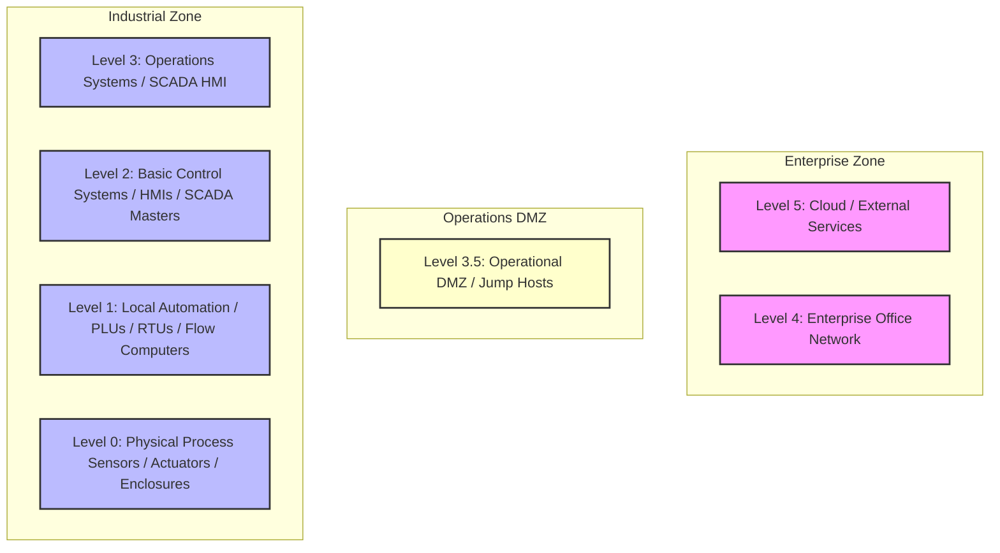

# 📘 Compliance Record of Note: IEC 62443-2-1
## Establishing an IACS Security Program

---

## 📋 Framework Overview
* **Framework ID**: `IEC_62443_2_1`
* **Category**: `Governance & Policy`
* **Industry Sector (Primary)**: `Cross-Sector`
* **Mapped CISA Critical Sectors**: `Critical Manufacturing`, `Energy`, `Water and Wastewater Systems`, `Chemical`, `Transportation Systems`
* **Control Scope**: Contains 17 high-fidelity operational technology (OT) and information technology (IT) compliance checks.

> [!NOTE]
> This document serves as the official **Record of Note** and artifact for the IEC 62443-2-1 framework. All control questions, standard codes, and Purdue Model mappings are compiled directly from CSET definitions.

### Description
Requirements for establishing, implementing, maintaining, and improving a security program for asset owners.

---

## 📐 Purdue Model Mapping

Control levels are logically aligned with the Purdue Enterprise Reference Architecture (PERA) to isolate process control boundaries from enterprise systems:

---

## 🛡️ Control Matrix

| Standard Code | Question Text | Category | Purdue Level | Guidance / Description |
| :--- | :--- | :--- | :---: | :--- |
| **62443_2_1-SP.1.1** | Is the industrial control security program formally approved by executive management? | Security Program Governance | 4 | Verify documented program approvals, management signatures, and evidence of periodic review cycles.  SOP: 1. Enforce strict role-based access controls (RBAC) separating administrative tasks from standard operator routines. 2. Route all incoming remote connections through isolated administrative Jump Hosts with visual session logging active. 3. Conduct quarterly access audits to identify and completely disable dormant or inactive accounts. 4. Document the Security Level achieved (SL-A) vs target requirements (SL-T) for each zone conduit.  VERIFICATION CRITERIA: Inspect the security program governance configurations, check the verified logs, review the system settings, and check the following: Evaluation evidence must include: Zone and Conduit design architecture diagram, Security Level Target (SL-T) vs Security Level Achieved (SL-A) matrix, and OEM device integration manual validation registers.  OT/IT CONVERGENCE RISK: General IT-OT convergence increases the threat landscape by bridging air-gapped industrial facilities with internet-facing corporate systems. Failing to enforce strict regulatory controls risks introducing severe operational vulnerabilities. |
| **62443_2_1-SP.2.1** | Are all operational cyber assets identified, cataloged, and classified by critical impact (covering Siemens S7-1500 PLCs, Allen-Bradley ControlLogix, SEL RTUs, and digital relay modules)? | Asset Management | 3 | Audit active asset databases, serial lists, and impact scores across the production network.  SOP: 1. Deploy endpoint protection agents configured with real-time process monitoring to block unsigned scripts and execution threats. 2. Enforce automatic session logout GPOs terminating interactive operator connections after a defined period of inactivity. 3. Configure system event log forwarding to stream all reboots, login attempts, and administrative modifications to a centralized syslog receiver. 4. Document the Security Level achieved (SL-A) vs target requirements (SL-T) for each zone conduit.  VERIFICATION CRITERIA: Inspect the asset management configurations, check the verified logs, review the system settings, and check the following: Evaluation evidence must include: Zone and Conduit design architecture diagram, Security Level Target (SL-T) vs Security Level Achieved (SL-A) matrix, and OEM device integration manual validation registers.  OT/IT CONVERGENCE RISK: Using unhardened or unpatched field controllers opens critical hardware interfaces to remote execution exploits. Attackers can leverage known vulnerabilities to flash unauthorized firmware or change safety threshold parameters on active PLCs. |
| **62443_2_1-SP.3.1** | Is a systematic cyber risk assessment executed at least annually on all production lines? | Risk Management | 4 | Validate risk assessment logs, methodology reports, and mitigation action trackers.  SOP: 1. Enforce strict role-based access controls (RBAC) separating administrative tasks from standard operator routines. 2. Route all incoming remote connections through isolated administrative Jump Hosts with visual session logging active. 3. Conduct quarterly access audits to identify and completely disable dormant or inactive accounts. 4. Document the Security Level achieved (SL-A) vs target requirements (SL-T) for each zone conduit.  VERIFICATION CRITERIA: Inspect the risk management configurations, check the verified logs, review the system settings, and check the following: Evaluation evidence must include: Zone and Conduit design architecture diagram, Security Level Target (SL-T) vs Security Level Achieved (SL-A) matrix, and OEM device integration manual validation registers.  OT/IT CONVERGENCE RISK: General IT-OT convergence increases the threat landscape by bridging air-gapped industrial facilities with internet-facing corporate systems. Failing to enforce strict regulatory controls risks introducing severe operational vulnerabilities. |
| **62443_2_1-SP.4.1** | Are operational cybersecurity incident response plans documented, active, and tested (aligned with incident response playbooks, offsite backups, and isolated write-once media)? | Incident Command | 4 | Verify emergency communication charts, active playbooks, and incident logging interfaces.  SOP: 1. Enforce strict role-based access controls (RBAC) separating administrative tasks from standard operator routines. 2. Route all incoming remote connections through isolated administrative Jump Hosts with visual session logging active. 3. Conduct quarterly access audits to identify and completely disable dormant or inactive accounts. 4. Document the Security Level achieved (SL-A) vs target requirements (SL-T) for each zone conduit.  VERIFICATION CRITERIA: Inspect the incident command configurations, check the verified logs, review the system settings, and check the following: Evaluation evidence must include: Zone and Conduit design architecture diagram, Security Level Target (SL-T) vs Security Level Achieved (SL-A) matrix, and OEM device integration manual validation registers.  OT/IT CONVERGENCE RISK: Failing to maintain isolated, offline backups during convergence events risks catastrophic downtime during ransomware outbreaks. If backups reside on the shared enterprise domain, the same malware that encrypts SCADA HMIs will wipe the recovery configurations. |
| **62443_2_1-SP.5.1** | Is an active operational technology patch assessment and distribution plan implemented? | Maintenance Safety | 3 | Review firmware tracking lists, testing sandbox protocols, and patch validation status logs.  SOP: 1. Deploy endpoint protection agents configured with real-time process monitoring to block unsigned scripts and execution threats. 2. Enforce automatic session logout GPOs terminating interactive operator connections after a defined period of inactivity. 3. Configure system event log forwarding to stream all reboots, login attempts, and administrative modifications to a centralized syslog receiver. 4. Document the Security Level achieved (SL-A) vs target requirements (SL-T) for each zone conduit.  VERIFICATION CRITERIA: Inspect the maintenance safety configurations, check the verified logs, review the system settings, and check the following: Evaluation evidence must include: Zone and Conduit design architecture diagram, Security Level Target (SL-T) vs Security Level Achieved (SL-A) matrix, and OEM device integration manual validation registers.  OT/IT CONVERGENCE RISK: General IT-OT convergence increases the threat landscape by bridging air-gapped industrial facilities with internet-facing corporate systems. Failing to enforce strict regulatory controls risks introducing severe operational vulnerabilities. |
| **62443_2_1-SP.6.1** | Are industrial control segments logically and physically separated from corporate business networks (enforced by Cisco Industrial Ethernet switches, network zoning firewalls, and isolated Purdue model level boundaries)? | Segmentation Strategy | 3 | Inspect edge firewall configurations, routing rules, and isolated DMZ boundaries.  SOP: 1. Deploy endpoint protection agents configured with real-time process monitoring to block unsigned scripts and execution threats. 2. Enforce automatic session logout GPOs terminating interactive operator connections after a defined period of inactivity. 3. Configure system event log forwarding to stream all reboots, login attempts, and administrative modifications to a centralized syslog receiver. 4. Document the Security Level achieved (SL-A) vs target requirements (SL-T) for each zone conduit.  VERIFICATION CRITERIA: Inspect the segmentation strategy configurations, check the verified logs, review the system settings, and check the following: Evaluation evidence must include: Zone and Conduit design architecture diagram, Security Level Target (SL-T) vs Security Level Achieved (SL-A) matrix, and OEM device integration manual validation registers.  OT/IT CONVERGENCE RISK: Inadequate network segmentation allows IT-OT convergence traffic to flow unmediated across enclaves. A malware infection on the corporate LAN (like ransomware) can propagate directly to critical process control loops, halting operations. |
| **62443_2_1-SP.7.1** | Are service provider security capabilities evaluated and contractually enforced? | Vendor Governance | 4 | Check vendor compliance disclosures, signed security clauses, and remote support access authorizations.  SOP: 1. Enforce strict role-based access controls (RBAC) separating administrative tasks from standard operator routines. 2. Route all incoming remote connections through isolated administrative Jump Hosts with visual session logging active. 3. Conduct quarterly access audits to identify and completely disable dormant or inactive accounts. 4. Document the Security Level achieved (SL-A) vs target requirements (SL-T) for each zone conduit.  VERIFICATION CRITERIA: Inspect the vendor governance configurations, check the verified logs, review the system settings, and check the following: Evaluation evidence must include: Zone and Conduit design architecture diagram, Security Level Target (SL-T) vs Security Level Achieved (SL-A) matrix, and OEM device integration manual validation registers.  OT/IT CONVERGENCE RISK: General IT-OT convergence increases the threat landscape by bridging air-gapped industrial facilities with internet-facing corporate systems. Failing to enforce strict regulatory controls risks introducing severe operational vulnerabilities. |
| **62443_2_1-SP.8.1** | Are physical and logical access permissions reviewed and audited regularly (utilizing secure Jump Hosts, MFA validation nodes, active directory GPOs, and hardware tokens)? | Access Controls | 3 | Review operator account profiles, privilege delegation tables, and local authorization logs.  SOP: 1. Deploy endpoint protection agents configured with real-time process monitoring to block unsigned scripts and execution threats. 2. Enforce automatic session logout GPOs terminating interactive operator connections after a defined period of inactivity. 3. Configure system event log forwarding to stream all reboots, login attempts, and administrative modifications to a centralized syslog receiver. 4. Document the Security Level achieved (SL-A) vs target requirements (SL-T) for each zone conduit.  VERIFICATION CRITERIA: Inspect the access controls configurations, check the verified logs, review the system settings, and check the following: Evaluation evidence must include: Zone and Conduit design architecture diagram, Security Level Target (SL-T) vs Security Level Achieved (SL-A) matrix, and OEM device integration manual validation registers.  OT/IT CONVERGENCE RISK: Unauthenticated or unmonitored IT-OT bridge endpoints can expose critical IEC 62443 2 1 systems to lateral network pivoting. An administrative compromise in the enterprise domain (such as phishing or AD account compromise) can lead directly to unauthorized SCADA control commands. |
| **62443_2_1-SP.9.1** | Do personnel receive industrial cybersecurity training prior to accessing critical networks? | Training Program | 4 | Verify employee onboarding certifications, training logs, and security awareness statistics.  SOP: 1. Enforce strict role-based access controls (RBAC) separating administrative tasks from standard operator routines. 2. Route all incoming remote connections through isolated administrative Jump Hosts with visual session logging active. 3. Conduct quarterly access audits to identify and completely disable dormant or inactive accounts. 4. Document the Security Level achieved (SL-A) vs target requirements (SL-T) for each zone conduit.  VERIFICATION CRITERIA: Inspect the training program configurations, check the verified logs, review the system settings, and check the following: Evaluation evidence must include: Zone and Conduit design architecture diagram, Security Level Target (SL-T) vs Security Level Achieved (SL-A) matrix, and OEM device integration manual validation registers.  OT/IT CONVERGENCE RISK: General IT-OT convergence increases the threat landscape by bridging air-gapped industrial facilities with internet-facing corporate systems. Failing to enforce strict regulatory controls risks introducing severe operational vulnerabilities. |
| **62443_2_1-SP.10.1** | Are backup restoration procedures for critical PLCs and SCADA nodes tested annually? | Operations Continuity | 3 | Validate backup recovery test logs, offsite replica configurations, and restoration reports.  SOP: 1. Deploy endpoint protection agents configured with real-time process monitoring to block unsigned scripts and execution threats. 2. Enforce automatic session logout GPOs terminating interactive operator connections after a defined period of inactivity. 3. Configure system event log forwarding to stream all reboots, login attempts, and administrative modifications to a centralized syslog receiver. 4. Document the Security Level achieved (SL-A) vs target requirements (SL-T) for each zone conduit.  VERIFICATION CRITERIA: Inspect the operations continuity configurations, check the verified logs, review the system settings, and check the following: Evaluation evidence must include: Zone and Conduit design architecture diagram, Security Level Target (SL-T) vs Security Level Achieved (SL-A) matrix, and OEM device integration manual validation registers.  OT/IT CONVERGENCE RISK: General IT-OT convergence increases the threat landscape by bridging air-gapped industrial facilities with internet-facing corporate systems. Failing to enforce strict regulatory controls risks introducing severe operational vulnerabilities. |
| **62443_2_1-C-11** | Are unique user credentials and multi-factor authentication (MFA) enforced for all operational and administrative interfaces (utilizing secure Jump Hosts, MFA validation nodes, active directory GPOs, and hardware tokens)? | Access Control & Identity | 4 | Verify compliance against IEC 62443 2 1 requirements for control 62443_2_1-C-11.  SOP: 1. Enforce strict role-based access controls (RBAC) separating administrative tasks from standard operator routines. 2. Route all incoming remote connections through isolated administrative Jump Hosts with visual session logging active. 3. Conduct quarterly access audits to identify and completely disable dormant or inactive accounts.  VERIFICATION CRITERIA: Inspect the access control & identity configurations, check the verified logs, review the system settings, and check the following: Evaluation evidence must include: Active Directory group policies, Jump Server log databases, MFA configuration logs, and administrative access audit certificates.  OT/IT CONVERGENCE RISK: Unauthenticated or unmonitored IT-OT bridge endpoints can expose critical networks to lateral pivoting. An administrative compromise in the enterprise domain (such as phishing or AD account compromise) can lead directly to unauthorized SCADA control commands. |
| **62443_2_1-C-12** | Are electronic security perimeters and operational DMZs implemented to logically segment industrial networks (enforced by Cisco Industrial Ethernet switches, network zoning firewalls, and isolated Purdue model level boundaries)? | Boundary Protection & Network Segmentation | 3 | Verify compliance against IEC 62443 2 1 requirements for control 62443_2_1-C-12.  SOP: 1. Deploy an Operational DMZ to segment Level 3 and Level 4 network communications. 2. Route all boundary traffic through stateful firewalls with dynamic threat prevention active. 3. Disable all unused physical ports and implement unidirectional data diodes for safety loops.  VERIFICATION CRITERIA: Inspect the boundary protection & network segmentation configurations, check the verified logs, review the system settings, and check the following: Evaluation evidence must include: Zone and Conduit design architecture diagram, Security Level Target (SL-T) vs Security Level Achieved (SL-A) matrix, and network firewall configuration files.  OT/IT CONVERGENCE RISK: Inadequate network segmentation allows IT-OT convergence traffic to flow unmediated across enclaves. A malware infection on the corporate LAN (like ransomware) can propagate directly to critical process control loops, halting operations. |
| **62443_2_1-C-13** | Are default passwords disabled and unused software services deactivated on all host endpoints (covering Siemens S7-1500 PLCs, Allen-Bradley ControlLogix, SEL RTUs, and digital relay modules)? | Host Hardening - Device Integrity | 2 | Verify compliance against IEC 62443 2 1 requirements for control 62443_2_1-C-13.  SOP: 1. Disable all unnecessary local services (e.g. FTP, raw Telnet, HTTP) in host operating system settings. 2. Configure host configuration locks and disable local diagnostic ports to block unauthorized adjustments. 3. Enforce application whitelisting and configuration baselines on all engineering terminals.  VERIFICATION CRITERIA: Inspect the host hardening - device integrity configurations, check the verified logs, review the system settings, and check the following: Evaluation evidence must include: host hardening checklists, disabled service audit logs, application whitelisting policies, and local host configuration files.  OT/IT CONVERGENCE RISK: Using unhardened or unpatched field controllers opens critical hardware interfaces to remote execution exploits. Attackers can leverage known vulnerabilities to flash unauthorized firmware or change safety threshold parameters on active PLCs. |
| **62443_2_1-C-14** | Are system event logs synchronized via secure NTP and stored continuously on write-once media (aligned with incident response playbooks, offsite backups, and isolated write-once media)? | Audit Trails & Security Logging | 3 | Verify compliance against IEC 62443 2 1 requirements for control 62443_2_1-C-14.  SOP: 1. Configure centralized syslog forwarding to stream all reboots, login attempts, and administrative modifications. 2. Synchronize all system logs using secure NTP servers with verified time offsets. 3. Restrict log access to authorized audit roles and configure log alerts for high-priority security events.  VERIFICATION CRITERIA: Inspect the audit trails & security logging configurations, check the verified logs, review the system settings, and check the following: Evaluation evidence must include: NTP synchronization logs, centralized syslog receiver configurations, write-once media validation tests, and log audit registers.  OT/IT CONVERGENCE RISK: Failing to maintain comprehensive, synchronized event logs during a convergence breach blinds security teams to the attacker's footprint. Without centralized logs, forensic tracking of unauthorized PLC firmware changes or database adjustments is impossible. |
| **62443_2_1-C-15** | Are physical access controls and locking covers implemented around critical equipment cabinets (covering Siemens S7-1500 PLCs, Allen-Bradley ControlLogix, SEL RTUs, and digital relay modules)? | Physical Protection & Enclosures | 1 | Verify compliance against IEC 62443 2 1 requirements for control 62443_2_1-C-15.  SOP: 1. Establish physical locking covers and secure enclosures around critical field device interfaces. 2. Deploy electronic badge access and security cameras to monitor all entry boundaries. 3. Maintain visitor logs and enforce mandatory escorts for all unauthorized personnel.  VERIFICATION CRITERIA: Inspect the physical protection & enclosures configurations, check the verified logs, review the system settings, and check the following: Evaluation evidence must include: physical security plan, electronic badge entry history log, security camera archive, visitor registry, and enclosure inspection logs.  OT/IT CONVERGENCE RISK: Unrestricted physical access to hardware enclaves bypasses all logical firewall policies. An attacker with physical cabinet access can connect a malicious device directly to the backplane, flashing compromised logic onto operating controllers. |
| **62443_2_1-C-16** | Are offline, tested backups of device logic and HMI applications maintained regularly (aligned with incident response playbooks, offsite backups, and isolated write-once media)? | Disaster Recovery & Backup Continuity | 3 | Verify compliance against IEC 62443 2 1 requirements for control 62443_2_1-C-16.  SOP: 1. Run weekly backups of all running PLC configurations and logic programs. 2. Store backup images in secure offsite fireproof enclosures or write-once media. 3. Conduct annual backup restoration simulation tests to verify recovery time objectives.  VERIFICATION CRITERIA: Inspect the disaster recovery & backup continuity configurations, check the verified logs, review the system settings, and check the following: disaster recovery plan, backup log verification sheets, offsite media transit registry, and annual restoration simulation test reports.  OT/IT CONVERGENCE RISK: Failing to maintain isolated, offline backups during convergence events risks catastrophic downtime during ransomware outbreaks. If backups reside on the shared enterprise domain, the same malware that encrypts SCADA HMIs will wipe the recovery configurations. |
| **62443_2_1-C-17** | Are telemetry lines and industrial communication links encrypted utilizing secure protocols (utilizing VPN tunnels, encrypted Modbus/DNP3 secure protocols, and HSM keys)? | Data Integrity & Telemetry | 2 | Verify compliance against IEC 62443 2 1 requirements for control 62443_2_1-C-17.  SOP: 1. Implement VPN tunnels or hardware encryption modules for all wide-area telemetry links. 2. Transition raw serial or unencrypted communications to secure protocols like Secure DNP3 or OPC UA. 3. Restrict logical access to communications adapters and configure cryptographic key rotation.  VERIFICATION CRITERIA: Inspect the data integrity & telemetry configurations, check the verified logs, review the system settings, and check the following: communications link encryption audit report, VPN router configurations, Secure DNP3/OPC UA log traces, and cryptographic key management records.  OT/IT CONVERGENCE RISK: Traversing industrial telemetry in cleartext across converged networks invites eavesdropping and packet injection. Malicious actors can execute Man-in-the-Middle (MitM) attacks, spoofing HMI screens while sending dangerous control commands. |

---

## 🛠️ Verification & Implementation Guidelines

To implement the **IEC 62443-2-1** controls successfully inside your OT environment:

1. **Logical Separation**: Isolate all Level 1 and 2 process loops (PLCs/RTUs) from business segments using strict Level 3.5 DMZ routing tables.
2. **Access Control**: Ensure that all administrative commands to control loops require multi-factor authentication (MFA) via Jump Hosts.
3. **Continuous Auditing**: Collect and route event logs continuously to a write-once secure syslog receiver with synchronized NTP timestamps.
4. **Logic Backups**: Back up all running PLC configurations and logic programs weekly, storing them in fireproof cabinets or secure offsite enclaves.

> [!IMPORTANT]
> Any modifications to logic settings or firmware on Level 1-2 devices must undergo rigorous sandbox testing and double-signature verification before deployment.
