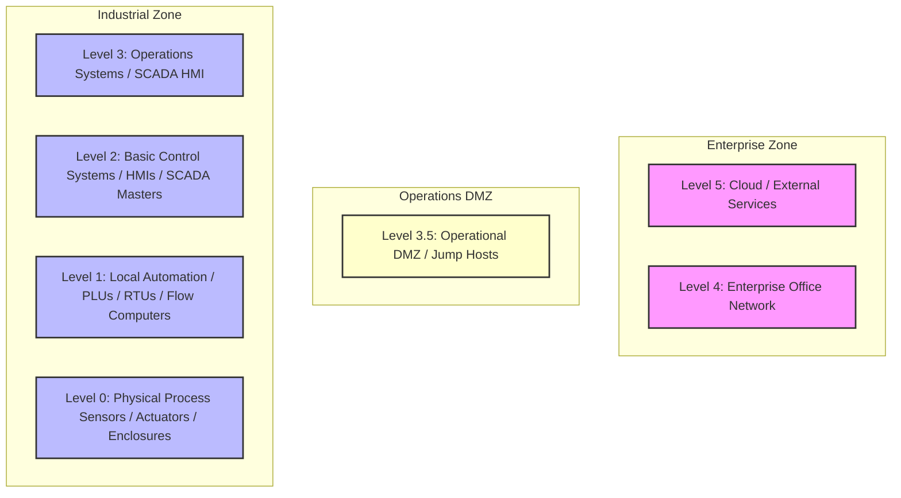

# 📘 Compliance Record of Note: ISA-99
## ISA-99 Standard

---

## 📋 Framework Overview
* **Framework ID**: `ISA_99_LEGACY`
* **Category**: `Industrial Control Systems`
* **Industry Sector (Primary)**: `Cross-Sector`
* **Mapped CISA Critical Sectors**: `Critical Manufacturing`, `Energy`, `Water and Wastewater Systems`
* **Control Scope**: Contains 13 high-fidelity operational technology (OT) and information technology (IT) compliance checks.

> [!NOTE]
> This document serves as the official **Record of Note** and artifact for the ISA-99 framework. All control questions, standard codes, and Purdue Model mappings are compiled directly from CSET definitions.

### Description
Legacy industrial network standard establishing basic zoning security concepts.

---

## 📐 Purdue Model Mapping

Control levels are logically aligned with the Purdue Enterprise Reference Architecture (PERA) to isolate process control boundaries from enterprise systems:

---

## 🛡️ Control Matrix

| Standard Code | Question Text | Category | Purdue Level | Guidance / Description |
| :--- | :--- | :--- | :---: | :--- |
| **ISA-ISA99-1** | Is the logical network structure mapped to the zones and conduits reference model? | Zoning Architecture | 3 | Verify comprehensive network drawings, zone demarcations, and conduit interface routing maps.  SOP: 1. Deploy endpoint protection agents configured with real-time process monitoring to block unsigned scripts and execution threats. 2. Enforce automatic session logout GPOs terminating interactive operator connections after a defined period of inactivity. 3. Configure system event log forwarding to stream all reboots, login attempts, and administrative modifications to a centralized syslog receiver.  VERIFICATION CRITERIA: Inspect the zoning architecture configurations, check the verified logs, review the system settings, and check the following: General OT/IT security evidence must include: change management tracking tickets, Active Directory Group Policy Objects (GPOs), system log archives, and Nozomi/Dragos anomaly monitoring configuration files.  OT/IT CONVERGENCE RISK: General IT-OT convergence increases the threat landscape by bridging air-gapped industrial facilities with internet-facing corporate systems. Failing to enforce strict regulatory controls risks introducing severe operational vulnerabilities. |
| **ISA-ISA99-2** | Are logical domains with shared security requirements isolated in separate zones? | Zone Segregation | 3 | Audit switch configs, router interfaces, and edge isolation firewall filtering rules.  SOP: 1. Deploy endpoint protection agents configured with real-time process monitoring to block unsigned scripts and execution threats. 2. Enforce automatic session logout GPOs terminating interactive operator connections after a defined period of inactivity. 3. Configure system event log forwarding to stream all reboots, login attempts, and administrative modifications to a centralized syslog receiver.  VERIFICATION CRITERIA: Inspect the zone segregation configurations, check the verified logs, review the system settings, and check the following: General OT/IT security evidence must include: change management tracking tickets, Active Directory Group Policy Objects (GPOs), system log archives, and Nozomi/Dragos anomaly monitoring configuration files.  OT/IT CONVERGENCE RISK: General IT-OT convergence increases the threat landscape by bridging air-gapped industrial facilities with internet-facing corporate systems. Failing to enforce strict regulatory controls risks introducing severe operational vulnerabilities. |
| **ISA-ISA99-3** | Are all communications crossing zone boundaries mediated through defined conduits? | Conduit Mediation | 3 | Verify firewall rules, session controls, and proxy mediation parameters on cross-zone routes.  SOP: 1. Deploy endpoint protection agents configured with real-time process monitoring to block unsigned scripts and execution threats. 2. Enforce automatic session logout GPOs terminating interactive operator connections after a defined period of inactivity. 3. Configure system event log forwarding to stream all reboots, login attempts, and administrative modifications to a centralized syslog receiver.  VERIFICATION CRITERIA: Inspect the conduit mediation configurations, check the verified logs, review the system settings, and check the following: General OT/IT security evidence must include: change management tracking tickets, Active Directory Group Policy Objects (GPOs), system log archives, and Nozomi/Dragos anomaly monitoring configuration files.  OT/IT CONVERGENCE RISK: General IT-OT convergence increases the threat landscape by bridging air-gapped industrial facilities with internet-facing corporate systems. Failing to enforce strict regulatory controls risks introducing severe operational vulnerabilities. |
| **ISA-ISA99-4** | Are interactive operators authenticated when navigating between distinct security zones (utilizing secure Jump Hosts, MFA validation nodes, active directory GPOs, and hardware tokens)? | Access Control Boundary | 3 | Check credentials gates on transit nodes, Active Directory group checks, and MFA tunnels.  SOP: 1. Deploy endpoint protection agents configured with real-time process monitoring to block unsigned scripts and execution threats. 2. Enforce automatic session logout GPOs terminating interactive operator connections after a defined period of inactivity. 3. Configure system event log forwarding to stream all reboots, login attempts, and administrative modifications to a centralized syslog receiver.  VERIFICATION CRITERIA: Inspect the access control boundary configurations, check the verified logs, review the system settings, and check the following: General OT/IT security evidence must include: change management tracking tickets, Active Directory Group Policy Objects (GPOs), system log archives, and Nozomi/Dragos anomaly monitoring configuration files.  OT/IT CONVERGENCE RISK: Unauthenticated or unmonitored IT-OT bridge endpoints can expose critical ISA 99 LEGACY systems to lateral network pivoting. An administrative compromise in the enterprise domain (such as phishing or AD account compromise) can lead directly to unauthorized SCADA control commands. |
| **ISA-ISA99-5** | Are local process loops completely isolated from corporate business networking traffic? | Logical Isolation | 2 | Ensure zero direct routing exists between office subnetworks and Level 1 PLC segments.  SOP: 1. Establish physical locking covers and secure enclosures around critical field device interfaces. 2. Configure hardware configuration locks and disable local diagnostic ports (USB, RS-232) to block local unauthorized adjustments. 3. Validate that device configuration changes require double-signature supervisor tokens before logical modifications are written to memory.  VERIFICATION CRITERIA: Inspect the logical isolation configurations, check the verified logs, review the system settings, and check the following: General OT/IT security evidence must include: change management tracking tickets, Active Directory Group Policy Objects (GPOs), system log archives, and Nozomi/Dragos anomaly monitoring configuration files.  OT/IT CONVERGENCE RISK: General IT-OT convergence increases the threat landscape by bridging air-gapped industrial facilities with internet-facing corporate systems. Failing to enforce strict regulatory controls risks introducing severe operational vulnerabilities. |
| **ISA-ISA99-6** | Is network traffic passing through conduits monitored in real-time (enforced by Cisco Industrial Ethernet switches, network zoning firewalls, and isolated Purdue model level boundaries)? | Network Auditing | 3 | Audit intrusion sensor capture logs, flow parameters, and boundary firewall alert queues.  SOP: 1. Deploy endpoint protection agents configured with real-time process monitoring to block unsigned scripts and execution threats. 2. Enforce automatic session logout GPOs terminating interactive operator connections after a defined period of inactivity. 3. Configure system event log forwarding to stream all reboots, login attempts, and administrative modifications to a centralized syslog receiver.  VERIFICATION CRITERIA: Inspect the network auditing configurations, check the verified logs, review the system settings, and check the following: General OT/IT security evidence must include: change management tracking tickets, Active Directory Group Policy Objects (GPOs), system log archives, and Nozomi/Dragos anomaly monitoring configuration files.  OT/IT CONVERGENCE RISK: Inadequate network segmentation allows IT-OT convergence traffic to flow unmediated across enclaves. A malware infection on the corporate LAN (like ransomware) can propagate directly to critical process control loops, halting operations. |
| **ISA-ISA99-7** | Are baseline configuration parameters documented for all zone boundary firewalls? | Change Security Controls | 3 | Verify configuration version files, change ticket tracking, and administrative review approvals.  SOP: 1. Deploy endpoint protection agents configured with real-time process monitoring to block unsigned scripts and execution threats. 2. Enforce automatic session logout GPOs terminating interactive operator connections after a defined period of inactivity. 3. Configure system event log forwarding to stream all reboots, login attempts, and administrative modifications to a centralized syslog receiver.  VERIFICATION CRITERIA: Inspect the change security controls configurations, check the verified logs, review the system settings, and check the following: General OT/IT security evidence must include: change management tracking tickets, Active Directory Group Policy Objects (GPOs), system log archives, and Nozomi/Dragos anomaly monitoring configuration files.  OT/IT CONVERGENCE RISK: General IT-OT convergence increases the threat landscape by bridging air-gapped industrial facilities with internet-facing corporate systems. Failing to enforce strict regulatory controls risks introducing severe operational vulnerabilities. |
| **ISA-ISA99-8** | Are unused physical and logical ports locked down on cross-zone switches? | Boundary Hardening | 1 | Verify physical switch locks, port lockdown status files, and administrative disable settings.  SOP: 1. Establish physical locking covers and secure enclosures around critical field device interfaces. 2. Configure hardware configuration locks and disable local diagnostic ports (USB, RS-232) to block local unauthorized adjustments. 3. Validate that device configuration changes require double-signature supervisor tokens before logical modifications are written to memory.  VERIFICATION CRITERIA: Inspect the boundary hardening configurations, check the verified logs, review the system settings, and check the following: General OT/IT security evidence must include: change management tracking tickets, Active Directory Group Policy Objects (GPOs), system log archives, and Nozomi/Dragos anomaly monitoring configuration files.  OT/IT CONVERGENCE RISK: Using unhardened or unpatched field controllers opens critical hardware interfaces to remote execution exploits. Attackers can leverage known vulnerabilities to flash unauthorized firmware or change safety threshold parameters on active PLCs. |
| **ISA-ISA99-9** | Are access permissions to configure conduits restricted to authorized administrators? | Role Boundaries | 4 | Review admin access credentials, check group policies, and audit session connection logs.  SOP: 1. Enforce strict role-based access controls (RBAC) separating administrative tasks from standard operator routines. 2. Route all incoming remote connections through isolated administrative Jump Hosts with visual session logging active. 3. Conduct quarterly access audits to identify and completely disable dormant or inactive accounts.  VERIFICATION CRITERIA: Inspect the role boundaries configurations, check the verified logs, review the system settings, and check the following: General OT/IT security evidence must include: change management tracking tickets, Active Directory Group Policy Objects (GPOs), system log archives, and Nozomi/Dragos anomaly monitoring configuration files.  OT/IT CONVERGENCE RISK: General IT-OT convergence increases the threat landscape by bridging air-gapped industrial facilities with internet-facing corporate systems. Failing to enforce strict regulatory controls risks introducing severe operational vulnerabilities. |
| **ISA-ISA99-10** | Is communication inside process zones protected against network traffic floods? | System Resilience | 3 | Verify switch rate-limiting, broadcast storm controls, and loop detection setups.  SOP: 1. Deploy endpoint protection agents configured with real-time process monitoring to block unsigned scripts and execution threats. 2. Enforce automatic session logout GPOs terminating interactive operator connections after a defined period of inactivity. 3. Configure system event log forwarding to stream all reboots, login attempts, and administrative modifications to a centralized syslog receiver.  VERIFICATION CRITERIA: Inspect the system resilience configurations, check the verified logs, review the system settings, and check the following: General OT/IT security evidence must include: change management tracking tickets, Active Directory Group Policy Objects (GPOs), system log archives, and Nozomi/Dragos anomaly monitoring configuration files.  OT/IT CONVERGENCE RISK: General IT-OT convergence increases the threat landscape by bridging air-gapped industrial facilities with internet-facing corporate systems. Failing to enforce strict regulatory controls risks introducing severe operational vulnerabilities. |
| **ISA-C-11** | Are unique user credentials and multi-factor authentication (MFA) enforced for all operational and administrative interfaces (utilizing secure Jump Hosts, MFA validation nodes, active directory GPOs, and hardware tokens)? | Access Control & Identity | 4 | Verify compliance against ISA 99 LEGACY requirements for control ISA-C-11.  SOP: 1. Enforce strict role-based access controls (RBAC) separating administrative tasks from standard operator routines. 2. Route all incoming remote connections through isolated administrative Jump Hosts with visual session logging active. 3. Conduct quarterly access audits to identify and completely disable dormant or inactive accounts.  VERIFICATION CRITERIA: Inspect the access control & identity configurations, check the verified logs, review the system settings, and check the following: Evaluation evidence must include: Active Directory group policies, Jump Server log databases, MFA configuration logs, and administrative access audit certificates.  OT/IT CONVERGENCE RISK: Unauthenticated or unmonitored IT-OT bridge endpoints can expose critical networks to lateral pivoting. An administrative compromise in the enterprise domain (such as phishing or AD account compromise) can lead directly to unauthorized SCADA control commands. |
| **ISA-C-12** | Are electronic security perimeters and operational DMZs implemented to logically segment industrial networks (enforced by Cisco Industrial Ethernet switches, network zoning firewalls, and isolated Purdue model level boundaries)? | Boundary Protection & Network Segmentation | 3 | Verify compliance against ISA 99 LEGACY requirements for control ISA-C-12.  SOP: 1. Deploy an Operational DMZ to segment Level 3 and Level 4 network communications. 2. Route all boundary traffic through stateful firewalls with dynamic threat prevention active. 3. Disable all unused physical ports and implement unidirectional data diodes for safety loops.  VERIFICATION CRITERIA: Inspect the boundary protection & network segmentation configurations, check the verified logs, review the system settings, and check the following: Evaluation evidence must include: Zone and Conduit design architecture diagram, Security Level Target (SL-T) vs Security Level Achieved (SL-A) matrix, and network firewall configuration files.  OT/IT CONVERGENCE RISK: Inadequate network segmentation allows IT-OT convergence traffic to flow unmediated across enclaves. A malware infection on the corporate LAN (like ransomware) can propagate directly to critical process control loops, halting operations. |
| **ISA-C-13** | Are default passwords disabled and unused software services deactivated on all host endpoints (covering Siemens S7-1500 PLCs, Allen-Bradley ControlLogix, SEL RTUs, and digital relay modules)? | Host Hardening - Device Integrity | 2 | Verify compliance against ISA 99 LEGACY requirements for control ISA-C-13.  SOP: 1. Disable all unnecessary local services (e.g. FTP, raw Telnet, HTTP) in host operating system settings. 2. Configure host configuration locks and disable local diagnostic ports to block unauthorized adjustments. 3. Enforce application whitelisting and configuration baselines on all engineering terminals.  VERIFICATION CRITERIA: Inspect the host hardening - device integrity configurations, check the verified logs, review the system settings, and check the following: Evaluation evidence must include: host hardening checklists, disabled service audit logs, application whitelisting policies, and local host configuration files.  OT/IT CONVERGENCE RISK: Using unhardened or unpatched field controllers opens critical hardware interfaces to remote execution exploits. Attackers can leverage known vulnerabilities to flash unauthorized firmware or change safety threshold parameters on active PLCs. |

---

## 🛠️ Verification & Implementation Guidelines

To implement the **ISA-99** controls successfully inside your OT environment:

1. **Logical Separation**: Isolate all Level 1 and 2 process loops (PLCs/RTUs) from business segments using strict Level 3.5 DMZ routing tables.
2. **Access Control**: Ensure that all administrative commands to control loops require multi-factor authentication (MFA) via Jump Hosts.
3. **Continuous Auditing**: Collect and route event logs continuously to a write-once secure syslog receiver with synchronized NTP timestamps.
4. **Logic Backups**: Back up all running PLC configurations and logic programs weekly, storing them in fireproof cabinets or secure offsite enclaves.

> [!IMPORTANT]
> Any modifications to logic settings or firmware on Level 1-2 devices must undergo rigorous sandbox testing and double-signature verification before deployment.
