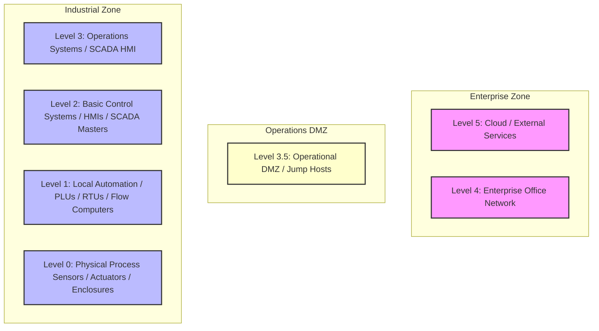

# 📘 Compliance Record of Note: NERC CIP-004-6
## Personnel & Training

---

## 📋 Framework Overview
* **Framework ID**: `NERC_CIP_004`
* **Category**: `Energy & Utilities`
* **Industry Sector (Primary)**: `Energy`
* **Mapped CISA Critical Sectors**: `Energy`
* **Control Scope**: Contains 4 high-fidelity operational technology (OT) and information technology (IT) compliance checks.

> [!NOTE]
> This document serves as the official **Record of Note** and artifact for the NERC CIP-004-6 framework. All control questions, standard codes, and Purdue Model mappings are compiled directly from CSET definitions.

### Description
Governs background checks, security awareness, and authorization requirements for personnel with system access.

---

## 📐 Purdue Model Mapping

Control levels are logically aligned with the Purdue Enterprise Reference Architecture (PERA) to isolate process control boundaries from enterprise systems:

---

## 🛡️ Control Matrix

| Standard Code | Question Text | Category | Purdue Level | Guidance / Description |
| :--- | :--- | :--- | :---: | :--- |
| **CIP004-CIP-004-R1.1** | Are background vetting checks carried out on all staff with critical access? | Personnel Vetting | 4 | Review background validation logs, screening checklists, and HR approval signatures.  SOP: 1. Enforce strict role-based access controls (RBAC) separating administrative tasks from standard operator routines. 2. Route all incoming remote connections through isolated administrative Jump Hosts with visual session logging active. 3. Conduct quarterly access audits to identify and completely disable dormant or inactive accounts. 4. Format NERC CIP compliance logs and evidence packages to support regional auditor sweeps.  VERIFICATION CRITERIA: Inspect the personnel vetting configurations, check the verified logs, review the system settings, and check the following: Auditor evidence must include: NERC CIP compliance register, active reliability coordinator approval logs, Bulk Electric System (BES) cyber asset inventories, and WECC/SERC/RFC audit-ready evidence package files.  OT/IT CONVERGENCE RISK: General IT-OT convergence increases the threat landscape by bridging air-gapped industrial facilities with internet-facing corporate systems. Failing to enforce strict regulatory controls risks introducing severe operational vulnerabilities. |
| **CIP004-CIP-004-R1.2** | Are background checks updated at least once every seven years for active personnel? | Personnel Vetting | 4 | Verify HR seven-year re-investigation schedules and employee vetting databases.  SOP: 1. Enforce strict role-based access controls (RBAC) separating administrative tasks from standard operator routines. 2. Route all incoming remote connections through isolated administrative Jump Hosts with visual session logging active. 3. Conduct quarterly access audits to identify and completely disable dormant or inactive accounts. 4. Format NERC CIP compliance logs and evidence packages to support regional auditor sweeps.  VERIFICATION CRITERIA: Inspect the personnel vetting configurations, check the verified logs, review the system settings, and check the following: Auditor evidence must include: NERC CIP compliance register, active reliability coordinator approval logs, Bulk Electric System (BES) cyber asset inventories, and WECC/SERC/RFC audit-ready evidence package files.  OT/IT CONVERGENCE RISK: General IT-OT convergence increases the threat landscape by bridging air-gapped industrial facilities with internet-facing corporate systems. Failing to enforce strict regulatory controls risks introducing severe operational vulnerabilities. |
| **CIP004-CIP-004-R2.1** | Do staff complete cyber security training prior to receiving operational access? | Training Program | 4 | Verify training module completion sheets, exam scores, and onboarding authorization files.  SOP: 1. Enforce strict role-based access controls (RBAC) separating administrative tasks from standard operator routines. 2. Route all incoming remote connections through isolated administrative Jump Hosts with visual session logging active. 3. Conduct quarterly access audits to identify and completely disable dormant or inactive accounts. 4. Format NERC CIP compliance logs and evidence packages to support regional auditor sweeps.  VERIFICATION CRITERIA: Inspect the training program configurations, check the verified logs, review the system settings, and check the following: Auditor evidence must include: NERC CIP compliance register, active reliability coordinator approval logs, Bulk Electric System (BES) cyber asset inventories, and WECC/SERC/RFC audit-ready evidence package files.  OT/IT CONVERGENCE RISK: General IT-OT convergence increases the threat landscape by bridging air-gapped industrial facilities with internet-facing corporate systems. Failing to enforce strict regulatory controls risks introducing severe operational vulnerabilities. |
| **CIP004-CIP-004-R2.2** | Is training updated and completed at least once every 15 calendar months? | Training Program | 4 | Check training schedules, course lists, and active certification logs.  SOP: 1. Enforce strict role-based access controls (RBAC) separating administrative tasks from standard operator routines. 2. Route all incoming remote connections through isolated administrative Jump Hosts with visual session logging active. 3. Conduct quarterly access audits to identify and completely disable dormant or inactive accounts. 4. Format NERC CIP compliance logs and evidence packages to support regional auditor sweeps.  VERIFICATION CRITERIA: Inspect the training program configurations, check the verified logs, review the system settings, and check the following: Auditor evidence must include: NERC CIP compliance register, active reliability coordinator approval logs, Bulk Electric System (BES) cyber asset inventories, and WECC/SERC/RFC audit-ready evidence package files.  OT/IT CONVERGENCE RISK: General IT-OT convergence increases the threat landscape by bridging air-gapped industrial facilities with internet-facing corporate systems. Failing to enforce strict regulatory controls risks introducing severe operational vulnerabilities. |

---

## 🛠️ Verification & Implementation Guidelines

To implement the **NERC CIP-004-6** controls successfully inside your OT environment:

1. **Logical Separation**: Isolate all Level 1 and 2 process loops (PLCs/RTUs) from business segments using strict Level 3.5 DMZ routing tables.
2. **Access Control**: Ensure that all administrative commands to control loops require multi-factor authentication (MFA) via Jump Hosts.
3. **Continuous Auditing**: Collect and route event logs continuously to a write-once secure syslog receiver with synchronized NTP timestamps.
4. **Logic Backups**: Back up all running PLC configurations and logic programs weekly, storing them in fireproof cabinets or secure offsite enclaves.

> [!IMPORTANT]
> Any modifications to logic settings or firmware on Level 1-2 devices must undergo rigorous sandbox testing and double-signature verification before deployment.
