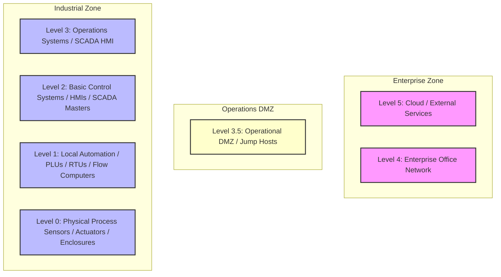

# 📘 Compliance Record of Note: NERC CIP-009-6
## Recovery Plans for BES Cyber Systems

---

## 📋 Framework Overview
* **Framework ID**: `NERC_CIP_009`
* **Category**: `Energy & Utilities`
* **Industry Sector (Primary)**: `Energy`
* **Mapped CISA Critical Sectors**: `Energy`
* **Control Scope**: Contains 3 high-fidelity operational technology (OT) and information technology (IT) compliance checks.

> [!NOTE]
> This document serves as the official **Record of Note** and artifact for the NERC CIP-009-6 framework. All control questions, standard codes, and Purdue Model mappings are compiled directly from CSET definitions.

### Description
Requires disaster recovery plans, backup strategies, and annual simulation tests for substation systems.

---

## 📐 Purdue Model Mapping

Control levels are logically aligned with the Purdue Enterprise Reference Architecture (PERA) to isolate process control boundaries from enterprise systems:

---

## 🛡️ Control Matrix

| Standard Code | Question Text | Category | Purdue Level | Guidance / Description |
| :--- | :--- | :--- | :---: | :--- |
| **CIP009-CIP-009-R1.1** | Is a Bulk Electric System cyber disaster recovery plan documented and active (aligned with incident response playbooks, offsite backups, and isolated write-once media)? | Disaster Recovery | 4 | Review disaster recovery plans, check offsite storage registers, and inspect procedures.  SOP: 1. Enforce strict role-based access controls (RBAC) separating administrative tasks from standard operator routines. 2. Route all incoming remote connections through isolated administrative Jump Hosts with visual session logging active. 3. Conduct quarterly access audits to identify and completely disable dormant or inactive accounts. 4. Format NERC CIP compliance logs and evidence packages to support regional auditor sweeps.  VERIFICATION CRITERIA: Inspect the disaster recovery configurations, check the verified logs, review the system settings, and check the following: Auditor evidence must include: NERC CIP compliance register, active reliability coordinator approval logs, Bulk Electric System (BES) cyber asset inventories, and WECC/SERC/RFC audit-ready evidence package files.  OT/IT CONVERGENCE RISK: Failing to maintain isolated, offline backups during convergence events risks catastrophic downtime during ransomware outbreaks. If backups reside on the shared enterprise domain, the same malware that encrypts SCADA HMIs will wipe the recovery configurations. |
| **CIP009-CIP-009-R1.2** | Are step-by-step substation manual control procedures documented for emergency use (aligned with incident response playbooks, offsite backups, and isolated write-once media)? | Disaster Recovery | 3 | Validate documented emergency guides, local switch layouts, and operator desk instructions.  SOP: 1. Deploy endpoint protection agents configured with real-time process monitoring to block unsigned scripts and execution threats. 2. Enforce automatic session logout GPOs terminating interactive operator connections after a defined period of inactivity. 3. Configure system event log forwarding to stream all reboots, login attempts, and administrative modifications to a centralized syslog receiver. 4. Format NERC CIP compliance logs and evidence packages to support regional auditor sweeps.  VERIFICATION CRITERIA: Inspect the disaster recovery configurations, check the verified logs, review the system settings, and check the following: Auditor evidence must include: NERC CIP compliance register, active reliability coordinator approval logs, Bulk Electric System (BES) cyber asset inventories, and WECC/SERC/RFC audit-ready evidence package files.  OT/IT CONVERGENCE RISK: Failing to maintain isolated, offline backups during convergence events risks catastrophic downtime during ransomware outbreaks. If backups reside on the shared enterprise domain, the same malware that encrypts SCADA HMIs will wipe the recovery configurations. |
| **CIP009-CIP-009-R2.1** | Are backup files containing PLC and HMI software versions verified for integrity? | Backup Verification | 3 | Verify backup checksum logs, inspect SHA-256 databases, and review backup directories.  SOP: 1. Deploy endpoint protection agents configured with real-time process monitoring to block unsigned scripts and execution threats. 2. Enforce automatic session logout GPOs terminating interactive operator connections after a defined period of inactivity. 3. Configure system event log forwarding to stream all reboots, login attempts, and administrative modifications to a centralized syslog receiver. 4. Format NERC CIP compliance logs and evidence packages to support regional auditor sweeps.  VERIFICATION CRITERIA: Inspect the backup verification configurations, check the verified logs, review the system settings, and check the following: Auditor evidence must include: NERC CIP compliance register, active reliability coordinator approval logs, Bulk Electric System (BES) cyber asset inventories, and WECC/SERC/RFC audit-ready evidence package files.  OT/IT CONVERGENCE RISK: Failing to maintain isolated, offline backups during convergence events risks catastrophic downtime during ransomware outbreaks. If backups reside on the shared enterprise domain, the same malware that encrypts SCADA HMIs will wipe the recovery configurations. |

---

## 🛠️ Verification & Implementation Guidelines

To implement the **NERC CIP-009-6** controls successfully inside your OT environment:

1. **Logical Separation**: Isolate all Level 1 and 2 process loops (PLCs/RTUs) from business segments using strict Level 3.5 DMZ routing tables.
2. **Access Control**: Ensure that all administrative commands to control loops require multi-factor authentication (MFA) via Jump Hosts.
3. **Continuous Auditing**: Collect and route event logs continuously to a write-once secure syslog receiver with synchronized NTP timestamps.
4. **Logic Backups**: Back up all running PLC configurations and logic programs weekly, storing them in fireproof cabinets or secure offsite enclaves.

> [!IMPORTANT]
> Any modifications to logic settings or firmware on Level 1-2 devices must undergo rigorous sandbox testing and double-signature verification before deployment.
