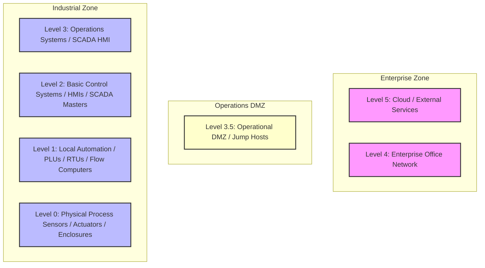

# 📘 Compliance Record of Note: NERC CIP-011-2
## Information Protection

---

## 📋 Framework Overview
* **Framework ID**: `NERC_CIP_011`
* **Category**: `Energy & Utilities`
* **Industry Sector (Primary)**: `Energy`
* **Mapped CISA Critical Sectors**: `Energy`
* **Control Scope**: Contains 2 high-fidelity operational technology (OT) and information technology (IT) compliance checks.

> [!NOTE]
> This document serves as the official **Record of Note** and artifact for the NERC CIP-011-2 framework. All control questions, standard codes, and Purdue Model mappings are compiled directly from CSET definitions.

### Description
Requirements to protect and securely sanitize Bulk Electric System operational cyber information.

---

## 📐 Purdue Model Mapping

Control levels are logically aligned with the Purdue Enterprise Reference Architecture (PERA) to isolate process control boundaries from enterprise systems:

---

## 🛡️ Control Matrix

| Standard Code | Question Text | Category | Purdue Level | Guidance / Description |
| :--- | :--- | :--- | :---: | :--- |
| **CIP011-CIP-011-R1.1** | Are rules defined to identify and protect sensitive Bulk Electric System cyber system information? | Information Security | 3 | Verify information classification files, check logical profiles, and review data procedures.  SOP: 1. Deploy endpoint protection agents configured with real-time process monitoring to block unsigned scripts and execution threats. 2. Enforce automatic session logout GPOs terminating interactive operator connections after a defined period of inactivity. 3. Configure system event log forwarding to stream all reboots, login attempts, and administrative modifications to a centralized syslog receiver. 4. Format NERC CIP compliance logs and evidence packages to support regional auditor sweeps.  VERIFICATION CRITERIA: Inspect the information security configurations, check the verified logs, review the system settings, and check the following: Auditor evidence must include: NERC CIP compliance register, active reliability coordinator approval logs, Bulk Electric System (BES) cyber asset inventories, and WECC/SERC/RFC audit-ready evidence package files.  OT/IT CONVERGENCE RISK: General IT-OT convergence increases the threat landscape by bridging air-gapped industrial facilities with internet-facing corporate systems. Failing to enforce strict regulatory controls risks introducing severe operational vulnerabilities. |
| **CIP011-CIP-011-R1.2** | Is sensitive Bulk Electric System cyber information encrypted in transit? | Information Security | 3 | Verify logical network encryption settings, check VPN configurations, and review SSL/TLS parameters.  SOP: 1. Deploy endpoint protection agents configured with real-time process monitoring to block unsigned scripts and execution threats. 2. Enforce automatic session logout GPOs terminating interactive operator connections after a defined period of inactivity. 3. Configure system event log forwarding to stream all reboots, login attempts, and administrative modifications to a centralized syslog receiver. 4. Format NERC CIP compliance logs and evidence packages to support regional auditor sweeps.  VERIFICATION CRITERIA: Inspect the information security configurations, check the verified logs, review the system settings, and check the following: Auditor evidence must include: NERC CIP compliance register, active reliability coordinator approval logs, Bulk Electric System (BES) cyber asset inventories, and WECC/SERC/RFC audit-ready evidence package files.  OT/IT CONVERGENCE RISK: General IT-OT convergence increases the threat landscape by bridging air-gapped industrial facilities with internet-facing corporate systems. Failing to enforce strict regulatory controls risks introducing severe operational vulnerabilities. |

---

## 🛠️ Verification & Implementation Guidelines

To implement the **NERC CIP-011-2** controls successfully inside your OT environment:

1. **Logical Separation**: Isolate all Level 1 and 2 process loops (PLCs/RTUs) from business segments using strict Level 3.5 DMZ routing tables.
2. **Access Control**: Ensure that all administrative commands to control loops require multi-factor authentication (MFA) via Jump Hosts.
3. **Continuous Auditing**: Collect and route event logs continuously to a write-once secure syslog receiver with synchronized NTP timestamps.
4. **Logic Backups**: Back up all running PLC configurations and logic programs weekly, storing them in fireproof cabinets or secure offsite enclaves.

> [!IMPORTANT]
> Any modifications to logic settings or firmware on Level 1-2 devices must undergo rigorous sandbox testing and double-signature verification before deployment.
