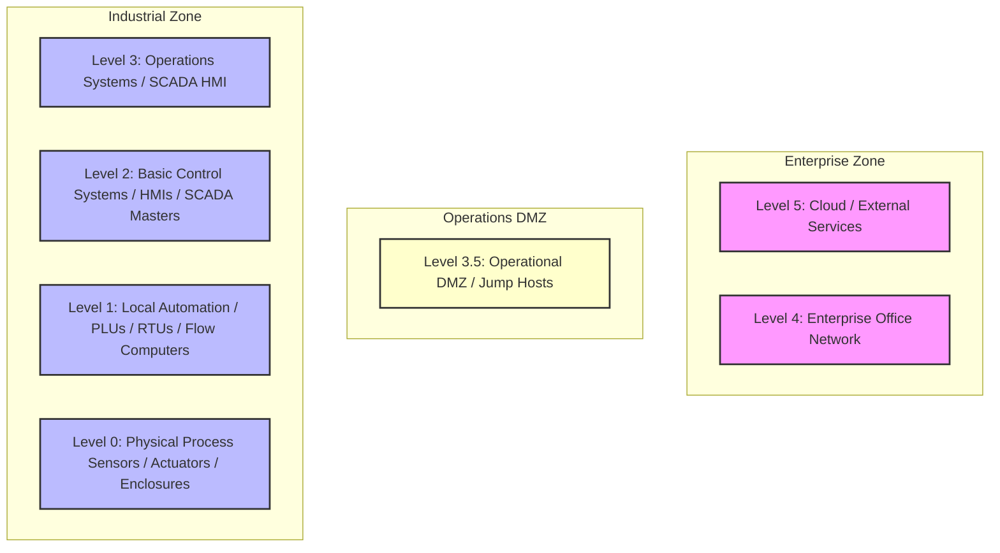

# 📘 Compliance Record of Note: TSA Pipeline Directive 2C
## TSA Pipeline Cybersecurity Directives

---

## 📋 Framework Overview
* **Framework ID**: `TSA_PIPELINE`
* **Category**: `Transportation`
* **Industry Sector (Primary)**: `Transportation Systems`
* **Mapped CISA Critical Sectors**: `Transportation Systems`, `Energy`
* **Control Scope**: Contains 99 high-fidelity operational technology (OT) and information technology (IT) compliance checks.

> [!NOTE]
> This document serves as the official **Record of Note** and artifact for the TSA Pipeline Directive 2C framework. All control questions, standard codes, and Purdue Model mappings are compiled directly from CSET definitions.

### Description
Mandatory directives focusing on security segmentation, access controls, and boundary mitigation for pipeline operators.

---

## 📐 Purdue Model Mapping

Control levels are logically aligned with the Purdue Enterprise Reference Architecture (PERA) to isolate process control boundaries from enterprise systems:

---

## 🛡️ Control Matrix

| Standard Code | Question Text | Category | Purdue Level | Guidance / Description |
| :--- | :--- | :--- | :---: | :--- |
| **TSA-IR-3F.C3** | Segregating (removing from the network) the infected device(s)? | General | 3 | Segregating (removing from the network) the infected device(s)?.  SOP: 1. Deploy endpoint protection agents configured with real-time process monitoring to block unsigned scripts and execution threats. 2. Enforce automatic session logout GPOs terminating interactive operator connections after a defined period of inactivity. 3. Configure system event log forwarding to stream all reboots, login attempts, and administrative modifications to a centralized syslog receiver. 4. Verify compliance with TSA critical infrastructure directives and report incidents immediately.  VERIFICATION CRITERIA: Inspect the general configurations, check the verified logs, review the system settings, and check the following: Pipeline/Rail sector evidence must include: TSA Critical Cyber Asset inventory ledger, TSA security directive compliance reports, and operational telemetry link encryption configuration files.  OT/IT CONVERGENCE RISK: General IT-OT convergence increases the threat landscape by bridging air-gapped industrial facilities with internet-facing corporate systems. Failing to enforce strict regulatory controls risks introducing severe operational vulnerabilities. |
| **TSA-IR-3F.C4** | Segregating any other devices that shared a network with the infected device(s)? | General | 3 | Segregating any other devices that shared a network with the infected device(s)?.  SOP: 1. Deploy endpoint protection agents configured with real-time process monitoring to block unsigned scripts and execution threats. 2. Enforce automatic session logout GPOs terminating interactive operator connections after a defined period of inactivity. 3. Configure system event log forwarding to stream all reboots, login attempts, and administrative modifications to a centralized syslog receiver. 4. Verify compliance with TSA critical infrastructure directives and report incidents immediately.  VERIFICATION CRITERIA: Inspect the general configurations, check the verified logs, review the system settings, and check the following: Pipeline/Rail sector evidence must include: TSA Critical Cyber Asset inventory ledger, TSA security directive compliance reports, and operational telemetry link encryption configuration files.  OT/IT CONVERGENCE RISK: General IT-OT convergence increases the threat landscape by bridging air-gapped industrial facilities with internet-facing corporate systems. Failing to enforce strict regulatory controls risks introducing severe operational vulnerabilities. |
| **TSA-IR-3F.C5** | Preserving volatile memory by collecting a forensic memory image of affected device(s) before powering off or moving? | General | 3 | Preserving volatile memory by collecting a forensic memory image of affected device(s) before powering off or moving?.  SOP: 1. Deploy endpoint protection agents configured with real-time process monitoring to block unsigned scripts and execution threats. 2. Enforce automatic session logout GPOs terminating interactive operator connections after a defined period of inactivity. 3. Configure system event log forwarding to stream all reboots, login attempts, and administrative modifications to a centralized syslog receiver. 4. Verify compliance with TSA critical infrastructure directives and report incidents immediately.  VERIFICATION CRITERIA: Inspect the general configurations, check the verified logs, review the system settings, and check the following: Pipeline/Rail sector evidence must include: TSA Critical Cyber Asset inventory ledger, TSA security directive compliance reports, and operational telemetry link encryption configuration files.  OT/IT CONVERGENCE RISK: General IT-OT convergence increases the threat landscape by bridging air-gapped industrial facilities with internet-facing corporate systems. Failing to enforce strict regulatory controls risks introducing severe operational vulnerabilities. |
| **TSA-IR-3F.C6** | Isolating and securing all infected and potentially infected devices, making sure to clearly label any equipment that has been affected by malicious code? | General | 3 | Isolating and securing all infected and potentially infected devices, making sure to clearly label any equipment that has been affected by malicious code?.  SOP: 1. Deploy endpoint protection agents configured with real-time process monitoring to block unsigned scripts and execution threats. 2. Enforce automatic session logout GPOs terminating interactive operator connections after a defined period of inactivity. 3. Configure system event log forwarding to stream all reboots, login attempts, and administrative modifications to a centralized syslog receiver. 4. Verify compliance with TSA critical infrastructure directives and report incidents immediately.  VERIFICATION CRITERIA: Inspect the general configurations, check the verified logs, review the system settings, and check the following: Pipeline/Rail sector evidence must include: TSA Critical Cyber Asset inventory ledger, TSA security directive compliance reports, and operational telemetry link encryption configuration files.  OT/IT CONVERGENCE RISK: General IT-OT convergence increases the threat landscape by bridging air-gapped industrial facilities with internet-facing corporate systems. Failing to enforce strict regulatory controls risks introducing severe operational vulnerabilities. |
| **TSA-IR-3F.C7** | Does the CIRP provide specific measures sufficient to ensure security and integrity of backed-up data, including measures to secure backups? | General | 3 | Does the CIRP provide specific measures sufficient to ensure security and integrity of backed-up data, including measures to secure backups?.  SOP: 1. Deploy endpoint protection agents configured with real-time process monitoring to block unsigned scripts and execution threats. 2. Enforce automatic session logout GPOs terminating interactive operator connections after a defined period of inactivity. 3. Configure system event log forwarding to stream all reboots, login attempts, and administrative modifications to a centralized syslog receiver. 4. Verify compliance with TSA critical infrastructure directives and report incidents immediately.  VERIFICATION CRITERIA: Inspect the general configurations, check the verified logs, review the system settings, and check the following: Pipeline/Rail sector evidence must include: TSA Critical Cyber Asset inventory ledger, TSA security directive compliance reports, and operational telemetry link encryption configuration files.  OT/IT CONVERGENCE RISK: General IT-OT convergence increases the threat landscape by bridging air-gapped industrial facilities with internet-facing corporate systems. Failing to enforce strict regulatory controls risks introducing severe operational vulnerabilities. |
| **TSA-IR-3F.C8** | Does the CIRP provide specific measures sufficient to store backup data separate from the system? | General | 3 | Does the CIRP provide specific measures sufficient to store backup data separate from the system?.  SOP: 1. Deploy endpoint protection agents configured with real-time process monitoring to block unsigned scripts and execution threats. 2. Enforce automatic session logout GPOs terminating interactive operator connections after a defined period of inactivity. 3. Configure system event log forwarding to stream all reboots, login attempts, and administrative modifications to a centralized syslog receiver. 4. Verify compliance with TSA critical infrastructure directives and report incidents immediately.  VERIFICATION CRITERIA: Inspect the general configurations, check the verified logs, review the system settings, and check the following: Pipeline/Rail sector evidence must include: TSA Critical Cyber Asset inventory ledger, TSA security directive compliance reports, and operational telemetry link encryption configuration files.  OT/IT CONVERGENCE RISK: General IT-OT convergence increases the threat landscape by bridging air-gapped industrial facilities with internet-facing corporate systems. Failing to enforce strict regulatory controls risks introducing severe operational vulnerabilities. |
| **TSA-IR-3F.C9** | Does the CIRP provide procedures to ensure that the backup data is free of known malicious code when the backup is made and when tested for restoral? | General | 3 | Does the CIRP provide procedures to ensure that the backup data is free of known malicious code when the backup is made and when tested for restoral?.  SOP: 1. Deploy endpoint protection agents configured with real-time process monitoring to block unsigned scripts and execution threats. 2. Enforce automatic session logout GPOs terminating interactive operator connections after a defined period of inactivity. 3. Configure system event log forwarding to stream all reboots, login attempts, and administrative modifications to a centralized syslog receiver. 4. Verify compliance with TSA critical infrastructure directives and report incidents immediately.  VERIFICATION CRITERIA: Inspect the general configurations, check the verified logs, review the system settings, and check the following: Pipeline/Rail sector evidence must include: TSA Critical Cyber Asset inventory ledger, TSA security directive compliance reports, and operational telemetry link encryption configuration files.  OT/IT CONVERGENCE RISK: General IT-OT convergence increases the threat landscape by bridging air-gapped industrial facilities with internet-facing corporate systems. Failing to enforce strict regulatory controls risks introducing severe operational vulnerabilities. |
| **TSA-IR-3F.C10** | Does the CIRP establish capability and governance for isolating the Information and Operational Technology systems in the event of a cybersecurity incident that results or could result in operational disruption? | General | 3 | Does the CIRP establish capability and governance for isolating the Information and Operational Technology systems in the event of a cybersecurity incident that results or could result in operational disruption?.  SOP: 1. Deploy endpoint protection agents configured with real-time process monitoring to block unsigned scripts and execution threats. 2. Enforce automatic session logout GPOs terminating interactive operator connections after a defined period of inactivity. 3. Configure system event log forwarding to stream all reboots, login attempts, and administrative modifications to a centralized syslog receiver. 4. Verify compliance with TSA critical infrastructure directives and report incidents immediately.  VERIFICATION CRITERIA: Inspect the general configurations, check the verified logs, review the system settings, and check the following: Pipeline/Rail sector evidence must include: TSA Critical Cyber Asset inventory ledger, TSA security directive compliance reports, and operational telemetry link encryption configuration files.  OT/IT CONVERGENCE RISK: General IT-OT convergence increases the threat landscape by bridging air-gapped industrial facilities with internet-facing corporate systems. Failing to enforce strict regulatory controls risks introducing severe operational vulnerabilities. |
| **TSA-IR-3F.C11** | Does the CIRP establish exercises to test the effectiveness of procedures, no less than annually? | General | 3 | Does the CIRP establish exercises to test the effectiveness of procedures, no less than annually?.  SOP: 1. Deploy endpoint protection agents configured with real-time process monitoring to block unsigned scripts and execution threats. 2. Enforce automatic session logout GPOs terminating interactive operator connections after a defined period of inactivity. 3. Configure system event log forwarding to stream all reboots, login attempts, and administrative modifications to a centralized syslog receiver. 4. Verify compliance with TSA critical infrastructure directives and report incidents immediately.  VERIFICATION CRITERIA: Inspect the general configurations, check the verified logs, review the system settings, and check the following: Pipeline/Rail sector evidence must include: TSA Critical Cyber Asset inventory ledger, TSA security directive compliance reports, and operational telemetry link encryption configuration files.  OT/IT CONVERGENCE RISK: General IT-OT convergence increases the threat landscape by bridging air-gapped industrial facilities with internet-facing corporate systems. Failing to enforce strict regulatory controls risks introducing severe operational vulnerabilities. |
| **TSA-IR-3F.C12** | Does the CIRP establish exercises to test the effectiveness of personnel responsible for implementing measures in this Cybersecurity Incident Response Plan? | General | 3 | Does the CIRP establish exercises to test the effectiveness of personnel responsible for implementing measures in this Cybersecurity Incident Response Plan?.  SOP: 1. Deploy endpoint protection agents configured with real-time process monitoring to block unsigned scripts and execution threats. 2. Enforce automatic session logout GPOs terminating interactive operator connections after a defined period of inactivity. 3. Configure system event log forwarding to stream all reboots, login attempts, and administrative modifications to a centralized syslog receiver. 4. Verify compliance with TSA critical infrastructure directives and report incidents immediately.  VERIFICATION CRITERIA: Inspect the general configurations, check the verified logs, review the system settings, and check the following: Pipeline/Rail sector evidence must include: TSA Critical Cyber Asset inventory ledger, TSA security directive compliance reports, and operational telemetry link encryption configuration files.  OT/IT CONVERGENCE RISK: General IT-OT convergence increases the threat landscape by bridging air-gapped industrial facilities with internet-facing corporate systems. Failing to enforce strict regulatory controls risks introducing severe operational vulnerabilities. |
| **TSA-IR-3F.C13** | Does the CIRP establish exercises that test at least two objectives from sections IR-02D.C2 through IR-02D.C10 (listed above) no less than annually? | General | 3 | Does the CIRP establish exercises that test at least two objectives from sections IR-02D.C2 through IR-02D.C10 (listed above) no less than annually?.  SOP: 1. Deploy endpoint protection agents configured with real-time process monitoring to block unsigned scripts and execution threats. 2. Enforce automatic session logout GPOs terminating interactive operator connections after a defined period of inactivity. 3. Configure system event log forwarding to stream all reboots, login attempts, and administrative modifications to a centralized syslog receiver. 4. Verify compliance with TSA critical infrastructure directives and report incidents immediately.  VERIFICATION CRITERIA: Inspect the general configurations, check the verified logs, review the system settings, and check the following: Pipeline/Rail sector evidence must include: TSA Critical Cyber Asset inventory ledger, TSA security directive compliance reports, and operational telemetry link encryption configuration files.  OT/IT CONVERGENCE RISK: General IT-OT convergence increases the threat landscape by bridging air-gapped industrial facilities with internet-facing corporate systems. Failing to enforce strict regulatory controls risks introducing severe operational vulnerabilities. |
| **TSA-IR-3F.C14** | Does the CIRP establish/identify who (by position) is responsible for implementing the specific measures in the Incident Response Plan and any necessary resources needed to implement the measures? | General | 3 | Does the CIRP establish/identify who (by position) is responsible for implementing the specific measures in the Incident Response Plan and any necessary resources needed to implement the measures?.  SOP: 1. Deploy endpoint protection agents configured with real-time process monitoring to block unsigned scripts and execution threats. 2. Enforce automatic session logout GPOs terminating interactive operator connections after a defined period of inactivity. 3. Configure system event log forwarding to stream all reboots, login attempts, and administrative modifications to a centralized syslog receiver. 4. Verify compliance with TSA critical infrastructure directives and report incidents immediately.  VERIFICATION CRITERIA: Inspect the general configurations, check the verified logs, review the system settings, and check the following: Pipeline/Rail sector evidence must include: TSA Critical Cyber Asset inventory ledger, TSA security directive compliance reports, and operational telemetry link encryption configuration files.  OT/IT CONVERGENCE RISK: General IT-OT convergence increases the threat landscape by bridging air-gapped industrial facilities with internet-facing corporate systems. Failing to enforce strict regulatory controls risks introducing severe operational vulnerabilities. |
| **TSA-IR-3F.C15** | Do the exercises required in IR-02D.C13 include the employees identified (by position) in IR-02D.C14 as active participants in the exercises? | General | 3 | Do the exercises required in IR-02D.C13 include the employees identified (by position) in IR-02D.C14 as active participants in the exercises?.  SOP: 1. Deploy endpoint protection agents configured with real-time process monitoring to block unsigned scripts and execution threats. 2. Enforce automatic session logout GPOs terminating interactive operator connections after a defined period of inactivity. 3. Configure system event log forwarding to stream all reboots, login attempts, and administrative modifications to a centralized syslog receiver. 4. Verify compliance with TSA critical infrastructure directives and report incidents immediately.  VERIFICATION CRITERIA: Inspect the general configurations, check the verified logs, review the system settings, and check the following: Pipeline/Rail sector evidence must include: TSA Critical Cyber Asset inventory ledger, TSA security directive compliance reports, and operational telemetry link encryption configuration files.  OT/IT CONVERGENCE RISK: General IT-OT convergence increases the threat landscape by bridging air-gapped industrial facilities with internet-facing corporate systems. Failing to enforce strict regulatory controls risks introducing severe operational vulnerabilities. |
| **TSA-IR-3D.C1** | Describe the Security, Orchestration, Automation and Response (SOAR) capabilities in place. | General | 3 | Describe the Security, Orchestration, Automation and Response (SOAR) capabilities in place.  SOP: 1. Deploy endpoint protection agents configured with real-time process monitoring to block unsigned scripts and execution threats. 2. Enforce automatic session logout GPOs terminating interactive operator connections after a defined period of inactivity. 3. Configure system event log forwarding to stream all reboots, login attempts, and administrative modifications to a centralized syslog receiver. 4. Verify compliance with TSA critical infrastructure directives and report incidents immediately.  VERIFICATION CRITERIA: Inspect the general configurations, check the verified logs, review the system settings, and check the following: Pipeline/Rail sector evidence must include: TSA Critical Cyber Asset inventory ledger, TSA security directive compliance reports, and operational telemetry link encryption configuration files.  OT/IT CONVERGENCE RISK: General IT-OT convergence increases the threat landscape by bridging air-gapped industrial facilities with internet-facing corporate systems. Failing to enforce strict regulatory controls risks introducing severe operational vulnerabilities. |
| **TSA-LP-3D.Q3** | Observe a sampling of logs collected and confirm they adhere to the retention policy defined by the O/O’s CIP. | General | 3 | Observe a sampling of logs collected and confirm they adhere to the retention policy defined by the O/O’s CIP.  SOP: 1. Deploy endpoint protection agents configured with real-time process monitoring to block unsigned scripts and execution threats. 2. Enforce automatic session logout GPOs terminating interactive operator connections after a defined period of inactivity. 3. Configure system event log forwarding to stream all reboots, login attempts, and administrative modifications to a centralized syslog receiver. 4. Verify compliance with TSA critical infrastructure directives and report incidents immediately.  VERIFICATION CRITERIA: Inspect the general configurations, check the verified logs, review the system settings, and check the following: Pipeline/Rail sector evidence must include: TSA Critical Cyber Asset inventory ledger, TSA security directive compliance reports, and operational telemetry link encryption configuration files.  OT/IT CONVERGENCE RISK: General IT-OT convergence increases the threat landscape by bridging air-gapped industrial facilities with internet-facing corporate systems. Failing to enforce strict regulatory controls risks introducing severe operational vulnerabilities. |
| **TSA-CAP-3G.Q1** | Has the O/O developed a Cybersecurity Assessment Plan for proactively assessing and auditing cybersecurity measures? | General | 3 | Has the O/O developed a Cybersecurity Assessment Plan for proactively assessing and auditing cybersecurity measures?.  SOP: 1. Deploy endpoint protection agents configured with real-time process monitoring to block unsigned scripts and execution threats. 2. Enforce automatic session logout GPOs terminating interactive operator connections after a defined period of inactivity. 3. Configure system event log forwarding to stream all reboots, login attempts, and administrative modifications to a centralized syslog receiver. 4. Verify compliance with TSA critical infrastructure directives and report incidents immediately.  VERIFICATION CRITERIA: Inspect the general configurations, check the verified logs, review the system settings, and check the following: Pipeline/Rail sector evidence must include: TSA Critical Cyber Asset inventory ledger, TSA security directive compliance reports, and operational telemetry link encryption configuration files.  OT/IT CONVERGENCE RISK: General IT-OT convergence increases the threat landscape by bridging air-gapped industrial facilities with internet-facing corporate systems. Failing to enforce strict regulatory controls risks introducing severe operational vulnerabilities. |
| **TSA-CAP-3G.Q2** | Does the CAP proactively assess the O/O’s Critical Cyber Systems to ascertain the effectiveness of cybersecurity measures? | General | 3 | Does the CAP proactively assess the O/O’s Critical Cyber Systems to ascertain the effectiveness of cybersecurity measures?.  SOP: 1. Deploy endpoint protection agents configured with real-time process monitoring to block unsigned scripts and execution threats. 2. Enforce automatic session logout GPOs terminating interactive operator connections after a defined period of inactivity. 3. Configure system event log forwarding to stream all reboots, login attempts, and administrative modifications to a centralized syslog receiver. 4. Verify compliance with TSA critical infrastructure directives and report incidents immediately.  VERIFICATION CRITERIA: Inspect the general configurations, check the verified logs, review the system settings, and check the following: Pipeline/Rail sector evidence must include: TSA Critical Cyber Asset inventory ledger, TSA security directive compliance reports, and operational telemetry link encryption configuration files.  OT/IT CONVERGENCE RISK: General IT-OT convergence increases the threat landscape by bridging air-gapped industrial facilities with internet-facing corporate systems. Failing to enforce strict regulatory controls risks introducing severe operational vulnerabilities. |
| **TSA-CAP-3G.Q3** | Does the CAP proactively assess the O/O’s Critical Cyber Systems to identify and resolve device, network, and/or system vulnerabilities? | General | 3 | Does the CAP proactively assess the O/O’s Critical Cyber Systems to identify and resolve device, network, and/or system vulnerabilities?.  SOP: 1. Deploy endpoint protection agents configured with real-time process monitoring to block unsigned scripts and execution threats. 2. Enforce automatic session logout GPOs terminating interactive operator connections after a defined period of inactivity. 3. Configure system event log forwarding to stream all reboots, login attempts, and administrative modifications to a centralized syslog receiver. 4. Verify compliance with TSA critical infrastructure directives and report incidents immediately.  VERIFICATION CRITERIA: Inspect the general configurations, check the verified logs, review the system settings, and check the following: Pipeline/Rail sector evidence must include: TSA Critical Cyber Asset inventory ledger, TSA security directive compliance reports, and operational telemetry link encryption configuration files.  OT/IT CONVERGENCE RISK: General IT-OT convergence increases the threat landscape by bridging air-gapped industrial facilities with internet-facing corporate systems. Failing to enforce strict regulatory controls risks introducing severe operational vulnerabilities. |
| **TSA-CAP-3G.Q4** | Does the CAP assess the effectiveness of the Owner/Operator's TSA-approved Cybersecurity Implementation Plan (CIP)? | General | 3 | Does the CAP assess the effectiveness of the Owner/Operator's TSA-approved Cybersecurity Implementation Plan (CIP)?.  SOP: 1. Deploy endpoint protection agents configured with real-time process monitoring to block unsigned scripts and execution threats. 2. Enforce automatic session logout GPOs terminating interactive operator connections after a defined period of inactivity. 3. Configure system event log forwarding to stream all reboots, login attempts, and administrative modifications to a centralized syslog receiver. 4. Verify compliance with TSA critical infrastructure directives and report incidents immediately.  VERIFICATION CRITERIA: Inspect the general configurations, check the verified logs, review the system settings, and check the following: Pipeline/Rail sector evidence must include: TSA Critical Cyber Asset inventory ledger, TSA security directive compliance reports, and operational telemetry link encryption configuration files.  OT/IT CONVERGENCE RISK: General IT-OT convergence increases the threat landscape by bridging air-gapped industrial facilities with internet-facing corporate systems. Failing to enforce strict regulatory controls risks introducing severe operational vulnerabilities. |
| **TSA-CAP-3G.Q5** | Does the CAP include a cybersecurity architecture design review at least once every two years that includes verification and validation of network traffic and system log review?: | General | 3 | Does the CAP include a cybersecurity architecture design review at least once every two years that includes verification and validation of network traffic and system log review?:.  SOP: 1. Deploy endpoint protection agents configured with real-time process monitoring to block unsigned scripts and execution threats. 2. Enforce automatic session logout GPOs terminating interactive operator connections after a defined period of inactivity. 3. Configure system event log forwarding to stream all reboots, login attempts, and administrative modifications to a centralized syslog receiver. 4. Verify compliance with TSA critical infrastructure directives and report incidents immediately.  VERIFICATION CRITERIA: Inspect the general configurations, check the verified logs, review the system settings, and check the following: Pipeline/Rail sector evidence must include: TSA Critical Cyber Asset inventory ledger, TSA security directive compliance reports, and operational telemetry link encryption configuration files.  OT/IT CONVERGENCE RISK: General IT-OT convergence increases the threat landscape by bridging air-gapped industrial facilities with internet-facing corporate systems. Failing to enforce strict regulatory controls risks introducing severe operational vulnerabilities. |
| **TSA-CAP-3G.Q6** | Does the CAP include a cybersecurity architecture design review at least once every two years that includes analysis to identify cybersecurity vulnerabilities related to network design, configuration, and inter-connectivity to internal and external systems? | General | 3 | Does the CAP include a cybersecurity architecture design review at least once every two years that includes analysis to identify cybersecurity vulnerabilities related to network design, configuration, and inter-connectivity to internal and external systems?.  SOP: 1. Deploy endpoint protection agents configured with real-time process monitoring to block unsigned scripts and execution threats. 2. Enforce automatic session logout GPOs terminating interactive operator connections after a defined period of inactivity. 3. Configure system event log forwarding to stream all reboots, login attempts, and administrative modifications to a centralized syslog receiver. 4. Verify compliance with TSA critical infrastructure directives and report incidents immediately.  VERIFICATION CRITERIA: Inspect the general configurations, check the verified logs, review the system settings, and check the following: Pipeline/Rail sector evidence must include: TSA Critical Cyber Asset inventory ledger, TSA security directive compliance reports, and operational telemetry link encryption configuration files.  OT/IT CONVERGENCE RISK: General IT-OT convergence increases the threat landscape by bridging air-gapped industrial facilities with internet-facing corporate systems. Failing to enforce strict regulatory controls risks introducing severe operational vulnerabilities. |
| **TSA-CAP-3G.Q7** | Does the CAP incorporate other assessment capabilities, such as penetration testing of Information Technology systems? | General | 3 | Does the CAP incorporate other assessment capabilities, such as penetration testing of Information Technology systems?.  SOP: 1. Deploy endpoint protection agents configured with real-time process monitoring to block unsigned scripts and execution threats. 2. Enforce automatic session logout GPOs terminating interactive operator connections after a defined period of inactivity. 3. Configure system event log forwarding to stream all reboots, login attempts, and administrative modifications to a centralized syslog receiver. 4. Verify compliance with TSA critical infrastructure directives and report incidents immediately.  VERIFICATION CRITERIA: Inspect the general configurations, check the verified logs, review the system settings, and check the following: Pipeline/Rail sector evidence must include: TSA Critical Cyber Asset inventory ledger, TSA security directive compliance reports, and operational telemetry link encryption configuration files.  OT/IT CONVERGENCE RISK: General IT-OT convergence increases the threat landscape by bridging air-gapped industrial facilities with internet-facing corporate systems. Failing to enforce strict regulatory controls risks introducing severe operational vulnerabilities. |
| **TSA-CAP-3G.Q8** | Does the CAP incorporate other assessment capabilities, such as the use of "red" and "purple" team (adversarial perspective) testing? | General | 3 | Does the CAP incorporate other assessment capabilities, such as the use of "red" and "purple" team (adversarial perspective) testing?.  SOP: 1. Deploy endpoint protection agents configured with real-time process monitoring to block unsigned scripts and execution threats. 2. Enforce automatic session logout GPOs terminating interactive operator connections after a defined period of inactivity. 3. Configure system event log forwarding to stream all reboots, login attempts, and administrative modifications to a centralized syslog receiver. 4. Verify compliance with TSA critical infrastructure directives and report incidents immediately.  VERIFICATION CRITERIA: Inspect the general configurations, check the verified logs, review the system settings, and check the following: Pipeline/Rail sector evidence must include: TSA Critical Cyber Asset inventory ledger, TSA security directive compliance reports, and operational telemetry link encryption configuration files.  OT/IT CONVERGENCE RISK: General IT-OT convergence increases the threat landscape by bridging air-gapped industrial facilities with internet-facing corporate systems. Failing to enforce strict regulatory controls risks introducing severe operational vulnerabilities. |
| **TSA-CAP-3G.Q9** | Does the CAP include a schedule for assessing and auditing specific cybersecurity measures and/or actions required by sections 8.2 through 8.4 above? | General | 3 | Does the CAP include a schedule for assessing and auditing specific cybersecurity measures and/or actions required by sections 8.2 through 8.4 above?.  SOP: 1. Deploy endpoint protection agents configured with real-time process monitoring to block unsigned scripts and execution threats. 2. Enforce automatic session logout GPOs terminating interactive operator connections after a defined period of inactivity. 3. Configure system event log forwarding to stream all reboots, login attempts, and administrative modifications to a centralized syslog receiver. 4. Verify compliance with TSA critical infrastructure directives and report incidents immediately.  VERIFICATION CRITERIA: Inspect the general configurations, check the verified logs, review the system settings, and check the following: Pipeline/Rail sector evidence must include: TSA Critical Cyber Asset inventory ledger, TSA security directive compliance reports, and operational telemetry link encryption configuration files.  OT/IT CONVERGENCE RISK: General IT-OT convergence increases the threat landscape by bridging air-gapped industrial facilities with internet-facing corporate systems. Failing to enforce strict regulatory controls risks introducing severe operational vulnerabilities. |
| **TSA-CAP-3G.Q10** | Does the schedule ensure at least 30 percent of the policies, procedures, measures, and capabilities in the TSA-approved Cybersecurity Implementation Plan are assessed each year, with 100 percent assessed over any three-year period? | General | 3 | Does the schedule ensure at least 30 percent of the policies, procedures, measures, and capabilities in the TSA-approved Cybersecurity Implementation Plan are assessed each year, with 100 percent assessed over any three-year period?.  SOP: 1. Deploy endpoint protection agents configured with real-time process monitoring to block unsigned scripts and execution threats. 2. Enforce automatic session logout GPOs terminating interactive operator connections after a defined period of inactivity. 3. Configure system event log forwarding to stream all reboots, login attempts, and administrative modifications to a centralized syslog receiver. 4. Verify compliance with TSA critical infrastructure directives and report incidents immediately.  VERIFICATION CRITERIA: Inspect the general configurations, check the verified logs, review the system settings, and check the following: Pipeline/Rail sector evidence must include: TSA Critical Cyber Asset inventory ledger, TSA security directive compliance reports, and operational telemetry link encryption configuration files.  OT/IT CONVERGENCE RISK: General IT-OT convergence increases the threat landscape by bridging air-gapped industrial facilities with internet-facing corporate systems. Failing to enforce strict regulatory controls risks introducing severe operational vulnerabilities. |
| **TSA-CAP-3G.Q11** | Does the CAP ensure a “Cybersecurity Assessment Plan: Annual Report” containing the results of assessments conducted in accordance with the CAP is submitted to TSA as described in paragraph G.4. of this section? | General | 3 | Does the CAP ensure a “Cybersecurity Assessment Plan: Annual Report” containing the results of assessments conducted in accordance with the CAP is submitted to TSA as described in paragraph G.4. of this section?.  SOP: 1. Deploy endpoint protection agents configured with real-time process monitoring to block unsigned scripts and execution threats. 2. Enforce automatic session logout GPOs terminating interactive operator connections after a defined period of inactivity. 3. Configure system event log forwarding to stream all reboots, login attempts, and administrative modifications to a centralized syslog receiver. 4. Verify compliance with TSA critical infrastructure directives and report incidents immediately.  VERIFICATION CRITERIA: Inspect the general configurations, check the verified logs, review the system settings, and check the following: Pipeline/Rail sector evidence must include: TSA Critical Cyber Asset inventory ledger, TSA security directive compliance reports, and operational telemetry link encryption configuration files.  OT/IT CONVERGENCE RISK: General IT-OT convergence increases the threat landscape by bridging air-gapped industrial facilities with internet-facing corporate systems. Failing to enforce strict regulatory controls risks introducing severe operational vulnerabilities. |
| **TSA-CAP-3G.Q12** | Does the required CAP Annual Report include the assessment method(s) used to determine whether the policies, procedures, and capabilities described by the O/O in its Cybersecurity Implementation Plan are effective? | General | 3 | Does the required CAP Annual Report include the assessment method(s) used to determine whether the policies, procedures, and capabilities described by the O/O in its Cybersecurity Implementation Plan are effective?.  SOP: 1. Deploy endpoint protection agents configured with real-time process monitoring to block unsigned scripts and execution threats. 2. Enforce automatic session logout GPOs terminating interactive operator connections after a defined period of inactivity. 3. Configure system event log forwarding to stream all reboots, login attempts, and administrative modifications to a centralized syslog receiver. 4. Verify compliance with TSA critical infrastructure directives and report incidents immediately.  VERIFICATION CRITERIA: Inspect the general configurations, check the verified logs, review the system settings, and check the following: Pipeline/Rail sector evidence must include: TSA Critical Cyber Asset inventory ledger, TSA security directive compliance reports, and operational telemetry link encryption configuration files.  OT/IT CONVERGENCE RISK: General IT-OT convergence increases the threat landscape by bridging air-gapped industrial facilities with internet-facing corporate systems. Failing to enforce strict regulatory controls risks introducing severe operational vulnerabilities. |
| **TSA-CAP-3G.Q13** | Does the required CAP Annual Report include the results of the individual assessments conducted? | General | 3 | Does the required CAP Annual Report include the results of the individual assessments conducted?.  SOP: 1. Deploy endpoint protection agents configured with real-time process monitoring to block unsigned scripts and execution threats. 2. Enforce automatic session logout GPOs terminating interactive operator connections after a defined period of inactivity. 3. Configure system event log forwarding to stream all reboots, login attempts, and administrative modifications to a centralized syslog receiver. 4. Verify compliance with TSA critical infrastructure directives and report incidents immediately.  VERIFICATION CRITERIA: Inspect the general configurations, check the verified logs, review the system settings, and check the following: Pipeline/Rail sector evidence must include: TSA Critical Cyber Asset inventory ledger, TSA security directive compliance reports, and operational telemetry link encryption configuration files.  OT/IT CONVERGENCE RISK: General IT-OT convergence increases the threat landscape by bridging air-gapped industrial facilities with internet-facing corporate systems. Failing to enforce strict regulatory controls risks introducing severe operational vulnerabilities. |
| **TSA-CAP-3G.Q14** | Does the required CAP Annual Report include assessments conducted only during the previous 12 month period? | General | 3 | Does the required CAP Annual Report include assessments conducted only during the previous 12 month period?.  SOP: 1. Deploy endpoint protection agents configured with real-time process monitoring to block unsigned scripts and execution threats. 2. Enforce automatic session logout GPOs terminating interactive operator connections after a defined period of inactivity. 3. Configure system event log forwarding to stream all reboots, login attempts, and administrative modifications to a centralized syslog receiver. 4. Verify compliance with TSA critical infrastructure directives and report incidents immediately.  VERIFICATION CRITERIA: Inspect the general configurations, check the verified logs, review the system settings, and check the following: Pipeline/Rail sector evidence must include: TSA Critical Cyber Asset inventory ledger, TSA security directive compliance reports, and operational telemetry link encryption configuration files.  OT/IT CONVERGENCE RISK: General IT-OT convergence increases the threat landscape by bridging air-gapped industrial facilities with internet-facing corporate systems. Failing to enforce strict regulatory controls risks introducing severe operational vulnerabilities. |
| **TSA-CAP-3G.Q15** | Does the Owner/Operator review and update their Cybersecurity Assessment Plan on an annual basis? | General | 3 | Does the Owner/Operator review and update their Cybersecurity Assessment Plan on an annual basis?.  SOP: 1. Deploy endpoint protection agents configured with real-time process monitoring to block unsigned scripts and execution threats. 2. Enforce automatic session logout GPOs terminating interactive operator connections after a defined period of inactivity. 3. Configure system event log forwarding to stream all reboots, login attempts, and administrative modifications to a centralized syslog receiver. 4. Verify compliance with TSA critical infrastructure directives and report incidents immediately.  VERIFICATION CRITERIA: Inspect the general configurations, check the verified logs, review the system settings, and check the following: Pipeline/Rail sector evidence must include: TSA Critical Cyber Asset inventory ledger, TSA security directive compliance reports, and operational telemetry link encryption configuration files.  OT/IT CONVERGENCE RISK: General IT-OT convergence increases the threat landscape by bridging air-gapped industrial facilities with internet-facing corporate systems. Failing to enforce strict regulatory controls risks introducing severe operational vulnerabilities. |
| **TSA-CAP-3G.Q16** | Has the O/O submitted the CAP to TSA for approval no later than 12 months from the date of the previous Cybersecurity Assessment Plan submission or TSA's approval of the previous plan? | General | 3 | Has the O/O submitted the CAP to TSA for approval no later than 12 months from the date of the previous Cybersecurity Assessment Plan submission or TSA's approval of the previous plan?.  SOP: 1. Deploy endpoint protection agents configured with real-time process monitoring to block unsigned scripts and execution threats. 2. Enforce automatic session logout GPOs terminating interactive operator connections after a defined period of inactivity. 3. Configure system event log forwarding to stream all reboots, login attempts, and administrative modifications to a centralized syslog receiver. 4. Verify compliance with TSA critical infrastructure directives and report incidents immediately.  VERIFICATION CRITERIA: Inspect the general configurations, check the verified logs, review the system settings, and check the following: Pipeline/Rail sector evidence must include: TSA Critical Cyber Asset inventory ledger, TSA security directive compliance reports, and operational telemetry link encryption configuration files.  OT/IT CONVERGENCE RISK: General IT-OT convergence increases the threat landscape by bridging air-gapped industrial facilities with internet-facing corporate systems. Failing to enforce strict regulatory controls risks introducing severe operational vulnerabilities. |
| **TSA-IC-3A.Q1** | Does the CIP adequately identify all cyber critical systems within the O/O’s environment? | General | 3 | Does the CIP adequately identify all cyber critical systems within the O/O’s environment?.  SOP: 1. Deploy endpoint protection agents configured with real-time process monitoring to block unsigned scripts and execution threats. 2. Enforce automatic session logout GPOs terminating interactive operator connections after a defined period of inactivity. 3. Configure system event log forwarding to stream all reboots, login attempts, and administrative modifications to a centralized syslog receiver. 4. Verify compliance with TSA critical infrastructure directives and report incidents immediately.  VERIFICATION CRITERIA: Inspect the general configurations, check the verified logs, review the system settings, and check the following: Pipeline/Rail sector evidence must include: TSA Critical Cyber Asset inventory ledger, TSA security directive compliance reports, and operational telemetry link encryption configuration files.  OT/IT CONVERGENCE RISK: General IT-OT convergence increases the threat landscape by bridging air-gapped industrial facilities with internet-facing corporate systems. Failing to enforce strict regulatory controls risks introducing severe operational vulnerabilities. |
| **TSA-IC-3A.Q2** | Has the O/O provided a detailed list of all systems/devices, software and data that are subject to the requirements of the CIP? | General | 3 | Has the O/O provided a detailed list of all systems/devices, software and data that are subject to the requirements of the CIP?.  SOP: 1. Deploy endpoint protection agents configured with real-time process monitoring to block unsigned scripts and execution threats. 2. Enforce automatic session logout GPOs terminating interactive operator connections after a defined period of inactivity. 3. Configure system event log forwarding to stream all reboots, login attempts, and administrative modifications to a centralized syslog receiver. 4. Verify compliance with TSA critical infrastructure directives and report incidents immediately.  VERIFICATION CRITERIA: Inspect the general configurations, check the verified logs, review the system settings, and check the following: Pipeline/Rail sector evidence must include: TSA Critical Cyber Asset inventory ledger, TSA security directive compliance reports, and operational telemetry link encryption configuration files.  OT/IT CONVERGENCE RISK: General IT-OT convergence increases the threat landscape by bridging air-gapped industrial facilities with internet-facing corporate systems. Failing to enforce strict regulatory controls risks introducing severe operational vulnerabilities. |
| **TSA-NS-3B1.Q1** | Does the O/O implement network segmentation policies and controls designed to prevent operational disruption to the Operational Technology system if the Information Technology system is compromised or vice versa? | General | 3 | Does the O/O implement network segmentation policies and controls designed to prevent operational disruption to the Operational Technology system if the Information Technology system is compromised or vice versa?.  SOP: 1. Deploy endpoint protection agents configured with real-time process monitoring to block unsigned scripts and execution threats. 2. Enforce automatic session logout GPOs terminating interactive operator connections after a defined period of inactivity. 3. Configure system event log forwarding to stream all reboots, login attempts, and administrative modifications to a centralized syslog receiver. 4. Verify compliance with TSA critical infrastructure directives and report incidents immediately.  VERIFICATION CRITERIA: Inspect the general configurations, check the verified logs, review the system settings, and check the following: Pipeline/Rail sector evidence must include: TSA Critical Cyber Asset inventory ledger, TSA security directive compliance reports, and operational telemetry link encryption configuration files.  OT/IT CONVERGENCE RISK: General IT-OT convergence increases the threat landscape by bridging air-gapped industrial facilities with internet-facing corporate systems. Failing to enforce strict regulatory controls risks introducing severe operational vulnerabilities. |
| **TSA-NS-3B1.R2** | Necessary capacity means Owner/Operator’s determination of a capacity to support its business-critical functions required for pipeline operations and market expectations. | General | 3 | Necessary capacity means Owner/Operator’s determination of a capacity to support its business-critical functions required for pipeline operations and market expectations.  SOP: 1. Deploy endpoint protection agents configured with real-time process monitoring to block unsigned scripts and execution threats. 2. Enforce automatic session logout GPOs terminating interactive operator connections after a defined period of inactivity. 3. Configure system event log forwarding to stream all reboots, login attempts, and administrative modifications to a centralized syslog receiver. 4. Verify compliance with TSA critical infrastructure directives and report incidents immediately.  VERIFICATION CRITERIA: Inspect the general configurations, check the verified logs, review the system settings, and check the following: Pipeline/Rail sector evidence must include: TSA Critical Cyber Asset inventory ledger, TSA security directive compliance reports, and operational telemetry link encryption configuration files.  OT/IT CONVERGENCE RISK: General IT-OT convergence increases the threat landscape by bridging air-gapped industrial facilities with internet-facing corporate systems. Failing to enforce strict regulatory controls risks introducing severe operational vulnerabilities. |
| **TSA-NS-3B1.Q2** | Do connections and data exchanged between the IT and OT systems establish an interdependency? | General | 3 | Do connections and data exchanged between the IT and OT systems establish an interdependency?.  SOP: 1. Deploy endpoint protection agents configured with real-time process monitoring to block unsigned scripts and execution threats. 2. Enforce automatic session logout GPOs terminating interactive operator connections after a defined period of inactivity. 3. Configure system event log forwarding to stream all reboots, login attempts, and administrative modifications to a centralized syslog receiver. 4. Verify compliance with TSA critical infrastructure directives and report incidents immediately.  VERIFICATION CRITERIA: Inspect the general configurations, check the verified logs, review the system settings, and check the following: Pipeline/Rail sector evidence must include: TSA Critical Cyber Asset inventory ledger, TSA security directive compliance reports, and operational telemetry link encryption configuration files.  OT/IT CONVERGENCE RISK: General IT-OT convergence increases the threat landscape by bridging air-gapped industrial facilities with internet-facing corporate systems. Failing to enforce strict regulatory controls risks introducing severe operational vulnerabilities. |
| **TSA-NS-3B1.C2** | If YES, the inspection team will need to determine through interviews if the connections are severed what is the impact on the operation of the pipeline if any. | General | 3 | If YES, the inspection team will need to determine through interviews if the connections are severed what is the impact on the operation of the pipeline if any.  SOP: 1. Deploy endpoint protection agents configured with real-time process monitoring to block unsigned scripts and execution threats. 2. Enforce automatic session logout GPOs terminating interactive operator connections after a defined period of inactivity. 3. Configure system event log forwarding to stream all reboots, login attempts, and administrative modifications to a centralized syslog receiver. 4. Verify compliance with TSA critical infrastructure directives and report incidents immediately.  VERIFICATION CRITERIA: Inspect the general configurations, check the verified logs, review the system settings, and check the following: Pipeline/Rail sector evidence must include: TSA Critical Cyber Asset inventory ledger, TSA security directive compliance reports, and operational telemetry link encryption configuration files.  OT/IT CONVERGENCE RISK: General IT-OT convergence increases the threat landscape by bridging air-gapped industrial facilities with internet-facing corporate systems. Failing to enforce strict regulatory controls risks introducing severe operational vulnerabilities. |
| **TSA-NS-3B1.C3** | If interdependencies are critical, are there redundant systems in place to ensure continued operations? | General | 3 | If interdependencies are critical, are there redundant systems in place to ensure continued operations?.  SOP: 1. Deploy endpoint protection agents configured with real-time process monitoring to block unsigned scripts and execution threats. 2. Enforce automatic session logout GPOs terminating interactive operator connections after a defined period of inactivity. 3. Configure system event log forwarding to stream all reboots, login attempts, and administrative modifications to a centralized syslog receiver. 4. Verify compliance with TSA critical infrastructure directives and report incidents immediately.  VERIFICATION CRITERIA: Inspect the general configurations, check the verified logs, review the system settings, and check the following: Pipeline/Rail sector evidence must include: TSA Critical Cyber Asset inventory ledger, TSA security directive compliance reports, and operational telemetry link encryption configuration files.  OT/IT CONVERGENCE RISK: General IT-OT convergence increases the threat landscape by bridging air-gapped industrial facilities with internet-facing corporate systems. Failing to enforce strict regulatory controls risks introducing severe operational vulnerabilities. |
| **TSA-NS-3B1.C4** | What, if any, contingency plans are in place to ensure the O/O can maintain operations? | General | 3 | What, if any, contingency plans are in place to ensure the O/O can maintain operations?.  SOP: 1. Deploy endpoint protection agents configured with real-time process monitoring to block unsigned scripts and execution threats. 2. Enforce automatic session logout GPOs terminating interactive operator connections after a defined period of inactivity. 3. Configure system event log forwarding to stream all reboots, login attempts, and administrative modifications to a centralized syslog receiver. 4. Verify compliance with TSA critical infrastructure directives and report incidents immediately.  VERIFICATION CRITERIA: Inspect the general configurations, check the verified logs, review the system settings, and check the following: Pipeline/Rail sector evidence must include: TSA Critical Cyber Asset inventory ledger, TSA security directive compliance reports, and operational telemetry link encryption configuration files.  OT/IT CONVERGENCE RISK: General IT-OT convergence increases the threat landscape by bridging air-gapped industrial facilities with internet-facing corporate systems. Failing to enforce strict regulatory controls risks introducing severe operational vulnerabilities. |
| **TSA-Q-6810** | Do network diagrams/data flow diagrams clearly reflect what is asserted in the CIP or can the O/O adequately explain and describe any IT/OT connections and whether or not severing these connections would disrupt operations? | General | 3 | Do network diagrams/data flow diagrams clearly reflect what is asserted in the CIP or can the O/O adequately explain and describe any IT/OT connections and whether or not severing these connections would disrupt operations?.  SOP: 1. Deploy endpoint protection agents configured with real-time process monitoring to block unsigned scripts and execution threats. 2. Enforce automatic session logout GPOs terminating interactive operator connections after a defined period of inactivity. 3. Configure system event log forwarding to stream all reboots, login attempts, and administrative modifications to a centralized syslog receiver. 4. Verify compliance with TSA critical infrastructure directives and report incidents immediately.  VERIFICATION CRITERIA: Inspect the general configurations, check the verified logs, review the system settings, and check the following: Pipeline/Rail sector evidence must include: TSA Critical Cyber Asset inventory ledger, TSA security directive compliance reports, and operational telemetry link encryption configuration files.  OT/IT CONVERGENCE RISK: General IT-OT convergence increases the threat landscape by bridging air-gapped industrial facilities with internet-facing corporate systems. Failing to enforce strict regulatory controls risks introducing severe operational vulnerabilities. |
| **TSA-NS-3B1.C5** | If NO, then a PCAP should be done to evaluate actual traffic. | General | 3 | If NO, then a PCAP should be done to evaluate actual traffic.  SOP: 1. Deploy endpoint protection agents configured with real-time process monitoring to block unsigned scripts and execution threats. 2. Enforce automatic session logout GPOs terminating interactive operator connections after a defined period of inactivity. 3. Configure system event log forwarding to stream all reboots, login attempts, and administrative modifications to a centralized syslog receiver. 4. Verify compliance with TSA critical infrastructure directives and report incidents immediately.  VERIFICATION CRITERIA: Inspect the general configurations, check the verified logs, review the system settings, and check the following: Pipeline/Rail sector evidence must include: TSA Critical Cyber Asset inventory ledger, TSA security directive compliance reports, and operational telemetry link encryption configuration files.  OT/IT CONVERGENCE RISK: General IT-OT convergence increases the threat landscape by bridging air-gapped industrial facilities with internet-facing corporate systems. Failing to enforce strict regulatory controls risks introducing severe operational vulnerabilities. |
| **TSA-EC-3B1.Q1** | Validate external connections with a detailed network diagram showing the connections/lack of connections. | General | 3 | Validate external connections with a detailed network diagram showing the connections/lack of connections.  SOP: 1. Deploy endpoint protection agents configured with real-time process monitoring to block unsigned scripts and execution threats. 2. Enforce automatic session logout GPOs terminating interactive operator connections after a defined period of inactivity. 3. Configure system event log forwarding to stream all reboots, login attempts, and administrative modifications to a centralized syslog receiver. 4. Verify compliance with TSA critical infrastructure directives and report incidents immediately.  VERIFICATION CRITERIA: Inspect the general configurations, check the verified logs, review the system settings, and check the following: Pipeline/Rail sector evidence must include: TSA Critical Cyber Asset inventory ledger, TSA security directive compliance reports, and operational telemetry link encryption configuration files.  OT/IT CONVERGENCE RISK: General IT-OT convergence increases the threat landscape by bridging air-gapped industrial facilities with internet-facing corporate systems. Failing to enforce strict regulatory controls risks introducing severe operational vulnerabilities. |
| **TSA-EC-3B1.Q2** | Do external connections exist? | General | 3 | Do external connections exist?.  SOP: 1. Deploy endpoint protection agents configured with real-time process monitoring to block unsigned scripts and execution threats. 2. Enforce automatic session logout GPOs terminating interactive operator connections after a defined period of inactivity. 3. Configure system event log forwarding to stream all reboots, login attempts, and administrative modifications to a centralized syslog receiver. 4. Verify compliance with TSA critical infrastructure directives and report incidents immediately.  VERIFICATION CRITERIA: Inspect the general configurations, check the verified logs, review the system settings, and check the following: Pipeline/Rail sector evidence must include: TSA Critical Cyber Asset inventory ledger, TSA security directive compliance reports, and operational telemetry link encryption configuration files.  OT/IT CONVERGENCE RISK: General IT-OT convergence increases the threat landscape by bridging air-gapped industrial facilities with internet-facing corporate systems. Failing to enforce strict regulatory controls risks introducing severe operational vulnerabilities. |
| **TSA-EC-3B1.C2** | If the external connection is critical to continued operation is there built in redundancy? | General | 3 | If the external connection is critical to continued operation is there built in redundancy?.  SOP: 1. Deploy endpoint protection agents configured with real-time process monitoring to block unsigned scripts and execution threats. 2. Enforce automatic session logout GPOs terminating interactive operator connections after a defined period of inactivity. 3. Configure system event log forwarding to stream all reboots, login attempts, and administrative modifications to a centralized syslog receiver. 4. Verify compliance with TSA critical infrastructure directives and report incidents immediately.  VERIFICATION CRITERIA: Inspect the general configurations, check the verified logs, review the system settings, and check the following: Pipeline/Rail sector evidence must include: TSA Critical Cyber Asset inventory ledger, TSA security directive compliance reports, and operational telemetry link encryption configuration files.  OT/IT CONVERGENCE RISK: General IT-OT convergence increases the threat landscape by bridging air-gapped industrial facilities with internet-facing corporate systems. Failing to enforce strict regulatory controls risks introducing severe operational vulnerabilities. |
| **TSA-EC-3B1.C3** | Validate the operational impact due to a loss of any external connections. | General | 3 | Validate the operational impact due to a loss of any external connections.  SOP: 1. Deploy endpoint protection agents configured with real-time process monitoring to block unsigned scripts and execution threats. 2. Enforce automatic session logout GPOs terminating interactive operator connections after a defined period of inactivity. 3. Configure system event log forwarding to stream all reboots, login attempts, and administrative modifications to a centralized syslog receiver. 4. Verify compliance with TSA critical infrastructure directives and report incidents immediately.  VERIFICATION CRITERIA: Inspect the general configurations, check the verified logs, review the system settings, and check the following: Pipeline/Rail sector evidence must include: TSA Critical Cyber Asset inventory ledger, TSA security directive compliance reports, and operational telemetry link encryption configuration files.  OT/IT CONVERGENCE RISK: General IT-OT convergence increases the threat landscape by bridging air-gapped industrial facilities with internet-facing corporate systems. Failing to enforce strict regulatory controls risks introducing severe operational vulnerabilities. |
| **TSA-EC-3B1.C4** | What is the O/O’s contingency plan is to maintain operations. | General | 3 | What is the O/O’s contingency plan is to maintain operations.  SOP: 1. Deploy endpoint protection agents configured with real-time process monitoring to block unsigned scripts and execution threats. 2. Enforce automatic session logout GPOs terminating interactive operator connections after a defined period of inactivity. 3. Configure system event log forwarding to stream all reboots, login attempts, and administrative modifications to a centralized syslog receiver. 4. Verify compliance with TSA critical infrastructure directives and report incidents immediately.  VERIFICATION CRITERIA: Inspect the general configurations, check the verified logs, review the system settings, and check the following: Pipeline/Rail sector evidence must include: TSA Critical Cyber Asset inventory ledger, TSA security directive compliance reports, and operational telemetry link encryption configuration files.  OT/IT CONVERGENCE RISK: General IT-OT convergence increases the threat landscape by bridging air-gapped industrial facilities with internet-facing corporate systems. Failing to enforce strict regulatory controls risks introducing severe operational vulnerabilities. |
| **TSA-ZV-3B1.R1** | Zone boundaries should be validated with a detailed network diagram and an architectural design document that describes the criticality, consequences and necessity. (This may also be defined and controlled with firewalls which could also manage network traffic as described in the next section). | General | 3 | Zone boundaries should be validated with a detailed network diagram and an architectural design document that describes the criticality, consequences and necessity. (This may also be defined and controlled with firewalls which could also manage network traffic as described in the next section).  SOP: 1. Deploy endpoint protection agents configured with real-time process monitoring to block unsigned scripts and execution threats. 2. Enforce automatic session logout GPOs terminating interactive operator connections after a defined period of inactivity. 3. Configure system event log forwarding to stream all reboots, login attempts, and administrative modifications to a centralized syslog receiver. 4. Verify compliance with TSA critical infrastructure directives and report incidents immediately.  VERIFICATION CRITERIA: Inspect the general configurations, check the verified logs, review the system settings, and check the following: Pipeline/Rail sector evidence must include: TSA Critical Cyber Asset inventory ledger, TSA security directive compliance reports, and operational telemetry link encryption configuration files.  OT/IT CONVERGENCE RISK: General IT-OT convergence increases the threat landscape by bridging air-gapped industrial facilities with internet-facing corporate systems. Failing to enforce strict regulatory controls risks introducing severe operational vulnerabilities. |
| **TSA-ZV-3B1.Q1** | Is a detailed network diagram available? | General | 3 | Is a detailed network diagram available?.  SOP: 1. Deploy endpoint protection agents configured with real-time process monitoring to block unsigned scripts and execution threats. 2. Enforce automatic session logout GPOs terminating interactive operator connections after a defined period of inactivity. 3. Configure system event log forwarding to stream all reboots, login attempts, and administrative modifications to a centralized syslog receiver. 4. Verify compliance with TSA critical infrastructure directives and report incidents immediately.  VERIFICATION CRITERIA: Inspect the general configurations, check the verified logs, review the system settings, and check the following: Pipeline/Rail sector evidence must include: TSA Critical Cyber Asset inventory ledger, TSA security directive compliance reports, and operational telemetry link encryption configuration files.  OT/IT CONVERGENCE RISK: General IT-OT convergence increases the threat landscape by bridging air-gapped industrial facilities with internet-facing corporate systems. Failing to enforce strict regulatory controls risks introducing severe operational vulnerabilities. |
| **TSA-ZV-3B1.C1** | Does the detailed network diagram describe the criticality, consequences and necessity? | General | 3 | Does the detailed network diagram describe the criticality, consequences and necessity?.  SOP: 1. Deploy endpoint protection agents configured with real-time process monitoring to block unsigned scripts and execution threats. 2. Enforce automatic session logout GPOs terminating interactive operator connections after a defined period of inactivity. 3. Configure system event log forwarding to stream all reboots, login attempts, and administrative modifications to a centralized syslog receiver. 4. Verify compliance with TSA critical infrastructure directives and report incidents immediately.  VERIFICATION CRITERIA: Inspect the general configurations, check the verified logs, review the system settings, and check the following: Pipeline/Rail sector evidence must include: TSA Critical Cyber Asset inventory ledger, TSA security directive compliance reports, and operational telemetry link encryption configuration files.  OT/IT CONVERGENCE RISK: General IT-OT convergence increases the threat landscape by bridging air-gapped industrial facilities with internet-facing corporate systems. Failing to enforce strict regulatory controls risks introducing severe operational vulnerabilities. |
| **TSA-ZV-3B1.Q2** | Is an architectural design document available? | General | 3 | Is an architectural design document available?.  SOP: 1. Deploy endpoint protection agents configured with real-time process monitoring to block unsigned scripts and execution threats. 2. Enforce automatic session logout GPOs terminating interactive operator connections after a defined period of inactivity. 3. Configure system event log forwarding to stream all reboots, login attempts, and administrative modifications to a centralized syslog receiver. 4. Verify compliance with TSA critical infrastructure directives and report incidents immediately.  VERIFICATION CRITERIA: Inspect the general configurations, check the verified logs, review the system settings, and check the following: Pipeline/Rail sector evidence must include: TSA Critical Cyber Asset inventory ledger, TSA security directive compliance reports, and operational telemetry link encryption configuration files.  OT/IT CONVERGENCE RISK: General IT-OT convergence increases the threat landscape by bridging air-gapped industrial facilities with internet-facing corporate systems. Failing to enforce strict regulatory controls risks introducing severe operational vulnerabilities. |
| **TSA-ZV-3B1.C2** | Does the architectural design document describe the criticality, consequences and necessity? | General | 3 | Does the architectural design document describe the criticality, consequences and necessity?.  SOP: 1. Deploy endpoint protection agents configured with real-time process monitoring to block unsigned scripts and execution threats. 2. Enforce automatic session logout GPOs terminating interactive operator connections after a defined period of inactivity. 3. Configure system event log forwarding to stream all reboots, login attempts, and administrative modifications to a centralized syslog receiver. 4. Verify compliance with TSA critical infrastructure directives and report incidents immediately.  VERIFICATION CRITERIA: Inspect the general configurations, check the verified logs, review the system settings, and check the following: Pipeline/Rail sector evidence must include: TSA Critical Cyber Asset inventory ledger, TSA security directive compliance reports, and operational telemetry link encryption configuration files.  OT/IT CONVERGENCE RISK: General IT-OT convergence increases the threat landscape by bridging air-gapped industrial facilities with internet-facing corporate systems. Failing to enforce strict regulatory controls risks introducing severe operational vulnerabilities. |
| **TSA-ZV-3B1.Q3** | Are the zones created using VLANs? | General | 3 | Are the zones created using VLANs?.  SOP: 1. Deploy endpoint protection agents configured with real-time process monitoring to block unsigned scripts and execution threats. 2. Enforce automatic session logout GPOs terminating interactive operator connections after a defined period of inactivity. 3. Configure system event log forwarding to stream all reboots, login attempts, and administrative modifications to a centralized syslog receiver. 4. Verify compliance with TSA critical infrastructure directives and report incidents immediately.  VERIFICATION CRITERIA: Inspect the general configurations, check the verified logs, review the system settings, and check the following: Pipeline/Rail sector evidence must include: TSA Critical Cyber Asset inventory ledger, TSA security directive compliance reports, and operational telemetry link encryption configuration files.  OT/IT CONVERGENCE RISK: General IT-OT convergence increases the threat landscape by bridging air-gapped industrial facilities with internet-facing corporate systems. Failing to enforce strict regulatory controls risks introducing severe operational vulnerabilities. |
| **TSA-Q-6824** | Validate with switch/router configuration files they have that defines each VLAN/Zone and what resides in each zone. | General | 3 | Validate with switch/router configuration files they have that defines each VLAN/Zone and what resides in each zone.  SOP: 1. Deploy endpoint protection agents configured with real-time process monitoring to block unsigned scripts and execution threats. 2. Enforce automatic session logout GPOs terminating interactive operator connections after a defined period of inactivity. 3. Configure system event log forwarding to stream all reboots, login attempts, and administrative modifications to a centralized syslog receiver. 4. Verify compliance with TSA critical infrastructure directives and report incidents immediately.  VERIFICATION CRITERIA: Inspect the general configurations, check the verified logs, review the system settings, and check the following: Pipeline/Rail sector evidence must include: TSA Critical Cyber Asset inventory ledger, TSA security directive compliance reports, and operational telemetry link encryption configuration files.  OT/IT CONVERGENCE RISK: General IT-OT convergence increases the threat landscape by bridging air-gapped industrial facilities with internet-facing corporate systems. Failing to enforce strict regulatory controls risks introducing severe operational vulnerabilities. |
| **TSA-Q-6825** | Validate any associated documentation that defines each VLAN/Zone | General | 3 | Validate any associated documentation that defines each VLAN/Zone.  SOP: 1. Deploy endpoint protection agents configured with real-time process monitoring to block unsigned scripts and execution threats. 2. Enforce automatic session logout GPOs terminating interactive operator connections after a defined period of inactivity. 3. Configure system event log forwarding to stream all reboots, login attempts, and administrative modifications to a centralized syslog receiver. 4. Verify compliance with TSA critical infrastructure directives and report incidents immediately.  VERIFICATION CRITERIA: Inspect the general configurations, check the verified logs, review the system settings, and check the following: Pipeline/Rail sector evidence must include: TSA Critical Cyber Asset inventory ledger, TSA security directive compliance reports, and operational telemetry link encryption configuration files.  OT/IT CONVERGENCE RISK: General IT-OT convergence increases the threat landscape by bridging air-gapped industrial facilities with internet-facing corporate systems. Failing to enforce strict regulatory controls risks introducing severe operational vulnerabilities. |
| **TSA-Q-6826** | Validate what resides in each zone. | General | 3 | Validate what resides in each zone.  SOP: 1. Deploy endpoint protection agents configured with real-time process monitoring to block unsigned scripts and execution threats. 2. Enforce automatic session logout GPOs terminating interactive operator connections after a defined period of inactivity. 3. Configure system event log forwarding to stream all reboots, login attempts, and administrative modifications to a centralized syslog receiver. 4. Verify compliance with TSA critical infrastructure directives and report incidents immediately.  VERIFICATION CRITERIA: Inspect the general configurations, check the verified logs, review the system settings, and check the following: Pipeline/Rail sector evidence must include: TSA Critical Cyber Asset inventory ledger, TSA security directive compliance reports, and operational telemetry link encryption configuration files.  OT/IT CONVERGENCE RISK: General IT-OT convergence increases the threat landscape by bridging air-gapped industrial facilities with internet-facing corporate systems. Failing to enforce strict regulatory controls risks introducing severe operational vulnerabilities. |
| **TSA-ZD-3B2.Q2** | Are tools employed to inspect traffic such as: | General | 3 | Are tools employed to inspect traffic such as:.  SOP: 1. Deploy endpoint protection agents configured with real-time process monitoring to block unsigned scripts and execution threats. 2. Enforce automatic session logout GPOs terminating interactive operator connections after a defined period of inactivity. 3. Configure system event log forwarding to stream all reboots, login attempts, and administrative modifications to a centralized syslog receiver. 4. Verify compliance with TSA critical infrastructure directives and report incidents immediately.  VERIFICATION CRITERIA: Inspect the general configurations, check the verified logs, review the system settings, and check the following: Pipeline/Rail sector evidence must include: TSA Critical Cyber Asset inventory ledger, TSA security directive compliance reports, and operational telemetry link encryption configuration files.  OT/IT CONVERGENCE RISK: General IT-OT convergence increases the threat landscape by bridging air-gapped industrial facilities with internet-facing corporate systems. Failing to enforce strict regulatory controls risks introducing severe operational vulnerabilities. |
| **TSA-Q-6829** | List other network traffic tools: | General | 3 | List other network traffic tools:.  SOP: 1. Deploy endpoint protection agents configured with real-time process monitoring to block unsigned scripts and execution threats. 2. Enforce automatic session logout GPOs terminating interactive operator connections after a defined period of inactivity. 3. Configure system event log forwarding to stream all reboots, login attempts, and administrative modifications to a centralized syslog receiver. 4. Verify compliance with TSA critical infrastructure directives and report incidents immediately.  VERIFICATION CRITERIA: Inspect the general configurations, check the verified logs, review the system settings, and check the following: Pipeline/Rail sector evidence must include: TSA Critical Cyber Asset inventory ledger, TSA security directive compliance reports, and operational telemetry link encryption configuration files.  OT/IT CONVERGENCE RISK: General IT-OT convergence increases the threat landscape by bridging air-gapped industrial facilities with internet-facing corporate systems. Failing to enforce strict regulatory controls risks introducing severe operational vulnerabilities. |
| **TSA-EN-3B2.Q1** | Indicate which traffic requires encryption using network diagrams/data flow diagrams. | General | 3 | Indicate which traffic requires encryption using network diagrams/data flow diagrams.  SOP: 1. Deploy endpoint protection agents configured with real-time process monitoring to block unsigned scripts and execution threats. 2. Enforce automatic session logout GPOs terminating interactive operator connections after a defined period of inactivity. 3. Configure system event log forwarding to stream all reboots, login attempts, and administrative modifications to a centralized syslog receiver. 4. Verify compliance with TSA critical infrastructure directives and report incidents immediately.  VERIFICATION CRITERIA: Inspect the general configurations, check the verified logs, review the system settings, and check the following: Pipeline/Rail sector evidence must include: TSA Critical Cyber Asset inventory ledger, TSA security directive compliance reports, and operational telemetry link encryption configuration files.  OT/IT CONVERGENCE RISK: General IT-OT convergence increases the threat landscape by bridging air-gapped industrial facilities with internet-facing corporate systems. Failing to enforce strict regulatory controls risks introducing severe operational vulnerabilities. |
| **TSA-EN-3B2.C1** | The O/O must provide the inspector with what method of encryption is being used, e.g., symmetrical or asymmetrical, and what encryption algorithm they are using. | General | 3 | The O/O must provide the inspector with what method of encryption is being used, e.g., symmetrical or asymmetrical, and what encryption algorithm they are using.  SOP: 1. Deploy endpoint protection agents configured with real-time process monitoring to block unsigned scripts and execution threats. 2. Enforce automatic session logout GPOs terminating interactive operator connections after a defined period of inactivity. 3. Configure system event log forwarding to stream all reboots, login attempts, and administrative modifications to a centralized syslog receiver. 4. Verify compliance with TSA critical infrastructure directives and report incidents immediately.  VERIFICATION CRITERIA: Inspect the general configurations, check the verified logs, review the system settings, and check the following: Pipeline/Rail sector evidence must include: TSA Critical Cyber Asset inventory ledger, TSA security directive compliance reports, and operational telemetry link encryption configuration files.  OT/IT CONVERGENCE RISK: General IT-OT convergence increases the threat landscape by bridging air-gapped industrial facilities with internet-facing corporate systems. Failing to enforce strict regulatory controls risks introducing severe operational vulnerabilities. |
| **TSA-EN-3B2.C2** | The O/O must provide the inspector with what encryption algorithm they are using. | General | 3 | The O/O must provide the inspector with what encryption algorithm they are using.  SOP: 1. Deploy endpoint protection agents configured with real-time process monitoring to block unsigned scripts and execution threats. 2. Enforce automatic session logout GPOs terminating interactive operator connections after a defined period of inactivity. 3. Configure system event log forwarding to stream all reboots, login attempts, and administrative modifications to a centralized syslog receiver. 4. Verify compliance with TSA critical infrastructure directives and report incidents immediately.  VERIFICATION CRITERIA: Inspect the general configurations, check the verified logs, review the system settings, and check the following: Pipeline/Rail sector evidence must include: TSA Critical Cyber Asset inventory ledger, TSA security directive compliance reports, and operational telemetry link encryption configuration files.  OT/IT CONVERGENCE RISK: General IT-OT convergence increases the threat landscape by bridging air-gapped industrial facilities with internet-facing corporate systems. Failing to enforce strict regulatory controls risks introducing severe operational vulnerabilities. |
| **TSA-EN-3B2.C3** | Inspector must observe an attempt to send unencrypted traffic between OT/IT. | General | 3 | Inspector must observe an attempt to send unencrypted traffic between OT/IT.  SOP: 1. Deploy endpoint protection agents configured with real-time process monitoring to block unsigned scripts and execution threats. 2. Enforce automatic session logout GPOs terminating interactive operator connections after a defined period of inactivity. 3. Configure system event log forwarding to stream all reboots, login attempts, and administrative modifications to a centralized syslog receiver. 4. Verify compliance with TSA critical infrastructure directives and report incidents immediately.  VERIFICATION CRITERIA: Inspect the general configurations, check the verified logs, review the system settings, and check the following: Pipeline/Rail sector evidence must include: TSA Critical Cyber Asset inventory ledger, TSA security directive compliance reports, and operational telemetry link encryption configuration files.  OT/IT CONVERGENCE RISK: General IT-OT convergence increases the threat landscape by bridging air-gapped industrial facilities with internet-facing corporate systems. Failing to enforce strict regulatory controls risks introducing severe operational vulnerabilities. |
| **TSA-Q-6834** | Upon observation, are OT services traffic traversing the IT network encrypted appropriately? | General | 3 | Upon observation, are OT services traffic traversing the IT network encrypted appropriately?.  SOP: 1. Deploy endpoint protection agents configured with real-time process monitoring to block unsigned scripts and execution threats. 2. Enforce automatic session logout GPOs terminating interactive operator connections after a defined period of inactivity. 3. Configure system event log forwarding to stream all reboots, login attempts, and administrative modifications to a centralized syslog receiver. 4. Verify compliance with TSA critical infrastructure directives and report incidents immediately.  VERIFICATION CRITERIA: Inspect the general configurations, check the verified logs, review the system settings, and check the following: Pipeline/Rail sector evidence must include: TSA Critical Cyber Asset inventory ledger, TSA security directive compliance reports, and operational telemetry link encryption configuration files.  OT/IT CONVERGENCE RISK: General IT-OT convergence increases the threat landscape by bridging air-gapped industrial facilities with internet-facing corporate systems. Failing to enforce strict regulatory controls risks introducing severe operational vulnerabilities. |
| **TSA-AC-3C.Q1** | Does the O/O implement access control measures, including for local and remote access, to secure and prevent unauthorized access to Critical Cyber Systems? | General | 3 | Does the O/O implement access control measures, including for local and remote access, to secure and prevent unauthorized access to Critical Cyber Systems?.  SOP: 1. Deploy endpoint protection agents configured with real-time process monitoring to block unsigned scripts and execution threats. 2. Enforce automatic session logout GPOs terminating interactive operator connections after a defined period of inactivity. 3. Configure system event log forwarding to stream all reboots, login attempts, and administrative modifications to a centralized syslog receiver. 4. Verify compliance with TSA critical infrastructure directives and report incidents immediately.  VERIFICATION CRITERIA: Inspect the general configurations, check the verified logs, review the system settings, and check the following: Pipeline/Rail sector evidence must include: TSA Critical Cyber Asset inventory ledger, TSA security directive compliance reports, and operational telemetry link encryption configuration files.  OT/IT CONVERGENCE RISK: General IT-OT convergence increases the threat landscape by bridging air-gapped industrial facilities with internet-facing corporate systems. Failing to enforce strict regulatory controls risks introducing severe operational vulnerabilities. |
| **TSA-AC-3C.Q2** | Does the O/O have policies and procedures to prevent the unauthorized access to Critical Cyber Systems? | General | 3 | Does the O/O have policies and procedures to prevent the unauthorized access to Critical Cyber Systems?.  SOP: 1. Deploy endpoint protection agents configured with real-time process monitoring to block unsigned scripts and execution threats. 2. Enforce automatic session logout GPOs terminating interactive operator connections after a defined period of inactivity. 3. Configure system event log forwarding to stream all reboots, login attempts, and administrative modifications to a centralized syslog receiver. 4. Verify compliance with TSA critical infrastructure directives and report incidents immediately.  VERIFICATION CRITERIA: Inspect the general configurations, check the verified logs, review the system settings, and check the following: Pipeline/Rail sector evidence must include: TSA Critical Cyber Asset inventory ledger, TSA security directive compliance reports, and operational telemetry link encryption configuration files.  OT/IT CONVERGENCE RISK: General IT-OT convergence increases the threat landscape by bridging air-gapped industrial facilities with internet-facing corporate systems. Failing to enforce strict regulatory controls risks introducing severe operational vulnerabilities. |
| **TSA-AC-3C.C1a** | Verify the O/O complies with their defined schedule for memorized secret authenticators.  This can be accomplished by reviewing Identity Provider (IDP) logs or requesting a password age report. If change is only required due to a known/suspected compromise, determine if this has occurred and if so, review last password change date. | General | 3 | Verify the O/O complies with their defined schedule for memorized secret authenticators.  This can be accomplished by reviewing Identity Provider (IDP) logs or requesting a password age report. If change is only required due to a known/suspected compromise, determine if this has occurred and if so, review last password change date.  SOP: 1. Deploy endpoint protection agents configured with real-time process monitoring to block unsigned scripts and execution threats. 2. Enforce automatic session logout GPOs terminating interactive operator connections after a defined period of inactivity. 3. Configure system event log forwarding to stream all reboots, login attempts, and administrative modifications to a centralized syslog receiver. 4. Verify compliance with TSA critical infrastructure directives and report incidents immediately.  VERIFICATION CRITERIA: Inspect the general configurations, check the verified logs, review the system settings, and check the following: Pipeline/Rail sector evidence must include: TSA Critical Cyber Asset inventory ledger, TSA security directive compliance reports, and operational telemetry link encryption configuration files.  OT/IT CONVERGENCE RISK: General IT-OT convergence increases the threat landscape by bridging air-gapped industrial facilities with internet-facing corporate systems. Failing to enforce strict regulatory controls risks introducing severe operational vulnerabilities. |
| **TSA-MF-3C.Q1** | Does the O/O utilize MFA solutions such as smartcards, RSA tokens, or other known MFA solutions? | General | 3 | Does the O/O utilize MFA solutions such as smartcards, RSA tokens, or other known MFA solutions?.  SOP: 1. Deploy endpoint protection agents configured with real-time process monitoring to block unsigned scripts and execution threats. 2. Enforce automatic session logout GPOs terminating interactive operator connections after a defined period of inactivity. 3. Configure system event log forwarding to stream all reboots, login attempts, and administrative modifications to a centralized syslog receiver. 4. Verify compliance with TSA critical infrastructure directives and report incidents immediately.  VERIFICATION CRITERIA: Inspect the general configurations, check the verified logs, review the system settings, and check the following: Pipeline/Rail sector evidence must include: TSA Critical Cyber Asset inventory ledger, TSA security directive compliance reports, and operational telemetry link encryption configuration files.  OT/IT CONVERGENCE RISK: General IT-OT convergence increases the threat landscape by bridging air-gapped industrial facilities with internet-facing corporate systems. Failing to enforce strict regulatory controls risks introducing severe operational vulnerabilities. |
| **TSA-MF-3C.R1** | Review the O/O’s implementation of Multi-Factor Authentication (MFA) e.g., smartcards, RSA tokens, or other known MFA solutions. | General | 3 | Review the O/O’s implementation of Multi-Factor Authentication (MFA) e.g., smartcards, RSA tokens, or other known MFA solutions.  SOP: 1. Deploy endpoint protection agents configured with real-time process monitoring to block unsigned scripts and execution threats. 2. Enforce automatic session logout GPOs terminating interactive operator connections after a defined period of inactivity. 3. Configure system event log forwarding to stream all reboots, login attempts, and administrative modifications to a centralized syslog receiver. 4. Verify compliance with TSA critical infrastructure directives and report incidents immediately.  VERIFICATION CRITERIA: Inspect the general configurations, check the verified logs, review the system settings, and check the following: Pipeline/Rail sector evidence must include: TSA Critical Cyber Asset inventory ledger, TSA security directive compliance reports, and operational telemetry link encryption configuration files.  OT/IT CONVERGENCE RISK: General IT-OT convergence increases the threat landscape by bridging air-gapped industrial facilities with internet-facing corporate systems. Failing to enforce strict regulatory controls risks introducing severe operational vulnerabilities. |
| **TSA-MF-3C.R2** | Observe or walk-through the process for issuing authenticators. Check the processes that have been completed. | General | 3 | Observe or walk-through the process for issuing authenticators. Check the processes that have been completed.  SOP: 1. Deploy endpoint protection agents configured with real-time process monitoring to block unsigned scripts and execution threats. 2. Enforce automatic session logout GPOs terminating interactive operator connections after a defined period of inactivity. 3. Configure system event log forwarding to stream all reboots, login attempts, and administrative modifications to a centralized syslog receiver. 4. Verify compliance with TSA critical infrastructure directives and report incidents immediately.  VERIFICATION CRITERIA: Inspect the general configurations, check the verified logs, review the system settings, and check the following: Pipeline/Rail sector evidence must include: TSA Critical Cyber Asset inventory ledger, TSA security directive compliance reports, and operational telemetry link encryption configuration files.  OT/IT CONVERGENCE RISK: General IT-OT convergence increases the threat landscape by bridging air-gapped industrial facilities with internet-facing corporate systems. Failing to enforce strict regulatory controls risks introducing severe operational vulnerabilities. |
| **TSA-LP-3C.R1** | Validate with the O/O the least privileged concept as it applies to account management and access controls. Check the processes that have been completed. | General | 3 | Validate with the O/O the least privileged concept as it applies to account management and access controls. Check the processes that have been completed.  SOP: 1. Deploy endpoint protection agents configured with real-time process monitoring to block unsigned scripts and execution threats. 2. Enforce automatic session logout GPOs terminating interactive operator connections after a defined period of inactivity. 3. Configure system event log forwarding to stream all reboots, login attempts, and administrative modifications to a centralized syslog receiver. 4. Verify compliance with TSA critical infrastructure directives and report incidents immediately.  VERIFICATION CRITERIA: Inspect the general configurations, check the verified logs, review the system settings, and check the following: Pipeline/Rail sector evidence must include: TSA Critical Cyber Asset inventory ledger, TSA security directive compliance reports, and operational telemetry link encryption configuration files.  OT/IT CONVERGENCE RISK: General IT-OT convergence increases the threat landscape by bridging air-gapped industrial facilities with internet-facing corporate systems. Failing to enforce strict regulatory controls risks introducing severe operational vulnerabilities. |
| **TSA-LP-3C.R2** | Verify the compensating controls asserted in the CIP to mitigate the risk when least privilege cannot be applied. | General | 3 | Verify the compensating controls asserted in the CIP to mitigate the risk when least privilege cannot be applied.  SOP: 1. Deploy endpoint protection agents configured with real-time process monitoring to block unsigned scripts and execution threats. 2. Enforce automatic session logout GPOs terminating interactive operator connections after a defined period of inactivity. 3. Configure system event log forwarding to stream all reboots, login attempts, and administrative modifications to a centralized syslog receiver. 4. Verify compliance with TSA critical infrastructure directives and report incidents immediately.  VERIFICATION CRITERIA: Inspect the general configurations, check the verified logs, review the system settings, and check the following: Pipeline/Rail sector evidence must include: TSA Critical Cyber Asset inventory ledger, TSA security directive compliance reports, and operational telemetry link encryption configuration files.  OT/IT CONVERGENCE RISK: General IT-OT convergence increases the threat landscape by bridging air-gapped industrial facilities with internet-facing corporate systems. Failing to enforce strict regulatory controls risks introducing severe operational vulnerabilities. |
| **TSA-LP-3C.R3** | Verify accounts with administrative or privileged access are separate from standard user type accounts. | General | 3 | Verify accounts with administrative or privileged access are separate from standard user type accounts.  SOP: 1. Deploy endpoint protection agents configured with real-time process monitoring to block unsigned scripts and execution threats. 2. Enforce automatic session logout GPOs terminating interactive operator connections after a defined period of inactivity. 3. Configure system event log forwarding to stream all reboots, login attempts, and administrative modifications to a centralized syslog receiver. 4. Verify compliance with TSA critical infrastructure directives and report incidents immediately.  VERIFICATION CRITERIA: Inspect the general configurations, check the verified logs, review the system settings, and check the following: Pipeline/Rail sector evidence must include: TSA Critical Cyber Asset inventory ledger, TSA security directive compliance reports, and operational telemetry link encryption configuration files.  OT/IT CONVERGENCE RISK: General IT-OT convergence increases the threat landscape by bridging air-gapped industrial facilities with internet-facing corporate systems. Failing to enforce strict regulatory controls risks introducing severe operational vulnerabilities. |
| **TSA-LP-3C.Q1** | Are highly privileged accounts like Microsoft Active Directory domain admins restricted from interactive logons to only the domain controllers? | General | 3 | Are highly privileged accounts like Microsoft Active Directory domain admins restricted from interactive logons to only the domain controllers?.  SOP: 1. Deploy endpoint protection agents configured with real-time process monitoring to block unsigned scripts and execution threats. 2. Enforce automatic session logout GPOs terminating interactive operator connections after a defined period of inactivity. 3. Configure system event log forwarding to stream all reboots, login attempts, and administrative modifications to a centralized syslog receiver. 4. Verify compliance with TSA critical infrastructure directives and report incidents immediately.  VERIFICATION CRITERIA: Inspect the general configurations, check the verified logs, review the system settings, and check the following: Pipeline/Rail sector evidence must include: TSA Critical Cyber Asset inventory ledger, TSA security directive compliance reports, and operational telemetry link encryption configuration files.  OT/IT CONVERGENCE RISK: General IT-OT convergence increases the threat landscape by bridging air-gapped industrial facilities with internet-facing corporate systems. Failing to enforce strict regulatory controls risks introducing severe operational vulnerabilities. |
| **TSA-LP-3C.Q2** | Are other OS highly privileged accounts restricted in the same fashion? | General | 3 | Are other OS highly privileged accounts restricted in the same fashion?.  SOP: 1. Deploy endpoint protection agents configured with real-time process monitoring to block unsigned scripts and execution threats. 2. Enforce automatic session logout GPOs terminating interactive operator connections after a defined period of inactivity. 3. Configure system event log forwarding to stream all reboots, login attempts, and administrative modifications to a centralized syslog receiver. 4. Verify compliance with TSA critical infrastructure directives and report incidents immediately.  VERIFICATION CRITERIA: Inspect the general configurations, check the verified logs, review the system settings, and check the following: Pipeline/Rail sector evidence must include: TSA Critical Cyber Asset inventory ledger, TSA security directive compliance reports, and operational telemetry link encryption configuration files.  OT/IT CONVERGENCE RISK: General IT-OT convergence increases the threat landscape by bridging air-gapped industrial facilities with internet-facing corporate systems. Failing to enforce strict regulatory controls risks introducing severe operational vulnerabilities. |
| **TSA-LP-3C.Q3** | Does the O/O have monitoring in place for highly privileged accounts? | General | 3 | Does the O/O have monitoring in place for highly privileged accounts?.  SOP: 1. Deploy endpoint protection agents configured with real-time process monitoring to block unsigned scripts and execution threats. 2. Enforce automatic session logout GPOs terminating interactive operator connections after a defined period of inactivity. 3. Configure system event log forwarding to stream all reboots, login attempts, and administrative modifications to a centralized syslog receiver. 4. Verify compliance with TSA critical infrastructure directives and report incidents immediately.  VERIFICATION CRITERIA: Inspect the general configurations, check the verified logs, review the system settings, and check the following: Pipeline/Rail sector evidence must include: TSA Critical Cyber Asset inventory ledger, TSA security directive compliance reports, and operational telemetry link encryption configuration files.  OT/IT CONVERGENCE RISK: General IT-OT convergence increases the threat landscape by bridging air-gapped industrial facilities with internet-facing corporate systems. Failing to enforce strict regulatory controls risks introducing severe operational vulnerabilities. |
| **TSA-LP-3C.Q4** | Are log files protected from unauthorized manipulation/deletion? | General | 3 | Are log files protected from unauthorized manipulation/deletion?.  SOP: 1. Deploy endpoint protection agents configured with real-time process monitoring to block unsigned scripts and execution threats. 2. Enforce automatic session logout GPOs terminating interactive operator connections after a defined period of inactivity. 3. Configure system event log forwarding to stream all reboots, login attempts, and administrative modifications to a centralized syslog receiver. 4. Verify compliance with TSA critical infrastructure directives and report incidents immediately.  VERIFICATION CRITERIA: Inspect the general configurations, check the verified logs, review the system settings, and check the following: Pipeline/Rail sector evidence must include: TSA Critical Cyber Asset inventory ledger, TSA security directive compliance reports, and operational telemetry link encryption configuration files.  OT/IT CONVERGENCE RISK: General IT-OT convergence increases the threat landscape by bridging air-gapped industrial facilities with internet-facing corporate systems. Failing to enforce strict regulatory controls risks introducing severe operational vulnerabilities. |
| **TSA-LP-3C.Q5** | How are privileged functions on OT devices controlled? | General | 3 | How are privileged functions on OT devices controlled?.  SOP: 1. Deploy endpoint protection agents configured with real-time process monitoring to block unsigned scripts and execution threats. 2. Enforce automatic session logout GPOs terminating interactive operator connections after a defined period of inactivity. 3. Configure system event log forwarding to stream all reboots, login attempts, and administrative modifications to a centralized syslog receiver. 4. Verify compliance with TSA critical infrastructure directives and report incidents immediately.  VERIFICATION CRITERIA: Inspect the general configurations, check the verified logs, review the system settings, and check the following: Pipeline/Rail sector evidence must include: TSA Critical Cyber Asset inventory ledger, TSA security directive compliance reports, and operational telemetry link encryption configuration files.  OT/IT CONVERGENCE RISK: General IT-OT convergence increases the threat landscape by bridging air-gapped industrial facilities with internet-facing corporate systems. Failing to enforce strict regulatory controls risks introducing severe operational vulnerabilities. |
| **TSA-SA-3C.R1** | Review the process the O/O uses to determine the need for shared accounts that are critical to operations and verify this is following the measures outlined in their CIP. Check the following processes that have been reviewed and verified. | General | 3 | Review the process the O/O uses to determine the need for shared accounts that are critical to operations and verify this is following the measures outlined in their CIP. Check the following processes that have been reviewed and verified.  SOP: 1. Deploy endpoint protection agents configured with real-time process monitoring to block unsigned scripts and execution threats. 2. Enforce automatic session logout GPOs terminating interactive operator connections after a defined period of inactivity. 3. Configure system event log forwarding to stream all reboots, login attempts, and administrative modifications to a centralized syslog receiver. 4. Verify compliance with TSA critical infrastructure directives and report incidents immediately.  VERIFICATION CRITERIA: Inspect the general configurations, check the verified logs, review the system settings, and check the following: Pipeline/Rail sector evidence must include: TSA Critical Cyber Asset inventory ledger, TSA security directive compliance reports, and operational telemetry link encryption configuration files.  OT/IT CONVERGENCE RISK: General IT-OT convergence increases the threat landscape by bridging air-gapped industrial facilities with internet-facing corporate systems. Failing to enforce strict regulatory controls risks introducing severe operational vulnerabilities. |
| **TSA-SA-3C.R2** | Validate trust relationships asserted in the CIP. If separate domains are implemented verify domain trusts by observation and using IDP admin tools. | General | 3 | Validate trust relationships asserted in the CIP. If separate domains are implemented verify domain trusts by observation and using IDP admin tools.  SOP: 1. Deploy endpoint protection agents configured with real-time process monitoring to block unsigned scripts and execution threats. 2. Enforce automatic session logout GPOs terminating interactive operator connections after a defined period of inactivity. 3. Configure system event log forwarding to stream all reboots, login attempts, and administrative modifications to a centralized syslog receiver. 4. Verify compliance with TSA critical infrastructure directives and report incidents immediately.  VERIFICATION CRITERIA: Inspect the general configurations, check the verified logs, review the system settings, and check the following: Pipeline/Rail sector evidence must include: TSA Critical Cyber Asset inventory ledger, TSA security directive compliance reports, and operational telemetry link encryption configuration files.  OT/IT CONVERGENCE RISK: General IT-OT convergence increases the threat landscape by bridging air-gapped industrial facilities with internet-facing corporate systems. Failing to enforce strict regulatory controls risks introducing severe operational vulnerabilities. |
| **TSA-CC-3D.R1** | Implement continuous monitoring and detection policies and procedures that are designed to prevent, detect, and respond to cybersecurity threats and anomalies affecting Critical Cyber Systems. | General | 3 | Implement continuous monitoring and detection policies and procedures that are designed to prevent, detect, and respond to cybersecurity threats and anomalies affecting Critical Cyber Systems.  SOP: 1. Deploy endpoint protection agents configured with real-time process monitoring to block unsigned scripts and execution threats. 2. Enforce automatic session logout GPOs terminating interactive operator connections after a defined period of inactivity. 3. Configure system event log forwarding to stream all reboots, login attempts, and administrative modifications to a centralized syslog receiver. 4. Verify compliance with TSA critical infrastructure directives and report incidents immediately.  VERIFICATION CRITERIA: Inspect the general configurations, check the verified logs, review the system settings, and check the following: Pipeline/Rail sector evidence must include: TSA Critical Cyber Asset inventory ledger, TSA security directive compliance reports, and operational telemetry link encryption configuration files.  OT/IT CONVERGENCE RISK: General IT-OT convergence increases the threat landscape by bridging air-gapped industrial facilities with internet-facing corporate systems. Failing to enforce strict regulatory controls risks introducing severe operational vulnerabilities. |
| **TSA-CC-3D.Q1** | What tools are in place to prevent malicious email? | General | 3 | What tools are in place to prevent malicious email?.  SOP: 1. Deploy endpoint protection agents configured with real-time process monitoring to block unsigned scripts and execution threats. 2. Enforce automatic session logout GPOs terminating interactive operator connections after a defined period of inactivity. 3. Configure system event log forwarding to stream all reboots, login attempts, and administrative modifications to a centralized syslog receiver. 4. Verify compliance with TSA critical infrastructure directives and report incidents immediately.  VERIFICATION CRITERIA: Inspect the general configurations, check the verified logs, review the system settings, and check the following: Pipeline/Rail sector evidence must include: TSA Critical Cyber Asset inventory ledger, TSA security directive compliance reports, and operational telemetry link encryption configuration files.  OT/IT CONVERGENCE RISK: General IT-OT convergence increases the threat landscape by bridging air-gapped industrial facilities with internet-facing corporate systems. Failing to enforce strict regulatory controls risks introducing severe operational vulnerabilities. |
| **TSA-Q-6855** | The O/O should describe in detail the capabilities of the tool used. | General | 3 | The O/O should describe in detail the capabilities of the tool used.  SOP: 1. Deploy endpoint protection agents configured with real-time process monitoring to block unsigned scripts and execution threats. 2. Enforce automatic session logout GPOs terminating interactive operator connections after a defined period of inactivity. 3. Configure system event log forwarding to stream all reboots, login attempts, and administrative modifications to a centralized syslog receiver. 4. Verify compliance with TSA critical infrastructure directives and report incidents immediately.  VERIFICATION CRITERIA: Inspect the general configurations, check the verified logs, review the system settings, and check the following: Pipeline/Rail sector evidence must include: TSA Critical Cyber Asset inventory ledger, TSA security directive compliance reports, and operational telemetry link encryption configuration files.  OT/IT CONVERGENCE RISK: General IT-OT convergence increases the threat landscape by bridging air-gapped industrial facilities with internet-facing corporate systems. Failing to enforce strict regulatory controls risks introducing severe operational vulnerabilities. |
| **TSA-CC-3D.Q2** | What automated capabilities are in place when spam/malicious emails are detected? | General | 3 | What automated capabilities are in place when spam/malicious emails are detected?.  SOP: 1. Deploy endpoint protection agents configured with real-time process monitoring to block unsigned scripts and execution threats. 2. Enforce automatic session logout GPOs terminating interactive operator connections after a defined period of inactivity. 3. Configure system event log forwarding to stream all reboots, login attempts, and administrative modifications to a centralized syslog receiver. 4. Verify compliance with TSA critical infrastructure directives and report incidents immediately.  VERIFICATION CRITERIA: Inspect the general configurations, check the verified logs, review the system settings, and check the following: Pipeline/Rail sector evidence must include: TSA Critical Cyber Asset inventory ledger, TSA security directive compliance reports, and operational telemetry link encryption configuration files.  OT/IT CONVERGENCE RISK: General IT-OT convergence increases the threat landscape by bridging air-gapped industrial facilities with internet-facing corporate systems. Failing to enforce strict regulatory controls risks introducing severe operational vulnerabilities. |
| **TSA-CC-3D.R2** | Validation may be done by reviewing filtering/blocking rules and logs. | General | 3 | Validation may be done by reviewing filtering/blocking rules and logs.  SOP: 1. Deploy endpoint protection agents configured with real-time process monitoring to block unsigned scripts and execution threats. 2. Enforce automatic session logout GPOs terminating interactive operator connections after a defined period of inactivity. 3. Configure system event log forwarding to stream all reboots, login attempts, and administrative modifications to a centralized syslog receiver. 4. Verify compliance with TSA critical infrastructure directives and report incidents immediately.  VERIFICATION CRITERIA: Inspect the general configurations, check the verified logs, review the system settings, and check the following: Pipeline/Rail sector evidence must include: TSA Critical Cyber Asset inventory ledger, TSA security directive compliance reports, and operational telemetry link encryption configuration files.  OT/IT CONVERGENCE RISK: General IT-OT convergence increases the threat landscape by bridging air-gapped industrial facilities with internet-facing corporate systems. Failing to enforce strict regulatory controls risks introducing severe operational vulnerabilities. |
| **TSA-CC-3D.Q3** | Is there a reporting tool/method for end users? | General | 3 | Is there a reporting tool/method for end users?.  SOP: 1. Deploy endpoint protection agents configured with real-time process monitoring to block unsigned scripts and execution threats. 2. Enforce automatic session logout GPOs terminating interactive operator connections after a defined period of inactivity. 3. Configure system event log forwarding to stream all reboots, login attempts, and administrative modifications to a centralized syslog receiver. 4. Verify compliance with TSA critical infrastructure directives and report incidents immediately.  VERIFICATION CRITERIA: Inspect the general configurations, check the verified logs, review the system settings, and check the following: Pipeline/Rail sector evidence must include: TSA Critical Cyber Asset inventory ledger, TSA security directive compliance reports, and operational telemetry link encryption configuration files.  OT/IT CONVERGENCE RISK: General IT-OT convergence increases the threat landscape by bridging air-gapped industrial facilities with internet-facing corporate systems. Failing to enforce strict regulatory controls risks introducing severe operational vulnerabilities. |
| **TSA-CC-3D.Q4** | What tools are in place to prevent ingress/egress from known or suspected malicious IP addresses? | General | 3 | What tools are in place to prevent ingress/egress from known or suspected malicious IP addresses?.  SOP: 1. Deploy endpoint protection agents configured with real-time process monitoring to block unsigned scripts and execution threats. 2. Enforce automatic session logout GPOs terminating interactive operator connections after a defined period of inactivity. 3. Configure system event log forwarding to stream all reboots, login attempts, and administrative modifications to a centralized syslog receiver. 4. Verify compliance with TSA critical infrastructure directives and report incidents immediately.  VERIFICATION CRITERIA: Inspect the general configurations, check the verified logs, review the system settings, and check the following: Pipeline/Rail sector evidence must include: TSA Critical Cyber Asset inventory ledger, TSA security directive compliance reports, and operational telemetry link encryption configuration files.  OT/IT CONVERGENCE RISK: General IT-OT convergence increases the threat landscape by bridging air-gapped industrial facilities with internet-facing corporate systems. Failing to enforce strict regulatory controls risks introducing severe operational vulnerabilities. |
| **TSA-CC-3D.Q5** | What tools are in place to control the impact of known or suspected malicious web domains or applications? | General | 3 | What tools are in place to control the impact of known or suspected malicious web domains or applications?.  SOP: 1. Deploy endpoint protection agents configured with real-time process monitoring to block unsigned scripts and execution threats. 2. Enforce automatic session logout GPOs terminating interactive operator connections after a defined period of inactivity. 3. Configure system event log forwarding to stream all reboots, login attempts, and administrative modifications to a centralized syslog receiver. 4. Verify compliance with TSA critical infrastructure directives and report incidents immediately.  VERIFICATION CRITERIA: Inspect the general configurations, check the verified logs, review the system settings, and check the following: Pipeline/Rail sector evidence must include: TSA Critical Cyber Asset inventory ledger, TSA security directive compliance reports, and operational telemetry link encryption configuration files.  OT/IT CONVERGENCE RISK: General IT-OT convergence increases the threat landscape by bridging air-gapped industrial facilities with internet-facing corporate systems. Failing to enforce strict regulatory controls risks introducing severe operational vulnerabilities. |
| **TSA-CP-3D.R1** | Evaluate procedures to prevent, detect, and respond to cybersecurity threats and anomalies affecting Critical Cyber Systems. | General | 3 | Evaluate procedures to prevent, detect, and respond to cybersecurity threats and anomalies affecting Critical Cyber Systems.  SOP: 1. Deploy endpoint protection agents configured with real-time process monitoring to block unsigned scripts and execution threats. 2. Enforce automatic session logout GPOs terminating interactive operator connections after a defined period of inactivity. 3. Configure system event log forwarding to stream all reboots, login attempts, and administrative modifications to a centralized syslog receiver. 4. Verify compliance with TSA critical infrastructure directives and report incidents immediately.  VERIFICATION CRITERIA: Inspect the general configurations, check the verified logs, review the system settings, and check the following: Pipeline/Rail sector evidence must include: TSA Critical Cyber Asset inventory ledger, TSA security directive compliance reports, and operational telemetry link encryption configuration files.  OT/IT CONVERGENCE RISK: General IT-OT convergence increases the threat landscape by bridging air-gapped industrial facilities with internet-facing corporate systems. Failing to enforce strict regulatory controls risks introducing severe operational vulnerabilities. |
| **TSA-CP-3D.Q1** | How does the O/O monitor the tools described above? | General | 3 | How does the O/O monitor the tools described above?.  SOP: 1. Deploy endpoint protection agents configured with real-time process monitoring to block unsigned scripts and execution threats. 2. Enforce automatic session logout GPOs terminating interactive operator connections after a defined period of inactivity. 3. Configure system event log forwarding to stream all reboots, login attempts, and administrative modifications to a centralized syslog receiver. 4. Verify compliance with TSA critical infrastructure directives and report incidents immediately.  VERIFICATION CRITERIA: Inspect the general configurations, check the verified logs, review the system settings, and check the following: Pipeline/Rail sector evidence must include: TSA Critical Cyber Asset inventory ledger, TSA security directive compliance reports, and operational telemetry link encryption configuration files.  OT/IT CONVERGENCE RISK: General IT-OT convergence increases the threat landscape by bridging air-gapped industrial facilities with internet-facing corporate systems. Failing to enforce strict regulatory controls risks introducing severe operational vulnerabilities. |
| **TSA-CP-3D.Q2** | Is there a Security Operations Center (SOC) that is 24/7 operation or do the tools send alerts to operators/security personnel? | General | 3 | Is there a Security Operations Center (SOC) that is 24/7 operation or do the tools send alerts to operators/security personnel?.  SOP: 1. Deploy endpoint protection agents configured with real-time process monitoring to block unsigned scripts and execution threats. 2. Enforce automatic session logout GPOs terminating interactive operator connections after a defined period of inactivity. 3. Configure system event log forwarding to stream all reboots, login attempts, and administrative modifications to a centralized syslog receiver. 4. Verify compliance with TSA critical infrastructure directives and report incidents immediately.  VERIFICATION CRITERIA: Inspect the general configurations, check the verified logs, review the system settings, and check the following: Pipeline/Rail sector evidence must include: TSA Critical Cyber Asset inventory ledger, TSA security directive compliance reports, and operational telemetry link encryption configuration files.  OT/IT CONVERGENCE RISK: General IT-OT convergence increases the threat landscape by bridging air-gapped industrial facilities with internet-facing corporate systems. Failing to enforce strict regulatory controls risks introducing severe operational vulnerabilities. |
| **TSA-CP-3D.Q3** | What is the auditing frequency for unauthorized access to internet domains and addresses? | General | 3 | What is the auditing frequency for unauthorized access to internet domains and addresses?.  SOP: 1. Deploy endpoint protection agents configured with real-time process monitoring to block unsigned scripts and execution threats. 2. Enforce automatic session logout GPOs terminating interactive operator connections after a defined period of inactivity. 3. Configure system event log forwarding to stream all reboots, login attempts, and administrative modifications to a centralized syslog receiver. 4. Verify compliance with TSA critical infrastructure directives and report incidents immediately.  VERIFICATION CRITERIA: Inspect the general configurations, check the verified logs, review the system settings, and check the following: Pipeline/Rail sector evidence must include: TSA Critical Cyber Asset inventory ledger, TSA security directive compliance reports, and operational telemetry link encryption configuration files.  OT/IT CONVERGENCE RISK: General IT-OT convergence increases the threat landscape by bridging air-gapped industrial facilities with internet-facing corporate systems. Failing to enforce strict regulatory controls risks introducing severe operational vulnerabilities. |
| **TSA-CP-3D.Q4** | Is there real-time alerting? | General | 3 | Is there real-time alerting?.  SOP: 1. Deploy endpoint protection agents configured with real-time process monitoring to block unsigned scripts and execution threats. 2. Enforce automatic session logout GPOs terminating interactive operator connections after a defined period of inactivity. 3. Configure system event log forwarding to stream all reboots, login attempts, and administrative modifications to a centralized syslog receiver. 4. Verify compliance with TSA critical infrastructure directives and report incidents immediately.  VERIFICATION CRITERIA: Inspect the general configurations, check the verified logs, review the system settings, and check the following: Pipeline/Rail sector evidence must include: TSA Critical Cyber Asset inventory ledger, TSA security directive compliance reports, and operational telemetry link encryption configuration files.  OT/IT CONVERGENCE RISK: General IT-OT convergence increases the threat landscape by bridging air-gapped industrial facilities with internet-facing corporate systems. Failing to enforce strict regulatory controls risks introducing severe operational vulnerabilities. |
| **TSA-CP-3D.Q6** | What Security, Orchestration, Automation and Response (SOAR) capabilities does the O/O have in place that standardize incident response? | General | 3 | What Security, Orchestration, Automation and Response (SOAR) capabilities does the O/O have in place that standardize incident response?.  SOP: 1. Deploy endpoint protection agents configured with real-time process monitoring to block unsigned scripts and execution threats. 2. Enforce automatic session logout GPOs terminating interactive operator connections after a defined period of inactivity. 3. Configure system event log forwarding to stream all reboots, login attempts, and administrative modifications to a centralized syslog receiver. 4. Verify compliance with TSA critical infrastructure directives and report incidents immediately.  VERIFICATION CRITERIA: Inspect the general configurations, check the verified logs, review the system settings, and check the following: Pipeline/Rail sector evidence must include: TSA Critical Cyber Asset inventory ledger, TSA security directive compliance reports, and operational telemetry link encryption configuration files.  OT/IT CONVERGENCE RISK: General IT-OT convergence increases the threat landscape by bridging air-gapped industrial facilities with internet-facing corporate systems. Failing to enforce strict regulatory controls risks introducing severe operational vulnerabilities. |
| **TSA-LP-3D.R1** | Evaluate Logging Policies: | General | 3 | Evaluate Logging Policies:.  SOP: 1. Deploy endpoint protection agents configured with real-time process monitoring to block unsigned scripts and execution threats. 2. Enforce automatic session logout GPOs terminating interactive operator connections after a defined period of inactivity. 3. Configure system event log forwarding to stream all reboots, login attempts, and administrative modifications to a centralized syslog receiver. 4. Verify compliance with TSA critical infrastructure directives and report incidents immediately.  VERIFICATION CRITERIA: Inspect the general configurations, check the verified logs, review the system settings, and check the following: Pipeline/Rail sector evidence must include: TSA Critical Cyber Asset inventory ledger, TSA security directive compliance reports, and operational telemetry link encryption configuration files.  OT/IT CONVERGENCE RISK: General IT-OT convergence increases the threat landscape by bridging air-gapped industrial facilities with internet-facing corporate systems. Failing to enforce strict regulatory controls risks introducing severe operational vulnerabilities. |
| **TSA-LP-3D.Q1** | Do the O/O’s logging policies and tools provide for continuous logging and analysis for intrusions and anomalous behavior? | General | 3 | Do the O/O’s logging policies and tools provide for continuous logging and analysis for intrusions and anomalous behavior?.  SOP: 1. Deploy endpoint protection agents configured with real-time process monitoring to block unsigned scripts and execution threats. 2. Enforce automatic session logout GPOs terminating interactive operator connections after a defined period of inactivity. 3. Configure system event log forwarding to stream all reboots, login attempts, and administrative modifications to a centralized syslog receiver. 4. Verify compliance with TSA critical infrastructure directives and report incidents immediately.  VERIFICATION CRITERIA: Inspect the general configurations, check the verified logs, review the system settings, and check the following: Pipeline/Rail sector evidence must include: TSA Critical Cyber Asset inventory ledger, TSA security directive compliance reports, and operational telemetry link encryption configuration files.  OT/IT CONVERGENCE RISK: General IT-OT convergence increases the threat landscape by bridging air-gapped industrial facilities with internet-facing corporate systems. Failing to enforce strict regulatory controls risks introducing severe operational vulnerabilities. |
| **TSA-LP-3D.R2** | Have the O/O walk-through the procedures to isolate the OT system from the IT system in the event that a cybersecurity event jeopardizes the safety and reliability of the OT system. | General | 3 | Have the O/O walk-through the procedures to isolate the OT system from the IT system in the event that a cybersecurity event jeopardizes the safety and reliability of the OT system.  SOP: 1. Deploy endpoint protection agents configured with real-time process monitoring to block unsigned scripts and execution threats. 2. Enforce automatic session logout GPOs terminating interactive operator connections after a defined period of inactivity. 3. Configure system event log forwarding to stream all reboots, login attempts, and administrative modifications to a centralized syslog receiver. 4. Verify compliance with TSA critical infrastructure directives and report incidents immediately.  VERIFICATION CRITERIA: Inspect the general configurations, check the verified logs, review the system settings, and check the following: Pipeline/Rail sector evidence must include: TSA Critical Cyber Asset inventory ledger, TSA security directive compliance reports, and operational telemetry link encryption configuration files.  OT/IT CONVERGENCE RISK: General IT-OT convergence increases the threat landscape by bridging air-gapped industrial facilities with internet-facing corporate systems. Failing to enforce strict regulatory controls risks introducing severe operational vulnerabilities. |
| **TSA-PA-3E.R2** | Determine what method or tools the O/O utilizes to ensure patches are current and up to date. | General | 3 | Determine what method or tools the O/O utilizes to ensure patches are current and up to date.  SOP: 1. Deploy endpoint protection agents configured with real-time process monitoring to block unsigned scripts and execution threats. 2. Enforce automatic session logout GPOs terminating interactive operator connections after a defined period of inactivity. 3. Configure system event log forwarding to stream all reboots, login attempts, and administrative modifications to a centralized syslog receiver. 4. Verify compliance with TSA critical infrastructure directives and report incidents immediately.  VERIFICATION CRITERIA: Inspect the general configurations, check the verified logs, review the system settings, and check the following: Pipeline/Rail sector evidence must include: TSA Critical Cyber Asset inventory ledger, TSA security directive compliance reports, and operational telemetry link encryption configuration files.  OT/IT CONVERGENCE RISK: General IT-OT convergence increases the threat landscape by bridging air-gapped industrial facilities with internet-facing corporate systems. Failing to enforce strict regulatory controls risks introducing severe operational vulnerabilities. |
| **TSA-PA-3E.R3** | Conduct a sampling of systems for verification of current patches to include OS, applications and firmware. | General | 3 | Conduct a sampling of systems for verification of current patches to include OS, applications and firmware.  SOP: 1. Deploy endpoint protection agents configured with real-time process monitoring to block unsigned scripts and execution threats. 2. Enforce automatic session logout GPOs terminating interactive operator connections after a defined period of inactivity. 3. Configure system event log forwarding to stream all reboots, login attempts, and administrative modifications to a centralized syslog receiver. 4. Verify compliance with TSA critical infrastructure directives and report incidents immediately.  VERIFICATION CRITERIA: Inspect the general configurations, check the verified logs, review the system settings, and check the following: Pipeline/Rail sector evidence must include: TSA Critical Cyber Asset inventory ledger, TSA security directive compliance reports, and operational telemetry link encryption configuration files.  OT/IT CONVERGENCE RISK: General IT-OT convergence increases the threat landscape by bridging air-gapped industrial facilities with internet-facing corporate systems. Failing to enforce strict regulatory controls risks introducing severe operational vulnerabilities. |
| **TSA-PA-3E.C1** | Walk through the process the O/O uses to prioritize application of patches to include the CISA Known Exploitable Vulnerabilities catalog. | General | 3 | Walk through the process the O/O uses to prioritize application of patches to include the CISA Known Exploitable Vulnerabilities catalog.  SOP: 1. Deploy endpoint protection agents configured with real-time process monitoring to block unsigned scripts and execution threats. 2. Enforce automatic session logout GPOs terminating interactive operator connections after a defined period of inactivity. 3. Configure system event log forwarding to stream all reboots, login attempts, and administrative modifications to a centralized syslog receiver. 4. Verify compliance with TSA critical infrastructure directives and report incidents immediately.  VERIFICATION CRITERIA: Inspect the general configurations, check the verified logs, review the system settings, and check the following: Pipeline/Rail sector evidence must include: TSA Critical Cyber Asset inventory ledger, TSA security directive compliance reports, and operational telemetry link encryption configuration files.  OT/IT CONVERGENCE RISK: General IT-OT convergence increases the threat landscape by bridging air-gapped industrial facilities with internet-facing corporate systems. Failing to enforce strict regulatory controls risks introducing severe operational vulnerabilities. |
| **TSA-PA-3E.C2** | Verify the mitigation strategies in place for systems that cannot be patched or updated to include a timeline to apply those patches. | General | 3 | Verify the mitigation strategies in place for systems that cannot be patched or updated to include a timeline to apply those patches.  SOP: 1. Deploy endpoint protection agents configured with real-time process monitoring to block unsigned scripts and execution threats. 2. Enforce automatic session logout GPOs terminating interactive operator connections after a defined period of inactivity. 3. Configure system event log forwarding to stream all reboots, login attempts, and administrative modifications to a centralized syslog receiver. 4. Verify compliance with TSA critical infrastructure directives and report incidents immediately.  VERIFICATION CRITERIA: Inspect the general configurations, check the verified logs, review the system settings, and check the following: Pipeline/Rail sector evidence must include: TSA Critical Cyber Asset inventory ledger, TSA security directive compliance reports, and operational telemetry link encryption configuration files.  OT/IT CONVERGENCE RISK: General IT-OT convergence increases the threat landscape by bridging air-gapped industrial facilities with internet-facing corporate systems. Failing to enforce strict regulatory controls risks introducing severe operational vulnerabilities. |

---

## 🛠️ Verification & Implementation Guidelines

To implement the **TSA Pipeline Directive 2C** controls successfully inside your OT environment:

1. **Logical Separation**: Isolate all Level 1 and 2 process loops (PLCs/RTUs) from business segments using strict Level 3.5 DMZ routing tables.
2. **Access Control**: Ensure that all administrative commands to control loops require multi-factor authentication (MFA) via Jump Hosts.
3. **Continuous Auditing**: Collect and route event logs continuously to a write-once secure syslog receiver with synchronized NTP timestamps.
4. **Logic Backups**: Back up all running PLC configurations and logic programs weekly, storing them in fireproof cabinets or secure offsite enclaves.

> [!IMPORTANT]
> Any modifications to logic settings or firmware on Level 1-2 devices must undergo rigorous sandbox testing and double-signature verification before deployment.
