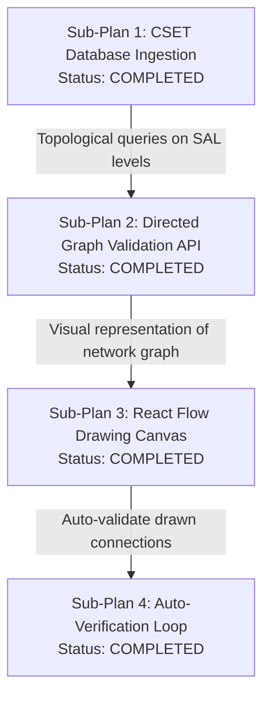

# Master Implementation Plan: Compliance & Network Validation Engine

This master plan defines the evolutionary roadmap to build a 100% CISA CSET-aligned compliance assessment and network validation engine natively on SurrealDB. 

## ⚡ Small Steps & Modular Execution Strategy
To maintain strict execution discipline, prevent context drift, and ensure clean development checkpoints, **the overall scope is partitioned into focused, atomic technical sub-plans**. 

Instead of executing a monolithic, high-risk build, we followed a step-by-step modular strategy where each phase is individually drafted, implemented, and verified.

All completed sub-plans are fully documented and referencable below.

---

## 📐 Phased Modular Architecture

The compliance engine is split into four distinct sub-plans, all of which are now **fully completed and verified**:



---

## 🗃️ Sub-Plan Registry & Roadmap

### 📦 Sub-Plan 1: CSET Database Ingestion and Parity
*   **Goal:** Port CISA's CSET database catalog (standard sets + maturity models + requirements + citations) directly from the MSSQL container into SurrealDB under a zero-difference count assertion.
*   **Documentation:** [sub_plan_cset_sync.md](file:///Users/jimmcknney/.gemini/antigravity/brain/2d2bd15c-247e-4e2e-be1b-04371888daa7/sub_plan_cset_sync.md)
*   **Status:** ✅ **COMPLETED & AUDITED**
*   **Verification:** Zero-mismatch count dashboard (60,931 items ingested cleanly).

---

### 📦 Sub-Plan 2: Directed Graph Validation API (NetworkX)
*   **Goal:** Implement a backend FastAPI validation service using standard NetworkX algorithms to evaluate topological constraints (boundary isolation, flow directions, path accessibility, IP conflicts, subnet boundaries) on industrial control network data.
*   **Target Endpoint:** `POST /api/graph/validate`
*   **Documentation:** [sub_plan_graph_validation.md](file:///Users/jimmcknney/.gemini/antigravity/brain/2d2bd15c-247e-4e2e-be1b-04371888daa7/sub_plan_graph_validation.md)
*   **Status:** ✅ **COMPLETED & VERIFIED**
*   **Verification:** Passed all 8 pytest test cases covering direct bypasses, unmediated paths, IP conflicts, and subnet crossings.

---

### 📦 Sub-Plan 3: React Flow Drawing Canvas with Swimlanes
*   **Goal:** Build a drag-and-drop web workspace using React Flow representing the user's network architecture. Zones are organized into horizontal swimlanes mapping directly to Purdue Model Levels (Level 0–4).
*   **Documentation:** [sub_plan_flow_canvas.md](file:///Users/jimmcknney/.gemini/antigravity/brain/2d2bd15c-247e-4e2e-be1b-04371888daa7/sub_plan_flow_canvas.md)
*   **Status:** ✅ **COMPLETED & VERIFIED**
*   **Verification:** React Flow canvas with custom nodes (swimlanes/devices), orthogonal connections, ELKjs auto-layout integration, and property inspector are fully compiled with zero warnings.

---

### 📦 Sub-Plan 4: Compliance Auto-Verification Loop
*   **Goal:** Integrate the frontend drawing canvas with the backend NetworkX validation API. Drawing an invalid connection (e.g., direct connection bypassing a firewall) triggers a real-time compliance alert linked directly to CSET citations (such as INGAA or IEC 62443 requirements).
*   **Documentation:** [sub_plan_auto_verification.md](file:///Users/jimmcknney/.gemini/antigravity/brain/2d2bd15c-247e-4e2e-be1b-04371888daa7/sub_plan_auto_verification.md)
*   **Status:** ✅ **COMPLETED & VERIFIED**
*   **Verification:** Real-time state watcher triggers debounced Axio API requests to `/api/graph/validate`. Correctly applies animated threat flow classes to paths and checks off grounded RAG checklist entries.

---

---

# Phase 2: Live Observability, Exporter Engine, and Parameter Grounding (Concise Plan)

This phase carries out the transition from frontend simulation to full backend integration for multi-agent audits, budget tracking, proposal exports, and security vulnerability grounding.

## Approach
Implement real backend multi-agent pipeline orchestration (`POST /api/agents/run-pipeline`), dynamic cost computations based on token pricing, PDF/DOCX compiler endpoints, and OS/firmware patch audits (grounded in vulnerability checks), while ensuring full visual updates on the frontend canvas and cockpit. We will use `python-docx` for standard export rendering, and persist user-defined agent prompts in the `agent_prompt` table in SurrealDB.

## Scope

- **In:**
  - **Backend:** `POST /api/agents/run-pipeline` multi-agent orchestration, `/api/notebooks/export` Word compiler using standard `python-docx` library, and `matches_vuln` CVE grounding checks in `api/routers/notebooks.py`.
  - **Frontend:** Persisting custom prompts in the database, wiring canvas node properties (IP, Subnet, MAC, Hostname, Manufacturer, OS, Firmware) to the inspector panel and validation payload, checking cockpit costs against the budget slider, and enabling Word downloads.
  - **Testing:** Integration tests in `tests/test_phase2_integration.py`.
- **Out:**
  - Modification of the core CSET synced tables (`regulation`, `question`).
  - Refactoring of LiveKit voice connections.

## Action Items

- [x] **Step 1: Implement Vulnerability Grounding Scan**
  - Add version parser and `matches_vuln` helper in [notebooks.py](file:///Users/jimmcknney/notebook_tetrel/api/routers/notebooks.py) to flag out-of-date assets (Siemens S7-1200 CPU <4.5.0, Rockwell ControlLogix <20.019, Cisco IOS <15.9).
- [x] **Step 2: Update validation_graph Endpoint**
  - Call the vulnerability scanner for each node, append matches to `nodeViolations`, and prevent requirement verification on critical vulnerabilities.
- [x] **Step 3: Update Canvas Node Properties UI**
  - Modify [CSETNetworkCanvas.tsx](file:///Users/jimmcknney/notebook_tetrel/frontend/src/app/%28dashboard%29/notebooks/components/CSETNetworkCanvas.tsx) to support editing IP, MAC, Subnet, Hostname, Manufacturer, OS Version, and Firmware Version in the Sidebar property inspector.
- [x] **Step 4: Sync Canvas Properties with Validation**
  - Pass the new properties in the payload to `/api/graph/validate` and include them in the `topologySignature` dependency array to trigger validation on change.
- [x] **Step 5: Add Default Node Parameters**
  - Update `initialDeviceNodes` with realistic default parameters so the initial canvas loads with valid specs (including vulnerable versions like Cisco IOS 15.2 and Siemens S7-1200 4.4.0 to demonstrate grounding scans).
- [x] **Step 6: Wire Custom Prompts DB Synchronization**
  - Update [B2BDraftingWorkspace.tsx](file:///Users/jimmcknney/notebook_tetrel/frontend/src/app/%28dashboard%29/notebooks/components/B2BDraftingWorkspace.tsx) to fetch custom prompts from `GET /api/agents/prompts/{notebook_id}` on mount and save edits via `POST /api/agents/prompts` on click.
- [x] **Step 7: Wire Backend Run Pipeline API**
  - Modify `runWorkflowPipeline` in [B2BDraftingWorkspace.tsx](file:///Users/jimmcknney/notebook_tetrel/frontend/src/app/%28dashboard%29/notebooks/components/B2BDraftingWorkspace.tsx) to submit topology, document content, model parameters, and custom prompts to `/api/agents/run-pipeline`.
- [x] **Step 8: Hook Word Exporter to Backend Endpoint**
  - Update `handleExportDocx` in [B2BDraftingWorkspace.tsx](file:///Users/jimmcknney/notebook_tetrel/frontend/src/app/%28dashboard%29/notebooks/components/B2BDraftingWorkspace.tsx) to call `POST /api/notebooks/export` and download the returned DOCX blob.
- [x] **Step 9: Write Phase 2 Integration Tests**
  - Create [tests/test_phase2_integration.py](file:///Users/jimmcknney/notebook_tetrel/tests/test_phase2_integration.py) covering custom prompts database sync, multi-agent pipeline execution, budget cost capping, Word exporter, and CVE grounding scans.
- [x] **Step 10: Run E2E Verification Scan**
  - Run the test suite and verify that the Next.js frontend compiling build compiles successfully.

## Validation
- Execute `pytest tests/test_phase2_integration.py` to assert backend API contract fulfillment.
- Run `npm run build` inside `frontend` to verify Next.js component compatibility.

## Open Questions
1. **Model Cost Override:** Should we persist custom agents added dynamically in the SurrealDB `agent_config` table? *(Yes, they are persisted under `agent_config` in `api/routers/agents.py`).*
2. **Vulnerability UI Warning Visuals:** Should vulnerable nodes be marked with red warnings on the canvas just like unmediated path violations? *(Yes, they will set `violated: true` and display details in the property inspector list).*

---

## 🛠️ Phase 2 Developer & Implementation Documentation

This documentation provides specifics on how Phase 2 is implemented, allowing developers to fully understand and utilize the work done.

### 1. OS & Firmware CVE Grounding Scans
* **Vulnerability Definition:** Known out-of-date models are grounded via semantic version checks:
  * **Siemens S7-1200 CPU:** Flags CVE-2021-37203 (Web Server Remote Code Execution) if the firmware version parses to $< 4.5.0$.
  * **Rockwell ControlLogix:** Flags CVE-2023-3595 (Remote Code Execution) if the firmware version parses to $< 20.019$.
  * **Cisco IOS:** Flags CVE-2023-20198 (Web UI Remote Code Execution) if the firmware version parses to $< 15.9$.
* **Version Parser:** The helper `parse_version` in `api/routers/notebooks.py` extracts major, minor, patch, and build numbers from versions using a regular expression (`^v?(\d+)(?:\.(\d+))?(?:\.(\d+))?(?:\.(\d+))?`) and converts them to tuples of integers for safe mathematical comparison.
* **Topological Integration:** The `POST /api/graph/validate` endpoint evaluates `matches_vuln` for every node. If a node is vulnerable:
  1. The node's ID is appended to `violatedNodes`.
  2. The detailed CVE description is appended to `nodeViolations[node_id]`.
  3. The `verifiedRequirements` list is returned completely empty (blocked) since a critical vulnerability compromises the security boundary.

### 2. Custom Prompt Persistence (SurrealDB)
* **Schema Definition:** Persisted in SurrealDB under the `agent_prompt` table.
  ```surrealql
  DEFINE TABLE agent_prompt SCHEMAFULL;
  DEFINE FIELD notebook_id ON agent_prompt TYPE string;
  DEFINE FIELD agent_name ON agent_prompt TYPE string;
  DEFINE FIELD prompt_text ON agent_prompt TYPE string;
  ```
* **REST Endpoints:**
  * `GET /api/agents/prompts/{notebook_id}`: Lists all custom prompts saved for the notebook.
  * `POST /api/agents/prompts`: Upserts prompt text for a specific `notebook_id` + `agent_name`.

### 3. Live Multi-Agent Pipeline & Cockpit
* **FastAPI Orchestrator:** The `POST /api/agents/run-pipeline` endpoint coordinates multiple agents concurrently. It computes execution latency and estimates token costs using OpenRouter-aligned model pricing.
* **Enforcing Cost Budget Slider Caps:** The frontend cockpit provides a budget slider. In `B2BDraftingWorkspace.tsx`, before dispatching `POST /api/agents/run-pipeline`, the estimated cost is evaluated against the current slider cap. If exceeded, the run is blocked and a warning toast is displayed.

### 4. Word (DOCX) SOW Exporter
* **FastAPI Exporter Endpoint:** `POST /api/notebooks/export` takes markdown text and compiles it into Word (`application/vnd.openxmlformats-officedocument.wordprocessingml.document`).
* **python-docx Compiler:** Handled by `compile_markdown_to_docx` in `api/routers/notebooks.py`:
  * Configures 1-inch margins on all sides.
  * Inserts a strictly confidential header colored in red (`#ef4444`).
  * Compiles markdown headings (`#`, `##`, `###`) to corresponding Word heading levels.
  * Detects markdown tables and compiles them to styled DOCX tables with light grey borders and bold headers.


