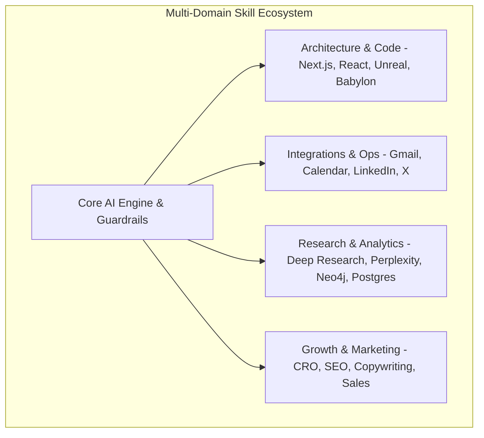

# Enterprise Codebase Nexus — PRD, AI Guardrails & Master Skill Strategy

> **Project Name:** Enterprise Codebase Nexus & Autonomous AI Swarm  
> **Version:** 2.0.0 (Multi-Agent & Superpowers Expanded)  
> **Status:** Strategic Blueprint  
> **Author:** Multi-Agent Systems & Architecture Team  

---

## 1. Executive Summary & Problem Statement

Modern software engineering and product operations require unified AI assistance across software development, marketing, sales automation, operational workflows, and 3D web experiences.

### Core Challenges Solved:
1. **AI Behavioral Drift & Fragile Code:** AI assistants without guardrails invent unnecessary abstractions, break test suites, or create incomplete TODO stubs.
2. **Authentication & OAuth Friction:** Headless web scraping and app integrations fail due to complex OAuth flows, bot protection, and token expiration.
3. **Outdated API/Documentation Context:** AI models rely on static training weights, missing breaking API changes in modern web stacks (Next.js App Router, React 19, Tailwind v4).
4. **Cross-Domain Isolation:** Engineering, marketing, research, and social media automation run in silos without shared data or persistent context.

### The Solution: Autonomous Nexus & Multi-Domain Skill Engine
The Enterprise Codebase Nexus combines:
- **Karpathy AI Behavioral Guardrails (P1–P8)** to enforce strict software engineering rigor.
- **Context7 Real-Time API Indexing** for live reference to the latest library and framework documentation.
- **OAuth-Bypass MCP Gateway & Chrome Automation** for reliable app integrations (Gmail, Google Calendar, LinkedIn, X/Twitter).
- **Multi-Domain Skill Swarm** covering Web (Next.js, React, Tailwind, shadcn/ui), 3D (Babylon.js, Unreal Engine), Marketing, Sales, Research, and Operations.

---

## 2. Karpathy AI Behavioral Guardrails (P1–P8)

All AI agents interacting with the repository must satisfy these mandatory principles:

| Rule | Principle | Enforcement Mechanism |
| :--- | :--- | :--- |
| **P1** | **Simple Code**: No over-engineering. No premature abstractions. | Code review & AST complexity checks |
| **P2** | **Skills-First Execution**: Check installed skills/MCPs before writing custom code. | Pre-implementation skill gate |
| **P3** | **Test-Driven Development**: No production code without a failing test first. | Automated `.venv/bin/pytest` gate |
| **P4** | **Zero Faking**: Zero stubs, dummy fallbacks, or committed `TODO`/`FIXME` items. | Pre-commit static CI analysis |
| **P5** | **Full Observability**: All configuration parameters adjustable in UI/admin runtime. | Centralized configuration engine |
| **P6** | **Full Traceability**: Every state mutation audit-logged and document versioned. | SurrealDB / SQLite audit logs |
| **P7** | **No Architectural Drift**: Update documentation atomically with code changes. | Git pre-commit hooks |
| **P8** | **Docker Portability**: `docker compose up -d` is the single source of truth for stack startup. | CI container test suite |

---

## 3. Context7 Live Documentation Strategy

To prevent obsolete API hallucinations, the system incorporates **Context7**:
- **Automatic Live Documentation Search:** Intercepts technical queries for frameworks (Next.js 16, React 19, Tailwind CSS v4, Babylon.js, Unreal Engine) and fetches current schema and API definitions.
- **Live Memory Bridge:** Caches up-to-date documentation structures into `.claude-flow/data/ranked-context.json`.

---

## 4. Multi-Domain Skill Matrix

### Domain Breakdown:
1. **Software & Web Development:**
   - **Templates & Stacks:** Next.js 16 (App Router), React 19, Tailwind CSS v4, shadcn/ui.
   - **3D & Game Engines:** Babylon.js (Web 3D/WebGPU), Unreal Engine 5 (C++ & Blueprints).
   - **Databases:** PostgreSQL (pgvector + hybrid search), Neo4j (Cypher graph traversals).
2. **Integrations & OAuth Bypass MCPs:**
   - **Social & Communications:** Gmail Automation, Google Calendar, LinkedIn API/Carousel, X (Twitter) Publisher.
   - **Browser Automation:** Chrome DevTools MCP (Headless & Full GUI Browser Control).
3. **Research, Analytics & Autonomous Thinking:**
   - **Deep Research & Perplexity:** Autonomous research workflows, academic literature synthesis, and Perplexity Ask integration.
   - **Sequential Thinking:** Step-by-step analytical reasoning and self-improvement loops.
4. **Growth & Operations:**
   - **Marketing & Copywriting:** CRO (Conversion Rate Optimization), SEO/Programmatic SEO, Brand Voice.
   - **Sales & CRM:** Pipeline automation, outreach sequences, customer psychographic profiling.

---

## 5. Citations & References

1. **Model Context Protocol (MCP) Specification:**  
   *Anthropic & Linux Foundation.* [https://modelcontextprotocol.io/](https://modelcontextprotocol.io/)
2. **Context7 Live Documentation Engine:**  
   *Real-time Library API Search & Caching Engine.*
3. **Graphify & RuFlo (Claude-Flow V3) Architecture:**  
   *rUvnet Open Source Swarm Framework.* [https://github.com/ruvnet/ruflo](https://github.com/ruvnet/ruflo)
4. **Karpathy Software Engineering Rules:**  
   *Andrej Karpathy First-Principles Software Development.*
