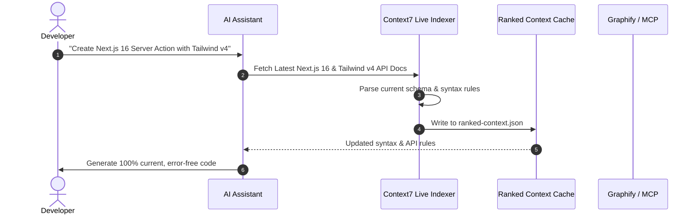

# Enterprise Codebase Nexus — System Architecture & Multi-Agent Swarm

> **Document Version:** 2.0.0 (Superpowers & Swarm Expanded)  
> **Target System:** Enterprise Hybrid Server & Distributed MCP Swarm Architecture  

---

## 1. Multi-Agent Swarm Topology & System Flow

The Enterprise Codebase Nexus employs a **hierarchical-mesh swarm topology** connecting developer IDEs, local background workers, multi-database stores, and app integration gateways.

```mermaid
flowchart TD
    subgraph Client & Developer Layer
        IDE1["Claude Code CLI"]
        IDE2["Antigravity / Gemini IDE"]
        IDE3["Cursor / VS Code"]
    end

    subgraph Central Enterprise Gateway & Intelligence
        Gateway["GitNexus HTTP MCP Gateway\n(Port 4747)"]
        Context7["Context7 Live API Indexer\n(Real-Time Doc Fetching)"]
        SeqThinking["Sequential Thinking Engine\n(Autonomous Reasoner)"]
    end

    subgraph Data & Storage Architecture
        GlobalGraph["Graphify Central Global Graph\n(~/.graphify/global-graph.json)"]
        PostgresDB["PostgreSQL 17 + pgvector\n(Hybrid RRF Search)"]
        Neo4jDB["Neo4j 2026 Graph DB\n(APOC & Cypher Traversals)"]
        RuFloMem["RuFlo SQLite Memory Store\n(HNSW Vector Index)"]
    end

    subgraph App & Integration Gateways (OAuth Bypass)
        ChromeMCP["Chrome DevTools MCP\n(Headless & Full GUI Browser)"]
        SocialMCP["Social & Comms Gateway\n(Gmail, Calendar, LinkedIn, X)"]
        Web3DMCP["Web & 3D Engine Gateways\n(Next.js, React, Babylon, Unreal)"]
    end

    IDE1 & IDE2 & IDE3 -->|MCP JSON-RPC| Gateway
    Gateway <--> Context7 & SeqThinking
    Gateway <--> GlobalGraph & PostgresDB & Neo4jDB & RuFloMem
    Gateway <--> ChromeMCP & SocialMCP & Web3DMCP
```

---

## 2. OAuth-Bypass MCP Architecture

To bypass complex OAuth expiration, redirect blocks, and bot-detection issues during app automation:

1. **Persistent Session State Sharing:**
   - Chrome DevTools MCP connects directly to a running Chrome instance via `--browserUrl=http://localhost:9222` or persistent user profile directories (`~/.config/google-chrome/`).
   - Authenticated sessions (Gmail, Google Calendar, LinkedIn, X/Twitter) maintain active session cookies and local storage tokens without triggering multi-factor re-authentication.

2. **Standalone Token Refresh Workers:**
   - Background crons handle offline OAuth refresh token rotation silently (`gmail-automation`, `x-article-publisher-skill`).

---

## 3. Database Architecture (PostgreSQL + Neo4j + HNSW Vector)

The system unifies three complementary database backends:

```
┌─────────────────────────────────────────────────────────────────────────┐
│                      HYBRID DATA ENGINE LAYER                           │
├──────────────────────────┬──────────────────────┬───────────────────────┤
│    PostgreSQL (pg17)     │     Neo4j Graph      │   SurrealDB / HNSW    │
│  (pgvector + Hybrid RRF) │  (Cypher & APOC Walk)│   (Vector & Memory)   │
├──────────────────────────┼──────────────────────┼───────────────────────┤
│ • Research Memory        │ • Knowledge Topology │ • Audit Trail Logs    │
│ • Semantic Embeddings    │ • Entity Relations   │ • Session Memory      │
│ • Document Chunking      │ • Dependency Paths   │ • PageRank Scoring    │
└──────────────────────────┴──────────────────────┴───────────────────────┘
```

---

## 4. Context7 Live API Indexing Pipeline



---

## 5. Web & 3D Rendering Architecture (Next.js + React + Babylon + Unreal)

1. **Web App Core:** Next.js 16 (App Router) + React 19 + Tailwind CSS v4 + shadcn/ui.
2. **Web 3D Interactive Layer:** Babylon.js WebGPU canvas rendering for interactive 3D visualizations, product configurators, and node network rendering.
3. **Unreal Engine 5 Bridge:** Integration with Unreal Engine C++ & Blueprint automation via Docker MCP Gateway (`manage_level`, `control_actor`, `manage_material_authoring`).
