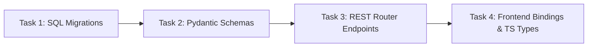

# Sub-Plan: Layer 1 Autonomous Agent Framework (Database & Backend Setup)

To progress from our current milestone towards the revised product vision, we must establish **Layer 1: Autonomous Agent Framework**. This is the core engine required by all subsequent phases (CSET port, research pipelines, publication kanban). We strictly adhere to **Karpathy Rules** (maximum simplicity, no stub code, zero mock values, absolute production-ready logic) and enforce strict type/compiler validation at all times.

---

## Proposed Tasks (3-4 Steps in Sequence)

### 1. Task 1: SurrealDB Schema Migrations (`27.surrealql` & `27_down.surrealql`)
* **Goal:** Establish formal schema-validated database tables for agent registry tracking, execution histories, and step-by-step logs.
* **File Locations:**
  * `[NEW]` [27.surrealql](file:///Users/jimmcknney/notebook_tetrel/open_notebook/database/migrations/27.surrealql)
  * `[NEW]` [27_down.surrealql](file:///Users/jimmcknney/notebook_tetrel/open_notebook/database/migrations/27_down.surrealql)
* **Details:**
  * Register `agent_config` schema with type validations inside `["researcher", "coder", "analyst", "orchestrator"]`.
  * Register `agent_execution` schema with validation states inside `["queued", "running", "completed", "failed", "paused"]`.
  * Register `agent_log` schema with logging traces inside `["info", "debug", "error"]`.

### 2. Task 2: Backend Validation & Schema Mapping (`agent_schemas.py`)
* **Goal:** Create type-safe serialization/deserialization schemas to validate incoming client requests and format server responses.
* **File Locations:**
  * `[NEW]` [agent_schemas.py](file:///Users/jimmcknney/notebook_tetrel/open_notebook/ai/agent_schemas.py)
* **Details:**
  * Define `AgentConfigCreate`, `AgentConfigUpdate`, and `AgentConfigResponse`.
  * Define `AgentExecutionResponse` and `AgentLogResponse`.
  * Leverage Pydantic v2 validator hooks to enforce strict schema assertions.

### 3. Task 3: REST Router Endpoints & Registration (`routers/agents.py`)
* **Goal:** Expose the RESTful interface representing all config-management and observability operations of Layer 1.
* **File Locations:**
  * `[NEW]` [agents.py](file:///Users/jimmcknney/notebook_tetrel/api/routers/agents.py)
  * `[MODIFY]` [main.py](file:///Users/jimmcknney/notebook_tetrel/open_notebook/main.py)
* **Details:**
  * Implement CRUD endpoints for `agent_config`: `POST /api/agents`, `GET /api/agents`, `GET /api/agents/{id}`, `PUT /api/agents/{id}`.
  * Implement execution status checks: `GET /api/agents/{id}/executions`, `GET /api/agents/executions/{execution_id}/logs`.
  * Register the new agents router inside the main FastAPI application stack.

### 4. Task 4: Frontend TypeScript Declarations & Service Connectors
* **Goal:** Create unified TypeScript interface bindings and API connectors on the frontend.
* **File Locations:**
  * `[NEW]` [agents.ts](file:///Users/jimmcknney/notebook_tetrel/frontend/src/lib/types/agents.ts)
  * `[NEW]` [agents.ts](file:///Users/jimmcknney/notebook_tetrel/frontend/src/lib/api/agents.ts)
* **Details:**
  * Map identical Pydantic structures to client TypeScript interfaces.
  * Formulate client query hooks (`useAgents`, `useAgentExecutions`) using standard TanStack Query and Zustand architecture.

---

## Verification & Tracking Plan

### Automated Verification:
* **Database Ingestion Check:** Launch backend startup to confirm SurrealDB automatically applies `27.surrealql` on boot without schema definition collisions.
* **Python Syntax validation:** Confirm zero parse/compilation errors inside all Python files.
* **TypeScript Compilation:** Run `npx tsc --noEmit` inside `/frontend` to verify complete type safety.
* **Locales check:** Run locales vitest suite to ensure zero unused translation paths.

### Document Tracking:
* This plan will be marked off in [taskmaster.md](file:///Users/jimmcknney/notebook_tetrel/docs/taskmaster.md) and summarized in [walkthrough.md](file:///Users/jimmcknney/notebook_tetrel/docs/walkthrough.md) with corresponding logs.
