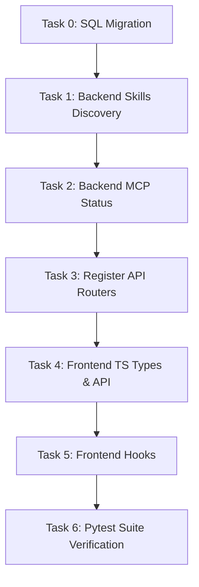

# Sub-Plan: Layer 2 Skills & MCP Registry (Database & Backend Setup)

Following the completion of **Layer 1: Autonomous Agent Framework**, we must establish **Layer 2: Skills & MCP Registry & Admin**. This provides the discovery and status validation engine required by all subsequent phases (CSET port, research pipelines, publication kanban) to utilize skills-first automated tasks. We strictly adhere to **Karpathy Rules** (maximum simplicity, no stub code, zero mock values, absolute production-ready logic) and enforce strict type/compiler validation.

---

## Proposed Tasks (6 Steps in Sequence)

### 0. Task 0: SurrealDB Schema Migrations (`28.surrealql` & `28_down.surrealql`)
* **Goal:** Establish a schema-validated table for storing skills, their active states, custom categories, and editable configurations.
* **File Locations:**
  * `[NEW]` [28.surrealql](file:///Users/jimmcknney/notebook_tetrel/open_notebook/database/migrations/28.surrealql)
  * `[NEW]` [28_down.surrealql](file:///Users/jimmcknney/notebook_tetrel/open_notebook/database/migrations/28_down.surrealql)
* **Details:**
  * Define `skill_registry` table schema.
  * Implement `config_vars` as an open `object` field in SurrealDB to support dynamic key-value storage.
  * Append migration `28` to `AsyncMigrationManager` inside `async_migrate.py`.

### 1. Task 1: Backend Skills Discovery & CRUD (`api/routers/skills.py` & `open_notebook/domain/skill.py`)
* **Goal:** Create the domain model and router handling skills catalog synchronization and edits.
* **Details:**
  * Domain model `SkillRegistry` mapping the SurrealDB table.
  * Scan `/Users/jimmcknney/.gemini/config/skills/` directories dynamically to sync new files with the database.
  * Expose REST CRUD endpoints: `GET /api/skills`, `POST /api/skills`, `PUT /api/skills/{id}`, `DELETE /api/skills/{id}`.

### 2. Task 2: Backend MCP Status Discovery (`api/routers/mcp.py`)
* **Goal:** Create a FastAPI router to check the status, configuration, and tools of configured MCP servers.
* **Details:**
  * Read from current MCP configuration file and query tools per server.
  * Expose REST endpoints: `GET /api/mcp` (returns list of active MCP servers, tools, connection health, and configurations).

### 3. Task 3: API Router Registration (`api/main.py`)
* **Goal:** Import and register the new skills and MCP status routers inside the main FastAPI application stack.
* **Details:**
  * Include `/api/skills` and `/api/mcp` routes in `api/main.py`.
  * Validate Python syntax parsing via `ast.parse` and `py_compile`.

### 4. Task 4: Frontend TypeScript Declarations & Service Connectors
* **Goal:** Map the backend response models for skills and MCP servers to client-side TypeScript interfaces and API services.
* **File Locations:**
  * `[NEW]` [skills.ts](file:///Users/jimmcknney/notebook_tetrel/frontend/src/lib/types/skills.ts)
  * `[NEW]` [skills.ts](file:///Users/jimmcknney/notebook_tetrel/frontend/src/lib/api/skills.ts)
* **Details:**
  * Formulate type interfaces mapping all backend skill/mcp structures.
  * Create `skillsApi` Axios service supporting `list()`, `update()`, `delete()`, and `listMcp()`.

### 5. Task 5: Frontend TanStack Query Hooks (`frontend/src/lib/hooks/use-skills.ts`)
* **Goal:** Implement React query hooks to bind frontend admin pages to the new APIs.
* **File Locations:**
  * `[NEW]` [use-skills.ts](file:///Users/jimmcknney/notebook_tetrel/frontend/src/lib/hooks/use-skills.ts)
* **Details:**
  * Create `useSkills()`, `useMcpServers()`, and `useToggleSkill()` query/mutation hooks.
  * Add automatic query cache invalidations and error toast notifications.

### 6. Task 6: Pytest Integration Test Suite (`tests/test_skills_api.py`)
* **Goal:** Verify backend correctness, schema constraints, and database updates using automated python tests.
* **File Locations:**
  * `[NEW]` [test_skills_api.py](file:///Users/jimmcknney/notebook_tetrel/tests/test_skills_api.py)
* **Details:**
  * Write tests for skills synchronization, CRUD settings edits, enable/disable toggles, and dynamic configuration updates.

---

## Verification & Tracking Plan

### Automated Verification:
* **Pytest Verification:** Execute `pytest tests/test_skills_api.py` and confirm 100% test success.
* **Python Syntax validation:** Confirm zero parse/compilation errors inside all Python files.
* **TypeScript Compilation:** Run `npx tsc --noEmit` inside `/frontend` to verify complete type safety.
* **Locales check:** Run locales vitest suite to ensure zero unused translation paths.

### Document Tracking:
* This plan will be tracked in [taskmaster.md](file:///Users/jimmcknney/notebook_tetrel/docs/taskmaster.md) and summarized in [walkthrough.md](file:///Users/jimmcknney/notebook_tetrel/docs/walkthrough.md) with corresponding logs.
