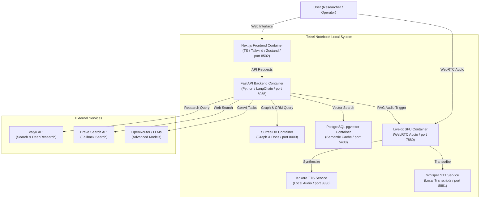

# System Architecture & Full Stack Specification

*Last Updated: June 8, 2026*

---

## 1. System Context Diagram (C4 Model)

The following diagram illustrates how the components of the self-hosted Tetrel Notebook system interact with the user and external data search services.



---

## 2. Containerized Services & Network Port Mapping

The entire stack is configured via [docker-compose.yml](file:///Users/jimmcknney/notebook_tetrel/docker-compose.yml) and runs isolated on a custom bridge network:

1.  **`open_notebook` (Port 8502 / 5055):** Contains the Next.js frontend compiled as static pages serving the UI, and the FastAPI backend compiled with Python 3.11/3.12. Both services run in a single container orchestrated by **supervisord**.
2.  **`surrealdb` (Port 8000):** Runs SurrealDB v2. Handles all relational, document, and graph-like transactional tables (CRM, notes, customer ledgers). Stored on a persistent local volume `surreal_data`.
3.  **`postgres` (Port 5433):** Runs PostgreSQL 17 with the `pgvector` extension. Hosts the `research_corpus` schema, HNSW indexes, and full-text GIN tables. Host port mapped to `5433` to prevent conflicts with standard host PostgreSQL installations.
4.  **`livekit-server` (Port 7880 / 50005 UDP):** High-performance Selective Forwarding Unit (SFU) handling real-time WebRTC audio streams for the Voice Playground.
5.  **`kokoro-tts` (Port 8880):** High-quality, fast local text-to-speech engine running inside the Docker network.
6.  **`whisper-stt` (Port 8881):** Faster Whisper speech-to-text transcription worker running locally.

---

## 3. Subprocess Environment Isolation & Fallbacks

A critical challenge in containerized deployments is the preservation of environment variables across child processes. When supervisord starts background workers (e.g. LiveKit voice proxy, Valyu research pollers), it strips host environment variables by default.

To guarantee zero-drift connection stability:
*   **LiveKit URL Fallback:** If `LIVEKIT_URL` is stripped by supervisord, the voice gateway defaults to:
    ```
    ws://livekit-server:7880
    ```
    instead of failing.
*   **LiveKit Keys Fallback:** If API key and secret variables are missing, the proxy service falls back to the configured credentials in SurrealDB under the `credential:livekit` record, ensuring WebRTC tokens are minted successfully.

---

## 4. Full Stack Technology Selection

| Layer | Technology | Version | Purpose & Rationale |
| :--- | :--- | :--- | :--- |
| **Core UI** | Next.js | 16 (App Router) | Multi-lingual dashboard interfaces (English, Dutch, etc.). |
| **Styling** | Vanilla CSS / Tailwind | v4 | Responsive, pixel-perfect glassmorphism panels. |
| **State** | Zustand | v4 | Light, type-safe client-side state manager. |
| **Draggables** | `@hello-pangea/dnd` | latest | Fluid card reordering in CRM Kanban pipelines. |
| **Backend** | FastAPI | latest | Highly async, python-native routing with automatic Swagger documentation. |
| **Orchestration** | supervisord | latest | Multi-service supervisor coordinating backend/frontend processes inside the app container. |
| **Log Management** | Loguru | latest | Asynchronous, thread-safe logging writing directly to SurrealDB. |
| **AI Integration** | LangChain | latest | Multi-provider prompt construction and pipeline automation. |
