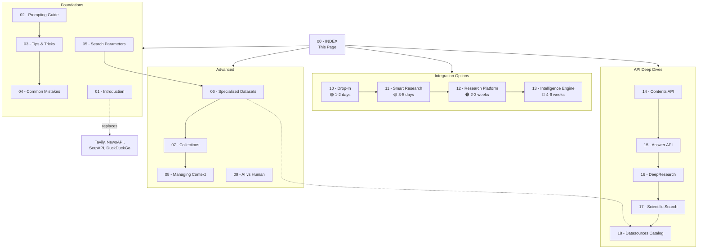

# Valyu Cookbook — Master Index

> **Version**: 1.1.0 | **Last Updated**: 2026-06-07 | **Status**: Reference Documentation
>
> This cookbook is the single source of truth for how Open Notebook (Tetrel Security) uses the Valyu Search API. Every search, research, and data-gathering operation in the application should follow these patterns.

---

## Table of Contents

### Foundations
| # | Page | Purpose |
|---|------|---------|
| 01 | [Introduction & API Overview](./01-INTRODUCTION.md) | What Valyu is, what it replaces, API surface area |
| 02 | [Prompting Guide](./02-PROMPTING-GUIDE.md) | How to write queries that get the best results |
| 03 | [Tips & Tricks](./03-TIPS-AND-TRICKS.md) | Multi-step workflows, AI vs Human, budget tiers, context management |
| 04 | [Common Mistakes to Avoid](./04-COMMON-MISTAKES.md) | Anti-patterns that waste tokens, cost money, or return garbage |
| 05 | [Search Parameters Reference](./05-SEARCH-PARAMETERS.md) | Every parameter, every option, with code snippets |

### Advanced
| # | Page | Purpose |
|---|------|---------|
| 06 | [Specialized Datasets](./06-SPECIALIZED-DATASETS.md) | Academic, financial, medical, patent — targeting specific sources |
| 07 | [Collections](./07-COLLECTIONS.md) | Reusable source bundles for repeatable searches |
| 08 | [Managing Context](./08-MANAGING-CONTEXT.md) | Token budgets, result lengths, LLM context window optimization |
| 09 | [AI vs Human Searches](./09-AI-VS-HUMAN-SEARCHES.md) | `tool_call_mode`, when to use each, output differences |

### API Deep Dives
| # | Page | Purpose |
|---|------|---------|
| 14 | [Contents API](./14-CONTENTS-API.md) | URL content extraction, batch processing, structured JSON, screenshots |
| 15 | [Answer API](./15-ANSWER-API.md) | AI-synthesized answers with citations, streaming, structured output |
| 16 | [DeepResearch API](./16-DEEPRESEARCH-API.md) | Async multi-step research, HITL, batch processing, file attachments |
| 17 | [Scientific Search](./17-SCIENTIFIC-SEARCH.md) | Domain-specific source routing (PubMed, arXiv, ChEMBL, etc.) |
| 18 | [Datasources Catalog](./18-DATASOURCES-CATALOG.md) | Complete reference of 36+ data sources with IDs and categories |

### Integration Options (Roadmap)
| # | Page | Scope | Effort |
|---|------|-------|--------|
| 10 | [Option 1: Drop-In Replacement](./10-OPTION-1-DROP-IN.md) | Replace 4 redundant APIs | 1-2 days |
| 11 | [Option 2: Smart Research](./11-OPTION-2-SMART-RESEARCH.md) | Context-aware routing + Contents API | 3-5 days |
| 12 | [Option 3: Research Platform](./12-OPTION-3-RESEARCH-PLATFORM.md) | Valyu DeepResearch + Postgres/pgvector | 2-3 weeks |
| 13 | [Option 4: Intelligence Engine](./13-OPTION-4-INTELLIGENCE-ENGINE.md) | Autonomous missions + self-improving | 4-6 weeks |

---

## Map of Contents (MOC)

---

## Quick Reference

### Valyu API Endpoints

| Endpoint | Method | What It Does |
|----------|--------|-------------|
| `/v1/search` | POST | Search across web + 36+ proprietary sources |
| `/v1/answer` | POST | AI-generated answers with inline citations |
| `/v1/contents` | POST | Extract clean markdown from URLs |
| `/v1/deepresearch` | POST | Async multi-step research tasks |

### SDKs

| Language | Package | Install |
|----------|---------|---------|
| Python | `valyu` | `pip install valyu` |
| TypeScript | `valyu-js` | `npm install valyu-js` |
| Rust | `valyu` | `cargo add valyu` |

### Key Links

- [Valyu Documentation](https://docs.valyu.ai)
- [Full Docs Index (llms.txt)](https://docs.valyu.ai/llms.txt)
- [API Reference (OpenAPI)](https://docs.valyu.ai/api-reference/openapi.json)
- [Cookbook & Examples (GitHub)](https://github.com/valyuAI/cookbook)
- [Data Sources Browser](https://platform.valyu.ai/data-sources)
- [Collections Manager (Beta)](https://platform.valyu.ai/user/collections)
- [LangChain Integration](https://docs.valyu.ai/integrations/langchain.md)
- [MCP Server](https://docs.valyu.ai/integrations/mcp-server.md)

---

> **Next**: Start with [01 - Introduction](./01-INTRODUCTION.md) for the full API overview, or jump to [04 - Common Mistakes](./04-COMMON-MISTAKES.md) if you're already building.
