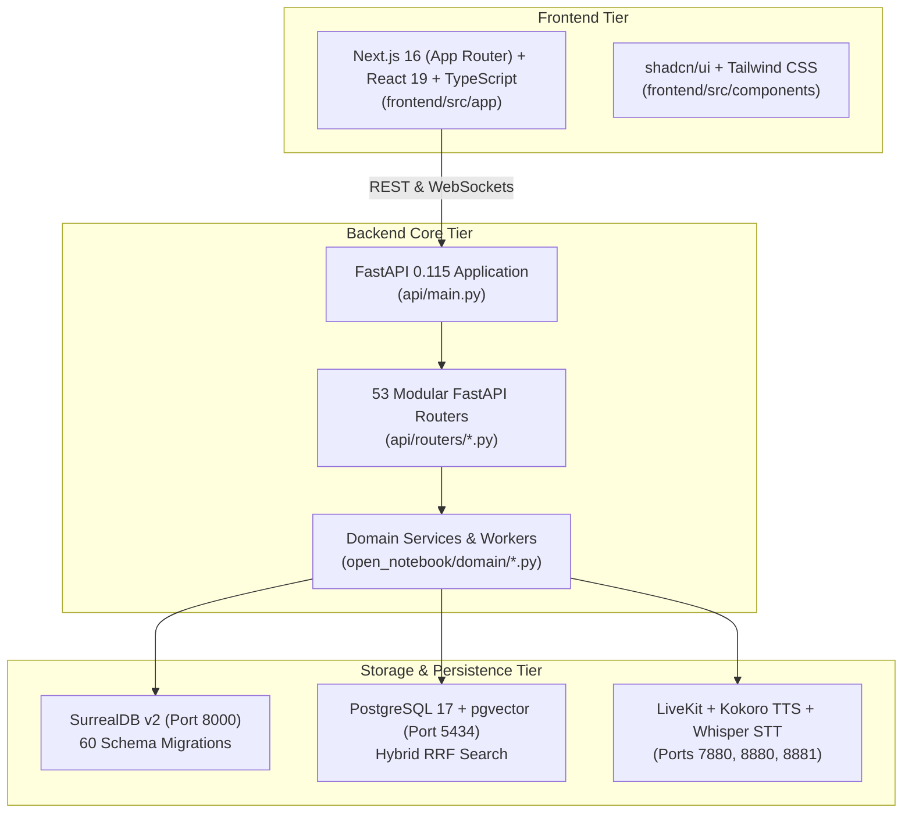

# Open Notebook / Enterprise Nexus — Architecture & System Overview Wiki

> **Repository Root:** `/Users/jimmcknney/notebook_tetrel`  
> **Target Audience:** Developers, System Architects, Security Engineers  
> **Last Updated:** 2026-08-10  

---

## 1. System Architecture Overview

Open Notebook (`notebook_tetrel`) is an enterprise-grade AI Research, Knowledge Management, CRM, and Voice Intelligence platform.

The system is constructed with a decoupled 3-tier architecture:

---

## 2. Shared Component Directory Map

| Path | Primary Function | Primary Languages |
| :--- | :--- | :--- |
| `api/routers/` | 53 modular FastAPI endpoint definition routers | Python 3.12 |
| `open_notebook/domain/` | Core business logic, domain entities & worker engines | Python 3.12 |
| `open_notebook/database/` | SurrealDB connection pooling & 60 schema migration scripts | Python / SurrealQL |
| `open_notebook/search/` | PostgreSQL pgvector Reciprocal Rank Fusion (RRF) search engine | Python / SQL |
| `open_notebook/podcasts/` | Speech synthesis, Whisper verification & audio mastering | Python / FFmpeg |
| `frontend/src/app/` | Next.js 16 App Router dashboard pages | TypeScript / React 19 |
| `frontend/src/components/` | shadcn/ui visual layout components | TSX / Tailwind CSS |
| `tests/` | Comprehensive Pytest integration & unit test suite | Python 3.12 |
| `docs/plans/karpathy_master_plan/` | Canonical enterprise development roadmap & directives | Markdown |

---

## 3. Mandatory Coding Principles (Karpathy P1–P8)

1. **Simple, Readable Code**: No over-engineering or premature abstractions.
2. **Skills First**: Reuse existing routers (`api/routers/`) and repositories before creating new ones.
3. **Test-Driven Development**: Always run `.venv/bin/pytest tests/` before committing.
4. **Zero Faking**: Zero stubs, dummy fallbacks, or committed TODOs.
5. **No Architectural Drift**: All design updates must be saved directly to `docs/plans/karpathy_master_plan/`.
