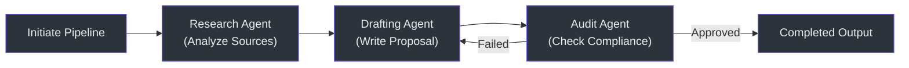

# Multi-Agent System & Skills Registry

This document details the agent orchestration layers, covering stateful chat machines, prompt templates, execution tracking, and dynamic skills.

---

## 🧭 Subsystem Architecture

The platform governs agent states using LangGraph, persisting conversation state threads across reboots.

```mermaid
graph TD
    classDef nodeStyle fill:#2d333b,stroke:#6d5dfc,color:#e6edf3;
    classDef graphStyle fill:#161b22,stroke:#6d5dfc,stroke-width:1px;

    Client["Client Browser API"]:::nodeStyle
    API["FastAPI Handler (api/routers/agents.py)"]:::nodeStyle
    
    subgraph LangGraphState ["LangGraph State Engine"]
        StartNode["START Node"]:::graphStyle
        AgentNode["Model Gating Node (call_model_with_messages)"]:::graphStyle
        EndNode["END Node"]:::graphStyle
        Checkpointer["SqliteSaver (Checkpoints DB)"]:::nodeStyle
        
        StartNode --> AgentNode
        AgentNode --> EndNode
        AgentNode -.->|Checkpoint State| Checkpointer
    end
    style LangGraphState fill:#161b22,stroke:#30363d;

    Client -->|POST /api/chat/execute| API
    API --> LangGraphState
```



---

## 🔄 Stateful Conversational Agent (LangGraph)

The chat process is defined using a stateful flow mapping messages, context boundaries, and overrides.

### Thread State Schema `(open_notebook/graphs/chat.py:22)`
The state is managed in memory as a `ThreadState` typed dictionary:
```python
class ThreadState(TypedDict):
    messages: Annotated[list, add_messages]
    notebook: Optional[Notebook]
    context: Optional[str]
    context_config: Optional[dict]
    model_override: Optional[str]
```

### Checkpoint Persistence `(open_notebook/graphs/chat.py:88)`
To persist conversation state, a `SqliteSaver` checkpointer stores message buffers:
```python
conn = sqlite3.connect(LANGGRAPH_CHECKPOINT_FILE, check_same_thread=False)
memory = SqliteSaver(conn)
graph = agent_state.compile(checkpointer=memory)
```

---

## 👥 Multi-Agent B2B Drafting Pipeline `(api/routers/agents.py:282)`

The B2B pipeline implements a multi-agent routing loop to generate proposals, contract criteria, and business assessments:



1. **Research Agent:** Extracts text metadata from linked sources.
2. **Drafting Agent:** Constructs structured B2B proposal documents using transformation templates.
3. **Audit Agent:** Audits the draft against assigned CISA guidelines, returning suggestions.

---

## 🎛️ Subsystem Components

### 1. Backend Route Handlers
* **[agents.py](file:///Users/jimmcknney/notebook_tetrel/api/routers/agents.py):** Handles agent profile listing `(api/routers/agents.py:72)`, prompts management `(api/routers/agents.py:245)`, and pipeline runs.
* **[skills.py](file:///Users/jimmcknney/notebook_tetrel/api/routers/skills.py):** Manages CRUD for the custom agent skills registry `(api/routers/skills.py:134)`.

### 2. Prompt Library & Templates
Prompts are managed using the `ai-prompter` library. Standard prompts (like `chat/system`) are rendered dynamically based on the current `ThreadState` `(open_notebook/graphs/chat.py:32)`.

---

## 📋 API Endpoints Summary

| Method | Endpoint Path | Source Location | Purpose |
| :--- | :--- | :--- | :--- |
| `POST` | `/api/agents/run-pipeline` | `(api/routers/agents.py:282)` | Executes the multi-agent B2B proposal draft pipeline |
| `POST` | `/api/agents/draft/copilot` | `(api/routers/agents.py:457)` | Queries the drafting copilot for recommendations |
| `GET` | `/api/skills` | `(api/routers/skills.py:134)` | Lists all registered agent skills |
| `POST` | `/api/skills` | `(api/routers/skills.py:149)` | Registers a new custom skill schema |
