# System Architecture, Stack & Specifications

This document covers the **System Architecture, Technology Stack, Hardware Specifications, Site Maps, and Administration Controls** of the Tetrel Security (Open Notebook) platform.

---

## 🗺️ Architectural Map of Content (MOC)

* **[Technology Stack Breakdown](#-technology-stack-breakdown):** Core frameworks, databases, and AI providers.
* **[Hardware & System Specifications](#-hardware--system-specifications):** Minimum and recommended CPU/GPU resource allocations.
* **[Docker Builder & Runtime Pipeline](#-docker-builder--runtime-pipeline):** Block diagrams of the multi-stage compilation flow.
* **[Website Sitemap & Route Topology](#-website-sitemap--route-topology):** Next.js layout structure and route catalog.
* **[Process Management & Administration](#-process-management--administration):** supervisor orchestration, database backups, and health checks.

---

## 🧬 Technology Stack Breakdown

Open Notebook is built as a self-hosted, privacy-first alternative to cloud notebook tools. It employs a decoupled three-tier architecture:

```mermaid
graph TD
    classDef nodeStyle fill:#2d333b,stroke:#6d5dfc,color:#e6edf3;
    classDef extStyle fill:#1b1f24,stroke:#30363d,color:#8b949e;

    Browser["Next.js Browser UI<br/>(Port 8502)"]:::nodeStyle
    FastAPI["FastAPI API Backend<br/>(Port 5055)"]:::nodeStyle
    Surreal["SurrealDB Database<br/>(Port 8000)"]:::nodeStyle
    
    subgraph AudioEngine ["Voice Services Swarm"]
        LiveKit["LiveKit SFU (Port 7880)"]:::nodeStyle
        Kokoro["Kokoro TTS (Port 8880)"]:::nodeStyle
        Whisper["Whisper STT (Port 8000)"]:::nodeStyle
    end
    style AudioEngine fill:#161b22,stroke:#30363d;

    OpenRouter["OpenRouter Gateway"]:::extStyle
    HuggingFace["Hugging Face Models"]:::extStyle

    Browser -->|HTTP / WebSockets| FastAPI
    Browser -->|WebRTC Media Streams| LiveKit
    FastAPI -->|SurrealQL| Surreal
    FastAPI -->|REST Connections| Kokoro & Whisper
    FastAPI -->|LLM Completion Queries| OpenRouter
    FastAPI -->|Embedding Vectors| HuggingFace
```



### 1. Presentation Layer (`frontend/`)
*   **Next.js 16 (React 19):** Harnesses React Server Components (RSC) and App Router directories `(frontend/src/app/layout.tsx:1)`.
*   **Zustand:** Provides client-side state buffers.
*   **TanStack Query (React Query):** Standardizes caching and HTTP data mutations.
*   **Tailwind CSS & Shadcn/ui:** Component framework for responsive design.

### 2. Service Logic Layer (`api/` & `open_notebook/`)
*   **FastAPI 0.104+:** Serves REST controllers and handles client routing `(api/main.py:1)`.
*   **LangGraph:** Evaluates multi-agent conversation graph machines `(open_notebook/graphs/chat.py:15)`.
*   **Esperanto:** Library abstracting multi-provider model connectors.
*   **Surreal-Commands:** Asynchronous job engine for heavy processing queues (e.g. podcast compilation).

### 3. Persistence Layer (`open_notebook/database/`)
*   **SurrealDB v2.2.1:** Native multi-model database serving document schemas, graph edges, and vector storage.
*   **SQLite:** Stores LangGraph local thread checkpoint buffers `(open_notebook/graphs/chat.py:88)`.

---

## 💻 Hardware & System Specifications

Running the local AI services stack (specifically Whisper STT and Kokoro TTS) requires appropriate system resources.

| Specification | Minimum (CPU-Only Fallback) | Recommended (GPU-Accelerated) |
| :--- | :--- | :--- |
| **System RAM** | 8 GB DDR4 (16 GB if compiling) | 32 GB DDR5 |
| **CPU Cores** | 4-Core Intel Core i5 / AMD Ryzen 5 | 8-Core Intel Core i7 / Apple Silicon M-Series |
| **GPU vRAM** | N/A (CPU execution fallback) | 8 GB vRAM (Nvidia CUDA Compute Capability >= 7.5) |
| **Disk Storage** | 20 GB SSD (Database + Model Caches) | 50 GB NVMe SSD |
| **Host OS** | Linux (Ubuntu 22.04+), macOS (arm64) | Linux (Ubuntu 22.04 LTS / Docker Engine) |

*   **Kokoro CPU limits:** Batch sizes are limited to `TTS_BATCH_SIZE=1` in CPU containers to prevent thread blocking `(docker-compose.yml:34)`.
*   **GPU Driver Path:** CUDA devices require the installation of the Nvidia Container Toolkit for Docker socket mappings.

---

## 🚢 Docker Builder & Runtime Pipeline

The platform uses a optimized **multi-stage Docker build** inside the [Dockerfile](file:///Users/jimmcknney/notebook_tetrel/Dockerfile) to minimize output footprints and maximize Docker layer caching:

```mermaid
graph TD
    classDef nodeStyle fill:#2d333b,stroke:#6d5dfc,color:#e6edf3;
    classDef stageStyle fill:#161b22,stroke:#6d5dfc,stroke-width:1px;

    subgraph Stage1 ["Stage 1: frontend-builder"]
        CopyNodeDeps["Copy package.json & lock"]:::stageStyle
        NpmCi["Run npm ci"]:::stageStyle
        BuildNext["Build Next.js standalone"]:::stageStyle
        CopyNodeDeps --> NpmCi --> BuildNext
    end
    style Stage1 fill:#161b22,stroke:#30363d;

    subgraph Stage2 ["Stage 2: backend-builder"]
        CopyPyDeps["Copy pyproject.toml & lock"]:::stageStyle
        UvSync["Sync uv packages"]:::stageStyle
        CacheTik["Pre-cache tiktoken encoding"]:::stageStyle
        CopyPyDeps --> UvSync --> CacheTik
    end
    style Stage2 fill:#161b22,stroke:#30363d;

    subgraph Stage3 ["Stage 3: runtime"]
        InstallSys["Install runtime pkgs (FFmpeg, NodeJS 20)"]:::stageStyle
        CopyVenv["Copy .venv from Stage 2"]:::stageStyle
        CopyNextStandalone["Copy Next.js standalone from Stage 1"]:::stageStyle
        CopySrc["Copy Python Source Code"]:::stageStyle
        RunEntry["docker-entrypoint.sh & supervisord"]:::nodeStyle
        
        InstallSys --> CopyVenv --> CopyNextStandalone --> CopySrc --> RunEntry
    end
    style Stage3 fill:#161b22,stroke:#30363d;
```



*   **Layer Cache Optimizations:** Dependency files (`package.json`, `pyproject.toml`) are copied and installed first `(Dockerfile:8, 43)`, meaning changes to application code do not trigger slow dependency builds.
*   **tiktoken Offline Pre-cache:** The compiler pre-downloads tiktoken encoding models during the build stage `(Dockerfile:52)`, allowing containers to boot fully offline.

---

## 📂 Website Sitemap & Route Topology

The frontend is organized as a Next.js App Router workspace:

```
frontend/src/app/
├── (auth)/
│   └── login/                        # Authentication entry point
└── (dashboard)/
    ├── page.tsx                      # Dashboard Home / Overview
    ├── notebooks/
    │   ├── page.tsx                  # Notebooks workspace directory
    │   └── [id]/
    │       ├── page.tsx              # Notebook detail & RAG source index
    │       ├── chat/                 # Conversational AI panel
    │       ├── sources/              # Document management
    │       └── notes/                # Note editing & creation
    ├── customers/
    │   ├── page.tsx                  # CRM Customer directory
    │   └── [id]/
    │       ├── page.tsx              # Customer details & pipeline stage
    │       └── compliance/           # CPG/CSET assessments auditing
    ├── contacts/
    │   └── page.tsx                  # CRM Contacts index
    ├── pipeline/
    │   └── page.tsx                  # Kanban board deal tracker
    ├── search/
    │   └── page.tsx                  # Hybrid & Vector Search workbench
    ├── voice-playground/
    │   └── page.tsx                  # Voice Lab playground
    ├── documentation/
    │   └── page.tsx                  # Static developer reference manual
    └── settings/
        ├── page.tsx                  # General settings
        ├── containers/               # Docker observatory logs
        ├── publications/             # SMTP configs & Content Calendar
        └── voice/                    # Multi-engine audio parameters
```

---

## ⚙️ Process Management & Administration

### 1. supervisor Process Control `(supervisord.conf:1)`
Within the runtime container, **supervisord** manages three sub-processes:
*   **FastAPI API (`api`):** Backend REST controller `(supervisord.conf:7)`.
*   **Commands Worker (`worker`):** Asynchronous task runner `(supervisord.conf:19)`.
*   **Next.js Server (`frontend`):** Standalone server `(supervisord.conf:32)`.

### 2. Database Backup & Administration
Administration endpoints allow data imports, exports, and schema resets:
*   **Export Database:** `GET /api/import-export/export` dumps all SurrealQL tables into an output buffer `(api/routers/import_export.py:72)`.
*   **Import Database:** `POST /api/import-export/import` executes queries on uploaded SurrealQL backup files `(api/routers/import_export.py:145)`.
*   **Health Diagnostics:** Container CPU/GPU specs are checked via `GET /api/platform/info` `(api/routers/platform.py:12)`.

---

## 🔗 Related Documentation Pages

*   **[MOC Master Index Map](index.md)**
*   **[Principal Architecture Guide](principal-guide.md)**
*   **[Developer Setup & Test Guide](developer-guide.md)**
*   **[Operations & Runbook Guide](operations.md)**
*   **[SurrealDB Schema & Migrations](database-schema.md)**
