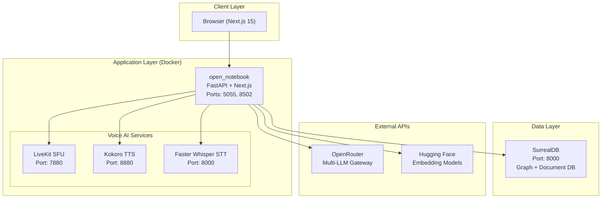
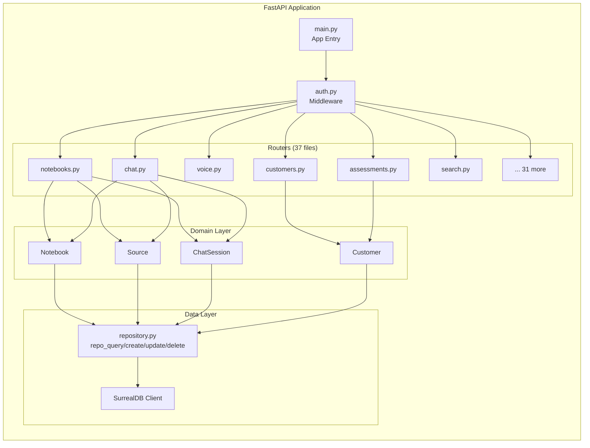
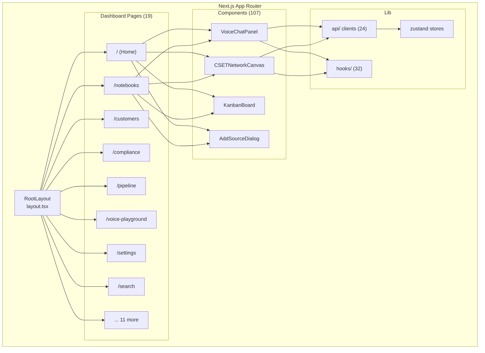
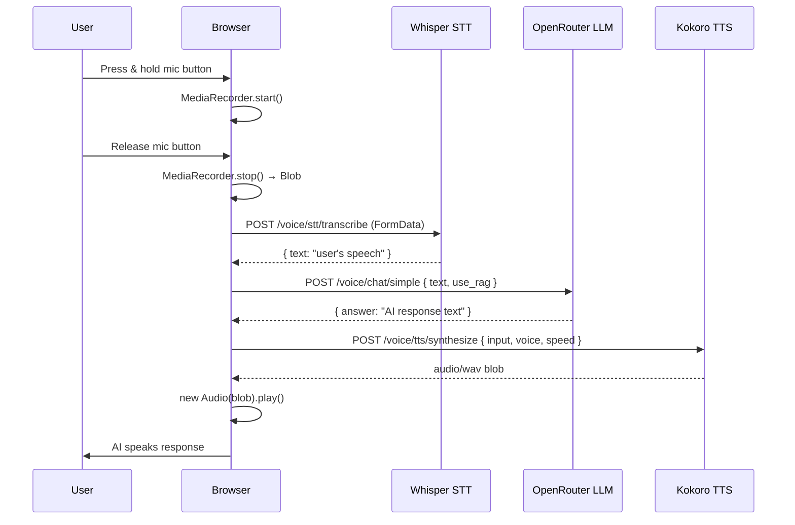
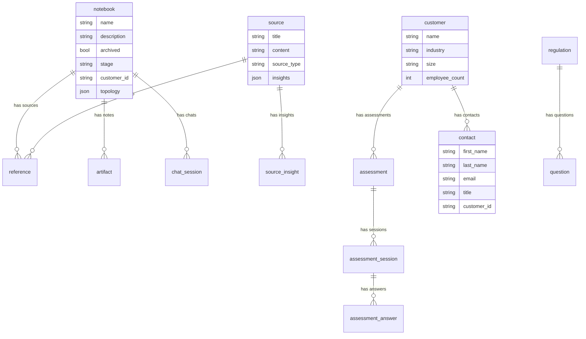

# Architecture

## System Overview

Tetrel Notebook is a privacy-focused research & knowledge management platform with integrated Voice AI, compliance auditing, and CRM capabilities.

## Docker Compose Services

Defined in [docker-compose.yml](file:///Users/jimmcknney/notebook_tetrel/docker-compose.yml):

| Service | Image | Port | Purpose |
|---------|-------|------|---------|
| `surrealdb` | `surrealdb/surrealdb:v2.2.1` | 8000 | Graph/document database |
| `open_notebook` | Built from Dockerfile | 5055, 8502 | Backend API + Frontend |
| `livekit-server` | `livekit/livekit-server` (pinned SHA) | 7880 | WebRTC SFU for voice |
| `kokoro-tts` | `ghcr.io/remsky/kokoro-fastapi-cpu` (pinned SHA) | 8880 | Text-to-Speech |
| `whisper-stt` | `fedirz/faster-whisper-server` (pinned SHA) | 8000 | Speech-to-Text |

## Backend Architecture

### Router Registration

All routers are registered in [main.py](file:///Users/jimmcknney/notebook_tetrel/api/main.py#L346-L379) with the `/api` prefix:

| Router | Prefix | Description |
|--------|--------|-------------|
| `auth` | `/api/auth` | Authentication status |
| `config` | `/api/config` | Version, DB health |
| `notebooks` | `/api/notebooks` | Notebook CRUD + graph validation |
| `chat` | `/api/chat` | Chat sessions + LLM execution |
| `voice` | `/api/voice` | LiveKit tokens, TTS, STT, health |
| `voice_rag` | `/api/voice` | Voice RAG chat pipeline |
| `voice_sessions` | `/api/voice` | Voice session persistence |
| `customers` | `/api/customers` | CRM customer management |
| `contacts` | `/api/contacts` | Contact management |
| `assessments` | `/api/assessments` | CSET compliance assessments |
| `sources` | `/api/sources` | Document source management |
| `notes` | `/api/notes` | Note CRUD |
| `search` | `/api/search` | Full-text + semantic search |
| `podcasts` | `/api/podcasts` | AI podcast generation |
| `containers` | `/api/containers` | Docker container monitoring |
| `platform` | `/api/platform` | GPU/system detection |

## Frontend Architecture

## Voice Pipeline

## Database Schema

SurrealDB uses a graph model with record-linked entities:

## Environment Variables

Key configuration from [.env.example](file:///Users/jimmcknney/notebook_tetrel/.env.example):

| Variable | Required | Default | Description |
|----------|----------|---------|-------------|
| `OPEN_NOTEBOOK_ENCRYPTION_KEY` | ✅ | `change-me-to-a-secret-string` | Credential encryption key |
| `SURREAL_URL` | ✅ | `ws://surrealdb:8000/rpc` | Database WebSocket URL |
| `SURREAL_USER` | ✅ | `root` | Database username |
| `SURREAL_PASSWORD` | ✅ | `root` | Database password |
| `LIVEKIT_API_KEY` | ❌ | `devkey` | LiveKit API key |
| `LIVEKIT_API_SECRET` | ❌ | `secret` | LiveKit API secret |
| `LIVEKIT_URL` | ❌ | `http://livekit-server:7880` | LiveKit server URL |
| `KOKORO_TTS_URL` | ❌ | `http://kokoro-tts:8880` | TTS service URL |
| `WHISPER_STT_URL` | ❌ | `http://whisper-stt:8000` | STT service URL |
| `OPENAI_API_KEY` | ❌ | — | OpenAI API key |
| `OPENROUTER_API_KEY` | ❌ | — | OpenRouter multi-LLM key |
