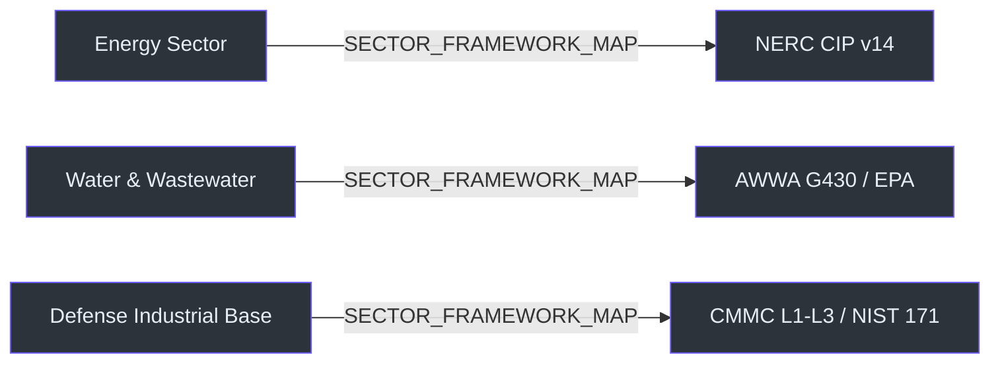

# CISA CSET Compliance Engine

This document details the regulatory compliance auditing subsystem, including the CISA infrastructure sector mapping, framework selections, and scoring analytics.

---

## 🧭 Architectural Overview

The Compliance Subsystem implements the **Cybersecurity and Infrastructure Security Agency's (CISA) Cybersecurity Performance Goals (CPGs)** and 50+ international compliance standards. 

```mermaid
graph TD
    classDef nodeStyle fill:#2d333b,stroke:#6d5dfc,color:#e6edf3;
    classDef stepStyle fill:#161b22,stroke:#6d5dfc,stroke-width:1px;

    Sectors["1. Assign CISA Sectors (Customer Profile)"]:::nodeStyle
    Mapping{"2. SECTOR_FRAMEWORK_MAP Lookup"}:::nodeStyle
    FwList["3. Recommend Specific Standards"]:::nodeStyle
    Wizard["4. Assessment Wizard Session"]:::stepStyle
    Score["5. Category Score Indexing"]:::stepStyle
    Radar["6. Render Radar Spider Chart"]:::nodeStyle

    Sectors --> Mapping
    Mapping --> FwList
    FwList --> Wizard
    Wizard --> Score
    Score --> Radar
```

---

## 🔄 The Compliance Mapping Logic

When a Customer dossier profile is initialized, it is assigned one or more of the 16 critical infrastructure sectors `(frontend/src/app/(dashboard)/customers/[id]/data.ts:28)`. The compliance engine maps these sectors to recommended security standards:

### Core Mappings Table `(frontend/src/app/(dashboard)/customers/[id]/data.ts:114)`

| CISA Sector | Recommended Standards | Domain Reference Code |
| :--- | :--- | :--- |
| **Energy** | NERC CIP-002 through CIP-014, ISO 27019, API 1164 | `(customers/[id]/data.ts:122)` |
| **Water & Wastewater** | AWWA G430, EPA Baseline, AWWA M19 | `(customers/[id]/data.ts:130)` |
| **Defense Industrial Base**| NIST SP 800-171, CMMC Levels 1-3, CNSSI 1253 | `(customers/[id]/data.ts:120)` |
| **Information Technology**| NIST CSF v2.0, CIS Controls v8, SOC 2 Type II | `(customers/[id]/data.ts:127)` |
| **Cross-Sector** | CISA Cross-Sector CPGs | `(customers/[id]/data.ts:131)` |

---

## 🏗️ Subsystem Components

### 1. Backend Assessment Controllers
* **[assessments.py](file:///Users/jimmcknney/notebook_tetrel/api/routers/assessments.py):** Handles assessment creation `(api/routers/assessments.py:148)`, session answer modifications `(api/routers/assessments.py:429)`, and gap report scoring `(api/routers/assessments.py:654)`.
* **[regulations.py](file:///Users/jimmcknney/notebook_tetrel/api/routers/regulations.py):** Fetches the static CSET regulation database and framework criteria `(api/routers/regulations.py:12)`.

### 2. Domain Models
* **[customer.py](file:///Users/jimmcknney/notebook_tetrel/open_notebook/domain/customer.py):** The `Assessment` class manages SurrealDB graph links linking `Customer` nodes to specific audit `Session` nodes `(open_notebook/domain/customer.py:9)`.

### 3. UI Assessment Wizard
* **[ComplianceTab.tsx](file:///Users/jimmcknney/notebook_tetrel/frontend/src/app/%28dashboard%29/customers/%5Bid%5D/components/ComplianceTab.tsx):** Implements the multi-step compliance scoring matrix interface. It maps YES / NO / N\/A / ALT answer options `(ComplianceTab.tsx:20)`.

---

## 📈 Scoring & Gap Analysis Calculation `(api/routers/assessments.py:654)`

Audits are scored using an additive coverage model. For each session:
$$\text{Score} = \frac{\sum \text{YES} + \sum \text{ALT}}{\sum \text{Questions} - \sum \text{N/A}}$$
The gap analysis report maps failed answers to Purdue Model network zones, recommending specific controls (e.g. ESP firewall boundaries for Level 3 SCADA zones) to remediate the compliance gap.
