# How-To Guide: Content Generation & Scheduling

This operations guide details step-by-step practical instructions for compiling AI podcasts, creating and scheduling multi-channel publication posts (email, LinkedIn, Twitter), setting up SMTP configuration profiles, and analyzing engagement metrics.

---

## 🗺️ Content & Scheduling MOC

* **[AI Podcast Generation & Compiling](#-ai-podcast-generation--compiling):** Generating audio dialogues from summaries.
* **[Creating and Scheduling Social Posts](#-creating-and-scheduling-social-posts):** Queueing posts for LinkedIn, Twitter, and Email.
* **[SMTP Server Config Setup](#-smtp-server-config-setup):** Setting up mail server configurations.
* **[Engagement Metrics & Snapshot Audits](#-engagement-metrics--snapshot-audits):** Reviewing reach, clicks, and timeseries history.

---

## 🔄 Content Distribution Pipeline

The workflow below illustrates the progression of content generation, scheduling, and metrics ingestion:

```mermaid
graph TD
    classDef nodeStyle fill:#2d333b,stroke:#6d5dfc,color:#e6edf3;
    classDef workerStyle fill:#161b22,stroke:#6d5dfc,stroke-width:1px;

    Notes["1. Select Notebook Notes & Insights"]:::nodeStyle
    GenerateAudio["2. Generate Podcast Audio (.WAV)<br/>(podcasts.py)"]:::nodeStyle
    SchedulePost["3. Schedule Social Post / Newsletter<br/>(publications.py)"]:::nodeStyle
    QueuePost["4. Post Saved to scheduled_post Table"]:::nodeStyle
    WorkerPublish["5. Worker Relays Content<br/>(SMTP/LinkedIn API)"]:::workerStyle
    WorkerMetrics["6. Worker Fetch Analytics<br/>(publication_worker.py)"]:::workerStyle
    GraphDashboard["7. Chart Timeseries Performance"]:::nodeStyle

    Notes --> GenerateAudio
    GenerateAudio --> SchedulePost
    SchedulePost --> QueuePost
    QueuePost --> WorkerPublish
    WorkerPublish --> WorkerMetrics
    WorkerMetrics --> GraphDashboard
```



---

## 🎙️ AI Podcast Generation & Compiling

The platform allows you to convert written sources, notes, and compliance reports into a professional, two-host audio podcast dialogue.

### Step-by-Step Instructions:
1. Navigate to the **Podcasts** section `/podcasts` inside a selected notebook.
2. Click **Create Podcast Episode** to open the compiler panel.
3. Configure the following episode parameters:
   * **Source Notes:** Choose which notebook sources and notes to compile.
   * **Host Profiles:** Map speaker voices (e.g. `Dr. Alex Chen` -> `am_michael`, `Jamie Rodriguez` -> `af_bella`).
   * **Dialogue Tone:** Select the style (e.g. `Analytical`, `Conversational`).
4. Click **Compile Episode**. This submits a command to the background job worker.
5. The worker invokes the podcast-creator library to write the script, generates dialogue streams using the local Kokoro TTS engine or cloud APIs, and compiles them into a downloadable `.wav` file.
6. Once complete, click **Play** directly in the UI or download the audio file.

### Codebase Citations:
* **Podcast Controller API:** Mapped inside the podcasts router `(api/routers/podcasts.py:46)`.
* **TTS Model Resolution:** Translated by ModelManager to use local Kokoro endpoints:
  ```python
  # open_notebook/podcasts/models.py:78
  # Translates kokoro references to standard OpenAI API requests mapping local shims
  config["base_url"] = os.getenv("KOKORO_TTS_URL", "http://kokoro-tts:8880")
  ```

---

## ✉️ Creating and Scheduling Social Posts

You can write updates, summaries, and newsletters and schedule them for automatic distribution.

### Step-by-Step Instructions:
1. Navigate to the **Content Calendar** dashboard `/settings/publications`.
2. Click **Schedule Post** to open the scheduling modal.
3. Configure the following parameters:
   * **Platform Channel:** Select `linkedin`, `twitter`, or `email`.
   * **Title & Content:** Write the headline and post body text.
   * **Media Attachments:** Upload image/video assets.
   * **Scheduled Time:** Select the target date and time.
4. Set the status to **Queued** (or keep as **Draft**).
5. Click **Schedule**. The post is saved inside the `scheduled_post` table in SurrealDB, where the background task runner picks it up at the scheduled time.

### Codebase Citations:
* **Schedule API Endpoint:** Endpoints mapped inside the publications router `(api/routers/publications.py:125)`.
* **Post Field Validations:** Data structures validated against Pydantic models:
  ```python
  # api/models.py:2069
  class ScheduledPostCreate(BaseModel):
      channel: str
      title: str
      content: str
      media_urls: List[str] = []
      scheduled_time: str
      status: str = "draft"
  ```

---

## 🛠️ SMTP Server Config Setup

To distribute emails and newsletters directly from the platform, you must configure your mail server settings.

### Step-by-Step Instructions:
1. Navigate to **System Settings** -> **Email Configurations** (`/settings/publications`).
2. Enter the parameters of your SMTP provider:
   * **SMTP Host:** Server address (e.g. `smtp.gmail.com`).
   * **SMTP Port:** Connection port (e.g. `587` for TLS, `465` for SSL).
   * **SMTP Username:** Send address (e.g. `alerts@yourdomain.com`).
   * **SMTP Password:** SMTP key or app-specific password.
   * **Security Options:** Toggle SSL/TLS options.
3. Click **Save Settings** to write parameters to the singleton record.
4. Click **Test SMTP Connection**. This triggers a pre-flight test to verify server connectivity.

### Codebase Citations:
* **Email Settings Schema:** Mapped inside the SurrealDB migrations catalog `(migrations/35.surrealql:1)`.
* **SMTP Router Controller:** Endpoint `POST /api/publications/settings/test` verifies pre-flights `(api/routers/publications.py:107)`.

---

## 📈 Engagement Metrics & Snapshot Audits

The system monitors post engagement by periodically polling channel platforms.

### Step-by-Step Instructions:
1. Navigate to the **Publications Analytics** dashboard.
2. The dashboard displays aggregated stats: **Total Impressions/Views**, **Clicks**, **Interactions**, and **Average CTR** (Click-Through Rate).
3. The background worker `track_published_post_metrics` runs every hour (or can be manually triggered via the `/api/publications/track-due` endpoint).
4. If real APIs are not configured or are in dev, the worker simulates engagement growth.
5. The worker updates the `scheduled_post` fields and appends a timeseries log entry to `publication_metrics_history` for charting.

### Codebase Citations:
* **Background Worker Routine:** Mapped inside the task folder `(open_notebook/tasks/publication_worker.py:7)`.
* **Database Logs Insertion:** Writes timeseries metrics to history table:
  ```python
  # open_notebook/tasks/publication_worker.py:68
  await repo_upsert("publication_metrics_history", history_id, {
      "id": history_id,
      "scheduled_post": ensure_record_id(post_id),
      "channel": channel,
      "views": new_views,
      "clicks": new_clicks,
      "interactions": new_interactions,
      "timestamp": datetime.now(timezone.utc)
  })
  ```

---

## 🔗 Related Documentation Pages

* **[MOC Master Index Map](index.md)**
* **[Developer Setup & Test Guide](developer-guide.md)**
* **[Sales, CRM, & Lead Prospecting Guide](sales-prospecting-guide.md)**
* **[Deep Research Operations Guide](deep-research-guide.md)**
* **[Publications Subsystem Deep Dive](publications-subsystem.md)**
