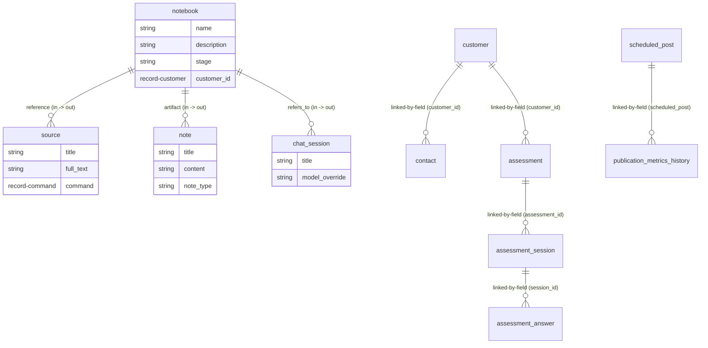
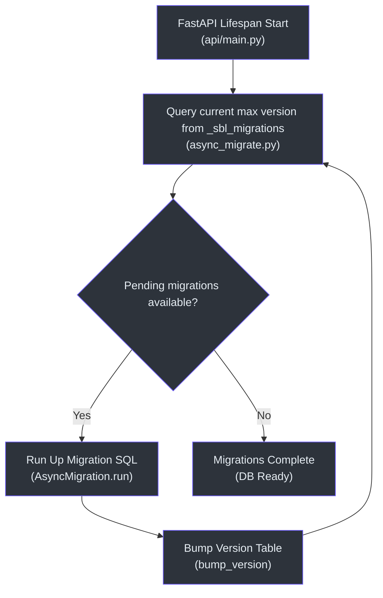

# SurrealDB Graph Schema & Migrations

This document details the persistence layer of the **Tetrel Security (Open Notebook)** platform. It covers SurrealDB schema definitions, graph edges, repository abstractions, transactional query patterns, and the complete 38-tier migration history.

---

## 🗺️ Database Map of Content (MOC)

* **[Relational Topology & Graph Entities](#-relational-topology--graph-entities):** Database ER schema and record linking structures.
* **[Repository Abstraction Layer](#-repository-abstraction-layer):** Connection lifecycle context, CRUD helpers, and transactional queries.
* **[Object-Relational Mapping (ORM) System](#-object-relational-mapping-orm-system):** Active record classes (`ObjectModel` and `RecordModel`).
* **[Migrations Architecture & Runner](#-migrations-architecture--runner):** Automated schema bumping, version tables, and async runners.
* **[Schema Migration Catalog (1–38)](#-schema-migration-catalog-138):** Complete listing of all 38 migration files and operations.

---

## 🧬 Relational Topology & Graph Entities

SurrealDB serves as a multi-model database. Instead of traditional foreign keys or nested documents, relationships are modelled as **graph edges** (`RELATE`) that connect **RecordIDs** (`table:id`). These links allow fast graph traversals without expensive relational joins.

### Entity Relationship Model

Below is the graph schema illustrating the entity connections and record links:



---

## 🛠️ Repository Abstraction Layer

The repository layer abstracts low-level SurrealQL operations. It manages connection setup, RecordID serialization, and error handling.

### Connection Lifecycle Context `(open_notebook/database/repository.py:50)`
All database operations utilize the `db_connection` context manager, which handles sign-in, namespace/database selection, and socket closing:

```python
# open_notebook/database/repository.py:50
@asynccontextmanager
async def db_connection():
    db = AsyncSurreal(get_database_url())
    await db.signin({
        "username": os.environ.get("SURREAL_USER"),
        "password": get_database_password(),
    })
    await db.use(
        os.environ.get("SURREAL_NAMESPACE"), os.environ.get("SURREAL_DATABASE")
    )
    try:
        yield db
    finally:
        await db.close()
```

### Relational Graph Queries `(open_notebook/database/repository.py:108)`
To relate two entities via a graph edge, the repository uses the `RELATE` statement:

```python
# open_notebook/database/repository.py:108
async def repo_relate(
    source: str, relationship: str, target: str, data: Optional[Dict[str, Any]] = None
) -> List[Dict[str, Any]]:
    if data is None:
        data = {}
    query = f"RELATE {source}->{relationship}->{target} CONTENT $data;"
    return await repo_query(query, {"data": data})
```

---

## 🎛️ Object-Relational Mapping (ORM) System

The application maps database records to Python objects using two base classes in [base.py](file:///Users/jimmcknney/notebook_tetrel/open_notebook/domain/base.py):

### 1. `ObjectModel` `(open_notebook/domain/base.py:31)`
Used for multi-instance entities (e.g. `Notebook`, `Source`, `Note`). It manages timestamps, validation, and CRUD operations:
* **`save()` `(open_notebook/domain/base.py:146)`:** Validates the Pydantic schema, maps inputs, and calls `repo_create` or `repo_update`.
* **`delete()` `(open_notebook/domain/base.py:203)`:** Deletes the record and associated assets.
* **`relate()` `(open_notebook/domain/base.py:217)`:** Establishes graph relationships via `repo_relate`.

### 2. `RecordModel` `(open_notebook/domain/base.py:239)`
Used for singletons or configuration objects where the ID is hardcoded (e.g. `VoiceSettings`, `EmailSettings`). It uses a singleton registry `_instances` and provides:
* **`get_instance()` `(open_notebook/domain/base.py:308)`:** Retrieves or creates the singleton, syncing it with the database.
* **`update()` `(open_notebook/domain/base.py:323)`:** Serializes class fields and runs a merge upsert statement in the database.

---

## 🔄 Migrations Architecture & Runner

Migrations are applied automatically at application startup by the `AsyncMigrationManager` `(open_notebook/database/async_migrate.py:91)`.



* **Version Registry:** Version records are stored in the `_sbl_migrations` table `(open_notebook/database/async_migrate.py:342)`.
* **Runner Execution:** The sync wrapper `MigrationManager` `(open_notebook/database/migrate.py:67)` is provided for backward compatibility.

---

## 🗃️ Schema Migration Catalog (1–38)

The table below catalogs every migration level in the codebase, detailing the database schema modifications:

| Level | Up File | Description & Major Entities Defined | Source Citation |
| :--- | :--- | :--- | :--- |
| **1** | [1.surrealql](file:///Users/jimmcknney/notebook_tetrel/open_notebook/database/migrations/1.surrealql) | Primary schema setup: `source`, `source_insight`, `source_embedding`, `note`, `notebook`. | `(migrations/1.surrealql:2)` |
| **2** | [2.surrealql](file:///Users/jimmcknney/notebook_tetrel/open_notebook/database/migrations/2.surrealql) | Defines unique indexes for references. | `(migrations/2.surrealql:1)` |
| **3** | [3.surrealql](file:///Users/jimmcknney/notebook_tetrel/open_notebook/database/migrations/3.surrealql) | Adds `chat_session` and `refers_to` relationship. | `(migrations/3.surrealql:2)` |
| **4** | [4.surrealql](file:///Users/jimmcknney/notebook_tetrel/open_notebook/database/migrations/4.surrealql) | Adds user audit logging tables. | `(migrations/4.surrealql:1)` |
| **5** | [5.surrealql](file:///Users/jimmcknney/notebook_tetrel/open_notebook/database/migrations/5.surrealql) | Adds custom `transformation` schema. | `(migrations/5.surrealql:8)` |
| **6** | [6.surrealql](file:///Users/jimmcknney/notebook_tetrel/open_notebook/database/migrations/6.surrealql) | Configures indexes on full-text fields. | `(migrations/6.surrealql:1)` |
| **7** | [7.surrealql](file:///Users/jimmcknney/notebook_tetrel/open_notebook/database/migrations/7.surrealql) | Adds `episode_profile`, `speaker_profile`, and `episode`. | `(migrations/7.surrealql:1)` |
| **8** | [8.surrealql](file:///Users/jimmcknney/notebook_tetrel/open_notebook/database/migrations/8.surrealql) | Configures cascading delete options on graph edges. | `(migrations/8.surrealql:5)` |
| **9** | [9.surrealql](file:///Users/jimmcknney/notebook_tetrel/open_notebook/database/migrations/9.surrealql) | Vector indexes for embeddings search. | `(migrations/9.surrealql:1)` |
| **10** | [10.surrealql](file:///Users/jimmcknney/notebook_tetrel/open_notebook/database/migrations/10.surrealql) | Bumps metadata parameters on assets. | `(migrations/10.surrealql:1)` |
| **11** | [11.surrealql](file:///Users/jimmcknney/notebook_tetrel/open_notebook/database/migrations/11.surrealql) | Adds client identification parameters. | `(migrations/11.surrealql:1)` |
| **12** | [12.surrealql](file:///Users/jimmcknney/notebook_tetrel/open_notebook/database/migrations/12.surrealql) | Adds `credential` security table. | `(migrations/12.surrealql:6)` |
| **13** | [13.surrealql](file:///Users/jimmcknney/notebook_tetrel/open_notebook/database/migrations/13.surrealql) | Links model specifications to credential constraints. | `(migrations/13.surrealql:1)` |
| **14** | [14.surrealql](file:///Users/jimmcknney/notebook_tetrel/open_notebook/database/migrations/14.surrealql) | Adds podcast model registry fields. | `(migrations/14.surrealql:1)` |
| **15** | [15.surrealql](file:///Users/jimmcknney/notebook_tetrel/open_notebook/database/migrations/15.surrealql) | Adds `customer` schema (CRM support). | `(migrations/15.surrealql:2)` |
| **16** | [16.surrealql](file:///Users/jimmcknney/notebook_tetrel/open_notebook/database/migrations/16.surrealql) | Adds `assessment`, `assessment_session`, and `assessment_answer`. | `(migrations/16.surrealql:2)` |
| **17** | [17.surrealql](file:///Users/jimmcknney/notebook_tetrel/open_notebook/database/migrations/17.surrealql) | Adds `scheduled_search` table. | `(migrations/17.surrealql:5)` |
| **18** | [18.surrealql](file:///Users/jimmcknney/notebook_tetrel/open_notebook/database/migrations/18.surrealql) | Adds CRM `contact` table. | `(migrations/18.surrealql:5)` |
| **19** | [19.surrealql](file:///Users/jimmcknney/notebook_tetrel/open_notebook/database/migrations/19.surrealql) | Relates CRM contacts to customers. | `(migrations/19.surrealql:1)` |
| **20** | [20.surrealql](file:///Users/jimmcknney/notebook_tetrel/open_notebook/database/migrations/20.surrealql) | Adds `project`, `research_item`, and joint relationship nodes. | `(migrations/20.surrealql:9)` |
| **21** | [21.surrealql](file:///Users/jimmcknney/notebook_tetrel/open_notebook/database/migrations/21.surrealql) | Sets constraints on project scope definitions. | `(migrations/21.surrealql:1)` |
| **22** | [22.surrealql](file:///Users/jimmcknney/notebook_tetrel/open_notebook/database/migrations/22.surrealql) | Adds sync logging tables (`sync_status`). | `(migrations/22.surrealql:45)` |
| **23** | [23.surrealql](file:///Users/jimmcknney/notebook_tetrel/open_notebook/database/migrations/23.surrealql) | Configures indexes on synchronization states. | `(migrations/23.surrealql:1)` |
| **24** | [24.surrealql](file:///Users/jimmcknney/notebook_tetrel/open_notebook/database/migrations/24.surrealql) | Bumps constraints on audit log entries. | `(migrations/24.surrealql:1)` |
| **25** | [25.surrealql](file:///Users/jimmcknney/notebook_tetrel/open_notebook/database/migrations/25.surrealql) | Adds the `activity` ledger log. | `(migrations/25.surrealql:2)` |
| **26** | [26.surrealql](file:///Users/jimmcknney/notebook_tetrel/open_notebook/database/migrations/26.surrealql) | Adds the `voice_settings` registry. | `(migrations/26.surrealql:2)` |
| **27** | [27.surrealql](file:///Users/jimmcknney/notebook_tetrel/open_notebook/database/migrations/27.surrealql) | Adds `agent_config`, `agent_execution`, and `agent_log` tracking. | `(migrations/27.surrealql:2)` |
| **28** | [28.surrealql](file:///Users/jimmcknney/notebook_tetrel/open_notebook/database/migrations/28.surrealql) | Adds `skill_registry` configuration schemas. | `(migrations/28.surrealql:2)` |
| **29** | [29.surrealql](file:///Users/jimmcknney/notebook_tetrel/open_notebook/database/migrations/29.surrealql) | Adds `asset` storage metadata tracking. | `(migrations/29.surrealql:1)` |
| **30** | [30.surrealql](file:///Users/jimmcknney/notebook_tetrel/open_notebook/database/migrations/30.surrealql) | Adds `asset_edge` relations. | `(migrations/30.surrealql:8)` |
| **31** | [31.surrealql](file:///Users/jimmcknney/notebook_tetrel/open_notebook/database/migrations/31.surrealql) | Adds `organization` and `file_audit_log` details. | `(migrations/31.surrealql:2)` |
| **32** | [32.surrealql](file:///Users/jimmcknney/notebook_tetrel/open_notebook/database/migrations/32.surrealql) | Adds `scheduled_episode` database table. | `(migrations/32.surrealql:2)` |
| **33** | [33.surrealql](file:///Users/jimmcknney/notebook_tetrel/open_notebook/database/migrations/33.surrealql) | Configures indexes on organization identities. | `(migrations/33.surrealql:1)` |
| **34** | [34.surrealql](file:///Users/jimmcknney/notebook_tetrel/open_notebook/database/migrations/34.surrealql) | Adds field parameters on security check policies. | `(migrations/34.surrealql:1)` |
| **35** | [35.surrealql](file:///Users/jimmcknney/notebook_tetrel/open_notebook/database/migrations/35.surrealql) | Adds `email_setting` and `scheduled_post` schemas. | `(migrations/35.surrealql:1)` |
| **36** | [36.surrealql](file:///Users/jimmcknney/notebook_tetrel/open_notebook/database/migrations/36.surrealql) | Adds `publication_metrics_history` and credentials. | `(migrations/36.surrealql:2)` |
| **37** | [37.surrealql](file:///Users/jimmcknney/notebook_tetrel/open_notebook/database/migrations/37.surrealql) | Seeds default `google_docs` OAuth credentials. | `(migrations/37.surrealql:2)` |
| **38** | [38.surrealql](file:///Users/jimmcknney/notebook_tetrel/open_notebook/database/migrations/38.surrealql) | Seeds default text-to-speech models for Voice Subsystem. | `(migrations/38.surrealql:2)` |

---

## 🔗 Subsystem Links

* **[MOC Entry Guide](index.md)**
* **[Principal Architecture Guide](principal-guide.md)**
* **[Developer Setup Guide](developer-guide.md)**
* **[Publications Subsystem Deep Dive](publications-subsystem.md)**
* **[Voice Subsystem Deep Dive](voice-subsystem.md)**
