# How-To Guide: Deep Research & Search Queries

This operations guide details step-by-step practical instructions for executing vector/hybrid knowledge base searches, configuring LLM-based query reranking, running deep research tasks, applying custom style guides, and scheduling recurring market scans.

---

## 🗺️ Deep Research MOC

* **[Executing KB Searches & Hybrid Reranking](#-executing-kb-searches--hybrid-reranking):** Vector vs. hybrid search.
* **[Running Deep Research Tasks](#-running-deep-research-tasks):** Querying Perplexity, local sources, and Valyu.
* **[Custom Style Guides & Formatting](#-custom-style-guides--formatting):** Formatting output documents.
* **[Configuring Recurring Research Cron Schedules](#-configuring-recurring-research-cron-schedules):** Setting up automated tracking.

---

## 🔄 Deep Research Engine Workflow

The diagram below details the sequence of executing search engines, consolidating citations, and applying style guides:

```mermaid
graph TD
    classDef nodeStyle fill:#2d333b,stroke:#6d5dfc,color:#e6edf3;
    classDef engineStyle fill:#161b22,stroke:#6d5dfc,stroke-width:1px;

    QueryInput["1. Query Input<br/>(search/research Endpoint)"]:::nodeStyle
    EngineRouting{"2. Select Research Engine"}:::nodeStyle
    
    subgraph MultiEngine ["Search Engine Integration Layer"]
        LocalKB["Local KB Vector Search<br/>(vector_search)"]:::engineStyle
        Perplexity["Perplexity Online API<br/>(sonar)"]:::engineStyle
        ValyuSearch["Valyu Deep Search<br/>(v1/search)"]:::engineStyle
    end
    style MultiEngine fill:#161b22,stroke:#30363d;

    Consolidate["3. Deduplicate Sources by URL"]:::nodeStyle
    StyleGuideFetch["4. Apply Style Guide Settings<br/>(StyleGuide.get)"]:::nodeStyle
    LLMSynthesis["5. LLM Synthesis Generation"]:::nodeStyle
    NoteSaving["6. Save Results as Source / Note"]:::nodeStyle

    QueryInput --> EngineRouting
    EngineRouting -->|local| LocalKB
    EngineRouting -->|perplexity| Perplexity
    EngineRouting -->|hybrid| LocalKB & Perplexity & ValyuSearch
    LocalKB & Perplexity & ValyuSearch --> Consolidate
    Consolidate --> StyleGuideFetch
    StyleGuideFetch --> LLMSynthesis
    LLMSynthesis --> NoteSaving
```



---

## 🔍 Executing KB Searches & Hybrid Reranking

You can search the knowledge base using vector-based similarity or hybrid search (local vector database + external search API).

### Step-by-Step Instructions:
1. Navigate to the **Search** tab `/search` on the dashboard.
2. Enter your search query in the search bar.
3. Select the search type:
   * **Vector Search:** Queries local embeddings.
   * **Hybrid Search:** Queries local embeddings and makes an API call to Valyu.
4. Set the **Reranking** option to `Enabled`. This uses a secondary LLM to score the results for relevance and reorder them.
5. Click **Search**. The system executes the queries and lists matching items with similarity scores.

### Codebase Citations:
* **Search Routing API:** Endpoints mapped in `search_knowledge_base` `(api/routers/search.py:29)`.
* **LLM Reranker Prompt:** Uses a default reranker model:
  ```python
  # api/routers/search.py:120
  rerank_prompt = (
      "You are a relevance scoring engine. Given the query and search results below, "
      "return ONLY a JSON array of objects with 'index' (int) and 'score' (float 0-1) "
      "sorted by relevance, highest first..."
  )
  ```

---

## 🌐 Running Deep Research Tasks

For multi-engine research, the system streams analysis reports using local, Perplexity online, or hybrid search configurations.

### Step-by-Step Instructions:
1. Navigate to the **Research Intelligence** tab `/research`.
2. Click **New Research Task** to open the research panel.
3. Configure the following parameters:
   * **Query:** Enter your research topic (e.g. `Latest developments in NERC CIP-014`).
   * **Search Engine:** Choose `local`, `perplexity`, or `hybrid`.
   * **GTM Template:** Select a custom transformation template.
   * **Style Guide:** Choose a formatting layout.
4. Click **Execute Research**. The system opens a Server-Sent Event (SSE) connection.
5. The UI displays real-time search queries, lists found sources, and streams the compiled markdown analysis.
6. Click **Save as Note** to write the compiled markdown output as a notebook note.

### Codebase Citations:
* **Research Stream API:** Endpoints mapped in `deep_research_endpoint` `(api/routers/search.py:778)`.
* **Hybrid Search Consolidator:** Runs local search, queries Perplexity, queries Valyu, deduplicates results, and invokes the LLM:
  ```python
  # api/routers/search.py:721
  seen_urls = set()
  deduped_sources = []
  for src in all_sources:
      url = src.get("url", "")
      if url and url not in seen_urls:
          seen_urls.add(url)
          deduped_sources.append(src)
  ```

---

## 🎨 Custom Style Guides & Formatting

You can apply formatting rules (fonts, line spacing, margins, color schemes, tables of contents) to your generated research reports.

### Step-by-Step Instructions:
1. Navigate to **System Settings** -> **Style Guides** `/settings/styleguides`.
2. Click **Create Style Guide**.
3. Configure the formatting parameters:
   * **Guide Name:** (e.g. `Executive Briefing`).
   * **Fonts & Sizes:** Specify headings and body text styles.
   * **Page Layout:** Page size, margins, orientation.
   * **Inclusions:** Toggle **Include Table of Contents** and **Include Page Numbers**.
4. Click **Save Guide**.
5. When executing a research task, select this guide. The system injects these styling parameters into the LLM's system prompt to format the output.

### Codebase Citations:
* **Style Guide Controller:** Endpoint `GET /api/styleguides` lists templates `(api/routers/styleguides.py:12)`.
* **Prompt Injection Logic:** Mapped in `stream_research_response` `(api/routers/search.py:468)`.

---

## 📅 Configuring Recurring Research Schedules

For continuous intelligence gathering, you can schedule research tasks to run at regular intervals.

### Step-by-Step Instructions:
1. Navigate to the **Research Intelligence** kanban dashboard `/research`.
2. Open a research item and click **Schedule**.
3. Toggle **Is Recurring** to `True`.
4. Select the interval: `hourly`, `daily`, `weekly`, or `monthly`.
5. The system computes the `next_run` datetime using the selected interval.
6. A background cron runner queries for due tasks using the `/api/research-items/due/list` endpoint and triggers them automatically.

### Codebase Citations:
* **Due Items Query:** Fetching active due tasks calls `get_due_items` `(open_notebook/domain/research_item.py:166)`.
* **Schedule Interval Mapping:** Mapped in the domain model `INTERVAL_DELTAS` dictionary:
  ```python
  # open_notebook/domain/research_item.py:20
  INTERVAL_DELTAS = {
      "hourly": timedelta(hours=1),
      "daily": timedelta(days=1),
      "weekly": timedelta(weeks=1),
      "monthly": timedelta(days=30),
  }
  ```

---

## 🔗 Related Documentation Pages

* **[MOC Master Index Map](index.md)**
* **[Developer Setup & Build Guide](developer-guide.md)**
* **[Sales, CRM, & Lead Prospecting Guide](sales-prospecting-guide.md)**
* **[Content Generation & Publications Guide](content-scheduling-guide.md)**
* **[Agent Subsystem Deep Dive](agent-subsystem.md)**
