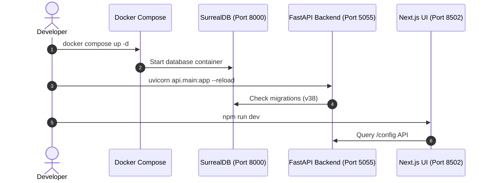
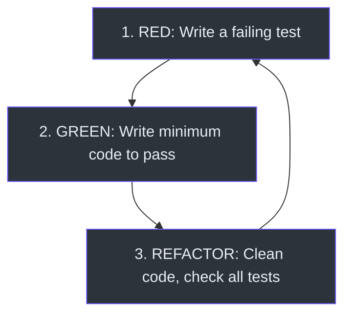

# Developer Setup Guide

This guide walks you through setting up your local development workspace, compiling resources, running automated test suites, and extending the application layout.

---

## 🏗️ Workspace Boot Sequence

The workspace utilizes Docker Compose to run external services while running the FastAPI backend and Next.js frontend on the host machine.



---

## 🛠️ Step-by-Step Installation

### 1. Configure the Environment
Copy the default environment variables template and set a custom security encryption key:
```bash
cp .env.example .env
# Open .env and set:
# OPEN_NOTEBOOK_ENCRYPTION_KEY="use-a-strong-32-byte-key"
```

### 2. Start Infrastructure Containers
Start SurrealDB, LiveKit SFU, Kokoro, and Whisper:
```bash
docker compose up -d
# Check health of containers
docker compose ps
```

### 3. Backend Setup & Pytest Execution
Create a virtual environment, install dependencies in editable mode, and run the test suite:
```bash
python3 -m venv .venv
source .venv/bin/activate
pip install -e ".[dev]"

# Execute backend test suite
pytest tests/ -v
```

### 4. Frontend Setup & Build
Navigate to the frontend folder, install npm modules, run checks, and start the hot-reload Dev server:
```bash
cd frontend
npm install

# Run TypeScript compile validation
npm run type-check # Runs: tsc --noEmit

# Start development server
npm run dev
# Frontend is served at http://localhost:8502
```

---

## 🧩 Extending the Application

### 1. Adding a Backend Handler Route
* Backend route files are placed in [api/routers/](file:///Users/jimmcknney/notebook_tetrel/api/routers/).
* Every handler registers its endpoints on an `APIRouter` instance:
  ```python
  from fastapi import APIRouter
  router = APIRouter()
  ```
* Register the new router inside [main.py](file:///Users/jimmcknney/notebook_tetrel/api/main.py#L346-L379):
  ```python
  from api.routers import my_feature
  app.include_router(my_feature.router, prefix="/api", tags=["my-feature"])
  ```

### 2. Adding a Frontend Page Route
* Frontend page layouts are added in the App Router directory: `frontend/src/app/(dashboard)/`.
* To add a page link to the sidebar, modify the navigation definitions array in [AppSidebar.tsx](file:///Users/jimmcknney/notebook_tetrel/frontend/src/components/layout/AppSidebar.tsx#L60-L107):
  ```typescript
  { name: 'My Page', href: '/my-page', icon: FlaskConical }
  ```

---

## 🧪 Testing Guidelines

Tetrel Security follows Test-Driven Development (TDD) principles.



* **Backend Mocking:** Tests use Python's mock patch utilities to isolate DB queries `(tests/test_activities_api.py:12)`.
* **Database Fixtures:** Pytest fixtures handle temp data setup and teardown before each suite `(tests/conftest.py:20)`.
