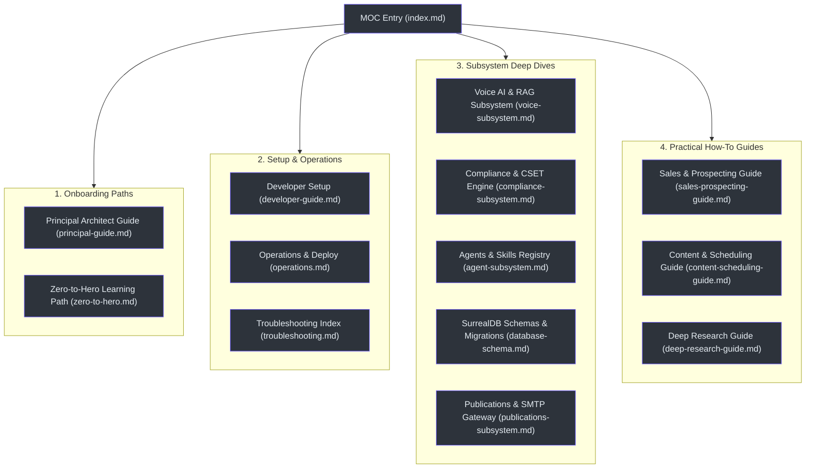
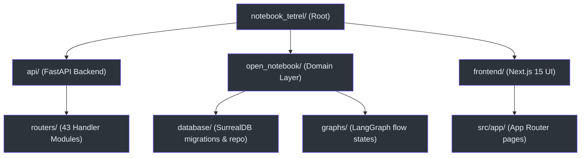

# Tetrel Security — Developer Wiki

Welcome to the Tetrel Security (Open Notebook) Developer Wiki. This is a comprehensive, academic-parity, interlinked technical reference manual. All documentation is mapped directly to actual code paths and verified against system schemas.

---

## 🗺️ Master Map of Content (MOC)

Below is the structured navigation flow across the wiki modules:

---

## 🚀 Navigation Quick Index

### 👨‍💻 Onboarding & Standards
* **[Principal-Level Guide](principal-guide.md):** Architectural trade-offs, graph paradigms, and core design principles.
* **[Zero-to-Hero Path](zero-to-hero.md):** 40+ term glossary, progressive codebase walkthrough, and technology comparisons.

### 🛠️ Getting Started & Maintenance
* **[Developer Setup Guide](developer-guide.md):** Dependency installation, virtual environment setup, and testing commands.
* **[Operations & Process Monitor](operations.md):** Service supervisor configs, log trailing, and system health checks.
* **[Troubleshooting Guide](troubleshooting.md):** Resolving port conflicts, GPU acceleration fallbacks, and DB locking.

### 🧠 Subsystem Architecture deep dives
* **[Voice AI & RAG Pipeline](voice-subsystem.md):** LiveKit SFU WebRTC connections, Whisper transcription, and Kokoro speech synthesis.
* **[CISA CSET Compliance Engine](compliance-subsystem.md):** 16 infrastructure sector mappings, framework audit wizards, and spider gap charts.
* **[Multi-Agent & Skills Registry](agent-subsystem.md):** LangGraph workflow definitions, automated copilot drafting, and custom agent parameters.
* **[SurrealDB Schemas & Migrations](database-schema.md):** Table schemas, record-linking, graph relations, and migration tracking.
* **[Publications Scheduler & SMTP Gateway](publications-subsystem.md):** Publication metrics, scheduled post calendars, and SMTP credentials.

### 📋 Practical How-To Guides
* **[Sales, CRM, & Prospecting Guide](sales-prospecting-guide.md):** Step-by-step CRM lead management, website scraping, AI stakeholder extraction, and activities timelines.
* **[Content Generation & Scheduling Guide](content-scheduling-guide.md):** Compiling AI podcasts, scheduling social/email publications, and configuring SMTP servers.
* **[Deep Research & Search Queries Guide](deep-research-guide.md):** Executing vector/hybrid searches, LLM reranking, and deep multi-engine queries.

---

## 📦 Core Directory Mapping

The codebase is organized into key layers reflecting presentation, business logic, persistence, and container infrastructure:

* **Backend Entrypoint:** [main.py](file:///Users/jimmcknney/notebook_tetrel/api/main.py) registers routers, CORS parameters, and db connections.
* **Persistence Layer:** [repository.py](file:///Users/jimmcknney/notebook_tetrel/open_notebook/database/repository.py) manages SurrealQL transactions and queries.
* **Orchestration Graphs:** [chat.py](file:///Users/jimmcknney/notebook_tetrel/open_notebook/graphs/chat.py) and [research.py](file:///Users/jimmcknney/notebook_tetrel/open_notebook/graphs/research.py) orchestrate multi-agent state machines.
* **Authentication Handler:** [auth.py](file:///Users/jimmcknney/notebook_tetrel/api/auth.py) enforces API keys and tokens.
* **Unified UI Shell:** [AppSidebar.tsx](file:///Users/jimmcknney/notebook_tetrel/frontend/src/components/layout/AppSidebar.tsx) defines the group-level navigation.
