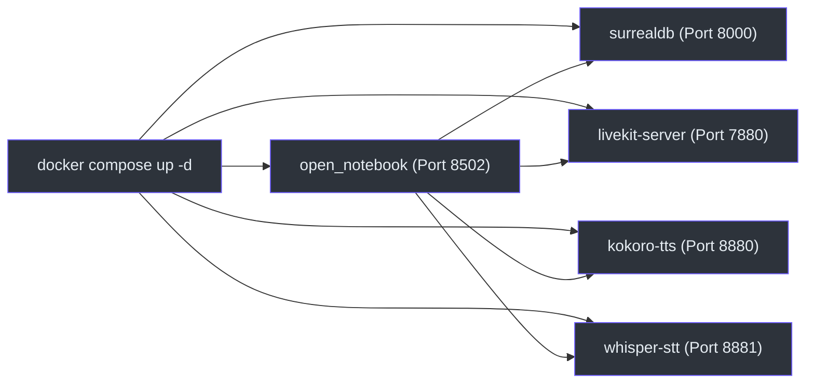

# Operations & Deployment Runbook

This runbook covers starting and maintaining production and staging containers, process orchestration with supervisor, log diagnostics, and system health checks.

---

## ⚙️ Process Orchestration (Supervisor)

Inside the `open_notebook` container, processes are managed by **supervisord** `(supervisord.conf:1)`. This ensures that if the FastAPI backend, Next.js server, or the background task worker encounters a crash, supervisor automatically restarts the process.

```mermaid
graph TD
    classDef nodeStyle fill:#2d333b,stroke:#6d5dfc,color:#e6edf3;
    classDef processStyle fill:#161b22,stroke:#6d5dfc,stroke-width:1px;
    
    Container["open_notebook Container Entrypoint"]:::nodeStyle
    Supervisord["supervisord Daemon"]:::nodeStyle
    
    API["Backend HTTP API (program:api)"]:::processStyle
    Worker["Background Queue Worker (program:worker)"]:::processStyle
    Frontend["Next.js Server (program:frontend)"]:::processStyle
    
    Container --> Supervisord
    Supervisord --> API
    Supervisord --> Worker
    Supervisord --> Frontend
```



### Supervisor Program Definitions
1. **HTTP Backend:** Serves REST API traffic on port 5055 `(supervisord.conf:7)`.
2. **Commands Worker:** Listens to the SurrealDB commands channel for background execution jobs (like audio generation or PDF extraction) `(supervisord.conf:19)`.
3. **Frontend Server:** Serves hydrated HTML pages on port 8502 `(supervisord.conf:32)`.

---

## 🚢 Service Deployment (Docker Compose)

All microservices are configured and deployed using Docker Compose `(docker-compose.yml:1)`.



### Volume Mounting & Data Persistence
* **SurrealDB Storage:** Mapped to `./surreal_data` on the host to persist schemas and client dossiers `(docker-compose.yml:9)`.
* **Notebook Files:** Mapped to `./notebook_data` for uploaded PDF and URL assets `(docker-compose.yml:45)`.
* **Whisper Models:** Cached inside the `whisper_models` docker volume to prevent redownloading faster-whisper files `(docker-compose.yml:94)`.

---

## 🩺 System Health Checks & Verification

### 1. Database Health Check `(docker-compose.yml:13)`
The surrealdb container executes an internal query loop to verify readiness:
```bash
surreal isready --endpoint http://localhost:8000
```

### 2. LiveKit SFU Status `(docker-compose.yml:64)`
LiveKit is verified using a silent HTTP request check:
```bash
wget --spider -q http://localhost:7880
```

### 3. Reviewing Live Container Logs
Use docker logs to isolate supervisor stdout streams:
```bash
# General container logs
docker compose logs open_notebook --tail=100 -f

# Filter for backend API process logs
docker compose exec open_notebook supervisorctl tail -f api

# Filter for background worker logs
docker compose exec open_notebook supervisorctl tail -f worker
```
