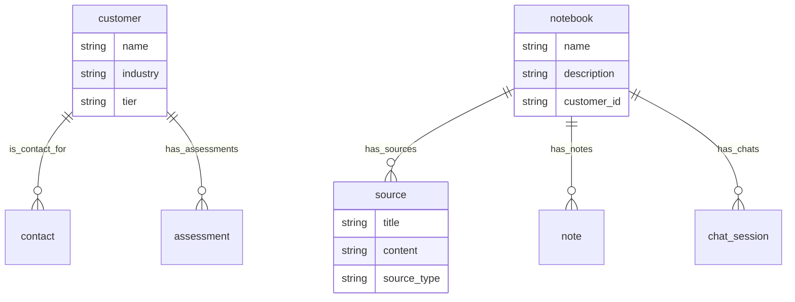

# Principal-Level Architectural Guide

This guide is designed for senior and principal engineers onboarding to the **Tetrel Security (Open Notebook)** platform. It covers structural insights, design trade-offs, graph relational design, and active code paths.

---

## 🏛️ System Architecture

The system utilizes a 3-tier model featuring a Next.js frontend, a FastAPI backend serving REST and Event stream interfaces, and SurrealDB as a multi-model (document + graph + vector) database.

```mermaid
graph TD
    classDef nodeStyle fill:#2d333b,stroke:#6d5dfc,color:#e6edf3;
    classDef subgraphStyle fill:#161b22,stroke:#30363d,stroke-width:1px;

    Browser["Next.js Browser UI"]:::nodeStyle
    
    subgraph AppServer ["Application Container"]
        FastAPI["FastAPI API (api/main.py)"]:::nodeStyle
        Domain["Domain Logic (open_notebook/domain/)"]:::nodeStyle
        Repo["Repository Driver (open_notebook/database/repository.py)"]:::nodeStyle
        FastAPI --> Domain
        Domain --> Repo
    end
    style AppServer fill:#161b22,stroke:#30363d;

    subgraph AudioEngine ["Voice Services Swarm"]
        LiveKit["LiveKit SFU (Port 7880)"]:::nodeStyle
        Kokoro["Kokoro TTS (Port 8880)"]:::nodeStyle
        Whisper["Whisper STT (Port 8881)"]:::nodeStyle
    end
    style AudioEngine fill:#161b22,stroke:#30363d;

    SurrealDB[("SurrealDB (Port 8000)")]:::nodeStyle

    Browser --> FastAPI
    Browser --> LiveKit
    FastAPI --> LiveKit
    FastAPI --> Kokoro
    FastAPI --> Whisper
    Repo --> SurrealDB
```



---

## 🧩 Record-Linked Graph Schema (SurrealQL)

Unlike traditional SQL relations using foreign key tables, or MongoDB using nested subdocuments, SurrealDB represents relations as **graph edges** (`RELATE`) connecting **RecordIDs** (`table:id`). 

The diagram below details the entity relationship schema:



### Core Relational Insight (Pseudocode Comparison)

The database driver utilizes record link queries (`ws://`) to traverse relationships instead of expensive SQL joins. Below is a comparison showing how a relation is established.

#### Python Implementation `(open_notebook/database/repository.py:108)`
```python
async def repo_relate(source: str, relationship: str, target: str, data: Optional[dict] = None) -> list:
    query = f"RELATE {source}->{relationship}->{target} CONTENT $data;"
    return await repo_query(query, {"data": data or {}})
```

#### Go/Rust Comparison (Alternative Portability Reference)
If implementing this database connector in Rust for lower-latency edge operations, the relation builder is expressed as:

```rust
// rust/database/repository.rs
use surrealdb::sql::{Thing, Operator};

pub async fn repo_relate(
    db: &SurrealDbClient,
    source: &Thing,
    edge_label: &str,
    target: &Thing,
    metadata: serde_json::Value
) -> Result<Vec<Record>, Error> {
    let query = format!("RELATE {}->{}->{} CONTENT $data;", source, edge_label, target);
    let mut response = db.query(query).bind(("data", metadata)).await?;
    response.take(0)
}
```

---

## ⚖️ Strategic Design Decisions

### 1. Abstract Voice Services Shim `(api/routers/voice.py:989)`
To run without heavy hardware dependencies, the backend shims provider interfaces:
* Kokoro TTS is exposed via a local FastAPI microservice `(kokoro-tts:8880)` mimicking the OpenAI `/v1/audio/speech` endpoint.
* This allows the same client code block to target local, CPU-based synthesis or switch to cloud services like ElevenLabs.

### 2. Isolated Context Streams `(open_notebook/graphs/chat.py:15)`
* To prevent context window saturation during long-running chats, the system utilizes LangGraph checkpoints.
* Thread IDs map directly to SurrealDB `chat_session` record IDs, isolating the RAG scope to linked document segments.

---

## 📚 Deep-Dive Reading Order

When onboarding to the codebase, read components in this order:
1. **Database Client Setup:** [repository.py](file:///Users/jimmcknney/notebook_tetrel/open_notebook/database/repository.py#L50-L85) (connections and query handling).
2. **Domain Models:** [notebook.py](file:///Users/jimmcknney/notebook_tetrel/open_notebook/domain/notebook.py#L16-L120) (Core entity schemas).
3. **API Router Mapping:** [main.py](file:///Users/jimmcknney/notebook_tetrel/api/main.py#L346-L379) (HTTP routing registration).
4. **CRM Relations:** [customer.py](file:///Users/jimmcknney/notebook_tetrel/open_notebook/domain/customer.py#L9-L45) (Compliance and metadata logic).
5. **Audio Pipeline:** [voice.py](file:///Users/jimmcknney/notebook_tetrel/api/routers/voice.py#L257-L320) (LiveKit tokens and synthesis).
