# Publications & SMTP Gateway Subsystem

This document covers the **Publications & SMTP Gateway Subsystem** of the Tetrel Security (Open Notebook) platform. This subsystem manages multi-channel content scheduling (email, LinkedIn, Twitter), SMTP routing, and background engagement metrics analysis.

---

## 🗺️ Publications Map of Content (MOC)

* **[Subsystem Architecture](#-subsystem-architecture):** Process diagram of publication scheduling and analytical updates.
* **[Database Schema Mappings](#-database-schema-mappings):** Table models representing email settings, scheduled posts, and metrics.
* **[Analytical Aggregation Metrics](#-analytical-aggregation-metrics):** Query pipelines for CTR and reach statistics.
* **[Background Ingestion Worker](#-background-ingestion-worker):** Periodical tasks for polling APIs and simulating engagement.
* **[API Endpoint Reference](#-api-endpoint-reference):** Endpoint catalogue for scheduling, configuration, and logs.

---

## 🧭 Subsystem Architecture

The publications subsystem coordinates manual inputs, SMTP relays, and social API connectors. A background worker periodically queries channel platforms to track post reach, charting timeseries graphs on the analytics dashboards.

```mermaid
graph TD
    classDef nodeStyle fill:#2d333b,stroke:#6d5dfc,color:#e6edf3;
    classDef workerStyle fill:#161b22,stroke:#6d5dfc,stroke-width:1px;

    Client["React Content Calendar<br/>(frontend/src/app)"]:::nodeStyle
    API["Publications API Router<br/>(api/routers/publications.py)"]:::nodeStyle
    DB[("SurrealDB Persistence<br/>(scheduled_post Table)")]:::nodeStyle

    subgraph BackgroundJob ["Worker Swarm Engine"]
        CronTask["Background Worker Cycle<br/>(publication_worker.py)"]:::workerStyle
        ChannelAPI["External Platforms<br/>(SMTP, Twitter, LinkedIn Graph)"]:::workerStyle
        HistoryLogs[("Metrics Logs Table<br/>(publication_metrics_history)")]:::nodeStyle
        
        CronTask -->|Fetch Published Posts| DB
        CronTask -->|Query Platform Metrics| ChannelAPI
        CronTask -->|Append Snapshot Record| HistoryLogs
    end
    style BackgroundJob fill:#161b22,stroke:#30363d;

    Client -->|POST /schedule| API
    API -->|Write Config & Status| DB
    API -->|Trigger Manual Check| CronTask
```



---

## 🧬 Database Schema Mappings

The persistence configurations reside in the SurrealDB layer. The schemas are defined as fully typed structs.

### 1. SMTP Settings table `(migrations/35.surrealql:1)`
Stores SMTP servers, ports, credentials, and OAuth tokens for external document and presentation integrations:

```sql
-- open_notebook/database/migrations/35.surrealql:1
DEFINE TABLE email_setting SCHEMAFULL;
DEFINE FIELD smtp_host ON email_setting TYPE option<string>;
DEFINE FIELD smtp_port ON email_setting TYPE option<int>;
DEFINE FIELD smtp_username ON email_setting TYPE option<string>;
DEFINE FIELD smtp_password ON email_setting TYPE option<string>;
DEFINE FIELD use_tls ON email_setting TYPE option<bool> DEFAULT true;
DEFINE FIELD oauth_provider ON email_setting TYPE option<string>;
DEFINE FIELD oauth_token_ref ON email_setting TYPE option<string>;
```

### 2. Scheduled Post table `(migrations/35.surrealql:12)`
Models social media and email publication posts, validation rules, and engagement statistics:

```sql
-- open_notebook/database/migrations/35.surrealql:12
DEFINE TABLE scheduled_post SCHEMAFULL;
DEFINE FIELD channel ON scheduled_post TYPE string ASSERT $value IN ["linkedin", "twitter", "email"];
DEFINE FIELD title ON scheduled_post TYPE string;
DEFINE FIELD content ON scheduled_post TYPE string;
DEFINE FIELD media_urls ON scheduled_post TYPE array<string> DEFAULT [];
DEFINE FIELD scheduled_time ON scheduled_post TYPE datetime;
DEFINE FIELD status ON scheduled_post TYPE string ASSERT $value IN ["draft", "queued", "published", "failed"];
DEFINE FIELD views ON scheduled_post TYPE int DEFAULT 0;
DEFINE FIELD clicks ON scheduled_post TYPE int DEFAULT 0;
DEFINE FIELD interactions ON scheduled_post TYPE int DEFAULT 0;
```

---

## 🛠️ Analytical Aggregation Metrics

Analytics endpoints aggregate views, clicks, and interactions across channels. The backend calculates click-through rates (CTR) dynamically using raw database records.

### CTR Mathematical Aggregator `(api/routers/publications.py:327)`
The aggregated dashboard values are calculated directly within the router logic:

$$CTR = \frac{\sum Clicks}{\sum Views} \times 100$$

```python
# api/routers/publications.py:327
total_views = 0
total_clicks = 0
total_interactions = 0
by_channel = {}

for post in res:
    views = post.get("views", 0)
    clicks = post.get("clicks", 0)
    interactions = post.get("interactions", 0)
    channel = post.get("channel", "unknown")

    total_views += views
    total_clicks += clicks
    total_interactions += interactions

    if channel not in by_channel:
        by_channel[channel] = {"views": 0, "clicks": 0, "interactions": 0}

    by_channel[channel]["views"] += views
    by_channel[channel]["clicks"] += clicks
    by_channel[channel]["interactions"] += interactions

ctr = 0.0
if total_views > 0:
    ctr = round((total_clicks / total_views) * 100, 2)
```

---

## 🔄 Background Ingestion Worker

The worker routine `track_published_post_metrics` in [publication_worker.py](file:///Users/jimmcknney/notebook_tetrel/open_notebook/tasks/publication_worker.py) updates metric counters.

### Real vs. Sandbox Query Paths `(open_notebook/tasks/publication_worker.py:41)`
The worker switches behavior based on the credential configuration:
1. **Production Mode:** If an API key is configured (and does not begin with the `"sandbox"` prefix), it connects to the Twitter or LinkedIn Graph endpoints.
2. **Sandbox Mode:** If the credential maps to a sandbox mock or is missing, the worker simulates engagement growth using random increments:

```python
# open_notebook/tasks/publication_worker.py:36
# Default metric increments representing periodic updates (sandbox/dev fallback)
views_inc = random.randint(10, 100)
clicks_inc = random.randint(1, 20)
interactions_inc = random.randint(0, 10)

new_views = current_views + views_inc
new_clicks = current_clicks + clicks_inc
new_interactions = current_interactions + interactions_inc

# Update post and log history entry
await repo_update("scheduled_post", post_id, {
    "views": new_views,
    "clicks": new_clicks,
    "interactions": new_interactions,
    "updated_at": datetime.now(timezone.utc)
})
```

---

## 📋 API Endpoint Reference

The controller endpoints are registered under the `/api/publications` router:

| Method | Endpoint Path | Payload Schema | Description |
| :--- | :--- | :--- | :--- |
| `GET` | `/api/publications/settings` | None | Fetch SMTP parameters `(api/routers/publications.py:26)` |
| `POST` | `/api/publications/settings` | `EmailSettingsUpdate` | Save or update SMTP setup `(api/routers/publications.py:75)` |
| `POST` | `/api/publications/settings/test` | `EmailSettingsUpdate` | Sandbox SMTP pre-flight test `(api/routers/publications.py:107)` |
| `POST` | `/api/publications/schedule` | `ScheduledPostCreate` | Schedule a post `(api/routers/publications.py:125)` |
| `PUT` | `/api/publications/schedule/{id}` | `ScheduledPostUpdate` | Modify scheduled post `(api/routers/publications.py:179)` |
| `DELETE` | `/api/publications/schedule/{id}` | None | Cancel scheduled post `(api/routers/publications.py:232)` |
| `GET` | `/api/publications/calendar` | Query: `start_date`, `end_date` | Fetch range-filtered calendar posts `(api/routers/publications.py:255)` |
| `GET` | `/api/publications/metrics` | None | Get CTR & engagement totals `(api/routers/publications.py:319)` |
| `GET` | `/api/publications/metrics/history` | None | Retrieve Timeseries metrics log `(api/routers/publications.py:367)` |
| `POST` | `/api/publications/metrics/track-due` | None | Run background cycle manually `(api/routers/publications.py:391)` |

---

## 🔗 Related Documentation Pages

* **[MOC Master Index Map](index.md)**
* **[Developer Setup & Build Guide](developer-guide.md)**
* **[SurrealDB Schemas & Migrations](database-schema.md)**
* **[Multi-Agent & Skills Subsystem](agent-subsystem.md)**
