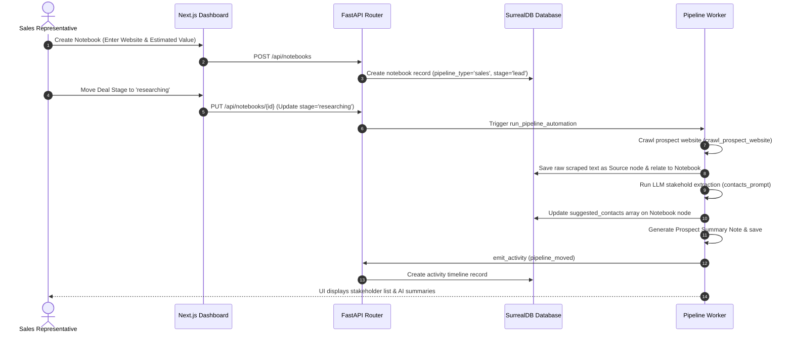

# How-To Guide: Sales, CRM, & Lead Prospecting

This operations guide provides step-by-step practical instructions for managing the sales funnel, provisioning prospects, running automated website scraping, extracting stakeholders, and auditing activities timelines.

---

## 🗺️ Sales & Prospecting MOC

* **[CRM Setup & Prospect Provisioning](#-crm-setup--prospect-provisioning):** Provisioning new B2B accounts.
* **[Automated Prospect Web Crawling](#-automated-prospect-web-crawling):** Ingesting content from corporate landing pages.
* **[AI Stakeholder & Contact Extraction](#-ai-stakeholder--contact-extraction):** Identifying executive decision-makers.
* **[Kanban Funnel Stage Management](#-kanban-funnel-stage-management):** Managing deals and pipeline rules.
* **[Logging & Auditing Prospect Activities](#-logging--auditing-prospect-activities):** Reviewing timeline ledgers.

---

## 🧭 Pipeline Flow Sequence

The diagram below details the sequence of events from adding a new B2B prospect to automated crawler scraping, extraction, and ledger logs:



---

## 📂 CRM Setup & Prospect Provisioning

To initialize a new B2B sales prospect, you create a Notebook workspace. 

### Step-by-Step Instructions:
1. Navigate to the **Sales Pipeline** (`/pipeline`) or the **Notebooks** workspace directory on the frontend sidebar.
2. Click **New Notebook** to trigger the creation modal.
3. Fill in the following critical sales-specific properties:
   * **Notebook Name:** The name of the target prospect company (e.g. `Acme Industrial`).
   * **Prospect Website:** The base URL of the company (e.g. `acme-industrial.com`).
   * **Estimated Value:** The dollar amount estimate of the potential deal.
   * **Pipeline Type:** Ensure this is set to **Sales** to enable lead-tracking features.
4. Click **Create** to trigger the API request.

### Codebase Citations:
* **Notebook Sales Schema:** Mapped inside the `Notebook` class `(open_notebook/domain/notebook.py:16)`.
* **Database Entry:** The creation route `POST /api/notebooks` calls `repo_create` to save the deal parameters `(api/routers/notebooks.py:209)`.

---

## 🌐 Automated Prospect Web Crawling

When you advance a prospect through the sales funnel, Open Notebook automatically scrapes the prospect's public website to ingest raw content.

### Step-by-Step Instructions:
1. Navigate to the prospect's notebook workspace.
2. Advance the pipeline stage to **Researching** or **Discovery** (which triggers the active crawl rule).
3. The background thread grabs the `prospect_website` property and runs a scraping task.
4. The scraper strips out scripts, CSS, headers, and footers, keeping the clean text contents (limited to 40,000 characters).
5. The crawled output is written as a first-class `Source` document, related to the notebook via the `reference` edge, and queued for background indexing.

### Codebase Citations:
* **Background Scraper Task:** Mapped inside `crawl_prospect_website` `(open_notebook/domain/pipeline_worker.py:26)`.
* **HTML Parsing Rules:** Utilizes BeautifulSoup to strip nav/headers `(open_notebook/domain/pipeline_worker.py:43)`.
* **First-Class Ingestion:** Saves source and triggers vectorization:
  ```python
  # open_notebook/domain/pipeline_worker.py:265
  source = Source(
      title=f"Scraped Webpage: {source_url}",
      full_text=clean_text,
      asset=Asset(url=source_url)
  )
  await source.save()
  await source.add_to_notebook(notebook_id)
  await source.vectorize()
  ```

---

## 👥 AI Stakeholder & Contact Extraction

After crawling the website, the pipeline automatically processes the text to identify executive decision-makers, email addresses, and roles.

### Step-by-Step Instructions:
1. The background pipeline passes the scraped website text to the designated LLM model.
2. A structured JSON-parsing prompt extracts stakeholders with their names, titles, and email addresses.
3. The pipeline saves the extracted JSON array directly into the `suggested_contacts` field of the notebook.
4. Navigate to the **Contacts** tab on the notebook's dashboard.
5. Review the list of suggested contacts. Click **Approve** on any contact to convert them into a first-class CRM contact related to the customer entity.

### Codebase Citations:
* **Stakeholder Extraction Logic:** Mapped in `run_pipeline_automation` `(open_notebook/domain/pipeline_worker.py:279)`.
* **Extraction Prompt:**
  ```python
  # open_notebook/domain/pipeline_worker.py:280
  contacts_prompt = (
      "Identify key stakeholders, contacts, or executive leaders mentioned in the following text. "
      "Return them strictly as a JSON list of objects, where each object has keys: 'name', 'role', 'email'..."
  )
  ```

---

## 🔄 Kanban Funnel Stage Management

The deal pipeline behaves according to stage transition rules.

### Step-by-Step Instructions:
1. Navigate to the **Sales Pipeline** kanban dashboard `/pipeline`.
2. The board organizes deals into columns: `Lead`, `Contacted`, `Meeting Scheduled`, `Proposal Sent`, `Negotiations`, and `Closed Won`/`Closed Lost`.
3. Drag and drop a card from one column to another. This calls the `PUT /api/notebooks/{id}` endpoint to update the stage parameter in the database.
4. When a stage is updated, the FastAPI controller checks for registered `PipelineRule` settings mapping the new stage to an action.
5. If rules exist (e.g. crawl on `lead`, search on `meeting`), it fires background worker threads to automate research.

### Codebase Citations:
* **Background Rule Lookup:** Fetches rule templates from `PipelineRule` schema `(open_notebook/domain/pipeline_rule.py:10)`.
* **Router Stage Check:** Updates stage and spawns background tasks:
  ```python
  # api/routers/notebooks.py:601
  if stage_changed:
      from open_notebook.domain.pipeline_worker import run_pipeline_automation
      background_tasks.add_task(run_pipeline_automation, notebook.id, new_stage)
  ```

---

## 📈 Logging & Auditing Prospect Activities

Every action taken on a prospect is recorded in the activity ledger, allowing the team to audit sales actions.

### Step-by-Step Instructions:
1. Open the prospect's notebook workspace.
2. Click on the **Activities** tab to view the timeline ledger.
3. The ledger lists events in chronological order, such as:
   * `stage_changed` (deal progressed from Lead to Discovery).
   * `source_added` (website crawled successfully).
   * `contact_added` (new contact approved).
   * `email_sent` (communications logged).
4. For automated events, the actor is logged as `system`. For manual actions, it logs the user ID.

### Codebase Citations:
* **Timeline Events List:** Allowed values are mapped in `ACTIVITY_TYPES` `(api/routers/activities.py:24)`.
* **Activity Creation API:** Endpoints handle payload validation:
  ```python
  # api/routers/activities.py:46
  class ActivityCreate(BaseModel):
      customer_id: str
      activity_type: str
      description: str
      metadata: dict = {}
      actor: str = "system"
  ```

---

## 🔗 Related Documentation Pages

* **[MOC Master Index Map](index.md)**
* **[Developer Setup & Test Guide](developer-guide.md)**
* **[Content Generation & Publications Guide](content-scheduling-guide.md)**
* **[Deep Research Operations Guide](deep-research-guide.md)**
* **[SurrealDB Schema & Migrations](database-schema.md)**
