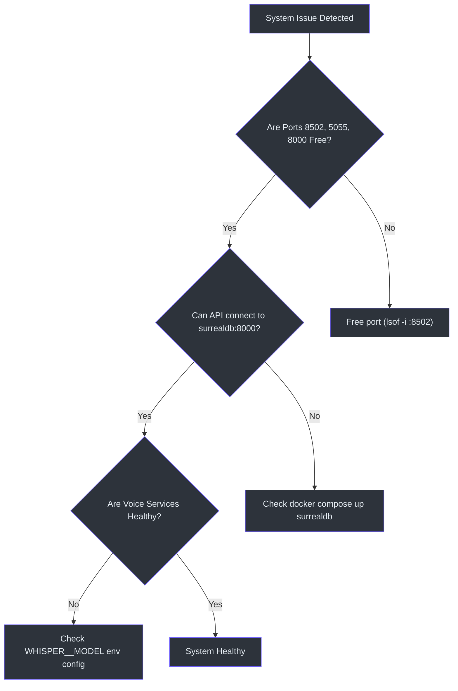
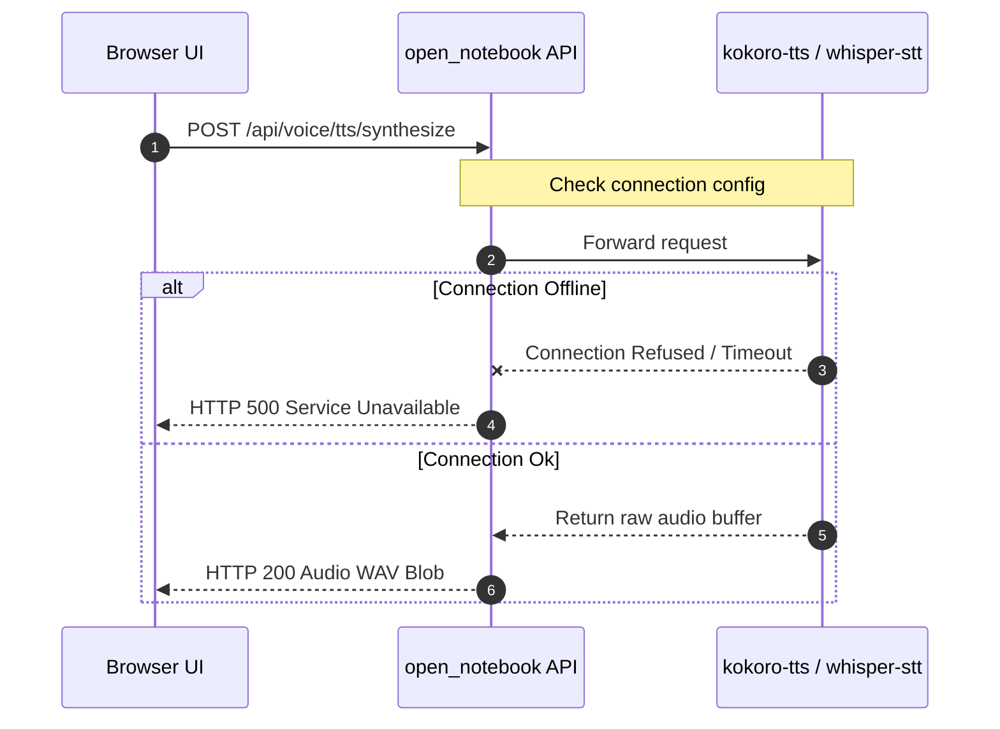

# Troubleshooting & Debugging Guide

This guide describes known error states and provides step-by-step resolution pathways.

---

## 🚦 Common Problems & Diagnostics Flow

Use this flow to isolate container issues:



---

## 🚫 Specific Error Resolution Pathways

### 1. Port Conflicts (Address Already In Use)
If Docker or Python host servers fail to bind sockets:
* **SurrealDB (Port 8000):** Conflict with existing SurrealDB or local webservers `(docker-compose.yml:7)`.
* **FastAPI Backend (Port 5055):** Conflict with local development processes `(docker-compose.yml:28)`.
* **Next.js Frontend (Port 8502):** Conflict with parallel Node servers `(docker-compose.yml:27)`.

**Resolution Command:**
```bash
# Locate PID blocking port 8502
lsof -i :8502
# Terminate blocking process
kill -9 <PID>
```

---

## 🔌 Database Connection Failure

If FastAPI starts but logs `connection refused` or `database offline` errors:
* **Root Cause:** The database address environment parameter `SURREAL_URL` `(docker-compose.yml:35)` is incorrect or the DB is initializing slowly.
* **Troubleshooting Command:**
  ```bash
  # Check SurrealDB health status
  docker compose ps surrealdb
  
  # Connect to database shell to verify schemas
  docker compose exec surrealdb /surreal sql --endpoint http://localhost:8000 --ns open_notebook --db open_notebook
  ```

---

## 🎙️ Voice Service Timeouts (Kokoro & Whisper)

If Voice Lab pages return `504 Gateway Timeout` or generation fails:
* **Kokoro TTS Offline:** Kokoro TTS container fails to download model weights or CPU execution times out `(docker-compose.yml:71)`.
* **Whisper Model Mismatch:** Whisper STT fails to load the specified faster-whisper model `(docker-compose.yml:86)`.



**Resolution Action:**
1. Check configured Whisper model environment variables `(docker-compose.yml:42)`.
2. Inspect supervisor logs for Voice API checks: `(api/routers/voice.py:989)`.
3. Restart audio service containers:
   ```bash
   docker compose restart kokoro-tts whisper-stt
   ```
