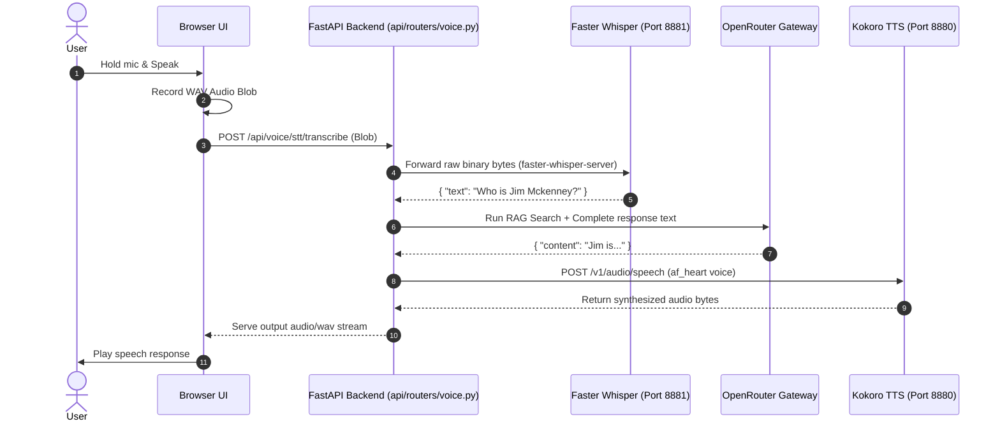

# Voice AI & RAG Subsystem

This document details the audio pipeline architecture, covering LiveKit integration, local faster-whisper transcription, Kokoro synthesis, and client-side hooks.

---

## 🧭 Architectural Overview

The Voice Subsystem provides low-latency, bi-directional audio chat mapped to document knowledge bases. It supports three distinct modes:
1. **Direct Web UI Recording:** Record blob chunks, send to FastAPI for STT, query LLM, synthesize response, and play WMA file.
2. **Pre-flight Lab Verification:** Connectivity and provider diagnostic scripts.
3. **WebRTC Streaming RAG:** Stateful LiveKit agents listening and streaming back audio tokens.

---

## 🔄 Voice Processing Pipelines

Below are the key execution flows for audio transcription and synthesis:

### 1. Simple Voice Chat Lifecycle (HTTP REST)
This flow handles standard click-to-talk audio questions:

### 2. LiveKit WebRTC Session Loop (RTC Streaming)
For real-time streaming, the client creates a socket connection directly to the Selective Forwarding Unit (SFU):

```mermaid
graph TD
    classDef nodeStyle fill:#2d333b,stroke:#6d5dfc,color:#e6edf3;
    classDef streamStyle fill:#161b22,stroke:#30363d,stroke-width:1px;

    Client["Client Browser"]:::nodeStyle
    Token["POST /api/voice/token"]:::nodeStyle
    LK["LiveKit Server SFU (Port 7880)"]:::nodeStyle
    Agent["Voice Agent Worker"]:::nodeStyle

    Client -->|1. Request RTC Token| Token
    Token -->|2. Generate JWT Secret| Client
    Client -->|3. Establish WebRTC Connect| LK
    LK -->|4. Dispatch Track Event| Agent
    Agent -->|5. Listen & Stream Audio Track| Client
```

---

## 🎛️ Subsystem Components

### 1. Backend Route Managers
The subsystem is composed of three backend routers registered in [main.py](file:///Users/jimmcknney/notebook_tetrel/api/main.py#L346-L379):
* **[voice.py](file:///Users/jimmcknney/notebook_tetrel/api/routers/voice.py):** Audio transcription `(api/routers/voice.py:998)`, preflight checks `(api/routers/voice.py:852)`, and voice registry config.
* **[voice_rag.py](file:///Users/jimmcknney/notebook_tetrel/api/routers/voice_rag.py):** Coordinates graph RAG contexts for the conversational audio agent.
* **[voice_sessions.py](file:///Users/jimmcknney/notebook_tetrel/api/routers/voice_sessions.py):** Manages voice session persistence `(api/routers/voice_sessions.py:139)`, and saves transcripts as text notes `(api/routers/voice_sessions.py:323)`.

### 2. Custom Frontend Hooks
* **[useVoiceSessions](file:///Users/jimmcknney/notebook_tetrel/frontend/src/lib/hooks/use-voice-sessions.ts#L39-L114):** Manages voice sessions CRUD, listing sessions, creating and deleting audio threads.
* **[useVoiceSession](file:///Users/jimmcknney/notebook_tetrel/frontend/src/lib/hooks/use-voice-sessions.ts#L116-L145):** Handles single-session load and fetch messaging updates.
* **[useVoiceRegistry](file:///Users/jimmcknney/notebook_tetrel/frontend/src/lib/hooks/use-voice-registry.ts#L1):** Retrieves available voices from the local Kokoro engine.

---

## 📋 API Endpoints Summary

| Method | Endpoint Path | Source Location | Purpose |
| :--- | :--- | :--- | :--- |
| `POST` | `/api/voice/stt/transcribe` | `(api/routers/voice.py:998)` | Transcribes input audio files |
| `POST` | `/api/voice/tts/synthesize` | `(api/routers/voice.py:346)` | Synthesizes speech using Kokoro/OpenAI |
| `POST` | `/api/voice/token` | `(api/routers/voice.py:279)` | Generates room authentication token for LiveKit |
| `GET` | `/api/voice/sessions` | `(api/routers/voice_sessions.py:77)` | Lists all historical voice session lists |
| `POST` | `/api/voice/sessions/{id}/save-as-note` | `(api/routers/voice_sessions.py:323)` | Saves audio transcript as a standard note |

---

## ⚙️ Configuration & Deployment Modes

The WebRTC streaming agent handles voice interaction dynamically based on settings configurable on the **Admin Configuration Pages**:

### 1. Local Mode (Default)
* **WebSocket URL:** Defaults to `ws://localhost:7880` (or `ws://livekit-server:7880` internally within the Docker bridge network).
* **Credentials:** Signed using system environment variables (`LIVEKIT_API_KEY`, `LIVEKIT_API_SECRET`, and `LIVEKIT_WS_URL`).
* **Use Case:** Local host testing and single-machine desktop development.

### 2. Remote Self-Hosted Mode
* **WebSocket URL:** User-defined remote endpoint (e.g. `wss://livekit.my-remote-server.com`).
* **Credentials:** User-entered API Key and API Secret (stored securely in SurrealDB).
* **Token Generation:** The `/api/voice/token` endpoint dynamically detects the remote mode, signs the WebRTC JWT token with the remote credentials, and returns the remote WebSocket URL to the client.
* **Worker Integration:** The Python voice agent worker ([voice_agent.py](file:///Users/jimmcknney/notebook_tetrel/api/voice_agent.py)) queries `/api/voice/settings` on startup and overrides its own environment variables with the remote host settings to register with the remote server.
