# Zero-to-Hero Learning Path

This guide is structured to take a developer from zero knowledge of the **Tetrel Security** stack to a confident contributor.

---

## 🗺️ Part I: Technology Foundations

To understand this codebase, you should have a solid grasp of the core libraries and tools used in both the backend and frontend.

### Stack Comparison: Python Backend vs. TypeScript Frontend

| Layer | Python Backend `(api/main.py:1)` | TypeScript Frontend `(frontend/package.json:1)` |
| :--- | :--- | :--- |
| **Framework** | FastAPI (Async endpoints, Pydantic data modeling) | Next.js 15 (App Router, Server-side rendering) |
| **State** | Stateless requests, LangGraph memory states | Zustand client stores, TanStack React Query cache |
| **HTTP client** | `httpx` async client | `axios` client instance `(frontend/src/lib/api/client.ts:10)` |
| **Testing** | `pytest` test suites | `vitest` unit tests |

---

## 🧭 Part II: Codebase Architecture

```mermaid
graph TD
    classDef nodeStyle fill:#2d333b,stroke:#6d5dfc,color:#e6edf3;
    classDef subgraphStyle fill:#161b22,stroke:#30363d,stroke-width:1px;

    UI["Next.js App UI (src/app/)"]:::nodeStyle
    API["Axios API Clients (src/lib/api/)"]:::nodeStyle
    Hooks["React Hooks (src/lib/hooks/)"]:::nodeStyle
    FastAPI["FastAPI Handler (api/routers/)"]:::nodeStyle
    Domain["Domain Object Models (open_notebook/domain/)"]:::nodeStyle
    Repo["SurrealDB Repository (database/repository.py)"]:::nodeStyle

    UI --> Hooks
    Hooks --> API
    API -->|HTTP REST| FastAPI
    FastAPI --> Domain
    Domain --> Repo
```

### 1. The Persistence Layer `(open_notebook/database/repository.py:67)`
All persistence operations pass through the SurrealQL repository. Because SurrealDB handles graph queries natively, relations are established using the `RELATE` statement instead of traditional joins.

### 2. Domain Models `(open_notebook/domain/notebook.py:16)`
Object models are declared using Pydantic templates and inherit from `ObjectModel` (which wraps database save/update/delete operations).

---

## 🛠️ Part III: Development & navigation

### Core navigation Checklist
* **Backend Endpoints:** Defined under [api/routers/](file:///Users/jimmcknney/notebook_tetrel/api/routers/).
* **Frontend Pages:** Defined under [frontend/src/app/(dashboard)/](file:///Users/jimmcknney/notebook_tetrel/frontend/src/app/%28dashboard%29/).
* **Axios API Clients:** Defined under [frontend/src/lib/api/](file:///Users/jimmcknney/notebook_tetrel/frontend/src/lib/api/).
* **Custom React Hooks:** Defined under [frontend/src/lib/hooks/](file:///Users/jimmcknney/notebook_tetrel/frontend/src/lib/hooks/).

---

## 📖 Appendix: 41-Term Glossary

### AI & Retrieval-Augmented Generation (RAG)
1. **RAG (Retrieval-Augmented Generation):** Enhancing LLM outputs by injecting relevant document snippets into the prompt context prior to synthesis.
2. **Vector Embedding:** A numerical representation of text semantics. Generated via embedding model `(open_notebook/domain/notebook.py:259)`.
3. **Cosine Similarity:** A metric calculation used to find text segments with similar semantic vectors inside SurrealDB.
4. **Reranking:** Passing similarity matches through a secondary Cross-Encoder (e.g. Cohere, Qwen3-Reranker) to evaluate precise relevance.
5. **OpenRouter:** A multi-model API gateway hosting cloud LLMs (GPT-4o, Claude 3.5, Gemini, DeepSeek).
6. **Ollama:** A local inference server running open models offline (Llama 3, Qwen) on local hardware.
7. **SSE (Server-Sent Events):** A unidirectional streaming protocol used to stream AI text tokens in real time.
8. **LangGraph:** An orchestration framework used to represent multi-agent pipelines as state graphs `(open_notebook/graphs/chat.py:15)`.

### Voice AI
9. **LiveKit SFU:** WebRTC Selective Forwarding Unit mapping audio packets between client browsers and voice agents.
10. **Kokoro:** A fast, CPU-optimized Text-to-Speech synthesis server `(api/routers/voice.py:989)`.
11. **Faster Whisper:** A high-throughput speech-to-text transcription engine.
12. **TTS (Text-to-Speech):** Synthesizing spoken audio streams from plain text.
13. **STT (Speech-to-Text):** Transcribing audio waveforms to text strings.
14. **Preflight Check:** Network and latency checks executing before audio channel setup `(api/routers/voice.py:852)`.
15. **Audio Blob:** Binary voice fragments transmitted to Whisper for transcription.

### Database & SurrealDB
16. **SurrealQL:** The query language of SurrealDB, extending SQL with graph and vector operations.
17. **RecordID:** A unique table-key pairing representing database records (e.g., `notebook:abc123`).
18. **Record Link:** Direct link from one database node to another, avoiding traditional foreign-key tables.
19. **SurrealDB Migrations:** CodeQL/SurrealQL scripts detailing schema versions (1 through 38).
20. **Cos-Distance:** Distance metric used in SurrealDB vector index matching.
21. **Single-tenant:** An application deployment model serving a single user/customer, ensuring data isolation.

### Compliance & Auditing (CISA CSET)
22. **CISA CSET:** Cybersecurity and Infrastructure Security Agency's Cybersecurity Evaluation Tool.
23. **Purdue Model:** An industrial control system (ICS) architecture dividing security zones into levels (0 through 5).
24. **NERC CIP:** North American Electric Reliability Corporation Critical Infrastructure Protection standards.
25. **IEC 62443:** International standards for industrial communication networks security.
26. **NIST SP 800-53:** Security and privacy controls catalog for federal information systems.
27. **YES/NO/N\/A/ALT:** Valid question response options in the compliance assessment wizard `(api/routers/assessments.py:429)`.
28. **16 Infrastructure Sectors:** CISA's critical sectors (Energy, Water, Defense, Financial, etc.) mapped to frameworks.
29. **Radar Spider Chart:** Radar chart mapping relative framework compliance scores across assessment categories.
30. **Remediation Roadmap:** A prioritized list of security controls currently failing auditing criteria.
31. **Milestone Carry-Forward:** Loading previous session answers to track assessment progress.

### B2B CRM & Publications
32. **Customer Dossier:** Comprehensive customer view showing contacts, projects, threats, and compliance logs.
33. **Customer Ledger:** A timeline ledger containing actions, audits, and events for a customer.
34. **Pipeline Kanban:** A drag-and-drop board tracking deals across 7 stages (Lead to Closed).
35. **SMTP Gateway:** Mail transfer protocols used to publish newsletters and alerts.
36. **Scheduled Post:** Post scheduled for publishing at a specific datetime `(api/routers/publications.py:438)`.
37. **Metrics Snapshot:** Historic snapshots tracking publication reach metrics over time.

### System & Frontend UI
38. **Zustand Store:** Global frontend state stores (e.g., sidebar collapsed state).
39. **React Query:** Front-end cache handling fetch queries and invalidations.
40. **Axios Client:** Base client handler configured with dynamic timeouts and interceptors.
41. **supervisord:** A process manager running backend services inside Docker.
