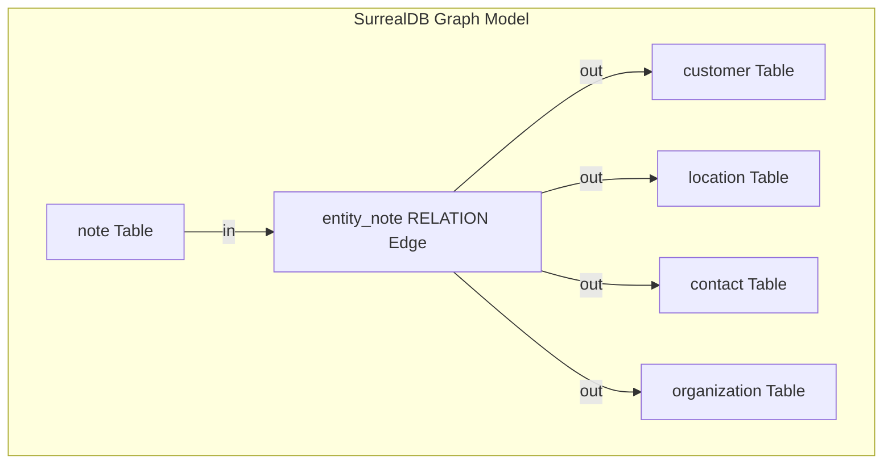

# SurrealDB Option A: Graph-Relation Entity Notes Architecture

This document describes the design and implementation specifications for **Option A (Graph RELATION edges)** to link notebooks, notes, and various operational entities (e.g. Customers, Locations, Contacts, Organizations) in SurrealDB v2. 

---

## 1. Architecture Decisions

### 1.1 Option A (Graph Relations) vs. Option B (Foreign Keys)
Option A is adopted to maintain consistency with the existing graph edge pattern in the Tetrel codebase (e.g., `note -> notebook` via the `artifact` relation). 

*   **Option A (Graph RELATION Edges):**
    *   Creates a dedicated relation table (`entity_note`) connecting `note` to destination records (`customer`, `location`, `contact`, `organization`).
    *   **Pros:** Native graph traversals (`customer->entity_note->note`), decoupled note schema (the `note` table remains clean and entity-agnostic), multi-target linking (a single note can connect to multiple different entity types simultaneously without schema alterations), and strict relationship constraints.
*   **Option B (Flat Foreign Keys):**
    *   Adds string fields like `entity_id` and `entity_type` directly to the `note` table.
    *   **Cons:** Harder to manage multi-entity associations, requires complex joint indexing, and bypasses SurrealDB's native graph traversal optimization.



---

## 2. SurrealDB Schema Definitions (SurrealQL)

The following schema defines the tables and relation edges in SurrealDB v2.

### 2.1 Table: `note`
The `note` table stores the core textual content, metadata, and tenant organization association.

```surrealql
-- Schema definition for note table
DEFINE TABLE note SCHEMAFULL;

DEFINE FIELD title ON TABLE note TYPE string;
DEFINE FIELD content ON TABLE note TYPE string;
DEFINE FIELD organization ON TABLE note TYPE record<organization>;
DEFINE FIELD created_by ON TABLE note TYPE record<user>;
DEFINE FIELD created_at ON TABLE note TYPE datetime DEFAULT time::now();
DEFINE FIELD updated_at ON TABLE note TYPE datetime DEFAULT time::now() VALUE time::now();

-- Indexes for search and isolation
DEFINE INDEX idx_note_org ON TABLE note COLUMNS organization;
DEFINE INDEX idx_note_created ON TABLE note COLUMNS created_at;
```

### 2.2 Table: `entity_note` (RELATION Edge)
The relation table links notes (`FROM note`) to specific entity records (`TO customer | location | contact | organization`).

```surrealql
-- Graph relation table linking notes to various entity targets
DEFINE TABLE entity_note TYPE RELATION 
    FROM note 
    TO customer | location | contact | organization;

-- Ensure that the 'in' and 'out' fields are properly typed
DEFINE FIELD in ON TABLE entity_note TYPE record<note>;
DEFINE FIELD out ON TABLE entity_note TYPE record<customer> | record<location> | record<contact> | record<organization>;
DEFINE FIELD created_at ON TABLE entity_note TYPE datetime DEFAULT time::now();
DEFINE FIELD created_by ON TABLE entity_note TYPE record<user>;

-- Indexes for fast traversing in both directions
DEFINE INDEX idx_entity_note_in ON TABLE entity_note COLUMNS in;
DEFINE INDEX idx_entity_note_out ON TABLE entity_note COLUMNS out;

-- Concurrency Constraint: Prevent duplicate edges between the same note and entity
DEFINE INDEX entity_note_unique_edge ON TABLE entity_note COLUMNS in, out UNIQUE;
```

---

## 3. Secure Administrative Segregation (OXOT)

To satisfy security boundaries, all administrative and system-wide configurations are separated from customer-facing data structures. The admin panel is designated exclusively for **OXOT (internal super admins)**.

### 3.1 Organization & User Role Mappings
We leverage the tenant structure defined in [docs/SPECIFICATIONS.md](file:///Users/jimmcknney/notebook_tetrel/docs/SPECIFICATIONS.md):
*   **Customer Tenant:** `organization.type == 'customer'`. Users are restricted to their own organizational records.
*   **OXOT Administration (Super Admin):** `organization.type == 'admin'` and user `role == 'super_admin'`. Only these users can view, update, or configure system-wide settings.

### 3.2 SurrealQL Table: `system_config`
The global administrative configuration parameters (such as similarity thresholds, rate limits, and caching parameters) are managed via the `system_config` table. Access is restricted using SurrealQL table-level permissions:

```surrealql
-- Global administrative configurations restricted to OXOT Super Admins
DEFINE TABLE system_config SCHEMAFULL
    PERMISSIONS
        FOR select, create, update, delete WHERE 
            $auth.role == 'super_admin' AND 
            $auth.organization.type == 'admin';

DEFINE FIELD key ON TABLE system_config TYPE string;
DEFINE FIELD value ON TABLE system_config TYPE any;
DEFINE FIELD description ON TABLE system_config TYPE string;
DEFINE FIELD updated_at ON TABLE system_config TYPE datetime DEFAULT time::now() VALUE time::now();
DEFINE FIELD updated_by ON TABLE system_config TYPE record<user>;

-- Primary lookup key
DEFINE INDEX idx_config_key ON TABLE system_config COLUMNS key UNIQUE;
```

### 3.3 Administrative Configuration Parameters
The `system_config` table stores parameters that control system execution behaviors. These include:

| Parameter Key | Type | Default Value | Description |
|---|---|---|---|
| `embedding_similarity_threshold` | `float` | `0.75` | Cosine similarity threshold for pgvector semantic search cache checks. |
| `max_note_size_bytes` | `int` | `1048576` | Maximum size in bytes allowed for a single note (1MB default). |
| `rate_limit_search_per_min` | `int` | `60` | Maximum semantic search queries allowed per user per minute. |
| `cache_ttl_seconds` | `int` | `86400` | TTL in seconds for research corpus semantic embedding cache keys. |
| `auto_healing_enabled` | `bool` | `true` | System-wide toggle to activate/deactivate background container recovery. |

### 3.4 Dynamic Hot-Reloading Configs
The backend service utilizes SurrealDB's **Live Queries** to hot-reload configuration values into memory dynamically without requiring application restarts:

```surrealql
-- Live Query registered by the API data router at startup
LIVE SELECT * FROM system_config;
```
Whenever an OXOT administrator updates a row in `system_config`, SurrealDB pushes the update event to the API gateway, which instantly refreshes its local parameter cache.

---

## 4. Visibility & Observability Strategies

### 4.1 SurrealQL Query Patterns
To traverse note graph relations, we execute optimized graph queries:

#### 4.1.1 Fetch All Notes Associated with a Customer
```surrealql
-- Fetch notes associated with a specific customer using relation traversal
SELECT ->entity_note->note.* FROM customer:company_abc;
```

#### 4.1.2 Fetch All Entities Associated with a Specific Note
```surrealql
-- Traverse backwards from note to get all linked location, customer, or contact records
SELECT out FROM entity_note WHERE in = note:note_xyz;
```

---

### 4.2 Logging Patterns (JSON Format)
All graph transactions (edge creation, traversal, deletion) emit structured JSON log records to stdout for ingestion by Elasticsearch/Loki.

```json
{
  "timestamp": "2026-06-09T03:20:10.892Z",
  "level": "INFO",
  "service": "api-data-router",
  "trace_id": "3af81b22e7d04c1c9811f0a20e0e9834",
  "span_id": "11f067aa0ba902b9",
  "event": "graph_edge_created",
  "details": {
    "edge_table": "entity_note",
    "from": "note:note_xyz",
    "to": "customer:company_abc",
    "triggered_by": "user:sre_admin_user"
  }
}
```

---

### 4.3 OpenTelemetry (OTel) Tracing
Tracing spans capture edge traversals to measure query execution performance and database latency.

*   **Root Span:** `get_customer_dossier`
    *   **Child Span:** `query_customer_record` (Reads database for base customer info)
    *   **Child Span:** `traverse_entity_notes` (Traverses `entity_note` edges to fetch notes)
        *   **Span Attributes:**
            *   `db.system`: `"surrealdb"`
            *   `db.operation`: `"select_traverse"`
            *   `db.statement`: `"SELECT ->entity_note->note.* FROM customer:..."`
            *   `db.graph.edge.type`: `"entity_note"`
            *   `db.graph.traversal.edges_count`: `12`

---

### 4.4 Observability Metrics
Key metrics are reported to the OpenTelemetry collector with specific metadata configurations:

*   `db.graph.traversal.latency`: Time taken to resolve graph paths. (Unit metadata: `ms`)
*   `db.graph.edges.count`: Total count of active relation edges inside the database. (Unit metadata: `count`)
*   `db.graph.index.hit_ratio`: Ratio of index scans to sequential scans during traversal operations. (Unit metadata: `percent`)

> [!IMPORTANT]
> All unit metadata is configured at the OpenTelemetry agent/collector level rather than being appended directly to the metric names.

---

## 5. Security & Isolation Verification Plan

To verify that the administrative configuration and graph relations are robust and segregated:

### 5.1 Verification Checklist
- [ ] **Cross-Tenant Leakage Check:** Verify that a user from `organization:company_a` cannot traverse `entity_note` edges belonging to `organization:company_b`.
- [ ] **OXOT Panel Lockdown:** Attempt to access the `system_config` table using credentials from a standard user session (`organization.type == 'customer'`) and verify it throws a permissions error (`403 Forbidden`).
- [ ] **Unique Edge Check:** Attempt to insert a duplicate edge in `entity_note` connecting the same note and customer records, verifying that the SurrealDB unique index constraints reject the write.
